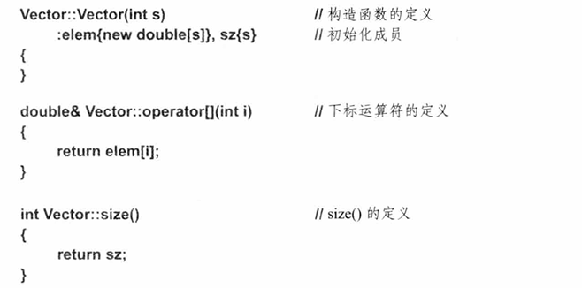
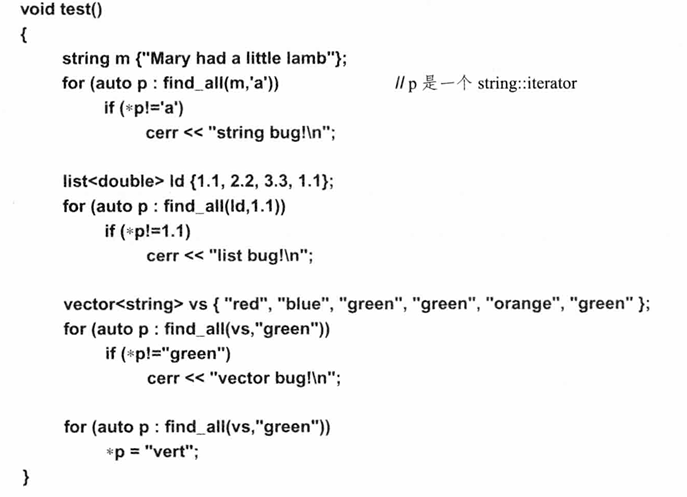
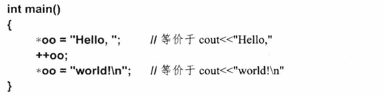

# C++程序语言设计

《C++程序设计语言》（原书第4版）是C++领域最经典的参考书，介绍了C++11的各项新特性和新功能。全书共分四部分。

1. 第一部分（第1～5章）是引言，包括C++的背景知识，C++语言及其标准库的简要介绍；
2. 第二部分（第6～15章）介绍C++的内置类型和基本特性，以及如何用它们构造程序；
3. 第三部分（第16～29章）介绍C++的抽象机制及如何用这些机制编写面向对象程序和泛型程序；
4. 第四部分（第30～44章）概述标准库并讨论一些兼容性问题。

由于篇幅问题，原书中文版分两册出版，分别对应原书的第一至三部分和第四部分，这一册为第一至三部分。

# 前言

## 第四版前言

与C++98标准相比，C++11标准让我可以更清晰、更简洁而且更直接地表达自已的想法。而且，新版本的编译器可以对程序进行更好的检查并生成更快的目标程序。因此，C++11给人的感觉就像是一种新语言一样。

在本书中，我追求完整性（completeness）。我会介绍专业程序员可能需要的每个语言特性和标准库组件。对每个特性或组件，我将给出：

- 基本原理：设计这个特性（组件）是为了帮助解决哪类问题？其设计原理是什么？它有什么根本的局限？
- 规范：它该如何定义？我将以专业程序员为目标读者来选择内容的详略程度，对于要求更高的C++语言研究者，有很多ISO标准的文献可供查阅。
- 例子：当单独使用这个特性或与其他特性组合使用时，如何用好它？其中的关键技术和习惯用法是怎样的？在程序的可维护性和性能方面是否有一些隐含的问题？

多年来，无论是C++语言本身还是它的使用，都已经发生了巨大改变。从程序员的角度，大多数改变都属于语言的改进。与之前的版本相比，当前的ISOC++标准（ISO/IEC14882-2011，通常称为C++11）在编写高质量代码方面无疑是一个好得多的工具。但是它好在哪里？现代C++语言支持什么样的程序设计风格和技术？这些技术靠哪些语言特性和标准库特性来支撑？精练、正确、可维护性好、性能高的C++代码的基本构建单元是怎样的？本书将回答这些关键问题。很多答案已经不同于1985、1995或2005等旧版本的C++语言了：C++在进步。

C++是一种通用程序设计语言，它强调富类型、轻量级抽象的设计和使用。C++特别适合开发资源受限的应用，例如可在软件基础设施中发现的那些应用。那些花费时间学习高质量代码编写技术的程序员将会从C++语言受益良多。C++是为那些严肃对待编程的人而设计的。人类文明已经严重依赖软件，编写高质量的软件非常重要。

目前已经部署的C++代码达到数十亿行，因此程序稳定性备受重视——很多1985年和1995年编写的C++代码仍然运行良好，而且还会继续运行几十年。但是，对所有这些应用程序，都可以用现代C++语言写出更好的版本；如果你墨守成规，将来写出的代码将会是低质量、低性能的。对稳定性的强调还意味着，你现在遵循标准写出的代码，在未来几十年中会运行良好。本书中所有代码都遵循2011ISOC++标准。

本书面向三类读者：

- 想知道最新的ISOC++标准都提供了哪些新特性的C++程序员。
- 好奇C++到底提供了哪些超越C语言的特性的C程序员。
- 具备Java、C#、Python和Ruby等编程语言背景，正在探寻“更接近机器”的语言，即更灵活、提供更好的编译时检查或是更好性能的语言的程序员。

自然，这三类读者可能是有交集的—一个专业软件开发者通常掌握多门编程语言。本书假定目标读者是程序员。如果你想问“什么是for循环？”或是“什么是编译器？”，那么本书现在还不适合你，我向你推荐我的另一本书《C++程序设计原理与实践》，这本书适合作为程序设计和C++语言的入门书籍。而且，我假定读者是较为成熟的软件开发者。如果你的问题是“为什么要费力进行测试？”或者认为“所有语言基本都是一样的，给我看语法就可以了”，甚至确信存在一种适合所有任务的完美语言，那么本书也不适合你。

相对于C++98，C++11提出了哪些改进和新特性呢？适合现代计算机的机器模型会涉及大量并发处理。为此，C++11提供了用于系统级并行编程（如使用多核）的语言和标准库特性。C++11还提供了正则表达式处理、资源管理指针、随机数、改进的容器（包括哈希表）以及其他很多特性。此外，C++11还提供了通用和一致的初始化机制、更简单的for语句、移动语义、基础的Unicode支持、lambda表达式、通用常量表达式、控制类缺省定义的能力、可变参数模板、用户定义的字面值常量和其他很多新特性。请记住，这些标准库和语言特性的目标就是支撑那些用来开发高质量软件的程序设计技术。这些特性应该组合使用一将它们看作盖大楼的砖，而不应该相互隔离地单独使用来解决特定问题。计算机是一种通用机器，而C++在其中起着重要作用。特别是，C++的设计目标就是足够灵活和通用，以便处理那些连它的设计者都未曾想象过的未来难题。

<p align="right">BjarneStroustrup于得克萨斯大学城</p>

## 第三版前言

我觉得用C++编程比以往更令人愉快。在过去这些年里，C++在支持设计和编程方面取得了令人振奋的进步，针对其使用的大量新技术已经被开发出来了。然而，C++并不只是好玩。普通的程序员在几乎所有种类和规模的开发项目上，在生产率、可维护性、灵活性和质量方面都取得了显著的进步。到今天为止，C十十已经实现了我当初期望中的绝大部分，还在许多我原来根本没有梦想过的工作中取得了成功。

本书介绍的是标准C++以及由C++所支持的关键编程技术和设计技术。与本书第1版所介绍的那个C++版本相比，标准C++是一个经过了更仔细推敲的更强大的语言。各种新的语言特征，如名字空间、异常、模板，以及运行时类型识别，使人能以比过去更直接的方式使用许多技术，标准库使程序员能够从比基本语言高得多的层面上起步。

本书第2版中大约有三分之一的内容来自第1版。第3版则重写了更大的篇幅。它提供的许多东西是大部分有经验的程序员也需要的，与此同时，本书也比它的以前版本更容易让新手人门。C++使用的爆炸性增长和由此带来的海量经验积累使这些成为可能。

一个功能广泛的标准库定义使我能以一种与以前不同的方式介绍C++的各种概念。与过去一样，本书对C++的介绍与任何特定的实现都没有关系；与过去一样，教材式的各章还是采用“自下而上”的方式，使每种结构都是在定义之后才使用。无论如何，使用一个设计良好的库远比理解其实现细节容易得多。因此，假定读者在理解标准库的内部工作原理之前，就可以利用它提供许多更实际、更有趣的例子。标准库本身也是程序设计示例和设计技术的丰富源泉。

本书将介绍每种主要的C++语言特征和标准库，它是围绕着语言和库功能组织起来的。当然，各种特征都将在使用它们的环境中介绍。也就是说，这里所关注的是将语言作为一种设计和编程的工具，而不是语言本身。本书将展示那些使C++卓有成效的关键技术，讲述为掌握它们所需要的基本概念。除了专门阐释技术细节的那些地方之外，其他示例都取自系统软件领域。另一本与本书配套出版的书《带标注的C++语言标准》（The Annotated C++ Language Standard)，将给出完整的语言定义，所附标注能使它更容易理解。

本书的基本目标就是帮助读者理解C++所提供的功能将如何支持关键的程序设计技术。这里的目标是使读者能远远超越简单地复制示例并使之能够运行，或者模仿来自其他语言的程序设计风格。只有对隐藏在语言背后的思想有了很好的理解之后，才能真正掌握这个语言。如果有一些具体实现的文档的辅助，这里所提供的信息就足以对付具有挑战性的真实世界中的重要项目。我的希望是，本书能帮助读者获得新的洞察力，使他们成为更好的程序员和设计师。

<p align="right">Bjarne Stroustrup 于新泽西默里山</p>

## 第二版前言

正如在本书的第1版中所承诺的，C++为满足其用户的需要正在不断地演化。这一演化过程得益于许多有着极大的背景差异，在范围广泛的应用领域中工作的用户们的实际经验的指导。在第1版出版后的六年中，C++的用户群体扩大了不止百倍，人们学到了许多东西，发现了许多新技术并通过了实践的检验。这些技术中的一些也在这一版中有所反映。

在过去六年里所完成的许多语言扩展，其基本宗旨就是将C++提升为一种服务于一般性的数据抽象和面向对象程序设计的语言，特别是提升为一个可编写高质量的用户定义类型库的工具。一个“高质量的库”是指这样的库，它以一个或几个方便、安全且高效的类的形式，给用户提供了一个概念。在这个环境中，安全意味着这个类在库的使用者与它的供方之间构成了一个特殊的类型安全的界面；高效意味着与手工写出的C代码相比，这种库的使用不会给用户强加明显的运行时间上或空间上的额外开销。

本书介绍的是完整的C++语言。从第1章到第10章是一个教材式的导引，第11章到第13章展现的是一个有关设计和软件开发问题的讨论，最后包含了完整的C++参考手册。自然，在原来版本之后新加人的特征和变化已成为这个展示的有机组成部分。这些特征包括：经过精化后的重载解析规则和存储管理功能，以及访问控制机制、类型安全的连接、const和static成员函数、抽象类、多重继承、模板和异常处理。

C++是一个通用的程序设计语言，其核心应用领域是最广泛意义上的系统程序设计。此外，C++还被成功地用到许多无法称为系统程序设计的应用领域中。从最摩登的小型计算机到最大的超级计算机上，以及几乎所有操作系统上都有C++的实现。因此，本书描述的是C++语言本身，并不想试着去解释任何特殊的实现、程序设计环境或者库。

本书中给出的许多类的示例虽然都很有用，但也还是应该归到“玩具”一类。与在完整的精益求精的程序中做解释相比，这里所采用的解说风格能更清晰地呈现那些具有普遍意义的原理和极其有用的技术，在实际例子中它们很容易被细节所淹没。这里给出的大部分有用的类，如链接表、数组、字符串、矩阵、图形类、关联数组等，在广泛可用的各种商品和非商品资源中，都有可用的“防弹”或“金盘”版本。那些“具有工业强度”的类和库中的许多东西，实际上不过是在这里可以找到的玩具版本的直接或间接后裔。

与第1版相比，这一版更加强调本书在教学方面的作用。然而，这里的叙述仍然是针对有经验的程序员，并努力不去轻视他们的智慧和经验。有关设计问题的讨论有了很大的扩充，作为对读者在语言特征及其直接应用之外的要求的一种回应。技术细节和精确性也有所增强。特别是，这里的参考手册体现了在这个方向上多年的工作。我的目标是提供一本具有足够深度的书籍，使大部分程序员能在多次阅读中都有所收获。换句话说，这本书给出的是C++语言，它的基本原理，以及使用时所需要的关键性技术。欢迎欣赏！

<p align="right">Bjarne Stroustrup 于新泽西默里山</p>

## 第一版前言

‘C++是一种通用的程序设计语言，其设计就是为了使认真的程序员工作得更愉快。除了一些小细节之外，C++是C程序设计语言的一个超集。C++提供了C所提供的各种功能，还为定义新类型提供了灵活而有效的功能。程序员可以通过定义新类型，使这些类型与应用中的概念紧密对应，从而把一个应用划分成许多容易管理的片段。这种程序构造技术通常被称为数据抽象。某些用户定义类型的对象包含着类型信息，这种对象就可以方便而安全地用在那种对象类型无法在编译时确定的环境中。使用这种类型的对象的程序通常被称为是基于对象的。如果用得好，这些技术可以产生出更短、更容易理解，而且也更容易管理的程序。

C++里的最关键概念是类。一个类就是一个用户定义类型。类提供了对数据的隐藏，数据的初始化保证，用户定义类型的隐式类型转换，动态类型识别，用户控制的存储管理，以及重载运算符的机制等。在类型检查和表述模块性方面，C++提供了比C好得多的功能。它还包含了许多并不直接与类相关的改进，包括符号常量、函数的在线替换、默认函数参数、重载函数名、自由存储管理运算符，以及引用类型等。C++保持了C高效处理硬件基本对象（位、字节、字、地址等）的能力。这就使用户定义类型能够在相当高的效率水平上实现。

C++及其标准库也是为了可移植性而设计的。当前的实现能够在大多数支持C的系统上运行。C的库也能用于C++程序，而且大部分支持C程序设计的工具也同样能用于C++。

本书的基本目标就是帮助认真的程序员学习这个语言，并将它用于那些非平凡的项目。书中提供了有关C++的完整描述，许多完整的例子，以及更多的程序片段。

<p align="right">Bjarne Stroustrup 于新泽西默里山</p>

# 目录

# 第一部分

这一部分会概述C++语言及其标准库的主要概念和特性，还会介绍本书的主要内容并解释本书对语言特性及其使用的描述方式。此外，本部分还会介绍有关C++、C++的设计以及C++的使用的一些背景知识。

“…·而你，马库斯，已经给了我很多；现在我要给你一个忠告：尝试不同的生活，放弃墨守马库斯·科科扎的游戏。你总是过分担心马库斯·科科扎，以至于变成了自己的奴隶和囚犯。你做任何事之前都要考虑会不会影响马库斯·科科扎的幸福和声望。你一直过分害怕马库斯可能做蠢事，或是感到厌烦。但这真的重要吗？世上所有人都会做蠢事我希望你放轻松，希望你的小心脏再次被点燃。从现在开始，你必须尝试更多彩的生活，和你能想象的一样多彩…”

<p align="right">——卡伦·布里克森《七个神奇的故事》中的“梦想家”一章（1934）</p>

# 第一章 致读者

欲速则不达。——屋大维，恺撒·奥古斯都

- 本书结构
  - 引言；基本特性；抽象机制；标准库；例子和参考文献。
- C++的设计
  - 程序设计风格；类型检查；C兼容性；语言、库和系统。
- 学习C++
  - 用C++编程；对C++程序员的建议；对C程序员的建议；对Java程序员的建议
- C++的历史
  - 大事年表；早期的C++；1998标准；2011标准；C++的用途
- 建议
- 参考文献

## 1.1 本书结构

纯粹的入门教材通常会这样组织其内容一所有概念都会先介绍再应用，因此必须从第一页开始顺序阅读。与之相反，纯粹的参考手册则可以从任何地方开始查阅，因为每个主题的描述都简明扼要，辅以指向相关主题的（向前或向后）引用。阅读一本纯粹的人门教材原则上不需要任何预备知识，因为教材中会仔细地描述所有内容。而纯粹的参考手册则只适合那些已经熟悉所有基本概念和技术的人使用。本书兼具这两类书的特点。如果你已经了解大多数概念和技术，就可以按需要只阅读特定章甚至特定节。如果你不了解这些基础知识，则可以从头开始阅读，但注意不要陷人细节中。要善用索引和交叉引用。

令一本书的各部分形成一定程度的自包含意味着要有一些重复内容，这些重复内容也起到让顺序阅读的读者进行回顾的作用。本书包含大量的交叉引用，不仅引用本书内容还引用ISOC++标准库。有经验的程序员可以阅读C++（相对的）快速“指南”来了解本书的概貌，以便将本书作为参考手册使用。本书包含以下四个部分。

- 第一部分第1章（本章）是本书的导引，会介绍一点C++的背景知识。第2～5章对C++语言及其标准库进行简要介绍。
- 第二部分第6～15章介绍C++的内置类型和基本特性以及如何用它们构造程序。
- 第三部分第16～29章介绍C++的抽象机制及如何用这些机制编写面向对象和泛型程序。
- 第四部分第30～44章概述标准库并讨论一些兼容性问题。

### 1.1.1 引言

本章会概述本书的结构和内容，给出使用本书的一些提示，并介绍一些有关C++语言及其使用的背景知识。建议快速浏览本章，只阅读那些看起来有意思的部分，然后在学习了本书其他部分后再回到本章。请不要误认为必须仔细阅读本章然后才能继续阅读。

接下来的几章将简要介绍C++程序设计语言及其标准库的主要概念和特性。

第2章  C++概览：基础知识。介绍C++的内存模型、计算模型和错误处理模型。

第3章  C++概览：抽象机制。介绍用来支持数据抽象、面向对象编程以及泛型编程的语言特性。

第4章  C++概览：容器与算法。介绍标准库提供的字符串、简单I/O、容器和算法等特性。

第5章  C++概览：并发与实用功能。概述与资源管理、并发、数学计算、正则表达式以及其他一些方面相关的标准库工具。

这几章对C++特性的概览是想让读者初步领略C++都提供了哪些功能。特别是让读者看到，从本书第1版出版到第2版以及第3版出版到现在，C++已经取得了巨大的进展。

### 1.1.2 基本特性

C++支持传统的C语言编程风格（也被其他一些相似的语言所采用），第二部分重点介绍支持C编程风格的C++子集，包括类型、对象、作用域和存储的基本概念，计算的基础(表达式、语句和函数），以及支撑模块化的特性一名字空间、源文件和异常处理。

第6章：类型与声明。基础类型、命名、作用域、初始化、简单类型推断、对象生命周期和类型别名。

第7章：指针、数组与引用。

第8章：结构、联合与枚举。

第9章：语句。声明语句、选择语句（if和switch）、迭代语句（for、while和do）、goto语句和注释语句。

第10章：表达式。桌面计算器例子、运算符、常量表达式和隐式类型转换。

第11章：选择适当的操作。逻辑运算符、条件表达式、递增和递减、自由空间（new和delete）、0列表、lambda表达式和显式类型转换（static_cast和const_cast)。

第12章：函数。函数声明和定义、inline函数、constexpr函数、实参传递、重载函数、前置和后置条件、函数的指针和宏。

第13章：异常处理。错误处理风格、异常保证、资源管理、强制不变量、throw和catch、一个vector的实现。

第14章：名字空间。namespace、模块化和接口、使用名字空间组织代码。

第15章：源文件与程序。分离编译、链接、使用头文件及程序启动和结束。我假定读者熟悉第一部分中用到的大多数程序设计概念。例如，我会解释用于表达递归和循环的C++特性，但我不会深入讨论技术细节或是花很多时间解释递归和循环如何有用。

唯一的例外是异常处理。很多程序员缺乏异常处理的经验，或者有限的经验都来自资源管理和异常处理机制不完整的语言（例如Java）。因此，异常处理一章（第13章）会介绍C+十异常处理和资源管理的基本理念，并深入讨论一些技术细节，重点介绍“资源获取即初始化”（ResourceAcquisitionIsInitialization，RAll）技术。

### 1.1.3 抽象机制

第三部分介绍的C++特性用来支持不同形式的抽象，包括面向对象编程和泛型编程。所有章节可以粗略分为三组：类、类继承和模板。

前四章集中讨论类机制。

第16章：类。用户自定义类型，也就是类的概念，是所有C++抽象机制的基础。

第17章：构造、清理、拷贝和移动。展示了程序员如何定义类对象创建和初始化操作的含义。此外，拷贝、移动和析构的含义同样可由程序员来定义。

第18章：运算符重载。介绍了为用户自定义类型指定运算符含义的规则，重点介绍常用的算术和逻辑运算符，例如+、*和&等。

第19章：特殊运算符。讨论用户自定义的非算术运算符的使用，例如，用于下标的□、用于函数对象的（）和用于“智能指针”的->。类可以按层次化组织。

第20章：派生类。介绍构建类层次的基本语言特性及其基本使用方法。我们可以实现接口（抽象类）与其实现（派生类）的完全分离，两者间的联系通过虚函数提供。本章还会介绍C++访问控制模型（public、protected和private)。

第21章：类层次。讨论有效地使用类层次的方法。本章还会介绍多重继承的概念，即一个类有多个直接基类。

第22章：运行时类型信息。介绍如何使用存储在对象中的数据实现在类层次中导航。我们可以使用dynamic_cast查询一个基类对象是否是作为派生类对象定义的，还可以用typeid获得一个对象的最基本信息（例如它的类名）。那些最灵活、最高效、最有用的抽象，很多都是用其他类型（类）和算法（函数）对某类型（类）和算法（函数）进行参数化。

第23章：模板。介绍隐藏在模板及其使用方法之下的基本原理，还会介绍类模板、函数模板和模板别名。

第24章：泛型程序设计。介绍设计泛型程序所需的基本技术。其中，核心是从很多具体代码示例中提升（lift）抽象算法的技术，而概念（concept）则指明了一个泛型算法对其实参的要求。

第25章：特例化。介绍特例化（specialization）技术，即如何利用给定的一组模板参数，从模板生成类和函数。

第26章：实例化。主要介绍名字绑定规则。

第27章：模板和类层次。介绍模板层次和类层次如何结合使用。

第28章：元编程。介绍如何用模板生成程序。模板提供了一种生成代码的图灵完备机制。

第29章：一个矩阵设计。给出了一个稍大的例子，展示怎样组合使用已经学到的语言特性来解决复杂的设计问题：设计一个N维矩阵，几乎支持任意元素类型。

在第三部分中，我都是给出抽象技术的相关介绍，然后再描述支持这些技术的语言特性。这是与第二部分的明显不同之处，在这里我不再假定读者已经了解所介绍的技术。

### 1.1.4 标准库

介绍标准库的章节比介绍语言特性的章节“教学味”更少。你可以按照任意顺序阅读这一部分，实际上这一部分可以当作标准库组件的用户手册来使用。

第30章：标准库概览。给出标准库的概览，列出标准库头文件，并介绍语言支持和程序诊断方面的支持，如exception和system_error。

第31章：STL容器。介绍迭代器、容器和算法框架（称为标准模板库，STL）中的容器，包括vector、map和unordered_set。

第32章：STL算法。介绍STL中的算法，包括find()、Sort()和merge()。

第33章：STL选代器。介绍STL中的迭代器和其他工具，包括reverse_iterator、move_iterator和function。

第34章：内存和资源。介绍内存和资源管理相关的工具组件，如array、bitset、pair、tuple、unique_ptr、shared_ptr、分配器和垃圾收集接口。

第35章：工具。介绍一些重要性稍低的工具组件，如时间工具、类型特征以及多种类型函数。

第36章：字符串。介绍标准库string，包括字符特征—它是使用不同字符集的基础。

第37章：正则表达式。介绍正则表达式语法和使用它进行字符串匹配的不同方法，包括用regex_match()匹配一个完整的字符串，用regex_search()在一个字符串中查找一个模式，用regex_replace()进行简单替换，以及用regex_iterator对一个字符流进行遍历。

第38章：I/O流。介绍标准库I/O流，包括格式化和非格式化输入输出、错误处理以及缓冲。

第39章：区域设置。介绍类locale和它的各种facet，这些facet提供了对区域设置功能的支持，包括处理字符集中的文化差异、格式化数值、格式化日期和时间及其他很多功能。

第40章：数值计算。介绍用于数值计算的标准库工具（如complex、valarray、随机数和通用数值算法）。

第41章：并发。介绍C++基本内存模型和C++所提供的支持无锁并发编程的工具。

第42章：线程和任务。介绍支持“线程和锁风格”并发编程的类（如thread、timed_mutex、lock_guard和try_lock()）和支持基于任务的并发编程模式的类（如future和async())。

第43章：C标准库。介绍纳入C++标准库的C标准库特性（包括printf(）和clock()）。

第44章：兼容性。讨论C和C++的关系以及标准C++（也称为ISOC++）与早期C++版本的关系。

### 1.1.5 例子和参考文献

本书的重点是介绍程序组织而非算法设计，因此我避开了那些巧妙的或难理解的算法。平凡的算法通常更适合阐述语言特性或是程序结构中的某个点。例如，我可能选择用希尔（Shell）排序来介绍语言特性，但在实际代码中，采用快速排序可能更好。通常，用更适合的算法重新实现程序的工作会留作练习。在实际代码中，调用库函数的方式通常比书中用来阐述语言特性的代码更好。

教材中的程序示例带给学生的关于软件开发的观念必然是不正确的一由于示例程序都经过净化和简化，程序规模所带来的复杂性就荡然无存了。为了获得对程序设计和程序设计语言的正确观念，编写实际规模的程序仍然是唯一途径。本书关注语言特性和标准库工具，它们是构造所有程序的基础，我会详细阐述利用它们构造程序的原则和技术。

本书所选择的例子反映了我在编译器、基础库和仿真领域的背景，一些重点例子则反映了我对系统编程的兴趣。所有例子都是真实代码的简化版本。简化是必要的，以免编程语言和设计要点的介绍迷失在细节中。我心目中理想的例子应该在阐述清楚一个设计原理、一个程序设计技术、一个语言结构或是一个标准库特性的基本要求下，做到最短、最清晰。本书中没有凭空造出的“精巧”例子。对于那些纯粹的语言技术性的例子，我会将变量命名为×和y，将类型命名为A和B，将函数命名为f()和g()。

只要可能，我都会结合使用场景来介绍C++语言和标准库特性，而不是以干巴巴的手册方式给出。本书中所介绍的语言特性和描述它们的细节内容，大致反映了我对“如何高效使用C++”这一问题的观点。介绍这些内容是为了让你了解如何使用一个语言特性，这种使用通常不是孤立的，而是与其他特性相结合的。对于写出好程序的目标而言，了解一个语言特性或标准库组件的所有语言技术性细节是不必要的，也是不够的。实际上，痴迷于了解每个小细节只会导致过分精致、过分聪明的糟糕代码。为了写出好的程序，真正需要的是对设计和编程技术的理解以及对应用领域的了解。

我假定你可以访问网络资源。语言和标准库规则的最终依据是ISOC++标准【C++，2011]，你可以在互联网上找到它。

本书中有很多对书中其他部分的引用，它们遵循2.3.4节（第2章，第3节，第4小节）和iso.5.3.1节（ISOC++标准的5.3.1节）这样的格式。我会有节制地使用楷体来强调某些内容（如，“不接受一个字符串字面值常量”），对第一次出现的重要概念（如，多态（polymorphism））我也使用楷体。

为了环保（节约纸张）以及简化附加内容，我将本书的数百道习题放在网络上，请在www.stroustrup.com中查阅。

本书中使用的语言和库是C++标准［C++，2011］所定义的“纯粹C++”。因此，书中代码示例在所有最新的C++实现中应该都能运行。书中的主要程序片段都已在多个C++实现上进行了实验，那些使用了新特性的代码在某些编译器上会编译失败。但我认为指出某某编译器不能编译某某例子没有什么意义，这些信息很快就会过时，因为编译器设计者都在努力工作以确保他们的编译器能正确支持所有C++特性。第44章对如何应对旧版本C++编译器以及如何处理C代码提出了一些建议。

当我发现在某个地方C++11特性最适合时，我就会使用C++11特性。例如，我倾向于使用风格的初始化方式以及使用using定义类型别名。有时，这些用法可能会让“老程序员”惊讶。但是，惊讶通常是促使你开始学习新知识的很好的诱因。另一方面，我不会仅仅因为一个特性是新特性就不加分辨地使用它。对于语言特性，我理想中的使用方式是能最具体地表达基本思想，并且能很好地使用那些在C++甚至C中已经使用了很长时间的东西。

显然，如果你不得不使用旧版本的编译器（比方说，由于你的一些客户还未升级到支持最新标准的编译器），就必须避开新特性。但是，不要因为旧特性是成熟的而且是你所熟悉的就认为“走老路”更好而且更简单。44.2节概述了C++98标准和C++11标准间的差异。

## 1.2 C++的设计

程序设计语言的目的就是帮助我们用代码来表达思想。因此，一种程序设计语言要完成两个相关的任务：为程序员提供一个工具，用来指明需要由计算机执行什么动作；为程序员提供一组概念，用于思考能做些什么。对于第一个目标，理想情况是语言更“靠近机器”，使得程序员能很容易地找到方法来简单高效地处理计算机所有重要的方面。C语言最初就是出于这种考虑而设计的。第二个目标理想情况下要求语言更“接近待求解的问题”，这样就能直接而具体地表达问题求解方案的概念。在创造C++时向C添加的那些特性，如函数实参检查、const、类、构造函数和析构函数、异常及模板，就是从这个角度考虑而设计的。因此，C++的设计理念是同时提供

- 将内置操作和内置类型直接映射到硬件，从而提供高效的内存利用和高效的底层操作；
- 灵活且低开销的抽象机制，使得用户自定义类型无论是符号表达、使用范围还是性能都能与内置类型相当。

最初，通过将源自Simula语言的思想应用到C语言中，C++实现了这一理念。多年来，这些简单思想的进一步应用催生了更为通用、高效且灵活的语言特性集合。这些语言特性支持多种程序设计风格的综合，从而同时实现高效率（efficient）和优雅风格（elegant）。

C++的设计一直都重点关注那些处理基本概念的程序设计技术，这些基本概念包括内存、易变性、抽象、资源管理、算法的表达、错误处理及模块化。这些都是一个系统程序员最为关注的问题，也是资源受限系统和高性能系统程序员普遍关注的问题。

通过定义类库、类层次和模板，你可以在比本书中展示的更高的抽象层次上编写C++程序。例如，C++广泛应用于金融系统、游戏开发以及科学计算（见1.4.5节）。为了使高级应用的编程更加高效和方便，我们需要库。如果只能使用语言的内置特性，几乎所有编程工作都会很痛苦，所有通用编程语言都是如此。相反，只要有了合适的库，几乎任何编程工作都可以是很愉悦的。

我介绍C++的标准方式通常像下面这样开始：

- C++是一种通用程序设计语言，偏重于系统程序设计。这一描述现在仍然是正确的。这么多年来的变化是C++抽象机制的重要性、能力和灵活性在不断提高：
- C+十是一种通用程序设计语言，它提供了直接且高效的硬件模型，并结合了定义轻量级抽象的工具。

或者更精练地表达为：

- C+十是一种用来开发和使用优雅而高效的抽象的程序设计语言。

“通用程序设计语言”想表达的意思是，C++的应用范围很广。而它确实已经用于非常广泛的场景之中（从微控制器到大型分布式商用系统），但关键在于，C++并不是为了任何一个特定的应用领域而专门设计的。任何程序设计语言都不可能完美地适合所有应用领域和所有程序员，但C++的设计理念是更好地支持尽可能多的应用领域。

系统程序设计（systemprogramming）的含义是编写直接使用硬件资源的、严重受限于资源的代码，或是编写的代码与这类代码联系紧密。特别是软件基础设施的实现（如设备驱动程序、通信协议栈、虚拟机、操作系统、业务支持系统、编程环境以及基础库）大部分都属于系统程序设计。长期以来，我对C++的描述都会加上“偏重于系统程序设计”，这是很重要的，C++从来没有因为希望更适合于其他应用领域就做出妥协，就简化掉那些支持对硬件和系统资源进行专家级使用的语言特性。

当然，你在编程时也可以完全隐藏硬件细节，使用代价更高的抽象机制（例如，每个对象都从自由存储区分配空间，每个操作都设计为虚函数），使用不优雅的风格（例如，过度抽象），你也可以根本不使用抽象（“荣耀的汇编代码”）。但是，很多程序设计语言都能做到这些，因此这些并不是C++的特征。

《C++语言的设计和演化》一书［Stroustrup，1994］（大家所熟知的D&E）更为详细地概括了C++的理念和设计目标，其中有两个基本原则是最重要的。

- 不给比C+十更底层的语言留任何余地（在极少的情况下汇编语言是例外）。因为，如果你能用一种更底层的语言编写出更高效的代码，那意味着这种语言很可能比C++更适合系统程序设计。
- 你不使用它，就不要为它付出代价。如果程序员能够手工编写出很不错的代码，来模拟一个语言特性或是一个基础的抽象机制，甚至性能更好一些，那么一些人就真的会去编写这种代码，而很多人就会效仿。因此，与等价的替代方法相比，我们设计的语言特性或是基础的抽象机制必须不浪费哪怕一个字节或是一个处理器时钟周期。这就是众所周知的零开销原则（zero-overheadprinciple）。

这两个原则很苛刻，但在某些（显然不是全部）场景下是必要的。特别是零开销原则不断地引导C++变得更简单、更优雅，并催生出比最初预期更为强大的语言特性。STL就是一个例子（见4.1.1节、4.4节、4.5节、第31～33章）。在人们不断努力提高程序设计水平的过程中，这两个原则已被证明是非常重要的。

### 1.2.1 程序设计风格

现有的语言特性为程序设计风格提供了支持。请不要将单个语言特性作为解决方案来看待，而应将其看作一个多变的特性集合中的基本单元，我们可以组合多个特性来表达解决方案。

我们可以简单描述软件设计和编程的基本理念：

- 用代码直接表达想法。
- 无关的想法应独立表达。
- 用代码直接描述想法之间的关联。
- 可以自由地组合用代码表达的想法，但仅在这种组合有意义时。
- 简单的想法应简单表达。

这些理念已被很多人分享，但支持这些理念的语言在设计上可能天差地别。根本原因是，一种编程语言包含了很多工程上的折中，这些折中反映了多种多样的个体和社区的不同需求、审美以及历史。对于设计上的一些普遍性挑战，C++有着自己的答案，这些答案的形成归结于C++系统程序设计的起源（可以追溯到C和BCPL[Richards，1980]），通过抽象解决程序复杂性问题的目标（可以追溯到Simula），以及它的历史。

C++语言特性直接支持四种程序设计风格：

- 过程式程序设计；
- 数据抽象；
- 面向对象程序设计；
- 泛型程序设计。

但是，重点不在于对单个程序设计风格的支持，而在于有效地组合它们。对于大多数非平凡的问题而言，最好的（最易维护的、最易读的、最小的、最快的，等等）解决方案通常是这些风格某些方面的组合。

就像计算机领域里的很多重要术语一样，这些术语也有五花八门的叫法流行于计算机业界和学术界的不同领域。例如，我称为“程序设计风格”，其他人可能称之为“程序设计技术”或“范型”。而我更喜欢用“程序设计技术”表示那些特定语言相关的更具体的内容。对于“范型”一词，由于其自命不凡以及（始自Kuhn最初定义的）排他性暗示，我感到很不舒服。

我理想中的语言特性应该能优雅地组合使用，来支持连续统一的程序设计风格和各种各样的程序设计技术。

- 过程式程序设计：这种风格专注于处理和设计恰当的数据结构。支持这种风格也是C语言（以及Algol、Fortran和很多其他语言）的设计目标。C++对这种风格的支持体现为内置类型、运算符、语句、函数、struct和union等特性。除少数例外，C可以看作C++的子集。与C相比，C++对过程式程序设计的支持更强，这体现在很多额外的语言特性和一个更严格、更灵活且对过程式编程支持更好的类型系统。
- 数据抽象：这种风格专注于接口的设计以及一般实现细节的隐藏和特殊的表示方式。C++支持具体类和抽象类。一些语言特性可直接用来定义具有私有实现细节、构造函数和析构函数以及相关操作的类。而抽象类则为完全的数据隐藏提供了直接支持。
- 面向对象程序设计：这种风格专注于类层次的设计、实现和使用。除了允许定义类框架之外，C++还提供了各种各样的特性来支持类框架中的导航以及简化由已有的类来定义新的类。类层次提供了运行时多态（见20.3.2节、21.2节）和封装（见20.4节、20.5节）机制。
- 泛型程序设计：这种风格专注于通用算法的设计、实现和使用。在这里，“通用”的含义是，一个算法可以设计成能处理多种类型，只要这些类型满足算法对其实参的要求即可。C++支持泛型编程的主要特性是模板。模板提供了（运行时）参数多态。

几乎任何可以提高类的灵活性或效率的语言特性都会增强对这些程序设计风格的支持。因此，C++可以（而且已经）被称为面向类（classoriented）的程序设计语言。

上述这些设计和编程风格的强大在于它们的综合，每种风格都对综合起到了重要作用，而这种综合实际上就是C+十。因此，只关注一种风格是错误的：除非你只编写一些玩具程序，否则只关注一种风格会导致开发工作的浪费，产生非最优的（不灵活的、长的、性能低下的、不易维护的，等等）程序。

有两种观点我非常不赞同：一是将C++描绘为只适合上述风格中的一种（例如，“C++是一种面向对象语言”）；或是用某种术语（例如，“混合的”或“混合范型”）来暗示某种局限性更强的语言更好。前一种观点的问题是忽略了这样一个事实：上述所有程序设计风格都对综合有某些方面的重要贡献。后一种观点则否定了风格综合的有效性。上述这些风格并非可相互替代的不同选择：每种风格都为表达力更强、效率更高的程序设计风格贡献了重要的技术，而C++则为这些风格的组合使用提供了直接支持。

自诞生之初，C++的设计目标就是多种编程和设计风格的综合。即使在最早的C++著作［Stroustrup，1982］中，也给出了组合使用这些不同风格的例子以及支持这种组合的语言特性：

1. 类支持上述所有风格；这依赖于用户如何将想法表示为用户自定义类型或是自定义类型的对象。
2. 公有/私有访问控制支持数据抽象和面向对象程序设计一清晰地分离接口和实现。
3. 成员函数、构造函数、析构函数以及用户自定义赋值运算符为对象提供了一个清晰的功能接口，这是数据抽象和面向对象程序设计所需要的。这些特性还提供了一种统一的符号表示，这是泛型编程所需要的。更一般的重载机制直到1984年才产生，而一致初始化机制直到2010年才出现。
4. 函数声明为成员函数和独立函数提供了特殊的具备静态检查的接口，因此支持上述所有程序设计风格，而这也是重载所需要的。当时，C还没有“函数原型”，但Simula已经有了函数声明和成员函数。
5. 泛型函数和参数化类型（当时是使用宏从函数和类生成的）支持泛型程序设计。模板直到1988年才产生。
6. 基类和派生类为面向对象程序设计和某些形式的数据抽象提供了基础。虚函数直到1983年才产生。
7. 内联使得在进行系统程序设计以及构造运行时间和空间都很高效的库时，使用上述语言特性的代价可以接受。

这些早期的C++特性着眼于提供通用的抽象机制，而非支持不相关的程序设计风格。当今的C++对基于轻量级抽象的设计和编程提供了好得多的支持，但支持编写优雅而高效的代码这一目标从诞生之初一直延续至今。1981年以来C++的发展，使得这些最初就已关注的程序设计风格（范式）的综合得到了更好的支持，并且极大地提高了综合的效率。

C++中的基本对象具有唯一的身份，即它们位于内存中的特定位置，而且可以通过比较地址与（可能）具有相同值的其他对象区分开来。表示这种对象的表达式被称为左值（lvalue，见6.4节）。但早在C++的祖先［Barron，1963］所在的年代，就已经有了没有身份的对象（对于这类对象，不存在一个安全存储的地址可供随后使用）。在C++11中，这一右值（rvalue）的概念发展为一个新的概念—不能以低开销进行移动的值（见3.3.2节、6.4.1节、7.7.2节）。以这种对象为基础的技术很像函数式程序设计中所用的技术（在函数式程序设计中，有身份的对象的概念是令人反感的）。这一新概念对泛型程序设计技术和语言特性（如lambda表达式）是很好的补充。它还很好地解决了与“简单抽象数据类型”相关的一些问题，例如，如何从一个操作（如矩阵+）优雅而高效地返回一个大矩阵。

从很早开始，C++程序以及C++本身的设计就已经开始关注资源管理了。理想的资源管理（到现在仍）是这样的：

1. 简单（对实现者，特别是使用者而言）；
2. 通用（资源可以是任何须从某处进行申请并稍后释放的东西）；
3. 高效（服从零开销原则，见1.2节）；
4. 完善（任何资源泄漏都是不可接受的）；
5. 静态类型安全。

很多重要的C++类，例如标准库中的vector、string、thread、mutex、unique_ptr、fstream和regex，都是用来处理资源的。标准库之外的基础库和应用库也提供了很多例子，例如Matrix和Widget。支持资源处理概念的第一步，是“带类的C”草案中就已有的构造函数和析构函数。随后很快就出现了拷贝控制特性，允许用户自定义赋值运算符和拷贝构造函数。C++11引人的移动构造函数和移动赋值运算符（见3.3节）完善了这一思路，它们允许在作用域之间（见3.3.2节）以低代价移动大对象以及简单地控制多态或共享对象的生命周期（见5.2.1节）。

支持资源管理的语言特性也能使不处理资源的抽象受益。任何建立并维护不变量的类都依赖于这些特性的一个子集。

### 1.2.2 类型检查

我们用来思考/编程的语言与我们能够想象的问题/解决方案间的联系是非常紧密的。为此，以消除程序员的错误为目的限制语言特性是无意义的，最好情况也只是一种危险的理念。一种语言为程序员提供了一组概念性的工具；如果这些工具不足以完成一项任务，程序员就会忽略它们。因此，仅仅靠增加或减少特定语言特性是不能保证程序员不犯错误、创造出好的设计的。不过，C++还是提供了一些语言特性和一个类型系统来帮助程序员准确而简洁地用代码表达设计。

静态类型和编译时类型检查的概念对高效使用C++是极为重要的。静态类型的使用是可表达性、可维护性和性能的关键。在C++中，用户自定义类型需要有完整的接口，在编译时进行类型检查，这借鉴自Simula，是C++可表达性的关键。C++的类型系统是可扩展的，但并不简单（见第3章、第16章、第18章、第19章、第21章、第23章、第28章、第29章），其目标是对内置类型和用户自定义类型提供同等的支持。

C++的类型检查和数据隐藏特性依赖编译时的程序分析来防止数据的意外损坏。但对于故意破坏规则的人，它们无法提供数据保密或保护，即：C++能防止意外，但不能防止欺骗。不过，我们可以随意使用这些特性，而不会产生运行时间和空间上的额外开销。其中蕴含的设计思想是，为了成为有用的语言特性，不仅要优雅，还必须在程序的实际运行环境中有较低的运行开销。

C十十的静态类型系统很灵活，而且效率很高一一简单用户自定义类型即使有额外使用开销的话，也很小。其目标是支持这样一种程序设计风格：将不同的想法表示为不同类型，如整数、浮点数、字符串、“原始内存”和“对象”，而不是到处使用泛型。一个类型丰富的程序设计风格能使代码更加易读、易维护、易分析。一个简单的类型系统只能进行简单的分析，而一个类型丰富的程序设计风格则为复杂的错误检测和优化提供了可能。C++编译器和开发工具支持这种基于类型的分析【Stroustrup，2012］。

C++保留了大多数C语言特性作为子集，并且保留了语言特性到硬件的直接映射，这是大多数要求较高的低层系统程序设计任务所需要的，这些特性的保留意味着会打破静态类型系统。但我们的理想（一直）是完整的类型安全。在此，我同意DennisRitchie的观点：“C是一种强类型，但弱检查的语言。”注意，Simula既是类型安全的，也很灵活。实际上，当我开始设计C++时，我的理想是“带类的Algol68”，而不是“带类的C”。但是，有很多充分的理由阻止我将工作建立在类型安全的Algol68［Woodward，1974］的基础上，这些理由可以列出一个长长的令人痛苦的列表。因此，完美的类型安全只是一个理想，C++作为一种编程语言，只能接近而难以达到这一理想。但C++程序员（特别是库的编写者）应该向着这一理想而努力。多年以来，支持这一理念的语言特性集合、标准库组件以及相关技术在不断发展。现在，在低层代码（有希望用类型安全的接口加以隔离），遵守不同语言规范的代码的接口代码（如操作系统调用的接口），以及基础抽象的实现（例如，string和vector）之外，已经很少需要类型不安全的代码了。

### 1.2.3 C兼容性

C++从C语言发展而来，它保留了C的特性（除了极少例外）作为子集。以C为基础的主要原因是，我希望C++建立在一组久经考验的低层语言特性之上，并成为技术社区的一部分。这样，保持与C语言的高度兼容就变得非常重要［Koenig，1989］［Stroustrup，1994］（见第44章）；但不幸的是，这会阻碍对C语法的清理。C和C++不间断的或多或少并行的演化已经成为持续受到关注的源泉［Stroustrup，2002］。但是，由两个委员会致力保持两个广泛使用的语言“尽可能兼容”，并不是一种特别好的工作组织方式。特别是，对于兼容的价值、好的程序设计由什么构成以及好的程序设计需要什么样的支持，还存在意见分歧。仅仅通过保持两个委员会间的交流来消除分歧，工作量太大。

与C语言百分之百兼容从来也不是C++的目标，因为这需要在类型安全及用户自定义类型与内置类型的同等地位等方面做出妥协。不过，C++的定义已经反复修订，来消除无谓的不兼容；因此，现在C++与C的兼容性更胜当初。C++98采纳了C89的很多细节（见44.3.1节）。当C接着从C89[C，1990］演化到C99[C，1999］时，C++采纳了几乎所有新的特性，只排除了可变长度数组（VLA）和指定初始化，前者是因为性能不佳，而后者是多余的。C中用于低层系统程序设计任务的特性得以保留和加强；例如内联（见3.2.1.1节、12.1.5节和16.2.8节）和constexpr（见2.2.3节，10.4节和12.1.6节）。

与之相对，现代C语言也采纳了（忠实原版和性能保持的程度不同）很多源自C++的特性（如const，函数原型和内联，见［Stroustrup，2002］）。

C++的定义已经经过反复修订，保证既符合C语法也符合C++语法的程序结构在两种语言中具有相同的含义（见44.3节）。

C语言的最初目标之一是代替汇编语言来进行大多数要求较高的系统程序设计任务。在C++设计之初，我们就非常谨慎，确保这方面的优势不会打折。C和C++间的区别主要在于对类型和结构的强调程度不同。C语言有很强的表达力，也很自由。而通过类型系统的深入使用，C++实现了更强的表达力，同时又没有损失性能。

掌握C语言并不是学习C++的先决条件。很多C语言编程所鼓励的技术和技巧，在有了C++语言特性后，就变得不再必要了。例如，相比于C，C++更不需要显式类型转换（见1.3.3节）。但是，好的C程序往往很符合C++程序的标准。例如，Kernighan和Ritchie的《C程序设计语言（第2版）》［Kernighan，1988］中的每个程序同时也都是一个C++程序。有任何静态类型编程语言的经验对学习C++都是有帮助的。

### 1.2.4 语言、库和系统

C++的基本（内置）类型、运算符和语句都是计算机硬件能直接处理的：数字、字符和地址。C++没有内置的高级数据类型，也没有高级操作原语。例如，C++语言不提供支持逆矩阵运算的矩阵类型，也不提供支持连接运算的字符串类型。如果用户需要，可以利用语言本身的特性来定义这些类型。实际上，定义一个新的通用类型或是特定应用类型是C++最基本的程序设计工作。一个精心设计的用户自定义类型与内置类型的区别仅仅在于定义的方式，而使用方式则是完全一样的。C++标准库（见第4章、第5章、第30章、第31章等）提供了很多这种类型及其使用的例子。从用户的角度来看，内置类型和标准库提供的类型几乎没有区别。除了历史遗留下的几个不幸的且不重要的事故，C++标准库都是用C++语言编写的。用C++语言来编写C++标准库是对C++类型系统和抽象机制的重要测试：对于大多数要求较高的系统程序设计任务，它们必须（也确实）足够强大（表达力强）且足够高效（代价可接受）。这确保它们可以用于更大的多层抽象系统中。

C++回避了那些甚至不使用时都会引发时间或内存额外开销的特性。例如，那些在每个对象中都必须保存“管理信息”的结构都未被采纳，因此，如果用户声明了一个由两个16位值组成的结构，该结构将会放人一个32位的寄存器中。除了new、delete、typeid、dynamic_cast和throw这几个运算符以及try块之外，其他C++表达式和语句都不需要运行时支持。这对嵌人式应用和高性能应用来说是非常必要的。特别是，这意味着C++的抽象机制对嵌入式、高性能、高可靠性和实时系统等应用场景是适用的。因此，开发这些应用的程序员不必使用低层语言特性（意味着易出错、创造性差且生产力低）来编写程序。

C++被设计成用于传统的编译和运行时环境，即UNIX系统丨UNIX，1985」上的C语言编程环境。幸运的是，C++从未被局限于UNIX系统；它只是用UNIX和C作为展示语言、库、编译器、链接器、执行环境等之间关系的一个范本。基本上，这个最小范本帮助C+十在几乎所有计算平台上都取得了成功。但是，某些情况下还是有充足的理由在提供更多运行时支持的环境中使用C++。这时，诸如动态载人、增量编译和类型定义数据库等机制都能得以施展，而不会影响语言本身。

并不是所有代码都能做到结构良好、硬件无关、易读等。C++拥有一些特性，其设计目的就是为了直接高效地操纵硬件设备，同时又不必担心安全性以及是否易于理解。而C++的另外一些特性又能将这类代码隐藏在优雅而安全的接口之后。

C++在大型程序开发中的应用很自然地令大量程序员使用它。C++对模块化、强类型接口以及灵活性的强调在此获得了回报。但是，随着程序变得庞大，开发和维护方面遇到的问题逐渐从局部的语言问题转变为更全局的工具和管理问题。

本书着重介绍的技术可提供通用的特性、广泛使用的类型、库，等等。这些技术既能为小型程序开发者所用，也能为大型程序的程序员所用。而且，由于所有非平凡的程序都是由很多半独立的部分组成的，用来编写这种组成部分的技术可为所有应用的程序员所用。

我以标准库组件（如vector）的实现和使用为例。这些例子介绍了标准库组件及它们的基本设计理念和实现技术。这些例子展示了程序员如何设计并实现他们自己的库。但是，如果对某个问题标准库已经提供了相应的组件，那么使用这个组件来解决问题几乎总是比重新构造你自己的组件更好。即使标准组件对特定问题可能比自定义组件稍差些，但它很可能适用范围更广、更容易获取且更广为人知。长期而言，标准组件（可能通过一个方便的自定义接口来访问）更有利于降低维护、移植、调优以及培训成本。

你可能怀疑用一个更复杂的类型结构来编写程序会导致程序源码的大小（乃至生成的目标代码的大小）增大。但对C++并非如此。一个用类等特性来声明函数参数类型的C++程序通常比不使用这些特性但等价的C程序要短一点儿。而使用库的C++程序则会比等价的C程序短得多（当然，假定要用C编写与库功能相同的代码）。

C++支持系统程序设计。这意味着C++代码能高效地与系统中用其他语言编写的代码进行互操作。用单一的程序设计语言来编写所有软件的想法只是一个空想而已。C++从一开始就被设计成能与C、汇编和Fortran简单而高效地交互。在这里，简单高效交互的意思是：一个C+十、C、汇编或Fortran函数可以调用其他语言编写的函数，没有额外开销，相互之间传递的数据结构也不必进行转换。

C++被设计成在单一地址空间内进行操作。多进程和多地址空间的使用完全依赖于（语言之外的）操作系统的支持。特别是，我假定一个C++程序员能够使用操作系统命令启动进程在系统中运行。最初，这依赖UNIXShell命令实现，但实际上几乎所有“脚本语言”都能做到。因此，C++不提供对多地址空间和多进程的支持，但从最早期它就被用在依赖这些特性的系统中。C++的设计目的之一就是成为一个大规模多语言并行系统的一部分。

## 1.3 学习C++

现实中不存在完美的程序设计语言。但幸运的是，为了成为开发优秀系统的好工具，程序设计语言不必是完美的。实际上，一种通用程序设计语言也不可能在它所应用的所有任务中都是完美的。对于一个任务是完美的，通常对另一个任务就会有严重缺陷，因为对一个领域完美通常意味着专门化。因此，C++的设计目标就是在各种各样的系统的开发中都能成为好工具，并且能够直接表达各种各样的想法。

并不是所有想法都能用语言的内置特性直接表达。实际上，这甚至并不是我们所追求的理想。语言特性的存在是为了支持各种程序设计风格和技术。因此，语言的学习应该更关注掌握其固有的、内在的风格，而不是试图了解每个语言特性的所有细节。编程练习是基础，因为理解一种程序设计语言并不只是智力训练，将想法付诸实践更为重要。

在实际的程序设计中，了解最生僻的语言特性或是能使用最多数量的特性并没有什么优势。孤立的单个特性没什么意思，一个特性只有在编程技术和其他特性所提供的语境中才有意义。因此，当阅读后续章节时，请记住学习C++细节知识的真正目的是：在良好设计所提供的语境中，有能力组合使用语言特性和库特性来支持好的程序设计风格。

没有任何一个重要的系统是单纯由语言特性实现的。我们需要构建并使用库来简化程序设计任务，提高系统的质量。我们使用库来提高可维护性、可移植性以及性能。我们将应用程序的基本概念表示为库中的抽象（例如，类、模板以及类层次），很多最基础的程序设计概念都可以用标准库来表达。因此，学习标准库是学习C++不可分割的一部分。标准库是一个知识库，保存了大量辛苦获得的如何高效使用C++的知识。

C++广泛用于教学和研究。那些指责C++并非有史以来最小或最纯净的语言（这个观点是正确的）的人会对此感到惊讶。但是C++：

- 对于基本设计和编程概念的成功教学来说已足够纯净；
- 对于高级概念和技术的教学来说是足够全面的工具；
- 对高要求的开发项目来说足够实用、高效、灵活；
- 若将所学用于非学术场景，它是足够好的商业化工具；
- 完全适用于依赖多样的开发和执行环境的机构与合作单位。

总之，C++是一种你可以与之一道成长的语言。

学习C++最重要的是重视基本概念（例如类型安全、资源管理和不变式）和程序设计技术（例如使用限定作用域的对象进行资源管理以及在算法中使用迭代器），还要注意不要迷失在语言技术性细节中。学习一门程序设计语言的目的是成为一个更好的程序员，即，能更高效地设计和实现新系统、维护旧系统。为此，领悟编程和设计技术比了解所有细节重要得多。对技术性细节不必过分担心，只要你付出时间不断练习，自然而然就掌握了。

C++程序设计基于强静态类型检查，大多数技术的目标是实现程序员想法的高层抽象和直接表达。而这些技术与低层编程技术相比，也并未在运行时间和空间效率上有所妥协。为了从C++的这些优势受益，从其他语言转到C++的程序员必须学习并吸收常用的C++程序设计风格和技术，对使用表达力较低的早期C++版本的程序员也是如此。

将一种语言中很高效的技术草率地用于另一种语言通常会导致令人难堪的糟糕性能和难以维护的代码。编写这种代码也最令人沮丧，因为每一行代码和每一个编译器错误信息都在提醒程序员正在使用的语言不同于“老语言”。你可以用Fortran、C、Lisp、Java等的风格来编写任何语言的程序，但用理念完全不同的语言编写程序既不愉快也不经济。每种语言都可以为如何编写C++程序提供丰富的思想。但是，这些思想必须转换为适合C++通用结构和类型系统的东西，才能在C++中高效应用。如果超越了一种语言的基本类型系统，即使成功了也必然是皮洛士式的胜利。

关于是否应该在学习C++之前学习C语言，一直存在争论，我坚信最好的方式是直接学习C++。C++是一种更安全、表达力更强的语言，而且它降低了关注低层技术的要求。当你已经接触了C和C++的共同子集以及C++直接支持的一些高层编程技术后，再来学习C语言中那些为了弥补高层特性的缺乏而设计的部分（也是C语言中最复杂的部分）会更简单。第44章给出了程序员从C++迁移到C的指南，或者说是C++程序员如何处理旧程序的指南。关于如何向初学者讲授C++，我在［Stroustrup，2008］中有详细阐述。

当前，有不少成熟的C++的实现，它们都包含丰富的工具、库和软件开发环境。为了掌握所有这些内容，你可以查阅教材、手册和令人眼花缭乱的各种网络资源。如果你计划认真地使用C+十，我强烈建议你查阅一些这类资源。每种实现都有自己的重点和偏好，因此最好使用至少其中两种。

### 1.3.1 用C++编程

“如何用C++编写出好程序？”这个问题与“如何写出好的英语散文？”很相似。对于第二个问题，人们的答案是：“弄清楚你想要说什么”及“练习，模仿好的写作方式”。这两点看起来对C++编程也是适用的，但也同样难以遵循。

C++程序设计的主要理念与大多数高级语言编程一样：用代码直接表达从设计而来的概念（想法、意图等）。我们试图保证我们所讨论的概念一在白板上用方框和箭头表示的概念，在我们的（非程序设计）教材中找到的概念一一在我们的程序中都有直接且明显的对应：

[1]  用代码直接表达想法。

[2］用代码直接表达想法之间的关联（例如，层次化、参数化以及所属关系）。

[3］无关的想法独立用代码表达。

[4]  保持简单（但不会令复杂的事无法实现）。更具体的：

[5］（如果适用的话）尽量使用静态类型检查。

[6]  保持信息局部性（例如，避免全局变量、尽量减少指针的使用）。

[7］不要过分抽象化（即，没有明显的需求时不要使用泛型、引入类层次或是进行参数化)。1.3.2节给出了更具体的建议。

### 1.3.2 对C++程序员的建议

到目前为止，已经有很多人使用C+十十几二十年了。而更多人正在单一的环境中使用C++，并忍受着早期编译器和第一代库所强加的限制。通常，一个有经验的C++程序员多年间可能会忽略的并非新特性本身的引入，而是特性间关系的改变，而恰好是这种改变令基础性的新程序设计风格成为可能。换句话说，在你最初学习C++时不予考虑的或是发现不可行的东西，如今恰恰可能是先进的方法。你只能通过复习基础知识来发现这些。

按顺序通读所有章节。如果你已经了解了某一章的内容，那么花几分钟就能读完这一章。如果你尚不了解，就会学到一些新知识。为了写这本书，我学习了很多新知识，我怀疑几乎没有C++程序员了解本书介绍的所有特性和技术，因此你总会学到一些未曾见过的新知识。而且，为了更好地使用一种语言，你需要对特性和技术有一个全局视角，梳理出它们的顺序。通过恰当的内容组织和充分的实例，本书就提供了这样一个全局视角。

学习本书的一个重点是，利用C++11的新特性所提供的机会来更新你的设计和编程技术，使之更加现代化：

[1]使用构造函数建立不变式（见2.4.3.2节、13.4节和17.2.1节）。

[2］配合使用构造／析构函数来简化资源管理（RAII；见5.2节和13.3节）。

[3］避免“裸的”new和delete（见3.2.1.2节和11.2.1节）。

[4］使用容器和算法而不是内置数组和专用代码（见4.4节、4.5节、7.4节和第32章）。

[5］优先使用标准库特性而非自己开发的代码（见1.2.4节）。

[6］使用异常而非错误代码来报告不能局部处理的错误（见2.4.3和13.1节）。

[7］使用移动语义来避免拷贝大对象（见3.3.2节和17.5.2节）。

[8］使用unique_ptr来引l用多态类型的对象（见5.2.1节）。

[9］使用shared_ptr来引用共享对象，即，不只有一个所有者负责其析构的对象（见5.2.1节）。

[10］使用模板来保持静态类型安全（消除类型转换）并避免类层次的不必要使用（见27.2节）。

对C和Java程序员的建议（1.3.3节和1.3.4节）可能也是很好的参考。

### 1.3.3 对C程序员的建议

程序员对C语言掌握得越好，似乎就越难避免用C风格编写C++程序，从而失去了C++的很多潜在优势。关于C和C++之间的差异，请查阅第44章。我对C程序员学习本书的建议是：

[1]不要将C++看作增加了一些特性的C。你可以这样来使用C++，但这将导致次最优的结果。为了真正发挥C++相对于C的优势，你需要采用不同的设计和实现风格。

[2］不要用C++来写C程序；这通常会令可维护性和性能都非常不好。

[3］将C++标准库作为学习新技术和新程序设计风格的老师。注意它与C标准库的差异（例如，字符串拷贝用=而不是strcpy()以及字符串比较用==而不是strcmp())。

[4］C++几乎从来不需要宏替换。作为替代，使用const（见7.5节）、constexpr（见2.2.3节和10.4节）、enum或enumclass（见8.4节）来定义明示常量；使用inline（见12.1.5节）来避免函数调用的开销；使用template（见3.4节和第23章）来指明函数族和类型族；使用namespace（见2.4.2节和14.3.1节）来避免名字冲突。

[5］在真正需要一个变量时再声明它，且声明后立即进行初始化。声明可以出现在语句可以出现的任何位置，以及for-语句初始化部分（见9.5节）和条件中（见9.4.3节）。

[6］不要使用malloc()。new运算符（见11.2.节）可以完成相同的工作，而且完成得更好。同样，不要使用realloc(），尝试用vector（见3.4.2节）。但注意不要简单地用“裸的”new和delete来代替malloc(）和free（）（见3.2.1.2节和11.2.1节）。

[7］避免使用void*、联合以及类型转换，除非在某些函数和类的深层实现中。使用这些特性会限制你从类型系统得到的支持，而且会损害性能。在大多数情况下，一次类型转换就暗示着一个设计错误。如果你必须使用显式类型转换，尝试使用命名的显式类型转换（例如static_cast；见11.5.2节），这能更精确地表达你的意图。

[8］尽量减少数组和C-风格字符串的使用。与这种传统的C风格程序相比，通常可以用C++标准库中的string（见4.2节）array（见8.2.4节）和vector（见4.4.1节）写出更简单也更易维护的代码。一般而言，如果标准库中已经提供了相应的功能，就尽量不要自己重新构造代码。

[9］除非是在非常专门的代码中（例如内存管理器），或是进行简单的数组遍历（例如++p），否则要避免对指针进行算术运算。

[10］不要认为用C风格（回避诸如类、模板和异常等C++特性）辛苦写出的程序会比一个简短的替代程序（例如，使用标准库特性写出的代码）更高效。实际情况通常（当然并不是绝对的）正好相反。

为了遵守C的连接规范，C++函数必须声明为使用C连接方式（见15.2.5节），才能与C程序连接在一起。

### 1.3.4 对Java程序员的建议

C++和Java具有相似的语法，但其实是相当不同的语言。它们的目标和应用领域有巨大差异。Java并不是C++的直接继任者，因为从一般意义上讲，继任者应该能做和前任相同的事，而且做得更好也更多。为了更好地使用C+十，你应该采用适合C++的编程和设计技术，而不是试图用C++语言来编写Java程序。并不是记住你用new创建的对象都要delete就可以了，而是要了解你已不能再依赖垃圾收集器：

[1]  不要简单地用C++模仿Java风格，这通常会令可维护性和性能都非常不好。

[2］使用C++的抽象机制（例如类和模板）：不要由于虚假的熟悉感而退回到C语言程序设计风格。

[3］将C++标准库作为学习新技术和新程序设计风格的老师。

[4］不要马上为所有类创造一个唯一的基类（Object类）。对很多／大多数类来说，没有它你通常会做得更好。

[5]尽量不使用引用和指针变量，作为替代，使用局部变量和成员变量（见3.2.1.2节、5.2节、16.3.4节和17.1节）。

[6］记住：“一个变量隐含地是一个引用”不再成立了。

[7］将指针看作Java的引l用在C++中的等价物（C++引I用的局限性更强，不允许改变地址）。

[8］函数不再默认是virtual的了。并非每个类都必然被继承。

[9］将抽象类作为类层次的接口，避免“脆弱的基类”，即，带数据成员的基类。

[10】只要有可能就使用限定作用域的资源管理（“资源获取即初始化”，RAII)。

[11]使用构造函数建立类的不变式（如果失败就抛出异常）。

[12］如果对象释放时（例如，离开作用域）需要进行清理动作，使用析构函数。不要模仿finally（这么做太特殊化了，而且长期来看要做的工作比析构函数多得多）。

[13］避免使用“裸的”new和delete，应该使用容器（例如，vector、string和map）和句柄类（例如，lock和unique_ptr）。

[14］使用独立函数（非成员函数）来最小化耦合（见标准库算法），使用名字空间（见2.4.2节和第14章）来限制独立函数的作用域。

[15］不要使用异常规范（noexcept除外，见13.5.1.1节）。

[16］C++嵌套类对外围类的对象没有访问权限。

[17］C++提供最小化的运行时反射：dynamic_cast和type_id（见第22章）。因此应更多依靠编译时特性（例如编译时多态；见第27章和第28章）。大多数建议对C#程序员也适用。

## 1.4 C++的历史

我发明了C++，制定了最初的定义，并完成了第一个实现。我选择并制定了C++的设计标准，设计了大多数语言特性，设计或帮助设计了早期标准库中的很多内容，并在C+十标准委员会中负责处理扩展提案。

C++的设计目的是为程序的组织提供Simula的特性［Dahl，1970］［Dahl，1972]，同时为系统程序设计提供C的效率和灵活性［Kernighan，1978］[Kernighan，1988］。Simula是C++抽象机制的最初来源。类的概念（以及派生类和虚函数的概念）也是从Simula借鉴而来的。不过，模板和异常则是稍晚引人C+十的，灵感的来源也不同。

讨论C++的演化，总是要针对它的使用来谈。我花了大量时间倾听用户的意见，搜集有经验的程序员的观点。特别是，我在AT&T贝尔实验室的同事在C++的第一个十年中对其成长贡献了重要力量。

本节是一个简单概览，不会试图讨论每个语言特性和库组件，而且也不会深人细节。更多的信息，特别是更多贡献者的名字，请查阅［Stroustrup，1993］【Stroustrup，2007］和［Stroustrup，1994］。我在ACM程序设计语言历史大会上发表的两篇论文和我的《C++语言的设计和演化》一书（人们熟知的“D&E”）详细介绍了C++的设计和演化以及C++受到的其他程序设计语言的影响。

大多数作为ISOC++标准一部分而生成的文档材料都可以在网上找到【WG21］。在我的常见问题解答（FAQ）中，我设法维护着一个列表，列出每个标准库特性的提出者和改进者［Stroustrup，2010］。C++并非一个不露面的匿名委员会或是一个想象中的万能的“终身独裁者”的作品，而是千万个甘于奉献的、有经验的、辛勤工作的人的劳动结晶。

### 1.4.1 早期的C++

我最初设计和实现一种新语言的原因是希望在多处理器间和局域网内（现在被称为多核与集群）发布UNIX内核的服务。为此，我需要一些事件驱动的仿真程序，Simula是写这类程序的理想语言，但性能不佳。我还需要直接处理硬件的能力和高性能并发编程机制，C很适合编写这类程序，但它对模块化和类型检查的支持很弱。我将Simula风格的类机制加人C中，结果就得到了“带类的C”，它的一些特性适合于编写具有最小时间和空间需求的程序，在一些大型项目的开发中，这些特性经受了严峻的考研。“带类的C”缺少运算符重载、引用、虚函数、模板、异常以及很多很多特性［Stroustrup，1982］。C++第一次用于研究机构之外是在1983年7月。

C++这个名字（发音为“seeplusplus”）是由RickMascitti在1983年夏天创造的，我们选用它来取代我创造的“带类的C”。这个名字体现了这种新语言的进化本质一它是从C演化而来的，其中“++”是C语言的递增运算符。一个稍短的名字“C+”是一个语法错误，它也曾被用于命名另一种不相干的语言。C语义的行家可能会认为C++不如++C。新语言没有被命名为D的原因是，它是C的扩展，它并没有试图通过删除特性来解决存在的问题，另一个原因是已经有好几个自称C语言继任者的语言被命名为D了。C++这个名字还有另一个解释，请查阅［Orwell，1949］的附录。

最初设计C++的目的之一是让我的朋友们和我不必再用汇编语言、C语言以及当时各种流行的高级语言编写程序。其主要目标是能让程序员更简单、更愉快地编写好程序。在最初，C++并没有“图纸设计”阶段，其设计、文档编写和实现都是同时进行的。当时既没有“C++项目”，也没有“C++设计委员会”。自始至终，C++的演化都是为了处理用户遇到的问题，主导演化的主要是我的朋友、同事和我之间的讨论。

#### 1.4.1.1 语言特性和标准库特性

C++最初的设计（当时还叫“带类的C”）包含带实参类型检查和隐式类型转换的函数声明、具备接口和实现间public/private差异的类机制、派生类以及构造函数和析构函数。我使用宏实现了原始的参数化机制，并一直沿用至1980年代中期。当年年底，我提出了一组语言特性来支持一套完整的程序设计风格（见1.2.1节）。回顾往事，我认为引入构造函数和析构函数是最重要的。用当时的术语来说“构造函数为成员函数创建执行环境，而析构函数则完成相反的工作”。这是C++资源管理策略的根源（导致了对异常的需求），也是许多让用户代码更简洁清晰的技术的关键。我没有听说过（到现在也没有）当时有其他语言支持能执行普通代码的多重构造函数。而析构函数则是C++新发明的特性。

C++第一个商业化版本发布于1985年10月。到那时为止，我已经增加了内联（见12.1.5节和16.2.8节）、const（见2.2.3节、7.5节和16.2.9节）、函数重载（见12.3节）、引用（见7.7节）、运算符重载（见3.2.1.1节、第18章和第19章）和虚函数（见3.2.3节和20.3.2节）等特性。在这些特性中，以虚函数的形式支持运行时多态在当时是最受争议的。我是从Simula中认识到其价值的，但我发现几乎不可能说服大多数系统程序员也认识到它的价值。系统程序员总是对间接函数调用抱有怀疑，而熟悉其他支持面向对象编程的语言的人则很难相信virtual函数快到足以用于系统级代码中。与之相对，很多有面向对象编程背景的程序员在当时很难习惯（现在很多人仍不习惯）这样一个理念：你使用虚函数调用只是为了表达一个必须在运行时做出的选择。虚函数当时受到很大阻力，这可能与另一个理念也遇到阻力相关：你可以通过一种程序设计语言所支持的更正规的代码结构来实现更好的系统。因为当时很多C程序员似乎已经接受：真正重要的是彻底的灵活性和程序的每个细节都仔细地人工打造。而当时我的观点是（现在也是）：我们从语言和工具获得的每一点帮助都很重要，我们正在创建的系统的内在复杂性总是处于我们能（否）表达的边缘。

C++的很多设计都是在我的同事的黑板上完成的。在早期，StuFeldman、AlexanderFraser、SteveJohnson、BrianKernighan、DougMcIlroy和DennisRitchie都给出了宝贵的意见。

在20世纪80年代的后半段，作为对用户反馈的回应，我继续添加新的语言特性。其中最重要的是模板［Stroustrup，1988］和异常处理［Koenig，1990］，在标准制定工作开始时，这两个特性还都处于实验性状态。在设计模板的过程中，我被迫在灵活性、效率和提早类型检查之间做出决断。在那时，没人知道如何同时实现这三点，也没人知道如何与C-风格代码竞争高要求的系统应用开发任务。我觉得应该选择前两个性质。回顾往事，我认为这个选择是正确的，模板类型检查尚未有完善的方案，对它的探索一直在进行中【Gregor，2006］［Sutton，2011]【Stroustrup，2012a］。异常的设计则关注异常的多级传播、将任意信息传递给一个异常处理程序以及异常和资源管理的融合（使用带析构函数的局部对象来表示和释放资源，我笨拙地称之为“资源获取即初始化”，见13.3节）等问题。

我推广了C++的继承机制，使之支持多重基类［Stroustrup，1987a］。这种机制被称为多重继承（multipleinheritance），它被认为是很有难度且有争议的。我认为它远不如模板和异常重要。当前，支持静态类型检查和面向对象程序设计的语言普遍支持虚基类（通常称为接口（interface））的多重继承。

C++语言的演化与一些关键库特性紧紧联系在一起，本书介绍了这些特性。例如，我设计了复数类［Stroustrup，1984］、向量类、栈类和（I/O）流类［Stroustrup，1985］以及运算符重载机制。第一个字符串和列表类是由JonathanShopiro和我开发的，是我们共同工作的成果之一。Jonathan的字符串和列表类得到了广泛应用，这是库的特性第一次得到广泛应用。标准库中的字符串类就源于这些早期的工作。［Stroustrup，1987b］中描述了任务库，它是1980年编写的第一版“带类的C”的一部分。我编写这个库及其相关的类是为了支持Simula风格的仿真。不幸的是，我一直等到2011年（已经过去了30年！）才等到并发特性进入标准并被C++实现普遍支持（见1.4.4.2节、5.3节和第41章）。模板机制的发展受到了vector、map、list和sort等各种模板的影响，这些模板是由AndrewKoenig、AlexStepanov、我以及其他一些人设计的。

C++的成长环境中有着众多成熟的和实验性的程序设计语言（例如Ada［Ichbiah，1979］、Algol68［Woodward，1974］和ML［Paulson，1996］）。那时，我畅游在大约25种语言之中，它们对C++的影响都记录在［Stroustrup，1994］和［Stroustrup，2007】中。但是，决定性的影响总是来自于我遇到的应用。这是一个深思熟虑的策略，它令C++的发展是“问题驱动”的，而非模仿性的。

### 1.4.2 1998标准

C++的使用爆炸式增长，这导致了一些变化。1987年的某个时候，事情变得明朗，C++的正式标准化已是必然，我们必须开始为标准化做好准备了［Stroustrup，1994］。因此，我们有意识地保持C++编译器实现者和主要用户之间的联系，这是通过文件和电子邮件以及C++大会上和其他场合下的面对面会议实现的。

AT&T贝尔实验室允许我与C++实现者和用户共享C++参考手册修订版本的草案，这对C++及其社区做出了重要贡献。由于这些实现者和用户中很多人都供职于可视为AT&T竞争者的公司中，这一贡献的重要性绝对不应被低估。一个不甚开明的公司可能不会这样做，从而导致严重的语言碎片化问题。正是由于AT&T这样做了，使得来自数十个机构的大约一百人阅读草案并提出了意见，使之成为被普遍接受的参考手册和ANSIC++标准化工作的基础文献。这些人的名字可以在《C++参考手册批注版》（“theARM”）［Ellis，1989]中找到。ANSI的X3J16委员会于1989年12月筹建，是由HP公司发起的。1991年6月，这一ANSI（美国国家）C++标准化工作成为ISO（国际）C++标准化工作的一部分，并被命名为WG21。自1990年起，这些联合的标准委员会逐渐成为C++语言演化及其定义完善工作的主要论坛。我自始至终在这些委员会中任职。特别是，作为扩展工作组（后来改称演化工作组）的主席，我直接负责处理C++重大变化和新特性加人的提案。最初标准草案的公众预览版于1995年4月发布。1998年，第一个ISOC++标准（ISO/IEC14882-1998）[C++，1998］被批准，投票结果是22个国家赞成0个国家反对。此标准的“错误修正版”于2003年发布，因此你有时会听人提到C++03，但它与C++98本质上是相同的语言。

#### 1.4.2.1 语言特性

在ANSI和ISO标准化工作开始时，大多数主要的语言特性都已成熟，并记录在ARM［Ellis，1989］中。因此，大多数工作都是对特性及其规范的完善。模板机制从这些细节工作中受益很多。名字空间在这期间被引人，来应对C++程序不断增长的规模和不断增加的库。在HP公司的DmitryLenkov的推进下，引I人了最少的运行时类型信息（RTTI，见第22章）相关的特性。我之前将这些特性排除在C++之外，原因是我发现它们在Simula中被滥用了。我尝试将一种可选的保守垃圾收集机制引人标准，但失败了，直到2011年它才进入标准。

显然，C++98在语言特性方面，特别是规范细节方面，要远胜过1989年的版本。但是，并非所有的变化都是改进。现在回想起来，除了一些不可避免的小错误，有两个主要的新特性当时也不应该加入：

- 异常说明可以指定一个函数运行时可以抛出哪些异常。这个特性是在Sun微系统公司的人的积极推动下加人的。异常说明已经被证明对于提高可读性、可靠性和性能是有害无益的，在2011标准中已被弃用（计划将来删除）。2011标准引人了noexcept（见13.5.1节），它可以解决那些本来希望异常说明能解决的问题，但更简单。
- 显然，将模板的编译和使用分离是理想的方式【Stroustrup，1994]，但由于模板实际使用带来的一些限制，如何实现这一方式就一点儿也不显然了。委员会经过长时间的争论达成了妥协——将模板export作为1998标准的一部分。对此问题这并不是一个优雅的解决方案，只有一家厂商实现了export（爱迪生设计集团），2011标准中已将此特性删除。我们仍在寻找更好的解决方案。我的观点是，根本问题不在于分离编译本身，而是模板的接口和实现之间的差别并不明确。因此，export解决的是一个错误的问题。未来，通过提供模板需求的准确说明可能会对语言支持“概念”（见24.3节）有所帮助。目前这个领域的研究和设计都很活跃【Sutton，2011］[Stroustrup,2012a]。

#### 1.4.2.2 标准库

1998标准中最大且最重要的革新是引人了STL，这是标准库中一个算法和容器的框架（见4.4节、4.5节、第31章、第32章和第33章）。它是AlexStepanov（和DaveMusser、MengLee等人）在泛型编程方面超过十年长期工作的结果。AndrewKoenig、BemanDawes和我为帮助STL被广泛接受做了很多工作［Stroustrup，2007］。现在，STL在C++社区和更大范围内已经有了巨大的影响力。

除了STL之外，标准库的其他组件有一点儿大杂烩的感觉，并没有统一的设计。在C++1.0版本［Stroustrup，1993］发布时，我曾想同时推出一个足够大的基础库，但失败了。后来，一位AT&T的（非研究）经理阻止了我的同事和我在2.0版发布时改正这个错误。这意味着在标准制定工作开始时，每个主要的机构（如Borland、IBM、微软以及德州仪器）都有自己的基础库。因此，委员会的工作受到了很大局限，只能在已有的库（例如complex库）组件、那些不会对主要厂商的库造成影响的新组件以及确保不同非标准库之间协同工作的必要组件的基础上进行一些拼拼补补的工作。

标准库string（见4.2节和第36章）源于JonathanShopiro和我在贝尔实验室的早期工作，但在标准化过程中一些个人和组织对其进行了修改和扩展。varlarray库用于数值计算（见40.5节），它主要是KentBudge的工作。JerrySchwarz利用AndrewKoenig的操纵符技术（见38.4.5.2节）和其他一些想法将我的流库（见1.4.2.1节）转换为iostream库（见4.3节和第38章）。在标准化期间，iostream库又进一步被改进，其中大部分工作是由JerrySchwarz、NathanMyers和NorihiroKumagai完成的。

以商业标准来看，C++98标准库太小了。例如，它不包含图形用户界面（GUI）、数据库访问组件或是网络应用组件。现在很多C++实现都提供这类组件，但它们并不是ISO标准的一部分。其原因并不是技术上的，而是实际应用和商业上的。不过，很多有影响力的人一直都以C标准库为标准来评价一个标准库，而与之相比，C++标准库显然庞大很多。

### 1.4.3 2011标准

当前的C++标准是C++11，它曾经多年被称为C++0x，是WG21的成员的工作成果。委员会的工作流程和程序日益繁重，但这都是自愿增加的。这些流程可能导致更好的（也更严格的）规范，但也限制了创新［Stroustrup，2007］。这一版标准最初草案的公众预览版于2009年发布，正式的ISOC++标准（ISO/IEC14882-2011）C++，2011」于2011年8月被批准，投票结果是21票赞成，0票反对。

造成两个版本的标准之间漫长的时间间隔的原因是，大多数委员会成员（包括我）都对ISO的规则有一个错误印象，以为在一个标准发布之后，在开始新特性的标准化工作之前要有一个“等待期”。结果造成新语言特性的重要工作2002年才开始。其他原因包括现代语言及其基础库日益增长的规模。以标准文本的页数来衡量，语言的规模增长了30%，而标准库则增长了100%。规模的增长大部分都是由更加详细的规范而非新功能造成的。而且，新C++标准的工作显然要非常小心，不能因为不兼容而导致旧代码产生问题。委员会不可以破坏数十亿行正在使用的C++代码。

C++11制定工作的总体目标是：

- 使C++成为系统程序设计和构造库的更好语言。
- 使C++更容易教和学。

这些目标在［Stroustrup，2007］中有记载和详细介绍。

C++11标准制定的一项主要工作是实现并发系统程序设计的类型安全和可移植性。这包括一个内存模型（见41.2节）和一组无锁编程特性（见41.3节），这些工作主要是由HansBoehm、BrianMcKnight和其他一些人完成的。在此基础上，我们添加了thread库。PeteBecker、PeterDimov、HowardHinnant、WilliamKempf、AnthonyWilliams和其他一些人为此做了大量工作。为了提供一个例子来展示在这些基础并发特性上可以实现什么，我提议进行“一种在任务之间交换信息而无须显式使用锁的方法”的工作，这一工作后来形成了future和async(）（见5.3.5节），其中大部分工作是由LawrenceCrowl和DetlefVollmann完成的。并发领域是如此庞大，以至于完整、详细地列出谁做了什么以及为什么做就可以形成一篇很长的论文。在这里，我不会尝试这么做。

#### 1.4.3.1 语言特性

C++11相对于C++98增加的语言特性和标准库特性的列表见44.2节。除了并发性支持之外，其他每个新增特性都可以视为“次要的”，但这种看法没有抓住要点：新语言特性要组合使用才能写出更好的程序。这里“更好的”的意思是更易读易写、更优雅、更不易出错、更易维护、运行得更快、消耗更少资源等。

下面列出了影响C++11代码风格的“砖瓦”中我认为用处最广的几个，每个特性都列出了相关章节的引用及其主要作者：

- 默认操作的控制，=delete和=default：3.3.4节、17.6.1节和17.6.4节；LawrenceCrowl和BjarneStroustrup。
- 从初始化器推断对象的类型，=auto：2.2.2节和6.3.6.1节；BjarneStroustrup。我于1983年首先设计并实现了auto，但当时由于和C语言的兼容性问题不得不删除了它。
- 推广的常量表达式求值（包括字面值常量），constexpr：2.2.3节、10.4节和12.1.6节；GabrielDosReis和BjarneStroustrup[DosReis，2010]。
- 类内成员初始化器：17.4.4节；MichaelSpertus和BillSeymour。
- 继承的构造函数：20.3.5.1节；BjarneStroustrup、MichaelWong和MichelMichaud。
- Lambda表达式，一种在表达式中隐式定义函数对象供使用的方法：3.4.3节和11.4节；JaakkoJarvi。
- 移动语义，一种无拷贝传输信息的方法：3.3.2节和17.5.2节；HowardHinnant。
- 一种声明函数不能抛出异常的方法，noexcept：13.5.1.1节；DavidAbrahams、RaniSharoni和DougGregor。
- 空指针的一个更适合的名字：7.2.2节；HerbSutter和BjarneStroustrup。
- 范围for语句：2.2.5节和9.5.1节；ThorstenOttosen和BjarneStroustrup。
- 覆盖控制，final和override：20.3.4节。AlisdairMeredith、ChrisUzdavinis和VilleVoutilainen。
- 类型别名，一种为类型或模板提供别名的机制，特别是，一种通过绑定另一个模板的某些实参来定义一个新模板的方法：3.4.5节和23.6节；BjarneStroustrup和GabrielDosReis。
- 类型和限定作用域的枚举，enumclass：8.4.1节；DavidE.Miller、HerbSutter和BjarneStroustrup.
- 通用和统一的初始化（包括任意长度的初始化器列表和防止窄化转换）：2.2.2节、3.2.1.3节、6.3.5节、17.3.1节和17.3.4节；BjarneStroustrup和GabrielDosReis。
- 可变参数模板，一种向模板传递任意数量任意类型实参的机制：3.4.4节和28.6节；DougGregor和JaakkoJarvi。

还有很多人应该被提及。委员会的技术报告［WG21」和我的C++11FAQ［Stroustrup，2010a］给出了其中很多人的名字。委员会工作组的会议纪要中提及了更多人。我的名字多次出现的原因（我希望）不是虚荣心作怪，纯粹是因为我选择参与我认为重要的那些特性。在好程序中，这些特性将无处不在。它们的主要作用是充实C++特性集，以便更好地支持各种程序设计风格（见1.2.1节）。它们是程序设计风格综合（也就是C++11）的基础。

大家在一个提案上付出了很多劳动，但它并未进入标准，这就是“概念”。这是一种指定和检查模板实参要求的特性［Gregor，2006］，它基于前期研究（如【Stroustrup，1994］［Siek，2000］和［DosReis，2006］）和委员会的大量工作。我们设计了这个特性，给出了规范说明，实现并测试了它，但委员会以大多数票认定这个提案尚未做好准备。假如我们当初能及时改进“概念”，它可能已经成为C++11中最重要的一个特性了（这个头衔的唯一竞争者是并发性支持）。但是，基于“概念”的复杂性、使用难度和编译时性能，委员会决定拒绝它【Stroustrup，2010b］。我认为我们（委员会）做出了正确的决定，但这个特性确实是“跑掉的大鱼”，关于它的研究和设计已经形成一个活跃的领域［Sutton，2011][Stroustrup,2012a］。

#### 1.4.3.2 标准库

关于哪些特性将进人C++11标准库的工作是以一个标准委员会技术报告（“TR1”）开始的。最初，MattAustern是标准库工作组的负责人，后来HowardHinnant接管了这项工作，直至2011年我们推出最终的标准草案。

与语言特性类似，我只列出几个标准库组件，给出相关章节的引用和主要贡献者的名字。更详细的列表请见44.2.2节。某些组件，例如unordered_map（哈希表），是C++98标准发布时我们未能及时完成的。很多其他组件，例如unique_ptr和function则是技术报告（TR1）（基于Boost库）的一部分。Boost是一个志愿者组织，其创建目的是提供基于STL的有用的库组件[Boost]。

- 哈希容器，如unordered_map：31.4.3节；MattAustern。
- 基础的并发库组件，如thread、mutex和lock：5.3节和42.2节；PeteBecker、PeterDimov、HowardHinnant、WilliamKempf、AnthonyWilliams和其他很多人。
- 异步计算发射和结果返回，future、promise和async()：5.3.5节和42.4.6节；DetlefVollmann、LawrenceCrowl、BjarneStroustrup和HerbSutter。
- 垃圾收集接口：34.5节；MichaelSpertus和HansBoehm。
- 正则表达式库regexp：5.5节和第37章；JohnMaddock。
- 随机数库：5.6.3节和40.7节；JensMaurer和WalterBrown。这个组件的加人其实只是时间问题。我在1980年就已经随“带类的C”推出了第一个随机数库。下面是一些从Boost中提炼出的工具组件：
- 一种用于简单高效传递资源的指针，unique_ptr：5.2.1节和34.3.1节；HowardE.Hinnant。它最初被称为move_ptr，假如当初我们就已经知道如何设计它的话，C++98中的auto_ptr就应该具备这样的功能。
- 一种可以表示共享所有权的指针，shared_ptr：5.2.1节和34.3.2节；PeterDimov。C++98中的counted_ptr（GregColvin所提议）的继任者。
- tuple库：5.4.3节、28.5节和34.2.4.2节；JaakkoJarvi和GaryPowell。他们感谢了一长串的贡献者，包括DougGregor、DavidAbrahams和JeremySiek。

- 通用的bind(）：33.5.1节；PeterDimov。他的致谢名单是名副其实的Boost名人录（包括DougGregor、JohnMaddock、DaveAbrahams和JaakkoJarvi）。
- 用于保存可调用对象的function类型：33.5.3节；DougGregor。他感谢了WilliamKempf和其他人的贡献。

### 1.4.4 C++的用途

到目前为止，C+十几乎用在任何地方：你的电脑中、你的手机中、你的汽车里、甚至还可能在你的相机里，但你通常不会看到它。C++是一种系统程序设计语言，它最普遍的用途是在系统架构深处，用户是永远看不到那里的。

C++被数以百万计的程序员用于几乎每个应用领域。现在有数十亿行C++代码部署在各个地方。如此大量的应用是由几个独立的实现、数千个库、数百本教材和几十个网站所支撑的。各种层次的培训和教学都有丰富的资源。

C++早期更多用于强系统程序设计。例如，有若干早期的操作系统是用C++编写的：[Campbell，1987］（学术研究），【Rozier，1988］（实时操作系统），【Berg，1995］（高吞吐量I/O）。很多当前的操作系统（如Windows、苹果操作系统、Linux和大多数便携式设备的操作系统）都用C++编写了系统的某些部分。你的移动电话和因特网路由器的系统很可能是用C++编写的。我认为在低层应用的效率上毫不妥协对C++是非常重要的。这样我们就可以用C++编写驱动程序和其他需要直接操纵硬件且要求实时性的软件。对这类代码，性能的可预测性与单纯的运行速度至少一样重要，通常系统的紧凑性也同等重要。C++的设计目标之一就是每个语言特性都适用于编写有严格时间和空间限制的代码（见1.2.4节）[Stroustrup，1994，4.5节]。

一些当前最常见、使用最广泛的系统用C++编写了其关键部分。例如莫扎特（航空售票系统）、亚马逊（网络商务系统）、彭博社（金融信息系统）、谷歌（网页搜索系统）和Facebook（社交媒体系统）。还有很多程序设计语言和技术都是用C++实现的，以获得好的性能和可靠性。这方面的例子包括使用最为广泛的Java虚拟机（如Oracle的HotSpot）JavaScript解释器（如谷歌的V8）、浏览器（如微软的InternetExplorer、Mozilla的Firefox、苹果的Safari和谷歌的Chrome）和应用框架（如微软的.NET网络服务框架）。我认为C++在基础架构领域的优势是独一无二的［Stroustrup，2012a］。

大多数应用都有一部分影响性能的关键代码。但是，绝大多数代码并不属于这部分。对大多数代码而言，可维护性、易于扩展以及易于测试才是关键。C++对这些方面的支持使它广泛用于那些可靠性必不可少的应用和那些需要随着时间推移进行重大改进的应用中。例如金融系统、电信系统、设备控制和军事应用。数十年来，美国长途电话系统的中央控制都依赖于C++，而且每一通800电话（即被叫方付费的通话）都是由C++程序完成路由的[Kamath，1993］。这类应用很多都很庞大，软件生命周期也很长。因此，稳定性、兼容性和伸缩性已经成为C++发展过程中不变的关注点。在用C++编写的程序中，数百万行规模很常见。

游戏领域需要许多语言和工具协作，而其中必须有一种语言毫不妥协地提供高效率（通常在“不寻常的”硬件上）。因此，游戏已经成为C++的另一个主要应用领域。

人们常说的系统程序设计广泛用于嵌人式系统中，因此在高要求的嵌人式项目中发现C++的大量使用并不奇怪，包括计算机X线断层摄影术（CAT扫描）、航空控制软件（例如洛克希德－马丁）、火箭控制、舰船引擎（例如曼恩动力设备公司制造的世界上最大的船用柴油引擎的控制系统）、汽车驾驶软件（例如宝马）以及风力涡轮机控制（例如维斯塔斯）。

C++并不是以数值计算为目的而特殊设计的。但是，很多数值、科学和工程计算代码都是用C++编写的。主要原因是传统的数值计算工作通常必须与图形化相结合，还必须与其他计算相结合，而这些计算所依赖的数据结构不适合传统Fortran语言模式（如［Root，1995]）。我非常高兴看到C++被用于重要的科学计算项目中，例如人类基因组项目、美国国家航空和宇宙航行局的火星探测器、欧洲核子研究委员会的宇宙起源探索项目以及其他很多项目。

C++能高效地用于那些多领域综合的应用的开发，这是一个很重要的长处。一个应用同时涉及局域网和广域网、数值计算、图形化、用户交互和数据库是很常见的。传统上，这些应用领域被认为是独立的，由使用各种程序设计语言的不同技术社区所支撑。但C++被广泛用于所有这些领域中，还有其他很多领域。C++的设计目的之一就是让其代码能与其他语言编写的代码协作。在这里，C++几十年来的稳定性再次显示了重要作用。而且，任何现实世界中的重要系统都不会百分之百用一种语言来编写。因此，C++的初始设计目标之—互操作性就变得非常重要了。

重要应用是不会仅仅用裸语言来编写的。C++有大量（除ISOC++标准库之外）的支持库和工具集，例如Boost［Boost］（可移植基础库）、POCO（网站开发库）、QT（跨平台应用开发库）、wxWidgets（跨平台图形用户界面库）、WebKit（网页浏览器布局引擎库）CGAL（计算几何库）QuickFix（金融信息交换库）OpenCV（实时图像处理库）和Root[Root,1995］（高能物理库）。现在有数以千计的C++库，跟上所有这些库的变化是不可能的。

## 1.5 建议

本书的每一章都有“建议”一节，给出与该章内容相关的一些具体建议。这些建议都是一些经验法则，而非不变的定律。每条建议只应该用于合理的地方。智慧、经验、常识和好的风格是无可取代的。

我发现把建议写成“绝对不要这样做”是无益的。因此，大多数建议都表述成“该做什么”的形式。否定的建议通常不会以绝对禁止的语气表述，而是设法给出替代的肯定建议，据我了解还没有哪个C+十主要特性不能给出正面的使用建议。“建议”一节并不包含解释，而是对每条建议附加一个指向相应章节的引用。

对于初学者，下面列出了一些来自C++的设计、学习和历史这几节的建议：

[1］用代码直接表达想法（概念），例如，表达为一个函数、一个类或是一个枚举；1.2节。

[2］编写代码应以优雅且高效为目标；1.2节。

[3]  不要过度抽象；1.2节。

[4］设计应关注提供优雅且高效的抽象，可能的情况下以库的形式呈现；1.2节。

[5］用代码直接表达想法之间的关联，例如，通过参数化或类层次；1.2节。

[6」无关的想法应用独立的代码表达，例如，避免类之间的相互依赖；1.2.1节。

[7］C++并不只是面向对象的；1.2.1节。

[8]  C++并不只是用于泛型编程；1.2.1节。

[9]  优选可以进行静态检查的方案；1.2.1节。

[10]  令资源是显式的（将它们表示为类对象）；1.2.1节和1.4.2.1节。

[11］简单的想法应简单表达；1.2.1节。

[12］使用库，特别是标准库，不要试图从头开始构建所有东西；1.2.1节。

[13】使用类型丰富的程序设计风格；1.2.2节。

[14］低层代码不一定高效；不要因为担心性能问题而回避类、模板和标准库组件；1.2.4节和1.3.3节。

[15】如果数据具有不变量，封装它；1.3.2节。

[16］C++并非C的简单扩展；1.3.3节。

总之：编写好程序需要智慧、风格和耐心。你不可能第一次就成功，要不断尝试！


# 第二章  C++概览：基础知识

首要任务，干掉所有语言专家。——《亨利六世》(第二部分）

- 引言
- 基本概念
  - Hello，World!；类型、变量和算术运算；常量；检验和循环；指针、数组和循环
- 用户自定义类型
  - 结构；类；枚举
- 模块化
  - 分离编译；名字空间；错误处理
- 附记
- 建议

## 2.1 引言

本章以及接下来3章的主要目的是在不涉及过多细节的前提下，带领读者初步了解C+十语言。其中，第2章介绍C++的符号系统、C++的存储和计算模型以及如何将代码组织成程序，这些特性可以支持C语言中常见的编程模式，即面向过程的程序设计（proceduralprogramming）。接下来，第3章介绍C++的抽象机制，第4、5两章则给出一些标准库功能的示例。

你最好在有了一些编程经验之后再阅读本章。如果没有，建议读者先找一本入门教材学习—下，比如《Programming：PrinciplesandPracticeUsingC++》[Stroustrup，2009］。即便你编写过程序，你使用的语言或编写的应用也可能在风格或形式上与本书介绍的C++的相距甚远。因此，如果你发现接下来的“快速导览”不那么容易理解，不妨直接跳到第6章，从那儿开始我们将会对知识介绍得更加系统和有条理。

通过学习C++概览的内容，我们能在早期就使用大量C++语言的功能，而不必非要一步一步学完语言和标准库的所有特性再使用它们。例如，本书直到第10章才会详细讨论关于循环的内容，但是在此之前就已经使用循环语句了。同样，关于类、模板、自由存储和标准库的详细描述分散在不同章节中，但是只要有助于更好地呈现示例代码，我会在任何章节中使用vector、string、complex、map、unique_ptr和ostream等标准库类型。

不妨用城市观光的例子来说明这一点，比方说参观哥本哈根（Copenhagen）或者纽约（NewYork）。在短短几个小时之内，你可能会匆匆游览几个主要的景点、听到一些有趣的传说或故事，然后被告知接下来应该参观哪里。但是仅靠这样一段旅程，你无法真正了解这座城市，甚至对听到和看到的东西也是一知半解。要想认识并融入一座城市，必须在其中生活很多年。不过，如果运气好的话，在这样的浏览之后你会对城市的总体情况有一些了解，知道城市的特殊之处，并且对某些方面产生兴趣。接下来，你就能进人真正的探索旅程了。

本书的概览部分把C++作为一个整体呈现在读者面前，而非像千层糕一样一层一层仔细介绍。因此，在这里我们不会细分某项语言特性归属于C、C++98还是C++11，这些语言的历史信息在第1.4节和第44章可以找到。

## 2.2 基本概念

C++是一种**编译型语言**。顾名思义，要想运行一段C++程序，需要首先用**编译器把源文件转换为对象文件**，然后再用链接器把这些对象文件组合生成可执行程序。一个C++程序通常包含许多源代码文件（通常简称为源文件）。


一个可执行程序适用于一种特定的硬件/系统组合，是不可移植的。例如，可执行程序无法直接从Mac移植到WindowsPC。当我们谈论C++程序的可移植性时，通常是指源代码的可移植性。也就是说，同一份源代码可以在不同系统上成功编译并运行。

ISO的C++标准定义了两种实体：

- 核心语言功能，比如内置类型（如char和int）和循环（如for语句和while语句）;
- 标准库组件，比如容器（如vector和map）和I/O操作（如<<和getline(））。

每个C++实现都会提供标准库组件，其实它们也是非常普通的C++代码。换句话说，C++标准库可以用C++语言本身实现（仅在实现线程上下文切换这样的功能时才使用少量机器代码）。这意味着C++在面对绝大多数要求较高的系统编程任务时高效且有足够的表达能力。

C++是一种静态类型语言，这意味着编译器在处理任何实体（如对象、值、名称和表达式）时，都必须清楚它的类型。对象的类型决定了能在该对象上执行哪些操作。

### 2.2.1 Hello,World!

最小的C++程序如下所示：

```cpp
int main(){} //最小的C++程序
```

这段代码定义了一个名为main的函数，该函数不接受任何参数也不做任何实际工作（见15.4节）。

在C++中，花括号{}表示成组的意思，此例中它指示出函数体的首尾位置。从双斜线//开始直到该行结束是注释，注释只是供读者阅读的，编译器不处理注释。

在每个C++程序中有且只有一个名为main()的全局函数，在执行一个程序时首先执行该函数。如果main()返回一个int值，则这个值将作为程序给“系统”的返回值。如果main()没有返回任何值，则系统也将收到一个表示程序成功完成的值。来自main(）的非零返回值表示程序执行失败。并非所有操作系统和执行环境都会用到这个返回值：基于Linux/Unix的环境通常会用到，而基于Windows的环境一般不会用到。

通常情况下，一个程序会产生某些输出结果。下面的程序输出Hello，World!：

```cpp
#include<iostream>
int main()
{
	std:cout << "Hello,World!\n";
}
```

代码行#include<iostream>指示编译器把iostream中涉及标准流I/O功能的声明包含（include）进来。没有这些声明的话，表达式

```cpp
std:cout << "Hello,Worid!n"
```

将无法正确执行。运算符<<（“输出”）把它的第2个参数写人到第1个参数。在这个例子中，字符串字面值"Hello，World!\n"被写人到标准输出流std:cout。字符串字面值是指一对双引号当中的字符序列。在字符串字面值中，反斜线\紧跟一个其他字符代表某种“特殊字符”。在这个例子中，In是换行符，因此输出的字符是Hello，World!，后面紧跟一个换行。

std::指定名字cout所在的标准库名字空间（见2.4.2节和第14章）。本书在讨论标准特性时通常会省略掉std::，2.4.2节将介绍在不使用显式限定符的情况下如何让名字空间中的名字可见。

基本上所有可执行代码都要放在函数中，并且被main()直接或间接地调用。例如：

```cpp
#include<iostream>
using namespace std;  //使得std中的名字无须std：就变得可见（见2.4.2节）

double square(double x){  //计算一个双精度浮点数的平方
	return x*x;
}

void print_square(double x){
	cout << "the square of"<< x <<" is "<< square(x) <<"\n";
}
int main()
{
	print_square(1.234)；//打印：1.234的平方是1.52276
}
```

“返回类型”void表示该函数不返回任何值。

### 2.2.2 类型、变量和算术运算

每个名字和每个表达式都有一个类型，类型决定所能执行的操作。例如，如下的声明

```cpp
int inch;
```

将inch的类型指定为int，也就是说，inch是一个整型变量。

声明（declaration）是一条语句，负责为程序引人一个新的名字，并指定该命名实体的类型：

- 类型（type）定义一组可能的值以及一组（对象上的）操作；
- 对象（object）是存放某类型值的内存空间；
- 值（value）是一组二进制位，具体的含义由其类型决定；
- 变量（variable）是一个命名的对象。

C++提供了若干基本类型，例如：

```cpp
bool  //布尔值，可取true或false
char  //字符，如a，'z和9
int   //整数，如1,42和1066
double //双精度浮点数，如3.14和299793.0
```

每种基本类型都与硬件特性直接相关，其尺寸固定不变，决定了其中所能存储的值的范围：


一个char变量的尺寸取决于在给定的机器上存放一个字符所需的空间（通常是一个8位的字节），其他类型的尺寸则是char尺寸的整数倍。类型的实际尺寸是依赖于实现的（即在不同机器上可能不同），我们使用sizeof运算符可以得到它；例如，sizeof(char)等于1，sizeof(int)常常是4。

算术运算符可用于上述这些类型的组合：

| 表达式 | 释义             |
| ------ | ---------------- |
| x+y    | 加法             |
| +x     | 一元加法         |
| x-y    | 减法             |
| -x     | 一元减法         |
| x*y    | 乘法             |
| x/y    | 除法             |
| x%y    | 整数取余（取模） |

比较运算符也是如此：

| 表达式 | 释义     |
| ------ | -------- |
| x==y   | 相等     |
| x!=y   | 不相等   |
| x<y    | 小于     |
| x>y    | 大于     |
| x<=y   | 小于等于 |
| x>=y   | 大于等于 |

在赋值运算和算术运算中，C++会在基本类型间进行所有有意义的类型转换（见10.5.3节），以便它们自由地进行混合运算：

```cpp
void some_function(){ //返回空值的函数
	double d=2.2;  //初始化浮点数
	int i=7;		//初始化整数
	d=d+i;			//把求和结果赋给d
	i=d*i;			//把乘积结果赋给i（d*i是一个double值，在这里被截成一个int值）
}
```

注意=是赋值运算符，而==用于相等性判断。

C++提供了好几种表示初始化的符号，比如上面用到的=，此外还有一种更加通用的形式，这种形式使用的是花括号内的一组初始化器列表：

```cpp
double d1=2.3;
double d2{2.3};
complex<double> z=1; //数值为双精度浮点数的复数
complex<double> z2{d1,d2};
complex<double> z3={1,2}; //当使用{...}的时候，符号=是可选的
vector<int> v{1,2,3,4,5,6};  //由整数构成的向量
```

符号=是一种比较传统的形式，最早被C语言使用。但是如果拿不准的话，最好在C++中使用更通用的0列表形式（见6.3.5.2节）。抛开其他因素不谈，使用初始化器列表的形式至少可以确保不会发生某些可能导致信息丢失的类型转换（窄化类型转换，第10.5节）：

```cpp
int i1 = 7.2;  //i1变成了7（意料之外的情况？）
int i2 {7.2};  //错误：试图执行浮点数向整数的类型转换
int i3={7.2};  //错误：试图执行浮点数向整数的类型转换（这里的符号=是多余的）
```

常量（见2.2.3节）在声明时不能不进行初始化，普通变量也只应在极有限的情况下不进行初始化。换句话说，在引人一个新名字时最好已经有了一个合适的值。用户定义的类型（如string、vector、Matrix、Motor_controller和Orc_warrior）可以在定义时进行隐式初始化（见3.2.1.1节）。

在定义一个变量时，如果变量的类型可以由初始化器推断得到，则我们无须显式指定其类型：

```cpp
auto b=true;  //变量的类型是bool 
auto ch='x';  //变量的类型是char
auto i=123;  //变量的类型是int
auto d=1.2;  //变量的类型是double
auto z=sqrt(y);  //z的类型是sqrt(y)的返回类型
```

我们可以使用=的初始化形式与auto配合，因为在此过程中不存在可能引发错误的类型转换（见6.3.6.2节）。

当我们没有明显的理由需要显式指定数据类型时，一般使用auto。在这里，“明显的理由”包括：

- 该定义位于一个较大的作用域中，我们希望代码的读者清楚地知道其类型；
- 我们希望明确规定某个变量的范围和精度（比如希望使用double而非float）。

通过使用auto可以帮助我们避免余，并且无须再书写长类型名。这一点在泛型编程中尤其重要，因为在泛型编程中程序员很难知道对象的确切类型，况且类型名字可能相当长（见4.5.1节）。

除了传统的算术运算符和逻辑运算符（见10.3节）之外，C++还提供了其他一些可用于改变变量值的运算符：

```cpp
x+=y	//x=x+y
++x		//递增：x=x+1
x-=y	//x=x-y
--x		//递减：x=x-1
x*=y	//缩放：x=x*y
x/=y	//缩放：x=x/y
x%=y	//x=x%y
```

这些运算符简洁明了，被广泛使用。

### 2.2.3 常量

C++支持如下两种不变性概念（见7.5节）。

const：大致意思是“我承诺不改变这个值（见7.5节）”。主要用于说明接口，这样在把变量传入函数时就不必担心变量会在函数内被改变了。编译器负责确认并执行const的承诺。

constexpr：大致意思是“在编译时求值（见10.4节）”。主要用于说明常量，作用是允许将数据置于只读内存中（不太可能被破坏）以及提升性能。

例如：

```cpp
const int dmv = 17;                        // dmv是一个命名的常量
int var = 17;                              // var不是常量
constexpr double max1 = 1.4 * square(dmv); // 如果square(17)是常量表达式，则正确
constexpr double max2 = 1.4 * square(var); // 错误：var不是常量表达式
const double max3 = 1.4 * square(var);     // OK，可在运行时求值
double sum(const vector<double> &);        // sum不会更改它的参数的值（见2.2.5节）
vector<double> v{1.2, 3.4, 4.5};           // v不是常量
const double s1 = sum(v);                  // OK：在运行时求值
constexpr double s2 = sum(v);              // 错误：sum(v)不是常量表达式
```

如果某个函数用在常量表达式（constantexpression）中，即该表达式在编译时求值，则函数必须定义成constexpr。例如：

```cpp
constexpr double square(doublex){return x*x;}
```

要想定义成constexpr，函数必须非常简单：函数中只能有一条用于计算某个值的return语句。constexpr函数可以接受非常量实参，但此时其结果将不会是一个常量表达式。当程序的上下文不需要常量表达式时，我们可以使用非常量表达式实参来调用constexpr函数，这样我们就不用把同一个函数定义两次了：其中一个用于常量表达式，另一个用于变量。

在有的场合中，常量表达式是语言规则所必需的（如数组的界（见2.2.5节和7.3节）、case标签（见2.2.4节和9.4.2节）、某些模板实参（见25.2节）和使用constexpr声明的常量）。另一些情况下，编译时求值对程序的性能非常重要，所以需要使用常量。即使不考虑性能因素，不变性概念（对象状态不发生改变）也是程序设计中要考虑的一个重要问题（见10.4节）。

### 2.2.4 检验和循环

C++提供了一套用于表示选择和循环结构的常规语句。例如，下面是一个简单的函数，它首先向用户提问，然后根据用户的回应返回一个布尔值：

```cpp
bool accept()
{
    cout << "Do you want to proceed (y or n)?\n"; // 向用户提问

    char answer = 0;
    cin >> answer; // 读入用户的回答

    if (answer == 'y')
        return true;
    return false;
}
```

与<<运算符（输出）对应，>>运算符用于输入，cin是标准输人流。>>的右侧运算对象是输人操作的目标，该运算对象的类型决定了>>能够接受什么样的输入。输出字符串末尾的\n字符表示换行（见2.2.1节）。

我们可以进一步完善上面的代码，使其能够处理用户输人n（表示“no”）的情况：

```cpp
bool accept2()
{
    cout << "Do you want to proceed (y or n)?\n"; // 向用户提问

    char answer = 0;
    cin >> answer;
    switch (answer){ // 读入用户的回答
    case 'y':
        return true;
    case 'n':
        return false;
    default:
        cout << "I'll take that for a no.\n";
        return false;
    }
}
```

switch语句检查一个值是否存在于一组常量中。case常量彼此之间不能重复，如果检验值不等于任何case常量，则执行default分支。如果程序没有提供default，则当检验值不等于任何case常量时什么也不做。

绝大多数程序都含有循环。例如，我们可能允许用户进行多次输入：

```cpp
bool accept3()
{
    int tries = 1;
    while (tries < 4)
    {
        cout << "Do you want to proceed (y or n)?\n"; // 向用户提问
        char answer = 0;
        cin >> answer; // 读入用户的回答 switch (answer)

        switch (answer)
        {
        case 'y':
            return true;
        case 'n':
            return false;
        default:
            cout << "Sorry, i don't understand that.\n",
                ++tries; // 递增
        }
    }
    cout << "I'll take that for a no.\n";
    return false;
}
```

在上面的程序中，while-语句重复执行直到条件变为false。

### 2.2.5 指针、数组和循环

元素类型为char的数组可以声明如下：

```cpp
char v[6];	//含有6个字符的数组
```

类似地，指针可以声明如下：

```cpp
char *p;	//该指针指向字符
```

在声明语句中，[]表示“......的数组”，而*表示“指向………”。所有数组的下标都从0开始，因此v包含6个元素v[0]到v[5]。数组的大小必须是一个常量表达式（见2.2.3节）。指针变量中存放着一个相应类型对象的地址：

```cpp
char* p=&v[3]; //p指向v的第4个元素
char x=*p;	   //*p是p所指的对象
```

在表达式中，前置一元运算符*表示“......的内容”，而前置一元运算符&表示“......的地址”。我们可以用下面的图形来表示上述初始化定义的结果：


考虑把一个数组的10个元素拷贝给另一个数组：

```cpp
void copy_fct()
{
    int v1[10] = {0, 1, 2, 3, 4, 5, 6, 7, 8, 9};
    int v2[10];    // 将作为 v1的副本
    for (auto i = 0; i != 10; ++i) // 拷贝元素
        v2[i] = v1[i];
    //...
}
```

上面的for语句可以这样解读：“把i置为0，当i不等于10时，拷贝第i个元素并递增i”。当作用于一个整型变量时，递增运算符++执行简单加1的操作。C++还提供了一种更简单的for语句，即范围for语句，它可以用最简单的方式遍历一个序列：

```cpp
void print()
{
    int v[] = {0, 1, 2, 3, 4, 5, 6, 7, 8, 9};
    for (auto x : v) // 对于v当中的每个x
        cout << x << '\n';
    for (auto x : {10, 21, 32, 43, 54, 65})
        cout << x << '\n';
}
```

上面的第一个范围for语句可以解读为“对于v的每个元素，将其从头到尾依次放人x并打印”。注意，当我们使用一个列表初始化数组时无须指定其大小。范围for语句可用于任意的元素序列（见3.4.1节）。

如果我们不希望把v的值拷贝到变量×中，而只想令×指向一个元素，则可以书写如下的代码：

```cpp
void increment()
{
    int v[] = {0, 1, 2, 3, 4, 5, 6, 7, 8, 9};

    for (auto &x : v)
        ++x;

    //...
}
```

在声明语句中，一元后置运算符&表示“.....的引用”。引用类似于指针，唯一的区别是我们无须使用前置运算符\*访问所引用的值。同样，一个引用在初始化之后就不能再引用其他对象了。当用于声明语句时，运算符（如&、*和［］）称为声明运算符（declaratorOperators):

```cpp
T a[n]; // T[n]:n个T组成的数组(7.3节)
T* p;   // T*:指向T的指针(7.2节)
T& r;  // T&:T的引用(7.7节)
T f(A); // T(A): 是一个函数，接受A类型的实参，返回T类型的结果(2.2.1节)
```

我们的目标是确保指针永远指向某个对象，这样解引用该指针的操作就是合法的。当确实没有对象可指或者我们希望表达一种“没有可用对象”的含义时（比如在列表的末尾），我们令指针取值为nullptr（“空指针”）。所有指针类型都共享同一个nullptr:

```cpp
double* pd = nullptr;
Link<Record>* ist = nullptr; // 指向一个Record 的 Link的指针
int x = nullptr;             // 错误:nullptr是个指针，不是整数
```

通常情况下，当我们希望指针实参指向某个东西时，最好检查一下是否确实如此：

```cpp
int count _x(char *p, char x)
// 统计在p[]中x出现的次数
// 假定p指向一个字符数组，该数组的结尾处是0;或者p不指向任何东西
{
    if (p == nullptr)
        return 0;
    int count = 0;
    for (; *p != 0; ++p)
        if (*p == x)
            ++count;
    return count;
}
```

有两点值得注意：一是我们可以使用++将指针移动到数组的下一个元素；二是在for语句中如果不需要初始化操作，则可以省略它。

count_x()的定义假定char*是一个C风格字符串，也就是说指针指向了一个字符数组，该数组的结尾处是0。

在旧式代码中，0和NULL都可以用来替代nullptr的功能（见7.2.2节）。不过，使用nullptr能够避免在整数（如O或NULL）和指针（如nullptr）之间发生混淆。

## 2.3 用户自定义类型

我们把可以通过基本类型（见2.2.2节）、const修饰符（见2.2.3节）和声明运算符（见2.2.5节）构造出的类型称为内置类型（built-intype）。C++语言的内置类型及其操作的集合非常丰富，不过相对来说更偏重底层编程。这些内置类型的优点是能够直接有效地展现出传统计算机硬件的特性，但是并不能向程序员提供便于书写高级应用程序的上层特性。为此，C++语言扩充了这些内置类型和操作，提供了一套成熟的抽象机制（abstractionmechanism），程序员可以使用这套机制实现其所需的上层功能。C++抽象机制的目的主要是让程序员能够设计并实现他们自已的数据类型，这些类型具有恰当的表现形式和操作，程序员可以简单优雅地使用它们。为了与内置类型区别开来，我们把利用C++的抽象机制构建的新类型称为用户自定义类型（user-definedtypes），诸如类和枚举等等。本书的大部分内容都与用户自定义类型的设计、实现和使用有关。本章的剩余部分将呈现其中最简单也是最基础的内容。第3章将对抽象机制及其支持的编程风格进行更加详细的描述。第4章和第5章介绍标准库的基本情况，因为标准库主要是由用户自定义类型组成的，所以这两章也从另一个角度阐述了我们到底能用第2章和第3章介绍的语言特性及编程技术完成哪些任务。

### 2.3.1 结构

构建一种新类型的第一步通常是把所需的元素组织成一种数据结构。下面是一个struct的示例：

```cpp
struct Vector
{
    int sz;       // 元素的数量
    double *elem; // 指向元素的指针
}
```

这是Vector的第一个版本，其中包含一个int和一个double*。一个Vector类型的变量可以通过下述形式进行定义：

```cpp
Vector v;
```

仅就v本身而言，它的用处似乎不大，因为v的elem指针并没有指向任何实际的内容。为了让它变得更有用，我们需要令√指向某些元素。例如，我们可以构造一个如下所示的Vector：

```cpp
void vector_init(Vector& v, int s)
{
    v.elem = new double[s]; // 分配一个数组，它包含s个double 值
    v.sz = s;
}
```

也就是说，v的elem成员被赋予了一个由new运算符生成的指针，而sz成员的值则是元素的个数。Vector&中的符号&指定我们通过非常量引l用（见2.2.5节和7.7节）的方式传递v，这样vector_init(）就能修改传人其中的向量了。

new运算符从一块名为自由存储（freestore）（又称为动态内存（dynamicmemory）或堆（heap），见11.2节）的区域中分配内存。

Vector的一个简单应用如下所示：

```cpp
double read_and_sum(int s)
// 从cin读入s个整数，然后返回这些整数的和;其中，假定s是正的
{
    Vector v;
    vector_init(v, s); // 为v分配s个元素
    for (int i = 0; i != s; ++i)
        cin >> v.elem[i]; // 读入元素
    double sum = 0;
    for (int i = 0; i != s; ++i)
        sum += v.elem[i]; // 计算元素的和
    return sum;
}
```

显然，在灵活性和优雅程度上我们的Vector与标准库vector还有很大差距，尤其是Vector的使用者必须清楚地知道它的所有细节。本章余下的部分以及下一章将把Vector当作呈现语言特性和技术的一个示例，一步步地完善它。作为对比，第4章将介绍标准库vector，在其中蕴含着很多漂亮的改进，第31章将结合其他标准库功能呈现完整的vector。

本书使用vector和其他标准库组件作为示例，试图达到以下两个目的：

- 展现语言特性和程序设计技术；
- 帮助读者学会使用这些标准库组件。

忠告：与其试着重写vector和string等标准库组件，不如直接将它们拿来使用。

访问struct成员的方式有两种：一种是通过名字或引用，这时我们使用．（点运算符）；另一种是通过指针，这时用到的是->。例如：

```cpp
void f(Vector v, Vector& rv, Vector* pv)
{
    int i1 = v.sz; // 通过名字访问
    int i2 = rv.sz;  // 通过引用访问
    int i4 = pv->sz; // 通过指针访问
}
```

### 2.2.2 类

上面这种分割数据及其操作的做法有其优势，比如我们可以非常自由地使用它的数据部分。不过对于用户自定义类型来说，为了将其所有属性捏合在一起，形成一个“真正的类型”，在表示形式和操作之间建立紧密的联系还是很有必要的。特别是，我们常常希望自己构建的类型易于使用和修改，数据的使用具有一致性，并且表示形式最好对用户是不可见的。此时，最理想的做法就是把类型的接口（所有代码都可使用的部分）与其实现（对其他不可访问的数据具有访问权限）分离开来。在C++中，实现上述目的的语言机制被称为类（class）。类含有一系列成员（member），可能是数据、函数或者类型。类的public成员定义该类的接口，private成员则只能通过接口访问。例如：


在此基础上，我们定义一个Vector类型的变量：

```
Vector v(6)；//该Vector对象含有6个元素
```

下图解释了这个Vector对象的含义：


总的来说，Vector对象是一个“句柄”，它包含指向元素的指针（elem）以及元素的数量（sz）。在不同Vector对象中元素的数量可能不同（本例是6），即使同一个Vector对象在不同时刻也可能含有不同数量的元素（见3.2.1.3节）。不过，Vector对象本身的大小永远保持不变。这是C++语言处理可变数量信息的一项基本技术：一个固定大小的句柄指向位于“别处”（即通过new分配的自由空间，见11.2节）的一组可变数量的数据。第3章的主题就是学习如何设计并使用这样的对象。

在这里，我们只能通过Vector的接口访问其表示形式（成员elem和sz）。Vector的接口是由其public成员提供的，包括Vector()、operator\[]()和size()。2.3.1节的read_and_sum(）示例可简化为：


与所属类同名的“函数”称为构造函数（constructor），即，它是用来构造类的对象的函数。因此构造函数Vector()替换了第2.3.1节的vector_init()。与普通函数不同，构造函数的作用是初始化类的对象，因此定义一个构造函数可以解决类变量未初始化的问题。

Vector(int)规定了Vector类型的对象的构造方式，此处意味着我们需要一个整数来构造对象，这个整数用于指定元素的数量。该构造函数使用成员初始化器列表来初始化Vector的成员：

```
:elem{new double[s]},sz{s}
```

这条语句的含义是：首先从自由空间获取s个double类型的元素，并用一个指向这些元素的指针初始化elem；然后用s初始化sz。

访问元素的功能是由一个下标函数提供的，这个函数名为opeartor[]，它的返回值是对相应元素的引l用（double&）。

size(）函数的作用是向使用者提供元素的数量。

显然，在上面的代码中完全没有涉及错误处理，与之有关的内容将在2.4.3节提及。同样地，我们也没有提供一种机制来“归还”通过new获取的double数组，3.2.1.2节将介绍如何使用析构函数来完成这一任务。

### 枚举

除了类之外，C++还提供了另一种简单形式的用户自定义类型，使得我们可以枚举一系列值：


其中枚举值（如red）位于其enumclass的作用域之内，因此我们可以在不同的enumclass中重复使用这些枚举值而不致引l起混淆。例如，Color::red是指Color的red，它与Traffic_light::red显然不同。

枚举类型常用于描述规模较小的整数值集合。通过使用有指代意义的（且易于记忆的）枚举值名字可提高代码的可读性，降低出错的风险。

enum后面的class指明了枚举是强类型的，且它的枚举值位于指定的作用域中。不同的enum class是不同的类型，这有助于防止对常量的意外误用。在上面的例子中，我们不能混用Traffic_light和Color的值：


同样，我们也不能隐式地混用Color和整数值：


如果你不想显式地限定枚举值名字，并且希望枚举值可以是int（无须显式转换），则应该去掉enumclass中的class而得到一个“普通的”enum（见8.4.2节）。

默认情况下，enumclass只定义了赋值、初始化和比较（即==和<，见2.2.2节）操作。然而，既然枚举类型是一种用户自定义类型，那么我们就可以为它定义别的运算符：


C++也提供了次强类型的“普通的”enum（见8.4.2节）。

## 模块化

一个C++程序可能包含许多独立开发的部分，例如函数（见2.2.1节和第12章）、用户自定义类型（见2.3节，3.2节和第16章）、类层次（见3.2.4节和第20章）和模板（见3.4节和第23章）等。因此构建C++程序的关键就是清晰地定义这些组成部分之间的交互关系。第一步也是最重要的一步，是将某个部分的接口和实现分离开来。在语言层面，C++使用声明来描述接口。声明（declaration）指定了使用某个函数或某种类型所需的所有内容。例如：


这里的关键点是函数体，即函数的定义（definition）位于“其他某处”。在此例中，我们可能也想让Vector的描述位于“其他某处”，不过，我们将稍后再介绍相关内容（抽象类型，见3.2.2节）。sqrt()的定义形如下面的形式：


对于Vector来说，我们需要定义全部3个成员函数：



我们必须定义Vector的函数，而不必定义sqrt()，因为它是标准库的一部分。但是这没什么本质区别：库其实就是一些“我们碰巧用到的其他代码”，编写这些代码的语言功能与我们平常使用的那些没什么区别。

### 分离编译

C++支持一种名为分离编译的概念，用户代码只能看见所用类型和函数的声明，它们的定义则放置在分离的源文件里，并被分别编译。这种机制有助于将一个程序组织成一组半独立的代码片段。其优点是编译时间减到最少，并且强制要求程序中逻辑独立的部分分离开来（从而将发生错误的几率降到最低）。一个库通常是一组分离编译的代码片段（如函数）的集合。

一般情况下，我们把描述模块接口的声明放置在一个特定的文件中，文件名常常指示模块的预期用途。例如：


这段声明被置于文件Vector.h中，我们称这种文件为头文件（headerfile），用户将其包含（include）进程序以访问接口。例如：


为了帮助编译器确保一致性，负责提供Vector实现部分的.cpp文件同样应该包含提供接口的.h文件：


user.cpp和Vector.cpp中的代码共享Vector.h提供的Vector接口信息，但这两个文件是相互独立的，可以被分离编译。上述程序片段用图形化的方式呈现如下：


严格来说，使用分离编译并不是一个语言问题；而是关于如何以最佳方式利用特定语言实现的问题。不管怎么说，分离编译机制在实际的编程过程中非常重要。最好的方法是最大限度地模块化，逻辑上通过语言特性描述模块，而后在物理上通过划分文件及高效分离编译来充分利用模块化（见第14、15章）。

### 名字空间

在函数（见2.2.1节和第12章）、类（见第16章）和枚举（见2.3.3节和8.4节）之外，C++还提供了一种称为名字空间（namespace，见第14章）的机制，一方面表达某些声明是属于一个整体的，另一方面表明它们的名字不会与其他名字空间中的名字冲突。例如，我们尝试利用自己定义的复数类型（见3.2.1.1节，18.3节和40.4节）进行实验：


通过将代码放在名字空间My_code中，就可以确保我们的名字不会和名字空间std（见4.1.2节）中的标准库名字冲突。因为标准库确实支持complex算术运算（见3.2.1.1节和40.4节)，所以提前设置这样的预防措施显然是非常明智的。

要想访问其他名字空间中的某个名字，最简单的方法是在这个名字前加上名字空间的名字作为限定（例如std::cout和My_code:main）。“真正的main()”定义在全局名字空间中，换句话说，它不属于任何自定义名字空间、类或函数。要想获取标准库名字空间中名字的访问权，我们应该使用using指示（见14.2.3节）：

```
using namespace std;
```

名字空间主要用于组织较大规模的程序组件，最典型的例子是库。使用名字空间，我们就可以很容易地把若干独立开发的部件组织成一个程序。

### 错误处理

错误处理是一个略显繁杂的主题，它的内容和影响都远远超越了语言特性的层面，而应被归结为程序设计技术和工具的范畴。不过C++还是提供了一些有益的功能，其中最主要的一个工具就是类型系统本身。在构建应用程序时，通常的做法不是仅仅依靠内置类型（如char、int和double）和语句（如if、while和for），而是建立更多适合应用的新类型（如string、map和regex）和算法（如sort()、find_if()和draw_all()）。这些高层次的结构简化了程序设计，减少了产生错误的机会（你大概不会把遍历树的算法应用在对话框上），同时也增加了编译器捕获错误的概率。大多数C++的结构都致力于设计并实现优雅而高效的抽象模型（例如用户自定义类型以及基于这些自定义类型的算法）。这种模块化和抽象机制（特别是库的使用）的一个重要影响就是运行时错误的捕获位置与错误处理的位置被分离开来。随着程序规模不断增长，特别是库的应用越来越广泛，处理错误的规范和标准变得愈加重要。

#### 异常

让我们重新考虑Vector的例子。对2.3.2节中的向量，当我们试图访问某个越界的元素时，应该做什么呢？

- Vector的作者并不知道使用者在面临这种情况时希望如何处理（通常情况下，Vector的作者甚至不知道向量将在何种程序场景中使用）。
- Vector的使用者不能保证每次都检测到问题（如果他们能做到的话，越界访问也就不会发生了）。

因此最佳的解决方案是由Vector的实现者负责检测可能的越界访问，然后通知使用者。之后Vector的使用者可以采取适当的应对措施。例如，Vector:operator\[]()能够检测到潜在的越界访问错误并且抛出一个out_of_range异常：


throw负责把程序的控制权从某个直接或间接调用了Vector::operator\[]()的函数转移到outof_range异常处理代码。为了完成这一目标，实现部分需要展开函数调用栈以便返回主调函数的上下文（见13.5.1节）。例如：


我们把可能处理异常的程序放在一个try块当中。显然，对v[v.size()]的赋值操作将出错。因此，程序进人到提供了out_of_range错误处理代码的catch从句中。out_of_range类型定义在标准库中（在<stdexcept>中），事实上，它也被一些标准库容器访问函数使用。

通过使用异常处理机制，错误处理变得更简单，条理性和可读性也得到了加强。第13章将就相关内容进行更深人的探讨，也会介绍更多细节和示例。

#### 不变式

使用异常机制通报越界访问错误是函数检查实参的一个示例，此时，因为基本假设，即所谓的前置条件（precondition）没有得到满足，所以函数将拒绝执行。在正式说明Vector的下标运算符时，我们应该规定类似于“索引值必须在[O:size())范围内”的规则，这一规则是在operator[()内被检查的。无论什么时候只要我们试图定义一个函数，就应该考虑它的前置条件是什么，以及检验该条件的过程是否足够简洁（见12.4节和13.4节）。

然而在上面的定义中，operator[()作用于Vector类型的对象并且只在Vector的成员有“合理”的值时它才有意义。特别是，我们说过“elem指向一个含有sz个double的数组”，但这只是注释中的说明而已。对于类来说，这样一条假定某事为真的声明称为类的不变式（classinvariant），简称为不变式（invariant）。建立类的不变式是构造函数的任务（从而成员函数可以依赖于该不变式），它的另一个作用是确保当成员函数退出时不变式仍然成立。不幸的是，我们的Vector构造函数只履行了一部分职责。它正确地初始化了Vector成员，但是没有检验传入的实参是否有效。考虑如下情况：

```
Vector v(-27);
```

这条语句很可能会引起混乱。

与原来的版本相比，下面的定义更好：


我使用标准库异常length_error报告元素数目为非正数的错误，因为一些标准库操作也是这么做的。如果new运算符找不到可分配的内存，就会抛出std::bad_alloc。我们可以接着书写：


你可以自定义异常类，然后让它们把指定的信息从检测到异常的点传递到处理异常的点（见13.5节）。

通常情况下，当遭遇异常后函数就无法继续完成工作了。此时，“处理”异常的含义仅仅是做一些简单的局部资源清理，然后重新抛出异常。

不变式的概念是设计类的关键，而前置条件也在设计函数的过程中起到同样的作用。不变式

- 帮助我们准确地理解想要什么；
- 强制要求具体而明确地描述设计，而这有助于确保代码正确（在调试和测试之后）。

不变式的概念是C++当中由构造函数（见2.3.2节）和析构函数（见3.2.1.2节和5.2节）支撑的资源管理概念的基础，相关内容在13.4节、16.3.1节和17.2节还会有详细介绍。

#### 静态断言

程序异常负责报告运行时发生的错误。如果我们能在编译时发现错误，显然效果更好。这是大多数类型系统以及自定义类型接口的主要目的。不过，我们也能对其他一些编译时可知的属性做一些简单检查，并以编译器错误消息的形式报告所发现的问题。例如：

```
static_assert（4<=sizeof（int),"integers are too small");  //检查整数的尺寸
```

如果4<=sizeof(int)不满足，将输出integersaretoosmall的信息。也就是说，如果在当前系统上一个int占有的空间不足4个字节，就会报错。我们把这种表达某种期望的语句称为断言（assertion）。

static_assert机制能用于任何可以表达为常量表达式的东西（见2.2.3节和10.4节）。

例如：


通常情况下，static_assert(A,S)的作用是当A不为true时，把S作为一条编译器错误信息输出。

static_assert最重要的用途是为泛型编程中作为形参的类型设置断言（见5.4.2节和24.3节）。

关于运行时检查的断言，请见13.4节。

## 附记

本章涉及的主题与第二部分（第6～15章）的内容大致契合，它们是C++所有程序设计技术的基础。有经验的C和C++程序员请注意，这部分基础知识并不密切对应C++（即C++11）的C和C++98子集。

## 建议

[1]不必慌张，一切知识都会随着时间推移变得逐渐清晰；2.1节。

[2]即使你没有掌握C++的所有细节，也能写出漂亮的程序；1.3.1节。

[3]请关注编程技术，而非语言特性；2.1节。

# 第三章 C++概览：抽象机制

不必惊慌失措！——道格拉斯·亚当斯

- 引言
- 类
  - 具体类型；抽象类型；虚函数；类层次
- 拷贝和移动
  - 拷贝容器；移动容器；资源管理；抑制操作
- 模板
  - 参数化类型；函数模板；函数对象；可变参数模板；别名
- 建议

## 引言

本章的目标是在不涉及过多细节的前提下向读者展现C++是如何支持抽象和资源管理的。我们将会介绍如何定义并使用新类型（用户自定义类型），重点介绍与具体类、抽象类和类层次结构有关的基本属性、实现技术以及语言特性。模板是一种用（其他）类型和算法对类型和算法进行参数化的机制。用户自定义类型与内置类型的计算表现为函数，有时泛化为模板函数和函数对象。这些语言特性用于支持面向对象编程和泛型编程等编程风格。接下来的两章将展示一些标准库功能及其用法的例子。

在阅读本章之前，你最好已经有一些编程经验。如果没有，建议读者先找一本人门教材学习一下，比如《Programming：PrinciplesandPracticeUsingC++》[Stroustrup，2009］。即便编写过程序，你使用的语言或编写的应用也可能在风格或形式上与本书展示的C++风格相距甚远。因此，如果你发现接下来的“快速导览”不那么容易理解，不妨直接跳到第6章，从那儿开始我们将对知识介绍得更加系统和有条理。

与第2章一样，本章的概览试图把C++作为一个整体呈现在读者面前，而非像千层糕一样一层一层地介绍。因此，在这里我们不会细分某项语言特性归属于C、C++98还是C++11，这些语言的历史信息在1.4节和第44章可以找到。

## 类

C++最核心的语言特性就是类。类是一种用户自定义的数据类型，用于在程序代码中表示某种概念。无论何时，只要我们想为程序设计一个有用的概念、想法或实体，都应该设法把它表示为程序中的一个类，这样我们的想法就能表达成代码，而不是仅存在于我们的头脑中、设计文档里或者注释里。对于一个程序来说，不论是用易读性还是正确性来衡量，使用一组精挑细选的类都要比直接用内置类型完成所有任务更好，尤其是当选用由库提供的类时更是如此。

从本质上来说，基础类型、运算符和语句之外的所有语言特性存在的目的就是帮助我们定义更好的类以及更方便地使用它们。在这里，“更好”的意思包括更加正确、更容易实现、更有效率、更优雅、更易用以及更易推断。大多数编程技术依赖于某些特定类的设计与实现。程序员要完成的任务千差万别，因此对类的支持也应该是宽泛和丰富的。接下来，我们只考虑对三种重要的类的基本支持：

- 具体类（见3.2.1节）；
- 抽象类（见3.2.2节）；
- 类层次中的类（见3.2.4节）。

很多有用的类都可以归为这三个类别，其他类也可以看成是这些类别的简单变形或组合。

### 具体类型

具体类的基本思想是它们的行为“就像内置类型一样”。例如，一个复数类型和一个无穷精度整数与内置的int非常相像，当然它们有自己的语义和操作集合。同样，vector和string也很像内置的数组，只不过在可操作性上更胜一筹（见4.2节、4.3.2节和4.4.1节）。

具体类型的典型特征是，它的表现形式是其定义的一部分。在很多重要例子（如vector）中，表现形式只不过是一个或几个指向保存在别处的数据的指针，但这种表现形式出现在具体类的每一个对象中。这使得实现可以在时空上达到最优，尤其是它允许我们：

- 把具体类型的对象置于栈、静态分配的内存或者其他对象中（见6.4.2节）；
- 直接引用对象（而非仅仅通过指针或引用）；
- 创建对象后立即进行完整的初始化（比如使用构造函数，见2.3.2节）；
- 拷贝对象（见3.3节）。

类的表现形式可以被限定为私有的（就像Vector一样，见2.3.2节），只能通过成员函数访问，但它确实存在。因此，一旦表现形式发生了任何明显的改动，使用者就必须重新编译。这也是我们试图使具体类型尽可能接近内置类型而必须付出的代价。对于那些不常改动的类型和那些局部变量提供了迫切需要的清晰性和效率的类型来说，这种特性是可以接受的，而且通常会很理想。如果想提高灵活性，具体类型可以将其表现形式的主要部分放置在自由存储（动态内存、堆）中，然后通过存储在类对象内部的另一部分访问它们。vector和string的实现机理正是如此，我们可以把它们看做是带有精致接口的资源管理器。

#### 一种算术类型

一种“经典的用户自定义算术类型”是complex：


这是对标准库complex（见40.4节）略作简化后的版本，类定义本身仅包含需要访问其表现形式的操作。它的表现形式非常简单，也是大家约定俗成的。出于编程实践的要求，它必须兼容50年前Fortran语言提供的版本，还需要一些常规的运算符。除了满足逻辑上的要求外，complex还必须足够高效，否则依然没有实用价值。这意味着我们应该将简单的操作设置成内联的。也就是说，在最终生成的机器代码中，一些简单的操作（如构造函数、+=和imag()等）不能以函数调用的方式实现。定义在类内部的函数默认是内联的。一个工业级的complex（就像标准库中的那个一样）必须精心实现，并且恰当地使用内联。

无须实参就可以调用的构造函数称为默认构造函数，complex()是complex的默认构造函数。通过定义默认构造函数，可以有效防止该类型的对象未初始化。

在负责返回复数实部和虚部的函数中，const说明符表示这两个函数不会修改所调用的对象。

很多有用的操作并不需要直接访问complex的表现形式，因此它们的定义可以与类的定义分离开来：


此处我们利用了C+十的一个特性，即，以传值方式传递实参实际上是把一份副本传递给函数，因此我们修改形参（副本）不会影响主调函数的实参，并可以将结果作为返回值。

==和!=的定义非常直观且易于理解：


我们可以像下面这样使用complex：


编译器自动地把计算complex值的运算符转换成对应的函数调用，例如c!=b意味着operator!=(c,b)，而1/a意味着operator/(complex{1},a)。

在使用用户自定义的运算符（“重载运算符”）时，我们应该尽量小心谨慎，并且尊重其常规的使用习惯。你不能定义一元运算符/，因为其语法在语言中已被固定。同样，你不可能改变一个运算符操作内置类型时的含义，因此不能重新定义运算符+令其执行int的减法。

#### 容器

容器（container）是指一个包含若干元素的对象，因为Vector的对象都是容器，所以我们称Vector是一种容器类型。如2.3.2节中定义，Vector作为double的容器具有许多优点：它易于理解，建立有用的不变式（见2.4.3.2节），提供了包含边界检查的访问功能（见2.4.3.1节），并且提供了size（)以允许我们遍历其元素。然而，它还是存在一个致命的缺陷：它使用new分配了元素但是从来没有释放这些元素。这显然是个糟糕的设计，因为尽管C++定义了一个垃圾回收的接口（见34.5节），可将未使用的内存提供给新对象，但C++并不保证垃圾收集器总是可用的。在某些情况下你不能使用回收功能，而且有的时候出于逻辑或性能的考虑你宁愿使用更精确的资源释放控制（见13.6.4节）。因此，我们迫切需要一种机制以确保构造函数分配的内存一定会被销毁，这种机制就叫做析构函数（destructor）：


析构函数的命名规则是一个求补运算符~后接类的名字，从含义上来说它是构造函数的补充。Vector的构造函数使用new运算符从自由存储（也称为堆或动态存储）分配一些内存空间，析构函数则使用delete运算符释放该空间以达到清理资源的目的。这一切都无须Vector的使用者干预，他们只需要像使用普通的内置类型变量那样使用Vector对象就可以了。例如：


Vector与int和char等内置类型遵循同样的命名、作用域、分配空间、生命周期等规则。6.4节将介绍如何控制对象的生命周期。另外出于简化的考虑，Vector没有涉及错误处理，相关内容可以参考2.4.3节。

构造函数/析构函数的机制是很多优雅技术的基础，尤其是大多数C++通用资源管理技术（见5.2节和13.3节）的基础。以下是一个Vector的图示：


构造函数负责分配元素空间并正确地初始化Vector成员，析构函数则负责释放空间。这就是所谓的数据句柄模型（handle-to-datamodel），常用来管理在对象生命周期中大小会发生变化的数据。在构造函数中请求资源，然后在析构函数中释放它们的技术称为资源获取即初始化（ResourceAcquisitionIsInitialization），简称RAII，它使得我们得以规避“裸new操作”的风险；换句话说，该技术可以避免在普通代码中分配内存，而是把分配操作隐藏在行为良好的抽象的实现内部。同样，也应该避免“裸delete操作”。避免裸new和裸delete可以使我们的代码远离各种潜在风险，避免资源泄漏（见5.2节）。

#### 初始化容器

容器的作用是保存元素，因此我们需要找到一种便利的方式将元素存人容器中。为了做到这一点，一种可能的方式是先用若干元素创建一个Vector，然后再依次为这些元素赋值。显然这不是最好的办法，下面列举两种更简洁的途径。

- 初始化器列表构造函数（Initializer-listconstructor）：使用元素的列表进行初始化；
- push_back()：在序列的末尾添加一个新元素。

它们的声明形式如下所示：


其中，push_back()可用于添加任意数量的元素。例如：


上面的循环负责执行输人操作，它的终止条件是遇到文件末尾或者格式错误。在此之前，每个读人的数依次添加到Vector的尾部，最后v的大小就是读取的元素数量。我们使用了一个for语句而不是while语句以便将d的作用域限制在循环内部。push_back(）的具体实现将在13.6.4.3节介绍。3.3.2节则将介绍移动构造函数，可以从read（)返回非常巨大的数据量而代价又很低。

用于定义初始化器列表构造函数的std::initializer_list是一种标准库类型，编译器可以辨识它：当我们使用{}列表时，如{1,2,3,4}，编译器会创建一个initializer_list类型的对象并将其提供给程序。因此，我们可以书写：


Vector的初始化器列表构造函数可以定义成如下的形式：


### 抽象类型

complex和Vector等类型之所以被称为具体类型（concretetype），是因为它们的表现形式属于定义的一部分。在这一点上，它们与内置类型很相似。相反，抽象类型（abstracttype）则将使用者与类的实现细节完全隔离开来。为了做到这一点，我们分离接口与表现形式并且放弃了纯局部变量。因为我们对抽象类型的表现形式一无所知（甚至对它的大小也不了解），所以必须从自由存储（见3.2.1.2节和11.2节）为对象分配空间，然后通过引用或指针（见2.2.5节，7.2节和7.7节）访问对象。

首先，我们为Container类设计接口，Container类可以看成是比Vector更抽象的一个版本：


对于后面定义的那些特定容器来说，上面这个类是个纯粹的接口。关键字virtual的意思是“可能随后在其派生类中重新定义”。意料之中，我们把这种用关键字virtual声明的函数称为虚函数（virtualfunction）。Container的派生类负责为Container接口提供具体实现。看起来有点奇怪的=O说明该函数是纯虚函数，意味着Container的派生类必须定义这个函数。因此，我们不能单纯定义一个Container的对象，Container只是作为接口出现，它的派生类负责具体实现operator[()和size()。含有纯虚函数的类称为抽象类（abstractclass）。


请注意use()是如何在完全忽视实现细节的情况下使用Container接口的。它使用了size()和[]，却根本不知道是哪个类型实现了它们。如果一个类负责为其他一些类提供接口，那么我们把前者称为多态类型（polymorphictype，见20.3.2节）。

作为一个抽象类，在Container中没有构造函数，毕竞它没有什么数据需要初始化。另一方面，Container含有一个析构函数，而且该析构函数是virtual的。这也不难理解，因为抽象类需要通过引用或指针来操纵，而当我们试图通过一个指针销毁Container时，我们并不清楚它的实现部分到底拥有哪些资源，关于这一点在3.2.4节有详细介绍。

一个容器为了实现抽象类Container接口所需的函数，可以使用具体类Vector：


:public可读作“派生自”或“是的子类型”。我们说Vector_container类派生（derived）自Container类，而Container类是Vector_container类的基类（base）。还有另外一种叫法，分别把Vector_container和Container叫做子类（subclass）和超类（superclass）。派生类从它的基类继承成员，所以我们通常把基类和派生类的这种关联关系叫做继承（inheritance）。

成员operator[(）和size（）覆盖（override）了基类Container中对应的成员（见20.3.2节）。析构函数“Vector_container()则覆盖了基类的析构函数~Container()。注意，成员v的析构函数（Vector(））被其类的析构函数（Vector_container(））隐式调用。

对于像use(Container&)这样的函数来说，可以在完全不了解一个Container实现细节的情况下使用它，但还需另外某个函数（g）为其创建可供操作的对象。例如：


因为use()只知道Container的接口而不了解Vector_container，因此对于Container的其他实现，use()仍能正常工作。例如：


在这段代码中，类的表现形式是一个标准库list<double>。一般情况下，我们不会用list实现一个带下标的容器，毕竟list取下标的性能很难与vector相比。不过，本例中我们只是用它完成一个与前一个实现完全不同的版本。

我们可以通过一个函数创建一个List_container，然后让use()使用它：


这段代码的关键点是use(Container&)并不清楚它的实参是Vector_container、List_container，还是其他什么容器，它也根本不需要知道。它只要了解Container定义的接口就可以了。因此，不论List_container的实现发生了改变还是我们使用了Container的一个全新派生类，都不需要重新编译use(Container&)。

灵活性背后唯一的不足是，我们只能通过引用或指针操作对象（见3.3节和20.4节）。

### 虚函数

我们进一步思考Container的用法：


一个有趣的问题是：use()中的c[i]是如何解析到正确的operator\[]()的？当h()调用use(）时，必须调用List_container的operator\[]()；而当g()调用use(）时，必须调用Vector_container的operator\[]()。要想达到这种效果，Container对象就必须包含一些有助于它在运行时选择正确函数的信息。常见的做法是编译器将虚函数的名字转换成函数指针表中对应的索引值，这张表就是所谓的虚函数表（virtualfunctiontable）或简称为vtbl。每个含有虚函数的类都有它自己的vtbl用于辨识虚函数，其工作机理如下图所示：


即使调用函数不清楚对象的大小和数据布局，vtbI中的函数也能确保对象被正确使用。调用函数的实现只需要知道Container中vtbl指针的位置以及每个虚函数对应的索引l就可以了。这种虚调用机制的效率非常接近“普通函数调用”机制（相差不超过25%），而它的空间开销包括两部分：如果类包含虚函数，则该类的每个对象需要一个额外的指针；另外每个这样的类需要一个vtbl。

### 类层次

Container是一个非常简单的类层次的例子，所谓类层次（class hierarchy）是指通过派生（如：public）创建的一组类，在框架中有序排列。我们使用类层次表示具有层次关系的概念，比如“消防车是卡车的一种，卡车是车辆的一种”以及“笑脸是一个圆，圆是一个形状”。在实际应用中，大的类层次动辄包含上百个类，不论深度还是宽度都很大。不过在本节，我们只考虑一个半写实的小例子，那就是屏幕上的形状：


箭头表示继承关系。例如，Circle类派生自Shape类。要想把上面这个简单的图例写成代码，我们首先需要说明一个类，令其定义所有这些形状的公共属性：


这个接口显然是一个抽象类：对于每种Shape来说，它们的表现形式基本上各不相同（除了vtbl指针的位置之外）。基于上面的定义，我们就能编写函数令其操纵由形状指针组成的向量了：


要定义一种具体的形状，首先必须指明它是一个Shape，然后再规定其特有的属性（包括虚函数）：


到目前为止，Shape和Circle涉及的语法知识并不比Container和Vector_container多多少，但是我们可以继续构造：


成员函数push_back(）把它的实参添加给vector（此处是eyes），每次将向量的长度加1。

接下来通过调用Smiley的基类（Circle）的draw(）和Smiley的成员（eyes）的draw()来定义Smiley:draw():


请注意，Smiley把它的eyes放在标准库vector中，然后在析构函数里把它们释放掉了。Shape的析构函数是个虚函数，Smiley的析构函数覆盖了它。对于抽象类来说，因为其派生类的对象通常是通过抽象基类的接口操纵的，所以基类中必须有一个虚析构函数。当我们使用一个基类指针释放派生类对象时，虚函数调用机制能够确保我们调用正确的析构函数，然后该析构函数再隐式地调用其基类的析构函数和成员的析构函数。

在上面这个简化的示例中，在表示人脸的圆圈中恰当地放置眼睛和嘴的任务交给程序员去完成。

当我们通过派生的方式定义新类时，可以向其中添加数据成员或者新的操作，或者都添加。这种机制一方面提供了巨大的灵活性，同时也可能带来混淆，从而造成糟糕的设计，第21章会详细介绍相关内容。总的来说，类层次提供了两种便利：

- 接口继承（Interface inheritance）：派生类对象可以用在任何需要基类对象的地方。也就是说，基类看起来像是派生类的接口一样。Container和Shape就是很好的例子，这样的类通常是抽象类。
- 实现继承（Implementation inheritance）：基类负责提供可以简化派生类实现的函数或数据。Smiley使用Circle的构造函数和Circle:draw()就是例子，这样的基类通常含有数据成员和构造函数。

具体类，尤其是表现形式不复杂的类，其行为非常类似于内置类型：我们将其定义为局部变量，通过它们的名字访问它们，随意拷贝它们，等等。类层次中的类则有所区别：我们倾向于通过new在自由存储中为其分配空间，然后通过指针或引用访问它们。例如，我们设计这样一个函数，它首先从输人流中读人描述形状的数据，然后构造对应的Shape对象：


程序使用该函数的方式如下所示：


上面这个例子显然非常简单，尤其是并没有做任何错误处理。不过我们还是能从中看出user()并不知道它操纵的具体是哪种形状。user()的代码只需编译一次就可以使用随后添加到程序中的新Shape。我们注意到在user()外没有任何指向这些形状的指针，因此user()应该负责释放掉它们。这项工作由delete运算符完成并且完全依赖于Shape的虚析构函数。因为该析构函数是虚函数，所以，delete会调用最终派生类的析构函数。这一点非常关键：因为派生类可能有很多种需要释放的资源（如文件句柄、锁、输出流等）。此例中，Smiley需要释放掉它的eyes和mouth对象。

有经验的程序员可能已经发现，上面的程序有两处漏洞：

- 使用者有可能未能delete掉read_shape(）返回的指针。
- Shape指针容器的拥有者可能没有delete指针所指的对象。

从这层意义上来看，函数返回一个指向自由存储上的对象的指针是非常危险的。

一种解决方案是不要返回一个“裸指针”，而是返回一个标准库unique_ptr（见5.2.1节），并且把unique_ptr存放在容器中：


这样对象就由unique_ptr拥有了。当不再需要对象时，换句话说，当对象的unique_ptr离开了作用域时，unique_ptr将释放掉所指的对象。

要令unique_ptr版本的user()能够正确运行，必须首先构建接受vector<unique_ptr<Shape>>的draw_all()和rotate_all()。写太多这样的_all()函数过于繁琐和乏味，因此3.4.3节将提供另一种可选的方案。

## 拷贝和移动

默认情况下，我们可以拷贝对象，不论用户自定义类型的对象还是内置类型的对象都是如此。拷贝的默认含义是逐成员的复制，即依次复制每个成员。例如，使用3.2.1.1节的complex:


因为赋值和初始化操作都复制了complex的全部两个成员，所以在上述操作之后z1、z2、z3的值变得完全一样。

当我们设计一个类时，必须仔细考虑对象是否会被拷贝以及如何拷贝的问题。对于简单的具体类型来说，逐成员的复制通常符合拷贝操作的本来语义。然而对于某些像Vector一样的复杂具体类型，逐成员的复制常常是不正确的；抽象类型更是如此。

### 拷贝容器

当一个类作为资源句柄（resourcehandle）时，换句话说，当这个类负责通过指针访问一个对象时，采用默认的逐成员复制方式通常意味着错误。逐成员复制将违反资源句柄的不变式（见2.4.3.2节）。例如，下面所示的默认拷贝将产生Vector的一份拷贝，而这个拷贝所指向的元素与原来的元素是同一个：


假设v1包含四个元素，则结果如下图所示：


幸运的是，Vector的析构函数可以发现默认逐成员复制的语义错误从而引发编译器针对上述示例的报警（见17.6节）。这提醒我们应该为其定义更好的拷贝语义。

类对象的拷贝操作可以通过两个成员来定义：拷贝构造函数（copyconstructor）与拷贝赋值运算符（copyassignment）：


对于Vector来说，拷贝构造函数的正确定义应该首先为指定数量的元素分配空间，然后把元素复制到空间中。这样在复制完成后，每个Vector就拥有自已的元素副本了：


在新的示例中v2=v1可以表示成：


当然，在拷贝构造函数之外我们还需要一个拷贝赋值运算符：


其中，名字this预定义在成员函数中，它指向调用该成员函数的那个对象。

类×的拷贝构造函数和拷贝赋值运算符接受的实参类型通常是constX&。

### 移动容器

我们能通过定义拷贝构造函数和拷贝赋值运算符来控制拷贝过程，但是对于大容量的容器来说拷贝过程有可能耗费巨大。以下面的代码为例：


要想从+运算符返回结果，需要把局部变量res的内容拷贝到调用者可以访问的地方。我们可能这样使用+：


这时就需要拷贝Vector对象至少两次（每个+一次）。如果Vector容量比较大的话，比方说含有10000个double，那么显然上述过程会让人头疼不已。最不合理的地方是operator+()中的res在拷贝后就不再使用了。事实上我们并不真的想要一个副本；我们只想把计算结果从函数中取出来：相对于拷贝（copy）一个Vector对象，我们更希望移动（move）它。幸运的是，C++为我们的想法提供了支持：


基于上述定义，编译器将选择移动构造函数（moveconstructor）来执行从函数中移出返回值的任务。这意味着r=x+y+z不需要再拷贝Vector，只是移动它就足够了。

定义Vector移动构造函数的过程非常简单：


符号&&的意思是“右值引用”，我们可以给该引用绑定一个右值（见6.4.1节）。“右值”的含义与“左值”正好相反，左值的大致含义是“能出现在赋值运算符左侧的内容”，因此右值大致上就是我们无法为其赋值的值，比如函数调用返回的一个整数。进一步，右值引用的含义就是引用了一个别人无法赋值的内容。Vector的operator+()运算符的局部变量res就是一个示例。

移动构造函数不接受const实参：毕竟移动构造函数最终要删除掉它实参中的值。移动赋值运算符（moveassignment）的定义与之类似。

当右值引用被用作初始化器或者赋值操作的右侧运算对象时，程序将使用移动操作。

移动之后，源对象所进入的状态应该能允许运行析构函数。通常，我们也应该允许为一个移动操作后的源对象赋值（见17.5节和17.6.2节）。

程序员可以知道一个值在什么地方不再被使用，但是编译器做不到这一点，因此程序员最好在程序中写得明确一些：


其中，标准库函数move()负责返回实参的右值引用。

在return语句执行之前的状态是：


当z被销毁时，事实上它也被return语句移走了，因此和x一样它也变为空（没有任何元素）。

### 资源管理

通过定义构造函数、拷贝操作、移动操作和析构函数，程序员就能对受控资源（比如容器中的元素）的全生命周期进行管理。而且移动构造函数还允许对象从一个作用域简单便捷地移动到另一个作用域。采取这种方式，我们不能或不希望拷贝到作用域之外的对象就能简单高效地移动出去了。不妨以表示并发活动的标准库thread（见5.3.1节）和含有百万个double的Vector为例，前者“不能”执行拷贝操作，而后者我们“不希望”拷贝它。


在很多情况下，用Vector和thread这样的资源句柄比用指针效果要好。事实上，以unique_ptr为代表的“智能指针”本身就是资源句柄（见5.2.1节）。

我们使用标准库vector存放thread的原因是，在3.4.1节之前我们还接触不到用一种元素类型参数化Vector的方法。

就像替换掉程序中的new和delete一样，我们也可以把指针转化为资源句柄。在这两种情况下，都将得到更简单也更易维护的代码，而且没什么额外的开销。特别是我们能实现强资源安全（strongresourcesafety），换句话说，对于一般概念上的资源，这种方法都可以消除资源泄漏。比如存放内存的vector、存放系统线程的thread和存放文件句柄的fstream.

### 抑制操作

对于层次中的类来说，使用默认的拷贝或移动操作常常意味着风险：因为只给出一个基类的指针，我们无法了解派生类有什么样的成员（见3.2.2节），当然也就不知道该如何操作它们。因此，最好的做法是删除掉默认的拷贝和移动操作，也就是说，我们应该尽量避免使用这两个操作的默认定义：


现在编译器将捕获拷贝Shape的意图。如果你确实希望拷贝类层次中的某个对象，可以编写一些克隆函数（见22.2.4节）。

在这个特殊的例子中，即使忘了delete拷贝和移动操作也没什么问题。如果使用者在类中显式地声明了析构函数，则移动操作将不会隐式地生成。而且在本例中拷贝操作的生成也被禁止了（见44.2.3节）。这就是为什么即使编译器可以隐式地提供析构函数，也最好显式地自己定义一个析构函数的原因（见17.2.3节）。

在有些情况下我们不希望拷贝类的对象，类层次中的基类就是很好的例子。通常，我们无法通过拷贝成员的方式来拷贝资源句柄（见5.2节和17.2.2节）。

这种=delete的机制是通用的，也就是说，我们可以用它抑制任何操作（见17.6.4节）。

## 模板

显然，需要使用向量的人不一定总是使用double向量。向量是个通用的概念，不应局限于浮点数。因此，向量的元素类型应该独立表示。一个模板（template）就是一个类或一个函数，但需要我们用一组类型或值对其进行参数化。我们使用模板表示那些通用的概念，然后通过指定实参（比如指定元素的类型为double）生成特定的类型或函数。

### 参数化类型

对于我们之前使用的double向量，只要将其改为template并且用一个形参替换掉特定类型double，就能将其泛化成任意类型的向量了。例如：


前缀template<typename T>指明T是该声明的形参，它是数学上“对所有T”或“对所有类型T”的C++表达。

成员函数的定义方式与之类似：


基于上述定义，我们定义Vector的方式变为：


其中，最后一行Vector<list<int>>中的>>表示嵌套模板实参的结束，并不是输人运算符被放错了地方，不用非得像C++98那样在两个>之间加个空格。我们使用Vector的方式是：


为了让我们的Vector支持范围for循环，需要为之定义适当的begin()和end()函数：


在此基础上，我们就能编写如下的代码了:


类似地，我们也能将列表、向量、映射（也就是关联数组）等定义成模板（见4.4节，23.2节和第31章）。

模板是一种编译时的机制，因此与“手工编写的代码”相比，并不会产生任何额外的运行时开销（见23.2.2节）。

### 函数模板

模板的用途当然远不只是用元素类型参数化容器，我们用模板能参数化标准库中的很多类型和算法（见4.4.5节和4.5.5节）。例如，下面这段程序可以计算任意容器中元素的和：


模板参数Value和函数参数v使得调用者可以指定累加器（用于求和的变量）的类型和初始值：


将一些int值累加到double变量中的做法让我们可以得体地处理超出int表示范围的数值。请注意sum<T，V>的模板实参类型是如何根据函数实参推断出来的。幸运的是，我们无须显式地指定这些类型。

这里的sum()可以看做是标准库accumulate（）（见40.6节）的简化版本。

### 函数对象

模板的一个特殊用途是函数对象（function object，有时也称为函子functor），我们可以像调用函数一样使用函数对象。例如：


其中，名为operator(）的函数实现了“函数调用”“调用”或“应用”运算符（)。我们能为某些实参类型定义Less_than类型的命名变量：


接下来，我们就能像调用函数一样调用该对象了：


这样的函数对象经常作为算法的实参出现。例如，我们可以像下面这样统计令断言返回true的值的个数：


一个谓词（predicate）的返回值或者是true，或者是false。例如：


其中，Less_than<int>{x}构造的对象将与名为x的int比较，而Less_than<string>{s}构造的对象将与名为s的string比较。函数对象的精妙之处在于它们随身携带着准备与之比较的值。我们无须为每个值（或者每种类型）单独编写函数，更不必把值保存在让人厌倦的全局变量中。同时，像Less_than这样的简单函数对象很容易内联，因此调用Less_than比间接函数调用更有效率。正是因为函数对象具有可携带数据和高效这两个特性，我们经常用其作为算法的实参。

用于指明通用算法关键操作含义的函数对象（如Less_than之于count(））被称为策略对象（policy object）。

我们必须把Less_than的定义和使用分离开来。这么做看起来有点儿麻烦，因此，C++提供了一个隐式生成函数对象的表示法：


这里的\[&](inta)returna<x;}被称为lambda表达式（lambda expression，见11.4节），它生成一个函数对象，就像Less_than<int>{x}一样。[&]是一个捕获列表（capturelist），它指明所用的局部名字（如×）将通过引用访问。如果我们希望只“捕获”×，则可以写成[&x]；如果希望给生成的函数对象传递一个×的拷贝，则写成[=x]。什么也不捕获是[]，捕获所有通过引用访问的局部名字是[&]，捕获所有以值访问的局部名字是[=]。

使用lambda虽然简单便捷，但也有可能稍显晦涩难懂。对于复杂的操作（不是简单的一条表达式），我们更愿意给该操作起个名字，以便更加清晰地表述它的目的并且在程序中随处使用它。

在3.2.4节中，我们不得不编写很多像draw_all()和rotate_all()这样的函数来执行针对指针vector或unique_ptrvector中元素的操作。函数对象（尤其是lambda）能在一定程度上解决这一问题，其核心思想是把容器的遍历和对每个元素的具体操作分离开来。

首先，我们需要定义一个函数，它负责把某个操作应用于指针容器的元素所指的每个对象：


接下来，我们改写3.2.4节中的user()，而无须编写一大堆_all()函数：


我给lambda传人Shape的引用，这样lambda就无须考虑容器中对象的存储方式了。特别是，即使把v改成一个vector<Shape*>，那些for_all()调用也仍然能够正常工作。

### 可变参数模板

定义模板时可以令其接受任意数量任意类型的实参，这样的模板称为可变参数模板(variadic template）。例如：


实现可变参数模板的关键是：当你传给它多个参数时，谨记把第一个参数和其他参数区分对待。此处，我们首先处理第一个参数（head），然后使用剩余参数（tail）递归地调用f()。省略号表示列表的“剩余部分”。最终，tail将变为空，我们需要另外一个独立的函数来处理它。

调用f()的形式如下所示：


上面的程序首先调用f(1,2.2,"hello")，然后调用f(2.2,"hello")，接着调用f("hello")，最终会调用f()。g(head)又会做什么呢？显然，在一个真实的程序中，它将完成我们希望对每个实参执行的操作。例如，我们想要输出实参（这里是head)：


则其输出的内容是：

```
first:12.2 hello
second: 0.2 c yuck! 0 1 2
```

从效果上看，f()类似于printf()的简单变形，仅用3行代码及相应的声明就实现了打印任意列表和值的功能。

可变参数模板有时也简称为可变参数（variadic），它的优势是可以接受我们希望传递给它的任意实参，而缺点则是接口的类型检查会比较复杂。相关细节读者可以参阅28.6节；34.2.4.2节（N元组）和第29章（N维矩阵）则介绍了一些示例。

### 别名

在很多情况下，我们应该为类型或模板引人一个同义词（见6.5节）。例如，标准库头文件<cstddef>包含别名size_t的定义：

```
using size_t = unsigned int;
```

其中size_t的实际类型依赖于具体实现，在另外一个实现中size_t可能变成unsigned long。使用size_t，程序员就能写出易于移植的代码。

参数化的类型经常为与其模板实参关联的类型提供别名，例如：


事实上，每个标准库容器都提供了value_type作为其值类型的名字（见31.3.1节），这样我们编写的代码就能在任何一个服从这种规范的容器上工作了。例如：


通过绑定某些或全部模板实参，我们就能使用别名机制定义新的模板。例如：


相关内容请参阅23.6节。

## 建议

[1］直接用代码表达你的想法；3.2节。

[2］在代码中直接定义类来表示应用中的概念；3.2节。

[3]用具体类表示那些简单的概念或性能关键的组件；3.2.1节。

[4]避免“裸的”new和delete操作；3.2.1.2节。

[5］用资源句柄和RAII管理资源；3.2.1.2节。

[6]当接口和实现需要完全分离时使用抽象类作为接口；3.2.2节。

[7]用类层次表示具有固有的层次关系的概念；3.2.4节。

[8]在设计类层次时，注意区分实现继承和接口继承；3.2.4节。

[9］控制好对象的构造、拷贝、移动和析构操作；3.3节。

[10]以值的方式返回容器（依赖于移动操作以提高效率）；3.3.2节。

[11]注意强资源安全，也就是说，不要泄漏任何你认为是资源的东西；3.3.3节。

[12]使用容器保存同类型值的集合，将其定义为资源管理模板；3.4.1节。

[13]使用函数模板表示通用的算法；3.4.2节。

[14]使用包括lambda表达式在内的函数对象表示策略和动作；3.4.3节。

[15］使用类型别名和模板别名为相似类型或可能在实现中变化的类型提供统一的符号表示法；3.4.5节。

# 第四章  C++概览：容器与算法

当无知只是瞬间，又何必浪费时间学习呢？——霍布斯(漫画人物）

- 标准库
  - 标准库概述；标准库头文件与名字空间
- 字符串
- I/O流
  - 输出；输入；用户自定义类型的I/O
- 容器
  - vector;list；map；unordered_map；容器概述
- 算法
  - 使用迭代器；选代器类型；流迭代器；谓词；算法概述；容器算法
- 建议

## 标准库

从来没有任何一个重要的程序是用“裸语言”写成的。人们通常先开发出一系列库，随后把它们作为进一步编程工作的基础。如果只用裸语言编写程序，大多数情况下程序将是非常乏味的。而有了好的库，几乎所有编程工作都会变得更简单。

承接第2～3章，本章和下一章将对重要的标准库设施给出一个快速导览。在阅读本章之前，你最好已经有一些编程经验。如果没有，建议读者先找一本入门教材学习一下，比如《Programming：Principles and Practice Using C++》[Stroustrup，2009］。即便你编写过程序，你使用的语言或编写的应用也可能在风格或形式上与本书展示的C++风格相距甚远。因此，如果你发现接下来的“快速导览”不那么容易理解，不妨直接跳到第6章，从那儿开始我们将对知识介绍得更加系统和有条理。尤其是从第30章开始，我们将为读者系统介绍标准库的知识。

我将简要介绍常用的标准库类型，如string、ostream、vector、map（本章）、unique_ptr、thread、regex和complex（第5章），并介绍它们最常见的用法。这么做的好处是便于我在接下来的章节中更好地举例。与在第2～3章中一样，我们强烈建议你不要因为对某些细节理解不够充分而心烦或气。本章的目的是让读者对那些最有用的标准库设施的基本知识有个初步认识，而非对它们进行详细介绍。

在ISOC++标准中，标准库规范几乎占了2/3。在学习C++的过程中，你应努力探寻标准库的相关知识，尽量使用已有的标准库设施而不是自己再做一份。因为标准库的设计已经凝结了太多精妙的思想，还有更多思想体现在其实现中，并且未来还会有大量的精力投人到标准库的维护和扩展中。 

本书介绍的标准库设施，在任何一个完整的C++实现中都是必备的部分。当然，除了 标准库组件外，大多数C++实现还提供“图形用户接口”系统（GUI）、Web接口、数据库 接口等。类似地，大多数应用程序开发环境还会提供“基础库”，来完善企业级或工业级的 “标准”开发和运行环境。但在本书中，我不会介绍这类系统和库。本书的目标还是为读者 提供一个自包含的C++语言介绍，它基于C++标准定义，同时保证程序范例都是可移植的 （特别指出的除外）。当然，我们鼓励程序员去探索那些常见的非C++标准设施。

### 标准库概述

标准库提供的设施可以分为以下几类：

- 运行时语言支持（例如，对资源分配和运行时类型信息的支持）；见30.3节。 
- C标准库（进行了微小的修改，以便尽量减少与类型系统的冲突）；见第43章。
- 字符串和1/O流（包括对国际字符集和本地化的支持）；见第36、38和39章。I/0流 是一个可扩展的输入输出框架，用户可向其中添加自己的流、缓冲策略和字符集。
- 一个包含容器（如vector和map）和算法（如find()、sort()和merge()）的框架；见 4.4节、4.5节、第31～33章。人们习惯上称这个框架为标准模板库（STL）［Stepanov， 1994]，用户可向其中添加自己定义的容器和算法。
- 对数值计算的支持（例如标准数学函数、复数、支持算术运算的向量以及随机数发生 器），见3.2.1.1节和第40章。 
- 对正则表达式匹配的支持，见5.5节和第37章。 
- 对并发程序设计的支持，包括thread和lock机制，见5.3节和第41章。在此基础 上，用户就能够以库的形式添加新的并发模型。
- 一系列工具，它们用于支持模板元编程（如类型特性，见5.4.2节、28.2.4节和35.4 节）、STL-风格的泛型程序设计（如pair，见5.4.3节和34.2.4.1节）和通用程序设 计（如clock，见5.4.1节和35.2节）。 
- 用于资源管理的“智能指针“（如unique_ptr和shared_ptr，见5.2.1节和34.3节） 和垃圾收集器接口（见34.5节）。 
- 特殊用途容器，例如array（见34.2.1节）、bitset（见34.2.2节）和tuple（见34.2.4.2 节)。

判断是否应该将一个类纳入标准库的主要依据包括：

- 它几乎对所有C++程序员（包括初学者和专家）都有用； 
- 它能以一种通用的形式提供给程序员，并且与简单版本相比没有严重的额外开销；
- 易学易用（相对于编程任务的内在复杂性而言）。 

本质上来说，C++标准库提供了最常用的基本数据结构以及运行在之上的基础算法。 

### 标准库头文件与名字空间 

每个标准库设施都是通过若干标准库头文件提供的，例如：

```
 #include <string> 
 #include <list>
```

包含这两个头文件后，程序中就可以使用string和list了。

标准库定义在一个名为std的名字空间中（见2.4.2节和14.3.1节）。为了使用标准库设施，可以加上std::前缀：


为简洁起见，我在书中的例子中很少显式使用std：前缀，我也不会显式地给出#include语句以包含必要的头文件。为了正确编译并运行本书中的程序片段，读者需要自行补上恰当的#include语句（4.4.5节、4.5.5节和30.2节分别列出了一些常用的头文件），以让标准库名字变得可用。例如：


一般来说，把一个名字空间（std）中所有的名字都暴露在全局名字空间中不是什么好的编程习惯。但是仅就本书而言，我基本上只用到了标准库，因此读者很容易知道它从何而来，又能为我们提供哪些功能。基于上述原因，我既不会在每次用到标准库名字时都加上std::，也不会在每个示例中都#include所需的头文件。我假设我的读者已经对这些心知肚明了。

下面是一些标准库头文件，它们所含的声明都位于名字空间std中：


此列表远未囊括所有标准库头文件，30.2节将会介绍更多有关信息。

## 字符串

标准库提供的string类型弥补了字符串字面常量的不足。string类型提供了很多有用的字符串操作，最典型的比如连接操作。下面是一个例子：


在本例中，addr被初始化为字符序列dmr@bell-labs.com。函数compose中的字符串“加法”表示连接操作。你可以将一个string对象、一个字符串字面常量、一个C-风格字符串或是一个字符连接到string上。标准库string定义了一个移动构造函数，因此，即使是以传值方式而不是传引用方式返回一个很长的string也会很高效（见3.3.2节）。

在很多应用中，连接操作最常见的用法是在一个string的末尾添加一些内容。这可以直接通过+=操作来实现。例如：


这两种向string末尾添加内容的方法在语义上是等价的，但我更倾向于使用后者，因为它更明确、更简洁地表达了要做什么，而且可能也更高效。

string对象是可变的。除了=和+=外，string还支持下标操作（使用[]）和子串操作。第36章将介绍标准库string的详细信息。它为其他有用的特性提供了操纵子串的能力。例如：


substr()操作返回一个string，保存实参指定的子串的拷贝。第一个参数是一个下标，指向string中的一个位置，第二个参数指出所需子串的长度。由于下标从0开始，因此上面的程序中s得到的值是Stroustrup。

replace()操作替换子串内容。在本例中，要替换的是从0开始长度为5的子串，即Niels，它被替换为nicholas。最后，我将首字母变为大写。因此，name的最终值为NicholasStroustrup。注意，替换的内容和被替换的子串不必一样长。

自然地，string之间可以相互比较，也可以与字符串字面常量比较，例如：


第36章将介绍标准库string的详细信息，实现string用到的关键技术在String例子中有所体现（见19.3节）。

## I/O流

标准库iostream提供了格式化字符的输人输出功能，其中的输人操作类型敏感且能被扩展以处理用户自定义的类型。本节将简要介绍iostream的用法，第38章会完整介绍iostream标准库设施。

其他形式的用户交互，如图形化I/O，是通过相应的库来进行处理的。这些库并不是ISO标准库的一部分，因此本书并未涉及。

### 输出

I/O流库为所有内置类型都定义了输出操作。而且，为用户自定义类型定义输出操作也很简单（见4.3.3节）。运算符<<（“放到”）是输出运算符，它作用于ostream类型的对象；cout是标准输出流，cerr是报告错误的标准流。默认情况下，写到cout的值被转换为一个字符序列。例如，为了输出十进制数10，可编写函数如下：


此代码将字符1放到标准输出流中，接着又放入字符0。另一种等价的写法是：


不同类型值的输出可以用一种很直观的方式组合在一起：


调用h(10)会输出：

```
the value of i is 10
```

如果像上面这样输出多个相关的项，你肯定很快就厌倦了不断重复输出流的名字。幸运的是，输出表达式的返回结果是输出流的引用，因此可用来继续进行输出，例如：


h2()的输出结果与h()完全一样。

字符常量就是被单引号包围的一个字符。注意，输出一个字符的结果是其字符形式，而不是其数值。例如：


字符'b'对应的整数值是98（我所使用的C++实现中的ASCII编码值），因此这个函数的输出结果为a98c。

### 输入

标准库提供了istream来实现输人。与ostream类似，istream处理内置类型的字符串表示形式，并能被很容易地扩展以支持用户自定义的类型。

运算符>>（“从··获取”）实现输人功能；cin是标准输人流。>>右侧的运算对象决定了输人什么类型的值，以及输人的值保存在哪里。例如：


这段代码从标准输人读取一个数，如1234，保存在整型变量i中。然后读取一个浮点数，如12.34e5，保存在双精度浮点型变量d中。

我们常常要读取一个字符序列，最简单的方法是读人一个string。例如：


如果你键人Eric，程序将回应：

```
Hello,Eric!
```

默认情况下，空格等空白符（见7.3.2节）会终止输人。因此，如果你键人EricBloodaxe冒充不幸的约克王，程序的回应仍会是：

```
Hello,Eric!
```

你可以用函数getline()来读取一整行（包括结束时的换行符），例如：


运行这个程序，再输人EricBloodaxe就会得到想要的输出：

```
Hello,Eric Bloodaxe!
```

行尾的换行符被丢弃掉了，因此接下来再cin的话会从下一行开始。

标准库字符串有一个很好的性质——可以自动扩充空间来容纳你存入的内容。这样，你就无须预先计算所需的最大空间。因此，即使你输入几兆字节的分号，上述程序也能正确执行，回应给你一页页的分号。

### 用户自定义类型的I/O

除了支持内置类型和标准库string的I/O之外，iostream库还允许程序员为自己的类型定义I/O操作。例如，考虑一个简单的类型Entry，我们用它来表示电话簿中的一条记录：


我们可以定义一个简单的输出运算符，以类似于初始化代码的形式{“name”，number}来打印一个Entry：


一个用户自定义的输出运算符接受它的输出流（通过引用）为第一个参数，输出完毕后，返回此流的引用。详细信息请见38.4.2节。对应的输人运算符要复杂得多，因为它必须检查格式是否正确并处理可能发生的错误：


输人运算符返回它所操作的istream对象的引用，该引用可用来检测操作是否成功。例如，当用作一个条件时，

is>>c表示“我们从is读取数据存人c的操作成功了吗？”is>>c默认跳过空白符，而is.get(c)则不会，因此，上面的Entry的输人运算符忽略（跳过）名字字符串外围的空白符，但不会忽略其内部的空白符。例如：


我们可以用下面的代码从输人流读取这样的值对，然后存入Entry对象中：


则输出为：


关于如何为用户自定义类型编写输人运算符的更多技术细节和手段请参考38.4.1节。5.5节和第37章将讲解在字符流中识别模式的更系统的方法（正则表达式匹配）。

## 容器

大多数计算任务都会涉及创建值的集合然后对这些集合进行操作。一个简单的例子是，先读取若干字符到string中，然后打印这个string。如果一个类的主要目的是保存一些对象，那么我们通常称之为容器。为给定的任务提供合适的容器以及之上有用的基本操作，是构建任何程序的重要步骤。

我们通过一个保存名字和电话号码的简单示例程序来介绍标准库容器。这是一个对于任何背景的人都显得“简单而直观”程序。我们用4.3.3节中的Entry类来保存一个电话簿的表项。在本例中，我们特意忽略掉很多现实世界中的复杂因素，例如，很多电话号码其实不能简单地用一个32位int来表示。

### vector

最有用的标准库容器当属vector。一个vector就是一个给定类型元素的序列，元素在内存中是连续存储的：


3.2.2节和3.4节的Vector示例给出了标准库vector的实现思想，13.6节和31.4节则会讨论更多细节内容。

我们可以用一组值来初始化vector，当然，值的类型必须与vector元素类型吻合：


我们可以通过下标运算符访问元素：


照例，下标从0开始，因此book[0]保存的表项是David Hume。vector的成员函数size()返回元素的数目。vector的所有元素构成了一个范围，因此我们可以对其使用范围for循环（见2.2.5节）：


定义一个vector时，为它设定一个初始大小（初始的元素数目）：


我们可以在一对圆括号中显式地给出vector的大小，如(23)。默认情况下，元素被初始化为其类型的默认值（例如，指针初始化为nullptr，整数初始化为0）。如果不想要默认值，你可以通过构造函数的第2个实参来指定一个值（例如，将v4的32个元素初始化为9.9）。

vector的初始大小随着程序的执行可以被改变。vector最常用的一个操作就是push_back()，它向vector末尾追加一个新元素，从而将vector的规模增大1。例如：


这段程序从标准输人读取Entry，保存到phone_book中，直至遇到输人结束标识（如文件尾）或是输人操作遇到一个格式错误。标准库vector经过了精心设计，即使不断调用push_back()来扩充vector也会很高效。

在赋值和初始化时，vector可以被拷贝。例如：

```
vector<Entry> book2 = phone_book;
```

如3.3节所述，拷贝和移动vector是通过构造函数和赋值运算符实现的。vector的赋 值过程包括拷贝其中的元素。因此，在book2初始化完成后，它和phone_book各自保存 每个Entry的一份副本。当一个vector包含很多元素时，这样一个看起来无害的赋值或初 始化操作可能非常耗时。因此，当拷贝并非必要时，我们应该优先使用引用或指针（见7.2 节和7.7节）或是移动操作（见3.3.2节和17.5.2节）。 

#### 元素 

和所有标准库容器一样，vector也是元素类型为T的容器，即vector<T>。几乎任 意一种数据类型都可以作为容器的元素类型，它们包括：内置数值类型（如char、int和 double）、用户自定义类型（如string、Entry、list<int>和Matrix<double,2>）以及指针类型（如constchar\*、Shape\*、和double*）。当插人一个新元素时，它的值被拷贝到容器中。例如，当你把一个整型值7存入容器中时，结果元素确实就是一个值为7的整型对象，而不是指向某个整型对象7的引用或指针。这样的策略促成了精巧、紧凑、访问快速的容器。对于在意内存大小和运行时性能的人来说，这是非常关键的。

#### 范围检查

标准库vector并不进行范围检查（见31.2.2节）。例如：


这个初始化操作有可能将某个随机值存入i中，而不是产生一个错误。这并不是我们所期望的，而这种越界错误又非常常见。因此，我通常使用vector的一个简单改进版本，它增加了范围检查：


Vec继承了vector除下标运算符之外的所有内容，它重定义了下标运算符来进行范围检查。vector的at()函数同样负责下标操作，但它会在参数越界时抛出一个类型为out_of_range的异常（见2.4.3.1节和31.2.2节）。

对于一个Vec对象来说，越界访问会抛出一个用户可捕获的异常，例如：


这段程序会抛出一个异常，然后将其捕获（见2.4.3.1节和第13章）。如果用户不捕获异常，则程序会以一种定义良好的方式退出，而不是继续执行或者以一种未定义的方式终止。一种尽量弱化未捕获异常影响的方法是使用以try-块作为main()函数的函数体。例如：


这段代码提供了默认的异常处理措施。当我们未能成功捕获某些异常时，就会进人默认异常处理程序，在标准错误流cerr上打印一条错误消息（见38.1节）。

某些C++实现提供带范围检查功能的vector（例如，作为一个编译选项提供），从而免去你定义Vec（或等价的类）的麻烦。

### list

标准库提供了一个名为list的双向链表：


如果我们希望在一个序列中添加和删除元素的同时无须移动其他元素，则应该使用list。对电话簿应用而言，插人删除操作可能非常频繁，因此list适合保存电话簿。例如：


当使用链表时，我们通常并不想像使用向量那样使用它，即，不会用下标操作来访问链表元素，而是想进行“在链表中搜索具有给定值的元素”这类操作。为了完成这样的操作，我们可以利用“list是序列”这样一个事实（如4.5节所述）：


这段代码从链表头开始搜索s，直至找到s或到达phone_book的末尾为止。

我们有时需要在list中定位一个元素。例如，我们可能想删除这个元素或是在这个元素之前插人一个新元素。为此，我们需要使用迭代器（iterator）：一个list迭代器指向list中的一个元素，它可以用来遍历list（它也正是因此得名）。每个标准库容器都提供begin()和end(）函数，分别返回一个指向首元素的选代器和一个指向尾后位置的迭代器（见4.5节和33.1.1节）。我们可以改写get_number(）函数，令其显式地使用迭代器遍历list，当然这个版本显然稍微有些繁琐：


使用范围for循环的get_number()函数更简练、更不容易出错，但实际上，选代器版本差不多就是编译器最终实现范围for的方式。给定一个迭代器p，\*p表示它所指向的元素，++p令p指向下一个元素。当p指向一个类且该类有一个成员m时，p->m等价于(*p).m。向list中添加元素以及从list中删除元素都很简单：


31.3.7节会介绍更多关于insert()和erase()的内容。上面这些list的例子都可以写成等价的使用vector的版本，而且令人惊讶（除非你了解机器的体系结构）的是，当数据量较小时，vector版本的性能会优于list版本。当我们想要的只是一个元素序列时，我们可以在vector和list之间选择。除非你有充分的理由选择list，否则就应该使用vector。vector无论是遍历（如find(）和count(））性能还是排序和搜索（如sort(）和binary_search(））性能都优于list。

### map

编写程序在一个（名字，数值）对的列表中查找给定名字，是一项很烦人的工作。而且，除非列表很短，否则顺序搜索是非常低效的。标准库提供了一个名为map的搜索树(红黑树）：


在某些情境下，map也被称为关联数组或字典。map通常用平衡二叉树实现。标准库map（见31.4.3节）是值对的容器，经过特殊优化来提高搜索性能。我们可以像初始化vector和list那样来初始化map（见4.4.1节和4.4.2节）：


map也支持下标操作，给定的下标值应该是map的第一个类型（称为关键字，key），得到的结果是与关键字关联的值（是map的第二个类型，称为值或映射类型）。例如：


换句话说，对map进行下标操作本质上是进行一次搜索，我们称为get_number()。如果未找到key，则向map插人一个新元素，它具有给定的key且关联的值是value类型的默认值。在本例中，整数类型的默认值是0，恰好是我用来表示无效电话号码的值。

如果我们希望避免将一个无效号码添加到电话簿中，就应该使用find()和insert()来代替[]（见31.4.3.1节）。

### unordered_map

搜索map的时间代价是O(log(n))，其中n是map元素的数目。通常情况下，这样的性能非常好。例如，考虑一个包含100万个元素的map，我们只需执行约20次比较和间接寻址操作即可找到元素。不过，在很多情况下我们还可以做得更好，那就是使用哈希查找，而不是使用基于某种序函数的比较操作（如<）。标准库哈希容器被称为“无序”容器，因为它们不需要序函数：


例如，我们可以使用<unordered_map>中定义的unordered_map来编写电话簿程序：


与map类似，我们也可以对unordered_map使用下标操作：


标准库unordered_map为string提供了默认的哈希函数。如有必要，你也可以定义自己的哈希函数（见31.4.3.4节）。

### 容器概述

标准库提供了一些既通用又好用的容器类型，程序员可以根据应用的实际需求选择最适合的容器：


无序容器针对关键字（通常是一个字符串）搜索进行了优化，这是通过使用哈希表来实现的。

31.4节将详细介绍与容器有关的知识。前面提到的容器分别定义在<vector>、<list>和<map>等头文件中（见4.1.2节和30.2节），这些容器都属于名字空间std。此外，标准库还提供了容器适配器queue<T>（见31.5.2节）、stack<T>（见31.5.1节）、deque<T>（见31.4节）和priority_queue<T>（见31.5.3节）。标准库还提供了一些更特殊的类似容器的类型，如定长数组array<T，N>（见34.2.1节）和bitset<N>（见34.2.2节）。

从符号表示的角度来看，标准库的各种容器和它们的基本操作比较类似。而且，不同容器的操作含义也大致相同。基本操作可用于每一种适用的容器，且可高效实现。例如：

- begin（）和end()分别返回指向首元素和尾后位置的迭代器。
- push_back(）可用来（高效地）向vector、list及其他容器末尾添加元素。
- size()返回元素数目。

形式和语义上的一致性使得程序员可以设计出与标准库容器在使用方式上非常相似的新的容器类型，包含范围检查功能的向量Vector（见2.3.2节和2.4.3.1节）就是一个很好的例子。容器接口的一致性还便于我们设计与容器类型无关的算法。但是，凡事皆有两面性，某种技术的优点和缺点常常并存。例如，下标操作和遍历vector的操作很高效也很简单。但另一方面，当我们在vector中插人或删除元素时，不得不每次都移动元素，效率不佳；list则恰好具有相反的特性。请注意，当序列较短且元素尺寸较小时，vector通常比list高效（insert(）和erase()操作也是如此）。推荐将标准库vector作为存储元素序列的默认类型；只有当你的理由足够充分时，再考虑选择其他容器。

## 算法

对于编程任务来说，仅仅定义链表和向量等数据结构是远远不够的。为了使用某种数据结构，我们还需要一些基本访问操作，比如添加和删除元素的操作（就像为list和vector提供的那样）。而且，我们一般不会只把对象保存在容器中了事，而是需要对它们进行排序、打印、抽取子集、删除元素、搜索等更复杂的操作。因此，标准库在提供最常用的容器类型之外，还为这些容器提供了最常用的算法。例如，下面的代码首先排序一个vector对象，然后把所有不重复的vector元素拷贝到一个list中：


第32章将详细介绍标准库算法的知识。标准库算法都描述为元素序列上的操作。这里的一个序列（sequence）由一对迭代器表示，它们分别指向首元素和尾后位置：


在本例中，迭代器对vec.begin(）和vec.end()定义了一个序列（恰好就是vector的全部元素），sort()对此序列进行排序操作。要想在list中写人数据（不妨理解为程序的输出任务），你只需指明要写的第一个元素。如果写入的元素不止一个，则写人的内容会覆盖起始位置之后的那些元素。因此，为了避免写入错误，Ist的空间应该至少能够容纳vec的全部不重复元素。

如果我们想把不重复元素存人一个新容器，而不是覆盖一个容器中的旧元素，则可以这样编写程序：


我们调用back_inserter()把元素追加到容器末尾，在追加的过程中扩展容器空间以容纳新元素（见33.2.2节）。这样，标准库容器加上back_inserter(）就提供了一个很好的方案，使我们不必再使用容易出错的C-风格的显式内存管理（使用realloc()，见31.5.1节）。标准库list具有移动构造函数（见3.3.2节和17.5.2节），这使得以传值方式返回res也很高效（即使list中有数千个元素）。

如果你觉得sort(vec.begin(),vec.end())这种使用迭代器对的代码太长，你也可以自已定义容器版本的算法，代码就能简化为sort(vec）（见4.5.6节）。

### 使用迭代器

当你第一次接触容器时，首先需要了解的就是一些指向有用元素的迭代器，比如begin()和end()。此外，很多算法的返回值类型也是迭代器。例如，标准库算法find在一个序列中查找一个值，返回的结果是指向找到的元素的迭代器：


与很多标准库搜索算法类似，find返回end()来表示“未找到”。has_c()还有一个更短的等价版本：


一个更有意思的练习是在字符串中查找一个字符出现的所有位置。我们可以返回一个string迭代器的vector，其中保存出现位置的集合。因为vector提供了移动语义（见3.3.1节)，所以返回vector是很高效的。如果我们希望能够修改找到的内容，则应该传递一个非const字符串：


这段代码用一个常规的循环遍历字符串，每个循环步使用++运算符将迭代器p向前移动一个元素，并使用解引用运算符*查看元素值。我们可以这样来测试find_all()：


选代器和标准库算法在所有标准库容器上的工作方式都是相同的（前提是它们适用于这种容器）。因此，我们可以泛化find_all()：


这里的typename必不可少，它通知编译器C的iterator是一种类型，而非某种类型的值，比如说整数7。我们可以通过引人一个类型别名（见3.4.5节）Iterator来隐藏这些实现细节：


现在我们就可以编写下面的代码来完成一些搜索任务了：



选代器的一个重要作用是分离算法和容器。算法通过迭代器来处理数据，但它对存储元素的容器一无所知。反之亦然，容器对处理其元素的算法也是一无所知，它所做的全部事情就是按需求提供迭代器（如begin()和end()）。这种数据存储和算法分离的模型催生出非常通用和灵活的软件。

### 选代器类型

迭代器本质上是什么？当然，任何一种特定的迭代器都是某种类型的对象。不过，迭代器的类型非常多，毕竟每个迭代器都是与某个特定容器类型相关联的。它需要保存一些必要的信息，以便我们对容器执行某些特定的任务。因此，有多少种容器就有多少种迭代器，有多少种特殊要求就有多少种迭代器。例如，vector的迭代器可能就是一个普通指针，因为就引用vector中的元素而言指针再恰当不过了：


或者，vector的迭代器也可以实现为指向vector（存储空间起始地址）的指针再加上一个索引：


采用这种实现方式便于进行范围检查。

list迭代器必须是某种比普通指针更复杂的东西，这里的普通指针是指那些指向某个元素的指针。因为list的元素通常不知道它的下一个元素在哪里，所以list迭代器应该指向某个链接：


所有迭代器类型的语义及其操作的命名都是相似的。例如，对任何迭代器使用++运 算符都会得到一个指向下一个元素的迭代器，而＊运算符则得到迭代器所指的元素。实际 上，任何符合这些简单规则的对象都能被看成是迭代器（见33.1.4节）。用户不需要知道 某个特定迭代器的类型，迭代器“知道”它自己的迭代器类型是什么，而且都能通过规范 的名字iterator和const_iterator来正确声明自己的类型。例如，list<Entry>::iterator是 list<Entry>的迭代器类型，程序员很少需要操心“这些类型是如何定义的？”等细节问题。 

### 流迭代器

迭代器是处理容器中元素序列的一个很有用的通用概念。但是，容器并非容纳元素序列 的唯一场所。例如，一个输人流产生一个值的序列，我们还可以将一个值的序列写人一个输 出流。因此，将迭代器的概念应用到输人输出是很有用的。 

为了创建一个ostream_iterator，我们需要指出使用哪个流，以及输出的对象类型。 例如： 

```
ostream_iterator<string> oo {cout};  //将字符串写入cout 
```

向*oo赋值的作用是把所赋的值输出到cout。例如：



我们得到了一种向标准输出写人消息的新方法，其中++oo的工作方式类似于用指针向数组中写入值。

类似地，istream_iterator允许我们将一个输入流当作一个只读容器来使用。与之前一样，我们必须指明从哪个流读取数据以及数据的类型是什么：

```
istream_iterator<string> ii {cin};
```

我们需要用一对输人迭代器表示一个序列，因此我们必须提供一个表示输人结束的istream_iterator。默认的istream_iterator就起到这个作用：

```
istream_iterator<string> eos {};
```

我们通常不直接使用istream_iterator和ostream_iterator，而是将它们作为实参传递给算法。例如，我们可以写出一个简单的程序，它从文件中读取数据，排序读入的单词，去除重复单词，最后把结果写到另一个文件中：


ifstream是一个可以绑定到文件的istream，而ofstream就是一个可以绑定到文件的ostream。其中，ostream_iterator的第2个参数指定输出的间隔符。

实际上，这个程序本不必这么长。该版本首先读取字符串并存人一个vector，然后用sort()对它们排序，最终将不重复的单词写人输出。一个更简洁的方案是根本不保存重复单词。我们可以将string保存在一个set中，而set是不会保留重复值的，而且能维护值的顺序（见31.4.3节）。这样，我们就能把使用vector的两行代码改写成使用set的一行代码，而且也不必再使用unique_copy()，用更简单的copy(）就可以了：


ii、eos和oo都只使用了一次，因此我们可以继续减小程序的规模：


至于最终的简化版本是否真的提高了可读性，就完全依赖个人偏好和编程经验了。

### 谓词

在前面的例子中，算法都是对序列中每个元素简单地进行“内置”操作，但我们常常需要把操作也作为算法的参数。例如，find算法（见32.4节）提供了一种查找给定值的便捷途径。而对于查找满足特定要求元素的问题，还有一种更通用的方法，称为谓词（predicate，见3.4.2节）。例如，我们可能需要在一个map中搜索第一个大于42的值。我们在访问map的元素时，实际访问的是（关键字，值）对的序列。因此，我们可以将任务转化为在map<string,int>中搜索一个特定的pair<conststring,int>，并要求它的int部分大于42：


此处，Greater_than是一个函数对象（见3.4.3节），它保存着要比较的值（42）：


我们也可以使用lambda表达式（见3.4.3节）：


### 算法概述

算法的一个更一般性的定义是“一个有限规则集合，给出了一个操作序列，用来求解一组特定问题【且】具有5个重要特性：有限性·确定性···输人··输出··有效性”[Knuth，1968，1.1节］。在C++标准库的语境中，算法就是一个对元素序列进行操作的函数模板。

标准库提供了很多算法，它们都定义在头文件<algorithm>中且属于名字空间std。这些标准库算法的输入都是序列（见4.5节)。一个从b到e的半开序列表示为[b:e)。下面是一些特别有用的算法的简介。


这些算法以及其他很多算法（见第32章）可以用于容器、string或内置数组。

### 容器算法

序列是通过一对迭代器[begin:end)定义的，算法操作序列的方式具有通用性且非常灵活。但很多时候，算法所操作的序列就是容器本身的内容。例如：

```
sort(v.begin()),v.end());
```

既然这样的话，为什么我们不直接用sort(v)呢？支持这样的简写形式并不困难：


我把容器版本的sort(）（和其他容器版本的算法）放在它们自己的名字空间Estd中（“扩展的std”），这样就可以避免与其他程序员对名字空间std的使用相互干扰了。

## 建议

[1］没必要推倒重来，直接使用标准库是最好的选择；4.1节。

[2]除非万不得已，大多数时候先考虑使用标准库，再考虑别的库；4.1节。

[3］标准库绝非万能；4.1节。

[4]如果你用到了某些标准库设施，记得把头文件#include进来；4.1.2节。

[5］标准库设施位于名字空间std中；4.1.2节。

[6]标准库string优于C风格字符串（即char*，见2.2.5节）；4.2节，4.3.2节。

[7］iostream具有类型敏感、类型安全和可扩展等特点；4.3节。

[8]与TU相比，vector<T>、map<K,T>和unordered_map<K,T>更优；4.4节。

[9]一定要了解各种标准库容器的设计思想和优缺点；4.4节。

\[10]优先选用vector作为你的容器类型；4.4.1节。

[11]数据结构应力求小巧；4.4.1节。

[12】如果你拿不准会不会越界，记得使用带边界检查的容器（比如Vec）；4.4.1.2节。

[13］用push_back()或者back_inserter()给容器添加元素；4.4.1节，4.5节。

[14]在vector上使用push_back()要比在数组上使用realloc()更好；4.5节。

[15]在main（）函数中捕获常见的异常；4.4.1.2节。

[16]了解常用的标准库算法，用它们替代你自己手写的循环；4.5.5节。

[17]如果用迭代器实现某算法过于长，不妨改写成使用容器的版本；4.5.6节。


# 第五章  C++概览：并发与实用功能

要想让别人听得明白，言辞必须简洁。——西塞罗

- 引言
- 资源管理
  - unique_ptr与shared_ptr
- 并发
  - 任务与thread；传递参数；返回结果；共享数据；任务通信
- 小工具组件
  - 时间；类型函数；pair和tuple
- 正则表达式
- 数学计算
  - 数学函数和算法；复数；随机数；向量算术；数值限制
- 建议

## 引言

从使用者的角度出发，理想的标准库应该为所有可能的需求都提供直接支持。对于某个特定领域来说，一个超大规模的商业库也许能够无限接近这种理想状态，但这绝非C+十标准库的目标。显然，一个易于管理且具有普适性的库不可能同时满足每个人的每个要求，C++标准库的真正目标是为大多数人在大多数领域中的需求提供必要的组件。换句话说，标准库关注的是所有需求的交集而非并集。此外，标准库也尝试为一些特别重要的应用领域（如数学计算和文本操作）提供支持。

## 资源管理

所有程序都包含一项关键任务：管理资源。所谓资源是指程序中符合先获取后释放（显式或者隐式）规律的东西，比如内存、锁、套接字、线程句柄和文件句柄等。对于长时间连续运行的程序来说，如果不能及时地释放掉资源（即造成了泄漏），就有可能大大降低程序的运行效率甚至造成程序崩溃。即使在规模较小的程序中，资源泄漏也可能造成严重的后果：由于系统资源短缺，所以程序的运行时间会成倍地增长。

标准库组件不会出现资源泄漏的问题。在设计标准库组件时，设计者使用成对的构造函数/析构函数等基本语言特性来管理资源，确保资源依存于其所属的对象，而不会超过对象的生命周期。举一个例子，3.2.1.2节介绍的Vector就是使用构造函数/析构函数的机制管理元素的，所有标准库容器的实现方式也都与之类似。此外，这种管理资源的方式通常通过抛出和捕获异常来进行错误处理。例如标准库当中的锁：


lck的构造函数首先获取它的mutex，m（见5.3.4节），然后thread开始处理，最后析构函数负责释放掉资源。在上面的例子中，当控制线程离开f()时（通过return语句跳转到函数末尾，或者因为抛出异常而离开函数），unique_lock的析构函数负责释放掉mutex。这是“资源获取即初始化”（RAIⅡI，见3.2.1.2节和13.3节）技术的一个典型应用。RAII是C++处理资源的基础，容器（比如vector和map）、string和iostream管理资源（比如文件句柄和缓冲区）的方式都十分相似。

### unique_ptr与shared_ptr

之前的例子都是关于定义在作用域内的对象的，它们可以在作用域结束的时候释放掉资源。但是如果对象是在自由存储上分配的呢？在<memory>当中，标准库提供了两种“智能指针”来管理自由存储上的对象：

[1]unique_ptr对应所有权唯一的情况（见34.3.1节）。

[2］shared_ptr对应所有权共享的情况（见34.3.2节）。

这些“智能指针”最基本的作用是防止由于编程疏忽而造成的内存泄漏。例如：


在这段代码中，如果i<99或者j<77，我们会“忘记”释放掉指针p。另一方面，unique_ptr确保不论我们以哪种方式（通过抛出异常，或者通过执行return语句，或者跳转到了函数末尾）退出f()都会释放掉它的对象。其实换个角度思考一下，如果我们干脆不使用指针也不使用new，那么上面的问题也就不复存在了：


不幸的是，越来越多的程序员喜欢不加节制地滥用new（以及指针和引用）。

如果你确实需要使用指针，那么与内置指针相比，unique_ptr是更好的选择。后者是一种轻量级的机制，消耗的时空代价并不比前者大。通过使用unique_ptr，我们还可以把自由存储上申请的对象传递给函数或者从函数中传出来：


unique_ptr是一个独立对象或数组的句柄，就像vector是对象序列的句柄一样。这二者都以RAII的机制控制其他对象的生命周期，并且都通过移动操作使得return语句简单高效。

shared_ptr在很多方面都和unique_ptr非常相似，唯一的区别是shared_ptr的对象使用拷贝操作而非移动操作。某个对象的多个shared_ptr共享该对象的所有权，只有当最后一个shared_ptr被销毁时对象才被销毁。例如：


fp的构造函数打开的文件将会被使用了fp的最后一个函数（显式地或者隐式地）关闭。其中f()或者g()有可能含有fp的一份拷贝，而这份拷贝直到user()执行完还在使用。因此，与使用析构函数管理内存对象的资源管理方式相比，shared_ptr提供的垃圾回收机制需要慎重使用。这与时空代价无关，而是说shared_ptr使得对象的生命周期变得不那么容易掌控了。我们的建议是：除非你确实需要共享所有权，否则别轻易使用shared_ptr。

通过使用unique_ptr和shared_ptr，我们就能在很多程序中实现完全“没有裸new”的目标（见3.2.1.2节）。不过，这些“智能指针”从概念上讲仍然是指针，因此我在管理资源时只把它们当成次优选择一把容器和其他可以在更高的概念层次上管理资源的类型作为第一选择效果更好。还有一点值得注意，shared_ptr本身没有制定任何规则用以指明共享指针的哪个拥有者有权读写对象。因此尽管在一定程度上解决了资源管理的问题，但是数据竞争（见41.2.4节）和其他形式的数据混淆依然存在。

那么什么情况下我们才应该选择“智能指针”（比如unique_ptr）而非带有特定操作的资源句柄（比如vector和thread）呢？显然，答案应该是“当我们需要使用指针的语义时”。

- 当我们共享某个对象时，需要让多个指针或者引用指向被共享的对象，此时选择shared_ptr是显而易见的（除非所有人都知道资源有且只有一个拥有者）。
- 当我们指向一个多态对象时，很难确切地知道对象到底是什么类型（甚至连对象的大小都不知道），所以应该使用指针或者引用，此时unique_ptr成为必然的选择。
- 共享的多态对象通常会用到shared_ptr。

当我们需要从函数返回对象的集合时，不必用指针，使用容器能让这个任务更加简单高效（见3.3.2节）。

## 并发

并发，也就是多个任务同时执行，被广泛用于提高吞吐率（用多个处理器共同完成单个运算）和提高响应速度（允许程序的一部分在等待响应时，另一部分继续执行）。所有现代程序设计语言都提供了对并发的支持。C++标准库并发设施的前身在C++中已应用超过20年了，经过对可移植性和类型安全的改进，成为标准库的一部分，它几乎适用于所有现代硬件平台。标准库并发设施重点提供系统级并发机制，而不是直接提供复杂的高层并发模型。基于标准库并发设施可以构建出这类高层并发模型，并以库的形式提供。

标准库直接支持在单一地址空间内并发执行多个线程。为了实现这一目的，C++提供了一个适合的内存模型（见41.2节）和一套原子操作（见41.3节）。但是，大多数用户眼中的并发就是标准库设施以及建立在之上的其他并发库。因此，本节将简要介绍一些关键的标准库并发设施：thread、mutex、lock()操作、packaged_task和future，给出一些示例。这些特性直接建立在操作系统并发机制之上，与系统原始机制相比，这些特性并不会带来额外的性能开销，当然也不保证性能有显著提升。

### 任务和thread

我们称那些可以与其他计算并行执行的计算为任务（task）。线程（thread）是任务在程序中的系统级表示。若要启动一个与其他任务并发执行的任务，我们可以构造一个std::thread（在<thread>中）并将任务作为它的实参。这里的任务是以函数或函数对象的形式出现的：


join（）保证我们在线程完成后才退出user()，其中“join”的意思是“等待线程结束”。一个程序的所有线程共享单一地址空间。在这一点上线程与进程不同，进程间通常不直接共享数据。由于共享单一地址空间，因此线程间可通过共享对象（见5.3.4节）相互通信。通常通过锁或其他防止数据竞争（对变量的不受控制的并发访问）的机制来控制线程间通信。

编写并发任务可能非常棘手。任务f（函数）和F（函数对象）可能会写成如下的形式：


这是一个典型的严重错误：在本例中，f和F()都使用了对象cout，但没有采取任何形式的同步措施。因此，输出结果将是不可预测的，而且程序每一次执行都可能得到不同结果，毕竟两个任务中的操作的执行顺序根本无法确定。程序可能会产生下面这样“奇怪的”输出：

PaHerallel o World!

在定义一个并发程序的任务时，我们的目标是保持任务的完全隔离，唯一的例外是任务间通信的部分，这种通信应该以一种简单而明显的方式进行。思考一个并发任务的最简单的方式是把它看作一个可以与调用者并发执行的函数。为此，我们只需传递实参、获取结果并保证两者不会同时使用共享数据（不存在数据竞争）即可。

### 传递参数

任务通常需要处理数据，我们可以将数据（或指向数据的指针或引用）作为参数传递给任务，例如：


显然，F{vec2}将一个指向参数（一个向量）的引用保存在F中。F现在就可以使用向量了，并希望在它运行的时候其他任务不会访问vec2——将vec2以传值方式传递就可以消除这个风险。

上面代码用{f,some_vec}初始化一个线程，它使用了thread的可变参数模板构造函数，接受一个任意的参数序列（见28.6节）。编译器检查第一个参数（函数或函数对象）是否可用后续的参数来调用，如果检查通过，就构造一个必要的函数对象并传递给线程。因此，F::operator()()与f()执行相同的算法，两个任务的处理大致相同：它们都为thread构造了一个函数对象来执行任务。

### 返回结果

在5.3.2节的例子中，我通过一个非const引l用向线程传递参数。只有当希望任务有权修改引用所引的数据时，我才会这么做（见7.7节）。这种返回结果的方法有点不正规，但并不少见。一种不那么晦涩的技术是将输人数据以const引用的方式传递，并将保存结果的内存地址作为第二个参数传递给线程。


我不认为通过参数返回结果是一种很优雅的方法。我们将在5.3.5.1节再次讨论这个问题。

### 共享数据

有时任务间需要共享数据。此时数据访问必须进行同步，以确保在同一时刻至多有一个任务能访问数据。有经验的程序员可能认为这是一种简单化的方法（例如，很多任务同时读取不变的数据是没有任何问题的），但无论如何，确保在同一时刻至多有一个任务可以访问给定的对象是很有意义的。

解决此问题的基础是“互斥对象”mutex。thread使用lock()操作来获取一个互斥对象：


unique_lock的构造函数获取了互斥对象（通过调用m.lock()）。如果另一个线程已经获取了互斥对象，则当前线程会等待（“阻塞”）直至那个线程完成对共享数据的访问。一旦线程完成了对共享数据的访问，unique_lock会释放mutex（通过调用m.unlock()）。互斥和锁机制在头文件<mutex>中提供。

共享对象和mutex间是一种常规的对应关系：程序员只需知道哪个mutex对应哪个数据即可。显然这很容易出错，我们最好努力借助多种语言特性来使这样的对应关系更为清晰。例如：


对于一个名为rec的Record，不难猜测rec.rm是一个mutex，在访问rec的其他数据前应该先获取这个互斥对象。可见，通过注释或好的命名方式可以提高程序的可读性。

需要同时访问多个资源来执行一个操作的情况并不罕见，这可能导致死锁。例如，如果thread1获取了mutex1然后试图获取mutex2，而同时thread2已经获取了mutex2然后试图获取mutex1，则两个任务都无法继续执行了。标准库提供了一个同时获取多个锁的操作，可以帮助解决这个问题：


lock()调用只有在获取了全部mutex实参后才会继续执行，当它持有mutex时，绝不会阻塞（“睡眠”），当然也就不会导致死锁。unique_lock的析构函数保证了当thread离开作用域时mutex会被释放。

通过共享数据进行通信是一种很底层的方式。特别是，程序员必须想方设法了解不同的任务已经做了哪些工作，又有哪些工作尚未完成。在这方面，使用共享数据不如调用－返回模式。另一方面，有些人深信数据共享肯定比参数拷贝和结果返回更高效。如果处理大量数据，这种观点可能确实是对的，但同时加锁和解锁也是代价相当高的操作。而且，现代计算机拷贝数据的效率已经很高，特别是紧凑的数据，如vector的元素。因此，不要为了所谓“效率”就不经思考、不经测试地选择使用共享数据的方式来进行线程间通信。

#### 等待事件

有时候thread需要等待某种外部事件，比如另一个thread完成了任务或是已经过去了一段时间。最简单的“事件”就是时间流逝。请考虑如下的代码：


注意，我甚至没有启动一个thread，this_thread默认指向唯一的线程（见42.2.6节）。我使用duration_cast将时钟单位调整为期望的纳秒。要想尝试更多关于时间的操作，请先阅读5.4.1节和35.2节。C++的时间功能位于<chrono>头文件中。

通过外部事件实现线程间通信的基本方法是使用condition_variable，它定义在<condition_variable>中（见42.3.4节）。condition_variable提供了一种机制，允许一个thread等待另一个thread。特别是，它允许一个thread等待某个条件（condition，通常称为一个事件，event）发生，这种条件通常是其他thread完成工作产生的结果。

考虑两个thread通过queue传递消息的经典例子。为简单起见，我声明queue对象，以及生产者、消费者共享queue同时避免竞争条件的机制如下：


其中的类型queue、condition_variable和mutex由标准库提供。consumer()读取并处理Message：


此例中，我通过一个mutex上的unique_lock显式保护对queue和condition_variable的操作。线程在condition_variable上等待时，会释放已持有的锁，直至被唤醒后（此时队列非空）重新获取锁。

对应的producer可以这样编写：


使用condition_variable可以帮助我们完成很多既优雅又有效的数据共享，但是绝非一直如此（见42.3.4节）。

### 任务通信

标准库提供了一些特性，允许程序员在抽象的任务层（工作并发执行）进行操作，而不是在底层的线程和锁的层次直接进行操作。

[1]  future和promise用来从一个独立线程上创建出的任务返回结果。

[2]  packaged_task是帮助启动任务以及连接返回结果的机制。

[3］async()以非常类似调用函数的方式启动一个任务。

这些特性都定义在<future>中。

#### future和promise

future和promise的关键点是它们允许在两个任务间传输值，而无须显式使用锁一“系统”高效地实现了这种传输。基本思路很简单：当一个任务需要向另一个任务传输某个值时，它把值放人promise中。具体的C++实现以自己的方式令这个值出现在对应的future中，然后就可以从其中读取这个值了（通常是任务的启动者读取此值）。这种模式如下图所示：


如果我们有一个名为fx的future<X>，则可以使用get()得到一个类型为×的值：

```
Xv = fx.get(); //if necessary,wait for the value to get computed
```

如果值还未准备好，线程会阻塞直至值准备好。如果值无法正确地计算出来，则get()会抛出一个异常（可能是系统抛出的，也可能是从使用get()得到数据的任务传递来的）。

promise的主要目的是提供与future的get()相匹配的简单的“放置”操作（名为set_value(）和set_exception()）。“期货”（future）和“承诺”（promise）的命名是历史遗留问题，所以请不要批判或赞美我。现实中像这样的双关语有很多。

如果你有一个promise，并且需要把类型为×的结果发送给future，那么你要么传递一个值，要么传递一个异常。例如：


current_exception(）表示捕获的异常（见30.4.1.2节）。为了处理经过future传递的异常，get()的调用者必须准备好在某处捕获它。例如：


#### packaged_task

我们应该如何向一个需要结果的任务引人future？又如何向一个生成结果的线程引人对应的promise呢？标准库提供了packaged_task类型简化任务连接future和promise的设置。packaged_task提供了一层包装代码，负责把某个任务的返回值或异常放人一个promise中（就像5.3.5.1节中代码所做的那样）。如果通过调用get_future()来向一个packaged_task发出请求，它会返回给你对应promise的future。例如，我们可以将两个任务连接起来，它们各自使用标准库accumulate（）（见3.4.2节和40.6节）算法将一个vector<double>中的一半元素累加起来：


packaged_task模板接受模板参数表示任务的类型（本例中为Task_type，即double(double\*，double*，double）的别名），并接受构造函数参数作为任务（本例中为accum）。因为packaged_task不能被拷贝，所以move()操作是必需的。

请注意这段代码没有显式地使用锁：通过使用packaged_task，我们可以集中精力于要完成的任务，而不必操心该如何管理它们之间的通信。两个任务运行于两个独立的线程，因此可以并行执行。

#### async()

我在本章中所遵循的思路是：将任务当作可以与其他任务并发执行的函数来处理，这也是在所有思路中我认为最简单的，但同时又不失其强大性。它并非C++标准库所支持的唯一模型，但它能很好地满足广泛的需求。一些更为微妙和复杂的模型，如依赖于共享内存的程序设计风格，可以在需要时使用。如需启动可异步运行的任务，我们可以使用async()：


async()将一个函数调用的“调用部分”和“获取结果部分”分离开来，并将这两部分与任务的实际执行分离开来。通过使用async()，你不必再操心线程和锁，而只需考虑可能异步执行的任务。这种做法显然受到了限制：不要试图对共享资源且需要用锁机制的任务使用async()—使用async()，你甚至不知道要使用多少个thread，因为这是由async()来决定的，它根据它所了解的调用发生时系统可用资源量来确定使用多少个thread。例如，async(）会先检查有多少可用核（处理器）再确定启动多少thread。

请注意，async()并非专门为并行计算提高性能所设计的机制。例如，我们还可以用它来创建一个任务从用户那里获取信息，而让“主程序”继续进行其他计算（见42.4.6节）。

## 小工具组件

并非所有标准库组件都有个像“容器”和“I/O”这样响当当的名字，本节介绍几种不太显眼但是应用非常广泛的组件。

- clock和duration，用于度量时间。
- iterator_traits和is_arithmetic等类型函数，用于获取关于类型的信息。
- pair和tuple，用于表示规模较小且由异构数据组成的集合。

这里提到的函数或者类型不需要太复杂，也不必与其他函数或者类型有太多牵连，它们本身就非常有用。这类库组件经常用于实现更重要的库功能，或者用于组成标准库的其他组件。

### 时间

标准库提供了一些功能，我们可以利用这些功能完成与时间有关的任务。例如，下面这段程序实现了最基本的计时：


系统时钟返回一个time_point类型的值（时间点），两个time_point相减的结果是duration（时间段）。不同的时钟得到的时间单位各有不同（这里用到的时钟单位是nanoseconds），所以在实际使用时，最好把duration统一转换成一个公认的单位。在上面的代码中，duration_cast负责完成这一任务。

处理时间的标准库功能定义在<chrono>头文件中，属于子名字空间std::chrono。

判断程序“效率”最有效的办法是统计程序运行的时间，仅靠猜测很难做出正确的判断。

### 类型函数

类型函数（typefunction）是指在编译时求值的函数，它接受一个类型作为实参或者返回一个类型作为结果。标准库提供了大量的类型函数，这些函数可以帮助库的实现者及程序员在编写代码时充分利用语言、标准库以及其他代码的优势。

对于数字类型来说，<limits>的numeric_limits提供了一些有用的信息（见5.6.5节）。例如：

```
constexpr float min = numeric_limits<float>::min()；//最小的正浮点数（见40.2节）
```

与之类似，我们可以使用内置的sizeof运算符（见2.2.2节）获取对象的大小。例如：

```
constexpr int szi=sizeof(int); //int所占的字节数量
```

类型函数是C++的编译时计算机制的一部分，它允许程序进行更严格的类型检查以获取更优的性能。我们通常把这种用法称为元编程（metaprogramming）或者模板元编程（templatemetaprogramming，当含有模板时，见第28章）。接下来，我们介绍标准库提供的两种有用功能：iterator_traits（见5.4.2.1节）和类型谓词（见5.4.2.2节）。

#### iterator_traits

标准库sort()函数接受一对迭代器作为参数，这对迭代器通常表示序列的两端（见4.5节）。而且，这两个选代器必须提供对序列的随机访问，也就是说它们必须是随机访问迭代器（random-accessiterator）。某些容器（比如forward_list）无法提供满足要求的迭代器。尤其是，forward_list是一个单链表，对它进行取下标操作的代价非常昂贵，而且要想访问当前元素的前一个元素也不太容易。不过和大多数容器一样，forward_list提供了前向迭代器（forwarditerator），这样其他算法和for语句就能遍历序列的元素了（见33.1.1节）。

我们可以用标准库提供的iterator_traits机制检查当前容器支持哪种选代器，这样我们就能让4.5.6节的sort(）函数既支持vector又支持forward_list了。例如：


显然，如果有某种技术能让上面的代码合法和有效，那这样的技术会非常有用。

为了实现这一目的，我们首先编写两个辅助器函数。它们分别接受一个额外的实参以区分是用于随机访问迭代器还是前向迭代器。其中，接受随机访问选代器的版本没什么特别之处：


接受前向迭代器的版本的工作机理是：在其内部先把列表拷贝给vector，接着在vector上执行排序操作，最后再拷贝回列表：


decltype(）是内置类型函数，返回其实参的已声明类型（见6.3.6.3节）。我们得到的v是一个vector<X>，其中×是输人序列的元素类型。真正的“类型魔法”发生在选择辅助器函数时：


在这里我们使用了两个类型函数：Iterator_type<C>返回C的迭代器类型（即C::iterator），而Iterator_category<Iter>{}构建了一个“标签”值以指示提供的是哪种迭代器：

- 如果C的迭代器支持随机访问，则取值为std::random_access_iterator_tag。
- 如果C的选代器支持前向访问，则取值为std:forward_iterator_tag。

有了这个标签值，就能在编译时从两种排序算法中选择一种供我们使用了。这种技术称为标签分发（tagdispatch），它在标准库和其他地方经常被用到以提高程序的灵活性和效率。

标准库对于像标签分发这种迭代器技术的支持是以简单类模板iterator_traits的形式提供的，iterator_traits定义在<iterator>中（见33.1.3节）。我们可以在sort()内部很容易地定义类型函数：


如果你对于在标准库中使用了什么样的“编译时类型魔法”不感兴趣，大可以忽略掉像iterator_traits这样的功能。不过与此同时，你也就没办法利用它们来改进你的代码了。

#### 类型谓词

标准库类型谓词是一种简单的类型函数，它负责回答一个关于类型的问题。例如：

```
bool b1 = Is_arithmetic<int>0); //Yes，int是一种算术类型
bool b2 = Is_arithmetic<string>(); //No，std::string不是一种算术类型
```

读者可以在<type_traits>中找到类似的谓词，35.4.1节会介绍相关的知识。一些典型的例子包括is_class、is_pod、is_literal_type、has_virtual_destructor和is_base_of。我们在编写模板时经常会用到这些谓词，例如：


为了提高代码的可读性，使其与直接使用标准库相当，我们不妨定义一个类型函数：


旧式代码习惯于直接使用::value而非（)，不过前者既不美观又容易暴露实现的细节，不建议读者使用。

### pair和tuple

在有些情况下，我们希望数据就是数据。换句话说，我们想要的仅仅是一组值，而非定义了良好语义的类的对象或者含有值的变量（见2.4.3.2节和13.4节）。此时，我们可以自己定义一个简单的struct，并且为它的每个成员起个合适的名字，也可以让标准库帮我们定义。例如，标准库算法equal_range（见32.6.1节）返回迭代器的一个pair，表示一个满足给定谓词的子序列：


给定一个有序序列[first:last)，equal_range()返回表示某个子序列的pair，该子序列中元素都满足谓词cmp。我们可以用它在一个有序的Record序列中进行搜索：


pair的第一个成员是first，第二个成员是second。这样的命名方式看起来怪怪的，一点新意也没有，不过当我们编写某些具有通用性的代码时会从中受益良多。

标准库pair（定义在<utility>中）被用于实现很多其他标准库组件。pair提供了一些运算符，比如=、==和<，不过前提是它的元素得支持这些运算。我们可以用make_pair(）函数快捷地创建一个pair，而无须显式指定它的类型（见34.2.4.1节）。例如：


如果你用到的元素个数不止两个（或者不足两个），则应该使用tuple（定义在<utility>中，见34.2.4.2节）。tuple表示任意形式的元素序列，例如：


tuple的每个元素都对应一个编号，从0开始依次排列；而pair的元素有自己的名字（first和second）。要想在编译时从tuple当中选取元素，只能使用get<1>(t)的方式（尽管看起来不够简洁），而不能写成get(t,1)或者t[1]（见28.5.2节）。

与pair类似，只要tuple的元素支持赋值操作和比较操作，我们就能对整个tuple赋值和比较。

因为我们常常希望从接口函数中返回两个结果（比如结果本身和一个表示结果好不好的标志位），所以总是会用到pair。与它相比tuple就没那么多用处了，毕竟同时返回三个或者更多结果的时候不太多。tuple一般用于实现泛型算法。

## 正则表达式

正则表达式是一种很强大的文本处理工具，它提供了一种简单、精练的方法描述文本中的模式（形如TX77845的美国邮政编码，或者形如2009-06-07的ISO风格日期），还提供了在文本中高效查找模式的方法。在<regex>中，标准库定义了std::regex类及其支持函数，提供对正则表达式的支持。下面是一个模式的定义，你可以从中领略regex库的风格：


在其他语言中使用过正则表达式的人会发现\w{2}\s\*\d{5}(-\d{4})？很熟悉。它指定了一种以2个字母开始（\w{2}）的模式，后面是可选的若干空白符\s*，再接下来是5个数字Id{5}，然后是可选的一个破折号和4个数字-Id{4}。如果你还不熟悉正则表达式，别犹豫了，马上开始（［Stroustrup，2009］[Maddock，2009］和[Friedl，1997］）。37.1.1节会概述与正则表达式有关的内容。

为了表达模式，我使用了一个原始字符串字面常量（raw string literal，见7.3.2.1节），它以R（开始，以”)结束。原始字符串字面常量的好处是可以直接包含反斜线和引号而无须转义，因此非常适合表示正则表达式。

正则表达式最常见的应用场景是在数据流中搜索符合某一模式的字符串：


 regex_search(line,matches,pat)负责在读人的line中查找所有符合模式pat的子串。如果找到了，把它们存人matches中；如果没找到，regex_search(line,matches,pat)返回false。matches的类型是smatch，其中字符“s”表示“子（sub）”或“字符串（string）”，所以smatch就是一个包含string类型匹配子串的vector。代码中的第1个元素matches[0]是匹配得到的结果。

关于正则表达式的更多细节请读者参阅第37章。

## 数学计算

最初设计C++语言时，数值计算并非关注的焦点。然而，数值计算在很多场景中都发挥着重要作用，因此标准库提供了很多对数值计算的支持。

### 数学函数和算法

在<cmath>中包含着很多“有用的数学函数”，如sqrt()、log()和sin()等，它们支持各种各样的实参类型（float、double、longdouble，见40.3节）。这些函数的复数版本则定义在<complex>中（见40.4节）。

在<numeric>中有一些泛化的数值算法，比如accumulate()，它的使用示例是：


这些算法可以作用于任意一种标准库序列，同时接受某种运算符作为其实参（见40.6节）。

### 复数

标准库提供了一系列复数类型，其形式与2.3节描述的complex类有些类似。为了让复数的标量可以取单精度浮点数（float）、双精度浮点数（double）等不同类型，标准库把complex定义成了模板：


标准库复数类型支持常见的算术操作和数学函数，例如：


<complex>定义了一些常见的数学函数，sqrt(）和pow(）（求幂指数）即在其中。更多细节请参阅40.4节。

### 随机数

随机数在测试、游戏、仿真和安全等很多问题中都非常有用。为了适应各种各样的应用需求，标准库在<random>中提供了很多种不同的随机数生成器。随机数生成器包括两部分：

[1］一个引擎（engine），负责生成一组随机值或者伪随机值。

[2］一种分布（distribution），负责把引擎产生的值映射到某个数学分布上。

常用的分布包括uniform_int_distribution（生成的所有整数概率相等）、normal_distribution（正态分布，又名“铃铛曲线”）和exponential_distribution（指数增长），它们的范围各不相同。例如：


标准库函数bind()生成一个函数对象，它会把第2个参数（re）作为实参绑定到第一个参数（one_to_six函数对象）的调用中（见33.5.1节）。因此，调用die(）等价于调用one_to_six(re)。

在设计和实现标准库随机数组件时，我们非常注重它的泛化能力和性能，因此曾经有一位专家把它评价为“实现随机数库的榜样和标杆”。不过它对于人门级的程序员来说稍显繁杂且不够友好。在上面的代码中，我们用using语句稍微解释了一下生成随机数的过程，当然也可以写成下面的形式：

```
auto die = bind(uniform_int_distribution<>(1,6),default_random_engine{});
```

至于说哪个版本更易读完全取决于代码上下文和读者自己的感觉。

对于初学者来说，完整版本的随机数生成器显得有些过于正式且不易使用，有一个简易版本可作为替代。例如：


我们该如何得到这个新版本的随机数生成器呢？显然必须在Rand_int类的内部实现与die()类似的功能才行：


Rand_int(）的定义仍然是“专家级的”，不过使用起来已经变得很容易了，甚至初学者在C++课程的第一周就能学会使用它。例如：


输出结果是如下所示的一个均匀分布（统计差异在合理范围之内）：

```
0	********************************************
1	******************************************
2	*******************************
3	***************************************
4	*****************************************
```

因为C++没有标准图形库，所以我们使用了“ASCII图形”。众所周知，有很多为C++设计的开源或者商业的GUI库，但是在本书中我们尽量只使用ISO标准之内的功能。关于随机数的更多内容请参阅40.7节。

### 向量算术

4.4.1节介绍的vector被设计成一种通用的机制，它可以存放值的序列并且足够灵活，也能够适应容器、迭代器和算法的体系结构，但是它不支持数学意义上的向量运算。为vector提供这类运算并不难，但是vector对于通用性和灵活性的要求限制了数值计算所需的优化操作。因此，标准库在<valarray>中提供了一个类似于vector的模板valarray。与vector相比，valarray的通用性不强，但是对于数值计算进行了必要的优化：


valarray支持常见的算术运算和大多数数学函数，例如：


更多信息请参阅40.5节。值得注意的是，valarray为实现多维运算提供了足够的支持。

### 数值限制

在<limits>中，标准库提供了描述内置类型属性的类，比如float的最高阶以及int所占的字节数等（见40.2节）。举个例子，我们可以用下面的语句断言char是带符号的类型：


请注意，因为numeric_limits:max(）是一个constexpr函数（见2.2.3节和10.4节）， 所以第2个断言是有效的。

## 建议 

[1］用资源句柄管理资源（RAII)；5.2节。 

[2]用unique_ptr访问多态类型的对象；5.2.1节。 

[3］用shared_ptr访问共享的对象；5.2.1节。 

[4］用类型安全的机制处理并发；5.3节。 

[5]最好避免共享数据；5.3.4节。 

[6］不要为了所谓“效率”而不经思考、不经测试地选择使用共享数据；5.3.4节。 

[7]从并发执行任务的角度进行设计，而不是直接从thread角度思考；5.3.5节。 

[8］一个库是否有用，与它的规模和复杂程度无关；5.4节。 

[9]别轻易抱怨程序的效率低下，记得用事实说话；5.4.1节。 

[10］编写代码时可以显式地令其利用某些类型的属性；5.4.2节。 

[11]利用正则表达式简化模式匹配任务；5.5节。 

[12］进行数值计算时优先使用库而非语言本身；5.6节。 

[13］用numeric_limits访问数值类型的属性；5.6.5节。


