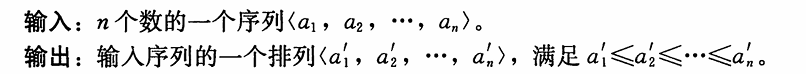

# 算法导论

本书提供了对当代计算机算法研究的一个全面、综合性的介绍。全书共八部分，内容涵盖基础知识、排序和顺序统计量、数据结构、高级设计和分析技术、高级数据结构、图算法、算法问题选编，以及数学基础知识。书中深入浅出地介绍了大量的算法及相关的数据结构，以及用千解决一些复杂计算问题的高级策略（如动态规划、贪心算法、摊还分析等），重点在千算法的分析与设计。对千每一个专题，作者都试图提供目前最新的研究成果及样例解答，并通过清晰的图示来说明算法的执行过程。此外，全书包含957道练习和158道思考题，并且作者在网站上给出了部分题的答案。

本书内容丰富，叙述深入浅出，适合作为计算机及相关专业本科生数据结构课程和研究生算法课程的教材，同时也适合专业技术人员参考使用。

## 译者序

我从1994年开始每年都为本科生讲授“算法设计与分析”课程，粗略地统计一下，发现至今已有5000余名各类学生听过该课。算法的重要性不言而喻，因为不管新概念、新方法、新理论如何引人注目，信息的表示与处理总是计算技术（含软件、硬件、应用、网络、安全、智能等）永恒的主题。信息处理的核心是算法。在大数据时代，设计高效的算法显得格外重要。

当初，为了教好这门基础必修课，提高教学质量，我觉得应该从教学内容的改革入手，具体来说，采用的教材应该与国际一流大学接轨。1997年访美期间，在Stanford大学了解到他们采用的教材是ThomasH.Cormen等人著的《IntroductiontoAlgorithms》，千是从Stanford书店买了一本带回来，从第二年开始便改用该书作为教材。至今，15年过去了，我们一直追随其变迁，从第2版到第3版。教学实践证明它确实是一本好教材，难怪世界范围内包括MIT、CMU、Stanford、UCB、Cornell、UIUC等国际、国内名校在内的1000余所大学都一直用它作为教材或教学参考书，也难怪它印数巨大且在《高引用计算机科学文献》(《MostCitedComputerScienceCitations》）一览表中名列前茅。

这本书的原版有1200多页，内容非常丰富，不但涵盖了典型算法、算法分析、算法设计方法和NP完全等内容，而且还包括数据结构，甚至高级数据结构的介绍。后者可以作为国内“数据结构”课程的教材或教学参考资料。在学时有限的情况下，要在本科阶段教完前者的所有内容也是困难的，故要做取舍。好在该书的各个章节相对独立且难度由浅入深，我们的做法是将相对容易的、一般的入门性内容留在本科阶段，而将相对难的、专门的、较深入的内容并入研究生课程”算法及复杂性”或“计算复杂性＂。除本校外，本人就曾多次应邀在兰州大学、湖南大学和浙江师范大学等院校为研究生讲授过这些内容。其实该书也适合希望增强自身程序设计能力和程序评判能力的广大应用计算技术的社会公众，特别是参加信息学奥林匹克竞赛和ACM程序设计竞赛的选手及其教练员。

在教学过程中，我们发现该书具有以下特点：1)选材与时俱进，具有实用性且能引起读者的兴趣。该书中研究的许多问题都是当前现实应用中的关键技术问题。2)采用伪代码描述算法，既简洁易懂又便千抓住本质，再配上丰富的插图来描述和解释算法的执行过程，使得教学内容更加通俗，便千自学。3)对算法正确性和复杂度的分析比较全面，既有严密的论证，又有直观的解释。4)既有结论性知识的介绍，也有逐步导出结论的研究过程的展示。5)丰富的练习题和思考题使得及时检验所学知识掌握情况和进一步拓展学习内容成为可能。

在第3版的《IntroductiontoAlgorithms》出版后，我们应机械工业出版社编辑的邀请，启动了长久的翻译工程，先后参加翻译工作的老师有：国防科学技术大学的殷建平教授（翻译第1~3章）、中国科学技术大学的徐云教授（翻译第10~14章、第18~21章和第27章）、南开大学的王刚教授（翻译第4章和第15~17章）、南开大学的刘晓光教授（翻译第6~9章）、南开大学的苏明副研究员（翻译第5章和第28~30章）、上海交通大学的邹恒明教授（翻译第22~26章）、哈尔滨工业大学的王宏志副教授（翻译第31~35章和附录部分）。由千水平有限且工作量巨大，译文中一定存在许多不足，在此敬请各位同行专家学者和广大读者批评指正，欢迎大家将发现的错误或提出的意见与建议发送到邮箱：algorithms@hzbook.com。在整个工程即将完成之际，我们要特别感谢潘金贵、顾铁成、李成法和叶懋等参与本书第2版翻译的老师，是他们使得这本重要教材在国内有了广泛读者。同时也要感谢机械工业出版社的温莉芳编辑和王春华编辑，没有你们的信任、耐心和支持，整个翻译工作不可能完成。

殷建平2012年11月于长沙

## 前言

在计算机出现之前，就有了算法。现在有了计算机，就需要更多的算法，算法是计算的核心。

本书提供了对当代计算机算法研究的一个全面、综合的介绍。书中给出了多个算法，并对它们进行了较为深入的分析，使得这些算法的设计和分析易于被各个层次的读者所理解。我们力求在不牺牲分析的深度和数学严密性的前提下，给出深入浅出的说明。

书中每一章都给出了一个算法、一种算法设计技术、一个应用领域或一个相关的主题。算法是用英语和一种“伪代码”来描述的，任何有一点程序设计经验的人都能看得懂。书中给出了244幅图，说明各个算法的工作过程。我们强调将算法的效率作为一种设计标准，对书中的所有算法，都给出了关于其运行时间的详细分析。

本书主要供本科生和研究生的算法或数据结构课程使用。因为书中讨论了算法设计中的工程问题及其数学性质，所以，本书也可以供专业技术人员自学之用。

本书是第3版。在这个版本里，我们对全书进行了更新，包括新增了若干章、修订了伪代码等。

##### 致使用本书的教师

本书的设计目标是全面、适用于多种用途。它可用于若干课程，从本科生的数据结构课程到研究生的算法课程。由于书中给出的内容比较多，只讲一学期一般讲不完，因此，教师们应该将本书看成是一种“缓存区”或“瑞典式自助餐“，从中挑选出能最好地支持自己希望教授的课程的内容。

教师们会发现，要围绕自己所需的各个章节来组织课程是比较容易的。书中的各章都是相对独立的，因此，你不必担心意想不到的或不必要的各章之间的依赖关系。每一章都是以节为单位，内容由易到难。如果将本书用于本科生的课程，可以选用每一章的前面几节内容；用于研究生的课程中，则可以完整地讲授每一章。

全书包含957道练习和158道思考题。每一节结束时给出练习，每一章结束时给出思考题。练习一般比较短，用于检查学生对书中内容的基本掌握情况。有一些是简单的自查性练习，有一些则要更充实，可以作为家庭作业布置给学生。每一章后的思考题都是一些叙述较为详细的实例研究，它们常常会介绍一些新的知识。一般来说，这些思考题都会包含几个小问题，引导学生逐步得到问题的解。

根据本书前几版的读者反馈，我们在本书配套网站上公布了其中一些练习和思考题的答案（但不是全部），网址为http://mitpress.mit.edu/algorithms/。我们会定期更新这些答案，因此需要教师每次授课前都到这个网站上来查看。

在那些不太适合本科生、更适合研究生的章节和练习前面，都加上了星号（＊）。带星号的章节也不一定就比不带星号的更难，但可能要求了解更多的数学知识。类似地，带星号的练习可能要求有更好的数学背景或创造力。

##### 致使用本书的学生

希望本教材能为学生提供关于算法这一领域的有趣介绍。我们力求使书中给出的每一个算法都易于理解和有趣。为了在学生遇到不熟悉或比较困难的算法时提供帮助，我们逐个步骤地描述每一个算法。此外，为了便于大家理解书中对算法的分析，对于其中所需的数学知识，我们VI给出了详细的解释。如果对某一主题巳经有所了解，会发现根据书中各章的编排顺序，可以跳过一些介绍性的小节，直接阅读更高级的内容。

本书是一本大部头著作，学生所修的课程可能只讲授其中的一部分。我们试图使它能成为一本现在对学生有用的教材，并在其将来的职业生涯中，也能成为一本案头的数学参考书或工程实践手册。

阅读本书需要哪些预备知识呢？

- 需要有一些程序设计方面的经验，尤其需要理解递归过程和简单的数据结构，如数组和链表。
- 应该能较为熟练地利用数学归纳法进行证明。书中有一些内容要求学生具备初等微积分方面的知识。除此之外，本书的第一部分和第八部分将介绍需要用到的所有数学技巧。

我们收到学生的反馈，他们强烈希望提供练习和思考题的答案，为此，我们在http://mitpress.mit.edu/algorithms/这个网站上给出了少数练习和思考题的答案，学生可以根据我们的答案来检验自己的解答。

##### 致使用本书的专业技术人员

本书涉及的主题非常广泛，因而是一本很好的算法参考手册。因为每一章都是相对独立的，所以读者可以重点查阅自己感兴趣的主题。

在我们所讨论的算法中，多数都有着极大的实用价值。因此，我们在书中涉及了算法实现方面的考虑和其他工程方面的问题。对千那些为数不多的、主要具有理论研究价值的算法，通常还给出其实用的替代算法。

如果希望实现这些算法中的任何一个，你会发现将书中的伪代码翻译成你熟悉的某种程序设计语言是一件相当直接的事。伪代码被设计成能够清晰、简明地描述每一个算法。因此，我们不考虑错误处理和其他需要对读者所用编程环境有特定假设的软件工程问题。我们力求简单而直接地给出每一个算法，而不会让某种特定程序设计语言的特殊性掩盖算法的本质内容。

如果你是在课堂外使用本书，那么可能无法从教师那里得到答案来验证自己的解答，因此，我们在http://mitpress.mit.edu/algorithms/这个网站上给出了部分练习和思考题的答案，读者可以免费下载参考。

##### 致我们的同事

我们在本书中给出了详尽的参考文献。每一章在结束时都给出了“本章注记“，介绍一些历史性的细节和参考文献。但是，各章的注记并没有提供整个算法领域的全部参考文献。有一点可能是让人难以置信的，即使是在本书这样一本大部头中，由千篇幅的原因，很多有趣的算法都没能包括进来。

尽管学生们发来了大量的请求，希望我们提供思考题和练习的解答，但我们还是决定基本上不提供思考题和练习的参考答案（少数除外），以打消学生们试图查阅答案，而不是自己动手得出答案的念头。

##### 第3版中所做的修改

在本书的第2版和第3版之间有哪些变化呢？这两版之间的变化董和第2版与第1版之间的变化量相当，正如在第2版的前言中所说，这些版本之间的变化可以说不太大，也可以说很大，具体要看读者怎么看待这些变化了。

快速地浏览一遍目录，你就会发现，第2版中的多数章节在第3版中都出现了。在第3版w中，去掉了两章和一节的内容，新增加了三章以及两节的内容。如果单从目录来判断第3版中改动的范围，得出的结论很可能是改动不大。

我们依然保持前两版的组织结构，既按照问题领域又根据技术来组织章节内容。书中既包含基千技术的章，如分治法、动态规划、贪心算法、摊还分析、NP完全性和近似算法，也包含关千排序、动态集的数据结构和图问题算法的完整部分。我们发现虽然读者需要了解如何应用这些技术来设计和分析算法，但是思考题中很少提示应用哪个技术来解决这些问题。

下面总结了第3版的主要变化：

- 新增了讨论vanEmdeBoas树和多线程算法的章节，并且将矩阵基础移至附录。
- 修订了递归式那一章的内容，更广泛地覆盖分治法，并且前两节介绍了应用分治法解决两个问题。4.2节介绍了用千矩阵乘法的Strassen算法，关千矩阵运算的内容已从本章移除。
- 移除两章很少讲授的内容：二项堆和排序网络。排序网络中的关键思想0-1原理，在本版的思考题8-7中作为比较交换算法的0-1排序引理进行介绍。斐波那契堆的处理不再依赖二项堆。
- 修订了动态规划和贪心算法相关内容。与第2版中的装配线调度问题相比，本版用一个更有趣的问题钢条切割来引入动态规划。而且，我们比在第2版中更强调助记性，并且引入子问题图这一概念来阐释动态规划算法的运行时间。在我们给出的贪心算法例子（活动选择问题）中，我们以更直接的方式给出贪心算法。
- 我们从二叉搜索树（包括红黑树）删除一个结点的方式，现在保证实际所删除的结点就将指针指向已删去的结点。
- 修改了对Knuth-Morris-Pratt字符串匹配算法的讨论。是请求删除的结点（在前两版中，有些情况下某个其他结点可能被删除）。用这种新的方式删除结点，如果程序的其他部分保持指针指向树中的结点，那么终止时就不会错误地
- 流网络相关材料现在基千边上的全部流。这种方法比前两版中使用的净流更直观。
- 由千关千矩阵基础和Strassen算法的材料移到了其他章，矩阵运算这一章的内容比第2版中所占的篇幅更小。
- 修正了上一版中的一些错误。在网站上，这些错误大多数都已在第2版的勘误中给出，但是有些没有给出。
- 根据许多读者的要求，我们改变了书中伪代码的语法，现在用"="表示赋值，用"=="表示检验相等，正如C、c++、Java和Python所用的。同样，我们不再使用关键字do和then而是使用"II"作为程序行末尾的注释符号。我们现在还使用点标记法表明对象属性。书中的伪代码仍是过程化的，而不是面向对象的。换句话说，我们只是简单地调用过程，将对象作为参数传递，而不是关千对象的运行方法。
- 新增100道练习和28道思考题，还更新并补充了参考文献。
- 最后，我们对书中的语句、段落和小节进行了一些调整，以使本书条理更清晰。

##### 网站

读者可以通过http:llmitpress.mitedulalgorithmsl这个网站来获取补充资料，以及与我们联系。这个网站上给出了已知错误的清单、部分练习和思考题的答案等。此外，网站上还告诉读者如何报告错误或者提出建议。

##### 第3版致谢

我们已经与MITPress合作20多年，建立了很好的合作关系！感谢EllenFaran、BobPrior、圃AdaBrunstein和MaryReilly的帮助和支持。

在出版第3版时，我们在达特茅斯学院计算机科学系、MIT计算机科学与人工智能实验室、哥伦比亚大学工业工程与运筹学系从事教学和科研工作。感谢这些学校和同事为我们提供的支持和实验环境。

JulieSussman,P.P.A担当本书第3版的技术编辑，再次拯救了我们。每次审阅，我们都觉得已经消除了错误，但是Julie还是发现了许多错误。她还帮我们改进了几处文字表述。如果有技术编辑名人堂，Julie一定第一轮就可以入选。Julie是非凡的，我们怎么感谢都是不够的。PriyaNatarajan也发现了一些错误，使得我们可以在将本书交给出版社前修正这些错误。书中的任何错误（毫无疑问，一定存在一些错误）都由作者负责（或许这些错误有些是Julie审阅材料后引入的）。

对于vanEmdeBoas树的处理出自千ErikDemaine的笔记，转而也受到MichaelBender的影响。此外，我还将JavedAslam、BradleyKuszmaul和HuiZha的思想也整合到这一版。

多线程算法这一章是基于与HaraldProkop一起撰写的笔记，其他在MIT从事Cilk项目的同事也对本部分内容有所贡献，包括BradleyKuszmaul和MatteoFrigo。多线程伪代码的设计灵感来自MITCilk扩展到C,以及由CilkArts的Cilk++扩展到c++。

我们还要感谢许多第1版和第2版的读者，他们报告了所发现的错误，或者提出了改进本书的建议。我们修正了全部报告来的真实错误，并且尽可能多地采纳了读者的建议。我们很高兴有这么多的人为本书做出贡献，但是很遗憾我们无法全部列出这些贡献者。

最后，非常感谢我们各自的妻子NicoleCarmen、WendyLeiserson、GailRivest和RebeccaIvry,还有我们的孩子Ricky、Will、Debby,KatieLeiserson、Alex,ChristopherRivest,以及Molly、Noah和BenjaminStein。感谢他们在我们写作本书过程中给予的爱和支待。正是由于有了来自家庭的耐心和鼓励，本书的写作工作才得以完成。谨将此书献给他们。

ThomasH.Carmen,新罕布什尔州黎巴嫩市

CharlesE.Leiserson,马萨诸塞州剑桥市

RonaldL.Rivest,马萨诸塞州剑桥市

CliffordStein,纽约州纽约市

# 基础知识

这一部分将引导读者开始思考算法的设计和分析问题，简单介绍算法的表达方法、将在本书中用到的一些设计策略，以及算法分析中用到的许多基本思想。本书后面的内容都是建立在这些基础知识之上的。

第1章是对算法及其在现代计算系统中地位的一个综述。本章给出了算法的定义和一些算法的例子。此外，本章还说明了算法是一项技术，就像快速的硬件、图形用户界面、面向对象系统和网络一样。

在第2章中，我们给出了书中的第一批算法，它们解决的是对n个数进行排序的间题。这些算法是用一种伪代码形式给出的，这种伪代码尽管不能直接翻译为任何常规的程序设计语言，但是足够清晰地表达了算法的结构，以便任何一位能力比较强的程序员都能用自己选择的语言将算法实现出来。我们分析的排序算法是插入排序，它采用了一种增量式的做法；另外还分析了归并排序，它采用了一种递归技术，称为“分治法”。尽管这两种算法所需的运行时间都随n的值而增长，但增长的速度是不同的。我们在第2章分析了这两种算法的运行时间，并给出了一种有用的表示方法来表达这些运行时间。

第3章给出了这种表示法的准确定义，称为渐近表示。在第3章的一开始，首先定义几种渐近符号，它们主要用于表示算法运行时间的上界和下界。第3章余下的部分主要给出了一些数学表示方法。这一部分的作用更多的是为了确保读者所用的记号能与本书的记号体系相匹配，而不是教授新的数学概念。第4章更深入地讨论了第2章引入的分治法，给出了更多分治法的例子，包括用于两方阵相乘的Strassen方法。

第4章包含了求解递归式的方法。递归式用于描述递归算法的运行时间。“主方法”是一种功能很强的技术，通常用于解决分治算法中出现的递归式。虽然第4章中的相当一部分内容都是在证明主方法的正确性，但是如果跳过这一部分证明内容，也没有什么太大的影响。

第5章介绍概率分析和随机化算法。概率分析一般用于确定一些算法的运行时间，在这些算法中，由于同一规模的不同输入可能有着内在的概率分布，因而在这些不同输入之下，算法的运行时间可能有所不同。在有些情况下，我们假定算法的输入服从某种巳知的概率分布，于是，算法的运行时间就是在所有可能的输入之下，运行时间的平均值。在其他情况下，概率分布不是来自于输入，而是来自于算法执行过程中所做出的随机选择。如果一个算法的行为不仅由其输入决定，还要由一个随机数生成器生成的值来决定，那么它就是一个随机化算法。我们可以利用随机化算法强行使算法的输入服从某种概率分布，从而确保不会有某一输入会始终导致算法的性能变坏；或者，对于那些允许产生不正确结果的算法，甚至能够将其错误率限制在某个范围之内。

附录A~D包含了一些数学知识，它们对读者阅读本书可能会有所帮助。在阅读本书之前，读者很有可能巳经知道了附录中给出的大部分知识（我们采用的某些符号约定与读者过去见过的可能会有所不同），因而可以将附录视为参考材料。另外，你很可能从未见过第一部分中给出的工内容。第一部分中的所有各章和附录都是以一种入门指南的风格来编写的。

## 第一章算法在计算中的作用

什么是算法？为什么算法值得研究？相对于计算机中使用的其他技术来说算法的作用是什么？本章我们将回答这些问题。

### 1.1算法

非形式地说，算法(algorithm)就是任何良定义的计算过程，该过程取某个值或值的集合作为输入并产生某个值或值的集合作为输出。这样算法就是把输入转换成输出的计算步骤的一个序列。

我们也可以把算法看成是用于求解良说明的计算问题的工具。一般来说，问题陈述说明了期望的输入／输出关系。算法则描述一个特定的计算过程来实现该输入／输出关系。

例如，我们可能需要把一个数列排成非递减序。实际上，这个问题经常出现，并且为引入许多标准的设计技术和分析工具提供了足够的理由。下面是我们关于排序问题的形式定义。

例如，给定输入序列(31,41,59,26,41,58〉，排序算法将返回序列(26,31,41,41,58,59〉作为输出。这样的输入序列称为排序问题的一个实例(instance)。一般来说，问题实例由计算该问题解所必需的（满足问题陈述中强加的各种约束的）输入组成。

因为许多程序使用排序作为一个中间步，所以排序是计算机科学中的一个基本操作。因此，已有许多好的排序算法供我们任意使用。对千给定应用，哪个算法最好依赖千以下因素：将被排序的项数、这些项巳被稍微排序的程度、关千项值的可能限制、计算机的体系结构，以及将使用的存储设备的种类（主存、磁盘或者磁带）。

若对每个输入实例算法都以正确的输出停机，则称该算法是正确的，并称正确的算法解决了给定的计算问题。不正确的算法对某些输入实例可能根本不停机，也可能以不正确的回答停机。与人们期望的相反，不正确的算法只要其错误率可控有时可能是有用的。在第31章，当我们研究求大素数算法时，将看到一个具有可控错误率的算法例子。但是通常我们只关心正确的算法。

算法可以用英语说明，也可以说明成计算机程序，甚至说明成硬件设计。唯一的要求是这个说明必须精确描述所要遵循的计算过程。

##### 算法解决哪种问题

排序绝不是已开发算法的唯一计算问题（当看到本书的厚度时，你可能觉得算法也同样多）。算法的实际应用无处不在，包括以下例子：

- 人类基因工程已经取得重大进展，其目标是识别人类DNA中的所有10万个基因，确定构成人类DNA的30亿个化学基对的序列，在数据库中存储这类信息并为数据分析开发工具。这些工作都需要复杂的算法。虽然对涉及的各种问题的求解超出了本书的范围，但是求解这些生物问题的许多方法采用了本书多章内容的思想，从而使得科学家能够有效地使用资源以完成任务。因为可以从实验技术中提取更多的信息，所以既能节省人和机器的时间又能节省金钱。
- 互联网使得全世界的人都能快速地访问与检索大量信息。借助千一些聪明的算法，互联网上的网站能够管理和处理这些海量数据。必须使用算法的问题示例包括为数据传输寻找好的路由（求解这些问题的技术在第24章给出），使用一个搜索引擎来快速地找到特定信息所在的网页（有关技术在第11章和第32章中）。
- 电子商务使得货物与服务能够以电子方式洽谈与交换，并且它依赖于像信用卡号、密码和银行结单这类个人信息的保密性。电子商务中使用的核心技术包括（第31章中包含的）公钥密码与数字签名，它们以数值算法和数论为基础。
- 制造业和其他商务企业常常需要按最有益的方式来分配稀有资源。一家石油公司也许希望知道在什么地方设置其油井，以便最大化其预期的利润。一位政治候选人也许想确定在什么地方花钱购买竞选广告，以便最大化赢得竞选的机会。一家航空公司也许希望按尽可能最廉价的方式把乘务员分配到班机上，以确保每个航班被覆盖并且满足政府有关乘务员调度的法规。一个互联网服务提供商也许希望确定在什么地方放置附加的资源，以便更有效地服务其顾客。所有这些都是可以用线性规划来求解的问题的例子，我们将在第29章学习这种技术。

虽然这些例子的一些细节已超出本书的范围，但是我们确实说明了一些适用千这些问题和问题领域的基本技术。我们还说明如何求解许多具体问题，包括以下问题：

- 给定一张交通图，上面标记了每对相邻十字路口之间的距离，我们希望确定从一个十字路口到另一个十字路口的最短道路。即使不允许穿过自身的道路，可能路线的数量也会很大。在所有可能路线中，我们如何选择哪一条是最短的？这里首先把交通图（它本身就是实际道路的一个模型）建模为一个图（第六部分和附录B将涉及这个概念），然后寻找图中从一个顶点到另一个顶点的最短路径。第24章将介绍如何有效地求解这个问题。
- 给定两个有序的符号序列X=(x1,Xz,…,Xm〉和Y=(yl,Y2,…，Yn〉，求出X和Y的最长公共子序列。X的子序列就是去掉一些元素（可能是所有，也可能一个没有）后的X。例如，<A,B,C,D,E,F,G>的一个子序列是<B,C,E,G>.X和Y的最长公共子序列的长度度量了这两个序列的相似程序。例如，若两个序列是DNA链中的基对，则当它们具有长的公共子序列时我们认为它们是相似的。若X有m个符号且Y有n个符号，则X和Y分别有2气和沪个可能的子序列。除非m和n很小，否则选择X和Y的所有可能子序列做匹配将花费使人望而却步多的时间。第15章将介绍如何使用一种称为动态规划的一般技术来有效地求解这个问题。
- 给定一个依据部件库的机械设计，其中每个部件可能包含其他部件的实例，我们需要依次列出这些部件，以使每个部件出现在使用它的任何部件之前。若该设计由n个部件组成，则存在n!种可能的顺序，其中n!表示阶乘函数。因为阶乘函数甚至比指数函数增长还快，（除非我们只有几个部件，否则）先生成每种可能的顺序再验证按该顺序每个部件出现在使用它的部件之前，是不可行的。这个问题是拓扑排序的一个实例，第22章将介绍如何有效地求解这个问题。
- 给定平面上的n个点，我们希望寻找这些点的凸壳。凸壳就是包含这些点的最小的凸多边形。直观上，我们可以把每个点看成由从一块木板钉出的一颗钉子来表示。凸壳则由一根拉紧的环绕所有钉子的橡皮筋来表示。如果橡皮筋因绕过某颗钉子而转弯，那么这颗钉子就是凸壳的一个顶点（例子参见图33-6)。n个点的2"个子集中的任何一个都可能是凸壳的顶点集。仅知道哪些点是凸壳的顶点还很不够，因为我们还必须知道它们出现的顺序。所以为求凸壳的顶点，存在许多选择。第33章将给出两种用千求凸壳的好方法。

虽然这些问题的列表还远未穷尽（也许你巳经再次从本书的重量推测到这一点），但是它们却展示了许多有趣的算法问题所共有的两个特征：

- 存在许多候选解，但绝大多数候选解都没有解决手头的问题。寻找一个真正的解或一个最好的解可能是一个很大的挑战。
- 存在实际应用。在上面所列的问题中，最短路径问题提供了最易懂的例子。一家运输公司（如公路运输或铁路运输公司）对如何在公路或铁路网中找出最短路径，有着经济方面的利益，因为采用的路径越短，其人力和燃料的开销就越低。互联网上的一个路由结点为了快速地发送一条消息可能需要寻找通过网络的最短路径。希望从纽约开车去波士顿的人可能想从一个恰当的网站寻找开车方向，或者开车时她可能使用其GPS。

算法解决的每个问题并不都有一个容易识别的候选解集。例如，假设给定一组表示信号样本的数值，我们想计算这些样本的离散傅里叶变换。离散傅里叶变换把时域转变为频域，产生一组数值系数，使得我们能够判定被采样信号中各种频率的强度。除了处于信号处理的中心之外，离散傅里叶变换还应用千数据压缩和大多项式与整数相乘。第30章为该问题给出了一个有效的算法快速傅里叶变换（通常称为FIT),并且这章还概述了计算FIT的硬件电路的设计。

##### 数据结构

本书也包含几种数据结构。数据结构是一种存储和组织数据的方式，旨在便于访问和修改。没有一种单一的数据结构对所有用途均有效，所以重要的是知道几种数据结构的优势和局限。

##### 技术

虽然可以把本书当做一本有关算法的”菜谱”来使用，但是也许在某一天你会遇到一个问题，一时无法很快找到一个已有的算法来解决它（例如本书中的许多练习和思考题就是这样的情况）。本书将教你一些算法设计与分析的技术，以便你能自行设计算法、证明其正确性和理解其效率。不同的章介绍算法问题求解的不同方面。有些章处理特定的问题，例如，第9章的求中位数和顺序统计量，第23章的计算最小生成树，第26章的确定网络中的最大流。其他章介绍一些技术，例如第4章的分治策略，第15章的动态规划，第17章的摊还分析。

##### 难题

本书大部分讨论有效算法。我们关于效率的一般量度是速度，即一个算法花多长时间产生结果。然而有一些问题，目前还不知道有效的解法。第34章研究这些问题的一个有趣的子集，其中的问题被称为NP完全的。

为什么NP完全问题有趣呢？第一，虽然迄今为止不曾找到对一个NP完全问题的有效算法，但是也没有人能证明NP完全问题确实不存在有效算法。换句话说，对于NP完全问题，是否存在有效算法是未知的。第二，NP完全问题集具有一个非凡的性质：如果任何一个NP完全问题存在有效算法，那么所有NP完全问题都存在有效算法。NP完全问题之间的这种关系使得有效解的缺乏更加诱人。第三，有儿个NP完全问题类似千（但又不完全同千）一些有着已知有效算法的问题。计算机科学家迷恋于如何通过对问题陈述的一个小小的改变来很大地改变其已知最佳算法的效率。

你应该了解NP完全问题，因为有些NP完全问题会时不时地在实际应用中冒出来。如果要求你找出某一NP完全问题的有效算法，那么你可能花费许多时间在毫无结果的探寻中。如果你能证明这个问题是NP完全的，那么你可以把时间花在开发一个有效的算法，该算法给出一个好的解，但不一定是最好的可能解。

作为一个具体的例子，考虑一家具有一个中心仓库的投递公司。每天在中心仓库为每辆投递车装货并发送出去，以将货物投递到几个地址。每天结束时每辆货车必须最终回到仓库，以便准备好为第二天装货。为了减少成本，公司希望选择投递站的一个序，按此序产生每辆货车行驶的最短总距离。这个问题就是著名的“旅行商问题“，并且它是NP完全的。它没有已知的有效算法。然而，在某些假设条件下，我们知道一些有效算法，它们给出一个离最小可能解不太远的总距离。第35章将讨论这样的“近似算法”。

##### 并行性

我们或许可以指望处理器时钟速度能以某个持续的比率增加多年。然而物理的限制对不断提高的时钟速度给出了一个基本的路障：因为功率密度随时钟速度超线性地增加，一旦时钟速度变得足够快，芯片将有熔化的危险。所以，为了每秒执行更多计算，芯片被设计成包含不止一个而是几个处理”核”。我们可以把这些多核计算机比拟为在单一芯片上的儿台顺序计算机；换句话说，它们是一类”并行计算机”。为了从多核计算机获得最佳的性能，设计算法时必须考虑并行性。第27章给出了充分利用多核的“多线程”算法的一个模型。从理论的角度来看，该模型具有口口一些优点，它形成了几个成功的计算机程序的基础，包括一个国际象棋博弈程序。

##### 练习

1.1一1给出现实生活中需要排序的一个例子或者现实生活中需要计算凸壳的一个例子。

1.1-2除速度外，在真实环境中还可能使用哪些其他有关效率的量度？

1.1-3选择一种你以前巳知的数据结构，并讨论其优势和局限。

1.1-4前面给出的最短路径与旅行商问题有哪些相似之处？又有哪些不同？

1.1-5提供一个现实生活的间题，其中只有最佳解才行。然后提供一个问题，其中近似最佳的一个解也足够好。

### 1.2作为一种技术的算法

假设计算机是无限快的并且计算机存储器是免费的，你还有什么理由来研究算法吗？即使只是因为你还想证明你的解法会终止并以正确的答案终止，那么回答也是肯定的。

如果计算机无限快，那么用于求解某个问题的任何正确的方法都行。也许你希望你的实现在好的软件工程实践的范围内（例如，你的实现应该具有良好的设计与文档），但是你最常使用的是最容易实现的方法。

当然，计算机也许是快的，但它们不是无限快。存储器也许是廉价的，但不是免费的。所以计算时间是一种有限资源，存储器中的空间也一样。你应该明智地使用这些资源，在时间或空间口口方面有效的算法将帮助你这样使用资源。

##### 效率

为求解相同问题而设计的不同算法在效率方面常常具有显著的差别。这些差别可能比由于硬件和软件造成的差别要重要得多。

作为一个例子，第2章将介绍两个用于排序的算法。第一个称为插入排序，为了排序n个项，该算法所花时间大致等于CJ矿，其中CJ是一个不依赖千n的常数。也就是说，该算法所花时间大致与n2成正比。第二个称为归井排序，为了排序n个项，该算法所花时间大致等于c2nlgn,其中lgn代表log2n且C2是另一个不依赖于n的常数。与归并排序相比，插入排序通常具有一个较小的常数因子，所以c1<c2。我们将看到就运行时间来说，常数因子可能远没有对输人规模n的依赖性重要。把插入排序的运行时间写成c1n•n并把归并排序的运行时间写成c2n•lgn。这时就运行时间来说，插人排序有一个因子n的地方归并排序有一个因子lgn,后者要小得多。（例如，当n=I000时，lgn大致为10,当n等千100万时，lgn大致仅为20。)虽然对千小的输入规模，插入排序通常比归并排序要快，但是一旦输入规模n变得足够大，归并排序lgn对n的优点将足以补偿常数因子的差别。不管C1比C2小多少，总会存在一个交叉点，超出这个点，归并排序更快。

作为一个具体的例子，我们让运行插入排序的一台较快的计算机（计算机A)与运行归并排序的一台较慢的计算机（计算机B)竞争。每台计算机必须排序一个具有1000万个数的数组。（虽然