# 数据结构教程

# 1. 绪论

## 1.1 什么是数据结构

在了解数据结构的重要性之后开始讨论数据结构的概念，本节先给出数据结构的严格定义，再从一个简单的学生表例子人手，展示数据结构包含的三个方面的内容，接着分析数据逻辑结构和存储结构的几种类型，最后给出了数据类型和抽象数据类型之间的区别与联系。

### 1.1.1 数据结构的定义

用计算机解决一个具体的问题大致需要经过以下几个步骤：

（1）分析问题，确定数据模型。

（2）设计相应的算法。

（3）编写程序，运行并调试程序，直至得到正确的结果。

寻求数学模型的实质是分析问题，从中提取操作的对象，并找出这些操作对象之间的关系，然后用数学语言加以描述。有些问题的数据模型可以用具体的数学方程等来表示，但更多的实际问题是无法用数学方程来表示的，这就需要从数据人手来分析并得到解决问题的方法。

数据（data）是描述客观事物的数和字符的集合。例如，人们在日常生活中使用的各种文字、数字和特定符号都是数据。从计算机的角度看，数据是所有能被输人到计算机中，且能被计算机处理的符号的集合，它是计算机操作的对象的总称，也是计算机所处理信息的某种特定的符号表示形式（例如，200902班学生数据就是该班全体学生记录的集合）。

人们通常以数据元素（dataelement）作为数据的基本单位（例如，200902班中的每个学生记录都是一个数据元素）。在有些情况下，数据元素也称为元素、结点、顶点或者记录等。一个数据元素可以由若干个数据项组成。

数据项（dataitem）是具有独立含义的数据最小单位，也称为字段或域。例如，200902班中的每个数据元素（即学生记录）是由学号、姓名、性别和班号等数据项组成的。

数据对象（dataobject）是指性质相同的数据元素的集合，它是数据的一个子集。在数据结构课程中讨论的数据通常指的是数据对象。

数据结构（datastructure）是指所有数据元素以及数据元素之间的关系，可以看作是相互之间存在着某种特定关系的数据元素的集合，如图1.1所示。因此，我们可以把数据结构看成是带结构的数据元素的集合。

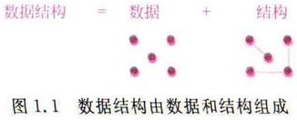

数据结构通常包括以下几个方面。

（1）数据的逻辑结构（logicalstructure）：由数据元素之间的逻辑关系构成。

（2）数据的存储结构（storagestructure）：数据元素及其关系在计算机存储器中的存储表示，也称为数据的物理结构（physicalstructure）。

（3）数据的运算（operation）：施加在该数据上的操作。

因此，数据结构是一门讨论“描述现实世界实体的数学模型（通常为非数值计算）及其之上的运算在计算机中如何表示和实现”的学科。

那么学习数据结构有什么意义呢？以盖一栋房屋为例，如图1.2所示，房屋由很多构件组成，如窗户就是重要的构件。这里可以将窗户看成一个数据结构，窗户的元素包括铝合金框、玻璃、拉手和滑轮等，这些元素构成的窗户的模型就是逻辑结构，其运算包括它所提供的各种功能。若把窗户模型设计好，在建房屋时就可以直接使用它。

软件开发也是如此，如果提炼出其中的一个个数据结构，并加以“好”的设计，不仅可以提高开发效率，而且会提高软件的可靠性。

### 1.1.2 逻辑结构

数据的逻辑结构是从数据元素的逻辑关系上描述数据的，是指数据元素之间的逻辑关系的整体，通常是从求解问题中提炼出来的。数据逻辑结构与数据的存储无关，是独立于计算机的，因此数据的逻辑结构可以看作是从具体问题抽象出来的数学模型。

在现实世界中，数据元素的逻辑关系是多种多样的，但在数据结构中主要讨论数据运算之间的相邻关系或者邻接关系。

#### 1.逻辑结构的表示

数据的逻辑结构可以采用多种方式表示，常见的有图表和二元组等。

1）图表表示

逻辑结构的图表表示就是采用表格或者图形直接描述数据的逻辑关系。例如，有一个学生表（数据）如表1.1所示。这个表中的数据元素是学生记录，每个数据元素由4个数据项（即学号、姓名、性别和班号）组成。从逻辑上看，学号1的元素和学号8的元素是相邻的，而学号12的元素和学号5的元素是不相邻的。这7个学生记录和它们之间的相邻关系就构成了该数据的逻辑结构。

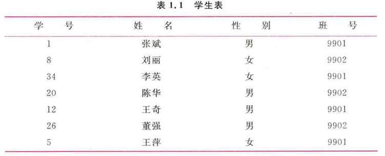

在用图形表示逻辑结构时，图形中的每个结点对应着一个数据元素，两结点之间带箭头的连线表示它们之间的相邻关系。假设用“学号”数据项唯一标识数据元素，学生表的逻辑结构图形表示如图1.3所示。

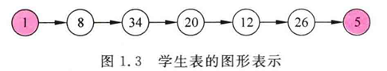

2）二元组表示

二元组是一种通用的数据逻辑结构表示方式。一个二元组表示如下：

```
B=(D,R)
```

其中，B是一种数据逻辑结构，它由数据元素的集合D以及D上二元关系的集合R所组成。即：

- D={d<sub>i</sub>| 1<=i<=n,n>=0}
- R={r<sub>j</sub>| 1<=j<=m,m>=0}

其中，d<sub>i</sub>表示集合D中的第i个数据元素，n为D中数据元素的个数，若n=0，则D是一个空集，因而B也就无结构可言，有时把这种情况认为是具有任意结构。

r<sub>j</sub>表示集合R中的第j个关系，m为R中关系的个数，若m=0，则R是一个空集，表明集合D中的数据元素间不存在任何逻辑关系，彼此是独立的，这和数学中集合的概念是一致的。

R中的一个关系r是序偶的集合，对于r中的任一序偶<x，y>（x，y∈D)，表示元素x和y之间是相邻的，即x在之前，y在x之后，x称为该序偶的第一元素，y称为该序偶的第二元素，而且x为y的直接前驱元素（predecessor），y为x的直接后继元素（successor）。为了简便，后面将直接前驱元素和直接后继元素分别简称为前驱元素和后继元素。

若某个元素没有前驱元素，则称该元素为开始元素（firstelement）；若某个元素没有后继元素，则称该元素为终端元素（terminalelement）。

对于对称序偶，即<x，y>∈r，则<y，x>∈r（x，y∈D），可用圆括号代替尖括号，即（x，y）∈r。在用图形表示逻辑关系时，对称序偶用不带箭头的连线表示。

【例1.1】有一个如表1.2所示的城市表，假设区号是唯一的，给出其逻辑结构的二元组表示。

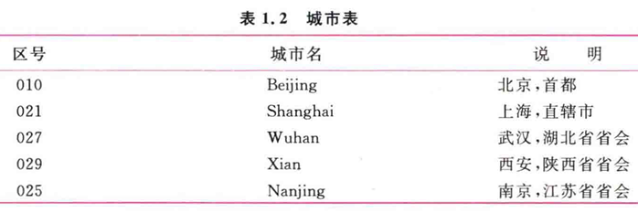

城市表中共有5个记录，其逻辑结构的二元组表示如下。

```
City=(D,R)
D={010,021,027,029,025}
R={r}
r={<010,021>,<021,027>,<027,029>,<029,025>}
```

#### 2.逻辑结构的类型

客观世界中数据的逻辑结构是纷繁复杂的，归纳起来主要有以下几类。

**1）集合**

集合（set）是指数据元素之间除了“同属于一个集合”的关系以外别无其他关系。

**2）线性结构**

线性结构（linearstructure）是指该结构中的数据元素之间存在一对一的关系。其特点是开始元素和终端元素都是唯一的，除了开始元素和终端元素以外，其余元素都有且仅有一个前驱元素，有且仅有一个后继元素。线性表就是一种典型的线性结构。

例如，对于前面的学生表数据，学号1的元素为开始元素，学号5的元素为终端元素。其余每个数据元素有且仅有一个前驱结点和一个后继结点，因此它是一种线性结构。

**3）树形结构**

树形结构是指该结构中的数据元素之间存在一对多的关系。其特点是除了开始元素以外，每个元素有且仅有一个前驱元素，除了终端元素以外，每个元素有一个或多个后继元素。二叉树就是一种典型的树形结构。

【例1.2】有一种数据结构B<sub>1</sub>=（D，R)，其中：

```
D={a,b,c,d,e,f,g,h,i,j}
R={r}
r={<a,b>，<a,c>，<a,d>，<b,e>，<c,f>，<c,g>，<d,h>，<d,i>,<d,j>}
```

画出其逻辑结构图形表示，指出是什么类型的逻辑结构。

解对应的图形表示如图1.4所示。

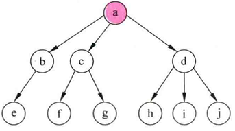

> 图1.41 B<sub>1</sub>的逻辑结构图示

从该例中可以看出，每个结点有且仅有一个前驱结点（除树根结点a以外），但有多个后继结点（树叶结点可看作具有零个后继结点），因此B<sub>1</sub>是一种树形结构。

【例1.3】有一种数据结构B2=（D，R)，其中：

```
D={48,25,64,57,82,36,75}
R={r1,r2} 
r1={<25,36>，<36,48>，<48,57>，<57,64>，<64,75>，<75,82>}
r2={<48,25>，<48,64>，<64，57>，<64,82>，<25,36>，<82,75>}
```

画出其逻辑结构图形表示，指出是什么类型的逻辑结构。

解：对应的图形如图1.5所示。其中r（对应图中的虚线部分）为线性结构，r2（对应图中的实线部分）为树形结构，因此在同一数据集合上可以有多种逻辑关系。

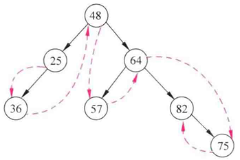

> 图1.5 B2的逻辑结构图示

4）图形结构

图形结构是指该结构中的数据元素之间存在多对多的关系。其特点是每个元素的前驱元素和后继元素的个数可以是任意的，因此图形结构可能没有开始元素和终端元素，也可能有多个开始元素、多个终端元素。

树形结构和图形结构统称为非线性结构，该结构中的元素之间存在一对多或多对多的关系。由图形结构、树形结构和线性结构的定义可知，线性结构是树形结构的特殊情况，而树形结构又是图形结构的特殊情况。

【例1.4】有一种数据结构B3=（D，R），其中：

```
D={a,b,c,d,e}
R={r}
r={（a,b),（a,c),(b,c),(c,d）,(c,e),(d,e)}
```

画出其逻辑结构图形表示，指出是什么类型的逻辑结构。

解:对应的图形表示如图1.6所示。从该例中可以看出，每个结点可以有多个前驱结点和多个后继结点，因此B3是一种图形结构。

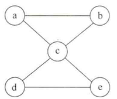

> 图1.6 B3的逻辑结构图示

### 1.1.3 存储结构

数据逻辑结构在计算存储器中的存储表示称为数据的存储结构（也称为映像），也就是逻辑结构在计算机中的存储实现。当把数据对象存储到计算机中时，通常要求既要存储逻辑结构中的每一个数据元素，又要存储数据元素之间的逻辑关系。

显然数据的存储结构是依赖于计算机的。通常设计数据的存储结构是借助某种计算机语言来实现的，一般只在高级语言的层次上讨论存储结构，这里采用C/C++语言。

在实际应用中，数据的存储方法是灵活多样的，归纳起来，数据结构中有以下4种常用的存储结构类型。

#### 1.顺序存储结构

顺序存储结构（sequentialstoragestructure）是采用一组连续的存储单元存放所有的数据元素，也就是说，所有数据元素在存储器中占有一整块存储空间，而且两个逻辑上相邻的元素在存储器中的存储位置也相邻。因此，数据元素之间的逻辑关系由存储单元地址间的关系隐含表示，即顺序存储结构将数据的逻辑结构直接映射到存储结构。

顺序存储结构的主要优点是存储效率高，因为分配给数据的存储单元全用于存放数据元素，元素之间的逻辑关系没有占用额外的存储空间；另外，在采用这种存储方法时可实现对元素的随机存取，即每个元素对应一个逻辑序号，由该序号可直接计算出对应元素的存储地址，从而获取元素值。顺序存储结构的主要缺点是不便于数据修改，对元素的插人或删除操作可能需要移动一系列的元素。

例如，对应表1.1的学生表，可以采用C/C++语言中的结构体数组来存储，设计对应的结构体数组Stud并初始化的过程如下：

```cpp
struct
{
    int no;        // 存储学号
    char name[8];  // 存储姓名
    char sex[2];   // 存储性别
    char class[4]; // 存储班号

}Stud[7] = {{1, "张斌", "男", "9901"},..., {5, "王萍", "女", "9901"}};
```

其中，数组名称Stud作为数组的起始地址，用于唯一标识该存储结构，如图1.7所示。在Stud数组中各元素在内存中顺序存放，即Stud[i存放在Stud[i+1]之前，而Stud[i+1]存放在Stud[i]之后，所以Stud是学生表的一种顺序存储结构。

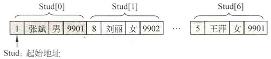

> 图1.7学生表的顺序存储结构

#### 2.链式存储结构

在链式存储结构（linkedstoragestructure）中，每个逻辑元素用一个内存结点存储，每个结点是单独分配的，所有的结点地址不一定是连续的，所以无须占用一整块存储空间。为了表示元素之间的逻辑关系，给每个结点附加指针域，用于存放相邻结点的存储地址，也就是通过指针域将所有结点链接起来，这就是链式存储结构名称的由来。

链式存储结构的主要优点是便于数据修改，在对元素进行插人或删除操作时仅需修改相应结点的指针域，不必移动结点。与顺序存储结构相比，链式存储结构的主要缺点是存储空间的利用率较低，因为分配给元素的存储单元有一部分被用来存储结点之间的逻辑关系；另外，由于逻辑上相邻的元素在存储空间中不一定相邻，所以不能对元素进行随机存取。例如，对应表1.1的学生表，可以采用C/C++语言中的链表来存储，设计存放每个元素的结点类型StudType如下：

```cpp
typedef struct Studnode
{
    int no;                // 存储学号
    char name[8];          // 存储姓名
    char sex[2];           // 存储性别
    char class[4];         // 存储班号
    struct Studnode *next; // 存储指向下一个学生结点的指针
} StudType;                // 结点类型
```

学生表中的每个学生记录采用一个StudType类型的结点单独存储，一个学生结点的next域指向逻辑结构中它的后继学生记录对应的结点，从而构成一个链表，其存储结构如图1.8所示，首结点的指针为head，用它来标识整个学生链表，尾结点的指针域为空。

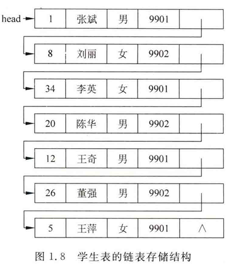

由head所指结点的next域得到下一个结点的地址，然后再由它得到下一个结点的地址…··这样就可以找到任何一个结点的地址，所以head标识的链表是学生表的一种链式存储结构。

#### 3.索引存储结构

索引存储结构（indexedstoragestructure）是指在存储数据元素信息的同时还建立附加的索引表。存储所有数据元素信息的表称为主数据表，其中每个数据元素有一个关键字和对应的存储地址。

索引表中的每一项称为索引项，索引项的一般形式为“关键字，地址”，其中“关键字”唯一标识一个元素，“地址”对应该关键字的元素在主数据表中的存储地址。通常，索引表中的所有索引项是按关键字有序排列的。

在按关键字查找时，首先在索引表中利用关键字的有序性快速查找到该关键字的地址，然后通过该地址在主数据表中找到对应的元素。

索引存储结构的优点是查找效率高。其缺点是需要建立索引表，从而增加了空间开销。

#### 4.哈希（或散列）存储结构

哈希（或散列)存储结构（hashedstoragestructure）的基本思想是根据元素的关键字通过哈希（或散列)函数直接计算出一个值，并将这个值作为该元素的存储地址。

哈希存储结构的优点是查找速度快，只要给出待查元素的关键字就可立即计算出该元素的存储地址。与前3种存储方法不同的是，哈希存储方法只存储元素的数据，不存储元素之间的逻辑关系。哈希存储结构一般只适合要求对数据能够进行快速查找和插人的场合。

上述4种基本的存储方法既可以单独使用，也可以组合使用。同一种逻辑结构采用不同的存储方法可以得到不同的存储结构。选择何种存储结构来表示相应的逻辑结构视具体要求而定，主要考虑的是运算方便及算法的时空要求。

### 1.1.4 数据运算

数据运算是指对数据实施的操作。每种数据结构都有一组相应的运算，最常用的运算有检索、插人、删除、更新和排序等。数据运算最终需要在对应的存储结构上用算法实现，所以数据运算分为运算定义和运算实现两个层面。

运算定义是运算功能的描述，是抽象的，是基于逻辑结构的。运算实现是程序员完成运算的实现算法，是具体的，是基于存储结构的。这种将运算定义和运算实现相互分离的做法体现了软件工程的思想，更加便于软件开发。

逻辑结构、存储结构和运算三者之间的关系如图1.9所示。

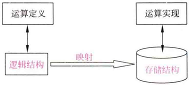

> 图1.9逻辑结构、存储结构和运算之间的关系

对于学生表这种数据结构可以进行一系列的运算，例如查找逻辑序号为2的学生的姓名、插人一个学生记录和删除一个学生记录等。

以“查找逻辑序号为2的学生的姓名”运算定义为例，其运算实现有以下两种方式。

如果采用顺序存储结构—Stud数组，由于逻辑序号为2的学生记录存储在Stud[1]数组元素中，可以直接找到Stud[1]，通过Stud[1].name返回其姓名，即“刘丽”。

如果采用链式存储结构一head链表，需要遍历该链表，用i记录查找结点的逻辑序号，p=head首先指向首结点，i=1。由于i≠2，p=p一>next移到下一个结点，同时i增1变为2。此时i=2，p指向的结点就是要找的结点，返回p一>name，即“刘丽”。

从中可以看出，对于一种数据结构，其逻辑结构总是唯一的，但它可能对应多种存储结构，并且在不同的存储结构中同一运算的实现过程可能不同。

### 1.1.5 数据类型和抽象数据类型

数据类型和抽象数据类型是与数据结构密切相关的两个概念，容易引起混淆。本节介绍这两个概念。

#### 1.数据类型

在用C/C++语言编写的程序中必须对出现的每个变量、常量或表达式明确地说明它们所属的数据类型。

不同数据类型的变量，其取值范围和所能进行的运算可能不同。例如，C/C++语言有一个int数据类型，它的取值范围为-32768～32767（16位系统），可用的运算有十、一、*、/和%等。所以，以下语句是正确的：

```
int i=2,j=5,k;
k=i+j；
```

而以下语句是不正确的：

```
int i=999999999;  //int类型的数据取值超界
i**；              //int类型不存在该运算符
```

所以，数据类型（data type）是一组性质相同的值的集合和定义在此集合上的一组操作的总称，是某种程序设计语言中已实现的数据结构。在程序设计语言提供的数据类型的支持下，就可以根据从问题中抽象出来的各种数据模型逐步构造出描述这些数据模型的各种新的数据结构。

**1）C/C++语言中常用的数据类型**

C/C++语言的数据类型按照取值的不同分为原子类型和结构类型。原子类型是不可以再分解的基本类型；结构类型是由若干数据类型组合而成的，是可以再分解的，如数组、结构体等。下面对C/C++语言中常用的数据类型进行总结。

（1）C/C++语言中的基本数据类型。

C/C++语言中的基本数据类型有int型、bool型（布尔型）、float型、double型和char型。int型可以有个修饰符，即short（短整数）、long（长整数）和unsigned（无符号整数）。

数据类型是用来定义变量的，例如有定义语句：

```
int n=10;
```

在执行该语句时，系统自动为变量n在计算机存储器中分配一个固定长度（如4个字节）的存储空间，如图1.10所示，程序员可以通过变量名n对这个内存空间进行存取操作，当超出其作用范围时系统自动释放其内存空间，所以称之为自动变量（automaticvariable）。

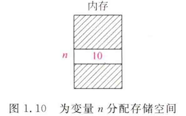

**（2）C/C++语言中的指针类型。**

C/C++语言允许直接对存放变量的地址进行操作。例如，有以下定义：

```
int i,*p
```

其中，i是整型变量，p是指针变量（它用于存放某个整型变量的地址）。表达式&i表示变量i的地址，将p指向整型变量i的运算为p=&i。

对于指针变量p，表达式\*p是取p所指变量的值，例如：

```
int i=2，*p=&i;
printf("%d\n",*p);
```

上述语句执行后，其内存结构如图1.11所示，通过*p输出变量i的值，即2。

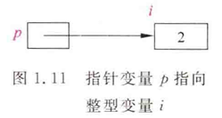

**（3）C/C++语言中的数组类型。**

数组是同一数据类型的一组数据元素的集合，在C/C++语言中定义数组时需要指定数组大小，即数组中存放的最多元素个数。数组分为一维数组和多维数组等。数组名用于标识一个数组，下标指示一个数组元素在该数组中的位置。

数组下标的最小值称为下界，在C/C++语言中总是为0。数组下标的最大值称为上界，在C/C++语言中数组上界为数组的大小减1。例如，int a[10]定义了包含10个整数的数组a，数组元素为a[0]～a[9]。

**（4）C/C++语言中的结构体类型。**

结构体类型是由一组被称为结构体成员的数据项组成的，每个结构体成员都有自己的标识符，也称为数据域。一个结构体类型中所有成员的数据类型可以不相同。例如，以下声明了一个Teacher结构体类型：

```cpp
struct Teacher
{                 // 教师结构体类型
    int no;       // 成员编号，占4个字节
    char name[8]; // 成员姓名，占8个字节
    int age;      // 成员年龄，占4个字节
};
```

以下语句定义了结构体类型Teacher的一个结构体变量t并赋值：

```cpp
struct Teacher t;
t.no = 85;
strepy(t.name, "张敏");
t.age = 42;
```

结构体变量t在内存中的存放方式如图1.12所示，引用no成员的方式是t.no，引用name成员的方式是t.name，引用age成员的方式是t.age，所有成员相邻存放。变量所分配的内存空间大小为所有成员占用的内存空间之和。

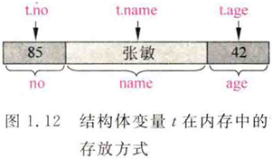

**（5）C/C++语言中的共用体类型。**

共用体是把不同的成员组织为一个整体，它们在内存中共享一段存储单元，但不同成员以不同的方式被解释。例如，声明一个共用体类型Tag如下：

```cpp
union Tag
{                // Tag共用体
    short int n; // 成员n，占两个字节
    char ch[2];  // 成员ch数组，占两个字节
}
```

以下语句定义了共用体类型Tag的一个共用体变量u并赋值：

```cpp
union Tag u;
u.n = 0x4142; // 若为u=0x4142；这种直接赋值是错误的
```

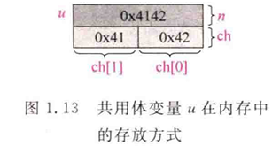

共用体变量u在内存中的存放方式如图1.13所示，引用n成员的方式是u.n，引用ch成员的ch[0]元素的方式是u.ch[0]，n和ch成员共享相同的内存空间。u变量所分配的内存空间大小为所有成员占用空间的最大值。

**（6）C语言中的自定义类型。**

C/C++语言中允许使用typedef关键字来指定一个新的数据类型名，例如：

```cpp
typedef char ElemType;
```

将char类型与ElemType等同起来，特别是将代码较长的结构体类型声明用自定义类型标识符来代替，这样可以简化代码。例如：

```cpp
typedef struct Student
{                  // Student结构体类型
    int no;        // 学号成员
    char name[10]; // 姓名成员
    char sex;      // 性别成员
    int cno;       // 班号成员
} NewType;         // 用NewType别名表示Student结构体类型
```

这样，NewType等同于Student结构体类型，可以使用该类型定义变量：

```
NewType s1,s2;
```

等同于：

```
struct Student s1,s2;
```

**2）存储空间的分配**

在程序设计中，定义变量就是使用内存空间，而存储空间的分配主要有两种方式。

（1）静态存储空间分配方式。

所谓静态存储空间分配方式是指在程序编译期间分配固定的存储空间的方式。该存储分配方式通常是在变量定义时就分配存储单元并一直保持不变，直至整个程序结束。以定义一个数组为例，如下语句就采用了这种方式：

```cpp
int a[10];
```

一旦遇到该语句，系统就为a数组分配10个int整数空间。无论程序是否向a中放人元素，这一片空间都被占用。它也属于自动变量，当超出其作用范围时系统自动释放其内存空间。

（2）动态存储空间分配方式。

所谓动态存储空间分配方式是指在程序运行期间根据需要动态地分配存储空间的方式。C/C++语言提供了一套机制可以在程序执行时动态分配存储空间，如malloc（）/free（）函数对。即使用malloc（)函数为一个指针变量（如p指针)分配一片连续的空间，当不再需要时使用free（）函数释放p所指向的空间。例如：

```cpp
char *p;
p = (char *)malloc(10 * sizeof(char)); // 动态分配10个连续的字符空间
strcpy(p, "China");                    // 将“China"存放到p所指向的空间中
printf("%c\n", *p);                    // 输出字符C
printf("%s\n", p);                     // 输出字符串“China”
free(p);                               // 释放p所指向的空间
```

