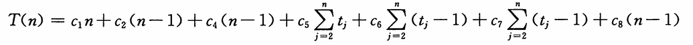
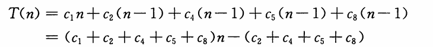

# 算法导论

# 第一部分——基础知识

这一部分将引导读者开始思考算法的设计和分析问题，简单介绍算法的表达方法、将在本书中用到的一些设计策略，以及算法分析中用到的许多基本思想。本书后面的内容都是建立在这些基础知识之上的。

第1章是对算法及其在现代计算系统中地位的一个综述。本章给出了算法的定义和一些算法的例子。此外，本章还说明了算法是一项技术，就像快速的硬件、图形用户界面、面向对象系统和网络一样。

在第2章中，我们给出了书中的第一批算法，它们解决的是对n个数进行排序的间题。这些算法是用一种伪代码形式给出的，这种伪代码尽管不能直接翻译为任何常规的程序设计语言，但是足够清晰地表达了算法的结构，以便任何一位能力比较强的程序员都能用自己选择的语言将算法实现出来。我们分析的排序算法是插入排序，它采用了一种增量式的做法；另外还分析了归并排序，它采用了一种递归技术，称为“分治法”。尽管这两种算法所需的运行时间都随n的值而增长，但增长的速度是不同的。我们在第2章分析了这两种算法的运行时间，并给出了一种有用的表示方法来表达这些运行时间。

第3章给出了这种表示法的准确定义，称为渐近表示。在第3章的一开始，首先定义几种渐近符号，它们主要用于表示算法运行时间的上界和下界。第3章余下的部分主要给出了一些数学表示方法。这一部分的作用更多的是为了确保读者所用的记号能与本书的记号体系相匹配，而不是教授新的数学概念。

第4章更深入地讨论了第2章引入的分治法，给出了更多分治法的例子，包括用于两方阵相乘的Strassen方法。第4章包含了求解递归式的方法。递归式用于描述递归算法的运行时间。“主方法”是一种功能很强的技术，通常用于解决分治算法中出现的递归式。虽然第4章中的相当一部分内容都是在证明主方法的正确性，但是如果跳过这一部分证明内容，也没有什么太大的影响。

第5章介绍概率分析和随机化算法。概率分析一般用于确定一些算法的运行时间，在这些算法中，由于同一规模的不同输入可能有着内在的概率分布，因而在这些不同输入之下，算法的运行时间可能有所不同。在有些情况下，我们假定算法的输入服从某种巳知的概率分布，于是，算法的运行时间就是在所有可能的输入之下，运行时间的平均值。在其他情况下，概率分布不是来自于输入，而是来自于算法执行过程中所做出的随机选择。如果一个算法的行为不仅由其输入决定，还要由一个随机数生成器生成的值来决定，那么它就是一个随机化算法。我们可以利用随机化算法强行使算法的输入服从某种概率分布，从而确保不会有某一输入会始终导致算法的性能变坏；或者，对于那些允许产生不正确结果的算法，甚至能够将其错误率限制在某个范围之内。

附录A~D包含了一些数学知识，它们对读者阅读本书可能会有所帮助。在阅读本书之前，读者很有可能巳经知道了附录中给出的大部分知识（我们采用的某些符号约定与读者过去见过的可能会有所不同），因而可以将附录视为参考材料。另外，你很可能从未见过第一部分中给出的工内容。第一部分中的所有各章和附录都是以一种入门指南的风格来编写的。

# 第一章 算法在计算中的作用

什么是算法？为什么算法值得研究？相对于计算机中使用的其他技术来说算法的作用是什么？本章我们将回答这些问题。

## 1.1 算法

非形式地说，算法(algorithm)就是任何良定义的计算过程，该过程取某个值或值的集合作为输入并产生某个值或值的集合作为输出。这样算法就是把输入转换成输出的计算步骤的一个序列。

我们也可以把算法看成是用于求解良说明的计算问题的工具。一般来说，问题陈述说明了期望的输入/输出关系。算法则描述一个特定的计算过程来实现该输入/输出关系。例如，我们可能需要把一个数列排成非递减序。实际上，这个问题经常出现，并且为引入许多标准的设计技术和分析工具提供了足够的理由。下面是我们关于排序问题的形式定义。

输入： n个数的一个序列<a<sub>1</sub>,a<sub>2</sub>,...,a<sub>n</sub>>。

输出：输入序列的一个排列<a<sup>/</sup><sub>1</sub>,a<sup>/</sup><sub>2</sub>,...,a<sup>/</sup><sub>n</sub>>，满足a<sup>/</sup><sub>1</sub><=a<sup>/</sup><sub>2</sub><=...<=a<sup>/</sup><sub>n</sub>

例如，给定输入序列<31,41,59,26,41,58>，排序算法将返回序列<26,31,41,41,58,59>作为输出。这样的输入序列称为排序问题的一个实例(instance)。一般来说，问题实例由计算该问题解所必需的（满足问题陈述中强加的各种约束的）输入组成。

因为许多程序使用排序作为一个中间步，所以排序是计算机科学中的一个基本操作。因此，已有许多好的排序算法供我们任意使用。对千给定应用，哪个算法最好依赖千以下因素：将被排序的项数、这些项巳被稍微排序的程度、关千项值的可能限制、计算机的体系结构，以及将使用的存储设备的种类（主存、磁盘或者磁带）。

若对每个输入实例算法都以正确的输出停机，则称该算法是正确的，并称正确的算法解决了给定的计算问题。不正确的算法对某些输入实例可能根本不停机，也可能以不正确的回答停机。与人们期望的相反，不正确的算法只要其错误率可控有时可能是有用的。在第31章，当我们研究求大素数算法时，将看到一个具有可控错误率的算法例子。但是通常我们只关心正确的算法。

算法可以用英语说明，也可以说明成计算机程序，甚至说明成硬件设计。唯一的要求是这个说明必须精确描述所要遵循的计算过程。

**算法解决哪种问题**

排序绝不是已开发算法的唯一计算问题（当看到本书的厚度时，你可能觉得算法也同样多）。算法的实际应用无处不在，包括以下例子：

- 人类基因工程已经取得重大进展，其目标是识别人类DNA中的所有10万个基因，确定构成人类DNA的30亿个化学基对的序列，在数据库中存储这类信息并为数据分析开发工具。这些工作都需要复杂的算法。虽然对涉及的各种问题的求解超出了本书的范围，但是求解这些生物问题的许多方法采用了本书多章内容的思想，从而使得科学家能够有效地使用资源以完成任务。因为可以从实验技术中提取更多的信息，所以既能节省人和机器的时间又能节省金钱。
- 互联网使得全世界的人都能快速地访问与检索大量信息。借助千一些聪明的算法，互联网上的网站能够管理和处理这些海量数据。必须使用算法的问题示例包括为数据传输寻找好的路由（求解这些问题的技术在第24章给出），使用一个搜索引擎来快速地找到特定信息所在的网页（有关技术在第11章和第32章中）。

- 电子商务使得货物与服务能够以电子方式洽谈与交换，并且它依赖于像信用卡号、密码和银行结单这类个人信息的保密性。电子商务中使用的核心技术包括（第31章中包含的）公钥密码与数字签名，它们以数值算法和数论为基础。
- 制造业和其他商务企业常常需要按最有益的方式来分配稀有资源。一家石油公司也许希望知道在什么地方设置其油井，以便最大化其预期的利润。一位政治候选人也许想确定在什么地方花钱购买竞选广告，以便最大化赢得竞选的机会。一家航空公司也许希望按尽可能最廉价的方式把乘务员分配到班机上，以确保每个航班被覆盖并且满足政府有关乘务员调度的法规。一个互联网服务提供商也许希望确定在什么地方放置附加的资源，以便更有效地服务其顾客。所有这些都是可以用线性规划来求解的问题的例子，我们将在第29章学习这种技术。

虽然这些例子的一些细节已超出本书的范围，但是我们确实说明了一些适用千这些问题和问题领域的基本技术。我们还说明如何求解许多具体问题，包括以下问题：

- 给定一张交通图，上面标记了每对相邻十字路口之间的距离，我们希望确定从一个十字路口到另一个十字路口的最短道路。即使不允许穿过自身的道路，可能路线的数量也会很大。在所有可能路线中，我们如何选择哪一条是最短的？这里首先把交通图（它本身就是实际道路的一个模型）建模为一个图（第六部分和附录B将涉及这个概念），然后寻找图中从一个顶点到另一个顶点的最短路径。第24章将介绍如何有效地求解这个问题。
- 给定两个有序的符号序列X=(x<sub>1</sub>,X<sub>2</sub>,…,X<sub>m</sub>)和Y=(y<sub>1</sub>,y<sub>2</sub>,…，y<sub>n</sub>〉，求出X和Y的最长公共子序列。X的子序列就是去掉一些元素（可能是所有，也可能一个没有）后的X。例如，<A,B,C,D,E,F,G〉的一个子序列是<B,C,E,G〉。X和Y的最长公共子序列的长度度量了这两个序列的相似程序。例如，若两个序列是DNA链中的基对，则当它们具有长的公共子序列时我们认为它们是相似的。若X有m个符号且Y有n个符号，则X和Y分别有2气和沪个可能的子序列。除非m和n很小，否则选择X和Y的所有可能子序列做匹配将花费使人望而却步多的时间。第15章将介绍如何使用一种称为动态规划的一般技术来有效地求解这个问题。
- 给定一个依据部件库的机械设计，其中每个部件可能包含其他部件的实例，我们需要依次列出这些部件，以使每个部件出现在使用它的任何部件之前。若该设计由n个部件组成，则存在n!种可能的顺序，其中n!表示阶乘函数。因为阶乘函数甚至比指数函数增长还快，（除非我们只有几个部件，否则）先生成每种可能的顺序再验证按该顺序每个部件出现在使用它的部件之前，是不可行的。这个问题是拓扑排序的一个实例，第22章将介绍如何有效地求解这个问题。
- 给定平面上的n个点，我们希望寻找这些点的凸壳。凸壳就是包含这些点的最小的凸多边形。直观上，我们可以把每个点看成由从一块木板钉出的一颗钉子来表示。凸壳则由一根拉紧的环绕所有钉子的橡皮筋来表示。如果橡皮筋因绕过某颗钉子而转弯，那么这颗钉子就是凸壳的一个顶点（例子参见图33-6)。n个点的2"个子集中的任何一个都可能是凸壳的顶点集。仅知道哪些点是凸壳的顶点还很不够，因为我们还必须知道它们出现的顺序。所以为求凸壳的顶点，存在许多选择。第33章将给出两种用千求凸壳的好方法。

1. 虽然这些问题的列表还远未穷尽（也许你巳经再次从本书的重量推测到这一点），但是它们却展示了许多有趣的算法问题所共有的两个特征：
2. 存在许多候选解，但绝大多数候选解都没有解决手头的问题。寻找一个真正的解或一个最好的解可能是一个很大的挑战。存在实际应用。在上面所列的问题中，最短路径问题提供了最易懂的例子。一家运输公司（如公路运输或铁路运输公司）对如何在公路或铁路网中找出最短路径，有着经济方面的利益，因为采用的路径越短，其人力和燃料的开销就越低。互联网上的一个路由结点为了快速地发送一条消息可能需要寻找通过网络的最短路径。希望从纽约开车去波士顿的人可能想从一个恰当的网站寻找开车方向，或者开车时她可能使用其GPS。

算法解决的每个问题并不都有一个容易识别的候选解集。例如，假设给定一组表示信号样本的数值，我们想计算这些样本的离散傅里叶变换。离散傅里叶变换把时域转变为频域，产生一组数值系数，使得我们能够判定被采样信号中各种频率的强度。除了处于信号处理的中心之外，离散傅里叶变换还应用千数据压缩和大多项式与整数相乘。第30章为该问题给出了一个有效的算法快速傅里叶变换（通常称为FIT),并且这章还概述了计算FIT的硬件电路的设计。

**数据结构**

本书也包含几种数据结构。数据结构是一种存储和组织数据的方式，旨在便于访问和修改。没有一种单一的数据结构对所有用途均有效，所以重要的是知道几种数据结构的优势和局限。

**技术**

虽然可以把本书当做一本有关算法的”菜谱”来使用，但是也许在某一天你会遇到一个问题，一时无法很快找到一个已有的算法来解决它（例如本书中的许多练习和思考题就是这样的情况）。本书将教你一些算法设计与分析的技术，以便你能自行设计算法、证明其正确性和理解其效率。不同的章介绍算法问题求解的不同方面。有些章处理特定的问题，例如，第9章的求中位数和顺序统计量，第23章的计算最小生成树，第26章的确定网络中的最大流。其他章介绍一些技术，例如第4章的分治策略，第15章的动态规划，第17章的摊还分析。

**难题**

本书大部分讨论有效算法。我们关于效率的一般量度是速度，即一个算法花多长时间产生结果。然而有一些问题，目前还不知道有效的解法。第34章研究这些问题的一个有趣的子集，其中的问题被称为NP完全的。

为什么NP完全问题有趣呢？第一，虽然迄今为止不曾找到对一个NP完全问题的有效算法，但是也没有人能证明NP完全问题确实不存在有效算法。换句话说，对于NP完全问题，是否存在有效算法是未知的。第二，NP完全问题集具有一个非凡的性质：如果任何一个NP完全问题存在有效算法，那么所有NP完全问题都存在有效算法。NP完全问题之间的这种关系使得有效解的缺乏更加诱人。第三，有儿个NP完全问题类似千（但又不完全同千）一些有着已知有效算法的问题。计算机科学家迷恋于如何通过对问题陈述的一个小小的改变来很大地改变其已知最佳算法的效率。

你应该了解NP完全问题，因为有些NP完全问题会时不时地在实际应用中冒出来。如果要求你找出某一NP完全问题的有效算法，那么你可能花费许多时间在毫无结果的探寻中。如果你能证明这个问题是NP完全的，那么你可以把时间花在开发一个有效的算法，该算法给出一个好的解，但不一定是最好的可能解。

作为一个具体的例子，考虑一家具有一个中心仓库的投递公司。每天在中心仓库为每辆投递车装货并发送出去，以将货物投递到几个地址。每天结束时每辆货车必须最终回到仓库，以便准备好为第二天装货。为了减少成本，公司希望选择投递站的一个序，按此序产生每辆货车行驶的最短总距离。这个问题就是著名的“旅行商问题“，并且它是NP完全的。它没有已知的有效算法。然而，在某些假设条件下，我们知道一些有效算法，它们给出一个离最小可能解不太远的总距离。第35章将讨论这样的“近似算法”。

**并行性**

我们或许可以指望处理器时钟速度能以某个持续的比率增加多年。然而物理的限制对不断提高的时钟速度给出了一个基本的路障：因为功率密度随时钟速度超线性地增加，一旦时钟速度变得足够快，芯片将有熔化的危险。所以，为了每秒执行更多计算，芯片被设计成包含不止一个而是几个处理”核”。我们可以把这些多核计算机比拟为在单一芯片上的儿台顺序计算机；换句话说，它们是一类”并行计算机”。为了从多核计算机获得最佳的性能，设计算法时必须考虑并行性。第27章给出了充分利用多核的“多线程”算法的一个模型。从理论的角度来看，该模型具有一些优点，它形成了几个成功的计算机程序的基础，包括一个国际象棋博弈程序。

> 练习 
>
> 1.1一1 给出现实生活中需要排序的一个例子或者现实生活中需要计算凸壳的一个例子。
>
> 1.1-2 除速度外，在真实环境中还可能使用哪些其他有关效率的量度？ 
>
> 1.1-3 选择一种你以前巳知的数据结构，并讨论其优势和局限。 
>
> 1.1-4 前面给出的最短路径与旅行商问题有哪些相似之处？又有哪些不同？ 
>
> 1.1-5 提供一个现实生活的间题，其中只有最佳解才行。然后提供一个问题，其中近似最佳的一个解也足够好。

## 1.2 作为一种技术的算法

假设计算机是无限快的并且计算机存储器是免费的，你还有什么理由来研究算法吗？即使只是因为你还想证明你的解法会终止并以正确的答案终止，那么回答也是肯定的。

如果计算机无限快，那么用于求解某个问题的任何正确的方法都行。也许你希望你的实现在好的软件工程实践的范围内（例如，你的实现应该具有良好的设计与文档），但是你最常使用的是最容易实现的方法。

当然，计算机也许是快的，但它们不是无限快。存储器也许是廉价的，但不是免费的。所以计算时间是一种有限资源，存储器中的空间也一样。你应该明智地使用这些资源，在时间或空间方面有效的算法将帮助你这样使用资源。

**效率**

为求解相同问题而设计的不同算法在效率方面常常具有显著的差别。这些差别可能比由于硬件和软件造成的差别要重要得多。

作为一个例子，第2章将介绍两个用于排序的算法。第一个称为插入排序，为了排序n个项，该算法所花时间大致等于c<sub>1</sub>n<sup>2</sup>，其中c<sub>1</sub>是一个不依赖于n的常数。也就是说，该算法所花时间大致与n<sup>2</sup>成正比。第二个称为归井排序，为了排序n个项，该算法所花时间大致等于c<sub>2</sub>nlgn,其中lgn代表log<sub>2</sub>n且C<sub>2</sub>是另一个不依赖于n的常数。与归并排序相比，插入排序通常具有一个较小的常数因子，所以c<sub>1</sub><c<sub>2</sub>。我们将看到就运行时间来说，常数因子可能远没有对输人规模n的依赖性重要。把插入排序的运行时间写成c1n•n并把归并排序的运行时间写成c<sub>2</sub>n•lgn。这时就运行时间来说，插人排序有一个因子n的地方归并排序有一个因子lgn,后者要小得多。（例如，当n=I000时，lgn大致为10,当n等千100万时，lgn大致仅为20。)虽然对千小的输入规模，插入排序通常比归并排序要快，但是一旦输入规模n变得足够大，归并排序lgn对n的优点将足以补偿常数因子的差别。不管C<sub>1</sub>比C<sub>2</sub>小多少，总会存在一个交叉点，超出这个点，归并排序更快。

作为一个具体的例子，我们让运行插入排序的一台较快的计算机（计算机A)与运行归并排序的一台较慢的计算机（计算机B)竞争。每台计算机必须排序一个具有1000万个数的数组。（虽然1000万个数似乎很多，但是，如果这些数是8字节的整数，那么输入将占用大致80MB,即使一台便宜的便携式计算机的存储器也能多次装入这么多数。）假设计算机A每秒执行百亿条指令（快于写本书时的任何单台串行计算机），而计算机B每秒仅执行1000万条指令，结果计算机A就纯计算能力来说比计算机B快1000倍。为使差别更具戏剧性，假设世上最巧妙的程序员为计算机A用机器语言编码插入排序，并且为了排序n个数，结果代码需要2n<sup>2</sup>条指令。进一步假设仅由一位水平一般的程序员使用某种带有一个低效编译器的高级语言来实现归并排序，结果代码需要50nlgn条指令。为了排序1000万个数，计算机A需要


通过使用一个运行时间增长较慢的算法，即使采用一个较差的编译器，计算机B比计算机A还快17倍！当我们排序1亿个数时，归并排序的优势甚至更明显：这时插入排序需要23天多，而归并排序不超过4小时。一般来说，随着问题规模的增大，归并排序的相对优势也会增大。

**算法与其他技术**

上面的例子表明我们应该像计算机硬件一样把算法看成是一种技术。整个系统的性能不但依赖于选择快速的硬件而且还依赖于选择有效的算法。正如其他计算机技术正在快速推进一样，算法也在快速发展。

你也许想知道相对其他先进的计算机技术（如以下列出的），算法对于当代计算机是否真的那么重要：

- 先进的计算机体系结构与制造技术
- 易于使用、直观的图形用户界面(GUI)
- 面向对象的系统
- 集成的万维网技术
- 有线与无线网络的快速组网

回答是肯定的。虽然某些应用在应用层不明确需要算法内容（如某些简单的基于万维网的应用），但是许多应用确实需要算法内容。例如，考虑一种基千万维网的服务，它确定如何从一个位置旅行到另一个位置。其实现依赖千快速的硬件、一个图形用户界面、广域网，还可能依赖于面向对象技术。然而，对某些操作，如寻找路线（可能使用最短路径算法）、描绘地图、插入地址，它还是需要算法。

而且，即使是那些在应用层不需要算法内容的应用也高度依赖于算法。该应用依赖于快速的硬件吗？硬件设计用到算法。该应用依赖于图形用户界面吗？任何图形用户界面的设计都依赖千算法。该应用依赖千网络吗？网络中的路由高度依赖千算法。该应用采用一种不同于机器代码口启的语言来书写吗？那么它被某个编译器、解释器或汇编器处理过，所有这些都广泛地使用算法。口切算法是当代计算机中使用的大多数技术的核心。

进一步，随着计算机能力的不断增强，我们使用计算机来求解比以前更大的问题。正如我们在上面对插入排序与归并排序的比较中所看到的，正是在较大问题规模时，算法之间效率的差别才变得特别显著。

是否具有算法知识与技术的坚实基础是区分真正熟练的程序员与初学者的一个特征。使用现代计算技术，如果你对算法懂得不多，你也可以完成一些任务，但是，如果有一个好的算法背景，那么你可以做的事情就多得多。

> 练习 
>
> 1.2-1 给出在应用层需要算法内容的应用的一个例子，并讨论涉及的算法的功能。
>
> 1.2-2 假设我们正比较插入排序与归并排序在相同机器上的实现。对规模为n的输入，插入排序运行8汒步，而归并排序运行64nlgn步。问对哪些n值，插入排序优千归并排序？
>
> 1.2-3 n的最小值为何值时，运行时间为l00n2的一个算法在相同机器上快千运行时间为2"的另一个算法？


# 第二章 算法基础

本章将要介绍一个贯穿本书的框架，后续的算法设计与分析都是在这个框架中进行的。这一部分内容基本上是独立的，但也有对第3章和第4章中一些内容的引用（本章也包含几个求和的式子，附录A将给出如何求和）。

首先，我们考察求解第1章中引入的排序问题的插入排序算法。我们定义一种对于已经编写过计算机程序的读者来说应该熟悉的＂伪代码“，并用它来表明我们将如何说明算法。然后，在说明了插入排序算法后，我们将证明该算法能正确地排序并分析其运行时间。这种分析引入了一种记号，该记号关注时间如何随着将被排序的项数而增加。在讨论完插入排序之后，我们引入用千算法设计的分治法并使用这种方法开发一个称为归并排序的算法。最后，我们分析归并排序的运行时间。

## 2.1 插入排序

我们的第一个算法（插入排序）求解第1章中引入的排序问题：

输入： n个数的一个序列<a<sub>1</sub>,a<sub>2</sub>,...,a<sub>n</sub>>。

输出：输入序列的一个排列<a<sup>/</sup><sub>1</sub>,a<sup>/</sup><sub>2</sub>,...,a<sup>/</sup><sub>n</sub>>，满足a<sup>/</sup><sub>1</sub><=a<sup>/</sup><sub>2</sub><=...<=a<sup>/</sup><sub>n</sub>

我们希望排序的数也称为关键词。虽然概念上我们在排序一个序列，但是输入是以n个元素的数组的形式出现的。

本书中，我们通常将算法描述为用一种伪代码书写的程序，该伪代码在许多方面类似于C、c++、Java、Python或Pascal。如果你学过这些语言中的任何一种，那么在阅读我们的算法时应该没有困难。伪代码与真码的区别在千，在伪代码中，我们使用最清晰、最简洁的表示方法来说明给定的算法。有时最清晰的表示方法是英语，所以如果你遇到一个英文短语或句子嵌入在一段真码中就不要吃惊。伪代码与真码的另一个区别是伪代码通常不关心软件工程的问题。为了更简洁地表达算法的本质，常常忽略数据抽象、模块性和错误处理的问题。

我们首先介绍插入排序，对于少量元素的排序，它是一个有效的算法。插入排序的工作方式像许多人排序一手扑克牌。开始时，我们的左手为空并且桌子上的牌面向下。然后，我们每次从桌子上拿走一张牌并将它插入左手中正确的位置。为了找到一张牌的正确位置，我们从右到左将它与已在手中的每张牌进行比较，如图2-1所示。拿在左手上的牌总是排序好的，原来这些牌是桌子上牌堆中顶部的牌。

对于插入排序，我们将其伪代码过程命名为INSERTION-ffiRT,其中的参数是一个数组A[1..n],包含长度为n的要排序的一个序列。（在代码中，A中元素的数目n用A.length来表示。）该算法原址排序输入的数：算法在数组A中重排这些数，在任何时候，最多只有其中的常数个数字存储在数组外面。在过程INSERTION-SORT结束时，输入数组A包含排序好的输出序列。

INSERTION-SORT(A)：

```
for j = 2 to A.length 
	key= A[j] 
	//Insert A[j] into the sorted sequence A[l. . j —1]. 
	i=j-1 
	while i > 0 and A[i] > key 
		A[i+1] = A[i] 
		i=i-1 
	A[i + 1] = key
```

**循环不变式与插入排序的正确性**

图2-2表明对A=(5,2,4,6,1,3〉该算法如何工作。下标j指出正被插入到手中的“当前牌”。在for循环（循环变量为j)的每次迭代的开始，包含元素A[1..j—l]的子数组构成了当前排序好的左手中的牌，剩余的子数组A[j+1..n]对应于仍在桌子上的牌堆。事实上，元素A[1..j—l]就是原来在位置1到j—1的元素，但现在已按序排列。我们把A[1..j-1]的这些性质形式地表示为一个循环不变式：


> 图2-2 在数组A=(5,2,4,6,1,3〉上INSERTION-SORT的操作。数组下标出现在长方形的上方，数组位置中存储的值出现在长方形中。(a)~(e)第18行for循环的迭代。每次迭代中，黑色的长方形保存取自A[j]的关键字，在第5行的测试中将它与其左边的加阴影的长方形中的值进行比较。加阴影的箭头指出数组值在第6行向右移动一个位置，黑色的箭头指出在第8行关键字被移到的地方。(f)最终排序好的数组

循环不变式主要用来帮助我们理解算法的正确性。关千循环不变式，我们必须证明三条性质：

初始化：循环的第一次迭代之前，它为真。

保持：如果循环的某次迭代之前它为真，那么下次迭代之前它仍为真。

终止：在循环终止时，不变式为我们提供一个有用的性质，该性质有助千证明算法是正确的。

当前两条性质成立时，在循环的每次迭代之前循环不变式为真。（当然，为了证明循环不变式在每次迭代之前保持为真，我们完全可以使用不同千循环不变式本身的其他已证实的事实。）注意，这类似千数学归纳法，其中为了证明某条性质成立，需要证明一个基本情况和一个归纳步。这里，证明第一次迭代之前不变式成立对应于基本情况，证明从一次迭代到下一次迭代不变式成立对应千归纳步。

第三条性质也许是最重要的，因为我们将使用循环不变式来证明正确性。通常，我们和导致循环终止的条件一起使用循环不变式。终止性不同于我们通常使用数学归纳法的做法，在归纳法中，归纳步是无限地使用的，这里当循环终止时，停止“归纳”。

让我们看看对于插入排序，如何证明这些性质成立。

初始化：首先证明在第一次循环迭代之前（当j=2时），循环不变式成立，所以子数组A[1..j-1]仅由单个元素A[1]组成，实际上就是A[1]中原来的元素。而且该子数组是排序好的（当然很平凡）。这表明第一次循环迭代之前循环不变式成立。

保持：其次处理第二条性质：证明每次迭代保持循环不变式。非形式化地，for循环体的第4~7行将A[j-1]、A[j—2]、A[j-3]等向右移动一个位置，直到找到A[j]的适当位置，第8行将A[j]的值插入该位置。这时子数组A[1..j]由原来在A[1..j]中的元素组成，但已按序排列。那么对for循环的下一次迭代增加］将保持循环不变式。

第二条性质的一种更形式化的处理要求我们对第5~7行的while循环给出并证明一个循环不变式。然而，这里我们不愿陷入形式主义的困境，而是依赖以上非形式化的分析来证明第二条性质对外层循环成立。

终止：最后研究在循环终止时发生了什么。导致for循环终止的条件是j>A.length=n。因为每次循环迭代］增加1,那么必有j=n+1。在循环不变式的表述中将］用n+1代替，我们有：子数组A[1..n]由原来在A[1..n]中的元素组成，但已按序排列。注意到，子数组A[1..n]就是整个数组，我们推断出整个数组已排序。因此算法正确。

在本章后面以及其他章中，我们将采用这种循环不变式的方法来证明算法的正确性。

伪代码中的一些约定

我们在伪代码中采用以下约定：

- 缩进表示块结构。例如，第1行开始的for循环体由第2~8行组成，第5行开始的while循环体包含第6~7行但不包含第8行。我们的缩进风格也适用于if-else语句气采用缩进来代替常规的块结构标志，如begin和end语句，可以大大提高代码的清晰性。
- while、for与repeat-until等循环结构以及if-else等条件结构与C、c++、Java、Python和Pascal中的那些结构具有类似的解释气不像某些出现千c++、Java和Pascal中的情况，本书中在退出循环后，循环计数器保持其值。因此，紧接在一个for循环后，循环计数器的值就是第一个超出for循环界限的那个值。在证明插入排序的正确性时，我们使用了该性质。第1行的for循环头为forj=2toA.length,所以，当该循环终止时，j=A.length+1(或者等价地，j=n+L因为n=A.length)。当一个for循环每次迭代增加其循环计数器时，我们使用关键词to。当一个for循环每次迭代减少其循环计数器时，我们使用关键词downto。当循环计数器以大千1的一个量改变时，该改变量跟在可选关键词by之后。
- 符号"II"表示该行后面部分是个注释。
- 形如i=j=e的多重赋值将表达式e的值赋给变蜇t和j;它应被处理成等价于赋值j=e后跟着赋值i=j。
- 变量（如1、j和key)是局部千给定过程的。若无显式说明，我们不使用全局变量。
- 数组元素通过“数组名［下标]"这样的形式来访问。例如，A[i]表示数组A的第i个元素。记号".."用于表示数组中值的一个范围，这样，A[1..j]表示A的一个子数组，它包含j个元素A[1],A[2],…,A[j]。
- 复合数据通常被组织成对象，对象又由属性组成。我们使用许多面向对象编程语言中创建的句法来访问特定的属性：对象名后跟一个点再跟属性名。例如，数组可以看成是一个对象，它具有属性length,表示数组包含多少元素，如A.length就表示数组A中的元素数目。我们把表示一个数组或对象的变量看做指向表示数组或对象的数据的一个指针。对于某个对象x的所有属性f,赋值y=x导致y.f等于x.f。进一步，若现在置x.f=3,则赋值后不但x.f等于3,而且y.f也等于3。换句话说，在赋值y=x后，x和y指向相同的对象。我们的属性记号可以“串联”。例如，假设属性f本身是指向某种类型的具有属性g的对象的一个指针。那么记号x.f.g被隐含地加括号成(x.f).g。换句话说，如果已经赋值y=x.f,那么x.f.g与y.g相同。有时，一个指针根本不指向任何对象。这时，我们赋给它特殊值NIL。
- 我们按值把参数传递给过程：被调用过程接收其参数自身的副本。如果它对某个参数赋值，调用过程看不到这种改变。当对象被传递时，指向表示对象数据的指针被复制，而对象的属性却未被复制。例如，如果x是某个被调用过程的参数，在被调用过程中的赋值x=y对调用过程是不可见的。然而，赋值x.f=3却是可见的。类似地，数组通过指针来传递，结果指向数组的一个指针被传递，而不是整个数组，单个数组元素的改变对调用过程是可见的。
- 一个return语旬立即将控制返回到调用过程的调用点。大多数return语句也将一个值传递回调用者。我们的伪代码与许多编程语言不同，因为我们允许在单一的return语句中返回多个值。
- 布尔运算符"and"和"or"都是短路的。也就是说，当求值表达式"xandy"时，首先求值X。如果x求值为FALSE,那么整个表达式不可能求值为TRUE,所以不再求值y。另外，如果x求值为TRUE,那么就必须求值y以确定整个表达式的值。类似地，对表达式"xory",仅当x求值为FALSE时，才求值表达式y。短路的运算符使我们能书写像"x#-NILandx.f=y"这样的布尔表达式，而不必担心当x为NIL时我们试图求值x.f将会发生什么情况。
- 关键词error表示因为已被调用的过程情况不对而出现了一个错误。调用过程负责处理该错误，所以我们不用说明将采取什么行动。

> 练习
>
> 2.1-1以图2-2为模型，说明INSERTION-SORT在数组A=(31,41,59,26,41,58〉上的执行过程。
>
> 2.1-2重写过程INSERTION-SORT,使之按非升序（而不是非降序）排序。
>
> 2.1-3考虑以下查找问题：输入：n个数的一个序列A=(a1,az,…,a.〉和一个值v。输出：下标i使得v=A[月或者当v不在A中出现时，v为特殊值NIL。写出线性查找的伪代码，它扫描整个序列来查找v。使用一个循环不变式来证明你的算法是正确的。确保你的循环不变式满足三条必要的性质。
>
> 2.1-4考虑把两个n位二进制整数加起来的问题，这两个整数分别存储在两个n元数组A和B中。这两个整数的和应按二进制形式存储在一个(n+l)元数组C中。请给出该问题的形式化描述，并写出伪代码。

## 2.2 分析算法

分析算法的结果意味着预测算法需要的资源。虽然有时我们主要关心像内存、通信带宽或计算机硬件这类资源，但是通常我们想度量的是计算时间。一般来说，通过分析求解某个问题的儿种候选算法，我们可以选出一种最有效的算法。这种分析可能指出不止一个可行的候选算法，但是在这个过程中，我们往往可以抛弃几个较差的算法。

在能够分析一个算法之前，我们必须有一个要使用的实现技术的模型，包括描述所用资源及其代价的模型。对本书的大多数章节，我们假定一种通用的单处理器计算模型随机访问机(random-accessmachine,RAM)来作为我们的实现技术，算法可以用计算机程序来实现。在RAM模型中，指令一条接一条地执行，没有并发操作。

严格地说，我们应该精确地定义RAM模型的指令及其代价。然而，这样做既乏味又对算法的设计与分析没有多大意义。我们还要注意不能滥用RAM模型。例如，如果一台RAM有一条排序指令，会怎样呢？这时，我们只用一条指令就能排序。这样的RAM是不现实的，因为真实的计算机并没有这样的指令。所以，我们的指导性意见是真实计算机如何设计，RAM就如何设计。RAM模型包含真实计算机中常见的指令：算术指令（如加法、减法、乘法、除法、取余、向下取整、向上取整）、数据移动指令（装入、存储、复制）和控制指令（条件与无条件转移、子程序调用与返回）。每条这样的指令所需时间都为常量。

RAM模型中的数据类型有整数型和浮点实数型。虽然在本书中，我们一般不关心精度，但是在某些应用中，精度是至关重要的。我们还对每个数据字的规模假定一个范围。例如，当处理规模为n的输入时，我们一般假定对某个大于等于1的常量c,整数由clgn位来表示。我们要求c大于等于1,这样每个字都可以保存n的值，从而使我们能索引单个输入元素。我们限制c为常量，这样字长就不会任意增长。（如果字长可以任意增长，我们就能在一个字中存储巨量的数据，并且其上的操作都在常量时间内进行，这种情况显然不现实。）

真实的计算机包含一些上面未列出的指令，这些指令代表了RAM模型中的一个灰色区域。例如，指数运算是一条常量时间的指令吗？一般情况下不是；当x和y都是实数时，计算立需要若干条指令。然而，在受限情况下，指数运算又是一个常量时间的操作。许多计算机都有“左移”指令，它在常量时间内将一个整数的各位向左移K位。在大多数计算机中，将一个整数的各位向左移一位等价千将该整数乘以2,结果将一个整数的各位向左移k位等价千将该整数乘以2k。所以，只要k不大千一个计算机字中的位数，这样的计算机就可以由一条常量时间的指令来计算2k'即将整数1向左移k位。我们尽量避免RAM模型中这样的灰色区域，但是，当k是一个足够小的正整数时，我们将把护的计算看成一个常量时间的操作。

在RAM模型中，我们并不试图对当代计算机中常见的内存层次进行建模。也就是说，我们没有对高速缓存和虚拟内存进行建模。几种计算模型试图解释内存层次的影响，对真实计算机上运行的真实程序，这种影响有时是重大的。本书中的一些问题考查了内存层次的影响，但是本书的大部分分析将不考虑这些影响。与RAM模型相比，包含内存层次的模型要复杂得多，所以可能难于使用。此外，RAM模型分析通常能够很好地预测实际计算机上的性能。

采用RAM模型即使分析一个简单的算法也可能是一个挑战。需要的数学工具可能包括组合学、概率论、代数技巧，以及识别一个公式中最有意义的项的能力。因为对每个可能的输入，算法的行为可能不同，所以我们需要一种方法来以简单的、易于理解的公式的形式总结那样的行为。

即使我们通常只选择一种机器模型来分析某个给定的算法，在决定如何表达我们的分析时仍然面临许多选择。我们想要一种表示方法，它的书写和处理都比较简单，并能够表明算法资源需求的重要特征，同时能够抑制乏味的细节。

**插入排序算法的分析**

过程INSERTION-SORT需要的时间依赖于输入：排序1000个数比排序三个数需要更长的时间。此外，依据它们已被排序的程度，INSERTION-SORT可能需要不同数扯的时间来排序两个具有相同规模的输入序列。一般来说，算法需要的时间与输入的规模同步增长，所以通常把一个程序的运行时间描述成其输入规模的函数。为此，我们必须更仔细地定义术语”运行时间”和＂输入规模"。

输入规模的最佳概念依赖于研究的问题。对许多问题，如排序或计算离散傅里叶变换，最自然的量度是输入中的项数，例如，待排序数组的规模n。对其他许多问题，如两个整数相乘，输入规模的最佳量度是用通常的二进制记号表示输入所需的总位数。有时，用两个数而不是一个数来描述输入规模可能更合适。例如，若某个算法的输入是一个图，则输入规模可以用该图中的顶点数和边数来描述。对于研究的每个问题，我们将指出所使用的输入规模量度。

一个算法在特定输入上的运行时间是指执行的基本操作数或步数。定义”步”的概念以便尽量独立千机器是方便的。目前，让我们采纳以下观点，执行每行伪代码需要常量时间。虽然一行与另一行可能需要不同数量的时间，但是我们假定第i行的每次执行需要时间C;'其中c,是一个常量。这个观点与RAM模型是一致的，并且也反映了伪代码在大多数真实计算机上如何实现.

> 这里有一些微妙的东西。我们用英语说明的计算步往往是一个过程的变种，该过程需要的时间不止一个常量。例如，本书后面可能会说”按x坐标排序这些点“，正如我们将看到的，该计算步需要的时间多于一个常量。注意到，一个调用子程序的语句也需要常量时间，尽管该子程序一旦被调用可能需要更多时间。也就是说，我们区分调用子程序的过程（传递参数到该子程序等）与执行该子程序的过程。

在下面的讨论中，我们由繁到简地改进INSERTION-SORT运行时间的表达式，最初的公式使用所有语句代价C;'而最终的记号则更加简明、更容易处理，简单得多。这种较简单的记号比较易于用来判定一个算法是否比另一个更有效。

我们首先给出过程INSERTION-SORT中，每条语句的执行时间和执行次数。对j=2,3,…,n,其中n=A.length,假设tj表示对那个值j第5行执行while循环测试的次数。当一个for或while循环按通常的方式（即由于循环头中的测试）退出时，执行测试的次数比执行循环体的次数多1。我们假定注释是不可执行的语旬，所以它们不需要时间。


该算法的运行时间是执行每条语句的运行时间之和。需要执行C;步且执行n次的一条语句将贡献C;n给总运行时间.

> 该特性对像内存这样的资源不必成立。访问m个存储字且执行n次的一条语句不必访问mn个不同的存储字。

为计算在具有n个值的输入上INSERTION-SORT的运行时间T[n],我们将代价与次数列对应元素之积求和，得：



即使对给定规模的输入，一个算法的运行时间也可能依赖千给定的是该规模下的哪个输入。例如，在INSERTION-SORT中，若输入数组已排好序，则出现最佳情况。这时，对每个j=2,3,…,n,我们发现在第5行，当t取其初值）-1时，有A[i]~key。从而对j=2,3,…,n,有tj=l,该最佳情况的运行时间为：



我们可以把该运行时间表示为an+b,其中常量a和b依赖于语旬代价C;。因此，它是n的线性函数。若输入数组已反向排序，即按递减序排好序，则导致最坏情况。我们必须将每个元素A[j]与整个已排序子数组A[l..j—l]中的每个元素进行比较，所以对j=2,3,…,n,有tj=j。注意到


（对千如何求和，请参见附录A), 我们发现在最坏情况下， INSERTION-SORT的运行时间为


我们可以把该最坏情况运行时间表示为a矿+bn+c,其中常量a、b和c又依赖于语句代价C;。因此，它是n的二次函数。

虽然在以后的章节中我们将看到一些有趣的“随机化”算法，即使对固定的输入，其行为也可能变化，但是通常的情况是像插入排序那样，算法的运行时间对给定的输入是固定的。

最坏情况与平均情况分析

在分析插入排序时，我们既研究了最佳情况，其中输人数组已排好序，又研究了最坏情况，其中输入数组已反向排好序。然而，在本书的余下部分中，我们往往集中千只求最坏情况运行时间，即对规模为n的任何输入，算法的最长运行时间。下面给出这样做的三点理由：

- 一个算法的最坏情况运行时间给出了任何输入的运行时间的一个上界。知道了这个界，就能确保该算法绝不需要更长的时间。我们不必对运行时间做某种复杂的猜测并可以期望它不会变得更坏。
- 对某些算法，最坏情况经常出现。例如，当在数据库中检索一条特定信息时，若该信息不在数据库中出现，则检索算法的最坏情况会经常出现。在某些应用中，对缺失信息的检索可能是频繁的。
- "平均情况“往往与最坏情况大致一样差。假定随机选择n个数并应用插人排序。需要多长时间来确定在子数组A[l..j-1]的什么位置插入元素A[j]?平均来说，A[l..j-1]中的一半元素小于A[j],一半元素大于A[j]。所以，平均来说，我们检查子数组A[l..j—l]的一半，那么tj大约为订2。导致的平均情况运行时间结果像最坏情况运行时间一样，也是输入规模的一个二次函数。

在某些特定情况下，我们会对一个算法的平均情况运行时间感兴趣；贯穿于本书，我们将看到概率分析技术被用于各种算法。平均情况分析的范围有限，因为对于特定的问题，什么构成一种“平均“输入并不明显。我们常常假定给定规模的所有输入具有相同的可能性。实际上，该假设可能不成立，但是，有时可以使用随机化算法，它做出一些随机的选择，以允许进行概率分析并产生某个期望的运行时间。在第5章以及后续的其他儿章中，我们将进一步探究随机化算法。

增长量级

我们使用某些简化的抽象来使过程INSERTION-SORT的分析更加容易。首先，通过使用常量C;表示这些代价来忽略每条语句的实际代价。其次，注意到这些常量也提供了比我们真正需要的要多的细节：把最坏情况运行时间表示为an2+bn+c,其中常量a、b和c依赖千语句代价C;。这样，我们不但忽略实际的语句代价，而且也忽略抽象的代价C,

现在我们做出一种更简化的抽象：即我们真正感兴趣的运行时间的增长率或增长量级。所以我们只考虑公式中最重要的项（例如，an2),因为当n的值很大时，低阶项相对来说不太重要。我们也忽略最重要的项的常系数，因为对大的输入，在确定计算效率时常量因子不如增长率重要。对千插入排序，当我们忽略低阶项和最重要的项的常系数时，只剩下最重要的项中的因子n2。我们记插入排序具有最坏情况运行时间@(n2)(读作"thetan平方")。本章非形式化地使用＠记号，第3章将给出其精确定义。

如果一个算法的最坏情况运行时间具有比另一个算法更低的增长量级，那么我们通常认为前者比后者更有效。由于常量因子和低阶项，对千小的输入，运行时间具有较高增长量级的一个算法与运行时间具有较低增长量级的另一个算法相比，其可能需要较少的时间。但是对足够大的输入，例如，一个8(n2)的算法在最坏情况下比另一个8(n3)的算法要运行得更快。

> 练习
>
> 2.2-1用＠记号表示函数n3/1000-100n2-lOOn+3。
>
> 2.2-2考虑排序存储在数组A中的n个数：首先找出A中的最小元素并将其与A[l]中的元素进行交换。接着，找出A中的次最小元素并将其与A[2]中的元素进行交换。对A中前n-l个元素按该方式继续。该算法称为选择算法，写出其伪代码。该算法维持的循环不变式是什么？为什么它只需要对前n—1个元素，而不是对所有n个元素运行？用6记号给出选择排序的最好情况与最坏情况运行时间。
>
> 2.2-3再次考虑线性查找问题（参见练习2.1-3)。假定要查找的元素等可能地为数组中的任意元素，平均需要检查输入序列的多少元素？最坏情况又如何呢？用＠记号给出线性查找的平均情况和最坏情况运行时间。证明你的答案。
>
> 2.2-4我们可以如何修改儿乎任意算法来使之具有良好的最好情况运行时间？

## 2.3 设计算法

我们可以选择使用的算法设计技术有很多。插入排序使用了增量方法：在排序子数组A[l..j—l]后，将单个元素A臼J插入子数组的适当位置，产生排序好的子数组A[l..j]。

本节我们考查另一种称为“分治法”的设计方法。第4章将更深入地探究该方法。我们将用分治法来设计一个排序算法，该算法的最坏情况运行时间比插入排序要少得多。分治算法的优点匡叮之一是，通过使用第4章介绍的技术往往很容易确定其运行时间。

### 2.3.1 分治法

许多有用的算法在结构上是递归的：为了解决一个给定的问题，算法一次或多次递归地调用其自身以解决紧密相关的若干子问题。这些算法典型地遵循分治法的思想：将原问题分解为几个规模较小但类似于原问题的子问题，递归地求解这些子问题，然后再合并这些子问题的解来建立原问题的解。

分治模式在每层递归时都有三个步骤：

分解原问题为若干子问题，这些子问题是原问题的规模较小的实例。

解决这些子问题，递归地求解各子问题。然而，若子问题的规模足够小，则直接求解。

合并这些子问题的解成原问题的解。

归井排序算法完全遵循分治模式。直观上其操作如下：

分解：分解待排序的n个元素的序列成各具n/2个元素的两个子序列。

解决：使用归并排序递归地排序两个子序列。

合井：合并两个已排序的子序列以产生已排序的答案。

当待排序的序列长度为1时，递归“开始回升“，在这种情况下不要做任何工作，因为长度为1的每个序列都巳排好序。

归并排序算法的关键操作是“合并“步骤中两个已排序序列的合并。我们通过调用一个辅助过程MERGE(A,p,q,r)来完成合并，其中A是一个数组，p、q和r是数组下标，满足p~q<r。该过程假设子数组A[p..q]和A[q+l..r]都已排好序。它合并这两个子数组形成单一的已排好序的子数组并代替当前的子数组A[p..r]。

过程MERGE需要邸n)的时间，其中n=r-p+l是待合并元素的总数。它按以下方式工作。回到我们玩扑克牌的例子，假设桌上有两堆牌面朝上的牌，每堆都已排序，最小的牌在顶上。我们希望把这两堆牌合并成单一的排好序的输出堆，牌面朝下地放在桌上。我们的基本步骤包括在牌面朝上的两堆牌的顶上两张牌中选取较小的一张，将该牌从其堆中移开（该堆的顶上将亘妇显露一张新牌）并牌面朝下地将该牌放置到输出堆。重复这个步骤，直到一个输入堆为空，这时，我们只是拿起剩余的输人堆并牌面朝下地将该堆放置到输出堆。因为我们只是比较顶上的两张牌，所以计算上每个基本步骤需要常量时间。因为我们最多执行n个基本步骤，所以合并需要S(n)的时间。

下面的伪代码实现了上面的思想，但有一个额外的变化，以避免在每个基本步骤必须检查是否有堆为空。在每个堆的底部放置一张哨兵牌，它包含一个特殊的值，用于简化代码。这里，我们使用～作为哨兵值，结果每当显露一张值为～的牌，它不可能为较小的牌，除非两个堆都已显露出其哨兵牌。但是，一旦发生这种情况，所有非哨兵牌都已被放置到输出堆。因为我们事先知道刚好r-p+l张牌将被放置到输出堆，所以一旦已执行r—p+l个基本步骤，算法就可以停止。

```
MERGE(A, p, q, r) 
n1= q - P + 1 
n2= r - q 
let L[l.. n1 + l] and R[l.. n,+ l] be new arrays 
for i = 1 to n1 
L[i] = A[p + i - l] 
forj=lton2 
R[j] = A[q + j] 
L[n1+ l] = = 
R[n,+ l] = = 
i 
= 1 
= 1 
j 
for k = p to r 
if L[i] :!(R臼J
A[k] = L[i]
i = i+1
else A[k] = R[i] 
j=j+l 
```


> 图2-3当子数组A[9..16]包含序列(2,4,5,7,1,2,3,6〉时，调用MERGE(A,9,12,16)第10~17行的操作。在复制并插人哨兵后，数组L包含(2,4,5,7,00〉，数组R包含(1,2,3,6,00〉。A中的浅阴影位置包含它们的最终值，L和R中的浅阴影位置包含有待于被复制回A的值。合在一起，浅阴影位置总是包含原来在A[9..16]中的值和两个哨兵。A中的深阴影位置包含将被覆盖的值，L和R中的深阴影位置包含已被复制回A的值。(a)~(h)在第12~17行循环的每次迭代之前，数组A、L和R以及它们各自的下标k、1和J。(j)终止时的数组与下标。这时，A[9..16]中的子数组已排好序，L和R中的两个哨兵是这两个数组中仅有的两个未被复制回A的元素

过程MERGE的详细工作过程如下：第1行计算子数组A[p..q]的长度n1'第2行计算子数组A[q+l..r]的长度nz。在第3行，我们创建长度分别为n1+l和n2+l的数组L和R("左”和“右")'每个数组中额外的位置将保存哨兵。第4~5行的for循环将子数组A[p..q]复制到L[l..n1],第6~7行的for循环将子数组A[q+l..r]复制到R[l..n2]。第8~9行将哨兵放在数组L和R的末
