# 计算机网络教程：自顶向下方法（上）

# 第一章 计算机网络和因特网

今天的因特网无疑是有史以来由人类创造、精心设计的最大系统，该系统具有数以亿计的相连的计算机、通信链路和交换机，有数十亿的用便携计算机、平板电脑和智能手机连接的用户，并且还有一批与因特网连接的“物品”，包括游戏机、监视系统、手表、眼镜、温度调节装置、体重计和汽车。面对如此巨大并且具有如此众多不同组件和用户的因特网，是否能够理解它的工作原理？是否存在某些指导原则和结构，能够作为理解这种规模和复杂程度惊人的系统的基础？这样的话，能让学习计算机网络成为既引人入胜又趣味盎然的事吗？幸运的是，对所有这些问题都是响亮的肯定答复。本书的目的的确是向读者介绍计算机网络这个动态领域的最新知识，使他们深入地理解网络的原则和实践，使读者不仅能理解今天的网络，而且能理解明天的网络。

第1章概述了计算机网络和因特网。这一章的目标是从整体上粗线条地勾勒岀计算机网络的概貌，并且描述本书内容的框架。这一章包括大量的背景知识，讨论大量的计算机网络构件，而且将它们放在整个网络的大环境中进行讨论。

本章将以如下方式组织计算机网络的概述：在介绍了某些基本术语和概念后，将首先查看构成网络的基本硬件和软件组件。我们从网络的边缘开始，考察在网络中运行的端系统和网络应用；接下来探究计算机网络的核心，查看传输数据的链路和交换机，以及将端系统与网络核心相连接的接入网和物理媒体。我们将了解因特网是“网络的网络”，并将得知这些网络是怎样彼此连接起来的。

在浏览完计算机网络的边缘和核心之后，本章的后半部分将从更广泛、更抽象的角度来考察计算机网络。我们将考察在计算机网络中数据的时延、丢包和吞吐量，给出一个端到端吞吐量和时延的简单定量模型：该模型兼顾了传输、传播和排队时延等因素。接下来，我们将介绍计算机联网时的一些关键的体系结构原则，如协议分层和服务模型。我们还将了解到计算机网络对于许多不同类型的攻击来说是脆弱的，将回顾其中的某些攻击并且考虑使计算机网络更为安全的方法。最后，我们将以计算机网络的简要历史结束本章的学习。

## 1.1 什么是因特网

在本书中，我们使用一种特定的计算机网络，即公共因特网，作为讨论计算机网络及其协议的主要载体。但什么是因特网？回答这个问题有两种方式：其一，我们能够描述因特网的具体构成，即构成因特网的基本硬件和软件组件；其二，我们能够根据为分布式应用提供服务的联网基础设施来描述因特网。我们先从描述因特网的具体构成开始，并用图举例说明我们的讨论。

### 1.1.1 具体构成描述

因特网是一个世界范围的计算机网络，即它是一个互联了遍及全世界数十亿计算设备的网络。在不久前，这些计算设备多数是传统的桌面PC、Linux工作站以及所谓的服务器（它们用于存储和传输Web页面和电子邮件报文等信息）。然而，越来越多的非传统的因特网“物品”（如便携机、智能手机、平板电脑、电视、游戏机、温度调节装置、家用安全系统、家用电器、手表、眼镜、汽车、运输控制系统等）正在与因特网相连。的确，在许多非传统设备连接到因特网的情况下，计算机网络（computernetwork）这个术语开始听起来有些过时了。用因特网术语来说，所有这些设备都称为主机（host）或端系统（endsystem）。据估计，到2015年有大约50亿台设备与因特网连接，而到2020年该数字将达250亿[Gartner2014]。2015年，全世界已有超过32亿因特网用户，接近世界人口的40%[ITU2015]o

**端系统通过通信链路（communicationlink）和分组交换机（packetswitch）连接到一起。**在1.2节中，我们将介绍许多类型的通信链路，它们由不同类型的物理媒体组成。这些物理媒体包括同轴电缆、铜线、光纤和无线电频谱。不同的链路能够以不同的速率传输数据，链路的传输速率（transmissionrate）以比特/秒（bit/s,或bps）度量。当一台端系统要向另一台端系统发送数据时，发送端系统将数据分段，并为每段加上首部字节。由此形成的信息包用计算机网络的术语来说称为**分组**（packet）。这些分组通过网络发送到目的端系统，在那里被装配成初始数据。

分组交换机从它的一条入通信链路接收到达的分组，并从它的一条出通信链路转发该分组。市面上流行着各种类型、各具特色的分组交换机，但在当今的因特网中，两种最著名的类型是路由器（router）和链路层交换机（link-layerswitch）。这两种类型的交换机朝着最终目的地转发分组。链路层交换机通常用于接入网中，而路由器通常用于网络核心中。从发送端系统到接收端系统，<u>一个分组所经历的一系列通信链路和分组交换机称为通过该网络的路径（mute或path）</u>。思科公司估计到2016年年底全球年度IP流量将超过泽字节（zettabyte,10刀字节）,到2019年将达每年2泽字节［CiscoVNI2015】。

用于传送分组的分组交换网络在许多方面类似于承载运输车辆的运输网络，该网络包括了高速公路、公路和交叉口。例如，考虑下列情况，一个工厂需要将大量货物搬运到数千公里以外的某个目的地仓库。在工厂中，货物要分开并装上卡车车队。然后，每辆卡车独立地通过高速公路、公路和立交桥组成的网络向仓库运送货物。在目的地仓库，卸下这些货物，并且与一起装载的同一批货物的其余部分堆放在一起。因此，在许多方面，分组类似于卡车，通信链路类似于高速公路和公路，分组交换机类似于交叉口，而端系统类似于建筑物。就像卡车选取运输网络的一条路径前行一样，分组则选取计算机网络的一条路径前行。

端系统通过**因特网服务提供商**（InternetServiceProvider,ISP）接入因特网，包括如本地电缆或电话公司那样的住宅区ISP、公司ISP、大学ISP,在机场、旅馆、咖啡店和其他公共场所提供WiFi接入的ISP,以及为智能手机和其他设备提供移动接入的蜂窝数据ISPo每个ISP自身就是一个由多台分组交换机和多段通信链路组成的网络。各ISP为端系统提供了各种不同类型的网络接入，包括如线缆调制解调器或DSL那样的住宅宽带接入、高速局域网接入和移动无线接入。ISP也为内容提供者提供因特网接入服务，将Web站点和视频服务器直接连入因特网。因特网就是将端系统彼此互联，因此为端系统提供接入的ISP也必须互联。较低层的ISP通过国家的、国际的较高层ISP（如Level3Communications.AT&T、Sprint和NTT）互联起来。较高层ISP是由通过高速光纤链路互联的高速路由器组成的。无论是较高层还是较低层ISP网络，它们每个都是独立管理的，运行着IP协议（详情见后），遵从一定的命名和地址规则。我们将在1.3节中更为详细地考察ISP及其互联的情况。

端系统、分组交换机和其他因特网部件都要运行一系列协议（protocol）,这些协议控制因特网中信息的接收和发送。TCP（TransmissionControlProtocol,传输控制协议）和IP（InternetProtocol,网际协议）是因特网中两个最为重要的协议。IP协议定义了在路由器和端系统之间发送和接收的分组格式。因特网的主要协议统称为TCP/IP。我们在这一章中就开始接触这些协议。但这仅仅是个开始，本书的许多地方与计算机网络协议有关。鉴于因特网协议的重要性，每个人就各个协议及其作用取得一致认识是很重要的，这样人们就能够创造协同工作的系统和产品。这正是标准发挥作用的地方。因特网标准(Internetstandard)由因特网工程任务组(InternetEngineeringTaskForce,IETF)fIETF2016］研发。IETF的标准文档称为请求评论(RequestForComment,RFC)ORFC最初只是普通的请求评论(因此而得名)，目的是解决因特网先驱者们面临的网络和协议问题［Allman2011］oRFC文档往往是技术性很强并相当详细的。它们定义了TCP、IP、HTTP(用于Web)和SMTP(用于电子邮件)等协议。目前已经有将近7000个RFC。其他组织也在制定用于网络组件的标准，最引人注目的是针对网络链路的标准°例如，IEEE802LAN/MAN标准化委员会［IEEE8022016］制定了以太网和无线WiFi的标准。

### 1.1.2 服务描述

前面的讨论已经辨识了构成因特网的许多部件。但是我们也能从一个完全不同的角度，即从为应用程序提供服务的基础设施的角度来描述因特网。除了诸如电子邮件和Web冲浪等传统应用外，因特网应用还包括移动智能手机和平板电脑应用程序，其中包括即时讯息、与实时道路流量信息的映射、来自云的音乐流、电影和电视流、在线社交网络、视频会议、多人游戏以及基于位置的推荐系统。<u>因为这些应用程序涉及多个相互交换数据的端系统，故它们被称为分布式应用程序(distributedapplicalion)。</u>重要的是，因特网应用程序运行在端系统上，即它们并不运行在网络核心中的分组交换机中。尽管-分组交换机能够加速端系统之间的数据交换，但它们并不在意作为数据的源或宿的应用程序。

我们稍深入地探讨一下为应用程序提供服务的基础设施的含义。为此，假定你对某种分布式因特网应用有一个激动人心的新想法，它可能大大地造福于人类，或者它可能直接使你名利双收。你将如何把这种想法转换成一种实际的因特网应用呢？因为应用程序运行在端系统上，所以你需要编写运行在端系统上的一些软件。例如，你可能用Java、C或Python编写软件。此时，因为你在研发一种分布式因特网应用程序，运行在不同端系统上的软件将需要互相发送数据。此时我们碰到一个核心问题，这个问题导致了另一种描述因特网的方法，即将因特网描述为应用程序的平台。运行在一个端系统上的应用程序怎样才能指令因特网向运行在另一个端系统上的软件发送数据呢？

与因特网相连的端系统提供了一个**套接字接口**(socketinterface)，该接口规定了运行在一个端系统上的程序请求因特网基础设施向运行在另一个端系统上的特定目的地程序交付数据的方式。因特网套接字接口是一套发送程序必须遵循的规则集合，因此因特网能够将数据交付给目的地。我们将在第2章详细讨论因特网套接字接口。此时，我们做一个简单的类比，在本书中我们将经常使用这个类比。假定Alice使用邮政服务向Bob发一封信。当然，Alice不能只是写了这封信(相关数据)然后把该信丢出窗外。相反，邮政服务要求Alice将信放入一个信封中；在信封的中间写上Bob的全名、地址和邮政编码；封上信封；在信封的右上角贴上邮票；最后将该信封丢进一个邮局的邮政服务信箱中。因此，该邮政服务有自己的“邮政服务接口”或一套规则，这是Alice必须遵循的，这样邮政服务才能将她的信件交付给Bob。同理，因特网也有一个发送数据的程序必须遵循的套接字接口，使因特网向接收数据的程序交付数据。

当然，邮政服务向顾客提供了多种服务，如特快专递、挂号、普通服务等。同样，因特网向应用程序提供了多种服务。当你研发一种因特网应用程序时，也必须为你的应用程序选择其中的一种因特网服务。我们将在第2章中描述因特网服务。我们已经给出了因特网的两种描述方法：一种是根据它的硬件和软件组件来描述，另一种是根据基础设施向分布式应用程序提供的服务来描述。但是，你也许还是对什么是因特网感到困惑。什么是分组交换和TCP/IP?什么是路由器？因特网中正在使用什么样的通信链路？什么是分布式应用？一个恒温调节器或人体秤如何与因特网相连？如果你现在还对这些心存疑惑，请不要担心。这本书除了向你介绍因特网的具体构成外，还要介绍支配因特网的工作原理以及它工作的来龙去脉。我们将在后续章节中解释这些重要的术语和问题。

### 1.1.3 什么是协议

既然我们已经对因特网是什么有了一点印象，那么下面考虑计算机网络中另一个重要的时髦术语：协议（protocol）。什么是协议？协议是用来干什么的？

#### 1. 人类活动的类比

也许理解计算机网络协议这一概念的一个最容易办法是，先与某些人类活动进行类比，因为我们人类无时无刻不在执行协议。考虑当你想要向某人询问时间时将要怎样做。图1.2中显示了一种典型的交互过程。

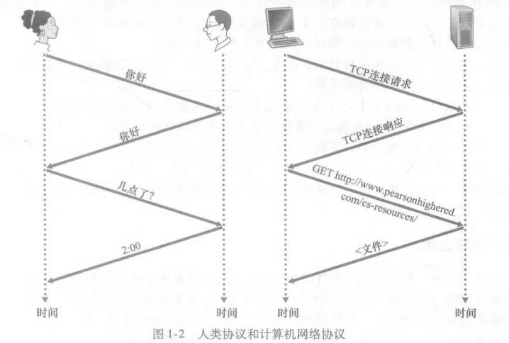

人类协议（至少说是好的行为方式）要求一方首先进行问候（图1.2中的第一个“你好”），以开始与另一个人的通信。对“你好”的典型响应是返回一个“你好”报文。此人用一个热情的“你好”进行响应，隐含着一种指示,表明能够继续向那人询问时间了。对最初的“你好”的不同响应（例如“不要烦我!”,或“我不会说英语”，或某些不合时宜的回答）也许表明了一个勉强的或不能进行的通信。在此情况下，按照人类协议，发话者就不能询问时间了。有时，问的问题根本得不到任何回答，在此情况下，发话者通常会放弃向这个人询问时间。注意在我们人类协议中,有我们发送的特定报文，也有我们根据接收到的应答报文或其他事件（例如在某个给定的时间内没有回答）采取的动作。显然，发送和接收的报文，以及这些报文发送和接收或其他事件出现时所采取的动作，这些在一个人类协议中起到了核心作用。如果人们使用不同的协议（例如，如果一个人讲礼貌，而另一人不讲礼貌，或一个人明白时间的概念，而另一人却不理解），这些协议就不能交互，因而不能完成有用的工作。在网络中这个道理同样成立。即为了完成一项工作，要求两个（或多个）通信实体运行相同的协议。

我们再考虑第二个人类类比的例子。假定你正在大学课堂里上课（例如上的是计算机网络课程）。教师正在唠唠叨叨地讲述协议，而你惑不解。这名教师停下来问:“同学们有什么问题吗？”（教师发送出一个报文，该报文被所有没有睡觉的学生接收到了）你举起了手（向教师发送了一个隐含的报文）。这位教师面带微笑地示意你说:“请讲……”（教师发出的这个报文鼓励你提出问题，教师喜欢被问问题。）接着你就问了问题（向该教师传输了你的报文）。教师听取了你的问题（接收了你的问题报文）并加以回答（向你传输了回答报文）。我们再一次看到了报文的发送和接收，以及这些报文发送和接收时所采取的一系列约定俗成的动作，这些是这个“提问与回答”协议的关键所在。

#### 2.网络协议

网络协议类似于人类协议，除了交换报文和采取动作的实体是某些设备（可以是计算机、智能手机、平板电脑、路由器或其他具有网络能力的设备）的硬件或软件组件。在因特网中，涉及两个或多个远程通信实体的所有活动都受协议的制约。例如，在两台物理上连接的计算机中，硬件实现的协议控制了在两块网络接口卡间的“线上”的比特流；在端系统中，拥塞控制协议控制了在发送方和接收方之间传输的分组发送的速率；路由器中的协议决定了分组从源到目的地的路径。在因特网中协议运行无处不在，因此本书的大量篇幅都与计算机网络协议有关。

以大家可能熟悉的一个计算机网络协议为例，考虑当你向一个Web服务器发出请求（即你在Web浏览器中键入一个Web网页的URL）时所发生的情况。图1・2右半部分显示了这种情形。首先，你的计算机将向该Web服务器发送一条连接请求报文，并等待回答。该Web服务器将最终能接收到连接请求报文，并返回一条连接响应报文。得知请求该Web文档正常以后，计算机则在一条GET报文中发送要从这台Web服务器上取回的网页名字。最后，Web服务器向计算机返回该Web网页（文件）。

从上述的人类活动和网络例子中可见，报文的交换以及发送和接收这些报文时所采取的动作是定义一个协议的关键元素:

> 协议（protocol）定义了在两个或多个通信实体之间交换的报文的格式和顺序，以及报文发送和/或接收一条报文或其他事件所采取的动作。

因特网（更一般地说是计算机网络）广泛地使用了协议。不同的协议用于完成不同的通信任务。当你阅读完这本书后将会知道，某些协议简单而直截了当，而某些协议则复杂且晦涩难懂。掌握计算机网络领域知识的过程就是理解网络协议的构成、原理和工作方式的过程。

## 1.2 网络边缘

在上一节中，我们给出了因特网和网络协议的总体概述。现在我们将更深入一些来探究计算机网络（特别是因特网）的部件。在本节中，我们从网络边缘开始，观察一下我们更为熟悉的部件，即我们日常使用的计算机、智能手机和其他设备。在接下来的一节中,我们将从网络边缘向网络核心推进，查看计算机网络中的交换和选路。

回想前一节中计算机网络的术语，通常把与因特网相连的计算机和其他设备称为端系统。如图1・3所示，因为它们位于因特网的边缘，故而被称为端系统。因特网的端系统包括了桌面计算机（例如，桌面PC、Mac和Linux设备）、服务器（例如，Web和电子邮件服务器）和移动计算机（例如，便携机、智能手机和平板电脑）。此外，越来越多的非传统物品正被作为端系统与因特网相连（参见“历史事件”）。

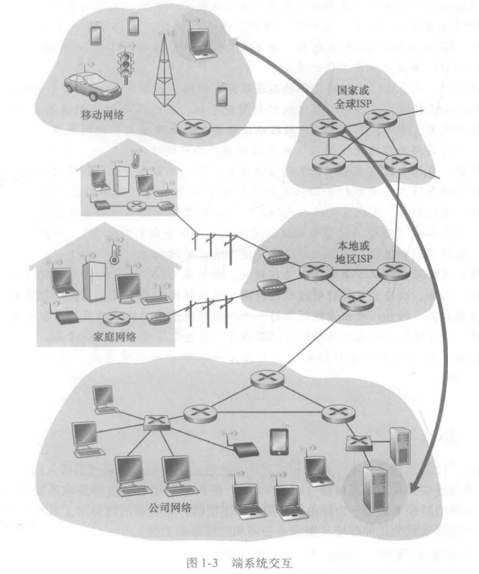

端系统也称为主机（host）,因为它们容纳（即运行）应用程序，如Web浏览器程电话118序、Web服务器程序、电子邮件客户程序或电子邮件服务器程序等。本书通篇将交替使用主机和端系统这两个术语，即主机二端系统。主机有时又被进一步划分为两类：客户（client）和服务器（server）。<u>客户通常是桌面PC、移动PC和智能手机等，而服务器通常是更为强大的机器，用于存储和发布Web页面、流视频、中继电子邮件等。</u>今天,大部分提供搜索结果、电子邮件、Web页面和视频的服务器都属于大型数据中心（datacenter）。例如，谷歌公司（Google）拥有50~100个数据中心，其中15个大型数据中心每个都有10万台以上的服务器。

> 物联网：
>
> 你能够想象几乎每样东西都与因特网无线连接的一个世界吗？能够想象在这个世界上连接了大多数人、汽车、自行车、眼镜、手表、玩具、医疗设备、家用传感器、教室、视频监视系统、大气传感器、陈列架产品和宠物吗？这种物联网（InternetofThings,IoT）事实上就在不远的某处。
>
> 据估计，在2015年有50亿件物品连接到因特网，到了2020年该数字能够达到250亿[Gartner2014]。这些物品包括我们的智能手机，它已经跟随我们遍及我们的家庭、办公室和汽车，向1SP和因特网应用程序报告我们的地理位置和使用数据。而除了智能手机，各种各样的非传统“物品”也已经作为产品可供使用。例如，有因特网连接的可穿戴设备，包括手表（来自苹果和许多其他生产商）和眼镜。因特网连接的眼镜能够将我们看到的每样东西上载到云端，允许我们与世界各地的人们实时共享我们的视觉体验。对于智能家居，有因特网连接的物品，包括恒温调节器（能够通过智能手机远程控制）以及人体秤（能够通过智能手机以图形化方式审查我们的饮食）。有因特网连接的玩具，包括识别和解释孩子讲话并适当地进行响应的玩偶。
>
> 物联网给用户带来了革命性的潜在好处。但与此同时，也存在巨大的安全风险和隐私风险。例如，攻去者可能能够通过因特网入侵物联网设备或服务器，以收集来自物联网设备的数据。例如，攻击者能够劫持一个与因特网连接的玩偶并直接与孩子交谈，或者能够入侵存储个人健康或活动信息的数据库，这些信息来自可穿戴设备。这些安全和隐私问题可能会使消费者渐渐地失去信心，并可能导致消费者的广泛接受程度下降[FTC2015]

### 1.2.1 接入网

考虑了位于“网络边缘”的应用程序和端系统后，我们接下来考虑接入网,这是指将端系统物理连接到其**边缘路由器**（edgerouter）的网络。边缘路由器是端系统到任何其他远程端系统的路径上的第一台路由器。图1・4用粗的、带阴影的线显示了几种类型的接入链路和使用接入网的几种环境（家庭、公司和广域移动无线）。

#### 1.家庭接入：DSL、电缆、FTTH、拨号和卫星

2014年，在发达国家中，实现因特网接入的家庭超过78%,名列前茅的韩国、荷兰、图芬兰和瑞典实现因特网接入的家庭则超过80%,几乎所有家庭都是经过高速宽带连接[ITU2015]。考虑到家庭对网络接入的强烈兴趣，我们从家庭与因特网的连接开始介绍接入网概况。

今天，宽带住宅接入有两种最流行的类型：数字用户线（DigitalSubscriberLine,DSL）和电缆。住户通常从提供本地电话接入的本地电话公司处获得DSL因特网接入。因此，当使用DSL时，用户的本地电话公司也是它的ISP。如图1・5所示，每个用户的DSL调制解调器使用现有的电话线（即双绞铜线，将在1.2.2节中讨论它）与位于电话公司的本地中心局（CO）中的数字用户线接入复用器（DSLAM）交换数据。家庭的DSL调制解调器得到数字数据后将其转换为高频音，以通过电话线传输给本地中心局；来自许多家庭的模拟信号在DSLAM处被转换回数字形式。

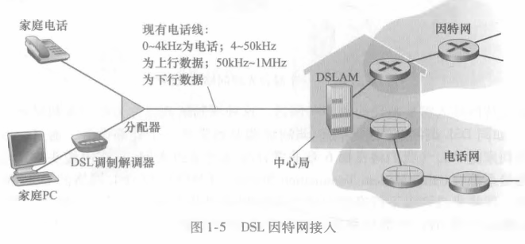

家庭电话线同时承载了数据和传统的电话信号，它们用不同的频率进行编码：

- 高速下行信道，位于50kHz到1MHz频段；
- 中速上行信道，位于4kHz到50kHz频段；
- 普通的双向电话信道，位于0到4kHz频段。

这种方法使单根DSL线路看起来就像有3根单独的线路一样，因此一个电话呼叫和一个因特网连接能够同时共享DSL链路。（1.3.1节将描述这种频分复用技术。）在用户一侧，一个分配器把到达家庭的数据信号和电话信号分隔开，并将数据信号转发给DSL调制解调器。在电话公司一侧，在本地中心局中，DSLAM把数据和电话信号分隔开，并将数据送往因特网。数百甚至上千个家庭与同一个DSLAM相连［Dischinger2007］。

DSL标准定义了多个传输速率，包括12Mbps下行和1.8Mbps上行传输速率［ITU1999］,以及55Mbps下行和15Mbps±行传输速率［ITU2006］。因为这些上行速率和下行速率是不同的，所以这种接入被称为是不对称的。实际取得的下行和上行传输速率也许小于上述速率，因为当DSL提供商提供分等级的服务（以不同的价格使用不同的速率）时,他们也许有意地限制了住宅速率，或者因为家庭与本地中心局之间的距离、双绞线的规格和电气干扰的程度而使最大速率受限。工程师特别为家庭与本地中心局之间的短距离接入设计了DSL；—般而言，如果住宅不是位于本地中心局的5~10英里（1英里=1609.344米）范围内，该住宅必须采用其他形式的因特网接入。

DSL利用电话公司现有的本地电话基础设施，而电缆因特网接入（cableInternetaccess）利用了有线电视公司现有的有线电视基础设施。住宅从提供有线电视的公司获得了电缆因特网接入。如图1・6所示，光缆将电缆头端连接到地区枢纽，从这里使用传统的同轴电缆到达各家各户和公寓。每个地区枢纽通常支持500-5000个家庭。因为在这个系统中应用了光纤和同轴电缆，所以它经常被称为混合光纤同轴（HybridFiberCoax,HFC）系统。

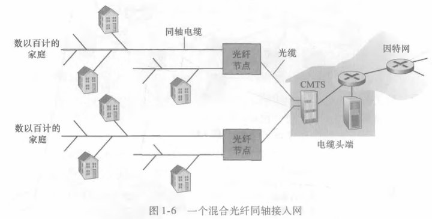

电缆因特网接入需要特殊的调制解调器，这种调制解调器称为电缆调制解调器（cablemodem）o如同DSL调制解调器，电缆调制解调器通常是一个外部设备，通过一个以太网端口连接到家庭PC。（我们将在第6章非常详细地讨论以太网。）在电缆头端，电缆调制解调器端接系统（CableModemTerminationSystem,CMTS）与DSL网络的DSLAM具有类似的功能，即将来自许多下行家庭中的电缆调制解调器发送的模拟信号转换回数字形式。电缆调制解调器将HFC网络划分为下行和上行两个信道。如同DSL,接入通常是不对称的，下行信道分配的传输速率通常比上行信道的高。DOCSIS2.0标准定义了高达42.8Mbps的下行速率和高达30.7Mbps的上行速率。如在DSL网络中的情况那样，由于较低的合同数据率或媒体损耗，可能不一定能达到最大可取得的速率。

电缆因特网接入的一个重要特征是共享广播媒体。特别是，由头端发送的每个分组向下行经每段链路到每个家庭；每个家庭发送的每个分组经上行信道向头端传输。因此，如果几个用户同时经下行信道下载一个视频文件，每个用户接收视频文件的实际速率将大大低于电缆总计的下行速率。而另一方面，如果仅有很少的活跃用户在进行Web冲浪，则每个用户都可以以全部的下行速率接收Web网页，因为用户们很少在完全相同的时刻请求网页。因为上行信道也是共享的，需要一个分布式多路访问协议来协调传输和避免碰撞。(我们将在第6章中更为详细地讨论碰撞问题。)

尽管DSL和电缆网络当前代表了超过85%的美国住宅宽带接入，但一种提供更高速率的新兴技术是光纤到户(FiberToTheHome,FTTH)[FTTHCouncil2016]o顾名思义,FTTH概念简单，从本地中心局直接到家庭提供了一条光纤路径。现在，许多国家或地区,包括阿拉伯联合酋长国、韩国、中国香港、日本、新加坡、中国台湾、立陶宛和瑞典，入«||户率已经超过了30%[FTTHCouncil2016]。

从本地中心局到家庭有几种有竞争性的光纤分布方案。最简单的光纤分布网络称为直接光纤，从本地中心局到每户设置一根光纤。更为一般的是，从中心局岀来的每根光纤实际上由许多家庭共享，直到相对接近这些家庭的位置，该光纤才分成每户一根光纤。进行这种分配有两种有竞争性的光纤分布体系结构：主动光纤网络（ActiveOpticalNetwork,AON)和被动光纤网络(PassiveOpticalNetwork,P0N)。AON本质上就是交换因特网,我们将在第6章讨论它。

这里，我们简要讨论一下PON,该技术用于Verizon的FIOS服务中。图1・7显示了使用PON分布体系结构的FTTH。每个家庭具有一个光纤网络端接器(OpticalNetworkTermi・nator,ONT),它由专门的光纤连接到邻近的分配器(splitter)o该分配器把一些家庭(通常少于100个)集结到一根共享的光纤，该光纤再连接到本地电话和公司的中心局中的光纤线路端接器(OpticalLineTenninator,OLT)0该OLT提供了光信号和电信号之间的转换，经过本地电话公司路由器与因特网相连。在家庭中，用户将一台家庭路由器(通常是无线路由器)与ONT相连，并经过这台家庭路由器接入因特网。在PON体系结构中，所有从OLT发送到分配器的分组在分配器(类似于一个电缆头端)处复制。

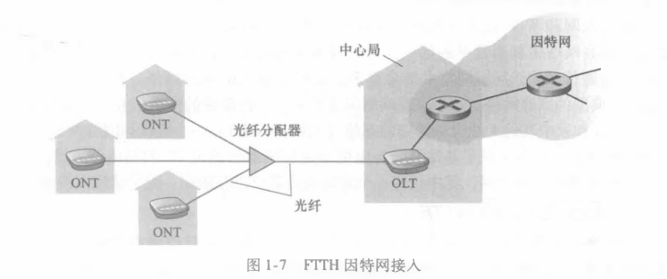

 FTTH有潜力提供每秒千兆比特范围的因特网接入速率。然而，大多数FTTH ISP提供多种不同速率选择，较高的速率自然花费更多。美国FTTH用户在2011年的平均下行速率大约为20Mbps（与13Mbps电缆接入网相当，而小于5MbpsDSL）[FTTHCouncil2011b]。

还可采用另外两种接入网技术为家庭提供因特网接入。在无法提供DSL、电缆和FTTH的地方（例如在某些乡村环境），能够使用卫星链路将住宅以超过1Mbps的速率与因特网相连。StarBand和HughesNet是两家这样的卫星接入提供商。使用传统电话线的拨号接入与DSL基于相同的模式：家庭的调制解调器经过电话线连接到ISP的调制解调器。与DSL和其他宽带接入网相比，拨号接入56kbps的慢速率是令人痛苦的。

#### 2.企业（和家庭）接入：以太网和WiFi

在公司和大学校园以及越来越多的家庭环境中，使用局域网（LAN）将端系统连接到边缘路由器。尽管有许多不同类型的局域网技术，但是以太网到目前为止是公司、大学和家庭网络中最为流行的接入技术。如图1-8中所示，以太网用户使用双绞铜线与一台以太网交换机相连，第6章中将详细讨论该技术。以太网交换机或这样相连的交换机网络，则再与更大的因特网相连。使用以太网接入，用户通常以100Mbps或lGbps速率接入以太网交换机，而服务器可能具有lGbps甚至10Gbps的接入速率。

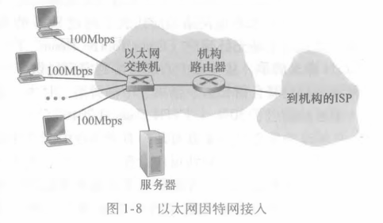

然而，越来越多的人从便携机、智能手机、平板电脑和其他物品无线接入因特网（参见前面的插入内容“物联网”）。在无线LAN环境中，无线用户从/到一个接入点发送/接收分组，该接入点与企业网连接（很可能使用了有线以太网），企业网再与有线因特网相连。一个无线LAN用户通常必须位于接入点的几十米范围内。基于IEEE802.11技术的无线LAN接入,更通俗地称为WiFi,目前几乎无所不在，如大学、商业办公室、咖啡厅、机场、家庭，甚至在飞机上。在许多城市，人们能够站在街头而位于10或20个基站范围all内（对于可浏览的802.11基站全局图，参见[wigle.net2016],这些基站由那些非常热心做这种事情的人发现并记载在Web站点上）。如在第7章详细讨论的那样，802.11今天提供了高达100Mbps的共享传输速率。

虽然以太网和WiFi接入网最初是设置在企业（公司或大学）环境中的，但它们近来已经成为家庭网络中相当常见的部件。今天许多家庭将宽带住宅接入（即电缆调制解调器或DSL）与廉价的无线局域网技术结合起来，以产生强大的家用网络[Edwards2011]。图1・9显示了典型的家庭网络。这个家庭网络组成如下：一台漫游的便携机和一台有线PC；—个与无线PC和家中其他无线设备通信的基站（无线接入点）；一个提供与因特网宽带接入的电缆调制解调器；一台互联了基站及带有电缆调制解调器的固定PC的路由器。该网络允许家庭成员经宽带接入因特网，其中任何一个家庭成员都可以在厨房、院子或卧室漫游上网。

#### 3.广域无线接入：3G和LTE

iPhone和安卓等设备越来越多地用来在移动中发信息、在社交网络中分享照片、观看视频和放音乐。这些设备应用了与蜂窝移动电话相同的无线基础设施，通过蜂窝网提供商运营的基站来发送和接收分组。与WiFi不同的是，一个用户仅需要位于基站的数万米 (而不是几十米)范围内。

电信公司已经在所谓第三代(3G)无线技术中进行了大量投资，3G为分组交换广域无线因特网接入提供了超过1Mbps的速率。甚至更高速率的广域接入技术即第四代(4G)广域无线网络也已经被部署了。LTE(长期演进“Long-TermEvolution”的缩写，被评为最差首字母缩写词年度奖候选者)来源于3G技术，它能够取得超过10Mbps的速率。据报道，几十Mbps的LTE下行速率已经在商业部署中得到应用。我们将在第7章讨论无线网络和移动性，以及WiFi、3G和LTE等技术的基本原则。

### 1.2.2 物理媒体

在前面的内容中，我们概述了因特网中某些最为重要的网络接入技术。当我们描述这些技术时，我们也指出了所使用的物理媒体。例如，我们说过HFC使用了光缆和同轴电缆相结合的技术。我们说过DSL和以太网使用了双绞铜线。我们也说过移动接入网使用了无线电频谱。在这一节中，我们简要概述一下这些和其他常在因特网中使用的传输媒体。

为了定义物理媒体所表示的内容，我们仔细思考一下一个比特的短暂历程。考虑一个比特从一个端系统开始传输，通过一系列链路和路由器，到达另一个端系统。这个比特被漫不经心地传输了许许多多次！源端系统首先发射这个比特，不久后其中的第一台路由器接收该比特；第一台路由器发射该比特，接着不久后第二台路由器接收该比特；等等。因此，这个比特当从源到目的地传输时，通过一系列“发射器-接收器”对。对于每个发射器-接收器对,通过跨越一种物理媒体(physicalmedium)传播电磁波或光脉冲来发送该比特。该物理媒体可具有多种形状和形式，并且对沿途的每个发射器-接收器对而言不必具有相同的类型。物理媒体的例子包括双绞铜线、同轴电缆、多模光纤缆、陆地无线电频谱和卫星无线电频谱。物理媒体分成两种类型：导引型媒体(guidedmedia)和非导引型媒体(unguidedmedia)o对于导引型媒体,电波沿着固体媒体前行，如光缆、双绞铜线或同轴电缆。对于非导引型媒体，电波在空气或外层空间中传播，例如在无线局域网或数字卫星频道中。

在深入讨论各种媒体类型的特性之前，我们简要地讨论一下它们的成本。物理链路(铜线、光缆等)的实际成本与其他网络成本相比通常是相当小的。特别是安装物理链路的劳动力成本能够比材料的成本高出几个数量级。正因为这个原因，许多建筑商在一个建筑物的每个房间中安装了双绞线、光缆和同轴电缆。即使最初仅使用了一种媒体，在不久的将来也可能会使用另一种媒体，这样将来不必再铺设另外的线缆，从而节省了经费。

#### 1.双绞铜线

最便宜并且最常用的导引型传输媒体是双绞铜线。一百多年来，它一直用于电话网。事实上，从电话机到本地电话交换机的连线超过99%使用的是双绞铜线。我们多数人在自己家中和工作环境中已经看到过双绞线。双绞线由两根绝缘的铜线组成，每根大约lmm粗，以规则的螺旋状排列着。这两根线被绞合起来，以减少邻近类似的双绞线的电气干扰。通常许多双绞线捆扎在一起形成一根电缆，并在这些双绞线外面覆盖上保护性防护层。一对电线构成了一个通信链路。无屏蔽双绞线(UnshieldedTwistedPair,UTP)常用在建筑物内的计算机网络中，即用于局域网(LAN)中。目前局域网中的双绞线的数据速率从10Mbps到10Gbpso所能达到的数据传输速率取决于线的粗细以及传输方和接收方之间的距离。

20世纪80年代出现光纤技术时，许多人因为双绞线比特速率低而轻视它，某些人甚至认为光纤技术将完全代替双绞线。但双绞线不是那么容易被抛弃的。现代的双绞线技术例如6a类电缆能够达到lOGbps的数据传输速率，距离长达100m。双绞线最终已经作为高速LAN联网的主导性解决方案。

如前面讨论的那样，双绞线也经常用于住宅因特网接入。我们看到，拨号调制解调器技术通过双绞线能以高达56kbps的速率接入。我们也看到，数字用户线(DSL)技术通过双绞线使住宅用户以超过数十Mbps的速率接入因特网(当用户靠近ISP的中心局居住时)。

#### 2.同轴电缆

与双绞线类似，同轴电缆由两个铜导体组成，但是这两个导体是同心的而不是并行的。借助于这种结构及特殊的绝缘体和保护层，同轴电缆能够达到较高的数据传输速率。同轴电缆在电缆电视系统中相当普遍。我们前面已经看到，电缆电视系统最近与电缆调制解调器结合起来，为住宅用户提供数十Mbps速率的因特网接入。在电缆电视和电缆因特网接入中，发送设备将数字信号调制到某个特定的频段，产生的模拟信号从发送设备传送到一个或多个接收方。同轴电缆能被用作导引型共享媒体(sharedmedium)。特别是，许多端系统能够直接与该电缆相连，每个端系统都能接收由其他端系统发送的内容。

#### 3.光纤

光纤是一种细而柔软的、能够导引光脉冲的媒体，每个脉冲表示一个比特。一根光纤能够支持极高的比特速率，高达数十甚至数百Gbpso它们不受电磁干扰，长达100km的光缆信号衰减极低，并且很难窃听。这些特征使得光纤成为长途导引型传输媒体，特别是跨海链路。在美国和别的地方，许多长途电话网络现在全面使用光纤。光纤也广泛用于因特网的主干。然而，高成本的光设备，如发射器、接收器和交换机，阻碍光纤在短途传输中的应用，如在LAN或家庭接入网中就不使用它们。光载波(OpticalCarrier,OC)标准链路速率的范围从51.8Mbps到39.8Gbps；这些标准常被称为OC-n,其中的链路速率等于nx51.8Mbps。目前正在使用的标准包括OC-1、OC-3、OC-12、OC-24、OC-48、OC-96、OC・192、OC-768o［Mukherjee2006；Ramaswami2010］提供了光纤网络各方面的知识。

#### 4.陆地无线电信道

无线电信道承载电磁频谱中的信号。它不需要安装物理线路，并具有穿透墙壁、提供与移动用户的连接以及长距离承载信号的能力，因而成为一种有吸引力的媒体。无线电信道的特性极大地依赖于传播环境和信号传输的距离。环境上的考虑取决于路径损耗和遮挡衰落（即当信号跨距离传播和绕过/通过阻碍物体时信号强度降低）、多径衰落（由于干扰对象的信号反射）以及干扰（由于其他传输或电磁信号）。

陆地无线电信道能够大致划分为三类：一类运行在很短距离（如1米或2米）；另一类运行在局域，通常跨越数十到几百米；第三类运行在广域，跨越数万米。个人设备如无线头戴式耳机、键盘和医疗设备跨短距离运行；在1・2.1节中描述的无线LAN技术使用了局域无线电信道；蜂窝接入技术使用了广域无线电信道。我们将在第7章中详细讨论无线电信道。

#### 5.卫星无线电信道

一颗通信卫星连接地球上的两个或多个微波发射器/接收器，它们被称为地面站。该卫星在一个频段上接收传输，使用一个转发器（下面讨论）再生信号，并在另一个频率上发射信号。通信中常使用两类卫星：同步卫星（geostationarysatellite）和近地轨道（Low・EarthOrbiting,LEO）卫星［WikiSatellite2016］。

同步卫星永久地停留在地球上方的相同点上。这种静止性是通过将卫星置于地球表面上方36000km的轨道上而取得的。从地面站到卫星再回到地面站的巨大距离引入了可观的280ms信号传播时延。不过，能以数百Mbps速率运行的卫星链路通常用于那些无法使用DSL或电缆因特网接入的区域。

近地轨道卫星放置得非常靠近地球，并且不是永久地停留在地球上方的一个点。它们围绕地球旋转，就像月亮围绕地球旋转那样，并且彼此之间可进行通信，也可以与地面站通信。为了提供对一个区域的连续覆盖，需要在轨道上放置许多卫星。当前有许多低轨道通信系统在研制中。LEO卫星技术未来也许能够用于因特网接入。

## 1.3 网络核心

在考察了因特网边缘后，我们现在更深入地研究网络核心，即由互联因特网端系统的  分组交换机和链路构成的网状网络。图1・10用加粗阴影线勾画出网络核心部分。 

### 1.3.1 分组交换

在各种网络应用中，端系统彼此交换报文（message）。报文能够包含协议设计者需要的任何东西。报文可以执行一种控制功能（例如，图1・2所示例子中的“你好”报文），也可以包含数据，例如电子邮件数据、JPEG图像或MP3音频文件。为了从源端系统向目的端系统发送一个报文，源将长报文划分为较小的数据块，称之为分组（packet）。在源和目的地之间，每个分组都通过通信链路和分组交换机（packetswitch）传送。（交换机主要有两类：路由器（router）和链路层交换机（link-layer*switch）。）分组以等于该链路最大传输速率的速度传输通过通信链路。因此，如果某源端系统或分组交换机经过一条链路发送一个L比特的分组，链路的传输速率为尺比特/秒，则传输该分组的时间为L/R秒。

#### 1.存储转发传输

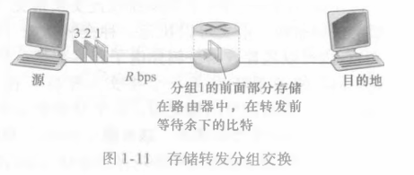

多数分组交换机在链路的输入端使用存储转发传输（store-and-forwardtransmission）机制。存储转发传输是指在交换机能够开始向输岀链路传输该分组的第一个比特之前，必须接收到整个分组。为了更为详细地探讨存储转发传输，考虑由两个端系统经一台路由器连接构成的简单网络，如图Ml所示。一台路由器通常有多条繁忙的链路，因为它的任务就是把一个入分组交换到一条岀链路。在这个简单例子中，该路由器的任务相当简单：将分组从一条（输A）链路转移到另一条唯一的连接链路。在图1・11所示的特定时刻，源已经传输了分组1的一部分，分组1的前沿已经到达了路由器。因为该路由器应用了存储转发机制，所以此时它还不能传输已经接收的比特，而是必须先缓存（即“存储”）该分组的比特。仅当路由器已经接收完了该分组的所有比特后，它才能开始向出链路传输（即“转发”）该分组。为了深刻领悟存储转发传输，我们现在计算一下从源开始发送分组到目的地收到整个分组所经过的时间。（这里我们将忽略传播时延—指这些比特以接近光速的速度跨越线路所需要的时间，这将在1.4节讨论。）源在时刻0开始传输，在时刻L/R秒,因为该路由器刚好接收到整个分组，所以它能够朝着目的地向出链路开始传输分组；在时刻20/尺，路由器已经传输了整个分组，并且整个分组已经被目的地接收。所以，总时延是2L/R。如果交换机一旦比特到达就转发比特（不必首先收到整个分组），则因为比特没有在路由器保存，总时延将是L/R。但是如我们将在1.4节中讨论的那样，路由器在转发前需要接收、存储和处理整个分组。

现在我们来计算从源开始发送第一个分组到目的地接收到所有三个分组所需的时间。与前面一样，在时刻L/R,路由器开始转发第一个分组。而在时刻L/R源也开始发送第二个分组，因为它已经完成了第一个分组的完整发送。因此，在时刻2L/R,目的地已经收到第一个分组并且路由器已经收到第二个分组。类似地，在时刻3L/R，目的地已经收到前两个分组并且路由器已经收到第三个分组。最后，在时刻4L/R,目的地已经收到所有3个分组!

我们现在来考虑下列一般情况：通过由N条速率均为R的链路组成的路径（所以,在源和目的地之间有N-1台路由器），从源到目的地发送一个分组。应用如上相同的逻辑，我们看到端到端时延是：

你也许现在要试着确定P个分组经过N条链路序列的时延有多大。

#### 2.排队时延和分组丢失

每台分组交换机有多条链路与之相连。对于每条相连的链路，该分组交换机具有一个**输出缓存**（outputbuffer,也称为输出队列（outputqueue））,它用于存储路由器准备发往那条链路的分组。该输出缓存在分组交换中起着重要的作用。如果到达的分组需要传输到某条链路，但发现该链路正忙于传输其他分组，该到达分组必须在输出缓存中等待。因此，除了存储转发时延以外，分组还要承受输岀缓存的排队时延（queuingdelay）。这些时延是变化的，变化的程度取决于网络的拥塞程度。因为缓存空间的大小是有限的，一个到达的分组可能发现该缓存已被其他等待传输的分组完全充满了。在此情况下，将出现分组**丢失**（丢包）（packetloss）,到达的分组或已经排队的分组之一将被丢弃。

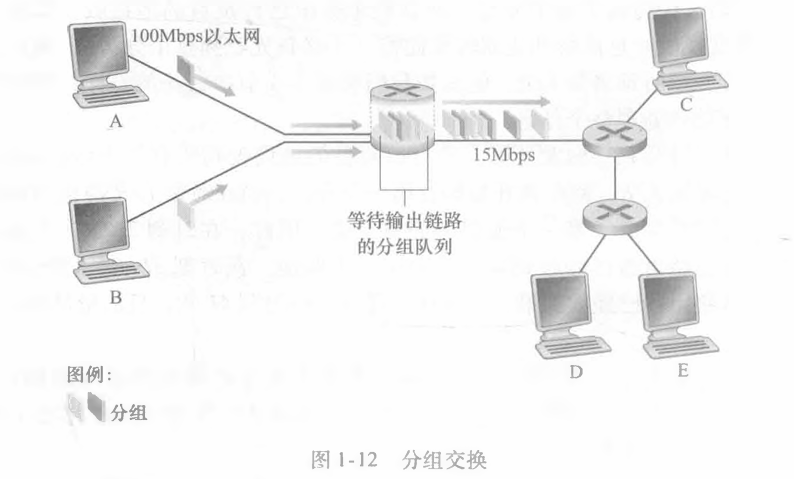

图1・12显示了一个简单的分组交换网络。如在图1・11中，分组被表示为三维厚片。厚片的宽度表示了该分组中比特的数量。在这张图中，所有分组具有相同的宽度，因此有相同的长度。假定主机A和B向主机E发送分组。主机A和B先通过100Mbps的以太网链路向第一个路由器发送分组。该路由器则将这些分组导向到一条15Mbps的链路。在某个短时间间隔内，如果分组到达路由器的到达率（转换为每秒比特）超过了15Mbps，这些分组在通过链路传输之前，将在链路输出缓存中排队，在该路由器中将出现拥塞。例如，如果主机A和主机B每个都同时发送了5个紧接着的分组突发块，则这些分组中的大多数将在队列中等待一些时间。事实上，这完全类似于每天都在经历的一些情况，例如当我们在银行柜台前排队等待或在过路收费站前等待时。我们将在1・4节中更为详细地研究这种排队时延。

#### 3.转发表和路由选择协议

前面我们说过，路由器从与它相连的一条通信链路得到分组，然后向与它相连的另一条通信链路转发该分组。但是路由器怎样决定它应当向哪条链路进行转发呢？不同的计算机网络实际上是以不同的方式完成分组转发的。这里，我们简要介绍在因特网中所采用的方法。

在因特网中，每个端系统具有一个称为IP地址的地址。当源主机要向目的端系统发送一个分组时，源在该分组的首部包含了目的地的IP地址。如同邮政地址那样，该地址具有一种等级结构。当一个分组到达网络中的路由器时，路由器检查该分组的目的地址的一部分，并向一台相邻路由器转发该分组。更特别的是，每台路由器具有一个转发表(forwarding table),用于将目的地址(或目的地址的一部分)映射成为输岀链路。当某分组到达一台路由器时，路由器检查该地址，并用这个目的地址搜索其转发表，以发现适当的出链路。路由器则将分组导向该出链路。

端到端选路过程可以用一个不使用地图而喜欢问路的汽车驾驶员来类比。例如，假定Joe驾车从费城到佛罗里达州奥兰多市的LakesideDrive街156号。Joe先驾车到附近的加油站，询问怎样才能到达佛罗里达州奥兰多市的LakesideDrive街156号。加油站的服务员从该地址中抽取了佛罗里达州部分，告诉Joe他需要上1・95南州际公路，该公路恰有一个邻近该加油站的入口。他又告诉Joe,一旦到了佛罗里达后应当再问当地人。于是，Joe上了1・95南州际公路，一直到达佛罗里达的Jacksonville，在那里他向另一个加油站服务员问路。该服务员从地址中抽取了奥兰多市部分，告诉Joe他应当继续沿1・95公路到Dayto-na海滩，然后再问其他人。在Daytona海滩，另一个加油站服务员也抽取该地址的奥兰多部分，告诉Joe应当走1・4公路直接前往奥兰多。Joe走了1・4公路，并从奥兰多出口下来。Joe又向另一个加油站的服务员询问，这时该服务员抽取了该地址的LikesideDrive部分,告诉了Joe到LakesideDrive必须要走的路。一旦Joe到达了LaResideDrive,他向一个骑自行车的小孩询问了到达目的地的方法。这个孩子抽取了该地址的156号部分，并指示了房屋的方向。Joe最后到达了最终目的地。在上述类比中，那些加油站服务员和骑车的孩子可类比为路由器。

我们刚刚学习了路由器使用分组的目的地址来索引转发表并决定适当的出链路。但是这个叙述还要求回答另一个问题：转发表是如何进行设置的？是通过人工对每台路由器逐台进行配置，还是因特网使用更为自动的过程进行配置呢？第5章将深入探讨这个问题。但在这里为了激发你的求知欲，我们现在将告诉你因特网具有一些特殊的**路由选择协议**（routing protocol）,用于自动地设置这些转发表。例如，一个路由选择协议可以决定从每台路由器到每个目的地的最短路径，并使用这些最短路径结果来配置路由器中的转发表。怎样才能实际看到分组在因特网中所走的端到端路由呢？我们现在请你亲手用一下Traceroute程序。直接访问站点www.traceroute,org,在一个特定的国家中选择一个源，跟踪从该源到你的计算机的路由。（参见1.4节有关Traceroute的讨论。）

### 1.3.2 电路交换

通过网络链路和交换机移动数据有两种基本方法：电路交换（circuitswitching）和分组交换（packetswitching）。上一小节已经讨论过分组交换网络，现在我们将注意力转向电路交换网络。

在电路交换网络中，在端系统间通信会话期间，预留了端系统间沿路径通信所需要的资源（缓存，链路传输速率）。在分组交换网络中，这些资源则不是预留的；会话的报文按需使用这些资源，其后果可能是不得不等待（即排队）接入通信线路。一个简单的类比是，考虑两家餐馆，一家需要顾客预订，而另一家不需要预订，但不保证能安排顾客。对于需要预订的那家餐馆，我们在离开家之前必须承受先打电话预订的麻烦，但当我们到达该餐馆时，原则上我们能够立即入座并点菜。对于不需要预订的那家餐馆，我们不必麻烦地预订餐桌，但当我们到达该餐馆时，也许不得不先等待一张餐桌空闲后才能入座。

传统的电话网络是电路交换网络的例子。考虑当一个人通过电话网向另一个人发送信息（语音或传真）时所发生的情况。在发送方能够发送信息之前，该网络必须在发送方和接收方之间建立一条连接。这是一个名副其实的连接，因为此时沿着发送方和接收方之间路径上的交换机都将为该连接维护连接状态。用电话的术语来说，该连接被称为一条电路（circuit）。当网络创建这种电路时，它也在连接期间在该网络链路上预留了恒定的传输速率（表示为每条链路传输容量的一部分）。既然已经为该发送方——接收方连接预留了带宽，则发送方能够以确保的恒定速率向接收方传送数据。

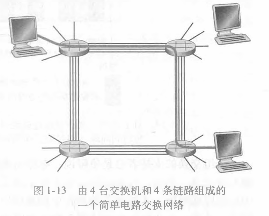

图1-13显示了一个电路交换网络。在这个网络中，用4条链路互联了4台电路交换机。这些链路中的每条都有4条电路，因此每条链路能够支持4条并行的连接。每台主机（例如PC和工作站）都与一台交换机直接相连。

当两台主机要通信时，该网络在两台主机之间创建一条专用的端到端连接（end・to-endconnection）。因此，主机A为了向主机B发送报文，网络必须在两条链路的每条上先预留一条电路。在这个例子中，这条专用的端到端连接使用第一条链路中的第二条电路和第二条链路中的第四条电路。因为每条链路具有4条电路，对于由端到端连接所使用的每条链路而言，该连接在连接期间获得链路总传输容量的1/4。例如,如果两台邻近交换机之间每条链路具有1Mbps传输速率，则每个端到端电路交换连接获得250kbps专用的传输速率。

与此相反，考虑一台主机要经过分组交换网络（如因特网）向另一台主机发送分组所发生的情况。与使用电路交换相同，该分组经过一系列通信链路传输。但与电路交换不同的是，该分组被发送进网络，而不预留任何链路资源之类的东西。如果因为此时其他分组也需要经该链路进行传输而使链路之一出现拥塞，则该分组将不得不在传输链路发送侧的缓存中等待而产生时延。因特网尽最大努力以实时方式交付分组，但它不做任何保证。

#### 1.电路交换网络中的复用

链路中的电路是通过频分复用(Frequency-DivisionMultiplexing,FDM)或时分复用（Time-DivisionMultiplexing,TDM）来实现的。对于FDM,链路的频谱由跨越链路创建的所有连接共享。特别是，在连接期间链路为每条连接专用一个频段。在电话网络中，这个频段的宽度通常为4kHz（即每秒4000周期）。毫无疑问，该频段的宽度称为带宽（bandwidth）。调频无线电台也使用FDM来共享88MHz~108MHz的频谱，其中每个电台被分配一个特定的频段。

对于一条TDM链路，时间被划分为固定期间的帧，并且每个帧又被划分为固定数量的时隙。当网络跨越一条链路创建一条连接时.网络在每个帧中为该连接指定一个时隙。这些时隙专门由该连接单独使用，一个时隙（在每个帧内）可用于传输该连接的数据。

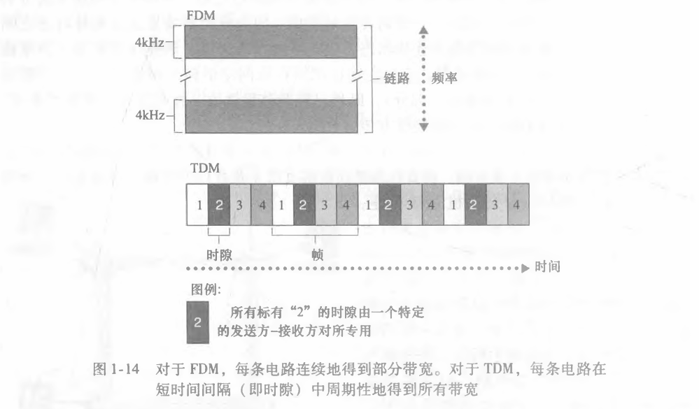

图1・14显示了一个支持多达4条电路的特定网络链路的FDM和TDM。对于FDM,其频率域被分割为4个频段，每个频段的带宽是4kHz。对于TDM,其时域被分割为帧，在每个帧中具有4个时隙，在循环的TDM帧中每条电路被分配相同的专用时隙。对于TDM,一条电路的传输速率等于帧速率乘以一个时隙中的比特数量。例如，如果链路每秒传输8000个帧，每个时隙由8个比特组成，则每条电路的传输速率是64kbps。

分组交换的支持者总是争辩说，电路交换因为在静默期（silentperiod）专用电路空闲而不够经济。例如，打电话的一个人停止讲话，空闲的网络资源（在沿该连接路由的链路中的频段或时隙）不能被其他进行中的连接所使用。作为这些资源不能有效利用的另一个例子，考虑一名放射科医师使用电路交换网络远程存取一系列X射线图像。该放射科医师建立一条连接，请求一幅图像，然后判读该图像，然后再请求一幅新图像。在放射科医师判读图像期间，网络资源分配给了该连接但没有使用（即被浪费了）。分组交换的支持者还津津乐道地指岀，创建端到端电路和预留端到端带宽是复杂的，需要复杂的信令软件以协调沿端到端路径的交换机的操作。

在结束讨论电路交换之前，我们讨论一个用数字表示的例子，它更能说明问题的实质。考虑从主机A到主机B经一个电路交换网络发送一个640000比特的文件需要多长时间。假如在该网络中所有链路使用具有24时隙的TDM,比特速率为1.536Mbps。同时假定在主机A能够开始传输该文件之前，需要500ms创建一条端到端电路。它需要多长时间才能发送该文件？每条链路具有的传输速率是1.536Mbps/24=64kbps,因此传输该文件需要（640kb）/（64kbps）=10s。这个10s,再加上电路创建时间，这样就需要10.5s发送该文件。值得注意的是，该传输时间与链路数量无关：端到端电路不管是通过一条链路还是100条链路，传输时间都将是10s。（实际的端到端时延还包括传播时延，参见1.4节。）

#### 2.分组交换与电路交换的对比

在描述了电路交换和分组交换之后，我们来对比一下这两者。分组交换的批评者经常争辩说，分组交换不适合实时服务（例如，电话和视频会议），因为它的端到端时延是可变的和不可预测的（主要是因为排队时延的变动和不可预测所致）。分组交换的支持者却争辩道：

①它提供了比电路交换更好的带宽共享；

②它比电路交换更简单、更有效，实现成本更低。

分组交换与电路交换之争的有趣讨论参见［Molinero-Fernandez2002］。概括而言，嫌餐馆预订麻烦的人宁可要分组交换而不愿意要电路交换。

分组交换为什么更有效呢？我们看一个简单的例子。假定多个用户共享一条1Mbps链路，再假定每个用户活跃周期是变化的，某用户时而以100kbps恒定速率产生数据，时而静止—这时用户不产生数据。进一步假定该用户仅有10%的时间活跃（余下的90%的时间空闲下来喝咖啡）。对于电路交换，在所有的时间内必须为每个用户预留100kbps。例如，对于电路交换的TDM,如果一个1s的帧被划分为10个时隙，每个时隙为100ms,则每帧将为每个用户分配一个时隙。

因此，该电路交换链路仅能支持10（=1Mbps/100kbps）个并发的用户。对于分组交换，一个特定用户活跃的概率是0.1（即10%）.如果有35个用户，有11或更多个并发活跃用户的概率大约是0.0004。（课后习题P8概述如何得到这个概率值。）当有10个或更少并发用户（以概率0.9996发生）时，到达的聚合数据速率小于或等于该链路的输出速率1Mbps。因此，当有10个或更少的活跃用户时，通过该链路的分组流基本上没有时延，这与电路交换的情况一样。当同时活跃用户超过10个时，分组的聚合到达速率超过该链路的输出容量，则输出队列将开始变长。（一直增长到聚合输入速率重新低于1Mbps,此后该队列长度才会减少。）因为在本例子中同时活跃用户超过10个的概率极小，分组交换差不多总是提供了与电路交换相同的性能，并且允许在用户数量是其3倍时情况也是如此。

我们现在考虑第二个简单的例子。假定有10个用户，某个用户突然产生1000个1000比特的分组，而其他用户则保持静默，不产生分组。在每帧具有10个时隙并且每个时隙包含1000比特的TDM电路交换情况下，活跃用户仅能使用每帧中的一个时隙来传输数据，而每个帧中剩余的9个时隙保持空闲。该活跃用户传输完所有106比特数据需要10s的时间。在分组交换情况下，活跃用户能够连续地以1Mbps的全部链路速率发送其分组,因为没有其他用户产生分组与该活跃用户的分组进行复用。在此情况下，该活跃用户的所有数据将在Is内发送完毕。

上面的例子从两个方面表明了分组交换的性能能够优于电路交换的性能。这些例子也强调了在多个数据流之间共享链路传输速率的两种形式的关键差异。电路交换不考虑需求，而预先分配了传输链路的使用，这使得已分配而并不需要的链路时间未被利用。另一方面，分组交换按需分配链路使用。链路传输能力将在所有需要在链路上传输分组的用户之间逐分组地被共享。

虽然分组交换和电路交换在今天的电信网络中都是普遍采用的方式，但趋势无疑是朝着分组交换方向发展。甚至许多今天的电路交换电话网正在缓慢地向分组交换迁移。特别是，电话网经常在昂贵的海外电话部分使用分组交换。

### 1.3.3 网络的网络

我们在前面看到，端系统（PC、智能手机、Web服务器、电子邮件服务器等）经过一个接入ISP与因特网相连。该接入ISP能够提供有线或无线连接，使用了包括DSL、电缆、FTTH、WiFi和蜂窝等多种接入技术。值得注意的是，接入ISP不必是电信局或电缆公司，相反，它能够是如大学（为学生、教职员工和从业人员提供因特网接入）或公司（为其雇员提供接入）这样的单位。但让端用户和内容提供商连接到接入ISP仅解决了连接难题中的很小一部分，因为因特网是由数以亿计的用户构成的。要解决这个难题，接入ISP自身必须互联。通过创建网络的网络可以做到这一点，理解这个短语是理解因特网的关键。

年复一年，构成因特网的“网络的网络”已经演化成为一个非常复杂的结构。这种演化很大部分是由经济和国家策略驱动的，而不是由性能考虑驱动的。为了理解今天的因特网的网络结构，我们以逐步递进方式建造一系列网络结构，其中的每个新结构都更好地接近现在的复杂因特网。回顾前面互联接入ISP的中心目标，是使所有端系统能够彼此发送分组。一种幼稚的方法是使每个接入ISP直接与每个其他接入ISP连接。当然，这样的网状设计对于接入ISP费用太高，因为这将要求每个接入ISP要与世界上数十万个其他接入ISP有一条单独的通信链路。

我们的第一个网络结构即网络结构1,用单一的全球传输ISP互联所有接入ISP。我们假想的全球传输ISP是一个由路由器和通信链路构成的网络，该网络不仅跨越全球，而且至小具有一台路由器靠近数十万接入ISP中的每一个。当然，对于全球传输ISP，建造这样一个大规模的网络将耗资巨大。为了有利可图，自然要向每个连接的接入ISP收费，其价格反映（并不一定正比于）一个接入ISP经过全球ISP交换的流量大小。因为接入ISP向全球传输ISP付费，故接入ISP被认为是客户（customer）,而全球传输ISP被认为是提供商(provider)。

如果某个公司建立并运营一个可赢利的全球传输ISP,其他公司建立自己的全球传输ISP并与最初的全球传输ISP竞争则是一件自然的事。这导致了网络结构2,它由数十万接AISP和多个全球传输ISP组成。接入ISP无疑喜欢网络结构2胜过喜欢网络结构1,因为它们现在能够根据价格和服务因素在多个竞争的全球传输提供商之间进行选择。然而，值得注意的是，这些全球传输ISP之间必须是互联的；不然的话，与某个全球传输ISP连接的接入ISP将不能与连接到其他全球传输ISP的接入ISP进行通信。

刚才描述的网络结构2是种两层的等级结构，其中全球传输提供商位于顶层，而接入ISP位于底层。这假设了全球传输ISP不仅能够接近每个接入ISP,而且发现经济上也希望这样做。现实中，尽管某些ISP确实具有令人印象深刻的全球覆盖，并且确实直接与许多接入ISP连接，但世界上没有哪个ISP是无处不在的。相反，在任何给定的区域，可能有一个区域ISP(regionalISP),区域中的接入ISP与之连接。每个区域ISP则与第一层ISP(tier-1 ISP)连接。第一层ISP类似于我们假想的全球传输ISP,尽管它不是在世界上每个城市中都存在，但它确实存在。有大约十几个第一层ISP,包括Level3Communications.AT&T、Sprint和NTT。有趣的是，没有组织正式认可第一层状态。俗话说：如果必须问你是否是一个组织的成员，你可能不是。

再来讨论这个网络的网络，不仅有多个竞争的第一层ISP,而且在一个区域可能有多个竞争的区域ISP。在这样的等级结构中，每个接入ISP向其连接的区域ISP支付费用,并且每个区域ISP向它连接的第一层ISP支付费用。(一个接入1SP也能直接与第一层ISP连接，这样它就向第一层1SP付费。)因此，在这个等级结构的每一层，都有客户-提供商关系。值得注意的是，第一层1SP不向任何人付费，因为它们位于该等级结构的顶部。更为复杂的情况是，在某些区域，可能有较大的区域ISP(可能跨越整个国家)，该区域中较小的区域ISP与之相连，较大的区域ISP则与第一层ISP连接。例如，在中国，每个城市有接入ISP,它们与省级ISP连接，省级ISP又与国家级ISP连接，国家级ISP最终与第一层ISP连接［Thm2012］。这个多层等级结构仍然仅仅是今天因特网的粗略近似，我们称它为网络结构3。

为了建造一个与今天的因特网更为相似的网络，我们必须在等级化网络结构3上增加存在点(PointofPresence,PoP)、多宿、对等和因特网交换点。PoP存在于等级结构的所有层次，但底层(接入ISP)等级除外。一个POP只是提供商网络中的一台或多台路由器(在相同位置)群组，其中客户ISP能够与提供商ISP连接。对于要与提供商PoP连接的客户网络，它能从第三方电信提供商租用高速链路将它的路由器之一直接连接到位于该PoP的一台路由器。任何ISP(除了第一层ISP)可以选择多宿(multi-home),即可以与两个或更多提供商ISP连接。例如，一个接入ISP可能与两个区域ISP多宿，既可以与两个区域ISP多宿，也可以与一个第一层ISP多宿。当一个ISP多宿时，即使它的提供商之一出现故障，它仍然能够继续发送和接收分组。

正如我们刚才学习的，客户ISP向它们的提供商ISP付费以获得全球因特网互联能力。客户ISP支付给提供商ISP的费用数额反映了它通过提供商交换的通信流量。为了减少这些费用，位于相同等级结构层次的邻近一对ISP能够对等(peer),也就是说，能够直接将它们的网络连到一起，使它们之间的所有流量经直接连接而不是通过上游的中间ISP传输。当两个ISP对等时，通常不进行结算，即任一个ISP不向其对等付费。如前面提到的那样，第一层ISP也与另一个第一层ISP对等，它们之间无结算。对于对等和客户-提供商关系的讨论，［VanderBerg2008］是一本不错的读物。沿着这些相同路线，第三方公司能够创建一个因特网交换点(InternetExchangePoint,TXP),IXF是一个汇合点，多个ISP能够在这里一起对等。IXP通常位于一个有自己的交换机的独立建筑物中［Ager2012］,在今天的因特网中有400多个IXP［IXPList2016］.我们称这个生态系统为网络结构4—由接入ISP、区域ISP、第一层ISP、PoP、多宿、对等和IXP组成。

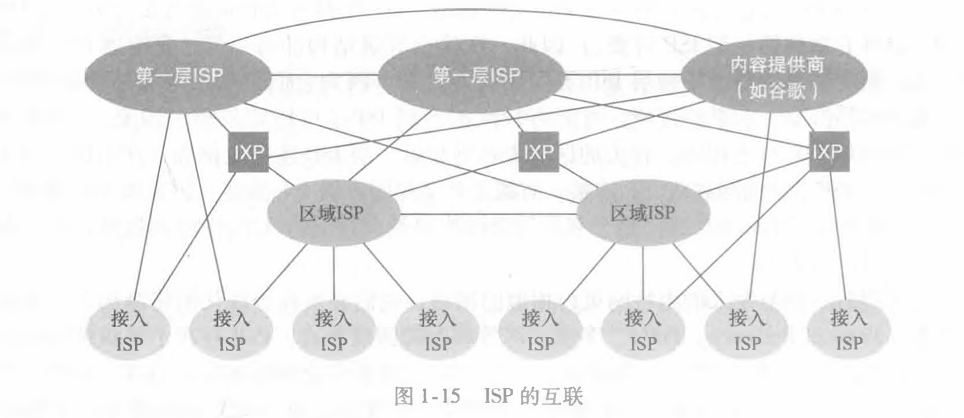

我们现在最终到达了网络结构5,它描述了现今的因特网。在图1・15中显示了网络结构5,它通过在网络结构4顶部增加内容提供商网络(contentprovidernetwork)构建而成。谷歌是当前这样的内容提供商网络的一个突岀例子。在本书写作之时，谷歌估计有50~100个数据中心分布于北美、欧洲、亚洲、南美和澳大利亚。其中的某些数据中心容纳了超过十万台的服务器，而另一些数据中心则较小，仅容纳数百台服务器。谷歌数据中心都经过专用的TCP/IP网络互联，该网络跨越全球，不过独立于公共因特网。重要的是，谷歌专用网络仅承载岀入谷歌服务器的流量。如图1・15所示，谷歌专用网络通过与较低层ISP对等（无结算），尝试“绕过”因特网的较高层，采用的方式可以是直接与它们连接,或者在IXP处与它们连接［Labovitz2010］。然而，因为许多接入ISP仍然仅能通过第一层网络的传输到达，所以谷歌网络也外第一层ISP连接，并就与这些ISP交换的流量向它们付费。通过创建自己的网络，内論供商不仅减少了向顶层ISP支付的费用，而且对其服务最终如何交付给端用户有了更多的控制。谷歌的网络基础设施在2.6节中进行了详细描述。

总结一下，今天的因特网是一个网络的网络，其结构复杂，由十多个第一层ISP和数十万个较低层ISP组成。ISP覆盖的区域多种多样，有些跨越多个大洲和大洋，有些限于狭窄的地理区域。较低层的ISP与较高层的ISP相连，较高层ISP彼此互联。用户和内容提供商是较低层ISP的客户，较低层ISP是较高层ISP的客户。近年来，主要的内容提供商也已经创建自己的网络，直接在可能的地方与较低层ISP互联。