# 前言

## 致学生

操作系统是一个令人激动的软件领域，因为操作系统（OS）的设计对计算机的总体功能和性能都有着重要的影响。在初次学习操作系统时，理解所有操作系统设计背后的原理（principle）是非常重要的，而且还要留意这些原理如何在真实操作系统中实现。

> 本书特色
>
> 本书提供了对各种有关的操作系统原理和实现的一个全面描述，并在补充内容里提供了背景信息、真实示例以及编程练习。
>
> 1. 理解性示例：表现了在UNIX和Windows操作系统系列中如何实际运用书中的原理。
> 2. 实验练习：通过使用Windows和Linux/UNIX，让学生获得亲身体验。

**本书的目标就是要提供一个操作系统原理的全面讨论，并补充解决问题的算法、代码和实现工具**，通过实验练习来帮助读者理解当代操作系统实践，特别是对UNIX和Windows操作系统的理解。本书试图通过在正文中讨论原理，并把大部分的实践材料放在补充讨论和实验中，把概念性内容与应用性内容区分开来。

问题的核心在于概念性的内容。很多操作系统原理可以使用形式化的（数学的）术语或者在非形式化的讨论中进行描述。非形式化的描述相对容易阅读，但形式化的描述更为准确。例如，字典的一种非形式化的解释可能为：“它是一个术语的列表，同时有各个术语的定义说明。”然而形式化的描述可能指明字典是“一种机制f，将某术语x映射到该术语的定义f(x）。"第一种解释是直观的，而第二种解释主要关注字典的逻辑描述。第一种描述表明字典是一个列表或表的实现，而第二种描述包含的实现方式范围，可以从表到列表，到关联存储器，到数据库，到Web服务器等。非形式化的定义说明有如一部字典，但形式化的定义说明还适用于编译器符号表。本书的目标是解释操作系统的一般原理，并使读者对如何设计操作系统有一个深人的理解。实现该目标最好使用形式化的描述，因为它集中于概念的逻辑目的，而不是如何实现概念的一个例子。本书在前面的章节中使用非形式化的或专门的叙述来描述操作系统的概念，很少有形式化的描述。但随着讨论的深人，形式化的描述会逐渐增加。概念的形式化讨论中总是伴随有非形式化的讨论和示例。

操作系统是围绕着性能问题进行设计的。如果性能太低，则它是一个失败的操作系统。然而，对性能的详细讨论往往会使概念模糊。因为在学习操作系统时，概念是十分重要的一部分，所以本书在各个部分逐步涉及分析和性能理论。本书将经常提及性能问题，并提供性能问题的非形式化的解释。这将使读者对性能问题有一个直观认识，可以在以后再正式地学习它。如果关于性能的评价符合概念的描述，那么会把它们包括在概念的讨论之中。

如前所述，使用真正的操作系统代码进行实验，有助于理解操作系统概念是如何在真正的系统中实现的。同样本书也提供了两种其他类型的资料，帮助读者学习有关当前操作系统的实践：示例和实验练习。

- 示例解释了在UNIX、Linux、Windows或者其他操作系统中如何应用或实现这些概念。其中不少示例都是代码例子，有助于读者领会操作系统如何实现书中的理论。大部分例子是来自完整程序的C代码段，其中这些完整程序已经编译和执行过。其他例子使用C语言对算法和实现技术进行了描述，这些描述故意忽略了细节，这些细节在实际实现中是必不可少的，但并不影响对算法的理解。当代码是一个实际的实现时，代码的上下文中会说明，否则总是假定它是一个算法或技术的描述。我已经使用伪代码语言进行了实验描述，但学生和本书的审阅者通常喜欢使用C语言，请留意不要认为用C语言的描述是完整的实现。
- 书中也包括实验练习。每个练习中都提出一个问题，然后提供了解决问题所需的全面的背景知识，并帮助你设计解决方案。这些练习用到了各种UNIX和Windows操作系统，将带给你宝贵的实践经验。
- UNIX还是Windows？对于讨论哪个系列的操作系统更好这一问题，老师可能有不同的看法。我在教授操作系统课程时，有时使用UNIX，有时使用Windows。无论使用哪一种操作系统，书中都提供了足够的示例以及实验练习。你的老师可能会选择某一种操作系统，并指导你阅读这些示例并解决实验练习。不要轻易跳过其他操作系统的实现细节，它将拓宽你的视野，并且对你未来的编程生涯十分有益。

在此提及几个要注意的地方。首先就是有关术语的使用。我们很难避免在高级科学和工程课程上使用一些术语，所以，为了学习高级专题（如操作系统），你至少要知道一些术语。这样在开始操作系统的学习时，你已经积累起一些术语（如“算法”“随机存储器”、“千兆字节”和“链表”），并能使用这些术语和其他编程人员相互讨论。没有谁知道或能够记住所有技术术语。为了解决这个问题，本书的后面提供了一个术语表，其中可能会遗漏一些术语，如果碰到一些并没有定义的术语，请参看软件术语字典，如http：//inf.astrian.net/jargon/。

操作系统中有很多复杂的理念。我们在碰上这类系统时，要循序渐进地学习。例如，当你要学习如何骑自行车时，必须要学会转弯、停止、平衡还有移动。如果你要写一篇如何骑自行车的论文，则先要粗略地涉及转弯、停止、平衡还有移动，然后再详细描述它们。第一阶段需要说明所有的部分而不用告诉读者太多的细节。第二阶段需要提供转弯的细节（例如，在你慢慢地学习转弯去保持平衡以及向前运动，还有诸如此类的动作时，都需要去转动车把）。操作系统也是很难在一个阶段中学会的。当开始学习进程时，你会对内存和文件感到很惊奇。在“两阶段”策略中，你在第一阶段先了解一下各部分的大致情况，然后在第二阶段开始学习细节。有时还有第三阶段，特别适合于理解这些细节在一个特定的操作系统中如何实现。这种多阶段策略是递归进行的。

对本书而言，第1～3章是第一阶段。第4一14章是第二阶段，是操作系统的主要部分。第15~18章也是第二阶段，涉及相关核心技术的主题。第19章仍然是第二阶段，涉及有关操作系统的设计问题。第20、21章是第三阶段，介绍Linux和WindowsNT。每一章的论述也采取了类似的策略：首先对内容进行概述，然后进行详细介绍，最后安排实验练习。对操作系统的研究一直以来就是计算机科学中最具挑战性和令人激动的领域之一。我希望本书使得操作系统的复杂结构变得容易理解，并且避免使其中简单的内容让人厌烦。祝你在操作系统的学习中好运，并且希望你比我想像得更喜欢这门课程。


# 第1章 导言

如图1-1所示，操作系统（OS）就像是指挥者，它协调计算机所有的组件，并使得各个组件能依照某个计划协同工作。当管弦乐队热身时，所有的乐器会产生杂音，但是，当指挥者进行指挥时，所有的乐器会协调工作并产生一组令人愉快的声音。指挥者设定音乐的节奏，用信号通知不同的乐器，控制管弦乐队的各个不同乐器的音量等。同样，操作系统将计算机不同的组件分配给不同的程序，同步各个程序的活动，并提供必要的机制使得程序能协调地执行。

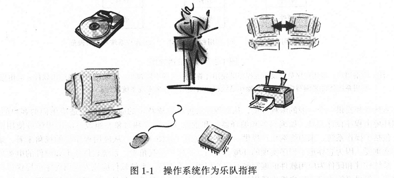

效率和功能是一个操作系统可用的关键因素。操作系统的效率为计算机上所有软件的性能提高提供了平台，研究操作系统的一个最重要的原因是学习如何获得最好的性能。另外，操作系统提供了一系列功能以支持用户程序的执行。提供较少功能的高性能操作系统实际上会迫使应用程序做更多的工作。这本书将教你如何更有效地使用系统的功能。尤其是，你必须理解系统是如何设计的，这样你才可能在编程中充分使用系统的功能。

我们将探讨在操作系统设计中出现的问题，以及分析和解决这些问题的各种方法。所有的操作系统都是在各种不同的限制条件和环境下设计的，设计的结果往往反映在系统的应用编程接口中。设计可能是不连续的、不规则的，或者是逻辑上自相矛盾的。如果你理解了隐藏在接口后的相关设计，你就会明白这种设计决策的合理性，就可以更好地使用操作系统。你对操作系统了解越多，你就会发现它们仍然存在设计缺陷。本书将教会你如何避开这些设计缺陷，并由此改进你自己的操作系统设计模型。通过理解设计中的问题和决策，以及对一些问题的权衡处理，你将能够更好地利用一个操作系统的设计去编写软件。

本章讲解什么是操作系统及其发展与现状。首先，将触及所有软件环境，从而使你看到操作系统在其中的地位。然后，将介绍现代操作系统的要求—抽象和共享，以及它们出现后的情况。最后，考察流行操作系统的策略，看一下它们是如何影响现代操作系统提供的服务。

## 1.1 计算机与软件

计算机系统由硬件和软件组成，它们结合在一起形成了解决一些特定问题的工具。根据应用目的的不同，软件是有区别的。应用软件是设计用于解决一个专门问题的。例如，库存控制应用软件就是用计算机跟踪和报告一个公司的存货情况的。电子邮件软件则使人们可以使用它来相互通信。文档编辑程序为文本文档的编辑和排版提供了方便。电子制表软件允许用户存储和操纵信息来提供决策支持。总之，任何计算机的价值可以通过应用软件的价值来评定。任何人或公司买计算机是为了解决特定于他们需求的信息处理问题。正如图1-2a所示，计算机终端用户所看到的是应用软件。任何其他软硬件只是需要运行这个应用软件的总开销的一部分。

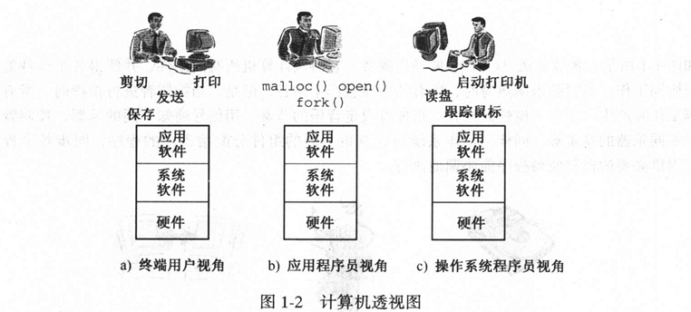

系统软件提供一个一般的编程环境，从而程序员可以生成特定的应用程序以适应他们的客户的需要。编程环境由程序设计工具（如编辑器和编译器）和抽象（如文件和对象）组成。应用程序员使用系统软件，包括了操作系统，来为终端用户提供一系列的应用（见图1-2b）。从应用程序员的视角来看，系统软件非常重要，因为它界定了程序实现的环境。然而，从用户的视角看，系统软件还不如硬件的电源那么重要。系统软件和硬件为应用软件的编写和有效使用提供了支持。系统软件应该为应用程序员提供尽可能多的功能。但尽可能为终端用户提供通用的功能。通用的功能也是最有效的。为了使机器资源（如处理器时间和内存）更多地花费在应用程序上，系统软件对机器资源的使用应该尽可能最少。

通过去掉有关的系统软件，我们可以使系统软件对资源的使用减少。但是应用软件必须提供本应该是系统软件所实现的功能。想像一下，你仅仅为了读写一个磁盘设备就不得不实现一个文件系统。我们现在知道了我们需要系统软件，问题是需要多少系统软件及多少功能？Macintosh系统软件提供了一套编程工具，微软编程环境也提供了一套不同的工具，Java也有自己的一套系统软件功能，UNIX系统提供了另一套不同的编程工具集。

一般系统软件设计的最初动机，主要是提供一些程序员可以使用的功能以备应用软件调用。后来，系统软件（特别是操作系统）实现了另一个重要的目的：使应用软件能够以有序的方式去共享硬件。例如，一个程序正在从磁盘读数据而另一个程序在计算一个数的平方根。共享提高了系统整体的性能，它让不同的程序同时去使用计算机的不同部件，通过减少所有程序执行的时间，从而提高了系统的性能。一般说来，操作系统是系统软件的一部分，操作系统保证共享的实现最安全和有效，它是“最贴近硬件”的软件实现，其他的系统软件和所有的应用软件把操作系统作为使用硬件的一个界面。操作系统程序员编写控制硬件的软件（实现共享和抽象），给应用程序员提供一个可以使用的软件环境（见图1-2c）。

### 1.1.1 通常的系统软件

系统软件创建了两种环境：首先是允许用户与计算机进行交互，其次为应用程序提供可以使用的工具和插件。为终端用户和程序员提供了他们可以使用的、具有人性化的计算机界面的工具，如电子桌面和文本编辑器。终端用户管理他们的邮件、文档、数字信息，而程序员管理他们的软件。

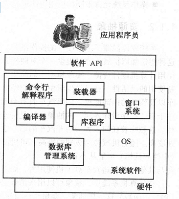

> 注：系统软件提供了范围广泛的服务，从编译器到数据库管理系统等软件都包含在内。应用程序员通过调用系统软件的应用编程接口来调用系统服务。操作系统是系统软件的一部分，它像其他系统软件一样，也为程序员提供了一套应用编程接口来调用其功能。

在以前的程序设计课程上，你学会了使用系统软件提供的应用编程接口（API）来编写程序（见图1-3）。编译器将程序翻译成适合运行的形式，装载器将程序复制到内存执行，类库用来完成一些功能，如格式化输人及输出或创建对象。例如在C和C++程序设计环境中，一些重要的工具是在C运行时库系统软件中（通过使用不同种类的.h文件访问）实现的。包括：

- 标准的输入/输出（I/O）库提供过程实现数据流的缓冲输人/输出，如printf（）和scanf（）。
- 数学库提供计算功能的函数，如sqrt（）。
- 图形库提供如drawCircle（）之类以位图显示方式渲染图像的函数。

其他的系统软件实现了系统的逻辑组件。类库为应用程序员提供了大量的函数，能被应用程序调用，这些组件是计算环境必不可少的部分。下面是这些组件的例子：

- 命令行解释程序（也称作外壳程序）是一个基于文本的程序，用户可以利用它来与系统软件进行交互。用户在Windows下使用dir命令，UNIX下使用ls命令，命令行解释程序就会对它们进行解释，引起系统软件列出目录下的条目。UNIX系统的sh程序和csh程序，Linux的bash程序和Windows的cmd.exe程序都是命令行解释程序的例子。
- 窗口系统也是系统软件，它为应用程序提供了虚拟终端。其中窗口被冠以“虚拟”是因为应用程序可以用函数读写窗口，好像该窗口是一个终端设备似的，尽管并没有特定的物理终端与窗口相关联。系统软件对这些虚拟终端的操作进行映射，使它们对应于一个屏幕的特定物理区域，将应用软件对虚拟终端的操作，转换成相应在物理终端上的操作。一台物理终端可以支持几个虚拟终端。例如，Macintoshdesktop，theMicrosoftWindowsdesktop，以及Linux的Gnomedesktop都是窗口系统。
- 数据库管理系统（DBMS）可以将信息保存在计算机的永久性存储设备中。数据库系统提供了抽象的数据类型（称为模式（schema））；并根据模式定义，生成优化的专门应用程序，可用于对数据的有效查询和更新。应用程序使用的复杂数据结构实例越多，使用数据库管理系统的好处就越大。数据库管理系统的例子包括Oracle或MySQL关系数据库系统。

购买计算机的个人和组织是为了解决他们的信息处理问题。例如，商人买计算机是为了处理记帐信息；军事组织买计算机是为了计算弹导导弹的轨道；个人买计算机是为了玩游戏和网上冲浪。买计算机的每个原因都界定了一个应用领域，也就是计算机要解决的问题集合。在记帐应用领域中，利息程序可以开发票，并跟踪帐户余额等。对弹道导弹的轨道进行计算的应用领域中，程序可以用来解决有关瞄准一个发射物的问题。在个人计算机系统中，程序用来玩游戏，对文档进行文本编辑，以及用web浏览器上网。

一些系统软件，如图形库，就是专门应用于一个特定领域的，而在其他的领域可能是没有用处的；其他系统软件，如关系型数据库，它的应用就很广泛，它可以支持许多不同的应用领域的程序。在数据库的例子中，可以为不同的领域设计不同的数据库管理系统。当一种数据库技术被选定用于某个领域，它会有针对性地进一步进行专门化的设计，以更好地支持某个子领域，例如用于图像处理系统和人工智能专家系统等。甚至在图像处理的数据库系统软件中，为支持特定的应用，可能进行更进一步的专门化设计。例如，一个图像数据库可能只是用于支持单色的地形学图像处理。

操作系统是如何区别于其他的系统软件的呢？这里描述的是一些基本的区别。随着你对操作系统更深人地学习，你将了解到更多的区别。

- 操作系统直接作用于硬件之上，它为其他系统软件和应用软件提供接口。
- 通用的操作系统是与应用领域无关的。这意味着操作系统可支持很多应用领域软件，如库存管理软件以及计算飞机机翼的空气动力特性的软件等。
- 应用程序使用操作系统所提供的资源抽象，从而使用硬件资源部件。
- 操作系统允许不同的应用程序通过它所提供的资源管理策略来共享硬件资源。

### 1.1.2 资源抽象

系统软件隐藏了下层硬件的操作细节。这意味着用户不必知道更多的硬件知识就可以使用计算机。将这种想法加以扩展，通过提供一个对硬件部件操作的抽象模型，从而使一个应用程序员可以相对容易地去使用计算机硬件资源。抽象模型不但简化了应用程序员对硬件的控制使用，同时也限制了对该硬件部件控制使用的灵活性。在日常生活中，我们经常会碰上这种抽象。就拿开汽车来说，你没必要理解发动机、刹车以及驾驶的内部原理。如果汽车具有自动换档功能，你就不必了解汽车是如何换档的（即使有档位)。由于有“程序设计界面”的抽象，这是完全可能的。汽车出现的最初半个世纪里，只能使用手工操作换档。这意味着任何人如果想开汽车的话，他必须了解离合器和不同的齿轮一—小的齿轮速度较低而大齿轮速度高。随着机械抽象级别的提高，司机仅需要用按钮如“P”、“D”、“R”对档位进行选择。其他的档位（中档和低档）可能从不被使用。今天，司机能关注于更高级的功能的使用，如最佳道路选择、速度、避免与其他汽车相碰及车载手机使用等，而不是主要专注于转弯、刹车、换档。

在计算机系统中，抽象可以用来消除必须要处理的一些乏味的细节。如果没有将字符写到显示器上（如打印函数）这一层抽象，要想在视频显示器上用12磅大小Arial字体输出“Hello，world”字符串，你必须要了解设定屏幕位图的许多细节。而C程序员只需要知道printf（）函数和stdio类库，不用了解所有其他的细节。程序员不用关心底层的实现细节，可以集中精力编写代码来解决特定的问题。

抽象在简化了应用程序员控制硬件的方式的同时，也限制了操纵特定硬件的灵活性。通用性是有代价的，也就是说，当一些操作变得容易实现时，其他的一些操作就无法使用这种抽象来完成。仔细考虑一个自动的银行出纳机时你就会明白。例如，一个自动的银行出纳机可以提供这样一种抽象操作，允许客户按-个按钮，就可以从他的帐户中取出特定数量的钱。假定出纳机仅提供了几种抽象操作，可以从帐户上提取20美元、40美元、100美元或200美元。这样客户就不能提取到30美元，机器操作起来很容易，但不灵活。

计算机系统中有很多不同种类的硬件部件，被作为资源（resource）可以在应用程序中使用。任何一种特定的资源，例如一个磁盘驱动器，都有一个通用的接口，其中定义了程序员如何使用该资源来完成需要的操作。一个抽象的接口比实际的硬件接口简单得多，就像前面例子中的虚拟终端一样。抽象是在系统软件中实现的，使用抽象编程可以使程序员在使用一种资源时，无需去了解它的物理接口实现，而只关心它的抽象接口就可以了（抽象屏蔽了设备的具体操作)，从而程序员可以集中精力于高层次的一些问题上。

很多情况下，类似的资源可以被抽象成一个通用（common）抽象资源接口。例如，系统软件可以将软磁盘和硬磁盘操作抽象成一个抽象的磁盘接口，当程序员编程时，只需要知道使用磁盘抽象就可以了，而无需关心所用磁盘的动作行为，以及磁盘输人/输出的具体细节。就开汽车来说，抽象也是十分常见的，你可以租一辆汽车并立即驾驶它，然而这辆汽车你可能从没见过。出租车里的抽象和你自己汽车的抽象是一样的。如果这种抽象不是一样的话，想像一下可能产生的灾难场景：有些汽车的方向盘顺时针转时，车向左开，而有的车却向右开。

在设计系统软件的时候，你必须首先为资源定义一组普通的抽象，它应是非常直观的并适合于多个应用领域。磁盘设备的文件抽象就是这样的一个例子。好的抽象使得程序员十分容易地理解和使用，也使得程序员容易执行对资源的各种操作。

面向对象的程序员使用类层次进行工作时采用了多级抽象。基类定义了对象最基本的抽象操作，子类为这个家族特定的成员重新定义操作。下面这个磁盘设备抽象的例子展示了高于一级抽象的使用。一旦一个硬件部件已经简化为一个接口，那么在高一层次的系统软件中，可以再定义对该资源的抽象，从而成为一个更高层的抽象。最初的磁盘块模式操作，抽象成了磁盘扇区操作，又进一步通用化成使用整数块地址操作。而整数地址化的块，又抽象成一个包含逻辑字节流的相关块的列表。可以看到，使用“资源”而不用“硬件部件”的原因，是为了抽象计算机部件（物理资源)，或者抽象软部件，而软部件是一种抽象资源。

> 示例：磁盘设备抽象
>
> 通过考察对磁盘设备的输出操作的多级抽象，可以发现资源抽象背后隐藏的思想。磁盘设备可通过软件操作从计算机的内存拷贝一内存块信息到设备的缓存中（见图1-4a)：
>
> ```
> load(block,length,device);
> ```
>
> 移动读/写头到磁盘表面特定的区域：
>
> ```
> seek(device,track);
> ```
>
> 把一块数据从缓存中写人设备：
>
> ```
> out(device,sector);
> ```
>
> 若要把信息从内存块写人磁盘，那就需要一系列的操作，实现如下：
>
> ```
> load(block,length,device);
> seek(device,236);
> out(device,9);
> ```
>
> 一个简单的抽象（见图1-4b）会打包这些命令形成一个write()过程（包括所有其他必须补充的命令)，内容如下：
>
> ```
> void write (char *block,int len,int device,int track,int sector)
> {
> 	...
> 	load(block,len,device);
> 	seek(device,236);
> 	out(device,9);
> 	...
> }
> 
> ```
>
> 磁盘上的数据块地址是用磁道号和扇区号指定的，如load指令中的236和out指令中的9。高层次的抽象要将特定的块地址进行转换，使得可以使用一个正数地址而不必使用特定磁盘的地址（如seek（）函数中的236磁道和out（）函数中的9扇区)。这就允许程序员在指定写磁盘上的某个部分时，只使用逻辑地址，而无需留意它们的物理位置。下面是一个输出操作：
>
> ```
> write(block,100,device,236,9);
> ```
>
> 又可写为：
>
> ```
> write(block,100,device,3788);
> ```
>
> 一个更高层次的抽象会提供系统软件，把磁盘作为文件进行存储操作。假定系统软件中规定了文件标识符（fileidentification/fileID）作为磁盘抽象，那么会有一个相应的库，如C语言中的stdio库，库中提供了写一个整型变量datum（存储在一个小内存块中）到设备上的函数，这会从文件开头一个隐含的偏移位置开始写数据。程序员可以用下面的操作实现写数据到磁盘上（见图1-4c)：
>
> ```
> fprintf(fileID,"%d",datum);
> ```
>
> 这种抽象同样能够用于磁带设备的输人/输出操作，只不过是在实现抽象的系统软件中，有一些部分不同而已。这种方式的抽象将贯穿于本书。

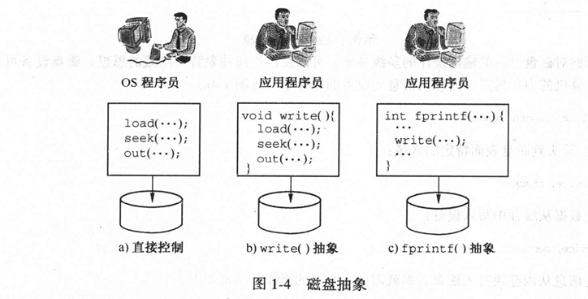

> 注：图中是将信息写到磁盘设备上的三种不同的方式。在a）图中，软件直接操纵硬件来选择块地址，然后用out（）调用将信息写到设备上。在b）图中，抽象的write（）函数包装了机器指令。它也将块信息写到设备上，但它比a）更容易使用。在c）图中，C运行时库函数fprintf（）对write（）函数做了抽象，来完成对设备的输出。

###  1.1.3 资源共享

计算机由于它的计算速度而出名。计算机能在几微秒内计算出一个数字表达式，而人可能需要花几分钟来解决它。速度上的差别使得人误认为计算机能同时执行多个程序，事实上，程序是顺序执行的。操作系统以非常高的速率在各种程序间对硬件来回进行切换，从而导致了这种错觉。这和国际象棋大师能同时和几个对手下棋一样：国际象棋大师轮流和各个对手下棋，但在某一时刻只和一个对手下棋，在第一个对手思索当前棋盘状态时，他会和下一个对手下棋。

计算机有时也支持真正的同步操作。例如，一个程序想要做数字计算，同时另一个想要读一个磁盘设备，然后，操作系统调度硬件以使得两个程序能同时运行。这种情况是可能的，因为计算机的处理单元和磁盘设备在物理上是不同的组件，可以同时使用它们。

在操作系统的研究中，我们模糊了真正的同时执行和看起来是同时执行这两种情况的区别。当看起来两个或多个程序能同时执行，或者真正地在同时执行，这两种情况都称系统支持并发执行（concurrentexecution）。如果两个程序是真正的同时执行，我们就称它为并行执行（parallelexecution）。

并发和并行执行与资源共享的概念都相关。不管程序是并发还是并行执行，它们都共享计算机资源。操作系统在抽象机器间通过透明共享的方式来管理资源。也就是说，用户和应用程序员并没有意识到资源被共享。操作系统也提供了一些机制使得运行的程序可以显式共享资源，这需要应用程序员来管理共享机器资源的方式。首先，我们将描述透明共享然后讨论显式共享。

### 1.1.4 虚拟机和透明资源共享

并发在操作系统设计和应用程序员使用的操作模型中都是十分普遍的。当你在考虑提供给应用程序员和终端用户的程序执行环境时，这一点尤为明显。多个程序能同时执行，每一个看起来就好像在自己的私有计算机上运行一样。这是通过操作系统的设计来完成的。操作系统必须管理计算机的处理器、内存、设备以及所有其他的抽象资源，使得它们能在执行的程序间共享，并将机器的抽象（也称虚拟机）呈现给程序员（见图1-5）。每一个虚拟机是真正计算机的仿真：每个程序都在自己的抽象机器上运行。操作系统通过共享硬件的方式来实现这层抽象，这些硬件对程序员来说是不可见的。在一台虚拟机上运行的程序也称为进程（我们将在第2章和第6.章详述进程的概念）。

有两种共享的方法用于创建虚拟机：空分复用共享和时分复用共享。空分复用共享（space-multiplexedsharing）表示资源可以进一步分割成两个或更多个不同的单元部分来给进程使用。例如，将一个建筑物分成大量的公寓，然后将公寓分配给不同的用户，这是一种空分复用的例子。城市公交车是空分复用的另一个例子，每个人由于都只坐一个位子而共享汽车的使用。在计算机中，虚拟机（进程）能够空分复用那些满足如下属性的资源，即能够将资源的不同单元同时分配给不同进程，内存和磁盘是空分复用资源共享的例子。

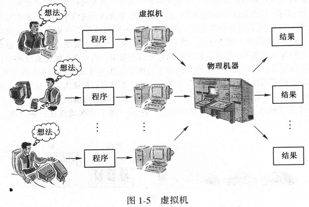

> 注：操作系统通过创建计算机的仿真来为应用程序员提供虚拟机。操作系统可以将物理机器同时仿真出多台虚拟机。

时分复用共享（time-multiplexedsharing）并不是把资源进一步分割成小的单元；相反，一个进程可以在一个短的时间片内独立使用整个资源，其他进程则可以在另外的时候使用这个资源。例如，公共场所停车场的汽车停车位就使用了时分复用技术：一辆汽车在某一时间对停车位置有独占权，但一段时间后，第一辆汽车离开了，第二辆汽车占据了停车位。（汽车使用空分复用来选择一个停靠位置，使用时分复用来共享单个的停车位置。）在城市交通中，出租车就是一个时分复用共享的例子。一个乘客使用出租车，只有当他离开后，另一个乘客才能使用它。在计算机系统中，在一段时间内，进程对整个计算机资源有独占的控制权。当时间片一用完，资源就被释放掉并可以分配给另一个进程。如计算机的处理器资源就采用了时分复用技术。

不同的进程能并发使用系统提供的虚拟机，操作系统使用时分复用或空分复用技术确保了物理机器组件的共享。例如，三个进程的虚拟机以时分复用的技术共享处理器，然而，一个进程的虚拟机可能在读磁盘，另一个进程的虚拟机正在读另一个磁盘，这三个进程利用空分复用的技术使用硬件的不同部分。

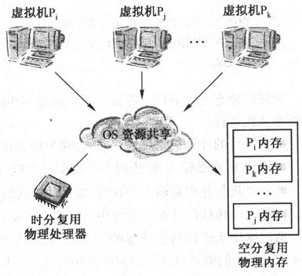

处理器的时分复用共享是虚拟机实现的一个关键的方面，它常常是作为资源共享的一个特例来研究的。虚拟机上的一个进程在一个时间片内使用物理处理器，然后操作系统利用时分复用技术，将处理器分配给另一个虚拟机。同时，计算机的内存通过空分复用的方式来进行共享。这些技术对共享处理器来说是非常重要的，它被称为多道程序设计（multiprogramming）。对多道程序设计的研究贯穿了本书，但是现在我们用一种非形式化的方式描述它（见图1-6）。在这副图中，有N个不同的虚拟机（名为Pi，Pj，...，Pk）。操作系统将物理内存分配给了N个不同的块，然后为每一个虚拟机分配一块。当Pi被载人内存块时，它通过时分复用技术共享处理器。每个进程Pi占用处理器仅一个时间片，但它一直占据着已分配的内存区域。

多道程序设计能提高计算机的性能吗？它不能提升任何单个进程的性能，但是它能提高整个系统的性能。下面是一个演示这一概念的洗汽车的例子：有三辆汽车要清洗。洗汽车的三个操作是冲洗、擦干和车内真空吸尘（见图1-7a）。可以进行如下协调，汽车1被洗的同时汽车2在做车内真空吸尘，汽车3在等待（见图1-7b）。现在，当汽车1被洗完后，然后擦干；同时，汽车2被洗，汽车3在做真空吸尘。当汽车1被擦干后，与汽车2做擦干、汽车3做清洗同时做真空吸尘。当汽车1做完真空吸尘，汽车2也做完擦干，这两辆车就洗完了。剩下的唯一工作是汽车3的擦干工作（而水洗房和真空吸尘房就闲着了）。注意汽车1和汽车2使用了同样长的时间完成整个清洗工作，虽然它们都认为自己是第一个接受服务。汽车3多花了一些时间，但是还是比等待汽车1和汽车2都做完真空吸尘再做洗车少花时间。汽车清洗系统只花了4个时间步清洗三辆汽车。如果按照真空吸尘－洗车－擦干依次清洗这三辆汽车，则需要5个时间步。

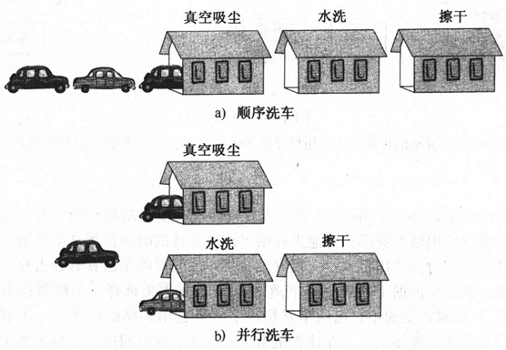

> 注：在图a）中，汽车以相同的顺序穿过过程的每一步。第三辆汽车必须等到前两辆汽车都被清洗之后才能清洗。在b）图中，第三辆汽车在第二辆汽车在清洗的同时被清洁。第三辆车只需要在洗车之前等第二辆车清洁完成。

相同的理念也可应用于进程上。下面是一些进程执行的特征，我们可以对它进行研究以便使用并行技术加速系统运行：

- 在现代的计算机系统中，输人/输出操作比处理器操作要花费更多的时间。
- 进程Pi；在做输入/输出时并不需要处理器（如用户输人信息、调试程序等）。
- 每个进程花费在输入/输出设备上的时间最多（见图1-8a）。
- 在一个传统的计算机系统中，有多个设备，但只有一个处理器。

假定操作系统控制处理器的使用，使得Pi进程进行I/O操作时，其他的进程P使用处理器（见图1-8b），这样我们就可以让进程同时使用计算机不同的部件来实现真正的并行执行。在没有多道程序设计的系统中，N个进程的执行时间分别为t1，t2，...，tn，则N个进程总的执行时间为t1+t2+...+tN。

我们知道任何进程Pi，其最小执行时间为ti。因为进程要进行输人/输出操作和计算操作，如果我们能对进程进行调度，使得每一个进程能同时使用不同的计算机资源，那么执行N个进程的系统时间就等于执行具有最长时间段的进程的时间。也就是：

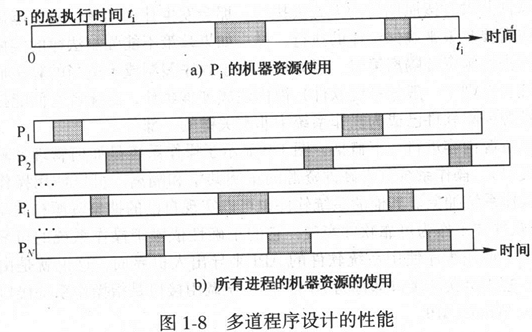

> 注：在图a）中，进程Pi仅使用处理器的三个短的时间片，中间插人了输人/输出操作。当我们在图b）中考虑 N个进程的处理器和I/O活动时，我们可以协调它们的执行，使得一个进程在使用处理器时，其他的进程 进行I/O操作。

```
maximum（t1,t2,...,tn)
```

如果条件满足的话，我们可以达到最大的速度增益。然而，我们知道，在多道程序设计系统中，N个进程的执行时间T满足：

```
maximum(t1,t2,...,tn)≤T
```

通常，我们也有：

```
T<=t1+t2+...+tn
```

有很多事情会导致不能达到最大的并发度。例如，进程必须要在使用处理器和I/O设备上有合适的平衡点。操作系统也要花费时间进行调度。系统中必须要有N-1个设备，进程必须使用所有的N-1个设备等。这就是我们把进程增益表达为一个不等式的原因。我们在本书中将一直研究这个问题。

### 1.1.5 显式资源共享

显式资源共享机制使得进程可以通过它们自己的协调策略来使用普通资源（与操作系统的协调策略相反）。例如，两个进程可以协作计算每月的薪水，它们都要对存储雇员工作时间的文件进行操作。显式资源共享有两个重要的方面，并不依赖它是时分还是空分复用：

- 系统必须根据某种分配策略隔离资源访问。
- 系统必须在有资源请求时，能允许进程相互合作共享资源。

资源隔离（resourceisolation）是操作系统的责任，当资源分配给一个虚拟机使用时，操作系统要阻止其他虚拟机的未授权访问。例如，存储器隔离机制允许两个进程同时加载到存储器的两个不同的部分，但任何虚拟机都不能访问其他虚拟机使用的内存块；处理器隔离机制强制虚拟机顺序地共享处理器。任何一个进程都不能改变或访问另一个进程正在使用的内存内容。

为了大多数虚拟机的正确操作，资源隔离是必须的。但操作系统也必须在有多个请求时，明确地使两个或多个执行的虚拟机能共享资源访问（shareresourceaccess）。授权的共享是必要的，例如，一个进程想共享另一个进程计算出来的结果；两个进程需要共享同一内存块。

操作系统为资源访问提供了隔离机制，但也引进了新的问题。假定程序员想要为两个执行进程共享文件资源的访问。尽管操作系统提供了隔离机制，但必须还要提供合法共享的机制。这也可能是一个阴谋，因为可能有恶意的进程试图访问已分配给另一个进程的资源。如果恶意进程试图访问不属于自己地址空间的内存区域，那它可能破坏另一进程存储的信息。

资源隔离的要求暗含了系统软件和操作系统的另一重要的属性。如果一个进程需要资源隔离，那系统软件必须要提供这种功能。以前的软件开发经验告诉我们软件并不总是按照你的意图去工作。想像一下：

负责资源隔离的系统软件并没有按照期待的方式去执行，那会发生什么问题？资源隔离可能会失败。在现实世界中，这可能就像需要政策来确保法律的执行一样。如果政策不能强制法律的实施，则法律就没什么用处。系统软件被期待去实施资源隔离策略。但如果它由于程序漏洞或不适当的算法而失败，那它就没什么用处。当代操作系统（有别于一般的系统软件）被构建成可信软件，意味着它们能按照策略执行使得整个系统正确地运行。资源隔离软件已成为操作系统中非常关键的一部分。

现在对所学的共享资源内容进行一下概括，图1-9显示了操作系统是如何管理计算机的物理硬件资源的（使用软件一硬件接口）。操作系统负责硬件资源的正确共享和隔离。可以使用操作系统接口（也称系统调用接口）来操纵操作系统抽象。其他的系统软件也可以实现自己的抽象资源和共享机制（如数据库和窗口系统）。这些系统软件并不作为可靠软件实现，它的正确性依赖于操作系统的可靠操作。所有的系统软件抽象通过API访问。应用程序使用系统软件的API来导出人机界面，这也就是由终端用户使用的东西。一般来说，程序员把任何软件接口都称为API，但系统调用接口是指操作系统接口。微软将它的Windows系统调用接口称为Win32API。

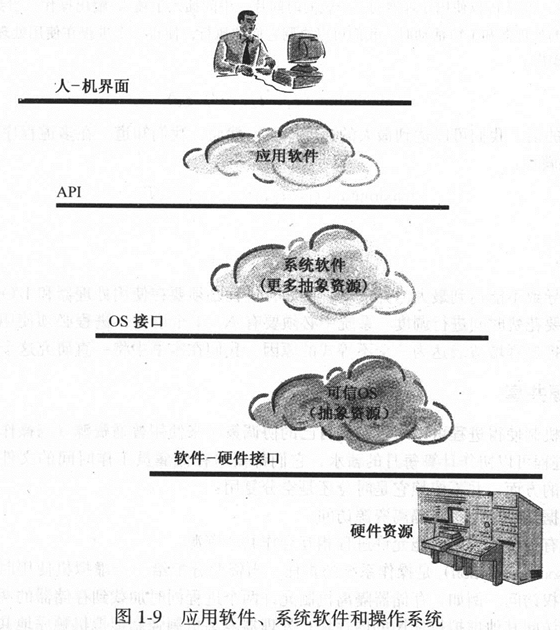

> 注：在应用软件、系统软件和操作系统间有一个层次结构。操作系统使用软件一硬件接口提供的功能来实现操作系统接口。系统软件使用操作系统接口来导出API。应用程序使用API来实现人机交互界面。 

## 1.2 操作系统策略

在操作系统发展的各个历史期间，使用了几种不同的策略来提供操作系统服务。策略是指程序员看到的虚拟机的一般特征。例如，也许在系统中有固定数目的虚拟机，也可以设计虚拟机来为终端用户进行与软件的交互。

特定计算机的策略依赖于商业和工业标准，如计算机怎样被使用的？人机交互更重要还是完成数据处理更重要？同时有多个用户使用计算机吗？实现一种策略而不影响整个机器的性能可能吗？自从第一个操作系统出现以来，有几种通用策略。它们都使用虚拟机的概念来表示资源抽象和资源共享。我们来考虑一下几个重要的操作系统策略。

最早的计算机在一个时间内专门用于一个程序的执行（没有多道程序，特别是没有操作系统)。应用就是整个系统的开销。因为计算机价格十分昂贵，它们仅被使用在国防应用等关键性领域中。为了开发和调试它运行的程序，程序员对整个机器独占访问。当程序调试完成后，机器分配给终端用户去执行程序。由于只有一个程序执行，没有资源共享。系统软件的唯一目的就是通过抽象来简化设备编程。

到1960年，由于经济上的压力和软件技术的发展，用户希望在一台计算机上能并发执行多个程序。需要一种新的操作系统策略来实现资源共享。这导致了虚拟机和多道程序设计的策略的出现。本章的剩余部分描述了6种不同的操作系统及支持相应策略操作系统的计算机。

- 批处理系统（batchsystems)。它服务于一系列作业，称之为批（batch），将批中的作业顺序读人机器，并执行每个作业中的程序。一个作业（job）是将命令、程序和数据按预先确定的次序结合在一起，并提交给系统的一个组织单位。作业能自动完成任务而不用人来干预，它包含了需要执行的所有程序和数据。因为这个原因，批处理也称为非交互式系统。批处理系统是第一个使用多道程序设计的系统。这使得操作系统可以并发地执行作业。
- 分时系统（timesharingsystems）可支持多个交互用户。不要求用户在执行前先准备并组织好作业，而是用户与计算机建立一个交互会话，在会话的过程中，用户根据需要来提供命令、程序和数据。分时系统推动了多道程序设计的发展，尤其是在支持一个交互式用户控制下的多道程序执行方面。它要求操作系统要能及时响应用户，并使资源管理和保护机制的问题变得突出。
- 个人计算机和工作站（personalcomputersandworkstations)。它建立起了一个与多用户共享一台计算机所不同的应用环境，一台计算机只被单个用户使用。在分时系统中，交互响应时间依赖于共享机器的用户的数目。而在个人计算机和工作站中，程序执行时间是可预测的，因为所有的进程属于单个用户。这种方式表现了操作系统策略的本质变化，因为它基于如下理念：使用户等待时间更少比最大化硬件的利用率更为重要。尽管如此，单用户机器常常也是多道程序的，它可以并发地执行几个不同的任务（通过使用几个不同的进程）。
- 嵌入式系统（embeddedsystems）最初用来控制自治系统如水坝、卫星、机器人等。在这些应用背景中，常常要求操作系统为特定的计算任务保证响应时间。如果这些系统不能在规定期限内完成任务，则任务就认为是失败了。目前，由于多媒体计算的出现（比传统的实时系统具有更灵活的时间策略），实时技术发展很快。
- 小型通信计算机（small，communicatingcomputers）（包括移动、无线计算机）是最新的机器种类的代表。这些种类的系统包括因特网设施、平板电脑、机顶盒、蜂窝电话、个人数字助理（PLDA)。这些机器是小的、可移动的通信计算机，但是它们也支持与个人计算机或笔记本相同的应用。这也推动了新类型操作系统发展，具有新的资源管理策略、电源管理策略、有限的设备存储等。
- 网络技术（networktechnology）自从1980年以来得以迅速发展。现代计算机格局是通过高速网络（含公共因特网）将个人计算机群、工作站、批处理系统、分时系统、有时甚至是实时系统等计算机相互连接而成为一个大的网络。由于网络上资源和信息的共享需求，使操作系统的策略又发生了很大的变化。

### 1.2.1 批处理系统

一个批处理系统依次服务队列中的各个作业。一个批处理作业的执行由预定义的命令（如拷贝文件或打印文件命令）集合所说明，叫做作业控制说明。一旦操作系统开始执行一个作业，它会按顺序执行列表中的所有命令。当它们执行时无需用户与程序进行交互。

在20世纪60年代，批作业以一组穿孔卡的形式输人到机器中。今天，批处理的执行说明，是通过用文件的形式（在UNIX中使用外壳脚本，Windows中使用autoexec.bat文件）来表示一个作业的执行轨迹的。操作系统读人整个作业的描述，然后为执行做准备。当一-个作业需求的资源是可用时，操作系统就执行该作业。在作业完成后，结果被打印并返回给客户。

### 1.2.2 用户的观点

从用户的角度来看，作业控制说明提供了操作系统运行作业中程序的所有信息。例如，如果一个作业准备生成一个公司的发货月表，操作系统可能需要执行几个不同的程序生成发货月表。一个进程来计算部门的销售信息，另一个进程来确定发票上的数量，第三个进程来更新公司的付款帐户信息，等等。这些程序对文件中信息的操作比较多，无需交互式地从用户获取信息。所以作为人机交互作业运行就没有必要了。每个用户准备一个作业，然后作业被集合成批并提交给计算机（见图1-10）。在计算机执行完批处理后，它产生一批输出列表。用户得到输出列表并知道作业运行的结果。

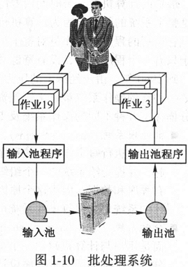

> 注：批处理系统一次处理一批作业。一个输人部件将作业分组成批，然后将它送到计算机。当计算机完成作业处理后，它将每个作业的结果写到输出池中。输出池被打印，最后作业结果返回给终端用户。

现代操作系统不使用纯粹的批处理系统策略，像把作业通过输人设备拷贝到系统中排队等待处理。然而，非交互式的作业仍然是非常有用的，现在比较常见的做法是：从用户的观点看，批处理作业提供一个控制文件，在文件中，用户定义了一个复杂的操作系统命令的集合。利用系统的批处理功能，就可以执行控制文件中的命令。由于很多应用程序在执行过程中不需要人机交互，所以很适合于批处理。例如，每月发货票仍然是利用这种方式进行准备的。其他的像打印薪水发票、更新电话簿、搜集和分析地震数据都是批处理应用。

### 1.2.3 批处理技术

在批处理系统中，假脱机（spooling）输人组件将每个作业读人，并将它保存在当前的作业队列中（见图1-10）。早期系统使用一组穿孔卡片作为输人。后来作业被存储在磁带设备上，再将磁带挂到主机上。主机将作业从磁带中读出，执行作业，并将结果写到输出池中。作业在主机上执行完成后，计算机会将结果写回磁带。随着系统的速度越来越快，假脱机输人和输出操作可以被主机上的IO子系统执行。批处理作业可以被存储在磁盘上而不再是在磁带上。

操作系统使用调度策略来决定作业执行的次序。一旦操作系统从批处理队列中选择一个作业，它就为作业分配一块内存（也称中级调度（medium-termscheduling））。一旦一个作业被加载到内存，它就可以竞争处理器了。当处理器可用时，处理器调度程序（也称为低级调度（short-termscheduler））就从当前加载到内存的作业中选择一个，并分配处理器执行。

作业只能在它加载到内存后才能使用处理器。当作业执行完成后，其内存被释放，并将作业结果拷贝到输出池，以用于随后的打印。在某些情形下，操作系统可能收回已分配给作业的内存，这种系统称之为交换系统（swappingsystem）（交换也被用在分时系统中）。存储分配策略可能释放一个作业占用的内存，并将它移回到磁盘上去，它可能是一个特耗处理器或者是不耗处理器的用户。一个特耗处理器的用户可能被惩罚性地交换出去，以使其他程序有更多机会使用处理器周期。一个不耗处理器的用户被交换出去是合理的，由于它很少使用处理器，因此当它空闲时就不应该占用内存资源。

在批处理系统策略占主导地位时，计算机主要用来管理大容量信息。业务数据处理成了一个很重要的计算机领域，特别鼓励了文件技术的发展。对批处理系统来说，文件是一个磁盘存储设备的抽象，因为它们提供了大量相似信息的集合（如时间记录卡、个人记录、轨道数据记录）。通过创建和重新定义文件抽象，程序员不用知道具体磁盘操作的细节，就可以对文件进行操作（见1.1节的例子）。

批处理系统在向允许多用户共享机器的大道上迈了一大步。然而，多道程序批处理系统并不赞成在用户和计算机间的实时交互一—用户通过使用作业控制说明来表示其目的。在批处理系统之前，用户可以坐在系统控制台上并调试程序。在批处理系统中却不让用户来对作业进行控制。事实上，批处理系统可以位于一些地理上不同的位置。一个程序员一天仅有两次机会将作业输人到批处理流中，这种情况是经常出现的。今天的软件开发环境截然不同，你可以在几秒内重新编译和执行一个程序。

> **示例：批处理文件**
>
> 现代的操作系统如UNIX和Windows都支持批处理文件的处理。即使是一个交互式的分时系统，用户也可以写一个包含一系列命令的批处理文件，操作系统就可以在没有用户干预的情况下执行。批处理文件的一个最简单的例子是DOS中的config.sys和autoexec.bat文件。它们定义了一系列计算机启动后可以执行的命令。
>
> 代码1-11显示了UNIX下的一个批处理文件（外壳脚本），这个文件可以被外壳程序解释执行，文件中的每一行被解释成操作系统的一个命令并执行。在例子中，第一步就是编译menu.c文件，生成一个可重定位的文件menu.o。命令文件中的第二行将driver.c进行编译，和menu.o及C库进行链接。第三行执行链接生成的文件driver，它需要两个参数，一个为test_data，作为输人文件，另一个为test_out，用作输出文件。第四行将test_out文件输出到名为thePrinter的打印机上。第五行生成一个名为driver_test.tar的压缩文件，它包含了源代码和测试输出。在命令文件中的最后一行对tar文件进行加密并将结果写回到名为driver_test.encode的文件中。
>
> ```
> cc -g -c menu.c
> cc -g -o driver driver.c menu.o
> driver < test_data > test_out
> lpr -PthePrinter test_out
> tar cvf driver_test.tar menu.c driver.c test_data test_out
> uuencode driver_test.tar driver_test.tar >driver_test.encode
> ```
>
> 注：UNIX外壳脚本是一个批处理文件，它包含了一系列的命令（在本例中是6个命令），外壳不用在人的干预下即可将其读出并解释执行。

### 1.2.4 分时系统

分时系统在20世纪70年代开始流行起来。其目标是使得多个用户通过使用带有键盘和显示器的终端设备，能同时与计算机系统进行交互。这种策略使得计算机能为多用户所用，用户可能涉及不同类型的信息处理任务。在分时系统之前，计算机只为少数的计算机专家所用。

有4种早期的系统实质上框定了分时操作系统策略：

- CTSS，兼容的分时系统。CTSS是20世纪60年代中期在M.I.T开发的系统[Corbato，etal.，1962］。它是当时支持对前卫多道程序设计调度算法（“前卫”是比较当时已存在的算法而言的）和.现代存储管理技术进行初始研究的载体。
- Multics［Organick，1972］。Multics迅速取代CTSS继续发展，它的设计非常注重可靠性方面，在它之前的操作系统常常不太可靠。Mutics是一个重点发展了虚拟内存、内存保护，以及安全方面技术的操作系统。
- Cal。Cal分时系统大约是和CTSS及Multics系统同时设计和实现的[Sturgis，1973］。Cal系统的研究工作涉及了分时系统的一般技术，以及保护和安全技术。
- UNIX。美国电话电报公司贝尔实验室的UNIX设计者曾参与过Multics系统的研究，但他们希望能够研制一个简化的操作系统去管理一台小型机（minicomputer），因而，他们在1970年研制了UNIX。UNIX奉行“内核小就是精致”的设计理念。UNIX验证了建立一个小操作系统内核的思想，其功能要尽可能地少，但能支持大量的操作系统服务，这些服务以应用程序的方式运行。在CTSS、Multics和Cal消失了很多年后，UNIX仍然是一个主要的操作系统（这些年也有很大的改进)。

### 1.2.5 用户的观点

在批处理系统中，用户在作业提交给计算机前，需要仔细计划该作业如何去执行。而分时系统所遵循的方法是让用户与计算机建立一个会话（称之为“登录”（loggingonto/into）），然后由用户决定输入系统要执行的命令。在执行过程中，用户直接与计算机进行交互，提供程序执行所需的数据，并可以直接看到程序执行输出的结果。这鼓励了用户用信息进行实验，例如，通过进行不同的条件情况下的试验，来处理决策问题。但在早期的非交互式系统中，要对这种信息处理问题进行处理，计算机性能会得不到充分的发挥。

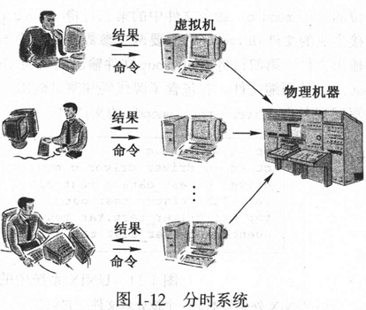

> 注：分时系统是多道程序系统，它允许终端用户在两个操作系统命令之间与计算机进行交互。分时系统是交互式的计算机系统。

图1-5中的多道程序虚拟机的描述也说明了分时操作系统的用户观点。分时系统使用多道程序设计，它允许用户与执行程序进行交互（见图1-12）。在多道程序设计中，每一个虚拟机实际上是由操作系统实现的硬件模拟，通过在一个虚拟的系统控制台上向虚拟机发出命令，这样，每个用户就可以与计算机进行交互了，并且当计算结束时就会收到计算的结果。分时系统着重在于实现公平的处理器共享的策略，让用户感到好像自己在使用一个独立控制的“相对慢一些”的计算机一样，而实际上是一台虚拟机。只要分时系统不超载，相比较而言，响应时间是很短的，因而用户可以接受这种“相对慢一些”的计算机的性能。

### 1.2.6 分时技术

分时操作系统使用多道程序设计技术支持多个虚拟机。在处理器调度和内存分配策略方面，分时系统与批处理系统有很大的差别。批处理系统试图优化单位时间内可以处理的作业数量；而分时系统着重于公平性，试图为每个虚拟机提供公平的处理器资源和内存资源。在资源分配策略方面，分时系统与批处理系统也不一样。

随着分时应用环境的发展，由于用户可能显式或隐含地同时执行两个不同的程序，因此要求设计者能区分作业执行和程序执行的概念。这种想法直接导致人们将“程序的执行”作为进程的概念提出。一个批处理作业在一个时间内只运行一个用户的程序，而对分时作业而言，可能在任何给定的时间内，运行两个或更多的进程。例如，在分时环境中，一个进程正在进行文档格式的转换，同时另一个进程正在读邮件。随着分时技术的发展，进程有时也被称为任务（task），因而支持用户多进程的分时多道程序设计系统有时也称之为多任务系统（multitaskingsystem）。

当所有支持多道程序运行的机器都支持多用户时，分时系统强调在用户及其进程间建立防护屏障的重要性。这主要是由于分时系统允许在某一时刻存在许多进程，而批处理系统在某一时刻只存在个别进程。如果没有防护屏障，一个进程可能无意间破坏了另一个进程的内存映像。设置防护屏障确保了内存保护，但也使两个作业间通过内存共享信息变得困难了，因为两个作业必须要克服防护屏障才能实现共享。防护屏障技术也扩展到了用户共享的文件系统。在很多情形下，用户要求创建的文件不能被其他用户修改，甚至不让其他用户阅读文件内容。保护和安全的问题，在早期的分时系统中成为一个主要的问题，尽管在批处理系统中也存在。

> **示例：UNIX分时系统**
>
> 在1974年，一篇研究论文将UNIX操作系统介绍给了大众[RitchieandThompson，1974]。AT&T贝尔实验室的两位研究人员对原机器上的操作系统不满意，便开发了UNIX操作系统。UNIX在操作系统设计方面确立了两个新趋势：以前的操作系统都是巨大的软件包--是计算机上运行的最大软件包-—操作系统由计算机制造商提供，是为特定的硬件平台而设计的。相反，UNIX是一种小的、简洁的、能被移植到任何小型计算机上的操作系统。UNIX的设计理念是：操作系统（也称内核）应该提供一个最基本的功能，新的应用功能（作为用户程序）在需要时能随时被添加。UNIX的理念是具有革命性的，到1980年，在多厂商开发的硬件平台上（大学、研究机构和系统软件开发组织），它成了程序员首选的操作系统。
>
> 尽管不用重新开发整个的操作系统，UNIX内核就能移植到新的硬件平台上，操作系统的广泛使用还是有阻碍。UNIX源代码归AT&T贝尔实验室拥有，当然可以通过许可证的方式来使用它。其他的组织可以通过付费给AT&T来获得许可证。到1980年，许多大学和研究机构获得了其源代码并将其修改来满足需要，做的最出色的是加利福尼亚大学Berkeley分校的DARPA（DefenseAdvancedResearchProjectsAgency）研究机构。商用计算机供应商也开始利用UNIX源代码来开发他们自己的UNIX操作系统版本。
>
> 到1985年为止，有两个主要的UNIX分支版本（能运行在许多不同的硬件平台上）：来自AT&T贝尔实验室的SystemVUNIX和加利福尼亚大学Berkeley分校的BSDUNIX。BSDUNIX的DECVAX版本被称为Version4BSDUNIX或者是4.xBSDUNIX。两个分支都实现了UNIX所公认的系统调用接口。然而，这两个分支操作系统的内核实现有很大的差别。SystemV和BSDUNIX间的竞争非常活跃，版本一个接一-个地变化。最后，4.xBSDUNIX的商业支持者（SunMicrocomputers公司）和AT&T签署了商业合同：这两个主要的操作系统版本被合并成一个通用的UNIX版本（SunSolaris操作系统)。
>
> 同时，其他的计算机提供商也努力争取UNIX系统调用接口的可选实现。一个重要的事件是标准化组织开发的UNIX系统调用接口—POSIX.1。（这种系统调用接口简称为POSIX，尽管这可能产生误导，因为POSIX组织也开发了几个其他的API并且其中只有一个表示内核系统调用接口。所以，这本书我们仅考虑POSIX.1，我们一般用更流行、但不太准确的POSIX来提及POSIX.1系统调用接口。）一旦POSIX被建立，开发者就可以自由地设计和构建它们自己的内核，这些内核提供POSIX描述的API指定的功能。例如，在CarmegieMellon大学，由RichardRashid领导的操作系统研究小组开发了具有POSIX/UNIX系统调用接口的Mach操作系统（见19.4节）。它可以取代4.xBSD和SystemVUNIX内核。Mach的UNIX操作系统版本被用来作为开放系统基金会OSF-1的基础，OSF-1又是苹果公司（SX操作系统的基础。这种趋势在继续发展，使得不同种类的UNIX开放源代码不断出现（如Linux和FreeBSD)。后来，软件开发商开始使用这些开放源代码，再也不需要使用UNIX源代码的许可证了。
>
> UNIX命令行解释器—Bourneshell——也建立了用户与操作系统交互的标准。在BourmeShell中开发和实现的基本理念在基于文本的人机界面中是很常见的。
>
> UNIX出现在CTSS、Multics和Cal系统后，所以UNIX从它们的开发设计中受益很多。它支持多进程并支持与终端用户的交互。UNIX是操作系统基本概念的实验地，如可重配置的设备、虚拟机、安全、虚存。
>
> 到20世纪80年代中期，UNIX作为分时操作系统占据了统治地位。它也是工作站上重要的操作系统。

### 1.2.7 个人计算机和工作站

在1977年4月，AppleⅡI发布了，在1981年8月IBM推出了个人计算机。接下来十年里，个人计算机系统软件通常没有使用多道程序设计技术一—用户在某一时间只能执行一个程序。因为没有多道程序设计，所以没有资源隔离和资源共享的需求。系统软件最主要的需求就是提供硬件抽象。Apple提供了一套函数（后来成了工具箱)，IBM个人计算机也提供了设备抽象软件（IBM基本输入/输出系统BIOS)。苹果和IBM都将它们的设备抽象软件存储在只读存储器（ROM）中，当机器掉电的时候这些信息不会丢失。ROM是一个只读存储设备，可以将信息存储其中，即使计算机关闭电源，这些信息也不会丢失。这些早期的个人计算机到1990年都消失了，尽管IBMBIOS抽象软件的思想在Intel微处理器中仍然使用。

1982年，Sun公司发布了它的第一台小型计算机，其他的制造商（如HP、Apollo、ThreeRivers）也在同一时候发布了工作站。工作站与个人计算机（如IBM个人计算机和AppleⅡ）有很大的不同，工作站拥有足够的资源，它采用了分时操作系统的技术，特别是多道程序设计技术，几乎所有的工作站都采用了某一种UNIX操作系统。到1990年，有三个不同的小型计算机阵营：苹果个人计算机（1984年发布的Macintosh）、IBM个人计算机和UNIX工作站。两大个人计算机阵营之间的竞争是激烈的，尽管此时工作站还被看作另一个市场。到1995年，个人计算机硬件已变得非常先进并可以开始和工作站进行竞争。同时，微软也推出了WindowsNT和Windows95操作系统。新的竞争是IBM兼容机（IBM已经将其注意力转向开发其他类型的计算机）和工作站的竞争。时至今日，在工作站和个人计算机之间没什么本质区别了。本书描述的大部分概念和原理都存在于当代个人计算机和工作站的操作系统中。

### 1.2.8 用户的观点

个人计算机和工作站在计算时给用户完全自由的控制，使用户以一种全新的感觉使用计算机，不再把计算机看成一种不可预知的共享资源，用户开始把它作为一种完成工作任务的工具来使用它，类似于电话、打字机或者复印机一样。计算机作为一种提高个人工作效率的工具获得了迅速发展，例如出现了文字处理系统、桌面印刷系统、电子数据表格以及个人数据库等，单用户的计算机也开始在公司内广泛应用。

### 1.2.9 操作系统技术

单用户计算机的普及源于个人计算机（PC机）的发展，它们可以直接放在办公室，而无需一个特殊的计算机机房。20世纪70年代开始出现的小型机便是这种技术的典范。第一批小型机包括DECPDP8和DataGeneral公司的Nova，它们相对便宜且易于安装（与当时的传统计算机需要空调和专门的电源相比）。小型机在20世纪80年代非常流行，因为它们既可作为个人计算机，也可作为分时共享的机器。DEC公司的PDP-11小型机是非常受欢迎的硬件平台，可作为软件开发的个人机或作为分时共享的机器。最后，PDP-11发展成了非常流行DECVAX分时计算机[LevyandEckhouse，1989］，它可能是20世纪80年代使用最广泛的分时计算机。

伴随着小型机的发展，一种新的、更小型的机器——微机（microcomputer）出现了。微机的基本部件就是一个在一块集成电路板上实现的处理器。早期的微机基于8位处理器芯片，时钟频率在1MHz左右。与之相比，现代微机使用32位（甚至64位）微处理器，典型的时钟频率超过2500MHz（2.5GHz)。个人计算机和工作站都使用微机作为它们的处理器。

第一代个人计算机系统中，结合了最基本的操作系统功能，代码通常写人ROM（如IBMBIOS)。基于ROM的操作系统提供了一些控制计算机设备的功能。之后，通过增加操作系统软件，基于ROM的系统功能得以加强，可用于管理文件并将文件从磁盘加载到可读写的随机存储器（RAM）中。早期最流行的个人计算机操作系统是CP/M，它最终被微软MS-DOS（或IBM版本的PC-DOS）所取代。这些操作系统通过提供文件系统进一步扩展了设备抽象软件。

在商业市场上，装有MSDOS的个人计算机比装有其他操作系统的产品占有优势。现在，很多原来使用DOS的计算机继续使用微软的后继操作系统，如Windows95/98/Me和WindowsNT/2000/XP。MSDOS对操作系统技术的最大贡献在于：它使计算普及化，并且在机器启动时，它可以灵活地配置操作系统的部件。

起初工作站的硬件配置比个人计算机更为灵活、运行速度更快。工作站使用的硬件与当时的小型机十分相似。.工作站通常包含比个人计算机更多的资源，如更多的内存，更快、功能更强的处理器，大容量磁盘，以及高速的图形适配器。这些工作站通常要求更为复杂的操作系统来管理资源。

虽然UNIX是作为分时系统而设计的，它支持多道程序设计及功能可以扩展的特点使得UNIX很自然地应用于工作站环境中，尤其是当工作站被用于软件开发时。随着工作站（及小型机）市场的扩大，UNIX也获得了发展。例如，根据市场的对图形处理的需求，UNIX中加人了支持高分辨率图形处理的方法。类似地，当网络技术对工作站应用变得重要时，UNIX开始接纳网络协议。既然现在对个人计算机和工作站的硬件不再进行区分，个人计算机操作系统和UNIX都可以作为这些机器的操作系统。

### 1.2.10 对现代操作系统技术的贡献

个人计算机和工作站的广泛应用，极大地刺激了支持个人计算应用的系统软件的增长。这个需求反过来又引起了操作系统开发者和人机界面开发者的兴趣和注意，如生成有效的点击选择界面。SUN公司的OpenWindows/NeWS窗口系统和X/Motif窗口系统，都深深根植于系统软件技术（或实现）。对这类机器的兴趣也推进了支持多个会话和虚拟终端新操作系统的发展。

> **示例：微软Windows操作系统家族**
>
> 微软的第一个操作系统是MS-DOS。它的主要目的是提供设备抽象，并没有提供多道程序设计环境。现在内置Intel处理器的计算机上的BIOS仍然反映了MS-DOS设备抽象的理念。20世纪90年代中期前，MS-DOS一直是个人计算机的主流操作系统，但是现在它逐渐被新的操作系统所替代，当然新系统常常还是微软的操作系统。
>
> 当代的微软操作系统，也称为Windows操作系统家族，提供了一组应用程序调用接口，称Win32API（见图1-13)。这些API函数数目非常多，而且是动态增长的。在2000年，Win32API包括了2000个不同的函数，有创建进程的函数，也有性能查询函数。Windows操作系统家族的系列产品实现的Win32API数目也不一样。以所有的API函数数目为基准，假定全集为1，则WindowsNT/2000/XP实现的API数目为1，Windows95/98/Me实现的API函数为3/4，而WindowsCE（也称PocketPC）实现的API函数为1/4。

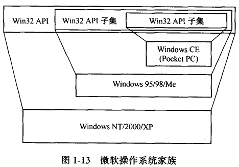

> 注：微软的操作系统家族有三个不同的成员：WindowsCE系统最小，提供的API函数最少。Windows95/98/Me是一个较大的系统，提供了总API数目的3/4。WindowsNT/2000/XP是最大的家族成员，实现了所有的API函数。

> 操作系统家族系列的各个版本都兼容老的版本，提供老版本相同的API函数，它是为了使得应用程序更易移植。如果微软高版本的操作系统实现了低版本提供的所有API函数，应用程序员不用对应用软件做任何修改，就可以在新版本的操作系统上运行。让不同的操作系统家族产品提供的API集合形成包含关系，操作系统就实现了向上兼容性。例如，在WindowsCE上写的任何程序不用做任何修改就可以在WindowsMe和WindowsXP上运行。同样，在WindowsMe上写的程序不用做任何修改就可以在WindowsXP上运行。另外，操作系统虽然改进了，但对相同的接口都提供相同的功能（假定提供更好的质量)。采用这种策略对建立和维护操作系统的API的一致定义来说是必要的。Windows98/Me和WindowsNT/2000/XP上的相同API函数的实现基本上是一样的。然而，因为WindowsCE定位于如掌上型电脑和机顶盒等硬件，它的API和WindowsNT/2000/XP确实有很大的区别。
>
> **WindowsXP、2000和WindowsNT**
>
> WindowsNT是在20世纪80年代后期开始开发的，并在1993年7月发布（3.1.版）公开使用[SolomonandRussinovich，2000］，版本4.0在1996年7月发布。版本5.0在2000年发布并重命名为Windows2000。WindowsXP的开发使用了WindowsNT和Windows98的源代码，它是在2001年10月发布的。本书中，“WindowsNT”指采用了WindowsNT代码的任何操作系统版本，它包括了Windows2000和WindowsXP。如果涉及到特定操作系统版本的讨论，它将被标注出来。
>
> WindowsNT是Windows操作系统家族的旗帜。Win32子系统和WindowsNT操作系统实现了Win32API的所有功能。它是操作系统家族最复杂的成员。
>
> Windows95/98/Me
>
> Windows98是Windows95的一个更新版本，WindowsMe是Windows98的个更新版本。在2001年之前，大多数用户都使用Windows95/98/Me操作系统。在此之后，许多个人计算机用户开始使用WindowsNT/2000/XP.
>
> Windows95/98/Me与WindowsNT不同，因为它实现的Win32API函数比较少一些。WindowsNT支持一个全面的安全模型，而Windows95/98/Me没有。WindowsNT上增加的大部分函数都与内核安全有关。Windows95/98/Me提供的网络函数也是WindowsNT提供的网络函数的一个子集。其他的主要区别在虚拟内存实现方面。WindowsNT允许应用程序员设置不同种类的参数来影响对虚拟内存的管理，这在Windows95/98/Me下是不可能实现的。
>
> WindowsCE
>
> WindowsCE（ConsumerElectronic）是这个家族中最小的成员，它的研发是为了打人小型计算市场，我们将在以后的章节中介绍它。

### 1.2.11 嵌入式系统

嵌人式系统就是包含了计算机的复杂设备。计算机将全力支持整个系统的运行。以下是嵌人式系统的例子：控制大坝水闸的计算机，控制核反应堆冷却过程的计算机，操纵导弹的计算机，控制销售点终端的计算机，控制住宅洒水系统的计算机。这些年以来，嵌人式系统在商业上一直是很成功的，但随着大规模集成电路的引入，它们的应用达到了一个更高的层次。今天，它们也是计算机技术的一个重要组成部分。

### 1.2.12 用户的观点

嵌人式系统没有和其他系统一样的用户。嵌人式系统的用户是一组传感器和激励器。嵌人式系统发展的最初动机是由于实现成本上的争论：用计算机和软件实现电子控制子部件与完全用硬件来实现而言，前者更便宜一些。磁盘控制器就是一个很好的例子。磁盘控制器可以完全用硬件逻辑来实现，也可以用硬件逻辑与控制硬件的微型计算机的组合来实现。今天，几乎所有的磁盘控制器都用嵌人式系统来实现。这种方法的好处是同样的控制器硬件可以被用来实现不同的控制策略（如SCSI和IDE)。它也允许磁盘生产商只需为嵌人式计算机提供一个新的程序，就可改变控制器的行为。

### 1.2.13 操作系统技术

因为嵌人式系统中的计算机只是系统的一部分，所以嵌人式操作系统的需求随着各个应用的不同而差别很大。然而，商业嵌人式操作系统开发商着重于处理器调度（特别是实时调度)，使操作系统使用的内存和处理器周期最少，并设计操作系统使运行在其上的软件使用尽可能少的电量。

实时计算是基于如下观点：用户（大量的硬件传感器和激励器）需要在规定时间内接收到系统对它的处理结果。例如，传感器检测到反应堆核心温度的增加，嵌人式系统必须在规定的时间内发送一个信号给激励器，使得核反应堆温度降低。实时的约束条件引出了两个值得挑战的问题:

- 怎样保证响应时间不超过某个最大值。
- 怎样获得最小的响应时间。

实时系统技术的发展受响应时间的驱动。许多实时应用指定了一个“软”期限，而不是一个硬期限。软期限就像一个延迟家庭作业策略：如果采用硬期限策略，在期限到之后不再有机会做任何处理。如果是软期限，你可以从后来的家庭作业额度中获得信贷，然后，你可以决定在超期之后是否还值得执行。在软实时的世界中，我们说操作系统应该尽力满足期限要求，如果没有在期限之内处理完，系统应该继续提供服务而不是放弃服务请求。

有时，一个嵌人式系统只有唯一目的：运行单个的应用程序。如果嵌人式系统只有一个应用的话，就没必要实现资源隔离和并发进程的共享策略。操作系统的主要目的就是提供硬件资源抽象。在这种情况下，设计者可以将资源管理作为应用的一部分。这种设计方式避免了应用程序和操作系统之间的交互带来的性能损失。它减少了操作系统使用的机器资源量，给应用程序留下了宝贵的资源。

当代的嵌人式系统常常关心在给定时刻处理器使用的电源量。例如，如果嵌人式系统是使用电池供电系统的一部分，嵌人式系统使用的电量越少，则整个系统其余部分可使用的电量越多。在嵌人式系统的正常工作期间，不同种类的设备可能会掉电，但现代操作系统仍然能够工作。这意味着磁盘、显示器、传感器、激励器暂时掉电了，嵌人式系统仍要能正常地工作。

### 1.2.14 对现代操作系统技术的贡献

为了确保满足实时处理的约束条件，出于效率的考虑，嵌人式系统趋向于放弃大而全的操作。在需要-些最原始的功能或需要某种形式的实时处理时，其他种类的操作系统设计也采取了类似于嵌人式系统的设计技术。

在其他的操作系统中，核心的实时技术也被用来解决服务质量问题(QoS)。例如，应用处理可能需要在指定的时间内将信息通过网络发送出去，或在传送过程中最小化偏差（使“抖动”最小)。这些需求的解决比较困难，它们是现代实时操作系统中值得努力探讨的课题。

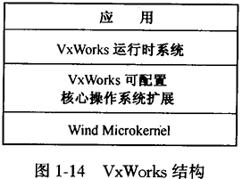

> 注：VxWorks是一个模块化的操作系统，它基于windmicrokernel。可配置的核心操作系统扩展(ConfigurableCoreOSExtension）提供了软件，它使用微内核（microkernel）来实现可用操作系统。运行时系统和应用运行在操作系统扩展（OSextension）之上。

---

> 示例：VxWorks
>
> VxWorks在嵌人式操作系统领域获得了极大的声誉（见http：//www.windriver.com/）。这个产品的操作系统组件是windmicrokermel,它是一个可扩充的、可配置的核心操作系统（见图1-14)。嵌人式操作系统的设计者根据特定的系统决定使用操作系统哪些部分，然后配置核心操作系统（coreOS)，使得它仅仅包含需要的操作系统功能。
>
> 微内核处理多道程序设计、中断和调度。操作系统的这一部分能为应用层提供实时支持。核心操作系统通过提供如下可选的机制扩充了微内核的功能：消息通信、共享存储、网络支持、图形支持、Java支持、同步等。这种极度灵活的结构使得可以对操作系统进行灵活配置，让操作系统所需内存极少（WindRiver公司说：操作系统可以配置成只需几K内存就可运行)，同时，它提供给用户的功能就比较少。

### 1.2.15 小型通信计算机

芯片技术的发展及Intermet.的广泛应用对计算机设备的发展起到了极大的推进作用。消费电子的需求对小型通信计算机（SCC）的迅速发展也起到了推进作用。大部分设备用于特定的任务一—如便携式MP3播放器、可上网的移动电话、数字化并存储电视节目的机顶盒等。移动计算机、拥有无线网络连接的小型计算机都是SCC的一个子集。即使这些设备差别很大，但是它们暗含的操作系统概念是一样的。更令人惊奇的是，SCC使用的许多操作系统概念与桌上型电脑和服务器是一样的。然而，因为SCC的资源（如内存、网络带宽、电源）比较少，它们的实现方法有显著的区别。

### 1.2.16 用户的观点

一个SCC操作系统和其他操作系统一样，也要提供硬件抽象和资源共享。SCC操作系统和其他大机器操作系统间的区别有：

- SCC设备和传统的机器设备不同，SCC提供的硬件抽象和传统的机器使用的硬件抽象不一样。
- 由于SCC中使用的资源受到了限制，SCC的操作系统硬件抽象实现和传统的操作系统的硬件抽象实现不一样。
- 相似的SCC家族将使用相同的基本内核，但是资源限制将要求不同的家族成员使用不同的虚拟机策略，即依赖某个特定的物理SCC的配置。例如，VxWorks可以用来作为SCC的操作系统。操作系统应该支持灵活的配置和策略。
- SCC可以以某种嵌人式系统的形式出现，最简单的情况下，如通过网络连接接受流媒体数据的播放器。传统的操作系统并不使用实时资源管理技术，然而，在SCC中，实时技术经常被使用。
- 因为SCC是Intermet应用这种新的计算环境的基础，操作系统需要适应不同的计算模式，如操作系统需要适应Web浏览作为交互执行环境发展方向。

### 1.2.17 操作系统技术

SCC需求推进了操作系统技术的发展。在现代操作系统中，基于线程的计算获得了稳定的发展。基于线程的计算改变了操作系统的设计：线程执行间的障碍与进程执行间的障碍不同，因为基于线程的计算比基于进程的计算使用的资源少。SCC是围绕线程计算而不是进程计算设计的。

在现代操作系统中，对流媒体的支持是非常重要的。在SCC中，对流媒体的支持是必须的。这是因为SCC的设备存储容量比较少。对SCC操作系统设计的一个技术挑战是，需要调整虚拟机调度的策略，使得操作系统能为软实时数据的发送提供足够的支持。

传统的操作系统的设计要使得当一个应用请求比现有计算机中的可用资源更多的资源时，操作系统要有一个固定的、尽力而为的资源分配策略。这种策略在操作系统设计时就确定了，并独立于计算机使用的环境。在SCC操作系统中，系统频繁地被超支。然而，对操作系统采取尽力而为的策略是不可接受的。因为它将使得操作系统工作在一种与计算机目标不一致的状态。将来的SCC操作系统需要设计成在使用个特定的资源分配策略时充分利用该特定应用的知识。

SCC经常在比传统计算机对资源管理要求更具挑战性的情形下使用。例如，在移动计算机中，维持系统运行的电源供电时间对整个计算机的使用是一个限制因素。资源管理策略要能对设备自动掉电进行处理，甚至可以决定设备是否应该切断电源（可以对其进行配置，使得其运行需要更少的电源)。

在移动计算环境中，在机器操作期间，网络连接可能在某一时间段变得不可用。网络的特性可能也随时间变化——有时无线信号很强并且带宽很高，然而在其他时间，信号比较弱且相应的带宽比较低。SCC资源管理策略需要能适应可用的动态资源。

最后，SCC并不是在一个孤立的环境下使用的，而是在许多传统的业务（如无线电通信、娱乐广播、实时命令和控制、Intermet信息发送等）下发展起来的。这是现实世界中业务趋势变化及个人日常生活信息化的结果。对这些汇合事务操作的任何计算机必须要对网络协议、网络服务信息发送模型、内容缓冲等进行处理。用在商业上的SCC操作系统需要处理许多不同种类的协议和行为。

SCC操作系统技术还处于早期发展阶段—但现在开始研究它也不算太早。有大量的操作系统被设计在SCC上使用：

- VxWorks可以作为SCC的操作系统。
- 微软WindowsEmbedded和WindowsCE（也称PocketPC）也是特别为SCC而设计的。见http：//www.microsoft.com/windows/embedded/。
- PalmPilot操作系统也是特别为PDA而设计的，产品包括了PalmPilot，HandspringVisor，SonyCLIE等（见http：//www.palmos.com）。该操作系统有很多的追随者。
- Java虚拟机（JVM）可以认为是一个SCC操作系统。一般来说，Java虚拟机是作为主机操作系统之上的一个应用而实现的。然而，也可以将它作为宿主机操作系统来实现。

> **示例：WindowsCE(PocketPC)**
>
> WindowsCE也称PocketPC，用于PDA设备上。它来自微软的两个研发项目：Microsoft-at-Work和Pulsar。虽然这两个项目的操作系统有相似的需求，但两个项目组都在开发自己的操作系统。后来做了个共同的决定，即设计满足两个项目需求的操作系统。最初的WindowsCE操作系统是一个面向对象的操作系统，但是，随着面向对象系统的开发，一组CE的设计者开发了-一个可替换的操作系统内核，它实现了Win32API的一个子集。“新内核”简称为“nk”[Murray，1998］，nk内核最后变成了WindowsCE操作系统。
>
> WindowsCE操作系统和其他操作系统的设计目标有很大的不同。例如，WindowsNT提供的API需要兼容原来操作系统的API。因此，在WindowsNT上可以运行MS-DOS，Win16，甚至OS/2应用程序。WindowsCE并不需要提供兼容性支持。它和以前所有的微软操作系统应用领域不一样。WindowsCE可以设计成在不同的硬件平台上实现。结果，它实现了一个硬件抽象层，称为OEM抽象层（OAL)。
>
> WindowsCE1.0版工作在手持PC上。版本2和以后的版本是一个可配置的模块化系统。也就是说，不用为不同的硬件配置重新编译操作系统，就可以将不同的操作系统组件进行组合来得到一个新的操作系统。它可以在手持PC、车载计算机、游戏计算机和机顶盒上使用。
>
> 不要指望为消费电子设备设计的操作系统会提供与桌面计算机一-样的图形和网络支持。WindowsCE并没有提供所有的Win32API函数，如图形函数、窗口管理函数、网络函数。（但是这些函数在WindowsNT中都实现了。）这极大地简化了WindowsCE的设计，注：WindowsCE构建在OEM抽象层的上面，使得如图1-15所示。

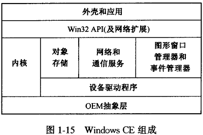

> 注：WindowsCE构建在OEM抽象层的上面，使得它易于在不同的硬件平台上进行移植。操作系统是由内核、设备驱动程序、对象存储以及网络和通信服务组成。图形、窗口管理器以及事件管理器逻辑上不同于操作系统的其他部分，但是，也被认为是WindowsCE操作系统的一部分。

### 1.2.18 网络

个人计算机和工作站的普及导致了对系统的更高要求，系统不仅能够有效地完成本地计算，还能通过高速网络访问存储在另一台计算机中的信息。现在，系统软件都重视提供支持单个计算机经由局域网和广域网进行互连的应用。对系统软件设计者来说，网络中本地或远程资源的隔离、共享以及抽象引出了新的挑战，这也是该领域当代研究的主导前沿。

直到20世纪80年代，计算机才逐渐实现点对点的相连，以串行方式进行通信，通信速率小于10Kbps。如果要进行多台机器的互连，要么实现一个完全互连的网络，其中的每两台机器都以点对点的方式连接；要么机器通过路由网络（routingnetwork）互连。（在一个路由网络中，任意两台机器之间都存在一条“路径”，每个机器必须能给其他机器发送信息，因而所有的机器共同形成一个逻辑网络，如同是一个完全连接的网络一样。)

大约在个人计算机和工作站开始发展的同时，局域网（LocalAreaNetworks，LAN）成了一种高性价比的通信技术。在1980年，以太网和令牌环局域网都实现了一个逻辑上完全连接的网络，传输速度在10～16Mbps之间，比点对点转发网络的速度快了三个数量级。这些局域网能将小的计算机互连，也可以与大的计算机连接，实现了相对比较高速的连接，而成本则相对比较低。这引起了计算方式的革命，现在计算可分布在整个网络内共同完成。

从2000年开始，无线网络技术作为一种重要的通信技术出现了。无线技术依赖于某个范围内的广播频率。这些广播频率并没有被其他的广播技术所使用（如无线电收音机、电视机、卫星等)。对每个人来说，有2～5GHz的公共带宽可以使用。通信标准的草案采纳了两种流行的无线局域网设计（IEEE802.11b（“WiFi"）和IEEE802.15（“Bluetooth"））。无线网络趋于在小的物理区域内使用（半径不到100英尺的范围)，能以11Mbps的速率来传送数据包。无线网络的引人对计算设备特别是SCC有极大的影响。目前，出现了一些更快、更安全的无线局域网络。例如，IEEE802.11a网络与IEEE802.11b相似，但是有着数量级的速度提高。无线技术将影响下一代计算机的出现和操作系统的设计。

软件技术在便宜的计算机硬件和网络带宽的刺激推动下，也得到迅速发展，出现了粗粒度的（largegrained）、松散耦合（looselycoupled）的分布式计算，主要是客户－服务器模式的计算。现在，在一些10～100Mbps速率的局域网中，网络磁盘服务器、文件服务器、打印服务器、数据库服务器、通信服务器，以及其他的网络设备都是常见设备。甚至出现了用高速网络（1000Mbps）进行高速计算机和子网间的互连。网络计算的发展，也迫使操作系统从分时和多道程序设计系统向支持网络化方向发展，系统必须支持网络通信、分布式资源管理策略、新的进程间通信策略和新的内存管理策略。

在最近的几年里，网络上出现了浏览器的应用，它可以访问公共互联网。这种新的计算模型使得用户可以通过网络搜索访问远程计算机的资源。网络协议的出现使其变得可能，特别是IP协议、TCP协议和用来浏览网页的HTTP协议。网页浏览器和互联网络信息的传送对操作系统的技术有很大的影响作用。

### 1.2.19 现代操作系统的起源

现代操作系统是从前面章节中所谈及的所有系统演化而成的，如批处理、分时系统、个人计算机和工作站软件、嵌人式系统、小型通信计算机（SmallCommunicationComputer），以及网络操作系统（参见图1-16)。现代操作系统从批处理和分时系统继承了多道程序设计的技术。保护和安全技术首先出现在批处理系统中，而后在分时环境中得以迅速发展。人－机交互技术成了分时系统的关键问题，随着小型通信计算机的出现，这个问题变得更为突出了。随着个人计算机和工作站的发展，这种人机交互需求愈发明显。用户开始要求使用窗口和其他面向可视化的技术。客户－服务器的网络编程模型（文件服务器、打印服务器、数据库服务器等）是从支持网络通信的系统发展而来的。嵌人式系统影响了现代操作系统中的实时管理、同步方法、调度策略以及数据移动等方面。

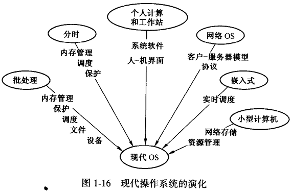

> 注：现代操作系统是从批处理系统、分时系统、个人计算机和工作站系统、嵌人式系统、网络操作系统进化而来。

## 1.3 小结

计算机是通过应用软件所提供的功用性来证明其价值的。如果应用软件不能有效工作，那么整个计算机系统也不是有效的。系统软件和硬件对终端用户是透明的，系统软件只是用来支持程序员的工作，一般终端用户使用应用程序去处理信息，因而对他们来说，系统软件和硬件是没有直接价值的。

系统软件为应用程序员提供了抽象接口，包括各种硬件资源和低层系统软件的抽象接口。操作系统允许对处理器进行时分复用（对内存进行空分复用），使得从用户的角度看程序就像并发执行一样。多道程序设计使得我们将程序的执行作为进程来看待。它也开始促使我们考虑程序的并发执行的各种特性。操作系统需要管理资源使得资源既可以被进程独占使用，也可以在进程间对资源进行共享。

操作系统的发展过程源于单用户计算机，经过批处理多道程序设计系统、分时系统、个人计算机和工作站系统、网络互连系统，发展到现在的嵌人式系统、小型通信计算机系统(SCC)。批处理多道程序设计系统引人了支持作业间并发的技术。分时操作系统扩展了多道程序设计的思想，因而每个用户作业在同一时间片内能够有多个进程执行。因为在分时系统中进程数的激增，用户间以及进程间的保护和安全问题变得突出。今天，由于计算机的普及和互连，保护和安全问题变得更加重要。

作为本章的延续，下一章将考虑系统软件，尤其是操作系统提供给程序员使用的资源抽象的一般模型。

## 1.4 习题

1．请说出抽象资源和物理资源的区别，并分别列举两个例子。

2．IBM的个人计算机系统在BIOS程序中提供了设备的访问接口。那么针对Intel8088抽象机，BIOS中提供了哪些资源抽象？（提示：在通常条件下，如果你在显示器上显示一个字符，那么使用BIOS命令与不使用有什么区别？）

3．假如你有一大堆小物品，存储在一个矩形网格中（像一个表)。你可以通过有序对（i，j）来找到存储在表格中的小物体。请设计一个单数地址来找到存储在表格中的小物体。如可以使用（12，30）来表示12行、30列位置的小物体，也可以用1230这个地址来表示。（提示：想像一下宾馆如何为它们的房间编号的。）这与磁盘轨道和扇区的地址表示方式相同。

4．在面向对象程序设计语言（如Java或C++）中，程序可以通过什么方式将值存储在不同对象的私有变量中。为读写它的私有变量提供一种抽象方式，想想这种抽象方式是什么？

5．在下面的例子中，哪--个是时分复用共享的例子，哪一-个是空分复用共享的例子。并作出解释。a．住宅区的土地b．个人计算机c．教室里的黑板d．公共汽车上的椅子e．UNIX系统上的单用户文件f．分时系统中的打印机g．C/C++运行时系统的堆区

6．多道程序设计度（thedegreeofmultiprogramming）就是一个处理器在任何时刻可以运行的进程的最大数目。在决定一个系统的多道程序设计度时，请讨论一下哪些因素是要考虑的。你可以设定一个批处理系统中进程数与作业数是相同的。（在后面的章节中，会详细讨论几个需要考虑的因素。）

7.考虑有N个进程的多道程序系统，每个进程的执行时间为：t1，t2，"，tn。如何能使总的执行时间等于maximum（ti，t2，，tn），可能做到吗？

8．考虑有N个进程的多道程序系统，每个进程的执行时间为：t，t2，，tN。如何使得总执行时间T>t;+t2+·+tn？也就是说，什么情况会使得总执行时间超过了单个进程执行时间的总和？

9．当通过计算机去完成工作时，什么情况下会选用批处理策略？什么情况下会选用分时策略？

10．分时系统中处理器的调度策略与批处理系统中的有哪些不同？

11.WindowsNT、Windows2000和WindowsXP间有哪些区别?

12．在AT&T（SystemV）UNIX和BSDUNIX系统间有哪些区别?13.POSIX.1和Linux间有些什么关系？

14．在Windows操作系统中，硬件抽象层的目的是什么？

15．UNIX中的makefile文件与批处理文件有哪些相似之处？它与本章中描述的控制文件有哪些不同？

16．分时技术对操作系统做出了什么贡献？

17．嵌人式系统对现代操作系统有什么贡献？


# 第2章 使用操作系统

本章从应用程序员的角度来描述操作系统。这一章中主要介绍操作系统系统调用接口的概念，它反应了操作系统设计时的需求。对一个有经验的程序员来说，这部分内容可能显得浅显了。如果你正在学习编程，本章介绍的系统调用接口将有助于你更有效地使用计算机。本章对如何使用操作系统虚拟机进行了概念化的描述，并伴有使用UNIX和Windows虚拟机的应用例子。在继续进行本书的学习之前，理解这部分概念是十分重要的。因为本书其他部分从系统设计者或者系统程序员的角度来考虑操作系统的内部设计，假定你已经知道了本章的这些概念。

## 2.1 程序员看到的虚拟机

一切都应该尽可能地简单，但不要太简单。——阿尔伯特·爱因斯坦

程序员的任务就是开发软件，让软件控制计算机硬件为终端用户执行特定的信息处理任务。终端用户的具体需求可能相差很大：用计算机来保持个人记录，进行公司记帐，解决数字计算问题，宇宙飞船导航等。为了为终端用户提供有效的解决方案，程序员必须要充分了解应用领域，并要利用计算机的特性来更有效地开发应用程序。

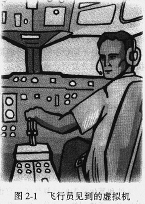

> 注：飞行员面临一个复杂的仪器控制面板，它是在开飞机时用来控制飞机的。这些仪器会告诉飞行员有关飞机的速度、高度、姿势（是不是水平的）、上升下降的角度、左／右倾斜的角度等。仪器上也有对引擎、换向器、机翼、起落装置和许多飞机其他部分的控制。

操作系统在硬件平台上定义了一个逻辑的软件环境，也就是第1章介绍的虚拟机。抽象要尽可能简单，但要为应用程序员使用底层硬件提供足够强的功能。例如，飞行员驾驶喷气式飞机时使用的是一个复杂的抽象模型（见图2-1）。这个模型忽略了转弯时的高度、飞行动力学等，飞行员仅需要知道掌舵、加速、刹车（像开汽车一样）就可以操纵飞机了。飞行员的模型被简化了，但仍然比汽车驾驶员的模型复杂，这是因为操纵飞机比驾驶汽车更困难。

为了开发应用软件，程序员可以利用系统提供的一些编程工具，它使得应用程序员不必知道一些细节知识。另外，因为现代的计算机都是使用多道程序设计技术，虚拟机环境功能要足够强，要为并发程序执行提供支持，而且要使得应用程序员容易理解和使用。并发抽象的原因就是为并发进程对系统部件提供一个独占式的（资源隔离）访问环境，同时也要支持进程对资源的共享访问。

### 2.1.1 顺序计算

在应用软件开发的早期，我们使用了顺序计算的思想。算法是这种计算方法的基础。算法就是顺序执行的指令集合。例如，排序算法描述了对一组数据进行排序的步骤。算法可以用数学符号、伪代码（像一种程序设计语言）、自然语言（如英语）来表示。算法的执行只有一个人口点。一旦开始执行，它就按程序中指定的控制流顺序执行。语句是逐条执行的，也可用条件分支（类似C中的if-then-else语句）和循环（类似while和for语句）结构来改变控制流。

算法语言常用来表示一个问题的解决办法，它忽略了细节性的描述，容易出现二义性。程序设计语言可以用来对算法进行编码，它是算法的完全准确的描述。编码的结果就是源程序（sourceprogram）。有许多程序设计语言可以用来表示算法（如Java、CC++）。程序设计包括了算法的构建和用程序设计语言表示算法的过程（见图2-2）。

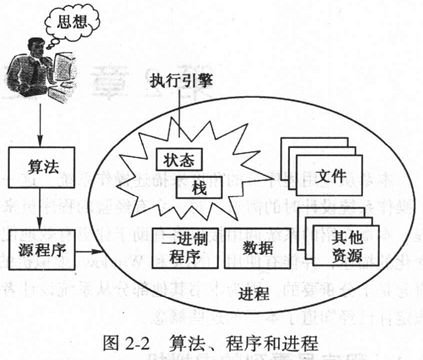

> 注：程序员用算法来表达问题的解决方法。然后，他们将算法表示成源程序。源程序被转换成可以加载执行的二进制程序。在多道程序环境中，二进制程序是抽象成进程概念来运行的。当进程得到运行所需的资源后，就可以开始运行了。

翻译工具是开发计算机系统软件的一种工具，它可以将源程序转换为二进制程序（binaryprogram）（有时也叫目标程序、二进制目标程序或可执行程序）。二进制程序是算法的另一种表示，它可由计算机硬件直接执行。二进制程序通过过程调用来使用操作系统提供的功能。例如，为了结束一个算法，进程可以使用操作系统提供的exit（）函数。为了从一个文件中读信息，进程可以使用read（）函数。二进制程序只包含机器指令，特别包含了调用操作系统过程的指令。普通的机器指令（如加法和乘法指令）可以直接引起计算机执行规定动作。操作系统的过程调用表示了一组硬件的操作的抽象。例如，exit（）调用能使算法中止执行，使得程序员不用直接写控制硬件的操作。同样，read（）函数可以使应用程序从硬件设备上得到输人信息，将输人信息作为结果传回给调用函数。程序员不必知道读磁盘的细节。这些函数调用由给定的软件（也称为应用编程接口（API））来实现。在大多数操作系统中，常把系统调用接口称为API。

图2-2的其余部分解释了在多道程序设计环境下顺序计算的思想。程序员编写软件时，他认为程序中的语句是顺序执行的，这与程序设计语言的语义相一致。但操作系统是通过时分复用方式来使用处理器的，所以，来自不同程序的指令可能是交错执行的。事实上，操作系统也确保了在同一时间内有多个程序在执行（使用时分复用处理器共享）。

一旦构建好一个程序，它可以通过以下方式运行：

1）使用特定的编译器来对程序进行编译。

2）为程序运行提供必要的数据。

3）提示操作系统在程序的main（）函数入口点开始执行。

4）根据控制说明来继续执行程序语句。

顺序语句会一直执行，可以隐式地让程序控制流转到最后一条语句，或在程序中调用exit（）来终止程序执行。

操作系统是通过定义进程来表示程序的执行的。执行中的程序称为经典进程，进程是包含程序、数据、文件和其他资源的计算环境。它也包含了一个称为执行引擎（executionengine）的操作系统抽象。执行引擎表示了进程的一部分，它包括了表示进程当前状态的操作系统内部数据结构，以及进程运行时栈的拷贝（栈包括局部变量、函数返回地址等）。

### 2.1.2 多线程计算

可以对顺序计算进行扩展，使得一个进程内可以有多个线程并发执行。这是一种团队分工协作的思想：假定会计室里一个会计师要清算公司的所有发票，将它与购买订单进行核实，并将核实结果进行发布。会计师做这项工作有一个固定的流程（和程序相似），有会计师必须处理的具体数据（如发票和购买订单）。会计师在会计室的工作与传统的顺序进程执行相类似。如果我们要更快地处理发票，则可以再雇用一个会计师。我们可以为他分配一个新办公室，然后为每一个会计师分配一半的发票让他们处理（见图2-3a）。然而，两个会计师的工作流程相同并且都要参考同一份购买订单文件。

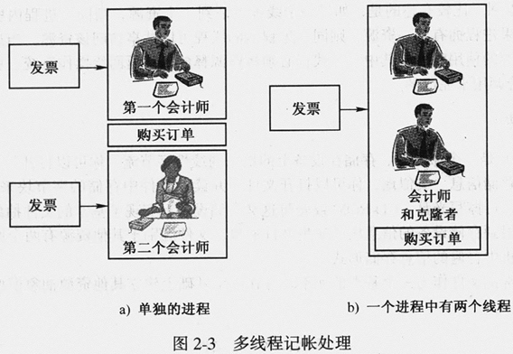

> 注：线程在进程中就如同会计师在办公室里。在a）图中，两个办公室内各有一个会计师，不易于共享购买订单。在b）图中，在一个办公室里有两个会计师（两个执行实体在同一个环境下）。

还有一个可供选择的办法（在软件中非常有用，但用于会计师可能不太合适）。假定我们克隆一个会计师并将它和原来的会计师放在相同的房间内（见图2-3b），现在两个会计师都使用一样的工作过程，同一堆发票，同一份购买订单文件，但是有两个会计师处理发票。在软件世界里，这就像一个进程定义了同一份程序和数据，但是它有两个不同的执行流。这种方法叫做多线程计算。每个执行路线（与一个会计师相似）就是一个线程。两个线程使用相同的程序和全局数据，但它们以各自的速率执行程序。因为在不同的时间里，它们可以调用不同的函数，所以每个线程都有自己的堆栈。

Java是用Thread线程基类来支持多线程计算的。程序员可以定义Thread基类的子类MyThread。当创建一个MyThread的实例时，它定义了一个新的、独立的线程，它能使用进程的全局数据。这意味着Java计算可以用多线程来实现。

对于多线程来说，如果程序运行在多道程序设计系统中，两个或多个线程可以采用时分复用的方式来使用处理器，但它们共享相同的程序和数据。如果多线程计算在多处理器上运行的话，那么两个线程能够并行执行。

多线程进程是一个比较新的技术。有些操作系统仅支持进程进行顺序计算，但在这些系统中，可以用类库来实现多线程，操作系统本身不支持多线程进程。例如，Java线程就是在Java虚拟机上实现的，而不是在操作系统中实现的。

## 2.2 资源

当进程（或进程中的线程）执行时，需要计算机的资源（至少需要处理器和内存），也需要向计算机的输入/输出设备存储或得到信息。在程序员看来，执行程序所用虚拟机的所有部件（物理的和逻辑的）叫做资源。操作系统负责对它的资源进行管理，包括所有种类的资源。资源有以下特点：

- 当一个进程/线程执行时，必须向操作系统请求资源。
- 一旦线程请求资源，在资源被分配之前暂停执行。

除了这些基本的资源管理策略，操作系统对处理器和内存资源的管理方式与对其他资源的管理方式不一样。进程/线程在准备运行时，隐含着对处理器和内存资源的请求。当用户登录计算机时，登录进程/线程被分配了内存资源，它可以与用户进行交互来验证用户的身份。一旦通过验证，登录进程/线程就请求操作系统分配内存来运行shell程序，用户可以通过shell再运行其他程序。当用户指示操作系统运行用户想要运行的程序时，加载器自动地为程序分配内存。

其他大多数资源是由程序显式请求的。最常见的资源是文件。对文件进行读写处理之前必须通过open（）系统调用来完成准备工作。如果文件是不可用的，进程必须等待直到文件可用，也就是等到open（）系统调用返回。比较有趣的是，如果一个线程申请到一个资源，则同一进程内所有其他线程也能使用这个资源。如果进程拥有某一资源，则同一进程内的线程可以共享访问该资源。当进程内的所有线程都完成了对某一资源的使用时，则其中一个线程必须将资源释放，并返回给操作系统。就文件来说，这是通过close（）系统调用来完成的。

### 2.2.1 使用文件

一个文件（file）是一个命名的、存储在设备上的信息的线性字节流。你可以打开一个文件，并将一串字节流写人文件来存储信息。类似地，你可以打开文件，并读取文件中存储的字节块来访问存储的信息。操作系统在如磁盘、可擦写光盘、CD-ROM或磁带这类存储设备上实现了基本的文件抽象。它通过将文件信息块中的字节映射到存储设备的信息块中实现文件抽象。文件区别于其他资源有两个原因：

- 文件是计算机中普遍的信息存储形式。
- 操作系统常常把文件作为一个基本的元素，并在这个基础上建立其他资源抽象模型。

> 示例：POSIX文件
>
> 个POSIX文件是指一个命名的顺序字节集合，也称为一个字节流文件。对每一个打开了的文件，都有一个文件指针与其相关联。当文件打开时，文件指针指向文件的开始位置。当读写了K个字节后，文件指针就偏移了K个字节的位置。POSIX接口定义了文件的一些基本操作（见表2-1)。任何遵循POSIX接口的操作系统（如Linux）都实现了文件操作的功能。这些文件操作函数的细节可以在联机文档上找到（因为它们经常变化)。在Linux系统上，你可以在联机文档上学到更多的有关如何使用系统调用的知识。这是通过man命令来完成的。如要读open（）命令的有关文档，你可以在shell上键人“man open"，就会在显示器上显示open（）的相关文档。（man man命令用于在线阅读man命令自己的文档。）
>
> 表 2-1POSIX文件操作
>
> |         |                                                              |
> | ------- | ------------------------------------------------------------ |
> | open()  | open（）调用中要指定准备读写文件的路径名。通过设置调用中的参数可以使程序员锁住文件这样只要文件被打开，就可以独占地进行文件读或者写操作。当文件被打开后，有一个系统指针指向文件字节流中的第一个字节（或者，如果文件是空的，指向第一个字节即将要写的位置）。如果调用成功，则返回一个无符号的整数描述文件，这个返回值用于标识打开的文件 |
> | close() | close（）调用关闭文件，从而释放表示打开文件状态的锁和其他系统资源 |
> | read()  | read（）调用要指定一个文件描述符（是open（）调用的返回值）、一个缓冲区地址和缓冲区长度。通常情况下，这个调用会引起进程阻塞直到读操作结束。然而，它的语义可以通过fcntl（)调用改变，fcntl（）就在下面进行解释 |
> | write() | write（）调用类似于read（）调用，只是它传送信息到文件中      |
> | lseek() | lseek（）调用在字节流中显式地移动读/写指针，因为文件被看作一种线性字节流的结构。移动的结果将影响随后的读写操作 |
> | fcntl() | fcntl（）（它代表文件控制）调用提供了一种方法，可以发送任意控制请求到操作系统。例如，正常情况下，如果要读一个空文件，文件读操作会阻塞调用进程；使用fcntl（）调用，可以使原本文件读操作会阻塞调用进程变成在读操作中不阻塞进程，控制马上返回给调用者 |
>
> 在图2-4中是一个完整的C程序，说明了如何通过POSIX接口提供的文件操作函数，将一个文件中的所有字节拷贝到另一文件中去。执行这个程序的进程，会把文件in_test中的内容逐个字符复制到文件out_test中。这个程序会以读方式打开一个输人文件，以写方式打开一个输出文件，然后将输人文件中的每个字节拷贝到输出文件中。

---

> 示例：Windows文件
>
> Windows系统中同样定义文件为一种字节流结构。对每一个打开了的文件，都有一个64位文件指针
>
> 一个 Linux文件操作程序：
>
> ```cpp
> #include <stdio.h>
> #include <fcntl.h>
> int main()
> {
> 
>     int inFile, outFile;
>     char *inFileName = "in_test";
>     char *outFileName = "out_test";
>     int len;
>     char c;
>     inFile = open(inFileName, O_RDONLY);
>     outFile = open(outFileName, o_WRONLY);
>     /* Loop through the input file */
>     while ((len = read(inFile, &c, 1)) > 0)
>         write(outFile, &c, 1);
>     /* close files and quit */
>     close(inFile);
>     close(outFile);
> }
> ```
>
> 注：上面的程序打开两个文件，并将一个文件中的内容逐字节地拷贝到另一文件中去。
>
> 与其相关联。当文件打开时，文件指针指向文件的开始位置。当读写了K个字节后，文件指针就偏移了K个字节的位置。当一个程序打开文件时，操作系统内部建立了数据结构来跟踪对文件的操作（如存储了当前文件指针位置等信息)。系统调用会返回一个类型为HANDLE的句柄来标识文件，HANDLE句柄指向操作系统内部的数据结构。在Windows中也有许多文件命令，表2-2只描述了基本的命令（与表2-1中的POSIX集相似)。图2-5是一个完整的拷贝文件的例子（逐块拷贝而不是逐字节地拷贝），它将名为in_test的文件内容拷贝到名为out_test的文件中去。
>
> 表2-2Windows基本文件命令
>
> | 命令             | 描述                                                         |
> | ---------------- | ------------------------------------------------------------ |
> | CreateFile()     | CreateFile（）（或OpenFile（））调用用于在操作系统中创建一个打开文件对象，为读写该文件作准备，并初始化系统数据结构。当文件打开后，一个系统指针指向文件字节流中第一个字节的地址（如果是空文件，指向第一个字节将被写的位置） |
> | CloseHandle()    | CloseHandle（）调用关闭文件，从而关闭表示打开文件状态的系统资源 |
> | ReadFile()       | ReadFile（）调用从打开的文件中读取信息块，并且向前移动文件指针 |
> | WriteFile()      | WriteFile（）调用向打开的文件中写人信息块，并且向前移动文件指针 |
> | SetFilePointer() | SetFilePointer（）移动文件指针到一个新的位置                 |
>
> 一个Windows文件操作程序：
>
> ```cpp
> #include <windows.h>
> #include <stdio.h>
> #define BUFFER_LEN // + of bytes to read/write
> /*The producer process reads information from the file name
> in_test then writes it to the file named out_test.*/
> int main(int argc, char *argv[])
> {
>     // Local variables
>     char buffer[BUFFER_LEN + 1];
>     // CreateFile parameters
>     DWORD dwShareMode = O; // share mode
>     LPSECURITY_ATTRIBUTES lpFileSecurityAttributes = NULL;
>     // pointer to security attributes
>     HANDLE hTemplateFile = NULL;
>     // handle to file with attributes to copy
>     //  ReadFile parameters
>     HANDLE sourceFile;                // Source of pipeline
>     DWORD numberOfBytesRead;          // number of bytes read
>     LPOVERLAPPED lpOverlapped = NULL; // Notused here
>     // WriteFile parameters
>     HANDLE sinkFile; // Source of 1pipeline
>     DWORD numberOfBytesWritten;
>     // Open the source file
>     SourceFile = CreateFile(
>         "in test",
>         GENERIC_READ,
>         dwShareMode,
>         lpFileSecurityAttributes,
>         OPEN_ALWAYS,
>         FILE_ATTRIBUTE_READONLY,
>         hTemplateFile);
> 
>     if (SourceFile == INVALID_HANDLE_VALUE)
>     {
>         fprintf(stderr, "File open operation failed\n");
>         ExitProcess(1);
>     }
>     // Open the sink file
>     sinkFile = CreateFile(
>         "out_test",
>         GENERIC _WRITE,
>         dwShareMode,
>         lpSecurityAttributes;
>         CREATE_ALWAYS,
>         FILE_ATTRIBUTE_NORMAL,
>         hTemplateFile);
> 
>     if (sinkFile == INVALID_HANDLE_VALUE)
>     {
>         fprintf(stderr, "File open operation failed\n");
>         ExitProcess(1);
>     }
>     // Main loop to copy the file
> 
>     while (
>         ReadFile(
>             sourceFile,
>             BUFFER_LEN,
>             buffer,
>             &numberOfBytesRead,
>             lpOverlapped) &&
>         numberOfBytesRead > 0)
>     {
> 
>         WriteFile(sinkFile, buffer, BUFFER_LEN,
>                   &numberofBytesWritten, lpOverlapped);
>     }
>     // Terminating.Close the sink and source files
>     CloseHandle(sourceFile);
>     CloseHandle(sinkFile);
>     ExitProcess(0);
> }
> ```
>
> 注：上面的程序以逐块的方式将一个文件的内容拷贝到另一个文件。

### 2.2.2 使用其他资源

资源（resource）是任意的虚拟机部件（包括文件)，一个程序必须明确地分配到了所需资源才能执行。

当一个进程/线程请求的资源不可用时，一般情况下线程就不能执行了，往往被挂起，直到请求的资源变得可用。

每个操作系统除了文件访问外，还提供对很多资源的访问，包括处理器、存储器、键盘，以及显示器。如果能做到对所有资源的接口都是一样的，与不同类型资源接口不同的情况相比，程序员就会更容易地学会如何使用资源。

在UNIX中，文件抽象也用于管道和设备。关于设备，如键盘和显示器，将在第5章详细描述。现在完全可以说通过与文件操作相同的open（），close（），read（），write（），seek（）和fcntl（）命令来控制驱动设备，读写操作也是基于字节流的，因而一个设备的读操作很像文件的读操作。管道是一种抽象资源，用于两个不同的进程间通信。管道的内容将在第9章描述。

## 2.3 进程和线程

计算是一个进程、至少一个（隐含或显式）线程及一组资源集合的组合。进程由以下几部分组成（见图2-2):

- 可执行的二进制程序(或目标代码）。
- 程序执行需要的数据（从一个文件中或者与用户交互的过程中获得）。
- 程序执行请求的资源（例如，包含必需信息的文件)。

进程是一个可以实现计算的虚拟机框架，执行的活跃元素由执行引擎提供。在图2-2表示的单线程计算中，在进程中只有一个执行引擎。传统操作系统（如早期的UNIX系统）仅允许进程中有一个执行引擎。我们称这种类型的进程/线程组合为经典进程（classicprocess）。在现代操作系统如Windows中，进程可以包含多个执行引擎（见图2-6)。每个执行引擎称作线程（或轻权进程（lightweightprocess)），我们称这种类型的进程/线程组合为现代进程。无论在哪一种情况下，线程由以下几部分组成：

- 线程数据，为线程所私有，它通常分配在特定的线程栈上，每个线程有自己私有的数据空间。
- 线程状态，也就是保持线程所有属性的操作系统数据结构。例如，状态包括了线程将要执行的下一条指令的地址，以及线程是否在等待资源而处于阻塞状态，以及它正在等候哪一个资源的信息等。

图2-6表示了一个多线程计算，其中一个进程内有三个不同的线程，这三个线程使用相同的程序、全局进程数据、文件和其他资源，但是它们都有自己的局部数据和状态。

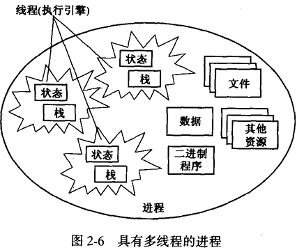

> 注：进程为线程定义了执行环境，也就是二进制程序、数据和资源（包括文件）的集合。每个线程有自己的栈和状态，所以，线程并发执行二进制程序的不同部分。

尽管操作系统都有向多线程计算模型发展的趋势，但是有的操作系统仅支持经典进程模型。在这些情况下，没有单独的线程概念，执行引擎嵌人在进程当中。Linux2.0版本就是使用经典进程模型的（2.2版本在内核中为线程提供了支持)。即使UNIX系统提供了内核线程支持，但它通过传统的系统调用接口导出经典的进程模型和具有POSIX线程扩展的线程模型。

经典的进程模型使用了1/4个多世纪，在20世纪90年代后期，开始被现代的进程模型所取代。经典进程模型向新的进程和线程模型发展的一个动机是：创建一个简单的操作系统抽象，使得有多个对象能够执行同一程序，它们使用相同的文件和设备。在20世纪90年代，程序员想要共享资源的不同计算单元（例子见［Bershad等，1988；Hauser等，1993］）。“一个管理共享文件的服务器也需要各自的线程来为每个客户提供服务。在一个物理终端上，窗口系统也可以使用线程来实现虚拟终端会话。想像一下，一个物理显示器上的窗口系统，一个应用有几个线程，每一个线程对应于显示器上的一个窗口（见图2-7）。所有的线程运行相同的代码，共享物理显示器，但是每一个线程仅仅管理一个窗口。

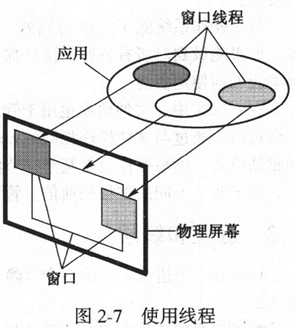

> 注：进程提供了处理窗口操作（如在显示器上进行写操作、移动窗口、改变窗口的尺寸）的程序，进程的资源包括物理显示器。每个线程都使用同一程序来将信息写到显示器的某一部分上。每个线程的执行独立于其他线程，但是它们协作来实现交叠窗口。

在20世纪90年代早期，仅仅只有几个线程库，如MachC线程包[WalmerandThompson，1989]。这些库是一组API函数，可以让程序员用来创建和控制线程。这些库使用单个的经典进程来执行线程：对线程库的调用实现了多线程应用（包括了线程复用）的假象。程序员可以充分利用这些线程库，即使在这种方法中也存在几个缺陷（如在经典进程中的一个线程阻塞了，则进程中的所有线程都会被阻塞）。

现在，线程技术已成为程序员的一个重要工具。进程中的线程共享程序、数据、资源，然而每个线程是计算的一个独立单元：操作系统能控制每个线程的执行过程。如果进程中的一个线程阻塞了，其他的线程仍然能够执行。

### 2.3.1 创建进程和线程

当计算机启动时，它必须开始执行存储在存储器中的指令。初始化进程（initialprocess）将首先完成加载引导程序的任务（将在4.2节中详细描述），由引导程序将操作系统载人内存，然后开始执行操作系统。那么随后的进程和线程是如何出现的呢？在考虑现代的进程和线程之前，我们先来看一下具有经典进程的操作系统是怎么做的。常规的方法是执行一个进程创建的系统调用来创建一个经典进程。经典进程创建的语义直接来自早期的进程抽象的工作。

### 2.3.2 FORK（）、JOIN（）和QUIT（）:历史的观点

1963年，Conway引人了三个操作系统函数，分别为FORK（）、JOIN（）和QUIT（）[Conway，1963]。1996年，Dennis和VanHorme又对它们进行了不同的描述[DennisandVanHorme，1966]。这些原语用于创建和执行一个单线程进程家族。不像经典的UNIX进程（但非常像线程），用FORK（）命令创建的进程执行原进程的代码并共享原进程的信息。原来的进程称为父进程（创建新进程的进程）。命令的动作行为定义如下：

- FORK（label）创建子进程（创建进程称为父进程）。子进程与父进程在同一个地址空间开始执行，它带有一个指定的标号（label），父进程继续执行FORK（）后的下一条指令。一旦子进程创建，父进程和子进程共同存在，而且并发执行。
- QUIT（）用于进程终止它自己，该进程被结束，它的进程控制块被释放。
- JOIN（count）用于将两个或多个进程合并成一个单一的进程。当一个进程执行这个语句时，先执行如下的代码：

```cpp
/*Decrement a shared variable*/
count = count - 1;
/*QuIT unless this is the last process*/
if(count != O)QUIT();
```

程序中count是一个共享变量，可以被所有的进程所使用，但在任意时刻只能有一个进程执行JOIN语句。一旦一个进程开始执行JOIN（）系统调用，其他进程就不能使用CPU，直到该进程完成执行。

FORK（）、JOIN（）和QUIT（）可用于描述那些并发计算，它由几个顺序执行进程合作完成，进程间共享数据和程序。

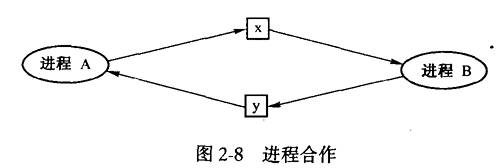

> 注：进程A和进程B共享变量x和y。进程A对变量x进行写操作并对变量y进行读操作。两个进程需要合作使得在A对x进行写操作之前，B不能对x进行读操作。B对进行写操作之前，A不能对y进行读操作。
>
> **示例：使用FORK（）、JOIN（）和QUIT（）**
>
> 考虑图2-8中的程序段，进程A正在执行procA，将计算出一些值（由<computesectionA1>中的代使用操作系统码段计算出），然后更新共享变量x的值；同时，进程B开始执行procB。在进程A完成更新x操作前，进程B不应该执行语句retrieve（x)；类似地，在进程B完成更新y操作前，进程A不应该执行语句retrieve（y)。在代码中，尤其复杂的是两个进程都在循环执行，一个进程可能比另一个的循环速率快得多。这就意味着经由x和y传递的数据可能会丢失；因为在慢的进程读取数值之前，快的进程会进行覆盖重写。
>
> ```cpp
> procA()
> {
>     while (TRUE)
>     {
>         <compute section A1>;
>         update(x);
>         <compute section A2>;
>         retrieve(y);
>     }
> }
> 
> procB()
> {
>     while (TRUE)
>     {
>         retrieve(x);
>         <compute section B1>;
>         update(y);
>         <compute section B2>;
>     }
> }
> ```
>
> 