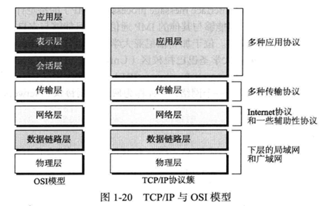
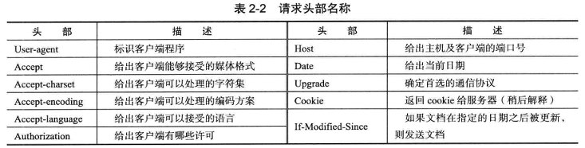
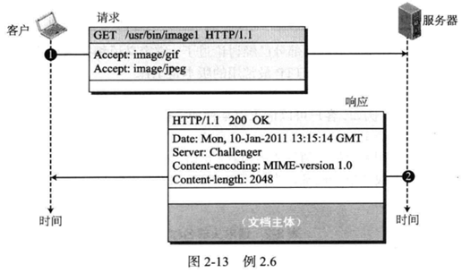
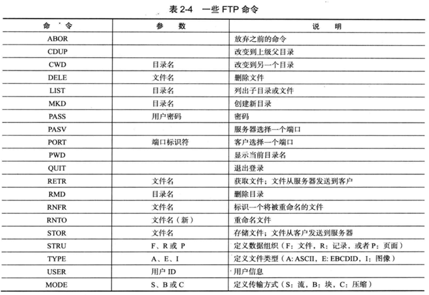

# 计算机网络教程——自顶向下方法（上）

# 第一章 概论

最大的计算机网络一一因特网（Intermet），拥有超过10亿的用户。利用有线和无线传输介质，Intermet连接了大大小小的计算机系统。它允许用户共享包括文本、图像、音频和视频在内的大量信息，允许用户之间相互发送消息。本书的主要目标就是探索这个庞大的系统。在本章，我们有两个目标。第一个目标是对作为一个互联网（网中网）的Intermet进行概述，讨论Internet的组成部分。这个目标的部分内容为介绍协议分层和TCP/IP协议簇。换句话说，第一个目标是为本书的其他章节做准备。第二个目标是提供相关的信息，但是这些信息在学习其他章节时不是必需的。

- 1.1节介绍局域网（localareanetwork，LAN）和广域网（wideareanetwork，WAN），给出这两种类型网络的主要定义。我们定义一个局域网和广域网相结合的互联网络一—互联网。我们将展示一个组织怎样利用广域网将它的局域网连接起来，从而创建一个私有的互联网。最后，我们介绍由主干、网络提供商和用户网络组成的Intermet，它是一个全球性的互联网络。
- 1.2节我们利用协议分层（protocollayering）的概念展示Internet怎样将任务分解成多个小任务。我们将讨论5层协议簇（TCP/IP），介绍每层的任务和每层拥有的协议。我们还将讨论在这种模式下的两个概念：封装/解封装（encapsulation/decapsulation）和多路复用/多路分解（multiplexing/demultiplexing）
- 1.3节我们为感兴趣的读者介绍Intermet的主要发展史。跳过这部分内容不会丧失本书的连续性。
- 1.4节介绍Intermnet的管理、标准的制定和生命周期。这部分内容仅仅提供相关的信息，对理解本书其他章节内容不是必需的。

## 1.1 Internet概览

尽管本书的目标是讨论Intermet，一个连接世界上数十亿计算机终端的系统，但是我们认为Internet不是一个单一的网络，而是一个互联网络（internetwork），多个网络的组合。所以，我们首先对网络进行定义，然后展示怎样连接多个网络来创建小型的互联网络。最后，我们介绍Internet的结构，进而打开后面10章学习Internet的大门。

### 1.1.1网络

网络（network）是由一组具有通信能力的设备相互连接而形成的。在这个定义中，设备可以是主机（host，有时也称为端系统（endsystem），如大型计算机、桌面计算机、笔记本电脑、工作站、无线电话、安全系统等），也可以是连接设备，如连接网络到其他网络的路由器、将设备连接到一起的交换机、变换数据形式的调制解调器等。在一个网络中，这些设备使用有线或无线的传输介质（如电缆或大气）连接起来。当家庭中利用一台即插即用的路由器连接两台电脑时，我们就组建了一个网络，尽管这个网络很小。

#### 1. 局域网

局域网（localareanetwork，LAN）通常是私有的，连接一个办公室、大楼或校园内的一些主机。按照需求的不同，一个局域网既可以简单地由两台电脑和一台打印机组成，用于家庭办公，也可以贯穿整个公司，包含语音和视频设备。在局域网中的每台主机都具有一个标识符（一个地址），用于在局域网中唯一地定义这台主机。一台主机向另一台主机发送的数据包携带了源主机和目的主机的地址。

在过去，一个网络中的所有主机都连接到一个公共的电缆上，这意味着从一台主机发往另一台主机的数据包可以被所有的主机接收到。目标接收者保存这个数据包，而其他主机丢弃该数据包。现在，多数局域网采用智能连接交换机，它能够识别数据包的目的地址并引导该数据包到达它的目的地而不必将它发送到其他主机。交换机减轻了局域网中的流量，如果不是共同的源主机和目的主机，那么交换机允许同一时刻多对主机之间同时相互通信。注意，上面局域网的定义没有指定局域网中最小或最大的主机数。图1-1显示了使用公用电缆和交换机组成的局域网。

第5章和第6章将对局域网进行详细讨论。

当孤立地使用局域网时（目前已很少见），它们用于主机之间共享资源。我们马上能看到，目前的局域网常常相互连接，同时连接到广域网（下面我们将讨论），以进行更广范围的通信。


#### 2. 广域网

广域网（wideareanetwork，WAN）也是由具有通信能力的设备相互连接而形成的。可是，局域网和广域网有一些不同。局域网通常覆盖范围受限，可以覆盖一间办公室、一栋大楼或一个校园；广域网则具有更广的地理覆盖范围，可以覆盖一个城市、一个省、一个国家甚至整个世界。局域网互联主机；广域网互联交换机、路由器、调制解调器等连接设备。局域网通常由使用它的组织拥有；广域网通常由通信公司建设和运营，使用它的组织进行租用。我们看看目前使用的两种典型的广域网：点到点广域网和交换式广域网。

点到点广域网

点到点广域网通过传输介质（电缆或大气）连接两个通信设备。在讨论怎样把一个网络连接到另一个网络时，我们将看到这些广域网的例子。图1-2显示了一个点到点广域网的例子。

交换式广域网

交换式广域网具有多个端点。不久我们将看到，交换式广域网目前用作全球通信的主干。我们可以说，交换式广域网是交换机连接几个点到点的广域网而形成的。图1-3给出了一个交换式广域网的例子。


#### 3. 互联网络

现在我们很少看到孤立的局域网或广域网，它们都相互连接在一起。当两个或多个网络连接起来，它们就形成了一个互联网络（intermnetwork），或者互联网（intermet）。例如，假如一个机构有两个办公室，一个在东海岸，另一个在西海岸。每一个办公室都拥有一个局域网，允许办公室的员工相互进行通信。为了使不同办公室的员工能够互相通信，管理部门从服务提供商（例如电话公司）租用一个点到点的专用广域网，用来连接两个局域网。现在公司拥有了一个互联网络，或者说一个私有互联网。不同办公室之间的通信变成了可能。图1-4显示了这个互联网。


当西海岸办公室中的一台主机给同一办公室的另一台主机发送消息时，路由器阻截这条消息，但是交换机指引这条消息到达目的地。另一方面，当西海岸的一台主机给东海岸的一台主机发送消息时，路由器R1将数据包路由到路由器R2，然后数据包到达目的地。

图1-5显示了多个局域网和广域网连接形成的另一个互联网。广域网之一为具有4个交换机的交换式广域网。

### 1.1.2 交换

我们已经说过，互联网是由链路和交换机组成的，例如我们前面使用的链路层交换机和路由器。实际上，互联网是一个交换式的网络，其中一台交换机至少将两条链路连接在一起。当需要的时候，交换机需要将数据从一条链路转发到另一条链路。交换式网络最常见的类型为电路交换网络和分组交换网络。下面我们讨论这两种类型的网络。


#### 1. 电路交换网络

在电路交换网络（circuit-switchednetwork）中，两个端系统之间总是存在一条专用的连接（称为电路），交换机只能使其变成活跃或非活跃状态。图1-6显示了一个简单的交换式网络，该网络在每端连接4部电话。由于过去电话网络经常采用电路交换，因此我们使用电话机代替计算机作为端系统，尽管目前部分电话系统采用分组交换网络。


在图1-6中，每端的4部电话连接到一个交换机。交换机将一端的电话机连接到另一端的电话机。连接两台交换机的粗线是一个高容量的通信线路，它能够同时处理4路语音通信，其容量能够被所有电话对之间共享。本例使用的交换机具有转发功能但是没有存储能力。

我们看看以下两种情况。在第一种情况下，所有电话机均处于忙状态；一端的4个人正在与另一端的4个人进行通话；粗线的容量被完全使用。在第二种情况下，一端只有一部电话机连接到另一端的电话机；粗线容量仅仅四分之一被使用。这意味着仅当占用全部容量时，电路交换网络才具有高效率；在多数时间中，由于工作仅仅占用部分容量，因此它的效率低下。需要将粗线的容量做成每条语音线路容量4倍的原因是，当一端的所有电话机想要与另一端所有电话机连接时，我们不希望通信失败。

#### 2. 分组交换网络

在一个计算机网络中，两个端点之间使用被称为分组（packet）的数据块进行通信。也就是说，与正在使用的电话机之间连续通信不同，两台计算机之间交换的是独立的数据分组。由于分组是一个能够被存储和以后发送的独立实体，因此这种机制允许我们实施存储转发的交换功能。图1-7显示了一个每端分别连接4台计算机的小型分组交换网络。

分组交换网络中的路由器具有能够存储和转发分组的队列。现在假设粗线的容量（即高容量）仅仅为连接计算机到路由器数据线容量的两倍。如果只有两台计算机（分别在两端）需要相互通信，那么发送的分组不需要等待。但是，如果当粗线已经工作在满负荷时分组到达一个路由器，那么应该存储分组并且按照它们到达的次序进行转发。虽然这两个简单的例子显示分组交换网络比电路交换网络效率高，但是分组可能会遇到一些延迟。


本书我们主要讨论分组交换网络。在第4章中，我们将详细讨论分组交换网络，同时讨论这些网络的性能。

### 1.1.3 Internet

正像我们以前讨论的那样，互联网是由两个或多个能够相互通信的网络组成的。最著名的互联网叫做因特网（Intermet），Internet由成千上万个相互连接的网络组成。图1-8显示了一个Intermet概念上（而不是地理上）的视图。


从图1-8中看到，Intermet由一系列主干、提供者网络和客户网络组成。主千（backbone）处于最高层次，是一些通信公司拥有的大型网络，如Sprint、Verizon(MCI)、AT&T、NTT。主干网络通过称为对等点（peeringpoint）的复杂交换系统进行连接。一些小些的提供者网络（providernetwork）处于第二个层次，这些网络通过付费使用主干网络服务。提供者网络连接主干网络，有时提供者网络之间也相互连接。客户网络（customernetwork）是Internet边缘的网络，它们使用Internet提供的服务。为了接收服务，客户网络需要向提供者网络付费。

主干和提供者网络也称为Internet服务提供商（InternetServiceProvider，ISP）。主干常常称为国际ISP；提供者网络常常称为国家或区域ISP。

### 1.1.4 访问Internet

今天的Intermet是一个允许任何用户变成它的一部分的互联网。但是，用户需要物理上连接到一个ISP。物理连接通常利用一条点到点的广域网实现。本节我们会简单描述怎样进行连接，至于连接的详细技术信息我们将在第6章和第7章讨论。

#### 1. 使用电话网络

目前大多数居民和小公司具有电话服务，这就意味着他们能够连接到电话网络。由于大多数电话网络自身已经连接到Intermet，因此居民和小公司连接Intermnet的一个选择是把他们和电话中心的语音线路转换成点到点的广域网。这可以用两种方式实现。

拨号服务。第一种解决方法是在电话线路中增加将数据转换成语音的调制解调器。安装在计算机中的软件拨打ISP的号码，形成一条电话连接。非常不幸，拨号服务非常慢，同时当线路用于Intermet连接时，线路就不能进行电话（语音）连接。因此，这种方式只对偶尔访问Intermet的居民和小公司有效。我们将在第5章中讨论拨号服务。

DSL服务。自从Intemet出现后，一些电话公司开始升级它们的电话线路，以向居民和小公司提供较高速率的Intermet服务。DSL服务允许语音和数据通信同时进行。我们将在第5章讨论DSL。

#### 2. 利用有线电视网络

近20年，越来越多的居民开始使用有线电视服务替代天线接收电视广播。有线电视公司已经升级了它们的有线电视网络并连接到Internet。居民和小公司可以通过这种服务连接到Intermet。虽然这种方法可提供较高速率的连接，但是速率与使用同一电缆的用户数目有关。我们将在第5章讨论有线电视网络。

#### 3. 采用无线网络

无线连接最近变得非常流行。住户或小公司可以使用无线和有线连接混合的方法访问Intermet。：随着无线广域网接入的发展，住户或小公司能够通过无线广域网连人Intermet。我们将在第6章讨论无线接人。

#### 4. 直接连接到Internet

大机构或大公司自身可以变成一个本地ISP并连人Internet。这种方法要求组织或公司从一个线路提供者那里租用高速广域网并将它连人地区ISP。例如，具有几个校园的大学可以组建一个互联网，然后连接互联网至Internet。

### 1.1.5 硬件和软件

我们已经给出了Internet结构的概览，Intermet是由连接设备将大型和小型网络连接起来形成的。但是应该清楚地看到，仅仅连接这些东西是不够的。为了使通信正常进行，我们既需要硬件也需要软件。这就像一个复杂的计算，我们既需要计算机也需要程序。在下一节，我们讨论如何利用协议分层对硬件和软件的组合进行相互协调。

## 1.2 协议分层

当谈到Intermet时，我们总能听到的一个词汇就是协议（protocol）。协议定义了发送者、接收者和所有中间设备为了高效通信需要遵循的规则。当通信简单时，我们可能只是需要一个简单的协议；当通信复杂时，我们可能需要把任务划分到不同层，每层需要一个协议，也就是说需要协议分层（protocollayering）。

### 1.2.1 场景

为了更好地理解为什么需要协议分层，我们来看两种简单的场景。

#### 1. 场景一

在第一个场景中，通信如此简单以至于它能够在一层中实现。假设Maria和Ann是拥有很多共同想法的邻居。Maria和Ann之间的通信发生在一个层次中，她们面对面并使用相同的语言，如图1-9所示。


即使在这个简单的场景中，我们也可以看到需要遵循一系列的规则。第一，Maria和Ann了解当她们相遇时应该互相问候。第二，她们明白她们应该限制使用的词汇在她们友谊的层次上。第三，一方知道当另一方讲话时，她应该抑制自己讲话。第四，每一方都知道应该是对话而不是独角戏：双方都应该有机会对某一问题发表看法。第五，当她们分别时，应该交换一些祝福语。

我们可以看到，Maria和Ann使用的协议与课堂上老师和学生的通信不同。第二种情况中，大部分情况下是独角戏；除非学生有问题，老师的谈话会占用大部分时间。在这种情况下，协议应该规定学生应该举手并等待被允许说话。这种情况下的通信通常非常正式，同时限制在讲授的前提下。

#### 2. 场景二

在第二个场景中，我们假设公司提拔了Ann，但是她需要到距离Maria很远的城市上班。由于这两位朋友着手进行一个新的项目以便退休后启动新生意，因此她们希望继续她们的通信、交换她们的想法。她们决定定期通过邮局使用信件继续交换她们的想法。但是，即使信件被拦截，她们也不希望她们的想法被其他人知道。她们一致同意采用一种加密/解密技术。信件的发送者对信件加密，使之对入侵者不可读；信件的接收者对信件解密，从而得到原始的信件。我们将在第10章讨论加密/解密方法，但是现在我们假设Maria和Ann采用了一种技术，该技术在一个人不拥有密钥的情况下很难解密信件。现在我们可以说Maria和Ann之间的通信在3个层次上进行，如图1-10所示。我们假设Ann和Maria每个人拥有3台机器（机器人），这3台机器分别在每一层执行任务。


我们假设Maria向Ann发送第一封邮件。Maria在第3层对机器谈话，仿佛这台机器就是Ann，并且在听她谈话。第3层机器聆听Maria所说的内容并形成了明文（用英文书写的邮件），传递给第2层机器。第2层机器接收明文，对它进行加密并形成密文，传递给第1层机器。第1层机器，大概是个机器人，接收密文，把它放人一个信封中，添加发送者和接收者地址，然后进行邮寄。

在Ann的一端，第1层机器从Ann的信箱中取出邮件，通过发送者的地址得知该邮件来自于Maria。机器从信封中取出密文并将它投递给第2层机器。第2层机器解密这个信息，形成明文并将明文传递给第3层机器。第3层机器接收明文并仿佛Maria正在说话一样将它读出来。

协议分层允许我们将一个复杂的任务分解成几个较小的、简单的任务。例如，在图1-10中，我们可以只使用一台机器完成所有3台机器的工作。可是，如果Maria和Ann判定这台机器所做的加密/解密不足以保护她们的秘密，那么她们需要更换整台机器。在现在的情况下，她们只需要更换第2层的机器，另外两台机器能够保持不变。这种方法称为模块化（modularity）。在这个示例中，模块化意味着独立的层次。一层（一个模块）可以定义为一个具有输人和输出的黑盒子，我们不必关心输人如何变成输出。如果给定相同的输人，两台机器提供相同的输出，那么它们可以相互替换。例如，Ann和Maria可以从两个不同的厂商购买第2层机器。只要这两台机器能把相同的明文变成相同的密文，相同的密文变成相同的明文，那么它们就可以相互替换。

协议分层的优越性之一是它允许我们将服务从实现中分离出来。一层需要能够接收较低层的一系列服务，同时向较高层提供服务，而我们不关心这一层是如何实现的。例如，Maria可以决定不为第1层购买机器（机器人）；她可以自己做这些工作。只要Maria能够在两个方向上完成第1层提供的任务，通信系统就可以工作。

协议分层的另一个优越性无法在简单的示例中体现，但是当我们讨论Intermet中的协议分层时能够展现出来。这个优越性就是通信不只是用于两个端系统，中间系统只需要一些层次而不是所有的层次。如果不使用协议分层，形成的中间系统就不得不像端系统一样复杂，这样就会提高整个系统的造价。

协议分层有不足之处吗？有人说单一层次使工作更加容易。对每一层来说，没有必要向上一层提供服务并使用下一层的服务。例如，Ann和Maria可以寻找或建造一台机器来完成这三种任务。可是，正像前面提到的那样，如果某一天她们发现她们的编码被攻破，那么每人都不得不用新机器替换整个机器，而不是只更换第2层的机器。

#### 3. 协议分层原则

让我们讨论一些协议分层原则。第一个原则就是如果想要双向通信，那么我们需要每一层能够实现两个相反的任务，每个方向上一个。例如，第3层的任务就是听（在一个方向上）和说（在另一个方向上），第2层需要能够加密和解密，第1层需要发送和接收邮件。

在协议分层中我们需要遵循的第二个原则是两端每一层中的两个对象应该相同。例如，两端第3层的对象应该为明文信件。两端第2层的对象应该为密文信件。两端第1层的对象应该为一封邮件。

#### 4. 逻辑连接

在遵循以上两个原则之后，每层之间的逻辑连接如图1-11所示。这意味着我们拥有层到层的通信。Maria和Ann可以认为每一层有一个逻辑（想象的）连接，通过这个连接她们可以发送那一层创建的对象。我们将看到逻辑连接的概念将帮助我们更好地理解数据通信与网络中遇到的分层任务。

### 1.2.2 TCP/IP协议簇

在第2个场景中，我们了解了协议分层与层间逻辑连接的概念，现在介绍TCP/IP（TransmissionControlProtocol/IntermnetProtocol，传输控制协议/互联网协议）。TCP/IP是目前Internet使用的一个协议簇（按不同层次组织的协议集）。它是由相互交互的模块组成的一个层次结构协议，每一个模块提供特定的功能。层次意味着较上层次的协议需要得到一个或多个较下层次协议提供的服务支持。初始的TCP/IP协议簇在硬件基础上定义了4个软件层次。但是，目前TCP/IP通常是一个5层模型。图1-12显示了这两种情况。


#### 1. 层次化结构

为了展示如何利用TCP/IP协议簇的层次在两台主机之间进行通信，我们假设将协议簇用于一个由3个局域网（链接）组成的小型互联网，每个局域网拥有一个链路层交换机。同时我们假设局域网连接到一个路由器，如图1-13所示。


我们假设计算机A与计算机B进行通信。正像图1-13中显示的那样，在这个通信中涉及5个通信设备：源主机（计算机A）、链路1的链路层交换机、路由器、链路2的链路层交换机和目的主机（计算机B）。按照设备在互联网中扮演的角色不同，每一台设备包含了几个层次。两台主机包含了所有5个层次；源主机需要在应用层创建一个信息并把它发送到下层，以便把该信息物理上发送到目的主机。目的主机需要在物理层接收这个信息，然后通过其他层投递到应用层。

路由器只涉及3层；只要路由器仅仅作为路由选择，在路由器中就没有传输层或应用层。虽然一个路由器总是拥有一个网络层，但是它涉及n个数据链路层和物理层的组合，其中n为路由器连接的链路的数目。其主要原因是每一个链路可以使用它自己的数据链路或物理层。例如在图1-13中，路由器拥有3条链接，但是从源A发送到目的地B的消息涉及两条链接。每一条链接可以使用不同的链路层和物理层协议；路由器需要从基于一对协议的链路1接收分组并将它投递到基于另一对协议的链路2。

可是，在一条链路上的链路层交换机只涉及两个层次：数据链路层和物理层。尽管图1-13显示的交换机拥有两个不同的连接，但是这两个连接在同一链路上，它们只使用一个协议集。这意味着链路层交换机与路由器不同，它只涉及一个数据链路层和一个物理层。

#### 2. TCP/IP协议簇中的层次

在进行前面的介绍之后，我们来简单讨论TCP/IP协议簇中层次的功能和任务。接下来的6章将对每一层进行详细讨论。为了更好地理解每一层的任务，我们首先需要知道在层次间存在的逻辑连接。图1-14显示了简单互联网的逻辑连接。


采用逻辑连接使我们考虑每一层的任务变得比较容易。如图1-14所示，应用层、传输层和网络层的任务是端到端的（end-to-end）。但是，数据链路层和物理层的任务是点到点的（hop-to-hop），其中一个跳步是一个主机或路由器。也就是说，高三层的任务范围是互联网，低两层的任务范围是链路。

另一种理解逻辑连接的方法是考虑每一层创建的数据单元。在高三层，数据单元（分组）不应该被任何路由器或链路层交换机改变。在低两层，主机创建的分组仅仅被路由器改变，链路层交换机不改变它们。

图显示了前面讨论的协议分层的第二个原则。我们看一看与设备相关的每一层之下的对等体。

注意，尽管网络层的逻辑连接在两个主机之间，但是由于一个路由器在网络层对分组进行分片，并且发送的分组比接收的多（见第4章分片部分），因此在这种情况下，对等体只存在于两个跳步之间。


#### 3. TCP/IP各层描述

理解逻辑通信的概念之后，我们简单讨论各层的主要任务。本章的讨论将非常简单，不过我们会在接下来的6章继续讨论各层的功能与任务。

**应用层**

如图1-14所示，两个应用层之间的逻辑连接是端到端的。两个应用层之间仿佛存在一座桥梁一样相互交换消息。可是，我们应该明白通信需要通过所有层次完成。

应用层的通信处于两个进程（该层正在运行的两个程序）之间。为了进行通信，一个进程向另一个进程发送请求，并且接收另一个进程的响应。进程到进程的通信就是应用层的任务。虽然Intermet的应用层包含了很多预定义的协议，但是也可以在两台主机上运行用户创建的一对进程。我们将在第2章研究这种情况。

超级文本传输协议（HypertextTransferProtocol，HTTP）是访问万维网（WorldWideWeb，WWW）的载体。简单邮件传输协议（SimpleMailTransferProtocol，SMTP）是电子邮件（e-mail）服务的主要协议。文件传输协议（FileTransferProtocol，FTP）用于将文件从一台主机传输到另一台主机。远程登录（TerminalNetwork，TELNET）和安全外壳（SecureShell，SSH）用于访问远端的站点。管理员使用简单网络管理协议（SimpleNetworkManagementProtocol，SNMP）对Internet全局或局部进行管理。域名系统（DomainNameSystem，DNS）使其他的协议能够查询一台计算机的网络层地址。因特网组管理协议（InternetGroupManagementProtocol，IGMP）用于管理一个组的成员资格。我们将在第2章讨论这些协议的大部分，其他协议在另外一些章节讨论。

**传输层**

传输层的逻辑连接也是端到端的。源主机的传输层从应用层得到消息，封装成传输层的分组（称为段或用户数据报，不同协议叫法不同），然后进行发送。通过逻辑（想象的）连接，分组到达目的主机的传输层。也就是说，传输层负责向应用层提供服务：从运行于应用层的程序得到信息，并将它投递到目的主机相应的应用程序。我们也许要问为什么我们已经拥有了一个端到端的应用层，还需要端到端的传输层。与我们前面讨论的一样，其主要原因是分割任务与责任。传输层应该独立于应用层。另外，我们将看到传输层有多个协议，这意味着每个应用程序可以使用与它的需求最匹配的协议。

正像我们说的，Internet中有几个传输层协议，每个都是为一些特定的任务设计的。作为主要的协议，传输控制协议（TransmissionControlProtocol，TCP）是一个面向连接的协议，它在传输数据之前，首先在两台主机的传输层之间建立一条逻辑连接。TCP协议在两个TCP层之间创建一个管道，以便传输字节流。TCP协议提供流量控制（匹配源主机的发送数据速率与目的主机的接收数据速率，以防止目的主机溢出）、差错控制（保证数据段无差错到达目的地和重新发送受损的数据段）、拥塞控制（减少由于网络拥塞造成的数据段丢失）。另一种常用的协议是用户数据报协议（UserDatagramProtocol，UDP）。UDP是一种无连接协议，它传输用户数据报之前不需要创建逻辑连接。在UDP中，每个用户数据报是一个独立的实体，它和前一个或后一个用户数据报没有关系（无连接就是这个意思）。UDP是一种比较简单的协议，它不提供流量控制、差错控制或拥塞控制。它的简单性（意味着小的额外开销）对某些应用程序具有吸引力，这些应用程序发送较短的消息且不能容忍TCP在分组损坏或丢失时使用重发机制。流控制传输协议（StreamControlTransmissionProtocol，SCTP）是一种新协议，它是为多媒体出现的新应用设计的。我们将在第3章讨论UDP和TCP，第8章讨论SCTP。

**网络层**

网络层负责在源计算机和目的计算机之间创建一个连接。网络层的通信是主机到主机的。可是，由于从源主机到目的主机可能存在多个路由器，因此路径上的路由器负责为每个分组选择最好的路径。我们可以说网络层负责主机到主机的通信，并且指挥分组通过合适的路由器。我们再次问一问我们自己为什么需要网络层。我们可以在传输层增加路由任务，同时去掉这一层。正像我们前面介绍的，原因之一是在不同的层次之间分割不同的任务。原因之二是路由器不需要应用层和传输层。分割任务允许我们在路由器上加载较少的协议。

Internet的网络层包括其主要协议：因特网协议（InternetProtocol，IP），因特网协议定义了在网络层称为数据报的分组格式。IP同时定义了在这一层使用的地址格式和结构。与此同时，IP负责从源主机把一个分组路由到目的主机。这种功能主要是通过每个路由器都将数据报转发到路径上的下一个路由器而实现的。

IP是一个无连接的协议，不提供流量控制、差错控制和拥塞控制服务。这意味着如果一个应用需要这些服务，那么应用需要依赖于传输层协议。

网络层也包括单播（一对一）和多播（一对多）路由协议。虽然路由协议不参加路由（路由是IP的责任），但是它为路由器创建转发路由表，为转发处理提供帮助。网络层也包含一些帮助IP转发和进行路由工作的辅助协议。在路由一个分组时，因特网控制报文协议（InternetControlMessageProtocol，ICMP）帮助IP报告遇到的问题。因特网组管理协议（InternetGroupManagementProtocol，IGMP）协助IP进行多任务处理。动态主机配置协议（DynamicHostConfigurationProtocol，DHCP）帮助IP获取一台主机的网络层地址。在网络层地址已知时，地址解析协议（AddressResolutionProtocol，ARP）帮助IP寻找一台主机或一台路由器的链路层地址。我们在第4章讨论ICMP、IGMP和DHCP，在第5章讨论ARP。

**数据链路层**

我们已经知道一个互联网是多个链路（LAN和WAN）通过路由器连接而构成的。从主机传输数据报到目的地可能存在多个交叠的链路集。路由器负责选择最好的链路进行传输。可是，当路由器定好需要传输的下一条链路后，数据链路层接管这个数据报并使它穿过这条链路。这条链路可以是一个具有链路层交换机的有线局域网、一个无线局域网、一个有线广域网或者一个无线广域网。对于不同链路类型也存在不同的协议。无论哪种情况，数据链路层都要负责通过链路传输分组。

TCP/IP没有为数据链路层定义任何特定的协议。它支持所有标准的和私有的协议。能够接管数据报并携带它穿过链路的任何协议都能满足网络层的要求。数据链路层接管一个数据报并将它封装在一个称为帧（frame）的分组中。

每个链路层协议可能提供不同的服务。有些链路层协议提供完整的检查和纠错，有些只提供纠错。我们在第5章讨论有线链路，在第6章讨论无线链路。

**物理层**

我们可以说物理层负责携带一个帧中单独的比特穿过链路。尽管物理层位于TCP/IP协议簇的最底层，但是由于在物理层之下存在另外一个隐藏的传输介质层，因此两个设备物理层之间的通信仍然是逻辑通信。两个设备通过一种传输介质（电缆或大气）连接。我们需要知道传输介质不携带比特；它携带电或光信号。所以，从数据链路层接收的一个帧的比特需要被变换，然后通过传输介质传输。但是我们可以认为两个设备物理层之间的逻辑单元是一个比特（bit）。将一个比特变换成一个信号存在多种协议。我们将在第7章讨论物理层和传输介质时讨论这些内容。

#### 4. 封装和解封装

在Intermnet协议分层中，一个重要的概念是封装/解封装。图1-16显示了图1-13给出的小型互联网的封装/解封装情况。


由于在链路层交换机中没有封装/解封装发生，因此我们没有显示链路层交换机的层次。在图1-16中，我们显示了源主机中的封装、目的主机的解封装，以及路由器的封装和解封装。

**源主机的封装**

在源主机端，我们只进行封装。

1．在应用层，交换的数据称为消息（message）。消息通常不包含任何头部和尾部，但是即使包含了这些，我们也将其整体称为消息。消息会被传递到传输层。

2.传输层把这个消息作为有效载荷，该载荷是传输层应该关注的负载。传输层在有效载荷基础上增加传输层头部，其中包括了希望进行通信的源和目的应用程序的标识符和一些投递该消息需要的更多信息，例如进行流量控制、差错控制和拥塞控制需要的信息。其结果为一个传输层分组。该分组在TCP中称为段（segment），在UDP中称为用户数据报（userdatagram）。然后传输层传递该分组到网络层。

3.网络层把传输层分组作为数据或有效载荷，并且在该有效载荷上添加自己的头部。头部包含源和目的主机的地址，以及用于头部差错检查、分片的信息等其他一些信息。其结果为一个称为数据报（datagram）的网络层分组。然后，网络层传递这个分组到数据链路层。

4.数据链路层把网络层分组作为数据或有效载荷，并且添加上自己的头部。该头部包含主机或下一跳步（路由器）的链路层地址。其结果为一个称为帧（frame）的链路层分组。该帧被传递到物理层进行传输。

**路由器的解封装与封装**

由于路由器连接两个或多个链路，因此在路由器中我们既需要进行解封装也需要进行封装。

1．在比特集被投递到数据链路层后，这一层从帧中解封装出数据报并将它投递到网络层。

2.网络层只检查数据报头部的源地址和目的地址，查阅它的转发表以寻找该数据报将被投递到的下一跳步。除非数据报太大以至于不能通过下一链路时需要对其进行分片，数据报的内容不应该被网络层改变。然后，数据报被传递到下一链路的数据链路层。

3.下一链路的数据链路层将数据报封装成一个帧，将其传递到物理层进行传输。

**目的主机的解封装**

在目的主机端，每层都只解封装接收到的分组，移出有效载荷，并将有效载荷传递至较高一层，直到消息到达应用层。需要说明的是主机中的解封装包含差错检查。

#### 5. 地址

在Intermet中，与协议分层相关的另一个概念是地址。正像以前讨论的那样，在这种模型中一对层次之间存在逻辑通信。包含两方的任意通信都需要两个地址：源地址和目的地址。尽管看起来我们似乎需要5对地址（每层一对），但是由于物理层不需要地址，我们通常只需要4对；物理层的数据交换单元是一个比特，它绝对没有地址。图1-17显示了每一层的地址。


如图1-17所示，层次、地址与分组名之间存在一定的关系。在应用层，我们通常使用一个像omeorg.com的名字定义提供服务的站点，或者使用像somebody@coldmail.com一样的电子邮件地址。在传输层，地址称为端口号，这些端口号指定源和目的地的应用层程序。端口号是本地地址，用于区分同一时间运行的几个程序。网络层地址是全局的，其范围涵盖了整个Intermet。链路层地址有时叫做MAC地址（MACaddress），是本地定义的地址。每个链路层地址用于在网络（LAN或WAN）中定义一个特定的主机或路由器。在后面的章节中，我们将回过头来讨论这些地址。

#### 6. 多路复用与多路分解

由于TCP/IP协议簇在一些层次使用多个协议，因此我们在源端需要进行多路复用（multiplexing），在目的端需要进行多路分解（demultiplexing）。在这种情况下，多路复用的意思是一个协议能够封装来自多个上层协议的分组（一次一个）；多路分解的意思是一个协议能够进行解封装，并且将分组投递到多个上层协议（一次一个）。图1-18显示了一个高三层的多路复用与多路分解。


为了进行多路复用和多路分解，协议需要一个用于标识被封装的分组属于哪种协议的头部字段。在传输层，无论UDP还是TCP都可以接收多个应用层协议的消息。在网络层，IP既可以接收来自TCP的段也可以接收来自UDP的用户数据报。同时，IP也可以接收来自其他协议的分组，如ICMP协议、IGMP协议等等。在数据链路层，数据帧可以携带来自IP或ARP（参见第5章）等协议的有效载荷。

### 1.2.3 OSI模型

虽然人们说起Internet都会谈到TCP/IP协议簇，但这个协议簇不是唯一被定义的协议簇。创建于1947年的国际标准化组织（IntermationalOrganizationforStandardization，ISO）由多个国家的成员组成，致力于世界范围内国际标准的制定。世界上将近四分之三的国家参加了ISO组织。开放系统互连（OpenSystemsInterconnection，OSI）模型是一个覆盖网络通信所有方面的ISO标准。它的第一次提出是在20世纪70年代末。

ISO是一个组织；OSI是一种模型。

开放系统（opensystem）是一个允许任意两个不同系统进行通信的协议集，无论这两个系统采用何种结构。OSI模型的主要目标是给出在不改变底层硬件和软件逻辑的情况下，怎样更利于不同系统之间的通信。OSI模型不是一种协议；它是理解和设计具有可扩展性、健壮性和互操作性网络结构的模型。OSI模型的目的是作为创建OSI协议栈的基础。

OSI模型是设计网络系统的层次化架构，它允许所有类型计算机系统之间通信。它包含7个隔离但又相关的层次，每一层定义通过网络传输信息的一部分工作（如图1-19所示）。


#### 1. OSI与TCP/IP

当比较OSI与TCP/IP时，我们发现TCP/IP协议簇没有会话层和表示层。在OSI模型发布后，这两层没有加人TCP/IP协议簇中。一般认为TCP/IP协议簇的应用层包含了OSI模型的3层，如图1-20所示。

对于这种决定，提到的原因有两点。首先，TCP/IP存在一种以上的传输层协议。一些会话层的功能在一些传输层协议中已经存在。其次，应用层不只有一个软件，可以在这一层开发很多应用。如果一个特定的应用需要会话层和表示层的一些功能，那么可以在开发那个软件时包含进去。



#### 2. OSI模型未成功的原因

OSI模型在TCP/IP协议簇之后出现。多数专家起初都很振奋并认为TCP/IP协议将完全被OSI模型代替。这种事情没有发生有多种原因，我们只给出该领域所有专家都认同的3种原因。第一，OSI在TCP/IP已经完全部署后才完成，很多时间和金钱已经花费在TCP/IP协议簇上；改变它将花费大量的资金。第二，OSI模型中的一些层次从来没有完整定义过。例如，尽管表示层和会话层提供的服务列于文档中，但是这两层的实际协议既没有完整地定义也没有完整地描述，相应的软件也没有完整地开发出来。第三，当一个组织在不同的应用中实现OSI时，OSI没有表现出足够高的性能，以诱使Internet管理机构从TCP/IP协议簇转向OSI模型。

## 1.3 Internet发展史

我们已经给出了Intermet及其协议的概况，现在简单介绍Intermet的发展史。这个简单的历史可以使我们看到在不到40年的时间里，Intermet怎样从一个私有网络演变成一个全球的网络。

### 1.3.1 早期历史

1960年之前存在一些通信网络，如电报网络和电话网络。这些网络适合于那个时代的恒定速率通信，即两个用户之间的连接建立之后，就可以传输编码的信息（电报）或声音（电话）。另一方面，计算机网络应该能够处理突发的数据，这意味着网络应能够在不同的时间按照不同的速率接收数据。整个世界正在等待分组交换网络的出现。

#### 1. 分组交换网络的诞生

1961年，MIT的LeonardKleinrock首次提出了针对突发流量的分组交换网络。同一时期，兰德研究院（RandInstitute）的PaulBaran和英国国家物理实验室（NationalPhysicalLaboratoryinEngland）的DonaldDavies也发表了一些关于分组交换网络的文章。

#### 2. ARP ANET

20世纪60年代中期，研究机构中的大型机是独立的设备。不同厂家生产的计算机不能相互通信。美国国防部（DOD）高级研究计划署（AdvancedResearchProjectsAgency，ARPA）对寻找连接计算机的方法产生了兴趣，其目的是使他们资助的研究者能够共享他们的发现，从而减少投资和降低重复劳动。

在1967年美国计算机协会（AssociationforComputingMachinery，ACM）的一次会议上，ARPA提出了组建一个连接计算机的小型网络一高级研究计划署网络（AdvancedResearchProjectsAgencyNetwork，ARPANET）的想法。按照这种想法，每台计算机（不必是同一生产厂家的计算机）都将附加一台称为接口信息处理机（interfacemessageprocessor，IMP）的特定计算机。反过来，IMP将被相互连接在一起。每个IMP不但能够与其他的IMP通信，而且能够与它自己连接的主机通信。

1969年，ARPANET变成了现实。位于加利福尼亚大学洛杉矶分校（UniversityofCaliformiaatLosAngeles，UCLA）、加利福尼亚大学圣巴巴拉校区（UniversityofCaliformiaatSantaBarbara，UCSB）、斯坦福研究院（StanfordResearchInstitute，SRI）和犹他大学（UniversityofUtah）的4个结点通过IMP连接在一起，形成了一个网络。一种称为网络控制协议（NetworkControlProtocol，NCP）的软件提供主机之间的通信。

### 1.3.2 Internet的诞生

1972年，ARPANET项目组的核心成员VintCerf和BobKahn开始合作开展所谓的网络互联项目（InternettingProject）。他们希望连接不相同的网络使得一个网络上的主机能够与另一个网络上的主机进行通信。需要克服的问题有很多：不同的分组大小、不同的接口类型、不同的传输速率，以及不同的可靠性需求。Cerf和Kahn提出利用被称为网关（gateway）的一种设备作为中间硬件，进行一个网络到另一个网络的数据传输。

#### 1. TCP/IP 

Cerf和Kahn在1973年里程碑式的文章中描绘了实现端到端数据投递的协议。这是一个新版 本的NCP。这篇关于传输控制协议（TCP）的文章包括了封装、数据报、网关的功能等概念。其 主要思想是把纠错功能从IMP移到了主机。ARPA的这个Internet现在变成了通信领域关注的焦点。 大约在这个时期，ARPANET转交由防御通信署（DefenseCommunicationAgency，DCA）负责。 

1977年10月，一个包含了3种不同网络（ARPANET、分组无线电网络、分组卫星网络）的 互联网成功地展示在人们面前。现在，网络之间的通信变成了可能。 

之后不久，官方决定将TCP分成两个协议：传输控制协议（TransmissionControlProtocol，TCP） 和因特网协议（InternetProtocol，IP）。IP处理数据报的路由选择，TCP负责高层次的功能，如分 段、重组、检错。这个新的联合体变成了人们知道的TCP/IP。 

1981年，按照与国防部的协议，UC伯克利（UCBerkeley）将UNIX操作系统进行修改使其 包含了TCP/IP。包含有网络软件的流行操作系统对网络的普及起了很大的作用。伯克利UNIX的 开放性（非厂商相关的）实现使厂商能够获得工作代码，并基于这些代码构建他们的产品。 

1983年，官方废除了初始的ARPANET协议，TCP/IP变成了ARPANET的正式协议。如果人 们希望使用Internet访问处于不同网络的计算机，那么他们需要运行TCP/IP协议。 

#### 2. MILNET 

1983年，ARPANET分裂成两个网络：军队用户使用的军用网络（MilitaryNetwork，MILNET） 和非军队用户使用的ARPANET。 

#### 3. CSNET 

Intermet历史上的另一个里程碑是1981年创建的CSNET。计算机科学网（ComputerScience Network，CSNET）是由美国国家科学基金委（NationalScienceFoundation，NSF）资助的一个网 络。该网络是为由于缺乏与国防部的联系而不能加人ARPANET的大学设计的。CSNET是一个造 价不高的网络，它没有余的链路并且传输速率也较低。 

20世纪80年代中期，美国大部分具有计算机科学系的大学成为了CSNET的一部分。其他一 些研究机构和公司也构建了他们自己的网络并利用TCP/IP进行互联。起初，Internet一词与政府资 助构建的连接网络相关，现在指利用TCP/IP协议连接的网络。 

#### 4. NSFNET

随着CSNET的成功，NSF在1986年开始资助国家科学基金网络（NationalScienceFoundation Network，NSFNET）。NSFNET是一个连接美国5个超级计算机中心的主干网。由于这个1.544Mbps 的T-1主干网允许社区网络接人，因此可以在全美范围内提供网络连接。1990年，ARPANET正式 退出历史舞台并被NSFNET代替。1995年NSFNET又恢复到它科学研究网络的初始理念。 

#### 5. ANSNET 

1991年，美国政府认为NSFNET已不能支撑迅速增长的Internet流量。IBM、Merit和Verizon 三个公司填充了这段真空，组建了一个称为先进网络与服务（AdvancedNetwork&Services，ANS） 的非盈利组织，搭建了一个新的、高速Internet主干网。该主干网被称为高级网络服务网（Advanced Network Services Network,ANSNET)。 

### 1.3.3 今天的Internet 

今天，我们见证了基础设施和新应用的迅速增长。今天的Internet是向全世界提供服务的信息 港。使Internet变得如此流行的是新应用的发明和出现。 

#### 1. 万维网 

20世纪90年代看到的Internet应用的急速增长得益于万维网（WorldWideWeb，WWW）的出现。Web是由欧洲原子核研究委员会（CERN）的TimBermers-Lee发明的。这个发明增加了Intermet的商业性应用。

#### 2. 多媒体

多媒体应用最近的发展，如IP语音（电话）IP视频（Skype）、视频共享（YouTube）和IP电视（PPLive）的出现，增加了网络用户的数量和用户在网时间。我们将在第8章讨论多媒体。

#### 3. 对等应用

对等（peer-to-peer，P2P）网络也是一个新的、具有很大潜力的通信领域。我们将在第2章介绍一些P2P应用。

## 1.4 标准和管理

在对Intermnet和它的协议的讨论中，我们经常看到一些参考标准或管理实体。在本节，我们为不熟悉这些标准和管理实体的读者介绍这些标准和管理实体；熟悉这些内容的读者可以跳过本节。1.4.1Internet标准Internet标准是一个彻底通过测试的规范，该规范对从事互联网工作的人员非常有用。Intermet标准是一个必须遵循的正式的规则。经过严格的过程，一个规范才能达到Intermet标准的某一状态。规范开始于Intermet草案。一个Internet草案（Intemetdraft）是一个工作文档（该项工作正在进行中），没有官方的状态，具有6个月的生命周期。在Intermet管理机构建议下，草案可以作为请求评论（RequestforComment，RFC）文档发布。每个RFC都经过编辑并被分配一个序号，所有感兴趣的团体均可获得。RFC历经多个成熟阶段，并按照它们要求的级别分类到不同的类别。

**成熟阶段**

在一个RFC生命周期中，它会处于6个成熟阶段（maturitylevels）之一：建议标准（proposedstandard）、草案标准（draftstandard）、Internet标准（Internetstandard）历史的（historic）、实验性的（experimental）和信息性的（informational），如图1-21所示。


- 建议标准。建议标准是一个稳定的、得到很好理解的、Intermet社会对其有足够兴趣的规范。在这个阶段，该规范通常被多个不同的工作组进行测试和实现。
- 草案标准。在至少两个独立的和协作的实现之后，建议标准升级到草案标准。除非遇到困难，一个草案标准在遇到特定的问题进行修改之后，通常会变成Intermet标准。
- Intermet标准。在成功的实现证实之后，一个草案标准就达到了Internet标准状态。
- 历史的。从历史的观点看，历史的RFC非常重要。它们或者被后来的规范所取代，或者从未通过必要的成熟阶段而变成Internet标准。
- 实验性的。归类为实验性的RFC描述了与一种实验环境相关的工作，该实验环境不影响Intermet的运行。这样一个RFC不应该在任何实用的Internet服务中实现。
- 信息性的。归类为信息性的RFC包含了与Intermet相关的通用的、历史的或指导性的信息。这类文章通常由非Intermet组织的人员编写（如厂商）。

**要求的级别**

RFC分为5个要求的级别（requirementlevel）：要求的（required）、推荐的（recommended）、可选的·（elective）、限制使用的（limiteduse）和不推荐的（notrecommended）。

- 要求的。如果一个RFC必须被所有Intermet系统实现，以获得最小的一致性，那么该RFC被标识为“要求的”。例如，IP（见第4章）和ICMP（见第4章）都是要求的协议。
- 推荐的。标识为“推荐的”RFC不是为了获得最小一致性而必须要求的；推荐它是因为它有用。例如，FTP（见第2章）和TELNET（见第2章）都是推荐的协议。
- 可选的。标识为“可选的”RFC既不要求必须实现也不是推荐的。但是为了自身的利益，系统可以使用它。
- 限制使用的。标识为“限制使用的”RFC仅仅应该在限制的环境下使用。多数实验性的RFC归类为这个级别。
- 不推荐的。标识为“不推荐的”RFC对通常的应用是不合适的。通常历史性的（遭到反对的）RFC可能归类到这个级别。

RFC文档可以在网站http://www.rfc-editor.org获得。

### 1.4.2 Internet管理

起初以研究为主的Intermet逐渐演化并赢得了以重要商业活动为主的大量用户。协调Intermet问题的不同工作组引导了这种增长和发展。附录D给出了一些工作组的地址、e-mail地址和电话号码。图1-22显示了Intermet的管理组织。


#### ISOC

成立于1992年的Internet协会（IntermetSociety，ISOC）是一个国际性、非盈利的组织，主要提供Intermet标准处理过程的支持。该支持主要通过维护和支持其他Intermet管理小组实现，如IAB、IETF、IRTF和IANA（见下面的介绍）。ISOC也负责推进与Intermet相关的研究与其他学术活动。

#### IAB

Internet体系结构委员会（InternetArchitectureBoard，IAB）是ISOC的技术顾问。IAB的主要目标是关注TCP/IP协议簇的持续发展，作为技术顾问向Intermet社会的研究成员提供服务。IAB通过它的Intermet工程任务组（IntermetEngineeringTaskForce，IETF）和Internet研究任务组（IntermetResearchTaskForce，IRTF）两个主要部门实现这个目标。IAB的另一个责任是编辑和管理前面描述的RFC文档。IAB也负责Internet与其他标准化组织和论坛的联系。

#### IETF

Internet工程任务组（InternetEngineeringTaskForce，IETF）是一个由Internet工程指导组（InternetEngineeringSteeringGroup，IESG）管理的一个工作组论坛。IETF负责确认运行中的问题并提出解决方案。IETF也开发和审查计划作为Internet标准的规范。工作组分为几个领域，每个领域集中精力于一个特定的内容。目前划分了9个领域，这些领域包括了应用、协议、路由、下一代网络（IPng）管理和安全。

#### IRTF

Internet研究任务组（InternetResearchTaskForce，IRTF）是一个由Internet工程指导组（InternetEngineeringSteeringGroup，IESG）管理的一个工作组论坛。IRTF关注于与Internet协议、应用、结构和技术相关的、长期的研究课题。

#### IANA和ICANN

直到1998年10月，美国政府支持的Internet号码分配管理局（IntermetAssignedNumbersAuthority，IANA）负责Internet域名和地址的管理。之后，由一个国际委员会管理的非营利机构一Internet名称与编号分配组织（InternetCorporationforAssignedNamesandNumbers，ICANN）——承担了IANA的工作。网络信息中心（NIC）网络信息中心（NetworkInformationCenter，NIC）负责收集和发布有关TCP/IP的信息。Internet组织的地址和网站列于附录D中。

## 1.5 章末资料

推荐读物：有关本章更详细的内容讨论，我们推荐参阅下列书籍、网站和RFC文档。括号中的条目为本书末尾参考文献中的索引号。

书与文章包括[Seg98]、[Leietal.98]、[Kle04]、[Cer89]和[Jenetal.86]在内的一些书和文章完整地覆盖了Intemet的历史。

RFC文档RFC791（IP）和RFC817（TCP）专门讨论了TCP/IP协议簇。在后面的章节中，我们将列出在每层中与每个协议相关的不同RFC文档。

## 小结

网络是一个由通信链路连接起来的设备集合。设备可以是计算机、打印机或其他具有发送和（或）接收网络中另一结点所产生的数据的设备。今天我们谈到的网络主要分为两种类型：局域网和广域网。目前，Intermet由很多广域网和局域网通过连接设备和交换站点连接而成。大部分希望连接Intermet的最终用户需要利用ISP提供的服务。ISP分为主干ISP、区域ISP和本地ISP。

协议是管理通信的规则集。在协议分层中，我们需要遵循两个原则以提供双向通信。首先，每一层需要实现两个相反的任务。其次，位于两端每层下的两个对象应该是等同的。TCP/IP是一个由5个层次组成的层次化协议，这5层为应用层、传输层、网络层、数据链路层和物理层。

互联网的历史开始于20世纪60年代中期的ARPA网。Intermet的诞生与Cerf和Kahn的工作，以及连接网络的网关出现有很大关系。Internet的管理随着Intermet的发展不断演化。ISOC促进和发起了相关的研究和活动。IAB是ISOC的技术顾问组。IETF是负责运行问题的工作组论坛。IRTF为关注于长期发展研究课题的工作组论坛。ICANN负责Internet域名和地址的管理。NIC负责收集和发布有关TCP/IP协议的信息。

Internet标准是通过完全测试的规范。Intermet草案为非官方的工作文档，具有6个月的生命周期。一个草案可能被作为RFC文档发布。RFC经过成熟阶段并按照要求级别分成不同的类别。


# 第二章 应用层

整个因特网、硬件以及软件的设计和开发就是为应用层提供服务。TCP/IP协议簇的第五层正是这些服务的所在位置。其他四层协议使这些服务成为可能。学习因特网技术的一种方法就是先解释应用层提供的服务，然后再展示其他四层是如何支持这些服务的。由于本书正是依照这种方法，因此应用层是我们首先要讨论的内容。

在因特网的发展历程中，创造和使用了许多应用协议。有些是有特定用途但从未成为标准的。有些已经被弃用。有些被修改或者被新的协议所替换。一些协议得以幸存下来并成为标准应用。新的应用协议被持续不断地加入因特网中。

本章分5节讨论应用层。

- 2.1节将介绍因特网提供的服务的本质以及两个应用类型：传统类型即客户-服务器模式（client-serverparadigm），以及新类型即对等模式（peer-to-peerparadigm）。
- 2.2节讨论客户-服务器模式的概念以及这个模式是如何为因特网用户提供服务的。
- 2.3节讨论一些客户-服务器模式的预定义和标准应用。我们也会讨论一些流行的应用，比如万维网、文件传输、电子邮件等等。
- 2.4节讨论对等模式中的概念及协议。我们会介绍一些协议，诸如Chord、Pastry和Kademilia。我们也会提及一些使用这些协议的流行应用。
- 2.5节我们给出在客户-服务器模式下如何通过用C语言编写两个程序创建一个新的应用。这两个程序一个是为客户端编写的，另一个是为服务器编写的。在第11章我们将展示如何用Java语言编写客户-服务器程序。

## 2.1 介绍

应用层为用户提供服务。通信是由逻辑连接提供的，这意味着两个应用层假设存在一个假想的直接连接，通过这个连接可以发送和接收报文。

图2-1展示了这种逻辑连接背后的思想。图2-1展示了这样一幅场景，一个科学家在名为天空研究所的研究公司工作，她需要从网络书商那里订购一本与自已研究相关的书。一条逻辑连接在天空研究所电脑的应用层与科技著作服务器的应用层之间建立了。我们把第一台主机叫Alice，把第二台主机叫Bob。应用层的通信是逻辑的，而不是物理的。Alice和Bob认为他们之间有一条双向逻辑信道，他们可以通过这条信道发送接收报文。然而，实际的通信通过了若干设备（Alice、R2、R4、R5、R7以及Bob）以及图上所示的若干物理信道。

### 2.1.1 提供服务

在因特网出现之前就开始运营的所有通信网络都被设计成向网络用户提供服务。然而，这些网络大都原先被设计为提供一种特定服务。比如电话网络原先被设计为提供语音服务，它允许全世界的人们相互交谈。然而之后，这个网络用于了其他服务，比如传真，用户在两个终端加上一些额外的硬件可以收发传真了。


因特网原先是为同一个目的而设计出来的，即为全世界的用户提供服务。然而TCP/IP协议簇的层次结构使得因特网比其他网络更加灵活，诸如邮件网络和电话网络。协议簇的每一层原先由一个或多个协议组成，但是可以加人新的协议，因特网管理机构可以删除或替换某些协议。

然而如果将一个协议增加到一层中，那么这个协议应当被设计成使用底层协议提供的服务。如果从一层中去除一个协议，那么应该注意去改写它的上一层协议，高层协议可能使用了它提供的服务。然而由于应用层是协议簇的最高层，它与其他层有些不同。这层中的协议不为任何其他协议提供服务，它们只接收来自传输层协议的服务。这意味着，可以从这层中轻易地去除协议。只要新的协议可以使用传输层协议提供的服务，那么就可以把它加人到这一层。

由于应用层是唯一向因特网用户提供服务的层次，因此如上所述，应用层的灵活性允许新的应用协议轻松地加人因特网，这一点在因特网的发展历程中不断发生。当因特网被创建时，只有很少的应用协议可以供用户使用。但是现在，我们无法给出这些协议的数目，因为新的协议正在源源不断地被添加进去。

#### 标准和非标准协议

为了使因特网流畅运作，需要标准化和归档TCP/IP协议簇前四层所使用的协议。它们通常成为包的一部分，包含在如Windows或UNIX的操作系统里。然而为了灵活，应用层协议既可以标准化也可以非标准化。

#### 标准应用层协议

有一些应用层协议已经被因特网管理机构标准化和归档，并且我们与因特网的日常交流中正在使用它们。每个标准协议是一对程序，它们与用户和传输层进行交互，传输层为用户提供特定的服务。在本章稍后我们会讨论一些标准应用，某些会在其他章节讨论。至于这些应用协议，我们需要知道它们提供什么服务类型，它们如何工作，以及这些应用给我们哪些选项等等。学习这些协议可以使网络管理员更容易解决使用过程中的问题。对这些协议工作方式的深人理解也将会使我们了解如何创建新的非标准协议。

#### 非标准应用层协议

如果一个程序员能编写两个程序，那么她就可以创建非标准应用层程序，这两个程序通过与传输层交互为用户提供服务。本章的后面我们将给出如何编写这样的程序。如果私人使用的话，创建一个非标准（专利的）协议甚至不需要因特网管理机构的批准，这使得因特网在世界上十分流行。一个私人公司可以创建一种新的定制应用协议，来和遍布全球的办公室进行通信，公司使用TCP/IP协议簇前四层提供的服务而不使用任何一个标准应用程序。所需要的就是以一种计算机语言来编写程序，这些程序使用传输层协议提供的服务。

### 2.1.2 应用层模式

应该弄清楚的是，为了使用因特网，我们需要两个应用程序彼此交互：一个运行在世界某个地方的电脑上，另一个运行在世界其他地方的另一台电脑上。两个程序需要通过因特网基础设施彼此发送报文。然而，我们还没有讨论这两个程序之间的关系。两者都应该能够请求和提供服务吗？抑或应用程序仅仅实现这两种功能中的一个？为了回答这个问题，在因特网的发展历程中开发了两种模式：客户一服务器模式和对等模式。此处，我们简要介绍这两种模式，但是我们会在稍后讨论它们的细节。

#### 传统模式：客户一服务器

传统模式称为客户-服务器模式。在几年前它还是最流行的。在这种模式中，服务提供者是一个称为服务进程的应用程序，它不断地运行着，等待另一个称为客户进程的应用程序通过因特网建立连接并请求服务。通常有一些服务进程可以提供特定类型的服务，但是有很多客户向这些服务进程请求服务。服务进程必须一直运行，当需要接受服务时客户进程就被打开。

客户-服务器模式与某些因特网领域外的服务类似。比如，任何地方的电话号码查询中心都可以被看做服务器，一个打电话询问特定电话号码的用户可以被看做客户。电话号码查询中心必须每时每刻准备提供服务，当需要服务时用户可以给中心致电一小段时间。

尽管客户-服务器模式的通信是在两个应用程序之间的，但是每个程序的角色是全然不同的。换言之，我们不能把一个客户端程序当做服务器程序运行，反之亦然。在本章的后面，当谈论在这种模式下的客户-服务器编程时，我们总是要分别为这两种服务类型编写应用程序。图2-2展示了一个客户一服务器通信的例子，其中三个客户与一个服务器进行通信，客户接受服务器提供的服务。

这个模式的问题是通信负荷集中在服务器上，这意味着服务器应该是一台强大的计算机。但是，即使是强大的计算机也会难以应对大量客户同时尝试连接。另一个问题是应该存在一个服务提供商，它乐于接受这项花费并创建一台提供特定服务的强大服务器，这意味着服务必须为服务器产生收益，以此便可促进这种安排。

很多传统该服务仍然在使用这种模式，包括万维网（WorldWideWeb，Www）以及它的传播媒介：超文本传输协议（HyperTextTransferProtocol，HTTP）文件传输协议（FileTransferProtocol，FTP）、安全人机界面（SecureShell，SSH）、电子邮件等等。我们在本章后面讨论这些协议和应用。


#### 新模式：对等

一个称为对等模式（通常简称为P2P模式）的新模式已经出现，它迎合了新应用的需求。在这种模式下，不需要一个不断运行且等待客户进程连接的服务器进程。责任在对等结点（peer）之间分担。连接到因特网的计算机可以在这一次提供服务却在下一次接受服务。一台计算机甚至可以同时接受和提供服务。图2-3展示了这种模式的通信例子。


一个真正符合这个模式的领域是网络电话。电话通信确实是对等活动，没有一方需要不断运行来等待另一方呼叫。当某些计算机有东西要彼此共享而连到因特网上时，也会使用到对等模式。比如，如果某因特网用户有一个可以和其他用户共享的文件，那么这个用户没有必要去建立服务器并一直运行服务器进程等待其他用户连接并获取文件。

由于对等模型无需一直运行和维护昂贵的服务器，它是容易扩展且经济划算的。尽管如此，还是存在一些挑战的。主要挑战就是安全问题，在分布式服务之间创建安全通信比在那些由专用服务器控制的服务之间建立安全通信要更困难。另一个挑战就是适用性，似乎并不是所有的应用都可以使用这个新模式。比如倘若某一天网络可以作为对等服务执行，并不会有非常多的因特网用户准备参与进来。

有一些新的应用使用这种模式，诸如BitTorrent、Skype、IPTV以及网络电话。我们将在后面讨论其中的一些应用，对另一些应用的讨论将放到后续的章节。

#### 混合模式

一个应用可以通过结合这两种模式的优点来把这二者混合起来。比如轻量级的客户-服务器通信可以用来寻找可以提供服务的对等结点（peer）的地址。当找到这个地址时，实际服务可以通过使用对等模式从对等结点中获得。

## 2.2 客户-服务器模式

在客户-服务器模式中，应用层的通信是在两个运行着的应用程序之间进行的，这两个应用程序称为进程（process）：客户和服务器。客户是一个运行着的程序，它通过发送请求初始化通信；另一个应用程序是服务器，它等待来自客户的请求。服务器处理来自客户的请求，准备结果并将其发送给客户。服务器的定义意味着当一个来自客户的请求到达时，服务器必须是正在运行的，但是客户不必这样，它只在必要的时候运行。这意味着如果我们有两台相互连接的电脑，我们可以在一台电脑上运行客户进程，在另一台上运行服务器进程。然而，我们需要小心的是服务器进程要在客户端程序运行前开启。换言之，服务器的生存期是无限的：它应该开启后一直运行，等待客户。客户的生存期是有限的：它通常发送有限的请求给对应的服务器，接收响应然后停止。

### 2.2.1 应用程序接口

客户进程是如何与服务器进程进行通信的？一个计算机程序通常是由预定义了指令集的计算机语言编写的，这个指令集告诉计算机要做什么。计算机语言有一个数学操作指令集、一个字符串处理指令集、一个输入/输出访问指令集等。如果我们需要一个进程与另一个进程通信，那么我们就需要一个新的指令集告知TCP/IP协议簇的低四层打开连接，发送数据，从另一个终端接收数据，以及关闭连接。这样的指令集通常称为应用程序接口（ApplicationProgrammingInterface，API）。程序中的接口是两个实体之间的指令集。在这种情况下，一个实体是应用层中的进程，另一个是操作系统，操作系统封装了TCP/IP协议簇的前四层。换句话说，电脑制造商将协议簇的前四层编写进操作系统中并包含了API。这样，当通过因特网发送和接收分组时，应用层运行的进程才能够与操作系统通信。有许多通信API被设计出来。其中三个是很常见的：套接字接口、传输层接口（TransportLayerInterface，TLI）以及STREAM。在这一节里，我们仅简要讨论最常见的套接字接口，以给出一个应用层网络通信的宏观概念。

在20世纪80年代，套接字接口作为UNIX环境的一部分出现在加州伯克利大学。如图2-4所示，套接字接口是提供应用层和操作系统间通信的指令集，是一个可以被某进程用来与另一个进程进行通信的指令集。


套接字的概念允许我们使用编程语言中对其他信源和信宿设计的所有指令的集合。比如，在绝大多数计算机语言中，如C、C++以及Java，已经有很多可以从信源读数据和向信宿写数据的指令。这些信源和信宿有：键盘（信源）、监视器（信宿）以及文件（信源和信宿）。我们可以使用相同的指令从套接字里读或向套接字里写人。换言之，我们只不过在向编程语言中加人新的信源和信宿，而没有改变发送和接收数据的方式。图2-5展示了这种思想并将套接字与信源和信宿进行比较。


#### 套接字

尽管套接字在行为上应该和一个终端或文件类似，但是它不是物理实体，而是一种抽象。套接字是供应用程序创建和使用的数据结构。

我们可以说，就应用层而言，客户进程和服务器进程间的通信是两个套接字间的通信。如图2-6所示，在两个终端创建了两者间的通信。客户认为套接字是接收请求和发出响应的实体；服务器认为套接字是发出请求并且需要获得响应的实体。如果我们创建两个套接字，一端创建一个，并且正确定义源端和目的端地址，那么我们就可以使用指令去发送和接收数据了。其余就是操作系统以及嵌人的TCP/IP协议的工作了。


#### 套接字地址

客户和服务器的交互是双向通信。在双向通信中，我们需要一对地址：本地地址（发送端）和远程地址（接收端）。在一个方向上的本地地址对另一个方向来说就是远程地址，反之亦然。由于客户-服务器模式的通信是在套接字之间的，我们需要一对套接字地址（socketaddress）：一个本地套接字地址和一个远程套接字地址。然而，我们需要以TCP/IP协议簇的标识符来定义套接字地址。

一个套接字地址首先定义了一个客户或服务器所在的计算机。正如我们将在第4章讨论的，因特网上的一台计算机由IP地址唯一确定，IP地址在现在的因特网版本中是一个32位的整数。然而，可能在同一时间同一台计算机上有很多客户或服务器进程运行，这意味着我们需要另一个标识符来定义特定的通信中所涉及的客户或服务器。正如我们将在第3章讨论的，一个应用程序可以由端口号定义，它是一个16位整数。这意味着套接字地址应该是一个IP地址和一个端口号的组合，如图2-7所示。


由于套接字定义了通信终端，我们可以说套接字是由一对套接字地址标识的，这一对套接字地址分别是本地套接字地址和远程套接字地址。

例2.1在电话通信中我们可以找到两级地址。一个电话号码可以定义一个组织，电话分机号码可以定义组织内的一个特定连接。这样，电话号码就像IP地址一样定义了整个组织；分机号码就像端口号，它定义了特定的连接。

#### 寻找套接字地址

客户或服务器如何寻找一对套接字地址来通信呢？每个站点的情况是不同的。

服务器站点

服务器需要一个本地（服务器）和一个远程（客户）套接字地址来通信。

**本地套接字**地址本地（服务器）套接字地址由操作系统提供。操作系统知道运行着服务器进程的计算机的IP地址。然而服务器进程的端口号需要被分配。如果这个服务器进程是因特网管理结构定义的标准进程，那么端口号就已经分配好了。比如，超文本传输协议（HTTP）被分配的端口号是80，其他进程就不能再使用了。我们将在第3章讨论这些熟知的端口号。如果服务器进程不是标准进程，那么它的设计者就要在规定范围内选择一个端口号，并分配给进程。当服务器开始运行时，它就得知了本地套接字地址。

**远程套接字地址**对服务器来说，远程套接字地址是建立连接的客户套接字地址。由于服务器可以给多个用户提供服务，它事先并不知道远程套接字地址。当客户试图连接服务器时，服务器可以知道这个套接字地址。客户套接字地址包含在发送给服务器的请求报文中，它成为远程套接字地址来给客户提供响应。换言之，尽管服务器的本地套接字地址是固定的并且在生存期内一直使用，但是远程套接字地址在服务器与不同客户进行交互时都会改变。

客户站点

客户也需要一个本地（客户）和一个远程（服务器）套接字地址来通信。

**本地套接字地址**本地（客户）套接字地址也由操作系统提供。操作系统知道运行着客户进程的计算机的IP地址。然而端口号是每次客户进程需要开始通信时分配给客户进程的一个临时16位整数。但是端口号需要从一组由因特网管理机构定义的整数中分配，这称为临时端口号，我们将在第3章深人探讨。操作系统需要确保新的端口号没有被其他正在运行的客户进程所占用。

**远程套接字地址**然而找到远程（服务器）套接字地址需要更多的工作。当一个客户进程开启时，它应该知道自己想要连接到的服务器的套接字地址。这里有两种情况。

- 有时，开启客户进程的用户知道运行着服务器进程的计算机的端口号和IP地址。这通常在我们编写客户和服务器应用并进行测试时发生。比如在本章的结尾，我们将编写一个简单的客户一服务器程序，并且我们将采用此种方式进行测试。在这种情况下，当运行客户端程序时程序员可以提供这两条信息。
- 尽管每个标准应用都有一个熟知端口号，但绝大多数情况下我们不知道IP地址。这会在如下情景下发生：连接网页、给朋友发送电子邮件以及从一个远程站点拷贝文件等。在这些情况下，服务器有一个名称，一个唯一标识服务器进程的标识符。例如URL就是这种标识符，像是www.xxx.yy或者电子邮件地址xxxx@yyyy.com。客户进程现在需要将这个标识符（名称）改成对应的服务器套接字地址。由于端口号应该是一个熟知端口号，因此客户进程通常知道端口号。IP地址可以通过使用另外一个客户-服务器应用来获得，这个应用叫做域名系统（DomainNameSystem，DNS）。稍后我们会在本章讨论DNS，但是我们知道它工作起来就像因特网中的电话簿就够了。将此情景与电话簿相比较。我们想给某个已知姓名的人打电话，但是那个人的电话号码可以从电话簿上得到。电话簿将姓名映射到电话号码；DNS将服务器名称映射到运行着那个服务器的计算机IP地址上。

### 2.2.2 使用传输层的服务

一对进程向因特网中的用户提供服务，这些用户可以是人，也可以是程序。但是由于应用层没有物理通信，这一对进程需要使用传输层提供的服务来通信。正如我们在第1章简要讨论的，在TCP/IP协议簇中有三个常见的传输层协议：UDP、TCP以及SCTP，这些会在第3章详细讨论。绝大多数标准应用被设计来使用这些协议。当我们编写一个新的应用时我们可以决定使用哪个协议。对于传输层协议的选择将严重影响应用进程的性能。在这一节，我们首先讨论每个协议提供的服务，来帮助大家理解为什么一个标准应用会使用它，以及编写一个新应用时需要使用哪个协议。

#### UDP协议

UDP提供了无连接的、不可靠的数据包服务。无连接服务意味着两个交换报文的终端之间没有逻辑连接。每个报文都是独立的实体，它被封装在一个称为数据报（datagram）的分组中。UDP看不到来自同一个源端并去往同一个目的端的数据报之间的关系（连接）。

UDP是不可靠的协议。尽管它可能在传输中检查数据是否被破坏，但是它并不要求发送端重传被破坏的或丢失的数据。对于某些应用，UDP有一个优势，即它是面向报文的。它保留报文边界。

我们可以将无连接、不可靠的服务与邮局提供的常规服务进行对比。两个实体可以在它们之间交换信件，但是邮局并没有看见这些信件之间的任何连接。对于邮局，每个信件都是带有它自己的发送者和接收者的独立实体。尽管邮局是尽力而为的，但是如果一个邮件在发送过程中丢失或被损坏，邮局概不负责。

如果应用程序发送小报文，并且简单性和速度要比可靠性更重要，那么可以将这个应用程序设计成使用UDP协议的程序。比如，某些管理和多媒体应用符合这个分类。

#### TCP协议

TCP提供面向连接的可靠的字节流传输。TCP要求两个终端首先通过交换一些连接建立分组（connection-establishmentpacket）来建立一个逻辑连接。这个阶段有时称为握手，它设定了两个终端间的某些参数。这些参数包括要交换的数据分组大小、用于保存数据直到整个报文全部到达的缓冲区的大小等等。在握手过程后，两个终端可以向着彼此的方向以报文段形式发送数据块。通过计算交换的字节数，可以检测字节的连续性。比如，如果某些字节丢失或损坏了，接收端可以请求重发这些字节，这使得TCP成为一个可靠协议。我们将在第3章看到TCP也可以提供流量控制和拥塞控制。TCP协议的一个问题是它不是面向报文的，它不保留报文边界。

我们可以将TCP提供的面向连接的可靠的服务与电话公司的服务进行比较，尽管这种比较仅仅是在某种程度上进行的。如果两方决定通过电话而不是邮局通信，他们可以创建一次连接，进行一段时间的通话。电话服务在某种程度上是可靠的，因为如果一个人没听明白或听不清另一方所说的话，他可以要求对方再说一遍。

绝大多数需要发送长报文以及要求可靠性的标准应用都从TCP的服务中受益。

#### SCTP协议

SCTP提供了前面两个协议组合的功能。就像TCP一样，SCTP提供了面向连接的可靠的服务，但是它不是面向字节流。它是像UDP一样面向报文的。除此之外，SCTP可以通过提供多媒体网络层连接提供多媒体流服务。

SCTP通常适用于那些不但需要可靠性，而且即使网络层连接发生错误也需保持连接不断开的应用。

## 2.3 标准客户-服务器应用

在因特网的发展历程中，很多客户一服务器应用被开发出来。我们没有必要重定义它们，但是我们需要理解它们做了什么。对于每一个应用，我们也需要知道有哪些可用选项。学习这些应用以及了解它们提供不同服务的方式可以帮助我们将来创建定制的应用。

我们在这一节选择了六个标准应用。我们从HTTP和万维网开始，因为几乎所有的网络用户都使用它们。然后，我们介绍文件传输和电子邮件应用，这些在因特网上占很大的流量。接下来，我们解释远程登录以及如何通过TELNET和SSH协议实现远程登录。最后，我们讨论DNS，所有应用程序都使用它来将应用层标识符映射到相应的主机IP地址上。

其他章节将会适当讨论一些其他的应用，如动态主机配置协议（DHCP）和简单网络管理协议(SNMP)。

### 2.3.1 万维网和HTTP

在这一节，我们首先介绍万维网（简称WWW或Web）。之后我们讨论超文本传输协议（HTTP），它是与Web相关的最常见的客户-服务器应用程序。

#### 万维网

Web的思想最早由TimBemers-Lee在1989年于CERN°提出的，CERN是欧洲原子研究中心（EuropeanOrganizationforNuclearResearch）的简称。它允许多个研究者在欧洲的不同地点访问彼此的研究。商业化的Web出现在20世纪90年代早期。

今天的Web是信息宝库，其中称为网页的文档在全世界分布，并且相关的文档链接在一起。Web的流行和成长与前面介绍过的两个术语有关：分布式的（distributed）和链接的（linked）。分布式允许Web增长。世界上每个Web服务器都可以增加一个新的网页到这个宝库中并向所有因特网用户宣告，而这不会使一些服务器超载。链接使得一个网页与另一个存储在世界某个地方的主机上的网页相互引用。网页的链接通过使用一个称为超文本（hypertext）的概念而实现，这个概念在因特网出现之前很多年就被引人进来了。这个思想是当一个链接出现在文档中时，利用一台机器自动获取存储在系统中的另一个文档。Web用电子方式实现了这个思想：当用户点击这个链接时允许获取被链接的文档。现在超文本这个术语的含义已经由一开始的被链接的文本文档变成了超媒体（hypermedia），这表示网页可以是文本文档、图片、音频文件或视频文件。

Web的用途已经超越了简单获取被链接的文件。现在，它用于提供电子购物和游戏。一个用户可以在任何时候使用网络来收听广播节目或收看电视节目，而不必只有在这些节目播出的时候才能收听或收看。

#### 结构

如今WWW是一个分布式客户-服务器服务。使用浏览器的用户可以访问一个正在服务器上运行的服务。然而服务是分布在很多称为站点（site）的地点上。每一个站点有一个或多个文档，它们称为网页。但是，每个网页（webpage）可以包含一些到其他网页的链接，那些被链接的网页可以在同一个站点也可以在其他站点。换言之，一个网页可以是简单的也可以是复合的。简单网页没有链接；复合网页有一个或多个链接。每个网页是一个有名字和地址的文件。

例2.2假设我们需要获取一个科学文档，这个文档包含了到另一个文本文件和一幅大图片的引用。图2-8说明这个场景。


主文档和图片存储在同一个站点的两个不同文件中（文件A和文件B）;被引用的文本文件被存储在另一个站点（文件C）。由于我们正在处理三个不同的文件，如果想看到全部文档就需要三项事务。第一项事务（请求/响应）获取主文档的一份拷贝（文件A），这个文件有对于第二个和第三个文件的引用（指针）。当获得和浏览主文档的拷贝时，用户可以单击图片的引用来引起第二项事务并获取图片（文件B）的拷贝。如果用户需要看到被引用的文本文件的内容，她可以单击这个链接（指针）引起第三项事务并获取文件C的拷贝。注意，尽管文件A和文件B都存储在站点A上，但是它们是有不同名称和地址的独立文件。需要两项事务才能获取它们。非常重要的一点是我们需要记住，例2.2中的文件A，B和C是独立的网页，每一个都有独立的名称和地址。对于文件B或C的引用尽管包含在文件A中，但这并不意味着不能单独地获取每一个文件。第二个用户可以用一项事务来获取文件B。第三个用户可以用一项事务获取文件C。

网络客户（浏览器）很多供应商提供可以解释和显示网页的商业浏览器（browser），它们都使用几乎相同的结构。每个浏览器通常包含三部分：控制程序、客户协议和解释程序（见图2-9）。


控制程序接收来自键盘和鼠标的输人并使用客户端程序来访问文档。在文档被访问后，控制程序使用解释程序来在屏幕上显示文档。客户协议可以是后文描述的任何一种协议，比如HTTP或FTP。解释程序可以是HTML、Java或JavaScript，这要取决于文档的类型。商业浏览器包括：InternetExplorer、NetscapeNavigator以及Firefox。

网络服务器网页是存储在服务器上的。每当请求到达时，相应的文档就被发送到客户。为了提高效率，服务器通常将被请求的文件存储在内存的缓存中；访问内存比访问磁盘快。服务器也可以通过多线程或多进程来提高效率。某些流行的网页服务器包含了Apache和微软互联网信息服务器。

统一资源定位符（UniformResourceLocator，URL）

作为文件，网页需要有一个唯一的标识符来与其他网页区别开。为了定义一个网页，我们需要三个标识符，主机、端口以及路径。然而在定义网页之前，我们需要告知浏览器我们想使用哪个客户-服务器应用，这称为协议。这意味着我们需要四个标识符来定义网页。第一个是用来获取网页的运载工具形式，后三项组合在一起定义了目的对象（网页）。

- 协议。第一个标识符是我们使用的用来访问网页的客户-服务器程序的缩写。尽管绝大多数情况下的协议是HTTP（超文本传输协议），这个协议我们将简要讨论，但是我们也会使用其他协议，比如FTP（文件传输协议）。
- 主机。主机标识符可以是服务器的IP地址或主机被给予的唯一名称。IP地址可以按点分隔的十进制数表示法定义（如64.23.56.17），第4章对其进行了描述；名称通常是唯一定义主机的域名，比如forouzan.com，我们将在这一章后面的域名系统（DNS）讨论。
- 端口。端口是一个16位整数，通常为客户-服务器应用而预定义。例如，如果用HTTP协议来访问网页，那么熟知端口号就是80。然而，如果使用一个不同的端口号，那么这个号码将被显示给出。
- 路径。路径定义了下层的操作系统中文件的位置和名称。这个标识符的格式通常依赖于操作系统。在UNIX中，路径是后面接有文件名的一组目录名，它们通过斜杠来分隔。比如，/top/next/last/myfile是一个唯一定义myfile文件的路径，这个文件存储在目录last中，last目录是next目录的一部分，而next又在目录top下。换言之，路径自顶向下列出目录，后接文件名。

为了把这四部分组合在一起，便设计出了统一资源定位符（UniformResourceLocator，URL）；它在四个部分之间用三个不同的分隔符，如下所示：

```
protocol://host/path  绝大多数情况使用
protocol://host:por/path  当需要标识出端口号时使用
```

例2.3URLhttp://www.mhhe.com/compsci/forouzan/定义了与本书作者相关的一个网页。字符串www.mhhe.com是McGraw-Hill公司的计算机名称（www这三个字母是主机名的一部分，它被加到商业主机的前面）。路径是compsci/forouzan/，它定义了在目录compsci（计算机科学）下Forouzan的网页。

网上文档

万维网的文档可以分为三大类：静态文档、动态文档和活动文档。

静态文档（StaticDocument）静态文档是在服务器中创建和存储的固定内容的文档。客户只能得到一个文档的副本。换言之，文件的内容在创建文件时就决定了，而不是使用时决定的。当然，服务器中的内容是可以改变的，但是用户不能改变它们。当客户访问文档时，一个文档的副本被发送给用户。然后用户可以使用浏览器查看文档。静态文档使用如下语言编写：超文本标记语言（HypertextMarkupLanguage，HTML）、可扩展标记语言（ExtensibleMarkupLanguage，XML），可扩展样式表语言（ExtensibleStyleLanguage，XSL）以及可扩展超文本标记语言（ExtensibleHypertextMarkupLanguage，XHTML）。我们将在附录C中讨论这些语言。

动态文档（dynamicdocument）当浏览器请求文档时动态文档就被网页服务器创建。当一个请求到达时，网页服务器运行一个应用程序或一个脚本来创建动态文档。服务器返回程序或脚本的结果作为对请求文档的浏览器的响应。由于对每个请求都要创建一个全新的文档，因此动态文档的内容随着请求的不同而不同。一个动态文档的简单例子是从服务器获取时间和日期。时间和日期是动态信息，因为它们不断变化。客户可能要求服务器去运行一个程序，比如UNIX中的data程序，然后发送程序结果给客户。尽管过去公共网关接口（CommonGatewayInterface，CGI）用来获取动态文档，但是如今选择使用脚本语言如JavaServerPages（JSP），JSP是使用Java语言来编写脚本的，或者ActiveServerPages（ASP），这是使用VisualBasic语言编写脚本的微软产品，或者ColdFusion，它将结构化查询语言（StructuredQueryLanguage，SQL）数据库中的查询嵌人到HTML文档中。

活动文档（activedocument）对很多应用来说，我们需要在客户站点运行一个程序或脚本。这些称为活动文档。比如，假设我们想运行一个在屏幕上创建动画的程序或运行一个与用户交互的程序。程序当然需要在显示了动画或者发生了互动的客户站点运行。当浏览器请求一个活动文档时，服务器发送文档或脚本的一个副本。然后文档在客户站点（浏览器）那里运行。一种创建活动文档的方法是使用Javaapplets，这是一种Java编写的位于服务器的程序。它被编译并准备运行。文档是字节码（二进制）形式的。另一种方法是使用JavaScript，但是要在客户站点下载和运行这个脚本。

#### 超文本传输协议（HTTP）

超文本传输协议（HyperTextTransferProtocol，HTTP）是一种用来定义客户服务器程序如何编写和如何从万维网获取网页的协议。一个HTTP客户发送一个请求；HTTP服务器返回响应。服务器使用80端口号；客户使用一个临时端口号。HTTP使用TCP服务，在之前讨论过，TCP是一种面向连接的可靠的协议。这意味着，在客户和服务器进行任何事务之前，它们之间必须建立连接。在事务之后，连接应当终止。然而，客户和服务器不需要担心交换报文中的差错以及报文的丢失，因为TCP是可靠的而且将处理这个问题，我们将在第3章看到这一特性。

非持续与持续连接

正如我们在之前讨论的，嵌人到网页中的超文本概念可能需要多个请求和应答。如果网页，这个被获取的对象，位于不同的服务器，那么我们没有其他选择只能每获取一个对象就要创建一个新的TCP连接。然而，如果某些对象是位于同一台服务器的，我们可以有两种选择：一是每次使用一个新的TCP连接获取一个对象，二是创建一个TCP连接获取全部对象。第一种方法称为非持续连接（nonpersistentconnection），第二种称为持续连接（persistentconnection）。在HTTP1.1版之前指定的是非持续连接，持续连接在1.1版中是默认的，但是可以被用户改变。

非持续连接在非持续连接中，一个TCP连接被每一组请求/应答所创建。下面是这个策略的步骤：

1.客户开启一个TCP连接并发送请求。

2.服务器发送响应并关闭连接。

3.客户读取数据直到它遇到了文件结束标记，然后关闭连接。

在这种策略中，如果文件包含了N个位于不同文件的图片连接（全都位于同一台服务器），那么必须开启和关闭连接N+1次。非持续策略给服务器带来了高额开销，因为每次连接被开启时服务器都需要N+1个不同的缓冲区。

例2.4 图2-10展示了一个非持续连接的例子。客户需要访问一个包含图片链接的文件。文本文件和图片位于同一台服务器上。这里我们需要两个连接。对于每一个连接，TCP需要至少三个握手报文来建立连接，但是请求可以和第三个报文一起发送。在连接建立之后，请求对象可以被发送。在接收到一个对象之后，需要另外三次握手报文来结束连接，我们将在第3章看到这一点。这意味着客户和服务器参与到这两次连接建立和连接终止之中。如果这项事务包含获取10个或20个对象，那么这些握手的往返时间总和将会是一个很大的开销。当在本章结尾展示客户一服务器编程时，我们将看到客户和服务器需要为每一个连接分配额外的资源，如缓冲区和变量。这是两个站点的另一个负担，而且对于服务器这边来说负担尤其重。


持续连接HTTP1.1版默认指定了持续连接。在持续连接中服务器在发送一个响应后，为响应更多的请求而将连接置为打开状态。服务器可以在客户的请求下或者在超时情况下将连接关闭。发送方通常在每次响应中发送数据长度。然而，偶尔情况下发送方不知道数据的长度。这是创建动态文档或活动文档时的情形。在这种情形下，服务器通知客户长度未知并在发送数据后关闭连接，因此客户知道数据已接收完毕。通过使用持续连接，可以节省时间和资源。每个站点只需要为连接设定一组缓冲区和变量。同时节省了连接建立和终止的往返时间。


例2.5图2-11展示了与例2.4中相同的情景，但是使用的是持续连接。只有一个连接建立和终止，但是对于图片的请求是分别发送的。

报文格式

如图2-12所示，HTTP协议定义了请求报文和响应报文的格式。我们把两种格式并列以示比较。每一种报文由四个部分组成。请求报文中的第一部分称为请求行；响应报文的第一部分称为状态行。其他三部分在请求报文和响应报文中有相同的名称。然而，这三部分只是名称相似，它们可能含有不同的内容。我们分别讨论每一个报文类型。

请求报文正如之前所述，请求报文的第一行称为请求行。如图2-12所示，这一行有三部分由空格分隔开并且被两个字符（回车和换行）终止。这些字段称为方法、URL和版本。

方法字段定义了请求类型。如表2-1所示，在HTTP1.1版中定义了若干种方法。绝大多数情况下，客户使用GET方法发送一个请求。在这种情况下，报文的主体是空的。当客户仅需要从服务器获得关于网页的信息，如上次修改的时间，这时使用HEAD方法。它也可以用来检测URL的有效性。这种情况下的响应报文只有头部；主体是空的。PUT方法与GET方法是相反的；它允许客户将一个新的页面发送到服务器上（如果允许的话）。POST方法与PUT方法类似，但是它用来发送一些信息到服务器上，这些信息被加人网页或用来修改网页。TRACE方法用来调试；客户要求服务器回送请求来检查服务器是否正在获得请求。如果客户获得许可，DELETE方法允许客户删除一个服务器上的网页。CONNECT方法原先作为预留方法；后文会讨论到，这个方法可能被代理服务器使用。最后，OPTIONS方法允许客户询问网页属性。


第二个字段：URL，在本章的前面部分已经讨论过了。它定义了相关网页的地址和名称。第三个字段：版本，给出了协议的版本，HTTP最常用的版本是1.1。

在请求行之后我们可以有一个或多个请求头部（requestheader）行。每一个头部行都从客户端向服务器发送额外的信息。例如，客户可以请求以某种特定格式发送文档。每个头部行有头部名字、一个冒号、一个空格和一个头部值（见图2-12）。表2-2列出了一些请求中常用的头部名字。值字段定义了与每个头部名字相关的值。值列表可以在相应的RFC中查找到。

主体可以出现在请求报文中。通常，当使用POST或PUT方法时，它包含要发送的评论或要发布到网站上的文档。



响应报文图2-12给出了响应报文的格式。响应报文包含状态行、头部行并且有时包含主体。响应报文的第一行称为状态行。这一行有三个字段，它们由空格分隔开并且被两个字符（回车和换行）终止。第一个字段定义了HTTP协议的版本，通常为1.1。状态码字段定义了请求的状态。它包含三个数字。在100范围内的代码只代表一个报告，在200范围内的代码表示这是一个成功的请求。在300范围内的代码表示把客户端重定向到另一个URL，在400范围内的代码表示在客户端发生错误。最后，在500范围内的代码表示错误发生在服务器端。状态短语以文本格式解释了状态码。

在状态行之后，我们可以有一个或多个响应头部行。每一个头部行都从服务器向客户端发送额外的信息。例如，发送方可以发送关于文档的额外信息。每个头部行都有一个头部名称、一个冒号、一个空格和一个头部值。我们将在本节结尾列举一些头部行。表2-3列出了一些常用的头部名称。


主体包含了从服务器发送给客户的文档。除非响应是一个错误报文，否则主体是存在的。

例2.6这个例子获取了一个文档（见图2-13）。我们使用GET方法来获取一个路径为/usr/bin/image1的图片。请求行给出了使用的方法（GET）、URL以及HTTP版本（1.1）。头部有两行，它们表示客户可以接收GIF或JPEG格式的图片。请求是没有主体的。响应报文包含了状态行以及四个头部行。头部行定义了日期、服务器、内容编码（MIME版本，在电子邮件部分将会描述）以及文档长度。文档主体在头部之后。



例2.7在这个例子中，客户要向服务器发送一个网页。我们使用PUT方法。请求行给出方法（PUT）URL以及HTTP版本（1.1）。其头部有四行。请求主体包含要发送的网页。响应报文包含状态行和四个头部行。被创建的文档是一个CGI文档，它包含在响应报文的主体中（见图2-14）。

条件请求

客户可以在请求中加人条件。在这种情况下，如果条件满足，服务器将会发送被请求的网页或者通知用户。客户加人的最常见的一种条件是网页被修改的时间和日期。客户可以在发送请求时附带头部行If-Modified-Since，这样来告知服务器客户只需要在指定日期之后更新的页面。例2.8以下展示了一个客户在请求中加入了修改日期和时间的条件。

```
GET http://www.commonServer.com/information/file1 HTTP/1.1    请求行
If-Modified-Since: Thu, Sept 04 00:00:00 GMT    头部行
												空行
```


响应中的状态行表示在指定日期之后文档没有修改。响应报文的主体是空的。


 Cookie

万维网起先被设计成无状态实体。客户发送请求；服务器响应。它们之间的关系就结束了。最初设计的Web，公开检索可用的文档，完全符合这个目标。现在Web还有其他功能，如下所示：

- 网站作为电子商店（electronicstore），允许客户在商店内浏览，选择需要的商品，把它们放人电子购物车内，最后使用信用卡付费。·有些网站只允许注册客户（registeredclient）访问。
- 有些网站是门户网站（portal）：用户可以选择他想看的网页。
- 有些网站仅作为广告（advertising）代理。

为了实现这些目的，cookie机制就应运而生。

创建和存储CookieCookie的创建和存储与实现有关，然而它的原理是相同的。

1.当服务器从客户端接收到请求后，它将客户端的信息存储在文件或字符串中。这些信息可能包含客户端的域名、cookie内容（服务器收集到的关于客户端的信息，如主机名、注册号等）时间戳，以及与实现有关的其他信息。

2.服务器在响应中包含了它发送给客户端的cookie。

3.当客户端接收到响应后，浏览器在cookie目录中存储cookie，并根据服务器域名进行分类。

使用Cookie当客户向服务器发送请求时，浏览器在cookie目录中查询是否有从那个服务器发送过来的cookie。如果有，则在请求中包含这个cookie。当服务器接收到这个请求后，它就知道了这是一个老客户，而不是新的。注意，cookie的内容从来不让浏览器读取或者透露给用户，只由服务器创建并回收cookie。现在让我们分析如何使用cookie来实现上面提到的四个功能。

- 网上电子商店（电子商务）可以为客户端的购物者使用cookie。当客户端选择商品，并放人购物车中后，包含了这些商品信息（如它的数量、单价）的cookie就被发送到浏览器。如果客户端选择第二个商品，cookie就被新的选择信息所更新，依此类推。当客户端结束购物并准备付账离开时，就检索最终的cookie，然后计算出总的费用。
- 当客户端第一次注册时，网站就向客户端发送一个cookie，网站通过这种方式限制注册用户的访问。只有那些能够发送正确cookie的客户才能被允许今后重复访问。
- Web门户以相同的方式使用cookie。当用户选择她最喜爱的网页时，就生成一个cookie并发送到浏览器。当这个网站再次被访问时，这个cookie就发送给服务器说明这个客户端要查找什么页面。
- cookie也用来作为广告代理。广告代理能够将大字标题广告放置在用户经常访问的网站的主页面上。广告代理仅提供指出大字标题广告地址的URL，而不是大字标题广告本身。当用户访问网站主页并点击广告公司的图标时，一个请求就发送给了广告代理；广告代理就发送一个大字标题广告，如GIF文件，同时也包含了一个含有用户ID的cookie。将来对这个大字标题广告的任何使用都会加人到一个分析用户Web行为的数据库中。广告代理已经收集了用户的爱好，并能够将这些信息卖给其他组织。这种cookie的使用方法引起很多争议，但愿今后能引人一些新的法规来保护用户的隐私信息。


> 假设一个购物者想要从名叫BestToys的电子商店购买一个玩具。购物者浏览器（客户）发送一个请求到BestToys服务器。服务器为客户创建了一个空购物车（列表）并给购物车分配了一个ID（如12343）。服务器然后发送一个响应报文，它包含了所有可购买的玩具的图片，每个玩具下都有链接。如果单击，这个玩具就被选中。这个响应报文也包含了值为12343的Set-Cookie头部行。客户显示这些图片并且将cookie存储在名为BestToys的文件中。cookie对购物者是不可见的。现在购物者选择一个玩具，单击它。客户发送了一个请求，但是ID号12343包含在cookie头部行。尽管服务器可能很繁忙并且忘记了消费者，但是当它接收到请求并检查头部时会发现12343这个值。服务器知道这个消费者不是新顾客；它搜寻带有ID12343的购物车。购物车（清单）被打开，然后选中的玩具被插入到清单中。现在服务器发送另一个响应给购物者，告知她价钱并要求其支付款项。消费者提供她信用卡的信息并发送一个cookie值为ID12343的新请求。当请求到达服务器时，它再次看到ID12343并且接受订单以及付款，在响应中发送一个确认信息。关于客户的其他信息存储在服务器上。以后如果消费者访问这个商店，客户再次发送cookie；商店会获取文档并且拥有关于用户的全部信息。

#### 万维网高速缓存：代理服务器

HTTP支持代理服务器（proxyserver）。代理服务器是一台计算机，能够保存最近请求的响应的副本。HTTP客户端向代理服务器发送请求。代理服务器检查本地高速缓存。如果高速缓存中不存在响应报文，代理服务器就向相应的服务器发送请求。返回的响应会发送到代理服务器中，并且进行存储，以用于其他客户端将来的请求。

代理服务器降低了原服务器的负载，减少了通信量并降低了延迟。但是，为了使用代理服务器，必须配置客户端访问代理服务器而不是目标服务器。

请注意，代理服务器既作为一个服务器又作为一个客户。当它收到客户的请求并有一个要发送给客户的响应时，它作为服务器并且发送响应给客户。当它收到客户的请求但没有要发送给客户的响应时，它首先作为客户然后发送请求给目标服务器。当响应被接受，它又作为服务器并发送响应给客户。

代理服务器位置

通常代理服务器位于客户站点。这意味着我们可以有如下代理服务器的层级：

1.客户计算机也可以用作小容量代理服务器，它存储着与客户经常调用的请求相对应的响应。

2.在一个公司，一个代理服务器可能安装在计算机LAN中来减少进出LAN的负载。

3.带有很多客户的ISP可以安装一台代理服务器来减少进出ISP网络的负载。

例2.10图2-16给出了在诸如校园网或公司网这类的本地网络中使用代理服务器的例子。代理服务器安装在本地网络中。当任意客户（浏览器）创建一个HTTP请求，请求首先到达代理服务器。如果代理服务器已经有响应的网页，那么它发送响应给客户。否则代理服务器会作为客户并且发送这个请求给因特网中的网络服务器。当响应返回，代理服务器在将其发送到客户端前，制作一个副本并存储到它的高速缓存中。

缓存更新

一个非常重要的问题是一个响应在被删除或被替换前，应该在代理服务器保持多长时间。很多不同的策略用来达到这个目的。一个解决方法是保存站点列表，这些站点的信息保存一段时间。比如，一个新的代理可能每天早上改变它的新闻页面。这意味着，代理服务器可以在早上获得新闻并，保持它直到第二天。另一个建议是加人一些头部来显示信息的最近修改时间。代理服务器可以使用这些头部的信息去猜测它们在多长时间内是有效的。

HTTP安全

HTTP本质上并不提供安全。然而，我们在第10章指出，HTTP可以在安全套接层（SSL）上运行。在这种情况下，HTTP称为HTTPS。HTTPS提供保密性、客户和服务器鉴别，以及数据完整性。


### 2.3.2 FTP

文件传输协议（FileTransferProtocol，FTP）是TCP/IP提供的标准机制，用于将文件从一个主机复制到另一个主机。虽然从一个系统到另一个系统传送文件看起来很简单而且直观，但首先还是要解决一些问题。例如，两个系统可能使用不同的文件名约定。两个系统使用不同的方法来表示文本和数据。两个系统具有不同的目录结构。所有这些问题都已经由FTP以一种非常简单而巧妙的方法解决了。尽管我们可以使用HTTP传送文件，但是FTP是传送大文件或使用不同格式传送文件的更好选择。图2-17展示了FTP基本模型。客户有三个组件：用户接口、客户控制进程和客户数据传输进程。服务器有两个组件：服务器控制进程和服务器数据传输进程。控制连接是在控制进程之间进行的，而数据连接是在数据传输进程之间进行的。


将命令和数据传输分开使得FTP效率更高。控制使用非常简单的通信规则。我们一次需要传输的只是一行命令或者一行响应。另一方面，因为传输的数据类型种类多，数据传输需要更加复杂的规则。

#### 两种连接的寿命

FTP中的两种连接有不同的寿命。在整个交互的FTP会话期间，控制连接始终处于连接状态。数据连接则在每次传输文件时开启然后关闭。每当涉及文件传输的命令被使用时，数据连接就被打开，而当文件传输完毕时连接就关闭。换言之，当用户开始FTP会话时，控制连接就被打开。在控制连接处于打开状态期间，如果传输多个文件，那么数据连接可以打开和关闭多次。FTP使用两个熟知端口：端口21用于控制连接，端口20用于数据连接。

#### 控制连接

对于控制通信，FTP使用与TELNET（后文讨论）相同的方法。它与TELNET一样使用NVTASCII字符集。通信是通过命令和响应来完成的。这种简单方法适合控制连接。因为我们一次发送一条命令（或响应）。每一条命令或响应都是一个短行，因此不必担心它的文件格式或文件结构，每一行结束处是两个字符（回车和换行）的行结束标记。

在控制连接期间，命令从客户端发送到服务器并且响应从服务器发送到客户端。从FTP客户控制进程发送的命令是ASCII大写字母形式的，可能带有也可能不带有参数。一些常见命令如表2-4所示。



每个FTP命令至少产生一个响应。一个响应有两部分：跟随在文本后的一个三位数字，数字部分定义了编码；文本部分定义了需要的参数或进一步的解释。第一个数字定义了命令状态。第二个数字定义了状态应用的区域。第三个数字提供了额外信息。表2-5给出了一些常见响应。


#### 数据连接

数据连接使用服务器站点的熟知端口20。然而，数据连接的创建和控制连接是不同的。步骤如下：

1.客户，不是服务器，使用临时端口发起一个被动打开。这必须由客户完成，因为正是客户发出命令要求传输文件的。

2.客户使用PORT命令发送这个端口号到服务器。

3.服务器接收到端口号，使用熟知端口20发出主动打开并且接收临时端口号。

通过数据连接的通信

数据连接的目的和实现与控制连接是不同的。我们通过数据连接来传输文件。客户必须定义传输文件的类型、数据结构以及传输模式。在通过数据连接发送文件之前，我们通过控制连接进行准备。异构性问题可以通过定义三个通信属性来解决：文件类型、数据结构和传输方式。

数据结构FTP可以使用下列数据结构中的一种在数据连接上传送文件：文件结构、记录结构和页面结构。文件结构格式（默认使用）没有结构。它是连续的字节流。在记录结构中，把文件划分成一些记录。这只能用于文本文件。在页面结构中，把文件划分成页面，每一个页面有一个页面号和页面头部，页面可以随机地或顺序地存储或访问。

文件类型FTP可以在数据连接上传送下列文件中的一种：ASCII文件、EBCDIC文件和图像文件。

传输方式FTP可以使用下列三种传输方式之一在数据连接上传送文件：流方式、块方式和压缩方式。流方式是默认方式，数据作为连续的字节流从FTP传递给TCP。在块方式中，数据可以按块从FTP传递给TCP。在这种情况下，每一个块前面有一个3字节的头部。第一字节称为块描述符，后面两个字节以字节为单位定义块的大小。

文件传输

文件传输是在控制连接上发送出来的命令的控制下，在数据连接上进行的。然而，我们要记住，FTP的文件传输表示三件事情之一：读取文件（服务器到客户）、存储文件（客户到服务器）和目录列表（服务器到客户）。

> 例2.11图2-18给出了使用FTP读取文件的一个例子。图中展示了只有一个文件将要传送的情况。控制连接总是保持打开，但是数据连接重复地打开和关闭。我们假设文件以六个部分传输。在所有记录都被传输后，服务器控制进程宣布文件传输完成。由于客户控制进程没有文件要读取，它发出QUIT命令，这导致了服务连接被关闭。
>
> 例2.12，下面给出了一个实际的FTP会话，它列出目录。灰色的行表示来自服务器控制连接的响应，黑色的行表示用户发送的命令。黑底反白的行表示数据传输。


####  FTP安全

设计FTP协议的时候安全并不是一个大问题。尽管FTP要求密码，但是密码还是用明文（未加密）发送，这意味着它可能被截获并被攻击者使用。数据传输连接也用明文传输数据，这是不安全的。为了安全起见，可以把安全套接层加人到FTP应用层和TCP层之间。这种情况下，FTP称为SSL-FTP。当我们在本章后面讨论SSH时，我们也会探索一些安全文件传输应用。


###  2.3.3 电子邮件

电子邮件（或e-mail）允许用户交换报文。然而，这种应用的本质与到目前为止讨论的其他应用不同。在诸如HTTP或FTP应用中，服务器程序不断运行，等待来自客户的请求。当请求到达时，服务器提供服务。这里存在一个请求和一个应答。在电子邮件中，情况不同。首先，电子邮件是一个单向事务。当Alice发送一个电子邮件给Bob，她可能期待着回复，但是这并不是一道命令。Bob可能响应也可能不响应。如果他响应，这又是一个单向事务。第二，Bob运行一个服务器程序并且等待别人给他发送电子邮件是不可行的也是不合情理的。当Bob不使用计算机时他可能将其关闭。这意味着客户/服务器编程的思想应该按照另一种方式执行：使用介于中间的计算机（服务器）。当用户想要发送邮件的时候他只运行客户程序并且中间服务器提供客户/服务器模式，这就像我们在下一节将要讨论的一样。

#### 架构

为了说明电子邮件的架构，我们给出如图2-19所示的常见情景。还有一种可能是Alice或Bob直接连接到相应的邮件服务器上，那样不要求LAN或WAN连接。但是这种变化不影响我们的讨论。

在通常情景下，电子邮件的发送者和接收者，分别是Alice和Bob，通过LAN或者WAN连接到两个邮件服务器上。管理员为每个用户创建了一个邮箱，接收到的报文被存储在邮箱里。邮箱是服务器硬盘的一部分，是一个带有限制的特殊文件。只有邮箱的拥有者才能访问它。管理员也创建了一个队列（池）来存储等待发送的报文。

如图2-19所示，从Alice到Bob的一封简单的电子邮件需要九个不同步骤。Alice和Bob使用三个不同的代理：用户代理（UserAgent，UA）报文传输代理（MailTransferAgent，MTA）以及报文访问代理（MessageAccessAgent，MAA）。当Alice需要给Bob发送报文时，她运行客户代理程序准备报文并发送到她的邮件服务器。然而使用MTA的话，报文需要从Alice的站点穿过因特网发送到Bob的站点。这里需要两个报文传输代理：一个客户和一个服务器。像因特网的客户-服务器程序，服务器需要始终运行，因为它不知道用户何时会请求一个连接。另一方面，当队列中有发送报文时，可由系统激活客户程序。Bob处的客户代理允许Bob读取报文。稍后Bob使用一个MAA客户从在第二个服务器上运行的MAA服务器中读取报文。


我们这里需要强调两个重点。第一，Bob不能绕开邮件服务器直接使用MTA服务器。为了直接使用MTA服务器，Bob应该需要始终运行MTA服务器程序，因为他不知道报文何时到达。这意味着如果通过局域网连接他的系统，Bob必须使计算机保持开机状态。如果他通过广域网连接到他的系统，他必须始终保持连接状态。今天，这两种情形已经都不适用了。

第二点，注意到Bob需要另一对客户-服务器程序：报文访问程序。这是因为MTA客户-服务器城区是一个推（push）程序。客户需要从服务器拉出报文。我们马上会更多地讨论MMA。

子邮件系统需要两个UA，一对MTA（客户与服务器）以及一对MAA（客户与服务器）

#### 用户代理

电子邮件系统的第一个组件是用户代理（UA）。它向用户提供服务，使发送和接收一个报文变得容易。用户代理是一个软件包（程序），它由读写、回答和转发报文组成。它也处理用户计算机的本地邮箱。

有两种类型的用户代理：命令驱动型和基于GUI的。命令驱动型用户代理属于早期的电子邮件。在服务器中仍然存在这种类型的用户代理。命令驱动型用户代理通常是从键盘接收单个字符的命令以执行某项任务。例如，用户可以在命令提示符输人字符r回答报文的发送方，或输人R回答发送方和所有的接收者。命令驱动型用户代理的例子有：mail、pine和elm。

现在的用户代理都是基于GUI型的。它们包含图形用户接口（GUI）组件，该组件允许用户使用键盘和鼠标与软件进行交互。它们还有一些图形组件，如图标、菜单条和使服务更容易访问的窗口。基于GUI的用户代理有Eudora和Outlook。

发送邮件

为了发送邮件，用户通过UA创建邮件，邮件看起来像邮政邮件，它有一个信封和一个报文（见图2-20）。信封通常包含发信人的地址和收件人的地址以及其他信息。报文包含头部和主体。报文头部定义了发信人、收件人、报文的主题以及其他信息。报文的主体包含了收信人要读取的真正信息。


接收邮件

用户（或定时器）触发用户代理检查邮箱。如果用户有邮件，UA就用一个通知来告诉用户。如果用户准备读取邮件，则会显示一个列表，其中列表的每一行包含了邮箱中关于一个特定报文的信息概要。这个概要通常包括发信人的邮件地址、主题以及发送和接收此邮件的时间。用户可以选择任何一个报文，在屏幕上显示它的内容。

地址

为了传递邮件，邮件处理系统必须使用具有唯一地址的寻址系统。在因特网中，地址由两部分构成：本地部分（localpart）和域名（domainname），并且用符号@隔开（见图2-21）。


本地部分定义了一个特定文件的名字，它称为用户邮箱，在用户邮箱中存储了用户所有接收到的邮件，以便用户代理进行读取。第二部分是域名。一个组织机构通常选择一个或者多个主机用于接收和发送邮件；这些主机有时称为邮件服务器或交换机。分配给每一个邮件交换机的域名或者是来自DNS数据库，或者是一个逻辑名字（例如，该组织机构的名字）。

邮件列表或组列表

电子邮件允许用一个名字即别名来表示多个不同的电子邮件地址，这称为邮件列表。每当发送一个报文时，系统就将收信人的名字与别名数据库进行比较；如果所定义的别名有一个邮件列表，那么就将报文分开，每一个对应列表中的一项，然后交给MTA处理。

#### 报文传输代理：SMTP

基于普通情景（见图2-19），我们可以说电子邮件是那些需要使用三组客户-服务器模式完成任务的众多应用之一。很重要的是，当我们处理电子邮件时我们要区分这三组。图2-22给出了这三组客户-服务器应用。我们把第一组和第二组称为报文传输代理（MTA），第三组称为报文访问代理（MAA）。


在因特网中定义MTA客户机和服务器的常用协议称为简单邮件传输协议（SMTP）。SMTP在发送方和接收方邮件服务器之间以及两个邮件服务器之间被使用两次。稍后我们将看到，在邮件服务器与接收器之间还需要另一个协议。SMTP只定义了如何来回发送命令和响应。

命令和响应

SMTP使用一些命令和响应在MTA客户和MTA服务器之间传输报文。命令是从MTA客户发送到MTA服务器；响应是从MTA服务器发送到MTA客户。每一个命令或响应都以一个双字符（回车和换行）的行结束标记来终止的。

命令命令是从客户发送给服务器的，命令的格式如下：

关键词：变量（可能多个）

它包含一个关键词，后面跟着零个或多个变量。SMTP定义了14个命令，如表2-6所示。


响应响应是服务器发给用户的。响应是一个三位数字码，后面可以跟着附加的文本信息。表2-7列出了各种响应。

邮件传输阶段

传输一个邮件共有三个阶段：连接建立、邮件传输和连接终止。

连接建立在客户创建了到端口25的TCP连接后，SMTP服务器开始连接阶段。这个阶段涉及三个步骤：

1．服务器发送代码220（服务就绪）告知客户它准备好接收邮件。如果服务器没有就绪，它发送代码421（服务不可用）。


2.客户发送HELO报文使用自身域名地址来识别自身。在这一步将客户的域名告知服务器是必要的。

3.服务器以代码250（请求命令完成）响应，或者其他依情况而定的代码。

邮件传输在SMTP客户和服务器的连接建立后，单个报文可以在一个发信人和多个收信人之间交换。这一阶段涉及八个步骤。如果有一个以上收信人，那么重复第三步和第四步。

1.客户发送MAILFROM报文以介绍发信人。它包括发信人的邮件地址（邮箱和域名）。在这一步必须向发信人提供回信地址，回信地址用来返回错误以及报告报文。

2.服务器用代码250或其他适当的代码进行响应。

3.客户发送RCPTTO（收信人）报文，包含了收信人的邮箱地址。

4.服务器用代码250或其他适当的代码进行响应。

5.客户发送DATA报文初始化报文传输。

6.服务器用代码354（开始邮件输人）或其他适当的代码响应。

7.客户以连续行的形式发送报文内容。每行用两个行结束标记（回车和换行）终止。报文用一个只包含一个句点的行终止。

8.服务器用代码250（0K）或其他适当的代码进行响应。

连接终止在报文成功传送后，客户终止连接。这个阶段涉及两步。

1.客户发送QUIT命令。

2.服务器用代码221或其他适当的代码进行响应。

> 例2.13为了给出邮件传输的三个阶段，我们用图2-23给出了上文中的所有步骤。图中，在数据传输阶段，我们按照信封、头部以及主体将报文分开。注意图中的步骤在每次电子邮件传输中都重复了一遍：一次是从电子邮件发信人到本地邮件服务器，另一次是从本地邮件服务器到远程邮件服务器。本地邮件服务器在接收整个电子邮件之后可能会进行缓存并在另一个时间发送到远程邮件服务器。

#### 报文访问代理：POP和IMAP

邮件传递的第一阶段和第二阶段使用SMTP。但是，因为SMTP是一个推（push）协议，第三阶段不使用SMTP。它将报文从客户推入服务器。换言之，大量数据（报文）的方向是从客户到服务器。另一方面，第三阶段需要一个拉（pull）协议，客户机必须从服务器拉出报文。大量数据的方向是从服务器到客户。因此，第三阶段使用报文访问代理协议。

目前有两种报文访问代理协议：邮局协议版本3（POP3）和因特网邮件访问协议版本4（IMAP4）。图2-22显示了这两种协议的位置。


POP3

邮局协议版本3（PostOfficeProtocolversion3，POP3）比较简单，但是在功能上受到一定的限制。客户端POP3软件安装在收信人的计算机中，服务器POP3软件安装在邮件服务器中。

用户需要从邮件服务器的邮箱中下载邮件时，客户端发起邮件访问操作。客户端开启与服务器110端口之间的TCP连接。然后发送用户名和口令来访问邮箱。用户就可以逐条列出和读取邮件信息了。图2-24说明了一个使用POP3下载邮件的例子。不像本章其他的图，我们将客户放在了右手边，因为电子邮件收信人（Bob）正在运行客户进程从远程邮件服务器拉报文。

POP3有两种模式：删除模式和保存模式。在删除模式中，当邮件从邮箱中读取以后就会从邮箱中删除该邮件。在保存模式中，邮件经过读取以后仍然保存在邮箱中。当用户在固定的计算机上工作时，能够在阅读和回复邮件后保存并组织接收到的邮件，此时通常使用删除模式。当用户远离他的主计算机（如在笔记本上）访问邮件时，通常应该使用保存模式。此时可以阅读邮件，但是邮件通常仍然会保存在系统中以备日后读取和组织。

p67