# 计算机网络教程：自顶向下方法（上）

# 第一章 计算机网络和因特网

今天的因特网无疑是有史以来由人类创造、精心设计的最大系统，该系统具有数以亿计的相连的计算机、通信链路和交换机，有数十亿的用便携计算机、平板电脑和智能手机连接的用户，并且还有一批与因特网连接的“物品”，包括游戏机、监视系统、手表、眼镜、温度调节装置、体重计和汽车。面对如此巨大并且具有如此众多不同组件和用户的因特网，是否能够理解它的工作原理？是否存在某些指导原则和结构，能够作为理解这种规模和复杂程度惊人的系统的基础？这样的话，能让学习计算机网络成为既引人入胜又趣味盎然的事吗？幸运的是，对所有这些问题都是响亮的肯定答复。本书的目的的确是向读者介绍计算机网络这个动态领域的最新知识，使他们深入地理解网络的原则和实践，使读者不仅能理解今天的网络，而且能理解明天的网络。

第1章概述了计算机网络和因特网。这一章的目标是从整体上粗线条地勾勒岀计算机网络的概貌，并且描述本书内容的框架。这一章包括大量的背景知识，讨论大量的计算机网络构件，而且将它们放在整个网络的大环境中进行讨论。

本章将以如下方式组织计算机网络的概述：在介绍了某些基本术语和概念后，将首先查看构成网络的基本硬件和软件组件。我们从网络的边缘开始，考察在网络中运行的端系统和网络应用；接下来探究计算机网络的核心，查看传输数据的链路和交换机，以及将端系统与网络核心相连接的接入网和物理媒体。我们将了解因特网是“网络的网络”，并将得知这些网络是怎样彼此连接起来的。

在浏览完计算机网络的边缘和核心之后，本章的后半部分将从更广泛、更抽象的角度来考察计算机网络。我们将考察在计算机网络中数据的时延、丢包和吞吐量，给出一个端到端吞吐量和时延的简单定量模型：该模型兼顾了传输、传播和排队时延等因素。接下来，我们将介绍计算机联网时的一些关键的体系结构原则，如协议分层和服务模型。我们还将了解到计算机网络对于许多不同类型的攻击来说是脆弱的，将回顾其中的某些攻击并且考虑使计算机网络更为安全的方法。最后，我们将以计算机网络的简要历史结束本章的学习。

## 1.1 什么是因特网

在本书中，我们使用一种特定的计算机网络，即公共因特网，作为讨论计算机网络及其协议的主要载体。但什么是因特网？回答这个问题有两种方式：其一，我们能够描述因特网的具体构成，即构成因特网的基本硬件和软件组件；其二，我们能够根据为分布式应用提供服务的联网基础设施来描述因特网。我们先从描述因特网的具体构成开始，并用图举例说明我们的讨论。

### 1.1.1 具体构成描述

因特网是一个世界范围的计算机网络，即它是一个互联了遍及全世界数十亿计算设备的网络。在不久前，这些计算设备多数是传统的桌面PC、Linux工作站以及所谓的服务器（它们用于存储和传输Web页面和电子邮件报文等信息）。然而，越来越多的非传统的因特网“物品”（如便携机、智能手机、平板电脑、电视、游戏机、温度调节装置、家用安全系统、家用电器、手表、眼镜、汽车、运输控制系统等）正在与因特网相连。的确，在许多非传统设备连接到因特网的情况下，计算机网络（computernetwork）这个术语开始听起来有些过时了。用因特网术语来说，所有这些设备都称为主机（host）或端系统（endsystem）。据估计，到2015年有大约50亿台设备与因特网连接，而到2020年该数字将达250亿[Gartner2014]。2015年，全世界已有超过32亿因特网用户，接近世界人口的40%[ITU2015]o

**端系统通过通信链路（communicationlink）和分组交换机（packetswitch）连接到一起。**在1.2节中，我们将介绍许多类型的通信链路，它们由不同类型的物理媒体组成。这些物理媒体包括同轴电缆、铜线、光纤和无线电频谱。不同的链路能够以不同的速率传输数据，链路的传输速率（transmissionrate）以比特/秒（bit/s,或bps）度量。当一台端系统要向另一台端系统发送数据时，发送端系统将数据分段，并为每段加上首部字节。由此形成的信息包用计算机网络的术语来说称为**分组**（packet）。这些分组通过网络发送到目的端系统，在那里被装配成初始数据。

分组交换机从它的一条入通信链路接收到达的分组，并从它的一条出通信链路转发该分组。市面上流行着各种类型、各具特色的分组交换机，但在当今的因特网中，两种最著名的类型是路由器（router）和链路层交换机（link-layerswitch）。这两种类型的交换机朝着最终目的地转发分组。链路层交换机通常用于接入网中，而路由器通常用于网络核心中。从发送端系统到接收端系统，<u>一个分组所经历的一系列通信链路和分组交换机称为通过该网络的路径（mute或path）</u>。思科公司估计到2016年年底全球年度IP流量将超过泽字节（zettabyte,10刀字节）,到2019年将达每年2泽字节［CiscoVNI2015】。

用于传送分组的分组交换网络在许多方面类似于承载运输车辆的运输网络，该网络包括了高速公路、公路和交叉口。例如，考虑下列情况，一个工厂需要将大量货物搬运到数千公里以外的某个目的地仓库。在工厂中，货物要分开并装上卡车车队。然后，每辆卡车独立地通过高速公路、公路和立交桥组成的网络向仓库运送货物。在目的地仓库，卸下这些货物，并且与一起装载的同一批货物的其余部分堆放在一起。因此，在许多方面，分组类似于卡车，通信链路类似于高速公路和公路，分组交换机类似于交叉口，而端系统类似于建筑物。就像卡车选取运输网络的一条路径前行一样，分组则选取计算机网络的一条路径前行。

端系统通过**因特网服务提供商**（InternetServiceProvider,ISP）接入因特网，包括如本地电缆或电话公司那样的住宅区ISP、公司ISP、大学ISP,在机场、旅馆、咖啡店和其他公共场所提供WiFi接入的ISP,以及为智能手机和其他设备提供移动接入的蜂窝数据ISPo每个ISP自身就是一个由多台分组交换机和多段通信链路组成的网络。各ISP为端系统提供了各种不同类型的网络接入，包括如线缆调制解调器或DSL那样的住宅宽带接入、高速局域网接入和移动无线接入。ISP也为内容提供者提供因特网接入服务，将Web站点和视频服务器直接连入因特网。因特网就是将端系统彼此互联，因此为端系统提供接入的ISP也必须互联。较低层的ISP通过国家的、国际的较高层ISP（如Level3Communications.AT&T、Sprint和NTT）互联起来。较高层ISP是由通过高速光纤链路互联的高速路由器组成的。无论是较高层还是较低层ISP网络，它们每个都是独立管理的，运行着IP协议（详情见后），遵从一定的命名和地址规则。我们将在1.3节中更为详细地考察ISP及其互联的情况。

端系统、分组交换机和其他因特网部件都要运行一系列协议（protocol）,这些协议控制因特网中信息的接收和发送。TCP（TransmissionControlProtocol,传输控制协议）和IP（InternetProtocol,网际协议）是因特网中两个最为重要的协议。IP协议定义了在路由器和端系统之间发送和接收的分组格式。因特网的主要协议统称为TCP/IP。我们在这一章中就开始接触这些协议。但这仅仅是个开始，本书的许多地方与计算机网络协议有关。鉴于因特网协议的重要性，每个人就各个协议及其作用取得一致认识是很重要的，这样人们就能够创造协同工作的系统和产品。这正是标准发挥作用的地方。因特网标准(Internetstandard)由因特网工程任务组(InternetEngineeringTaskForce,IETF)fIETF2016］研发。IETF的标准文档称为请求评论(RequestForComment,RFC)ORFC最初只是普通的请求评论(因此而得名)，目的是解决因特网先驱者们面临的网络和协议问题［Allman2011］oRFC文档往往是技术性很强并相当详细的。它们定义了TCP、IP、HTTP(用于Web)和SMTP(用于电子邮件)等协议。目前已经有将近7000个RFC。其他组织也在制定用于网络组件的标准，最引人注目的是针对网络链路的标准°例如，IEEE802LAN/MAN标准化委员会［IEEE8022016］制定了以太网和无线WiFi的标准。

### 1.1.2 服务描述

前面的讨论已经辨识了构成因特网的许多部件。但是我们也能从一个完全不同的角度，即从为应用程序提供服务的基础设施的角度来描述因特网。除了诸如电子邮件和Web冲浪等传统应用外，因特网应用还包括移动智能手机和平板电脑应用程序，其中包括即时讯息、与实时道路流量信息的映射、来自云的音乐流、电影和电视流、在线社交网络、视频会议、多人游戏以及基于位置的推荐系统。<u>因为这些应用程序涉及多个相互交换数据的端系统，故它们被称为分布式应用程序(distributedapplicalion)。</u>重要的是，因特网应用程序运行在端系统上，即它们并不运行在网络核心中的分组交换机中。尽管-分组交换机能够加速端系统之间的数据交换，但它们并不在意作为数据的源或宿的应用程序。

我们稍深入地探讨一下为应用程序提供服务的基础设施的含义。为此，假定你对某种分布式因特网应用有一个激动人心的新想法，它可能大大地造福于人类，或者它可能直接使你名利双收。你将如何把这种想法转换成一种实际的因特网应用呢？因为应用程序运行在端系统上，所以你需要编写运行在端系统上的一些软件。例如，你可能用Java、C或Python编写软件。此时，因为你在研发一种分布式因特网应用程序，运行在不同端系统上的软件将需要互相发送数据。此时我们碰到一个核心问题，这个问题导致了另一种描述因特网的方法，即将因特网描述为应用程序的平台。运行在一个端系统上的应用程序怎样才能指令因特网向运行在另一个端系统上的软件发送数据呢？

与因特网相连的端系统提供了一个**套接字接口**(socketinterface)，该接口规定了运行在一个端系统上的程序请求因特网基础设施向运行在另一个端系统上的特定目的地程序交付数据的方式。因特网套接字接口是一套发送程序必须遵循的规则集合，因此因特网能够将数据交付给目的地。我们将在第2章详细讨论因特网套接字接口。此时，我们做一个简单的类比，在本书中我们将经常使用这个类比。假定Alice使用邮政服务向Bob发一封信。当然，Alice不能只是写了这封信(相关数据)然后把该信丢出窗外。相反，邮政服务要求Alice将信放入一个信封中；在信封的中间写上Bob的全名、地址和邮政编码；封上信封；在信封的右上角贴上邮票；最后将该信封丢进一个邮局的邮政服务信箱中。因此，该邮政服务有自己的“邮政服务接口”或一套规则，这是Alice必须遵循的，这样邮政服务才能将她的信件交付给Bob。同理，因特网也有一个发送数据的程序必须遵循的套接字接口，使因特网向接收数据的程序交付数据。

当然，邮政服务向顾客提供了多种服务，如特快专递、挂号、普通服务等。同样，因特网向应用程序提供了多种服务。当你研发一种因特网应用程序时，也必须为你的应用程序选择其中的一种因特网服务。我们将在第2章中描述因特网服务。我们已经给出了因特网的两种描述方法：一种是根据它的硬件和软件组件来描述，另一种是根据基础设施向分布式应用程序提供的服务来描述。但是，你也许还是对什么是因特网感到困惑。什么是分组交换和TCP/IP?什么是路由器？因特网中正在使用什么样的通信链路？什么是分布式应用？一个恒温调节器或人体秤如何与因特网相连？如果你现在还对这些心存疑惑，请不要担心。这本书除了向你介绍因特网的具体构成外，还要介绍支配因特网的工作原理以及它工作的来龙去脉。我们将在后续章节中解释这些重要的术语和问题。

### 1.1.3 什么是协议

既然我们已经对因特网是什么有了一点印象，那么下面考虑计算机网络中另一个重要的时髦术语：协议（protocol）。什么是协议？协议是用来干什么的？

#### 1. 人类活动的类比

也许理解计算机网络协议这一概念的一个最容易办法是，先与某些人类活动进行类比，因为我们人类无时无刻不在执行协议。考虑当你想要向某人询问时间时将要怎样做。图1.2中显示了一种典型的交互过程。


人类协议（至少说是好的行为方式）要求一方首先进行问候（图1.2中的第一个“你好”），以开始与另一个人的通信。对“你好”的典型响应是返回一个“你好”报文。此人用一个热情的“你好”进行响应，隐含着一种指示,表明能够继续向那人询问时间了。对最初的“你好”的不同响应（例如“不要烦我!”,或“我不会说英语”，或某些不合时宜的回答）也许表明了一个勉强的或不能进行的通信。在此情况下，按照人类协议，发话者就不能询问时间了。有时，问的问题根本得不到任何回答，在此情况下，发话者通常会放弃向这个人询问时间。注意在我们人类协议中,有我们发送的特定报文，也有我们根据接收到的应答报文或其他事件（例如在某个给定的时间内没有回答）采取的动作。显然，发送和接收的报文，以及这些报文发送和接收或其他事件出现时所采取的动作，这些在一个人类协议中起到了核心作用。如果人们使用不同的协议（例如，如果一个人讲礼貌，而另一人不讲礼貌，或一个人明白时间的概念，而另一人却不理解），这些协议就不能交互，因而不能完成有用的工作。在网络中这个道理同样成立。即为了完成一项工作，要求两个（或多个）通信实体运行相同的协议。

我们再考虑第二个人类类比的例子。假定你正在大学课堂里上课（例如上的是计算机网络课程）。教师正在唠唠叨叨地讲述协议，而你惑不解。这名教师停下来问:“同学们有什么问题吗？”（教师发送出一个报文，该报文被所有没有睡觉的学生接收到了）你举起了手（向教师发送了一个隐含的报文）。这位教师面带微笑地示意你说:“请讲……”（教师发出的这个报文鼓励你提出问题，教师喜欢被问问题。）接着你就问了问题（向该教师传输了你的报文）。教师听取了你的问题（接收了你的问题报文）并加以回答（向你传输了回答报文）。我们再一次看到了报文的发送和接收，以及这些报文发送和接收时所采取的一系列约定俗成的动作，这些是这个“提问与回答”协议的关键所在。

#### 2.网络协议

网络协议类似于人类协议，除了交换报文和采取动作的实体是某些设备（可以是计算机、智能手机、平板电脑、路由器或其他具有网络能力的设备）的硬件或软件组件。在因特网中，涉及两个或多个远程通信实体的所有活动都受协议的制约。例如，在两台物理上连接的计算机中，硬件实现的协议控制了在两块网络接口卡间的“线上”的比特流；在端系统中，拥塞控制协议控制了在发送方和接收方之间传输的分组发送的速率；路由器中的协议决定了分组从源到目的地的路径。在因特网中协议运行无处不在，因此本书的大量篇幅都与计算机网络协议有关。

以大家可能熟悉的一个计算机网络协议为例，考虑当你向一个Web服务器发出请求（即你在Web浏览器中键入一个Web网页的URL）时所发生的情况。图1・2右半部分显示了这种情形。首先，你的计算机将向该Web服务器发送一条连接请求报文，并等待回答。该Web服务器将最终能接收到连接请求报文，并返回一条连接响应报文。得知请求该Web文档正常以后，计算机则在一条GET报文中发送要从这台Web服务器上取回的网页名字。最后，Web服务器向计算机返回该Web网页（文件）。

从上述的人类活动和网络例子中可见，报文的交换以及发送和接收这些报文时所采取的动作是定义一个协议的关键元素:

> 协议（protocol）定义了在两个或多个通信实体之间交换的报文的格式和顺序，以及报文发送和/或接收一条报文或其他事件所采取的动作。

因特网（更一般地说是计算机网络）广泛地使用了协议。不同的协议用于完成不同的通信任务。当你阅读完这本书后将会知道，某些协议简单而直截了当，而某些协议则复杂且晦涩难懂。掌握计算机网络领域知识的过程就是理解网络协议的构成、原理和工作方式的过程。

## 1.2 网络边缘

在上一节中，我们给出了因特网和网络协议的总体概述。现在我们将更深入一些来探究计算机网络（特别是因特网）的部件。在本节中，我们从网络边缘开始，观察一下我们更为熟悉的部件，即我们日常使用的计算机、智能手机和其他设备。在接下来的一节中,我们将从网络边缘向网络核心推进，查看计算机网络中的交换和选路。

回想前一节中计算机网络的术语，通常把与因特网相连的计算机和其他设备称为端系统。如图1・3所示，因为它们位于因特网的边缘，故而被称为端系统。因特网的端系统包括了桌面计算机（例如，桌面PC、Mac和Linux设备）、服务器（例如，Web和电子邮件服务器）和移动计算机（例如，便携机、智能手机和平板电脑）。此外，越来越多的非传统物品正被作为端系统与因特网相连（参见“历史事件”）。

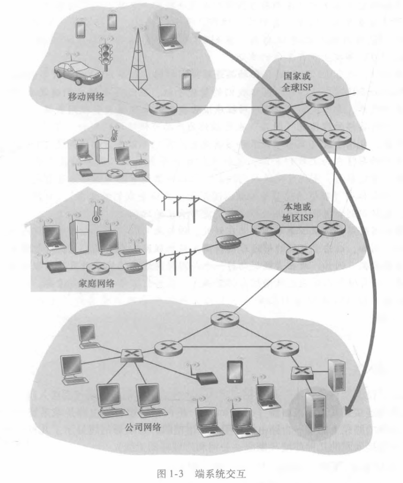

端系统也称为主机（host）,因为它们容纳（即运行）应用程序，如Web浏览器程电话118序、Web服务器程序、电子邮件客户程序或电子邮件服务器程序等。本书通篇将交替使用主机和端系统这两个术语，即主机二端系统。主机有时又被进一步划分为两类：客户（client）和服务器（server）。<u>客户通常是桌面PC、移动PC和智能手机等，而服务器通常是更为强大的机器，用于存储和发布Web页面、流视频、中继电子邮件等。</u>今天,大部分提供搜索结果、电子邮件、Web页面和视频的服务器都属于大型数据中心（datacenter）。例如，谷歌公司（Google）拥有50~100个数据中心，其中15个大型数据中心每个都有10万台以上的服务器。

> 物联网：
>
> 你能够想象几乎每样东西都与因特网无线连接的一个世界吗？能够想象在这个世界上连接了大多数人、汽车、自行车、眼镜、手表、玩具、医疗设备、家用传感器、教室、视频监视系统、大气传感器、陈列架产品和宠物吗？这种物联网（InternetofThings,IoT）事实上就在不远的某处。
>
> 据估计，在2015年有50亿件物品连接到因特网，到了2020年该数字能够达到250亿[Gartner2014]。这些物品包括我们的智能手机，它已经跟随我们遍及我们的家庭、办公室和汽车，向1SP和因特网应用程序报告我们的地理位置和使用数据。而除了智能手机，各种各样的非传统“物品”也已经作为产品可供使用。例如，有因特网连接的可穿戴设备，包括手表（来自苹果和许多其他生产商）和眼镜。因特网连接的眼镜能够将我们看到的每样东西上载到云端，允许我们与世界各地的人们实时共享我们的视觉体验。对于智能家居，有因特网连接的物品，包括恒温调节器（能够通过智能手机远程控制）以及人体秤（能够通过智能手机以图形化方式审查我们的饮食）。有因特网连接的玩具，包括识别和解释孩子讲话并适当地进行响应的玩偶。
>
> 物联网给用户带来了革命性的潜在好处。但与此同时，也存在巨大的安全风险和隐私风险。例如，攻去者可能能够通过因特网入侵物联网设备或服务器，以收集来自物联网设备的数据。例如，攻击者能够劫持一个与因特网连接的玩偶并直接与孩子交谈，或者能够入侵存储个人健康或活动信息的数据库，这些信息来自可穿戴设备。这些安全和隐私问题可能会使消费者渐渐地失去信心，并可能导致消费者的广泛接受程度下降[FTC2015]

### 1.2.1 接入网

考虑了位于“网络边缘”的应用程序和端系统后，我们接下来考虑接入网,这是指将端系统物理连接到其**边缘路由器**（edgerouter）的网络。边缘路由器是端系统到任何其他远程端系统的路径上的第一台路由器。图1・4用粗的、带阴影的线显示了几种类型的接入链路和使用接入网的几种环境（家庭、公司和广域移动无线）。

#### 1.家庭接入：DSL、电缆、FTTH、拨号和卫星

2014年，在发达国家中，实现因特网接入的家庭超过78%,名列前茅的韩国、荷兰、图芬兰和瑞典实现因特网接入的家庭则超过80%,几乎所有家庭都是经过高速宽带连接[ITU2015]。考虑到家庭对网络接入的强烈兴趣，我们从家庭与因特网的连接开始介绍接入网概况。

今天，宽带住宅接入有两种最流行的类型：数字用户线（DigitalSubscriberLine,DSL）和电缆。住户通常从提供本地电话接入的本地电话公司处获得DSL因特网接入。因此，当使用DSL时，用户的本地电话公司也是它的ISP。如图1・5所示，每个用户的DSL调制解调器使用现有的电话线（即双绞铜线，将在1.2.2节中讨论它）与位于电话公司的本地中心局（CO）中的数字用户线接入复用器（DSLAM）交换数据。家庭的DSL调制解调器得到数字数据后将其转换为高频音，以通过电话线传输给本地中心局；来自许多家庭的模拟信号在DSLAM处被转换回数字形式。

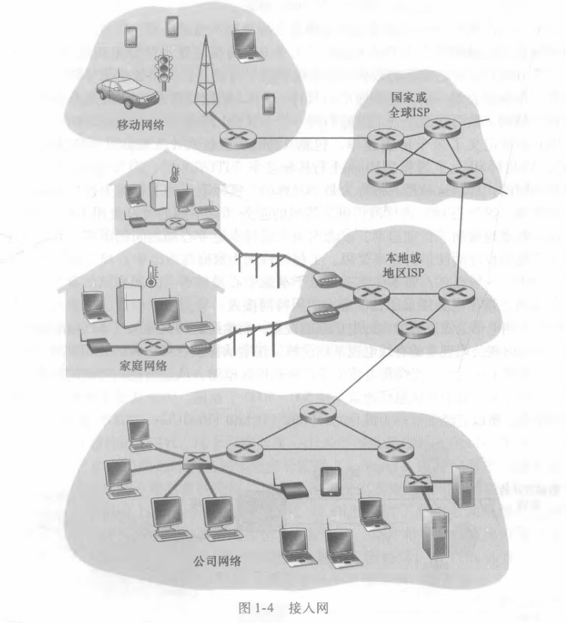

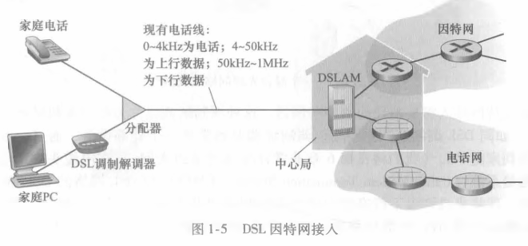

家庭电话线同时承载了数据和传统的电话信号，它们用不同的频率进行编码：

- 高速下行信道，位于50kHz到1MHz频段；
- 中速上行信道，位于4kHz到50kHz频段；
- 普通的双向电话信道，位于0到4kHz频段。

这种方法使单根DSL线路看起来就像有3根单独的线路一样，因此一个电话呼叫和一个因特网连接能够同时共享DSL链路。（1.3.1节将描述这种频分复用技术。）在用户一侧，一个分配器把到达家庭的数据信号和电话信号分隔开，并将数据信号转发给DSL调制解调器。在电话公司一侧，在本地中心局中，DSLAM把数据和电话信号分隔开，并将数据送往因特网。数百甚至上千个家庭与同一个DSLAM相连［Dischinger2007］。

DSL标准定义了多个传输速率，包括12Mbps下行和1.8Mbps上行传输速率［ITU1999］,以及55Mbps下行和15Mbps±行传输速率［ITU2006］。因为这些上行速率和下行速率是不同的，所以这种接入被称为是不对称的。实际取得的下行和上行传输速率也许小于上述速率，因为当DSL提供商提供分等级的服务（以不同的价格使用不同的速率）时,他们也许有意地限制了住宅速率，或者因为家庭与本地中心局之间的距离、双绞线的规格和电气干扰的程度而使最大速率受限。工程师特别为家庭与本地中心局之间的短距离接入设计了DSL；—般而言，如果住宅不是位于本地中心局的5~10英里（1英里=1609.344米）范围内，该住宅必须采用其他形式的因特网接入。

DSL利用电话公司现有的本地电话基础设施，而电缆因特网接入（cableInternetaccess）利用了有线电视公司现有的有线电视基础设施。住宅从提供有线电视的公司获得了电缆因特网接入。如图1・6所示，光缆将电缆头端连接到地区枢纽，从这里使用传统的同轴电缆到达各家各户和公寓。每个地区枢纽通常支持500-5000个家庭。因为在这个系统中应用了光纤和同轴电缆，所以它经常被称为混合光纤同轴（HybridFiberCoax,HFC）系统。

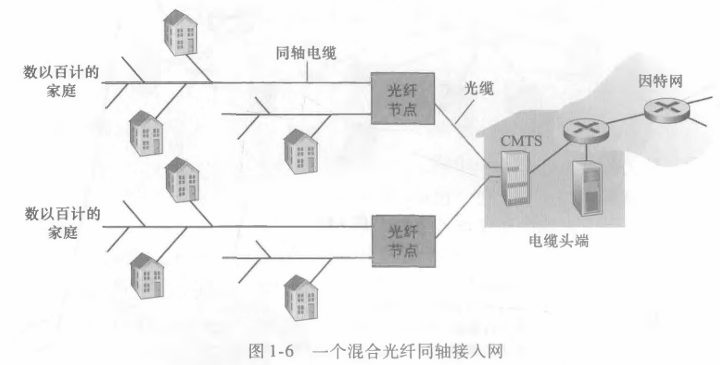

电缆因特网接入需要特殊的调制解调器，这种调制解调器称为电缆调制解调器（cablemodem）o如同DSL调制解调器，电缆调制解调器通常是一个外部设备，通过一个以太网端口连接到家庭PC。（我们将在第6章非常详细地讨论以太网。）在电缆头端，电缆调制解调器端接系统（CableModemTerminationSystem,CMTS）与DSL网络的DSLAM具有类似的功能，即将来自许多下行家庭中的电缆调制解调器发送的模拟信号转换回数字形式。电缆调制解调器将HFC网络划分为下行和上行两个信道。如同DSL,接入通常是不对称的，下行信道分配的传输速率通常比上行信道的高。DOCSIS2.0标准定义了高达42.8Mbps的下行速率和高达30.7Mbps的上行速率。如在DSL网络中的情况那样，由于较低的合同数据率或媒体损耗，可能不一定能达到最大可取得的速率。

电缆因特网接入的一个重要特征是共享广播媒体。特别是，由头端发送的每个分组向下行经每段链路到每个家庭；每个家庭发送的每个分组经上行信道向头端传输。因此，如果几个用户同时经下行信道下载一个视频文件，每个用户接收视频文件的实际速率将大大低于电缆总计的下行速率。而另一方面，如果仅有很少的活跃用户在进行Web冲浪，则每个用户都可以以全部的下行速率接收Web网页，因为用户们很少在完全相同的时刻请求网页。因为上行信道也是共享的，需要一个分布式多路访问协议来协调传输和避免碰撞。(我们将在第6章中更为详细地讨论碰撞问题。)

尽管DSL和电缆网络当前代表了超过85%的美国住宅宽带接入，但一种提供更高速率的新兴技术是光纤到户(FiberToTheHome,FTTH)[FTTHCouncil2016]o顾名思义,FTTH概念简单，从本地中心局直接到家庭提供了一条光纤路径。现在，许多国家或地区,包括阿拉伯联合酋长国、韩国、中国香港、日本、新加坡、中国台湾、立陶宛和瑞典，入«||户率已经超过了30%[FTTHCouncil2016]。

从本地中心局到家庭有几种有竞争性的光纤分布方案。最简单的光纤分布网络称为直接光纤，从本地中心局到每户设置一根光纤。更为一般的是，从中心局岀来的每根光纤实际上由许多家庭共享，直到相对接近这些家庭的位置，该光纤才分成每户一根光纤。进行这种分配有两种有竞争性的光纤分布体系结构：主动光纤网络（ActiveOpticalNetwork,AON)和被动光纤网络(PassiveOpticalNetwork,P0N)。AON本质上就是交换因特网,我们将在第6章讨论它。

这里，我们简要讨论一下PON,该技术用于Verizon的FIOS服务中。图1・7显示了使用PON分布体系结构的FTTH。每个家庭具有一个光纤网络端接器(OpticalNetworkTermi・nator,ONT),它由专门的光纤连接到邻近的分配器(splitter)o该分配器把一些家庭(通常少于100个)集结到一根共享的光纤，该光纤再连接到本地电话和公司的中心局中的光纤线路端接器(OpticalLineTenninator,OLT)0该OLT提供了光信号和电信号之间的转换，经过本地电话公司路由器与因特网相连。在家庭中，用户将一台家庭路由器(通常是无线路由器)与ONT相连，并经过这台家庭路由器接入因特网。在PON体系结构中，所有从OLT发送到分配器的分组在分配器(类似于一个电缆头端)处复制。


 FTTH有潜力提供每秒千兆比特范围的因特网接入速率。然而，大多数FTTH ISP提供多种不同速率选择，较高的速率自然花费更多。美国FTTH用户在2011年的平均下行速率大约为20Mbps（与13Mbps电缆接入网相当，而小于5MbpsDSL）[FTTHCouncil2011b]。

还可采用另外两种接入网技术为家庭提供因特网接入。在无法提供DSL、电缆和FTTH的地方（例如在某些乡村环境），能够使用卫星链路将住宅以超过1Mbps的速率与因特网相连。StarBand和HughesNet是两家这样的卫星接入提供商。使用传统电话线的拨号接入与DSL基于相同的模式：家庭的调制解调器经过电话线连接到ISP的调制解调器。与DSL和其他宽带接入网相比，拨号接入56kbps的慢速率是令人痛苦的。

#### 2.企业（和家庭）接入：以太网和WiFi

在公司和大学校园以及越来越多的家庭环境中，使用局域网（LAN）将端系统连接到边缘路由器。尽管有许多不同类型的局域网技术，但是以太网到目前为止是公司、大学和家庭网络中最为流行的接入技术。如图1-8中所示，以太网用户使用双绞铜线与一台以太网交换机相连，第6章中将详细讨论该技术。以太网交换机或这样相连的交换机网络，则再与更大的因特网相连。使用以太网接入，用户通常以100Mbps或lGbps速率接入以太网交换机，而服务器可能具有lGbps甚至10Gbps的接入速率。


然而，越来越多的人从便携机、智能手机、平板电脑和其他物品无线接入因特网（参见前面的插入内容“物联网”）。在无线LAN环境中，无线用户从/到一个接入点发送/接收分组，该接入点与企业网连接（很可能使用了有线以太网），企业网再与有线因特网相连。一个无线LAN用户通常必须位于接入点的几十米范围内。基于IEEE802.11技术的无线LAN接入,更通俗地称为WiFi,目前几乎无所不在，如大学、商业办公室、咖啡厅、机场、家庭，甚至在飞机上。在许多城市，人们能够站在街头而位于10或20个基站范围all内（对于可浏览的802.11基站全局图，参见[wigle.net2016],这些基站由那些非常热心做这种事情的人发现并记载在Web站点上）。如在第7章详细讨论的那样，802.11今天提供了高达100Mbps的共享传输速率。

虽然以太网和WiFi接入网最初是设置在企业（公司或大学）环境中的，但它们近来已经成为家庭网络中相当常见的部件。今天许多家庭将宽带住宅接入（即电缆调制解调器或DSL）与廉价的无线局域网技术结合起来，以产生强大的家用网络[Edwards2011]。图1・9显示了典型的家庭网络。这个家庭网络组成如下：一台漫游的便携机和一台有线PC；—个与无线PC和家中其他无线设备通信的基站（无线接入点）；一个提供与因特网宽带接入的电缆调制解调器；一台互联了基站及带有电缆调制解调器的固定PC的路由器。该网络允许家庭成员经宽带接入因特网，其中任何一个家庭成员都可以在厨房、院子或卧室漫游上网。

#### 3.广域无线接入：3G和LTE

iPhone和安卓等设备越来越多地用来在移动中发信息、在社交网络中分享照片、观看视频和放音乐。这些设备应用了与蜂窝移动电话相同的无线基础设施，通过蜂窝网提供商运营的基站来发送和接收分组。与WiFi不同的是，一个用户仅需要位于基站的数万米 (而不是几十米)范围内。

电信公司已经在所谓第三代(3G)无线技术中进行了大量投资，3G为分组交换广域无线因特网接入提供了超过1Mbps的速率。甚至更高速率的广域接入技术即第四代(4G)广域无线网络也已经被部署了。LTE(长期演进“Long-TermEvolution”的缩写，被评为最差首字母缩写词年度奖候选者)来源于3G技术，它能够取得超过10Mbps的速率。据报道，几十Mbps的LTE下行速率已经在商业部署中得到应用。我们将在第7章讨论无线网络和移动性，以及WiFi、3G和LTE等技术的基本原则。

### 1.2.2 物理媒体

在前面的内容中，我们概述了因特网中某些最为重要的网络接入技术。当我们描述这些技术时，我们也指出了所使用的物理媒体。例如，我们说过HFC使用了光缆和同轴电缆相结合的技术。我们说过DSL和以太网使用了双绞铜线。我们也说过移动接入网使用了无线电频谱。在这一节中，我们简要概述一下这些和其他常在因特网中使用的传输媒体。

为了定义物理媒体所表示的内容，我们仔细思考一下一个比特的短暂历程。考虑一个比特从一个端系统开始传输，通过一系列链路和路由器，到达另一个端系统。这个比特被漫不经心地传输了许许多多次！源端系统首先发射这个比特，不久后其中的第一台路由器接收该比特；第一台路由器发射该比特，接着不久后第二台路由器接收该比特；等等。因此，这个比特当从源到目的地传输时，通过一系列“发射器-接收器”对。对于每个发射器-接收器对,通过跨越一种物理媒体(physicalmedium)传播电磁波或光脉冲来发送该比特。该物理媒体可具有多种形状和形式，并且对沿途的每个发射器-接收器对而言不必具有相同的类型。物理媒体的例子包括双绞铜线、同轴电缆、多模光纤缆、陆地无线电频谱和卫星无线电频谱。物理媒体分成两种类型：导引型媒体(guidedmedia)和非导引型媒体(unguidedmedia)o对于导引型媒体,电波沿着固体媒体前行，如光缆、双绞铜线或同轴电缆。对于非导引型媒体，电波在空气或外层空间中传播，例如在无线局域网或数字卫星频道中。

在深入讨论各种媒体类型的特性之前，我们简要地讨论一下它们的成本。物理链路(铜线、光缆等)的实际成本与其他网络成本相比通常是相当小的。特别是安装物理链路的劳动力成本能够比材料的成本高出几个数量级。正因为这个原因，许多建筑商在一个建筑物的每个房间中安装了双绞线、光缆和同轴电缆。即使最初仅使用了一种媒体，在不久的将来也可能会使用另一种媒体，这样将来不必再铺设另外的线缆，从而节省了经费。

#### 1.双绞铜线

最便宜并且最常用的导引型传输媒体是双绞铜线。一百多年来，它一直用于电话网。事实上，从电话机到本地电话交换机的连线超过99%使用的是双绞铜线。我们多数人在自己家中和工作环境中已经看到过双绞线。双绞线由两根绝缘的铜线组成，每根大约lmm粗，以规则的螺旋状排列着。这两根线被绞合起来，以减少邻近类似的双绞线的电气干扰。通常许多双绞线捆扎在一起形成一根电缆，并在这些双绞线外面覆盖上保护性防护层。一对电线构成了一个通信链路。无屏蔽双绞线(UnshieldedTwistedPair,UTP)常用在建筑物内的计算机网络中，即用于局域网(LAN)中。目前局域网中的双绞线的数据速率从10Mbps到10Gbpso所能达到的数据传输速率取决于线的粗细以及传输方和接收方之间的距离。

20世纪80年代出现光纤技术时，许多人因为双绞线比特速率低而轻视它，某些人甚至认为光纤技术将完全代替双绞线。但双绞线不是那么容易被抛弃的。现代的双绞线技术例如6a类电缆能够达到lOGbps的数据传输速率，距离长达100m。双绞线最终已经作为高速LAN联网的主导性解决方案。

如前面讨论的那样，双绞线也经常用于住宅因特网接入。我们看到，拨号调制解调器技术通过双绞线能以高达56kbps的速率接入。我们也看到，数字用户线(DSL)技术通过双绞线使住宅用户以超过数十Mbps的速率接入因特网(当用户靠近ISP的中心局居住时)。

#### 2.同轴电缆

与双绞线类似，同轴电缆由两个铜导体组成，但是这两个导体是同心的而不是并行的。借助于这种结构及特殊的绝缘体和保护层，同轴电缆能够达到较高的数据传输速率。同轴电缆在电缆电视系统中相当普遍。我们前面已经看到，电缆电视系统最近与电缆调制解调器结合起来，为住宅用户提供数十Mbps速率的因特网接入。在电缆电视和电缆因特网接入中，发送设备将数字信号调制到某个特定的频段，产生的模拟信号从发送设备传送到一个或多个接收方。同轴电缆能被用作导引型共享媒体(sharedmedium)。特别是，许多端系统能够直接与该电缆相连，每个端系统都能接收由其他端系统发送的内容。

#### 3.光纤

光纤是一种细而柔软的、能够导引光脉冲的媒体，每个脉冲表示一个比特。一根光纤能够支持极高的比特速率，高达数十甚至数百Gbpso它们不受电磁干扰，长达100km的光缆信号衰减极低，并且很难窃听。这些特征使得光纤成为长途导引型传输媒体，特别是跨海链路。在美国和别的地方，许多长途电话网络现在全面使用光纤。光纤也广泛用于因特网的主干。然而，高成本的光设备，如发射器、接收器和交换机，阻碍光纤在短途传输中的应用，如在LAN或家庭接入网中就不使用它们。光载波(OpticalCarrier,OC)标准链路速率的范围从51.8Mbps到39.8Gbps；这些标准常被称为OC-n,其中的链路速率等于nx51.8Mbps。目前正在使用的标准包括OC-1、OC-3、OC-12、OC-24、OC-48、OC-96、OC・192、OC-768o［Mukherjee2006；Ramaswami2010］提供了光纤网络各方面的知识。

#### 4.陆地无线电信道

无线电信道承载电磁频谱中的信号。它不需要安装物理线路，并具有穿透墙壁、提供与移动用户的连接以及长距离承载信号的能力，因而成为一种有吸引力的媒体。无线电信道的特性极大地依赖于传播环境和信号传输的距离。环境上的考虑取决于路径损耗和遮挡衰落（即当信号跨距离传播和绕过/通过阻碍物体时信号强度降低）、多径衰落（由于干扰对象的信号反射）以及干扰（由于其他传输或电磁信号）。

陆地无线电信道能够大致划分为三类：一类运行在很短距离（如1米或2米）；另一类运行在局域，通常跨越数十到几百米；第三类运行在广域，跨越数万米。个人设备如无线头戴式耳机、键盘和医疗设备跨短距离运行；在1・2.1节中描述的无线LAN技术使用了局域无线电信道；蜂窝接入技术使用了广域无线电信道。我们将在第7章中详细讨论无线电信道。

#### 5.卫星无线电信道

一颗通信卫星连接地球上的两个或多个微波发射器/接收器，它们被称为地面站。该卫星在一个频段上接收传输，使用一个转发器（下面讨论）再生信号，并在另一个频率上发射信号。通信中常使用两类卫星：同步卫星（geostationarysatellite）和近地轨道（Low・EarthOrbiting,LEO）卫星［WikiSatellite2016］。

同步卫星永久地停留在地球上方的相同点上。这种静止性是通过将卫星置于地球表面上方36000km的轨道上而取得的。从地面站到卫星再回到地面站的巨大距离引入了可观的280ms信号传播时延。不过，能以数百Mbps速率运行的卫星链路通常用于那些无法使用DSL或电缆因特网接入的区域。

近地轨道卫星放置得非常靠近地球，并且不是永久地停留在地球上方的一个点。它们围绕地球旋转，就像月亮围绕地球旋转那样，并且彼此之间可进行通信，也可以与地面站通信。为了提供对一个区域的连续覆盖，需要在轨道上放置许多卫星。当前有许多低轨道通信系统在研制中。LEO卫星技术未来也许能够用于因特网接入。

## 1.3 网络核心

在考察了因特网边缘后，我们现在更深入地研究网络核心，即由互联因特网端系统的  分组交换机和链路构成的网状网络。图1・10用加粗阴影线勾画出网络核心部分。 

### 1.3.1 分组交换

在各种网络应用中，端系统彼此交换报文（message）。报文能够包含协议设计者需要的任何东西。报文可以执行一种控制功能（例如，图1・2所示例子中的“你好”报文），也可以包含数据，例如电子邮件数据、JPEG图像或MP3音频文件。为了从源端系统向目的端系统发送一个报文，源将长报文划分为较小的数据块，称之为分组（packet）。在源和目的地之间，每个分组都通过通信链路和分组交换机（packetswitch）传送。（交换机主要有两类：路由器（router）和链路层交换机（link-layer*switch）。）分组以等于该链路最大传输速率的速度传输通过通信链路。因此，如果某源端系统或分组交换机经过一条链路发送一个L比特的分组，链路的传输速率为尺比特/秒，则传输该分组的时间为L/R秒。

#### 1.存储转发传输


多数分组交换机在链路的输入端使用存储转发传输（store-and-forwardtransmission）机制。存储转发传输是指在交换机能够开始向输岀链路传输该分组的第一个比特之前，必须接收到整个分组。为了更为详细地探讨存储转发传输，考虑由两个端系统经一台路由器连接构成的简单网络，如图Ml所示。一台路由器通常有多条繁忙的链路，因为它的任务就是把一个入分组交换到一条岀链路。在这个简单例子中，该路由器的任务相当简单：将分组从一条（输A）链路转移到另一条唯一的连接链路。在图1・11所示的特定时刻，源已经传输了分组1的一部分，分组1的前沿已经到达了路由器。因为该路由器应用了存储转发机制，所以此时它还不能传输已经接收的比特，而是必须先缓存（即“存储”）该分组的比特。仅当路由器已经接收完了该分组的所有比特后，它才能开始向出链路传输（即“转发”）该分组。为了深刻领悟存储转发传输，我们现在计算一下从源开始发送分组到目的地收到整个分组所经过的时间。（这里我们将忽略传播时延—指这些比特以接近光速的速度跨越线路所需要的时间，这将在1.4节讨论。）源在时刻0开始传输，在时刻L/R秒,因为该路由器刚好接收到整个分组，所以它能够朝着目的地向出链路开始传输分组；在时刻20/尺，路由器已经传输了整个分组，并且整个分组已经被目的地接收。所以，总时延是2L/R。如果交换机一旦比特到达就转发比特（不必首先收到整个分组），则因为比特没有在路由器保存，总时延将是L/R。但是如我们将在1.4节中讨论的那样，路由器在转发前需要接收、存储和处理整个分组。

现在我们来计算从源开始发送第一个分组到目的地接收到所有三个分组所需的时间。与前面一样，在时刻L/R,路由器开始转发第一个分组。而在时刻L/R源也开始发送第二个分组，因为它已经完成了第一个分组的完整发送。因此，在时刻2L/R,目的地已经收到第一个分组并且路由器已经收到第二个分组。类似地，在时刻3L/R，目的地已经收到前两个分组并且路由器已经收到第三个分组。最后，在时刻4L/R,目的地已经收到所有3个分组!

我们现在来考虑下列一般情况：通过由N条速率均为R的链路组成的路径（所以,在源和目的地之间有N-1台路由器），从源到目的地发送一个分组。应用如上相同的逻辑，我们看到端到端时延是：


你也许现在要试着确定P个分组经过N条链路序列的时延有多大。

#### 2.排队时延和分组丢失

每台分组交换机有多条链路与之相连。对于每条相连的链路，该分组交换机具有一个**输出缓存**（outputbuffer,也称为输出队列（outputqueue））,它用于存储路由器准备发往那条链路的分组。该输出缓存在分组交换中起着重要的作用。如果到达的分组需要传输到某条链路，但发现该链路正忙于传输其他分组，该到达分组必须在输出缓存中等待。因此，除了存储转发时延以外，分组还要承受输岀缓存的排队时延（queuingdelay）。这些时延是变化的，变化的程度取决于网络的拥塞程度。因为缓存空间的大小是有限的，一个到达的分组可能发现该缓存已被其他等待传输的分组完全充满了。在此情况下，将出现分组**丢失**（丢包）（packetloss）,到达的分组或已经排队的分组之一将被丢弃。

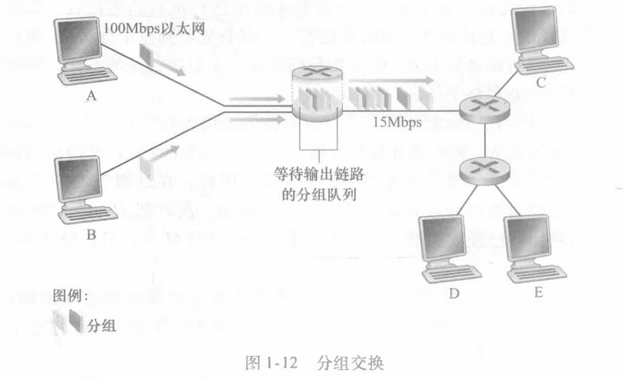

图1・12显示了一个简单的分组交换网络。如在图1・11中，分组被表示为三维厚片。厚片的宽度表示了该分组中比特的数量。在这张图中，所有分组具有相同的宽度，因此有相同的长度。假定主机A和B向主机E发送分组。主机A和B先通过100Mbps的以太网链路向第一个路由器发送分组。该路由器则将这些分组导向到一条15Mbps的链路。在某个短时间间隔内，如果分组到达路由器的到达率（转换为每秒比特）超过了15Mbps，这些分组在通过链路传输之前，将在链路输出缓存中排队，在该路由器中将出现拥塞。例如，如果主机A和主机B每个都同时发送了5个紧接着的分组突发块，则这些分组中的大多数将在队列中等待一些时间。事实上，这完全类似于每天都在经历的一些情况，例如当我们在银行柜台前排队等待或在过路收费站前等待时。我们将在1・4节中更为详细地研究这种排队时延。

#### 3.转发表和路由选择协议

前面我们说过，路由器从与它相连的一条通信链路得到分组，然后向与它相连的另一条通信链路转发该分组。但是路由器怎样决定它应当向哪条链路进行转发呢？不同的计算机网络实际上是以不同的方式完成分组转发的。这里，我们简要介绍在因特网中所采用的方法。

在因特网中，每个端系统具有一个称为IP地址的地址。当源主机要向目的端系统发送一个分组时，源在该分组的首部包含了目的地的IP地址。如同邮政地址那样，该地址具有一种等级结构。当一个分组到达网络中的路由器时，路由器检查该分组的目的地址的一部分，并向一台相邻路由器转发该分组。更特别的是，每台路由器具有一个转发表(forwarding table),用于将目的地址(或目的地址的一部分)映射成为输岀链路。当某分组到达一台路由器时，路由器检查该地址，并用这个目的地址搜索其转发表，以发现适当的出链路。路由器则将分组导向该出链路。

端到端选路过程可以用一个不使用地图而喜欢问路的汽车驾驶员来类比。例如，假定Joe驾车从费城到佛罗里达州奥兰多市的LakesideDrive街156号。Joe先驾车到附近的加油站，询问怎样才能到达佛罗里达州奥兰多市的LakesideDrive街156号。加油站的服务员从该地址中抽取了佛罗里达州部分，告诉Joe他需要上1・95南州际公路，该公路恰有一个邻近该加油站的入口。他又告诉Joe,一旦到了佛罗里达后应当再问当地人。于是，Joe上了1・95南州际公路，一直到达佛罗里达的Jacksonville，在那里他向另一个加油站服务员问路。该服务员从地址中抽取了奥兰多市部分，告诉Joe他应当继续沿1・95公路到Dayto-na海滩，然后再问其他人。在Daytona海滩，另一个加油站服务员也抽取该地址的奥兰多部分，告诉Joe应当走1・4公路直接前往奥兰多。Joe走了1・4公路，并从奥兰多出口下来。Joe又向另一个加油站的服务员询问，这时该服务员抽取了该地址的LikesideDrive部分,告诉了Joe到LakesideDrive必须要走的路。一旦Joe到达了LaResideDrive,他向一个骑自行车的小孩询问了到达目的地的方法。这个孩子抽取了该地址的156号部分，并指示了房屋的方向。Joe最后到达了最终目的地。在上述类比中，那些加油站服务员和骑车的孩子可类比为路由器。

我们刚刚学习了路由器使用分组的目的地址来索引转发表并决定适当的出链路。但是这个叙述还要求回答另一个问题：转发表是如何进行设置的？是通过人工对每台路由器逐台进行配置，还是因特网使用更为自动的过程进行配置呢？第5章将深入探讨这个问题。但在这里为了激发你的求知欲，我们现在将告诉你因特网具有一些特殊的**路由选择协议**（routing protocol）,用于自动地设置这些转发表。例如，一个路由选择协议可以决定从每台路由器到每个目的地的最短路径，并使用这些最短路径结果来配置路由器中的转发表。怎样才能实际看到分组在因特网中所走的端到端路由呢？我们现在请你亲手用一下Traceroute程序。直接访问站点www.traceroute,org,在一个特定的国家中选择一个源，跟踪从该源到你的计算机的路由。（参见1.4节有关Traceroute的讨论。）

### 1.3.2 电路交换

通过网络链路和交换机移动数据有两种基本方法：电路交换（circuitswitching）和分组交换（packetswitching）。上一小节已经讨论过分组交换网络，现在我们将注意力转向电路交换网络。

在电路交换网络中，在端系统间通信会话期间，预留了端系统间沿路径通信所需要的资源（缓存，链路传输速率）。在分组交换网络中，这些资源则不是预留的；会话的报文按需使用这些资源，其后果可能是不得不等待（即排队）接入通信线路。一个简单的类比是，考虑两家餐馆，一家需要顾客预订，而另一家不需要预订，但不保证能安排顾客。对于需要预订的那家餐馆，我们在离开家之前必须承受先打电话预订的麻烦，但当我们到达该餐馆时，原则上我们能够立即入座并点菜。对于不需要预订的那家餐馆，我们不必麻烦地预订餐桌，但当我们到达该餐馆时，也许不得不先等待一张餐桌空闲后才能入座。

传统的电话网络是电路交换网络的例子。考虑当一个人通过电话网向另一个人发送信息（语音或传真）时所发生的情况。在发送方能够发送信息之前，该网络必须在发送方和接收方之间建立一条连接。这是一个名副其实的连接，因为此时沿着发送方和接收方之间路径上的交换机都将为该连接维护连接状态。用电话的术语来说，该连接被称为一条电路（circuit）。当网络创建这种电路时，它也在连接期间在该网络链路上预留了恒定的传输速率（表示为每条链路传输容量的一部分）。既然已经为该发送方——接收方连接预留了带宽，则发送方能够以确保的恒定速率向接收方传送数据。


图1-13显示了一个电路交换网络。在这个网络中，用4条链路互联了4台电路交换机。这些链路中的每条都有4条电路，因此每条链路能够支持4条并行的连接。每台主机（例如PC和工作站）都与一台交换机直接相连。

当两台主机要通信时，该网络在两台主机之间创建一条专用的端到端连接（end・to-endconnection）。因此，主机A为了向主机B发送报文，网络必须在两条链路的每条上先预留一条电路。在这个例子中，这条专用的端到端连接使用第一条链路中的第二条电路和第二条链路中的第四条电路。因为每条链路具有4条电路，对于由端到端连接所使用的每条链路而言，该连接在连接期间获得链路总传输容量的1/4。例如,如果两台邻近交换机之间每条链路具有1Mbps传输速率，则每个端到端电路交换连接获得250kbps专用的传输速率。

与此相反，考虑一台主机要经过分组交换网络（如因特网）向另一台主机发送分组所发生的情况。与使用电路交换相同，该分组经过一系列通信链路传输。但与电路交换不同的是，该分组被发送进网络，而不预留任何链路资源之类的东西。如果因为此时其他分组也需要经该链路进行传输而使链路之一出现拥塞，则该分组将不得不在传输链路发送侧的缓存中等待而产生时延。因特网尽最大努力以实时方式交付分组，但它不做任何保证。

#### 1.电路交换网络中的复用

链路中的电路是通过频分复用(Frequency-DivisionMultiplexing,FDM)或时分复用（Time-DivisionMultiplexing,TDM）来实现的。对于FDM,链路的频谱由跨越链路创建的所有连接共享。特别是，在连接期间链路为每条连接专用一个频段。在电话网络中，这个频段的宽度通常为4kHz（即每秒4000周期）。毫无疑问，该频段的宽度称为带宽（bandwidth）。调频无线电台也使用FDM来共享88MHz~108MHz的频谱，其中每个电台被分配一个特定的频段。

对于一条TDM链路，时间被划分为固定期间的帧，并且每个帧又被划分为固定数量的时隙。当网络跨越一条链路创建一条连接时.网络在每个帧中为该连接指定一个时隙。这些时隙专门由该连接单独使用，一个时隙（在每个帧内）可用于传输该连接的数据。

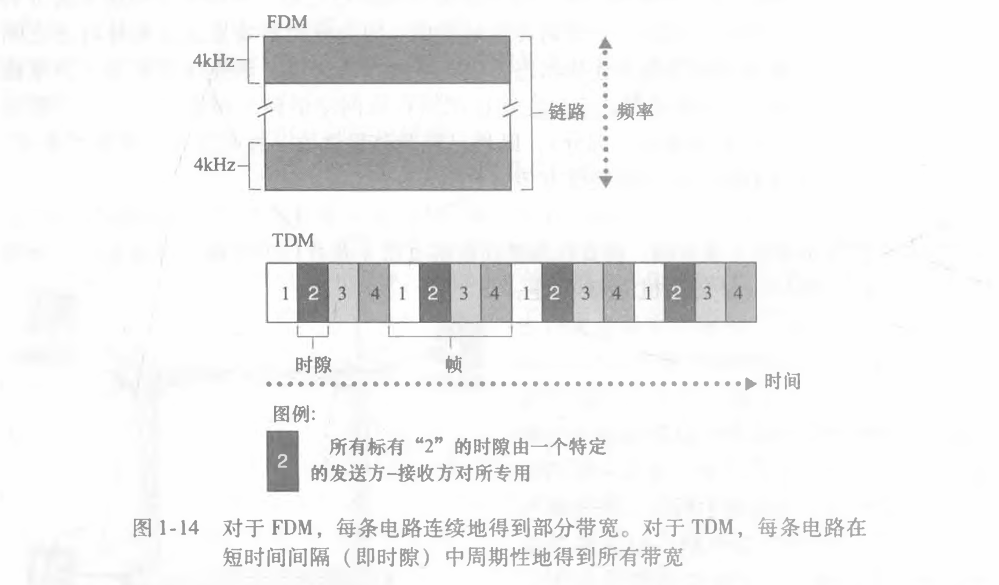

图1・14显示了一个支持多达4条电路的特定网络链路的FDM和TDM。对于FDM,其频率域被分割为4个频段，每个频段的带宽是4kHz。对于TDM,其时域被分割为帧，在每个帧中具有4个时隙，在循环的TDM帧中每条电路被分配相同的专用时隙。对于TDM,一条电路的传输速率等于帧速率乘以一个时隙中的比特数量。例如，如果链路每秒传输8000个帧，每个时隙由8个比特组成，则每条电路的传输速率是64kbps。

分组交换的支持者总是争辩说，电路交换因为在静默期（silentperiod）专用电路空闲而不够经济。例如，打电话的一个人停止讲话，空闲的网络资源（在沿该连接路由的链路中的频段或时隙）不能被其他进行中的连接所使用。作为这些资源不能有效利用的另一个例子，考虑一名放射科医师使用电路交换网络远程存取一系列X射线图像。该放射科医师建立一条连接，请求一幅图像，然后判读该图像，然后再请求一幅新图像。在放射科医师判读图像期间，网络资源分配给了该连接但没有使用（即被浪费了）。分组交换的支持者还津津乐道地指岀，创建端到端电路和预留端到端带宽是复杂的，需要复杂的信令软件以协调沿端到端路径的交换机的操作。

在结束讨论电路交换之前，我们讨论一个用数字表示的例子，它更能说明问题的实质。考虑从主机A到主机B经一个电路交换网络发送一个640000比特的文件需要多长时间。假如在该网络中所有链路使用具有24时隙的TDM,比特速率为1.536Mbps。同时假定在主机A能够开始传输该文件之前，需要500ms创建一条端到端电路。它需要多长时间才能发送该文件？每条链路具有的传输速率是1.536Mbps/24=64kbps,因此传输该文件需要（640kb）/（64kbps）=10s。这个10s,再加上电路创建时间，这样就需要10.5s发送该文件。值得注意的是，该传输时间与链路数量无关：端到端电路不管是通过一条链路还是100条链路，传输时间都将是10s。（实际的端到端时延还包括传播时延，参见1.4节。）

#### 2.分组交换与电路交换的对比

在描述了电路交换和分组交换之后，我们来对比一下这两者。分组交换的批评者经常争辩说，分组交换不适合实时服务（例如，电话和视频会议），因为它的端到端时延是可变的和不可预测的（主要是因为排队时延的变动和不可预测所致）。分组交换的支持者却争辩道：

①它提供了比电路交换更好的带宽共享；

②它比电路交换更简单、更有效，实现成本更低。

分组交换与电路交换之争的有趣讨论参见［Molinero-Fernandez2002］。概括而言，嫌餐馆预订麻烦的人宁可要分组交换而不愿意要电路交换。

分组交换为什么更有效呢？我们看一个简单的例子。假定多个用户共享一条1Mbps链路，再假定每个用户活跃周期是变化的，某用户时而以100kbps恒定速率产生数据，时而静止—这时用户不产生数据。进一步假定该用户仅有10%的时间活跃（余下的90%的时间空闲下来喝咖啡）。对于电路交换，在所有的时间内必须为每个用户预留100kbps。例如，对于电路交换的TDM,如果一个1s的帧被划分为10个时隙，每个时隙为100ms,则每帧将为每个用户分配一个时隙。

因此，该电路交换链路仅能支持10（=1Mbps/100kbps）个并发的用户。对于分组交换，一个特定用户活跃的概率是0.1（即10%）.如果有35个用户，有11或更多个并发活跃用户的概率大约是0.0004。（课后习题P8概述如何得到这个概率值。）当有10个或更少并发用户（以概率0.9996发生）时，到达的聚合数据速率小于或等于该链路的输出速率1Mbps。因此，当有10个或更少的活跃用户时，通过该链路的分组流基本上没有时延，这与电路交换的情况一样。当同时活跃用户超过10个时，分组的聚合到达速率超过该链路的输出容量，则输出队列将开始变长。（一直增长到聚合输入速率重新低于1Mbps,此后该队列长度才会减少。）因为在本例子中同时活跃用户超过10个的概率极小，分组交换差不多总是提供了与电路交换相同的性能，并且允许在用户数量是其3倍时情况也是如此。

我们现在考虑第二个简单的例子。假定有10个用户，某个用户突然产生1000个1000比特的分组，而其他用户则保持静默，不产生分组。在每帧具有10个时隙并且每个时隙包含1000比特的TDM电路交换情况下，活跃用户仅能使用每帧中的一个时隙来传输数据，而每个帧中剩余的9个时隙保持空闲。该活跃用户传输完所有106比特数据需要10s的时间。在分组交换情况下，活跃用户能够连续地以1Mbps的全部链路速率发送其分组,因为没有其他用户产生分组与该活跃用户的分组进行复用。在此情况下，该活跃用户的所有数据将在Is内发送完毕。

上面的例子从两个方面表明了分组交换的性能能够优于电路交换的性能。这些例子也强调了在多个数据流之间共享链路传输速率的两种形式的关键差异。电路交换不考虑需求，而预先分配了传输链路的使用，这使得已分配而并不需要的链路时间未被利用。另一方面，分组交换按需分配链路使用。链路传输能力将在所有需要在链路上传输分组的用户之间逐分组地被共享。

虽然分组交换和电路交换在今天的电信网络中都是普遍采用的方式，但趋势无疑是朝着分组交换方向发展。甚至许多今天的电路交换电话网正在缓慢地向分组交换迁移。特别是，电话网经常在昂贵的海外电话部分使用分组交换。

### 1.3.3 网络的网络

我们在前面看到，端系统（PC、智能手机、Web服务器、电子邮件服务器等）经过一个接入ISP与因特网相连。该接入ISP能够提供有线或无线连接，使用了包括DSL、电缆、FTTH、WiFi和蜂窝等多种接入技术。值得注意的是，接入ISP不必是电信局或电缆公司，相反，它能够是如大学（为学生、教职员工和从业人员提供因特网接入）或公司（为其雇员提供接入）这样的单位。但让端用户和内容提供商连接到接入ISP仅解决了连接难题中的很小一部分，因为因特网是由数以亿计的用户构成的。要解决这个难题，接入ISP自身必须互联。通过创建网络的网络可以做到这一点，理解这个短语是理解因特网的关键。

年复一年，构成因特网的“网络的网络”已经演化成为一个非常复杂的结构。这种演化很大部分是由经济和国家策略驱动的，而不是由性能考虑驱动的。为了理解今天的因特网的网络结构，我们以逐步递进方式建造一系列网络结构，其中的每个新结构都更好地接近现在的复杂因特网。回顾前面互联接入ISP的中心目标，是使所有端系统能够彼此发送分组。一种幼稚的方法是使每个接入ISP直接与每个其他接入ISP连接。当然，这样的网状设计对于接入ISP费用太高，因为这将要求每个接入ISP要与世界上数十万个其他接入ISP有一条单独的通信链路。

我们的第一个网络结构即网络结构1,用单一的全球传输ISP互联所有接入ISP。我们假想的全球传输ISP是一个由路由器和通信链路构成的网络，该网络不仅跨越全球，而且至小具有一台路由器靠近数十万接入ISP中的每一个。当然，对于全球传输ISP，建造这样一个大规模的网络将耗资巨大。为了有利可图，自然要向每个连接的接入ISP收费，其价格反映（并不一定正比于）一个接入ISP经过全球ISP交换的流量大小。因为接入ISP向全球传输ISP付费，故接入ISP被认为是客户（customer）,而全球传输ISP被认为是提供商(provider)。

如果某个公司建立并运营一个可赢利的全球传输ISP,其他公司建立自己的全球传输ISP并与最初的全球传输ISP竞争则是一件自然的事。这导致了网络结构2,它由数十万接AISP和多个全球传输ISP组成。接入ISP无疑喜欢网络结构2胜过喜欢网络结构1,因为它们现在能够根据价格和服务因素在多个竞争的全球传输提供商之间进行选择。然而，值得注意的是，这些全球传输ISP之间必须是互联的；不然的话，与某个全球传输ISP连接的接入ISP将不能与连接到其他全球传输ISP的接入ISP进行通信。

刚才描述的网络结构2是种两层的等级结构，其中全球传输提供商位于顶层，而接入ISP位于底层。这假设了全球传输ISP不仅能够接近每个接入ISP,而且发现经济上也希望这样做。现实中，尽管某些ISP确实具有令人印象深刻的全球覆盖，并且确实直接与许多接入ISP连接，但世界上没有哪个ISP是无处不在的。相反，在任何给定的区域，可能有一个区域ISP(regionalISP),区域中的接入ISP与之连接。每个区域ISP则与第一层ISP(tier-1 ISP)连接。第一层ISP类似于我们假想的全球传输ISP,尽管它不是在世界上每个城市中都存在，但它确实存在。有大约十几个第一层ISP,包括Level3Communications.AT&T、Sprint和NTT。有趣的是，没有组织正式认可第一层状态。俗话说：如果必须问你是否是一个组织的成员，你可能不是。

再来讨论这个网络的网络，不仅有多个竞争的第一层ISP,而且在一个区域可能有多个竞争的区域ISP。在这样的等级结构中，每个接入ISP向其连接的区域ISP支付费用,并且每个区域ISP向它连接的第一层ISP支付费用。(一个接入1SP也能直接与第一层ISP连接，这样它就向第一层1SP付费。)因此，在这个等级结构的每一层，都有客户-提供商关系。值得注意的是，第一层1SP不向任何人付费，因为它们位于该等级结构的顶部。更为复杂的情况是，在某些区域，可能有较大的区域ISP(可能跨越整个国家)，该区域中较小的区域ISP与之相连，较大的区域ISP则与第一层ISP连接。例如，在中国，每个城市有接入ISP,它们与省级ISP连接，省级ISP又与国家级ISP连接，国家级ISP最终与第一层ISP连接［Thm2012］。这个多层等级结构仍然仅仅是今天因特网的粗略近似，我们称它为网络结构3。

为了建造一个与今天的因特网更为相似的网络，我们必须在等级化网络结构3上增加存在点(PointofPresence,PoP)、多宿、对等和因特网交换点。PoP存在于等级结构的所有层次，但底层(接入ISP)等级除外。一个POP只是提供商网络中的一台或多台路由器(在相同位置)群组，其中客户ISP能够与提供商ISP连接。对于要与提供商PoP连接的客户网络，它能从第三方电信提供商租用高速链路将它的路由器之一直接连接到位于该PoP的一台路由器。任何ISP(除了第一层ISP)可以选择多宿(multi-home),即可以与两个或更多提供商ISP连接。例如，一个接入ISP可能与两个区域ISP多宿，既可以与两个区域ISP多宿，也可以与一个第一层ISP多宿。当一个ISP多宿时，即使它的提供商之一出现故障，它仍然能够继续发送和接收分组。

正如我们刚才学习的，客户ISP向它们的提供商ISP付费以获得全球因特网互联能力。客户ISP支付给提供商ISP的费用数额反映了它通过提供商交换的通信流量。为了减少这些费用，位于相同等级结构层次的邻近一对ISP能够对等(peer),也就是说，能够直接将它们的网络连到一起，使它们之间的所有流量经直接连接而不是通过上游的中间ISP传输。当两个ISP对等时，通常不进行结算，即任一个ISP不向其对等付费。如前面提到的那样，第一层ISP也与另一个第一层ISP对等，它们之间无结算。对于对等和客户-提供商关系的讨论，［VanderBerg2008］是一本不错的读物。沿着这些相同路线，第三方公司能够创建一个因特网交换点(InternetExchangePoint,TXP),IXF是一个汇合点，多个ISP能够在这里一起对等。IXP通常位于一个有自己的交换机的独立建筑物中［Ager2012］,在今天的因特网中有400多个IXP［IXPList2016］.我们称这个生态系统为网络结构4—由接入ISP、区域ISP、第一层ISP、PoP、多宿、对等和IXP组成。

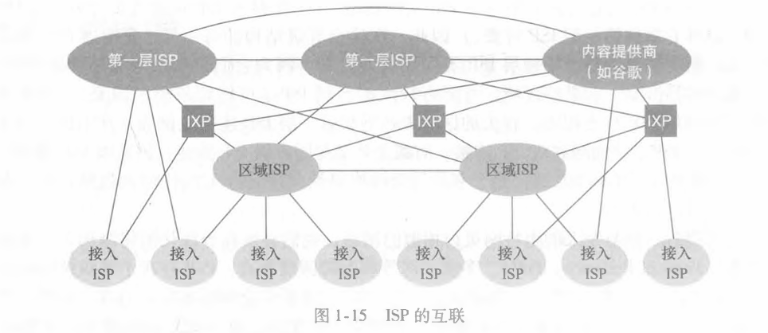

我们现在最终到达了网络结构5,它描述了现今的因特网。在图1・15中显示了网络结构5,它通过在网络结构4顶部增加内容提供商网络(contentprovidernetwork)构建而成。谷歌是当前这样的内容提供商网络的一个突岀例子。在本书写作之时，谷歌估计有50~100个数据中心分布于北美、欧洲、亚洲、南美和澳大利亚。其中的某些数据中心容纳了超过十万台的服务器，而另一些数据中心则较小，仅容纳数百台服务器。谷歌数据中心都经过专用的TCP/IP网络互联，该网络跨越全球，不过独立于公共因特网。重要的是，谷歌专用网络仅承载岀入谷歌服务器的流量。如图1・15所示，谷歌专用网络通过与较低层ISP对等（无结算），尝试“绕过”因特网的较高层，采用的方式可以是直接与它们连接,或者在IXP处与它们连接［Labovitz2010］。然而，因为许多接入ISP仍然仅能通过第一层网络的传输到达，所以谷歌网络也外第一层ISP连接，并就与这些ISP交换的流量向它们付费。通过创建自己的网络，内論供商不仅减少了向顶层ISP支付的费用，而且对其服务最终如何交付给端用户有了更多的控制。谷歌的网络基础设施在2.6节中进行了详细描述。

总结一下，今天的因特网是一个网络的网络，其结构复杂，由十多个第一层ISP和数十万个较低层ISP组成。ISP覆盖的区域多种多样，有些跨越多个大洲和大洋，有些限于狭窄的地理区域。较低层的ISP与较高层的ISP相连，较高层ISP彼此互联。用户和内容提供商是较低层ISP的客户，较低层ISP是较高层ISP的客户。近年来，主要的内容提供商也已经创建自己的网络，直接在可能的地方与较低层ISP互联。

## 1.4 分组交换网中的时延、丢包和吞吐量

回想在1.1节中我们讲过，因特网能够看成是一种基础设施，该基础设施为运行在端系统上的分布式应用提供服务。在理想情况下，我们希望因特网服务能够在任意两个端系统之间随心所欲地瞬间移动数据而没有任何数据丢失。然而，这是一个极高的目标，实践中难以达到。与之相反，计算机网络必定要限制在端系统之间的吞吐量（每秒能够传送的数据量），在端系统之间引入时延，而且实际上也会丢失分组。一方面，现实世界的物理定律引入的时延、丢包并限制吞吐量是不幸的。而另一方面，因为计算机网络存在这些问题，围绕如何去处理这些问题有许多令人着迷的话题，多得足以开设一门有关计算机网络方面的课程，可以做上千篇博士论文！在本节中，我们将开始研究和量化计算机网络中的三时延、丢包和吞吐量等问题。

### 1.4.1 分组交换网中的时延概述

前面讲过，分组从一台主机（源）出发，通过一系列路由器传输，在另一台主机(目的地)中结束它的历程。当分组从一个节点(主机或路由器)沿着这条路径到后继节点(主机或路由器)，该分组在沿途的每个节点经受了几种不同类型的时延。这些时延最为重要的是节点处理时延(nodal processing delay)排队时延(queuing delay)、传输时延(transmission delay)和传播时延(propagation delay),这些时延总体累加起来是节点总时延(tolalnodaldelay)。许多因特网应用，如搜索、Web浏览、电子邮件、地图、即时讯息和IP语音，它们的性能受网络时延的影响很大。为了深入理解分组交换和计算机网络,我们必须理解这些时延的性质和重要性。

#### 1.时延的类型


我们来探讨一下图1・16环境中的这些时延。作为源和目的地之间的端到端路由的一部分，一个分组从上游节点通过路由器A向路由器B发送。我们的目标是在路由器A刻画出节点时延。值得注意的是，路由器A具有通往路由器B的出链路。该链路前面有一个队列(也称为缓存)。当分组从上游节点到达路由器A时，路由器A检查该分组的首部以决定它的适当岀链路，并将该分组导向该链路。在这个例子中，对该分组的出链路是通向路由器B的那条链路。仅当在该链路没有其他分组正在传输并且没有其他分组排在该队列前面时，才能在这条链路上传输该分组；如果该链路当前正繁忙或有其他分组已经在该链路上排队，则新到达的分组将加入排队。

**(1)处理时延**

检查分组首部和决定将该分组导向何处所需要的时间是处理时延的一部分。处理时延也能够包括其他因素，如检查比特级别的差错所需要的时间，该差错岀现在从上游节点向路由器A传输这些分组比特的过程中。高速路由器的处理时延通常是微秒或更低的数量级。在这种节点处理之后，路由器将该分组引向通往路由器B链路之前的队列。(在第4章中，我们将研究路由器运行的细节。)

**(2)排队时延**

在队列中，当分组在链路上等待传输时，它经受排队时延。一个特定分组的排队时延长度将取决于先期到达的正在排队等待向链路传输的分组数量。如果该队列是空的，并且当前没有其他分组正在传输，则该分组的排队时延为0。另一方面，如果流量很大，并且许多其他分组也在等待传输，该排队时延将很长。我们将很快看到，到达分组期待发现的分组数量是到达该队列的流量的强度和性质的函数。实际的排队时延可以是毫秒到微秒量级。

**(3)传输时延**

假定分组以先到先服务方式传输——这在分组交换网中是常见的方式，仅当所有已经到达的分组被传输后，才能传输刚到达的分组。用L比特表示该分组的长度，用R bps(即b/s)表示从路由器A到路由器B的链路传输速率。例如，对于一条10Mbps的以太网链路，速率尺二10Mbps；对于100Mbps的以太网链路，速率R=100Mbpso传输时延是L/R。这是将所有分组的比特推向链路(即传输，或者说发射)所需要的时间。实际的传输时延通常在毫秒到微秒量级。

**(4)传播时延**

一旦一个比特被推向链路，该比特需要向路由器B传播。从该链路的起点到路由器B传播所需要的时间是传播时延。该比特以该链路的传播速率传播。该传播速率取决于该链路的物理媒体（即光纤、双绞铜线等），其速率范围是2x10(8次方)-3x10(8次方)m/S,这等于或略小于光速。该传播时延等于两台路由器之间的距离除以传播速率。即传播时延是其中d是路由器A和路由器B之间的距离，s是该链路的传播速率。一旦该分组的最后一个比特传播到节点B,该比特及前面的所有比特被存储于路由器B。整个过程将随着路由器B执行转发而持续下去。在广域网中，传播时延为毫秒量级。

**(5)传输时延和传播时延的比较**

计算机网络领域的新手有时难以理解传输时延和传播时延之间的差异。该差异是微妙而重要的。传输时延是路由器推出分组所需要的时间，它是分组长度和链路传输速率的函数，而与两台路由器之间的距离无关。另一方面，传播时延是一个比特从一台路由器传播到另一台路由器所需要的时间，它是两台路由器之间距离的函数，而与分组长度或链路传输速率无关。


一个类比可以阐明传输时延和传播时延的概念。考虑一条公路每100km有一个收费站，如图1・17所示。可认为收费站间的公路段是链路，收费站是路由器。假定汽车以100km/h的速度（也就是说当一辆汽车离开一个收费站时，它立即加速到100km/h并在收费站间维持该速度）在该公路上行驶（即传播）。假定这时有10辆汽车作为一个车队在行驶，并且这10辆汽车以固定的顺序互相跟随。可以认为每辆汽车是一个比特，该车队是一个分组。同时假定每个收费站以每辆车12s的速度服务（即传输）一辆汽车，并且由于时间是深夜，因此该车队是公路上唯批汽车。最后，假定无论该车队的第一辆汽车何时到达收费站，它在入口处等待，直到其他9辆汽车到达并整队依次前行。（因此，整个车队在它能够“转发”之前，必须存储在收费站。）收费站将整个车队推向公路所需要的时间是（10辆车）/（5辆车/min）=2min。该时间类比于一台路由器中的传输时延。一辆汽车从一个收费站出口行驶到下一个收费站所需要的时间是100km/（100km/h）=1h。这个时间类比于传播时延。因此，从该车队存储在收费站前到该车队存储在下一个收费站前的时间是“传输时延”与“传播时间”总和，在本例中为62min。

我们更深入地探讨一下这个类比。如果收费站对车队的服务时间大于汽车在收费站之间行驶的时间，将会发生什么情况呢？例如，假定现在汽车是以1000km/h的速率行驶,收费站是以每分钟一辆汽车的速率为汽车服务。则汽车在两个收费站之间的行驶时延是6min,收费站为车队服务的时间是10min。在此情况下，在该车队中的最后几辆汽车离开第一个收费站之前，该车队中前面的几辆汽车将会达到第二个收费站。这种情况在分组交换网中也会发生，一个分组中的前几个比特到达了一台路由器，而该分组中许多余下的比特仍然在前面的路由器中等待传输。如果说一图胜千言的话，则一个动画必定胜百万言。与本书配套的Web网站提供了一个交互式Java小程序，它很好地展现及对比了传输时延和传播时延。我们极力推荐读者访问该Java小程序。［Smith2009］也提供了可读性很好的有关传播、排队和传输时延的讨论。

如果令d{proc}、d{queue}、d{trans}、d{prop}分别表示处理时延、排队时延、传输时延和传播时延,则节点的总时延由下式给定：

```
d{nodal}=d{proc}+d{queue}+d{trans}+d{prop}
```

这些时延成分所起的作用可能会有很大的不同。例如，对于连接两台位于同一个大学校园的路由器的链路而言，d{prop}可能是微不足道的（例如，几微秒）；然而，对于由同步卫星链路互联的两台路由器来说，d{prop}是几百毫秒，能够成为d{nodal}中的主要成分。类似地，d{trans}的影响可能是微不足道的，也可能是很大的。通常对于10Mbps和更高的传输速率（例如，对于LAN）的信道而言，它的影响是微不足道的；然而，对于通过低速拨号调制解调器链路发送的长因特网分组而言，可能是数百毫秒。处理时延d{proc}通常是微不足道的；然而，它对一台路由器的最大吞吐量有重要影响，最大吞吐量是一台路由器能够转发分组的最大速率。

### 1.4.2 排队时延和丢包

节点时延的最为复杂和有趣的成分是排队时延d{queue}。事实上，排队时延在计算机网络中的重要程度及人们对它感兴趣的程度，从发表的数以千计的论文和大量专著的情况可见一斑［Bertsekas1991；Daigle1991；Kleinrock1975,1976；Ross1995］。我们这里仅给出有关排队时延的总体的、直觉的讨论；求知欲强的读者可能要浏览某些书籍（或者最终写有关这方面的博士论文）。与其他3项时延（d{proc}、d{prop}、d{trans}）不同的是，排队时延对不同的分组可能是不同的。例如，如果10个分组同时到达空队列，传输的第一个分组没有排队时延，而传输的最后一个分组将经受相对大的排队时延（这时它要等待其他9个分组被传输）。因此，当表征排队时延时，人们通常使用统计量来度量，如平均排队时延、排队时延的方差和排队时延超过某些特定值的概率。

什么时候排队时延大，什么时候又不大呢？该问题的答案很大程度取决于流量到达该队列的速率、链路的传输速率和到达流量的性质，即流量是周期性到达还是以突发形式到达。为了更深入地领会某些要点，令a表示分组到达队列的平均速率（a的单位是分组/秒，即pkt/s）。前面讲过尺是传输速率，即从队列中推出比特的速率（以bps即b/s为单位）。为了简单起见，也假定所有分组都是由L比特组成的。则比特到达队列的平均速率是La bps。最后，假定该队列非常大，因此它基本能容纳无限数量的比特。比率L/R被称为流量强度（trafficintensity）,它在估计排队时延的范围方面经常起着重要的作用。如果La/R>1,则比特到达队列的平均速率超过从该队列传输岀去的速率。在这种不幸的情况下，该队列趋向于无限增加，并且排队时延将趋向无穷大！因此，流量工程中的一条金科玉律是：设计系统时流量强度不能大于1。

现在考虑La/RW<=1时的情况。这时，到达流量的性质影响排队时延。例如，如果分组周期性到达，即每L/R秒到达一个分组，则每个分组将到达一个空队列中，不会有排队时延。另一方面，如果分组以突发形式到达而不是周期性到达，则可能会有很大的平均排队时延。例如，假定每（L/R）N秒同时到达N个分组。则传输的第一个分组没有排队时延;传输的第二个分组就有L/R秒的排队时延；更为一般地，第几个传输的分组具有（n-1）L/R秒的排队时延。我们将该例子中的计算平均排队时延的问题留给读者作为练习。

以上描述周期性到达的两个例子有些学术味。通常，到达队列的过程是随机的，即到达并不遵循任何模式，分组之间的时间间隔是随机的。在这种更为真实的情况下，量La/R通常不足以全面地表征时延的统计量。不过，直观地理解排队时延的范围很有用。特别是，如果流量强度接近于0,则几乎没有分组到达并且到达间隔很大，那么到达的分组将不可能在队列中发现别的分组。因此，平均排队时延将接近0。另一方面，当流量强度接近1时，当到达速率超过传输能力(由于分组到达速率的波动)时将存在时间间隔，在这些时段中将形成队列。当到达速率小于传输能力时，队列的长度将缩短。无论如何，随着流量强度接近1,平均排队长度变得越来越长。平均排队时延与流量强度的定性关系如图1・18所示。


图1.18的一个重要方面是这样一个事实：随着OU流量强度接近于1,平均排队时延迅速增加。该强度的少量增加将导致时延大比例增加。也许你在公路上经历过这种事。如果在经常拥塞的公路上像平时一样驾驶，这条路经常拥塞的事实意味着它的流量强度接近于1,如果某些事件引起一个即便是稍微大于平常量的流量，经受的时延就可能很大。为了实际感受一下排队时延的情况，我们再次鼓励你访问本书的Web网站，该网站提供了一个有关队列的交互式Java小程序。如果你将分组到达速率设置得足够大，使流量强度超过1,那么将看到经过一段时间后，队列慢慢地建立起来。

**丢包**

在上述讨论中，我们已经假设队列能够容纳无穷多的分组。在现实中，一条链路前的队列只有有限的容量，尽管排队容量极大地依赖于路由器设计和成本。因为该排队容量是有限的，随着流量强度接近1,排队时延并不真正趋向无穷大。相反，到达的分组将发现一个满的队列。由于没有地方存储这个分组，路由器将丢弃(drop)该分组，即该分组将会丢失(lost)。当流量强度大于1时，队列中的这种溢出也能够在用于队列的Java小程序中看到。

从端系统的角度看，上述丢包现象看起来是一个分组已经传输到网络核心，但它绝不会从网络发送到目的地。分组丢失的比例随着流量强度增加而增加。因此，一个节点的性能常常不仅根据时延来度量，而且根据丢包的概率来度量。正如我们将在后面各章中讨论的那样，丢失的分组可能基于端到端的原则重传，以确保所有的数据最终从源传送到了目的地。

### 1.4.3 端到端时延

前面的讨论一直集中在节点时延上，即在单台路由器上的时延。我们现在考虑从源到目的地的总时延。为了能够理解这个概念，假定在源主机和目的主机之间有N-1台路由器。我们还要假设该网络此时是无拥塞的(因此排队时延是微不足道的)，在每台路由器和源主机上的处理时延是d{proc},每台路由器和源主机的输出速率是R bps,每条链路的传播时延是d{prop}。节点时延累加起来，得到端到端时延：

```
d{end-end}=N(d{proc}+d{trans}+d{prop})
```

同样，式中d{trans}=L/R,其中L是分组长度。值得注意的是，式（1-2）是式（1-1）的一般形式，式（1-1）没有考虑处理时延和传播时延。在各节点具有不同的时延和每个节点存在平均排队时延的情况下，需要对式（1-2）进行一般化处理。我们将有关工作留给读者。

#### 1.Traceroute

为了对计算机网络中的端到端时延有第一手认识，我们可以利用Traceroute程序。Traceroute是一个简单的程序，它能够在任何因特网主机上运行。当用户指定一个目的主机名字时，源主机中的该程序朝着目的地发送多个特殊的分组。当这些分组向着目的地传送时，它们通过一系列路由器。当路由器接收到这些特殊分组之一时，它向源回送一个短报文。该短报文包括路由器的名字和地址。

更具体的是，假定在源和目的地之间有N-1台路由器。源将向网络发送N个特殊的分组，其中每个分组地址指向最终目的地。这N个特殊分组标识为从1到N,第一个分组标识为1,最后的分组标识为N。当第n台路由器接收到标识为n的第n个分组时，该路由器不是向它的目的地转发该分组，而是向源回送一个报文。当目的主机接收第N个分组时，它也会向源返回一个报文。该源记录了从它发送一个分组到它接收到对应返回报文所经历的时间；它也记录了返回该报文的路由器（或目的主机）的名字和地址。以这种方式，源能够重建分组从源到目的地所采用的路由，并且该源能够确定到所有中间路由器的往返时延。Traceroute实际上对刚才描述的实验重复了3次，因此该源实际上向目的地发送了3xN个分组。RFC1393详细地描述了Traceroute。

这里有一个Traceroute程序输出的例子，其中追踪的路由从源主机gaia.cs.umass.edu（位于马萨诸塞大学）到cis.poly,edu（位于布鲁克林的理工大学）。输出有6列：第一列是前面描述的n值，即路径上的路由器编号；第二列是路由器的名字；第三列是路由器地址（格式为XXX.xxx.xxx.XXX）；最后3列是3次实验的往返时延。如果源从任何给定路由器接收到的报文少于3条（由于网络中的丢包），Traceroute在该路由器号码后面放一个星号，并向那台路由器报告少于3次往返时间。


在上述跟踪中，在源和目的之间有9台路由器。这些路由器中的多数有一个名字，所有都有地址。例如，路由器3的名字是border4-rt-gi-1-3.gw.umass.edu,它的地址是128.119.2.194。看看为这台路由器提供的数据，可以看到在源和路由器之间的往返时延:3次实验中的第一次是1.03ms,后继两次实验的往返时延是0.48ms和0.45ms。这些往返时延包括刚才讨论的所有时延，即包括传输时延、传播时延、路由器处理时延和排队时延。因为该排队时延随时间变化，所以分组门发送到路由器耳的往返时延实际上可能比分组n+1发送到路由器n+1的往返时延更长。的确，我们在上述例子中观察到了这种现象：到路由器6的时延比到路由器7的更大！

你想自己试试Traceroute程序吗？我们极力推荐你访问http://www.traceroute,org,它的Web界面提供了有关路由跟踪的大量源列表。你选择一个源，并提供任何目的地的主机名，该Traceroute程序则会完成所有工作。有许多为Traceroute提供图形化界面的免费软件，其中我们喜爱的一个程序是PingPlotterfPingPlotter2016］。

#### 2.端系统、应用程序和其他时延

除了处理时延、传输时延和传播时延，端系统中还有其他一些重要时延。例如，希望向共享媒体（例如在WiFi或电缆调制解调器情况下）传输分组的端系统可能有意地延迟它的传输，把这作为它与其他端系统共享媒体的协议的一部分；我们将在第6章中详细地考虑这样的协议。另一个重要的时延是媒体分组化时延，这种时延出现在IP语音（VoIP）应用中。在VoIP中，发送方在向因特网传递分组之前必须首先用编码的数字化语音填充一个分组。这种填充一个分组的时间称为分组化时延，它可能较大，并能够影响用户感受到的VoIP呼叫的质量。这个问题将在本章结束的课后作业中进一步探讨。

### 1.4.4 计算机网络中的吞吐量

除了时延和丢包，计算机网络中另一个至关重要的性能测度是端到端吞吐量。为了定义吞吐量，考虑从主机A到主机B跨越计算机网络传送一个大文件。例如，也许是从一个P2P文件共享系统中的一个对等方向另一个对等方传送一个大视频片段。在任何时间瞬间的瞬时吞吐量（instantaneous throughput）是主机B接收到该文件的速率（以bps计）。（许多应用程序包括许多P2P文件共享系统，其用户界面显示了下载期间的瞬时吞吐量，也许你以前已经观察过它！）如果该文件由F比特组成，主机B接收到所有F比特用去T秒,则文件传送的平均吞吐量（averagethroughput.）是F/Tbps。对于某些应用程序如因特网电话，希望具有低时延和在某个阈值之上（例如，对某些因特网电话是超过24kbps,对某些实时视频应用程序是超过256kbps）的一致的瞬时吞吐量。对于其他应用程序，包括涉及文件传送的那些应用程序，时延不是决定性的，但是希望具有尽可能高的吞吐量。

为了进一步深入理解吞吐量这个重要概念，我们考虑几个例子。图1-19a显示了服务器和客户这两个端系统，它们由两条通信链路和一台路由器相连。考虑从服务器传送一个文件到客户的吞吐量。令R{s}表示服务器与路由器之间的链路速率；R{c}表示路由器与客户之间的链路速率。假定在整个网络中只有从该服务器到客户的比特在传送。在这种理想的情况下，我们要问该服务器到客户的吞吐量是多少？为了回答这个问题，我们可以想象比特是流体，通信链路是管道。显然，这台服务器不能以快于R{c}bps的速率通过其链路注入比特；这台路由器也不能以快于R{s}bps的速率转发比特。如果R{s}<R{c},则在给定的吞吐量R{s}bps的情况下，由该服务器注入的比特将顺畅地通过路由器“流动”，并以速率bps到达客户。另一方面,如果R{s}<R{c}，则该路由器将不能像接收速率那样快地转发比特。在这种情况下，比特将以速率R{c}离开该路由器，从而得到端到端吞吐量R。（还要注意的是，如果比特继续以速率R{s}到达路由器，继续以R{c}离开路由器的话，在该路由器中等待传输给客户的积压比特将不断增加，这是一种最不希望的情况！）因此,对于这种简单的两链路网络，其吞吐量是min[R{c},R{s}]这就是说，它是瓶颈链路（bottleneck link）的传输速率。在决定了吞吐量之后，我们现在近似地得到从服务器到客户传输一个F比特的大文件所需要的时间是F/min[R{c},R{s}]。举一个特定的例子，假定你正在下载一个F=32X10{6}比特的MP3文件，服务器具有R{s}=2Mbps的传输速率,并且你有一条R{c}=1Mbps的接入链路。则传输该文件所需的时间是32秒。当然，这些吞吐量和传输时间的表达式仅是近似的，因为它们并没有考虑存储转发、处理时延和协议等问题。


图1-19b此时显示了一个在服务器和客户之间具有N条链路的网络，这N条链路的传输速率分别是R1,R2,...,Rn,应用对两条链路网络的分析方法，我们发现从服务器到客户的文件传输吞吐量是min{R1,R2,...,Rn}，这同样仍是沿着服务器和客户之间路径的瓶颈链路的速率。

现在考虑由当前因特网所引发的另一个例子。图1-20a显示了与一个计算机网络相连的两个端系统：一台服务器和一个客户。考虑从服务器向客户传送一个文件的吞吐量。服务器以速率为心的接入链路与网络相连，且客户以速率R{c}的接入链路与网络相连。现在假定在通信网络核心中的所有链路具有非常高的传输速率，即该速率比R{s}和R{c}要高得多。目前因特网的核心的确超量配置了高速率的链路，从而很少出现拥塞。同时假定在整个网络中发送的比特都是从该服务器到该客户。在这个例子中，因为计算机网络的核心就像一个粗大的管子，所以比特从源向目的地的流动速率仍是R{s}和R{c}中的最小者，即吞吐量=min{R{s}、R{c}}。因此，在今天因特网中对吞吐量的限制因素通常是接入网。

作为最后一个例子，考虑图1-20b,其中有10台服务器和10个客户与某计算机网络核心相连。在这个例子中，同时发生10个下载，涉及10个客户一服务器对。假定这10个下载是网络中当时的唯一流量。如该图所示，在核心中有一条所有10个下载通过的链路。将这条链路R的传输速率表示为R。假定所有服务器接人链路具有相同的速率R{s},所有客户接入链路具有相同的速率R{c},并且核心中除了速率为R的一条共同链路之外的所有链路，它们的传输速率都比R{c}、R{s}和R大得多。现在我们要问，这种下载的吞吐量是多少?显然，如果该公共链路的速率R很大，比如说比R{s}和R{c}大100倍，则每个下载的吞吐量将仍然是min{R{c},R{s}}。但是如果该公共链路的速率与R{c}和R{s}有相同量级会怎样呢?在这种情况下其吞吐量将是多少呢?让我们观察一个特定的例子。假定R{s}=2Mbps,R{c}=1Mbps,R=5Mbps、并且公共链路为10个下载平等划分它的传输速率。这时每个下载的瓶颈不再位于接入网中，而是位于核心中的共享链路了，该瓶颈仅能为每个下载提供500kbps的吞吐量。因此每个下载的端到端吞吐量现在减少到500kbps。

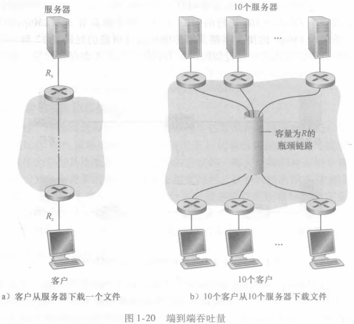

图1-19和图1-20中的例子说明吞吐量取决于数据流过的链路的传输速率。我们看到当没有其他干扰流量时，其吞吐量能够近似为沿着源和目的地之间路径的最小传输速率。图1-20b中的例子更一般地说明了养吐量不汉取决于沿者路径的传输速率，而且取决于干扰流量。特别是，如果许多其他的数据流也通过这条链路流动，一条具有高传输速率的链路仍然可能成为文件传输的瓶颈链路。我们将在课后习题中和后继章节中更仔细地研究计算机网络中的吞吐量。

## 1.5 协议层次及其服务模型

从我们到目前的讨论来看，因特网显然是一个极为复杂的系统。我们已经看到，因特网有许多部分：大量的应用程序和协议、各种类型的端系统、分组交换机以及各种类型的链路级媒体。面对这种巨大的复杂性，存在着组织网络体系结构的希望吗?或者至少存在着我们对网络体系结构进行讨论的希望吗?幸运的是，对这两个问题的回答都是肯定的。

### 1.5.1 分层的体系结构

在试图组织我们关于因特网体系结构的想法之前，先看一个人类社会与之类比的例子。实际上，在日常生活中我们一直都与复杂系统打交道。恕象一下有人请你描述比如航线系统的情况吧。你怎样用一个结构来描述这样一个复杂的系统?该系统具有票务代理、行李检查、登机口人员、飞行员、飞机、空中航行控制和世界范围的导航系统。描述这种系统的一种方式是。描述当你乘某个航班时，你(或其他人替你)要采取的一系列动作。你要购买机票.托运行李，去登机口，并最终登上这次航班。该飞机起飞.飞行到目的地。当飞机着陆后，你从登机口离机并认领行李。如果这次行程不理想，你向票务机构投诉这次航班(你的努力一无所获)。图1-21显示了相关情况。我们已经能从这里看出与计算机网络的某些类似：航空公司把你从源送到目的地；而分组被从因特网中的源主机送到日的主机。但这不是我们寻求的完全的类似。我们在图1-21中寻找某些结构。观察图1-21,我们注意到在每一端都有票务功能；还对已经检票的乘客有托运行李功能，对已经检票并已经检查过行李的乘客有登机功能。对于那些已经通过登机口的乘客(即已经经过检票、行李检查和通过登机口的乘客),有起飞和着陆的功能，并且在飞行中，有飞机按预定路线飞行的功能。这提示我们能够以水平的方式看待这些功能。如图1-22所示。

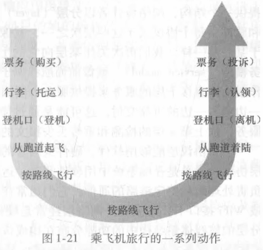

图1・22将航线功能划分为一些层次，提供了我们能够讨论航线旅行的框架。注意到每个层次与其下面的层次结合在一起，实现了某些功能、服务。在票务层及以下，完成了一个人从航线柜台到航线柜台的转移。在行李层及以下，完成了人和行李从行李托运到行李认领的转移。注意到行李层仅对已经完成票务的人提供服务。在登机口层，完成了人和行李从离港登机口到到港登机口的转移。在起飞/着陆层，完成了一个人和手提行李从跑道到跑道的转移。每个层次通过以下方式提供服务：①在这层中执行了某些动作（例如,在登机口层，某飞机的乘客登机和离机）；②使用直接下层的服务（例如，在登机口层,使用起飞/着陆层的跑道到跑道的旅客转移服务）

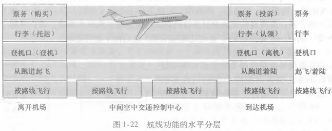

利用分层的体系结构，我们可以讨论一个大而复杂系统的定义良好的特定部分。这种简化本身由于提供模块化而具有很高价值，这使某层所提供的服务实现易于改变。只要该层对其上面的层提供相同的服务，并且使用来自下面层次的相同服务，当某层的实现变化时，该系统的其余部分保持不变。（注意到改变一个服务的实现与改变服务本身是极为不同的！）例如，如果登机口功能被改变了（例如让人们按身高登机和离机），航线系统的其余部分将保持不变，因为登机口仍然提供相同的功能（人们登机和离机）；改变后，它仅是以不同的方式实现了该功能。对于大而复杂且需要不断更新的系统，改变服务的实现而不影响该系统其他组件是分层的另一个重要优点。

#### 1.协议分层

我们对航线已经进行了充分讨论，现将注意力转向网络协议。为了给网络协议的设计提供一个结构，网络设计者以分层（layer）的方式组织协议以及实现这些协议的网络硬件和软件。每个协议属于这些层次之一，就像图1・22所示的航线体系结构中的每种功能属于某一层一样。我们再次关注某层向它的上一层提供的服务（service）,即所谓一层的服务模型（servicemodel）。就像前面航线例子中的情况一样，每层通过在该层中执行某些动作或使用直接下层的服务来提供服务。例如，由第n层提供的服务可能包括报文从网络的一边到另一边的可靠交付。这可能是通过使用第n-1层的边缘到边缘的不可靠报文传送服务，加上第几层的检测和重传丢失报文的功能来实现的。

一个协议层能够用软件、硬件或两者的结合来实现。诸如HTTP和SMTP这样的应用层协议几乎总是在端系统中用软件实现，运输层协议也是如此。因为物理层和数据链路层负责处理跨越特定链路的通信，它们通常在与给定链路相关联的网络接口卡（例如以太网或WiFi接口卡）中实现。网络层经常是硬件和软件实现的混合体。还要注意的是，如同分层的航线体系结构中的功能分布在构成该系统的各机场和飞行控制中心中一样，一个第几层协议也分布在构成该网络的端系统、分组交换机和其他组件中。这就是说，第几层协议的不同部分常常位于这些网络组件的各部分中。

协议分层具有概念化和结构化的优点［RFC3439］。如我们看到的那样，分层提供了一种结构化方式来讨论系统组件。模块化使更新系统组件更为容易。然而，需要提及的是，某些研究人员和联网工程师激烈地反对分层［WMenian1992］。分层的一个潜在缺点是一层可能冗余较低层的功能。例如，许多协议栈在基于每段链路和基于端到端两种情况下，都提供了差错恢复。第二种潜在的缺点是某层的功能可能需要仅在其他某层才出现的信息（如时间戳值），这违反了层次分离的目标。

将这些综合起来，各层的所有协议被称为协议栈（protocolstack）。因特网的协议栈由5个层次组成：物理层、链路层、网络层、运输层和应用层（如图l・23a所示）。如果你查看本书目录，将会发现我们大致是以因特网协议栈的层次来组织本书的。我们采用了自顶向下方法（top-downapproach）,首先处理应用层，然后向下进行处理。

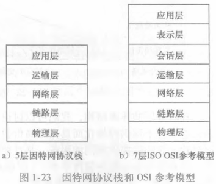

##### （1）应用层

应用层是网络应用程序及它们的应用层协议存留的地方。因特网的应用层包括许多协议，例如HTTP（它提供了Web文档的请求和传送）、SMTP（它提供了电子邮件报文的传输）和FTP（它提供两个端系统之间的文件传送）。我们将看到，某些网络功能，如将像WWW.ietf.org这样对人友好的端系统名字转换为32比特的网络地址，也是借助于特定的应用层协议即域名系统（DNS）完成的。我们将在第2章中看到，创建并部署我们自己的新应用层协议是非常容易的。

应用层协议分布在多个端系统上，而一个端系统中的应用程序使用协议与另一个端系统中的应用程序交换信息分组。我们把这种位于应用层的信息分组称为报文（message）。

##### （2）运输层

因特网的运输层在应用程序端点之间传送应用层报文。在因特网中，有两种运输协议，即TCP和UDP,利用其中的任一个都能运输应用层报文。TCP向它的应用程序提供了面向连接的服务。这种服务包括了应用层报文向目的地的确保传递和流量控制（即发送方/接收方速率匹配）。TCP也将长报文划分为短报文，并提供拥塞控制机制，因此当网络拥塞时，源抑制其传输速率。UDP协议向它的应用程序提供无连接服务。这是一种不提供不必要服务的服务，没有可靠性，没有流量控制，也没有拥塞控制。在本书中，我们把运输层的分组称为报文段(segment)。

##### （3）网络层

因特网的网络层负责将称为数据报（datagram）的网络层分组从一台主机移动到另一台主机。在一台源主机中的因特网运输层协议（TCP或UDP）向网络层递交运输层报文段和目的地址，就像你通过邮政服务寄信件时提供一个目的地址一样。

因特网的网络层包括著名的网际协议IP,该协议定义了在数据报中的各个字段以及端系统和路由器如何作用于这些字段。IP仅有一个，所有具有网络层的因特网组件必须运行IPo因特网的网络层也包括决定路由的路由选择协议，它根据该路由将数据报从源传输到目的地。因特网具有许多路由选择协议。如我们在1・3节所见，因特网是一个网络的网络，并且在一个网络中，其网络管理者能够运行所希望的任何路由选择协议。尽管网络层包括了网际协议和一些路由选择协议，但通常把它简单地称为IP层，这反映了IP是将因特网连接在一起的黏合剂这样的事实。

##### （4）链路层

因特网的网络层通过源和目的地之间的一系列路由器路由数据报。为了将分组从一个节点（主机或路由器）移动到路径上的下一个节点，网络层必须依靠该链路层的服务。特别是在每个节点，网络层将数据报下传给链路层，链路层沿着路径将数据报传递给下一个：1•节点。在该下一个节点，链路层将数据报上传给网络层。

由链路层提供的服务取决于应用于该链路的特定链路层协议。例如，某些协议基于链路提供可靠传递，从传输节点跨越一条链路到接收节点。值得注意的是，这种可靠的传递服务不同于TCP的可靠传递服务，TCP提供从一个端系统到另一个端系统的可靠交付。链路层的例子包括以太网、WiFi和电缆接入网的DOCSIS协议。因为数据报从源到目的地传送通常需要经过几条链路，一个数据报可能被沿途不同链路上的不同链路层协议处理。例如，一个数据报可能被一段链路上的以太网和下一段链路上的PPP所处理。网络层将受到来自每个不同的链路层协议的不同服务。在本书中，我们把链路层分组称为帧（fnmie）。

##### （5）物理层

虽然链路层的任务是将整个帧从一个网络元素移动到邻近的网络元素，而物理层的任务是将该帧中的一个个比特从一个节点移动到下一个节点。在这层中的协议仍然是链路相关的，并且进一步与该链路（例如，双绞铜线、单模光纤）的实际传输媒体相关。例如，以太网具有许多物理层协议：一个是关于双绞铜线的，另一个是关于同轴电缆的，还有一个是关于光纤的，等等。在每种场合中，跨越这些链路移动一个比特是以不同的方式进行的。

#### 2.OSI模型

详细地讨论过因特网协议栈后，我们应当提及它不是唯一的协议栈。特别是在20世纪70年代后期，国际标准化组织（ISO）提出计算机网络围绕7层来组织，称为开放系统互连（OSI）模型［ISO2016］。当那些要成为因特网协议的协议还处于襁褓之中，只是许多正在研发的不同协议族之一时，0SI模型就已经成形。事实上，初始0SI模型的发明者在创建该模型时心中可能并没有想到因特网。无论如何，自20世纪70年代后期开始，许多培训课程和大学课程都围绕7层模型挑选有关ISO授权和组织的课程。因为它在网络教育的早期影响，该7层模型继续以某种方式存留在某些网络教科书和培训课程中。

显示在图l-23b中的OSI参考模型的7层是：应用层、表示层、会话层、运输层、网络层、数据链路层和物理层。这些层次中，5层的功能大致与它们名字类似的因特网对应层的功能相同。所以，我们来考虑0SI参考模型中附加的两个层，即表示层和会话层。表示层的作用是使通信的应用程序能够解释交换数据的含义。这些服务包括数据压缩和数据加密（它们是自解释的）以及数据描述（这使得应用程序不必担心在各台计算机中表示/存储的内部格式不同的问题）。会话层提供了数据交换的定界和同步功能，包括了建立检查点和恢复方案的方法。

因特网缺少了在0SI参考模型中建立的两个层次，该事实引起了一些有趣的问题:这些层次提供的服务不重要吗？如果一个应用程序需要这些服务之一，将会怎样呢？因特网对这两个问题的回答是相同的：这留给应用程序开发者处理。应用程序开发者决定一个服务是否是重要的，如果该服务重要，应用程序开发者就应该在应用程序中构建该功能。

### 1.5.2 封装

图1・24显示了这样一条物理路径：数据从发送端系统的协议栈向下，沿着中间的链路层交换机和路由器的协议栈上上下下，然后向上到达接收端系统的协议栈。如我们将在本书后面讨论的那样，路由器和链路层交换机都是分组交换机。与端系统类似，路由器和链路层交换机以多层次的方式组织它们的网络硬件和软件。而路由器和链路层交换机并不实现协议栈中的所有层次。如图1・24所示，链路层交换机实现了第一层和第二层；路由器实现了第一层到第三层。例如，这意味着因特网路由器能够实现IP协议（一种第三层协议），而链路层交换机则不能。我们将在后面看到，尽管链路层交换机不能识别IP地址，但它们能够识别第二层地址，如以太网地址。值得注意的是，主机实现了所有5个层次，这与因特网体系结构将它的复杂性放在网络边缘的观点是一致的。

图1・24也说明了一个重要概念：封装（encapsulation）。在发送主机端，一个应用层报文（application-layermessage）（图1・24中的M）被传送给运输层。在最简单的情况下,运输层收取到报文并附上附加信息（所谓运输层首部信息，图1-24中的H{l}）,该首部将被接收端的运输层使用。应用层报文和运输层首部信息一道构成了运输层报文段（transportlayersegment）。运输层报文段因此封装了应用层报文。附加的信息也许包括了下列信息:允许接收端运输层向上向适当的应用程序交付报文的信息；差错检测位信息，该信息让接收方能够判断报文中的比特是否在途中已被改变。运输层则向网络层传递该报文段，网络层增加了如源和目的端系统地址等网络层首部信息（图1・24中的H{n}),生成了网络层数据报（network-layerdatagTam）。该数据报接下来被传递给链路层，链路层（自然而然地）增加它自己的链路层首部信息并生成链路层帧（link・layer亦me）。所以我们看到，在每一层，一个分组具有两种类型的字段：首部字段和有效载荷字段（payloadfield）。有效载荷通常是来自上一层的分组。

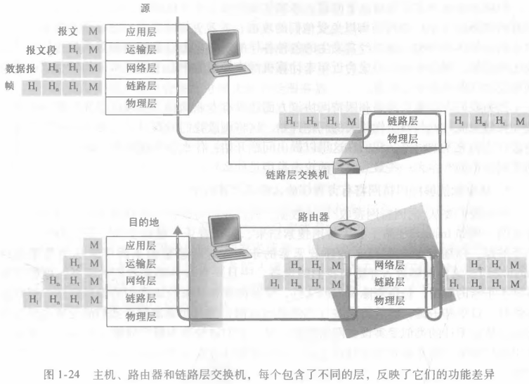

这里一个有用的类比是经过公共邮政服务在某公司办事处之间发送一封备忘录。假定位于某办事处的Alice要向位于另一办事处的Bob发送一封备忘录。该备忘录类比于应用层报文。Alice将备忘录放入办事处之间的公函信封中，并在公函信封上方写上了Bob的名字和部门。该办事处之间的公函信封类比于运输层报文段，即它包括了首部信息（Bob的名字和部门编号）并封装了应用层报文（备忘录）。当发送办事处的收发室拿到该办事处之间的备忘录时，将其放入适合在公共邮政服务发送的信封中，并在邮政信封上写上发送和接收办事处的邮政地址。此处，邮政信封类比于数据报，它封装了运输层的报文段（办事处之间的公函信封），该报文段封装了初始报文（备忘录）。邮政服务将该邮政信封交付给接收办事处的收发室。在此处开始了拆封过程。该收发室取出了办事处之间的公函信封并转发给Bob。最后，Bob打开信封并拿走了备忘录。

封装的过程能够比前面描述的更为复杂。例如，一个大报文可能被划分为多个运输层的报文段（这些报文段每个可能被划分为多个网络层数据报）。在接收端，则必须从其连续的数据报中重构这样一个报文段。

## 1.6 面对攻击的网络

对于今天的许多机构（包括大大小小的公司、大学和政府机关）而言，因特网已经成为与其使命密切相关的一部分了。许多人也依赖因特网从事各种职业、社会和个人活动。目前，数以亿计的物品（包括可穿戴设备和家用设备）与因特网相连。但是在所有这一切背后，存在着一个阴暗面，其中的“坏家伙”试图对我们的日常生活进行破坏，如损坏我们与因特网相连的计算机，侵犯我们的隐私以及使我们依赖的因特网服务无法运行。

网络安全领域主要探讨以下问题：坏家伙如何攻击计算机网络，以及我们（即将成为计算机网络的专家）如何防御以免受他们的攻击，或者更好的是设计能够事先免除这样的攻击的新型体系结构。面对经常发生的各种各样的现有攻击以及新型和更具摧毁性的未来攻击的威胁，网络安全已经成为近年来计算机网络领域的中心主题。本书的特色之一是将网络安全问题放在中心位置。

因为我们在计算机网络和因特网协议方面还没有专业知识，所以这里我们将从审视某些今天最为流行的与安全性相关的问题开始。这将刺激我们的胃口，以便我们在后续章节中进行更为充实的讨论。我们在这里以提岀问题开始：什么会出现问题？计算机网络是如何受到攻击的？今天一些最为流行的攻击类型是什么？

**1.坏家伙能够经因特网将有害程序放入你的计算机中**

因为我们要从/向因特网接收/发送数据，所以我们将设备与因特网相连。这包括各种好东西，例如Instagram帖子、因特网搜索结果、流式音乐、视频会议、流式电影等。但不幸的是，伴随好的东西而来的还有恶意的东西，这些恶意的东西可统称为恶意软件（malware）,它们能够进入并感染我们的设备。一旦恶意软件感染我们的设备，就能够做各种不正当的事情，包括删除我们的文件，安装间谍软件来收集我们的隐私信息，如社会保险号、口令和击键，然后将这些（当然经因特网）发送给坏家伙。我们的受害主机也可1==1能成为数以千计的类似受害设备网络中的一员，它们被统称为僵尸网络（botnet）,坏家伙利用僵尸网络控制并有效地对目标主机展开垃圾邮件分发或分布式拒绝服务攻击（很快将讨论）。

至今为止的多数恶意软件是自我复制（self-replicating）的：一旦它感染了一台主机,就会从那台主机寻求进人因特网上的其他主机，从而形成新的感染主机，再寻求进入更多的主机。以这种方式，自我复制的恶意软件能够指数式地快速扩散。恶意软件能够以病毒或蠕虫的形式扩散。病毒（virus）是一种需要某种形式的用户交互来感染用户设备的恶意软件。典型的例子是包含恶意可执行代码的电子邮件附件。如果用户接收并打开这样的附件，不经意间就在其设备上运行了该恶意软件。通常，这种电子邮件病毒是自我复制的:例如，一旦执行，该病毒可能向用户地址簿上的每个接收方发送一个具有相同恶意附件的相同报文。蠕虫（worm）是一种无须任何明显用户交互就能进入设备的恶意软件。例如,用户也许运行了一个攻击者能够发送恶意软件的脆弱网络应用程序。在某些情况下，没有用户的任何干预，该应用程序可能从因特网接收恶意软件并运行它，生成了蠕虫。新近感染设备中的蠕虫则能扫描因特网，搜索其他运行相同网络应用程序的易受感染的主机。当它发现其他易受感染的主机时，便向这些主机发送一个它自身的副本。今天，恶意软件无所不在且防范成本高。当你用这本书学习时，我们鼓励你思考下列问题：计算机网络设计者能够采取什么防御措施，以使与因特网连接的设备免受恶意软件的攻击？

**2.坏家伙能够攻击服务器和网络基础设施**

另一种宽泛类型的安全性威胁称为拒绝服务攻击（Denial-of・Service（DoS）attack）。顾名思义，DoS攻击使得网络、主机或其他基础设施部分不能由合法用户使用。Web服务器、电子邮件服务器、DNS服务器（在第2章中讨论）和机构网络都能够成为DoS攻击的目标。因特网DoS攻击极为常见，每年会出现数以千计的DoS攻击［Moore2001］。访问数字攻击图（DigitalAttackMap）站点可以观看世界范围内每天最厉害的DoS攻击［DAM2016］。大多数因特网DoS攻击属于下列三种类型之一：

- 弱点攻击。这涉及向一台目标主机上运行的易受攻击的应用程序或操作系统发送制作精细的报文。如果适当顺序的多个分组发送给一个易受攻击的应用程序或操作系统，该服务器可能停止运行，或者更糟糕的是主机可能崩溃。
- 带宽洪泛。攻击者向目标主机发送大量的分组，分组数量之多使得目标的接入链路变得拥塞，使得合法的分组无法到达服务器。
- 连接洪泛。攻击者在目标主机中创建大量的半开或全开TCP连接(将在第3章中讨论TCP连接)。该主机因这些伪造的连接而陷入困境，并停止接受合法的连接。

我们现在更详细地研究这种带宽洪泛攻击。回顾1.4.2节中讨论的时延和丢包问题,显然，如果某服务器的接入速率为Kbps,则攻击者将需要以大约7?bps的速率来产生危害。如果R非常大的话，单一攻击源可能无法产生足够大的流量来伤害该服务器。此外,如果从单一源发岀所有流量的话，某上游路由器就能够检测出该攻击并在该流量靠近服务器之前就将其阻挡下来。在图1・25中显示的分布式DoS(DistributedDoS,DDoS)中，攻击者控制多个源并让每个源向目标猛烈发送流量。使用这种方法，遍及所有受控源的聚合流量速率需要大约R的能力来使该服务陷入瘫痪。DDoS攻击充分利用由数以千计的受害主机组成的僵尸网络，这在今天是屡见不鲜的［DAM2016］。相比于来自单一主机的DoS攻击，DDoS攻击更加难以检测和防范。

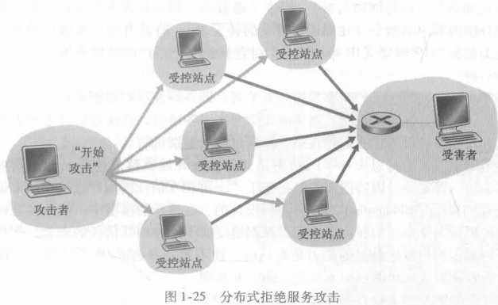


当学习这本书时，我们鼓励你考虑下列问题：计算机网络设计者能够采取哪些措施防止DoS攻击？我们将看到，对于3种不同类型的DoS攻击需要采用不同的防御方法。

**3.坏家伙能够嗅探分组**

今天的许多用户经无线设备接入因特网，如WiFi连接的膝上计算机或使用蜂窝因特网连接的手持设备(在第7章中讨论)。无所不在的因特网接入极为便利并让移动用户方便地使用令人惊奇的新应用程序的同时，也产生了严重的安全脆弱性一一在无线传输设备的附近放置一台被动的接收机，该接收机就能得到传输的每个分组的副本！这些分组包含了各种敏感信息，包括口令、社会保险号、商业秘密和隐秘的个人信息。记录每个流经的分组副本的被动接收机被称为分组嗅探器(packetsniffer)。嗅探器也能够部署在有线环境中。在有线的广播环境中，如在许多以太网LAN中,分组嗅探器能够获得经该LAN发送的所有分组。如在1.2节中描述的那样，电缆接入技术也广播分组，因此易于受到嗅探攻击。此外，获得某机构与因特网连接的接入路由器或接入链路访问权的坏家伙能够放置一台嗅探器以产生从该机构出入的每个分组的副本，再对嗅探到的分组进行离线分析，就能得出敏感信息。

分组嗅探软件在各种Web站点上可免费得到，这类软件也有商用的产品。教网络课程的教授布置的实验作业就涉及写一个分组嗅探器和应用层数据重构程序。与本书相关联的Wireshark［Wireshark2016］实验（参见本章结尾处的Wireshark实验介绍）使用的正是这样一种分组嗅探器！

因为分组嗅探器是被动的，也就是说它们不向信道中注入分组，所以难以检测到它们。因此，当我们向无线信道发送分组时，我们必须接受这样的可能性，即某些坏家伙可能记录了我们的分组的副本。如你已经猜想的那样，最好的防御嗅探的方法基本上都与密码学有关。我们将在第8章研究密码学应用于网络安全的有关内容。

**4.坏家伙能够伪装成你信任的人**

生成具有任意源地址、分组内容和目的地址的分组，然后将这个人工制作的分组传输到因特网中，因特网将忠实地将该分组转发到目的地，这一切都极为容易（当你学完这本教科书后，你将很快具有这方面的知识了！）。想象某个接收到这样一个分组的不会猜疑的接收方（比如说一台因特网路由器），将该（虚假的）源地址作为真实的，进而执行某些嵌入在该分组内容中的命令（比如说修改它的转发表）。将具有虚假源地址的分组注入因特网的能力被称为IP哄骗（IPspoofing）,而它只是一个用户能够冒充另一个用户的许多方式中的一种。

为了解决这个问题，我们需要采用端点鉴别，即一种使我们能够确信一个报文源自我们认为它应当来自的地方的机制。当你继续学习本书各章时，再次建议你思考怎样为网络应用程序和协议做这件事。我们将在第8章探讨端点鉴别机制。

在本节结束时，值得思考一下因特网是如何从一开始就落入这样一种不安全的境地的。大体上讲，答案是：因特网最初就是基于“一群相互信任的用户连接到一个透明的网络上”这样的模型［Blumenthal2001］进行设计的，在这样的模型中，安全性是没有必要的。初始的因特网体系结构在许多方面都深刻地反映了这种相互信任的理念。例如，一个用户向任何其他用户发送分组的能力是默认的，而不是一种请求/准予的能力，还有用户身份取自所宣称的表面价值，而不是默认地需要鉴别。但是今天的因特网无疑并不涉及“相互信任的用户”。

但是，今天的用户仍然需要通信，当他们不必相互信任时，他们也许希望匿名通信，也许间接地通过第三方通信（例如我们将在第2章中学习的Web高速缓存，我们将在第7章学习的移动性协助代理），也许不信任他们通信时使用的硬件、软件甚至空气。随着我们进一步学习本书，会面临许多安全性相关的挑战：我们应当寻求对嗅探、端点假冒、中间人攻击、DDoS攻击、恶意软件等的防护办法。我们应当记住：在相互信任的用户之间的通信是一种例外而不是规则。欢迎你到现代计算机网络世界！

## 1.7 计算机网络和因特网的历史

1.1节到1.6节概述了计算机网络和因特网的技术。你现在应当有足够的知识来给家人和朋友留下深刻印象了。然而，如果你真的想在下次鸡尾酒会上一鸣惊人，你应当在你的演讲中点缀一些有关因特网引人入胜的历史轶闻［Segaller1998］。1.7.1分组交换的发展:1961〜1972计算机网络和今天因特网领域的开端可以追溯到20世纪60年代早期，那时电话网是世界上占统治地位的通信网络。1.3节讲过，电话网使用电路交换将信息从发送方传输到接收方，这种适当的选择使得语音以一种恒定的速率在发送方和接收方之间传输。随着20世纪60年代早期计算机的重要性越来越大，以及分时计算机的出现，考虑如何将计算机连接在一起，并使它们能够被地理上分布的用户所共享的问题，也许就成了一件自然的事。这些用户所产生的流量很可能具有突发性，即活动的间断性，例如向远程计算机发送一个命令，接着是静止的时间段，这是等待应答或对接收到的响应进行思考的时间。

全世界有3个研究组首先发明了分组交换，以作为电路交换的一种有效的、健壮的替!«=hi代技术。这3个研究组互不知道其他人的工作［Leiner1998］。有关分组交换技术的首次公开发表出自LeonardKleinrock［Kleinrock1961；Kleinrock1964］,那时他是麻省理工学院(MIT)的一名研究生。Kleinrock使用排队论，完美地体现了使用分组交换方法处理突发性流量源的有效性。1964年，兰德公司的PaulBaran［Baran1964］已经开始研究分组交换的应用，以在军用网络上传输安全语音，同时在英国的国家物理实验室(NPL),DonaldDavies和RogerScantlebury也在研究分组交换技术。

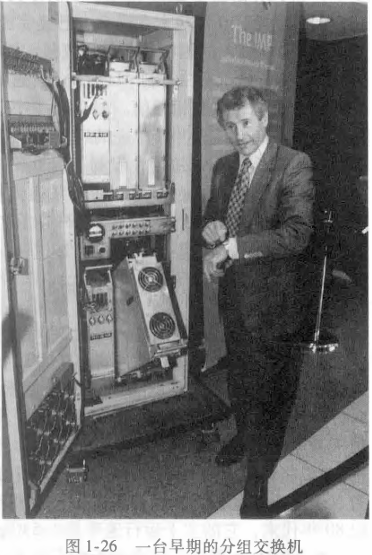

MIT、兰德和NPL的工作奠定了今天的因特网的基础。但是因特网也经历了很长的"边构建边示范(let's・build-it-and-demonstrate-it)”的历史，这可追溯到20世纪60年代早期。J-C.R.Licklider[DEC1990]和LawrenceRoberts都是Kleinrock在MIT的同事，他们转而去领导美国高级研究计划署(Ad・vancedResearchProjectsAgency,ARPA)的计算机科学计划。Roberts公布了一个ARPA-net［Roberts1967］的总体计划，它是第一个分组交换计算机网络，是今天的公共因特网的直接祖先。在1969年的劳动节，第一台分组交换机在Kleinrock的监管下安装在美国加州大学洛杉矶分校(UCLA),其他3台分组交换机不久后安装在斯坦福研究所(StanfordResearchInstitute,SRI)、美国加州大学圣巴巴拉分校(UCSantaBarbara)和犹他大学(UniversityofUtah)(参见图1-26)o羽翼未丰的因特网祖先到1969年年底有了4个节点。Kleinrock回忆说，该网络的最先应用是从UCLA到SRI执行远程注册，但却导致了该系统的崩溃［Kleinrock2004］。

到了1972年，ARPAnet已经成长到大约15个节点，由RobertKahn首次对它进行了公开演示。在ARPAnet端系统之间的第一台主机到主机协议一一称为网络控制协议（NCP）,就是此时完成的［RFC001］。随着端到端协议的可供使用，这时能够写应用程序了。在1972年，RayTomlinson编写了第一个电子邮件程序。

### 1.7.2 专用网络和网络互联：1972~1980

最初的ARPAnet是一个单一的、封闭的网络。为了与ARPAnet的一台主机通信，一台主机必须与另一台ARPAnetIMP实际相连。20世纪70年代早期和中期，除ARPAnet之外的其他分组交换网络问世：ALOHAnet是一个微波网络，它将夏威夷岛上的大学［Abramson1970］以及DARPA的分组卫星［RFC829］和分组无线电网［Kahn1987］连接到一起；Telenet是BBN的商用分组交换网，它基于ARPAnet技术；由LouisPouzin领衔的Cyclades是法国的一个分组交换网［Think2012］；还有如Tymnet和GE信息服务网这样的分时网络，以及20世纪60年代后期和70年代初期的类似网络［Schwartz1977］；IBM的SNA(1996~1974),它与ARPAnet同时在运行［Schwartz1977］。

网络的数目开始增加。人们事后看到，研制将网络连接到一起的体系结构的时机已经成熟。互联网络的先驱性工作（得到了美国国防部高级研究计划署（DARPA）的支持）由VintonCerf和RobertKahn［Cerf1974］完成，本质上就是创建一个网络的网络；术语网络互联（internetting）就是用来描述该项工作的。

这些体系结构的原则体现在TCP中。然而，TCP的早期版本与今天的TCP差异很大。TCP的早期版本将通过端系统重传的可靠按序数据传递（仍是今天的TCP的一部分）与转发功能（今天该功能由IP执行）相结合。TCP的早期实验以及认识到对诸如分组语音这样的应用程序中不可靠的、非流控制的、端到端传递服务的重要性，导致IP从TCP中分离出来，并研制了UDP协议。我们今天看到的3个重要的因特网协议—TCP、UDP和IP,到20世纪70年代末在概念上已经完成。

除了DARPA的因特网相关研究外，许多其他重要的网络活动也在进行中。在夏威夷,NormanAbramson正在研制ALOHAnet,这是一个基于分组的无线电网络，它使在夏威夷岛上的多个远程站点互相通信。ALOHA协议［Abramson1970］是第一个多路访问协议，允许地理上分布的用户共享单一的广播通信媒体（一个无线电频率）。Metcalfe和Boggs基于Abramson的多路访问协议，研制了用于有线共享广播网络的以太网协议［Metcalfe1976］。令人感兴趣的是，Metcalfe和Boggs的以太网协议是由连接多台PC、打印机和共享磁盘在一起的需求所激励的［Perkins1994］O在PC革命和网络爆炸的25年之前，Metcalfe和Boggs就奠定了今天PCLAN的基础。

### 1.7.3 网络的激增:1980-1990

到了20世纪70年代末，大约200台主机与ARPAnet相连。到了20世纪80年代末,连到公共因特网的主机数量达到100000台，那时的公共因特网是网络的联盟，看起来非常像今天的因特网。20世纪80年代是联网主机数量急剧增长的时期。

这种增长是由几个显著成果即创建计算机网络将大学连接到一起引起的。BITNET为位于美国东北部的几个大学之间提供了电子邮件和文件传输。建立了CSNET（计算机科学网），以将还没有接入ARPAnet的大学研究人员连接在一起。1986年，建立了NSFNET,为NSF资助的超级计算中心提供接入。NSFNET最初具有56kbps的主干速率，到了20世纪80年代末，它的主干运行速率是1.5Mbps,并成为连接区域网络的基本主干。

在ARPAnet界中，许多今天的因特网体系结构的最终部分逐渐变得清晰起来。1983年1月1日见证了TCP/IP作为ARPAnet新的标准主机协议的正式部署，替代了NCP协议。从NCP到TCP/IP的迁移［RFC801］是一个标志性事件，所有主机被要求在那天转移到TCP/IP±去。在20世纪80年代后期，TCP进行了重要扩展，以实现基于主机的拥塞控制［Jacobson1988］.还研制出了DNS（域名系统），用于将人可读的因特网名字（例如gaia.cs.umass.edu）映射到它的32比特IP地址［RFC1034］。

在20世纪80年代初期，在ARPAnet（这绝大多数是美国的成果）发展的同时，法国启动了Minitel项目，这个雄心勃勃的计划是让数据网络进入每个家庭。在法国政府的支持下，Minitel系统由公共分组交换网络（基于X.25协议集）、Minitel服务器和具有内置低速调制解调器的廉价终端组成。Minitel于1984年取得了巨大的成功，当时法国政府向每个需要的住户免费分发一个Minitel终端。Minitel站点包括免费站点（如电话目录站点）以及一些专用站点，这些专用站点根据每个用户的使用来收取费用。在20世纪90年代中期的鼎盛时期，Minitel提供了20000多种服务，涵盖从家庭银行到特殊研究数据库的广泛范围。Minitel在大量法国家庭中存在了10年后，大多数美国人才听说因特网。

### 1.7.4 因特网爆炸：20世纪90年代

20世纪90年代岀现了许多事件，这些事件标志着因特网持续革命和很快到来的商业化。作为因特网祖先的ARPAnet已不复存在。1991年，NSFNET解除了对NSFNET用于商业目的的限制。NSFNET自身于1995年退役，这时因特网主干流量则由商业因特网服务提供商负责承载。

然而，20世纪90年代的主要事件是万维网（WorldWideWeb）应用程序的岀现，它将因特网带入世界上数以百万计的家庭和商业中。Web作为一个平台，也引入和配置了数百个新的应用程序，其中包括搜索（如谷歌和Bing）、因特网商务（如亚马逊和eBay）以及社交网络（如脸书），对这些应用程序我们今天已经习以为常了。

Web是由TimBerners-Lee于1989〜1991年间在CERN发明的[Berners-Lee1989],最初的想法源于20世纪40年代VarmevarBush[Bush1945]和20世纪60年代以来TedNelson［Xanadu2012］在超文本方面的早期工作。Berners-Lee和他的同事研制了HTML、HTTP、Web服务器和浏览器的初始版本，这是Web的4个关键部分。到了1993年年底前后，大约有200台Web服务器在运行，而这些只是正在出现的Web服务器的冰山一角。就在这个时候，几个研究人员研制了具有GUI接口的Web浏览器，其中的MarcAndreessen和JimClark一起创办了MosaicCommunications公司,该公司就是后来的Netscape通信公司［Cusmano1998；Quittner1998］。

到了1995年,大学生们每天都在使用Netscape浏览器在Web上冲浪。大约在这段时间，大大小小的公司都开始运行Web服务器，并在Web±处理商务。1996年，微软公司开始开发浏览器，这导致了Netscape和微软之间的浏览器之战，并以微软公司在几年后获胜而告终［Cusumano1998］。

20世纪90年代的后5年，随着主流公司和数以千计的初创公司创造了大量因特网产品和服务，因特网到了飞速增长和创新的时期。到了2000年末，因特网已经支持数百流行的应用程序，包括以下4种备受欢迎的应用程序：

- 电子邮件，包括附件和Web可访问的电子邮件。
- Web,包括Web浏览和因特网商务。•即时讯息（instantmessaging）,具有联系人列表。
- MP3的对等（pee—to・peer）文件共享，由Napster开仓I」。

值得一提的是，前两个应用程序岀自专业研究机构，而后两个却由一些年轻创业者所发明。

1995-2001年，这段时间也是因特网在金融市场上急转突变的时期。在成为有利可图的公司之前，数以百计的因特网初创公司靠首次公开募股（IPO）并在股票市场上交易起家。许多公司身价数十亿美元，却没有任何主要的收入渠道。因特网的股票在2000-2001年崩盘，导致许多初创公司倒闭。不过，也有许多公司成为因特网世界的大赢家，包括微软、思科、雅虎、e-Bays谷歌和亚马逊。

### 1.7.5 最新发展

计算机网络中的变革继续以急促的步伐前进。所有的前沿研究正在取得进展，包括部署更快的路由器和在接入网和网络主干中提供更高的传输速率。但下列进展值得特别关注：

- 自2000年开始，我们见证了家庭宽带因特网接入的积极部署—不仅有电缆调制解调器和DSL,而且有光纤到户，这些在1.2节中讨论过。这种高速因特网为丰富的视频应用创造了条件，包括用户生成的视频的分发（例如YouTube）.电影和电视节目的按需流（例如Netflix）以及多人视频会议（例如Skype、Facetime和■GoogleHangouts）。
- 高速（54Mbps及更高）公共WiFi网络和经过4G蜂窝电话网的中速（几十Mbps）因特网接入越来越普及，不仅使在运动中保持持续连接成为可能，也产生了新型特定位置应用，如Yelp、TindersYikYak和W%2011年，与因特网连接的无线设备的数量超过了有线设备的数量。高速无线接入为手持计算机（iPhone.安卓手机、iPad等）的迅速出现提供了舞台，这些手持计算机具有对因特网持续不断和无拘束接入的优点。
- 诸如脸书、InstagramA推特（Twitter）和微信（在中国极为流行）这样的在线社交网络已经在因特网之上构建了巨大的人际网络。这些社交网络，许多广泛用于发送消息以及照片分享。许多因特网用户今天主要“生活”在一个或多个社交网络中。通过他们的API,在线社交网络为新的联网应用和分布式游戏创建了平台。
- 如在1.3.3节中所讨论的，在线服务提供商如谷歌和微软已经广泛部署了自己的专用网络。该专用网络不仅将它们分布在全球的数据中心连接在一起，而且通过直接与较低层ISP对等连接，能够尽可能绕过因特网。因此，谷歌几乎可以瞬间提供搜索结果和电子邮件访问，仿佛它们的数据中心运行在自己的计算机中一样。
- 许多因特网商务公司在“云”（如亚马逊的EC2、谷歌的应用引擎、微软的Azure）中运行它们的应用。许多公司和大学也已经将它们的因特网应用（如电子邮件和Web托管）迁移到云中。云公司不仅可以为应用提供可扩展的计算和存储环境,也可为应用提供对其高性能专用网络的隐含访问。

## 1.8 小结

在本章中，我们涉及了大量的材料！我们已经看到构成特别的因特网以及一般的计算机网络的各种硬件和软件。我们从网络的边缘开始，观察端系统和应用程序，以及运行在端系统上为应用程序提供的运输服务。接着我们也观察了通常能够在接入网中找到的链路层技术和物理媒体。然后我们进入网络核心更深入地钻研网络，看到分组交换和电路交换是通过电信网络传输数据的两种基本方法，并且探讨了每种方法的长处和短处。我们也研究了全球性因特网的结构，知道了因特网是网络的网络。我们看到了因特网的由较高层和较低层ISP组成的等级结构，允许该网络扩展为包括数以千计的网络。

在这个概述性章节的第二部分，我们研究了计算机网络领域的几个重要主题。我们首先研究了分组交换网中的时延、吞吐量和丢包的原因。我们研究得到传输、传播和排队时延以及用于吞吐量的简单定量模型；我们将在整本书的课后习题中多处使用这些时延模型。接下来，我们研究了协议分层和服务模型、网络中的关键体系结构原则，我们将在本书多处引用它们。我们还概述了在今天的因特网中某些更为流行的安全攻击。我们用计算机网络的简要历史结束我们对网络的概述。第1章本身就构成了计算机网络的小型课程。

因此，第1章中的确涉及了大量的背景知识！如果你有些不知所云，请不要着急。在后继几章中我们将重新回顾这些概念，更为详细地研究它们（那是承诺，而不是威胁！）。此时，我们希望你完成本章内容的学习时，对构建网络的众多元素的直觉越来越敏锐，对网络词汇越来越精通（不妨经常回过头来查阅本章），对更加深入地学习网络的愿望越来越强烈。这些也是在本书的其余部分我们将面临的任务。

**本书的路线图**

在开始任何旅行之前，你总要先查看路线图，以便更为熟悉前面的主要道路和交叉路口。对于我们即将开启的这段“旅行”而言，其最终目的地是深入理解计算机网络“是什么、怎么样和为什么”等内容。我们的路线图是本书各章的顺序：

第1章计算机网络和因特网

第2章应用层

第3章运输层

第4章网络层：数据平面

第5章网络层：控制平面

第6章链路层和局域网

第7章无线网络和移动网络

第8章计算机网络中的安全

第9章多媒体网络

第2~6章是本书的5个核心章。应当注意的是，这些章都围绕5层因特网协议栈上面的4层而组织，其中一章对应一层。要进一步注意的是，我们的旅行将从因特网协议栈4nli的顶部即应用层开始，然后向下面各层进行学习。这种自顶向下旅行背后的基本原理是,一旦我们理解这些应用程序，就能够理解支持这些应用程序所需的各种网络服务。然后能够依次研究可能由网络体系结构实现的服务的各种方式。较早地涉及应用程序，也能够对学习本课程其余部分提供动力。

第7〜9章关注现代计算机网络中的3个极为重要的（并且在某种程度上是独立的）主题。在第7章中，我们研究了无线网络和移动网络，包括无线LAN（其中有WiFi和蓝牙）、蜂窝电话网（包括GSM、3G和4G）以及移动性（在IP网络和GSM网络中的）。在第8章中，我们首先学习加密和网络安全的基础知识，然后研究基础理论如何应用于各种各样的因特网环境。在最后一章（第9章）中，我们研究了音频和视频应用，例如因特网电话、视频会议和流式存储媒体。此外，还讨论如何设计分组交换网络以对音频和视频应用程序提供一致的服务质量。