# 现代操作系统_上


# 第一章 引 论

现代计算机系统由一个或多个处理器、主存、磁盘、打印机、键盘、鼠标、显示器、网络接口以及各种其他输入/输出设备组成。一般而言,现代计算机系统是ー个复杂的系统。如果每位应用程序员都不得不掌握系统的所有细节,那就不可能再编写代码了。而且,管理这些部件并加以优化使用,是一件挑战性极强的工作。所以,计算机安装了一层软件,称为操作系统,它的任务是为用户程序提供一个更好、更简单、更清晰的计算机模型,并管理刚オ提到的所有设备。本书的主题就是操作系统。

多数读者都会对诸如Windows、Linux.FreeBSD或OSX等某个操作系统有些体验,但表面现象是会骗人的。用户与之交互的程序,基于文本的通常称为shell,而基于图标的则称为图形用户界面（GraphicalUserInterface,GUI）,它们实际上并不是操作系统的一部分,尽管这些程序使用操作系统来完成工作。

图1-1给出了这里所讨论的主要部件的ー个简化视图。图的底部是硬件。硬件包括芯片、电路板、磁盘、键盘、显示器以及类似的设备。在硬件的顶部是软件。多数计算机有两种运行模式:内核态和用户态。软件中最基础的部分是操作系统,它运行在内核态（也称为管态、核心态）。在这个模式中,操作系统具有对所有硬件的完全访问权,可以执行机器能够运行的任何指令。软件的其余部分运行在用户态下。在用户态下,只使用了机器指令中的ー个子集。特别地,那些会影响机器的控制或可进行i/o（输入/输出）操作的指令,在用户态中的程序里是禁止的。在本书中,我们会不断地讨论内核态和用户态之间的差别,这些差别在操作系统的运作中扮演着极其重要的角色。

用户接口程序（shell或者GUI）处于用户态程序中的最低层次,允许用户运行其他程序,诸如Web浏览器、电子邮件阅读器或音乐播放器等。这些程序也大量使用操作系统。

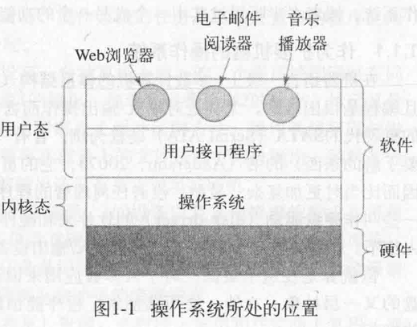

操作系统所在的位置如图1-1所示。它运行在裸机之上,为所有其他软件提供基础的运行环境。操作系统和普通软件（用户态）之间的主要区别是,如果用户不喜欢某个特定的电子邮件阅读器,他可以自由选择另ー个,或者自己写ー个,但是不能自行写ー个属于操作系统一部分的时钟中断处理程序。这个程序由硬件保护,防止用户试图对其进行修改。

然而,有时在嵌入式系统（该系统没有内核态）或解释系统（如基于Java的操作系统,它采用解释方式而非硬件方式区分组件）中,上述区别是模糊的。

另外,在许多系统中,ー些在用户态下运行的程序协助操作系统完成特权功能。例如,经常有一个程序供用户修改其口令之用。但是这个程序不是操作系统的一部分,也不在内核态下运行,不过它明显地帯有敏感的功能,并且必须以某种方式给予保护。在某些系统中,这种想法被推向了极致,ー些传统上被认为是操作系统的部分（诸如文件系统）在用户空间中运行。在这类系统中,很难划分出一条明显的界限。在内核态中运行的当然是操作系统的一部分,但是ー些在内核外运行的程序也有争议地被认为是操作系统的一部分,或者至少与操作系统密切相关。

操作系统与用户（即应用）程序的差异并不仅仅在于它们所处的地位。特别地,操作系统更加大型、复杂和长寿。Linux或Windows操作系统的源代码有500万行甚至更高的数量级。要理解这个数量的含义,请考虑具有500万行的ー套书,每页50行,每卷1000页（比本书厚）。为了以书的大小列出ー个操作系统,需要有100卷书—基本上需要一整个书架来摆放。请设想一下有个维护操作系统的工作,第一天老板带你到装有代码的书架旁,说:“去读吧ズ而这仅仅是运行在内核中的部分代码。当包括重要的共享库时,Windows将有超过7000万行代码,或者说要用10~20个书架,而且这还不包括一些基础的应用（如WindowsExplorer、WindowsMediaPlayer等）。

至于为什么操作系统的寿命较长,读者现在应该清楚了—操作系统是很难编写的。一旦编写完成,操作系统的所有者当然不愿意把它扔掉,再写ー个。相反,操作系统会在长时间内进行演化。基本上可以把Windows95/98/Me看成是一个操作系统,而WindowsNT/2000/XP/Vista/Windows7则是另外一个操作系统。对于用户而言,它们看上去很像,因为微软公司努力使Windows2000/XP八大ta/WEdows7与被替代系统（如Windows98）的用户界面看起来十分相似。无论如何,微软公司要舍弃Windows98是有非常正当的原因的,我们将在第"章涉及Windows细节时具体讨论这ー内容。

除了Windows以外,贯穿本书的其他主要例子还有UNIX,以及它的变体和克隆版。UNIX当然也演化了多年,如SystemV版、Solaris以及FreeBSD等都是来源于UNIX的原始版∣不过尽管Linux非常像依照UNIX模式仿制而成,并且与UNIX高度兼容,但是Linux具有全新的代码基础。本书将采用来自UNIX中的示例,并在第10章中具体讨论Linux。

本章将简要叙述操作系统的若干重要部分,内容包括其含义、历史、分类、ー些基本概念及其结构。在后面的章节中,我们将具体讨论这些重要内容。

## 1.1 什么是操作系统

很难给出操作系统的准确定义。操作系统是ー种运行在内核态的软件—尽管这个说法并不总是符合事实。部分原因是操作系统有两个基本上独立的任务,即为应用程序员（实际上是应用程序）提供ー个资源集的清晰抽象,并管理这些硬件资源,而不仅仅是ー堆硬件。另外,还取决于从什么角度看待操作系统。读者多半听说过其中一个或另ー个的功能。下面我们逐项进行讨论。

### 1.1.1 作为扩展机器的操作系统

在机器语言ー级上,多数计算机的体系结构（指令集、存储组织、I/o和总线结构）是很原始的,而且编程是很困难的,尤其是对输入/输出操作而言。为了更细致地考察这一点,我们以大多数电脑使用的更现代的SATA（SerialATA）硬盘为例。曾有一本描述早期版本硬盘接口（程序员为了使用硬盘而需要了解的东西）的书（Anderson,2007）,它的页数超过450页。自2007年起,接口又被修改过很多次,因而比当时更加复杂。显然,没有任何理智的程序员想要在硬件层面上和硬盘打交道。相反,他们使用ー些叫作硬盘驱动（diskdriver）的软件来和硬件交互。这类软件提供了读写硬盘块的接口,而不用深入细节。操作系统包含很多用于控制输入/输出设备的驱动。

但就算是在这个层面,对于大多数应用来说还是太底层了。因此,所有的操作系统都提供使用硬盘的又一层抽象:文件。使用该抽象,程序能创建、读写文件,而不用处理硬件实际工作中那些恼人的细节。

抽象是管理复杂性的ー个关键。好的抽象可以把一个几乎不可能管理的任务划分为两个可管理的部分。其第一部分是有关抽象的定义和实现,第二部分是随时用这些抽象解决问题。几乎每个计算机用户都理解的一个抽象是文件,正如上文所提到的。文件是ー种有效的信息片段,诸如数码照片、保存的电子邮件、歌曲或Web页面等。处理数码照片、电子邮件、歌曲以及Web页面等,要比处理SATA（或者其他）硬盘的细节容易,这些磁盘的具体细节与前面叙述过的软盘ー样。操作系统的任务是创建好的抽象,并实现和管理它所创建的抽象对象。本书中,我们将研究许多关于抽象的内容,因为这是理解操作系统的关键。

上述观点是非常重要的,所以值得用不同的表达方式来再次叙述。即使怀着如此小心翼翼对设计Macintosh机器的工业设计师的尊重,还是不得不说,硬件是丑陋的。真实的处理器、内存条、磁盘和其他装置都是非常复杂的,对于那些为使用某个硬件而不得不编写软件的人们而言,他们使用的是困难、可怕、特殊和不一致的接口。有时这是由于需要兼容旧的硬件,有时是为了节省成本,但是,有时硬件设计师们并没有意识到（或在意）他们给软件设计带来了多大的麻烦。操作系统的ー个主要任务是隐藏硬件,呈现给程序（以及程序员）良好、清晰、优雅、一致的抽象。如图1-2所示,操作系统将丑陋转变为美丽。


需要指出的是,操作系统的实际客户是应用程序（当然是通过应用程序员）。它们直接与操作系统及其抽象打交道。相反,最终用户与用户接口所提供的抽象打交道,或者是命令行shell或者是图形接口。而用户接口的抽象可以与操作系统提供的抽象类似,但也不总是这样©为了更清晰地说明这ー点,请读者考虑普通的Windows桌面以及面向行的命令提示符。两者都是运行在Windows操作系统上的程序,并使用了Windows提供的抽象,但是它们提供了非常不同的用户接口。类似地,运行Gnome或者KDE的Linux用户与直接在XWindow系统（面向文本）顶部工作的Linux用户看到的是非常不同的界面,但是在这两种情形中,操作系统下面的抽象是相同的。

在本书中,我们将具体讨论提供给应用程序的抽象,不过很少涉及用户界面。尽管用户界面是ー个巨大和重要的课题,但是它们毕竟只和操作系统的外围相关。

### 1.1.2 作为资源管理者的操作系统

把操作系统看作向应询程序提供基本抽象的概念,是ー种自顶向下的观点。按照另ー种自底向上的观点,操作系统则用来管理一个复杂系统的各个部分。现代计算机包含处理器、存储器、时钟、磁戏、鼠标、网络接口、打印机以及许多其他设备。从这个角度看,操作系统的任务是在相互竞争的程序之间有序地控制对处理器、存储器以及其他i/o接口设备的分配。

现代操作系统允许同时在内存中运行多道程序。假设在一台计算机上运行的三个程序试图同时在同一台打印机上输出计算结果,那么开始的几行可能是程序1的输出,接着几行是程序2的输出,然后又是程序3的输出等,最终结果将是ー团糟。采用将打印结果送到磁盘上缓冲区的方法,操作系统可以把潜在的混乱有序化。在ー个程序结束后,操作系统可以将暂存在磁盘上的文件送到打印机输出,同时其他程序可以继续产生更多的输出结果,很明显,这些程序的输出还没有真正送至打印机。

当ー个计算机（或网络）有多个用户时,管理和保护存储器、シ。设备以及其他资源的需求变得强烈起来,因为用户间可能会互相干扰。另外,用户通常不仅共享硬件,还要共享信息（文件、数据库等）。简而言之,操作系统的这种观点认为,操作系统的主要任务是记录哪个程序在使用什么资源,对资源请求进行分配,评估使用代价,并且为不同的程序和用户调解互相冲突的资源请求。

资源管理包括用以下两种不同方式实现多路复用（共享）资源:在时间上复用和在空间上复用。当ー种资源在时间上复用时,不同的程序或用户轮流使用它。先是第一个获得资源的使用,然后下ー个,以此类推。例如,若在系统中只有一个CPU,而多个程序需要在该CPU上运行,操作系统则首先把该CPU分配给某个程序,在它运行了足够长的时间之后,另ー个程序得到CPU,然后是下ー个,如此进行下去,最终,轮到第一个程序再次运行。至于资源是如何实现时间复用的—谁应该是下一个以及运行多长时间等—则是操作系统的任务。还有一个有关时间复用的例子是打印机的共享。当多个打印作业在一台打印机上排队等待打印时,必须决定将轮到打印的是哪个作业。

另ー类复用是空间复用。每个客户都得到资源的一部分,从而取代了客户排队。例如,通常在若干运行程序之间分割内存,这样每ー个运行程序都可同时入驻内存（例如,为了轮流使用CPU）。假设有足够的内存可以存放多个程序,那么在内存中同时存放若干个程序的效率,比把所有内存都分给ー个程序的效率要高得多,特别是,如果一个程序只需要整个内存的ー小部分」结果更是这样。当然,如此的做法会引起公平、保护等问题,这有赖于操作系统解决它们。有关空间复用的其他资源还有磁盘。在许多系统中,一个磁盘同时为许多用户保存文件。分配磁盘空间并记录谁正在使用哪个磁盘块,是操作系统的典型任务。

## 1.2 操作系统的历史

操作系统已经存在许多年了。在下面的小节中,我们将简要地考察操作系统历史上的ー些重要之处。操作系统与其所运行的计算机体系结构的联系非常密切。我们将分析连续几代的计算机,看看它们的操作系统是什么样的。把操作系统的分代映射到计算机的分代上有些粗糙,但是这样做确实有某些作用,否则没有其他好办法能够说清楚操作系统的历史。

下面给出的有关操作系统的发展主要是按照时间线索叙述的,且在时间上是有重叠的。每个发展并不是等到先前ー种发展完成后オ开始。存在着大量的重叠,更不用说还存在有不少虚假的开始和终结时间。请读者把这里的文字叙述看成是ー种指引,而不是盖棺定论。

第一台真正的数字计算机是英国数学家CharlesBabbage（1792—1871）设计的。尽管Babbage花费了他几乎一生的时间和财产,试图建造他的“分析机”,但是他始终未能让机器正常运转,因为它是ー台纯机械的数字计算机,他所在时代的技术不能生产出他所需要的高精度轮子、齿轮和轮牙。毫无疑问,这台分析机没有操作系统。

有一段有趣的历史花絮,Babbage认识到他的分析机需要软件,所以他雇佣了一个名为AdaLovelace的年轻妇女,这是世界上第一个程序员,而她是著名的英国诗人LordByron的女儿。程序设计语言Ada是以她命名的。

### 1.2.1 第一代（1945~1955）:真空管和穿孔卡片

从Babbage失败之后一直到第二次世界大战,数字计算机的建造几乎没有什么进展,第二次世界大战刺激了有关计算机研究工作的爆炸性开展。艾奥瓦州立大学的JohnAtanasoff教授和他的学生CliffordBerry建造了被认为是第一台可工作的数字计算机。该机器使用了300个真空管。大约在同时,KonradZuse在柏林用继电器构建了Z3计算机。1944年,一群科学家（包括AlanTuring）在英格兰布莱切利庄园构建了Colossus并为其编程,HowardAiken在哈佛大学建造了MarkI,宾タ法尼亚大学的WilliamMauchley和他的学生J.PresperEckert建造了ENIAC。这些机器有的是二进制的,有的使用真空管,有的是可编程的,但是都非常原始,甚至需要花费数秒时间才能完成最简单的运算。

在那个年代里,同一个小组的人（通常是工程师们）设计、建造、编程、操作并维护一台机器。所有的程序设计是用纯粹的机器语言编写的,甚至更糟糕,需要通过将上千根电缆接到插件板上连接成电路,以便控制机器的基本功能。没有程序设计语言（甚至汇编语言也没有）,操作系统则从来没有听说过。使用机器的一般方式是,程序员在墙上的机时表上预约一段时间,然后到机房中将他的插件板接到计算机里,在接下来的几小时里,期盼正在运行中的两万多个真空管不会烧坏。那时,所有的计算问题实际上都只是简单的数学运算,如制作正弦、余弦、对数表或者计算炮弹弹道等。

到了20世纪50年代初有了改进,出现了穿孔卡片,这时就可以将程序写在卡片上,然后读入计算机而不用插件板,但其他过程则依然如旧。

### 1.2.2 第二代（1955—1965）:晶体管和批处理系统

20世纪50年代晶体管的发明极大地改变了整个状况。计算机已经很可靠,厂商可以成批地生产并销售计算机给用户,用户可以指望计算机长时间运行,完成一些有用的工作。此时,设计人员、生产人员、操作人员、程序人员和维护人员之间第一次有了明确的分エ。

这些机器,现在被称作大型机（mainframe）,锁在有专用空调的大房间中,由专业操作人员运行。只有少数大公司、重要的政府部门或大学オ接受数百万美元的标价。要运行一个作业（job,即ー个或ー组程序）,程序员首先将程序写在纸上（用FORTRAN语言或汇编语言）,然后穿孔成卡片,再将卡片盒带到输入室,交给操作员,接着就喝咖啡直到输出完成。

计算机运行完当前的任务后,其计算结果从打印机上输出,操作员到打印机上撕下运算结果并送到输出室,程序员稍后就可取到结果。然后,操作员从已送到输入室的卡片盒中读入另ー个任务。如果需要FORTRAN编译器,操作员还要从文件柜把它取来读入计算机。当操作员在机房里走来走去时许多机时被浪费掉了。

由于当时的计算机非常昂贵,人们很自然地要想办法减少机时的浪费。通常采用的解决方法就是批处理系统（batchsystem）o其思想是:在输入室收集全部的作业,然后用一台相对便宜的计算机如IBM1401计算机将它们读到磁带上。IBM1401计算机适用于读卡片、复制磁带和输出打印,但不适用于数值运算。另外用较昂贵的计算机如IBM7094来完成真正的计算。这些情况如图1-3所示。

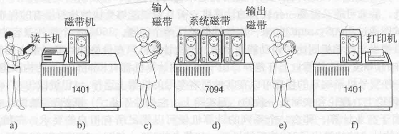

> 图1-3一种早期的批处理系统:a）程序员将卡片拿到1401机处・b）1401机将批处理作业读到磁带上,c）操作员将输入带送至7094机Id）7094机进行计算,e）操作员将输出磁带送到1401机∣f）1401机打印输出

在收集了大约ー个小时的批量作业之后,这些卡片被读进磁帯，然后磁带被送到机房里并装到磁带机上。随后,操作员装入ー个特殊的程序（现代操作系统的前身）,它从磁带上读入第一个作业并运行,其输出写到第二盘磁帯上,而不打印。毎个作业结束后,操作系统自动地从磁带上读入下ー个作业并运行。当ー批作业完全结束后,操作员取下输入和输出磁带,将输入磁带换成下ー批作业,并把输出磁带拿到ー台1401机器上进行脱机（不与主计算机联机）打印。

典型的输入作业结构如图1-4所示。ー开始是$JOB卡片,它标识出所需的最大运行时间（以分钟为单位）、计费账号以及程序员的名字。接着是$FORTRAN卡片,通知操作系统从系统磁带上装入FORTRAN语言编译器。之后就是待编译的源程序,然后是$LOAD卡片,通知操作系统装入编译好的目标程序。接着是$RUN卡片,告诉操作系统运行该程序并使用随后的数据。最后,$END卡片标识作业结束。这些基本的控制卡片是现代shell和命令解释器的先驱。

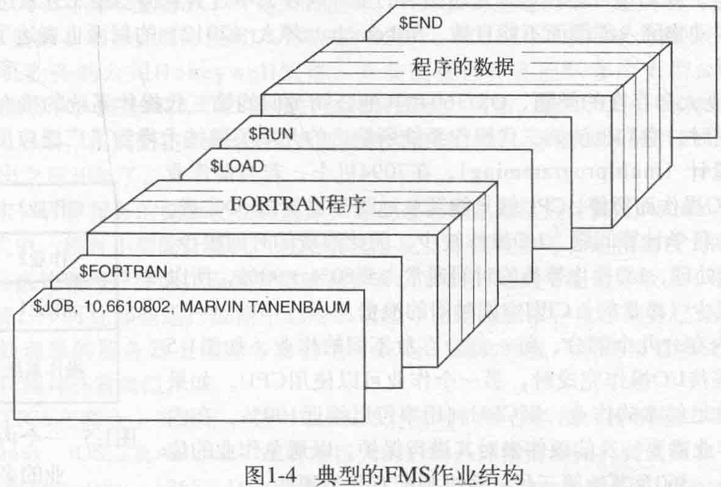

第二代大型计算机主要用于科学与工程计算,例如,解偏微分方程。这些题目大多用FORTRAN语言和汇编语言编写。典型的操作系统是FMS（FORTRANMonitorSystem,FORTRAN监控系统）和IBSYS（IBM为7094机配备的操作系统）。

### 1.2.3 第三代（1965〜1980）:集成电路和多道程序设计

20世纪60年代初,大多数计算机厂商都有两条不同并且完全不兼容的生产线。一条是面向字的大型科学用计算机,诸如IBM7094,主要用于エ业强度的科学和工程计算。另一条是面向字符的商用计算机,诸如IBM1401,银行和保险公司主要用它从事磁带归档和打印服务。

开发和维护两种完全不同的产品,对厂商来说是昂贵的。另外,许多新的计算机用户ー开始时只需要一台小计算机,后来可能又需要一台较大的计算机,而且希望能够更快地执行原有的程序。

IBM公司试图通过引入System/360来一次性地解决这两个问题。360是一个软件兼容的计算机系列,其低档机与1401相当,高档机则比7094功能强很多。这些计算机只在价格和性能（最大存储器容量、处理器速度、允许的シ。设备数量等）上有差异。由于所有的计算机都有相同的体系结构和指令集,因此,在理论上,为ー种型号机器编写的程序可以在其他所有型号的机器上运行。（但就像传言YogiBerra曾说过的那样:“在理论上，理论和实际是一致的,而实际上,它们并不是。”）既然360被设计成既可用于科学计算,又可用于商业计算,那么一个系列的计算机便可以满足所有用户的要求。在随后的几年里,IBM使用更现代的技术陆续推出了360的后续机型,如著名的370、4300,3080和3090系列。zSeries是这个系列的最新机型,不过它与早期的机型相比变化非常之大。

360是第一个采用（小规模）集成电路（1C）的主流机型,与采用分立晶体管制造的第二代计算机相比,其性能/价格比有很大提高。360很快就获得了成功,其他主要厂商也很快采纳了系列兼容机的思想。这些计算机的后代仍在大型的计算中心里使用。现在,这些计算机的后代经常用来管理大型数据库（如航班订票系统）或作为Web站点的服务器,这些服务器每秒必须处理数千次的请求。

“单ー家族”思想的最大优点同时也是其最大的缺点。原因在于所有的软件（包括操作系统OS/360）原本都打算能够在所有机器上运行。从小的代替1401把卡片复制到磁带上的机器,到用于代替7094进行气象预报及其他繁重计算的大型机;从只能带很少外部设备的机器到有很多外设的机器,从商业领域到科学计算领域等。总之,它要有效地适用于所有这些不同的用途。

IBM无法写出同时满足这些相互冲突需要的软件（其他公司也不行）。其结果是ー个庞大的又极其复杂的操作系统,它比FMS大了约2〜3个数量级规模。其中包含数千名程序员写的数百万行汇编语言代码,也包含成千上万处错误,这就导致IBM不断地发行新的版本试图更正这些错误。每个新版本在修正老错误的同时又引入了新错误,所以随着时间的流逝,错误的数量可能大致保持不变。

OS/360的设计者之一FredBrooks后来写过一本既诙谐又尖锐的书（Brooks,1995）,描述他在开发OS/360过程中的经验。我们不可能在这里复述该书的全部内容,不过其封面已经充分表达了FredBrooks的观点------群史前动物陷入泥潭而不能自拔。Silberschatz等人（2012）的封面也表达了操作系统如同恐龙一般的类似观点。

抛开OS/360的庞大和存在的问题,OS/360和其他公司类似的第三代操作系统的确合理地满足了大多数用户的要求。同时,它们也使第二代操作系统所缺乏的几项关键技术得到了广泛应用。其中最重要的应该是多道程序设计（multiprogramming）。在7094机上,若当前作业因等待磁带或其他I/O操作而暂停,CPU就只能简单地踏步直至该I/O完成。对于CPU操作密集的科学计算问题,I/O操作较少,因此浪费的时间很少。然而,对于商业数据处理,I/O操作等待的时间通常占到80%〜90%,所以必须采取某种措施减少（昂贵的）CPU空闲时间的浪费。

解决方案是将内存分几个部分,每一部分存放不同的作业,如图1・5所示。当ー个作业等待I/O操作完成时,另ー个作业可以使用CPU。如果内存中可以同时存放足够多的作业,则CPU利用率可以接近100%。在内存中同时驻留多个作业需要特殊的硬件来对其进行保护,以避免作业的信息被窃取或受到攻击。360及其他第三代计算机都配有此类硬件。

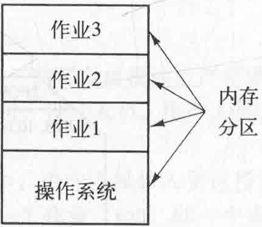

> 图1-5 ー个内存中有三个作 业的多道程序系统

第三代计算机的另ー个特性是,卡片被拿到机房后能够很快地将作业从卡片读入磁盘。于是,任何时刻当一个作业运行结束时,操作系统就能将一个新作业从磁盘读出,装进空出来的内存区域运行。这种技术叫作同时的外部设备联机操作（SimultaneousPeripheralOperationOnLine,SPOOLing）,该技术同时也用于输出。当采用了SPOOLiiig技术后,就不再需要IBM1401机,也不必再将磁带搬来搬去了。

第三代操作系统很适用于大型科学计算和繁忙的商务数据处理,但其实质上仍旧是批处理系统。许多程序员很怀念第一代计算机的使用方式,那时他们可以几个小时地独占一台机器,可以即时地调试他们的程序。而对第三代计算机而言,从ー个作业提交到运算结果取回往往长达数小时,更有甚者,一个逗号的误用就会导致编译失败,而可能浪费了程序员半天的时间,程序员并不喜欢这样。

程序员的希望很快得到了响应,这种需求导致了分时系统（timesharing）的出现。它实际上是多道程序的ー个变体,每个用户都有一个联机终端。在分时系统中,假设有20个用户登录,其中17个在思考、谈论或喝咖啡,则CPU可分配给其他三个需要的作业轮流执行。由于调试程序的用户常常只发出简短的命令（如编译ー个五页的源文件）,而很少有长的费时命令（如上百万条记录的文件排序）,所以计算机能够为许多用户提供快速的交互式服务,同时在CPU空闲时还可能在后台运行一个大作业。第一个通用的分时系统—兼容分时系统（CompatibleTimeSharingSystem,CTSS）,是MIT（麻省理工学院）在一台改装过的7094机上开发成功的（Corbat6等人,1962）。但直到第三代计算机广泛采用了必需的保护硬件之后,分时系统オ逐渐流行开来。

在CTSS成功研制之后，MIT,贝尔实验室和通用电气公司（GE,当时ー个主要的计算机制造厂商）决定开发ー种“公用计算服务系统”,即能够同时支持数百名分时用户的ー种机器。它的模型借鉴了供电系统—当需要电能时,只需将电气设备接到墻上的插座即可,于是,在合理范围内,所需要的电能随时可提供。该系统称作MULTICS（MULTiplexedInformationandComputingService）,其设计者着眼于建造满足波士顿地区所有用户计算需求的一台机器。在当时看来,仅仅40年之后,就能成百万台地销售（价值不到1000美元）速度是GE-645主机10000倍的计算机,完全是科学幻想。这种想法同现在关于穿越大西洋的超音速海底列车的想法一样,是幻想。

MULTICS是ー种混合式的成功。尽管这台机器具有较强的I/O能力,却要在一台仅仅比Intel386PC性能强一点的机器上支持数百个用户。可是这个想法并不像表面上那么荒唐,因为那时的人们已经知道如何编写精练的高效程序,虽然这种技巧随后逐渐丢失了。有许多原因造成MULTICS没有能够普及到全世界,至少它不应该采用PL”编程语言编写,因为PLハ编译器推迟了好几年オ完成,好不容易完成的编译器又极少能够成功运行。另外,当时的MULTICS有太大的野心,犹如19世纪中期CharlesBabbage的分析机。

简要地说,MULTICS在计算机文献中播撒了许多原创的概念,但要将其造成一台真正的机器并想实现商业上的巨大成功的难度超出了所有人的预料。贝尔实验室退出了,通用电气公司也退出了计算机领域。但是MIT坚持下来并且最终使MULTICS成功运行。MULTICS最后成为商业产品,由购买了通用电气公司计算机业务的公司Honeywell销售,并安装在世界各地80多个大型公司和大学中。尽管MULTICS的数量很小,但是MULTICS的用户却非常忠诚,例如,通用汽车、福特和美国国家安全局直到20世纪90年代后期,在试图让Honeywell更新其硬件多年之后,オ关闭了MULTICS系统,而这已经是在MULTICS推出之后30年了。

到20世纪末,计算服务的概念已经被遗弃,但是这个概念却以云计算（cloudcomputing）的形式回归。在这种形式中,相对小型的计算机（包括智能手机、平板电脑等）连接到巨大的远程数据中心的服务器,本地计算机处理用户界面,而服务器进行计算。回归的动机可能是多数人不愿意管理日益过分复杂的计算机系统,宁可让那些运行数据中心的公司的专业团队去做。电子商务已经向这个方向演化了,各种公司在多处理器的服务器上经营各自的电子商场,简单的客户端连接着多处理器服务器,这同MULTICS的设计精神非常类似。

尽管MULTICS在商业上失败了,但MULTICS对随后的操作系统（特别是UNIX和它的衍生系统,如FreeBSD、Linux、iOS以及Android）却有着巨大的影响,详情请参阅有关文献和书籍（Corbat6等人,19721Corbato⅛Vyssotsky,1965,Daley和Dennis,1968；Organick,1972；Saltzer,1974）.还有一个活跃的Web站点www.multicians.org,上面有大量关于系统、设计人员及其用户的信息资料。

另ー个第三代计算机的主要进展是小型机的崛起,以1961年DEC的PDP-1作为起点。PDP-1计算机只有4K个18位的内存,每台售价120000美元（不到IBM7094的5%）,该机型非常热销。对于某些非数值的计算,它和7094几乎ー样快。PDP-1开辟了一个全新的产业。很快有了一系列PDP机型（与IBM系列机不同,它们互不兼容）,其顶峰为PDP-11。

曾参与MULTICS研制的贝尔实验室计算机科学家KenThompson,后来找到ー台无人使用的PDP-7机器,并开始开发ー个简化的单用户版MULTICS。他的工作后来导致了UNIX操作系统的诞生。接着,UNIX在学术界、政府部门以及许多公司中流行。

UNIX的历史已经在别处讲述了（例如Salus,1994）。这段故事的部分放在第10章中介绍。现在,有充分的理由认为,由于到处可以得到源代码,多个机构发展了自己的（不兼容）版本,从而导致了混乱。UNIX有两个主要的版本，即AT&T的SystemV和加州大学伯克利分校的BSD（BerkeleySoftwareDistribution）o当然还有一些小的变种。为了使编写的程序能够在任何版本的UNIX上运行,IEEE提出了ー个UNIX的标准，称作POSIX,目前大多数UNIX版本都支持它。POSIX定义了一个凡是UNIX必须支持的小型系统调用接口。事实上,某些其他操作系统也支持POSIX接口。

顺便值得一提的是,在1987年,本书作者发布「ー个UNIX的小型克隆,称为MINIX,用于教学目的。在功能上,MINIX非常类似于UNIX,包括对POSIX的支持。从那时以后,MINIX的原始版本已经演化为MINIX3,该系统是高度模块化的,并专注于高可靠性。它具有快速检测和替代有故障甚至已崩溃模块（如i/o设备驱动器）的能力,不用重启也不会干扰运行着的程序。它致カ于提高可靠性和可用性。有一本叙述其内部操作并在附录中列出源代码的书（Tanenbaum和Woodhull,2006）1该书现在仍然有售。在www.minix3.org上,MINIX3是免费使用的（包括所有源代码）。

对UNIX版本免费产品（不同于教育目的）的愿望，促使芬兰学生LinusTorvalds编写了Lin”。这个系统直接受到在MINIX上开发的启示,而且最初支持各种MINIX的功能（例如MINIX文件系统）。尽管它已经被很多人通过多种方式扩展，但是该系统仍然保留了某些与MINIX和UNIX共同的基本结构。对Linux和开放源码运动的具体历史感兴趣的读者可以阅读GlynMoody（2001）o本书所叙述的有关UNIX的多数内容,也适用于SystemV、MINIX,Linux以及UNIX的其他版本和克隆。

### 1.2.4 第四代（1980年至今）:个人计算机

随着LSI（大规模集成）电路的发展,在每平方厘米的硅片芯片上可以集成数千个晶体管，个人计算机时代到来了。从体系结构上看,个人计算机（最早称为微型计算机）与PDP-11并无二致,但就价格而言却相去甚远。以往,公司的一个部门或大学里的一个院系オ配备一台小型机,而微处理器却使每个人都能拥有自己的计算机。

1974年,当Intel8080—第亠代通用8位CPU出现时,Intel希望有一个用干8080的操作系统,部分是为了测试目的。Intel请求其顾问GaryKildall编写。Kildall和一位朋友首先为新推出的ShugartAssociates8英寸软盘构造了一个控制器,并把这个软磁盘同8080相连,从而制造了第一个配有磁盘的微型计算机。然后Kildall为它写了一个基于磁盘的操作系统,称为CP/M（ControlProgramforMicrocomputer）β由于Intel不认为基于磁盘的微型计算机有什么前景,所以当Kildall要求CP/M的版权时,Intel同意了他的要求。Kildall于是组建了一家公司DigitalResearch,进ー步开发和销售CP/M。

1977年,DigitalResearch重写了CP/M,使其可以在使用808〇、ZilogZ80以及其他CPU芯片的多种微型计算机上运行,从而完全控制了微型计算机世界达5年之久。

在20世纪80年代早期,IBM设计了IBMPC并寻找可在上面运行的软件。来自IBM的人员同BillGates联系有关他的BASIC解释器的许可证事宜,他们也询问他是否知道可在PC上运行的操作系统。Gates建议IBM同DigitalResearch联系,即当时世界上主宰操作系统的公司。在做出毫无疑问是近代历史上最糟的商业决策后,Kildall拒绝与IBM会见,代替他的是一位次要人员。更糟糕的是,他的律师甚至拒绝签署IBM的有关尚未公开的PC的保密协议。结果，IBM回头询问Gates可否提供给他们ー个操作系统。

在IBM返回来时,Gates了解到ー家本地计算机制造商SeattleComputerProducts有合适的操作系统DOS（DiskOperatingSystem）o他联系对方并提出购买（宣称フ5000美元）,对方接受了。然后Gates提供给IBM成套的DOS/BASIC,IBM也接受了。IBM希望做某些修改,于是Gates雇佣了写DOS的作者TimPaterson进行修改。修改版称为MS-DOS（MicrosoftDiskOperatingSystem）,并且很快主导了IBMPC市场。同Kildall试图将CP/M每次卖给用户ー个产品相比（至少开始是这样）,这里一个关键因素是Gates极其聪明的决策—将MS-DOS与计算机公司的硬件捆绑在ー起出售。在所有这一切烟消云散之后,Kilda∏突然不幸去世,其原因从来没有公布过。

1983年,IBMPC后续机型IBMPC/AT推出,配有k∏el80286CPU。此时,MS-DOS已经确立了地位,而CP/M只剩下最后的支撑。MS-DOS后来在80386和80486中得到广泛的应用。尽管MS-DOS的早期版本是相当原始的,但是后期的版本提供了更多的先进功能,包括许多源自UNIX的功能。（微软对UNIX是如此娴熟,甚至在公司的早期销售过ー个微型计算机版本,称为XENIX。）

用于早期微型计算机的CP/M、MS-DOS和其他操作系统,都是通过键盘输入命令的。由于DougEngelbart于20世纪60年代在斯坦福研究院（StanfordResearchInstitute）工作,这种情况最终有了改变。DougEngelbart发明了图形用户界面,包括窗ロ、图标、菜单以及鼠标。这些思想被XeroxPARC的研究人员采用,并用在了他们所研制的机器中。

一天,SteveJobs（他和其他人ー起在车库里发明了苹果计算机）访问PARC,ー看到GUI,立即意识到它的潜在价值,而Xerox管理层恰好没有认识到。这种战略失误的庞大比例,导致名为《摸索未来》ー书的出版（Smith和Alexander,1988）。Jobs随后着手设计了带有GUI的苹果计算机。这个项目导致了Lisa的推出,但是Lisa过于昂贵,所以在商业上失败了°Jobs的第二次尝试,即苹果Macintosh,取得了巨大的成功,这不仅是因为它比Lisa便宜得多,而且它还是用户友好的（userfriendly）,也就是说,它是为那些不仅没有计算机知识而且根本不打算学习计算机的用户准备的。在图形设计、专业数码摄影以及专业数字视频制作的创意世界里,Macintosh得到广泛的应用,这些用户对苹果公司及Macintosh有着极大的热情。1999年,苹果公司采用了一种内核,它来自本是为替换BSDUNIX内核而开发的卡内基・梅隆大学的Mach微核。因此,尽管有着截然不同的界面,但MACOSX是基于UNIX的操作系统。

在微软决定构建MS-DOS的后继产品时,受到了Macintosh成功的巨大影响。微软开发了名为Windows的基于GUI的系统,早期它运行在MS-DOS上层（它更像shell而不像真正的操作系统）。在从1985年至1995年的十年间,Windows只是运行在MS-DOS上层的ー个图形环境。然而,至U了1995年,一个独立的Windows版本具有许多操作系统功能的Windows95发布了。Windows95仅仅把底层的MS-DOS作为启动和运行老的MS-DOS程序之用。1998年,ー个稍做修改的系统Windows98发布。不过Windows95和Windows98仍然使用了大量16位Intel汇编语言。

另ー个微软操作系统是Wind嬴sNT（NT表示新技术）,它在一定的范围内同Windows95兼容,但是内部是完全新编写的。它是ー个32位系统。WindowsNT的首席设计师是DavidCutler,他也是VAXVMS操作系统的设计师之ー,所以有些VMS的概念用在了NT上。事实上,NT中有太多来自VMS的思想,所以VMS的所有者DEC公司控告了微软公司。法院对该案件判决的结果引出了一大笔需要用多位数字表达的金钱。微软公司期待NT的第一个版本可以消灭MS-DOS和其他的Windows版本,因为NT是ー个巨大的超级系统,但是这个想法失败了。只有WindowsNT4.0踏上了成功之路,特别在企业网络方面取得了成功。1999年年初,WindowsNT5.0改名为Windows2000。微软期望它成为Windows98和WindowsNT4.0的接替者。

不过这两个版本都不太成功,于是微软公司发布了Windows98的另ー个版本,名为WindowsMe（千年版）。2001年,发布了Windows2000的ー个稍加升级的版本,称为WindowsXP。这个版本的寿命比较长（6年）,基本上替代了Windows所有原先版本。

版本的更替还在继续。在Windows2000之后,微软将Windows家族分解成客户端和服务器端两条路线。客户端基于XP及其后代,而服务器端则包括WindowsServer2003和Windows2008。为嵌入式系统打造的第三条路线也随后出现。这些Windows版本都以服务包（servicepack）的形式派生出各自的变种。这足以让ー些管理员（以及操作系统书籍作者）发疯。

200フ年1月,微软公司发布了WindowsXP的后继版,名为Vista。它有一个新的图形接口、改进的安全性以及许多新的或升级的用户程序。微软公司希望Vista能够完全替代XP,但事与愿违。相反,由于对系统要求高、授权条件严格以及对数字版权管理（DigitalRightsManagement,ー种使用户更难复制被保护资料的技术）的支持,Vista受到了大量批评,负面报道不断。

随着全新的且并不那么消耗资源的操作系统Windows7的到来,很多人决定跳过Vista。Windows7并没有引进很多特性,但它相对较小且十分稳定。不到三周时间,Windows7就抢占了比Vista七周获得的还多的市场份额。2012年,微软发布了它的后继者,即针对触摸屏、拥有全新外观和体验的Windows8。微软希望这个全新设计会成为台式机、便携式电脑、笔记本电脑、平板电脑、手机、家庭影院电脑等各种设备上的主流操作系统。然而,到目前为止,其市场渗透相比Windowsフ而言要慢很多。

个人计算机世界中的另ー个主要竞争者是UNIX（及其各种变种）。UNIX在网络和企业服务器等领域很强大,在台式机、笔记本电脑、平板电脑以及智能手机上也很常见。在基于x86的计算机上,Linux成为学生和不断增加的企业用户替代Windows的流行选择。

顺便说明一下,在本书中我们使用x86这个术语代表所有使用指令集体系结构家族的现代处理器,这类处理器的源头可以追溯到20世纪70年代的8086芯片。很多像AMD和Intel这样的公司制造的处理器底层实现大相径庭:32位或64位、核或多或少、流水线或深或浅,等等。然而对程序员而言,它们看起来都是相似的,并且都能运行35年前写的8086代码。在需要强调不同处理器的差异时,我们会提到明确的模型,并且使用メ86∙32和x86-64分别表示32位和64位的变种。

FreeBSD是ー个源自Berkeley的BSD项目,也是ー个流行的UNIX变体。所有现代Macintosh计算机都运行着FreeBSD的某个修改版。在使用高性能RISC芯片的工作站上,UNIX系统也是ー种标准配置。它的衍生系统在移动设备上被广泛使用,例如那些运行iOS7和Android的设备。

尽管许多UNIX用户,特别是富有经验的程序员更偏好基于命令的界面而不是GUI,但是几乎所有的UNIX系统都支持由MIT开发的称为XWindow的视窗系统（如众所周知的XU）。这个系统具有基本的视窗管理功能,允许用户通过鼠标创建、删除、移动和变比视窗。对于那些希望有图形系统的UNIX用户,通常在XII之上还提供ー个完整的GUI,如Gnome或KDE,从而使得UNIX在外观和感觉上类似于Macintosh或MicrosoftWindows.

另ー个开始于20世纪80年代中期的有趣发展是,那些运行网络操作系统和分布式操作系统（Tanenbaum和VanSteen,2007）的个人计算机网络的增长。在网络操作系统中,用户知道多台计算机的存在,能够登录到ー台远程机器上并将文件从一台机器复制到另一台机器,每台计算机都运行自己本地的操作系统,并有自己的本地用户（或多个用户）。

网络操作系统与单处理器的操作系统没有本质区别。很明显,它们需要一个网络接口控制器以及ー些底层软件来驱动它,同时还需要一些程序来进行远程登录和远程文件访问,但这些附加成分并未改变操作系统的本质结构。

相反,分布式操作系统是以ー种传统单处理器操作系统的形式出现在用户面前的,尽管它实际上是由多处理器组成的。用户应该不知晓自己的程序在何处运行或者自己的文件存放于何处,这些应该由操作系统自动和有效地处理。

真正的分布式操作系统不仅仅是在单机操作系统上增添ー小段代码,因为分布式系统与集中式系统有本质的区别。例如,分布式系统通常允许一个应用在多台处理器上同时运行,因此,需要更复杂的处理器调度算法来获得最大的并行度优化。

网络中的通信延迟往往导致分布式算法必须能适应信息不完备、信息过时甚至信息不正确的环境。这与单机系统完全不同,对于后者,操作系统掌握着整个系统的完备信息。

### 1.2.5 第五代（1990年至今）:移动计算机

自从20世纪40年代连环漫画中的DickTracy警探对着他的“双向无线电通信腕表”说话开始,人们就在渴望ー款无论去哪里都可以随身携带的交流设备。第一台真正的移动电话出现在1946年并且重达80斤。你可以带它去任何地方,前提是你得有一辆拉着它的汽车。

第一台真正的手持电话出现在20世纪70年代,大约2斤重,绝对属于轻量级。它被人们爱称为“转头”。很快,每个人都想要一块这样的“砖头ス现在,移动电话已经渗入全球90%人口的生活中。我们不仅可以通过便携电话和腕表打电话,在不久的将来还可以通过眼镜和其他可穿戴设备打电话。而且,手机这种东西已不再那么引人注目,我们在车水马龙间从容地收发邮件、上网冲浪、给朋友发信息、玩游戏,一切都是那么习以为常。

虽然在电话设备上将通话和计算合二为ー的想法在20世纪70年代就已经出现了,但第一台真正的智能手机直到20世纪90年代中期オ出现.这部手机就是诺基亚发布的N9000,它真正做到了将通常处于独立工作状态的两种设备合二为ー:手机和个人数字助理(PersonalDigitalAssistant,PDA)o1997年,爱立信公司为它的GS88uPenelope"手机创造出未语智能手机(smartphone)。

随着智能手机变得十分普及,各种操作系统之间的竞争也变得更加激烈,并且形势比个人电脑领域更加模糊不清。在编写本书时,谷歌公司的Android是最主流的操作系统,而苹果公司的iOS也牢牢占据次席,但这并不会是常态,在接下来的几年可能会发生很大变化。在智能手机领域唯一可以确定的是,长期保持在巅峰并不容易。

毕竟,在智能手机出现后的第一个十年中,大多数手机自首款产品出厂以来都运行着SymbianOS。Symbian操作系统被许多主流品牌选中，包括三星、索尼爱立信和摩托罗拉,特别是诺基亚也选择了它。然而,其他操作系统已经开始侵吞Symbian的市场份额,例如RIM公司的BlackberryOS(2002年引入智能手机)和苹果公司的iOS(2007年随第一代iPhone发布)。很多公司都预期RIM能继续主导商业市场,而iOS会成为消费者设备中的王者。然而,Symbian的市场份额骤跌。2011年,诺基亚放弃Symbian并且宣布将WindowsPhone作为自己的主流平台。在一段时间内,苹果公司和RIM公司是市场的宠儿(虽然不像曾经的Symbian那样占有绝对地位),但谷歌公司2008年发布的基于Linux的操作系统Android,没有花费太长时间就追上了它的竞争对手。

对于手机厂商而言,Android有着开源的优势,获得许可授权后便可使用。于是,厂商可以修改它并轻松地适配自己的硬件设备。并且,Android拥有大量软件开发者,他们大多通晓Java编程语言。即使如此,最近几年也显示出Android的优势可能不会持久,并且其竞争对手极其渴望从它那里夺回ー些市场份额〇我们将在10.8节进ー步介绍Android。

## 1.3 计算机硬件简介

操作系统与运行该操作系统的计算机硬件联系密切。操作系统扩展了计算机指令集并管理计算机的资源。为了能够工作,操作系统必须了解大量的硬件,至少需要了解硬件如何面对程序员。出于这个原因,这里我们先简要地介绍现代个人计算机中的计算机硬件,然后开始讨论操作系统的具体工作细节。

从概念上讲,一台简单的个人计算机可以抽象为类似于图1-6中的模型。CPU、内存以及I/O设备都由一条系统总线连接起来并通过总线与其他设备通信。现代个人计算机结构更加复杂,包含多重总线,我们将在后面讨论。目前,这ー模式还是够用的。在下面各小节中,我们将简要地介绍这些部件,并且讨论ー些操作系统设计师所考虑的硬件问题。毫无疑问,这是ー个非常简要的概括介绍。现在有不少讨论计算机硬件和计算机组织的书籍。其中两本有名的书分别是Tanenbaum和Austin(2012)以及Patterson和Hennessy(2013)。

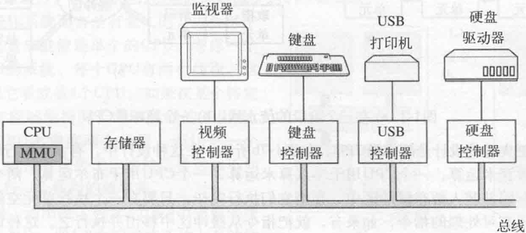

> 图1-6简单个人计算机中的一些部件

### 1.3.1 处理器

计算机的“大脑”是CPU,它从内存中取出指令并执行之。在每个CPU基本周期中,首先从内存中取出指令,解码以确定其类型和操作数,接着执行之,然后取指、解码并执行下一条指令。按照这一方式,程序被执行完成。

每个CPU都有一套可执行的专门指令集。所以,x86处理器不能执行ARM程序,而ARM处理器也不能执行x86程序。由干用来访问内存以得到指令或数据的时间要比执行指令花费的时间长得多,因此,所有的CPU内都有一些用来保存关键变量和临时数据的寄存器。这样,通常在指令集中提供ー些指令,用以将一个字从内存调入寄存器,以及将一个字从寄存器存入内存。其他的指令可以把来自寄存器、内存的操作数组合,或者用两者产生一个结果,如将两个字相加并把结果存在寄存器或内存中。

除了用来保存变量和临时结果的通用寄存器之外,多数计算机还有一些对程序员可见的专用寄存器。其中之一是程序计数器,它保存了将要取出的下一条指令的内存地址。在指令取出之后,程序计数器就被更新以便指向后继的指令。

另ー个寄存器是堆栈指针,它指向内存中当前栈的顶端。该栈包含了每个执行过程的栈帧。ー个过程的栈帧中保存了有关的输入参数、局部变量以及那些没有保存在寄存器中的临时变量。

当然还有程序状态字(ProgramStatusWord,PSW)寄存器。这个寄存器包含了条件码位(由比较指令设置)、CPU优先级、模式(用户态或内核态),以及各种其他控制位。用户程序通常读入整个PSW,但是,只对其中的少量字段写入。在系统调用和I/O中,PSW的作用很重要。

操作系统必须知晓所有的寄存器。在时间多路复用(timemultiplexing)CPU中,操作系统经常会中止正在运行的某个程序并启动(或再启动)另ー个程序。每次停止ー个运行着的程序时,操作系统必须保存所有的寄存器值,这样在稍后该程序被再次运行时,可以把这些寄存器重新装入。

为了改善性能,CPU设计师早就放弃了同时读取、解码和执行一条指令的简单模型。许多现代CPU具有同时取出多条指令的机制。例如,ー个CPU可以有单独的取指单元、解码单元和执行单元，于是当它执行指令〃时,还可以对指令れ+1解码,并且读取指令ス+2。这样的机制称为流水线(pipeline)»图l∙7a是一个有着三个阶段的流水线示意图。更长的流水线也是常见的。在多数的流水线设计中,一旦一条指令被取进流水线中,它就必须被执行完毕,即便前一条取出的指令是条件转移,它也必须被执行完毕。流水线使得编译器和操作系统的编写者很头疼,因为它造成了在机器中实现这些软件的复杂性问题,而机器必须处理这些问题。


> 图1-7 a)有三个阶段的流水线,b)ー个超标量CPU

比流水线更先进的设计是超标量CPU,如图l-7b所示。在这种设计中,有多个执行单元,例如,一个CPU用干整数算术运算,ー个CPU用于浮点算术运算,ー个CPU用于布尔运算。两个或更多的指令被同时取出、解码并装入暂存缓冲区中,直至它们执行完毕。只要有一个执行单元空闲,就检査保持缓冲区中是否还有可处理的指令,如果有,就把指令从缓冲区中移出并执行之。这种设计存在ー种隐含的作用,即程序的指令经常不按顺序执行。在多数情况下,硬件负责保证这种运算的结果与顺序执行指令时的结果相同,但是,仍然有部分令人烦恼的复杂情形被强加给操作系统处理,我们在后面会讨论这种情况。

除了用在嵌入式系统中的非常简单的CPU之外,多数CPU都有两种模式,即前面已经提及的内核态和用户态。通常,在PSW中有一个二进制位控制这两种模式。当在内核态运行时,CPU可以执行指令集中的每一条指令,并且使用硬件的每种功能。在台式机和服务器上,操作系统在内核态下运行,从而可以访问整个硬件。而在大多数嵌入式系统中,一部分操作系统运行在内核态,其余的部分则运行在用户态。

相反,用户程序在用户态下运行,仅允许执行整个指令集的ー个子集和访问所有功能的ー个子集。一般而言,在用户态中有关1/。和内存保护的所有指令是禁止的。当然,将PSW中的模式位设置成内核态也是禁止的。

为了从操作系统中获得服务,用户程序必须使用系统调用（systemcall）以陷入内核并调用操作系统。TRAP指令把用户态切换成内核态,并启用操作系统。当有关工作完成之后,在系统调用后面的指令把控制权返回给用户程序。在本章的后面我们将具体解释系统调用过程,但是在这里,请读者把它看成是ー个特别的过程调用指令,该指令具有从用户态切换到内核态的特别能力。

有必要指出的是,计算机使用陷阱而不是一条指令来执行系统调用。其他的多数陷阱是由硬件引起的,用于警告有异常情况发生,如试图被零除或浮点下溢等。在所有的情况下,操作系统都得到控制权并决定如何处理异常情况。有时,由于出错的原因,程序不得不停止。在其他情况下可以忽略出错（如下溢数可以被置为零）。最后,若程序已经提前宣布它希望处理某类条件,那么控制权还必须返回给该程序,让其处理相关的问题。

**多线程和多核芯片**

Moore定律指出,芯片中晶体管的数量毎18个月翻一番。这个“定律”并不是物理学上的某种规律,诸如动量守恒定律等,它是Int»公司的共同创始人GordonMoore对半导体公司快速缩小晶体管能力上的ー个观察结果。Moore定律已经保持了30年,有希望至少再保持10年。在那以后,毎个晶体管中原子的数目会变得太少,并且量子力学将扮演重要角色,这将阻止晶体管尺寸的进ー步缩小。

使用大量的晶体管引发了一个问题:如何处理它们呢?这里我们可以看到ー种处理方式:具有多个功能部件的超标量体系结构。但是,随着晶体管数量的增加,再多晶体管也是可能的。ー个由此而来的必然结果是,在CPU芯片中加入了更大的缓存,人们肯定会这样做,然而,原先获得的有用效果将最终消失。

显然,下ー步不仅是有多个功能部件,某些控制逻辑也会出现多个。1ntelPentium4引入了被称为多线程（multithreading）或超线程（hyperthreading,这是Intel公司的命名）的特性,x86处理器和其他一些CPU芯片就是这样做的,包括SPARC、Power5,IntelXeon和IntelCore系列。近似地说,多线程允许CPU保持两个不同的线程状态,然后在纳秒级的时间尺度内来回切换。（线程是ー种轻量级进程,即ー个运行中的程序。我们将在第2章中具体讨论.）例如,如果某个进程需要从内存中读出ー个字（需要花费多个时钟周期）,多线程CPU则可以切换至另ー个线程。多线程不提供真正的并行处理。在ー个时刻只有一个进程在运行,但是线程的切换时间则减少到纳秒数量级。

多线程对操作系统而言是有意义的,因为每个线程在操作系统看来就像是单个的CPU。考虑ー个实际有两个CPU的系统，每个CPU有两个线程。这样操作系统将把它看成是4个CPU。如果在某个特定时间点上,只有能够维持两个CPU忙碌的工作量，那么在同一个CPU上调度两个线程,而让另ー个CPU完全空转,就没有优势了。这种选择远远不如在毎个CPU上运行ー个线程的效率高。

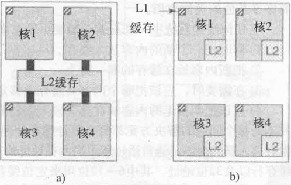

> 图a）带有共享L2缓存的4核芯片,  b）带有分离L2缓存的4核芯片

除了多线程,还出现了包含2个或4个完整处理器或内核的CPU芯片。图1-8中的多核芯片上有效地装有4个小芯片,每个小芯片都是ー个独立的CPU（后面将解释缓存）。!ntelXeonPhi和TileraTilePro等处理器,已经炫技般地在一枚芯片上集成了60多个核。要使用这类多核芯片肯定需要多处理器操作系统。

其实在绝对数目方面,没什么能赢过现代的GPU（GraphicsProcessingUnit）oGPU指的是由成千上万个微核组成的处理器。它们擅长处理大量并行的简单计算,比如在图像应用中渲染多边形。它们不太能胜任串行任务,并且很难编程。虽然GPU对操作系统很有用（比如加密或者处理网络传输）,但操作系统本身不太可能运行在GPU上。

### 1.3.2 存储器

在任何ー种计算机中,第二种主要部件都是存储器。在理想情形下,存储器应该极为迅速（快于执行一条指令,这样CPU不会受到存储器的限制）,充分大,并且非常便宜。但是目前的技术无法同时满足这三个目标,于是出现了不同的处理方式。存储器系统采用ー种分层次的结构,如图1-9所示。顶层的存储器速度较高,容量较小,与底层的存储器相比每位成本较高,其差别往往是十亿数量级。

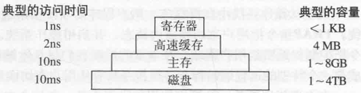

> 图1-9典型的存储层次结构,图中的数据是非常粗略的估计

存储器系统的顶层是CPU中的寄存器。它们用与CPU相同的材料制成,所以和CPUー样快。显然,访问它们是没有时延的。其典型的存储容量是,在32位CPU中为32x32位,而在64位CPU中为64χ64位。在这两种情形下,其存储容量都小于1KBo程序必须在软件中自行管理这些寄存器（即决定如何使用它们）。

下一层是高速缓存,它多数由硬件控制。主存被分割成高速缓存行（cacheline）,其典型大小为64字节,地址。至63对应高速缓存行（）,地址64至127对应高速缓存行1,以此类推。最常用的高速缓存行放置在CPU内部或者非常接近CPU的高速缓存中。当某个程序需要读ー个存储字时,高速缓存硬件检査所需要的高速缓存行是否在高速缓存中。如果是,称为高速缓存命中,缓存满足了请求,就不需要通过总线把访问请求送往主存。高速缓存命中通常需要两个时钟周期。高速缓存未命中就必须访问内存,这要付出大量的时间代价。由于高速缓存的价格昂贵,所以其大小有限。有些机器具有两级甚至三级高速缓存,每ー级高速缓存比前ー级慢且容量更大。

缓存在计算机科学的许多领域中起着重要的作用,并不仅仅是RAM的缓存行。只要存在大量的资源可以划分为小的部分,那么,这些资源中的某些部分就会比其他部分更频繁地得到使用,通常缓存的使用会带来性能上的改善。操作系统一直在使用缓存。例如,多数操作系统在内存中保留频繁使用的文件（的一部分）,以避免从磁盘中重复地调取这些文件。相似地,类似于

```
∕home∕ast∕projects∕miπix3∕src∕kernel∕clock.c
```

的长路径名转换成文件所在的磁盘地址的结果,也可以放入缓存,以避免重复寻找地址。还有,当ー个Web页面（URL）的地址转换为网络地址（IP地址）后,这个转换结果也可以缓存起来供将来使用。还有许多其他的类似应用。

在任何缓存系统中,都有若干需要尽快考虑的问题,包括:

1）何时把一个新的内容放入缓存。

2）把新内容放在缓存的哪一行上。

3）在需要时,应该把哪个内容从缓存中移走。

4）应该把新移走的内容放在某个较大存储器的何处。

并不是毎个问题的解决方案都符合每种缓存处理。对于CPU缓存中的主存缓存行,每当有缓存未命中时,就会调入新的内容°通常通过所引用内存地址的高位计算应该使用的缓存行。例如,对于64字节的4096个缓存行以及32位地址,其中6~17位用来定位缓存行,而0~5位则用来确定缓存行中的字节。在这个例子中,被移走内容的位置就是新数据要进入的位置,但是在有的系统中未必是这样。最后,当将一个缓存行的内容重写进主存时（该内容被缓存后,可能会被修改）,通过该地址来唯一确定需重写的主存位置。

缓存是ー种好方法,所以现代CPU中设计了两个缓存。第一级或称为L1缓存总是在CPU中，通常用来将已解码的指令调入CPU的执行引擎。对于那些频繁使用的数据字,多数芯片安排有第二个L1缓存。典型的L1缓存大小为16KB。另外,往往还设计有二级缓存,称为L2缓存,用来存放近来使用过的若干兆字节的内存字。L1和L2缓存之间的差别在于时序。对L1缓存的访问,不存在任何延时;而对L2缓存的访问,则会延时1或2个时钟周期。

在多核芯片中,设计师必须确定缓存的位置。在图l∙8a中,一个L2缓存被所有的核共享。In⑹多核芯片采用了这个方法。相反,在图l-8b中,每个核有自己的L2缓存。AMD采用这个方法。不过每种策略都有自己的优缺点。例如,皿⑹的共享L2缓存需要有一种更复杂的缓存控制器,而AMD的方式在设法保持L2缓存一致性上存在困难。

在图1・9的层次结构中,再往下ー层是主存。这是存储器系统的主力。主存通常称为随机访问存储器(RandomAccessMemory,RAM)β过去有时称之为磁芯存储器,因为在20世纪50年代和60年代,使用很小的可磁化的铁磁体制作主存。虽然它们已经绝迹了很多年,但名称还是传承了下来。目前,存储器的容量在几百兆字节到若干吉字节之间,并且其容量正在迅速增长。所有不能在高速缓存中得到满足的访问请求都会转往主存。

除了主存之外,许多计算机已经在使用少量的非易失性随机访问存储器。它们与RAM不同,在电源切断之后,非易失性随机访问存储器并不丢失其内容。只读存储器(ReadOnlyMemory,ROM)在工厂中就被编程完毕,然后再也不能被修改。ROM速度快且便宜。在有些计算机中,用于启动计算机的引导加载模块就存放在ROM中。另外,ー些I/O卡也采用ROM处理底层设备控制。

EEPROM(ElectricallyErasablePROM,电可擦除可编程ROM)和闪存(flashmemory)也是非易失性的,但是与ROM相反,它们可以擦除和重写。不过重写它们需要比写入RAM更高数量级的时间,所以它们的使用方式与ROM相同,而其与众不同的特点使它们有可能通过字段重写的方式纠正所保存程序中的错误。

在便携式电子设备中,闪存通常作为存储媒介。闪存是数码相机中的胶卷,是便携式音乐播放器的磁盘,这仅仅是闪存用途中的两项。闪存在速度上介于RAM和磁盘之间。另外,与磁盘存储器不同,如果闪存擦除的次数过多,就被磨损了。

还有一类存储器是CMOS,它是易失性的。许多计算机利用CMOS存储器保持当前时间和日期。CMOS存储器和递增时间的时钟电路由一块小电池驱动,所以,即使计算机没有上电,时间也仍然可以正确地更新.CMOS存储器还可以保存配置参数,如哪ー个是启动磁盘等。之所以采用CMOS是因为它消耗的电能非常少,ー块エ厂原装的电池往往能使用若干年。但是,当电池开始失效时,计算机就会出现“Abheimer病症”θ—计算机会忘掉记忆多年的事物,比如应该由哪个磁盘启动等。

### 1.3.3 磁盘

下ー个层次是磁盘(硬盘)。磁盘同RAM相比,每个二进制位的成本低了两个数量级,而且经常也有两个数量级大的容量。磁盘唯一的问题是随机访问数据时间大约慢了三个数量级。其低速的原因是因为磁盘是ー种机械装置,如图1-10所示。

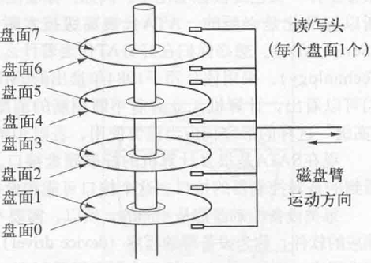

> 图1-10 磁盘驱动的构造

在ー个磁盘中有一个或多个金属盘片,它们以5400rpm,7200rpm、108001pm或更高的速度旋转。从边缘开始有一个机械臂悬横在盘面上,这类似于老式播放塑料唱片33转唱机上的拾音臂。信息写在磁盘的ー系列同心圆上。在任意ー个给定臂的位置,每个磁头可以读取一段环形区域,称为磁道(track)。把ー个给定臂的位置上的所有磁道合并起来,组成了一个柱面(cylinder)。

毎个磁道划分为若干扇区,扇区的典型值是512字节。在现代磁盘中,较外部的柱面比较内部的柱面有更多的扇区。机械臂从ー个柱面移到相邻的柱面大约需要1ms。而随机移到一个柱面的典型时间为5ms至10ms,其具体时间取决于驱动器。一旦磁臂到达正确的磁道上,驱动器必须等待所需的扇区旋转到磁头之下,这就增加了5ms至10ms的时延,其具体延时取决于驱动器的转速。一旦所需要的扇区移到磁头之下,就开始读写,低端硬盘的速率是50MB/s,而高速磁盘的速率是160MB/S。

有时,你会听到人们在谈论ー些实际上根本不是磁盘的磁盘,比如固态硬盘(SolidStateDisk,SSD)o固态硬盘并没有可以移动的部分,外形也不像唱片那样,并且数据是存储在存储器(闪存)中的。与磁盘唯一的相似之处就是它也存储了大量即使在电源关闭时也不会丢失的数据。

许多计算机支持ー种著名的虚拟内存机制,这将在第3章中讨论。这种机制使得期望运行大于物理内存的程序成为可能,其方法是将程序放在磁盘上,而将主存作为ー种缓存,用来保存最频繁使用的部分程序。这种机制需要快速地映像内存地址,以便把程序生成的地址转换为有关字节在RAM中的物理地址。这种映像由CPU中的ー个称为存储器管理单元(MemoryManagementUnit,MMU)的部件来完成,如图1-6所示。

缓存和MMU的出现对系统的性能有着重要的影响。在多道程序系统中,从ー个程序切换到另ー个程序,有时称为上下文切换(contextswitch),有必要对来自缓存的所有修改过的块进行写回磁盘操作,并修改MMU中的映像寄存器。但是这两种操作的代价很昂贵,所以程序员努力避免使用这些操作。我们稍后将看到这些操作产生的影响。

### 1.3.4 I/O设备

CPU和存储器不是操作系统唯一需要管理的资源。I/o设备也与操作系统有密切的相互影响。如图レ6所示,I/O设备一般包括两个部分:设备控制器和设备本身。控制器是插在电路板上的ー块芯片或ー组芯片,这块电路板物理地控制设备。它从操作系统接收命令,例如,从设备读数据,并且完成数据的处理。

在许多情形下,对这些设备的控制是非常复杂和具体的,所以,控制器的任务是为操作系统提供ー个简单的接口(不过还是很复杂)。例如,磁盘控制器可以接受一个命令从磁盘2读出11206号扇区,然后,控制器把这个线性扇区号转化为柱面、扇区和磁头。由于外柱面比内柱面有较多的扇区,而且一些坏扇区已经被映射到磁盘的其他地方,所以这种转换将是很复杂的。磁盘控制器必须确定磁头臂应该在哪个柱面上,并对磁头臂发出指令以使其前后移动到所要求的柱面号上,接着必须等待对应的扇区转动到磁头下面并开始读出数据,随着数据从驱动器读出,要消去引导块并计算校验和。最后,还得把输入的二进制位组成字并存放到存储器中。为了完成这些工作,在控制器中经常安装ー个小的嵌入式计算机,该嵌入式计算机运行为执行这些工作而专门编好的程序。

I/O设备的另ー个部分是实际设备的自身。设备本身有个相对简单的接口,这是因为接口既不能做很多工作,又已经被标准化了。例如,标准化后任何ー个SATA磁盘控制器就可以适配任一种SATA磁盘,所以标准化是必要的。ATA代表高级技术附件(ATAttachment),而SATA表示串行高级技术附件(SerialATA)。想必你们在好奇AT代表着什么,它是IBM公司的第二代个人计算机高级技术(AdvancedTechnology),采用该公司于1984年推出的6MHz 80286处理器,这ー处理器是当年最为强大的。从中我们可以看出,计算机エ业有着不断用新的前缀或后缀来扩展首字母缩写词的习惯。我们还能看出,像“髙级”这样的形容词应当谨慎使用,否则30年后再回首时会显得非常愚昧。

现在SATA是很多计算机的标准硬盘接口。由干实际的设备接口隐藏在控制器中,所以,操作系统看到的是对控制器的接口,这个接口可能和设备接口有很大的差别。

每类设备控制器都是不同的,所以,需要不同的软件进行控制。专门与控制器对话,发出命令并接收响应的软件,称为设备驱动程序(devicedriver)0每个控制器厂家必须为所支持的操作系统提供相应的设备驱动程序。例如,一台扫描仪会配有用于OS X、Windows7,Windows8以及Linux的设备驱动程序。

为了能够使用设备驱动程序,必须把设备驱动程序装入操作系统中,这样它可在核心态运行。设备驱动程序可以在内核外运行,现代的Linux和Windows操作系统也的确对这种方式提供ー些支持口绝大多数驱动程序仍然需要在内核态运行。只有很少一部分现代系统(如MINIX 3)在用户态运行全部驱动程序。在用户态运行的驱动程序必须能够以某种受控的方式访问设备,然而这并不容易。

要将设备驱动程序装入操作系统,有三个途径。第一个途径是将内核与设备驱动程序重新链接,然后重启动系统.许多UNIX系统以这种方式工作。第二个途径是在ー个操作系统文件中设置ー个入口,并通知该文件需要一个设备驱动程序,然后重启动系统。在系统启动时,操作系统去找寻所需的设备驱动程序并装载之。Windows就是以这种方式工作。第三种途径是,操作系统能够在运行时接受新的设备驱动程序并且立即将其安装好,无须重启动系统。这种方式采用得较少,但是正在变得普及起来。热插拔设备,诸如USB和IEEE1394设备（后面会讨论）都需要动态可装载设备驱动程序。

毎个设备控制器都有少量用于通信的寄存器。例如,ー个最小的磁盘控制器也会有用于指定磁盘地址、内存地址、扇区计数和方向（读或写）的寄存器。要激活控制器,设备驱动程序从操作系统获得一条命令,然后翻译成对应的值,并写进设备寄存器中。所有设备寄存器的集合构成了リ。端口空间,我们将在第5章讨论有关内容。

在有些计算机中,设备寄存器被映射到操作系统的地址空间（操作系统可使用的地址）,这样,它们就可以像普通存储字ー样读出和写入。在这种计算机中,不需要专门的i/o指令,用户程序可以被硬件阻挡在外,防止其接触这些存储器地址（例如,采用基址和界限寄存器）。在另外一些计算机中,设备寄存器披放入一个专门的I/O端口空间中,毎个寄存器都有一个端口地址。在这些机器中,提供在内核态中可使用的专门IN和〇UT指令,供设备驱动程序读写这些寄存器用。前ー种方式不需要专门的I/O指令,但是占用了一些地址空间。后者不占用地址空间,但是需要专门的指令。这两种方式的应用都很广泛。

实现输入和输出的方式有三种。在最简单的方式中,用户程序发出ー个系统调用,内核将其翻译成ー个对应设备驱动程序的过程调用。然后设备驱动程序启动i/o并在ー个连续不断的循环中检査该设备,看该设备是否完成了工作（一般有一些二进制位用来指示设备仍在忙碌中）•当i/o结束后,设备驱动程序把数据送到指定的地方（若有此需要）,并返回。然后操作系统将控制返回给调用者。这种方式称为忙等待（busywaiting）,其缺点是要占据CPU,CPU一直轮询设备直到对应的I/O操作完成。

第二种方式是设备驱动程序启动设备并且让该设备在操作完成时发出ー个中断。设备驱动程序在这个时刻返回.操作系统接着在需要时阻塞调用者并安排其他工作进行。当设备驱动程序检测到该设备的操作完毕时,它发出ー个中断通知操作完成。

在操作系统中,中断是非常重要的,所以需要更具体地讨论。在图1-11 a中,有一个I/O的三步过程。在第1步,设备驱动程序通过写设备寄存器通知设备控制器做什么。然后,设备控制器启动该设备。当设备控制器传送完毕被告知要进行读写的字节数量后,它在第2步中使用特定的总线发信号给中断控制器芯片。如果中断控制器已经准备接收中断（如果正忙于ー个更高级的中断,也可能不接收）,它会在CPU芯片的ー个管脚上声明,这就是第3步。在第4步中,中断控制器把该设备的编号放到总线上,这样CPU可以读总线,并且知道哪个设备刚刚完成了操作（可能同时有许多设备在运行）。

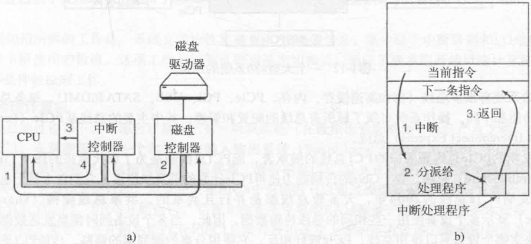

> 图1-11a）启动ー个！/O设备并发出中断的过程Ib）中断处理过程包括取中断、运行中断处理程序和返回用户程序

一旦CPU决定取中断,通常程序计数器和PSW就被压入当前堆栈中,并且CPU被切换到用户态。设备编号可以成为部分内存的ー个引用,用于寻找该设备中断处理程序的地址。这部分内存称为中断向量(interruptvector)o当中断处理程序(中断设备的设备驱动程序的一部分)开始后,它取走已入栈的程序计数器和PSW,并保存之,然后査询设备的状态。在中断处理程序全部完成之后,它返回到先前运行的用户程序中尚未执行的头一条指令°这些步骤如图1-11 b所示。

第三种方式是,为I/O使用ー种特殊的直接存储器访问(DirectMemoryAccess,DMA)芯片,它可以控制在内存和某些控制器之间的位流,而无须持续的CPU干预。CPU对DMA芯片进行设置,说明需要传送的字节数、有关的设备和内存地址以及操作方向,接着启动DMA。当DMA芯片完成时,它引发ー个中断,其处理方式如前所述。有关DMA和I/O硬件会在第5章中具体讨论。

中断会(并且经常会)在非常不合适的时刻发生,比如,在另ー个中断程序正在运行时发生。正由于此,CPU有办法关闭中断并在稍后再开启中断ユ在中断关闭时,任何已经发出中断的设备,可以继续保持其中断信号,但是CPU不会被中断,直至中断再次启用为止。如果在关闭中断时,已有多个设备发出了中断,中断控制器将决定先处理哪个中断,通常这取决于事先赋予毎个设备的静态优先级。最高优先级的设备赢得竞争并且首先获得服务,其他设备则必须等待。

### 1.3.5 总线

图1-6中的结构在小型计算机中使用了多年,并用在早期的IBMPC中。但是,随着处理器和存储器速度越来越快,到了某个转折点时,单总线(当然还有IBMPC总线)就很难处理总线的交通流量了,只有放弃。其结果是导致其他的总线出现,它们处理I/O设备以及CPU到存储器的速度都更快。这种演化的结果是,目前一台大型x86系统的结构如图1・12所示。

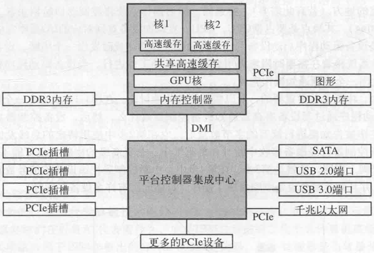

> 图1-12 一个大整x86系统的结构

图中的系统有很多总线(例如高速缓存、内存、PCIe.PCI、USB、SATA和DMI),每条总线的传输速度和功能都不同。操作系统必须了解所有总线的配置和管理。其中主要的总线是PCk(PeripheralComponentInterconnectExpress)总线。

Intel发明的PCIe总线是陈旧的PCI总线的继承者,而PCI总线则是为了取代原来的ISA(IndustryStandardArchitecture)总线＜1数十Gb/s的传输能力使得PCle比它的前身快得多。它们在本质上也十分不同。直到发明PCIe总线的2004年,大多数总线都是并行且共享的。共享总线架构(sharedbusarchitecture)表示多个设备使用一些相同的导线传输数据。因此,当多个设备同时需要发送数据时,需要仲裁器决定哪个设备可以使用总线。PCIe恰好相反,它使用分离的端到端的链路。传统PCI使用的并行总线架构(parallelbusarchitecture)表示通过多条导线发送数据的每ー个字。例如，在传统的PCI总线上,ー个32位数据通过32条并行的导线发送。与之相反,PCIe使用串行总线架构(serialbus architecture),通过一条被称为数据通路的链路传递集合了所有位的一条消息,这非常像网络包。这样做简单了很多,因为不用再确保所有32位在同一时刻精确地到达目的地。通过将多个数据通路并行起来,并行性仍可有效利用。例如,可以使用32个数据通路并行传输32条消息。随着网卡和图形适配器这些外围设备速度的迅速增长,PCIe标准毎3~5年进行一次更新。例如,PCIe2.0规格的16个数据通路提供64Gb/s的速度,升级到PCIe30后会提速2倍,而PCIe40会再提速2倍。

同时,还有很多符合老的PCI标准的旧设备。正如我们在图1/2中看到的那样,这些设备连接到独立的集成处理器。未来,当我们觉得用“陈旧”已经不能形容PCI,而只能称其为“古老”时,很可能所有的PCI设备将连接到另ー个集成中心,这些中心再连接到主集成中心,从而形成总线树。

在图中,CPU通过DDR3总线与内存对话,通过PCIe总线与外围图形设备对话,通过DMI(DirectMediaInterface)总线经集成中心与所有其他设备对话。而集成中心通过通用串行总线与USB设备对话,通过SATA总线与硬盘和DVD驱动器对话,通过PCIe传输以太网络帧。我们已经提到过使用传统PCI总线的旧的PCI设备。

不仅如此,每ー个核不仅有独立的高速缓存,而且还共享一个大得多的高速缓存。每ー种高速缓存都引入了又一条总线。

USB(UniversalSerialBus)是用来将所有慢速I/O设备(如键盘和鼠标)与计算机连接的。然而,以5Gb/s运行的现代USB3.0设备被认为很慢,这对于伴随第一代IBM个人计算机(以8Mb/sISA作为主要总线)共同长大的人来说似乎并不自然。USB采用一种小型的4~11针(取决于版本)连接器,其中一些针为USB设备提供电源或者接地。USB是ー种集中式总线，其根设备毎1ms轮询一次I/O设备,看是否有信息收发。USB10可以处理总计12Mb/s的负载,USB2.0总线提速到480MHs,而USB3.0能达到不小于5Gb/s的速率。一所有USB设备都可以连接到计算机然后立即工作,而不像之前的设备那样要求重启,这让ー批沮丧的用户感到非常惊讶。

SCSI(SmallComputerSystemInterface)总线是ー种高速总线,用在高速硬盘、扫描仪和其他需要较大带宽的设备上。现在,它们主要用在服务器和工作站中,速度可以达到640MB/S。

要在如图1-12展示的环境下工作,操作系统必须了解有些什么外部设备连接到计算机上,并对它们进行配置。这种需求导致Intel和微软设计了一种名为即插即用(plugandplay)的I/O系统,这是基于ー种首先被苹果Macintosh实现的类似概念。在即插即用之前,每块I/O卡有一个固定的中断请求级别和用于其I/O寄存器的固定地址,例如,键盘的中断级别是1,并使用。x60至0x64的I/O地址,软盘控制器是中断6级并使用0X3F0至0X3Fフ的I/O地址,而打印机是中断7级并使用0X378至0X37A的I/O地址等。

到目前为止,一切正常。比如,用户买了一块声卡和调制解调卡,并且它们都是可以使用中断4的,但此时,问题发生了,两块卡互相冲突,结果不能在ー起工作。解决方案是在每块I/O卡上提供DIP开关或跳接器,并指导用户对其进行设置以选择中断级别和i/o地址,使其不会与用户系统的任何其他部件冲突。那些热衷于复杂PC硬件的十几岁的青少年有时可以不出差错地做这类工作。但是,没有人能够不出错。

即插即用所做的工作是,系统自动地收集有关I/O设备的信息,集中赋予中断级别和I/O地址,然后通知每块卡所使用的数值。这项工作与计算机的启动密切相关,所以下面我们开始讨论计算机的启动。不过这不是件轻松的工作。

### 1.3.6 启动计算机

简要启动过程如下。在每台计算机上有一块双亲板(在政治因素影响到计算机产业之前,它们曾称为“母板”)。在双亲板上有一个称为基本输入输出系统(BasicInputOutputSystem,BIOS)的程序。在BIOS内有底层I/O软件,包括读键盘、写屏幕、进行磁盘I/O以及其他过程。现在这个程序存放在ー块闪速RAM中,它是非易失性的,但是在发现BIOS中有错时可以通过操作系统对它进行更新。

在计算机启动时,BIOS开始运行。它首先检査所安装的RAM数量,键盘和其他基本设备是否已安装并正常响应。接着,它开始扫描PCIe和PCI总线并找出连在上面的所有设备。即插即用设备也被记录下来。如果现有的设备和系统上一次启动时的设备不同,则新的设备将被配置。

然后,BIOS通过尝试存储在CMOS存储器中的设备清单决定启动设备。用户可以在系统刚启动之后进入ー个BIOS配置程序,对设备清单进行修改。典型地,如果存在CD-ROM（有时是USB）,则系统试图从中启动,如果失败,系统将从硬盘启动。启动设备上的第一个扇区被读入内存并执行。这个扇区中包含ー个对保存在启动扇区末尾的分区表检査的程序,以确定哪个分区是活动的。

然后,从该分区读入第二个启动装载模块。来自活动分区的这个装载模块被读入操作系统,并启动之。然后,操作系统询问BIOS,以获得配置信息。对于每种设备,系统检查对应的设备驱动程序是否存在。如果没有,系统要求用户插入含有该设备驱动程序的CD-ROM（由设备供应商提供）或者从网络上下载驱动程序。一旦有了全部的设备驱动程序,操作系统就将它们调入内核。然后初始化有关表格,创建需要的任何背景进程,并在毎个终端上启动登录程序或GUI。

## 1.4 操作系统大观园

操作系统已经存在了半个多世纪。在这段时期内,出现了各种类型的操作系统,但并不是所有操作系统都很知名。本节中,我们将简要地介绍其中的9个。在本书的后面,我们还将回顾其中的一些类型。

### 1.4.1 大型机操作系统

在操作系统的高端是用于大型机的操作系统,这些房间般大小的计算机仍然可以在一些大型公司的数据中心见到。这些计算机与个人计算机的主要差别是其I/O处理能力。一台拥有1000个磁盘和几百万吉字节数据的大型机是很正常的,如果有这样一台个人计算机朋友会很羡慕。大型机也在高端的Web服务器、大型电子商务服务站点和事务ー事务交易服务器上有某种程度的卷土重来。

用于大型机的操作系统主要面向多个作业的同时处理,多数这样的作业需要巨大的I/O能力。系统主要提供三类服务:批处理、事务处理和分时。批处理系统处理不需要交互式用户干预的周期性作业。保险公司的索赔处理或连锁商店的销售报告通常就是以批处理方式完成的。事务处理系统负责大量小的请求,例如,银行的支票处理或航班预订。每个业务量都很小,但是系统必须每秒处理成百上千个业务。分时系统允许多个远程用户同时在计算机上运行作业,如在大型数据库上的查询。这些功能是密切相关的,大型机操作系统通常完成所有这些功能°大型机操作系统的ー个例子是OS/390（OS/360的后继版本）。但是,大型机操作系统正在逐渐被诸如Linux这类UNIX的变体所替代。

### 1.4.2 服务器操作系统

下ー个层次是服务器操作系统。它们在服务器上运行,服务器可以是大型的个人计算机、工作站,甚至是大型机。它们通过网络同时为若干个用户服务,并且允许用户共享硬件和软件资源。服务器可提供打印服务、文件服务或Web服务。Intemet提供商运行着许多台服务器机器,为用户提供支持,使Web站点保存Web页面并处理进来的请求。典型的服务器操作系统有Solaris、FreeBSD,Linux和WindowsServer201x。

### 1.4.3 多处理器操作系统

获得大量联合计算能力的常用方式是将多个CPU连接成单个的系统。依据连接和共享方式的不同,这些系统称为并行计算机、多计算机或多处理器。它们需要专门的操作系统,不过通常采用的操作系统是配有通信、连接和一致性等专门功能的服务器操作系统的变体。

个人计算机中近来出现了多核芯片,所以常规的台式机和笔记本电脑操作系统也开始与小规模的多处理器打交道,而核的数量正在与时俱进。幸运的是,由于先前多年的班究,已经具备不少关于多处理器操作系统的知识,将这些知识运用到多核处理器系统中应该不存在困难。难点在于要有能够运用所有这些计算能力的应用。许多主流操作系统,包括Windows和Linux,都可以运行在多核处理器上。

### 1.4.4 个人计算机操作系统

接着ー类是个人计算机操作系统。现代个人计算机操作系统都支持多道程序处理,在启动时,通常有几十个程序开始运行。它们的功能是为单个用户提供良好的支持。这类系统广泛用于字处理、电子表格、游戏和Internet访问°常见的例子是Linux、FreeBSD,Windows7,Windows8和苹果公司的OSX。个人计算机操作系统是如此地广为人知,所以不需要再做介绍了。事实上,许多人甚至不知道还有其他的操作系统存在。

### 1.4.5 掌上计算机操作系统

随着系统越来越小型化,我们看到了平板电脑、智能手机和其他掌上计算机系统。掌上计算机或者PDA（个人数字助理,PersonalDigitalAssistant）是ー种可以握在手中操作的小型计算机。平板电脑和智能手机是最为人熟知的例子。正如我们看到的那样,这部分市场已经被谷歌的Android系统和苹果的iOS主导,但它们仍有很多竞争对手。大多数设备基于的是多核CPU、GPS、摄像头及其他的传感器、大量内存和精密的操作系统。并且,它们都有多到数不清的第三方应用（app）。

### 1.4.6 嵌入式操作系统

嵌入式系统在用来控制设备的计算机中运行,这种设备不是一般意义上的计算机,并且不允许用户安装软件。典型的例子有微波炉,电视机、汽车、DVD刻录机、移动电话以及MP3播放器ー类的设备。区别嵌入式系统与掌上设备的主要特征是,不可信的软件肯定不能在嵌入式系统上运行。用户不能给自己的微波炉下载新的应用程序—所有的软件都保存在ROM中。这意味着在应用程序之间不存在保护,这样系统就获得了某种简化。在这个领域中,主要的嵌入式操作系统有嵌入式Linux、QNX和VxWorks等。

### 1.4.7 传感器节点操作系统

有许多用途需要配置微小传感器节点网络。这些节点是ー种可以彼此通信并且使用无线通信基站的微型计算机。这类传感器网络可以用于建筑物周边保护、国土边界保卫、森林火灾探测、气象预测用的温度和降水测量、战场上敌方运动的信息收集等。

传感器是ー种内建有无线电的电池驱动的小型计算机。它们能源有限,必须长时间工作在无人的户外环境中,通常是恶劣的条件下。其网络必须足够健壮,以允许个别节点失效。随着电池开始耗尽,这种失效节点会不断增加。

每个传感器节点是ー个配有CPU、RAM、ROM以及ー个或多个环境传感器的实实在在的计算机。节点上运行ー个小型但是真实的操作系统,通常这个操作系统是事件驱动的,可以响应外部事件,或者基于内部时钟进行周期性的测量。该操作系统必须小且简单,因为这些节点的RAM很小,而且电池寿命是一个重要问题。另外,和嵌入式系统ー样,所有的程序是预先装载的,用户不会突然启动从Internet上下载的程序,这样就使得设计大为简化。TinyOS是ー个用于传感器节点的知名操作系统。

### 1.4.8 实时操作系统

另ー类操作系统是实时操作系统。这些系统的特征是将时间作为关键参数。例如,在工业过程控制系统中,工厂中的实时计算机必须收集生产过程的数据并用有关数据控制机器。通常,系统还必须满足严格的最终时限。例如,汽车在装配线上移动时,必须在限定的时间内进行规定的操作。如果焊接机器人焊接得太早或太迟,都会毁坏汽车。如果某个动作必须绝对地在规定的时刻（或规定的时间范围）发生,这就是硬实时系统。可以在工业过程控制、民用航空、军事以及类似应用中看到很多这样的系统。这些系统必须提供绝对保证,让某个特定的动作在给定的时间内完成。

另一类实时系统是软实时系统,在这种系统中,虽然不希望偶尔违反最终时限,但仍可以接受,并且不会引起任何永久性的损害。数字音频或多媒体系统就是这类系统。智能手机也是软实时系统。

由于在（硬）实时系统中满足严格的时限是关键,所以操作系统就是ー个简单的与应用程序链接的库,各个部分必须紧密耦合并且彼此之间没有保护。这种实时系统的例子有eCos。

掌上、嵌入式以及实时系统的分类之间有不少是彼此重叠的。几乎所有这些系统至少存在某种软实时情景。嵌入式和实时系统只运行系统设计师安装的软件,用户不能添加自己的软件,这样就使得保护工作很容易。掌上和嵌入式系统是给普通消费者使用的,而实时系统则更多用于エ业领域。无论怎样,这些系统确实存在一些共同点。

### 1.4.9 智能卡操作系统

最小的操作系统运行在智能卡上。智能卡是ー种包含ー块CPU芯片的信用卡。它有非常严格的运行能耗和存储空间的限制。其中,有些智能卡只具有单项功能,如电子支付,但是其他的智能卡则拥有多项功能,它们有专用的操作系统。

有些智能卡是面向Java的。这意味着在智能卡的ROM中有一个Java虚拟机（JavaVirtualMachine,JVM）解释器。Java小程序被下载到卡中并由JVM解释器解释。有些卡可以同时处理多个Java小程序,这就是多道程序,并且需要对它们进行调度。在两个或多个小程序同时运行时,资源管理和保护就成为突出的问题。这些问题必须由卡上的操作系统（通常是非常原始的）处理。

## 1.5 操作系统概念

多数操作系统都使用某些基本概念和抽象,如进程、地址空间以及文件等,它们是需要理解的核心内容。作为引论,在下面的几节中,我们将较为简要地考察这些基本概念中的一部分。在本书的后面,我们将详细地讨论它们。为了说明这些概念,我们有时使用示例,这些示例通常源自UNIX。不过,类似的例子在其他操作系统中也明显地存在,我们将在之后深入了解其中的一些操作系统。

### 1.5.1 进程

在所有操作系统中,ー个重要的概念是进程（process）o进程本质上是正在执行的ー个程序。与每个进程相关的是地址空间（addressspace）,这是从某个最小值的存储位置（通常是零）到某个最大值的存储位置的列表。在这个地址空间中,进程可以进行读写。该地址空间中存放有可执行程序、程序的数据以及程序的堆栈。与每个进程相关的还有资源集,通常包括寄存器（含有程序计数器和堆桟指针）、打开文件的清单、突出的报警、有关进程清单,以及运行该程序所需要的所有其他信息。进程基本上是容纳运行ー个程序所需要所有信息的容器。

进程的概念将在第2章详细讨论,不过,对进程建立一种直观感觉的最便利方式是分析一个多道程序设计系统。用户启动ー个视频编辑程序,指示它按照某个格式转换ー小时的视频（有时会花费数小时），然后离开去浏览网页。.同时,ー个被周期性喚醒、用来检査进来的电子邮件的后台进程会开始运行。这样,我们就有了（至少）三个活动进程:视频编辑器、Web浏览器以及电子邮件接收程序。操作系统周期性地挂起一个进程然后启动运行另ー个进程,这可能是由于在过去的ー两秒钟内,第一个进程已使用完分配给它的时间片。

ー个进程暂时被挂起后,在随后的某个时刻里,该进程再次启动时的状态必须与先前暂停时完全相同,这就意味着在挂起时该进程的所有信息都要保存下来。例如,为了同时读入信息,进程打开了若干文件。与每个被打开文件有关的是指向当前位置的指针（即下一个将读出的字节或记录）。在ー个进程暂时被挂起时,所有这些指针都必须保存起来,这样在该进程重新启动之后,所执行的读调用才能读到正确的数据。在许多操作系统中,与一个进程有关的所有信息,除了该进程自身地址空间的内容以外,均存放在操作系统的ー张表中,称为进程表（processtable）,进程表是数组（或链表）结构,当前存在的每个进程都要占用其中一项。

所以,一个（挂起的）进程包括:进程的地址空间（往往称作磁芯映像,coreimage,纪念过去使用的磁芯存储器）,以及对应的进程表项（其中包括寄存器以及稍后重启动该进程所需要的许多其他信息）。

与进程管理有关的最关键的系统调用是那些进行进程创建和进程终止的系统调用。考虑ー个典型的例子°有一个称为命令解释器（commandinterpreter）或shell的进程从终端上读命令。此时,用户刚键入一条命令要求编译ー个程序。shell必须先创建一个新进程来执行编译程序。当执行编译的进程结束时,它执行ー个系统调用来终止自己。

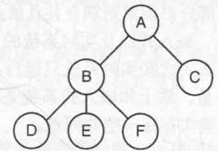

> 图1-13一个进程树。进程A创建两个子进程B和C,进程B创建三个子进程D、E⅛F

若一个进程能够创建一个或多个进程（称为子进程），而且这些进程又可以创建子进程,则很容易得到进程树,如图L13所示。合作完成某些作业的相关进程经常需要彼此通信以便同步它们的行为。这种通信称为进程间通信（interprocesscommunication）,将在第2章中详细讨论。

其他可用的进程系统调用包括:申请更多的内存（或释放不再需要的内存）、等待一个子进程结束、用另一个程序覆盖该程序等。

有时,需要向ー个正在运行的进程传送信息,而该进程并没有等待接收信息。例如,ー个进程通过网络向另一台机器上的进程发送消息进行通信。为了保证一条消息或消息的应答不会丢失,发送者要求它所在的操作系统在指定的若干秒后给ー个通知,这样如果对方尚未收到确认消息就可以进行重发。

在设定该定时器后,程序可以继续做其他工作。在限定的秒数流逝之后,操作系统向该进程发送ー个警告信号(alarmsignal)。此信号引起该进程暂时挂起,无论该进程正在做什么,系统将其寄存器的值保存到堆栈,并开始运行一个特别的信号处理过程,比如重新发送可能丢失的消息。这些信号是软件模拟的硬件中断,除了定时器到期之外,该信号可以由各种原因产生。许多由硬件检测出来的陷阱,如执行了非法指令或使用了无效地址等,也被转换成该信号并交给这个进程。

系统管理器授权每个进程使用ー个给定的UID(User!Dentification)。每个被启动的进程都有一个启动该进程的用户UID。子进程拥有与父进程一样的UID。用户可以是某个组的成员,每个组也有一个GÏD(Group!Dentification)

在UNIX中,有一个U!D称为超级用户(superuser),或者Windows中的管理员(administrator),它具有特殊的权カ,可以违背ー些保护规则。在大型系统中,只有系统管理员掌握着成为超级用户的密码,但是许多普通用户(特别是学生)做出了可观的努力,试图找出系统的缺陷,从而使他们不用密码就可以成为超级用户。

在第2章中,我们将讨论进程以及进程间通信的相关内容。

### 1.5.2 地址空间

每台计算机都有一些主存,用来保存正在执行的程序。在非常简单的操作系统中,内存中一次只能有一个程序。如果要运行第二个程序,第一个程序就必须被移出内存,再把第二个程序装入内存。

较复杂的操作系统允许在内存中同时运行多道程序。为了避免它们互相干扰(包括操作系统),需要有某种保护机制。虽然这种机制必然是硬件形式的,但是由操作系统掌控。

上述的观点涉及对计算机主存的管理和保护。另ー种不同但是同样重要并与存储器有关的内容,是管理进程的地址空间。通常,每个进程有一些可以使用的地址集合,典型值从()开始直到某个最大值。在最简单的情形下,ー个进程可拥有的最大地址空间小于主存。在这种方式下,进程可以用满其地址空间,而且内存中也有足够的空间容纳该进程。

但是,在许多32位或64位地址的计算机中,分别有232或264字节的地址空间。如果ー个进程有比计算机拥有的主存还大的地址空间,而且该进程希望使用全部的内存,那怎么办呢?在早期的计算机中,这个进程只好“认命”了。现在,有了一种称为虚拟内存的技术,正如前面已经介绍过的,操作系统可以把部分地址空间装入主存,部分留在磁盘上,并且在需要时来回交换它们。在本质上,操作系统创建了一个地址空间的抽象,作为进程可以引用地址的集合。该地址空间与机器的物理内存解耦,可能大于也可能小于该物理空间。对地址空间和物理空间的管理组成了操作系统功能的ー个重要部分,整个第3章都与这个主题有关。

### 1.5.3 文件

实际上,支持操作系统的另ー个关键概念是文件系统。如前所述,操作系统的ー项主要功能是隐藏磁盘和其他I/o设备的细节特性,给提供程序员一个良好、清晰的独立于设备的抽象文件模型。显然,创建文件、删除文件、读文件和写文件等都需要系统调用。在文件可以读取之前,必须先在磁盘上定位和打开文件,在文件读过之后应该关闭该文件,有关的系统调用则用于完成这类操作。

为了提供保存文件的地方,大多数操作系统支持目录(directory)的概念,从而可把文件分类成组。比如,学生可给所选的每个课程创建一个目录(用于保存该课程所需的程序),另设ー个目录存放电子邮件,再有一个目录用于保存万维网主页。这就需要系统调用创建和删除目录、将已有的文件放入目录中、从目录中删除文件等。目录项可以是文件或者目录,这样就产生了层次结构—文件系统,如图1-14所示。

进程和文件层次都可以组织成树状结构,但这两种树状结构有不少不同之处。一般进程的树状结构层次不深(很少超过三层),而文件树状结构的层次常常多达四层、五层或更多层。进程树层次结构是暂时的,通常最多存在几分钟,而目录层次则可能存在数年之久。进程和文件在所有权及保护方面也是有区别的。典型地,只有父进程能控制和访问子进程,而在文件和目录中通常存在ー种机制,使文件所有者之外的其他用户也可以访问该文件。

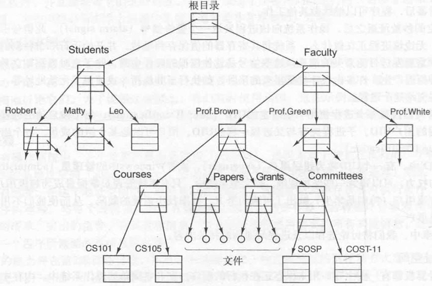

> 图1-14大学院系的文件系统

目录层结构中的每一个文件都可以通过从目录的顶部即根目录(rootdirectory)开始的路径名(pathname)来确定。绝对路径名包含了从根目录到该文件的所有目录清单,它们之间用正斜线隔开。如在图L14中,文件CS101的路径名是/Faculty/Prof.Brown/Courses/CS101。最开始的正斜线表示这是从根目录开始的绝对路径。顺便提及,出于历史原因在Windows中用反斜线(\)字符作为分隔符,替代了正斜线(/),这样,上面给出的文件路径会写为XFaculty∖Prof.Brown∖Courses∖CS101在本书中,我们ー般使用UNIX的路径惯例。

在实例中,每个进程有一个工作目录(workingdirectory),对于没有以斜线开头给出绝对地址的路径,将在这个工作目录下寻找。如在图1-14中的例子,如果/Faculty/Prof.Brown是工作目录,那么Courses/CS101与上面给定的绝对路径名表示的是同一个文件.进程可以通过使用系统调用指定新的エ作目录,从而变更其工作目录。

在读写文件之前,首先要打开文件,检査其访问权限。若权限许可,系统将返回一个小整数,称作文件描述符(filedescriptor),供后续操作使用。若禁止访问,系统则返回一个错误码。

Unix中的另ー个重要概念是安装文件系统。大多数台式机都有一个或多个光盘驱动器,可以插入cd-rom、DVD和蓝光光盘。它们几乎都有USB接口,可以插入USB存储棒(实际是固态磁盘驱动器)。为了提供ー个出色的方式处理可移动介质,UNIX允许把光盘上的文件系统接到主文件树上。考虑图l-15a的情形。在mount调用之前,根文件系统在硬盘上,而第二个文件系统在CD-ROM上,它们是分离且无关的。

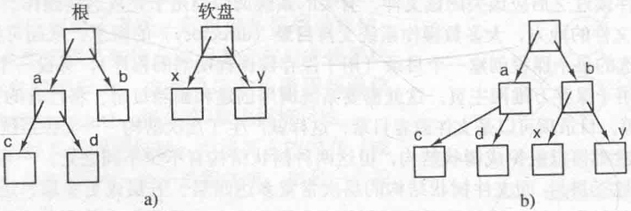

> 图1-15a)在安装前,CD-ROM上的文件不可访问.b)在安装后,它们成了文件层次的一部分

然而,不能使用CD-ROM上的文件系统,因为上面没有可指定的路径。UNIX不允许在路径前面加上驱动器名称或代码,那样做就完全成了设备相关类型了,这是操作系统应该消除的。代替的方法是,mount系统调用允许把在CD-ROM上的文件系统连接到程序所希望的根文件系统上。在图i-15b中,CD-ROM上的文件系统安装到了目录b上,这样就允许访问文件/b/x以及/b/y。如果CD-ROM已安装好,但目录b中有任何不能访问的文件,则是因为/b指向了CD∙ROM的根目录。（在开始时,不能访问这些文件似乎并不是ー个严重问题:文件系统几乎总是安装在空目录上。）如果系统有多个硬盘,它们可以都安装在单个树上。

在UNIX中,另ー个重要的概念是特殊文件（special file）。提供特殊文件是为了使I/O设备看起来像文件一般。这样,就像使用系统调用读写文件ー样,i/o设备也可通过同样的系统调用进行读写。有两类特殊文件:块特殊文件（blockspecialfile）和字符特殊文件（characterspecialfile）o块特殊文件指那些由可随机存取的块组成的设备,如磁盘等。比如打开ー个块特殊文件,然后读第4块,程序可以直接访问设备的第4块而不必考虑存放该文件的文件系统结构。类似地,字符特殊文件用于打印机、调制解调器和其他接收或输出字符流的设备。按照惯例,特殊文件保存在/加V目录中。例如,/dev/lp是打印机（曾经称为行式打印机）。

本小节中讨论的最后ー个特性既与进程有关也与文件有关:管道。管道（pipe）是ー种虚文件,它可连接两个进程,如图1-16所示。如果进程A和B希望通过管道对话,它们必须提前设置该管道。当进程A想对进程B发送数据时,它把数据写到管道上,仿佛管道就是输出文件一样。进程B可以通过读该管道而得到数据,仿佛该管道就是一个输入文件ー样。这样,在UNIX中两个进程之间的通信就非常类似于普通文件的读写了。更为强大的是,若进程想发现它所写入的输出文件不是真正的文件而是管道,则需要使用特殊的系统调用。文件系统是非常重要的。我们将在第4章以及第10章和第11章中具体讨论它们。

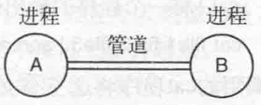

> 图1-16 由杳道连接的两个进程

### 1.5.4 输入/输出

所有的计算机都有用来获取输入和产生输出的物理设备。毕竟,如果用户不能告诉计算机该做什么,而在计算机完成了所要求的工作之后竟不能得到结果,那么计算机还有什么用处呢?有各种类型的输入和输出设备,包括键盘、显示器、打印机等。对这些设备的管理全然依靠操作系统。

所以,每个操作系统都有管理其I/O设备的I/O子系统。某些I/O软件是设备独立的,即这些I/O软件部分可以同样应用于许多或者全部的I/o设备上。I/O软件的其他部分,如设备驱动程序,是专门为特定的1Z。设备设计的。在第5章中,我们将讨论I/o软件。

### 1.5.5 保护

计算机中有大量的信息,用户经常希望对其进行保护,并保守秘密。这些信息包括电子邮件、商业计划、退税等诸多内容。管理系统的安全性完全依靠操作系统,例如,文件仅供授权用户访问。

作为ー个简单的例子,以便读者对如何实现安全有一个概念,请考察UNIX。UNIX操作系统通过对毎个文件赋予ー个9位的二逬制保护代码,对UNIX中的文件实现保护。该保护代码有三个3位字段,一个用于所有者,ー个用于与所有者同组（用户被系统管理员划分成组）的其他成员,ー个用于其他人。毎个字段中有一位用于读访问,一位用于写访问,一位用于执行访问。这些位就是知名的rwx位。例如,保护代码rwxr-x--x的含义是所有者可以读、写或执行该文件,其他的组成员可以读或执行（但不能写）该文件,而其他人可以执行（但不能读和写）该文件。对ー个目录而言,X的含义是允许査询。一条短横线的含义是,不存在对应的许可。

除了文件保护之外,还有很多有关安全的问题。保护系统不被人类或非人类（如病毒）入侵,则是其中之一。我们将在第9章中研究各种安全性问题。

### 1.5.6 shell

操作系统是进行系统调用的代码。编辑器、编译器、汇编程序、链接程序、效用程序以及命令解释器等,尽管非常重要,也非常有用,但是它们确实不是操作系统的组成部分。为了避免可能发生的混淆,本小节將大致介绍一下UNIX的命令解释器,称为shell。尽管sheH本身不是操作系统的一部分,但它体现了许多操作系统的特性,并很好地说明了系统调用的具体用法。shell同时也是终端用户与操作系统之间的接口,除非用户使用的是图形用户界面。有许多种shell,如sh、csh,ksh以及bash等。它们全部支持下面所介绍的功能,这些功能可追溯到早期的shell(即sh)。

用户登录时,同时启动了一个shell。它以终端作为标准输入和标准输出。首先显示提示符(prompt),它可能是一个美元符号,提示用户shell正在等待接收命令。假如用户键入

```
date
```

shell创建一个子进程,并运行date程序作为子进程。在该子进程运行期间,shell等待它结束。在子进程结束后,shell再次显示提示符,并等待下一行输入。

用户可以将标准输出重定向到ー个文件,如键入

```
date>file
```

同样,也可以将标准输入重定向,如:

```
sort<file1>file2
```

该命令调用sort程序,从filel中取得输入,输出送到file2.

可以将一个程序的输出通过管道作为另ー程序的输入,因此有

```
cat file1 file2 file3 | sort >/dev/lp
```

所调用的cat程序将这三个文件合并,其结果送到sort程序并按字典序排序。sort的输出又被重定向到文件/dev/lp中,显然,这是打印机。

如果用户在命令后加上一个"&"符号,则shell将不等待其结束,而直接显示出提示符。所以

```
cat file1 file2 file3 |sort>/dev/lp &
```

将启动sort程序作为后台任务执行,这样就允许用户继续工作,而sort命令也继续进行。shell还有许多其他有用的特性,由于篇幅有限而不能在这里讨论。有许多UNIX的书籍具体地讨论了shell(例如,Kemighan⅛Pike,1984iQuigley,2004jRobbins,2005)

现在,许多个人计算机使用GUI。事实上,GUI与shell类似,GUI只是一个运行在操作系统顶部的程序。在Linux系统中,这个事实更加明显,因为用户(至少)可以在两个GUI中选择ー个:Gnome和KDE,或者干脆不用(使用XII上的终端视窗)。在Windows中也可以用不同的程序代替标准的GUI桌面(WindowsExplorer),这可以通过修改注册表中的某些数值实现,不过极少有人这样做。

### 1.5.7 个体重复系统发育

在达尔文的《物种起源》(OntheOriginoftheSpecies)ー书出版之后,德国动物学家ErnstHaeckel论述了“个体重复系统发育”(ontogenyrecapitulatesphylogeny)o他这句话的含义是,个体重复着物种的演化过程。换句话说,在ー个卵子受精之后成为人体之前,这个卵子要经过是鱼、是猪等阶段。现代生物学家认为这是ー种粗略的简化,不过这种观点仍旧包含了真理的核心部分。

在计算机的历史中,类似情形也有发生。每个新物种(大型机、小型计算机、个人计算机、掌上、嵌入式计算机、智能卡等),无论是硬件还是软件,似乎都要经过它们前辈的发展阶段。计算机科学和许多领域ー样,主要是由技术驱动的。古罗马人缺少汽车的原因不是因为他们非常喜欢步行,是因为他们不知道如何造汽车。个人计算机的存在,不是因为数以百万计的人有着迫切的愿望—拥有一台计算机,而是因为现在可以很便宜地制造它们。我们常常忘了技术是如何影响我们对各种系统的观点的,所以有时值得再仔细考虑它们。特别地,技术的变化会导致某些思想过时并迅速消失,这种情形经常发生。但是,技术的另ー种变化还可能使某些思想再次复活。在技术的变化影响了某个系统不同部分之间的相对性能时,情况就是这样。例如,当CPU远快于存储器时,为了加速“慢速”的存储器,高速缓存是很重要的。某一天,如果新的存储器技术使得存储器远快于CPU,高速缓存就会消失。而如果新的CPU技术又使CPU远快于存储器,高速缓存就会再次出现。在生物学上,消失是永远的,但是在计算机科学中,这种消失有时只有几年时间。

在本书中,暂时消失的结果会造成我们有时需要反复考察ー些“过时”的概念,即那些在当代技术中并不理想的思想。而技术的变化会把ー些“过时概念”带回来。正由于此,更重要的是要理解为什么ー个概念会过时,什么样环境的变化又会启用“过时概念”。

为了把这个观点叙述得更透彻,我们考虑ー些例子。早期计算机采用了硬连线指令集。这种指令可由硬件直接执行,且不能改变。然后出现了微程序设计（首先在IBM360上大规模引入）,其中的解释器执行软件中的指令。于是硬连线执行过时了,因为不够灵活。接着发明了RISC计算机,微程序设计（即解释执行）过时了,这是因为直接执行更快。而在通过lmemet发送并且到达时オ解释的Java小程序形式中,我们又看到了解释执行的复苏。执行速度并不总是关键因素,但由于网络的延迟非常大,以至于它成了主要因素。这样,“钟摆”在直接执行和解释执行之间已经晃动了好几个周期,也许在未来还会再次晃动。

#### 1.大型内存

现在来分析硬件的某些历史发展过程,并看看硬件是如何重复地影响软件的。第一代大型机内存有限。在1959年至1964年之间,称为“山寨王”的IBM7090或7094满载也只有128KB多的内存。该机器多数用汇编语言编程,为了节省内存,其操作系统用汇编语言编写。

随着时间的推移,在汇编语言宣告过时时,FORTRAN和COBOL之类语言的编译器已经足够好了。但是在第一个商用小型计算机（PDP-1）发布时,却只有4096个18位字的内存,而且令人吃惊的是,汇编语言又回来了。最终,小型计算机获得了更多的内存,而且高级语言也在小型机上盛行起来。

在20世纪80年代早期微型计算机出现时，第一批机器只有4KB内存,汇编语言又复活了。嵌入式计算机经常使用和微型计算机ー样的CPU芯片（8080、Z80、后来的8086）,而且ー开始也使用汇编编程。现在,它们的后代—个人计算机拥有大量的内存,使用C、C++、Java和其他高级语言编程。智能卡正在走着类似的发展道路,而且除了确定的大小之外,智能卡通常使用Java解释器,解释执行Java程序,而不是将Java编译成智能卡的机器语言。

#### 2.保护硬件

早期的IBM7090/7094等大型机没有保护硬件,所以这些机器一次只运行一个程序。ー个有问题的程序就可能毁掉操作系统,并且很容易使机器崩溃。在IBM360发布时，提供了保护硬件的原型,这些机器可以在内存中同时保持若干程序,并让它们轮流运行（多道程序处理）。于是单道程序处理宣告过时。

至少是到了第一个小型计算机出现时一还没有保护硬件—所以多道程序处理也不可能有。尽管PDP-1和PDP-8没有保护硬件,但是PDP∙11型机器有了保护硬件,这ー特点导致了多道程序处理的应用,并且最终导致UNIX操作系统的诞生。

在建造第一代微型计算机时,使用了Intel8080CPU芯片,但是没有保护硬件,这样我们又回到了单道程序处理—毎个时刻只运行ー个程序。直到Intel80286オ增加了保护硬件,于是有了多道程序处理。直到现在,许多嵌入式系统仍旧没有保护硬件,而且只运行单个程序。

现在来考察操作系统。第一代大型机原本没有保护硬件,也不支持多道程序处理,所以这些机器只运行简单的操作系统,一次只能手工装载ー个程序。后来,大型机有了保护硬件,操作系统可以同时支持运行多个程序,接着系统拥有了全功能的分时能力。

在小型计算机刚出现时,也没有保护硬件,一次只运行一个手工装载的程序。逐渐地,小型机有了保护硬件,有了同时运行两个或更多程序的能力。第一代微型计算机也只有一次运行一个程序的能力,但是随后具有了一次处理多道程序的能力。掌上计算机和智能卡也走着类似的发展之路。

在所有这些案例中,软件的发展是受制于技术的.例如,第一代微型计算机有约4KB内存,没有保护硬件。髙级语言和多道程序处理对于这种小系统而言,无法获得支持。随着微型计算机演化成为现代个人计算机,拥有了必要的硬件,从而有了必需的软件处理以支持多种先进的功能。这种演化过程看来还要持续多年。其他领域也有类似的这种轮回现象,但是在计算机行业中,这种轮回现象似乎变化得更快。

#### 3.硬盘

早期大型机主要是基于磁带的。机器从磁带上读入程序、编译、运行,并把结果写到另一个磁带上。那时没有磁盘也没有文件系统的概念。在IBM于1956年引入第一个磁盘—RAMAC（RAndoMACcess）之后,事情开始变化。这个磁盘占据4平方米空间,可以存储500万フ位长的字符,这足够存储ー张中等分辨率的数字照片。但是其年租金高达35000美元,比存储占据同样空间数量的胶卷还要贵°不过这个磁盘的价格终于还是下降了,并开始出现了原始的文件系统。

拥有这些新技术的典型机器是CDC6600,该机器于1964年发布,在多年之内始终是世界上最快的计算机。用户可以通过指定名称的方式创建所谓“永久文件”,希望这个名称还没有被别人使用,比如“data”就是一个适合于文件的名称。这个系统使用单层目录。后来在大型机上开发出了复杂的多层文件系统,MULTICS文件系统可以算是多层文件系统的顶峰。

接着小型计算机投入使用,该机型最后也有了硬盘。1970年在PDP-11上引入了标准硬盘—RK05磁盘,容量为2.5MB,只有IBMRAMAC一半的容量,但是这个磁盘的直径只有40厘米,5厘米厚。不过,其原型也只有单层目录。随着微型计算机的出现,CP/M开始成为操作系统的主流,但是它也只是在（软）盘上支持单目录。

#### 4.虚拟内存

虚拟内存（安排在第3章中讨论）通过在RAM和磁盘中反复移动信息块的方式,提供了运行比机器物理内存大的程序的能力。虚拟内存也经历了类似的历程,首先出现在大型机上,然后是小型机和微型机。虚拟内存还使得程序可以在运行时动态地链接库,而不是必须在编译时链接。MULTICS是第ー个可以做到这点的系统。最终,这个思想传播到所有的机型上,现在广泛用于多数UNIX和Windows系统中。

在所有这些发展过程中,我们看到,在ー种环境中出现的思想,随着环境的变化被抛弃（汇编语言设计、单道程序处理、单层目录等）,通常在十年之后,该思想在另ー种环境下又重现了。由于这个原因,本书中,我们将不时回顾那些在今日的吉字节PC中过时的思想和算法,因为这些思想和算法可能会在嵌入式计算机和智能卡中再现。

## 1.6系统调用

我们已经看到操作系统具有两种功能:为用户程序提供抽象和管理计算机资源。在多数情形下,用户程序和操作系统之间的交互处理的是前者,例如，创建、写入、读出和删除文件。对用户而言,资源管理部分主要是透明和自动完成的。这样,用户程序和操作系统之间的交互主要就是处理抽象。为了真正理解操作系统的行为,我们必须仔细地分析这个接口。接口中所提供的调用随着操作系统的不同而变化（尽管基于的概念是类似的）。

这样我们不得不在如下的可能方式中进行选择:（1）含混不清的一般性叙述（”操作系统提供读取文件的系统调用"）；（2）某个特定的系统（“UNIX提供ー个有三个参数的read系统调用:ー个参数指定文件,ー个说明数据应存放的位置,另一个说明应读出多少字节）。

我们选择后ー种方式。这种方式需要更多的努力,但是它能更多地洞察操作系统具体在做什么。尽管这样的讨论会涉及专门的POSIX（InternationalStandard9945-1）,以及UNIX、SystemV,BSD、Linux,MINIX3等,但是多数现代操作系统都有实现相同功能的系统调用,尽管它们在细节上差别很大。由于引发系统调用的实际机制是非常依赖于机器的,而且必须用汇编代码表达,所以,通过提供过程库使C程序中能够使用系统调用,当然也包括其他语言。

记住下列事项是有益的。任何单CPU计算机一次只能执行一条指令。如果ー个进程正在用户态运行ー个用户程序,并且需要一个系统服务,比如从ー个文件读数据,那么它就必须执行一个陷阱或系统调用指令,将控制转移到操作系统。操作系统接着通过参数检査找出所需要的调用进程。然后,它执行系统调用,并把控制返回给在系统调用后面跟随着的指令。在某种意义上,进行系统调用就像进行ー个特殊的过程调用,但是只有系统调用可以进入内核,而过程调用则不能。

为了使系统调用机制更清晰,我们简要地考察read系统调用。如上所述,它有三个参数:第一个参数指定文件,第二个指向缓冲区,第三个说明要读出的字节数。几乎与所有的系统调用ー样,它的调用由C程序完成,方法是调用ー个与该系统调用名称相同的库过程:read。由C程序进行的调用形式如下:

```
 count = read（fd, buffer, nbytes）;
```

系统调用（以及库过程）在count中返回实际读出的字节数。这个值通常和mbytes相同,但也可能更小,例如,如果在读过程中遇到了文件尾的情形就是如此。

如果系统调用不能执行,不论是因为无效的参数还是磁盘错误,count都会被置为ー1,而在全局变量ermo中放入错误号。程序应该经常检査系统调用的结果,以了解是否出错。

系统调用是通过一系列的步骤实现的。为了更清楚地说明这个概念,考察上面的read调用。在准备调用这个实际用来进行read系统调用的read库过程时,调用程序首先把参数压进堆桟,如图1-17中步骤1~步骤3所示。

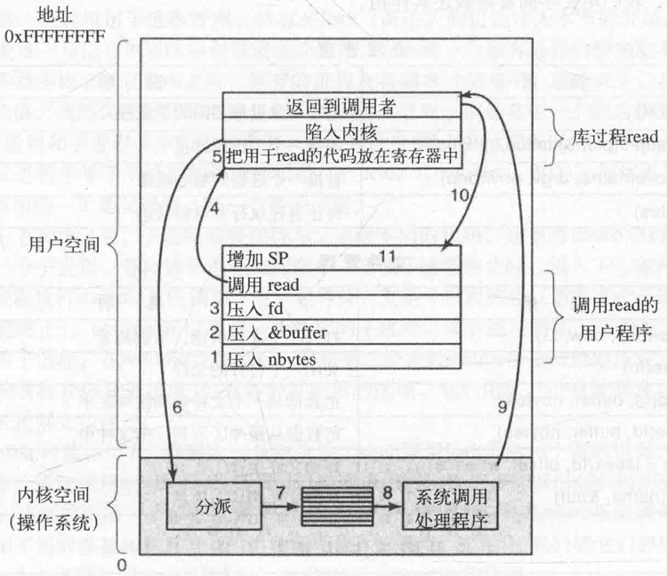

> 图1-17 完成系统调用read（fd,buffer,池向$）的11个步骤

由于历史的原因,C以及C++编译器使用逆序（必须把第一个参数赋给printf（格式字符串）,放在堆栈的顶部）。第一个和第三个参数是值调用,但是第二个参数通过引用传递,即传递的是缓冲区的地址（由&指示）,而不是缓冲区的内容。接着是对库过程的实际调用（第4步）。这个指令是用来调用所有过程的正常过程调用指令。

在可能是由汇编语言写成的库过程中,一般把系统调用的编号放在操作系统所期望的地方,如寄存器中（第5步）。然后执行一个TRAP指令,将用户态切换到内核态,并在内核中的ー个固定地址开始执行（第6步）。TRAP指令实际上与过程调用指令非常类似,它们后面都跟随一个来自远处位置的指令,以及供以后使用的ー个保存在栈中的返回地址。

然而,TRAP指令与过程指令存在两个方面的差别。首先,它的副作用是,切换到内核态。而过程调用指令并不改变模式。其次,不像给定过程所在的相对或绝对地址那样,TRAP指令不能跳转到任意地址上。根据机器的体系结构,或者跳转到ー个单固定地址上,或者指令中有一8位长的字段,它给定了内存中一张表格的索引,这张表格中含有跳转地址。

跟随在TRAP指令后的内核代码开始检查系统调用编号,然后分派给正确的系统调用处理器,这通常是通过ー张由系统调用编号所引用的、指向系统调用处理器的指针表来完成（第7步）。此时,系统调用处理器运行（第8步）。一旦系统调用处理器完成其工作,控制可能会在跟随TRAP指令后面的指令中返回给用户空间库过程（第9步）。这个过程接着以通常的过程调用返回的方式,返回到用户程序（第10步）。

为了完成整个工作,用户程序还必须清除堆栈,如同它在进行任何过程调用之后ー样（第11步）。假设堆栈向下增长,如经常所做的那样,编译后的代码准确地增加堆栈指针值,以便清除调用read之前压入的参数。在这之后,原来的程序就可以随意执行了。

在前面第9步中,我们提到“控制可能会在跟随TRAP指令后面的指令中返回给用户空间库过程”，这是有原因的。系统调用可能堵塞调用者,避免它继续执行。例如,如果试图读键盘,但是并没有任何键入,那么调用者就必须被阻塞。在这种情形下,操作系统会査看是否有其他可以运行的进程。稍后,当需要的输入出现时,进程会提醒系统注意,然后步骤9~步骤11会接着进行。

下面几小节中,我们将考察ー些常用的POSIX系统调用,或者用更专业的说法,考察进行这些系统调用的库过程。POSIX大约有100个过程调用,它们中最重要的过程调用列在图1-18中。为方便起见,它们被分成4类。我们用文字简要地叙述其作用。


> 图1-18ー些重要的POSIX系统调用。若出错则返回代码s为ー1。返回代码如下:pid是进程的id,fd是文件描述符,れ是字节数,position是在文件中的偏移量,而seconds是流逝时间。参数在正文中解释

从广义上看,由这些调用所提供的服务确定了多数操作系统应该具有的功能,而在个人计算机上,资源管理功能是较弱的（至少与多用户的大型机相比较是这样）。所包含的服务有创建与终止进程,创建、删除,读出和写入文件,目录管理以及完成输入/输出。

有必要指出,将POSIX过程映射到系统调用并不是ー对ー的。POSIX标准定义了构造系统所必须提供的ー套过程,但是并没有规定它们是系统调用、库调用还是其他的形式。如果不通过系统调用就可以执行ー个过程（即无须陷入内核）,那么从性能方面考虑,它通常会在用户空间中完成。不过,多数POSIX过程确实进行系统调用,通常是ー个过程直接映射到ー个系统调用上。在ー些情形下,特别是所需要的过程仅仅是某个调用的变体时,ー个系统调用会对应若干个库调用。

1.6.1 用于进程管理的系统调用

图1-18中的第一组调用用于进程管理。将有关fork（派生）的讨论作为本节的开始是较为合适的。在UNIX中,fork是唯一可以在POSIX中创建进程的途径。它创建一个原有进程的精确副本,包括所有的文件描述符、寄存器等内容。在fork之后,原有的进程及其副本（父与子）就分开了。在fork时,所有的变量具有一样的值,虽然父进程的数据被复制用以创建子进程,但是其中一个的后续变化并不会影响到另ー个。（由父进程和子进程共享的程序正文,是不可改变的。）fork调用返回一个值,在子进程中该值为零,并且在父进程中等于子进程的进程标识符（ProcessÏDentifier,PID）。使用返回的PID,就可以在两个进程中看出哪ー个是父进程,哪ー个是子进程。

多数情形下,在fork之后,子进程需要执行与父进程不同的代码。这里考虑shell的情形。它从终端读取命令,创建一个子进程,等待该子进程执行命令,在该子进程终止时,读入下一条命令。为了等待子进程结束,父进程执行waitpid系统调用,它只是等待,直至子进程终止（若有多个子进程的话,则直至任何ー个子进程终止）。waitpid可以等待ー个特定的子进程,或者通过将第一个参数设为ー1的方式,等待任何ー个老的子进程。在waitpid完成之后,将把第二个参数statloc所指向的地址设置为子进程的退出状态（正常或异常终止以及退出值）。有各种可使用的选项,它们由第三个参数确定。例如,如果没有已经退出的子进程则立即返回。

现在考虑shell如何使用fork。在键入一条命令后,shell调用fork创建一个新的进程。这个子进程必须执行用户的命令。通过使用execve系统调用可以实现这ー点,这个系统调用会引起其整个核心映像被ー个文件所替代,该文件由第一个参数给定。（实际上,该系统调用自身是exec系统调用,但是若干个不同的库过程使用不同的参数和稍有差别的名称调用该系统调用。在这里,我们把它们都视为系统调用。）在图1-9中,用一个高度简化的shell说明fork、waitpid以及execve的使用。

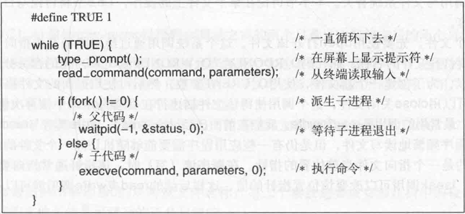

> 图1-19 ー个shell（在本书中,TRUE都被定义为1）

在最一般情形下,execve有三个参数:将要执行的文件名称,ー个指向变量数组的指针,以及ー个指向环境数组的指针。这里对这些参数做ー个简要的说明。各种库例程,包括execl、execv,execle以及execve,允许略掉参数或以各种不同的方式给定。在本书中,我们在所有涉及的地方使用exec描述系统调用。

下面考虑诸如

cp file1 file2

的命令,该命令将file1复制到file2。在shell创建进程之后,该子进程定位和执行文件cp,并将源文件名和目标文件名传递给它。

cp主程序（以及多数其他C程序的主程序）都有声明

main（argc,argv,envp）

其中argc是该命令行内有关参数数目的计数器,包括程序名称。例如,上面的例子中,arge为3。

第二个参数argv是ー个指向数组的指针。该数组的元素i是指向该命令行第i个字符串的指针。在本例中,argv[0]指向字符串“cp"，argv[1]指向字符串“file1",argv[2]指向字符串"file2"。

main的第三个参数envp是ー个指向环境的指针,该环境是ー个数组,含有name=value的赋值形式,用以将诸如终端类型以及根目录等信息传送给程序。还有供程序调用的库过程,用来取得环境变量,这些变量通常用来确定用户希望如何完成特定的任务（例如,使用默认打印机）。在图1-19中,没有环境参数传递给子进程,所以exeeve的第三个参数为0。


> 图1-20 进程有三段:正文段、数据段和堆栈段

如果读者认为exec过于复杂,那么也不要失望。这是在POSIX的全部系统调用中最复杂的ー个（语义上）,其他的都非常简单。作为ー个简单例子,考虑exit,这是在进程完成执行后应执行的系统调用。这个系统调用有一个参数一退出状态（0至255）,该参数通过waitpid系统调用中的statloc返回父进程。

在UNIX中的进程将其存储空间划分为三段:正文段（如程序代码）、数据段（如变量）以及堆栈段。数据向上增长而堆栈向下增长,如图し20所示。夹在中间的是未使用的地址空间。堆栈在需要时自动地向中间增长,不过数据段的扩展是显式地通过系统调用brk进行的,在数据段扩充后,该系统调用指定一个新地址。但是,这个调用不是POSIX标准中定义的,对于存储器的动态分配,鼓励程序员使用malloc库过程,而malloc的内部实现则不是ー个适合标准化的主题,因为几乎没有程序员直接使用它,我们有理由怀疑是否会有人注意到brk实际不是属于POSIX的。

### 1.6.2 用于文件管理的系统调用

许多系统调用与文件系统有关。本小节讨论在单个文件上的操作,163节将讨论与目录和整个文件系统有关的内容。

要读写ー个文件,先要使用。pen打开该文件。这个系统调用通过绝对路径名或指向工作目录的相对路径名指定要打开文件的名称,而代码〇_RDONLY、O_WRONLY或O_RDWR的含义分别是只读、只写或两者都可以。为了创建一个新文件,使用〇\_CREAT参数。然后可使用返回的文件描述符进行读写操作。接着,可以用close关闭文件,这个调用使得该文件描述符在后续的open中被再次使用。

毫无疑问,最常用的调用是read和write。我们在前面已经讨论过read。write具有与read相同的参数。

尽管多数程序频繁地读写文件,但是仍有一些应用程序需要能够随机访问ー个文件的任意部分。与每个文件相关的是ー个指向文件当前位置的指针。在顺序读（写）时,该指针通常指向要读出（写入）的下ー个字节。∣seek调用可以改变该位置指针的值,这样后续的「ead或write调用就可以在文件的任何地方开始。

∣seek有三个参数:第一个是文件的描述符,第二个是文件位置,第三个说明该文件位置是相对于文件起始位置、当前位置还是文件的结尾。在修改了指针之后,∣seek所返回的值是文件中的绝对位置。

UNIX为每个文件保存了该文件的类型（普通文件、特殊文件、目录等）、大小、最后修改时间以及其他信息。程序可以通过stat系统调用査看这些信息。第一个参数指定了要被检査的文件,第二个参数是ー个指针,该指针指向存放这些信息的结构。对于一个打开的文件而言,fstat调用完成同样的工作。

### 1.6.3 用于目录管理的系统调用

本小节我们讨论与目录或整个文件系统有关的某些系统调用,而不是162节中与一个特定文件有关的系统调用。mkdir和rmdir分别用于创建和删除空目录。下ー个调用是link。它的作用是允许同一个文件以两个或多个名称出现,多数情形下是在不同的目录中这样做。它的典型应用是,在同一个开发团队中允许若干个成员共享一个共同的文件,他们每个人都在自己的目录中有该文件,但可能采用的是不同的名称。共享一个文件,与每个团队成员都有一个私用副本并不是同一件事,因为共享文件意味着任何成员所做的修改都立即为其他成员所见一只有一个文件存在。而在复制了一个文件的多个副本之后,对其中一个副本所进行的修改并不会影响到其他的副本。

为了考察link是如何工作的,考虑图1-21a中的情形。有两个用户ast和jim,每个用户都有一些文件的目录。若ast现在执行一个含有系统调用的程序

```
link("/usr∕jim∕memo","usr∕ast∕note"）;
```

jim目录中的文件memo以文件名note进入ast的目录。之后,/usr/jim/memo和/usr/ast/note都引用相同的文件。顺便提及,用户是将目录保存在/usr、/user、/home还是其他地方,完全取决于本地系统管理员。

理解link是如何工作的也许有助于读者看清其作用。在UNIX中，每个文件都有唯一的编号，即i-编号，用以标识文件。该i-编号是对i-节点表格的一个引用，它们一一对应，说明该文件的拥有者、磁盘块的位置等。目录就是一个包含了(i-编号，ASCII名称)对集合的文件。在UNIX的第一个版本中，每个目录项有16字节--2字节用于i-编号，14字节用于名称。现在为了支持长文件名，采用了更复杂的结构，但是，在概念上，目录仍然是(i-编号，ASCII名称)对的一个集合。在图1-21中，mail为i-编号16等等。link所做的只是利用某个已有文件的i-编号，创建一个新目录项(也许用一个新名称)。在图1-21b中两个目录项有相同的i-编号(70)，从而指向同一个文件。如果使用unlink系统调用将其中一个文件移走了，可以保留另一个。如果两个都被移走了，UNIX00看到尚且存在的文件没有目录项(i-节点中的一个域记录着指向该文件的目录项)，就会把该文件从磁盘中移去。

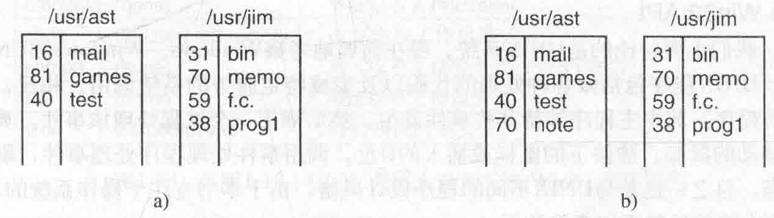

> 图1-21a)将/usr/jim/memo链接到ast日录之前的两个目录;b)链接之后的两个目录

正如我们已经叙述过的，mount系统调用允许将两个文件系统合并成为一个。通常的情形是，在硬盘某个分区中的根文件系统含有常用命令的二进制(可执行)版和其他常用的文件，用户文件在另一个分区。并且，用户可插入包含需要读入的文件的U盘。通过执行mount系统调用，可以将一个USB文件系统添加到根文件系统中，如图1-22所示。完成安装操作的典型C语句为

```
mount("/dev/sdb0","/mnt",0);
```

这里，第一个参数是USB驱动器0的块特殊文件名称，第二个参数是要被安装在树中的位置，第三个参数说明将要安装的文件系统是可读写的还是只读的。

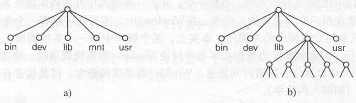

> 图1-22a)安装前的文件系统;b)安装后的文件系统

在mount调用之后，驱动器0上的文件可以使用从根目录开始的路径或工作目录路径，而不用考虑文件在哪个驱动器上。事实上，第二个、第三个以及第四个驱动器也可安装在树上的任何地方。mount调用使得把可移动介质都集中到一个文件层次中成为可能，而不用考虑文件在哪个驱动器上。尽管这是个CD-ROM的例子，但是也可以用同样的方法安装硬盘或者硬盘的一部分(常称为分区或次级设备)，外部硬盘和USB盘也一样。当不再需要一个文件系统时，可以用umount系统调用卸载之。

### 1.6.4 各种系统调用

有各种的系统调用。这里介绍系统调用中的一部分。chdir调用改变当前的工作目录。在调用

```
chdir("/usr/ast/test");
```

之后，打开xyz文件，会打开/usr/asttestxyz。工作目录的概念消除了总是键入(长)绝对路径名的需要。在UNIX中，每个文件有一个保护模式。该模式包括针对所有者、组和其他用户的读一写-执行位。chmod系统调用可以改变文件的模式。例如，要使一个文件对除了所有者之外的用户只读，可以执行

```
chmod("file",0644);
```

kill系统调用供用户或用户进程发送信号用。若一个进程准备好捕捉一个特定的信号，那么，在信号到来时，运行一个信号处理程序。如果该进程没有准备好，那么信号的到来会杀掉该进程(此调用名称的由来)。

POSIX定义了若干处理时间的过程。例如，time以秒为单位返回当前时间，0对应着1970年1月1日午夜(从此日开始，没有结束)。在一台32位字的计算机中，time的最大值是2{32}-1秒(假设是无符号整数)。这个数字对应136年多一点。所以在2106年，32位的UNIX系统会发狂，与2000年对世界计算机造成严重破坏的知名Y2K问题是类似的。如果读者现在有32位UNIX系统，建议在2106年之前的某时刻更换为64位的系统。

1.6.5 Windows Win32 API

到目前为止，我们主要讨论的是UNIX系统。现在简要地考察Windows。Windows和UNIX的主要差别在于编程方式。UNIX程序包括做各种处理的代码以及完成特定服务的系统调用。相反，Windows程序通常是事件驱动程序。其中主程序等待某些事件发生，然后调用一个过程处理该事件。典型的事件包括被敲击的键、移动的鼠标、被按下的鼠标或插入的U盘。调用事件处理程序处理事件，刷新屏幕，并更新内部程序状态。总之，这是与UNIX不同的程序设计风格，由于本书专注于操作系统的功能和结构，这些程序设计方式上的差异就不过多涉及了。

当然，在Windows中也有系统调用。在UNIX中，系统调用(如read)和系统调用所使用的库过程如read)之间几乎是一一对应的关系。换句话说，对于每个系统调用，差不多就涉及一个被调用的库过程，如图1-17所示。此外，POSIX有约100个过程调用。

在Windows中，情况就大不相同了。首先，库调用和实际的系统调用几乎是不对应的。微软定义了一套过程，称为Win32应用编程接口(ApplicationProgramInterface，API)，程序员用这套过程获得操作系统的服务。从Windows95开始的所有Windows版本都(或部分)支持这个接口。由于接口与实际的系统调用不对应，微软保留了随着时间(甚至随着版本到版本)改变实际系统调用的能力，防止已有的程序失效。由于最新几版Windows中有许多过去没有的新调用，所以究竟Win32是由什么构成的，这个问题的答案仍然是含混不清的。在本小节中，Win32表示所有Windows版本都支持的接口。Win32提供各Windows版本的兼容性。

Win32API调用的数量是非常大的，有数千个。此外，尽管其中许多确实涉及系统调用，但有一大批Win32API完全是在用户空间进行的。结果，在Windows中，不可能了解哪一个是系统调用(如由内核完成)，哪一个只是用户空间中的库调用。事实上，某个版本中的一个系统调用，会在另一个不同版本的用户空间中执行，或者相反。当我们在本书中讨论Windows的系统调用时，将使用Win32过程(在合适之处)，这是因为微软保证:随着时间流逝，Win32过程将保持稳定。但是读者有必要记住，它们并不全都是系统调用(即陷入内核中)。

Win32API中有大量的调用，用来管理视窗、几何图形、文本、字体、滚动条、对话框、菜单以及GUI的其他功能。为了使图形子系统在内核中运行(某些Windows版本中确实是这样，但不是所有的版本)，需要系统调用，否则只有库调用。在本书中是否应该讨论这些调用呢?由于它们与操作系统的功能并不相关，我们还是决定不讨论它们，尽管它们会在内核中运行。对Win32API有兴趣的读者应该参阅一些书籍中的有关内容(例如，Hart，1997;Rector和Newcomer，1997;Simon，1997)。我们在这里介绍所有的Win32API，不过这不是我们关心的主要问题，所以做了一些限制，只将那些与图1-18中UNIX系统调用大致对应的Windows调用列在图1-23中。

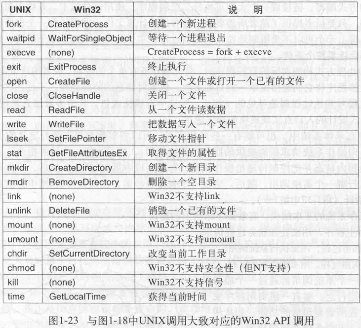

下面简要地说明一下图1-23中的内容。CreateProcess用于创建一个新进程，它把UNIX中的fork和execve结合起来。它有许多参数用来指定新创建进程的性质。Windows中没有类似UNIX中的进程层次，所以不存在父进程和子进程的概念。在进程创建之后，创建者和被创建者是平等的。WaitForSingleObject用于等待一个事件，等待的事件可以是多种可能的事件。如果有参数指定了某个进程，那么调用者等待所指定的进程退出，这通过使用ExitProcess完成。

接下来的6个调用进行文件操作，在功能上和UNIX的对应调用类似，而在参数和细节上是不同的。和UNIX中一样，文件可被打开、关闭和写人。SetFilePointer以及GetFileAttributesEx调用设置文件的位置并取得文件的属性。

Windows中有目录，目录分别用CreateDirectory以及RemoveDirectoryAPI调用创建和删除。也有对当前目录的标记，这可以通过SetCurrentDirectory来设置。使用GetLocalTime可获得当前时间。

Win32接口中没有文件的链接、文件系统的安装、安全属性或信号，所以对应于UNIX中的这些调用就不存在了。当然，Win32中也有大量UNIX中不存在的其他调用，特别是管理GUI的各种调用。在WindowsVista中有了精心设计的安全系统，而且支持文件的链接。Windows7和Windows8也加入了更多特性和系统调用。

也许有必要对Win32做最后的说明。Win32并不是一个非常统一的或一致的接口。其主要原因是Win32需要与早期的在Windows3.x中使用的16位接口向后兼容。

## 1.7 操作系统结构

我们已经分析了操作系统的外部(如程序员接口)，现在是分析其内部的时候了。在下面的小节中，为了对各种可能的方式有所了解，我们将考察已经尝试过的六种不同的结构设计。这样做并没有涵盖各种结构方式，但是至少给出了在实践中已经试验过的一些设计思想。我们将讨论的这六种设计包括单体系统、层次式系统、微内核、客户端一服务器模式、虚拟机和外核等。

### 1.7.1 单体系统

到目前为止，在大多数常见的组织中，整个操作系统在内核态以单一程序的方式运行。整个操作系统以过程集合的方式编写，链接成一个大型可执行二进制程序。使用这种技术，系统中每个过程可以自由调用其他过程，只要后者提供了前者所需要的一些有用的计算工作。调用任何一个你所需要的过程或许会非常高效，但上千个可以不受限制地彼此调用的过程常常导致系统笨拙且难于理解。并且，任何个过程的崩溃都会连累整个系统。

在使用这种处理方式构造实际的目标程序时，首先编译所有单个的过程，或者编译包含过程的文件然后通过系统链接程序将它们链接成单一的目标文件。依靠对信息的隐藏处理，不过在这里实际上是不存在的，每个过程对其他过程都是可见的(相反，构造中有模块或包，其中多数信息隐藏在模块之中而且只能通过正式设计的入口点实现模块的外部调用)。

但是，即使在单体系统中，也可能有一些结构存在。可以将参数放置在良好定义的位置(如)通过这种方式，向操作系统请求所能提供的服务(系统调用)，然后执行一个陷阱指令。这个指令将机器从用户态切换到内核态并把控制传递给操作系统，如图1-17中第6步所示。然后，操作系统取出参数并且确定应该执行哪一个系统调用。随后，它在一个表格中检索，在该表格的k槽中存放着指向执行系统调用k过程的指针(图1-17中第7步)。

对于这类操作系统的基本结构，有着如下结构上的建议:

1)需要一个主程序，用来处理服务过程请求。

2)需要一套服务过程，用来执行系统调用。

3)需要一套实用过程，用来辅助服务过程。

在该模型中，每一个系统调用都通过一个服务过程为其工作并运行之。要有一组实用程序来完成一些服务过程所需要用到的功能，如从用户程序取数据等。可将各种过程划分为一个三层的模型，如图1-24所示。

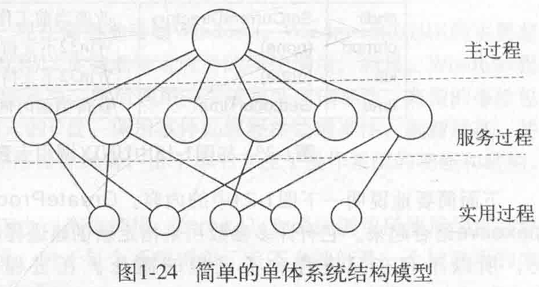

除了在计算机初启时所装载的核心操作系统外，许多操作系统支持可装载的扩展，诸如I/O设备驱动和文件系统。这些部件可以按照需要载入。在UNIX中它们被叫作共享库(sharedlibrary)，在Windows中则被称为动态链接库(DynamicLinkLibrary，DLL)。它们的扩展类型为.dll，在C:\Windows\system32目录下存在1000多个DDL文件。

### 1.7.2 层次式系统

把图1-24中的系统进一步通用化，就变成一个层次式结构的操作系统，它的上层软件都是在下一层软件的基础之上构建的。E.W.Dikstra和他的学生在荷兰的Eindhoven技术学院所开发的THE系统(1968).是按此模型构造的第一个操作系统。THE系统是为荷兰的一种计算机ElectrologicaX8配备的一个简单的批处理系统，其内存只有32K个字，每字27位(那时二进制位是很昂贵的)。

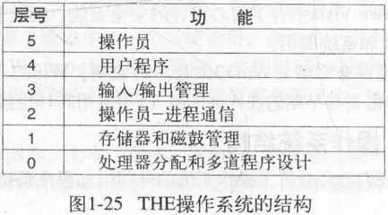

该系统共分为六层，如图1-25所示。处理器分配在第0层中进行，当中断发生或定时器到期时，由该层进行进程切换。在第0层之上，系统由一些连续的进程所组成，编写这些进程时不用再考虑在单处理器上多进程运行的细节。也就是说，在第0层中提供了基本的CPU多道程序设计功能。

内存管理在第1层中进行，它分配进程的主存空间，当内存用完时则在一个512K字的磁鼓上保留进程的一部分(页面)。在第1层上，进程不用考虑它是在磁鼓上还是在内存中运行。第1层软件保证一旦需要访问某一页面，该页面必定已在内存中，并在页面不再需要时将其移出。

第2层处理进程与操作员控制台(即用户)之间的通信。在这层的上部，可以认为每个进程都有自己的操作员控制台。第3层管理IO设备和相关的信息流缓冲区。在第3层上，每个进程都与有良好特性的抽象I/O设备打交道，而不必考虑外部设备的物理细节。第4层是用户程序层。用户程序不用考虑进程内存、控制台或I/O设备管理等细节。系统操作员进程位于第5层中。

在MULTICS系统中采用了更进一步的通用层次化概念。MULTICS由许多的同心环构造而成，而不是采用层次化构造，内环比外环有更高的级别(它们实际上是一样的)。当外环的过程欲调用内环的过程时，它必须执行一条等价于系统调用的TRAP指令。在执行该TRAP指令前，要进行严格的参数合法性检查。在MULTICS中，尽管整个操作系统是各个用户进程的地址空间的一部分，但是硬件仍能对单个过程(实际是内存中的一个段)的读、写和执行进行保护。

实际上，THE分层方案只是为设计提供了一些方便，因为该系统的各个部分最终仍然被链接成了完整的单个目标程序。而在MULTICS里，环形机制在运行中是实际存在的，而且是由硬件实现的。环形机制的一个优点是很容易扩展，可用以构造用户子系统。例如，在一个MULTICS系统中，教授可以写一个程序检查学生编写的程序并给他们打分，在第n个环中运行教授的程序，而在第n+1个环中运行学生的程序，这样学生就无法篡改教授所给出的成绩。

### 1.7.3 微内核

在分层方式中，设计者要确定在哪里划分内核一用户的边界。传统上，所有的层都在内核中，但是这样做没有必要。事实上，尽可能减少内核态中功能的做法更好，因为内核中的错误会快速拖累系统。相反，可以把用户进程设置为具有较小的权限，这样，某个错误的后果就不会是致命的。

有不少研究人员对每千行代码中错误的数量进行了分析(例如，Basili和Perricone，1984;Ostrand和Weyuker，2002)。代码错误的密度取决于模块大小、模块寿命等，不过对一个实际工业系统而言，每千行代码中会有2~10个错误。这意味着在有500万行代码的单体操作系统中，大约有10000~50000个内核错误。当然，并不是所有的错误都是致命的，诸如给出了不正确的故障信息之类的某些错误，实际是很少发生的。无论怎样看，操作系统中充满了错误，所以计算机制造商设置了复位按钮(通常在前面板上)，而电视机、立体音响以及汽车的制造商则不这样做，尽管在这些装置中也有大量的软件。

在微内核设计背后的思想是，为了实现高可靠性，将操作系统划分成小的、良好定义的模块，只有其中一个模块--微内核--运行在内核态,其余的模块由于功能相对弱些，则作为普通用户进程运行。特别地，由于把每个设备驱动和文件系统分别作为普通用户进程，这些模块中的错误虽然会使这些模块崩溃，但是不会使得整个系统死机。所以，音频驱动中的错误会使声音断续或停止，但是不会使整个计算机垮掉。相反，在单体系统中，由于所有的设备驱动都在内核中，一个有故障的音频驱动很容易引起对无效地址的引用，从而造成恼人的系统立即停机。

有许多微内核已经被实现并应用了数十年(Haertig等人，1997;Heiser等人，2006;Herder等人，2006;Hildebrand，1992;Kirsch等人，2005;Liedtke，1993，1995，1996;Pike等人，1992;Zuberi等人，1999)。除了基于Mach微内核(Accetta等人，1986)的OSX外，通常的桌面操作系统并不使用微内核。然而，微内核在实时、工业、航空以及军事应用中特别流行，这些领域都是关键任务，需要有高度的可靠性。知名的微内核有Integrity、K42、L4、PikeOS、QNX、Symbian，以及MINIX3等。这里对MINIX3做一简单的介绍，该操作系统把模块化的思想推到了极致，它将大部分操作系统分解成许多独立的用户态进程。MINIX3遵守POSIX，可在www.minix3.0rg(Giuffrida等人，2012;Giuffrida等人，2013;Herder等人，2006;Herder等人，2009;Hruby等人，2013)站点获得免费的开放源代码。

MINIX3微内核只有12000行C语言代码和1400行用于非常低层次功能的汇编语言代码，诸如捕获中断、进程切换等。C代码管理和调度进程、处理进程间通信(在进程之间传送信息)、提供大约40个内核调用，它们使得操作系统的其余部分可以完成其工作。这些调用完成诸如连接中断句柄、在地址空间中移动数据以及为新创建的进程安装新的内存映像等功能。MINIX3的进程结构如图1-26所示，其中内核调用句柄用Sys标记。时钟设备驱动也在内核中，因为这个驱动与调度器交互密切。所有的其他设备驱动都作为单独的用户进程运行。

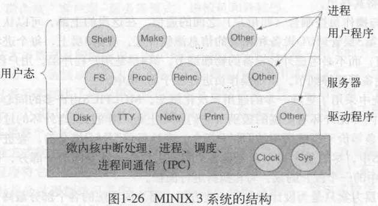

在内核的外部，系统的构造有三层进程，它们都在用户态运行。最底层中包含设备驱动器。由于它们在用户态运行，所以不能物理地访问I0端口空间，也不能直接发出IO命令。相反，为了能够对I0设备编程，驱动器构建了一个结构，指明哪个参数值写到哪个I/O端口，并生成一个内核调用，通知内核完成写操作。这个处理意味着内核可以检查驱动正在对IO的读(或写)是否是得到授权使用的。这样(与单体设计不同)一个有错误的音频驱动器就不能够偶发性地在硬盘上进行写操作。

在驱动器上面是另一用户态层，包含有服务器，它们完成操作系统的多数工作。由一个或多个文件服务器管理着文件系统，进程管理器创建、销毁和管理进程等。通过给服务器发送短消息请求POSIX系统调用的方式，用户程序获得操作系统的服务。例如，一个需要调用read的进程发送一个消息给某个文件服务器，告知它需要读什么内容。

有一个有趣的服务器，称为再生服务器(reincarnationserver)，其任务是检查其他服务器和驱动器的功能是否正确。一旦检查出一个错误，它自动取代之，无须任何用户的干预。这种方式使得系统具有自修复能力，并且获得了较高的可靠性。

系统对每个进程的权限有着许多限制。正如已经提及的，设备驱动器只能与授权的I/O端口接触对内核调用的访问也是按单个进程进行控制的，这是考虑到进程具有向其他多个进程发送消息的能力。进程也可授予有限的许可，让内核的其他进程可访问其地址空间。例如，一个文件系统可以给磁盘驱动器有限的许可，让内核在该文件系统的地址空间内的特定地址上进行对盘块的读入操作。总体来说，所有这些限制是让每个驱动和服务器只拥有完成其工作所需要的权限，这样就极大地限制了故障部件可能造成的危害。

一个与小内核相关联的思想是内核中的机制与策略分离的原则。为了更清晰地说明这一点，我们考虑进程调度。一个比较简单的调度算法是，对每个进程赋予一个优先级，并让内核执行具有最高优先级的进程。这里，机制(在内核中)就是寻找最高优先级的进程并运行之。而策略(赋予进程优先级)可以由用户态中的进程完成。在这种方式中，机制和策略是分离的，从而使系统内核变得更小。

### 1.7.4 客户端一服务器模式

一个微内核思想的略微变体是将进程划分为两类:服务器，每个服务器提供某种服务;客户端，使用这些服务。这个模式就是所谓的客户端一服务器模式。通常，在系统最底层是微内核，但并不是必须这样。这个模式的本质是存在客户端进程和服务器进程。

一般来说，客户端和服务器之间的通信是消息传递。为了获得一个服务，客户端进程构造一段消息说明所需要的服务，并将其发给合适的服务器。该服务器完成工作，发送回应。如果客户端和服务器恰巧运行在同一个机器上，则有可能进行某种优化，但是从概念上看，这里讨论的是消息传递。

这个思想的一个显然的普遍方式是，客户端和服务器运行在不同的计算机上，它们通过局域网或广域网连接，如图1-27所示。由于客户端通过发送消息与服务器通信，客户端并不需要知道这些消息是在本地机器上处理，还是通过网络被送到远程机器上处理。对于客户端而言，这两种情形是一样的:都是发送请求并得到回应。所以，客户端-服务器模式是一种可以应用在单机或者网络机器上的抽象。

越来越多的系统，包括用户家里的PC，都成为客户端，而在某地运行的大型机器则成为服务器事实上，许多Web就是以这个方式运行的。一台PC向某个服务器请求一个Web页面，而后，该Web页面回送。这就是网络中客户端一服务器的典型应用方式。

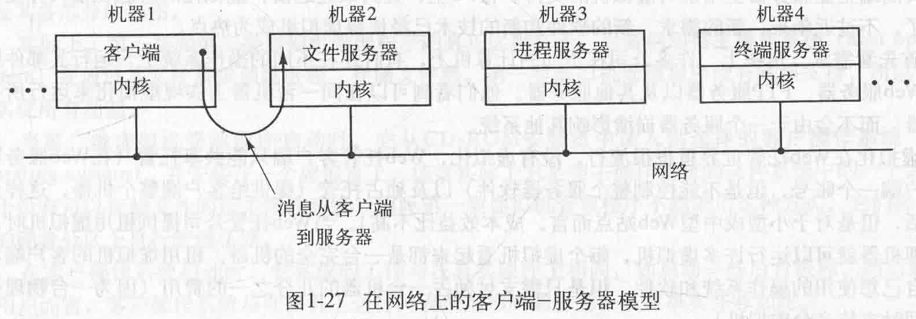

### 1.7.5 虚拟机

OS/360的最早版本是纯粹的批处理系统。然而，有许多360用户希望能够在终端上交互工作，于是IBM公司内外的一些研究小组决定为它编写一个分时系统。后来推出了正式的IBM分时系统TSS/360。但是它非常庞大，运行缓慢，干是在花费了约5000万美元的研制费用后，该系统最后被弃之不用(Graham，1970)。但是在位于麻省剑桥的IBM研究中心开发了另一个完全不同的系统，这个系统最终被IBM用作产品。它的直接后代，称为z/VM，目前在IBM的大型机上广泛使用，zSeries则在大型公司的数据中心广泛使用，例如，作为电子商务服务器，它们每秒可以处理成百上千个事务，并使用规模达数百万GB的数据库。

#### 1.VM/370

这个系统最初被命名为CP/CMS，后来改名为VM/370(Seawright和MacKinnon，1979)。它是源于如下机敏的观察，即分时系统应该提供这些功能:(1)多道程序，(2)一个比裸机更方便的、有扩展界面的计算机。VM/370存在的目的是将二者彻底地隔离开来。

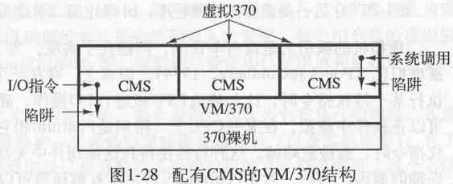

这个系统的核心称为虚拟机监控程序(virtual machine monitor)，它在裸机上运行并且具备了多道程序功能。该系统向上层提供了若干台虚拟机，如图1-28所示。它不同于其他操作系统的地方是:这些虚拟机不是那种具有文件等优良特征的扩展计算机。与之相反，它们仅仅是裸机硬件的精确复制品。这个复制品包含了内核态/用户态、I/0功能、中断及其他真实硬件所应该具有的全部内容。

由于每台虚拟机都与裸机相同，所以在每台虚拟机上都可以运行一台裸机所能够运行的任何类型的操作系统。不同的虚拟机可以运行不同的操作系统，而且实际上往往就是如此。在早期的VM/370系统上，有一些系统运行OS/360或者其他大型批处理或事务处理操作系统，而另一些虚拟机运行单用户、交互式系统供分时用户使用，这个系统称为会话监控系统(ConversationalMonitorSystem，CMS)。后者在程序员中很流行。

当一个CMS程序执行系统调用时，该调用被陷入到其虚拟机的操作系统上，而不是VM370上，似平它运行在实际的机器上，而不是在虚拟机上。CMS然后发出普通的硬件IO指令读出虚拟磁盘或其他需要执行的调用。这些I/O指令由VM/370陷入，然后，作为对实际硬件模拟的一部分，VM/370完成指令通过对多道程序功能和提供扩展机器二者的完全分离，每个部分都变得非常简单、非常灵活且容易维护。

虚拟机的现代化身z/VM通常用于运行多个完整的操作系统，而不是简化成如CMS一样的单用户系例如，zSeries有能力与传统的IBM操作系统一起，运行一个或多个Linux虚拟机。

#### 2.虚拟机的再次发现

IBM拥有虚拟机产品已经有40年了，而少数公司，包括Oracle公司和Hewlett-Packard公司等，近来也在其高端企业服务器上增加对虚拟机的支持，在PC上，直到最近之前，虚拟化的思想在很大程度上被忽略了。不过近年来，新的需求、新的软件和新的技术已经使得虚拟机成为热点。

首先看需求。传统上，许多公司在不同的计算机上，有时还在不同的操作系统上，运行其邮件服务器、Web服务器、FTP服务器以及其他服务器。他们看到可以在同一台机器上实现虚拟化来运行所有的服务器，而不会由于一个服务器崩溃影响其他系统。

虚拟化在Web托管世界里也很流行。没有虚拟化，Web托管客户端只能共享托管(在Web服务器上给客户端一个账号，但是不能控制整个服务器软件)以及独占托管(提供给客户端整个机器，这样虽然很灵活，但是对于小型或中型Web站点而言，成本效益比不高)。当Web托管公司提供租用虚拟机时，一台物理机器就可以运行许多虚拟机，每个虚拟机看起来都是一台完全的机器。租用虚拟机的客户端可以运行自己想使用的操作系统和软件，但是只需支付独占一台机器的几分之一的费用(因为一台物理机器可以同时支持多台虚拟机)。

虚拟化的另外一个用途是，为希望同时运行两个或多个操作系统(比如Windows和Limnux)的最终用户服务，某个偏好的应用程序可运行在一个操作系统上，而其他的应用程序可运行在另一个操作系统上。如图129a所示，在这里术语“虚拟机监控程序”已经被重命名为第一类虚拟机管理程序(type1hypervisor)后者现在更常用，因为输入前者的英文“virtual machine monitor”超出了人们所能接受的按键次数。

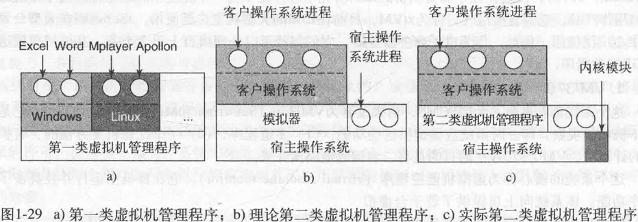

虚拟机的吸引力是没有争议的，问题在于实现。为了在一台计算机上运行虚拟机软件，其CPU必须被虚拟化(Popek和Goldberg，1974)。简言之，存在一个问题。当运行虚拟机(在用户态)的操作系统执行某个特权指令时，比如修改PSW或进行IO操作，硬件实际上陷入到了虚拟机中，这样有关指令就可以在软件中模拟。在某些CPU上(特别是Pentium和它的后继者及其克隆版中)试图在用户态执行特权指令时，会被忽略掉。这种特性使得在这类硬件中无法实现虚拟机，这也解释了PC世界对虚拟机不感兴趣的原因。当然，对于Pentium而言，还有解释器可以运行在Pentium上，例如Bochs但是其性能丧失了1~2数量级，这样对于要求高的工作来说就没有意义了。

由于20世纪90年代和本世纪这些年来若于学术研究小组的努力，特别是斯坦福大学的Disco(Bugnion等人，1997)和剑桥大学的Xen(Barham等人，2003)实现了商业化产品(例如VMware工作站和Xen)，使得人们对虚拟机的热情得以复燃。除了VMware和Xen外，现在流行的虚拟机管理程序还有KVM(针对Linux内核)、Oracle公司的VirtualBox以及微软公司的Hyper-V。

一些早期研究项目通过即时翻译大块代码、将其存储到内部高速缓存并在其再次执行时复用的方式，提高了Bochs等翻译器的性能。这种手段大幅提高了性能，也推动了模拟器(machine simulator)的出现，如图1-29b所示。这项被称为二进制翻译(binarytranslation)的技术对性能的提升有所帮助，不过生成的系统虽然优秀到足以在学术会议上发表论文，但仍没有快到可以在极其注重性能的商业环境下使用。

改善性能的下一步在于添加分担重担的内核模块，如图1-29c所示。事实上，现在所有商业可用的虎拟机管理程序都使用这种混合策略(并且也有很多其他改进)，如VMware工作站。它们被称为第二类虚拟机管理程序，本书中我们也延续使用这个名称(虽然有些不太情愿)，即使我们更愿意用类型1.7虚拟机管理程序来反映它们并不完全是用户态程序。在第7章中，我们将详细描述VMware工作站的工作原理及其各部分的作用。

实际上，第一类和第二类虚拟机管理程序的真正区别在于，后者利用宿主操作系统(hostoperatingsystem)并通过其文件系统创建进程、存储文件等。第一类虚拟机管理程序没有底层支持，所以必须自行实现所有功能。

当第二类虚拟机管理程序启动时，它从CD-ROM安装盘中读入供选择的客户操作系统(guesoperatingsystem)，并安装在一个虚拟盘上，该盘实际上只是宿主操作系统的文件系统中的一个大文件。由于没有可以存储文件的宿主操作系统，因此第一类虚拟机管理程序不能采用这种方式。它们必须在原始的硬盘分区上自行管理存储。

在客户操作系统启动时，它完成的工作与在真实硬件上相同，如启动一些后台进程，然后是GUI对用户而言，客户操作系统与在裸机上运行时表现出相同的行为，虽然事实并非如此。

处理控制指令的一种不同方式是，修改操作系统，删掉它们。这种方式不是真正的虚拟化，而是半虚拟化(paravirtualization)。我们将在第7章具体讨论虚拟化。

#### 3.Java虚拟机

另一个使用虚拟机的领域，是为了运行Java程序，但方式有些不同。在Sun公司发明Java程序设计语言时，也同时发明了称为JVM(JavaVirtualMachine)的虚拟机(一种体系结构)。Java编译器为IVM生成代码，这些代码以后可以由一个软件IM解释器执行。这种处理方式的优点在于，IVM代码可以通过Internet传送到任何有JVM解释器的计算机上，并在该机器上执行。举例来说，如果编译器生成了SPARC或Pentium二进制代码，这种代码不可能轻易地送到任何地方并执行。(当然，Su可以生产一种生成SPARC二进制代码的编译器，并且发布一种SPARC解释器，但是IVM具有非常简单的、只需要解释的体系结构。)使用JVM的另一种优点是，如果解释器正确地完成，并不意味着就结束了，还要对所输入的IVM进行安全性检查然后在一种保护环境下执行，这样，这些程序就不能偷窃数据或进行其他任何有害的操作。

### 1.7.6 外核

与虚拟机克隆真实机器不同，另一种策略是对机器进行分区，换句话说，给每个用户整个资源的一个子集。这样，某个虚拟机可能得到磁盘的0至1023盘块，而另一台虚拟机会得到1024至2047盘块，等等。

在底层中，一种称为外核(exokernel，Engler等人，1995)的程序在内核态运行。它的任务是为虚拟机分配资源，并检查使用这些资源的企图，以确保没有机器会使用他人的资源。每个用户层的虚拟机可以运行自己的操作系统，如VM/370和Pentium虚拟8086等，但限制只能使用已经申请并且获得分配的那部分资源。

外核机制的优点是，它减少了映像层。在其他的设计中，每个虚拟机都认为它有自己的磁盘，其盘块号从0到最大编号，这样虚拟机监控程序必须维护一张表格以重映像磁盘地址(以及其他资源)。有了外核，这个重映像处理就不需要了。外核只需要记录已经分配给各个虚拟机的有关资源即可。这个方法还有一个优点，它将多道程序(在外核内)与用户操作系统代码(在用户空间内)加以分离，而且相应负载并不重，这是因为外核所做的只是保持多个虚拟机彼此不发生冲突。

## 1.8 依靠C的世界

操作系统通常是由许多程序员写成的，包括很多部分的大型C(有时是C++)程序。用于开发操作系统的环境，与个人(如学生)用于编写小型Java程序的环境是非常不同的。本节试图为那些有时编写Java或者Python程序的程序员简要地介绍编写操作系统的环境。

### 1.8.1 C语言

这里不是C语言的指南，而是简要介绍C与类Python语言特别是Java之间的关键差别。Java是基于C的，所以两者之间有许多类似之处。Python有一点不同，但仍然十分相似。为方便起见，我们将注意力放在Java上。Java、Python和C都是命令式的语言，例如，有数据类型、变量和控制语句等。在C中基本数据类型是整数(包括短整数和长整数)、字符和浮点数等。使用数组、结构体和联合，可以构造组合数据类型。C语言中的控制语句与Java类似，包括if、switch、for以及while等语句。在这两个语言中函数和参数大致相同。

一项C语言中有而Java和Python中没有的特点是显式指针(explicitpointer)。指针是一种指向(即包含对象的地址)一个变量或数据结构的变量。考虑下面的语句:

```cpp
char c1，c2,*p;
c1='C';
p=&c1;
C2=*p;
```

这些语句声明c1和c2是字符变量，而p是指向一个字符的变量(即包含字符的地址)。第一个赋值语句将字符c的ASCII代码存到变量c1中。第二个语句将c1的地址赋给指针变量p。第三个语句将由p指向变量的内容赋给变量c2，这样，在这些语句执行之后，c2也含有c的ASCII代码。在理论上，指针是输入类型所以不能将浮点数地址赋给一个字符指针，但是在实践中，编译器接受这种赋值，尽管有时给出一个警告。指针是一种非常强大的结构，但是如果不仔细使用，也会是造成大量错误的一个原因。

C语言中没有包括内建字符串、线程、包、类、对象、类型安全(typesafety)以及垃圾回收(garbage collection)等。最后一个是操作系统的“淋浴器塞子”。在C中分配的存储空间或者是静态的，或者是程序员明确分配和释放的，通常使用malloc以及free库函数。正是由于后面这个性质---由程序员控制所有内存--而且是用明确的指针，使得C语言对编写操作系统而言非常有吸引力。从一定程度上来说操作系统实际上是个实时系统，甚至通用系统也是实时系统。当中断发生时，操作系统可能只有若干微秒去完成特定的操作，否则就会丢失关键的信息。在任意时刻启动垃圾回收功能是不可接受的。

### 1.8.2 头文件

一个操作系统项目通常包括多个目录，每个目录都含有许多.c文件，这些文件中存有系统某个部分的代码，而一些上头文件则包含供一个或多个代码文件使用的声明以及定义。头文件还可以包括简单的宏，如

```
#define BUFFERSIZE 4096
```

宏允许程序员命名常数，这样代码中出现的BUFFER_SIZE在编译时就被数值4096所替代。良好的C程序设计实践是命名除了0，1和-1之外的所有常数，有时甚至也命名这三个数。宏可以附带参数，例如

```
#define max(a,b)(a>b?a:b)
```

这个宏允许程序员编写

```
i=max(j，k+1)
```

从而得到

```
i=(j>k+1?j:k+1)
```

将j与k+1之间的较大者存储在i中。头文件还可以包含条件编译，例如

```
#ifdef X86
intel_int_ack();
#endif
```

如果宏x86有定义，而不是其他，则编译进对intel_int_ack函数的调用。为了分隔与结构有关的代码，大量使用了条件编译，这样只有当系统在x86上编译时，一些特定的代码才会被插入，其他的代码仅当系统在SPARC等机器上编译时才会插入。通过使用#include指令，一个,c文件体可以含有零个或多个头文件。

### 1.8.3 大型编程项目

为了构建操作系统，每个.c被C编译器编译成一个目标文件。目标文件使用后缀.0，含有目标机器的二进制代码。随后它们可以直接在CPU上运行。在C的世界里，没有类似于Java字节代码的东西。

C编译器的第一道称为C预处理器。在它读入每个.c文件时，每当遇到一个#include指令，就取来该名称的头文件，并加以处理、扩展宏、处理条件编译(以及其他事务)，然后将结果传递给编译器的下一道，仿佛它们原先就包含在该文件中一样。

由于操作系统非常大(500万行代码是很寻常的)，每当文件修改后就重新编译是无法忍受的。另一方面，改变了用在成千上万个文件中的一个关键头文件，确实需要重新编译这些文件。没有一定的协助要想记录哪个目标文件与哪个头文件相关是完全不可行的。

幸运的是，计算机非常善于处理事物分类。在UNIX系统中，有个名为make的程序(其大量的变体如gmake、pmake等)，它读入Makefile，该Makefle说明哪个文件与哪个文件相关。make的作用是，在构建探作系统二进制码时，检查此刻需要哪个目标文件，而且对于每个文件，检查自从上次目标文件创建之后是否有任何它依赖的文件(代码和头文件)已经被修改了。如果有，目标文件需要重新编译。在make确定了哪个.0文件需要重新编译之后，它调用C编译器重新编译这些文件，这样，就把编译的次数降到最低限度在大型项目中，创建Makefle是一件容易出错的工作，所以出现了一些工具使该工作能够自动完成。

一旦所有的.o文件就绪，这些文件被传递给称为linker的程序，将其组合成一个可执行的二进制文件。此时，任何被调用的库函数都已经包含在内，函数之间的引用都已经解决，而机器地址也都按需要分配完毕。在linker完成之后，得到一个可执行程序，在UNIX中传统上称为a.out文件。这个过程中的名个部分如图1-30所示，图中的程序包含三个C文件和两个头文件。这里虽然讨论的是有关操作系统的开发，但是所有内容对开发任何大型程序而言都是适用的。

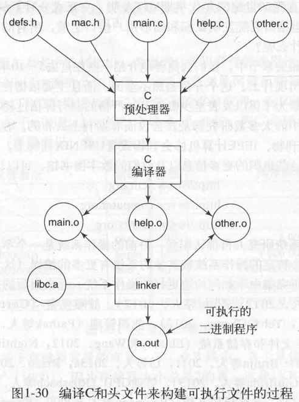

### 1.8.4 运行模型

在操作系统二进制代码链接完成后，计算机就可以重新启动，新的操作系统开始运行。一旦运行，系统会动态调入那些没有静态包括在二进制代码中的模块，如设备驱动和文件系统。在运行过程中，操作系统可能由若干段组成，有文本段(程序代码)、数据段和堆栈段。文本段通常是不可改变的，在运行过程中不可修改。数据段开始时有一定的大小，并用确定的值进行初始化，但是随后就被修改了，其大小随需要增长。堆栈段被初始化为空，但是随着对函数的调用和从函数返回，堆栈段时时刻刻在增长和缩小。通常文本段放置在接近内存底部的位置，数据段在其上面，这样可以向上增长。而堆栈段处于高位的虚拟地址，具有向下增长的能力，不过不同系统的工作方式各有差别。

在所有情形下，操作系统代码都是直接在硬件上执行的，不用解释器，也不是即时编译，如Java通常做的那样。

## 1.9 有关操作系统的研究

计算机科学是快速发展的领域，很难预测其下一步的发展方向。大学和产业研究实验室中的研究人员始终在思考新的思想，这些新思想中的某些内容并没有什么用处，但是有些新思想会成为未来产品的基石，并对产业界和用户产生广泛的影响。当然，事后解说要比当时说明容易得多。将小麦从稗子中分离出来是非常困难的，因为一种思想从出现到形成影响常常需要20~30年。

例如，当艾森豪威尔总统在1958年建立国防部高级研究计划署(ARPA)时，他试图通过五角大楼的研究预算来削弱海军和空军并维护陆军的地位。他并不是想要发明Internet。但是ARPA做的一件事是给予一些大学资助，用以研究模糊不清的包交换概念，这个研究很快导致了第一个实验性的包交换网的建立，即ARPANET。该网在1969年启用。没有多久，其他被ARPA资助的研究网络也连接到ARPANET上，于是Internet诞生了。Internet“愉快地”为学术研究人员互相发送了20年的电子邮件到了20世纪90年代早期，TimBerners-Lee在日内瓦的CERN研究所发明了万维网(World Wide Web)而MarcAndreesen在伊利诺伊大学为万维网写了一个图形浏览器。突然，Internet上充满了年轻人的聊天活动。

对操作系统的研究也导致了实际操作系统的戏剧性变化。正如我们较早所讨论的，第一代商用计算机系统都是批处理系统，直到20世纪60年代早期MIT发明了交互式分时系统为止。20世纪60年代后期，即在DougEngelbart于斯坦福研究院发明鼠标和图形用户接口之前，所有的计算机都是基于文本的。有谁知道下一个发明将会是什么呢?

在本节和本书的其他相关章节中，我们会简要地介绍一些在过去5~10年中操作系统的研究工作，这是为了让读者了解可能会出现什么。这个介绍当然不全面，而且主要依据在高水平的期刊和会议上已经发表的文章，因为这些文章为了得以发表至少需要经过严格的同行评估过程。值得注意的是，相对于其他科学领域，计算机科学中的大多数研究都是在会议而非期刊上公布的。在有关研究内容一节中所引用的多数文章，发表在ACM刊物、IEEE计算机协会刊物或者USENIX刊物上，并对这些组织的(学生)成员在Internet上开放。有关这些组织的更多信息以及它们的数字图书馆，可以访问:

- ACM http://www.acm.org
- IEEE计算机协会 http://www.computer.org
- USENIX http://www.usenix.org

实际上，所有的操作系统研究人员都认识到，目前的操作系统是一个不灵活、不可靠、不安全和带有错误的大系统，而且某个特定的操作系统较其他的系统有更多的错误(这里略去了名称以避免责任)。所带来的结果是，大量的研究集中于如何构造更好的操作系统。近来出版的文献有如下一些:关于错误和调试(Renzelmann等人，2012:Zhou等人，2012)，故障恢复(Correia等人，2012;Ma等人2013;0ngaro等人，2011;Yeh和Cheng，2012)，能源管理(Pathak等人，2012;Petrucci和Logues2012:Shen等人，2013)，文件和存储系统(EInably和Wang，2012:Nightingale等人，2012:Zhang等人，2013a)，高性能I/0(DeBruijn等人，2011;Li等人，2013a;Rizz0，2012)，超线程与多线程(Li等人，2011)，在线更新(Giuffrida等人，2013)，管理GPU(Rossbach等人，2011)，内存管理(Jantz等人，2013;Jeong等人，2013)，多核操作系统(Baumann等人，2009;Kapritsos，2012;Lachaize等人，2012;Wentzlaff等人，2012)，操作系统正确性(Elphinstone等人，2007;Yang等人，2006;Klein等人2009)，操作系统可靠性(Hruby等人，2012;Ryzhyk等人，2009，2011;Zheng等人，2012)，隐私与安全(Dunn等人，2012;Giuffrida等人，2012;Li等人，2013b;Lorch等人，2013;0rtolani和Crispo，2012:Slowinska等人，2012;dranath等人，2012)，虚拟化(Agesen等人，2012;Ben-Yehuda等人，2010;Colp等人，2011;Dai等人，2013;Tarasov等人，2013;Wiliams等人，2012)。

## 1.10 本书其他部分概要

我们已经叙述完毕引论，并且描绘了操作系统的图景。现在是进入具体细节的时候了。正如前面已经叙述的，从程序员的观点来看，操作系统的基本目的是提供一些关键的抽象，其中最重要的是进程和线程、地址空间以及文件。所以后面三章都是有关这些关键主题的。

第2章讨论进程与线程，包括它们的性质以及它们之间如何通信。这一章还给出了大量关于进程间如何通信的例子以及如何避免某些错误。

第3章具体讨论地址空间以及内存管理，讨论虚拟内存等重要课题，以及相关的概念，如页处理和分段等。

第4章里，我们会讨论有关文件系统的所有重要内容。在某种程度上，用户看到的是大量文件系统我们将研究文件系统接口和文件系统的实现。

输入/输出是第5章的内容。这一章介绍设备独立性和设备依赖性的概念，将以若干重要的设备(包括磁盘、键盘以及显示设备)为例进行讲解。

第6章讨论死锁。在这一章中我们概要地说明什么是死锁，还讨论避免死锁的方法。

到此，我们完成了对单CPU操作系统基本原理的学习。不过，还有更多的高级内容要叙述。在第7章里，我们将考察虚拟化，其中既会讨论原则，又将详细讨论一些现存的虚拟化方案。另一个高级课题是多处理机系统，包括多处理器、并行计算机以及分布式系统。这些内容放在第8章中讨论。

有一个非常重要的主题就是操作系统安全，它是第9章的内容。在这一章中讨论的内容涉及威胁(例如，病毒和蠕虫)、保护机制以及安全模型。

随后，我们安排了一些实际操作系统的案例。它们是:UNIX、Linux和Android(第10章)Windows8(第11章)。本书以第12章关于操作系统设计的一些思考作为结束。

## 1.11 公制单位

为了避免混乱，有必要在本书中特别指出，考虑到计算机科学的通用性，所以我们采用公制来代替传统的英制。在图1-31中列出了主要的公制前缀。前缀是英文单词前面字母的缩写，凡是单位大于1的首字母均大写。这样，一个1TB的数据库占据了10{12}字节的存储空间，而100psec(或100ps)的时钟每隔10(-10)s的时间滴答一次。由于milli和micro均以字母“m”开头，所以必须对两者做出区分。通常，用“m”表示milli，而用“μ”(希腊字母)表示micro。

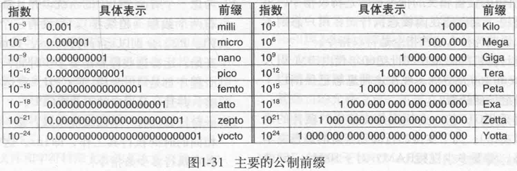

这里需要说明的还有关于存储器容量的度量，在工业实践中，各个单位的含义稍有不同。这里Kilo表示2(-10-)(1024)而不是10(-3-)(1000)，因为存储器大小总是2的幂。这样1KB存储器就有1024个字节，而不是1000个字节。类似地，1MB存储器有22(-20-)(1048576)个字节，1GB存储器有2(-30-)(1073741824)个字节。但是，1Kb/s的通信线路每秒传送1000个位，而10Mb/s的局域网在10000000位/秒的速率上运行，因为这里的速率不是2的幂。很不幸，许多人倾向于将这两个系统混淆，特别是混淆关于磁盘容量的度量。在本书中，为了避免含糊，我们使用KB、MB和GB分别表示2(-10-)字节、22(-20-)字节和23(-30-)字节，而用符号Kb/s、Mb/s和Gb/s分别表示10(-3-)b/s、10(-6-)b/s和10(-9-)b/s。

## 1.12 小结

考察操作系统有两种观点:资源管理观点和扩展的机器观点。在资源管理观点中，操作系统的任务是有效地管理系统的各个部分。在扩展的机器观点中，系统的任务是为用户提供比实际机器更便于运用的抽象。这些抽象包括进程、地址空间以及文件。

操作系统的历史很长，从操作系统开始替代操作人员的那天开始到现代多道程序系统，主要包括早期批处理系统、多道程序系统以及个人计算机系统。

由于操作系统同硬件的交互密切，掌握一些硬件知识对于理解它们是有益的。计算机由处理器、存储器以及I/O设备组成。这些部件通过总线连接。

所有操作系统构建所依赖的基本概念是进程、存储管理、I/O管理、文件管理和安全。这些内容都将在后续用一章来讲述。

任何操作系统的核心是它可处理的系统调用集。这些系统调用真实地说明了操作系统所做的工作。对于UNIX，我们已经考察了四组系统调用。第一组系统调用同进程的创建和终止有关;第二组用于读写文件;第三组用于目录管理;第四组包括各种杂项调用。

操作系统构建方式有多种。最常见的有单体系统、层次化系统、微内核系统、客户端-服务器系统虚拟机系统和外核系统。


# 第二章 进程与线程

从本章开始，我们将深入考察操作系统是如何设计和构造的。操作系统中最核心的概念是进程:这是对正在运行程序的一个抽象。操作系统的其他所有内容都是围绕着进程的概念展开的，所以，让操作系统的设计者(及学生)尽快并透彻地理解进程是非常重要的。

进程是操作系统提供的最古老的也是最重要的抽象概念之一。即使可以使用的CPU只有一个但它们也具有支持(伪)并发操作的能力，它们将一个单独的CPU变换成多个虚拟的CPU。没有进程的抽象，现代计算将不复存在。本章会通过大量的细节去探究进程，以及它们的第一个亲戚-线程。

## 2.1 进程

所有现代的计算机经常会在同一时间做许多件事。习惯于在个人计算机上工作的人们也许不会十分注意这个事实，因此列举一些例子可以更清楚地说明这一问题。先考虑一个网络服务器，一些网页请求从各处进入。当一个请求进入时，服务器检查其需要的网页是否在缓存中。如果是，则把网页发送回去，如果不是，则启动一个磁盘请求以获取网页。然而，从CPU的角度来看，磁盘请求需要漫长的时间当等待磁盘请求完成时，其他更多的请求将会进入。如果有多个磁盘存在，可以在满足第一个请求之前就接二连三地对其他的磁盘发出部分或全部请求。很明显，需要一些方法去模拟并控制这种并发。进程(特别是线程)在这里就可以发挥作用。

现在考虑只有一个用户的PC。一般用户不知道，当启动系统时，会秘密启动许多进程。例如，启动一个进程用来等待进入的电子邮件;或者启动另一个防病毒进程周期性地检查是否有病毒库更新。另外，某个用户进程可能会在所有用户上网的时候打印文件以及刻录CD-ROM。这些活动都需要管理，于是一个支持多进程的多道程序系统在这里就显得很有用了。

在任何多道程序设计系统中，CPU由一个进程快速切换至另一个进程，使每个进程各运行几十或几百毫秒。严格地说，在某一个瞬间，CPU只能运行一个进程。但在1秒钟内，它可能运行多个进程，这样就产生并行的错觉。有时人们所说的伪并行就是指这种情形，以此来区分多处理器系统(该系统有两个或多个CPU共享同一个物理内存)的真正硬件并行。人们很难对多个并行活动进行跟踪，因此，经过多年的努力，操作系统的设计者开发了用于描述并行的一种概念模型(顺序进程)，使得并行更容易处理。有关该模型、它的使用以及它的影响正是本章的主题。

### 2.1.1 进程模型

在进程模型中，计算机上所有可运行的软件，通常也包括操作系统，被组织成若干顺序进程(sequentialprocess)，简称进程(process)。一个进程就是一个正在执行程序的实例，包括程序计数器寄存器和变量的当前值。从概念上说，每个进程拥有它自己的虚拟CPU。当然，实际上真正的CPU在名进程之间来回切换。但为了理解这种系统，考虑在(伪)并行情况下运行的进程集，要比试图跟踪CPU如何在程序间来回切换简单得多。正如在第1章所看到的，这种快速的切换称作多道程序设计。

在图2-1a中可以看到，在一台多道程序计算机的内存中有4道程序。在图2-1b中，这4道程序被抽象为4个各自拥有自己控制流程(即每个程序自己的逻辑程序计数器)的进程，并且每个程序都独立地运行。当然，实际上只有一个物理程序计数器，所以在每个程序运行时，它的逻辑程序计数器被装入实际的程序计数器中。当该程序执行结束(或暂停执行)时，物理程序计数器被保存在内存中该进程的逻辑程序计数器中。在图2-1c中可以看到，在观察足够长的一段时间后，所有的进程都运行了，但在任何一个给定的瞬间仅有一个进程真正在运行。

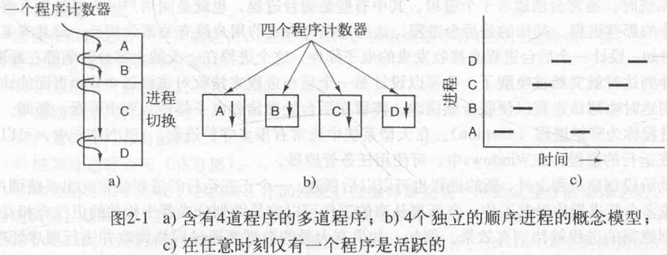

在本章，我们假设只有一个CPU。当然，逐渐这个假设就不为真了，因为新的芯片经常是多核的，包含2个、4个或更多的CPU。第8章将会介绍多核芯片以及多处理器，但是现在，一次只考虑一个CPU会更简单一些。因此，当我们说一个CPU只能真正一次运行一个进程的时候，即使有2个核(或CPU)每一个核也只能一次运行一个进程。

由于CPU在各进程之间来回快速切换，所以每个进程执行其运算的速度是不确定的。而且当同一进程再次运行时，其运算速度通常也不可再现。所以，在对进程编程时决不能对时序做任何想当然的假设。例如，考虑一个IO进程，它用流式磁带机恢复备份的文件，它执行一个10000次的空循环以等待磁带机达到正常速度，然后发出命令读取第一个记录。如果CPÙ决定在空循环期间切换到其他进程，则磁带机进程可能在第一条记录通过磁头之后还未被再次运行。当一个进程具有此类严格的实时要求时，也就是一些特定事件一定要在所指定的若干毫秒内发生，那么必须采取特殊措施以保证它们一定在这段时间中发生。然而，通常大多数进程并不受CPU多道程序设计或其他进程相对速度的影响。

进程和程序间的区别是很微妙的，但非常重要。用一个比喻可以更容易理解这一点。想象一位有一手好厨艺的计算机科学家正在为他的女儿烘制生日蛋糕。他有做生日蛋糕的食谱，厨房里有所需的原料:面粉、鸡蛋、糖、香草汁等。在这个比喻中，做蛋糕的食谱就是程序(即用适当形式描述的算法)，计算机科学家就是处理器(CPU)，而做蛋糕的各种原料就是输入数据。进程就是厨师阅读食谱、取来各种原料以及烘制蛋糕等一系列动作的总和。

现在假设计算机科学家的儿子哭着跑了进来，说他的头被一只蜜蜂蛰了。计算机科学家就记录下他照着食谱做到哪儿了(保存进程的当前状态)，然后拿出一本急救手册，按照其中的指示处理蛰伤。

这里，处理机从一个进程(做蛋糕)切换到另一个高优先级的进程(实施医疗救治)，每个进程拥有各自的程序(食谱和急救手册)。当蜜蜂蛰伤处理完之后，这位计算机科学家又回来做蛋糕，从他离开时的那一步继续做下去。

这里的关键思想是:一个进程是某种类型的一个活动，它有程序、输入、输出以及状态。单个处理器可以被若干进程共享，它使用某种调度算法决定何时停止一个进程的工作，并转而为另一个进程提供服务。

值得注意的是，如果一个程序运行了两遍，则算作两个进程。例如，人们可能经常两次启动同一个字处理软件，或在有两个可用的打印机的情况下同时打印两个文件。像“两个进程恰好运行同一个程序”这样的事实其实无关紧要，因为它们是不同的进程。操作系统能够使它们共享代码，因此只有一个副本放在内存中，但那只是一个技术性的细节，不会改变有两个进程正在运行的概念。

### 2.1.2 进程的创建

操作系统需要有一种方式来创建进程。一些非常简单的系统，即那种只为运行一个应用程序设计的系统(例如，微波炉中的控制器)，可能在系统启动之时，以后所需要的所有进程都已存在。然而，在通用系统中，需要有某种方法在运行时按需要创建或撤销进程，现在开始考察这个问题。

4种主要事件会导致进程的创建:

1)系统初始化。

2)正在运行的程序执行了创建进程的系统调用

3)用户请求创建一个新进程。

4)一个批处理作业的初始化。

启动操作系统时，通常会创建若干个进程。其中有些是前台进程，也就是同用户（人类）交互并且替他们完成工作的那些进程。其他的是后台进程，这些进程与特定的用户没有关系，相反，却具有某些专门的功能。例如，设计一个后台进程来接收发来的电子邮件，这个进程在一天的大部分时间都在睡眠，但是当电子邮件到达时就突然被唤醒了。也可以设计另一个后台进程来接收对该机器中Web页面的访问请求，在请求到达时唤醒该进程以便服务该请求。停留在后台处理诸如电子邮件、Web页面、新闻、打印之类活动的进程称为守护进程（daemon）。在大型系统中通常有很多守护进程。在UNIX中，可以用ps程序列出正在运行的进程，在Windows中，可使用任务管理器。

除了在启动阶段创建进程之外，新的进程也可以以后创建。一个正在运行的进程经常发出系统调用，以便创建一个或多个新进程协助其工作。在所要从事的工作可以容易地划分成若干相关的但没有相互作用的进程时，创建新的进程就特别有效果。例如，如果有大量的数据要通过网络调取并进行顺序处理，那么创建一个进程取数据，并把数据放入共享缓冲区中，而让第二个进程取走数据项并处理之，应该比较容易。在多处理机中，让每个进程在不同的CPU上运行会使整个作业运行得更快。

在交互式系统中，键人一个命令或者点（双）击一个图标就可以启动一个程序。这两个动作中的任何一个都会开始一个新的进程，并在其中运行所选择的程序。在基于命令行的UNIX系统中运行程序X，新的进程会从该进程接管开启它的窗口。在MicrosoftWindows中，多数情形都是这样的，在一个进程开始时，它并没有窗口，但是它可以创建一个（或多个）窗口。在UNIX和Windows系统中，用户可以同时打开多个窗口，每个窗口都运行一个进程。通过鼠标用户可以选择一个窗口并且与该进程交互，例如，在需要时提供输入。

最后一种创建进程的情形仅在大型机的批处理系统中应用。用户在这种系统中（可能是远程地）提交批处理作业。在操作系统认为有资源可运行另一个作业时，它创建一个新的进程，并运行其输入队列中的下一个作业。

从技术上看，在所有这些情形中，新进程都是由于一个已存在的进程执行了一个用于创建进程的系统调用而创建的。这个进程可以是一个运行的用户进程、一个由键盘或鼠标启动的系统进程或者一个批处理管理进程。这个进程所做的工作是，执行一个用来创建新进程的系统调用。这个系统调用通知操作系统创建一个新进程，并且直接或间接地指定在该进程中运行的程序。

在UNIX系统中，只有一个系统调用可以用来创建新进程：fork。这个系统调用会创建一个与调用进程相同的副本。在调用了fork后，这两个进程（父进程和子进程）拥有相同的内存映像、同样的环境字符串和同样的打开文件。这就是全部情形。通常，子进程接着执行execve或一个类似的系统调用，以修改其内存映像并运行一个新的程序。例如，当一个用户在shell中键入命令sort时，shell就创建一个子进程，然后，这个子进程执行sort。之所以要安排两步建立进程，是为了在fork之后但在execve之前允许该子进程处理其文件描述符，这样可以完成对标准输人文件、标准输出文件和标准错误文件的重定向。

在Windows中，情形正相反，一个Win32函数调用CreateProcess既处理进程的创建，也负责把正确的程序装入新的进程。该调用有10个参数，其中包括要执行的程序、输入给该程序的命令行参数、各种安全属性、有关打开的文件是否继承的控制位、优先级信息、该进程（若有的话）所需要创建的窗口规格以及指向一个结构的指针，在该结构中新创建进程的信息被返回给调用者。除了CreateProcess，Win32中有大约100个其他的函数用于处理进程的管理、同步以及相关的事务。

在UNIX和Windows中，进程创建之后，父进程和子进程有各自不同的地址空间。如果其中某个进程在其地址空间中修改了一个字，这个修改对其他进程而言是不可见的。在UNIX中，子进程的初始地址空间是父进程的一个副本，但是这里涉及两个不同的地址空间，不可写的内存区是共享的。某些UNIX的实现使程序正文在两者间共享，因为它不能被修改。或者，子进程共享父进程的所有内存，但这种情况下内存通过写时复制（copy-on-write）共享，这意味着一旦两者之一想要修改部分内存，则这块内存首先被明确地复制，以确保修改发生在私有内存区域。再次强调，可写的内存是不可以共享的。但是，对于一个新创建的进程而言，确实有可能共享其创建者的其他资源，诸如打开的文件等。在Windows中，从一开始父进程的地址空间和子进程的地址空间就是不同的。

### 2.1.3 进程的终止

进程在创建之后，它开始运行，完成其工作。但永恒是不存在的，进程也一样。迟早这个新的进程会终止，通常由下列条件引起：

1）正常退出（自愿的）。

2）出错退出（自愿的）。

3）严重错误（非自愿）。

4）被其他进程杀死（非自愿）。

多数进程是由于完成了它们的工作而终止。当编译器完成了所给定程序的编译之后，编译器执行一个系统调用，通知操作系统它的工作已经完成。在UNIX中该调用是exit，而在Windows中，相关的调用是ExitProcess。面向屏幕的程序也支持自愿终止。字处理软件、Internet浏览器和类似的程序中总有一个供用户点击的图标或菜单项，用来通知进程删除它所打开的任何临时文件，然后终止。

进程终止的第二个原因是进程发现了严重错误。例如，如果用户键入命令

cc foo.c

要编译程序foo.c，但是该文件并不存在，于是编译器就会退出。在给出了错误参数时，面向屏幕的交互式进程通常并不退出。相反，这些程序会弹出一个对话框，并要求用户再试一次。

进程终止的第三个原因是由进程引起的错误，通常是由于程序中的错误所致。例如，执行了一条非法指令、引I用不存在的内存，或除数是零等。有些系统中（如UNIX），进程可以通知操作系统，它希望自行处理某些类型的错误，在这类错误中，进程会收到信号（被中断），而不是在这类错误出现时终止。

第四种终止进程的原因是，某个进程执行一个系统调用通知操作系统杀死某个其他进程。在UNIX中，这个系统调用是kill。在Win32中对应的函数是Terminate Process。在这两种情形中，“杀手”都必须获得确定的授权以便进行动作。在有些系统中，当一个进程终止时，不论是自愿的还是其他原因，由该进程所创建的所有进程也一律立即被杀死。不过，UNIX和Windows都不是这种工作方式。

### 2.1.4 进程的层次结构

某些系统中，当进程创建了另一个进程后，父进程和子进程就以某种形式继续保持关联。子进程自身可以创建更多的进程，组成一个进程的层次结构。请注意，这与植物和动物的有性繁殖不同，进程只有一个父进程(但是可以有零个、一个、两个或多个子进程)。

在UNIX中，进程和它的所有子进程以及后裔共同组成一个进程组。当用户从键盘发出一个信号时该信号被送给当前与键盘相关的进程组中的所有成员(它们通常是在当前窗口创建的所有活动进程)每个进程可以分别捕获该信号、忽略该信号或采取默认的动作，即被该信号杀死。

这里有另一个例子，可以用来说明进程层次的作用，考虑UNIX在启动时如何初始化自己。一个称为init的特殊进程出现在启动映像中。当它开始运行时，读入一个说明终端数量的文件。接着，为每个终端创建一个新进程。这些进程等待用户登录。如果有一个用户登录成功，该登录进程就执行一个shel准备接收命令。所接收的这些命令会启动更多的进程，以此类推。这样，在整个系统中，所有的进程都属于以init为根的一棵树。

相反，Windows中没有进程层次的概念，所有的进程都是地位相同的。唯一类似于进程层次的暗示是在创建进程的时候，父进程得到一个特别的令牌(称为句柄)，该句柄可以用来控制子进程。但是它有权把这个令牌传送给某个其他进程，这样就不存在进程层次了。在UNIX中，进程就不能剥夺其子继承的“继承权”。

### 2.1.5 进程的状态

尽管每个进程是一个独立的实体，有其自己的程序计数器和内部状态，但是，进程之间经常需要相互作用。一个进程的输出结果可能作为另一个进程的输入。在shell命令

```
cat chapter1 chapter2 chapter3 | grep tree
```

中，第一个进程运行cat，将三个文件连接并输出。第二个进程运行grep，它从输入中选择所有包含单词“tree”的那些行。根据这两个进程的相对速度(这取决于这两个程序的相对复杂度和各自所分配到的CPU时间），可能发生这种情况：grep准备就绪可以运行，但输入还没有完成。于是必须阻塞grep，直到输人到来。

当一个进程在逻辑上不能继续运行时，它就会被阻塞，典型的例子是它在等待可以使用的输人。还可能有这样的情况：一个概念上能够运行的进程被迫停止，因为操作系统调度另一个进程占用了CPU。这两种情况是完全不同的。在第一种情况下，进程挂起是程序自身固有的原因（在键入用户命令行之前，无法执行命令）。第二种情况则是由系统技术上的原因引起的（由于没有足够的CPU，所以不能使每个进程都有一台私用的处理器）。在图2-2中可以看到显示进程的三种状态的状态图，这三种状态是：

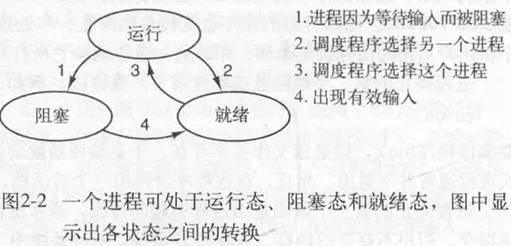

1）运行态（该时刻进程实际占用CPU）。

2）就绪态（可运行，但因为其他进程正在运行而暂时停止）。

3）阻塞态（除非某种外部事件发生，否则进程不能运行）。

前两种状态在逻辑上是类似的。处于这两种状态的进程都可以运行，只是对于第二种状态暂时没有CPU分配给它。第三种状态与前两种状态不同，处于该状态的进程不能运行，即使CPU空闲也不行。

进程的三种状态之间有四种可能的转换关系，如图2-2所示。在操作系统发现进程不能继续运行下去时，发生转换1。在某些系统中，进程可以执行一个诸如pause的系统调用来进入阻塞状态。在其他系统中，包括UNIX，当一个进程从管道或设备文件（例如终端）读取数据时，如果没有有效的输入存在，则进程会被自动阻塞。

转换2和3是由进程调度程序引起的，进程调度程序是操作系统的一部分，进程甚至感觉不到调度程序的存在。系统认为一个运行进程占用处理器的时间已经过长，决定让其他进程使用CPU时间时，会发生转换2。在系统已经让所有其他进程享有了它们应有的公平待遇而重新轮到第一个进程再次占用CPU运行时，会发生转换3。调度程序的主要工作就是决定应当运行哪个进程、何时运行及它应该运行多长时间，这是很重要的一点，我们将在本章的后面部分进行讨论。目前已经提出了许多算法，这些算法力图在整体效率和进程的竞争公平性之间取得平衡。我们将在本章稍后部分研究其中的一些问题。

当进程等待的一个外部事件发生时（如一些输入到达），则发生转换4。如果此时没有其他进程运行，则立即触发转换3，该进程便开始运行。否则该进程将处于就绪态，等待CPU空闲并且轮到它运行。

使用进程模型使得我们易于想象系统内部的操作状况。一些进程正在运行执行用户键入命令所对应的程序。另一些进程是系统的一部分，它们的任务是完成下列一些工作：比如，执行文件服务请求、管理磁盘驱动器和磁带机的运行细节等。当发生一个磁盘中断时，系统会做出决定，停止运行当前进程，转而运行磁盘进程，该进程在此之前因等待中断而处于阻塞态。这样就可以不再考虑中断，而只是考虑用户进程、磁盘进程、终端进程等。这些进程在等待时总是处于阻塞状态。在已经读入磁盘或键人字符后，等待它们的进程就被解除阻塞，并成为可调度运行的进程。

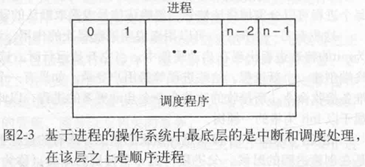

从这个观点引出了图2-3所示的模型。在图2-3中，操作系统的最底层是调度程序，在它上面有许多进程。所有关于中断处理、启动进程和停止进程的具体细节都隐藏在调度程序中。实际上，调度程序是一段非常短小的程序。操作系统的其他部分被简单地组织成进程的形式。不过，很少有真实的系统是以这样的理想方式构造的。

### 2.1.6 进程的实现

为了实现进程模型，操作系统维护着一张表格（一个结构数组），即进程表（processtable）。每个进程占用一个进程表项。（有些作者称这些表项为进程控制块。）该表项包含了进程状态的重要信息，包括程序计数器、堆栈指针、内存分配状况、所打开文件的状态、账号和调度信息，以及其他在进程由运行态转换到就绪态或阻塞态时必须保存的信息，从而保证该进程随后能再次启动，就像从未被中断过一样。

图2-4中展示了在一个典型系统中的关键字段。第一列中的字段与进程管理有关。其他两列分别与存储管理和文件管理有关。应该注意到进程表中的字段是与系统密切相关的，不过该图给出了所需要信息的大致介绍。

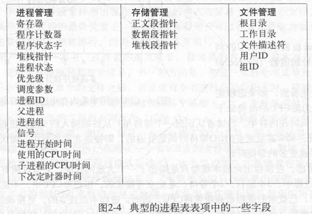

在了解进程表后，就可以对在单个（或每一个）CPU上如何维持多个顺序进程的错觉做更多的阐述。与每一I/O类关联的是一个称作中断向量（interruptvector）的位置（靠近内存底部的固定区域）。它包含中断服务程序的入口地址。假设当一个磁盘中断发生时，用户进程3正在运行，则中断硬件将程序计数器、程序状态字、有时还有一个或多个寄存器压入堆栈，计算机随即跳转到中断向量所指示的地址。这些是硬件完成的所有操作，然后软件，特别是中断服务例程就接管一切剩余的工作。

所有的中断都从保存寄存器开始，对于当前进程而言，通常是保存在进程表项中。随后，会从堆栈中删除由中断硬件机制存入堆栈的那部分信息，并将堆栈指针指向一个由进程处理程序所使用的临时堆栈。一些诸如保存寄存器值和设置堆栈指针等操作，无法用C语言这一类高级语言描述，所以这些操作通过一个短小的汇编语言例程来完成，通常该例程可以供所有的中断使用，因为无论中断是怎样引起的，有关保存寄存器的工作则是完全一样的。

当该例程结束后，它调用一个C过程处理某个特定的中断类型剩下的工作。（假定操作系统由C语言编写，通常这是所有真实操作系统的选择）。在完成有关工作之后，大概就会使某些进程就绪，接着调用调度程序，决定随后该运行哪个进程。随后将控制转给一段汇编语言代码，为当前的进程装人寄存器值以及内存映射并启动该进程运行。图2-5中总结了中断处理和调度的过程。值得注意的是，各种系统之间某些细节会有所不同。

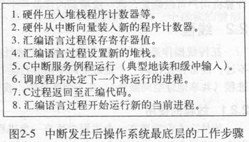

一个进程在执行过程中可能被中断数千次，但关键是每次中断后，被中断的进程都返回到与中断发生前完全相同的状态。

### 2.1.7 多道程序设计模型

采用多道程序设计可以提高CPU的利用率。严格地说，如果进程用于计算的平均时间是进程在内存中停留时间的20%，且内存中同时有5个进程，则CPU将一直满负载运行。然而，这个模型在现实中过于乐观，因为它假设这5个进程不会同时等待I/O。

更好的模型是从概率的角度来看CPU的利用率。假设一个进程等待I/O操作的时间与其停留在内存中时间的比为P。当内存中同时有n个进程时，则所有n个进程都在等待I/O（此时CPU空转）的概率是P（-n-）。CPU的利用率由下面的公式给出：

CPU利用率=1-p（-n-）

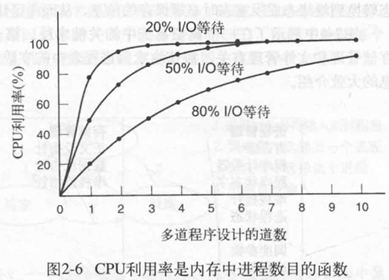

图2-6以n为变量的函数表示了CPU的利用率，n称为多道程序设计的道数（degree of multiprogramming)。

从图2-6中可以清楚地看到，如果进程花费80%的时间等待I/O，为使CPU的浪费低于10%，至少要有10个进程同时在内存中。当读者认识到一个等待用户从终端输入的交互式进程是处于1/0等待状态时，那么很明显，80%甚至更多的I/O等待时间是普遍的。即使是在服务器中，做大量磁盘I/O操作的进程也会花费同样或更多的等待时间。

从完全精确的角度考虑，应该指出此概率模型只是描述了一个大致的状况。它假设所有n个进程是独立的，即内存中的5个进程中，3个运行，2个等待，是完全可接受的。但在单CPU中，不能同时运行3个进程，所以当CPU忙时，已就绪的进程也必须等待CPU。因而，进程不是独立的。更精确的模型应该用排队论构建，但我们的模型（当进程就绪时，给进程分配CPU，否则让CPU空转）仍然是有效的，即使真实曲线会与图2-6中所画的略有不同。

虽然图2-6的模型很简单、很粗略，它依然对预测CPU的性能很有效。例如，假设计算机有8GB内存，操作系统及相关表格占用2GB，每个用户程序也占用2GB。这些内存空间允许3个用户程序同时驻留在内存中。若80%的时间用于I/O等待，则CPU的利用率（忽略操作系统开销）大约是1-0.8，即大约49%。在增加8GB字节的内存后，可从3道程序设计提高到7道程序设计，因而CPU利用率提高到79%。换言之，第二个8GB内存提高了30%的吞吐量。

而增加第三个8GB内存只能将CPU利用率从79%提高到91%，吞吐量的提高仅为12%。通过这一模型，计算机用户可以确定，第一次增加内存是一个划算的投资，而第二个则不是。

## 2.2 线程

在传统操作系统中，每个进程有一个地址空间和一个控制线程。事实上，这几乎就是进程的定义。不过，经常存在在同一个地址空间中准并行运行多个控制线程的情形，这些线程就像（差不多）分离的进程(共享地址空间除外)。在下面各节中，我们将讨论这些情形及其实现。

### 2.2.1 线程的使用

为什么人们需要在一个进程中再有一类进程？有若干理由说明产生这些迷你进程（称为线程）的必要性。下面我们来讨论其中一些理由。人们需要多线程的主要原因是，在许多应用中同时发生着多种活动。其中某些活动随着时间的推移会被阻塞。通过将这些应用程序分解成可以准并行运行的多个顺序线程，程序设计模型会变得更简单。

前面已经进行了有关讨论。准确地说，这正是之前关于进程模型的讨论。有了这样的抽象，我们才不必考虑中断、定时器和上下文切换，而只需考察并行进程。类似地，只是在有了多线程概念之后，我们才加入了一种新的元素：并行实体拥有共享同一个地址空间和所有可用数据的能力。对于某些应用而言，这种能力是必需的，而这正是多进程模型（它们具有不同的地址空间）所无法表达的。

第二个关于需要多线程的理由是，由于线程比进程更轻量级，所以它们比进程更容易（即更快）创建，也更容易撤销。在许多系统中，创建一个线程较创建一个进程要快10~100倍。在有大量线程需要动态和快速修改时，具有这一特性是很有用的。

需要多线程的第三个原因涉及性能方面的讨论。若多个线程都是CPU密集型的，那么并不能获得性能上的增强，但是如果存在着大量的计算和大量的I/O处理，拥有多个线程允许这些活动彼此重叠进行，从而会加快应用程序执行的速度。

最后，在多CPU系统中，多线程是有益的，在这样的系统中，真正的并行有了实现的可能，第8章将讨论这个主题。

通过考察一些典型例子，我们可以更清楚地看出引入多线程的好处。作为第一个例子，考虑一个字处理软件。字处理软件通常按照出现在打印页上的格式在屏幕上精确显示文档。特别地，所有的行分隔符和页分隔符都在正确的最终位置上，这样在需要时用户可以检查和修改文档（比如，消除孤行一一在一页上不完整的顶部行和底部行，因为这些行不甚美观）。

假设用户正在写一本书。从作者的观点来看，最容易的方法是把整本书作为一个文件，这样一来，查询内容、完成全局替换等都非常容易。另一种方法是，把每一章都处理成单独一个文件。但是，在把每个小节和子小节都分成单个的文件之后，若必须对全书进行全局的修改时，那就真是麻烦了，因为有成百个文件必须一个个地编辑。例如，如果所建议的某个标准××××正好在书付印之前被批准了，于是“标准草案××××”一类的字眼就必须改为“标准××××”。如果整本书是一个文件，那么只要一个命令就可以完成全部的替换处理。相反，如果一本书分成了300个文件，那么就必须分别对每个文件进行编辑。

现在考虑，如果有一个用户突然在一个有800页的文件的第一页上删掉了一个语句之后，会发生什么情形。在检查了所修改的页面并确认正确后，这个用户现在打算接着在第600页上进行另一个修改，并键人一条命令通知字处理软件转到该页面（可能要查阅只在那里出现的一个短语）。于是字处理软件被强制对整本书的前600页重新进行格式处理，这是因为在排列该页前面的所有页面之前，字处理软件并不知道第600页的第一行应该在哪里。而在第600页的页面可以真正在屏幕上显示出来之前，计算机可能要拖延相当一段时间，从而令用户不甚满意。

多线程在这里可以发挥作用。假设字处理软件被编写成含有两个线程的程序。一个线程与用户交互，而另一个在后台重新进行格式处理。一旦在第1页中的语句被删除掉，交互线程就立即通知格式化线程对整本书重新进行处理。同时，交互线程继续监控键盘和鼠标，并响应诸如滚动第1页之类的简单命令，此刻，另一个线程正在后台疯狂地运算。如果有点运气的话，重新格式化会在用户请求查看第600页之前完成，这样，第600页页面就立即可以在屏幕上显示出来。

如果已经做到了这一步，那么为什么不再进一步增加一个线程呢？许多字处理软件都有每隔若干分钟自动在磁盘上保存整个文件的特点，用于避免由于程序崩溃、系统崩溃或电源故障而造成用户一整天的工作丢失的情况。第三个线程可以处理磁盘备份，而不必干扰其他两个线程。拥有三个线程的情形，如图2-7所示。

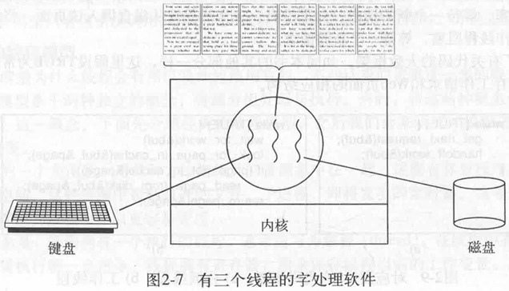

如果程序是单线程的，那么在进行磁盘备份时，来自键盘和鼠标的命令就会被忽略，直到备份工作完成为止。用户当然会认为性能很差。另一个方法是，为了获得好的性能，可以让键盘和鼠标事件中断磁盘备份，但这样却引入了复杂的中断驱动程序设计模型。如果使用三个线程，程序设计模型就很简单了。第一个线程只是和用户交互；第二个线程在得到通知时进行文档的重新格式化，第三个线程周期性地将RAM中的内容写到磁盘上。

很显然，在这里用三个不同的进程是不能工作的，这是因为三个线程都需要对同一个文件进行操作。由于多个线程可以共享公共内存，所以通过用三个线程替换三个进程，使得它们可以访问同一个正在编辑的文件，而三个进程是做不到的。

许多其他的交互式程序中也存在类似的情形。例如，电子表格是允许用户维护矩阵的一种程序，矩阵中的一些元素是用户提供的数据，另一些元素是通过所输入的数据运用可能比较复杂的公式而得出的计算结果。当用户改变一个元素时，许多其他元素就必须重新计算。通过一个后台线程进行重新计算的方式，交互式线程就能够在进行计算的时候，让用户从事更多的工作。类似地，第三个线程可以在磁盘上进行周期性的备份工作。

现在考虑另一个多线程发挥作用的例子：一个万维网服务器。对页面的请求发给服务器，而所请求的页面发回给客户机。在多数Web站点上，某些页面较其他页面相比，有更多的访问。例如，对Sony主页的访问就远远超过对深藏在页面树里的任何特定摄像机的技术说明书页面的访问。利用这一事实，Web服务器可以把获得大量访问的页面集合保存在内存中，避免到磁盘去调入这些页面，从而改善性能。这样的一种页面集合称为高速缓存（cache），高速缓存也运用在其他许多场合中。例如在第1章中介绍的CPU缓存。一种组织Web服务器的方式如图2-8所示。

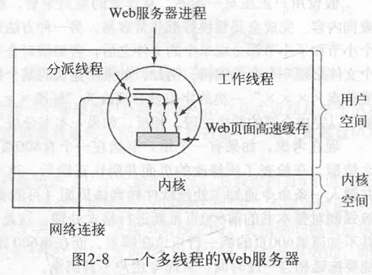

在这里，一个称为分派程序（dispatcher）的线程从网络中读入工作请求。在检查请求之后，分派线程挑选一个空转的（即被阻塞的）工作线程（workerthread），提交该请求，通常是在每个线程所配有的某个专门字中写人一个消息指针。接着分派线程唤醒睡眠的工作线程，将它从阻塞状态转为就绪状态。

在工作线程被唤醒之后，它检查有关的请求是否在Web页面高速缓存之中，这个高速缓存是所有线程都可以访问的。如果没有，该线程开始一个从磁盘调入页面的read操作，并且阻塞直到该磁盘操作完成。当上述线程阻塞在磁盘操作上时，为了完成更多的工作，分派线程可能挑选另一个线程运行，也可能把另一个当前就绪的工作线程投人运行。

这种模型允许把服务器编写为顺序线程的一个集合。在分派线程的程序中包含一个无限循环，该循环用来获得工作请求并且把工作请求派给工作线程。每个工作线程的代码包含一个从分派线程接收的请求，并且检查Web高速缓存中是否存在所需页面的无限循环。如果存在，就将该页面返回给客户机，接着该工作线程阻塞，等待一个新的请求。如果没有，工作线程就从磁盘调入该页面，将该页面返回给客户机，然后该工作线程阻塞，等待一个新的请求。

图2-9给出了有关代码的大致框架。如同本书的其他部分一样，这里假设TRUE为常数1。另外，buf和page分别是保存工作请求和Web页面的相应结构。

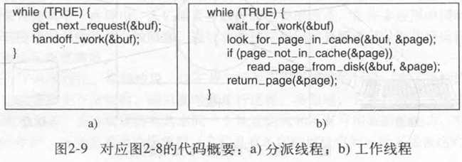

现在考虑在没有多线程的情形下，如何编写Web服务器。一种可能的方式是，使其像一个线程一样运行。Web服务器的主循环获得请求，检查请求，并且在取下一个请求之前完成整个工作。在等待磁盘操作时，服务器就空转，并且不处理任何到来的其他请求。如果该Web服务器运行在唯一的机器上，通常情形都是这样，那么在等待磁盘操作时CPU只能空转。结果导致每秒钟只有很少的请求被处理。可见线程较好地改善了Web服务器的性能，而且每个线程是按通常方式顺序编程的。

到现在为止，我们有了两个可能的设计方案：多线程Web服务器和单线程Web服务器。假设没有多线程可用，而系统设计者又认为由于单线程所造成的性能降低是不能接受的，那么如果可以使用read系统调用的非阻塞版本，还存在第三种可能的设计。在请求到来时，这个唯一的线程对请求进行考察。如果该请求能够在高速缓存中得到满足，那么一切都好，如果不能，则启动一个非阻塞的磁盘操作。

服务器在表格中记录当前请求的状态，然后去处理下一个事件。下一个事件可能是一个新工作的请求，或是磁盘对先前操作的回答。如果是新工作的请求，就开始该工作。如果是磁盘的回答，就从表格中取出对应的信息，并处理该回答。对于非阻塞磁盘I/O而言，这种回答多数会以信号或中断的形式出现。

在这一设计中，前面两个例子中的“顺序进程”模型消失了。每次服务器从为某个请求工作的状态切换到另一个状态时，都必须显式地保存或重新装人相应的计算状态。事实上，我们以一种困难的方式模拟了线程及其堆栈。这里，每个计算都有一个被保存的状态，存在一个会发生且使得相关状态发生改变的事件集合，我们把这类设计称为有限状态机（finite-statemachine）。有限状态机这一概念广泛地应用在计算机科学中。

现在很清楚多线程必须提供的是什么了。多线程使得顺序进程的思想得以保留下来，这种顺序进程阻塞了系统调用（如磁盘I/O），但是仍旧实现了并行性。对系统调用进行阻塞使程序设计变的较为简单，而且并行性改善了性能。单线程服务器虽然保留了阻塞系统调用的简易性，但是却放弃了性能。第三种处理方法运用了非阻塞调用和中断，通过并行性实现了高性能，但是给编程增加了困难。在图2-10中给出了上述模式的总结。

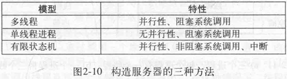

有关多线程作用的第三个例子是那些必须处理极大量数据的应用。通常的处理方式是，读进一块数据，对其处理，然后再写出数据。这里的问题是，如果只能使用阻塞系统调用，那么在数据进入和数据输出时，会阻塞进程。在有大量计算需要处理的时候，让CPU空转显然是浪费，应该尽可能避免。多线程提供了一种解决方案，有关的进程可以用一个输人线程、一个处理线程和一个输出线程构造。输入线程把数据读入到输入缓冲区中，处理线程从输入缓冲区中取出数据，处理数据，并把结果放到输出缓冲区中，输出线程把这些结果写到磁盘上。按照这种工作方式，输入、处理和输出可以全部同时进行。当然，这种模型只有当系统调用只阻塞调用线程而不是阻塞整个进程时，才能正常工作。

### 2.2.2 经典的线程模型

既然已经清楚为什么线程会有用以及如何使用它们，不如让我们用更进一步的眼光来审查一下上面的想法。进程模型基于两种独立的概念：资源分组处理与执行。有时，将这两种概念分开会更好，这就引入了“线程”这一概念。下面先介绍经典的线程模型；之后我们会来研究“模糊进程与线程分界线”的Linux线程模型。

理解进程的一个角度是，用某种方法把相关的资源集中在一起。进程有存放程序正文和数据以及其他资源的地址空间。这些资源中包括打开的文件、子进程、即将发生的定时器、信号处理程序、账号信息等。把它们都放到进程中可以更容易管理。

另一个概念是，进程拥有一个执行的线程，通常简写为线程（thread）。在线程中有一个程序计数器，用来记录接着要执行哪一条指令。线程拥有寄存器，用来保存线程当前的工作变量。线程还拥有一个堆栈，用来记录执行历史，其中每一顿保存了一个已调用的但是还没有从中返回的过程。尽管线程必须在某个进程中执行，但是线程和它的进程是不同的概念，并且可以分别处理。进程用于把资源集中到一起，而线程则是在CPU上被调度执行的实体。

线程给进程模型增加了一项内容，即在同一个进程环境中，允许彼此之间有较大独立性的多个线程执行。在同一个进程中并行运行多个线程，是对在同一台计算机上并行运行多个进程的模拟。在前一种情形下，多个线程共享同一个地址空间和其他资源。而在后一种情形中，多个进程共享物理内存、磁盘、打印机和其他资源。由于线程具有进程的某些性质，所以有时被称为轻量级进程（lightweightprocess）。多线程这个术语，也用来描述在同一个进程中允许多个线程的情形。正如在第1章中看到的，一些CPU已经有直接硬件支持多线程，并允许线程切换在纳秒级完成。

在图2-11a中，可以看到三个传统的进程。每个进程有自己的地址空间和单个控制线程。相反，在图2-11b中，可以看到一个进程带有三个控制线程。尽管在两种情形中都有三个线程，但是在图2-11a中，每一个线程都在不同的地址空间中运行，而在图2-11b中，这三个线程全部在相同的地址空间中运行。

当多线程进程在单CPU系统中运行时，线程轮流运行。从图2-1中，我们已经看到了进程的多道程序设计是如何工作的。通过在多个进程之间来回切换，系统制造了不同的顺序进程并行运行的假象。多线程的工作方式也是类似的。CPU在线程之间的快速切换，制造了线程并行运行的假象，好似它们在一个比实际CPU慢一些的CPU上同时运行。在一个有三个计算密集型线程的进程中，线程以并行方式运行，每个线程在一个CPU上得到了真实CPU速度的三分之一。

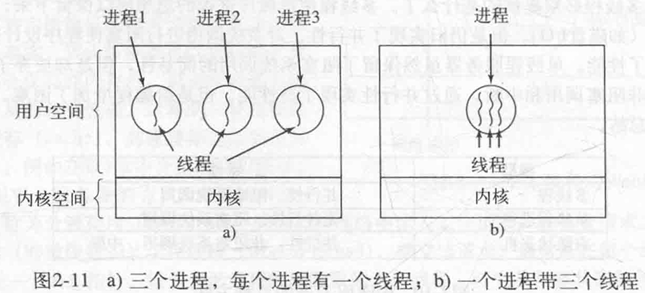

进程中的不同线程不像不同进程之间那样存在很大的独立性。所有的线程都有完全一样的地址空间，这意味着它们也共享同样的全局变量。由于各个线程都可以访问进程地址空间中的每一个内存地址，所以一个线程可以读、写或甚至清除另一个线程的堆栈。线程之间是没有保护的，原因是：1）不可能，2）也没有必要。这与不同进程是有差别的。不同的进程会来自不同的用户，它们彼此之间可能有敌意，一个进程总是由某个用户所拥有，该用户创建多个线程应该是为了它们之间的合作而不是彼此间争斗。除了共享地址空间之外，所有线程还共享同一个打开文件集、子进程、定时器以及相关信号等，如图212所示。这样，对于三个没有关系的线程而言，应该使用图2-11a的结构，而在三个线程实际完成同一个作业，并彼此积极密切合作的情形中，图2-11b则比较合适。


图2-12中，第一列表项是进程的属性，而不是线程的属性。例如，如果一个线程打开了一个文件，该文件对该进程中的其他线程都可见，这些线程可以对该文件进行读写。由于资源管理的单位是进程而非线程，所以这种情形是合理的。如果每个线程有其自已的地址空间、打开文件、即将发生的定时器等，那么它们就应该是不同的进程了。线程概念试图实现的是，共享一组资源的多个线程的执行能力，以便这些线程可以为完成某一任务而共同工作。

和传统进程一样（即只有一个线程的进程），线程可以处于若干种状态的任何一个：运行、阻塞、就绪或终止。正在运行的线程拥有CPU并且是活跃的。被阻塞的线程正在等待某个释放它的事件。例如，当一个线程执行从键盘读入数据的系统调用时，该线程就被阻塞直到键人了输入为止。线程可以被阻塞，以便等待某个外部事件的发生或者等待其他线程来释放它。就绪线程可被调度运行，并且只要轮到它就很快可以运行。线程状态之间的转换和进程状态之间的转换是一样的，如图2-2所示。

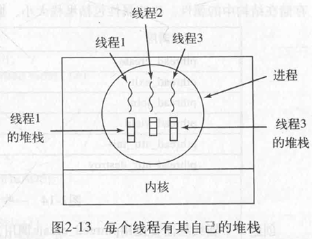

认识到每个线程有其自己的堆栈很重要，如图2-13所示。每个线程的堆栈有一帧，供各个被调用但是还没有从中返回的过程使用。在该栈帧中存放了相应过程的局部变量以及过程调用完成之后使用的返回地址。例如，如果过程X调用过程Y，而Y又调用Z，那么当Z执行时，供X、Y和Z使用的栈帧会全部存在堆栈中。通常每个线程会调用不同的过程，从而有一个各自不同的执行历史，这就是为什么每个线程需要有自己的堆栈的原因。

在多线程的情况下，进程通常会从当前的单个线程开始。这个线程有能力通过调用一个库函数（如thread_create）创建新的线程。thread_create的参数专门指定了新线程要运行的过程名。这里，没有必要对新线程的地址空间加以规定，因为新线程会自动在创建线程的地址空间中运行。有时，线程是有层次的，它们具有一种父子关系，但是，通常不存在这样一种关系，所有的线程都是平等的。不论有无层次关系，创建线程通常都返回一个线程标识符，该标识符就是新线程的名字。

当一个线程完成工作后，可以通过调用一个库过程（如thread_exit）退出。该线程接着消失，不再可调度。在某些线程系统中，通过调用一个过程，例如thread_join，一个线程可以等待一个（特定）线程退出。这个过程阻塞调用线程直到那个（特定）线程退出。在这种情况下，线程的创建和终止非常类似于进程的创建和终止，并且也有着同样的选项。

另一个常见的线程调用是thread_yield，它允许线程自动放弃CPU从而让另一个线程运行。这样一个调用是很重要的，因为不同于进程，（线程库）无法利用时钟中断强制线程让出CPU。所以设法使线程行为“高尚”起来，并且随着时间的推移自动交出CPU，以便让其他线程有机会运行，就变得非常重要。有的调用允许某个线程等待另一个线程完成某些任务，或等待一个线程宣称它已经完成了有关的工作等。

通常而言，线程是有益的，但是线程也在程序设计模式中引入了某种程度的复杂性。考虑一下UNIX中的fork系统调用。如果父进程有多个线程，那么它的子进程也应该拥有这些线程吗？如果不是，则该子进程可能会工作不正常，因为在该子进程中的线程都是绝对必要的。

然而，如果子进程拥有了与父进程一样的多个线程，如果父进程在read系统调用（比如键盘）上被阻塞了会发生什么情况？是两个线程被阻塞在键盘上（一个属于父进程，另一个属于子进程）吗？在键人一行输入之后，这两个线程都得到该输入的副本吗？还是仅有父进程得到该输人的副本？或是仅有子进程得到？类似的问题在进行网络连接时也会出现。

另一类问题和线程共享许多数据结构的事实有关。如果一个线程关闭了某个文件，而另一个线程还在该文件上进行读操作时会怎样？假设有一个线程注意到几乎没有内存了，并开始分配更多的内存。在工作一半的时候，发生线程切换，新线程也注意到几乎没有内存了，并且也开始分配更多的内存。这样，内存可能会被分配两次。不过这些问题通过努力是可以解决的。总之，要使多线程的程序正确工作，就需要仔细思考和设计。

### 2.2.3 POSIX线程

为实现可移植的线程程序，IEEE在IEEE标准1003.1c中定义了线程的标准。它定义的线程包叫作pthread。大部分UNIX系统都支持该标准。这个标准定义了超过60个函数调用，如果在这里列举一遍就太多了。这里仅描述一些主要的函数，以说明它是如何工作的。图2-14中列举了这些函数调用。

所有pthread线程都有某些特性。每一个都含有一个标识符、一组寄存器（包括程序计数器）和一组存储在结构中的属性。这些属性包括堆栈大小、调度参数以及其他线程需要的项目。

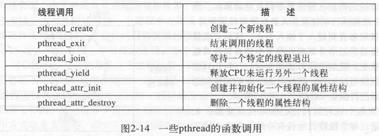

创建一个新线程需要使用pthread_create调用。新创建的线程的线程标识符会作为函数值返回。这种调用有意看起来很像fork系统调用，其中线程标识符起着PID的作用，而这么做的目的主要是为了标识在其他调用中引用的线程。

当一个线程完成分配给它的工作时，可以通过调用pthread_exit来终止。这个调用终止该线程并释放它的栈。

一般一个线程在继续运行前需要等待另一个线程完成它的工作并退出。可以通过pthread_join线程调用来等待别的特定线程的终止。而要等待线程的线程标识符作为一个参数给出。

有时会出现这种情况：一个线程逻辑上没有阻塞，但感觉上它已经运行了足够长时间并且希望给另外一个线程机会去运行。这时可以通过调用pthread_yield完成这一目标。而进程中没有这种调用，因为假设进程间会有激烈的竞争性，并且每一个进程都希望获得它所能得到的所有的CPU时间。但是，由于同一进程中的线程可以同时工作，并且它们的代码总是由同一个程序员编写的，因此，有时程序员希望它们能互相给对方一些机会去运行。

下面两个线程调用是处理属性的。pthread_attr_init建立关联一个线程的属性结构并初始化成默认值。这些值（例如优先级）可以通过修改属性结构中的域值来改变。

最后，pthread_attr_destroy删除一个线程的属性结构，释放它占用的内存。它不会影响调用它的线程。这些线程会继续存在。

为了更好地了解pthread是如何工作的，考虑图2-15提供的简单例子。这里主程序在宣布它的意图之后，循环NUMBER_OF_THREADS次，每次创建一个新的线程。如果线程创建失败，会打印出一条错误信息然后退出。在创建完所有线程之后，主程序退出。

当创建一个线程时，它打印一条一行的发布信息，然后退出。这些不同信息交错的顺序是不确定的，并且可能在连续运行程序的情况下发生变化。

pthread调用不只是前面介绍的这几个，还有许多的pthread调用会在讨论“进程与线程同步”之后再介绍。

### 2.2.4 在用户空间中实现线程

车个医人计有两种主要的方法实现线程包：在用户空间中和在内核中。这两种方法互有利，不过混合实现方式也是可能的。我们现在介绍这些方法，并分析它们的优点和缺点。

第一种方法是把整个线程包放在用户空间中，内核对线程包一无所知。从内核角度考虑，就是按正常的方式管理，即单线程进程。这种方法第一个也是最明显的优点是，用户级线程包可以在不支持线程的操作系统上实现。过去所有的操作系统都属于这个范围，即使现在也有一些操作系统还是不支持线程。通过这一方法，可以用函数库实现线程。

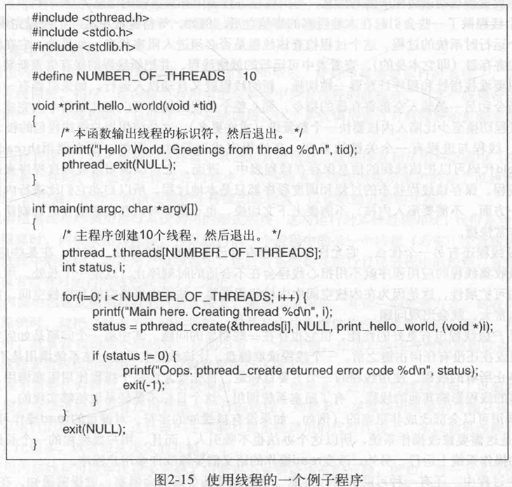

所有的这类实现都有同样的通用结构，如图2-16a所示。线程在一个运行时系统的上层运行，该运行时系统是一个管理线程的过程的集合。前面已经介绍过其中的四个过程：pthread_create，pthread_exit，pthread_join和pthread_yield。不过，一般还会有更多的过程。

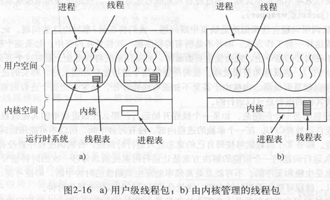

在用户空间管理线程时，每个进程需要有其专用的线程表（threadtable），用来跟踪该进程中的线程。这些表和内核中的进程表类似，不过它仅仅记录各个线程的属性，如每个线程的程序计数器、堆栈指针、寄存器和状态等。该线程表由运行时系统管理。当一个线程转换到就绪状态或阻塞状态时，在该线程表中存放重新启动该线程所需的信息，与内核在进程表中存放进程的信息完全一样。

当某个线程做了一些会引起在本地阻塞的事情之后，例如，等待进程中另一个线程完成某项工作，它调用一个运行时系统的过程，这个过程检查该线程是否必须进入阻塞状态。如果是，它在线程表中保存该线程的寄存器（即它本身的），查看表中可运行的就绪线程，并把新线程的保存值重新装入机器的寄存器中。只要堆栈指针和程序计数器一被切换，新的线程就又自动投入运行。如果机器有一条保存所有寄存器的指令和另一条装入全部寄存器的指令，那么整个线程的切换可以在几条指令内完成。进行类似于这样的线程切换至少比陷入内核要快一个数量级（或许更多），这是使用用户级线程包的极大的优点。

不过，线程与进程有一个关键的差别。在线程完成运行时，例如，在它调用thread_yield时，pthread_yield代码可以把该线程的信息保存在线程表中，进而，它可以调用线程调度程序来选择另一个要运行的线程。保存该线程状态的过程和调度程序都只是本地过程，所以启动它们比进行内核调用效率更高。另一方面，不需要陷入内核，不需要上下文切换，也不需要对内存高速缓存进行刷新，这就使得线程调度非常快捷。

用户级线程还有另一个优点。它允许每个进程有自己定制的调度算法。例如，在某些应用程序中，那些有垃圾收集线程的应用程序就不用担心线程会在不合适的时刻停止，这是一个长处。用户级线程还具有较好的可扩展性，这是因为在内核空间中内核线程需要一些固定表格空间和堆栈空间，如果内核线程的数量非常大，就会出现问题。

尽管用户级线程包有更好的性能，但它也存在一些明显的问题。其中第一个问题是如何实现阻塞系统调用。假设在还没有任何击键之前，一个线程读取键盘。让该线程实际进行该系统调用是不可接受的，因为这会停止所有的线程。使用线程的一个主要目标是，首先要允许每个线程使用阻塞调用，但是还要避免被阻塞的线程影响其他的线程。有了阻塞系统调用，这个目标不是轻易地能够实现的。

系统调用可以全部改成非阻塞的（例如，如果没有被缓冲的字符，对键盘的read操作可以只返回0字节），但是这需要修改操作系统，所以这个办法也不吸引人。而且，用户级线程的一个长处就是它可以在现有的操作系统上运行。另外，改变read操作的语义需要修改许多用户程序。

在这个过程中，还有一种可能的替代方案，就是如果某个调用会阻塞，就提前通知。在某些UNIX版本中，有一个系统调用select可以允许调用者通知预期的read是否会阻塞。若有这个调用，那么库过程read就可以被新的操作替代，首先进行select调用，然后只有在安全的情形下（即不会阻塞）才进行read调用。如果read调用会被阻塞，有关的调用就不进行，代之以运行另一个线程。到了下次有关的运行系统取得控制权之后，就可以再次检查看看现在进行read调用是否安全。这个处理方法需要重写部分系统调用库，所以效率不高也不优雅，不过没有其他的可选方案了。在系统调用周围从事检查的这类代码称为包装器（jacket或wrapper）。

与阻塞系统调用问题有些类似的是缺页中断问题，我们将在第3章讨论这些问题。此刻可以认为，把计算机设置成这样一种工作方式，即并不是所有的程序都一次性放在内存中。如果某个程序调用或者跳转到了一条不在内存的指令上，就会发生页面故障，而操作系统将到磁盘上取回这个丢失的指令（和该指令的“邻居们”），这就称为页面故障。在对所需的指令进行定位和读入时，相关的进程就被阻塞。如果有一个线程引起页面故障，内核由于甚至不知道有线程存在，通常会把整个进程阻塞直到磁盘I/O完成为止，尽管其他的线程是可以运行的。

用户级线程包的另一个问题是，如果一个线程开始运行，那么在该进程中的其他线程就不能运行，除非第一个线程自动放弃CPU。在一个单独的进程内部，没有时钟中断，所以不可能用轮转调度（轮流）的方式调度线程。除非某个线程能够按照自己的意志进入运行时系统，否则调度程序就没有任何机会。

对线程永久运行问题的一个可能的解决方案是让运行时系统请求每秒一次的时钟信号（中断），但是这样对程序也是生硬和无序的。不可能总是高频率地发生周期性的时钟中断，即使可能，总的开销也是可观的。而且，线程可能也需要时钟中断，这就会扰乱运行时系统使用的时钟。

再者，也许针对用户级线程的最大负面争论意见是，程序员通常在经常发生线程阻塞的应用中才希望使用多个线程。例如，在多线程Web服务器里。这些线程持续地进行系统调用，而一旦发生内核陷阱进行系统调用，如果原有的线程已经阻塞，就很难让内核进行线程的切换，如果要让内核消除这种情形，就要持续进行select系统调用，以便检查read系统调用是否安全。对于那些基本上是CPU密集型而且极少有阻塞的应用程序而言，使用多线程的目的又何在呢？由于这样的做法并不能得到任何益处，所以没有人会真正提出使用多线程来计算前n个素数或者下象棋等一类工作。

### 2.2.5 在内核中实现线程

现在考虑内核支持和管理线程的情形。如图2-16b所示，此时不再需要运行时系统了。另外，每个进程中也没有线程表。相反，在内核中有用来记录系统中所有线程的线程表。当某个线程希望创建一个新线程或撤销一个已有线程时，它进行一个系统调用，这个系统调用通过对线程表的更新完成线程创建或撤销工作。

内核的线程表保存了每个线程的寄存器、状态和其他信息。这些信息和在用户空间中（在运行时系统中）的线程是一样的，但是现在保存在内核中。这些信息是传统内核所维护的每个单线程进程信息（即进程状态）的子集。另外，内核还维护了传统的进程表，以便跟踪进程的状态。

所有能够阻塞线程的调用都以系统调用的形式实现，这与运行时系统过程相比，代价是相当可观的。当一个线程阻塞时，内核根据其选择，可以运行同一个进程中的另一个线程（若有一个就绪线程）或者运行另一个进程中的线程。而在用户级线程中，运行时系统始终运行自己进程中的线程，直到内核剥夺它的CPU（或者没有可运行的线程存在了）为止。

由于在内核中创建或撤销线程的代价比较大，某些系统采取“环保”的处理方式，回收其线程。当某个线程被撤销时，就把它标志为不可运行的，但是其内核数据结构没有受到影响。稍后，在必须创建一个新线程时，就重新启动某个旧线程，从而节省了一些开销。在用户级线程中线程回收也是可能的，但是由于其线程管理的代价很小，所以没有必要进行这项工作。

内核线程不需要任何新的、非阻塞系统调用。另外，如果某个进程中的线程引起了页面故障，内核可以很方便地检查该进程是否有任何其他可运行的线程，如果有，在等待所需要的页面从磁盘读入时，就选择一个可运行的线程运行。这样做的主要缺点是系统调用的代价比较大，所以如果线程的操作（创建、终止等）比较多，就会带来很大的开销。

虽然使用内核线程可以解决很多问题，但是也不会解决所有的问题。例如，当一个多线程进程创建新的进程时，会发生什么？新进程是拥有与原进程相同数量的线程，还是只有一个线程？在很多情况下，最好的选择取决于进程计划下一步做什么。如果它要调用exec来启动一个新的程序，或许一个线程是正确的选择；但是如果它继续执行，则最好复制所有的线程。

另一个话题是信号。回忆一下，信号是发给进程而不是线程的，至少在经典模型中是这样的。当一个信号到达时，应该由哪一个线程处理它？线程可以“注册”它们感兴趣的某些信号，因此当一个信号到达的时候，可把它交给需要它的线程。但是如果两个或更多的线程注册了相同的信号，会发生什么？这只是线程引起的问题中的两个，但是还有更多的问题。

### 2.2.6 混合实现

人们已经研究了各种试图将用户级线程的优点和内核级线程的优点结合起来的方法。一种方法是使用内核级线程，然后将用户级线程与某些或者全部内核线程多路复用起来，如图2-17所示。如果采用这种方法，编程人员可以决定有多少个内核级线程和多少个用户级线程彼此多路复用。这一模型带来最大的灵活度。

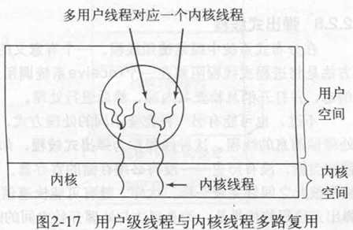

采用这种方法，内核只识别内核级线程，并对其进行调度。其中一些内核级线程会被多个用户级线程多路复用。如同在没有多线程能力操作系统中某个进程中的用户级线程一样，可以创建、撤销和调度这些用户级线程。在这种模型中，每个内核级线程有一个可以轮流使用的用户级线程集合。

### 2.2.7 调度程序激活机制

尽管内核级线程在一些关键点上优于用户级线程，但无可争议的是内核级线程的速度慢。因此，研究人员一直在寻找在保持其优良特性的前提下改进其速度的方法。下面将介绍Anderson等人（1992）设计的一种方法，称为调度程序激活（scheduleractivation）机制。Edler等人（1988）以及Scott等人（1990）就相关的工作进行了深人讨论。

调度程序激活工作的目标是模拟内核线程的功能，但是为线程包提供通常在用户空间中才能实现的更好的性能和更大的灵活性。特别地，如果用户线程从事某种系统调用时是安全的，那就不应该进行专门的非阻塞调用或者进行提前检查。无论如何，如果线程阻塞在某个系统调用或页面故障上，只要在同一个进程中有任何就绪的线程，就应该有可能运行其他的线程。

由于避免了在用户空间和内核空间之间的不必要转换，从而提高了效率。例如，如果某个线程由于等待另一个线程的工作而阻塞，此时没有理由请求内核，这样就减少了内核一用户转换的开销。用户空间的运行时系统可以阻塞同步的线程而另外调度一个新线程。

当使用调度程序激活机制时，内核给每个进程安排一定数量的虚拟处理器，并且让（用户空间）运行时系统将线程分配到处理器上。这一机制也可以用在多处理器中，此时虚拟处理器可能成为真实的CPU。分配给一个进程的虚拟处理器的初始数量是一个，但是该进程可以申请更多的处理器并且在不用时退回。内核也可以取回已经分配出去的虚拟处理器，以便把它们分给需要更多处理器的进程。

使该机制工作的基本思路是，当内核了解到一个线程被阻塞之后（例如，由于执行了一个阻塞系统调用或者产生了一个页面故障），内核通知该进程的运行时系统，并且在堆栈中以参数形式传递有问题的线程编号和所发生事件的一个描述。内核通过在一个已知的起始地址启动运行时系统，从而发出了通知，这是对UNIX中信号的一种粗略模拟。这个机制称为上行调用（upcall）。

一旦如此激活，运行时系统就重新调度其线程，这个过程通常是这样的：把当前线程标记为阻塞并从就绪表中取出另一个线程，设置其寄存器，然后再启动之。稍后，当内核知道原来的线程又可运行时（例如，原先试图读取的管道中有了数据，或者已经从磁盘中读入了故障的页面），内核就又一次上行调用运行时系统，通知它这一事件。此时该运行时系统按照自己的判断，或者立即重启动被阻塞的线程，或者把它放入就绪表中稍后运行。

在某个用户线程运行的同时发生一个硬件中断时，被中断的CPU切换进内核态。如果被中断的进程对引起该中断的事件不感兴趣，比如，是另一个进程的I/O完成了，那么在中断处理程序结束之后，就把被中断的线程恢复到中断之前的状态。不过，如果该进程对中断感兴趣，比如，是该进程中的某个线程所需要的页面到达了，那么被中断的线程就不再启动，代之为挂起被中断的线程。而运行时系统则启动对应的虚拟CPU，此时被中断线程的状态保存在堆栈中。随后，运行时系统决定在该CPU上调度哪个线程：被中断的线程、新就绪的线程还是某个第三种选择。

调度程序激活机制的一个目标是作为上行调用的信赖基础，这是一种违反分层次系统内在结构的概念。通常，n层提供n+1层可调用的特定服务，但是n层不能调用n+1层中的过程。上行调用并不遵守这个基本原理。

### 2.2.8 弹出式线程

在分布式系统中经常使用线程。一个有意义的例子是如何处理到来的消息，例如服务请求。传统的方法是将进程或线程阻塞在一个receive系统调用上，等待消息到来。当消息到达时，该系统调用接收消息，并打开消息检查其内容，然后进行处理。

不过，也可能有另一种完全不同的处理方式，在该处理方式中，一个消息的到达导致系统创建一个处理该消息的线程，这种线程称为弹出式线程，如图2-18所示。弹出式线程的关键好处是，由于这种线程相当新，没有历史一一没有必须存储的寄存器、堆栈诸如此类的内容，每个线程从全新开始，每一个线程彼此之间都完全一样。这样，就有可能快速创建这类线程。对该新线程指定所要处理的消息。使用弹出式线程的结果是，消息到达与处理开始之间的时间非常短。

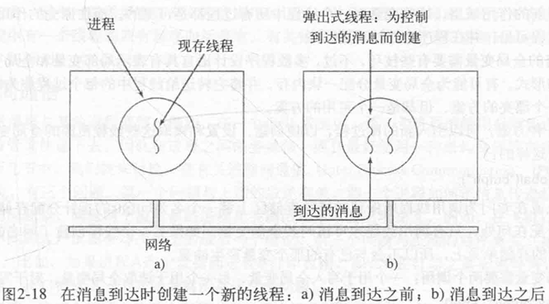

在使用弹出式线程之前，需要提前进行计划。例如，哪个进程中的线程先运行？如果系统支持在内核上下文中运行线程，线程就有可能在那里运行（这是图2-18中没有画出内核的原因）。在内核空间中运行弹出式线程通常比在用户空间中容易且快捷，而且内核空间中的弹出式线程可以很容易访问所有的表格和I/O设备，这些也许在中断处理时有用。而另一方面，出错的内核线程会比出错的用户线程造成更大的损害。例如，如果某个线程运行时间太长，又没有办法抢占它，就可能造成进来的信息丢失。

### 2.2.9 使单线程代码多线程化

许多已有的程序是为单线程进程编写的。把这些程序改写成多线程需要比直接写多线程程序更高的技巧。下面考察一些其中易犯的错误。

先考察代码，一个线程的代码就像进程一样，通常包含多个过程，会有局部变量、全局变量和过程参数。局部变量和参数不会引起任何问题，但是有一个问题是，对线程而言是全局变量，并不是对整个程序也是全局的。有许多变量之所以是全局的，是因为线程中的许多过程都使用它们（如同它们也可能使用任何全局变量一样），但是其他线程在逻辑上和这些变量无关。

作为一个例子，考虑由UNIX维护的errno变量。当进程（或线程）进行系统调用失败时，错误码会放入errno。在图2-19中，线程1执行系统调用access以确定是否允许它访问某个特定文件。操作系统把返回值放到全局变量errno里。当控制权返回到线程1之后，并在线程1读取errno之前，调度程序确认线程1此刻已用完CPU时间，并决定切换到线程2。线程2执行一个open调用，结果失败，导致重写errno，于是给线程1的返回值会永远丢失。随后在线程1执行时，它将读取错误的返回值并导致错误操作。

对于这个问题有各种解决方案。一种解决方案是全面禁止全局变量。不过这个想法不一定合适，因为它同许多已有的软件冲突。另一种解决方案是为每个线程赋予其私有的全局变量，如图2-20所示。在这个方案中，每个线程有自己的errno以及其他全局变量的私有副本，这样就避免了冲突。在效果上，这个方案创建了新的作用域层，这些变量对一个线程中所有过程都是可见的。而在原先的作用域层里，变量只对一个过程可见，并在程序中处处可见。

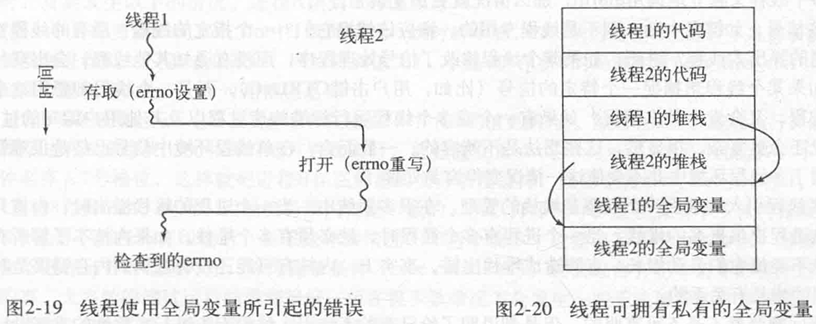

访问私有的全局变量需要有些技巧，不过，多数程序设计语言具有表示局部变量和全局变量的方式，而没有中间的形式。有可能为全局变量分配一块内存，并将它转送给线程中的每个过程作为额外的参数。尽管这不是一个漂亮的方案，但却是一个可用的方案。

还有另一种方案，可以引入新的库过程，以便创建、设置和读取这些线程范围的全局变量。首先一个调用也许是这样的：

```
create_global("bufptr");
```

该调用在堆上或在专门为调用线程所保留的特殊存储区上替一个名为bufptr的指针分配存储空间。无论该存储空间分配在何处，只有调用线程才可访问其全局变量。如果另一个线程创建了同名的全局变量，由于它在不同的存储单元上，所以不会与已有的那个变量产生冲突。

访问全局变量需要两个调用：一个用于写入全局变量，另一个用于读取全局变量。对于写入，类似有

```
set_global("bufptr",&buf);
```

它把指针的值保存在先前通过调用create_global创建的存储单元中。如果要读出一个全局变量，调用的形式类似于

```
bufptr=read_global("bufptr");
```

这个调用返回一个存储在全局变量中的地址，这样就可以访问其中的数据了。

试图将单一线程程序转为多线程程序的另一个问题是，有许多库过程并不是可重入的。也就是说，它们不是被设计成下列工作方式的：对于任何给定的过程，当前面的调用尚没有结束之前，可以进行第二次调用。例如，可以将通过网络发送消息恰当地设计为，在库内部的一个固定缓冲区中进行消息组合，然后陷入内核将其发送。但是，如果一个线程在缓冲区中编好了消息，然后被时钟中断强迫切换到第二个线程，而第二个线程立即用它自已的消息重写了该缓冲区，那会怎样呢？

类似的还有内存分配过程，例如UNIX中的malloc，它维护着内存使用情况的关键表格，如可用内存块链表。在malloc忙于更新表格时，有可能暂时处于一种不一致的状态，指针的指向不定。如果在表格处于一种不一致的状态时发生了线程切换，并且从一个不同的线程中来了一个新的调用，就可能会由于使用了一个无效指针从而导致程序崩溃。要有效解决这些问题意味着重写整个库，而这有可能引人一些微妙的错误，所以这么做是一件很复杂的事情。

另一种解决方案是，为每个过程提供一个包装器，该包装器设置一个二进制位从而标志某个库处于使用中。在先前的调用还没有完成之前，任何试图使用该库的其他线程都会被阻塞。尽管这个方式可以工作，但是它会极大地降低系统潜在的并行性。

接着考虑信号。有些信号逻辑上是线程专用的，但是另一些却不是。例如，如果某个线程调用alarm，信号送往进行该调用的线程是有意义的。但是，当线程完全在用户空间实现时，内核根本不知道有线程存在，因此很难将信号发送给正确的线程。如果一个进程一次仅有一个警报信号等待处理，而其中的多个线程又独立地调用alarm，那么情况就更加复杂了。

有些信号，如键盘中断，则不是线程专用的。谁应该捕捉它们？一个指定的线程？所有的线程？还是新创建的弹出式线程？进而，如果某个线程修改了信号处理程序，而没有通知其他线程，会出现什么情况？如果某个线程想捕捉一个特定的信号（比如，用户击键CTRL+C），而另一个线程却想用这个信号终止进程，又会发生什么情况？如果有一个或多个线程运行标准的库过程以及其他用户编写的过程，那么情况还会更复杂。很显然，这些想法是不兼容的。一般而言，在单线程环境中信号已经是很难管理的了，到了多线程环境中并不会使这一情况变得容易处理。

由多线程引入的最后一个问题是堆栈的管理。在很多系统中，当一个进程的堆栈溢出时，内核只是自动为该进程提供更多的堆栈。当一个进程有多个线程时，就必须有多个堆栈。如果内核不了解所有的堆栈，就不能使它们自动增长，直到造成堆栈出错。事实上，内核有可能还没有意识到内存错误是和某个线程栈的增长有关系的。

这些问题当然不是不可克服的，但是却说明了给已有的系统引入线程而不进行实质性的重新设计系统是根本不行的。至少可能需要重新定义系统调用的语义，并且不得不重写库。而且所有这些工作必须与在一个进程中有一个线程的原有程序向后兼容。有关线程的其他信息，可以参阅Hauser等人（1993）和Marsh等人（1991）。

## 2.3 进程间通信

进程经常需要与其他进程通信。例如，在一个shell管道中，第一个进程的输出必须传送给第二个进程，这样沿着管道传递下去。因此在进程之间需要通信，而且最好使用一种结构良好的方式而不要使用中断。在下面几节中，我们就来讨论一些有关进程间通信（InterProcessCommunication，IPC）的问题。

简要地说，有三个问题。第一个问题与上面的叙述有关，即一个进程如何把信息传递给另一个。第二个要处理的问题是，确保两个或更多的进程在关键活动中不会出现交叉，例如，在飞机订票系统中的两个进程为不同的客户试图争夺飞机上的最后一个座位。第三个问题与正确的顺序有关（如果该顺序是有关联的话），比如，如果进程A产生数据而进程B打印数据，那么B在打印之前必须等待，直到A已经产生一些数据。我们将从下一节开始考察所有这三个问题。

有必要说明，这三个问题中的两个问题对于线程来说是同样适用的。第一个问题（即传递信息）对线程而言比较容易，因为它们共享一个地址空间（在不同地址空间需要通信的线程属于不同进程之间通信的情形）。但是另外两个问题（需要梳理清楚并保持恰当的顺序）同样适用于线程。同样的问题可用同样的方法解决。下面开始讨论进程间通信问题，不过请记住，同样的问题和解决方法也适用于线程。

### 2.3.1 竞争条件

在一些操作系统中，协作的进程可能共享一些彼此都能读写的公用存储区。这个公用存储区可能在内存中（可能是在内核数据结构中），也可能是一个共享文件。这里共享存储区的位置并不影响通信的本质及其带来的问题。为了理解实际中进程间通信如何工作，我们考虑一个简单但很普遍的例子：一个假脱机打印程序。当一个进程需要打印一个文件时，它将文件名放在一个特殊的假脱机目录（spoolerdirectory）下。另一个进程（打印机守护进程）则周期性地检查是否有文件需要打印，若有就打印并将该文件名从目录下删掉。

设想假脱机目录中有许多槽位，编号依次为0，1，2，，每个槽位存放一个文件名。同时假设有两个共享变量：out，指向下一个要打印的文件，in，指向目录中下一个空闲槽位。可以把这两个变量保存在一个所有进程都能访问的文件中，该文件的长度为两个字。在某一时刻，0号至3号槽位空（其中的文件已经打印完毕），4号至6号槽位被占用（其中存有排好队列的要打印的文件名）。几乎在同一时刻，进程A和进程B都决定将一个文件排队打印，这种情况如图2-21所示。

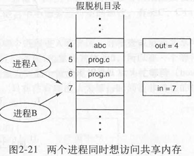

在Murphy法则（任何可能出错的地方终将出错）生效时，可能发生以下的情况。进程A读到in的值为7，将7存在一个局部变量next_free_slot中。此时发生一次时钟中断，CPU认为进程A已运行了足够长的时间，决定切换到进程B。进程B也读取in，同样得到值为7，于是将7存在B的局部变量next_free_slot中。在这一时刻两个进程都认为下一个可用槽位是7。

进程B现在继续运行，它将其文件名存在槽位7中并将in的值更新为8。然后它离开，继续执行其他操作。

最后进程A接着从上次中断的地方再次运行。它检查变量next_free_slot，发现其值为7，于是将打印文件名存入7号槽位，这样就把进程B存在那里的文件名覆盖掉。然后它将next_free_slot加1，得到值为8，就将8存到in中。此时，假脱机目录内部是一致的，所以打印机守护进程发现不了任何错误，但进程B却永远得不到任何打印输出。类似这样的情况，即两个或多个进程读写某些共享数据，而最后的结果取决于进程运行的精确时序，称为竞争条件（racecondition）。调试包含有竞争条件的程序是一件很头痛的事。大多数的测试运行结果都很好，但在极少数情况下会发生一些无法解释的奇怪现象。不幸的是，多核增长带来的并行使得竞争条件越来越普遍。

### 2.3.2 临界区

怎样避免竞争条件？实际上凡涉及共享内存、共享文件以及共享任何资源的情况都会引发与前面类似的错误，要避免这种错误，关键是要找出某种途径来阻止多个进程同时读写共享的数据。换言之，我们需要的是互斥（mutualexclusion），即以某种手段确保当一个进程在使用一个共享变量或文件时，其他进程不能做同样的操作。前述问题的症结就在于，在进程A对共享变量的使用未结束之前进程B就使用它。为实现互厅而选择适当的原语是任何操作系统的主要设计内容之一，也是后面几节中要详细讨论的主题。

避免竞争条件的问题也可以用一种抽象的方式进行描述。一个进程的一部分时间做内部计算或另外一些不会引发竞争条件的操作。在某些时候进程可能需要访问共享内存或共享文件，或执行另外一些会导致竞争的操作。我们把对共享内存进行访问的程序片段称作临界区域（criticalregion）或临界区（criticalsection）。如果我们能够适当地安排，使得两个进程不可能同时处于临界区中，就能够避免竞争条件。

尽管这样的要求避免了竞争条件，但它还不能保证使用共享数据的并发进程能够正确和高效地进行协作。对于一个好的解决方案，需要满足以下4个条件：

1）任何两个进程不能同时处于其临界区。

2）不应对CPU的速度和数量做任何假设。

3）临界区外运行的进程不得阻塞其他进程。

4）不得使进程无限期等待进入临界区。

从抽象的角度看，人们所希望的进程行为如图2-22所示。图2-22中进程A在T{1}时刻进入临界区。稍后，在T{2}时刻进程B试图进入临界区，但是失败了，因为另一个进程已经在该临界区内，而一个时刻只允许一个进程在临界区内。随后，B被暂时挂起直到T{3}时刻A离开临界区为止，从而允许B立即进入。最后，B离开（在时刻T{4}），回到了在临界区中没有进程的原始状态。

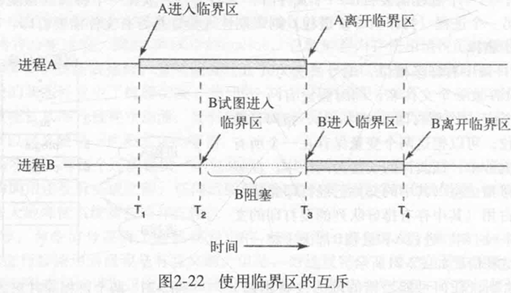

### 2.3.3 忙等待的互斥

本节将讨论几种实现互斥的方案。在这些方案中，当一个进程在临界区中更新共享内存时，其他进程将不会进入其临界区，也不会带来任何麻烦。

#### 1. 屏蔽中断

在单处理器系统中，最简单的方法是使每个进程在刚刚进入临界区后立即屏蔽所有中断，并在就要离开之前再打开中断。屏蔽中断后，时钟中断也被屏蔽。CPU只有发生时钟中断或其他中断时才会进行进程切换，这样，在屏蔽中断之后CPU将不会被切换到其他进程。于是，一旦某个进程屏蔽中断之后，它就可以检查和修改共享内存，而不必担心其他进程介人。

这个方案并不好，因为把屏蔽中断的权力交给用户进程是不明智的。设想一下，若一个进程屏蔽中断后不再打开中断，其结果将会如何？整个系统可能会因此终止。而且，如果系统是多处理器（有两个或可能更多的处理器），则屏蔽中断仅仅对执行disable指令的那个CPU有效。其他CPU仍将继续运行，并可以访问共享内存。

另一方面，对内核来说，当它在更新变量或列表的几条指令期间将中断屏蔽是很方便的。当就绪进程队列之类的数据状态不一致时发生中断，则将导致竞争条件。所以结论是：屏蔽中断对于操作系统本身而言是一项很有用的技术，但对于用户进程则不是一种合适的通用互斥机制。

由于多核芯片的数量越来越多，即使在低端PC上也是如此。因此，通过屏蔽中断来达到互斥的可能性一——甚至在内核中一—变得日益减少了。双核现在已经相当普遍，四核当前在高端机器中存在，而且离八或十六（核）也不久远了。在一个多核系统中（例如，多处理器系统），屏蔽一个CPU的中断不会阻止其他CPU干预第一个CPU所做的操作。结果是人们需要更加复杂的计划。

#### 2.锁变量

作为第二种尝试，可以寻找一种软件解决方案。设想有一个共享（锁）变量，其初始值为0。当一个进程想进人其临界区时，它首先测试这把锁。如果该锁的值为0，则该进程将其设置为1并进入临界区。若这把锁的值已经为1，则该进程将等待直到其值变为0。于是，0就表示临界区内没有进程，1表示已经有某个进程进入临界区。

但是，这种想法也包含了与假脱机目录一样的疏漏。假设一个进程读出锁变量的值并发现它为0，而恰好在它将其值设置为1之前，另一个进程被调度运行，将该锁变量设置为1。当第一个进程再次运行时，它同样也将该锁设置为1，则此时同时有两个进程进入临界区中。

可能读者会想，先读出锁变量，紧接着在改变其值之前再检查一遍它的值，这样便可以解决问题。但这实际上无济于事，如果第二个进程恰好在第一个进程完成第二次检查之后修改了锁变量的值，则同样还会发生竞争条件。

#### 3.严格轮换法

第三种互斥的方法如图2-23所示。几乎与本书中所有其他程序一样，这里的程序段用C语言编写。之所以选择C语言是由于实际的操作系统普遍用C语言编写（或偶尔用C++），而基本上不用像Java、Modula3或Pascal这样的语言。对于编写操作系统而言，C语言是强大、有效、可预知和有特性的语言。而对于Java，它就不是可预知的，因为它在关键时刻会用完存储器，而在不合适的时候会调用垃圾收集程序回收内存。在C语言中，这种情形就不可能发生，因为C语言中不需要进行空间回收。有关C、C++、Java和其他四种语言的定量比较可参阅（Prechelt，2000）。

在图2-23中，整型变量turm，初始值为0，用于记录轮到哪个进程进入临界区，并检查或更新共享内存。开始时，进程0检查turn，发现其值为0，于是进入临界区。进程1也发现其值为0，所以在一个等待循环中不停地测试turn，看其值何时变为1。连续测试一个变量直到某个值出现为止，称为忙等待（busywaiting）。由于这种方式浪费CPU时间，所以通常应该避免。只有在有理由认为等待时间是非常短的情形下，才使用忙等待。用于忙等待的锁，称为自旋锁（spinlock）。

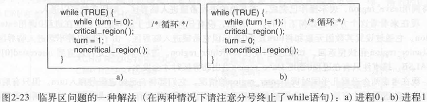

进程0离开临界区时，它将turn的值设置为1，以便允许进程1进入其临界区。假设进程1很快便离开了临界区，则此时两个进程都处于临界区之外，turn的值又被设置为0。现在进程0很快就执行完其整个循环，它退出临界区，并将turn的值设置为1。此时，turn的值为1，两个进程都在其临界区外执行。

突然，进程0结束了非临界区的操作并且返回到循环的开始。但是，这时它不能进入临界区，因为turn的当前值为1，而此时进程1还在忙于非临界区的操作，进程0只有继续while循环，直到进程1把turn的值改为0。这说明，在一个进程比另一个慢了很多的情况下，轮流进入临界区并不是一个好办法。

这种情况违反了前面叙述的条件3：进程0被一个临界区之外的进程阻塞。再回到前面假脱机目录的问题，如果现在将临界区与读写假脱机目录相联系，则进程0有可能因为进程1在做其他事情而被禁止打印另一个文件。

实际上，该方案要求两个进程严格地轮流进入它们的临界区，如假脱机文件等。任何一个进程都不可能在一轮中打印两个文件。尽管该算法的确避免了所有的竞争条件，但由于它违反了条件3，所以不能作为一个很好的备选方案。

#### 4.Peterson解法

荷兰数学家T.Dekker通过将锁变量与警告变量的思想相结合，最早提出了一个不需要严格轮换的软件互斥算法。关于Dekker的算法，请参阅（Dijkstra，1965）。

1981年，G.L.Peterson发现了一种简单得多的互厅算法，这使得Dekker的方法不再有任何新意。Peterson的算法如图2-24所示。该算法由两个用ANSIC编写的过程组成。ANSIC要求为所定义和使用的所有函数提供函数原型。不过，为了节省篇幅，这里和后续的例子中我们都不会给出函数原型。

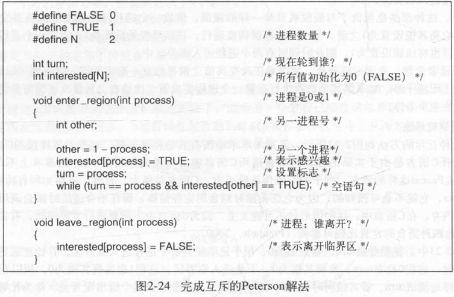

在使用共享变量（即进入其临界区）之前，各个进程使用其进程号0或1作为参数来调用enter_region。该调用在需要时将使进程等待，直到能安全地进入临界区。在完成对共享变量的操作之后，进程将调用leave_region，表示操作已完成，若其他的进程希望进入临界区，则现在就可以进入。

现在来看看这个方案是如何工作的。一开始，没有任何进程处于临界区中，现在进程0调用enter_region。它通过设置其数组元素和将turn置为0来标识它希望进入临界区。由于进程1并不想进入临界区，所以enter_region很快便返回。如果进程1现在调用enter_region，进程1将在此处挂起直到interested[0]变成FALSE，该事件只有在进程o调用leave_region退出临界区时才会发生。

现在考虑两个进程几乎同时调用enter_region的情况。它们都将自己的进程号存入turn，但只有后被保存进去的进程号才有效，前一个因被重写而丢失。假设进程1是后存人的，则turn为1。当两个进程都运行到while语句时，进程0将循环0次并进入临界区，而进程1则将不停地循环且不能进入临界区，直到进程0退出临界区为止。

#### 5.TSL指令

现在来看需要硬件支持的一种方案。某些计算机中，特别是那些设计为多处理器的计算机，都有下面一条指令：TSLRX,LOCK

称为测试并加锁（testandsetlock），它将一个内存字lock读到寄存器RX中，然后在该内存地址上存一个非零值。读字和写字操作保证是不可分割的，即该指令结束之前其他处理器均不允许访问该内存字。执行TSL指令的CPU将锁住内存总线，以禁止其他CPU在本指令结束之前访问内存。

着重说明一下，锁住存储总线不同于屏蔽中断。屏蔽中断，然后在读内存字之后跟着写操作并不能阻止总线上的第二个处理器在读操作和写操作之间访问该内存字。事实上，在处理器1上屏蔽中断对处理器2根本没有任何影响。让处理器2远离内存直到处理器1完成的唯一方法就是锁住总线，这需要一个特殊的硬件设施（基本上，一根总线就可以确保总线由锁住它的处理器使用，而其他的处理器不能用）。

为了使用TSL指令，要使用一个共享变量lock来协调对共享内存的访问。当lock为0时，任何进程都可以使用TSL指令将其设置为1，并读写共享内存。当操作结束时，进程用一条普通的move指令将lock的值重新设置为0。

这条指令如何防止两个进程同时进入临界区呢？解决方案如图2-25所示。假定（但很典型）存在如下共4条指令的汇编语言子程序。第一条指令将lock原来的值复制到寄存器中并将lock设置为1，随后这个原来的值与0相比较。如果它非零，则说明以前已被加锁，则程序将回到开始并再次测试。经过或长或短的一段时间后，该值将变为0（当前处于临界区中的进程退出临界区时），于是过程返回，此时已加锁。要清除这个锁非常简单，程序只需将0存入lock即可，不需要特殊的同步指令。

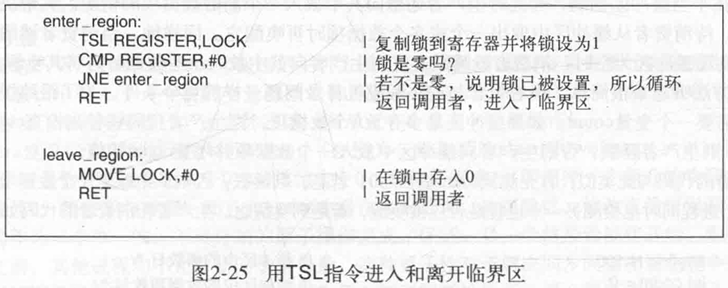

现在有一种很明确的解法了。进程在进入临界区之前先调用enter_region，这将导致忙等待，直到锁空闲为止，随后它获得该锁并返回。在进程从临界区返回时它调用leave_region，这将把lock设置为0。与基于临界区问题的所有解法一样，进程必须在正确的时间调用enter_region和leave_region，解法才能奏效。如果一个进程有欺诈行为，则互斥将会失败。换言之，只有进程合作，临界区才能工作。

一个可替代TSL的指令是XCHG，它原子性地交换了两个位置的内容，例如，一个寄存器与一个存储器字。代码如图2-26所示，而且就像可以看到的那样，它本质上与TSL的解决办法一样。所有的Intelx86CPU在低层同步中使用XCHG指令。

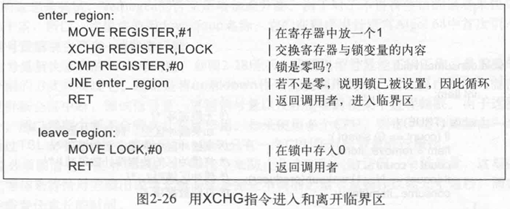

### 2.3.4 睡眠与唤醒

Peterson解法和TSL或XCHG解法都是正确的，但它们都有忙等待的缺点。这些解法在本质上是这样的：

当一个进程想进入临界区时，先检查是否允许进入，若不允许，则该进程将原地等待，直到允许为止。这种方法不仅浪费了CPU时间，而且还可能引起预想不到的结果。考虑一台计算机有两个进程，H优先级较高，L优先级较低。调度规则规定，只要H处于就绪态它就可以运行。在某一时刻，L处于临界区中，此时H变到就绪态，准备运行（例如，一条I/O操作结束）。现在H开始忙等待，但由于当H就绪时L不会被调度，也就无法离开临界区，所以H将永远忙等待下去。这种情况有时被称作优先级反转问题(priority inversion problem)。

现在来考察几条进程间通信原语，它们在无法进入临界区时将阻塞，而不是忙等待。最简单的是sleep和wakeup。sleep是一个将引起调用进程阻塞的系统调用，即被挂起，直到另外一个进程将其唤醒。wakeup调用有一个参数，即要被唤醒的进程。另一种方法是让sleep和wakeup各有一个参数，即有一个用于匹配sleep和wakeup的内存地址。

#### 1. 生产者一消费者问题

作为使用这些原语的一个例子，我们考虑生产者一消费者（producer-consumer）问题，也称作有界缓冲区（bounded-buffer）问题。两个进程共享一个公共的固定大小的缓冲区。其中一个是生产者，将信息放入缓冲区；另一个是消费者，从缓冲区中取出信息。（也可以把这个问题一般化为m个生产者和n个消费者问题，但是这里只讨论一个生产者和一个消费者的情况，这样可以简化解决方案。）

问题在于当缓冲区已满，而此时生产者还想向其中放入一个新的数据项的情况。其解决办法是让生产者睡眠，待消费者从缓冲区中取出一个或多个数据项时再唤醒它。同样地，当消费者试图从缓冲区中取数据而发现缓冲区为空时，消费者就睡眠，直到生产者向其中放入一些数据时再将其唤醒。

这个方法听起来很简单，但它包含与前边假脱机目录问题一样的竞争条件。为了跟踪缓冲区中的数据项数，需要一个变量count。如果缓冲区最多存放N个数据项，则生产者代码将首先检查count是否达到N，若是，则生产者睡眠；否则生产者向缓冲区中放入一个数据项并增量count的值。

消费者的代码与此类似：首先测试count是否为O，若是，则睡眠；否则从中取走一个数据项并递减count的值。每个进程同时也检测另一个进程是否应被唤醒，若是则唤醒之。生产者和消费者的代码如图2-27所示。

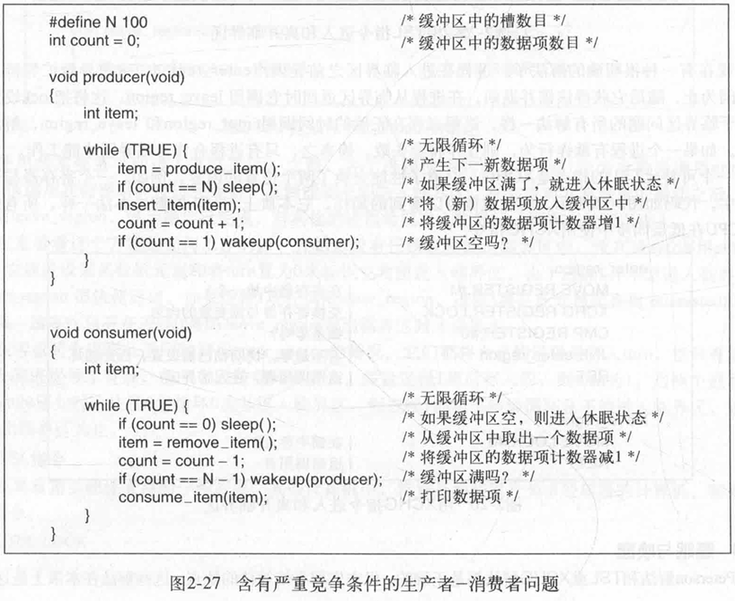

为了在C语言中表示sleep和wakeup这样的系统调用，我们将以库函数调用的形式来表示。尽管它们不是标准C库的一部分，但在实际上任何系统中都具有这些库函数。未列出的过程insert_item和remove_item用来记录将数据项放入缓冲区和从缓冲区取出数据等事项。

现在回到竞争条件的问题。这里有可能会出现竞争条件，其原因是对count的访问未加限制。有可能出现以下情况：缓冲区为空，消费者刚刚读取count的值发现它为0。此时调度程序决定暂停消费者并启动运行生产者。生产者向缓冲区中加入一个数据项，count加l。现在count的值变成了1。它推断认为由于count刚才为0，所以消费者此时一定在睡眠，于是生产者调用wakeup来唤醒消费者。

但是，消费者此时在逻辑上并未睡眠，所以wakeup信号丢失。当消费者下次运行时，它将测试先前读到的count值，发现它为0，于是睡眠。生产者迟早会填满整个缓冲区，然后睡眠。这样一来，两个进程都将永远睡眠下去。

问题的实质在于发给一个（尚）未睡眠进程的wakeup信号丢失了。如果它没有丢失，则一切都很正常。一种快速的弥补方法是修改规则，加上一个唤醒等待位。当一个wakeup信号发送给一个清醒的进程信号时，将该位置1。随后，当该进程要睡眠时，如果唤醒等待位为1，则将该位清除，而该进程仍然保持清醒。唤醒等待位实际上就是wakeup信号的一个小仓库。

尽管在这个简单例子中用唤醒等待位的方法解决了问题，但是我们可以很容易就构造出一些例子，其中有三个或更多的进程，这时一个唤醒等待位就不够使用了。于是我们可以再打一个补丁，加入第二个唤醒等待位，甚至是8个、32个等，但原则上讲，这并没有从根本上解决问题。

### 2.3.5 信号量

信号量是E.W.Dijkstra在1965年提出的一种方法，它使用一个整型变量来累计唤醒次数，供以后使用。在他的建议中引人了一个新的变量类型，称作信号量（semaphore）。一个信号量的取值可以为0（表示没有保存下来的唤醒操作）或者为正值（表示有一个或多个唤醒操作）。

Dijkstra建议设立两种操作：down和up（分别为一般化后的sleep和wakeup）。对一信号量执行down操作，则是检查其值是否大于0。若该值大于0，则将其值减1（即用掉一个保存的唤醒信号）并继续；若该值为0，则进程将睡眠，而且此时down操作并未结束。检查数值、修改变量值以及可能发生的睡眠操作均作为一个单一的、不可分割的原子操作完成。保证一旦一个信号量操作开始，则在该操作完成或阻塞之前，其他进程均不允许访问该信号量。这种原子性对于解决同步问题和避免竞争条件是绝对必要的。所谓原子操作，是指一组相关联的操作要么都不间断地执行，要么都不执行。原子操作在计算机科学的其他领域也是非常重要的。

up操作对信号量的值增1。如果一个或多个进程在该信号量上睡眠，无法完成一个先前的down操作，则由系统选择其中的一个（如随机挑选）并允许该进程完成它的down操作。于是，对一个有进程在其上睡眠的信号量执行一次up操作之后，该信号量的值仍旧是0，但在其上睡眠的进程却少了一个。信号量的值增1和唤醒一个进程同样也是不可分割的。不会有某个进程因执行up而阻塞，正如在前面的模型中不会有进程因执行wakeup而阻塞一样。

顺便提一下，在Dijkstra原来的论文中，他分别使用名称P和V而不是down和up，荷兰语中，Proberen的意思是尝试，Verhogen的含义是增加或升高。由于对于不讲荷兰语的读者来说采用什么记号并无大的干系，所以，这里将使用down和up名称。它们在程序设计语言Algol68中首次引入。

#### 用信号量解决生产者一消费者问题

用信号量解决丢失的wakeup问题，如图2-28所示。为确保信号量能正确工作，最重要的是要采用一种不可分割的方式来实现它。通常是将up和down作为系统调用实现，而且操作系统只需在执行以下操作时暂时屏蔽全部中断：测试信号量、更新信号量以及在需要时使某个进程睡眠。由于这些动作只需要几条指令，所以屏蔽中断不会带来什么副作用。如果使用多个CPU，则每个信号量应由一个锁变量进行保护。通过TSL或XCHG指令来确保同一时刻只有一个CPU在对信号量进行操作。

读者必须搞清楚，使用TSL或XCHG指令来防止几个CPU同时访问一个信号量，这与生产者或消费者使用忙等待来等待对方腾出或填充缓冲区是完全不同的。信号量操作仅需几个毫秒，而生产者或消费者则可能需要任意长的时间。

该解决方案使用了三个信号量：一个称为full，用来记录充满的缓冲槽数目；一个称为empty，记录空的缓冲槽数目，一个称为mutex，用来确保生产者和消费者不会同时访问缓冲区。full的初值为0，empty的初值为缓冲区中槽的数目，mutex初值为1。供两个或多个进程使用的信号量，其初值为1，保证同时只有一个进程可以进入临界区，称作二元信号量（binarysemaphore）。如果每个进程在进入临界区前都执行一个down操作，并在刚刚退出时执行一个up操作，就能够实现互厅。

在有了进程间通信原语之后，我们观察一下图2-5中的中断顺序。在使用信号量的系统中，隐藏中断的最自然的方法是为每一个IVO设备设置一个信号量，其初值为0。在启动一个I/O设备之后，管理进程就立即对相关联的信号量执行一个down操作，于是进程立即被阻塞。当中断到来时，中断处理程序随后对相关信号量执行一个up操作，从而将相关的进程设置为就绪状态。在该模型中，图2-5中的第5步包括在设备的信号量上执行up操作，这样在第6步中，调度程序将能执行设备管理程序。当然，如果这时有几个进程就绪，则调度程序下次可以选择一个更为重要的进程来运行。本章的后续内容中，我们将看到调度算法是如何进行的。

图2-28的例子实际上是通过两种不同的方式来使用信号量的，两者之间的区别是很重要的。信号量mutex用于互厅，它用于保证任一时刻只有一个进程读写缓冲区和相关的变量。互斥是避免混乱所必需的操作。在下一节中，我们将讨论互斥量及其实现方法。

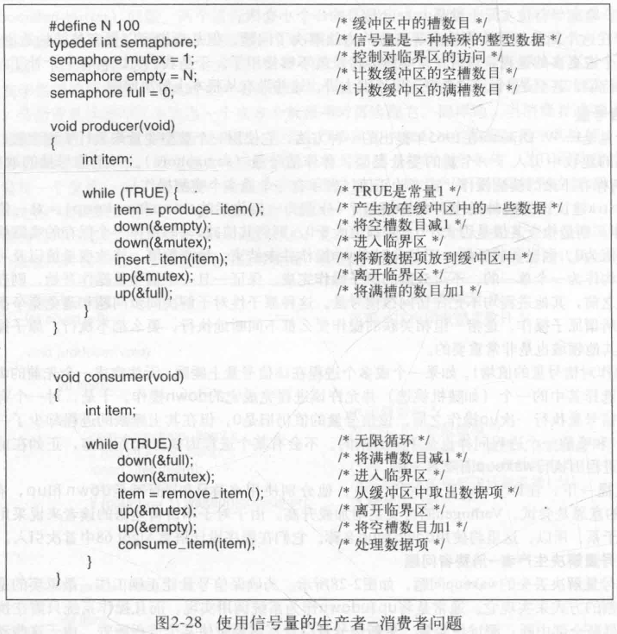

信号量的另一种用途是用于实现同步（synchronization）。信号量full和empty用来保证某种事件的顺序发生或不发生。在本例中，它们保证当缓冲区满的时候生产者停止运行，以及当缓冲区空的时候消费者停止运行。这种用法与互厅是不同的。

### 2.3.6 互斥量

如果不需要信号量的计数能力，有时可以使用信号量的一个简化版本，称为互斥量（mutex）。互斥量仅仅适用于管理共享资源或一小段代码。由于互斥量在实现时既容易又有效，这使得互斥量在实现用户空间线程包时非常有用。

互斥量是一个可以处于两态之一的变量：解锁和加锁。这样，只需要一个二进制位表示它，不过实际上，常常使用一个整型量，0表示解锁，而其他所有的值则表示加锁。互斥量使用两个过程。当一个线程（或进程）需要访问临界区时，它调用mutex_lock。如果该互斥量当前是解锁的（即临界区可用），此调用成功，调用线程可以自由进入该临界区。

另一方面，如果该互厅量已经加锁，调用线程被阻塞，直到在临界区中的线程完成并调用mutex_unlock。如果多个线程被阻塞在该互斥量上，将随机选择一个线程并允许它获得锁。

由于互斥量非常简单，所以如果有可用的TSL或XCHG指令，就可以很容易地在用户空间中实现它们。用于用户级线程包的mutex_lock和mutex_unlock代码如图2-29所示。XCHG解法本质上是相同的。

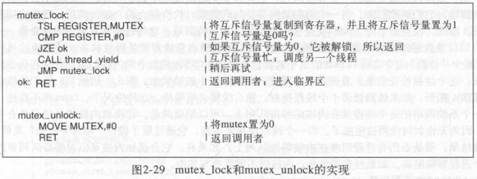

mutex_lock的代码与图2-25中enter_region的代码很相似，但有一个关键的区别。当enter_region进入临界区失败时，它始终重复测试锁（忙等待）。实际上，由于时钟超时的作用，会调度其他进程运行。这样迟早拥有锁的进程会进人运行并释放锁。

在（用户）线程中，情形有所不同，因为没有时钟停止运行时间过长的线程。结果是通过忙等待的方式来试图获得锁的线程将永远循环下去，决不会得到锁，因为这个运行的线程不会让其他线程运行从而释放锁。

以上就是enter_region和mutex_lock的差别所在。在后者取锁失败时，它调用thread_yield将CPU放弃给另一个线程。这样，就没有忙等待。在该线程下次运行时，它再一次对锁进行测试。

由于thread_yield只是在用户空间中对线程调度程序的一个调用，所以它的运行非常快捷。这样，mutex_lock和mutex_unlock都不需要任何内核调用。通过使用这些过程，用户线程完全可以实现在用户空间中的同步，这些过程仅仅需要少量的指令。

上面所叙述的互厅量系统是一套调用框架。对于软件来说，总是需要更多的特性，而同步原语也不例外。例如，有时线程包提供一个调用mutex_trylock，这个调用或者获得锁或者返回失败码，但并不阻塞线程。这就给了调用线程一个灵活性，用以决定下一步做什么，是使用替代办法还只是等待下去。

到目前为止，我们掩盖了一个问题，不过现在还是有必要把这个问题提出来。在用户级线程包中，多个线程访问同一个互斥量是没有问题的，因为所有的线程都在一个公共地址空间中操作。但是，对于大多数早期解决方案，诸如Peterson算法和信号量等，都有一个未说明的前提，即这些多个进程至少应该访问一些共享内存，也许仅仅是一个字。如果进程有不连续的地址空间，如我们始终提到的，那么在Peterson算法、信号量或公共缓冲区中，它们如何共享turn变量呢？

有两种方案。第一种，有些共享数据结构，如信号量，可以存放在内核中，并且只能通过系统调用来访问。这种处理方式化解了上述问题。第二种，多数现代操作系统（包括UNIX和Windows）提供一种方法，让进程与其他进程共享其部分地址空间。在这种方法中，缓冲区和其他数据结构可以共享。在最坏的情形下，如果没有可共享的途径，则可以使用共享文件。

如果两个或多个进程共享其全部或大部分地址空间，进程和线程之间的差别就变得模糊起来，但无论怎样，两者的差别还是有的。共享一个公共地址空间的两个进程仍旧有各自的打开文件、定时器以及其他一些单个进程的特性，而在单个进程中的线程，则共享进程全部的特性。另外，共享一个公共地址空间的多个进程决不会拥有用户级线程的效率，这一点是不容置疑的，这是因为内核还同其管理密切相关。

#### 1. 快速用户区互斥量futex

随着并行的增加，有效的同步和锁机制对性能而言非常重要。如果等待时间短的话，自旋锁会很快，但如果等待时间长，则会浪费CPU周期。如果有很多竞争，那么阻塞此进程，并仅当锁被释放的时候让内核解除阻塞会更加有效。然而，这却带来了相反的问题：它在竞争激烈的情况下效果不错，但如果一开始只有很小的竞争，那么不停地内核切换将花销很大。更糟的是，预测锁竞争的数量并不容易。

一个引人注意的致力于结合两者优点的解决方案称作“futex”，或者“快速用户空间互厅”。futex是Linux的一个特性，它实现了基本的锁（很像互斥锁），但避免了陷入内核，除非它真的不得不这样做。因为来回切换到内核花销很大，所以这样做可观地改善了性能。一个futex包含两个部分：一个内核服务和一个用户库。内核服务提供一个等待队列，它允许多个进程在一个锁上等待。它们将不会运行，除非内核明确地对它们解除阻塞。将一个进程放到等待队列需要（代价很大的）系统调用，我们应该避免这种情况。因此，没有竞争时，futex完全在用户空间工作。特别地，这些进程共享通用的锁变量一二个对齐的32位整数锁的专业术语。假设锁初始值为1，即假设这意味着锁是释放状态。线程通过执行原子操作“减少并检验”来夺取锁（Linux的原子函数包含封装在C语言函数中的内联汇编并定义在头文件中）。接下来，这个线程检查结果，看锁是否被释放。如果未处于被锁状态，那么一切顺利，我们的线程成功夺取该锁。然而，如果该锁被另一个线程持有，那么线程必须等待。这种情况下，futex库不自旋，而是使用一个系统调用把这个线程放在内核的等待队列上。可以期望的是，切换到内核的开销已是合乎情理的了，因为无论如何线程被阻塞了。当一个线程使用完该锁，它通过原子操作“增加并检验”来释放锁，并检查结果，看是否仍有进程阻塞在内核等待队列上。如果有，它会通知内核可以对等待队列里的一个或多个进程解除阻塞。如果没有锁竞争，内核则不需要参与其中。

#### 2.pthread中的互斥量

Pthread提供许多可以用来同步线程的函数。其基本机制是使用一个可以被锁定和解锁的互厅量来保护每个临界区。一个线程如果想要进入临界区，它首先尝试锁住相关的互厅量。如果互厅量没有加锁，那么这个线程可以立即进入，并且该互厅量被自动锁定以防止其他线程进入。如果互斥量已经被加锁，则调用线程被阻塞，直到该互厅量被解锁。如果多个线程在等待同一个互厅量，当它被解锁时，这些等待的线程中只有一个被允许运行并将互厅量重新锁定。这些互斥锁不是强制性的，而是由程序员来保证线程正确地使用它们。

与互厅量相关的主要函数调用如图2-30所示。就像所期待的那样，可以创建和撤销互厅量。实现它们的函数调用分别是pthread_mutex_init与pthread_mutex_destroy。也可以通过pthread_mutex_lock给互斥量加锁，如果该互厅量已被加锁时，则会阻塞调用者。还有一个调用可以用来尝试锁住一个互厅量，当互斥量已被加锁时会返回错误代码而不是阻塞调用者。这个调用就是pthread_mutex_trylock。如果需要的话，该调用允许一个线程有效地忙等待。最后，pthread_mutex_unlock用来给一个互斥量解锁，并在一个或多个线程等待它的情况下正确地释放一个线程。互斥量也可以有属性，但是这些属性只在某些特殊的场合下使用。

除互厅量之外，pthread提供了另一种同步机制：条件变量。互斥量在允许或阻塞对临界区的访问上是很有用的，条件变量则允许线程由于一些未达到的条件而阻塞。绝大部分情况下这两种方法是一起使用的。现在让我们进一步地研究线程、互斥量、条件变量之间的关联。

举一个简单的例子，再次考虑一下生产者一消费者问题：一个线程将产品放在一个缓冲区内，由另一个线程将它们取出。如果生产者发现缓冲区中没有空槽可以使用了，它不得不阻塞起来直到有一个空槽可以使用。生产者使用互厅量可以进行原子性检查，而不受其他线程干扰。但是当发现缓冲区已经满了以后，生产者需要一种方法来阻塞自己并在以后被唤醒。这便是条件变量做的事了。

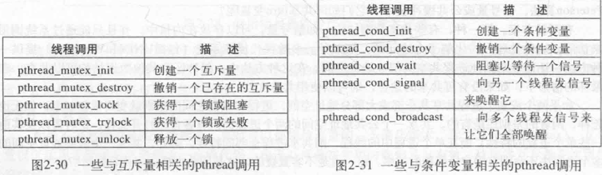

图2-31给出了与条件变量相关的最重要的pthread调用。就像你可能期待的那样，这里有专门的调用用来创建和撤销条件变量。它们可以有属性，并且有不同的调用来管理它们（图中没有给出）。条件变量上的主要操作是pthread_cond_wait和pthread_cond_signal，前者阻塞调用线程直到另一其他线程向它发信号（使用后一个调用）。当然，阻塞与等待的原因不是等待与发信号协议的一部分。被阻塞的线程经常是在等待发信号的线程去做某些工作、释放某些资源或是进行其他的一些活动。只有完成后被阻塞的线程才可以继续运行。条件变量允许这种等待与阻塞原子性地进行。当有多个线程被阻塞并等待同一个信号时，可以使用pthread_cond_broadcast调用。

条件变量与互厅量经常一起使用。这种模式用于让一个线程锁住一个互厅量，然后当它不能获得它期待的结果时等待一个条件变量。最后另一个线程会向它发信号，使它可以继续执行。pthread_cond_wait原子性地调用并解锁它持有的互斥量。由于这个原因，互斥量是参数之一。

值得指出的是，条件变量（不像信号量）不会存在内存中。如果将一个信号量传递给一个没有线程在等待的条件变量，那么这个信号就会丢失。程序员必须小心使用避免丢失信号。

作为如何使用一个互厅量与条件变量的例子，图2-32展示了一个非常简单只有一个缓冲区的生产者一消费者问题。当生产者填满缓冲区时，它在生产下一个数据项之前必须等待，直到消费者清空了它。类似地，当消费者移走一个数据项时，它必须等待，直到生产者生产了另外一个数据项。尽管很简单，这个例子却说明了基本的机制。使一个线程睡眠的语句应该总是要检查这个条件，以保证线程在继续执行前满足条件，因为线程可能已经因为一个UNIX信号或其他原因而被唤醒。

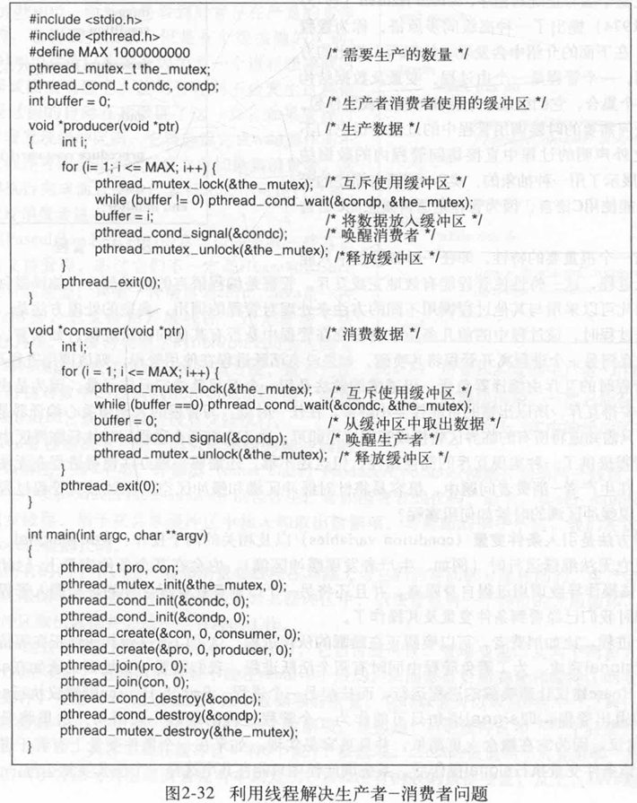

### 2.3.7 管程

有了信号量和互斥量之后，进程间通信看来就很容易了，实际是这样的吗？答案是否定的。请仔细考察图2-28中向缓冲区放入数据项以及从中删除数据项之前的down操作。假设将生产者代码中的两个down操作交换一下次序，将使得mutex的值在empty之前而不是在其之后被减1。如果缓冲区完全满了，生产者将阻塞，mutex值为0。这样一来，当消费者下次试图访问缓冲区时，它将对mutex执行一个down操作，由于mutex值为0，则消费者也将阻塞。两个进程都将永远地阻塞下去，无法再进行有效的工作，这种不幸的状况称作死锁（deadlock）。我们将在第6章中详细讨论死锁问题。

指出这个问题是为了说明使用信号量时要非常小心。一处很小的错误将导致很大的麻烦。这就像用汇编语言编程一样，甚至更糟，因为这里出现的错误都是竞争条件、死锁以及其他一些不可预测和不可再现的行为。

为了更易于编写正确的程序，BrinchHansen（1973）和Hoare（1974）提出了一种高级同步原语，称为管程（monitor）。在下面的介绍中会发现，他们两人提出的方案略有不同。一个管程是一个由过程、变量及数据结构等组成的一个集合，它们组成一个特殊的模块或软件包。进程可在任何需要的时候调用管程中的过程，但它们不能在管程之外声明的过程中直接访问管程内的数据结构。图2-33展示了用一种抽象的、类Pascal语言描述的管程。这里不能使用C语言，因为管程是语言概念而C语言并不支持它。

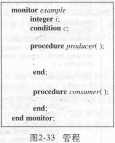

管程有一个很重要的特性，即任一时刻管程中只能有一个活跃进程，这一特性使管程能有效地完成互厅。管程是编程语言的组成部分，编译器知道它们的特殊性，因此可以采用与其他过程调用不同的方法来处理对管程的调用。典型的处理方法是，当一个进程调用管程过程时，该过程中的前几条指令将检查在管程中是否有其他的活跃进程。如果有，调用进程将被挂起，直到另一个进程离开管程将其唤醒。如果没有活跃进程在使用管程，则该调用进程可以进入。

进入管程时的互厅由编译器负责，但通常的做法是用一个互斥量或二元信号量。因为是由编译器而非程序员来安排互厅，所以出错的可能性要小得多。在任一时刻，写管程的人无须关心编译器是如何实现互斥的。他只需知道将所有的临界区转换成管程过程即可，决不会有两个进程同时执行临界区中的代码。

尽管管程提供了一种实现互厅的简便途径，但这还不够，还需要一种办法使得进程在无法继续运行时被阻塞。在生产者一消费者问题中，很容易将针对缓冲区满和缓冲区空的测试放到管程过程中，但是生产者在发现缓冲区满的时候如何阻塞呢？

解决的方法是引入条件变量（conditionvariables）以及相关的两个操作：wait和signal。当一个管程过程发现它无法继续运行时（例如，生产者发现缓冲区满），它会在某个条件变量上（如full）执行wait操作。该操作导致调用进程自身阻塞，并且还将另一个以前等在管程之外的进程调入管程。在前面介绍pthread时我们已经看到条件变量及其操作了。

另一个进程，比如消费者，可以唤醒正在睡眠的伙伴进程，这可以通过对其伙伴正在等待的一个条件变量执行signal完成。为了避免管程中同时有两个活跃进程，我们需要一条规则来通知在signal之后该怎么办。Hoare建议让新唤醒的进程运行，而挂起另一个进程。BrinchHansen则建议执行signal的进程必须立即退出管程，即signal语句只可能作为一个管程过程的最后一条语句。这里将采纳BrinchHansen的建议，因为它在概念上更简单，并且更容易实现。如果在一个条件变量上有若干进程正在等待，则在对该条件变量执行signal操作后，系统调度程序只能在其中选择一个使其恢复运行。

顺便提一下，还有一个Hoare和BrinchHansen都没有提及的第三种方法，该方法让发信号者继续运行，并且只有在发信号者退出管程之后，才允许等待的进程开始运行。

条件变量不是计数器，条件变量也不能像信号量那样积累信号以便以后使用。所以，如果向一个条件变量发送信号，但是在该条件变量上并没有等待进程，则该信号会永远丢失。换句话说，wait操作必须在signal之前。这条规则使得实现简单了许多。实际上这不是一个问题，因为在需要时，用变量很容易跟踪每个进程的状态。一个原本要执行signal的进程，只要检查这些变量便可以知道该操作是否有必要。

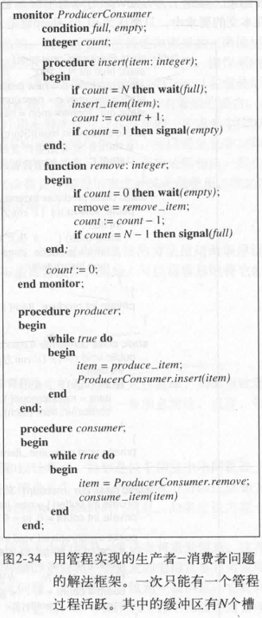

在图2-34中给出了用类Pascal语言，通过管程实现的生产者一消费者问题的解法框架。使用类Pascal语言的优点在于清晰、简单，并且严格符合Hoare/BrinchHansen模型。

读者可能会觉得wait和signal操作看起来像前面提到的sleep和wakeup，而且已经看到后者存在严重的竞争条件。是的，它们确实很像，但是有个很关键的区别：sleep和wakeup之所以失败是因为当一个进程想睡眠时另一个进程试图去唤醒它。使用管程则不会发生这种情况。对管程过程的自动互厅保证了这一点：如果管程过程中的生产者发现缓冲区满，它将能够完成wait操作而不用担心调度程序可能会在wait完成之前切换到消费者。甚至，在wait执行完成而且把生产者标志为不可运行之前，根本不会允许消费者进入管程。

尽管类Pascal是一种想象的语言，但还是有一些真正的编程语言支持管程，不过它们不一定是Hoare和BrinchHansen所设计的模型。其中一种语言是Java。Java是一种面向对象的语言，它支持用户级线程，还允许将方法（过程）划分为类。只要将关键字synchronized加人到方法声明中，Java保证一旦某个线程执行该方法，就不允许其他线程执行该对象中的任何synchronized方法。没有关键字synchronized，就不能保证没有交错执行。

使用Java管程解决生产者一消费者问题的解法如图2-35所示。该解法中有4个类。外部类（outerclass）ProducerConsumer创建并启动两个线程，p和c。第二个类和第三个类producer和consumer分别包含生产者和消费者的代码。最后，类our_monitor是管程，它有两个同步线程，用于在共享缓冲区中插入和取出数据项。与前面的例子不同，我们在这里给出了insert和remove的全部代码。

在前面所有的例子中，生产者和消费者线程在功能上与它们的等同部分是相同的。生产者有一个无限循环，该无限循环产生数据并将数据放入公共缓冲区中；消费者也有一个等价的无限循环，该无限循环从公共缓冲区取出数据并完成一些有趣的工作。

该程序中比较有意思的部分是类our_monitor，它包含缓冲区、管理变量以及两个同步方法。当生产者在insert内活动时，它确信消费者不能在remove中活动，从而保证更新变量和缓冲区的安全，且不用担心竞争条件。变量count记录在缓冲区中数据项的数量。它的取值可以取从0到N一1之间任何值。变量lo是缓冲区槽的序号，指出将要取出的下一个数据项。类似地，hi是缓冲区中下一个将要放入的数据项序号。允许lo=hi，其含义是在缓冲区中有0个或N个数据项。count的值说明了究竟是哪一种情形。

Java中的同步方法与其他经典管程有本质差别：Java没有内嵌的条件变量。反之，Java提供了两个过程wait和notify，分别与sleep和wakeup等价，不过，当它们在同步方法中使用时，它们不受竞争条件约束。理论上，方法wait可以被中断，它本身就是与中断有关的代码。Java需要显式表示异常处理。在本文的要求中，只要认为go_to_sleep就是去睡眠即可。

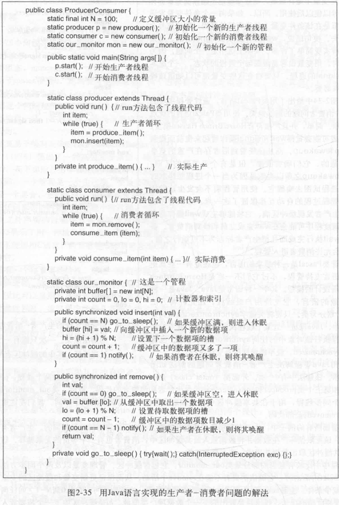

通过临界区互斥的自动化，管程比信号量更容易保证并行编程的正确性。但管程也有缺点。我们之所以使用类Pascal和Java，而不像在本书中其他例子那样使用C语言，并不是没有原因的。正如前面提到过的，管程是一个编程语言概念，编译器必须要识别管程并用某种方式对其互斥做出安排。C、Pascal以及多数其他语言都没有管程，所以指望这些编译器遵守互厅规则是不合理的。实际中，如何能让编译器知道哪些过程属于管程，哪些不属于管程呢？

在上述语言中同样也没有信号量，但增加信号量是很容易的：读者需要做的就是向库里加人两段短小的汇编程序代码，以执行up和down系统调用。编译器甚至用不着知道它们的存在。当然，操作系统必须知道信号量的存在，或至少有一个基于信号量的操作系统，读者仍旧可以使用C或C++（甚至是汇编语言，如果读者乐意的话）来编写用户程序，但是如果使用管程，读者就需要一种带有管程的语言。

与管程和信号量有关的另一个问题是，这些机制都是设计用来解决访问公共内存的一个或多个CPU上的互斥问题的。通过将信号量放在共享内存中并用TSL或XCHG指令来保护它们，可以避免竞争。如果一个分布式系统具有多个CPU，并且每个CPU拥有自已的私有内存，它们通过一个局域网相连，那么这些原语将失效。这里的结论是：信号量太低级了，而管程在少数几种编程语言之外又无法使用，并且，这些原语均未提供机器间的信息交换方法。所以还需要其他的方法。

### 2.3.8 消息传递

上面提到的其他的方法就是消息传递（messagepassing）。这种进程间通信的方法使用两条原语send和receive，它们像信号量而不像管程，是系统调用而不是语言成分。因此，可以很容易地将它们加人到库例程中去。例如：

send(destination,&message);和receive(source,&message);

前一个调用向一个给定的目标发送一条消息，后一个调用从一个给定的源（或者是任意源，如果接收者不介意的话）接收一条消息。如果没有消息可用，则接收者可能被阻塞，直到一条消息到达，或者，带着一个错误码立即返回。

#### 1.消息传递系统的设计要点

消息传递系统面临着许多信号量和管程所未涉及的问题和设计难点，特别是位于网络中不同机器上的通信进程的情况。例如，消息有可能被网络丢失。为了防止消息丢失，发送方和接收方可以达成如下一致：一旦接收到信息，接收方马上回送一条特殊的确认（acknowledgement）消息。如果发送方在一段时间间隔内未收到确认，则重发消息。

现在考虑消息本身被正确接收，而返回给发送者的确认信息丢失的情况。发送者将重发信息，这样接收者将接收到两次相同的消息。对于接收者来说，如何区分新的消息和一条重发的老消息是非常重要的。通常采用在每条原始消息中嵌入一个连续的序号来解决此问题。如果接收者收到一条消息，它具有与前面某一条消息一样的序号，就知道这条消息是重复的，可以忽略。不可靠消息传递中的成功通信问题是计算机网络的主要研究内容。更多的信息可以参考相关文献Tanenbaum（1996）和Wetherall（2010）。

消息系统还需要解决进程命名的问题，在send和receive调用中所指定的进程必须是没有二义性的。身份认证（authentication）也是一个问题，比如，客户端怎么知道它是在与一个真正的文件服务器通信，而不是与一个冒充者通信？

对于发送者和接收者在同一台机器上的情况，也存在若干设计问题。其中一个设计问题就是性能问题。将消息从一个进程复制到另一个进程通常比信号量操作和进入管程要慢。

#### 2.用消息传递解决生产者一消费者问题

现在我们来考察如何用消息传递而不是共享内存来解决生产者一消费者问题。在图2-36中给出了一种解法。假设所有的消息都有同样的大小，并且在尚未接收到发出的消息时，由操作系统自动进行缓冲。在该解决方案中共使用N条消息，这就类似于一块共享内存缓冲区中的N个槽。消费者首先将N条空消息发送给生产者。当生产者向消费者传递一个数据项时，它取走一条空消息并送回一条填充了内容的消息。通过这种方式，系统中总的消息数保持不变，所以消息都可以存放在事先确定数量的内存中。

如果生产者的速度比消费者快，则所有的消息最终都将被填满，等待消费者，生产者将被阻塞，等待返回一条空消息。如果消费者速度快，则情况正好相反：所有的消息均为空，等待生产者来填充它们，消费者被阻塞，以等待一条填充过的消息。

消息传递方式可以有许多变体，下面首先介绍如何对消息进行编址。一种方法是为每个进程分配一个唯一的地址，让消息按进程的地址编址。另一种方法是引入一种新的数据结构，称作信箱（mailbox）。信箱是一个用来对一定数量的消息进行缓冲的地方，信箱中消息数量的设置方法也有多种，典型的方法是在信箱创建时确定消息的数量。当使用信箱时，在send和receive调用中的地址参数就是信箱的地址，而不是进程的地址。当一个进程试图向一个满的信箱发消息时，它将被挂起，直到信箱内有消息被取走，从而为新消息腾出空间。

对于生产者一消费者问题，生产者和消费者均应创建足够容纳N条消息的信箱。生产者向消费者信箱发送包含实际数据的消息，消费者则向生产者信箱发送空的消息。当使用信箱时，缓冲机制的作用是很清楚的：目标信箱容纳那些已被发送但尚未被目标进程接收的消息。

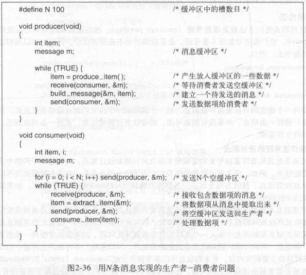

使用信箱的另一种极端方法是彻底取消缓冲。采用这种方法时，如果send在receive之前执行，则发送进程被阻塞，直到receive发生。在执行receive时，消息可以直接从发送者复制到接收者，不用任何中间缓冲。类似地，如果先执行receive，则接收者会被阻塞，直到send发生。这种方案常被称为会合（rendezvous）。与带有缓冲的消息方案相比，该方案实现起来更容易一些，但却降低了灵活性，因为发送者和接收者一定要以步步紧接的方式运行。

通常在并行程序设计系统中使用消息传递。例如，一个著名的消息传递系统是消息传递接口（Message-PassingInterface，MPI），它广泛应用在科学计算中。有关该系统的更多信息，可参考Gropp等人（1994）和Snir等人（1996）的文献。

### 2.3.9 屏障

最后一个同步机制是准备用于进程组而不是用于双进程的生产者一消费者类情形的。在有些应用中划分了若干阶段，并且规定，除非所有的进程都就绪准备着手下一个阶段，否则任何进程都不能进入下一个阶段。可以通过在每个阶段的结尾安置屏障（barrier）来实现这种行为。当一个进程到达屏障时，它就被屏障阻拦，直到所有进程都到达该屏障为止。屏障可用于一组进程同步，屏障的操作如图2-37所示。

在图2-37a中可以看到有四个进程接近屏障，这意味着它们正在运算，但是还没有到达每个阶段的结尾。过了一会儿，第一个进程完成了所有需要在第一阶段进行的计算。它接着执行barrier原语，这通常是调用一个库过程。于是该进程被挂起。一会儿，第二个和第三个进程也完成了第一阶段的计算，也接着执行barrier原语。这种情形如图2-37b所示。结果，当最后一个进程C到达屏障时，所有的进程就一起被释放，如图2-37c所示。

作为一个需要屏障的例子，考虑在物理或工程中的一个典型弛豫问题。这是一个带有初值的矩阵。这些值可能代表一块金属板上各个点的温度值。基本想法可以是准备计算如下的问题：要花费多长时间，在一个角上的火焰才能传播到整个板上。

计算从当前值开始，先对矩阵进行一个变换，从而得到第二个矩阵，例如，运用热力学定律考察在AT之后的整个温度分布。然后，进程不断重复，随着金属板的加热，给出样本点温度随时间变化的函数。该算法从而随时间变化生成出一系列矩阵。

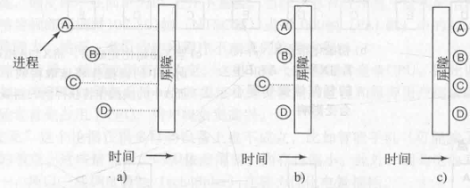

> 图2-37屏障的使用：a）进程接近屏障；b）除了一个之外所有的进程都被屏障阻塞；c）当最后一个进程到达屏障时，所有的进程一起通过

现在，设想这个矩阵非常之大（比如100万行乘以100万列），所以需要并行处理（可能在一台多处理器上）以便加速运算。各个进程工作在这个矩阵的不同部分，并且从老的矩阵按照物理定律计算新的矩阵元素。但是，除非第n次迭代已经完成，也就是说，除非所有的进程都完成了当前的工作，否则没有进程可以开始第n+1次迭代。实现这一目标的方法是通过编程使每一个进程在完成当前选代部分后执的进程会被释放而开始新的迭代过程。行一个屏障操作。只有当全部进程完成工作之后，新的矩阵（下一次迭代的输入）才会完成，此时所有的进程会被释放而开始新的迭代过程。

### 2.3.10 避免锁：读一复制一更新

ROHTLF最快的锁是根本没有锁。问题在于在没有锁的情况下，我们是否允许对共享数据结构的并发读写进行访问。在通常情况下，答案显然是否定的。假设进程A正在对一个数字数组进行排序，而进程B正在计算其均值。因为A在数组中将数值前后来回移动，所以B可能多次遇到某些数值，而某些数值则根本没有遇到过。得到的结果可能是任意值，而它几乎肯定是错的。

然而，在某些情况下，我们可以允许写操作来更新数据结构，即便还有其他的进程正在使用它。窍门在于确保每个读操作要么读取旧的数据版本，要么读取新的数据版本，但绝不能是新旧数据的一些奇怪组合。举例说明，考虑图2-38中的树。读操作从根部到叶子遍历整个树。在图的上半部分，加人一个新的节点X。为了实现这一操作，我们要让这个节点在树中可见之前使它“恰好正确”：我们对节点X中的所有值进行初始化，包括它的子节点指针。然后通过原子写操作，使X成为A的子节点。所有的读操作都不会读到前后不一致的版本。在图的下半部分，我们接着移除B和D。首先，将A的左子节点指针指向C。所有原本在A中的读操作将会后续读到节点C，而永远不会读B和D。也就是说，它们将只会读到新版数据。同样，所有当前在B和D中的读操作将继续依照原始的数据结构指针并且读取旧版数据。所有操作均正确进行，我们不需要锁住任何东西。而不需要锁住数据结构就能移去B和D的主要原因就是读一复制一更新（Read-Copy-Update，RCU），将更新过程中的移除和再分配过程分离开来。当然，还有一个问题。只要还不能确定没有对B和D更多的读操作，我们就不能真正释放它们。但是应该等待多久呢？一分钟？或者十分钟？我们不得不等到最后一个读操作读完这些节点。RCU谨慎地决定读操作持有一个数据结构引用的最大时间。在这段时间之后，就能安全地将内存回收。特别地，读者通过读端临界区访问数据结构，它可以包含任何代码，只要该代码不阻塞或者休眠。这样的话，就知道了需要等待的最大时长。特别地，我们定义一个任意时间段的宽限期（graceperiod），在这个时期内，每个线程至少有一次在读端临界区之外。如果等待至少一个宽限期的时间段后进行回收，这一切就会令人满意。由于读端临界区中的代码不允许阻塞或者休眠，因此一个简单的准则就是一直等到所有的线程执行完一次上下文切换。

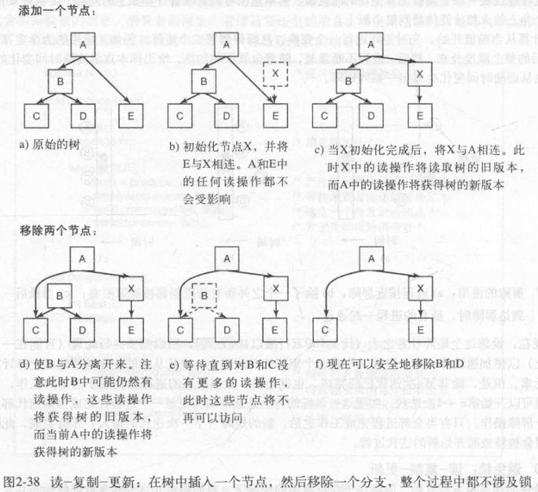

## 2.4 调度

当计算机系统是多道程序设计系统时，通常就会有多个进程或线程同时竞争CPU。只要有两个或更多的进程处于就绪状态，这种情形就会发生。如果只有一个CPU可用，那么就必须选择下一个要运行的进程。在操作系统中，完成选择工作的这一部分称为调度程序（scheduler），该程序使用的算法称为调度算法（schedulingalgorithm）。

尽管有一些不同，但许多适用于进程调度的处理方法也同样适用于线程调度。当内核管理线程的时候，调度经常是按线程级别的，与线程所属的进程基本或根本没有关联。下面我们将首先关注适用于进装理程与线程两者的调度问题，然后会明确地介绍线程调度以及它所产生的独特问题。第8章将讨论多核芯的问题。

### 2.4.1 调度简介

让我们回到早期以磁带上的卡片作为输入的批处理系统时代，那时的调度算法很简单：依次运行磁带上的每一个作业。对于多道程序设计系统，调度算法要复杂一些，因为经常有多个用户等候服务。有些大型机系统仍旧将批处理和分时服务结合使用，需要调度程序决定下一个运行的是一个批处理作业还是终端上的一个交互用户。（顺便提及，一个批处理作业可能需要连续运行多个程序，不过在本节中，假设它只是一个运行单个程序的请求。）由于在这些机器中，CPU是稀缺资源，所以好的调度程序可以在提高性能和用户的满意度方面取得很大的成果。因此，大量的研究工作都花费在创造聪明而有效的调度算法上了。

在个人计算机出现之后，整个情形向两个方面发展。首先，在多数时间内只有一个活动进程。一个用户进入文字处理软件编辑一个文件时，一般不会同时在后台编译一个程序。在用户向文字处理软件键人一条命令时，调度程序不用做多少工作来判定哪个进程要运行一—一唯一的候选者是文字处理软件。

其次，同CPU是稀缺资源时的年代相比，现在计算机速度极快。个人计算机的多数程序受到的是用户当前输入速率（键入或敲击鼠标）的限制，而不是CPU处理速率的限制。即便对于编译（这是过去CPU周期的主要消耗者）现在大多数情况下也只要花费仅仅几秒钟。甚至两个实际同时运行的程序，诸如一个文字处理软件和一个电子表单，由于用户在等待两者完成工作，因此很难说需要哪一个先完成。这样的结果是，调度程序在简单的PC上并不重要。当然，总有应用程序会实际消耗掉CPU，例如，为绘制一小时高精度视频而调整107892帧（NTSC制）或90000帧（PAL制）中的每一帧颜色就需要大量工业强度的计算能力。然而，类似的应用程序不在我们的考虑范围。

对于网络服务器，情况略微有些改变。这里，多个进程经常竞争CPU，因此调度功能再一次变得至关重要。例如，当CPU必须在运行一个收集每日统计数据的进程和服务用户需求的进程之间进行选择的时候，如果后者首先占用了CPU，用户将会更高兴。

“资源充足”这个论据在很多移动设备上也不成立，比如智能手机（可能除了最先进的几款）以及传感器网络的节点。这些情况下，CPU依然薄弱，内存也偏小。此外，因为电池寿命短是这些设备最重要的约束之一，所以一些调度算法（scheduler）在努力优化电量损耗。

另外，为了选取正确的进程运行，调度程序还要考虑CPU的利用率，因为进程切换的代价是比较高的。首先用户态必须切换到内核态；然后要保存当前进程的状态，包括在进程表中存储寄存器值以便以后重新装载。在许多系统中，内存映像（例如，页表内的内存访问位）也必须保存，接着，通过运行调度算法选定一个新进程；之后，应该将新进程的内存映像重新装入MMU；最后新进程开始运行。除此之外，进程切换还要使整个内存高速缓存失效，强迫缓存从内存中动态重新装入两次（进入内核一次，离开内核一次）。总之，如果每秒钟切换进程的次数太多，会耗费大量CPU时间，所以有必要提醒注意。

#### 1.进程行为

几乎所有进程的（磁盘或网络）I/O请求和计算都是交替突发的，如图2-39所示。典型地，CPU不停顿地运行一段时间，然后发出一个系统调用以便读写文件。在完成系统调用之后，CPU又开始计算，直到它需要读更多的数据或写更多的数据为止。请注意，某些I/O活动可以看作计算。例如，当CPU向视频RAM复制数据以更新屏幕时，因为使用了CPU，所以这是计算，而不是I/O活动。按照这种观点，当一个进程等待外部设备完成工作而被阻塞时，才是I/O活动。

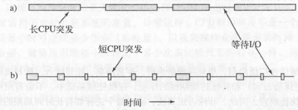

> 图2-39CPU的突发使用和等待I/O的时期交替出现：a)CPU密集型进程：b）I/O密集型进程

图2-39中有一件值得注意的事，即某些进程（图2-39a的进程）花费了绝大多数时间在计算上，而其他进程（图2-39b的进程）则在等待I/O上花费了绝大多数时间。前者称为计算密集型（compute-bound），后者称为I/O密集型（I/O-bound）。典型的计算密集型进程具有较长时间的CPU集中使用和较小频度的IO等待。I/O密集型进程具有较短时间的CPU集中使用和频繁的I/O等待。它是I/O类的，因为这种进程在I/O请求之间较少进行计算，并不是因为它们有特别长的I/O请求。在I/O开始后无论处理数据是多还是少，它们都花费同样的时间提出硬件请求读取磁盘块。

有必要指出，随着CPU变得越来越快，更多的进程倾向为I/O密集型。这种现象之所以发生是因为CPU的改进比磁盘的改进快得多，其结果是，未来对I/O密集型进程的调度处理似乎更为重要。这里的基本思想是，如果需要运行I/O密集型进程，那么就应该让它尽快得到机会，以便发出磁盘请求并保持磁盘始终忙碌。从图2-6中可以看到，如果进程是I/O密集型的，则需要多运行一些这类进程以保持CPU的充分利用。

#### 2.何时调度

有关调度处理的一个关键问题是何时进行调度决策。存在着需要调度处理的各种情形。第一，在创建一个新进程之后，需要决定是运行父进程还是运行子进程。由于这两种进程都处于就绪状态，所以这是一种正常的调度决策，可以任意决定，也就是说，调度程序可以合法选择先运行父进程还是先运行子进程。

第二，在一个进程退出时必须做出调度决策。一个进程不再运行（因为它不再存在），所以必须从就绪进程集中选择另外某个进程。如果没有就绪的进程，通常会运行一个系统提供的空闲进程。

第三，当一个进程阻塞在I/O和信号量上或由于其他原因阻塞时，必须选择另一个进程运行。有时，阻塞的原因会成为选择的因素。例如，如果A是一个重要的进程，并正在等待B退出临界区，让B随后运行将会使得B退出临界区，从而可以让A运行。不过问题是，通常调度程序并不拥有做出这种相关考虑的必要信息。

第四，在一个I/O中断发生时，必须做出调度决策。如果中断来自1/O设备，而该设备现在完成了工作，某些被阻塞的等待该I/O的进程就成为可运行的就绪进程了。是否让新就绪的进程运行，这取决于调度程序的决定，或者让中断发生时运行的进程继续运行，或者应该让某个其他进程运行。

如果硬件时钟提供50Hz、60Hz或其他频率的周期性中断，可以在每个时钟中断或者在每k个时钟中断时做出调度决策。根据如何处理时钟中断，可以把调度算法分为两类。非抢占式调度算法挑选一个进程，然后让该进程运行直至被阻塞（阻塞在I/O上或等待另一个进程），或者直到该进程自动释放CPU。即使该进程运行了若干个小时，它也不会被强迫挂起。这样做的结果是，在时钟中断发生时不会进行调度。在处理完时钟中断后，如果没有更高优先级的进程等待到时，则被中断的进程会继续执行。

相反，抢占式调度算法挑选一个进程，并且让该进程运行某个固定时段的最大值。如果在该时段结束时，该进程仍在运行，它就被挂起，而调度程序挑选另一个进程运行（如果存在一个就绪进程）。进行抢占式调度处理，需要在时间间隔的末端发生时钟中断，以便把CPU控制返回给调度程序。如果没有可用的时钟，那么非抢占式调度就是唯一的选择了。

#### 3.调度算法分类

毫无疑问，不同的环境需要不同的调度算法。之所以出现这种情形，是因为不同的应用领域（以及不同的操作系统）有不同的目标。换句话说，在不同的系统中，调度程序的优化是不同的。这里有必要划分出三种环境：

1）批处理。2)交互式。3）实时。

批处理系统在商业领域仍在广泛应用，用来处理薪水册、存货清单、账目收入、账目支出、利息计算（在银行）、索赔处理（在保险公司）和其他的周期性的作业。在批处理系统中，不会有用户不耐烦地在终端旁等待一个短请求的快捷响应。因此，非抢占式算法，或对每个进程都有长时间周期的抢占式算法，通常都是可接受的。这种处理方式减少了进程的切换从而改善了性能。这些批处理算法实际上相当普及，并经常可以应用在其他场合，这使得人们值得去学习它们，甚至是对于那些没有接触过大型机计算的人们。

在交互式用户环境中，为了避免一个进程霸占CPU拒绝为其他进程服务，抢占是必需的。即便没有进程想永远运行，但是，某个进程由于一个程序错误也可能无限期地排厅所有其他进程。为了避免这种现象发生，抢占也是必要的。服务器也归于此类，因为通常它们要服务多个突发的（远程）用户。

然而在有实时限制的系统中，抢占有时是不需要的，因为进程了解它们可能会长时间得不到运行，所以通常很快地完成各自的工作并阻塞。实时系统与交互式系统的差别是，实时系统只运行那些用来推进现有应用的程序，而交互式系统是通用的，它可以运行任意的非协作甚至是有恶意的程序。

#### 4.调度算法的目标

为了设计调度算法，有必要考虑什么是一个好的调度算法。某些目标取决于环境（批处理、交互式或实时），但是还有一些目标是适用于所有情形的。在图2-40中列出了一些目标，我们将在下面逐一讨论。

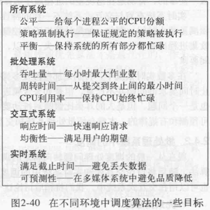

在所有的情形中，公平是很重要的。相似的进程应该得到相似的服务。对一个进程给予较其他等价的进程更多的CPU时间是不公平的。当然，不同类型的进程可以采用不同方式处理。可以考虑一下在核反应堆计算机中心安全控制与发放薪水处理之间的差别。

与公平有关的是系统策略的强制执行。如果局部策略是，只要需要就必须运行安全控制进程（即便这意味着推迟30秒钟发薪），那么调度程序就必须保证能够强制执行该策略。

另一个共同的目标是保持系统的所有部分尽可能忙碌。如果CPU和所有I/O设备能够始终运行，那么相对于让某些部件空转而言，每秒钟就可以完成更多的工作。例如，在批处理系统中，调度程序控制哪个作业调入内存运行。在内存中既有一些CPU密集型进程又有一些I/O密集型进程是一个较好的想法，好于先调入和运行所有的CPU密集型作业，然后在它们完成之后再调入和运行所有I/O密集型作业的做法。如果使用后面一种策略，在CPU密集型进程运行时，它们就要竞争CPU，而磁盘却在空转。稍后，当I/O密集型作业来了之后，它们要为磁盘而竞争，而CPU又空转了。显然，通过仔细组合进程，可以保持整个系统运行得更好一些。

运行大量批处理作业的大型计算中心的管理者们为了掌握其系统的工作状态，通常检查三个指标：吞吐量、周转时间以及CPU利用率。吞吐量（throughout）是系统每小时完成的作业数量。把所有的因素考虑进去之后，每小时完成50个作业好于每小时完成40个作业。周转时间（turnaroundtime）是指从一个批处理作业提交时刻开始直到该作业完成时刻为止的统计平均时间。该数据度量了用户要得到输出所需的平均等待时间。其规则是：小就是好的。

能够使吞吐量最大化的调度算法不一定就有最小的周转时间。例如，对于确定的短作业和长作业的一个组合，总是运行短作业而不运行长作业的调度程序，可能会获得出色的吞吐性能（每小时大量的短作业），但是其代价是对于长的作业周转时间很差。如果短作业以一个稳定的速率不断到达，长作业可能根本运行不了，这样平均周转时间是无限长，但是得到了高的吞吐量。

CPU利用率常常用于对批处理系统的度量。尽管这样，CPU利用率并不是一个好的度量参数。真正有价值的是，系统每小时可完成多少作业（吞吐量），以及完成作业需要多长时间（周转时间）。把CPU利用率作为度量依据，就像用引擎每小时转动了多少次来比较汽车的好坏一样。另一方面，知道什么时候CPU利用率接近100%比知道什么时候要求得到更多的计算能力要有用。

对于交互式系统，则有不同的指标。最重要的是最小响应时间，即从发出命令到得到响应之间的时间。在有后台进程运行（例如，从网络上读取和存储电子邮件）的个人计算机上，用户请求启动一个程序或打开一个文件应该优先于后台的工作。能够让所有的交互式请求首先运行的则是好服务。

一个相关的问题是均衡性。用户对做一件事情需要多长时间总是有一种固有的（不过通常不正确）看法。当认为一个请求很复杂需要较多的时间时，用户会接受这个看法，但是当认为一个请求很简单，但也需要较多的时间时，用户就会急躁。例如，如果点击一个图标花费了60秒钟发送完成一份传真，用户大概会接受这个事实，因为他没有期望花5秒钟得到传真，他知道这需要些时间。

另一方面，当传真发送完成，用户点击断开电话连接的图标时，该用户就有不一样的期待了。如果30秒之后还没有完成断开操作，用户就可能会抱怨，而60秒之后，他就要气得要命了。之所以有这种行为，其原因是：一般用户认为拿起听筒并建立通话连接所需的时间要比挂掉电话所需的时间长。在有些情形下（如本例），调度程序对响应时间指标起不了作用；但是在另外一些情形下，调度程序还是能够做一些事的，特别是在出现差的进程顺序选择时。实时系统有着与交互式系统不一样的特性，所以有不同的调度目标。

实时系统的特点是或多或少必须满足截止时间。例如，如果计算机正在控制一个以正常速率产生数据的设备，若一个按时运行的数据收集进程出现失败，会导致数据丢失。所以，实时系统最主要的要求是满足所有的（或大多数）截止时间要求。

在多数实时系统中，特别是那些涉及多媒体的实时系统中，可预测性是很重要的。偶尔不能满足截止时间要求的问题并不严重，但是如果音频进程运行的错误太多，那么音质就会下降得很快。视频品质也是一个问题，但是人的耳朵比眼晴对抖动要敏感得多。为了避免这些问题，进程调度程序必须是高度可预测和有规律的。本章介绍批处理系统和交互式系统中的调度算法。本书不介绍实时系统的调度算法。

### 2.4.2 批处理系统中的调度

现在从一般的调度处理问题转向特定的调度算法。在这一节中，我们将考察在批处理系统中使用的算法，随后将讨论交互式和实时系统中的调度算法。有必要指出，某些算法既可以用在批处理系统中，也可以用在交互式系统中。我们将稍后讨论这个问题。

#### 1.先来先服务

在所有调度算法中，最简单的是非抢占式的先来先服务（first-comefirst-served）算法。使用该算法，进程按照它们请求CPU的顺序使用CPU。基本上，有一个就绪进程的单一队列。上午，当第一个作业从外部进入系统后，就立即开始并允许运行它所期望的时间长度，该作业不会因为运行太长时间而被中断。当其他作业进入时，它们排到就绪队列尾部。当正在运行的进程被阻塞时，就绪队列中的第一个进程接着运行。当在被阻塞的进程变为就绪时，就像一个新来到的作业一样，排到就绪队列的末尾，即排在所有进程最后。

这个算法的主要优点是易于理解并且便于在程序中运用。就难以得到的体育或音乐会票的分配问题而言，这对那些愿意在早上两点就去排队的人们也是公平的。在这个算法中，一个单链表记录了所有就绪进程。要选取一个进程运行，只要从该队列的头部移走一个进程即可，要添加一个新的作业或阻塞一个进程，只要把该作业或进程附加在相应队列的末尾即可。还有比这更简单的理解和实现吗？

不过，先来先服务也有明显的缺点。假设有一个一次运行1秒钟的计算密集型进程和很少使用CPU但是每个都要进行1000次磁盘读操作才能完成的大量I/0密集型进程存在。计算密集进程运行1秒钟，接着读一个磁盘块。所有的I/O进程开始运行并读磁盘。当该计算密集进程获得其磁盘块时，它运行下一个1秒钟，紧跟随着的是所有I/O进程。

这样做的结果是，每个I/O进程在每秒钟内读到一个磁盘块，要花费1000秒钟才能完成操作。如果有一个调度算法每10ms抢占计算密集型进程，那么I/O进程将在10秒钟内完成而不是1000秒钟，而且还不会对计算密集型进程产生多少延迟。

#### 2.最短作业优先

现在来看一种适用于运行时间可以预知的另一个非抢占式的批处理调度算法。例如，一家保险公司，因为每天都做类似的工作，所以人们可以相当精确地预测处理1000个索赔的一批作业需要多少时间。当输人队列中有若干个同等重要的作业被启动时，调度程序应使用最短作业优先（shortestjobfirst）算法，请看图2-41。这里有4个作业A、B、C、D，运行时间分别为8、4、4、4分钟。若按图中的次序运行，则A的周转时间为8分钟，B为12分钟，C为16分钟，D为20分钟，平均为14分钟。

现在考虑使用最短作业优先算法运行这4个作业，如图2-41b所示。目前周转时间分别为4、8、12和20分钟，平均为11分钟。可以证明最短作业优先是最优的。考虑有4个作业的情况，其运行时间分别为a、b、c、d。第一个作业在时间a结束，第二个在时间a+b结束，以此类推。平均周转时间为（4a+3b+2c+d）/4。显然a对平均值影响最大，所以它应是最短作业，其次是b，再次是c，最后的d只影响它自己的周转时间。对任意数目作业的情况，道理完全一样。

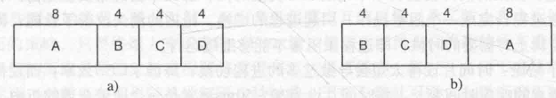

> 图2-41最短作业优先调度的例子：a）按原有次序运行4个作业；b）按最短作业优先次序运行

有必要指出，只有在所有的作业都可同时运行的情形下，最短作业优先算法才是最优化的。作为一个反例，考虑5个作业，从A到E，运行时间分别是2、4、1、1和1。它们的到达时间是0、0、3、3和3。开始，只能选择A或B，因为其他三个作业还没有到达。使用最短作业优先，将按照A、B、C、D、E的顺序运行作业，其平均等待时间是4.6。但是，按照B、C、D、E、A的顺序运行作业，其平均等待时间则是4.4。

#### 3.最短剩余时间优先

最短作业优先的抢占式版本是最短剩余时间优先（shortestremainingtimenext）算法。使用这个算法，调度程序总是选择剩余运行时间最短的那个进程运行。再次提醒，有关的运行时间必须提前掌握。当一个新的作业到达时，其整个时间同当前进程的剩余时间做比较。如果新的进程比当前运行进程需要更少的时间，当前进程就被挂起，而运行新的进程。这种方式可以使新的短作业获得良好的服务。

### 2.4.3 交互式系统中的调度

现在考察用于交互式系统中的一些调度算法，它们在个人计算机、服务器和其他类系统中都是常用的。

#### 1.轮转调度

一种最古老、最简单、最公平且使用最广的算法是轮转调度（roundrobin）。每个进程被分配一个时间段，称为时间片（quantum），即允许该进程在该时间段中运行。如果在时间片结束时该进程还在运行，则将剥夺CPU并分配给另一个进程。如果该进程在时间片结束前阻塞或结束，则CPU立即进行切换。时间片轮转调度很容易实现，调度程序所要做的就是维护一张可运行进程列表，如图2-42a所示。当一个进程用完它的时间片后，就被移到队列的末尾，如图2-42b所示。

时间片轮转调度中唯一有趣的一点是时间片的长度。从一个进程切换到另一个进程是需要一定时间进行管理事务处理的一一保存和装人寄存器值及内存映像、更新各种表格和列表、清除和重新调人内存高速缓存等。假如进程切换（processswitch），有时称为上下文切换（contextswitch），需要1ms，包括切换内存映像、清除和重新调人高速缓存等。再假设时间片设为4ms。有了这些参数，则CPU在做完4ms有用的工作之后，CPU将花费（即浪费）1ms来进行进程切换。因此，CPU时间的20%浪费在管理开销上。很明显，管理时间太多了。

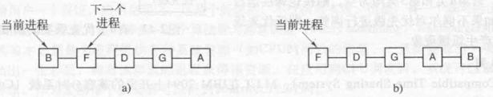

> 图2-42轮转调度：a）可运行进程列表；b）进程B用完时间片后的可运行进程列表

为了提高CPU的效率，可以将时间片设置成，比方说100ms，这样浪费的时间只有1%。但是，如果在一段非常短的时间间隔内到达50个请求，并且对CPU有不同的需求，那么，考虑一下，在一个服务器系统中会发生什么呢？50个进程会放在可运行进程的列表中。如果CPU是空闲的，第一个进程会立即开始执行，第二个直到100ms以后才会启动，以此类推。假设所有其他进程都用足了它们的时间片的话，最不幸的是最后一个进程在获得运行机会之前将不得不等待5秒钟。大部分用户会认为5秒的响应对于一个短命令来说是缓慢的。如果一些在就绪队列后边的请求仅需要几毫秒的CPU时间，上面的情况会变得尤其糟糕。如果使用较短的时间片的话，它们将会获得更好的服务。

另一个因素是，如果时间片设置长于平均的CPU突发时间，那么不会经常发生抢占。相反，在时间片耗费完之前多数进程会完成一个阻塞操作，引起进程的切换。抢占的消失改善了性能，因为进程切换只会发生在确实逻辑上有需要的时候，即进程被阻塞不能够继续运行。

可以归结如下结论：时间片设得太短会导致过多的进程切换，降低了CPU效率；而设得太长又可能引起对短的交互请求的响应时间变长。将时间片设为20～50ms通常是一个比较合理的折中。

#### 2.优先级调度

轮转调度做了一个隐含的假设，即所有的进程同等重要，而拥有和操作多用户计算机系统的人对此常有不同的看法。例如，在一所大学里，等级顺序可能是教务长首先，然后是教授、秘书、后勤人员，最后是学生。这种将外部因素考虑在内的需要就导致了优先级调度。其基本思想很清楚：每个进程被赋予一个优先级，允许优先级最高的可运行进程先运行。

即使在只有一个用户的PC上，也会有多个进程，其中一些比另一些更重要。例如，与在屏幕上实时显示视频电影的进程相比，在后台发送电子邮件的守护进程应该被赋予较低的优先级。

为了防止高优先级进程无休止地运行下去，调度程序可能在每个时钟滴答（即每个时钟中断）降低当前进程的优先级。如果这一行为导致该进程的优先级低于次高优先级的进程，则进行进程切换。另一种方法是，给每个进程赋予一个允许运行的最大时间片，当用完这个时间片时，次高优先级的进程便获得运行机会。

优先级可以是静态赋予或动态赋予。在一台军用计算机上，可以把将军所启动的进程设为优先级100，上校为90，少校为80，上尉为70，中尉为60，以此类推。或者，在一个商业计算中心，高优先级作业每小时费用为100美元，中优先级每小时75美元，低优先级每小时50美元。UNIX系统中有一条命令nice，它允许用户为了照顾别人而自愿降低自己进程的优先级，但从未有人用过它。

为达到某种目的，优先级也可以由系统动态确定。例如，有些进程为I/O密集型，其多数时间用来等待I/O结束。当这样的进程需要CPU时，应立即分配给它CPU，以便启动下一个I/O请求，这样就可以在另一个进程计算的同时执行I/O操作。使这类I/O密集型进程长时间等待CPU只会造成它无谓地长时间占用内存。使I/O密集型进程获得较好服务的一种简单算法是，将其优先级设为1f，f为该进程在上一时间片中所占的部分。一个在其50ms的时间片中只使用1ms的进程将获得优先级50，而在阻塞之前用掉25ms的进程将具有优先级2，而使用掉全部时间片的进程将得到优先级1。

可以很方便地将一组进程按优先级分成若干类，并且在各类之间采用优先级调度，而在各类进程的内部采用轮转调度。图2-43给出了一个有4类优先级的系统，其调度算法如下：只要存在优先级为第4类的可运行进程，就按照轮转法为每个进程运行一个时间片，此时不理会较低优先级的进程。若第4类进程为空，则按照轮转法运行第3类进程。若第4类和第3类均为空，则按轮转法运行第2类进程。如果不偶尔对优先级进行调整，则低优先级进程很可能会产生饥饿现象。

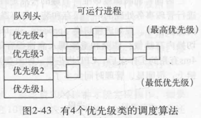


#### 3.多级队列

CTSS（CompatibleTimeSharingSystem），M.I.T.在IBM7094上开发的兼容分时系统（Corbat6等人，1962），是最早使用优先级调度的系统之一。但是在CTSS中存在进程切换速度太慢的问题，其原因是IBM7094内存中只能放进一个进程，每次切换都需要将当前进程换出到磁盘，并从磁盘上读人一个新进程。CTSS的设计者很快便认识到，为CPU密集型进程设置较长的时间片比频繁地分给它们很短的时间片要更为高效（减少交换次数）。另一方面，如前所述，长时间片的进程又会影响到响应时间，其解决办法是设立优先级类。属于最高优先级类的进程运行一个时间片，属于次高优先级类的进程运行2个时间片，再次一级运行4个时间片，以此类推。当一个进程用完分配的时间片后，它被移到下一类。

作为一个例子，考虑有一个进程需要连续计算100个时间片。它最初被分配1个时间片，然后被换出。下次它将获得2个时间片，接下来分别是4、8、16、32和64。当然最后一次它只使用64个时间片中的37个便可以结束工作。该进程需要7次交换（包括最初的装入），而如果采用纯粹的轮转算法则需要100次交换。而且，随着进程优先级的不断降低，它的运行频度逐渐放慢，从而为短的交互进程让出CPU。

对于那些刚开始运行一段长时间，而后来又需要交互的进程，为了防止其永远处于被惩罚状态，可以采取下面的策略。只要终端上有回车键（Enter键）按下，则属于该终端的所有进程就都被移到最高优先级，这样做的原因是假设此时进程即将需要交互。但可能有一天，一台CPU密集的重载机器上有几个用户偶然发现，只需坐在那里随机地每隔几秒钟敲一下回车键就可以大大提高响应时间。于是他们又告诉他们的朋友这个故事的寓意是：在实践上可行比理论上可行要困难得多。

#### 4.最短进程优先

对于批处理系统而言，由于最短作业优先常常伴随着最短响应时间，所以如果能够把它用于交互进程，那将是非常好的。在某种程度上，的确可以做到这一点。交互进程通常遵循下列模式：等待命令、执行命令、等待命令、执行命令，如此不断反复。如果将每一条命令的执行看作是一个独立的“作业”，则我们可以通过首先运行最短的作业来使响应时间最短。这里唯一的问题是如何从当前可运行进程中找出最短的那一个进程。

一种办法是根据进程过去的行为进行推测，并执行估计运行时间最短的那一个。假设某个终端上每条命令的估计运行时间为To。现在假设测量到其下一次运行时间为T。可以用这两个值的加权和来改进估计时间，即aT。+（1一a）T。通过选择a的值，可以决定是尽快忘掉老的运行时间，还是在一段长时间内始终记住它们。当a=1/2时，可以得到如下序列：

T<sub>0</sub>，T<sub>0</sub>/2+T<sub>1</sub>/2,T<sub>0</sub>/4+T<sub>1</sub>/4+T<sub>2</sub>/2,T<sub>0</sub>/8+T<sub>1</sub>/8+T<sub>2</sub>/4+T<sub>3</sub>/2

可以看到，在三轮过后，T在新的估计值中所占的比重下降到1/8。

有时把这种通过当前测量值和先前估计值进行加权平均而得到下一个估计值的技术称作老化(aging）。它适用于许多预测值必须基于先前值的情况。老化算法在a=1/2时特别容易实现，只需将新值加到当前估计值上，然后除以2（即右移一位）。

#### 5.保证调度

一种完全不同的调度算法是向用户作出明确的性能保证，然后去实现它。一种很实际并很容易实现的保证是：若用户工作时有n个用户登录，则用户将获得CPU处理能力的1/n。类似地，在一个有n个进程运行的单用户系统中，若所有的进程都等价，则每个进程将获得1/n的CPU时间。看上去足够公平了。

为了实现所做的保证，系统必须跟踪各个进程自创建以来已使用了多少CPU时间。然后它计算各个进程应获得的CPU时间，即自创建以来的时间除以n。由于各个进程实际获得的CPU时间是已知的，所以很容易计算出真正获得的CPU时间和应获得的CPU时间之比。比率为O.5说明一个进程只获得了应得时间的一半，而比率为2.0则说明它获得了应得时间的2倍。于是该算法随后转向比率最低的进程，直到该进程的比率超过它的最接近竞争者为止。

#### 6.彩票调度

PL030给用户一个保证，然后兑现之，这是个好想法，不过很难实现。但是，有一个既可给出类似预测结果而又有非常简单的实现方法的算法，这个算法称为彩票调度（lotteryscheduling；Waldspurger和Weihl，1994）。

其基本思想是为进程提供各种系统资源（如CPU时间）的彩票。一旦需要做出一项调度决策时，就随机抽出一张彩票，拥有该彩票的进程获得该资源。在应用到CPU调度时，系统可以掌握每秒钟50次的一种彩票，作为奖励每个获奖者可以得到20ms的CPU时间。

为了说明GeorgeOrwell关于“所有进程是平等的，但是某些进程更平等一些”的含义，可以给更重要的进程额外的彩票，以便增加它们获胜的机会。如果出售了100张彩票，而有一个进程持有其中的20张，那么在每一次抽奖中该进程就有20%的取胜机会。在较长的运行中，该进程会得到20%的CPU。相反，对于优先级调度程序，很难说明拥有优先级40究竟是什么意思，而这里的规则很清楚：拥有彩票份额的进程大约得到系统资源的f份额。

彩票调度具有若干有趣的性质。例如，如果有一个新的进程出现并得到一些彩票，那么在下一次的抽奖中，该进程会有同它持有彩票数量成比例的机会赢得奖励。换句话说，彩票调度是反应迅速的。

如果希望协作进程可以交换它们的彩票。例如，有一个客户进程向服务器进程发送消息后就被阻塞，该客户进程可以把它所有的彩票交给服务器，以便增加该服务器下次运行的机会。在服务器运行完成之后，该服务器再把彩票还给客户机，这样客户机又可以运行了。事实上，如果没有客户机，服务器根本就不需要彩票。

彩票调度可以用来解决用其他方法很难解决的问题。一个例子是，有一个视频服务器，在该视频服务器上若干进程正在向其客户提供视频流，每个视频流的顿速率都不相同。假设这些进程需要的帧速率分别是10、20和25帧/秒。如果给这些进程分别分配10、20和25张彩票，那么它们会自动地按照大致正确的比例（即10：20：25）划分CPU的使用。

#### 7.公平分享调度

到现在为止，我们假设被调度的都是各个进程自身，并不关注其所有者是谁。这样做的结果是，如果用户1启动9个进程而用户2启动1个进程，使用轮转或相同优先级调度算法，那么用户1将得到90%的CPU时间，而用户2只得到10%的CPU时间。

为了避免这种情形，某些系统在调度处理之前考虑谁拥有进程这一因素。在这种模式中，每个用户分配到CPU时间的一部分，而调度程序以一种强制的方式选择进程。这样，如果两个用户都得到获得50%CPU时间的保证，那么无论一个用户有多少进程存在，每个用户都会得到应有的CPU份额。

作为一个例子，考虑有两个用户的一个系统，每个用户都保证获得50%CPU时间。用户1有4个进程A、B、C和D，而用户2只有1个进程E。如果采用轮转调度，一个满足所有限制条件的可能序列是：

AEBECEDEAEBECEDE.

另一方面，如果用户1得到比用户2两倍的CPU时间，我们会有

ABECDEABECDE...

当然，大量其他的可能也存在，可以进一步探讨，这取决于如何定义公平的含义。

### 2.4.4 实时系统中的调度

实时系统是一种时间起着主导作用的系统。典型地，一种或多种外部物理设备发给计算机一个服务请求，而计算机必须在一个确定的时间范围内恰当地做出反应。例如，在CD播放器中的计算机获得从驱动器而来的位流，然后必须在非常短的时间间隔内将位流转换为音乐。如果计算时间过长，那么音乐就会听起来有异常。其他的实时系统例子还有，医院特别护理部门的病人监护装置、飞机中的自动驾驶系统以及自动化工厂中的机器人控制等。在所有这些例子中，正确的但是迟到的应答往往比没有还要糟糕。

实时系统通常可以分为硬实时（hardrealtime）和软实时（softrealtime），前者的含义是必须满足绝对的截止时间，后者的含义是虽然不希望偶尔错失截止时间，但是可以容忍。在这两种情形中，实时性能都是通过把程序划分为一组进程而实现的，其中每个进程的行为是可预测和提前掌握的。这些进程一般寿命较短，并且极快地运行完成。在检测到一个外部信号时，调度程序的任务就是按照满足所有截止时间的要求调度进程。

实时系统中的事件可以按照响应方式进一步分类为周期性（以规则的时间间隔发生）事件或非周期性（发生时间不可预知）事件。一个系统可能要响应多个周期性事件流。根据每个事件需要处理时间的长短，系统甚至有可能无法处理完所有的事件。例如，如果有m个周期事件，事件以周期P；发生，并需要C秒CPU时间处理一个事件，那么可以处理负载的条件是:

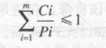

满足这个条件的实时系统称为是可调度的，这意味着它实际上能够被实现。一个不满足此检验标准的进程不能被调度，因为这些进程共同需要的CPU时间总和大于CPU能提供的时间。

作为一个例子，考虑一个有三个周期性事件的软实时系统，其周期分别是100ms、200ms和500ms。如果这些事件分别需要50ms、30ms和100ms的CPU时间，那么该系统是可调度的，因为0.5+0.15+0.2<1。如果有第四个事件加入，其周期为1秒，那么只要这个事件是不超过每事件150ms的CPU时间，那么该系统就仍然是可调度的。在这个计算中隐含了一个假设，即上下文切换的开销很小，可以忽略不计。

实时系统的调度算法可以是静态或动态的。前者在系统开始运行之前作出调度决策，后者在运行过程中进行调度决策。只有在可以提前掌握所完成的工作以及必须满足的截止时间等全部信息时，静态调度才能工作，而动态调度算法不需要这些限制。

### 2.4.5 策略和机制

到目前为止，我们隐含地假设系统中所有进程分属不同的用户，并且，进程间相互竞争CPU。通常情况下确实如此，但有时也有这样的情况：一个进程有许多子进程并在其控制下运行。例如，一个数据库管理系统可能有许多子进程，每一个子进程可能处理不同的请求，或每一个子进程实现不同的功能（如请求分析，磁盘访问等）。主进程完全可能掌握哪一个子进程最重要（或最紧迫）而哪一个最不重要。但是，以上讨论的调度算法中没有一个算法从用户进程接收有关的调度决策信息，这就导致了调度程序很少能够做出最优的选择。

解决问题的方法是将调度机制（schedulingmechanism）与调度策略（schedulingpolicy）分离这个一贯的原则（Levin等人，1975）。也就是将调度算法以某种形式参数化，而参数可以由用户进程填写。再次考虑数据库的例子。假设内核使用优先级调度算法，并提供了一条可供进程设置（并改变）优先级的系统调用。这样，尽管父进程本身并不参与调度，但它可以控制如何调度子进程的细节。在这里，调度机制位于内核，而调度策略则由用户进程决定。策略与机制分离是一种关键性思路。

### 2.4.6 线程调度

当若干进程都有多个线程时，就存在两个层次的并行：进程和线程。在这样的系统中调度处理有本质差别，这取决于所支持的是用户级线程还是内核级线程（或两者都支持）。

首先考虑用户级线程。由于内核并不知道有线程存在，所以内核还是和以前一样地操作，选取一个进程，假设为A，并给予A以时间片控制。A中的线程调度程序决定哪个线程运行，假设为A1。由于多道线程并不存在时钟中断，所以这个线程可以按其意愿任意运行多长时间。如果该线程用完了进程的全部时间片，内核就会选择另一个进程运行。

在进程A终于又一次运行时，线程A1会接着运行。该线程会继续耗费A进程的所有时间，直到它完成工作。不过，该线程的这种不合群的行为不会影响到其他的进程。其他进程会得到调度程序所分配的合适份额，不会考虑进程A内部所发生的事。

现在考虑A线程每次CPU计算的工作比较少的情况，例如，在50ms的时间片中有5ms的计算工作。于是，每个线程运行一会儿，然后把CPU交回给线程调度程序。这样在内核切换到进程B之前，就会有序列A1，A2，A3，A1，A2，A3，A1，A2，A3，A1。这种情形可用图2-44a表示。

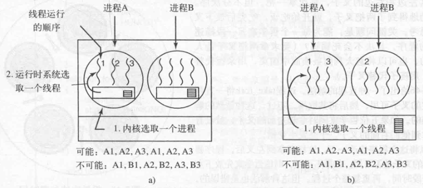

> 图2-44a）用户级线程的可能调度，有50ms时间片的进程以及每次运行5msCPU的线程；b）与a）有相同特性的内核级线程的可能调度

运行时系统使用的调度算法可以是上面介绍的算法中的任意一种。从实用考虑，轮转调度和优先级调度更为常用。唯一的局限是，缺乏一个时钟中断运行过长的线程，但由于线程之间的合作关系，这通常也不是问题。

现在考虑使用内核级线程的情形。内核选择一个特定的线程运行。它不用考虑该线程属于哪个进程，不过如果有必要的话，它可以这样做。对被选择的线程赋予一个时间片，而且如果超过了时间片，就会强制挂起该线程。一个线程在50ms的时间片内，5ms之后被阻塞，在30ms的时间段中，线程的顺序会是A1，B1，A2，B2，A3，B3，在这种参数和用户线程状态下，有些情形是不可能出现的。这种情形部分通过图2-44b刻画。

用户级线程和内核级线程之间的差别在于性能。用户级线程的线程切换需要少量的机器指令，而内核级线程需要完整的上下文切换，修改内存映像，使高速缓存失效，这导致了若干数量级的延迟。另一方面，在使用内核级线程时，一旦线程阻塞在I/O上就不需要像在用户级线程中那样将整个进程挂起。

从进程A的一个线程切换到进程B的一个线程，其代价高于运行进程A的第2个线程（因为必须修改内存映像，清除内存高速缓存的内容），内核对此是了解的，并可运用这些信息做出决定。例如，给定两个在其他方面同等重要的线程，其中一个线程与刚好阻塞的线程属于同一个进程，而另一个线程属于其他的进程，那么应该倾向前者。

另一个重要因素是用户级线程可以使用专为应用程序定制的线程调度程序。例如，考虑图2-8中的Web服务器。假设一个工作线程刚刚被阻塞，而分派线程和另外两个工作线程是就绪的。那么，应该运行哪一个线程呢？由于运行时系统了解所有线程的作用，所以会直接选择分派线程接着运行，这样分派线程就会启动另一个工作线程运行。在一个工作线程经常阻塞在磁盘I/O上的环境中，这个策略将并行度最大化。而在内核级线程中，内核从来不了解每个线程的作用（虽然它们被赋予了不同的优先级）。不过，一般而言，应用定制的线程调度程序能够比内核更好地满足应用的需要。

## 2.5 经典的IPC问题

操作系统文献中有许多广为讨论和分析的有趣问题，它们与同步方法的使用相关。以下几节将讨论其中两个最著名的问题。

### 2.5.1 哲学家就餐问题

1965年，Dijkstra提出并解决了一个他称之为哲学家就餐的同步问题。从那时起，每个发明新的同步原语的人都希望通过解决哲学家就餐问题来展示其同步原语的精妙之处。这个问题可以简单地描述如下：五个哲学家围坐在一张圆桌周围，每个哲学家面前都有一盘通心粉。由于通心粉很滑，所以需要两把叉子才能夹住。相邻两个盘子之间放有一把叉子，餐桌如图2-45所示。

哲学家的生活中有两种交替活动时段：即吃饭和思考（这只是一种抽象，即对哲学家而言其他活动都无关紧要）。当一个哲学家觉得饿了时，他就试图分两次去取其左边和右边的叉子，每次拿一把，但不分次序。如果成功地得到了两把叉子，就开始吃饭，吃完后放下叉子继续思考。关键问题是：能为每一个哲学家写一段描述其行为的程序，且决不会死锁吗？（要求拿两把叉子是人为规定的，也可以将意大利面条换成中国菜，用米饭代替通心粉，用筷子代替叉子。）

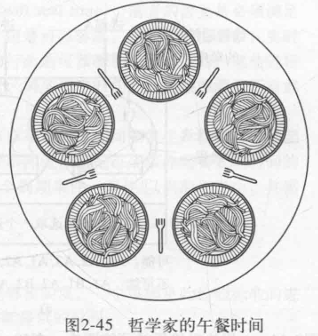

图2-46给出了一种直观的解法。过程take_fork将一直等到所指定的叉子可用，然后将其取用。不过，这种显然的解法是错误的。如果五位哲学家同时拿起左面的叉子，就没有人能够拿到他们右面的叉子，于是发生死锁。

可以将这个程序修改一下，这样在拿到左叉后，程序要查看右面的叉子是否可用。如果不可用，则该哲学家先放下左叉，等一段时间，再重复整个过程。但这种解法也是错误的，尽管与前一种原因不同。可能在某一个瞬间，所有的哲学家都同时开始这个算法，拿起其左叉，看到右叉不可用，又都放下左叉，等一会儿，又同时拿起左叉，如此这样永远重复下去。对于这种情况，所有的程序都在不停地运行，但都无法取得进展，就称为饥饿（starvation）。（即使问题不发生在意大利餐馆或中国餐馆，也被称为饥饿。）

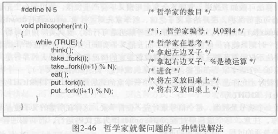

现在读者可能会想，“如果哲学家在拿不到右边叉子时等待一段随机时间，而不是等待相同的时间，这样发生互锁的可能性就很小了，事情就可以继续了。”这种想法是对的，而且在几乎所有的应用程序中，稍后再试的办法并不会演化成为一个问题。例如，在流行的局域网以太网中，如果两台计算机同时发送包，那么每台计算机等待一段随机时间之后再尝试。在实践中，该方案工作良好。但是，在少数的应用中，人们希望有一种能够始终工作的方案，它不能因为一串不可靠的随机数字而导致失败（想象一下核电站中的安全控制系统）。

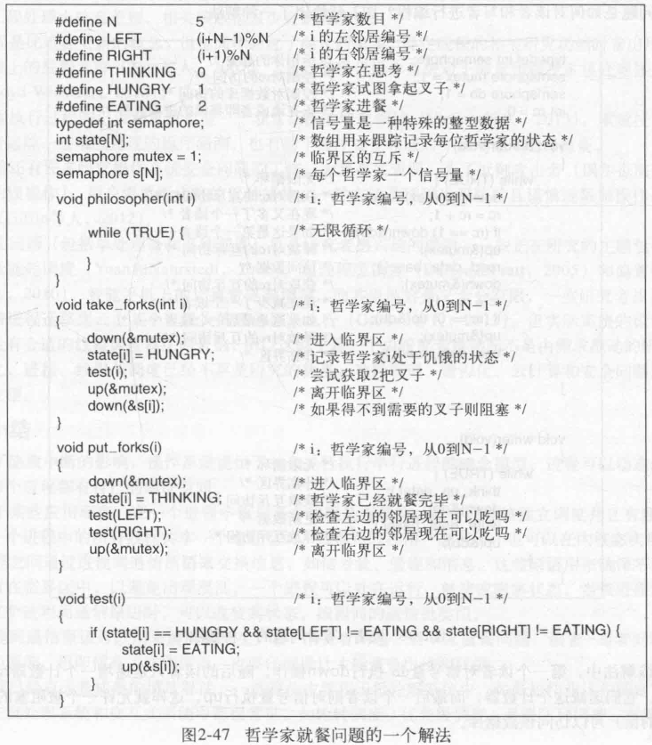

对图2-46中的算法可做如下改进，它既不会发生死锁又不会产生饥饿：使用一个二元信号量对调用think之后的五个语句进行保护。在开始拿叉子之前，哲学家先对互厅量mutex执行down操作。在放回叉子后，他再对mutex执行up操作。从理论上讲，这种解法是可行的。但从实际角度来看，这里有性能上的局限：在任何一时刻只能有一位哲学家进餐。而五把叉子实际上可以允许两位哲学家同时进餐。

图2-47中的解法不仅没有死锁，而且对于任意位哲学家的情况都能获得最大的并行度。算法中使用一个数组state跟踪每一个哲学家是在进餐、思考还是饥饿状态（正在试图拿叉子）。一个哲学家只有在两个邻居都没有进餐时才允许进入到进餐状态。第个哲学家的邻居则由宏LEFT和RIGHT定义，换言之，若i为2，则LEFT为1，RIGHT为3。

该程序使用了一个信号量数组，每个信号量对应一位哲学家，这样在所需的叉子被占用时，想进餐的哲学家就被阻塞。注意，每个进程将过程philosopher作为主代码运行，而其他过程take_forks、put_forks和test只是普通的过程，而非单独的进程。

### 2.5.2 读者一写者问题

哲学家就餐问题对于互斥访问有限资源的竞争问题（如I/O设备）一类的建模过程十分有用。另一个著名的问题是读者一写者问题（Courtois等人，1971），它为数据库访问建立了一个模型。例如，设想一个飞机订票系统，其中有许多竞争的进程试图读写其中的数据。多个进程同时读数据库是可以接受的，但如果一个进程正在更新（写）数据库，则所有的其他进程都不能访问该数据库，即使读操作也不行。这里的问题是如何对读者和写者进行编程？图2-48给出了一种解法。

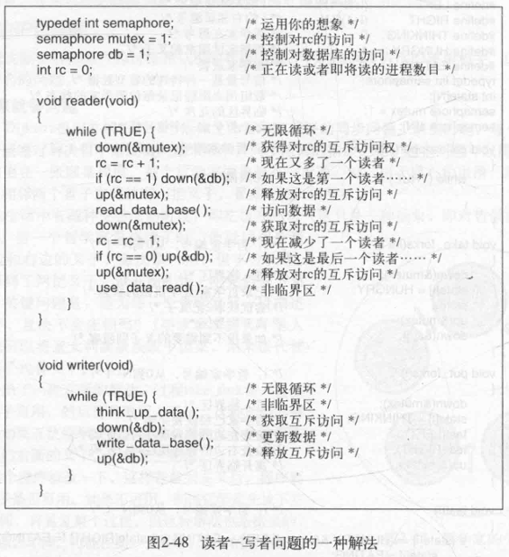

在该解法中，第一个读者对信号量db执行down操作。随后的读者只是递增一个计数器rc。当读者离开时，它们递减这个计数器，而最后一个读者则对信号量执行up，这样就允许一个被阻塞的写者（如果存在的话）可以访问该数据库。

在该解法中，隐含着一个需要注解的条件。假设一个读者正使用数据库，另一个读者来了。同时有两个读者并不存在问题，第二个读者被允许进入。如果有第三个和更多的读者来了也同样允许。

现在，假设一个写者到来。由于写者的访问是排他的，不能允许写者进人数据库，只能被挂起。只要还有一个读者在活动，就允许后续的读者进来。这种策略的结果是，如果有一个稳定的读者流存在，那么这些读者将在到达后被允许进入。而写者就始终被挂起，直到没有读者为止。如果来了新的读者，比如，每2秒钟一个，而每个读者花费5秒钟完成其工作，那么写者就永远没有机会了。

为了避免这一情形，可以稍微改变一下程序的写法：在一个读者到达，且一个写者在等待时，读者在写者之后被挂起，而不是立即允许进人。用这种方式，在一个写者到达时如果有正在工作的读者，那么该写者只要等待这个读者完成，而不必等候其后面到来的读者。该解决方案的缺点是，并发度和效率较低。Courtois等人给出了一个写者优先的解法。详细内容请参阅他的论文。

## 2.6 有关进程与线程的研究

第1章介绍了当前有关操作系统结构的研究工作，在本章和后续章节中，我们将专注更多更细的研究工作，本章先从有关进程的研究开始。虽然这些问题最终都将得到解决，但总有一些问题会比其他问题的解决方案更成熟。多数研究工作不再继续围绕有数十年历史的问题，而是针对新的问题。

例如，进程问题就已经有了成熟的解决方案。几乎所有系统都把进程视为一个容器，用以管理相关资源，如地址空间、线程、打开的文件、权限保护等。不同的系统管理进程资源的基本想法大致相同，只是在工程处理上略有差别，相关领域也很少有新的研究。

线程是比进程更新的概念，但也同样经过了深入的思考。现在线程的相关研究仍然时常出现，例如，多处理器上的线程集群（Tam等人，2007）、Linux等现代操作系统对于海量线程在多核处理器上的可扩展性（Boyd-Wickizer，2010）。

进程执行过程的记录和重放也是一个非常活跃的研究领域（Viennot等人，2013）。重放技术可以帮助开发者追踪一些难以发现的程序漏洞，也有助于程序安全领域的专家对程序进行检查。

目前还有许多研究操作系统安全问题的工作。大量事实表明，为了抵御攻击者（偶尔也需要防护用户自身的误操作），用户需要更完善的保护措施。一种方法是详细地跟踪并且谨慎地限制操作系统中的信息流（Giffin等人，2012）。

调度问题（包括单处理器和多处理器）也是研究者感兴趣的课题，一些正在研究的主题包括移动设备上的低能耗调度（Yuan和Nahrstedt，2006）、超线程级调度（Bulpin和Pratt，2005）和偏置意识调度（Koufaty，2010）。智能手机上的计算量逐渐增加，而其电池容量又十分有限，一些研究者提出在可能的时候将进程迁移到云上某个更强大的服务器上执行（Gordon等人，2012）。但实际系统的设计者很少会因为没有合适的线程调度算法而苦恼，所以这似乎是一个由研究者推动而不是由需求推动的研究类型。总而言之，进程、线程与调度已经不再是研究的热点，功耗管理、虚拟化、云计算和安全问题成为了新的热点主题。

## 2.7 小结

为了隐藏中断的影响，操作系统提供了一个并行执行串行进程的概念模型。进程可以动态地创建和终止，每个进程都有自己的地址空间。

对于某些应用而言，在一个进程中使用多个线程是有益的。这些线程被独立调度并且有独立的栈，但是在一个进程中的所有线程共享一个地址空间。线程可以在用户态实现，也可以在内核态实现。

进程之间通过进程间通信原语来交换信息，如信号量、管程和消息。这些原语用来确保不会有两个进程同时在临界区中，以避免出现混乱。一个进程可以处在运行、就绪或阻塞状态，当该进程或其他进程执行某个进程间通信原语时，可以改变其状态。线程间的通信也类似。

进程间通信原语可以用来解决诸如生产者一消费者问题、哲学家就餐问题、读者一写者问题和睡眠理发师问题等。但即便有了这些原语，也要仔细设计才能避免出错和死锁。

目前已经有大量成熟的调度算法。一些算法主要用于批处理系统中，如最短作业优先调度算法。其他算法在批处理系统和交互式系统中都很常见，如轮转调度、优先级调度、多级队列调度、有保证调度、彩票调度以及公平分享调度等。有些系统清晰地分离了调度策略和调度机制，使用户可以配置调度算法。


# 第三章 内存管理

内存（RAM）是计算机中一种需要认真管理的重要资源。就目前来说，虽然一台普通家用计算机的存储容量已经是20世纪60年代早期全球最大的计算机IBM7094的存储容量的10000倍以上，但是程序大小的增长速度比内存容量的增长速度要快得多。正如帕金森定律所指出的：“不管存储器有多大，程序都可以把它填满。”在这一章中，我们将讨论操作系统是怎样对存储器创建抽象模型以及怎样管理它们的。

每个程序员都梦想拥有这样的存储器：它是私有的、容量无限大的、速度无限快的，并且是永久性的（即断电时不会丢失数据）。当我们期望这样的存储器时，何不进一步要求它价格低廉呢？遗憾的是，目前的技术还不能为我们提供这样的存储器。也许你会有解决方案。

除此之外的选择是什么呢？经过多年探索，人们提出了分层存储器体系（memoryhierarchy）的概念，即在这个体系中，计算机有若干兆（MB）快速、昂贵且易失性的高速缓存（cache），数千兆（GB）速度与价格适中且同样易失性的内存，以及几兆兆（TB）低速、廉价、非易失性的磁盘存储，另外还有诸如DVD和USB等可移动存储装置。操作系统的工作是将这个存储体系抽象为一个有用的模型并管理这个抽象模型。

操作系统中管理分层存储器体系的部分称为存储管理器（memorymanager）。它的任务是有效地管理内存，即记录哪些内存是正在使用的，哪些内存是空闲的；在进程需要时为其分配内存，在进程使用完后释放内存。

本章我们会研究几个不同的存储管理方案，涵盖非常简单的方案到高度复杂的方案。由于最底层的高速缓存的管理由硬件来完成，本章将集中介绍针对编程人员的内存模型，以及怎样优化管理内存。至于永久性存储器一—磁盘一—的抽象和管理，则是下一章的主题。我们会从最简单的管理方案开始讨论，并逐步深人到更为镇密的方案。

## 3.1 无存储器抽象

最简单的存储器抽象就是根本没有抽象。早期大型计算机（20世纪60年代之前）、小型计算机（20世纪70年代之前）和个人计算机（20世纪80年代之前）都没有存储器抽象。每一个程序都直接访问物理内存。当一个程序执行如下指令：

MOV REGISTER1,1000

计算机会将位置为1000的物理内存中的内容移到REGISTER1中。因此，那时呈现给编程人员的存储器模型就是简单的物理内存：从0到某个上限的地址集合，每一个地址对应一个可容纳一定数目二进制位的存储单元，通常是8个。

在这种情况下，要想在内存中同时运行两个程序是不可能的。如果第一个程序在2000的位置写入一个新的值，将会擦掉第二个程序存放在相同位置上的所有内容，所以同时运行两个程序是根本行不通的，这两个程序会立刻崩溃。

不过即使存储器模型就是物理内存，还是存在一些可行选项的。图3-1展示了三种变体。在图3-1a中，操作系统位于RAM（随机访问存储器）的底部；在图3-1b中，操作系统位于内存顶端的ROM（只读存储器）中；而在图3-1c中，设备驱动程序位于内存顶端的ROM中，而操作系统的其他部分则位于下面的RAM的底部。第一种方案以前被用在大型机和小型计算机上，现在很少使用了。第二种方案被用在一些掌上电脑和嵌人式系统中。第三种方案用于早期的个人计算机中（例如运行MS-DOS的计算机），在ROM中的系统部分称为BIOS（BasicInputOutputSystem，基本输入输出系统）。第一种方案和第三种方案的缺点是用户程序出现的错误可能摧毁操作系统，引发灾难性后果。

当按这种方式组织系统时，通常同一个时刻只能有一个进程在运行。一旦用户键入了一个命令，操作系统就把需要的程序从磁盘复制到内存中并执行，当进程运行结束后，操作系统在用户终端显示提示符并等待新的命令。收到新的命令后，它把新的程序装入内存，覆盖前一个程序。

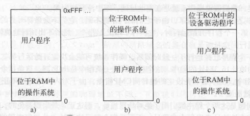

> 图3-1在只有操作系统和一个用户进程的情形下，组织内存的三种简单方案（当然也存在其他方案）

在没有存储器抽象的系统中实现并行的一种方法是使用多线程来编程。由于在引入线程时就假设一个进程中的所有线程对同一内存映像都可见，那么实现并行也就不是问题了。虽然这个想法行得通，但却没有被广泛使用，因为人们通常希望能够在同一时间运行没有关联的程序，而这正是线程抽象所不能提供的。更进一步地，一个没有存储器抽象的系统也不大可能具有线程抽象的功能。

**在不使用存储器抽象的情况下运行多个程序**

但是，即使没有存储器抽象，同时运行多个程序也是可能的。操作系统只需要把当前内存中所有内容保存到磁盘文件中，然后把下一个程序读入到内存中再运行即可。只要在某一个时间内存中只有一个程序，那么就不会发生冲突。这样的交换概念会在下面讨论。

在特殊硬件的帮助下，即使没有交换功能，并发地运行多个程序也是可能的。IBM360的早期模型是这样解决的：内存被划分为2KB的块，每个块被分配一个4位的保护键，保护键存储在CPU的特殊寄存器中。一个内存为1MB的机器只需要512个这样的4位寄存器，容量总共为256字节。PSW（ProgramStatusWord，程序状态字）中存有一个4位码。一个运行中的进程如果访问保护键与其PSW码不同的内存，360的硬件会捕获到这一事件。因为只有操作系统可以修改保护键，这样就可以防止用户进程之间、用户进程和操作系统之间的互相干扰。

然而，这种解决方法有一个重要的缺陷。如图3-2所示，假设有两个程序，每个大小各为16KB，如图3-2a和图3-2b所示。前者加了阴影表示它和后者使用不同的内存键。第一个程序一开始就跳转到地址24，那里是一条MOV指令。第二个程序一开始跳转到地址28，那里是一条CMP指令。与讨论无关的指令没有画出来。当两个程序被连续地装载到内存中从0开始的地址时，内存中的状态就如同图3-2c所示。在这个例子里，我们假设操作系统是在高地址处，图中没有画出来。

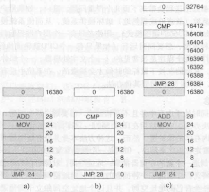

> 图3-2重定位问题的说明：a)一个16KB程序；b)另一个16KB程序；c)两个程序连续地装载到内存中

程序装载完毕之后就可以运行了。由于它们的内存键不同，它们不会破坏对方的内存。但在另一方面会发生问题。当第一个程序开始运行时，它执行了JMP24指令，然后不出预料地跳转到了相应的指令，这个程序会正常运行。

但是，当第一个程序已经运行了一段时间后，操作系统可能会决定开始运行第二个程序，即装载在第一个程序之上的地址16384处的程序。这个程序的第一条指令是JMP28，这条指令会使程序跳转到第一个程序的ADD指令，而不是事先设定的跳转到CMP指令。由于对内存地址的不正确访问，这个程序很可能在1秒之内就崩溃了。

这里关键的问题是这两个程序都引用了绝对物理地址，而这正是最需要避免的。我们希望每个程序都使用一套私有的本地地址来进行内存寻址。下面我们会展示这种技术是如何实现的。IBM360对上述问题的补救方案就是在第二个程序装载到内存的时候，使用静态重定位的技术修改它。它的工作方式如下：当一个程序被装载到地址16384时，常数16384被加到每一个程序地址上。虽然这个机制在不出错误的情况下是可行的，但这不是一种通用的解决办法，同时会减慢装载速度。而且，它要求给所有的可执行程序提供额外的信息来区分哪些内存字中存有（可重定位的）地址，哪些没有。毕竟，图3-2b中的“28”需要被重定位，但是像

MOV REGISTER1,28

这样把数28送到REGISTER1的指令不可以被重定位。装载器需要一定的方法来辨别地址和常数。

最后，正如我们在第1章中指出的，计算机世界的发展总是倾向于重复历史。虽然直接引用物理地址对于大型计算机、小型计算机、台式计算机和笔记本电脑来说已经成为很久远的记忆了（对此我们深表遗憾），但是缺少存储器抽象的情况在嵌入式系统和智能卡系统中还是很常见的。现在，像收音机、洗衣机和微波炉这样的设备都已经完全被（ROM形式的）软件控制，在这些情况下，软件都采用访问绝对内存地址的寻址方式。在这些设备中这样能够正常工作是因为，所有运行的程序都是可以事先确定的，用户不可能在烤面包机上自由地运行他们自己的软件。

虽然高端的嵌入式系统（比如智能手机）有复杂的操作系统，但是一般的简单嵌人式系统并非如此。在某些情况下可以用一种简单的操作系统，它只是一个被链接到应用程序的库，该库为程序提供I/O和其他任务所需要的系统调用。操作系统作为库实现的常见例子如流行的e-Cos操作系统。

## 3.2 一种存储器抽象：地址空间

总之，把物理地址暴露给进程会带来下面几个严重问题。第一，如果用户程序可以寻址内存的每个字节，它们就可以很容易地（故意地或偶然地）破坏操作系统，从而使系统慢慢地停止运行（除非使用特殊的硬件进行保护，如IBM360的锁键模式）。即使在只有一个用户进程运行的情况下，这个问题也是存在的。第二，使用这种模型，想要同时运行（如果只有一个CPU就轮流执行）多个程序是很困难的。在个人计算机上，同时打开几个程序是很常见的（一个文字处理器，一个邮件程序，一个网络浏览器），其中一个当前正在工作，其余的在按下鼠标的时候才会被激活。在系统中没有对物理内存的抽象的情况下，很难实现上述情景，因此，我们需要其他办法。

### 3.2.1 地址空间的概念

要使多个应用程序同时处于内存中并且不互相影响，需要解决两个问题：保护和重定位。我们来看一个原始的对前者的解决办法，它曾被用在IBM360上：给内存块标记上一个保护键，并且比较执行进程的键和其访问的每个内存字的保护键。然而，这种方法本身并没有解决后一个问题，虽然这个问题可以通过在程序被装载时重定位程序来解决，但这是一个缓慢且复杂的解决方法。

一个更好的办法是创造一个新的存储器抽象：地址空间。就像进程的概念创造了一类抽象的CPU以运行程序一样，地址空间为程序创造了一种抽象的内存。地址空间是一个进程可用于寻址内存的一套地址集合。每个进程都有一个自己的地址空间，并且这个地址空间独立于其他进程的地址空间（除了在一些特殊情况下进程需要共享它们的地址空间外）。

地址空间的概念非常通用，并且在很多场合中出现。比如电话号码，在美国和很多其他国家，一个本地电话号码通常是一个7位的数字。因此，电话号码的地址空间是从0000000到9999999，虽然一些号码并没有被使用，比如以000开头的号码。随着手机、调制解调器和传真机数量的增长，这个空间变得越来越不够用了，从而导致需要使用更多位数的号码。x86的1/0端口的地址空间从0到16383。IPv4的地址是32位的数字，因此它们的地址空间从0到23<sup>32</sup>-1（也有一些保留数字）。

地址空间也可以是非数字的，以“.com”结尾的网络域名的集合也是地址空间。这个地址空间是由所有包含2~63个字符并且后面跟着“.com”的字符串组成的，组成这些字符串的字符可以是字母、数字和连字符。到现在你应该已经明白地址空间的概念了，它是很简单的。

比较难的是给每个程序一个自已独有的地址空间，使得一个程序中的地址28所对应的物理地址与另一个程序中的地址28所对应的物理地址不同。下面我们将讨论一个简单的方法，这个方法曾经很常见，但是在有能力把更复杂（而且更好）的机制运用在现代CPU芯片上之后，这个方法就不再使用了。

**基址寄存器与界限寄存器**

这个简单的解决办法是使用动态重定位，简单地把每个进程的地址空间映射到物理内存的不同部分。从CDC6600（世界上最早的超级计算机）到Intel8088（原始IBMPC的心脏），所使用的经典办法是给每个CPU配置两个特殊硬件寄存器，通常叫作基址寄存器和界限寄存器。当使用基址寄存器和界限寄存器时，程序装载到内存中连续的空闲位置且装载期间无须重定位，如图3-2c所示。当一个进程运行时，程序的起始物理地址装载到基址寄存器中，程序的长度装载到界限寄存器中。在图3-2c中，当第一个程序运行时，装载到这些硬件寄存器中的基址和界限值分别是0和16384。当第二个程序运行时，这些值分别是16384和32768。如果第三个16KB的程序被直接装载在第二个程序的地址之上并且运行，这时基址寄存器和界限寄存器里的值会是32768和16384。

每次一个进程访问内存，取一条指令，读或写一个数据字，CPU硬件会在把地址发送到内存总线前，自动把基址值加到进程发出的地址值上。同时，它检查程序提供的地址是否等于或大于界限寄存器里的值。如果访问的地址超过了界限，会产生错误并中止访问。这样，对图3-2c中第二个程序的第一条指令，程序执行

JMP28

指令，但是硬件把这条指令解释成

JMP 16412

所以程序如我们所愿地跳转到了CMP指令。在图3-2c中第二个程序的执行过程中，基址寄存器和界限寄存器的设置如图3-3所示。

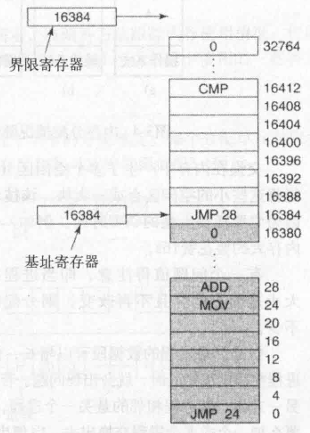

> 图3-3基址寄存器和界限寄存器可用于为每个进程提供一个独立的地址空间

使用基址寄存器和界限寄存器是给每个进程提供私有地址空间的非常容易的方法，因为每个内存地址在送到内存之前，都会自动先加上基址寄存器的内容。在很多实际系统中，对基址寄存器和界限寄存器会以一定的方式加以保护，使得只有操作系统可以修改它们。在CDC6600中就提供了对这些寄存器的保护，但在Intel8088中则没有，甚至没有界限寄存器。但是，Intel8088提供了多个基址寄存器，使程序的代码和数据可以被独立地重定位，但是没有提供引用地址越界的预防机制。

使用基址寄存器和界限寄存器重定位的缺点是，每次访问内存都需要进行加法和比较运算。比较运算可以做得很快，但是加法运算由于进位传递时间的问题，在没有使用特殊电路的情况下会显得很慢。

### 3.2.2 交换技术

如果计算机物理内存足够大，可以保存所有进程，那么之前提及的所有方案都或多或少是可行的。但实际上，所有进程所需的RAM数量总和通常要远远超出存储器能够支持的范围。在一个典型的Windows、OSX或Linux系统中，在计算机完成引导后会启动50~100个甚至更多的进程。例如，当一个Windows应用程序安装后，通常会发出一系列命令，使得在此后的系统引导中会启动一个仅仅用于查看该应用程序更新的进程。这样一个进程会轻易地占据5~10MB的内存。其他后台进程还会查看所收到的邮件和进来的网络连接，以及其他很多诸如此类的任务。并且，这一切都发生在第一个用户程序启动之前。当前重要的应用程序如Photoshop一启动就轻易地占据500MB内存，而开始处理数据后可能需要数千兆字节（GB）的空间。因此，把所有进程一直保存在内存中需要巨大的内存，如果内存不够，就做不到这一点。

有两种处理内存超载的通用方法。最简单的策略是交换（swapping）技术，即把一个进程完整调入内存，使该进程运行一段时间，然后把它存回磁盘。空闲进程主要存储在磁盘上，所以当它们不运行时就不会占用内存（尽管其中的一些进程会周期性地被唤醒以完成相关工作，然后就又进入睡眠状态）。另一种策略是虚拟内存（virtualmemory），该策略甚至能使程序在只有一部分被调入内存的情况下运行。下面先讨论交换技术，3.3节我们将考察虚拟内存。

交换系统的操作如图3-4所示。开始时内存中只有进程A。之后创建进程B和C或者从磁盘将它们换入内存。图3-4d显示A被交换到磁盘。然后D被调入，B被调出，最后A再次被调入。由于A的位置发生变化，所以在它换入的时候通过软件或者在程序运行期间（多数是这种情况）通过硬件对其地址进行重定位。例如，基址寄存器和界限寄存器就适用于这种情况。

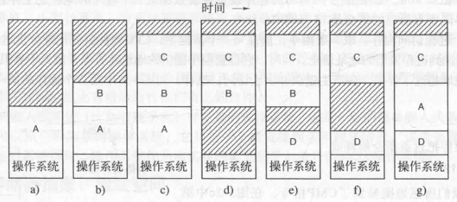

> 图3-4内存分配情况随着进程进出而变化，阴影区域表示未使用的内存

交换在内存中产生了多个空闲区（hole，也称为空洞），通过把所有的进程尽可能向下移动，有可能将这些小的空闲区合成一大块。该技术称为内存紧缩（memorycompaction）。通常不进行这个操作，因为它要耗费大量的CPU时间。例如，一台有16GB内存的计算机可以每8ns复制8个字节，它紧缩全部内存大约要花费16s。

有一个问题值得注意，即当进程被创建或换入时应该为它分配多大的内存。若进程创建时其大小是固定的并且不再改变，则分配很简单，操作系统准确地按其需要的大小进行分配，不多也不少。

但是如果进程的数据段可以增长，例如，很多程序设计语言都允许从堆中动态地分配内存，那么当进程空间试图增长时，就会出现问题。若进程与一个空闲区相邻，那么可把该空闲区分配给进程供其增大。另一方面，若进程相邻的是另一个进程，那么要么把需要增长的进程移到内存中一个足够大的区域中去，要么把一个或多个进程交换出去，以便生成一个足够大的空闲区。若一个进程在内存中不能增长，而且磁盘上的交换区也已满了，那么这个进程只有挂起直到一些空间空闲（或者可以结束该进程）。

如果大部分进程在运行时都要增长，为了减少因内存区域不够而引起的进程交换和移动所产生的开销，一种可用的方法是，当换入或移动进程时为它分配一些额外的内存。然而，当进程被换出到磁盘上时，应该只交换进程实际上使用的内存中的内容，将额外的内存交换出去是一种浪费。在图3-5a中读者可以看到一种已为两个进程分配了增长空间的内存配置。

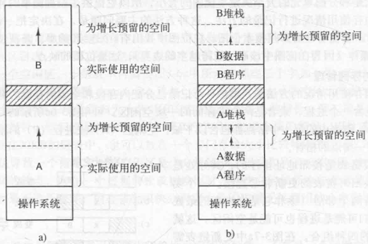

> 图3-5a)为可能增长的数据段预留空间；b)为可能增长的数据段和堆栈段预留空间

如果进程有两个可增长的段，例如，供变量动态分配和释放的作为堆使用的一个数据段，以及存放普通局部变量与返回地址的一个堆栈段，则可使用另一种安排，如图3-5b所示。在图中可以看到所示进程的堆栈段在进程所占内存的顶端并向下增长，紧接在程序段后面的数据段向上增长。在这两者之间的内存可以供两个段使用。如果用完了，进程或者必须移动到足够大的空闲区中（它可以被交换出内存直到内存中有足够的空间），或者结束该进程。

### 3.2.3 空闲内存管理

在动态分配内存时，操作系统必须对其进行管理。一般而言，有两种方法跟踪内存使用情况：位图和空闲区链表。在本节和下一节中将介绍这两种方法。第10章将详细介绍Linux系统中使用的一些特定的内存分配器（如伙伴分配器和slab分配器）。

#### 1.使用位图的存储管理

使用位图方法时，内存可能被划分成小到几个字或大到几千字节的分配单元。每个分配单元对应于位图中的一位，0表示空闲，1表示占用（或者相反）。一块内存区和其对应的位图如图3-6所示。

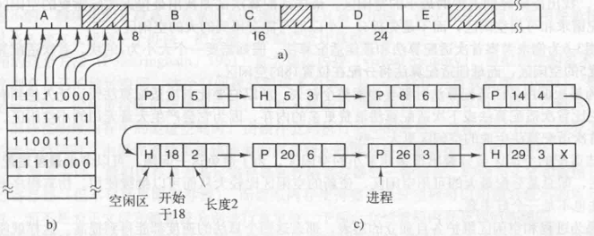

> 图3-6a）一段有5个进程和3个空闲区的内存，刻度表示内存分配单元，阴影区域表示空闲（在位图中用0表示）；b)对应的位图；c)用空闲区链表表示的同样的信息

分配单元的大小是一个重要的设计因素。分配单元越小，位图越大。然而即使只有4个字节大小的分配单元，32位的内存也只需要位图中的1位。32n位的内存需要n位的位图，所以位图只占用了1/32的内存。若选择比较大的分配单元，则位图更小。但若进程的大小不是分配单元的整数倍，那么在最后一个分配单元中就会有一定数量的内存被浪费了。

因为内存的大小和分配单元的大小决定了位图的大小，所以它提供了一种简单的利用一块固定大小的内存区就能对内存使用情况进行记录的方法。这种方法的主要问题是，在决定把一个占k个分配单元的进程调入内存时，存储管理器必须搜索位图，在位图中找出有k个连续0的串。查找位图中指定长度的连续0串是耗时的操作（因为在位图中该串可能跨越字的边界），这是位图的缺点。

#### 2.使用链表的存储管理

另一种记录内存使用情况的方法是，维护一个记录已分配内存段和空闲内存段的链表。其中链表中的一个结点或者包含一个进程，或者是两个进程间的一块空闲区。可用图3-6c所示的段链表来表示图36a所示的内存布局。链表中的每一个结点都包含以下域：空闲区（H）或进程（P）的指示标志、起始地址、长度和指向下一结点的指针。

在本例中，段链表是按照地址排序的，其好处是当进程终止或被换出时链表的更新非常直接。一个要终止的进程一般有两个邻居（除非它是在内存的最底端或最顶端），它们可能是进程也可能是空闲区，这就导致了图3-7所示的四种组合。在图3-7a中更新链表需要把P替换为H；在图3-7b和图3-7c中两个结点被合并为一个，链表少了一个结点：在图3-7d中三个结点被合并为一个，从链表中删除了两个结点。

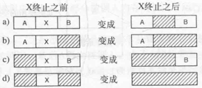

> 图3-7结束进程X时与相邻区域的四种组合

进程表中表示终止进程的结点中通常含有指向对应于其段链表结点的指针，因此段链表使用双向链表可能要比图3-6c所示的单向链表更方便。这样的结构更易于找到上一个结点，并检查是否可以合并。

当按照地址顺序在链表中存放进程和空闲区时，有几种算法可以用来为创建的进程（或从磁盘换入的已存在的进程）分配内存。这里，假设存储管理器知道要为进程分配多少内存。最简单的算法是首次适配（firstfit）算法。存储管理器沿着段链表进行搜索，直到找到一个足够大的空闲区，除非空闲区大小和要分配的空间大小正好一样，否则将该空闲区分为两部分，一部分供进程使用，另一部分形成新的空闲区。首次适配算法是一种速度很快的算法，因为它尽可能少地搜索链表结点。

对首次适配算法进行很小的修改就可以得到下次适配（nextfit）算法。它的工作方式和首次适配算法相同，不同点是每次找到合适的空闲区时都记录当时的位置，以便在下次寻找空闲区时从上次结束的地方开始搜索，而不是像首次适配算法那样每次都从头开始。Bays（1977）的仿真程序证明下次适配算法的性能略低于首次适配算法。

另一个著名的并广泛应用的算法是最佳适配（bestfit）算法。最佳适配算法搜索整个链表（从开始到结束），找出能够容纳进程的最小的空闲区。最佳适配算法试图找出最接近实际需要的空闲区，以最好地匹配请求和可用空闲区，而不是先拆分一个以后可能会用到的大的空闲区。

以图3-6为例来考察首次适配算法和最佳适配算法。假如需要一个大小为2的块，首次适配算法将分配在位置5的空闲区，而最佳适配算法将分配在位置18的空闲区。

因为每次调用最佳适配算法时都要搜索整个链表，所以它要比首次适配算法慢。让人感到有点意外的是，它比首次适配算法或下次适配算法浪费更多的内存，因为它会产生大量无用的小空闲区。一般情况下，首次适配算法生成的空闲区更大一些。

最佳适配的空闲区会分裂出很多非常小的空闲区，为了避免这一问题，可以考虑最差适配（worstfit）算法，即总是分配最大的可用空闲区，使新的空闲区比较大从而可以继续使用。仿真程序表明最差适配算法也不是一个好主意。

如果为进程和空闲区维护各自独立的链表，那么这四个算法的速度都能得到提高。这样就能集中精力只检查空闲区而不是进程。但这种分配速度的提高的一个不可避免的代价就是增加复杂度和内存释放速度变慢，因为必须将一个回收的段从进程链表中删除并插入空闲区链表。

如果进程和空闲区使用不同的链表，则可以按照大小对空闲区链表排序，以便提高最佳适配算法的速度。在使用最佳适配算法搜索由小到大排列的空闲区链表时，只要找到一个合适的空闲区，则这个空闲区就是能容纳这个作业的最小的空闲区，因此是最佳适配。因为空闲区链表以单链表形式组织，所以不需要进一步搜索。空闲区链表按大小排序时，首次适配算法与最佳适配算法一样快，而下次适配算法在这里则毫无意义。

在与进程段分离的单独链表中保存空闲区时，可以做一个小小的优化。不必像图3-6c那样用单独的数据结构存放空闲区链表，而可以利用空闲区存储这些信息。每个空闲区的第一个字可以是空闲区大小，第二个字指向下一个空闲区。于是就不再需要图3-6c中所示的那些三个字加一位（P/H）的链表结点了。

另一种分配算法称为快速适配（quickfit）算法，它为那些常用大小的空闲区维护单独的链表。例如，有一个n项的表，该表的第一项是指向大小为4KB的空闲区链表表头的指针，第二项是指向大小为8KB的空闲区链表表头的指针，第三项是指向大小为12KB的空闲区链表表头的指针，以此类推。像21KB这样的空闲区既可以放在20KB的链表中，也可以放在一个专门存放大小比较特别的空闲区的链表中。

快速适配算法寻找一个指定大小的空闲区是十分快速的，但它和所有将空闲区按大小排序的方案一样，都有一个共同的缺点，即在一个进程终止或被换出时，寻找它的相邻块并查看是否可以合并的过程是非常费时的。如果不进行合并，内存将会很快分裂出大量的进程无法利用的小空闲区。

## 3.3 虚拟内存

尽管基址寄存器和界限寄存器可以用于创建地址空间的抽象，还有另一个问题需要解决：管理软件的膨胀（bloatware）。虽然存储器容量增长快速，但是软件大小的增长更快。在20世纪80年代，许多大学用一台4MB的VAX计算机运行分时操作的系统，供十几个用户（已经或多或少足够满足需要了）同时运行。现在微软公司推荐64位Windows8系统至少需要2GB内存，而多媒体的潮流则进一步推动了对内存的需求。

这一发展的结果是，需要运行的程序往往大到内存无法容纳，而且必然需要系统能够支持多个程序同时运行，即使内存可以满足其中单独一个程序的需要，总体来看它们仍然超出了内存大小。交换技术并不是一个具有吸引力的解决方案，因为一个典型SATA磁盘的峰值传输率高达每秒好几百兆，这意味着需要好几秒才能换出或换人一个1GB的程序。

程序大于内存的问题早在计算时代伊始就产生了，虽然只是有限的应用领域，像科学和工程计算（模拟宇宙的创建或模拟新型航空器都会花费大量内存）。在20世纪60年代所采取的解决方法是：把程序分割成许多片段，称为覆盖（overlay）。程序开始执行时，将覆盖管理模块装入内存，该管理模块立即装人并运行覆盖0。执行完成后，覆盖0通知管理模块装入覆盖1，或者占用覆盖0的上方位置（如果有空间），或者占用覆盖0（如果没有空间）。一些覆盖系统非常复杂，允许多个覆盖块同时在内存中。覆盖块存放在磁盘上，在需要时由操作系统动态地换入换出。

虽然由系统完成实际的覆盖块换入换出操作，但是程序员必须把程序分割成多个片段。把一个大程序分割成小的、模块化的片段是非常费时和枯燥的，并且易于出错。很少程序员擅长使用覆盖技术。因此，没过多久就有人找到一个办法，把全部工作都交给计算机去做。

采用的这个方法（Fotheringham，1961）称为虚拟内存（virtualmemory）。虚拟内存的基本思想是：每个程序拥有自己的地址空间，这个空间被分割成多个块，每一块称作一页或页面（page）。每一页有连续的地址范围。这些页被映射到物理内存，但并不是所有的页都必须在内存中才能运行程序。当程序引用到一部分在物理内存中的地址空间时，由硬件立刻执行必要的映射。当程序引用到一部分不在物理内存中的地址空间时，由操作系统负责将缺失的部分装入物理内存并重新执行失败的指令。

从某个角度来讲，虚拟内存是对基址寄存器和界限寄存器的一种综合。8088为正文和数据分离出专门的基址寄存器（但不包括界限寄存器）。而虚拟内存使得整个地址空间可以用相对较小的单元映射到物理内存，而不是为正文段和数据段分别进行重定位。下面会介绍虚拟内存是如何实现的。

虚拟内存很适合在多道程序设计系统中使用，许多程序的片段同时保存在内存中。当一个程序等待它的一部分读入内存时，可以把CPU交给另一个进程使用。

###  3.3.1 分页

大部分虚拟内存系统中都使用一种称为分页（paging）的技术，我们现在就介绍这一技术。在任何一台计算机上，程序引用了一组内存地址。当程序执行指令

MOV REG,1000

时，它把地址为1000的内存单元的内容复制到REG中（或者相反，这取决于计算机的型号）。地址可以通过索引、基址寄存器、段寄存器或其他方式产生。

由程序产生的这些地址称为虚拟地址（virtualaddress），它们构成了一个虚拟地址空间（virtualaddressspace）。在没有虚拟内存的计算机上，系统直接将虚拟地址送到内存总线上，读写操作使用具有同样地址的物理内存字；而在使用虚拟内存的情况下，虚拟地址不是被直接送到内存总线上，而是被送到内存管理单元（MemoryManagementUnit，MMU），MMU把虚拟地址映射为物理内存地址，如图3-8所示。

图3-9所示的简单例子说明了这种映射是如何工作的。在这个例子中，有一台可以产生16位地址的计算机，地址范围从0到64K-1，且这些地址是虚拟地址。然而，这台计算机只有32KB的物理内存，因此，虽然可以编写64KB的程序，但它们却不能被完全调入内存运行。在磁盘上必须有一个最多64KB的程序核心映像的完整副本，以保证程序片段在需要时能被调入内存。

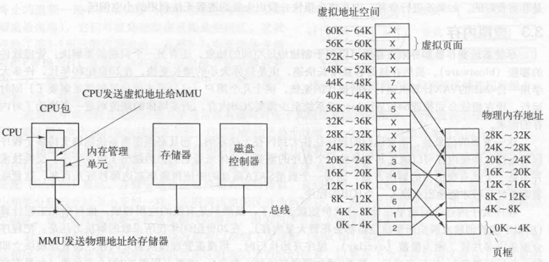

> 图3-8MMU的位置和功能。这里MMU作为CPU芯片的一部分，因为通常就是这样做的。不过从逻辑上看，它可以是一片单独的芯片，并且早就已经这样了
>
> 图3-9页表给出虚拟地址与物理内存地址之间的映射关系。每一页起始于4096的倍数位置，结束于起址加4095的位置，所以4K到8K实际为4096~8191，8K到12K就是8192~12287

虚拟地址空间按照固定大小划分成被称为页面（page）的若干单元。在物理内存中对应的单元称为页框（pageframe）。页面和页框的大小通常是一样的，在本例中是4KB，但实际系统中的页面大小从512字节到1GB。对应于64KB的虚拟地址空间和32KB的物理内存，可得到16个虚拟页面和8个页框。RAM和磁盘之间的交换总是以整个页面为单元进行的。很多处理器根据操作系统认为适合的方式，支持对不同大小页面的混合使用和匹配。例如，x86-64架构的处理器支持4KB、2MB和1GB大小的页面，因此，可以将一组4KB大小的页面用于用户程序，将一个1GB大小的页面用于内核程序。稍后将介绍为什么有时候用一个较大的页面好于用一堆较小的页面。

图3-9中的标记符号如下：标记0K~4K的范围表示该页的虚拟地址或物理地址是0~4095，4K~8K的范围表示地址4096~8191，等等。每一页包含了4096个地址，起始于4096的整数倍位置，结束于4096倍数缺1的位置。

当程序试图访问地址0时，例如执行下面这条指令

MOV REG,0

将虚拟地址0送到MMU。MMU看到虚拟地址落在页面0（0~4095），根据其映射结果，这一页面对应的是页框2（8192~12287），因此MMU把地址变换为8192，并把地址8192送到总线上。内存对MMU一无所知，它只看到一个读或写地址8192的请求并执行它。MMU从而有效地把所有从0~4095的虚拟地址映射到了8192~12287的物理地址。同样地，指令

MOV REG,8192 

被有效地转换为：

MOV REG,24576

因为虚拟地址8192（在虚拟页面2中）被映射到物理地址24576（在物理页框6中）上。第三个例子，虚拟地址20500在距虚拟页面5（虚拟地址20480~24575）起始地址20字节处，并且被映射到物理地址12288+20=12308。

通过恰当地设置MMU，可以把16个虚拟页面映射到8个页框中的任何一个。但是这并没有解决虚拟地址空间比物理内存大的问题。在图3-9中只有8个物理页框，于是只有8个虚拟页面被映射到了物理内存中，在图3-9中用叉号表示的其他页面并没有被映射。在实际的硬件中，用一个“在/不在”位（present/absentbit）记录页面在内存中的实际存在情况。

当程序访问了一个未映射的页面，例如执行指令

MOV REG,32780

将会发生什么情况呢？虚拟页面8（从32768开始）的第12个字节所对应的物理地址是什么呢？MMU注意到该页面没有被映射（在图中用叉号表示），于是使CPU陷人到操作系统，这个陷阱称为缺页中断或缺页错误（pagefault）。操作系统找到一个很少使用的页框且把它的内容写入磁盘（如果它不在磁盘上）。随后把需要访问的页面读到刚才回收的页框中，修改映射关系，然后重新启动引起陷阱的指令。

例如，如果操作系统决定放弃页框1，那么它将把虚拟页面8装入物理地址4096，并对MMU映射做两处修改。首先，它要将虚拟页面1的表项标记为未映射，使以后任何对虚拟地址4096~8191的访问都导致陷阱。随后把虚拟页面8的表项的叉号改为1，因此在引起陷阱的指令重新启动时，它将把虚拟地址32780映射为物理地址4108（4096+12）。

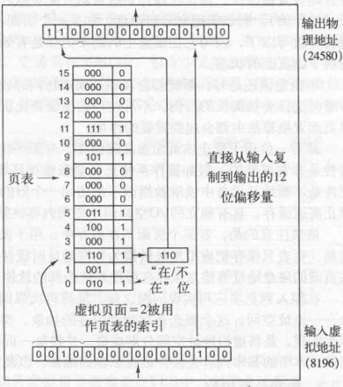

> 图3-10在16个4KB页面情况下MMU的内部操作

下面查看一下MMU的内部结构以便了解它是怎么工作的，以及了解为什么我们选用的页面大小都是2的整数次幂。在图3-10中可以看到一个虚拟地址的例子，虚拟地址8196（二进制是0010000000000100）用图3-9所示的MMU映射机制进行映射，输入的16位虚拟地址被分为4位的页号和12位的偏移量。4位的页号可以表示16个页面，12位的偏移可以为一页内的全部4096个字节编址。

可用页号作为页表（pagetable）的索引l，以得出对应于该虚拟页面的页框号。如果“在/不在”位是0，则将引起一个操作系统陷阱。如果该位是1，则将在页表中查到的页框号复制到输出寄存器的高3位中，再加上输入虚拟地址中的低12位偏移量。如此就构成了15位的物理地址。输出寄存器的内容随即被作为物理地址送到内存总线。

### 3.3.2 页表

作为一种最简单的实现，虚拟地址到物理地址的映射可以概括如下：虚拟地址被分成虚拟页号（高位部分）和偏移量（低位部分）两部分。例如，对于16位地址和4KB的页面大小，高4位可以指定16个虚拟页面中的一页，而低12位接着确定了所选页面中的字节偏移量（0~4095）。但是使用3或者5或者其他位数拆分虚拟地址也是可行的。不同的划分对应不同的页面大小。

虚拟页号可用作页表的索引，以找到该虚拟页面对应的页表项。由页表项可以找到页框号（如果有的话）。然后把页框号拼接到偏移量的高位端，以替换掉虚拟页号，形成送往内存的物理地址。

页表的目的是把虚拟页面映射为页框。从数学角度说，页表是一个函数，它的参数是虚拟页号，结果是物理页框号。通过这个函数可以把虚拟地址中的虚拟页面域替换成页框域，从而形成物理地址。

在本章中，我们只关心虚拟内存和不完全虚拟化，换言之，不涉及虚拟机。我们在第7章中将会看到，每个虚拟机都需要自已的虚拟内存，因此页表组织变得很复杂，包括影子页表和嵌套页表。我们会看到，即使没有这些复杂的配置，页面调度和虚拟内存也相当复杂。

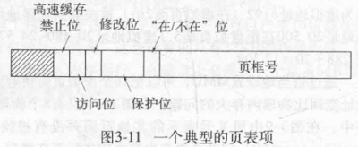

**页表项的结构**

下面将讨论单个页表项的细节。页表项的结构是与机器密切相关的，但不同机器的页表项存储的信息都大致相同。图3-11中给出了页表项的一个例子。不同计算机的页表项大小可能不一样，但32位是一个常用的大小。最重要的域是页框号。毕竟页映射的目的是找到这个值，其次是“在/不在”位。这一位是1时表示该表项是有效的，可以使用；如果是0，则表示该表项对应的虚拟页面现在不在内存中，访问该页面会引起一个缺页中断。

保护（protection）位指出一个页允许什么类型的访问。最简单的形式是这个域只有一位，0表示读/写，1表示只读。一个更先进的方法是使用三位，各位分别对应是否启用读、写、执行该页面。

为了记录页面的使用状况，引入了修改（modified）位和访问（referenced）位。在写入一页时由硬件自动设置修改位。该位在操作系统重新分配页框时是非常有用的。如果一个页面已经被修改过（即它是“脏”的），则必须把它写回磁盘。如果一个页面没有被修改过（即它是“干净”的），则只简单地把它丢弃就可以了，因为它在磁盘上的副本仍然是有效的。这一位有时也被称为脏位（dirtybit），因为它反映了该页面的状态。

不论是读还是写，系统都会在该页面被访问时设置访问位。它的值被用来帮助操作系统在发生缺页中断时选择要被淘汰的页面。不再使用的页面要比正在使用的页面更适合淘汰。这一位在即将讨论的很多页面置换算法中都会起到重要的作用。

最后一位用于禁止该页面被高速缓存。对那些映射到设备寄存器而不是常规内存的页面而言，这个特性是非常重要的。假如操作系统正在紧张地循环等待某个I/O设备对它刚发出的命令作出响应，保证硬件是不断地从设备中读取数据而不是访问一个旧的被高速缓存的副本是非常重要的。通过这一位可以禁止高速缓存。具有独立的I/O空间而不使用内存映射I/O的机器不需要这一位。

应该注意的是，若某个页面不在内存中，用于保存该页面的磁盘地址不是页表的组成部分。原因很简单，页表只保存把虚拟地址转换为物理地址时硬件所需要的信息。操作系统在处理缺页中断时需要把该页面的磁盘地址等信息保存在操作系统内部的软件表格中。硬件不需要它。

在深入到更多应用实现问题之前，值得再次强调的是：虚拟内存本质上是用来创造一个新的抽象概念一一地址空间，这个概念是对物理内存的抽象，类似于进程是对物理处理器（CPU）的抽象。虚拟内存的实现，是将虚拟地址空间分解成页，并将每一页映射到物理内存的某个页框或者（暂时）解除映射。因此，本节的基本内容是操作系统创建的抽象，以及如何管理这个抽象。

### 3.3.3 加速分页过程

我们已经了解了虚拟内存和分页的基础。现在可以更具体地讨论可能的实现了。在任何分页系统中，都需要考虑两个主要问题：

1）虚拟地址到物理地址的映射必须非常快。

2）如果虚拟地址空间很大，页表也会很大。

第一个问题是由于每次访问内存都需要进行虚拟地址到物理地址的映射，所有的指令最终都必须来自内存，并且很多指令也会访问内存中的操作数。因此，每条指令进行一两次或更多页表访问是必要的。如果执行一条指令需要1ns，页表查询必须在0.2ns之内完成，以避免映射成为一个主要瓶颈。

第二个问题来自现代计算机使用至少32位的虚拟地址，而且64位变得越来越普遍。假设页面大小为4KB，32位的地址空间将有100万页，而64位地址空间简直多到超乎你的想象。如果虚拟地址空间中有100万页，那么页表必然有100万条表项。另外请记住，每个进程都需要自己的页表（因为它有自己的虚拟地址空间）。

对大而快速的页映射的需求成为构建计算机的重要约束。最简单的设计（至少从概念上）是使用由“快速硬件寄存器”阵列组成的单一页表，每一个表项对应一个虚拟页面，虚拟页号作为索引，如图310所示。当启动一个进程时，操作系统把保存在内存中的进程页表的副本载入到寄存器中。在进程运行过程中，不必再为页表而访问内存。这个方法的优势是简单并且在映射过程中不需要访问内存。而缺点是在页表很大时，代价高昂。而且每一次上下文切换都必须装载整个页表，这样会降低性能。

另一种极端方法是，整个页表都在内存中。那时所需的硬件仅仅是一个指向页表起始位置的寄存器。这样的设计使得在上下文切换时，进行“虚拟地址到物理地址”的映射只需重新装入一个寄存器。当然，这种做法的缺陷是在执行每条指令时，都需要一次或多次内存访问来完成页表项的读人，速度非常慢。

#### 1.转换检测缓冲区

现在讨论加速分页机制和处理大的虚拟地址空间的实现方案，先介绍加速分页问题。大多数优化技术都是从内存中的页表开始的。这种设计对效率有着巨大的影响。例如，假设一条1字节指令要把一个寄存器中的数据复制到另一个寄存器。在不分页的情况下，这条指令只访问一次内存，即从内存中取指令。有了分页机制后，会因为要访问页表而引起更多次的内存访问。由于执行速度通常被CPU从内存中取指令和数据的速度所限制，所以两次访问内存才能实现一次内存访问会使性能下降一半。在这种情况下，没人会采用分页机制。

多年以来，计算机的设计者已经意识到了这个问题，并找到了一种解决方案。这种解决方案的建立基于这样一种观察：大多数程序总是对少量的页面进行多次的访问，而不是相反。因此，只有很少的页表项会被反复读取，而其他的页表项很少被访问。

上面提到的解决方案是为计算机设置一个小型的硬件设备，将虚拟地址直接映射到物理地址，而不必再访问页表。这种设备称为转换检测缓冲区（TranslationLookasideBuffer，TLB），有时又称为相联存储器（associatememory）或快表，如图3-12所示。它通常在MMU中，包含少量的表项，在此例中为8个，在实际中很少会超过256个。每个表项记录了一个页面的相关信息，包括虚拟页号、页面的修改位、保护码（读/写/执行权限）和该页所对应的物理页框。除了虚拟页号（不是必须放在页表中），这些域与页表中的域是一一对应的。另外还有一位用来记录这个表项是否有效（即是否在使用）。

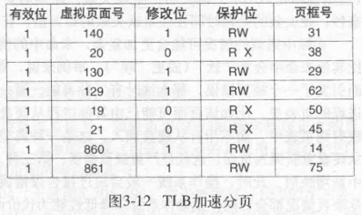

例如，如果一个进程在虚拟地址19、20和21之间有一个循环，那么可以生成图3-12中的TLB，这些TLB表项中有可读和可执行的保护码。当前主要使用的数据（假设是个数组）放在页面129和页面130中。页面140包含了用于数组计算的索引。最后，堆栈位于页面860和页面861。

现在看一下TLB是如何工作的。将一个虚拟地址放入MMU中进行转换时，硬件首先通过将该虚拟页号与TLB中所有表项同时（即并行）进行匹配，判断虚拟页面是否在其中。如果发现了一个有效的匹配并且要进行的访问操作并不违反保护位，则将页框号直接从TLB中取出而不必再访问页表。如果虚拟页号确实是在TLB中，但指令试图在一个只读页面上进行写操作，则会产生一个保护错误，就像对页表进行非法访问一样。

当虚拟页号不在TLB中时会怎样呢？如果MMU检测到没有有效的匹配项，就会进行正常的页表查询。接着从TLB中淘汰一个表项，然后用新找到的页表项代替它。这样，如果这一页面很快被再次访问，第二次访问TLB时自然将会命中而不是未命中。当一个表项被清除出TLB时，将修改位复制到内存中的页表项，而除了访问位，其他的值不变。当页表项中从页表中装入TLB中时，所有的值都来自内存。

#### 2.软件TLB管理

到目前为止，我们已经假设每一台具有虚拟内存的机器都具有由硬件识别的页表，以及一个TLB。在这种设计中，对TLB的管理和TLB的失效处理都完全由MMU硬件来实现。只有在内存中没有找到某个页面时，才会陷入到操作系统中。

在过去，这样的假设是正确的。但是，许多现代的RISC机器，包括SPARC、MIPS以及（现在废弃的）HPPA，几乎所有的页面管理都是在软件中实现的。在这些机器上，TLB表项被操作系统显式地装载。当发生TLB访问失效时，不再是由MMU到页表中查找并取出需要的页表项，而是生成一个TLB失效并将问题交给操作系统解决。系统必须先找到该页面，然后从TLB中删除一个项，接着装载一个新的项，最后再执行先前出错的指令。当然，所有这一切都必须在有限的几条指令中完成，因为TLB失效比缺页中断发生得更加频繁。

让人感到惊奇的是，如果TLB大到（如64个表项）可以减少失效率时，TLB的软件管理就会变得足够有效。这种方法的最主要的好处是获得了一个非常简单的MMU，这就在CPU芯片上为高速缓存以及其他改善性能的设计腾出了相当大的空间。Uhlig等人（Uhlig，1994）在论文中讨论过软件TLB管理。

很早以前就已经开发了多种不同的策略来改善采用软件TLB管理机制的机器的性能。其中一种策略是在减少TLB失效的同时，又要在发生TLB失效时减少处理开销（Bala等人，1994）。为了减少TLB失效，有时候操作系统能用“直觉”指出哪些页面下一步可能会被用到并预先为它们在TLB中装载表项。例如，当一个客户进程发送一条消息给同一台机器上的服务器进程，很可能服务器将不得不立即运行。了解了这一点，当执行处理send的陷阱时，系统也可以找到服务器的代码页、数据页以及堆栈页，并在有可能导致TLB失效前把它们装载到TLB中。

无论是用硬件还是用软件来处理TLB失效，常见方法都是找到页表并执行索引操作以定位将要访问的页面。用软件做这样的搜索的问题是，页表可能不在TLB中，这就会导致处理过程中的额外的TLB失效。可以通过在内存中的固定位置维护一个大的（如4KB）TLB表项的软件高速缓存（该高速缓存的页面一直保存在TLB中）来减少TLB失效。通过首先检查软件高速缓存，操作系统能够实质性地减少TLB失效。当使用软件TLB管理时，一个基本要求是要理解两种不同的TLB失效的区别在哪里。当一个页面访问在内存中而不在TLB中时，将产生软失效（softmiss）。那么此时所要做的就是更新一下TLB，不需要产生磁盘1/0。典型的处理需要10~20个机器指令并花费几纳秒完成操作。相反，当页面本身不在内存中（当然也不在TLB中）时，将产生硬失效。此刻需要一次磁盘存取以装入该页面，这个过程大概需要几毫秒。硬失效的处理时间往往是软失效的百万倍。在页表结构中查找相应的映射被称为页表遍历。

实际中遇到的情况可能会更加复杂，未命中的情况可能既不是软失效也不是硬失效。一些未命中相比其他未命中会更“软”（或更“硬”）。举例来说，假设页表遍历没有在进程的页表中找到需要的页，从而引发了一个缺页错误，那么这时有三种可能。第一种，所需的页面可能就在内存中，但却未记录在该进程的页表里。比如该页面可能已由其他进程从硬盘中调入内存，这种情况下只需要把所需的页面正确映射到页表中，而不用再从硬盘调入。这是一种典型的软失效，称为次要缺页错误。第二种，如果需要从硬盘重新调入页面，这就是严重缺页错误。第三种，程序可能访问了一个非法地址，根本不需要向TLB中新增映射。此时，操作系统一般会通过报告段错误来终止该程序。只有第三种缺页属于程序错误，其他缺页情况都会被硬件或操作系统以降低性能为代价而自动修复。

### 3.3.4 针对大内存的页表

在原有的内存页表的方案之上，引I入TLB可以加快虚拟地址到物理地址的转换。不过这不是唯一需要解决的问题。另一个问题是怎样处理巨大的虚拟地址空间。下面将讨论两种解决方法。

#### 1.多级页表

第一种方法是采用多级页表。一个简单的例子如图3-13所示。在图3-13a中，32位的虚拟地址被划分为10位的PT1域、10位的PT2域和12位的Offset（偏移量）域。因为偏移量是12位，所以页面大小是4KB，共有2<sup>20</sup>个页面。

引人多级页表的原因是避免把全部页表一直保存在内存中。特别是那些从不需要的页表就不应该保留。比如一个需要12MB内存的进程，其最底端是4MB的程序正文段，后面是4MB的数据段，顶端是4MB的堆栈段，在数据段上方和堆栈段下方之间是大量根本没有使用的空闲区。

考察图3-13b中的二级页表是如何工作的。在左边是顶级页表，它有1024个表项，对应于10位的PT1域。当一个虚拟地址被送到MMU时，MMU首先提取PT1域并把该值作为访问顶级页表的索引。因为整个4GB（即32位）虚拟地址空间已经按4KB大小分块，所以顶级页表中这1024个表项的每一个都表示4M的块地址范围。

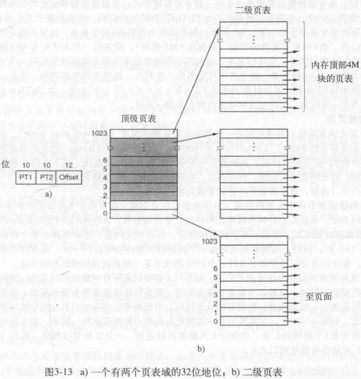

由索引顶级页表得到的表项中含有二级页表的地址或页框号。顶级页表的表项0指向程序正文的页表，表项1指向数据的页表，表项1023指向堆栈的页表，其他的表项（用阴影表示的）未用。现在把PT2域作为访问选定的二级页表的索引，以便找到该虚拟页面的对应页框号。

下面看一个示例，考虑32位虚拟地址0x00403004（十进制4206596）位于数据部分12292字节处。它的虚拟地址对应PT1=1，PT2=3，Offset=4。MMU首先用PT1作为索引访问顶级页表得到表项1，它对应的地址范围是4M到8M-1。然后，它用PT2作为索引访问刚刚找到的二级页表并得到表项3，它对应的虚拟地址范围是在它的4M块内的12288~16383（即绝对地址4206592~4210687）。这个表项含有虚拟地址0x00403004所在页面的页框号。如果该页面不在内存中，页表项中的“在/不在”位将是0，引发一次缺页中断。如果该页面在内存中，从二级页表中得到的页框号将与偏移量（4）结合形成物理地址。该地址被放到总线上并送到内存中。

值得注意的是，虽然在图3-13中虚拟地址空间超过100万个页面，实际上只需要四个页表：顶级页表以及0~4M（正文段）、4M~8M（数据段）和顶端4M（堆栈段）的二级页表。顶级页表中1021个表项的“在/不在”位都被设为0，当访问它们时强制产生一个缺页中断。如果发生了这种情况，操作系统将注意到进程正在试图访问一个不希望被访问的地址，并采取适当的行动，比如向进程发出一个信号或杀死进程等。在这个例子中的各种长度选择的都是整数，并且选择PT1与PT2等长，但在实际中也可能是其他的值。

图3-13所示的二级页表可扩充为三级、四级或更多级。级数越多，灵活性就越大。举例来说，Intel在1985年推出的32位处理器80386的寻址空间就多达4GB。它采用包含页目录的二级页表机制，页目录中的项指向页表，页表项再指向真实大小为4KB的页框。页目录和页表都包含1024个表项，这样就可以像预期的一样，一共可以提供2<sup>10</sup>×2<sup>10</sup>×2<sup>12</sup>=2<sup>32</sup>个可寻址字节。

十年后，高性能奔腾处理器推出了另一种寻址实现形式：页目录指针表。此外，它每一级的页表项由32位扩展到了64位，这样处理器就能寻址到4GB以外的地址空间。由于在每个页目录指针表中只有4条目录，因此每个页目录表中有512个条目，每个页表中也只有512个条目，这样总的寻址空间依然被限定在4GB以内。当x86系列支持64位后（最初由AMD实现），附加的一层表结构本可以被称作“页目录指针表指针”或类似的令人生厌的名字。这与芯片制造者的常用命名规则非常匹配，不过好在他们为其取了另一个名字一一4级页表，这个名字可能不那么吸引人，但至少简短而明确。现在，这些处理器在页表中都使用512个条目，可寻址空间达到了2<sup>9</sup>×2<sup>9</sup>×2<sup>9</sup>×2<sup>9</sup>×2<sup>12</sup>=2<sup>48</sup>字节，共256TB大小的内存空间可以够用相当长一段时间，因此芯片制造者没有再多加一层页。

#### 2.倒排页表

针对页式调度层级不断增长的另一种解决方案是倒排页表（invertedpagetable），首先采用这种解决方案的处理器有PowerPC、UltraSPARC和Itanium（有时也被称作Itanic，这款处理器并没有达到Intel所期望的目标）。在这种设计中，实际内存中的每个页框对应一个表项，而不是每个虚拟页面对应一个表项。例如，对于64位虚拟地址，4KB的页，4GB的RAM，一个倒排页表仅需要1048576个表项。表项记录了哪一个（进程，虚拟页面）对定位于该页框。

虽然倒排页表节省了大量的空间（至少当虚拟地址空间比物理内存大得多的时候是这样的），但它也有严重的不足：从虚拟地址到物理地址的转换会变得很困难。当进程n访问虚拟页面p时，硬件不再能通过把p当作指向页表的一个索引来查找物理页框。取而代之的是，它必须搜索整个倒排页表来查找某一个表项（n，P）。此外，该搜索必须对每一个内存访问操作都要执行一次，而不仅仅是在发生缺页中断时执行。每次内存访问操作都要查找一个256K的表不是一种使机器快速运行的方法。

走出这种两难局面的办法是使用TLB。如果TLB能够记录所有频繁使用的页面，地址转换就可能变得像通常的页表一样快。但是，当发生TLB失效时，需要用软件搜索整个倒排页表。实现该搜索的一个可行的方法是建立一张散列表，用虚拟地址来散列。当前所有在内存中的具有相同散列值的虚拟页面被链接在一起，如图3-14所示。如果散列表中的槽数与机器中物理页面数一样多，那么散列表的冲突链的平均长度将会是1个表项的长度，这将会大大提高映射速度。一旦页框号被找到，新的（虚拟页号，物理页框号）对就会被装载到TLB中。

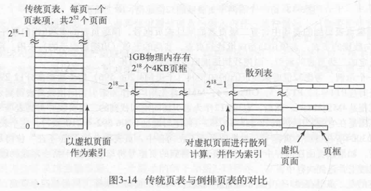

倒排页表在64位机器中很常见，因为在64位机器中即使使用了大页面，页表项的数量还是很庞大的。例如，对于4MB页面和64位虚拟地址，需要2<sup>42</sup>个页表项。处理大虚存的其他方法可参见Talluri等人（1995）的论文。

## 3.4 页面置换算法

当发生缺页中断时，操作系统必须在内存中选择一个页面将其换出内存，以便为即将调入的页面腾出空间。如果要换出的页面在内存驻留期间已经被修改过，就必须把它写回磁盘以更新该页面在磁盘上的副本；如果该页面没有被修改过（如一个包含程序正文的页面），那么它在磁盘上的副本已经是最新的，不需要回写。直接用调入的页面覆盖被淘汰的页面就可以了。

当发生缺页中断时，虽然可以随机地选择一个页面来置换，但是如果每次都选择不常使用的页面会提升系统的性能。如果一个被频繁使用的页面被置换出内存，很可能它在很短时间内又要被调入内存，这会带来不必要的开销。人们已经从理论和实践两个方面对页面置换算法进行了深入的研究。下面我们将介绍几个最重要的算法。

有必要指出，“页面置换”问题在计算机设计的其他领域中也同样会发生。例如，多数计算机把最近使用过的32字节或64字节的存储块保存在一个或多个高速缓存中。当这些高速缓存存满之后就必须选择一些块丢掉。除了花费时间较短外（有关操作必须在几纳秒内完成，而不是像页面置换那样在微秒级上完成），这个问题同页面置换问题完全一样。之所以花费时间较短，其原因是丢掉的高速缓存块可以从内存中获得，而内存既没有寻道时间也不存在旋转延迟。

第二个例子是Web服务器。服务器可以把经常访问的一些Web页面存放在存储器的高速缓存中。但是，当存储器高速缓存已满并且要访问一个不在高速缓存中的页面时，就必须要置换高速缓存中的某个Web页面。在高速缓存中的Web页面不会被修改，因此在磁盘中的Web页面的副本总是最新的，而在虚拟存储系统中，内存中的页面既可能是干净页面也可能是脏页面，除了这一点不同之外，置换Web页面和置换虚拟内存中的页面需要考虑的问题是类似的。

在接下来讨论的所有页面置换算法中都存在一个问题：当需要从内存中换出某个页面时，它是否只能是缺页进程自己的页面？这个要换出的页面是否可以属于另外一个进程？在前一种情况下，可以有效地将每一个进程限定在固定的页面数目内；后一种情况则不能。这两种情况都是可能的。在3.5.1节我们会继续讨论这一点。

### 3.4.1 最优页面置换算法

很容易就可以描述出最好的页面置换算法，虽然此算法不可能实现。该算法是这样工作的：在缺页中断发生时，有些页面在内存中，其中有一个页面（包含紧接着的下一条指令的那个页面）将很快被访问，其他页面则可能要到10、100或1000条指令后才会被访问，每个页面都可以用在该页面首次被访问前所要执行的指令数作为标记。

最优页面置换算法规定应该置换标记最大的页面。如果一个页面在800万条指令内不会被使用，另外一个页面在600万条指令内不会被使用，则置换前一个页面，从而把因需要调入这个页面而发生的缺页中断推迟到将来，越久越好。计算机也像人一样，希望把不愉快的事情尽可能地往后拖延。

这个算法唯一的问题就是它是无法实现的。当缺页中断发生时，操作系统无法知道各个页面下一次将在什么时候被访问。（在最短作业优先调度算法中，我们曾遇到同样的情况，即系统如何知道哪个作业是最短的呢？）当然，通过首先在仿真程序上运行程序，跟踪所有页面的访问情况，然后在第二次运行时利用第一次运行时收集的信息是可以实现最优页面置换算法的。

用这种方式，可以通过最优页面置换算法对其他可实现算法的性能进行比较。如果操作系统达到的页面置换性能只比最优算法差1%，那么即使花费大量的精力来寻找更好的算法最多也只能换来1%的性能提高。

为了避免混淆，读者必须清楚以上页面访问情况的记录只针对刚刚被测试过的程序和它的一个特定的输入，因此从中导出的性能最好的页面置换算法也只是针对这个特定的程序和输人数据的。虽然这个方法对评价页面置换算法很有用，但它在实际系统中却不能使用。下面将研究可以在实际系统中使用的算法。

###  3.4.2 最近未使用页面置换算法

为使操作系统能够收集有用的统计信息，在大部分具有虚拟内存的计算机中，系统为每一页面设置了两个状态位。当页面被访问（读或写）时设置R位；当页面被写入（即修改）时设置M位。这些位包含在每个页表项中，如图3-11所示。每次访问内存时更新这些位，因此由硬件来设置它们是必要的。一旦设置某位为1，它就一直保持1直到操作系统将它复位。

如果硬件没有这些位，则可以使用操作系统的缺页中断和时钟中断机制进行以下的模拟：当启动一个进程时，将其所有的页面都标记为不在内存；一旦访问任何一个页面就会引发一次缺页中断，此时操作系统就可以设置R位（在它的内部表中），修改页表项使其指向正确的页面，并设为READONLY模式，然后重新启动引起缺页中断的指令；如果随后对该页面的修改又引发一次缺页中断，则操作系统设置这个页面的M位并将其改为READ/WRITE模式。

可以用R位和M位来构造一个简单的页面置换算法：当启动一个进程时，它的所有页面的两个位都由操作系统设置成0，R位被定期地（比如在每次时钟中断时）清零，以区别最近没有被访问的页面和被访问的页面。

当发生缺页中断时，操作系统检查所有的页面并根据它们当前的R位和M位的值，把它们分为4类：

·第0类：没有被访问，没有被修改。

·第1类：没有被访问，已被修改。

·第2类：已被访问，没有被修改。

·第3类：已被访问，已被修改。

p134
