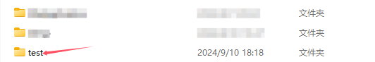
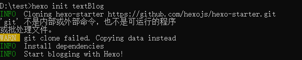
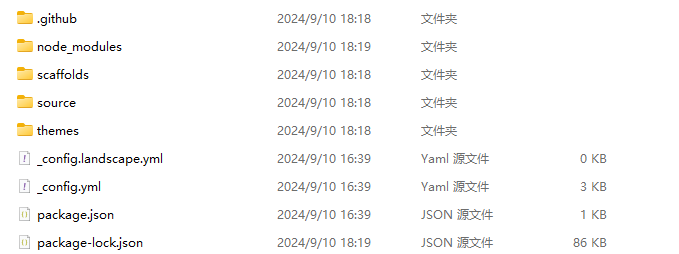
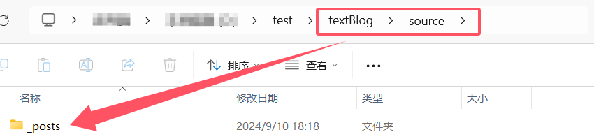
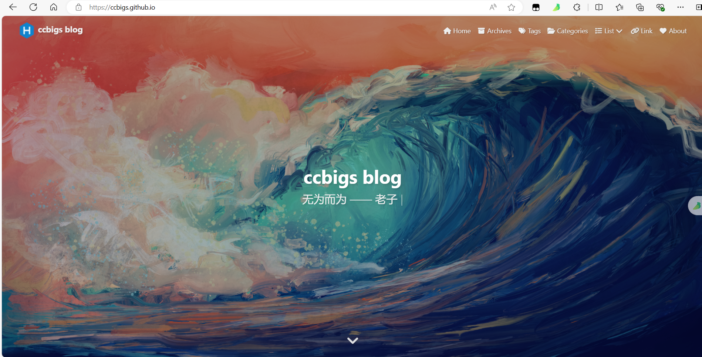
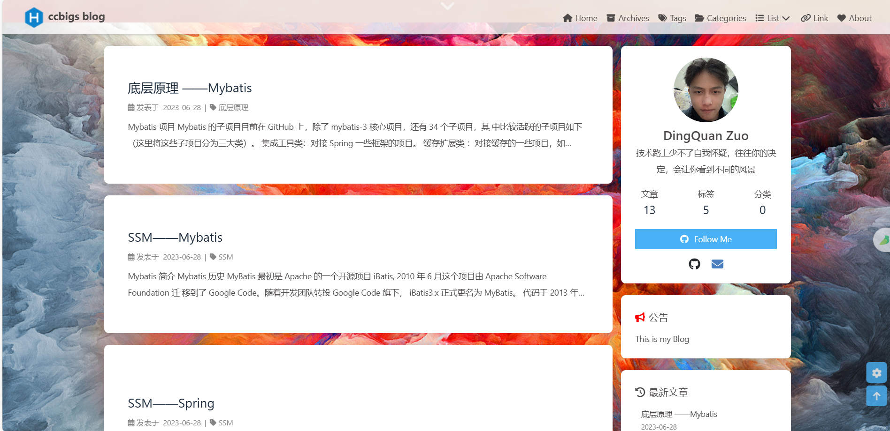

# 第一章 Hexo入门

Hexo 是一个快速、简洁且高效的博客框架。 

## 1.1 Hexo的下载与安装

### 1.1.1 Hexo下载 

在下载Hexo之前，我们需要确保电脑上已经安装好以下软件：

- [Node.js](http://nodejs.org/) (Node.js 版本需不低于 10.13，建议使用 Node.js 12.0 及以上版本)
- [Git](http://git-scm.com/)

保证以上两个软件可以正常运行后，我们需要保证npm的网络畅通无阻，最好配置国内镜像：

```
npm config set registry http://registry.npm.taobao.org
```

保证网络通畅后，我们可以输入以下命令，安装hexo：

```
npm install -g hexo-cli
```

以上命令安装的是hexo的脚手架，如果你要安装Hexo的瘦身版，自己定制Hexo，官方推荐的下载方式：

> 对于熟悉 npm 的进阶用户，可以仅局部安装 `hexo` 包。
>
> ```
> $ npm install hexo
> ```
>
> 安装以后，可以使用以下两种方式执行 Hexo：
>
> 1. `npx hexo <command>`
> 2. Linux 用户可以将 Hexo 所在的目录下的 `node_modules` 添加到环境变量之中即可直接使用 `hexo <command>`：
>
> ```
> echo 'PATH="$PATH:./node_modules/.bin"' >> ~/.profile
> ```

### 1.1.2 Hexo 安装

以上过程完成了hexo的下载，接下来我们进行Hexo的安装：

这里我们以创建testBlog为例，首先打开cmd，同时在磁盘目录创建一个文件夹（按自己兴趣可创建可不创建）：

我这里在D盘创建了test文件夹：



使用cmd执行如下命令：

```bash
hexo init testBlog
#官方命令格式：hexo init <folder>
```



这个命令是创建我们博客的文件夹，相当于建设一栋房子的骨架。创建好后我们进入testBlog：

Hexo的骨架如下：

```
├── _config.yml
├── package.json
├── scaffolds
├── source
|   ├── _drafts
|   └── _posts
└── themes
```



接下来我们进行下一步（已完成的可忽略）：

```
npm install
```


## 1.2 Hexo 框架文件分析

我们研究一个框架，肯定要知道该框架文件夹下的文件作用。

### 1.2.1 source

资源文件夹。 是存放用户资源的地方。 

这个文件夹非常重要，我们博客展现出来的文章最初就是存放在这里。Hexo默认创建的md文件存放在该文件夹下的 `_posts` 文件夹下，Hexo规定**开头命名为 `_` (下划线)的文件 / 文件夹和隐藏的文件将会被忽略。 Markdown 和 HTML 文件会被解析并放到 `public` 文件夹，而其他文件会被拷贝过去。**



### 1.2.2 scaffolds

Hexo的模板文件。

我们在创建md文件的时候，官方默认是非常空白的，如果我们有自己的编写方式可以后续在这里自定义自己的模板。后续我会教大家来自定义自己的模板。

### 1.2.3 themes

我们要建造自己的博客，肯定会带有自己的特色，Hexo提供支持自定义自己的主题，什么是主题？看下图：





是不是觉得这个主题非常棒！（我自己是这么认为的，🤭），通过主题文件夹，我们就可以布置自己喜欢的主题了。

### 1.2.4 _config.yml

这个Hexo的配置文件，很是重要。

### 1.2.5 package.json

这个文件不用过多介绍，很少用得到。


## 1.3 _config.yml 配置详解

我们打开 _config.yml 配置文件，这一看是不是大吃一惊，这么多！不过不要紧，我把配置参数做了注释，很容易就能了解了：

```yaml
# Hexo Configuration
## Docs: https://hexo.io/docs/configuration.html
## Source: https://github.com/hexojs/hexo/

# Site
title: Hexo				#网站标题
subtitle: ''			#网站副标题
description: ''			#网站描述
keywords:				#网站的关键词。 支持多个关键词。
author: John Doe		#您的名字
language: en			#语言
timezone: ''			#时区

# URL
## Set your site url here. For example, if you use GitHub Page, set url as 'https://username.github.io/project'
url: http://example.com						#网址, 必须以 http:// 或 https:// 开头
permalink: :year/:month/:day/:title/		#文章的 永久链接 格式
permalink_defaults:							#永久链接中各部分的默认值
pretty_urls:								#改写 permalink 的值来美化 URL
  trailing_index: true # Set to false to remove trailing 'index.html' from permalinks	#是否在永久链接中保留尾部的 index.html，设置为 false 时去除
  trailing_html: true # Set to false to remove trailing '.html' from permalinks			#是否在永久链接中保留尾部的 .html, 设置为 false 时去除 (对尾部的 index.html无效)	

# Directory
source_dir: source			#源文件夹。您的内容存储在哪里
public_dir: public			#公用文件夹。静态站点将在哪里生成
tag_dir: tags				#标签文件夹
archive_dir: archives		#归档文件夹
category_dir: categories	#分类文件夹
code_dir: downloads/code	#Include code 文件夹，source_dir 下的子目录
i18n_dir: :lang				#国际化（i18n）文件夹
skip_render:				#匹配到的文件将会被不做改动地复制到 public 目录中。 您可使用 glob 表达式来匹配路径。

# Writing
new_post_name: :title.md # File name of new posts		新文章的文件名称
default_layout: post									#预设布局
titlecase: false # Transform title into titlecase		#把标题转换为 title case
external_link:											#在新标签中打开链接
  enable: true # Open external links in new tab			#在新标签中打开链接
  field: site # Apply to the whole site					#对整个网站（site）生效或仅对文章（post）生效
  exclude: ''						#需要排除的域名。 主域名和子域名如 www 需分别配置
filename_case: 0					#将文件名转换为小写1；2上壳体
render_drafts: false				#显示草稿
post_asset_folder: false			#启用 资源文件夹
relative_link: false				#把链接改为与根目录的相对位址
future: true						#显示未来的文章
syntax_highlighter: highlight.js	#代码块的设置, 请参考 代码高亮 进行设置
highlight:							#	代码块的设置, 请参考 Highlight.js 进行设置
  line_number: true
  auto_detect: false
  tab_replace: ''
  wrap: true
  hljs: false
prismjs:							#代码块的设置, 请参考 PrismJS 进行设置
  preprocess: true
  line_number: true
  tab_replace: ''

# Home page setting
# path: Root path for your blogs index page. (default = '')
# per_page: Posts displayed per page. (0 = disable pagination)
# order_by: Posts order. (Order by date descending by default)
index_generator:	#使用hexo生成器索引生成帖子存档
  path: ''			#博客索引页的根路径
  per_page: 10		#每页显示的帖子。
  order_by: -date	#发布订单。默认情况下按日期降序排列（从新到旧）。

# Category & Tag
default_category: uncategorized		#默认分类	
category_map:						#分类别名
tag_map:							#标签别名	

# Metadata elements
## https://developer.mozilla.org/en-US/docs/Web/HTML/Element/meta
meta_generator: true   #Meta generator 标签。 值为 false 时 Hexo 不会在头部插入该标签

# Date / Time format
## Hexo uses Moment.js to parse and display date
## You can customize the date format as defined in
## http://momentjs.com/docs/#/displaying/format/
date_format: YYYY-MM-DD
time_format: HH:mm:ss
## updated_option supports 'mtime', 'date', 'empty'
updated_option: 'mtime'			#当 Front Matter 中没有指定 updated 时 updated 的取值

# Pagination
## Set per_page to 0 to disable pagination
per_page: 10
pagination_dir: page

# Include / Exclude file(s)使用以下选项可明确处理或忽略某些文件/文件夹。 可以使用 glob 表达式 进行路径匹配。include 和 exclude 选项只会应用到 source/ ，而 ignore 选项会应用到所有文件夹.
## include:/exclude: options only apply to the 'source/' folder
include:	#包含隐藏文件（包括名称以下划线开头的文件/文件夹，* 除外）
exclude:	#排除文件或文件夹
ignore:		#忽略文件/文件夹

# Extensions
## Plugins: https://hexo.io/plugins/
## Themes: https://hexo.io/themes/
theme: landscape  #当前主题名称。 值为false时禁用主题
theme_config： #主题的配置文件。 在这里放置的配置会覆盖主题目录下的 _config.yml 中的配置

# Deployment
## Docs: https://hexo.io/docs/one-command-deployment
deploy:
  type: ''  #部署部分的设置

```


## 1.4 Hexo的指令

### 1.4.1 init

```
$ hexo init [folder]
```

新建一个网站。 如果没有设置 `folder` ，Hexo 默认在目前的文件夹建立网站。

本命令相当于执行了以下几步：

1. Git clone [hexo-starter](https://github.com/hexojs/hexo-starter) 和 [hexo-theme-landscape](https://github.com/hexojs/hexo-theme-landscape) 主题到当前目录或指定目录。
2. 使用 [Yarn 1](https://classic.yarnpkg.com/lang/en/)、[pnpm](https://pnpm.io/zh/) 或 [npm](https://docs.npmjs.com/cli/install) 包管理器下载依赖（如有已安装多个，则列在前面的优先）。 npm 默认随 [Node.js](https://hexo.io/zh-cn/docs/index.html#安装-Node-js) 安装。

### 1.4.2 new

```
$ hexo new [layout] <title>
```

新建一篇文章。 如果没有设置 `layout` 的话，默认使用 [_config.yml](https://hexo.io/zh-cn/docs/configuration) 中的 `default_layout` 参数代替。 Use the layout `draft` to create a draft. 如果标题包含空格的话，请使用引号括起来。

| 选项              | 描述                            |
| :---------------- | :------------------------------ |
| `-p`, `--path`    | 文章的路径。 自定义文章的路径。 |
| `-r`, `--replace` | 如果存在的话，替换当前的文章。  |
| `-s`, `--slug`    | 文章别名。 自定义文章的 URL。   |

默认情况下，Hexo 会使用文章的标题来决定文章文件的路径。 对于独立页面来说，Hexo 会创建一个以标题为名字的目录，并在目录中放置一个 `index.md` 文件。 你可以使用 `--path` 参数来覆盖上述行为、自行决定文件的目录：

```
hexo new page --path about/me "About me"
```

以上命令会创建一个 `source/about/me.md` 文件，同时 Front Matter 中的 title 为 `"About me"`

注意！ title 是必须指定的！ For example, this will not result in the behaviour you might expect:

```
hexo new page --path about/me
```

此时 Hexo 会创建 `source/_posts/about/me.md`，同时 `me.md` 的 Front Matter 中的 title 为 `"page"`。 这是因为在上述命令中，hexo-cli 将 `page` 视为指定文章的标题、并采用默认的 `layout`。

### 1.4.3 generate

```
$ hexo generate
```

生成静态文件。

| 选项                  | 描述                                         |
| :-------------------- | :------------------------------------------- |
| `-d`, `--deploy`      | Deploy after generation finishes             |
| `-w`, `--watch`       | 监视文件变动                                 |
| `-b`, `--bail`        | 生成过程中如果发生任何未处理的异常则抛出异常 |
| `-f`, `--force`       | 强制重新生成                                 |
| `-c`, `--concurrency` | 要同时生成的文件的最大数量。 默认无限制      |

### 1.4.4 publish

```
$ hexo publish [layout] <filename>
```

发表草稿。

### 1.4.5 server

```
$ hexo server
```

启动服务器。 默认情况下，访问网址为： `http://localhost:4000/`。

| 选项             | 描述                                   |
| :--------------- | :------------------------------------- |
| `-p`, `--port`   | 重设端口                               |
| `-s`, `--static` | 只使用静态文件                         |
| `-l`, `--log`    | Enable logger. Override logger format. |

### 1.4.6 deploy

```
$ hexo deploy
```

部署你的网站。

| 选项               | 描述                       |
| :----------------- | :------------------------- |
| `-g`, `--generate` | Generate before deployment |

### 1.4.7 render

```
$ hexo render <file1> [file2] ...
```

渲染文件。

| 选项             | 描述               |
| :--------------- | :----------------- |
| `-o`, `--output` | Output destination |

### 1.4.8 migrate

```
$ hexo migrate <type>
```

从其他博客系统 [迁移内容](https://hexo.io/zh-cn/docs/migration)。

### 1.4.9 clean

```
$ hexo clean
```

清除缓存文件 (`db.json`) 和已生成的静态文件 (`public`)。

### 1.4.10 list

```
$ hexo list <type>
```

列出所有路由。

### 1.4.11 version

```
$ hexo version
```

显示版本信息。

### 1.4.12 config

```
$ hexo config [key] [value]
```

列出网站的配置（`_config.yml`）。 如果指定了 `key`，则只展示配置中对应 `key` 的值；如果同时指定了 `key` 和 `value`，则将配置中对应的 `key` 的值修改为 `value`。

### 1.4.13 选项

#### 1.4.13.1 安全模式

```
$ hexo --safe
```

在安全模式下，不会加载插件和脚本。 当您在安装新插件遭遇问题时，可以尝试以安全模式重新执行。

#### 1.4.13.2 调试模式

```
$ hexo --debug
```

在终端中显示调试信息并记录到 `debug.log`。 当您使用 Hexo 时遇到问题，可以尝试用调试模式重新执行一次。 如果您发现错误，请[在 GitHub 上提出 issue](https://github.com/hexojs/hexo/issues/new?assignees=&labels=&projects=&template=bug_report.yml)。

#### 1.4.13.3 简洁模式

```
$ hexo --silent
```

Silences output to the terminal.

#### 1.4.13.4 自定义配置文件的路径

```
$ hexo --config custom.yml
```

自定义配置文件的路径，指定这个参数后将不再使用默认的 `_config.yml`。 还接受一个以逗号分隔的 JSON 或 YAML 配置文件列表（无空格），该列表将把这些文件合并为一个 `_multiconfig.yml` 文件。

```
$ hexo --config custom.yml,custom2.json
```

#### 1.4.13.5 显示草稿

```
$ hexo --draft
```

显示 `source/_drafts` 文件夹中的草稿文章。

#### 1.4.13.6 自定义 CWD

```
$ hexo --cwd /path/to/cwd
```

自定义当前工作目录（Current working directory）的路径。


# 第二章 Hexo操作

## 2.1 Hexo写作

你可以执行下列命令来创建一篇新文章或者新的页面。

```
$ hexo new [layout] <title>
```

`post`是默认的`布局`，但你也可以提供自己的布局。 您可以通过编辑 `_config.yml` 中的 `default_layout` 设置来更改默认布局。

### 2.1.1 布局（Layout）

Hexo 有三种默认布局：`post`、`page` 和 `draft`。 每个人创建的文件都保存到不同的路径。新创建的帖子将保存到“source/posts”文件夹中。

| 布局    | 路径             |
| :------ | :--------------- |
| `post`  | `source/_posts`  |
| `page`  | `source`         |
| `draft` | `source/_drafts` |

> 禁用布局
>
> 如果你不希望一篇文章（post/page）使用主题处理，请在它的 front-matter 中设置 `layout: false`。 详情请参考[本节](https://hexo.io/zh-cn/docs/front-matter#布局)。

### 2.1.2 文件名称

默认情况下，Hexo使用帖子标题作为其文件名。您可以在`_config.yml`中编辑`new_post_name`设置以更改默认文件名。例如，“：year-：month-：day-：title.md”将在文件名前加上创建日期。你可以使用以下占位符：

| Placeholder | 描述                                |
| :---------- | :---------------------------------- |
| `:title`    | 标题（小写，空格将会被替换为短杠）  |
| `:year`     | 建立的年份，比如， `2015`           |
| `:month`    | 建立的月份（有前导零），比如， `04` |
| `:i_month`  | 建立的月份（无前导零），比如， `4`  |
| `:day`      | 建立的日期（有前导零），比如， `07` |
| `:i_day`    | 建立的日期（无前导零），比如， `7`  |

### 2.1.3 草稿

之前，我们提到了Hexo中的一种特殊布局：“draft”。使用此布局初始化的帖子将保存到“source/drafts”文件夹中。您可以使用“publish”命令将草稿移动到“source/posts”文件夹`publish的工作方式与new命令类似。

```
$ hexo publish [layout] <title>
```

默认情况下不显示草稿。您可以在运行Hexo时添加“--draft”选项，也可以在“_config.yml”中启用“render_drafts”设置来渲染草稿。

### 2.1.4 Scaffolds

在新建文章时，Hexo 会根据 `scaffolds` 文件夹内相对应的文件来建立文件。 例如：

```
$ hexo new photo "My Gallery"
```

在执行这行指令时，Hexo 会尝试在 `scaffolds` 文件夹中寻找 `photo.md`，并根据其内容建立文章。 以下是您可以在模版中使用的变量：

| Placeholder | 描述         |
| :---------- | :----------- |
| `layout`    | 布局         |
| `title`     | 标题         |
| `date`      | 文件建立日期 |

### 2.1.5 支持的格式

Hexo 支持以任何格式书写文章，只要安装了相应的渲染插件。

例如，Hexo 默认安装了 `hexo-renderer-marked` 和 `hexo-renderer-ejs`，因此你不仅可以用 Markdown 写作，你还可以用 EJS 写作。 如果你安装了 `hexo-renderer-pug`，你甚至可以用 Pug 模板语言书写文章。

只需要将文章的扩展名从 `md` 改成 `ejs`，Hexo 就会使用 `hexo-renderer-ejs` 渲染这个文件，其他格式同理。

## 2.2 Front-matter

Front-matter 是文件开头的 YAML 或 JSON 代码块，用于配置写作设置。 以 YAML 格式书写时，Front-matter 以三个破折号结束；以 JSON 格式书写时，Front-matter 以三个分号结束。

**YAML**

```
---
title: Hello World
date: 2013/7/13 20:46:25
---
```

**JSON**

```
"title": "Hello World",
"date": "2013/7/13 20:46:25"
;;;
```

### 2.2.1 设置 & 默认值

| 设置              | 描述                                                         | 默认值                                                       |
| :---------------- | :----------------------------------------------------------- | :----------------------------------------------------------- |
| `layout`          | 布局                                                         | [`config.default_layout`](https://hexo.io/docs/configuration#Writing) |
| `title`           | 标题                                                         | 文章的文件名                                                 |
| `date`            | 建立日期                                                     | 文件建立日期                                                 |
| `updated`         | 更新日期                                                     | 文件更新日期                                                 |
| `comments`        | 开启文章的评论功能                                           | `true`                                                       |
| `tags`            | 标签（不适用于分页）                                         |                                                              |
| `categories`      | 分类（不适用于分页）                                         |                                                              |
| `permalink`       | 覆盖文章的永久链接. 永久链接应该以 `/` 或 `.html` 结尾       | `null`                                                       |
| `excerpt`         | 纯文本的页面摘要。 使用 [该插件](https://hexo.io/zh-cn/docs/tag-plugins#文章摘要和截断) 来格式化文本 |                                                              |
| `disableNunjucks` | 启用时禁用 Nunjucks 标签 `{{ }}`/`` 和 [标签插件](https://hexo.io/zh-cn/docs/tag-plugins) 的渲染功能 | false                                                        |
| `lang`            | 设置语言以覆盖 [自动检测](https://hexo.io/zh-cn/docs/internationalization#路径) | 继承自 `_config.yml`                                         |
| `published`       | 文章是否发布                                                 | 对于 `_posts` 下的文章为 `true`，对于 `_draft` 下的文章为 `false` |

#### 2.2.1.1 布局

根据 `_config.yml` 中 [`default_layout`](https://hexo.io/zh-cn/docs/configuration#文章) 的设置，默认布局是 `post` 。 当文章中的布局被禁用(`layout: false`)，它将不会使用主题处理。 然而，它仍然会被任何可用的渲染引擎渲染：如果一篇文章是用 Markdown 写的，并且安装了 Markdown 渲染引擎（比如默认的 [hexo-renderer-marked](https://github.com/hexojs/hexo-renderer-marked))，它将被渲染成HTML。

除非通过 `disableNunjucks` 设置或 [渲染引擎](https://hexo.io/zh-cn/api/renderer#禁用-Nunjucks-标签) 禁用，否则无论布局如何，[标签插件](https://hexo.io/zh-cn/docs/tag-plugins) 总是被处理。

#### 2.2.1.2 分类和标签

只有文章支持分类和标签。 类别按顺序应用于职位，从而形成分类和子分类的层次结构。标签都是在同一层次上定义的，因此它们出现的顺序并不重要。

**示例**

```
categories:
  - Sports
  - Baseball
tags:
  - Injury
  - Fight
  - Shocking
```

如果要应用多个类别层次结构，请使用名称列表而不是单个名称。如果Hexo在帖子上看到任何以这种方式定义的类别，它将把该帖子的每个类别视为自己的独立层次结构。

**示例**

```
categories:
  - [Sports, Baseball]
  - [MLB, American League, Boston Red Sox]
  - [MLB, American League, New York Yankees]
  - Rivalries
```


## 2.3 资源文件夹

### 2.3.1 全局资源文件夹

资源（Asset）代表 `source` 文件夹中除了文章以外的所有文件，例如图片、CSS、JS 文件等。 比方说，如果你的Hexo项目中只有少量图片，那最简单的方法就是将它们放在 `source/images` 文件夹中。 然后通过类似于 `` 的方法访问它们。

### 2.3.2 文章资源文件夹

对于那些想要更有规律地提供图片和其他资源以及想要将他们的资源分布在各个文章上的人来说，Hexo也提供了更组织化的方式来管理资源。 这个稍微有些复杂但是管理资源非常方便的功能可以通过将 `config.yml` 文件中的 `post_asset_folder` 选项设为 `true` 来打开。

```
_config.ymlpost_asset_folder: true
```

当资源文件管理功能打开后，Hexo将会在你每一次通过 `hexo new [layout] <title>` 命令创建新文章时自动创建一个文件夹。 这个资源文件夹将会有与这个文章文件一样的名字。 将所有与你的文章有关的资源放在这个关联文件夹中之后，你可以通过相对路径来引用它们，这样你就得到了一个更简单而且方便得多的工作流。

### 2.3.3 相对路径引用的标签插件

通过常规的 markdown 语法和相对路径来引用图片和其它资源可能会导致它们在存档页或者主页上显示不正确。 在Hexo 2时代，社区创建了很多插件来解决这个问题。 但是，随着Hexo 3 的发布，许多新的[标签插件](https://hexo.io/zh-cn/docs/tag-plugins#引用资源)被加入到了核心代码中。 这使得你可以更简单地在文章中引用你的资源。

```



```

比如说：当你打开文章资源文件夹功能后，你把一个 `example.jpg` 图片放在了你的资源文件夹中，如果通过使用相对路径的常规 markdown 语法 `` ，它将 *不会* 出现在首页上。

正确的引用图片方式是使用下列的标签插件而不是 markdown ：

```


```

通过这种方式，图片将会同时出现在文章和主页以及归档页中。

### 2.3.4 使用 Markdown 嵌入图片（Typora编辑器首推）

[hexo-renderer-marked](https://github.com/hexojs/hexo-renderer-marked) 3.1.0 引入了一个新的选项，其允许你无需使用 `asset_img` 标签插件就可以在 markdown 中嵌入图片

hexo-renderer-marked 安装代码：

```
$ npm install hexo-renderer-marked --save
```

如需启用：

```
post_asset_folder: true
marked:
  prependRoot: true
  postAsset: true
```

启用后，资源图片将会被自动解析为其对应文章的路径。 例如： `image.jpg` 位置为 `/2020/01/02/foo/image.jpg` ，这表示它是 `/2020/01/02/foo/` 文章的一张资源图片， `` 将会被解析为 `` 。


## 2.5 数据文件

有时，您可能需要在模板中使用一些无法直接在帖子中使用的数据，或者您想在其他地方重复使用这些数据。 对于这种情况，Hexo 3 引入了新的**数据文件**。 此功能会加载 `source/_data` 内的 YAML 或 JSON 文件，如此一来您便能在网站中复用这些文件了。

举例来说，在 `source/_data` 文件夹中新建 `menu.yml` 文件：

```
Home: /
Gallery: /gallery/
Archives: /archives/
```

您就能在模板中使用这些数据：

```
<% for (var link in site.data.menu) { %>
  <a href="<%= site.data.menu[link] %>"> <%= link %> </a>
<% } %>
```

render like this :

```
<a href="/"> Home </a>
<a href="/gallery/"> Gallery </a>
<a href="/archives/"> Archives </a>
```


## 2.6 服务器

### 2.6.1 hexo-server

Hexo 3.0 把服务器独立成了个别模块。 您必须先安装 [hexo-server](https://github.com/hexojs/hexo-server) 才能使用。

```
$ npm install hexo-server --save
```

安装完成后，输入以下命令以启动服务器。 默认情况下，您的网站会在 `http://localhost:4000` 下启动。 在服务器启动期间，Hexo 会监视文件变动并自动更新，您无须重启服务器。

```
$ hexo server
```

如果您想要更改端口，或是在执行时遇到了 `EADDRINUSE` 错误，可以在执行时使用 `-p` 选项指定其他端口，如下：

```
$ hexo server -p 5000
```

#### 2.6.1.1 静态模式

在静态模式下，服务器只处理 `public` 文件夹中的文件，并且不会监视文件变化。 您必须在启动服务器之前运行 `hexo generate`。 通常用于生产环境。

```
$ hexo server -s
```

#### 2.6.1.2 自定义 IP

Hexo 服务器默认运行在 `0.0.0.0`。 您可以覆盖默认的 IP 设置。

```
$ hexo server -i 192.168.1.1
```


# 第三章 Hexo自定义

## 3.1 永久链接（Permalinks）

您可以在 `_config.yml` 配置中调整网站的永久链接或者在每篇文章的 Front-matter 中指定。

### 3.1.1 变量

除了下列变量外，您还可使用除了 `:path` 和 `:permalink` 之外 Front-matter 中的所有属性。

| 变量          | 描述                                                         |
| :------------ | :----------------------------------------------------------- |
| `:year`       | 文章的发表年份（4 位数）                                     |
| `:month`      | 文章的发表月份（2 位数）                                     |
| `:i_month`    | 文章的发表月份（不含前导零）                                 |
| `:day`        | 文章的发表日期 (2 位数)                                      |
| `:i_day`      | 文章的发表日期（不含前导零）                                 |
| `:hour`       | 文章发表时的小时 (2 位数)                                    |
| `:minute`     | 文章发表时的分钟 (2 位数)                                    |
| `:second`     | 文章发表时的秒钟 (2 位数)                                    |
| `:title`      | 文件名称 (相对于 “source/_posts/“ 文件夹)                    |
| `:name`       | 文件名称                                                     |
| `:post_title` | 文章标题                                                     |
| `:id`         | 文章 ID (*[清除缓存](https://hexo.io/zh-cn/docs/commands#clean)时不具有持久性*) |
| `:category`   | 分类。 如果文章没有分类，则是 `default_category` 配置信息。  |
| `:hash`       | 文件名（与 `:title` 相同）和日期的 SHA1 哈希值（12位16进制数） |

您可在 `permalink_defaults` 参数下调整永久链接中各变量的默认值：

```
permalink_defaults:
  lang: en
```

### 3.1.2 示例

```
source/_posts/hello-world.mdtitle: Hello World
date: 2013-07-14 17:01:34
categories:
  - foo
  - bar
```

| 设置                            | 结果                        |
| :------------------------------ | :-------------------------- |
| `:year/:month/:day/:title/`     | 2013/07/14/hello-world/     |
| `:year-:month-:day-:title.html` | 2013-07-14-hello-world.html |
| `:category/:title/`             | foo/bar/hello-world/        |
| `:title-:hash/`                 | hello-world-a2c8ac003b43/   |

```
source/_posts/lorem/hello-world.mdtitle: Hello World
date: 2013-07-14 17:01:34
categories:
  - foo
  - bar
```

| 设置                        | 结果                          |
| :-------------------------- | :---------------------------- |
| `:year/:month/:day/:title/` | 2013/07/14/lorem/hello-world/ |
| `:year/:month/:day/:name/`  | 2013/07/14/hello-world/       |

### 3.1.3 多语种支持

若要建立一个多语种的网站，您可修改 `new_post_name` 和 `permalink` 参数，如下：

```
new_post_name: :lang/:title.md
permalink: :lang/:title/
```

当您建立新文章时，文章会被储存到：

```
$ hexo new "Hello World" --lang tw
# => source/_posts/tw/Hello-World.md
```

而网址会是：

```
http://localhost:4000/tw/hello-world/
```

## 3.2 主题

创建 Hexo 主题非常简单，只需创建一个新文件夹即可。 并修改 `_config.yml` 内的 `theme` 设定，即可切换主题。 一个主题可能会有以下的结构：

```
.
├── _config.yml
├── languages
├── layout
├── scripts
└── source
```

### 3.2.1 _config.yml

主题的配置文件。 和 Hexo 配置文件不同，主题配置文件修改时会自动更新，无需重启 Hexo Server。

### 3.2.2 languages

语言文件夹。 请参见 [国际化 (i18n)](https://hexo.io/zh-cn/docs/internationalization)。

### 3.2.3 layout

布局文件夹。 用于存放主题的模板文件，决定了网站内容的呈现方式。 Hexo 内建 [Nunjucks](https://mozilla.github.io/nunjucks/) 模板引擎，您可以另外安装插件来获得 [EJS](https://github.com/hexojs/hexo-renderer-ejs) 或 [Pug](https://github.com/hexojs/hexo-renderer-pug) 支持。 Hexo 根据模板的文件扩展名选择模板引擎（就像帖子一样）。 例如：

```
layout.ejs   - 使用 EJS
layout.njk   - 使用 Nunjucks
```

您可参考 [模板](https://hexo.io/zh-cn/docs/templates) 以获得更多信息。

### 3.2.4 scripts

脚本文件夹。 在启动时，Hexo 会加载此文件夹内的 JavaScript 文件。 请参见 [plugins](https://hexo.io/zh-cn/docs/plugins). 以获得更多信息。

### 3.2.5 source

Source 文件夹。 将您的素材（如 CSS 和 JavaScript 文件）放在这里。 文件或文件夹开头名称为 `_`（下划线）或隐藏的文件会被忽略。

Hexo 将处理所有可渲染的文件，并将它们保存到 `public` 文件夹下。 不可渲染的文件将直接复制到 `public` 文件夹。

### 3.2.6 发布

当您完成主题后，可以考虑将它发布到 [主题列表](https://hexo.io/themes)，让更多人能够使用您的主题。 在发布前建议先进行 [主题单元测试](https://github.com/hexojs/hexo-theme-unit-test)，确保每一项功能都能正常使用。 发布主题的步骤和 [更新文档](https://hexo.io/zh-cn/docs/contributing.html#更新文档) 非常类似。

1. 复刻 [hexojs/site](https://github.com/hexojs/site)

2. 把库（repository）复制到电脑上，并安装所依赖的插件。

   ```bash
   $ git clone https://github.com/<username>/site.git
   $ cd site
   $ npm install
   ```

3. 在 `source/_data/themes/` 中创建一个新的 yaml 文件，使用您的主题名称作为文件名。

4. 编辑 `source/_data/themes/<your-theme-name>.yml` 并添加您的主题。 例如：

   ```
   description: A brand new default theme for Hexo.
   link: https://github.com/hexojs/hexo-theme-landscape
   preview: http://hexo.io/hexo-theme-landscape
   tags:
     - official
     - responsive
     - widget
     - two_column
     - one_column
   ```

5. 在 `source/themes/screenshots` 中添加截图（名称与主题相同）。 图片必须为 800x500 的 PNG 文件。

6. 推送（push）分支。

7. 建立一个新的合并申请（pull request）并描述改动。


# 第四章 Hexo版本升级

Hexo版本升级指南按以下顺序逐步执行完成后，Hexo 版本及系统插件均会升级到最新。

```bash
//以下指令均在Hexo目录下操作，先定位到Hexo目录
//查看当前版本，判断是否需要升级
> hexo version

//全局升级hexo-cli
> npm i hexo-cli -g

//再次查看版本，看hexo-cli是否升级成功
> hexo version

//安装npm-check，若已安装可以跳过
> npm install -g npm-check

//检查系统插件是否需要升级
> npm-check

//安装npm-upgrade，若已安装可以跳过
> npm install -g npm-upgrade

//更新package.json
> npm-upgrade

//更新全局插件
> npm update -g

//更新系统插件
> npm update --save

//再次查看版本，判断是否升级成功
> hexo version
```
