# 开始

## 1.1.编写一个简单的C++程序

每个C++程序都包含一个或多个函数（function），**其中一个必须命名为main**。操作系统通过调用main来运行C++程序。下面是一个非常简单的main函数，它什么也不干，只是返回给操作系统一个值：

```
int main()
{
	return 0;
}
```

一个函数的定义包含四部分：**返回类型（return type）、函数名（function name）、一个括号包围的形参列表（parameter list，允许为空）以及函数体（function body）。**

> 个人思考：
>
> ​	一个函数包括四个部分，也就是说，一个函数的成立必须要有这四个部分组成。
>
> 1. 返回类型：这个返回类型不是上面的return关键字，而是上列代码中的int，返回类型是位于函数开头的。
> 2. 函数名：也就是function的名称，这个肯定是要有的。
> 3. 形参列表：要传入的参数，也可以为空值。
> 4. 函数体：相关的逻辑代码和算法所处理的区域。

虽然main函数在某种程度上比较特殊，但其定义与其他函数是一样的。

在本例中，main的形参列表是空的（（）中什么也没有）。6.2.5节将会讨论main的其他形参类型。

<u>main函数的返回类型必须为int，即整数类型。</u>int类型是一种<u>内置类型</u>（built-in type），即语言自身定义的类型。

函数定义的最后一部分是函数体，它是一个以左花括号（curly brace）开始，以右花括号结束的语句块（block of statements）：

```
{
	return 0;
}
```

这个语句块中唯一的一条语句是return，它结束函数的执行。在本例中，return还会向调用者返回一个值。当return语句包括一个值时，此<u>返回值的类型必须与函数的返回类型相容</u>。在本例中，main的返回类型是int，而返回值0的确是一个int类型的值。

> 请注意，return语句末尾的分号。在C++中，大多数C++语句以分号表示结束。它们很容易被忽略，但如果忘记了写分号，就会导致莫名其妙的编译错误。

在大多数系统中，main的返回值被用来指示状态。<u>返回值0表明成功，非0的返回值的含义由系统定义</u>（**个人思考**：main函数的返回值很容易被忽略，这里确实要记一下），通常用来指出错误类型。

> **重要概念：类型**
>
> 类型是程序设计最基本的概念之一，在本书中我们会反复遇到它。一种类型不仅定义了数据元素的内容，还定义了这类数据上可以进行的运算。
>
> 程序所处理的数据都保存在变量中，而每个变量都有自己的类型。如果一个名为v的变量的类型为T，我们通常说“v具有类型T”，或等价的，“v是一个T类型变量”。

###  1.1.1.编译、运行程序

编写好程序后，我们就需要编译它。如何编译程序依赖于你使用的操作系统和编译器。你所使用的特定编译器的相关使用细节，请查阅参考手册或询问经验丰富的同事。

很多PC机上的编译器都具备集成开发环境（Integrated Developed Environment，IDE），将编译器与其他程序创建和分析工具包装在一起。在开发大型程序时，这类集成环境可能是非常有用的工具，但需要一些时间来学习如何高效地使用它们。学习如何使用这类开发环境已经超出了本书的范围。

大部分编译器，包括集成IDE的编译器，都会提供一个命令行界面。除非你已经了解IDE，否则你会觉得借助命令行界面开始学习 C++还是很容易的。这种学习方式的好处是，可以先将精力集中于 C++语言本身（而不是一些开发工具），而且，一旦你掌握了语言，IDE通常是很容易学习的。

#### 程序源文件命名约定

无论你使用命令行界面或者IDE，大多数编译器都要求程序源码存储在一个或多个文件中。**程序文件通常被称为源文件（source file）**。在大多数系统中，源文件的名字以一个后缀为结尾，后缀是由一个句点后接一个或多个字符组成的。后缀告诉系统这个文件是一个C++程序。不同编译器使用不同的后缀命名约定，**最常见的包括.cc、.cxx、.cpp、.cp 及.C。**

#### 从命令行运行编译器

如果我们正在使用命令行界面，那么通常是在一个控制台窗口内（例如UNIX系统中的外壳程序窗口或者Windows系统中的命令提示符窗口）编译程序。假定我们的main程序保存在文件prog1.cc中，可以用如下命令来编译它

```
$ CC prog1.cc 
```

其中，CC是编译器程序的名字，$是系统提示符。编译器生成一个可执行文件。Windows系统会将这个可执行文件命名为prog1.exe。 UNIX系统中的编译器通常将<u>可执行文件命名为a.out</u>。

为了在Windows系统中运行一个可执行文件，我们需要提供可执行文件的文件名，可以忽略其扩展名.exe：

```
$ prog1
```

在一些系统中，即使文件就在当前目录或文件夹中，你也必须显式指出文件的位置。在此情况下，我们可以键入

```
$.\prog1 
```

“.”后跟一个反斜线指出该文件在当前目录中。

为了在UNIX系统中运行一个可执行文件，我们需要使用全文件名，包括文件扩展名：

```
$ a.out 
```

如果需要指定文件位置，需要用一个“.”后跟一个斜线来指出可执行文件位于当前目录中。

```
$./a.out
```

访问main的返回值的方法依赖于系统。在UNIX和Windows系统中，执行完一个程序后，都可以通过echo命令获得其返回值。在UNIX系统中，通过如下命令获得状态：

```
$ echo $?
```

在Windows系统中查看状态可键入（**个人思考**：执行下面命令类似于获取上一个运行的c++程序的状态码，我们通过状态码可以获知该程序的运行结果是否达到预期）：

```
$ echo %ERRORLEVEL%
```

> **运行GNU或微软编译器**
>
> 在不同操作和编译器系统中，运行C++编译器的命令也各不相同。最常用的编译器是GNU编译器和微软Visual Studio编译器。默认情况下，运行GNU编译器的命令是 g++：
>
> ```
> $ g++-o progl progl.cc
> ```
>
> 此处，$是系统提示符。-o prog1是编译器参数，指定了可执行文件的文件名。在不同的操作系统中，此命令生成一个名为prog1或prog1.exe的可执行文件。在UNIX系统中，可执行文件没有后缀；在Windows系统中，后缀为.exe。如果省略了-o prog1参数，在UNIX系统中编译器会生成一个名为a.out的可执行文件，在Windows系统中则会生成一个名为a.exe的可执行文件（注意：根据使用的GNU编译器的版本，你可能需要指定-std=c++0x参数来打开对C++11的支持）。
>
> 运行微软Visual Studio 2010编译器的命令为cl：
>
> ```bash
> C:Users\me\Programs> cl /EHsc prog1.cpp
> ```
>
> 此处，C：\Users\me\Programs>是系统提示符，\Users\me\Programs是当前目录名（即当前文件夹）。命令cl调用编译器，/EHsc是编译器选项，用来打开标准异常处理。微软编译器会自动生成一个可执行文件，其名字与第一个源文件名对应。可执行文件的文件名与源文件名相同，后缀为.exe。在此例中，可执行文件的文件名为 prog1.exe。
>
> 编译器通常都包含一些选项，能对有问题的程序结构发出警告。打开这些选项通常是一个好习惯。我们习惯在GNU编译器中使用-Wall选项，在微软编译器中则使用/W4。
>
> 更详细的信息请查阅你使用的编译器的参考手册。

### 1.1节练习

练习1.1：查阅你使用的编译器的文档，确定它所使用的文件命名约定。编译并运行第2页的main程序。

练习1.2：改写程序，让它返回-1。返回值-1通常被当作程序错误的标识。重新编译并运行你的程序，观察你的系统如何处理main返回的错误标识。

```
$ echo $?
255
```


## 1.2.初识输入输出

<u>C++语言并未定义任何输入输出（IO）语句，取而代之，包含了一个全面的标准库（standard library）来提供IO机制（以及很多其他设施）。</u>对于很多用途，包括本书中的示例来说，我们只需了解IO库中一部分基本概念和操作。

本书中的很多示例都使用了**iostream**库。iostream库包含两个基础类型**istream和ostream**，分别表示输入流和输出流。一个流就是一个字符序列，是从IO设备读出或写入IO设备的。术语“流”（stream）想要表达的是，随着时间的推移，字符是顺序生成或消耗的。

### 标准输入输出对象

标准库定义了4个IO对象。为了处理输入，我们使用一个名为cin（发音为see-in）的istream类型的对象。这个对象也被称为标准输入（standard input）。对于输出，我们使用一个名为cout（发音为seeout）的ostream类型的对象。此对象也被称为标准输出（standard output）。标准库还定义了其他两个ostream对象，名为cerr和clog（发音分别为see-err和see-log）。我们通常用cerr来输出警告和错误消息，因此它也被称为标准错误（standard error）。而clog用来输出程序运行时的一般性信息。

> 个人思考：
>
> C++没有定义输入输出的标准，反而是标准库的IO提供了输入输出的标准：cin、cout、cerr、clog

系统通常将程序所运行的窗口与这些对象关联起来。因此，当我们读取cin，数据将从程序正在运行的窗口读入，当我们向cout、cerr和 clog写入数据时，将会写到同一个窗口。

### 一个使用IO库的程序

在书店程序中，我们需要将多条记录合并成单一的汇总记录。作为一个相关的，但更简单的问题，我们先来看一下如何将两个数相加。通过使用IO库，我们可以扩展main程序，使之能提示用户输入两个数，然后输出它们的和：

```cpp
#include <iostream>
int main()
{
	std::cout << "Enter two numbers:"<< std::endl;
	int v1 = 0,v2 = 0;
	std::cin >> v1 >> v2;
	std::cout << "The sum of"<< v1 << " and "<< v2 << " is "<< v1 + v2 << std::endl;
	return 0;
}
```

这个程序开始时在用户屏幕打印

```
 Enter two numbers: 
```

然后等待用户输入。如果用户键入

```
3 7 
```

然后键入一个回车，则程序产生如下输出：

```
 The sum of 3 and 7 is 10 
```

程序的第一行

```cpp
#include <iostream>
```

告诉编译器我们想要使用iostream库。尖括号中的名字（本例中是 iostream）指出了一个**头文件（header）**。每个使用标准库设施的程序都必须包含相关的头文件。#include指令和头文件的名字必须写在同一行中。通常情况下，#include指令必须出现在所有函数之外。<u>我们一般将一个程序的所有#include指令都放在源文件的开始位置。</u>

### 向流写入数据

main的函数体的第一条语句执行了一个**表达式**（expression）。在 C++中，一个表达式产生一个计算结果，它由一个或多个运算对象和（通常是）一个运算符组成。这条语句中的表达式使用了**输出运算符（<<）**在标准输出上打印消息：

```
std::cout << "Enter two numbers:"<< std::endl;
```

<<运算符接受两个运算对象：左侧的运算对象必须是一个ostream 对象（std::cout），右侧的运算对象是要打印的值("Enter two numbers:")。此运算符将给定的值写到给定的 ostream对象中。输出运算符的计算结果就是其左侧运算对象。即，计算结果就是我们写入给定值的那个ostream对象。

我们的输出语句使用了两次<<运算符。因为此运算符返回其左侧的运算对象，因此第一个运算符的结果成为了第二个运算符的左侧运算对象。这样，我们就可以将输出请求连接起来。因此，我们的表达式等价于

```
(std::cout << "Enter two numbers:")<< std::endl;
```

链中每个运算符的左侧运算对象都是相同的，在本例中是std::cout。我们也可以用两条语句生成相同的输出：

```
std::cout << "Enter two numbers:"
std::cout << std::endl;
```

第一个输出运算符给用户打印一条消息。这个消息是一个**字符串字面值常量（string literal）**，是用一对双引号包围的字符序列。在双引号之间的文本被打印到标准输出。

<u>第二个运算符打印endl，这是一个被称为操纵符（manipulator）的特殊值。写入endl的效果是结束当前行，并将与设备关联的缓冲区（buffer）中的内容刷到设备中。缓冲刷新操作可以保证到目前为止程序所产生的所有输出都真正写入输出流中，而不是仅停留在内存中等待写入流。</u>（endl的作用）

> 程序员常常在调试时添加打印语句。这类语句应该保证“一直”刷新流。否则，如果程序崩溃，输出可能还留在缓冲区中，从而导致关于程序崩溃位置的错误推断。

### 使用标准库中的名字

细心的读者可能会注意到这个程序使用了std::cout和std::endl，而不是直接的cout和endl。前缀std::指出名字cout和endl是定义在名为std的命名空间（namespace）中的。命名空间可以帮助我们避免不经意的名字定义冲突，以及使用库中相同名字导致的冲突。标准库定义的所有名字都在命名空间std中。

通过命名空间使用标准库有一个副作用：当使用标准库中的一个名字时，必须显式说明我们想使用来自命名空间std中的名字。例如，需要写出std::cout，通过使用**作用域运算符（::）**来指出我们想使用定义在命名空间std中的名字cout。3.1节（第74页）将给出一个更简单的访问标准库中名字的方法。

### 从流读取数据

在提示用户输入数据之后，接下来我们希望读入用户的输入。首先定义两个名为v1和v2的变量（variable）来保存输入：

```
	int v1 = 0,v2 = 0;
```

我们将这两个变量定义为int类型，int是一种内置类型，用来表示整数。还将它们初始化（initialize）为0。初始化一个变量，就是在变量创建的同时为它赋予一个值。

下一条语句是

```
	std::cin >> v1 >> v2;
```

它读入输入数据。输入运算符（>>）与输出运算符类似，它接受一个istream作为其左侧运算对象，接受一个对象作为其右侧运算对象。它从给定的istream读入数据，并存入给定对象中。与输出运算符类似，输入运算符返回其左侧运算对象作为其计算结果。因此，此表达式等价于

```
	(std::cin >> v1)>> v2;
```

由于此运算符返回其左侧运算对象，因此我们可以将一系列输入请求合并到单一语句中。本例中的输入操作从std::cin读入两个值，并将第一个值存入v1，将第二个值存入v2。换句话说，它与下面两条语句的执行结果是一样的

```
	std::cin >> v1
 std::cin >> v2;
```

### 完成程序

剩下的就是打印计算结果了：

```
std::cout << "The sum of"<< v1 << " and "<< v2 << " is "<< v1 + v2 << std::endl;
```

这条语句虽然比提示用户输入的打印语句更长，但原理上是一样的，它将每个运算对象打印在标准输出上。本例一个有意思的地方在于，运算对象并不都是相同类型的值。某些运算对象是字符串字面值常量，例如"The sum of "。其他运算对象则是int值，如v1、v2以及算术表达式v1+v2的计算结果。标准库定义了不同版本的输入输出运算符，来处理这些不同类型的运算对象。

### 1.2节练习

练习1.3：编写程序，在标准输出上打印Hello，World。

```
#include <iostream>
int main(){
	std::cout << "hello,world"<< std::endl;
	return 0;
}
```

练习1.4：我们的程序使用加法运算符+来将两个数相加。编写程序使用乘法运算符＊，来打印两个数的积。

```cpp
#include <iostream>
int main(){
	int val1 = 0 , val2 = 0;
	std::cin >> val1 >> val2 ;
	std::cout << "val1 * val2 = "<< val1*val2 << std::endl;
	return 0;
}
```

练习1.5：我们将所有输出操作放在一条很长的语句中。重写程序，将每个运算对象的打印操作放在一条独立的语句中。

```cpp
	#include <iostream>
int main()
{
	std::cout << "Enter two numbers:"<< std::endl;
	int v1 = 0,v2 = 0;
	std::cin >> v1 >> v2;
	std::cout << "The sum of"<< std::endl;
     std::cout << v1 << std::endl;
     std::cout << " and "<< std::endl;
     std::cout << v2 << std::endl;
     std::cout << " is "<< std::endl;
     std::cout << v1 + v2 << std::endl;
	return 0;
}
```

练习1.6：解释下面程序片段是否合法。如果程序是合法的，它输出什么？如果程序不合法，原因何在？应该如何修正？

```cpp
std::cout << "The sum of "<< v1;
		<< " and "<< v2;
		<< " is "<< v1+v2 << std::endl;
```

程序不合法，前两行的末尾有分号，表示语句结束，第2、3两行为两条新的语句。而这两条语句在“<<”之前缺少了输出流，应在“<<”之前加上“std::cout”，或者去掉前两行末尾的分号。代码修正如下：

```
std::cout << "The sum of "<< v1
		<< " and "<< v2
		<< " is "<< v1+v2 << std::endl;
```


## 1.3.注释简介

在程序变得更复杂之前，我们应该了解一下C++是如何处理注释（comments）的。注释可以帮助人类读者理解程序。注释通常用于概述算法，确定变量的用途，或者解释晦涩难懂的代码段。编译器会忽略注释，因此注释对程序的行为或性能不会有任何影响。

虽然编译器会忽略注释，但读者并不会。即使系统文档的其他部分已经过时，程序员也倾向于相信注释的内容是正确可信的。因此，错误的注释比完全没有注释更糟糕，因为它会误导读者。因此，当你修改代码时，不要忘记同时更新注释！

### C++中注释的种类

C++中有两种注释：**单行注释和界定符对注释。**单行注释以双斜线（//）开始，以换行符结束。当前行双斜线右侧的所有内容都会被编译器忽略，这种注释可以包含任何文本，包括额外的双斜线。

另一种注释使用继承自C语言的两个界定符（/＊和＊/）。这种注释以/＊开始，以＊/结束，可以包含除＊/外的任意内容，包括换行符。编译器将落在/＊和＊/之间的所有内容都当作注释。

注释界定符可以放置于任何允许放置制表符、空格符或换行符的地方。注释界定符可以跨越程序中的多行，但这并不是必须的。当注释界定符跨越多行时，最好能显式指出其内部的程序行都属于多行注释的一部分。我们所采用的风格是，注释内的每行都以一个星号开头，从而指出整个范围都是多行注释的一部分。

程序中通常同时包含两种形式的注释。注释界定符对通常用于多行解释，而双斜线注释常用于半行和单行附注。

```c++
#incloude<iostream>
/*
*简单主函数：
*读取两个数，求他们的和
*/
int main()
{
//提示用户输入两个数
	std::cout << "Enter two numbers:"<< std::endl;
	int v1 = 0,v2 = 0;//保存我们读入的输入数据的变量
	std::cin >> v1 >> v2;//读取输入数据
	std::cout << "The sum of"<< v1 << " and "<< v2 << " is "<< v1 + v2 << std::endl;
	return 0;
}
```

> 在本书中，我们用楷体来突出显示注释。在实际程序中，注释文本的显示形式是否区别于程序代码文本的显示，依赖于你所使用的程序设计环境是否提供这一特性。

### 注释界定符不能嵌套

**界定符对形式的注释是以/＊开始，以＊/结束的。因此，一个注释不能嵌套在另一个注释之内。**编译器对这类问题所给出的错误信息可能是难以理解、令人迷惑的。例如，在你的系统中编译下面的程序，就会产生错误：

```cpp
/*
*注释对/**/不能嵌套
*“不能嵌套”几个字会被认为是源码
*像剩余程序一样处理
*/
int main()
{
	return 0;
}
```

我们通常需要在调试期间注释掉一些代码。由于这些代码可能包含界定符对形式的注释，因此可能导致注释嵌套错误，因此最好的方式是用单行注释方式注释掉代码段的每一行。

```
///*
//*单行注释中的任何内容都会被忽略
//*包括嵌套的注释对也一样会被忽略
//*/
```

### 1.3节练习

练习1.7：编译一个包含不正确的嵌套注释的程序，观察编译器返回的错误信息。

```
#include <iostream>
int main()
{
	std::cout << "Enter two numbers:"<< std::endl;
	int v1 = 0,v2 = 0;
	std::cin >> v1 >> v2; /**//*/
 std::cout << v1 + v2 << std::endl;
	return 0;
}
```

报错信息如下：

```
expected primary-expression before '/' token
expected an expression
expected primary-expression before '/' token
```

练习1.8：指出下列哪些输出语句是合法的（如果有的话）：

```
std::cout << "/*";
std::cout << "*/";
std::cout << /*"*/"*/;
std::cout << /*"*/"/*"/*"*/;
```

预测编译这些语句会产生什么样的结果，实际编译这些语句来验证你的答案（编写一个小程序，每次将上述一条语句作为其主体），改正每个编译错误。

答案：第三个会产生问题。


## 1.4.控制流

语句一般是顺序执行的：语句块的第一条语句首先执行，然后是第二条语句，依此类推。当然，少数程序，包括我们解决书店问题的程序，都可以写成只有顺序执行的形式。但程序设计语言提供了多种不同的控制流语句，允许我们写出更为复杂的执行路径。

### 1.4.1.while语句

while语句反复执行一段代码，直至给定条件为假为止。我们可以用while语句编写一段程序，求1到10这10个数之和：

```cpp
#include<iostream>
int main()
{
	int sum = 0, val = 1;
	//只要val的值小于等于10，while循环就会持续执行
	while (val <= 10){
		sum += val; //将sum+val赋予sum
		++val；//将val加1
	}
	std::cout << "Sum of 1 to 10 inclusive is "<< sum << std::endl;
	return 0;
}
```

我们编译并执行这个程序，它会打印出

```
Sum of 1 to 10 inclusive is 55 
```

与之前的例子一样，我们首先包含头文件iostream，然后定义 main。在main中我们定义两个int变量：sum用来保存和；val用来表示从1到10的每个数。我们将sum的初值设置为0，val从1开始。

这个程序的新内容是while语句。while语句的形式为

```cpp
while (condition)
	statement 
```

while语句的执行过程是交替地检测condition条件和执行关联的语句 statement，**直至condition为假时停止**。所谓条件（condition）就是一个产生真或假的结果的**表达式**。只要condition为真，statement就会被执行。当执行完statement，会再次检测condition。如果condition仍为真，statement再次被执行。while语句持续地交替检测condition和执行statement，直至condition为假为止。

在本程序中，while语句是这样的

```cpp
//只要val的值小于等于10，while循环就会持续执行
while (val <= 10){
 sum += val; //将sum+val赋予sum
 ++val；//将val加1
}
```

条件中使用了小于等于运算符（<=）来比较val的当前值和10。只要val小于等于10，条件即为真。如果条件为真，就执行while循环体。在本例中，循环体是由两条语句组成的语句块：

```cpp
{
 sum += val; //将sum+val赋予sum
 ++val；//将val加1
}
```

所谓语句块（block），就是用花括号包围的零条或多条语句的序列。语句块也是语句的一种，在任何要求使用语句的地方都可以使用语句块。在本例中，语句块的第一条语句使用了**复合赋值运算符**（+=）。此运算符将其右侧的运算对象加到左侧运算对象上，将结果保存到左侧运算对象中。它本质上与一个加法结合一个赋值（assignment）是相同的：

```
sum = sum + val;
```

因此，语句块中第一条语句将val的值加到当前和sum上，并将结果保存在sum中。

下一条语句

```
++val；//将val加1
```

使用前缀递增运算符（++）。递增运算符将运算对象的值增加1。++val等价于val=val+1。

执行完while循环体后，循环会再次对条件进行求值。如果val的值（现在已经增加了）仍然小于等于10，则while的循环体会再次执行。循环连续检测条件、执行循环体，直至val不再小于等于10为止。

一旦val大于10，程序跳出while循环，继续执行while之后的语句。在本例中，继续执行打印输出语句，然后执行return语句完成main程序。

### 1.4.1节练习

练习1.9：编写程序，使用while循环将50到100的整数相加。

```cpp
#include<iostream>
int main(){
	int val = 50 , sum = 0;
	while(val <= 100){
		sum += val;
		val++;
	}
	
	std::cout << "sum value: "<< sum << std::endl;
	return 0;
}
```

练习1.10：除了++运算符将运算对象的值增加1之外，还有一个递减运算符（--）实现将值减少1。编写程序，使用递减运算符在循环中按递减顺序打印出10到0之间的整数。

```cpp
#include<iostream>
int main(){
	int val = 10;
	while(val >= 0){
		std::cout << "val value:"<< val--<< std::endl; 
	}
	
	return 0;
}
```

练习1.11：编写程序，提示用户输入两个整数，打印出这两个整数所指定的范围内的所有整数。

```
#include<iostream>
int main(){
	int val1 = 0, val2 = 0 ;
	std::cin >> val1 >> val2 ;
	
	if(val1 == val2){
		return 0;
	}
	while(val1 > val2){
		std::cout << ++val2 << std::endl;
	}
	while(val1 < val2){
		std::cout << ++val1 << std::endl;
	}
	
	return 0;
}
```


### 1.4.2 for语句

在我们的while循环例子中，使用了变量val来控制循环执行次数。我们在循环条件中检测val的值，在while循环体中将val递增。

这种在循环条件中检测变量、**在循环体中递增变量的模式使用非常频繁，以至于C++语言专门定义了第二种循环语句——for语句**，来简化符合这种模式的语句。可以用for语句来重写从1加到10的程序：

```cpp
#include <iostream>
int main(){
	int sum = 0;
	//从1加到10
	for (int val = 1;val <= 10 ; ++val)
		sum += val; //等价于sum = sum +val
	std::cout << "Sum of 1 to 10 inclusive is "<< sum << std::endl;
	return 0;
}
```

与之前一样，我们定义了变量sum，并将其初始化为0。在此版本中，val的定义是for语句的一部分：

```
for (int val = 1;val <= 10 ; ++val)
		sum += val; //等价于sum = sum +val
```

每个for语句都包含两部分：循环头和循环体。**循环头控制循环体的执行次数，它由三部分组成：一个初始化语句（init-statement）、一个循环条件（condition）以及一个表达式（expression）**。在本例中，初始化语句为

```
int val = 1;
```

它定义了一个名为val的int型对象，并为其赋初值1。变量val仅在for循环内部存在，在循环结束之后是不能使用的。初始化语句只在for循环入口处执行一次。循环条件

```
val <= 10
```

比较val的值和10。循环体每次执行前都会先检查循环条件。只要val小于等于10，就会执行for循环体。表达式在for循环体之后执行。在本例中，表达式

```
++val
```

使用前缀递增运算符将val的值增加1。执行完表达式后，for语句重新检测循环条件。如果val的新值仍然小于等于10，就再次执行for循环体。执行完循环体后，再次将val的值增加1。循环持续这一过程直至循环条件为假。

在此循环中，for循环体执行加法

```
sum += val; //等价于 sum = sum + val 
```

简要重述一下for循环的总体执行流程：

1.创建变量val，将其初始化为1。

2.<u>检测val是否小于等于10。若检测成功，执行for循环体。</u>若失败，退出循环，继续执行for循环体之后的第一条语句。

3.将val的值增加1。

4.重复第2步中的条件检测，只要条件为真就继续执行剩余步骤。

#### 1.4.2节练习

练习1.12：下面的for循环完成了什么功能？sum的终值是多少？

```
int sum = 0;
for(int i = -100;i<=100;++i)
	sum+=i;
```

练习1.13：使用for循环重做1.4.1节中的所有练习（第11页）。

```
#include<iostream>
int main()
{
	int sum = 0, val = 1;
	//只要val的值小于等于10，while循环就会持续执行
	for (int val = 1; val<=10;val++){
		sum+=val;
	}
	std::cout << "Sum of 1 to 10 inclusive is "<< sum << std::endl;
	return 0;
}
```

练习1.14：对比for循环和while循环，两种形式的优缺点各是什么？

for循环在已知的连续情况下会占据优势。

练习1.15：编写程序，包含第14页“再探编译”中讨论的常见错误。熟悉编译器生成的错误信息。

### 1.4.3.读取数量不定的输入数据

在前一节中，我们编写程序实现了1到10这10个整数求和。扩展此程序一个很自然的方向是实现对用户输入的一组数求和。在这种情况下，我们预先不知道要对多少个数求和，这就需要不断读取数据直至没有新的输入为止：

```
#include <iostream>
int main(){
	int sum = 0,value = 0;
	//读取数据直到遇到文件尾，计算所有读入的值的和
	while (std::cin >> value){
		sum += value; //等价于sum = sum + value
	}
	std::cout << "Sum is : "<< sum << std::endl;
	return 0;
}
```

如果我们输入

```
3 4 5 6 
```

则程序会输出

```
 Sum is: 18 main
```

的首行定义了两个名为sum和value的int变量，均初始化为0。我们使用value保存用户输入的每个数，数据读取操作是在while的循环条件中完成的：

```
while (std::cin >> value)
```

while循环条件的求值就是执行表达式

```
std::cin >> value
```

此表达式从标准输入读取下一个数，保存在value中。输入运算符（参见1.2节，第7页）返回其左侧运算对象，在本例中是std::cin。因此，<u>此循环条件实际上检测的是std::cin</u>。

当我们使用一个istream对象作为条件时，其效果是检测流的状态。如果流是有效的，即流未遇到错误，那么检测成功。当遇到文件结束符（end-of-file），或遇到一个无效输入时（例如读入的值不是一个整数），istream对象的状态会变为无效。处于无效状态的istream对象会使条件变为假。

因此，我们的while循环会一直执行直至遇到文件结束符（或输入错误）。while循环体使用复合赋值运算符将当前值加到sum上。一旦条件失败，while循环将会结束。我们将执行下一条语句，打印sum的值和一个endl。

> **从键盘输入文件结束符**
>
> 当从键盘向程序输入数据时，对于如何指出文件结束，不同操作系统有不同的约定。在Windows系统中，输入文件结束符的方法是敲Ctrl+Z（按住Ctrl键的同时按Z 键），然后按Enter或Return键。在UNIX系统中，包括Mac OS X系统中，文件结束符输入是用Ctrl+D。
>
> **再探编译**
>
> 编译器的一部分工作是寻找程序文本中的错误。编译器没有能力检查一个程序是否按照其作者的意图工作，但可以检查形式（form）上的错误。下面列出了一些最常见的编译器可以检查出的错误。
>
> 语法错误（syntax error）：程序员犯了C++语言文法上的错误。下面程序展示了一些常见的语法错误；每条注释描述了下一行中语句存在的错误：
>
> ```
> //错误:main 的参数列表漏掉了
>     int main({
>    //错误:endl后使用了冒号而非分号
>     std::cout << "Read each file."<< std::endl;
>    //错误:字符串字面常量的两侧漏掉了引号
>     std::cout << Update master.<< std::endl;
>    //错误:漏掉了第二个输出运算符
>     std::cout <<"Write new master." std::endl;
>    //错误:return语句漏掉了分号
>     return 0
> }
> ```
>
> 类型错误（type error）：C++中每个数据项都有其类型。例如，10的类型是 int（或者更通俗地说，“10是一个int型数据”）。单词"hello"，包括两侧的双引号标记，则是一个字符串字面值常量。一个类型错误的例子是，向一个期望参数为int的函数传递了一个字符串字面值常量。
>
> 声明错误（declaration error）：C++程序中的每个名字都要先声明后使用。名字声明失败通常会导致一条错误信息。两种常见的声明错误是：对来自标准库的名字忘记使用std::、标识符名字拼写错误：
>
> ```
> #include <iostream>
> int main()
> {
>     int v1 = 0 ，v2 = 0;
>     std::cin >> v >> v2;//错误:使用了"v"而非"v1"
>    //错误:cout未定义;应该是std::cout
>     cout << vl +v2 << std::endl;
>     return 0;
> }
> ```
>
> 错误信息通常包含一个行号和一条简短描述，描述了编译器认为的我们所犯的错误。按照报告的顺序来逐个修正错误，是一种好习惯。因为一个单个错误常常会具有传递效应，导致编译器在其后报告比实际数量多得多的错误信息。另一个好习惯是在每修正一个错误后就立即重新编译代码，或者最多是修正了一小部分明显的错误后就重新编译。这就是所谓的“编辑-编译-调试”（edit-compile-debug）周期。

#### 1.4.3节练习

练习1.16：编写程序，从cin读取一组数，输出其和。

### 1.4.4 if语句

与大多数语言一样，C++也提供了if语句来支持条件执行。我们可以用if语句写一个程序，来统计在输入中每个值连续出现了多少次：

```cpp
#include <iostream>
int main()
{
	int currVal = 0 , val = 0; //currVal是我们正在统计的数；我们将读入的新值存入val
	if (std::cin >> currVal){//读取第一个数，并确保确实有数据可以处理
		int cnt =1; //保存我们正在处理的当前值的个数
		while(std::cin >> val){//读取剩余的属
			if(val == currVal)//如果值相同
				++cnt;		//cnt加一
			else {//否则，打印前一个值
				std::cout << currVal << "occurs "<< cnt << " times "<< std::endl;
				currVal = val; //记住新值
				cnt = 1; //重置计数器
			}
		}//while循环在此结束
		
		std::cout << currVal << "occurs "<< cnt << " times "<< std::endl; //打印文件中最后一个值的个数
	}
	return 0;
}
```

如果我们输入如下内容：

```
42 42 42 42 42 55 55 62 100 100 100 
```

则输出应该是：

```
42 occurs 5 times 
55 occurs 2 times 
62 occurs 1 times 
100 occurs 3 times 
```

有了之前多个程序的基础，你对这个程序中的大部分代码应该比较熟悉了。程序以两个变量val和currVal的定义开始：currVal记录我们正在统计出现次数的那个数；val则保存从输入读取的每个数。与之前的程序相比，新的内容就是两个if语句。第一条if语句

```
if (std:;cin >> currVal){
	//...
}//最外层的if语句在这里结束
```

保证输入不为空。与while语句类似，if也对一个条件进行求值。第一条if语句的条件是读取一个数值存入currVal中。如果读取成功，则条件为真，我们继续执行条件之后的语句块。该语句块以左花括号开始，以return语句之前的右花括号结束。

如果需要统计出现次数的值，我们就定义cnt，用来统计每个数值连续出现的次数。与上一小节的程序类似，我们用一个while循环反复从标准输入读取整数。

while的循环体是一个语句块，它包含了第二条if语句：

```
if(val == currVal)//如果值相同
	++cnt;		//cnt加一
else {//否则，打印前一个值
 std::cout << currVal << "occurs "<< cnt << " times "<< std::endl;
 currVal = val; //记住新值
 cnt = 1; //重置计数器
}
```

这条if语句中的条件使用了相等运算符（==）来检测val是否等于 currVal。如果是，我们执行紧跟在条件之后的语句。这条语句将cnt增加1，表明我们再次看到了currVal。

如果条件为假，即val不等于currVal，则执行else之后的语句。这条语句是一个由一条输出语句和两条赋值语句组成的语句块。输出语句打印我们刚刚统计完的值的出现次数。赋值语句将cnt重置为1，将currVal 重置为刚刚读入的值val。

> C++用=进行赋值，用\==作为相等运算符。两个运算符都可以出现在条件中。一个常见的错误是想在条件中使用==（相等判断），却误用了=。
>
> 

#### 1.4.4节练习

练习1.17：如果输入的所有值都是相等的，本节的程序会输出什么？如果没有重复值，输出又会是怎样的？

练习1.18：编译并运行本节的程序，给它输入全都相等的值。再次运行程序，输入没有重复的值。

练习1.19：修改你为1.4.1节练习1.10（第11页）所编写的程序（打印一个范围内的数），使其能处理用户输入的第一个数比第二个数小的情况。

> 关键概念：C++程序的缩进和格式 C++程序很大程度上是格式自由的，也就是说，我们在哪里放置花括号、缩进、注释以及换行符通常不会影响程序的语义。例如，花括号表示main函数体的开始，它可以放在main的同一行中；也可以像我们所做的那样，放在下一行的起始位置；还可以放在我们喜欢的其他任何位置。唯一的要求是左花括号必须是main的形参列表后第一个非空、非注释的字符。
>
> 虽然很大程度上可以按照自己的意愿自由地设定程序的格式，但我们所做的选择会影响程序的可读性。例如，我们可以将整个main函数写在很长的单行内，虽然这样是合乎语法的，但会非常难读。
>
> 关于C/C++的正确格式的辩论是无休止的。我们的信条是，不存在唯一正确的风格，但保持一致性是非常重要的。例如，大多数程序员都对程序的组成部分设置恰当的缩进，就像我们在之前的例子中对main函数中的语句和循环体所做的那样。对于作为函数界定符的花括号，我们习惯将其放在单独一行中。我们还习惯对复合IO表达式设置缩进，以使输入输出运算符排列整齐。其他一些缩进约定也都会令越来越复杂的程序更加清晰易读。
>
> 我们要牢记一件重要的事情：其他可能的程序格式总是存在的。当你要选择一种格式风格时，思考一下它会对程序的可读性和易理解性有什么影响，而一旦选择了一种风格，就要坚持使用。

## 1.5 类简介

在解决书店程序之前，我们还需要了解的唯一一个C++特性，就是如何定义一个数据结构（data structure）来表示销售数据。在C++中，我们通过定义一个类（class）来定义自己的数据结构。一个类定义了一个类型，以及与其关联的一组操作。类机制是C++最重要的特性之一。实际上，C++最初的一个设计焦点就是能定义使用上像内置类型一样自然的类类型（class type）。

在本节中，我们将介绍一个在编写书店程序中会用到的简单的类。当我们在后续章节中学习了更多关于类型、表达式、语句和函数的知识后，会真正实现这个类。

为了使用类，我们需要了解三件事情：

- 类名是什么？
- 它是在哪里定义的？
- 它支持什么操作？

对于书店程序来说，我们假定类名为Sales_item，头文件 Sales_item.h中已经定义了这个类。

如前所见，为了使用标准库设施，我们必须包含相关的头文件。类似的，我们也需要使用头文件来访问为自己的应用程序所定义的类。习惯上，头文件根据其中定义的类的名字来命名。我们通常使用.h作为头文件的后缀，但也有一些程序员习惯.H、.hpp或.hxx。标准库头文件通常不带后缀。编译器一般不关心头文件名的形式，但有的IDE对此有特定要求。

### 1.5.1 Sales_item类

Sales_item类的作用是表示一本书的总销售额、售出册数和平均售价。我们现在不关心这些数据如何存储、如何计算。为了使用一个类，我们不必关心它是如何实现的，只需知道类对象可以执行什么操作。

每个类实际上都定义了一个新的类型，其类型名就是类名。因此，我们的Sales_item类定义了一个名为Sales_item的类型。与内置类型一样，我们可以定义类类型的变量。当我们写下如下语句

```
Sales_item item; 
```

是想表达item是一个Sales_item类型的对象。我们通常将“一个 Sales_item类型的对象”简单说成“一个Sales_item对象”，或更简单的“一个Sales_item”。

除了可以定义Sales_item类型的变量之外，我们还可以：

- 调用一个名为isbn的函数从一个Sales_item对象中提取ISBN书号。
- 用输入运算符（>>）和输出运算符（<<）读、写Sales_item类型的对象。
- 用赋值运算符（=）将一个Sales_item对象的值赋予另一个 Sales_item对象。
- 用加法运算符（+）将两个Sales_item对象相加。两个对象必须表示同一本书（相同的ISBN）。加法结果是一个新的Sales_item对象，其 ISBN与两个运算对象相同，而其总销售额和售出册数则是两个运算对象的对应值之和。
- 使用复合赋值运算符（+=）将一个Sales_item对象加到另一个对象上。

> **关键概念：类定义了行为**
>
> 当你读这些程序时，一件要牢记的重要事情是，类Sales_item的作者定义了类对象可以执行的所有动作。即，Sales_item类定义了创建一个Sales_item对象时会发生什么事情，以及对Sales_item对象进行赋值、加法或输入输出运算时会发生什么事情。
>
> 一般而言，类的作者决定了类类型对象上可以使用的所有操作。当前，我们所知道的可以在Sales_item对象上执行的全部操作就是本节所列出的那些操作。

#### 读写Sales_item

既然已经知道可以对Sales_item对象执行哪些操作，我们现在就可以编写使用类的程序了。例如，下面的程序从标准输入读入数据，存入一个Sales_item对象中，然后将Sales_item的内容写回到标准输出：

```
#include <iostream>
#include "Sales_item.h"
int main()
{
	Sales_item book; //读入ISBN号、售出的册数以及销售价格
	std::cin >> book; //写入ISBN、售出的册数、总销售额和平均价格
	std::cout << book << std::endl;
	return 0;
}
```

如果输入：0-201-70353-X 4 24.99 

则输出为：0-201-70353-X 4 99.96 24.99 

输入表示我们以每本24.99美元的价格售出了4册书，而输出告诉我们总售出册数为4，总销售额为99.96美元，而每册书的平均销售价格为24.99美元。

此程序以两个#include指令开始，其中一个使用了新的形式。包含来自标准库的头文件时，也应该用尖括号（<>）包围头文件名。<u>对于不属于标准库的头文件，则用双引号（""）包围。</u> 

在main中我们定义了一个名为book的对象，用来保存从标准输入读取出的数据。下一条语句读取数据存入对象中，第三条语句将对象打印到标准输出上并打印一个endl。

#### Sales_item对象的加法

下面是一个更有意思的例子，将两个Sales_item对象相加：

```cpp
#include <iostream>
#include "Sales_item.h"
int main(){
	Sales_item item1 , item2;
	std::cin >> item1 >> item2;	//读取一对交易记录
	std::cout << item1+item2 << std::endl; //打印他们的和
	return 0;
}
```

如果输入如下内容：

0-201-78345-X 3 20.00 

0-201-78345-X 2 25.00 

则输出为：0-201-78345-X 5 110 22 

此程序开始包含了Sales_item和iostream两个头文件。然后定义了两个Sales_item对象来保存销售记录。我们从标准输入读取数据，存入两个对象之中。输出表达式完成加法运算并打印结果。

值得注意的是，此程序看起来与第5页的程序非常相似：读取两个输入数据并输出它们的和。造成如此相似的原因是，我们只不过将运算对象从两个整数变为两个Sales_item而已，但读取与打印和的运算方式没有发生任何变化。**两个程序的另一个不同之处是，“和”的概念是完全不一样的。对于int，我们计算传统意义上的和——两个数值的算术加法结果。对于Sales_item对象，我们用了一个全新的“和”的概念——两个 Sales_item对象的成员对应相加的结果。**

> **使用文件重定向**
>
> 当你测试程序时，反复从键盘敲入这些销售记录作为程序的输入，是非常乏味的。大多数操作系统支持文件重定向，这种机制允许我们将标准输入和标准输出与命名文件关联起来（下面代码是运行命令）：
>
> ```
>  $ addItems <infile>outfile 
> ```
>
> 假定$是操作系统提示符，我们的加法程序已经编译为名为addItems.exe的可执行文件（在UNIX中是addItems），则上述命令会从一个名为infile的文件读取销售记录，并将输出结果写入到一个名为outfile的文件中，两个文件都位于当前目录中。

####  1.5.1节练习

练习1.20：在网站http://www.informit.com/title/0321714113上，第1章的代码目录中包含了头文件Sales_item.h。将它拷贝到你自己的工作目录中。用它编写一个程序，读取一组书籍销售记录，将每条记录打印到标准输出上。

```
#ifndef SALESITEM_H//如果未定义SALESITEM_H
#define SALESITEM_H//则定义SALESITEM_H
// Definition of Sales_item class and related functions goes here


#include <iostream>
#include <string>
class Sales_item {
	//friend为友元声明，允许一个函数被其它类访问，即使是private类型的，也可以进行访问
	//形象的说就是把家里的钥匙给了别人，让别人也可以进去
	//bool 声明为布尔类型
	//operator操作符重载


	friend bool operator==(const Sales_item&, const Sales_item&);
	// other members as before
public:
	// added constructors to initialize from a string or an istream
	Sales_item(const std::string& book) :
		isbn(book), units_sold(0), revenue(0.0) { }
	Sales_item(std::istream& is) { is >> *this; }
	friend std::istream& operator>>(std::istream&, Sales_item&);
	friend std::ostream& operator<<(std::ostream&, const Sales_item&);
public:
	// operations on Sales_item objects
	// member binary operator: left-hand operand bound to implicit this pointer
	Sales_item& operator+=(const Sales_item&);
	// other members as before

public:
	// operations on Sales_item objects
	double avg_price() const;
	bool same_isbn(const Sales_item& rhs) const
	{
		return isbn == rhs.isbn;
	}
	// default constructor needed to initialize members of built-in type
	Sales_item() : units_sold(0), revenue(0.0) { }
	// private members as before
public:
	std::string isbn;
	unsigned units_sold;
	double revenue;
};
// nonmember binary operator: must declare a parameter for each operand
Sales_item operator+(const Sales_item&, const Sales_item&);
inline bool
operator==(const Sales_item& lhs, const Sales_item& rhs)
{
	// must be made a friend of Sales_item
	return lhs.units_sold == rhs.units_sold &&
		lhs.revenue == rhs.revenue &&
		lhs.same_isbn(rhs);
}
inline bool
operator!=(const Sales_item& lhs, const Sales_item& rhs)
{
	return !(lhs == rhs); // != defined in terms of operator==
}
using std::istream; using std::ostream;
// assumes that both objects refer to the same isbn
inline
Sales_item& Sales_item::operator+=(const Sales_item& rhs)
{
	units_sold += rhs.units_sold;
	revenue += rhs.revenue;
	return *this;
}
// assumes that both objects refer to the same isbn
inline
Sales_item
operator+(const Sales_item& lhs, const Sales_item& rhs)
{
	Sales_item ret(lhs); // copy lhs into a local object that we'll return
	ret += rhs;           // add in the contents of rhs
	return ret;           // return ret by value
}
inline
istream&
operator>>(istream& in, Sales_item& s)
{
	double price;
	in >> s.isbn >> s.units_sold >> price;
	// check that the inputs succeeded
	if (in)
		s.revenue = s.units_sold * price;
	else
		s = Sales_item(); // input failed: reset object to default state
	return in;
}
inline
ostream&
operator<<(ostream& out, const Sales_item& s)
{
	out << s.isbn << "\t" << s.units_sold << "\t"
		<< s.revenue << "\t" << s.avg_price();
	return out;
}
inline     //内联，相当于宏的展开，不需要进行参数压栈，代码生成的一系列操作
double Sales_item::avg_price() const
{
	if (units_sold)
		return revenue / units_sold;
	else
		return 0;
}
#endif

```

练习1.21：编写程序，读取两个ISBN相同的Sales_item对象，输出它们的和。

练习1.22：编写程序，读取多个具有相同ISBN的销售记录，输出所有记录的和。


### 1.5.2 初识成员函数

将两个Sales_item对象相加的程序首先应该检查两个对象是否具有相同的ISBN。方法如下：

```
#include <iostream>
#include "Sales_item.h"
int main()
{
	Sales_item item1 , item2;
	std::cin >> item1 >> item2;
	//首先检查item1 和 item2 是否表示相同的书
	if ( item1.isbn() == item2.isbn()){
		std::cout << item1 + item2 << std::endl;
		return 0;   //表示成功
	} else{
		std::cerr << "Data must refer to same ISBN" << std::endl;
		return -1; //表示失败
	}
}
```

此程序与上一版本的差别是if语句及其else分支。即使不了解这个if语句的检测条件，我们也很容易理解这个程序在干什么。如果条件成立，如上一版本一样，程序打印计算结果，并返回0，表明成功。如果条件失败，我们执行跟在else之后的语句块，打印一条错误信息，并返回一个错误标识。

#### 什么是成员函数？

这个if语句的检测条件

```
item1.isbn() == item2.isbn()
```

调用名为isbn的成员函数（member function）。**成员函数是定义为类的一部分的函数，有时也被称为方法（method）。**

[^2024-09-03 09:24:11]: 成员函数类似于Java的方法，主要用于逻辑的处理

我们通常以一个类对象的名义来调用成员函数。例如，上面相等表达式左侧运算对象的第一部分

```
 item1.isbn()
```

使用点运算符（.）来表达我们需要“名为item1的对象的isbn成员”。**点运算符只能用于类类型的对象**。其左侧运算对象必须是一个类类型的对象，右侧运算对象必须是该类型的一个成员名，运算结果为右侧运算对象指定的成员。

当用点运算符访问一个成员函数时，通常我们是想（效果也确实是）调用该函数。我们使用**调用运算符（（））来调用一个函数。**调用运算符是一对圆括号，里面放置实参（argument）列表（可能为空）。成员函数isbn并不接受参数。因此

```
 item1.isbn()
```

调用名为item1的对象的成员函数isbn，此函数返回item1中保存的 ISBN书号。

在这个if条件中，相等运算符的右侧运算对象也是这样执行的——它返回保存在item2中的ISBN书号。如果ISBN相同，条件为真，否则为假。

> 2024-09-03 09:27:59 总结：
>
> 《什么是成员函数》讲解了成员函数的组成成分：
>
> 首先描述了成员函数的定义：**成员函数是定义为类的一部分的函数，有时也被称为方法（method）。**
>
> 然后描述了成员函数的由：点运算符和调用运算符组成

#### 1.5.2节练习

练习1.23：编写程序，读取多条销售记录，并统计每个ISBN（每本书）有几条销售记录。

练习1.24：输入表示多个ISBN的多条销售记录来测试上一个程序，每个 ISBN的记录应该聚在一起。


## 1.6 书店程序

现在我们已经准备好完成书店程序了。我们需要从一个文件中读取销售记录，生成每本书的销售报告，显示售出册数、总销售额和平均售价。我们假定每个ISBN书号的所有销售记录在文件中是聚在一起保存的。

我们的程序会将每个ISBN的所有数据合并起来，存入名为total的变量中。我们使用另一个名为trans的变量保存读取的每条销售记录。如果 trans和total指向相同的ISBN，我们会更新total的值。否则，我们会打印 total的值，并将其重置为刚刚读取的数据（trans）：

```cpp
#include <iostream>
#include "Sales_item.h"
int main()
{
     Sales_item total;//保存下一条交易记录的变量
    //读入第一条交易记录，并确保有数据可以处理
     if (std::cin >> total){
     Sales_item trans; //保存和的变量
    //读入并处理剩余交易记录
     while (std::cin >> trans){
    //如果我们仍在处理相同的书
     if(total.isbn()== trans.isbn())
     total+=trans; //更新总销售额
     else {
    	//打印前一本书的结果
         std::cout << total << std::endl;
         total = trans; //更新总销售额
    }
}

 	std::cout << total << std::endl;//打印最后一本书的结果
} else {
    //没有输入!警告读者
     std::cerr << "No data?!"<< std::endl;
     return -1;
}
 	return 0;
}
```

这是到目前为止我们看到的最复杂的程序了，但它所使用的都是我们已经见过的语言特性。

与往常一样，首先包含要使用的头文件：来自标准库的iostream和自己定义的Sales_item.h。在main中，我们定义了一个名为total的变量，用来保存一个给定的ISBN的数据之和。我们首先读取第一条销售记录，存入total中，并检测这次读取操作是否成功。如果读取失败，则意味着没有任何销售记录，于是直接跳到最外层的else分支，打印一条警告信息，告诉用户没有输入。

假定已经成功读取了一条销售记录，我们继续执行最外层if之后的语句块。这个语句块首先定义一个名为trans的对象，它保存读取的销售记录。接下来的while语句将读取剩下的所有销售记录。与我们之前的程序一样，while条件是一个从标准输入读取值的操作。在本例中，我们读取一个Sales_item对象，存入trans中。只要读取成功，就执行while循环体。

while的循环体是一个单个的if语句，它检查ISBN是否相等。如果相等，使用复合赋值运算符将trans加到total中。如果ISBN不等，我们打印保存在total中的值，并将其重置为trans的值。在执行完if语句后，返回到while的循环条件，读取下一条销售记录，如此反复，直至所有销售记录都处理完。

当while语句终止时，total保存着文件中最后一个ISBN的数据。我们在语句块的最后一条语句中打印这最后一个ISBN的total值，至此最外层if语句就结束了。

### 1.6节练习

练习1.25：借助网站上的Sales_item.h头文件，编译并运行本节给出的书店程序。

## 小结

本章介绍了足够多的C++语言的知识，以使你能够编译、运行简单的C++程序。我们看到了如何定义一个main函数，它是操作系统执行你的程序的调用入口。我们还看到了如何定义变量，如何进行输入输出，以及如何编写if、for和while语句。本章最后介绍了C++中最基本的特性——类。在本章中，我们看到了，对于其他人定义的一个类，我们应该如何创建、使用其对象。在后续章节中，我们将介绍如何定义自己的类。


## 术语表

**参数**（实参，argument）向函数传递的值。

**赋值**（assignment）抹去一个对象的当前值，用一个新值取代之。

**程序块**（block）零条或多条语句的序列，用花括号包围。

**缓冲区**（buffer）一个存储区域，用于保存数据。IO设施通常将输入（或输出）数据保存在一个缓冲区中，读写缓冲区的动作与程序中的动作是无关的。我们可以显式地刷新输出缓冲，以便强制将缓冲区中的数据写入输出设备。默认情况下，读cin会刷新cout；程序非正常终止时也会刷新cout。

**内置类型**（built-in type）由语言定义的类型，如int。

**Cerr**一个ostream对象，关联到标准错误，通常写入到与标准输出相同的设备。默认情况下，写到cerr的数据是不缓冲的。cerr通常用于输出错误信息或其他不属于程序正常逻辑的输出内容。

**字符串字面值常量（character string literal）**术语string literal的另一种叫法。

**cin**一个istream对象，用来从标准输入读取数据。

**类（class）**一种用于定义自己的数据结构及其相关操作的机制。类是C++中最基本的特性之一。标准库类型中，如istream和ostream都是类。

**类类型（class type）**类定义的类型。类名即为类型名。

**clog**一个ostream对象，关联到标准错误。默认情况下，写到clog的数据是被缓冲的。clog通常用于报告程序的执行信息，存入一个日志文件中。

**注释（comment）**被编译器忽略的程序文本。C++有两种类型的注释：单行注释和界定符对注释。单行注释以//开始，从//到行尾的所有内容都是注释。界定符对注释以/＊开始，其后的所有内容都是注释，直至遇到＊/为止。

**条件（condition）**求值结果为真或假的表达式。通常用值0表示假，用非零值表示真。

**cout**一个ostream对象，用于将数据写入标准输出。通常用于程序的正常输出内容。

**花括号（curly brace）**花括号用于划定程序块边界。左花括号（{）为程序块开始，右花括号（}）为结束。

**数据结构（data structure）**数据及其上所允许的操作的一种逻辑组合。

**编辑-编译-调试（edit-compile-debug）**使程序能正确执行的开发过程。

**文件结束符（end-of-file）**系统特定的标识，指出文件中无更多数据了。

**表达式（expression）**最小的计算单元。一个表达式包含一个或多个运算对象，通常还包含一个或多个运算符。表达式求值会产生一个结果。例如，假设i和j是int对象，则i+j是一个表达式，它产生两个int值的和。

**for语句（for statement）迭代语句**，提供重复执行能力。通常用来将一个计算反复执行指定次数。

**函数（function）**具名的计算单元。

**函数体（function body）**语句块，定义了函数所执行的动作。

**函数名（function name）**函数为人所知的名字，也用来进行函数调用。

**头文件（header）**使类或其他名字的定义可被多个程序使用的一种机制。程序通过#include指令使用头文件。

**if语句（if statement）**根据一个特定条件的值进行条件执行的语句。如果条件为真，执行if语句体。否则，执行else语句体（如果存在的话）。

**初始化（initialize）**在一个对象创建的时候赋予它一个值。

**iostream**头文件，提供了面向流的输入输出的标准库类型。

**istream**提供了面向流的输入的库类型。

**库类型（library type）**标准库定义的类型，如istream。

**main**操作系统执行一个C++程序时所调用的函数。每个程序必须有且只有一个命名为main的函数。

**操纵符（manipulator）**对象，如std::endl，在读写流的时候用来“操纵”流本身。

**成员函数（member function）**类定义的操作。通常通过调用成员函数来操作特定对象。

**方法（method）**成员函数的同义术语。

**命名空间（namespace）**将库定义的名字放在一个单一位置的机制。命名空间可以帮助避免不经意的名字冲突。C++标准库定义的名字在命名空间std中。

**ostream**标准库类型，提供面向流的输出。

**形参列表（parameter list）**函数定义的一部分，指出调用函数时可以使用什么样的实参，可能为空列表。

**返回类型（return type）**函数返回值的类型。

**源文件（source file）**包含C++程序的文件。

标准错误（standard error）输出流，用于报告错误。标准输出和标准错误通常关联到程序执行所在的窗口。

标准输入（standard input）输入流，通常与程序执行所在窗口相关联。

标准库（standard library）一个类型和函数的集合，每个C++编译器都必须支持。标准库提供了支持IO操作的类型。C++程序员倾向于用“库”指代整个标准库，还倾向于用库类型表示标准库的特定部分，例如用“iostream库”表示标准库中定义IO类的部分。

标准输出（standard output）输出流，通常与程序执行所在窗口相关联。

语句（statement）程序的一部分，指定了当程序执行时进行什么动作。一个表达式接一个分号就是一条语句；其他类型的语句包括语句块、if语句、for语句和while语句，所有这些语句内都包含其他语句。

std 标准库所使用的命名空间。std::cout表示我们要使用定义在命名空间std中的名字cout。

字符串常量（string literal）零或多个字符组成的序列，用双引号包围（"a string literal"）。

未初始化的变量（uninitialized variable）未赋予初值的变量。类类型的变量如果未指定初值，则按类定义指定的方式进行初始化。定义在函数内部的内置类型变量默认是不初始化的，除非有显式的初始化语句。试图使用一个未初始化变量的值是错误的。未初始化变量是bug的常见成因。

变量（variable）具名对象。

while语句（while statement）迭代语句，提供重复执行直至一个特定条件为假的机制。循环体会执行零次或多次，依赖于循环条件求值结果。

（）运算符（（） operator）调用运算符。跟随在函数名之后的一对括号“（）”，起到调用函数的效果。传递给函数的实参放置在括号内。

++运算符（++ operator）递增运算符。将运算对象的值加1，++i 等价于i=i+1。

+=运算符（+= operator）复合赋值运算符，将右侧运算对象加到左侧运算对象上；a+=b等价于a=a+b。

.运算符（.operator）点运算符。左侧运算对象必须是一个类类型对象，右侧运算对象必须是此对象的一个成员的名字。运算结果即为该对象的这个成员。

::运算符（::operator）作用域运算符。其用处之一是访问命名空间中的名字。例如，std::cout表示命名空间std中的名字cout。

=运算符（= operator）将右侧运算对象的值赋予左侧运算对象所表示的对象。

--运算符（-- operator）递减运算符。将运算对象的值减1，--i等价于i=i-1。

<<运算符(<<operator)输出运算符。将右侧运算对象的值写到左侧运算对象表示的输出流:cout << "hi"表示将hi写到标准输出。输出运
算符可以连接:cout<< "hi"<< "bye"表示将输出hibye。

\>\>运算符（>>operator）输入运算符。从左侧运算对象所指定的输入流读取数据，存入右侧运算对象中：cin >> i表示从标准输入读取下一个值，存入i中。输入运算符可以连接：cin >> i >> j表示先读取一个值存入i，再读取一个值存入j。

#include头文件包含指令，使头文件中代码可被程序使用。

=\=运算符（== operator）相等运算符。检测左侧运算对象是否等于右侧运算对象。

!=运算符（！= operator）不等运算符。检测左侧运算对象是否不等于右侧运算对象。

<=运算符（<= operator）小于等于运算符。检测左侧运算对象是否小于等于右侧运算对象。

<运算符(<operator)小于运算符。检测左侧运算对象是否小于右侧运算对象。

\>\=运算符(>=operator)大于等于运算符。检测左侧运算对象是否大于等于右侧运算对象。

运算符(>operator)大于运算符。检测左侧运算对象是否大于右侧运算对象。


# 第一部分：C++基础

任何常用的编程语言都具备一组公共的语法特征，不同语言仅在特征的细节上有所区别。要想学习并掌握一种编程语言，理解其语法特征的实现细节是第一步。最基本的特征包括：

- 整型、字符型等内置类型。
- 变量，用来为对象命名。
- 表达式和语句，用于操纵上述数据类型的具体值。
- if或while等控制结构，这些结构允许我们有选择地执行一些语句或者重复地执行一些语句。
- 函数，用于定义可供随时调用的计算单元。

[^2024-09-03 09:56:37]: 如果要学好或创建一门语言，基本的：数据类型+变量+表达式和语句+控制语句+函数 是绕不开的，这里建议可以记忆下来。

大多数编程语言通过两种方式来进一步补充其基本特征：

- <u>一是赋予程序员自定义数据类型的权利，从而实现对语言的扩展；</u>

- <u>二是将一些有用的功能封装成库函数提供给程序员。</u>

[^2024-09-03 10:04:05]: 以上两点很好理解，第一点类似于java的对象，第二点就是造轮子，主要丰富语言的周围生态。这样用的人才会多。

与大多数编程语言一样，C++的对象类型决定了能对该对象进行的操作，一条表达式是否合法，依赖于其中参与运算的对象的类型。一些语言，如Smalltalk和Python等，在程序运行时检查数据类型；与之相反， <u>C++是一种静态数据类型语言，它的类型检查发生在编译时。</u>因此，编译器必须知道程序中每一个变量对应的数据类型。

C++提供了一组内置数据类型、相应的运算符以及为数不多的几种程序流控制语句，这些元素共同构成了C++语言的基本形态。以这些元素为基础，我们可以编写出规模庞大、结构复杂、用于解决实际问题的软件系统。仅就C++的基本形态来说，它是一种简单的编程语言，其强大的能力显示于它对程序员自定义数据结构的支持。这种支持作用巨大，显而易见的一个事实是，C++语言的缔造者无须洞悉所有程序员的要求，而程序员恰好可以通过自主定义新的数据结构来使语言满足他们各自的需求。

<u>C++中最重要的语法特征应该就是类了</u>，通过它，程序员可以定义自己的数据类型。为了与C++的内置类型区别开来，它们通常被称为“类类型（class type）”。在一些编程语言中，程序员自定义的新类型仅能包含数据成员；另外一些语言，比如C++，则允许新类型中既包含数据成员，也包含函数成员。<u>C++语言主要的一个设计目标就是让程序员自定义的数据类型像内置类型一样好用。</u>基于此，标准C++库实现了丰富的类和函数。

本书第Ⅰ部分的主题是学习C++语言的基础知识，这也是掌握C++语言的第一步。第2章详述内置类型，并初步介绍了自定义数据类型的方法。第3章介绍了两种最基本的数据类型：字符串和向量。C++和许多编程语言所共有的一种底层数据结构——数组也在本章有所提及。接下来，第4～6章依次介绍了表达式、语句和函数。作为第Ⅰ部分的最后一章，第7章描述了如何构建我们自己的类，完成这一任务需要综合运用之前各章所介绍的知识。


## 第2章　变量和基本类型

<u>数据类型是程序的基础：它告诉我们数据的意义以及我们能在数据上执行的操作。</u>

C++语言支持广泛的数据类型。它定义了几种基本内置类型（如字符、整型、浮点数等），同时也为程序员提供了自定义数据类型的机制。基于此，C++标准库定义了一些更加复杂的数据类型，比如可变长字符串和向量等。本章将主要讲述**内置类型**，并带领大家初步了解 C++语言是如何支持更复杂数据类型的。

数据类型决定了程序中数据和操作的意义。如下所示的语句是一个简单示例：

```
i = i + j;
```

其含义依赖于i和j的数据类型。如果i和j都是整型数，那么这条语句执行的就是最普通的加法运算。然而，如果i和j是Sales_item类型的数据（参见1.5.1节，第17页），则上述语句把这两个对象的成分相加。

### 2.1　基本内置类型

C++定义了一套包括<u>算术类型（arithmetic type）和空类型（void）在内的基本数据类型</u>。其中算术类型包含了字符、整型数、布尔值和浮点数。空类型不对应具体的值，仅用于一些特殊的场合，例如最常见的是，当函数不返回任何值时使用空类型作为返回类型。

#### 2.1.1　算术类型

算术类型分为两类：整型（integral type，包括字符和布尔类型在内）和浮点型。

算术类型的尺寸（也就是该类型数据所占的比特数）在不同机器上有所差别。表2.1列出了C++标准规定的尺寸的最小值，同时允许编译器赋予这些类型更大的尺寸。某一类型所占的比特数不同，它所能表示的数据范围也不一样。

表2.1：C++算术类型：

| 类型        | 含义           | 最小尺寸     |
| ----------- | -------------- | ------------ |
| bool        | 布尔类型       | 未定义       |
| char        | 字符           | 8位          |
| wchar_t     | 宽字符         | 16位         |
| char16_t    | Unicode字符    | 16位         |
| char32_t    | Unicode字符    | 32位         |
| short       | 短整型         | 16位         |
| int         | 整形           | 16位         |
| long        | 长整型         | 32位         |
| long long   | 长整型         | 64位         |
| float       | 单精度浮点数   | 6位有效数字  |
| double      | 双精度浮点数   | 10位有效数字 |
| long double | 扩展精度浮点数 | 10位有效数字 |

布尔类型（bool）的取值是真（true）或者假（false）。

C++提供了几种字符类型，其中多数支持国际化。基本的字符类型是char，一个char的空间应确保可以存放机器基本字符集中任意字符对应的数字值。也就是说，一个char的大小和一个机器字节一样。

其他字符类型用于扩展字符集，如wchar_t、char16_t、char32_t。 <u>wchar_t类型用于确保可以存放机器最大扩展字符集中的任意一个字符</u>，类型char16_t和char32_t则为Unicode字符集服务（Unicode是用于表示所有自然语言中字符的标准）。

除字符和布尔类型之外，其他整型用于表示（可能）不同尺寸的整数。C++语言规定一个int至少和一个short一样大，一个long至少和一个int一样大，一个long long至少和一个long一样大。其中，<u>数据类型long long是在C++11中新定义的</u>。

> **内置类型的机器实现**：计算机以比特序列存储数据，每个比特非0即1，例如：
>
> 00011011011100010110010000111011 ...
>
> 大多数计算机以2的整数次幂个比特作为块来处理内存，<u>可寻址的最小内存块称为“字节（byte）”，存储的基本单元称为“字（word）”</u>，它通常由几个字节组成。在 C++语言中，一个字节要至少能容纳机器基本字符集中的字符。大多数机器的字节由8 比特构成，字则由32或64比特构成，也就是4或8字节。
>
> 大多数计算机将内存中的每个字节与一个数字（被称为“地址（address）”）关联起来，在一个字节为8比特、字为32比特的机器上，我们可能看到一个字的内存区域如下所示：
>
> | 736224 | 0 0 1 1 1 0 1 1 |
> | ------ | --------------- |
> | 736225 | 0 0 0 1 1 0 1 1 |
> | 736226 | 0 1 1 1 0 0 0 1 |
> | 736227 | 0 1 1 0 0 1 0 0 |
>
> <u>其中，左侧是字节的地址，右侧是字节中8比特的具体内容。</u>
>
> 我们能够使用某个地址来表示从这个地址开始的大小不同的比特串，例如，我们可能会说地址736424的那个字或者地址736427的那个字节。为了赋予内存中某个地址明确的含义，必须首先知道存储在该地址的数据的类型。**类型决定了数据所占的比特数以及该如何解释这些比特的内容**。
>
> 如果位置736424处的对象类型是float，并且该机器中float以32比特存储，那么我们就能知道这个对象的内容占满了整个字。这个float数的实际值依赖于该机器是如何存储浮点数的。或者如果位置736424处的对象类型是unsigned char，并且该机器使用 ISO-Latin-1字符集，则该位置处的字节表示一个分号。

浮点型可表示单精度、双精度和扩展精度值。C++标准指定了一个浮点数有效位数的最小值，然而大多数编译器都实现了更高的精度。通常，float以1个字（32比特）来表示，double以2个字（64比特）来表示，long double以3或4个字（96或128比特）来表示。一般来说，类型 float 和 double 分别有7和16个有效位；类型long double则常常被用于有特殊浮点需求的硬件，它的具体实现不同，精度也各不相同。

##### 带符号类型和无符号类型

除去布尔型和扩展的字符型之外，其他整型可以划分为带符号的（signed）和无符号的（unsigned）两种。带符号类型可以表示正数、负数或0，无符号类型则仅能表示大于等于0的值。

类型int、short、long和long long都是带符号的，通过在这些类型名前添加unsigned就可以得到无符号类型，例如unsigned long。类型 unsigned int可以缩写为unsigned。

[^2024-09-03 10:56:04]: unsigned 可以将带符号的内置类型转为无符号的类型

与其他整型不同，字符型被分为了三种：char、signed char和 unsigned char。特别需要注意的是：<u>类型char和类型signed char并不一样。</u>尽管字符型有三种，但是字符的表现形式却只有两种：带符号的和无符号的。类型char实际上会表现为上述两种形式中的一种，具体是哪种由编译器决定。

无符号类型中所有比特都用来存储值，例如，8比特的unsigned char 可以表示0至255区间内的值。

C++标准并没有规定带符号类型应如何表示，但是约定了在表示范围内正值和负值的量应该平衡。因此，8比特的signed char理论上应该可以表示-127至127区间内的值，大多数现代计算机将实际的表示范围定为-128至127。

> **建议：如何选择类型**
>
> 和C语言一样，C++的设计准则之一也是尽可能地接近硬件。C++的算术类型必须满足各种硬件特质，所以它们常常显得繁杂而令人不知所措。事实上，大多数程序员能够（也应该）对数据类型的使用做出限定从而简化选择的过程。以下是选择类型的一些经验准则：
>
> - 当明确知晓数值不可能为负时，选用无符号类型。
> - 使用int执行整数运算。在实际应用中，short常常显得太小而long一般和int有一样的尺寸。如果你的数值超过了int的表示范围，选用long long。
> - **在算术表达式中不要使用char或bool**，只有在存放字符或布尔值时才使用它们。因为类型char在一些机器上是有符号的，而在另一些机器上又是无符号的，所以如果使用**char进行运算特别容易出问题**。如果你需要使用一个不大的整数，那么明确指定它的类型是signed char或者unsigned char。
> - 执行浮点数运算选用double，这是因为float通常精度不够而且双精度浮点数和单精度浮点数的计算代价相差无几。事实上，对于某些机器来说，双精度运算甚至比单精度还快。long double提供的精度在一般情况下是没有必要的，况且它带来的运行时消耗也不容忽视。

[^2024-09-03 11:02:01]: 设计程序时，以上的内置类型运用准则需要记住。

##### 2.1.1 节练习

练习2.1：类型int、long、long long和short的区别是什么？无符号类型和带符号类型的区别是什么？float和double的区别是什么？

练习2.2：计算按揭贷款时，对于利率、本金和付款分别应选择何种数据类型？说明你的理由。

#### 2.1.2　类型转换

对象的类型定义了对象能包含的数据和能参与的运算，其中一种运算被大多数类型支持，就是将对象从一种给定的类型转换（convert）为另一种相关类型。

当在程序的某处我们使用了一种类型而其实对象应该取另一种类型时，程序会自动进行类型转换，在4.11节（第141页）中我们将对类型转换做更详细的介绍。此处，有必要说明当给某种类型的对象强行赋了另一种类型的值时，到底会发生什么。

当我们像下面这样把一种算术类型的值赋给另外一种类型时：

```
bool b = 42; //b为真
int i = b; //i的值为1
i = 3.14;  //i的值为3
double pi = i;  //pi的值为3.0
unsigned char c = -1;  //假设char占8比特，c的值为255
signed char c2 = 256;  //假设char占8比特，c2的值是未定义的
```

类型所能表示的值的范围决定了转换的过程：

- 当我们把一个非布尔类型的算术值赋给布尔类型时，初始值为0则结果为false，否则结果为true。
- 当我们把一个布尔值赋给非布尔类型时，初始值为false则结果为0，初始值为true则结果为1。
- 当我们把一个浮点数赋给整数类型时，进行了近似处理。结果值将仅保留浮点数中小数点之前的部分。
- 当我们把一个整数值赋给浮点类型时，小数部分记为0。如果该整数所占的空间超过了浮点类型的容量，精度可能有损失。
- 当我们赋给无符号类型一个超出它表示范围的值时，结果是初始值对无符号类型表示数值总数取模后的余数。例如，8比特大小的 unsigned char可以表示0至255区间内的值，如果我们赋了一个区间以外的值，则实际的结果是该值对256取模后所得的余数。因此，把-1赋给8 比特大小的unsigned char所得的结果是255。
- 当我们赋给带符号类型一个超出它表示范围的值时，结果是未定义的（undefined）。此时，程序可能继续工作、可能崩溃，也可能生成垃圾数据。

[^2024-09-03 11:15:51]: 以上列出的内容是C++中对于类型的转换提出的建议和标准，该内容建议记忆下来。

> **建议：避免无法预知和依赖于实现环境的行为**
>
> 无法预知的行为源于编译器无须（有时是不能）检测的错误。即使代码编译通过了，如果程序执行了一条未定义的表达式，仍有可能产生错误。
>
> 不幸的是，在某些情况和/或某些编译器下，含有无法预知行为的程序也能正确执行。但是我们却无法保证同样一个程序在别的编译器下能正常工作，甚至已经编译通过的代码再次执行也可能会出错。此外，也不能认为这样的程序对一组输入有效，对另一组输入就一定有效。
>
> 程序也应该尽量避免依赖于实现环境的行为。<u>如果我们把int的尺寸看成是一个确定不变的已知值，那么这样的程序就称作不可移植的（nonportable）。</u>当程序移植到别的机器上后，依赖于实现环境的程序就可能发生错误。要从过去的代码中定位这类错误可不是一件轻松愉快的工作。

当在程序的某处使用了一种算术类型的值而其实所需的是另一种类型的值时，编译器同样会执行上述的类型转换。例如，如果我们使用了一个非布尔值作为条件（参见1.4.1节，第10页），那么它会被自动地转换成布尔值，这一做法和把非布尔值赋给布尔变量时的操作完全一样：

```
int i = 42;
if (i)//if 条件的值将为true
	i = 0;
```

如果i的值为0，则条件的值为false；i的所有其他取值（非0）都将使条件为true。

以此类推，如果我们把一个布尔值用在算术表达式里，则它的取值非0即1，所以一般不宜在算术表达式里使用布尔值。

##### 含有无符号类型的表达式

尽管我们不会故意给无符号对象赋一个负值，却可能（特别容易）写出这么做的代码。例如，当一个算术表达式中既有无符号数又有int值时，那个int值就会转换成无符号数。把int转换成无符号数的过程和把int 直接赋给无符号变量一样：

```
unsigned u = 10；
int i = -42;
std::cout << i + i << std::endl;  //输出-84
std::cout << u + i << std::endl;  //如果int占32位，输出4294967264
```

在第一个输出表达式里，两个（负）整数相加并得到了期望的结果。在第二个输出表达式里，相加前首先把整数-42转换成无符号数。把负数转换成无符号数类似于直接给无符号数赋一个负值，<u>结果等于这个负数加上无符号数的模</u>。

当从无符号数中减去一个值时，不管这个值是不是无符号数，我们都必须确保结果不能是一个负值：


```
unsigned u1 = 42,u2 = 10;
std::cout << u1 - u2 << std::endl;  //正确，输出32
std::cout << u2 - u1 << std::endl;  //正确：不过，结果是取模后的值
```

无符号数不会小于0这一事实同样关系到循环的写法。例如，在1.4.1节的练习（第11页）中需要写一个循环，通过控制变量递减的方式把从10到0的数字降序输出。这个循环可能类似于下面的形式：

```
for (int i = 10 ; i >= 0 ; --i)
	std::cout << i << std::endl;
```

可能你会觉得反正也不打算输出负数，可以用无符号数来重写这个循环。然而，这个不经意的改变却意味着死循环：

```
//错误：变量U永远也不会小于0，循环条件一直成立
for (unsigned u = 10; u>=0 ; --u)
	std::cout << u << std::endl;
```

来看看当u等于0时发生了什么，这次迭代输出0，然后继续执行 for 语句里的表达式。表达式--u从u当中减去1，得到的结果-1并不满足无符号数的要求，此时像所有表示范围之外的其他数字一样，-1被自动地转换成一个合法的无符号数。假设int类型占32位，则当u等于0时，--u的结果将会是4294967295。

一种解决的办法是，用while语句来代替for语句，因为前者让我们能够在输出变量之前（而非之后）先减去1：

```
unsigned u = 11;  //确定要输出最大的数，从比它大1的数开始
while (u > 0){
	--u;  //先减1，这样最后一次迭代就会输出0
	std::cout << u << std::endl;
}
```

改写后的循环先执行对循环控制变量减1的操作，这样最后一次迭代时，进入循环的u值为1。此时将其减1，则这次迭代输出的数就是0；下一次再检验循环条件时，u的值等于0而无法再进入循环。因为我们要先做减1的操作，所以初始化u的值应该比要输出的最大值大1。这里，u 初始化为11，输出的最大数是10。

[^2024-09-03 11:39:22]: 无符号类型第一原则就是不推荐使用，使用的话造成范围超出会对我们编写的程序造成很大困扰。但是对于一些不得不需要使用的无符号的场景，那么我们需要多注意对无符号类型操作的场景，避免数值超出范围。

> **提示：切勿混用带符号类型和无符号类型**
>
> 如果表达式里既有带符号类型又有无符号类型，当带符号类型取值为负时会出现异常结果，这是因为带符号数会自动地转换成无符号数。例如，在一个形如a＊b的式子中，如果a = -1，b = 1，而且a和b都是int，则表达式的值显然为-1。然而，如果a是 int，而b是unsigned，则结果须视在当前机器上int所占位数而定。在我们的环境里，结果是4294967295。

#####  2.1.2节练习

练习2.3：读程序写结果。

```
unsigned u =10 ,u2=42;
std::count << u2 - u << std::endl;
std::cout << u - u2 << std::endl;

int i = 10,i2 = 42;
std::cout << i2 - i << std::endl;
std::cout << i - i2 << std::endl;
std::cout << i - u << std::endl;
std::cout << u - i << std::endl;
```

练习2.4：编写程序检查你的估计是否正确，如果不正确，请仔细研读本节直到弄明白问题所在。

#### 2.1.3　字面值常量

一个形如42的值被称作字面值常量（literal），这样的值一望而知。每个字面值常量都对应一种数据类型，字面值常量的形式和值决定了它的数据类型。

##### 整型和浮点型字面值

我们可以将整型字面值写作十进制数、八进制数或十六进制数的形式。以0开头的整数代表八进制数，以0x或0X开头的代表十六进制数。例如，我们能用下面的任意一种形式来表示数值20：

```
20 /*十进制*/	024 /*八进制*/	0x14 /*十六进制*/
```

整型字面值具体的数据类型由它的值和符号决定。默认情况下，十进制字面值是带符号数，八进制和十六进制字面值既可能是带符号的也可能是无符号的。十进制字面值的类型是int、long和long long中尺寸最小的那个（例如，三者当中最小是int），当然前提是这种类型要能容纳下当前的值。八进制和十六进制字面值的类型是能容纳其数值的int、 unsigned int、long、unsigned long、long long和unsigned long long中的尺寸最小者。如果一个字面值连与之关联的最大的数据类型都放不下，将产生错误。类型short没有对应的字面值。在表2.2（第37页）中，我们将以后缀代表相应的字面值类型。

尽管整型字面值可以存储在带符号数据类型中，但严格来说，十进制字面值不会是负数。如果我们使用了一个形如-42的负十进制字面值，那个负号并不在字面值之内，它的作用仅仅是对字面值取负值而已。

浮点型字面值表现为一个小数或以科学计数法表示的指数，其中指数部分用E或e标识：

```
3.14159	3.14159E0 0. 0e0 .001
```

默认的，浮点型字面值是一个double，我们可以使用表2.2（第37 页）中的后缀来表示其他浮点型。

##### 字符和字符串字面值

由单引号括起来的一个字符称为char型字面值，双引号括起来的零个或多个字符则构成字符串型字面值。

```
'a'	//字符字面值
"Hello World!"//字符串面值
```

<u>字符串字面值的类型实际上是由常量字符构成的数组（array）</u>，该类型将在3.5.4节（第109页）介绍。编译器在每个字符串的结尾处添加一个空字符（′\0′），因此，<u>字符串字面值的实际长度要比它的内容多1</u>。例如，字面值'A'表示的就是单独的字符A，而字符串"A"则代表了一个字符的数组，该数组包含两个字符：一个是字母A、另一个是空字符。

如果两个字符串字面值位置紧邻且仅由空格、缩进和换行符分隔，则它们实际上是一个整体。当书写的字符串字面值比较长，写在一行里不太合适时，就可以采取分开书写的方式：

```
//分多行书写的字符串字面值
std::cout << "a really , really long string literal "
			  "that spans two lines" << std::endl;
```

##### 转义序列

有两类字符程序员不能直接使用：<u>一类是不可打印（nonprintable）的字符，如退格或其他控制字符，因为它们没有可视的图符；另一类是在C++语言中有特殊含义的字符（单引号、双引号、问号、反斜线）。</u>在这些情况下需要用到转义序列（escape sequence），转义序列均以反斜线作为开始，C++语言规定的转义序列包括：

| 字符名称   | 写法 | 字符名称       | 写法 |
| ---------- | ---- | -------------- | ---- |
| 换行符     | \n   | 问号           | \?   |
| 纵向制表符 | \v   | 进纸符         | \f   |
| 反斜线     | \\\  | 报警（响铃）符 | \a   |
| 回车符     | \r   | 双引号         | \\"  |
| 横向制表符 | \\t  | 单引号         | \\'  |
| 退格符     | \b   |                |      |

在程序中，上述转义序列被当作一个字符使用：

```
std::cout << '\n';      //转到新一行
std:;cout << "\tHi!\n";  //输出一个制表符，输出“Hi”，转到新一行
```

我们也可以使用泛化的转义序列，其形式是\x后紧跟1个或多个十六进制数字，或者\后紧跟1个、2个或3个八进制数字，其中数字部分表示的是字符对应的数值。假设使用的是Latin-1字符集，以下是一些示例：

```
\7 (响铃)		\12 (换行符)	\40(空格)
\0(空字符)		\115 (字符M)	\x4d(字符M)
```

我们可以像使用普通字符那样使用C++语言定义的转义序列：

```
std::cout << "Hi \x4dO\115!\n"; //输出Hi MOM！，转到新一行
std::cout << '\115' << '\n'     //输出M，转到新一行
```

注意，如果反斜线\后面跟着的八进制数字超过3个，只有前3个数字与\构成转义序列。例如，"\1234"表示2个字符，即八进制数123对应的字符以及字符4。相反，\x要用到后面跟着的所有数字，例如，"\x1234"表示一个16位的字符，该字符由这4个十六进制数所对应的比特唯一确定。因为大多数机器的char型数据占8位，所以上面这个例子可能会报错。一般来说，超过8位的十六进制字符都是与表2.2中某个前缀作为开头的扩展字符集一起使用的。

[^2024-09-03 12:00:35]: 使用其他进制数也同样要注意类型长度超出的问题

##### 指定字面值的类型

通过添加如表2.2中所列的前缀和后缀，可以改变整型、浮点型和字符型字面值的默认类型。


> 当使用一个长整型字面值时，请使用大写字母L来标记，因为小写字母l和数字1太容易混淆了。

表2.2：指定字面值的类型

| 字符和字符字面值 |                      |                  |             |
| ---------------- | -------------------- | ---------------- | ----------- |
| 前缀             | 含义                 | 类型             |             |
| u Unicode        | 16字符               | char16_t         |             |
| U Unicode        | 32字符               | char32_t         |             |
| L                | 宽字符               | wchar_t          |             |
| u8 UTF-8         | 仅用于字符串字面常量 | char             |             |
| **整形字面值**   |                      | **浮点型字面值** |             |
| 后缀             | 最小匹配类型         | 后缀             | 类型        |
| u or U           | unsigned             | f 或 F           | float       |
| l or L           | long                 | l 或 L           | long double |
| ll or LL         | long long            |                  |             |

对于一个整型字面值来说，我们能分别指定它是否带符号以及占用多少空间。如果后缀中有U，则该字面值属于无符号类型，也就是说，以U为后缀的十进制数、八进制数或十六进制数都将从unsigned int、 unsigned long和unsigned long long中选择能匹配的空间最小的一个作为其数据类型。如果后缀中有L，则字面值的类型至少是long；如果后缀中有LL，则字面值的类型将是long long和unsigned long long中的一种。显然我们可以将U与L或LL合在一起使用。例如，以UL为后缀的字面值的数据类型将根据具体数值情况或者取unsigned long，或者取unsigned long long。

##### 布尔字面值和指针字面值

true和false是布尔类型的字面值：

```
bool test = false;
```

nullptr是指针字面值，2.3.2节（第47页）将有更多关于指针和指针字面值的介绍。

##### 2.1.3节练习

练习2.5：指出下述字面值的数据类型并说明每一组内几种字面值的区别：


练习2.6：下面两组定义是否有区别，如果有，请叙述之：


练习2.7：下述字面值表示何种含义？它们各自的数据类型是什么？


练习2.8：请利用转义序列编写一段程序，要求先输出2M，然后转到新一行。修改程序使其先输出2，然后输出制表符，再输出M，最后转到新一行。


### 2.2　变量

变量提供一个具名的、可供程序操作的存储空间。C++中的每个变量都有其数据类型，数据类型决定着变量所占内存空间的大小和布局方式、该空间能存储的值的范围，以及变量能参与的运算。对C++程序员来说，“变量（variable）”和“对象（object）”一般可以互换使用。

#### 2.2.1　变量定义

变量定义的基本形式是：首先是类型说明符（type specifier），随后紧跟由一个或多个变量名组成的列表，其中变量名以逗号分隔，最后以分号结束。列表中每个变量名的类型都由类型说明符指定，定义时还可以为一个或多个变量赋初值：

```
int sum = 0 ,value ,units_sold = 0;// sum、value和unit_sold都是int ， sum和unit_sold初始值为0
Sales_item item; //item的类型是Sales_item
//string是一种库类型，表示一个可变长的字符序列
std::string book("0-201-78345-X");//book可以通过一个string字面化初始值
```

book的定义用到了库类型std::string，像iostream（参见1.2节，第6页）一样，string也是在命名空间std中定义的，我们将在第3章中对 string类型做更详细的介绍。眼下，只需了解**string是一种表示可变长字符序列的数据类型**就可以了。C++库提供了几种初始化string对象的方法，其中一种是把字面值拷贝给string对象（参见2.1.3节，第36页），因此在上例中，book被初始化为0-201-78345-X。

> **术语：何为对象？**
>
> C++程序员们在很多场合都会使用对象（object）这个名词。通常情况下，**<u>对象是指一块能存储数据并具有某种类型的内存空间</u>**。
>
> 一些人仅在与类有关的场景下才使用“对象”这个词。另一些人则已把命名的对象和未命名的对象区分开来，他们把命名了的对象叫做变量。还有一些人把对象和值区分开来，其中对象指能被程序修改的数据，而值（value）指只读的数据。
>
> 本书遵循大多数人的习惯用法，即认为对象是具有某种数据类型的内存空间。我们在使用对象这个词时，并不严格区分是类还是内置类型，也不区分是否命名或是否只读。

##### 初始值

<u>当对象在创建时获得了一个特定的值，我们说这个对象被初始化（initialized）了</u>。用于初始化变量的值可以是任意复杂的表达式。当一始化后定义的其他变量。

```
//正确:price先被定义并赋值，随后被用于初始化discount
double price=109.99，discount=price *0.16;
//正确:调用函数applyDiscount，然后用函数的返回值初始化salePrice
double salePrice =applyDiscount(price,discount);
```

在C++语言中，初始化是一个异常复杂的问题，我们也将反复讨论这个问题。<u>很多程序员对于用等号=来初始化变量的方式倍感困惑，这种方式容易让人认为初始化是赋值的一种。</u>事实上在C++语言中，初始化和赋值是两个完全不同的操作。然而在很多编程语言中二者的区别几乎可以忽略不计，即使在C++语言中有时这种区别也无关紧要，所以人们特别容易把二者混为一谈。需要强调的是，这个概念至关重要，我们也将在后面不止一次提及这一点。

> 初始化不是赋值，**初始化的含义是创建变量时赋予其一个初始值，而赋值的含义是把对象的当前值擦除，而以一个新值来替代。**

[^2024-09-03 15:37:44]: 在以往的编程过程中，确实把赋值与初始化混为一谈了，正确的应该是：**初始化的含义是创建变量时赋予其一个初始值，而赋值的含义是把对象的当前值擦除，而以一个新值来替代。**

##### 列表初始化

C++语言定义了初始化的好几种不同形式，这也是初始化问题复杂性的一个体现。例如，要想定义一个名为units_sold的int变量并初始化为0，以下的4条语句都可以做到这一点：

```
int units_sold=0;
int units_sold={0};
int units_sold{0};
int units_sold(0);
```

作为C++11新标准的一部分，用花括号来初始化变量得到了全面应用，而在此之前，这种初始化的形式仅在某些受限的场合下才能使用。出于3.3.1节（第88页）将要介绍的原因，这种初始化的形式被称为**列表初始化**（list initialization）。现在，无论是初始化对象还是某些时候为对象赋新值，都可以使用这样一组由花括号括起来的初始值了。

当用于内置类型的变量时，这种初始化形式有一个重要特点：如果我们使用列表初始化且初始值存在丢失信息的风险，则编译器将报错：

```
long double ld=3.1415926536;
int a{ld}，b={ld}; //错误:转换未执行，因为存在丢失信息的危险
int c(ld)，d=ld;  //正确:转换执行，且确实丢失了部分值
```

使用long double的值初始化int变量时可能丢失数据，所以编译器拒绝了a和b的初始化请求。其中，至少ld的小数部分会丢失掉，而且int也可能存不下ld的整数部分。

刚刚所介绍的看起来无关紧要，毕竟我们不会故意用long double的值去初始化int变量。然而，像第16章介绍的一样，这种初始化有可能在不经意间发生。我们将在3.2.1节（第76页）和3.3.1节（第88页）对列表初始化做更多介绍。

[^2024-09-03 15:46:02]: 使用{}可以帮我们检查类型之间的赋值的安全性

##### 默认初始化

如果定义变量时没有指定初值，则变量被默认初始化（default initialized），此时变量被赋予了“默认值”。默认值到底是什么由变量类型决定，同时定义变量的位置也会对此有影响。

如果是内置类型的变量未被显式初始化，它的值由定义的位置决定。**定义于任何函数体之外的变量被初始化为0**。然而如6.1.1节（第185 页）所示，一种例外情况是，定义在函数体内部的内置类型变量将**不被初始化**（uninitialized）。一个未被初始化的内置类型变量的值是未定义的（参见2.1.2节，第33页），如果试图拷贝或以其他形式访问此类值将引发错误。

每个类各自决定其初始化对象的方式。而且，是否允许不经初始化就定义对象也由类自己决定。如果类允许这种行为，它将决定对象的初始值到底是什么。

绝大多数类都支持无须显式初始化而定义对象，这样的类提供了一个合适的默认值。例如，以刚刚所见为例，string类规定如果没有指定初值则生成一个空串：

```
std::string empty;  //empty非显式地初始化为一个空串
Sales_item item;    //被默认初始化的Sales_item 对象
```

一些类要求每个对象都显式初始化，此时如果创建了一个该类的对象而未对其做明确的初始化操作，将引发错误。

> 定义于函数体内的内置类型的对象如果没有初始化，则其值未定义。类的对象如果没有显式地初始化，则其值由类确定。

##### 2.2.1节练习

练习2.9：解释下列定义的含义。对于非法的定义，请说明错在何处并将其改正。

练习2.10：下列变量的初值分别是什么？

> **提示：未初始化变量引发运行时故障**
>
> 未初始化的变量含有一个不确定的值，使用未初始化变量的值是一种错误的编程行为并且很难调试。尽管大多数编译器都能对一部分使用未初始化变量的行为提出警告，但严格来说，编译器并未被要求检查此类错误。
>
> 使用未初始化的变量将带来无法预计的后果。有时我们足够幸运，一访问此类对象程序就崩溃并报错，此时只要找到崩溃的位置就很容易发现变量没被初始化的问题。另外一些时候，程序会一直执行完并产生错误的结果。更糟糕的情况是，程序结果时对时错、无法把握。而且，往无关的位置添加代码还会导致我们误以为程序对了，其实结果仍旧有错。
>
> 建议初始化每一个内置类型的变量。虽然并非必须这么做，但如果我们不能确保初始化后程序安全，那么这么做不失为一种简单可靠的方法。

#### 2.2.2　变量声明和定义的关系

为了允许把程序拆分成多个逻辑部分来编写，C++语言支持分离式编译（separate compilation）机制，该机制允许将程序分割为若干个文件，每个文件可被独立编译。

如果将程序分为多个文件，则需要有在文件间共享代码的方法。例如，一个文件的代码可能需要使用另一个文件中定义的变量。一个实际的例子是std::cout和std::cin，它们定义于标准库，却能被我们写的程序使用。

为了支持分离式编译，C++语言将声明和定义区分开来。声明（declaration）使得名字为程序所知，一个文件如果想使用别处定义的名字则必须包含对那个名字的声明。而定义（definition）负责创建与名字关联的实体。

变量声明规定了变量的类型和名字，在这一点上定义与之相同。但是除此之外，定义还申请存储空间，也可能会为变量赋一个初始值。如果想声明一个变量而非定义它，就在变量名前添加关键字 extern，而且不要显式地初始化变量：

```
extern int i;  //声明i而非定义i
int j;		   //声明并定义j
```

任何包含了显式初始化的声明即成为定义。我们能给由extern关键字标记的变量赋一个初始值，但是这么做也就抵消了extern的作用。 extern语句如果包含初始值就不再是声明，而变成定义了：

```
extern double pi = 3.1416; //定义
```

在函数体内部，如果试图初始化一个由extern关键字标记的变量，将引发错误。

> 变量能且只能被定义一次，但是可以被多次声明。

声明和定义的区别看起来也许微不足道，但实际上却非常重要。如果要在多个文件中使用同一个变量，就必须将声明和定义分离。此时，变量的定义必须出现在且只能出现在一个文件中，而其他用到该变量的文件必须对其进行声明，却绝对不能重复定义。

关于C++语言对分离式编译的支持我们将在2.6.3节（第67页）和6.1.3节（第186页）中做更详细的介绍。

##### 2.2.2节练习

练习2.11：指出下面的语句是声明还是定义：

```
(a) extren int ix = 1024
(b) int iy;
(c) extren int iz;
```

> **关键概念：静态类型**
>
> C++是一种静态类型（statically typed）语言，其含义是在编译阶段检查类型。其中，检查类型的过程称为类型检查（type checking）。
>
> 我们已经知道，对象的类型决定了对象所能参与的运算。在C++语言中，编译器负责检查数据类型是否支持要执行的运算，如果试图执行类型不支持的运算，编译器将报错并且不会生成可执行文件。
>
> 程序越复杂，静态类型检查越有助于发现问题。然而，前提是编译器必须知道每一个实体对象的类型，这就要求我们在使用某个变量之前必须声明其类型。


#### 2.2.3　标识符

<u>C++的标识符（identifier）由字母、数字和下画线组成</u>，其中必须以字母或下画线开头。标识符的长度没有限制，但是对大小写字母敏感：

```
//定义4个不同的int变量
int somename , someName , SomeName , SOMENAME;
```

如表2.3和表2.4所示，C++语言保留了一些名字供语言本身使用，这些名字不能被用作标识符。

同时，C++也为标准库保留了一些名字。用户自定义的标识符中不能连续出现两个下画线，也不能以下画线紧连大写字母开头。此外，定义在函数体外的标识符不能以下画线开头。

##### 变量命名规范

变量命名有许多约定俗成的规范，下面的这些规范能有效提高程序的可读性：

- 标识符要能体现实际含义。
- 变量名一般用小写字母，如index，不要使用Index或INDEX。
- 用户自定义的类名一般以大写字母开头，如Sales_item。
- 如果标识符由多个单词组成，则单词间应有明显区分，如 student_loan或studentLoan，不要使用studentloan。

> 对于命名规范来说，若能坚持，必将有效。

表2.3：C++关键字

| C++关键字 |           |               |          |               |              |            |             |                  |
| --------- | --------- | ------------- | -------- | ------------- | ------------ | ---------- | ----------- | ---------------- |
| alignas   | continue  | friend        | register | true          | alignof      | decltype   | goto        | reinterpret_cast |
| try       | asm       | default       | if       | return        | typedef      | auto       | delete      | inline           |
| short     | typeid    | bool          | do       | int           | signed       | typename   | break       | double           |
| long      | sizeof    | union         | case     | dynameic_cast | mutable      | static     | unsigned    | catch            |
| else      | namespace | static_assert | using    | char          | enum         | new        | static_cast | virtual          |
| char16_t  | explicit  | noexcept      | struct   | void          | char32_t     | export     | nullptr     | switch           |
| volatile  | class     | extern        | operator | template      | wchar_t      | const      | false       | private          |
| this      | while     | constexpr     | float    | protected     | thread_local | const_cast | for         | public throw     |

表2.4：C++操作符替代名

| and  | bitand | compl | not_eq | or_eq | xor_eq | and_eq | bitor | not  |
| ---- | ------ | ----- | ------ | ----- | ------ | ------ | ----- | ---- |
| or   | xor    |       |        |       |        |        |       |      |


##### 2.2.3节练习

练习2.12：请指出下面的名字中哪些是非法的？

```
(a)int double =3.14;
(c)int catch-22;
(e)double Double=3.14;
(b)int _;
(d)int 1_or_2=1;
```


#### 2.2.4　名字的作用域

不论是在程序的什么位置，使用到的每个名字都会指向一个特定的实体：变量、函数、类型等。然而，同一个名字如果出现在程序的不同位置，也可能指向的是不同实体。

作用域（scope）是程序的一部分，在其中名字有其特定的含义。 C++语言中大多数作用域都以花括号分隔。

同一个名字在不同的作用域中可能指向不同的实体。<u>名字的有效区域始于名字的声明语句，以声明语句所在的作用域末端为结束。</u>

一个典型的示例来自于1.4.2节（第11页）的程序：

```
#include <iostream>
int main()
{
    int sum =0;
    //sum用于存放从1到10所有数的和
    for(int val=1;val<= 10;++val)
    	sum +=val;//等价于sum=sum + val
    std::cout << "Sum of 1to 10 inclusive is "
    		  << sum << std::endl;
    return 0;
}
```

这段程序定义了3个名字：main、sum和val，同时使用了命名空间名字std，该空间提供了2个名字cout和cin供程序使用。

名字main定义于所有花括号之外，它和其他大多数定义在函数体之外的名字一样拥有全局作用域（global scope）。一旦声明之后，全局作用域内的名字在整个程序的范围内都可使用。名字sum定义于main函数所限定的作用域之内，从声明sum开始直到main函数结束为止都可以访问它，但是出了main函数所在的块就无法访问了，因此说变量sum拥有块作用域（block scope）。名字val定义于for语句内，在for语句之内可以访问val，但是在main函数的其他部分就不能访问它了。

> **建议：当你第一次使用变量时再定义它**
>
> 一般来说，在对象第一次被使用的地方附近定义它是一种好的选择，因为这样做有助于更容易地找到变量的定义。更重要的是，当变量的定义与它第一次被使用的地方很近时，我们也会赋给它一个比较合理的初始值。

##### 嵌套的作用域

作用域能彼此包含，被包含（或者说被嵌套）的作用域称为内层作用域（inner scope），包含着别的作用域的作用域称为外层作用域（outer scope）。

作用域中一旦声明了某个名字，它所嵌套着的所有作用域中都能访问该名字。同时，允许在内层作用域中重新定义外层作用域已有的名字：

```
#include <iostream>
//该程序仅用于说明:函数内部不宜定义与全局变量同名的新变量
int reused=42;//reused拥有全局作用域
int main()
{
	int unique=0://unique拥有块作用域
    //输出#1:使用全局变量reused;输出420
    std::cout << reused <<" " << unique << std::endl;
    int reused=0; //新建局部变量reused，覆盖了全局变量reused
    //输出#2:使用局部变量reused;输出00
    std::cout << reused << " " << unique << std::endl;
    //输出#3:    显式地访问全局变量reused;输出42 0
    std::cout << ::reused << " " << unique << std::endl;
    
    return 0;
}
```

输出#1出现在局部变量reused定义之前，因此这条语句使用全局作用域中定义的名字reused，输出42 0。输出#2发生在局部变量reused定义之后，此时局部变量reused正在作用域内（in scope），因此第二条输出语句使用的是局部变量reused而非全局变量，输出0 0。输出#3使用作用域操作符（参见1.2节，第7页）来覆盖默认的作用域规则，因为全局作用域本身并没有名字，所以当作用域操作符的左侧为空时，向全局作用域发出请求获取作用域操作符右侧名字对应的变量。结果是，第三条输出语句使用全局变量reused，输出42 0。

> 如果函数有可能用到某全局变量，则不宜再定义一个同名的局部变量。

##### 2.2.4节练习

练习2.13：下面程序中j的值是多少？

```
int i = 42;
int main(){
	int i = 100;
	int j = i;
}
```

练习2.14：下面的程序合法吗？如果合法，它将输出什么？

```
int i=100，sum =0;
for(int i=0;i!=10;++i)
	sum += i;
std::cout << i << " " << sum << std::endl;
```

### 2.3　复合类型

复合类型（compound type）是指基于其他类型定义的类型。C++语言有几种复合类型，本章将介绍其中的两种：**引用和指针**。

与我们已经掌握的变量声明相比，定义复合类型的变量要复杂很多。2.2节（第38页）提到，一条简单的声明语句由一个数据类型和紧随其后的一个变量名列表组成。其实更通用的描述是，一条声明语句由一个基本数据类型（base type）和紧随其后的一个声明符（declarator）列表组成。每个声明符命名了一个变量并指定该变量为与基本数据类型有关的某种类型。

目前为止，我们所接触的声明语句中，声明符其实就是变量名，此时变量的类型也就是声明的基本数据类型。其实还可能有更复杂的声明符，它基于基本数据类型得到更复杂的类型，并把它指定给变量。

#### 2.3.1　引用

> C++11中新增了一种引用：所谓的“右值引用（rvalue reference）”，我们将在13.6.1节（第471页）做更详细的介绍。这种引用主要用于内置类。严格来说，当我们使用术语“引用（reference）”时，指的其实是“左值引用（lvalue reference）”。

引用（reference）为对象起了另外一个名字，引用类型引用（refers to）另外一种类型。通过将声明符写成&d的形式来定义引用类型，其中 d是声明的变量名：

```
int ival = 1024;
int &refVal = ival; //refVal指向ival（是ival）的另一个名字
int &refVal2;		//报错：引用必须被初始化
```

一般在初始化变量时，初始值会被拷贝到新建的对象中。然而定义引用时，程序把引用和它的初始值绑定（bind）在一起，而不是将初始值拷贝给引用。一旦初始化完成，引用将和它的初始值对象一直绑定在一起。因为无法令引用重新绑定到另外一个对象，因此引用必须初始化。

##### 引用即别名

> 引用并非对象，相反的，它只是为一个已经存在的对象所起的另外一个名字。

定义了一个引用之后，对其进行的所有操作都是在与之绑定的对象上进行的：


为引用赋值，实际上是把值赋给了与引用绑定的对象。获取引用的值，实际上是获取了与引用绑定的对象的值。同理，以引用作为初始值，实际上是以与引用绑定的对象作为初始值：


因为引用本身不是一个对象，所以不能定义引用的引用。引用的定义允许在一条语句中定义多个引用，其中每个引用标识符都必须以符号&开头：


除了2.4.1节（第55页）和15.2.3节（第534页）将要介绍的两种例外情况，其他所有引用的类型都要和与之绑定的对象严格匹配。而且，引用只能绑定在对象上，而不能与字面值或某个表达式的计算结果绑定在一起，相关原因将在2.4.1节详述：


##### 2.3.1节练习

练习2.15：下面的哪个定义是不合法的？为什么？


练习2.16：考查下面的所有赋值然后回答：哪些赋值是不合法的？为什么？哪些赋值是合法的？它们执行了什么样的操作？


练习2.17：执行下面的代码段将输出什么结果？


#### 2.3.2　指针

指针（pointer）是“指向（point to）”另外一种类型的复合类型。与引用类似，指针也实现了对其他对象的间接访问。然而指针与引用相比又有很多不同点。其一，指针本身就是一个对象，允许对指针赋值和拷贝，而且在指针的生命周期内它可以先后指向几个不同的对象。其二，指针无须在定义时赋初值。和其他内置类型一样，在块作用域内定义的指针如果没有被初始化，也将拥有一个不确定的值。

> 指针通常难以理解，即使是有经验的程序员也常常因为调试指针引发的错误而被备受折磨。

定义指针类型的方法将声明符写成＊d的形式，其中d是变量名。如果在一条语句中定义了几个指针变量，每个变量前面都必须有符号＊：


##### 获取对象的地址

指针存放某个对象的地址，要想获取该地址，需要使用取地址符（操作符&）：


第二条语句把p定义为一个指向int的指针，随后初始化p令其指向名为ival的int对象。因为引用不是对象，没有实际地址，所以不能定义指向引用的指针。

除了2.4.2节（第56页）和15.2.3节（第534页）将要介绍的两种例外情况，其他所有指针的类型都要和它所指向的对象严格匹配：


因为在声明语句中指针的类型实际上被用于指定它所指向对象的类型，所以二者必须匹配。如果指针指向了一个其他类型的对象，对该对象的操作将发生错误。

##### 指针值

指针的值（即地址）应属下列4种状态之一：

1.指向一个对象。

2.指向紧邻对象所占空间的下一个位置。

3.空指针，意味着指针没有指向任何对象。

4.无效指针，也就是上述情况之外的其他值。

试图拷贝或以其他方式访问无效指针的值都将引发错误。编译器并不负责检查此类错误，这一点和试图使用未经初始化的变量是一样的。访问无效指针的后果无法预计，因此程序员必须清楚任意给定的指针是否有效。

尽管第2种和第3种形式的指针是有效的，但其使用同样受到限制。显然这些指针没有指向任何具体对象，所以试图访问此类指针（假定的）对象的行为不被允许。如果这样做了，后果也无法预计。

##### 利用指针访问对象

如果指针指向了一个对象，则允许使用解引用符（操作符＊）来访问该对象：


对指针解引用会得出所指的对象，因此如果给解引用的结果赋值，实际上也就是给指针所指的对象赋值：


如上述程序所示，为＊p赋值实际上是为p所指的对象赋值。

> 解引用操作仅适用于那些确实指向了某个对象的有效指针。

> **关键概念：某些符号有多重含义**
>
> 像&和＊这样的符号，既能用作表达式里的运算符，也能作为声明的一部分出现，符号的上下文决定了符号的意义：
>
> 
>
> 在声明语句中，&和＊用于组成复合类型；在表达式中，它们的角色又转变成运算符。在不同场景下出现的虽然是同一个符号，但是由于含义截然不同，所以我们完全可以把它当作不同的符号来看待。

##### 空指针

空指针（null pointer）不指向任何对象，在试图使用一个指针之前代码可以首先检查它是否为空。以下列出几个生成空指针的方法：


得到空指针最直接的办法就是用字面值nullptr来初始化指针，这也是C++11新标准刚刚引入的一种方法。nullptr是一种特殊类型的字面值，它可以被转换成（参见2.1.2节，第32页）任意其他的指针类型。另一种办法就如对p2的定义一样，也可以通过将指针初始化为字面值0来生成空指针。

过去的程序还会用到一个名为NULL的预处理变量（preprocessor variable）来给指针赋值，这个变量在头文件cstdlib中定义，它的值就是0。

2.6.3节（第68页）将稍微介绍一点关于预处理器的知识，现在只要知道预处理器是运行于编译过程之前的一段程序就可以了。预处理变量不属于命名空间std，它由预处理器负责管理，因此我们可以直接使用预处理变量而无须在前面加上std::。

当用到一个预处理变量时，预处理器会自动地将它替换为实际值，因此用NULL初始化指针和用0初始化指针是一样的。在新标准下，现在的C++程序最好使用nullptr，同时尽量避免使用NULL。

把int变量直接赋给指针是错误的操作，即使int变量的值恰好等于0 也不行。

```
int zero=0;
pi = zero; //错误:不能把int变量直接赋给指针
```

> **建议：初始化所有指针**
>
> 使用未经初始化的指针是引发运行时错误的一大原因。
>
> 和其他变量一样，访问未经初始化的指针所引发的后果也是无法预计的。通常这一行为将造成程序崩溃，而且一旦崩溃，要想定位到出错位置将是特别棘手的问题。
>
> 在大多数编译器环境下，如果使用了未经初始化的指针，则该指针所占内存空间的当前内容将被看作一个地址值。访问该指针，相当于去访问一个本不存在的位置上的本不存在的对象。糟糕的是，如果指针所占内存空间中恰好有内容，而这些内容又被当作了某个地址，我们就很难分清它到底是合法的还是非法的了。
>
> 因此建议初始化所有的指针，并且在可能的情况下，尽量等定义了对象之后再定义指向它的指针。如果实在不清楚指针应该指向何处，就把它初始化为nullptr或者0，这样程序就能检测并知道它没有指向任何具体的对象了。

##### 赋值和指针

指针和引用都能提供对其他对象的间接访问，然而在具体实现细节上二者有很大不同，其中最重要的一点就是引用本身并非一个对象。一旦定义了引用，就无法令其再绑定到另外的对象，之后每次使用这个引用都是访问它最初绑定的那个对象。

指针和它存放的地址之间就没有这种限制了。和其他任何变量（只要不是引用）一样，给指针赋值就是令它存放一个新的地址，从而指向一个新的对象：


有时候要想搞清楚一条赋值语句到底是改变了指针的值还是改变了指针所指对象的值不太容易，最好的办法就是记住赋值永远改变的是等号左侧的对象。当写出如下语句时，

```
pi = &ival; //pi的值被改变，现在pi指向了 ival
```

意思是为pi赋一个新的值，也就是改变了那个存放在pi内的地址值。相反的，如果写出如下语句，

```
*pi =0; //ival的值被改变，指针pi并没有改变
```

则＊pi（也就是指针pi指向的那个对象）发生改变。

##### 其他指针操作

只要指针拥有一个合法值，就能将它用在条件表达式中。和采用算术值作为条件（参见2.1.2节，第32页）遵循的规则类似，如果指针的值是0，条件取false：


任何非0指针对应的条件值都是true。

对于两个类型相同的合法指针，可以用相等操作符（==）或不相等操作符（！=）来比较它们，比较的结果是布尔类型。如果两个指针存放的地址值相同，则它们相等；反之它们不相等。这里两个指针存放的地址值相同（两个指针相等）有三种可能：它们都为空、都指向同一个对象，或者都指向了同一个对象的下一地址。需要注意的是，一个指针指向某对象，同时另一个指针指向另外对象的下一地址，此时也有可能出现这两个指针值相同的情况，即指针相等。

因为上述操作要用到指针的值，所以不论是作为条件出现还是参与比较运算，都必须使用合法指针，使用非法指针作为条件或进行比较都会引发不可预计的后果。

3.5.3节（第105页）将介绍更多关于指针的操作。

##### void＊指针

void＊是一种特殊的指针类型，可用于存放任意对象的地址。一个 void＊指针存放着一个地址，这一点和其他指针类似。不同的是，我们对该地址中到底是个什么类型的对象并不了解：


利用void＊指针能做的事儿比较有限：拿它和别的指针比较、作为函数的输入或输出，或者赋给另外一个void＊指针。不能直接操作void ＊指针所指的对象，因为我们并不知道这个对象到底是什么类型，也就无法确定能在这个对象上做哪些操作。

概括说来，以void＊的视角来看内存空间也就仅仅是内存空间，没办法访问内存空间中所存的对象，关于这点将在19.1.1节（第726页）有更详细的介绍，4.11.3节（第144页）将讲述获取void＊指针所存地址的方法。

##### 2.3.2节练习

练习2.18：编写代码分别更改指针的值以及指针所指对象的值。

练习2.19：说明指针和引用的主要区别。

练习2.20：请叙述下面这段代码的作用。


练习2.21：请解释下述定义。在这些定义中有非法的吗？如果有，为什么？


练习2.22：假设p是一个int型指针，请说明下述代码的含义。


练习2.23：给定指针p，你能知道它是否指向了一个合法的对象吗？如果能，叙述判断的思路；如果不能，也请说明原因。

练习2.24：在下面这段代码中为什么p合法而lp非法？

```
int i = 42;		void *p= &i;	long *lp= &i;
```


#### 2.3.3　理解复合类型的声明

如前所述，变量的定义包括一个基本数据类型（base type）和一组声明符。在同一条定义语句中，虽然基本数据类型只有一个，但是声明符的形式却可以不同。也就是说，一条定义语句可能定义出不同类型的变量：


> 很多程序员容易迷惑于基本数据类型和类型修饰符的关系，其实后者不过是声明符的一部分罢了。

##### 定义多个变量

经常有一种观点会误以为，在定义语句中，类型修饰符（＊或&）作用于本次定义的全部变量。造成这种错误看法的原因有很多，其中之一是我们可以把空格写在类型修饰符和变量名中间：

```
int* p; //合法但是容易产生误导
```

我们说这种写法可能产生误导是因为int＊放在一起好像是这条语句中所有变量共同的类型一样。其实恰恰相反，基本数据类型是int而非int ＊。＊仅仅是修饰了p而已，对该声明语句中的其他变量，它并不产生任何作用：

```
int* p1,p2; //p1是指向int的指针，p2是int
```

涉及指针或引用的声明，一般有两种写法。第一种把修饰符和变量标识符写在一起：

```
int *p1，*p2;//p1和p2 都是指向 int 的指针
```

这种形式着重强调变量具有的复合类型。第二种把修饰符和类型名写在一起，并且每条语句只定义一个变量：

```
int* p1; // p1是指向int 的指针
int* p2; // p2 是指向 int 的指针
```

这种形式着重强调本次声明定义了一种复合类型。

> 上述两种定义指针或引用的不同方法没有孰对孰错之分，关键是选择并坚持其中的一种写法，不要总是变来变去。

本书采用第一种写法，将＊（或是&）与变量名连在一起。

##### 指向指针的指针

一般来说，声明符中修饰符的个数并没有限制。当有多个修饰符连写在一起时，按照其逻辑关系详加解释即可。以指针为例，指针是内存中的对象，像其他对象一样也有自己的地址，因此允许把指针的地址再存放到另一个指针当中。

通过＊的个数可以区分指针的级别。也就是说，＊＊表示指向指针的指针，＊＊＊表示指向指针的指针的指针，以此类推：


此处pi是指向int型数的指针，而ppi是指向int型指针的指针，下图描述了它们之间的关系。


解引用int型指针会得到一个int型的数，同样，解引用指向指针的指针会得到一个指针。此时为了访问最原始的那个对象，需要对指针的指针做两次解引用：


该程序使用三种不同的方式输出了变量ival的值：第一种直接输出；第二种通过int型指针pi输出；第三种两次解引用ppi，取得ival的值。

##### 指向指针的引用

引用本身不是一个对象，因此不能定义指向引用的指针。但指针是对象，所以存在对指针的引用：


要理解r的类型到底是什么，最简单的办法是从右向左阅读r的定义。离变量名最近的符号（此例中是&r的符号&）对变量的类型有最直接的影响，因此r是一个引用。声明符的其余部分用以确定r引用的类型是什么，此例中的符号＊说明r引用的是一个指针。最后，声明的基本数据类型部分指出r引用的是一个int指针。

> 面对一条比较复杂的指针或引用的声明语句时，从右向左阅读有助于弄清楚它的真实含义。

##### 2.3.3节练习

练习2.25：说明下列变量的类型和值。

```
(a)int* ip,i,&r=i; (b)int i,*ip = 0; (c)int* ip, ip2;
```


### 2.4　const限定符

有时我们希望定义这样一种变量，它的值不能被改变。例如，用一个变量来表示缓冲区的大小。使用变量的好处是当我们觉得缓冲区大小不再合适时，很容易对其进行调整。另一方面，也应随时警惕防止程序一不小心改变了这个值。为了满足这一要求，可以用关键字const对变量的类型加以限定：

```
const int bufSize=512; //输入缓冲区大小
```

这样就把bufSize定义成了一个常量。任何试图为bufSize赋值的行为都将引发错误：

```
bufSize =512; //错误:试图向const对象写值
```

因为const对象一旦创建后其值就不能再改变，所以const对象必须初始化。一如既往，初始值可以是任意复杂的表达式：


**初始化和const**

正如之前反复提到的，对象的类型决定了其上的操作。与非const类型所能参与的操作相比，const类型的对象能完成其中大部分，但也不是所有的操作都适合。主要的限制就是只能在const类型的对象上执行不改变其内容的操作。例如，const int和普通的int一样都能参与算术运算，也都能转换成一个布尔值，等等。

在不改变const对象的操作中还有一种是初始化，如果利用一个对象去初始化另外一个对象，则它们是不是const都无关紧要：


尽管ci是整型常量，但无论如何ci中的值还是一个整型数。ci的常量特征仅仅在执行改变ci的操作时才会发挥作用。当用ci去初始化j时，根本无须在意ci是不是一个常量。拷贝一个对象的值并不会改变它，一旦拷贝完成，新的对象就和原来的对象没什么关系了。

**默认状态下，const对象仅在文件内有效**

当以编译时初始化的方式定义一个const对象时，就如对bufSize的定义一样：

```
const int bufSize=512;//输入缓冲区大小
```

编译器将在编译过程中把用到该变量的地方都替换成对应的值。也就是说，编译器会找到代码中所有用到bufSize的地方，然后用512替换。

为了执行上述替换，编译器必须知道变量的初始值。如果程序包含多个文件，则每个用了const对象的文件都必须得能访问到它的初始值才行。要做到这一点，就必须在每一个用到变量的文件中都有对它的定义（参见2.2.2节，第41页）。为了支持这一用法，同时避免对同一变量的重复定义，默认情况下，const对象被设定为仅在文件内有效。当多个文件中出现了同名的const变量时，其实等同于在不同文件中分别定义了独立的变量。

某些时候有这样一种const变量，它的初始值不是一个常量表达式，但又确实有必要在文件间共享。这种情况下，我们不希望编译器为每个文件分别生成独立的变量。相反，我们想让这类const对象像其他（非常量）对象一样工作，也就是说，只在一个文件中定义const，而在其他多个文件中声明并使用它。

解决的办法是，对于const变量不管是声明还是定义都添加extern关键字，这样只需定义一次就可以了：


如上述程序所示，file_1.cc定义并初始化了bufSize。因为这条语句包含了初始值，所以它（显然）是一次定义。然而，因为bufSize是一个常量，必须用extern加以限定使其被其他文件使用。

file_1.h头文件中的声明也由extern做了限定，其作用是指明bufSize 并非本文件所独有，它的定义将在别处出现。

> 如果想在多个文件之间共享const对象，必须在变量的定义之前添加extern关键字。

**2.4节练习**

练习2.26：下面哪些句子是合法的？如果有不合法的句子，请说明为什么？


#### 2.4.1 const的引用

可以把引用绑定到const对象上，就像绑定到其他对象上一样，我们称之为对常量的引用（reference to const）。与普通引用不同的是，对常量的引用不能被用作修改它所绑定的对象：


因为不允许直接为ci赋值，当然也就不能通过引用去改变ci。因此，对r2的初始化是错误的。假设该初始化合法，则可以通过r2来改变它引用对象的值，这显然是不正确的。

> **术语：常量引用是对const的引用**
>
> C++程序员们经常把词组“对const的引用”简称为“常量引用”，这一简称还是挺靠谱的，不过前提是你得时刻记得这就是个简称而已。
>
> 严格来说，并不存在常量引用。因为引用不是一个对象，所以我们没法让引用本身恒定不变。事实上，由于C++语言并不允许随意改变引用所绑定的对象，所以从这层意义上理解所有的引用又都算是常量。引用的对象是常量还是非常量可以决定其所能参与的操作，却无论如何都不会影响到引用和对象的绑定关系本身。

##### 初始化和对const的引用

2.3.1节（第46页）提到，引用的类型必须与其所引用对象的类型一致，但是有两个例外。第一种例外情况就是在初始化常量引用时允许用任意表达式作为初始值，只要该表达式的结果能转换成（参见2.1.2节，第32页）引用的类型即可。尤其，允许为一个常量引用绑定非常量的对象、字面值，甚至是个一般表达式：


要想理解这种例外情况的原因，最简单的办法是弄清楚当一个常量引用被绑定到另外一种类型上时到底发生了什么：

```
double dval=3.14;
const int &ri=dval;
```

此处ri引用了一个int型的数。对ri的操作应该是整数运算，但dval却是一个双精度浮点数而非整数。因此为了确保让ri绑定一个整数，编译器把上述代码变成了如下形式：

```
const int temp =dval; //由双精度浮点数生成一个临时的整型常量
const int &ri =temp; //让ri绑定这个临时量
```

在这种情况下，ri绑定了一个临时量（temporary）对象。所谓临时量对象就是当编译器需要一个空间来暂存表达式的求值结果时临时创建的一个未命名的对象。C++程序员们常常把临时量对象简称为临时量。

接下来探讨当ri不是常量时，如果执行了类似于上面的初始化过程将带来什么样的后果。如果ri不是常量，就允许对ri赋值，这样就会改变ri所引用对象的值。注意，此时绑定的对象是一个临时量而非dval。程序员既然让ri引用dval，就肯定想通过ri改变dval的值，否则干什么要给ri赋值呢？如此看来，既然大家基本上不会想着把引用绑定到临时量上，C++语言也就把这种行为归为非法。

**对const的引用可能引用一个并非const的对象**

必须认识到，常量引用仅对引用可参与的操作做出了限定，对于引用的对象本身是不是一个常量未作限定。因为对象也可能是个非常量，所以允许通过其他途径改变它的值：


r2绑定（非常量）整数i是合法的行为。然而，不允许通过r2修改i 的值。尽管如此，i的值仍然允许通过其他途径修改，既可以直接给i赋值，也可以通过像r1一样绑定到i的其他引用来修改。

#### 2.4.2　指针和const 

与引用一样，也可以令指针指向常量或非常量。类似于常量引用（参见2.4.1节，第54页），指向常量的指针（pointer to const）不能用于改变其所指对象的值。要想存放常量对象的地址，只能使用指向常量的指针：


2.3.2节（第47页）提到，指针的类型必须与其所指对象的类型一致，但是有两个例外。第一种例外情况是允许令一个指向常量的指针指向一个非常量对象：


和常量引用一样，指向常量的指针也没有规定其所指的对象必须是一个常量。所谓指向常量的指针仅仅要求不能通过该指针改变对象的值，而没有规定那个对象的值不能通过其他途径改变。

> 试试这样想吧：所谓指向常量的指针或引用，不过是指针或引用“自以为是”罢了，它们觉得自己指向了常量，所以自觉地不去改变所指对象的值。

##### const指针

指针是对象而引用不是，因此就像其他对象类型一样，允许把指针本身定为常量。常量指针（const pointer）必须初始化，而且一旦初始化完成，则它的值（也就是存放在指针中的那个地址）就不能再改变了。把＊放在const关键字之前用以说明指针是一个常量，这样的书写形式隐含着一层意味，即不变的是指针本身的值而非指向的那个值：


如同2.3.3节（第52页）所讲的，要想弄清楚这些声明的含义最行之有效的办法是从右向左阅读。此例中，离curErr最近的符号是const，意味着curErr本身是一个常量对象，对象的类型由声明符的其余部分确定。声明符中的下一个符号是＊，意思是curErr是一个常量指针。最后，该声明语句的基本数据类型部分确定了常量指针指向的是一个int对象。与之相似，我们也能推断出，pip是一个常量指针，它指向的对象是一个双精度浮点型常量。

指针本身是一个常量并不意味着不能通过指针修改其所指对象的值，能否这样做完全依赖于所指对象的类型。例如，pip是一个指向常量的常量指针，则不论是pip所指的对象值还是pip自己存储的那个地址都不能改变。相反的，curErr指向的是一个一般的非常量整数，那么就完全可以用curErr去修改errNumb的值：


##### 2.4.2节练习

练习2.27：下面的哪些初始化是合法的？请说明原因。


练习2.28：说明下面的这些定义是什么意思，挑出其中不合法的。


练习2.29：假设已有上一个练习中定义的那些变量，则下面的哪些语句是合法的？请说明原因。


#### 2.4.3　顶层const 

如前所述，指针本身是一个对象，它又可以指向另外一个对象。因此，指针本身是不是常量以及指针所指的是不是一个常量就是两个相互独立的问题。用名词顶层const（top-level const）表示指针本身是个常量，而用名词底层const（low-level const）表示指针所指的对象是一个常量。

更一般的，顶层const可以表示任意的对象是常量，这一点对任何数据类型都适用，如算术类型、类、指针等。底层const则与指针和引用等复合类型的基本类型部分有关。比较特殊的是，指针类型既可以是顶层 const也可以是底层const，这一点和其他类型相比区别明显：


当执行对象的拷贝操作时，常量是顶层const还是底层const区别明显。其中，顶层const不受什么影响：

```
i = ci;		//正确:拷贝ci的值，ci是一个顶层const，对此操作无影响
p2 = p3;	//正确:p2和p3指向的对象类型相同，p3顶层const的部分不影响
```

执行拷贝操作并不会改变被拷贝对象的值，因此，拷入和拷出的对象是否是常量都没什么影响。

另一方面，底层const的限制却不能忽视。当执行对象的拷贝操作时，拷入和拷出的对象必须具有相同的底层const资格，或者两个对象的数据类型必须能够转换。一般来说，非常量可以转换成常量，反之则不行：


p3既是顶层const也是底层const，拷贝p3时可以不在乎它是一个顶层const，但是必须清楚它指向的对象得是一个常量。因此，不能用p3去初始化p，因为p指向的是一个普通的（非常量）整数。另一方面，p3的值可以赋给p2，是因为这两个指针都是底层const，尽管p3同时也是一个常量指针（顶层const），仅就这次赋值而言不会有什么影响。

##### 2.4.3节练习

练习2.30：对于下面的这些语句，请说明对象被声明成了顶层const还是底层const？

```
const int v2=0;
int v1 = v2;
int *p1 = &v1 ,&r1 = v1;
const int *p2=&v2，*const p3=&i，&r2= v2;
```

练习2.31：假设已有上一个练习中所做的那些声明，则下面的哪些语句是合法的？请说明顶层const和底层const在每个例子中有何体现。

```
r1 = v2;
p1 = p2; p2 = p1;
p1 = p3; p2 = p3;
```

#### 2.4.4 constexpr和常量表达式

常量表达式（const expression）是指值不会改变并且在编译过程就能得到计算结果的表达式。显然，字面值属于常量表达式，用常量表达式初始化的const对象也是常量表达式。后面将会提到，C++语言中有几种情况下是要用到常量表达式的。

一个对象（或表达式）是不是常量表达式由它的数据类型和初始值共同决定，例如：


尽管staff_size的初始值是个字面值常量，但由于它的数据类型只是一个普通int而非const int，所以它不属于常量表达式。另一方面，尽管 sz本身是一个常量，但它的具体值直到运行时才能获取到，所以也不是常量表达式。

##### constexpr变量

在一个复杂系统中，很难（几乎肯定不能）分辨一个初始值到底是不是常量表达式。当然可以定义一个const变量并把它的初始值设为我们认为的某个常量表达式，但在实际使用时，尽管要求如此却常常发现初始值并非常量表达式的情况。可以这么说，在此种情况下，对象的定义和使用根本就是两回事儿。

C++11新标准规定，允许将变量声明为constexpr类型以便由编译器来验证变量的值是否是一个常量表达式。声明为constexpr的变量一定是一个常量，而且必须用常量表达式初始化：


尽管不能使用普通函数作为constexpr变量的初始值，但是正如6.5.2 节（第214页）将要介绍的，新标准允许定义一种特殊的constexpr函数。这种函数应该足够简单以使得编译时就可以计算其结果，这样就能用constexpr函数去初始化constexpr变量了。

> 一般来说，如果你认定变量是一个常量表达式，那就把它声明成constexpr类型。

##### 字面值类型

常量表达式的值需要在编译时就得到计算，因此对声明constexpr时用到的类型必须有所限制。因为这些类型一般比较简单，值也显而易见、容易得到，就把它们称为“字面值类型”（literal type）。

到目前为止接触过的数据类型中，算术类型、引用和指针都属于字面值类型。自定义类Sales_item、IO库、string类型则不属于字面值类型，也就不能被定义成constexpr。其他一些字面值类型将在7.5.6节（第267页）和19.3节（第736页）介绍。

尽管指针和引用都能定义成constexpr，但它们的初始值却受到严格限制。一个constexpr指针的初始值必须是nullptr或者0，或者是存储于某个固定地址中的对象。

6.1.1节（第184页）将要提到，函数体内定义的变量一般来说并非存放在固定地址中，因此constexpr指针不能指向这样的变量。相反的，定义于所有函数体之外的对象其地址固定不变，能用来初始化constexpr 指针。同样是在6.1.1节（第185页）中还将提到，允许函数定义一类有效范围超出函数本身的变量，这类变量和定义在函数体之外的变量一样也有固定地址。因此，constexpr引用能绑定到这样的变量上，constexpr 指针也能指向这样的变量。

##### 指针和constexpr 

必须明确一点，在constexpr声明中如果定义了一个指针，限定符 constexpr仅对指针有效，与指针所指的对象无关：

```
const int *p=nullptr; //P是一个指向整型常量的指针
constexpr int *q=nullptr; //q是一个指向整数的常量指针
```

p和q的类型相差甚远，p是一个指向常量的指针，而q是一个常量指针，其中的关键在于constexpr把它所定义的对象置为了顶层const（参见2.4.3节，第57页）。

与其他常量指针类似，constexpr指针既可以指向常量也可以指向一个非常量：


##### 2.4.4节练习

练习2.32：下面的代码是否合法？如果非法，请设法将其修改正确。

```
int null=0，*p=null;
```

### 2.5　处理类型

随着程序越来越复杂，程序中用到的类型也越来越复杂，这种复杂性体现在两个方面。一是一些类型难于“拼写”，它们的名字既难记又容易写错，还无法明确体现其真实目的和含义。二是有时候根本搞不清到底需要的类型是什么，程序员不得不回过头去从程序的上下文中寻求帮助。

#### 2.5.1　类型别名

类型别名（type alias）是一个名字，它是某种类型的同义词。使用类型别名有很多好处，它让复杂的类型名字变得简单明了、易于理解和使用，还有助于程序员清楚地知道使用该类型的真实目的。

有两种方法可用于定义类型别名。传统的方法是使用关键字typedef：

```
typedef double wages; //wages是double的同义词
typedef wages base,*p;//base是double的同义词，p是double*的同义词
```

其中，关键字typedef作为声明语句中的基本数据类型（参见2.3 节，第45页）的一部分出现。含有typedef的声明语句定义的不再是变量而是类型别名。和以前的声明语句一样，这里的声明符也可以包含类型修饰，从而也能由基本数据类型构造出复合类型来。

新标准规定了一种新的方法，使用别名声明（alias declaration）来定义类型的别名：

```
using SI=Sales_item; //SI是Sales_item的同义词
```

这种方法用关键字using作为别名声明的开始，其后紧跟别名和等号，其作用是把等号左侧的名字规定成等号右侧类型的别名。

类型别名和类型的名字等价，只要是类型的名字能出现的地方，就能使用类型别名：

```
wages hourly,weekly; //等价于double hourly、weekly;
SI item; //等价于Sales item item
```


##### 指针、常量和类型别名

如果某个类型别名指代的是复合类型或常量，那么把它用到声明语句里就会产生意想不到的后果。例如下面的声明语句用到了类型 pstring，它实际上是类型char＊的别名：


上述两条声明语句的基本数据类型都是const pstring，和过去一样， const是对给定类型的修饰。pstring实际上是指向char的指针，因此， const pstring就是指向char的常量指针，而非指向常量字符的指针。

遇到一条使用了类型别名的声明语句时，人们往往会错误地尝试把类型别名替换成它本来的样子，以理解该语句的含义：

```
const char *cstr =0; //是对const pstring cstr的错误理解
```

再强调一遍：这种理解是错误的。声明语句中用到pstring时，其基本数据类型是指针。可是用char＊重写了声明语句后，数据类型就变成了char，＊成为了声明符的一部分。这样改写的结果是，const char成了基本数据类型。前后两种声明含义截然不同，前者声明了一个指向char 的常量指针，改写后的形式则声明了一个指向const char的指针。

#### 2.5.2 auto类型说明符

编程时常常需要把表达式的值赋给变量，这就要求在声明变量的时候清楚地知道表达式的类型。然而要做到这一点并非那么容易，有时甚至根本做不到。为了解决这个问题，C++11新标准引入了auto类型说明符，用它就能让编译器替我们去分析表达式所属的类型。和原来那些只对应一种特定类型的说明符（比如double）不同，auto让编译器通过初始值来推算变量的类型。显然，auto定义的变量必须有初始值：

```
//由va11和val2相加的结果可以推断出item的类型
auto item=val1+val2;//item初始化为 val1和val2 相加的结果
```

此处编译器将根据val1和val2相加的结果来推断item的类型。如果 val1和val2是类Sales_item（参见1.5节，第17页）的对象，则item的类型就是Sales_item；如果这两个变量的类型是double，则item的类型就是 double，以此类推。

使用auto也能在一条语句中声明多个变量。因为一条声明语句只能有一个基本数据类型，所以该语句中所有变量的初始基本数据类型都必须一样：

```
auto i=0，*p= &i;//正确:i是整数、P是整型指针
auto sz=0，pi=3.14;//错误:sz和pi的类型不一致
```

##### 复合类型、常量和auto 

编译器推断出来的auto类型有时候和初始值的类型并不完全一样，编译器会适当地改变结果类型使其更符合初始化规则。

首先，正如我们所熟知的，使用引用其实是使用引用的对象，特别是当引用被用作初始值时，真正参与初始化的其实是引用对象的值。此时编译器以引用对象的类型作为auto的类型：

```
int i=0，&r=i;
auto a=r; //a是一个整数(r是i的别名，而i是一个整数)
```

其次，auto一般会忽略掉顶层const（参见2.4.3节，第57页），同时底层const则会保留下来，比如当初始值是一个指向常量的指针时：


如果希望推断出的auto类型是一个顶层const，需要明确指出：

```
const auto f=ci; //ci的推演类型是int，f是const int
```

还可以将引用的类型设为auto，此时原来的初始化规则仍然适用：


设置一个类型为auto的引用时，初始值中的顶层常量属性仍然保留。和往常一样，如果我们给初始值绑定一个引用，则此时的常量就不是顶层常量了。

要在一条语句中定义多个变量，切记，符号&和＊只从属于某个声明符，而非基本数据类型的一部分，因此初始值必须是同一种类型：


#####  2.5.2节练习

练习2.33：利用本节定义的变量，判断下列语句的运行结果。

```
a = 42; b = 42; c = 42;
d = 42; e = 42; g = 42; 
```

练习2.34：基于上一个练习中的变量和语句编写一段程序，输出赋值前后变量的内容，你刚才的推断正确吗？如果不对，请反复研读本节的示例直到你明白错在何处为止。

练习2.35：判断下列定义推断出的类型是什么，然后编写程序进行验证。


#### 2.5.3 decltype类型指示符

有时会遇到这种情况：希望从表达式的类型推断出要定义的变量的类型，但是不想用该表达式的值初始化变量。为了满足这一要求， C++11新标准引入了第二种类型说明符decltype，它的作用是选择并返回操作数的数据类型。在此过程中，编译器分析表达式并得到它的类型，却不实际计算表达式的值：

```
decltype(f()) sum=x; sum的类型就是函数f的返回类型
```

编译器并不实际调用函数f，而是使用当调用发生时f的返回值类型作为sum的类型。换句话说，编译器为sum指定的类型是什么呢？就是假如f被调用的话将会返回的那个类型。

decltype处理顶层const和引用的方式与auto有些许不同。如果 decltype使用的表达式是一个变量，则decltype返回该变量的类型（包括顶层const和引用在内）：


因为cj是一个引用，decltype（cj）的结果就是引用类型，因此作为引用的z必须被初始化。

需要指出的是，引用从来都作为其所指对象的同义词出现，只有用在decltype处是一个例外。

##### decltype和引用

如果decltype使用的表达式不是一个变量，则decltype返回表达式结果对应的类型。如4.1.1节（第120页）将要介绍的，有些表达式将向 decltype返回一个引用类型。一般来说当这种情况发生时，意味着该表达式的结果对象能作为一条赋值语句的左值：


因为r是一个引用，因此decltype（r）的结果是引用类型。如果想让结果类型是r所指的类型，可以把r作为表达式的一部分，如r+0，显然这个表达式的结果将是一个具体值而非一个引用。

另一方面，如果表达式的内容是解引用操作，则decltype将得到引用类型。正如我们所熟悉的那样，解引用指针可以得到指针所指的对象，而且还能给这个对象赋值。因此，decltype（＊p）的结果类型就是 int&，而非int。

decltype和auto的另一处重要区别是，decltype的结果类型与表达式形式密切相关。有一种情况需要特别注意：对于decltype所用的表达式来说，如果变量名加上了一对括号，则得到的类型与不加括号时会有不同。如果decltype使用的是一个不加括号的变量，则得到的结果就是该变量的类型；如果给变量加上了一层或多层括号，编译器就会把它当成是一个表达式。变量是一种可以作为赋值语句左值的特殊表达式，所以这样的decltype就会得到引用类型：

```
// decltype的表达式如果是加上了括号的变量，结果将是引用
decltype ((i)) d; //错误:d是int&，必须初始化
decltype (i) e; //正确:e是一个(未初始化的)int
```

> 切记：decltype（（variable））（注意是双层括号）的结果永远是引用，而 decltype（variable）结果只有当variable本身就是一个引用时才是引用。

##### 2.5.3节练习

练习2.36：关于下面的代码，请指出每一个变量的类型以及程序结束时它们各自的值。


练习2.37：赋值是会产生引用的一类典型表达式，引用的类型就是左值的类型。也就是说，如果i是int，则表达式i=x的类型是int&。根据这一特点，请指出下面的代码中每一个变量的类型和值。


练习2.38：说明由decltype指定类型和由auto指定类型有何区别。请举出一个例子，decltype指定的类型与auto指定的类型一样；再举一个例子， decltype指定的类型与auto指定的类型不一样。


### 2.6　自定义数据结构

从最基本的层面理解，数据结构是把一组相关的数据元素组织起来然后使用它们的策略和方法。举一个例子，我们的Sales_item类把书本的ISBN编号、售出量及销售收入等数据组织在了一起，并且提供诸如 isbn函数、>>、<<、+、+=等运算在内的一系列操作，Sales_item类就是一个数据结构。

C++语言允许用户以类的形式自定义数据类型，而库类型string、 istream、ostream等也都是以类的形式定义的，就像第1章的Sales_item类型一样。C++语言对类的支持甚多，事实上本书的第Ⅲ部分和第Ⅳ部分都将大篇幅地介绍与类有关的知识。尽管Sales_item类非常简单，但是要想给出它的完整定义可在第14章介绍自定义运算符之后。

#### 2.6.1　定义Sales_data类型

尽管我们还写不出完整的Sales_item类，但是可以尝试着把那些数据元素组织到一起形成一个简单点儿的类。初步的想法是用户能直接访问其中的数据元素，也能实现一些基本的操作。

既然我们筹划的这个数据结构不带有任何运算功能，不妨把它命名为Sales_data以示与Sales_item的区别。Sales_data初步定义如下：


我们的类以关键字struct开始，紧跟着类名和类体（其中类体部分可以为空）。类体由花括号包围形成了一个新的作用域（参见2.2.4节，第43页）。类内部定义的名字必须唯一，但是可以与类外部定义的名字重复。

类体右侧的表示结束的花括号后必须写一个分号，这是因为类体后面可以紧跟变量名以示对该类型对象的定义，所以分号必不可少：


分号表示声明符（通常为空）的结束。一般来说，最好不要把对象的定义和类的定义放在一起。这么做无异于把两种不同实体的定义混在了一条语句里，一会儿定义类，一会儿又定义变量，显然这是一种不被建议的行为。

> 很多新手程序员经常忘了在类定义的最后加上分号。

类数据成员类体定义类的成员，我们的类只有数据成员（data member）。类的数据成员定义了类的对象的具体内容，每个对象有自己的一份数据成员拷贝。修改一个对象的数据成员，不会影响其他Sales_data的对象。

定义数据成员的方法和定义普通变量一样：首先说明一个基本类型，随后紧跟一个或多个声明符。我们的类有3个数据成员：一个名为 bookNo的string成员、一个名为units_sold的unsigned成员和一个名为 revenue的double成员。每个Sales_data的对象都将包括这3个数据成员。

C++11新标准规定，可以为数据成员提供一个类内初始值（in-class initializer）。创建对象时，类内初始值将用于初始化数据成员。没有初始值的成员将被默认初始化（参见2.2.1节，第40页）。因此当定义 Sales_data的对象时，units_sold和revenue都将初始化为0，bookNo将初始化为空字符串。

对类内初始值的限制与之前（参见2.2.1节，第39页）介绍的类似：或者放在花括号里，或者放在等号右边，记住不能使用圆括号。

7.2节（第240页）将要介绍，用户可以使用C++语言提供的另外一个关键字class来定义自己的数据结构，到时也将说明现在我们使用struct 的原因。在第7章学习与class有关的知识之前，建议读者继续使用struct 定义自己的数据类型。

##### 2.6.1节练习

练习2.39：编译下面的程序观察其运行结果，注意，如果忘记写类定义体后面的分号会发生什么情况？记录下相关信息，以后可能会有用。


练习2.40：根据自己的理解写出Sales_data类，最好与书中的例子有所区别。


#### 2.6.2　使用Sales_data类

和Sales_item类不同的是，我们自定义的Sales_data类没有提供任何操作，Sales_data类的使用者如果想执行什么操作就必须自己动手实现。例如，我们将参照1.5.2节（第20页）的例子写一段程序实现求两次交易相加结果的功能。程序的输入是下面这两条交易记录：

0-201-78345-X 3 20.00 

0-201-78345-X 2 25.00 

每笔交易记录着图书的ISBN编号、售出数量和售出单价。

##### 添加两个Sales_data对象

因为Sales_data类没有提供任何操作，所以我们必须自己编码实现输入、输出和相加的功能。假设已知Sales_data类定义于Sales_data.h文件内，2.6.3节（第页）将详细介绍定义头文件的方法。

因为程序比较长，所以接下来分成几部分介绍。总的来说，程序的结构如下：


和原来的程序一样，先把所需的头文件包含进来并且定义变量用于接受输入。和Sales_item类不同的是，新程序还包含了string头文件，因为我们的代码中将用到string类型的成员变量bookNo。

##### Sales_data对象读入数据

第3章和第10章将详细介绍string类型的细节，在此之前，我们先了解一点儿关于string的知识以便定义和使用我们的ISBN成员。string类型其实就是字符的序列，它的操作有>>、<<和==等，功能分别是读入字符串、写出字符串和比较字符串。这样我们就能书写代码读入第一笔交易了：


交易信息记录的是书售出的单价，而数据结构存储的是一次交易的销售收入，因此需要将单价读入到double变量price，然后再计算销售收入revenue。输入语句

```
std::cin >> data1.bookNo >> data1.units_sold >> price;
```

使用点操作符（参见1.5.2节，第20页）读入对象data1的bookNo成员和units_sold成员。

最后一条语句把data1.units_sold和price的乘积赋值给data1的revenue 成员。接下来程序重复上述过程读入对象data2的数据：

```
//读入第2笔交易
std::cin >> data2.bookNo >> data2.units_sold >> price;
data2.revenue = data2.units_sold * price;
```

#####  输出两个Sales_data对象的和

剩下的工作就是检查两笔交易涉及的ISBN编号是否相同了。如果相同输出它们的和，否则输出一条报错信息：


在第一个if语句中比较了data1和data2的bookNo成员是否相同。如果相同则执行第一个if语句花括号内的操作，首先计算units_sold的和并赋给变量totalCnt，然后计算revenue的和并赋给变量totalRevenue，输出这些值。接下来检查是否确实售出了书籍，如果是，计算并输出每本书的平均价格；如果售量为零，输出一条相应的信息。

##### 2.6.2节练习

练习2.41：使用你自己的Sales_data类重写1.5.1节（第20页）、1.5.2节（第21页）和1.6节（第22页）的练习。眼下先把Sales_data类的定义和 main函数放在同一个文件里。


#### 2.6.3　编写自己的头文件

尽管如19.7节（第754页）所讲可以在函数体内定义类，但是这样的类毕竟受到了一些限制。所以，类一般都不定义在函数体内。当在函数体外部定义类时，在各个指定的源文件中可能只有一处该类的定义。而且，如果要在不同文件中使用同一个类，类的定义就必须保持一致。

为了确保各个文件中类的定义一致，类通常被定义在头文件中，而且类所在头文件的名字应与类的名字一样。例如，库类型string在名为 string的头文件中定义。又如，我们应该把Sales_data类定义在名为 Sales_data.h的头文件中。

头文件通常包含那些只能被定义一次的实体，如类、const和 constexpr变量（参见2.4节，第54页）等。头文件也经常用到其他头文件的功能。例如，我们的Sales_data类包含有一个string成员，所以 Sales_data.h必须包含string.h头文件。同时，使用Sales_data类的程序为了能操作bookNo成员需要再一次包含string.h头文件。

这样，事实上使用Sales_data类的程序就先后两次包含了string.h头文件：一次是直接包含的，另有一次是随着包含Sales_data.h被隐式地包含进来的。有必要在书写头文件时做适当处理，使其遇到多次包含的情况也能安全和正常地工作。

> 头文件一旦改变，相关的源文件必须重新编译以获取更新过的声明。

##### 预处理器概述

确保头文件多次包含仍能安全工作的常用技术是预处理器（preprocessor），它由C++语言从C语言继承而来。预处理器是在编译之前执行的一段程序，可以部分地改变我们所写的程序。之前已经用到了一项预处理功能#include，当预处理器看到#include标记时就会用指定的头文件的内容代替#include。

C++程序还会用到的一项预处理功能是头文件保护符（header guard），头文件保护符依赖于预处理变量（参见2.3.2节，第48页）。预处理变量有两种状态：已定义和未定义。#define指令把一个名字设定为预处理变量，另外两个指令则分别检查某个指定的预处理变量是否已经定义：#ifdef当且仅当变量已定义时为真，#ifndef当且仅当变量未定义时为真。一旦检查结果为真，则执行后续操作直至遇到#endif指令为止。

使用这些功能就能有效地防止重复包含的发生：


第一次包含Sales_data.h时，#ifndef的检查结果为真，预处理器将顺序执行后面的操作直至遇到#endif为止。此时，预处理变量 SALES_DATA_H的值将变为已定义，而且Sales_data.h也会被拷贝到我们的程序中来。后面如果再一次包含Sales_data.h，则#ifndef的检查结果将为假，编译器将忽略#ifndef到#endif之间的部分。

> 预处理变量无视C++语言中关于作用域的规则。

整个程序中的预处理变量包括头文件保护符必须唯一，通常的做法是基于头文件中类的名字来构建保护符的名字，以确保其唯一性。为了避免与程序中的其他实体发生名字冲突，一般把预处理变量的名字全部大写。

> 头文件即使（目前还）没有被包含在任何其他头文件中，也应该设置保护符。头文件保护符很简单，程序员只要习惯性地加上就可以了，没必要太在乎你的程序到底需不需要。

##### 2.6.3节练习

练习2.42：根据你自己的理解重写一个Sales_data.h头文件，并以此为基础重做2.6.2节（第67页）的练习。


### 小结

类型是C++编程的基础。

类型规定了其对象的存储要求和所能执行的操作。C++语言提供了一套基础内置类型，如int和char等，这些类型与实现它们的机器硬件密切相关。类型分为非常量和常量，一个常量对象必须初始化，而且一旦初始化其值就不能再改变。此外，还可以定义复合类型，如指针和引用等。复合类型的定义以其他类型为基础。

C++语言允许用户以类的形式自定义类型。C++库通过类提供了一套高级抽象类型，如输入输出和string等。

### 术语表

地址（address）是一个数字，根据它可以找到内存中的一个字节。

别名声明（alias declaration）为另外一种类型定义一个同义词：使用“名字=类型”的格式将名字作为该类型的同义词。

算术类型（arithmetic type）布尔值、字符、整数、浮点数等内置类型。

数组（array）是一种数据结构，存放着一组未命名的对象，可以通过索引来访问这些对象。3.5节将详细介绍数组的知识。

auto 是一个类型说明符，通过变量的初始值来推断变量的类型。

基本类型（base type）是类型说明符，可用const修饰，在声明语句中位于声明符之前。基本类型提供了最常见的数据类型，以此为基础构建声明符。

绑定（bind）令某个名字与给定的实体关联在一起，使用该名字也就是使用该实体。例如，引用就是将某个名字与某个对象绑定在一起。

字节（byte）内存中可寻址的最小单元，大多数机器的字节占8 位。

类成员（class member）类的组成部分。

复合类型（compound type）是一种类型，它的定义以其他类型为基础。

const是一种类型修饰符，用于说明永不改变的对象。const对象一旦定义就无法再赋新值，所以必须初始化。

常量指针（const pointer）是一种指针，它的值永不改变。

常量引用（const reference）是一种习惯叫法，含义是指向常量的引用。

常量表达式（const expression）能在编译时计算并获取结果的表达式。

constexpr是一种函数，用于代表一条常量表达式。6.5.2节（第214 页）将介绍constexpr函数。

转换（conversion）一种类型的值转变成另外一种类型值的过程。 C++语言支持内置类型之间的转换。

数据成员（data member）组成对象的数据元素，类的每个对象都有类的数据成员的一份拷贝。数据成员可以在类内部声明的同时初始化。

声明（declaration）声称存在一个变量、函数或是别处定义的类型。名字必须在定义或声明之后才能使用。

声明符（declarator）是声明的一部分，包括被定义的名字和类型修饰符，其中类型修饰符可以有也可以没有。

decltype是一个类型说明符，从变量或表达式推断得到类型。

默认初始化（default initialization）当对象未被显式地赋予初始值时执行的初始化行为。由类本身负责执行的类对象的初始化行为。全局作用域的内置类型对象初始化为0；局部作用域的对象未被初始化即拥有未定义的值。

定义（definition）为某一特定类型的变量申请存储空间，可以选择初始化该变量。名字必须在定义或声明之后才能使用。

转义序列（escape sequence）字符特别是那些不可打印字符的替代形式。转义以反斜线开头，后面紧跟一个字符，或者不多于3个八进制数字，或者字母x加上1个十六进制数。

全局作用域（global scope）位于其他所有作用域之外的作用域。

头文件保护符（header guard）使用预处理变量以防止头文件被某个文件重复包含。

标识符（identifier）组成名字的字符序列，标识符对大小写敏感。

类内初始值（in-class initializer）在声明类的数据成员时同时提供的初始值，必须置于等号右侧或花括号内。

在作用域内（in scope）名字在当前作用域内可见。

被初始化（initialized）变量在定义的同时被赋予初始值，变量一般都应该被初始化。

内层作用域（inner scope）嵌套在其他作用域之内的作用域。

整型（integral type）参见算术类型。

列表初始化（list initialization）利用花括号把一个或多个初始值放在一起的初始化形式。

字面值（literal）是一个不能改变的值，如数字、字符、字符串等。单引号内的是字符字面值，双引号内的是字符串字面值。

局部作用域（local scope）是块作用域的习惯叫法。

底层const（low-level const）一个不属于顶层的const，类型如果由底层常量定义，则不能被忽略。

成员（member）类的组成部分。

不可打印字符（nonprintable character）不具有可见形式的字符，如控制符、退格、换行符等。

空指针（null pointer）值为0的指针，空指针合法但是不指向任何对象。

nullptr是表示空指针的字面值常量。

对象（object）是内存的一块区域，具有某种类型，变量是命名了的对象。

外层作用域（outer scope）嵌套着别的作用域的作用域。

指针（pointer）是一个对象，存放着某个对象的地址，或者某个对象存储区域之后的下一地址，或者0。

指向常量的指针（pointer to const）是一个指针，存放着某个常量对象的地址。指向常量的指针不能用来改变它所指对象的值。

预处理器（preprocessor）在C++编译过程中执行的一段程序。

预处理变量（preprocessor variable）由预处理器管理的变量。在程序编译之前，预处理器负责将程序中的预处理变量替换成它的真实值。

引用（reference）是某个对象的别名。

对常量的引用（reference to const）是一个引用，不能用来改变它所绑定对象的值。对常量的引用可以绑定常量对象，或者非常量对象，或者表达式的结果。

作用域（scope）是程序的一部分，在其中某些名字有意义。 C++有几级作用域：

全局（global）——名字定义在所有其他作用域之外。

类（class）——名字定义在类内部。

命名空间（namespace）——名字定义在命名空间内部。

块（block）——名字定义在块内部。名字从声明位置开始直至声明语句所在的作用域末端为止都是可用的。

分离式编译（separate compilation）把程序分割为多个单独文件的能力。

带符号类型（signed）保存正数、负数或0的整型。

字符串（string）是一种库类型，表示可变长字符序列。

 struct是一个关键字，用于定义类。

临时值（temporary）编译器在计算表达式结果时创建的无名对象。为某表达式创建了一个临时值，则此临时值将一直存在直到包含有该表达式的最大的表达式计算完成为止。

顶层const（top-level const）是一个const，规定某对象的值不能改变。

类型别名（type alias）是一个名字，是另外一个类型的同义词，通过关键字typedef或别名声明语句来定义。

类型检查（type checking）是一个过程，编译器检查程序使用某给定类型对象的方式与该类型的定义是否一致。

类型说明符（type specifier）类型的名字。

 typedef为某类型定义一个别名。当关键字typedef作为声明的基本类型出现时，声明中定义的名字就是类型名。

未定义（undefined）即C++语言没有明确规定的情况。不论是否有意为之，未定义行为都可能引发难以追踪的运行时错误、安全问题和可移植性问题。

未初始化（uninitialized）变量已定义但未被赋予初始值。一般来说，试图访问未初始化变量的值将引发未定义行为

无符号类型（unsigned）保存大于等于0的整型。

变量（variable）命名的对象或引用。C++语言要求变量要先声明后使用。

void＊可以指向任意非常量的指针类型，不能执行解引用操作。

void类型是一种有特殊用处的类型，既无操作也无值。不能定义一个void类型的变量。

字（word）在指定机器上进行整数运算的自然单位。一般来说，字的空间足够存放地址。32位机器上的字通常占据4个字节。

&运算符（&operator）取地址运算符。

＊运算符（＊ operator）解引用运算符。解引用一个指针将返回该指针所指的对象，为解引用的结果赋值也就是为指针所指的对象赋值。

#define是一条预处理指令，用于定义一个预处理变量。

#endif是一条预处理指令，用于结束一个#ifdef或#ifndef区域。

#ifdef是一条预处理指令，用于判断给定的变量是否已经定义。

#ifndef是一条预处理指令，用于判断给定的变量是否尚未定义。


## 第3章　字符串、向量和数组

除了第2章介绍的内置类型之外，C++语言还定义了一个内容丰富的抽象数据类型库。其中，string和vector是两种最重要的标准库类型，前者支持可变长字符串，后者则表示可变长的集合。还有一种标准库类型是迭代器，它是string和vector的配套类型，常被用于访问string中的字符或vector中的元素。

内置数组是一种更基础的类型，string和vector都是对它的某种抽象。本章将分别介绍数组以及标准库类型string和vector。

第2章介绍的内置类型是由C++语言直接定义的。这些类型，比如数字和字符，体现了大多数计算机硬件本身具备的能力。标准库定义了另外一组具有更高级性质的类型，它们尚未直接实现到计算机硬件中。

本章将介绍两种最重要的标准库类型：string和vector。string表示可变长的字符序列，vector存放的是某种给定类型对象的可变长序列。本章还将介绍内置数组类型，和其他内置类型一样，数组的实现与硬件密切相关。因此相较于标准库类型string和vector，数组在灵活性上稍显不足。

在开始介绍标准库类型之前，先来学习一种访问库中名字的简单方法。

### 3.1　命名空间的using声明

目前为止，我们用到的库函数基本上都属于命名空间std，而程序也显式地将这一点标示了出来。例如，std::cin表示从标准输入中读取内容。此处使用作用域操作符（::）（参见1.2节，第7页）的含义是：编译器应从操作符左侧名字所示的作用域中寻找右侧那个名字。因此，std::cin的意思就是要使用命名空间std中的名字cin。

上面的方法显得比较烦琐，然而幸运的是，通过更简单的途径也能使用到命名空间中的成员。本节将学习其中一种最安全的方法，也就是使用using声明（using declaration），18.2.2节（第702页）会介绍另一种方法。

有了using声明就无须专门的前缀（形如命名空间::）也能使用所需的名字了。using声明具有如下的形式：

```
using namespace::name;
```

一旦声明了上述语句，就可以直接访问命名空间中的名字：


##### 每个名字都需要独立的using声明

按照规定，每个using声明引入命名空间中的一个成员。例如，可以把要用到的标准库中的名字都以using声明的形式表示出来，重写1.2节（第5页）的程序如下：


在上述程序中，一开始就有对cin、cout和endl的using声明，这意味着我们不用再添加std::形式的前缀就能直接使用它们。C++语言的形式比较自由，因此既可以一行只放一条using声明语句，也可以一行放上多条。不过要注意，用到的每个名字都必须有自己的声明语句，而且每句话都得以分号结束。

##### 头文件不应包含using声明

位于头文件的代码（参见2.6.3节，第67页）一般来说不应该使用 using声明。这是因为头文件的内容会拷贝到所有引用它的文件中去，如果头文件里有某个using声明，那么每个使用了该头文件的文件就都会有这个声明。对于某些程序来说，由于不经意间包含了一些名字，反而可能产生始料未及的名字冲突。

##### 一点注意事项

经本节所述，后面的所有例子将假设，但凡用到的标准库中的名字都已经使用using语句声明过了。例如，我们将在代码中直接使用cin，而不再使用std::cin。

为了让书中的代码尽量简洁，今后将不会再把所有using声明和#include指令一一标出。附录A中的表A.1（第766页）列出了本书涉及的所有标准库中的名字及对应的头文件。

> 读者请注意：在编译及运行本书的示例前请为代码添加必要的#include指令和 using声明。

##### 3.1节练习

练习3.1：使用恰当的using声明重做1.4.1节（第11页）和2.6.2节（第67 页）的练习。


### 3.2　标准库类型string 

标准库类型string表示可变长的字符序列，使用string类型必须首先包含string头文件。作为标准库的一部分，string定义在命名空间std中。接下来的示例都假定已包含了下述代码：

```
#include <string>
using std::string;
```

本节描述最常用的string操作，9.5节（第320页）还将介绍另外一些。

> C++标准一方面对库类型所提供的操作做了详细规定，另一方面也对库的实现者做出一些性能上的需求。因此，标准库类型对于一般应用场合来说有足够的效率。

#### 3.2.1　定义和初始化string对象

如何初始化类的对象是由类本身决定的。一个类可以定义很多种初始化对象的方式，只不过这些方式之间必须有所区别：或者是初始值的数量不同，或者是初始值的类型不同。表3.1列出了初始化string对象最常用的一些方式，下面是几个例子：


可以通过默认的方式（参见2.2.1节，第40页）初始化一个string对象，这样就会得到一个空的string，也就是说，该string对象中没有任何字符。如果提供了一个字符串字面值（参见2.1.3节，第36页），则该字面值中除了最后那个空字符外其他所有的字符都被拷贝到新创建的 string对象中去。如果提供的是一个数字和一个字符，则string对象的内容是给定字符连续重复若干次后得到的序列。


##### 直接初始化和拷贝初始化

由2.2.1节（第39页）的学习可知，C++语言有几种不同的初始化方式，通过string我们可以清楚地看到在这些初始化方式之间到底有什么区别和联系。如果使用等号（=）初始化一个变量，实际上执行的是拷贝初始化（copy initialization），编译器把等号右侧的初始值拷贝到新创建的对象中去。与之相反，如果不使用等号，则执行的是直接初始化（direct initialization）。

当初始值只有一个时，使用直接初始化或拷贝初始化都行。如果像上面的s4那样初始化要用到的值有多个，一般来说只能使用直接初始化的方式：

```
string s5 ="hiya"; //拷贝初始化
string s6("hiya"); //直接初始化
string s7(10，'c'); //直接初始化，s7的内容是cccccccccc
```

对于用多个值进行初始化的情况，非要用拷贝初始化的方式来处理也不是不可以，不过需要显式地创建一个（临时）对象用于拷贝：

```
string s8 = string(10，'c');//拷贝初始化，s8的内容是cccccccccc
```

s8的初始值是string（10，'c'），它实际上是用数字10和字符c两个参数创建出来的一个string对象，然后这个string对象又拷贝给了s8。这条语句本质上等价于下面的两条语句：

```
string temp(10，'c'); //temp的内容是cccccccccc
string s8=temp; //将temp拷贝给s8
```

其实我们可以看到，尽管初始化 s8的语句合法，但和初始化s7的方式比较起来可读性较差，也没有任何补偿优势。

#### 3.2.2 string对象上的操作

一个类除了要规定初始化其对象的方式外，还要定义对象上所能执行的操作。其中，类既能定义通过函数名调用的操作，就像Sales_item 类的isbn函数那样（参见1.5.2节，第20页），也能定义<<、+等各种运算符在该类对象上的新含义。表3.2中列举了string的大多数操作。


##### 读写string对象

第1章曾经介绍过，使用标准库中的iostream来读写int、double等内置类型的值。同样，也可以使用IO操作符读写string对象：


这段程序首先定义一个名为s的空string，然后将标准输入的内容读取到s中。在执行读取操作时，string对象会自动忽略开头的空白（即空格符、换行符、制表符等）并从第一个真正的字符开始读起，直到遇见下一处空白为止。

如上所述，如果程序的输入是“　　Hello World！　　”（注意开头和结尾处的空格），则输出将是“Hello”，输出结果中没有任何空格。

和内置类型的输入输出操作一样，string对象的此类操作也是返回运算符左侧的运算对象作为其结果。因此，多个输入或者多个输出可以连写在一起：


假设给上面这段程序输入与之前一样的内容“　　Hello World！　　”，输出将是“HelloWorld！”。

##### 读取未知数量的string对象

1.4.3节（第13页）的程序可以读入数量未知的整数，下面编写一个类似的程序用于读取string对象：


在该程序中，读取的对象是string而非int，但是while语句的条件部分和之前版本的程序是一样的。该条件负责在读取时检测流的情况，如果流有效，也就是说没遇到文件结束标记或非法输入，那么执行while 语句内部的操作。此时，循环体将输出刚刚从标准输入读取的内容。重复若干次之后，一旦遇到文件结束标记或非法输入循环也就结束了。

##### 使用getline读取一整行

有时我们希望能在最终得到的字符串中保留输入时的空白符，这时应该用getline函数代替原来的>>运算符。getline函数的参数是一个输入流和一个string对象，函数从给定的输入流中读入内容，直到遇到换行符为止（注意换行符也被读进来了），然后把所读的内容存入到那个 string对象中去（注意不存换行符）。getline只要一遇到换行符就结束读取操作并返回结果，哪怕输入的一开始就是换行符也是如此。如果输入真的一开始就是换行符，那么所得的结果是个空string。

和输入运算符一样，getline也会返回它的流参数。因此既然输入运算符能作为判断的条件（参见1.4.3节，第13页），我们也能用getline的结果作为条件。例如，可以通过改写之前的程序让它一次输出一整行，而不再是每行输出一个词了：


因为line中不包含换行符，所以我们手动地加上换行操作符。和往常一样，使用endl结束当前行并刷新显示缓冲区。

> 触发getline函数返回的那个换行符实际上被丢弃掉了，得到的string对象中并不包含该换行符。

##### string的empty和size操作

顾名思义，empty函数根据string对象是否为空返回一个对应的布尔值（参见第2.1节，30页）。和Sales_item类（参见1.5.2节，第20页）的 isbn成员一样，empty也是string的一个成员函数。调用该函数的方法很简单，只要使用点操作符指明是哪个对象执行了empty函数就可以了。

通过改写之前的程序，可以做到只输出非空的行：


在上面的程序中，if语句的条件部分使用了逻辑非运算符（！），它返回与其运算对象相反的结果。此例中，如果str不为空则返回真。

size函数返回string对象的长度（即string对象中字符的个数），可以使用size函数只输出长度超过80个字符的行：


##### string::size_type类型

对于size函数来说，返回一个int或者如前面2.1.1节（第31页）所述的那样返回一个unsigned似乎都是合情合理的。但其实size函数返回的是一个string::size_type类型的值，下面就对这种新的类型稍作解释。

string类及其他大多数标准库类型都定义了几种配套的类型。这些配套类型体现了标准库类型与机器无关的特性，类型size_type即是其中的一种。在具体使用的时候，通过作用域操作符来表明名字size_type是在类string中定义的。

尽管我们不太清楚string::size_type类型的细节，但有一点是肯定的：它是一个无符号类型的值（参见2.1.1节，第30页）而且能足够存放下任何string对象的大小。所有用于存放string类的size函数返回值的变量，都应该是string::size_type类型的。

过去，string::size_type这种类型有点儿神秘，不太容易理解和使用。在C++11新标准中，允许编译器通过auto或者decltype（参见2.5.2 节，第61页）来推断变量的类型：

```
auto len = line.size(); //len的类型是string::size_type
```

由于size函数返回的是一个无符号整型数，因此切记，如果在表达式中混用了带符号数和无符号数将可能产生意想不到的结果（参见2.1.2 节，第33页）。例如，假设n是一个具有负值的int，则表达式s.size（）<n的判断结果几乎肯定是true。这是因为负值n会自动地转换成一个比较大的无符号值。

> 如果一条表达式中已经有了size（）函数就不要再使用int了，这样可以避免混用 int和unsigned可能带来的问题。

比较string对象 string类定义了几种用于比较字符串的运算符。这些比较运算符逐一比较string对象中的字符，并且对大小写敏感，也就是说，在比较时同一个字母的大写形式和小写形式是不同的。相等性运算符（==和！=）分别检验两个string对象相等或不相等， string对象相等意味着它们的长度相同而且所包含的字符也全都相同。关系运算符<、<=、>、>=分别检验一个string对象是否小于、小于等于、大于、大于等于另外一个string对象。上述这些运算符都依照（大小写敏感的）字典顺序：

1.如果两个string对象的长度不同，而且较短string对象的每个字符都与较长string对象对应位置上的字符相同，就说较短string对象小于较长string对象。

2.如果两个string对象在某些对应的位置上不一致，则string对象比较的结果其实是string对象中第一对相异字符比较的结果。

下面是string对象比较的一个示例：


根据规则1可判断，对象str小于对象phrase；根据规则2可判断，对象slang既大于str也大于phrase。

##### 为string对象赋值

一般来说，在设计标准库类型时都力求在易用性上向内置类型看齐，因此大多数库类型都支持赋值操作。对于string类而言，允许把一个对象的值赋给另外一个对象：


##### 两个string对象相加

两个string对象相加得到一个新的string对象，其内容是把左侧的运算对象与右侧的运算对象串接而成。也就是说，对string对象使用加法运算符（+）的结果是一个新的string对象，它所包含的字符由两部分组成：前半部分是加号左侧string对象所含的字符、后半部分是加号右侧 string对象所含的字符。另外，复合赋值运算符（+=）（参见1.4.1节，第10页）负责把右侧string对象的内容追加到左侧string对象的后面：


##### 字面值和string对象相加

如2.1.2节（第33页）所讲的，即使一种类型并非所需，我们也可以使用它，不过前提是该种类型可以自动转换成所需的类型。因为标准库允许把字符字面值和字符串字面值（参见2.1.3节，第36页）转换成 string对象，所以在需要string对象的地方就可以使用这两种字面值来替代。利用这一点将之前的程序改写为如下形式：

```
string s1 = "hello"，s2 = "world"; //在s1和s2中都没有标点符号
string s3 = s1+"，"+ s2 +'\n';
```

当把string对象和字符字面值及字符串字面值混在一条语句中使用时，必须确保每个加法运算符（+）的两侧的运算对象至少有一个是 string：


s4和s5初始化时只用到了一个加法运算符，因此很容易判断是否合法。s6的初始化形式之前没有出现过，但其实它的工作机理和连续输入连续输出（参见1.2节，第6页）是一样的，可以用如下的形式分组：

```
string s6=(s1+"，")+"world";
```

其中子表达式s1 +"，"的结果是一个string对象，它同时作为第二个加法运算符的左侧运算对象，因此上述语句和下面的两个语句是等价的：

```
string tmp=s1+",";	//正确:加法运算符有一个运算对象是string
s6= tmp +"world"; //正确:加法运算符有一个运算对象是string
```

另一方面，s7的初始化是非法的，根据其语义加上括号后就成了下面的形式：

```
string s7=("hello"+",")+s2;//错误:不能把字面值直接相加
```

很容易看到，括号内的子表达式试图把两个字符串字面值加在一起，而编译器根本没法做到这一点，所以这条语句是错误的。

> 因为某些历史原因，也为了与C兼容，所以C++语言中的字符串字面值并不是标准库类型string的对象。切记，字符串字面值与string是不同的类型。

##### 3.2.2节练习

练习3.2：编写一段程序从标准输入中一次读入一整行，然后修改该程序使其一次读入一个词。

练习3.3：请说明string类的输入运算符和getline函数分别是如何处理空白字符的。

练习3.4：编写一段程序读入两个字符串，比较其是否相等并输出结果。如果不相等，输出较大的那个字符串。改写上述程序，比较输入的两个字符串是否等长，如果不等长，输出长度较大的那个字符串。

练习3.5：编写一段程序从标准输入中读入多个字符串并将它们连接在一起，输出连接成的大字符串。然后修改上述程序，用空格把输入的多个字符串分隔开来。


#### 3.2.3　处理string对象中的字符

我们经常需要单独处理string对象中的字符，比如检查一个string对象是否包含空白，或者把string对象中的字母改成小写，再或者查看某个特定的字符是否出现等。

这类处理的一个关键问题是如何获取字符本身。有时需要处理 string对象中的每一个字符，另外一些时候则只需处理某个特定的字符，还有些时候遇到某个条件处理就要停下来。以往的经验告诉我们，处理这些情况常常要涉及语言和库的很多方面。

另一个关键问题是要知道能改变某个字符的特性。在cctype头文件中定义了一组标准库函数处理这部分工作，表3.3列出了主要的函数名及其含义。


> **建议：使用C++版本的C标准库头文件**
>
> C++标准库中除了定义C++语言特有的功能外，也兼容了C语言的标准库。C语言的头文件形如name.h，C++则将这些文件命名为cname。也就是去掉了.h后缀，而在文件名name之前添加了字母c，这里的c表示这是一个属于C语言标准库的头文件。
>
> 因此，cctype头文件和ctype.h头文件的内容是一样的，只不过从命名规范上来讲更符合C++语言的要求。特别的，在名为cname的头文件中定义的名字从属于命名空间 std，而定义在名为.h的头文件中的则不然。
>
> 一般来说，C++程序应该使用名为cname的头文件而不使用name.h的形式，标准库中的名字总能在命名空间std中找到。如果使用.h形式的头文件，程序员就不得不时刻牢记哪些是从C语言那儿继承过来的，哪些又是C++语言所独有的。

##### 处理每个字符？使用基于范围的for语句

如果想对string对象中的每个字符做点儿什么操作，目前最好的办法是使用C++11新标准提供的一种语句：范围for（range for）语句。这种语句遍历给定序列中的每个元素并对序列中的每个值执行某种操作，其语法形式是：

```
for (declaration :expression)
statement
```

其中，expression部分是一个对象，用于表示一个序列。declaration 部分负责定义一个变量，该变量将被用于访问序列中的基础元素。每次迭代，declaration部分的变量会被初始化为expression部分的下一个元素值。

一个string对象表示一个字符的序列，因此string对象可以作为范围 for语句中的expression部分。举一个简单的例子，我们可以使用范围for 语句把string对象中的字符每行一个输出出来：


for循环把变量c和str联系了起来，其中我们定义循环控制变量的方式与定义任意一个普通变量是一样的。此例中，通过使用auto关键字（参见2.5.2节，第61页）让编译器来决定变量c的类型，这里c的类型是 char。每次迭代，str的下一个字符被拷贝给c，因此该循环可以读作“对于字符串str中的每个字符c，”执行某某操作。此例中的“某某操作”即输出一个字符，然后换行。

举个稍微复杂一点的例子，使用范围for语句和ispunct函数来统计 string对象中标点符号的个数：


程序的输出结果将是：3 punctuation characters in Hello World!!!

这里我们使用decltype关键字（参见2.5.3节，第62页）声明计数变量punct_cnt，它的类型是s.size函数返回值的类型，也就是string:: size_type。使用范围for语句处理string对象中的每个字符并检查其是否是标点符号。如果是，使用递增运算符（参见1.4.1节，第10页）给计数变量加1。最后，待范围for语句结束后输出统计结果。

##### 使用范围for语句改变字符串中的字符

如果想要改变string对象中字符的值，必须把循环变量定义成引用类型（参见2.3.1节，第45页）。记住，所谓引用只是给定对象的一个别名，因此当使用引用作为循环控制变量时，这个变量实际上被依次绑定到了序列的每个元素上。使用这个引用，我们就能改变它绑定的字符。

新的例子不再是统计标点符号的个数了，假设我们想要把字符串改写为大写字母的形式。为了做到这一点可以使用标准库函数toupper，该函数接收一个字符，然后输出其对应的大写形式。这样，为了把整个 string对象转换成大写，只要对其中的每个字符调用toupper函数并将结果再赋给原字符就可以了：


上述代码的输出结果将是： HELLO WORLD!!!

每次迭代时，变量c引用string对象s的下一个字符，赋值给c也就是在改变s中对应字符的值。因此当执行下面的语句时，

```
c=toupper(c); //c是一个引用，因此赋值语句将改变s中字符的值
```

实际上改变了c绑定的字符的值。整个循环结束后，str中的所有字符都变成了大写形式。

##### 只处理一部分字符？

如果要处理string对象中的每一个字符，使用范围for语句是个好主意。然而，有时我们需要访问的只是其中一个字符，或者访问多个字符但遇到某个条件就要停下来。例如，同样是将字符改为大写形式，不过新的要求不再是对整个字符串都这样做，而仅仅把string对象中的第一个字母或第一个单词大写化。

要想访问string对象中的单个字符有两种方式：一种是使用下标，另外一种是使用迭代器，其中关于迭代器的内容将在3.4节（第95页）和第9章中介绍。

下标运算符（[ ]）接收的输入参数是string::size_type类型的值（参见3.2.2节，第79页），这个参数表示要访问的字符的位置；返回值是该位置上字符的引用。

string对象的下标从0计起。如果string对象s至少包含两个字符，则 s[0]是第1个字符、s[1]是第2个字符、s[s.size（）-1]是最后一个字符。

> string对象的下标必须大于等于0而小于s.size（）。
>
> 使用超出此范围的下标将引发不可预知的结果，以此推断，使用下标访问空 string也会引发不可预知的结果。

下标的值称作“下标”或“索引”，任何表达式只要它的值是一个整型值就能作为索引。不过，如果某个索引是带符号类型的值将自动转换成由string::size_type（参见2.1.2节，第33页）表达的无符号类型。

下面的程序使用下标运算符输出string对象中的第一个字符：

```
if (!s.empty())//确保确实有字符需要输出
	cout << s[0]<< endl;//输出s的第一个字符
```

在访问指定字符之前，首先检查s是否为空。其实不管什么时候只要对string对象使用了下标，都要确认在那个位置上确实有值。如果s为空，则s[0]的结果将是未定义的。

只要字符串不是常量（参见2.4节，第53页），就能为下标运算符返回的字符赋新值。例如，下面的程序将字符串的首字符改成了大写形式：


程序的输出结果将是： Some string 

##### 使用下标执行迭代

另一个例子是把s的第一个词改成大写形式：


程序的输出结果将是： SOME string 

在上述程序中，for循环使用变量index作为s的下标，index的类型是由decltype关键字决定的。首先把index初始化为0，这样第一次迭代就会从s的首字符开始；之后每次迭代将index加1以得到s的下一个字符。循环体负责将当前的字母改写为大写形式。

for语句的条件部分涉及一点新知识，该条件使用了逻辑与运算符（&&）。如果参与运算的两个运算对象都为真，则逻辑与结果为真；否则结果为假。对这个运算符来说最重要的一点是，C++语言规定只有当左侧运算对象为真时才会检查右侧运算对象的情况。如此例所示，这条规定确保了只有当下标取值在合理范围之内时才会真的用此下标去访问字符串。也就是说，只有在index达到s.size（）之前才会执行 s[index]。随着index的增加，它永远也不可能超过s.size（）的值，所以可以确保index比s.size（）小。

> **提示：注意检查下标的合法性**
>
> 使用下标时必须确保其在合理范围之内，也就是说，下标必须大于等于0而小于字符串的size（）的值。一种简便易行的方法是，总是设下标的类型为string:: size_type，因为此类型是无符号数，可以确保下标不会小于0。此时，代码只需保证下标小于size（）的值就可以了。
>
> C++标准并不要求标准库检测下标是否合法。一旦使用了一个超出范围的下标，就会产生不可预知的结果。

##### 使用下标执行随机访问

在之前的示例中，我们让字符串的下标每次加1从而按顺序把所有字符改写成了大写形式。其实也能通过计算得到某个下标值，然后直接获取对应位置的字符，并不是每次都得从前往后依次访问。

例如，想要编写一个程序把0到15之间的十进制数转换成对应的十六进制形式，只需初始化一个字符串令其存放16个十六进制“数字”：


假设输入的内容如下：12 0 5 15 8 15 

程序的输出结果将是： Your hex number is: C05F8F 

上述程序的执行过程是这样的：首先初始化变量hexdigits令其存放从0到F的十六进制数字，注意我们把hexdigits声明成了常量（参见2.4 节，第53页），这是因为在后面的程序中不打算再改变它的值。在循环内部使用输入值n作为hexdigits的下标，hexdigits[n]的值就是hexdigits内位置n处的字符。例如，如果n是15，则结果是F；如果n是12，则结果是 C，以此类推。把得到的十六进制数字添加到result内，最后一并输出。

无论何时用到字符串的下标，都应该注意检查其合法性。在上面的程序中，下标n是string::size_type类型，也就是无符号类型，所以n可以确保大于或等于0。在实际使用时，还需检查n是否小于hexdigits的长度。

##### 3.2.3节练习

练习3.6：编写一段程序，使用范围for语句将字符串内的所有字符用X代替。

练习3.7：就上一题完成的程序而言，如果将循环控制变量的类型设为 char将发生什么？先估计一下结果，然后实际编程进行验证。

练习3.8：分别用while循环和传统的for循环重写第一题的程序，你觉得哪种形式更好呢？为什么？

练习3.9：下面的程序有何作用？它合法吗？如果不合法，为什么？

```
string s;
cout<< s[0]<< endl;
```

练习3.10：编写一段程序，读入一个包含标点符号的字符串，将标点符号去除后输出字符串剩余的部分。练习3.11：下面的范围for语句合法吗？如果合法，c的类型是什么？

```
const string s="Keep out!"
for (auto &c : s){/*...*/}
```


### 3.3　标准库类型vector 

标准库类型vector表示对象的集合，其中所有对象的类型都相同。集合中的每个对象都有一个与之对应的索引，索引用于访问对象。因为 vector“容纳着”其他对象，所以它也常被称作容器（container）。第II部将对容器进行更为详细的介绍。

要想使用vector，必须包含适当的头文件。在后续的例子中，都将假定做了如下using声明：

```
#include <vector>
using std::vector;
```

 C++语言既有类模板（class template），也有函数模板，其中vector 是一个类模板。只有对C++有了相当深入的理解才能写出模板，事实上，我们直到第16章才会学习如何自定义模板。幸运的是，即使还不会创建模板，我们也可以先试着用用它。

模板本身不是类或函数，相反可以将模板看作为编译器生成类或函数编写的一份说明。编译器根据模板创建类或函数的过程称为实例化（instantiation），当使用模板时，需要指出编译器应把类或函数实例化成何种类型。

对于类模板来说，我们通过提供一些额外信息来指定模板到底实例化成什么样的类，需要提供哪些信息由模板决定。提供信息的方式总是这样：即在模板名字后面跟一对尖括号，在括号内放上信息。

以vector为例，提供的额外信息是vector内所存放对象的类型：

```
vector<int> ivec;	//ivec 保存int 类型的对象
vector<Sales_item> Sales_vec;	//保存Sales item类型的对象
vector<vector<string>>file;	//该向量的元素是vector对象
```

在上面的例子中，编译器根据模板vector生成了三种不同的类型： vector<int>、vector<Sales_item>和vector<vector<string>>。

> vector是模板而非类型，由vector生成的类型必须包含vector中元素的类型，例如 vector<int>。

vector能容纳绝大多数类型的对象作为其元素，但是因为引用不是对象（参见2.3.1节，第45页），所以不存在包含引用的vector。除此之外，其他大多数（非引用）内置类型和类类型都可以构成vector对象，甚至组成vector的元素也可以是vector。

需要指出的是，在早期版本的C++标准中如果vector的元素还是 vector（或者其他模板类型），则其定义的形式与现在的C++11新标准略有不同。过去，必须在外层vector对象的右尖括号和其元素类型之间添加一个空格，如应该写成vector<vector<int> >而非vector<vector<int>>。

> 某些编译器可能仍需以老式的声明语句来处理元素为vector的vector对象，如vector<vector<int> >。

#### 3.3.1　定义和初始化vector对象

和任何一种类类型一样，vector模板控制着定义和初始化向量的方法。表3.4列出了定义vector对象的常用方法。


可以默认初始化vector对象（参见2.2.1节，第40页），从而创建一个指定类型的空vector：

```
vector<string> svec; //默认初始化，svec不含任何元素
```

看起来空vector好像没什么用，但是很快我们就会知道程序在运行时可以很高效地往vector对象中添加元素。事实上，最常见的方式就是先定义一个空vector，然后当运行时获取到元素的值后再逐一添加。

当然也可以在定义vector对象时指定元素的初始值。例如，允许把一个vector对象的元素拷贝给另外一个vector对象。此时，新vector对象的元素就是原vector对象对应元素的副本。注意两个vector对象的类型必须相同：


##### 列表初始化vector对象

C++11新标准还提供了另外一种为vector对象的元素赋初值的方法，即列表初始化（参见2.2.1节，第39页）。此时，用花括号括起来的0个或多个初始元素值被赋给vector对象：

```
vector<string> articles = {"a","an","the"};
```

上述vector对象包含三个元素：第一个是字符串"a"，第二个是字符串"an"，最后一个是字符串"the"。

之前已经讲过，C++语言提供了几种不同的初始化方式（参见2.2.1 节，第39页）。在大多数情况下这些初始化方式可以相互等价地使用，不过也并非一直如此。目前已经介绍过的两种例外情况是：其一，使用拷贝初始化时（即使用=时）（参见3.2.1节，第76页），只能提供一个初始值；其二，如果提供的是一个类内初始值（参见2.6.1节，第64 页），则只能使用拷贝初始化或使用花括号的形式初始化。第三种特殊的要求是，如果提供的是初始元素值的列表，则只能把初始值都放在花括号里进行列表初始化，而不能放在圆括号里：

```
vector<string> v1{"a","an","the"}; //列表初始化
vector<string> v2{"a","an","the"}; //错误
```

##### 创建指定数量的元素

还可以用vector对象容纳的元素数量和所有元素的统一初始值来初始化vector对象：

```
vector<int> ivec(10，-1); //10个int类型的元素，每个都被初始化为-1
vector<string> svec(10，"hi!"); //10个string 类型的元素
								//每个都被初始化为"hi!"
```

##### 值初始化

通常情况下，可以只提供vector对象容纳的元素数量而不用略去初始值。此时库会创建一个值初始化的（value-initialized）元素初值，并把它赋给容器中的所有元素。这个初值由vector对象中元素的类型决定。

如果vector对象的元素是内置类型，比如int，则元素初始值自动设为0。如果元素是某种类类型，比如string，则元素由类默认初始化：

```
vector<int> ivec(10); //10个元素，每个都被初始化为0
vector<string> svec(10); //10个元素，每个都是空string对象
```

对这种初始化的方式有两个特殊限制：其一，有些类要求必须明确地提供初始值（参见2.2.1节，第40页），如果vector对象中元素的类型不支持默认初始化，我们就必须提供初始的元素值。对这种类型的对象来说，只提供元素的数量而不设定初始值无法完成初始化工作。

其二，如果只提供了元素的数量而没有设定初始值，只能使用直接初始化：

```
vector<int> vi=10; //错误:必须使用直接初始化的形式指定向量大小
```

这里的10是用来说明如何初始化vector对象的，我们用它的本意是想创建含有10个值初始化了的元素的vector对象，而非把数字10“拷贝”到vector中。因此，此时不宜使用拷贝初始化，7.5.4节（第265页）将对这一点做更详细的介绍。

##### 列表初始值还是元素数量？

在某些情况下，初始化的真实含义依赖于传递初始值时用的是花括号还是圆括号。例如，用一个整数来初始化vector时，整数的含义可能是vector对象的容量也可能是元素的值。类似的，用两个整数来初始化vector时，这两个整数可能一个是vector对象的容量，另一个是元素的初值，也可能它们是容量为2的vector对象中两个元素的初值。通过使用花括号或圆括号可以区分上述这些含义：


如果用的是圆括号，可以说提供的值是用来构造（construct）vector 对象的。例如，v1的初始值说明了vector对象的容量；v3的两个初始值则分别说明了vector对象的容量和元素的初值。

如果用的是花括号，可以表述成我们想列表初始化（list initialize）该vector对象。也就是说，初始化过程会尽可能地把花括号内的值当成是元素初始值的列表来处理，只有在无法执行列表初始化时才会考虑其他初始化方式。在上例中，给v2和v4提供的初始值都能作为元素的值，所以它们都会执行列表初始化，vector对象v2包含一个元素而vector对象 v4包含两个元素。

另一方面，如果初始化时使用了花括号的形式但是提供的值又不能用来列表初始化，就要考虑用这样的值来构造vector对象了。例如，要想列表初始化一个含有string对象的vector对象，应该提供能赋给string对象的初值。此时不难区分到底是要列表初始化vector对象的元素还是用给定的容量值来构造vector对象：


尽管在上面的例子中除了第二条语句之外都用了花括号，但其实只有v5是列表初始化。要想列表初始化vector对象，花括号里的值必须与元素类型相同。显然不能用int初始化string对象，所以v7和v8提供的值不能作为元素的初始值。确认无法执行列表初始化后，编译器会尝试用默认值初始化vector对象。

##### 3.3.1节练习

练习3.12：下列vector对象的定义有不正确的吗？如果有，请指出来。对于正确的，描述其执行结果；对于不正确的，说明其错误的原因。


练习3.13：下列的vector对象各包含多少个元素？这些元素的值分别是多少？


#### 3.3.2　向vector对象中添加元素

对vector对象来说，直接初始化的方式适用于三种情况：初始值已知且数量较少、初始值是另一个vector对象的副本、所有元素的初始值都一样。然而更常见的情况是：创建一个vector对象时并不清楚实际所需的元素个数，元素的值也经常无法确定。还有些时候即使元素的初值已知，但如果这些值总量较大而各不相同，那么在创建vector对象的时候执行初始化操作也会显得过于烦琐。

举个例子，如果想创建一个vector对象令其包含从0到9共10个元素，使用列表初始化的方法很容易做到这一点；但如果vector对象包含的元素是从0到99或者从0到999呢？这时通过列表初始化把所有元素都一一罗列出来就不太合适了。对于此例来说，更好的处理方法是先创建一个空vector，然后在运行时再利用vector的成员函数push_back向其中添加元素。push_back负责把一个值当成vector对象的尾元素“压到（push）”vector对象的“尾端（back）”。例如：


在上例中，尽管知道vector对象最后会包含100个元素，但在一开始还是把它声明成空vector，在每次迭代时才顺序地把下一个整数作为v2 的新元素添加给它。

同样的，如果直到运行时才能知道vector对象中元素的确切个数，也应该使用刚刚这种方法创建vector对象并为其赋值。例如，有时需要实时读入数据然后将其赋予vector对象：


和之前的例子一样，本例也是先创建一个空vector，之后依次读入未知数量的值并保存到text中。

> **关键概念：vector对象能高效增长**
>
> C++标准要求vector应该能在运行时高效快速地添加元素。因此既然vector对象能高效地增长，那么在定义vector对象的时候设定其大小也就没什么必要了，事实上如果这么做性能可能更差。只有一种例外情况，就是所有（all）元素的值都一样。一旦元素的值有所不同，更有效的办法是先定义一个空的vector对象，再在运行时向其中添加具体值。此外，9.4节（第317页）将介绍，vector还提供了方法，允许我们进一步提升动态添加元素的性能。
>
> 开始的时候创建空的vector对象，在运行时再动态添加元素，这一做法与C语言及其他大多数语言中内置数组类型的用法不同。特别是如果用惯了C或者Java，可以预计在创建vector对象时顺便指定其容量是最好的。然而事实上，通常的情况是恰恰相反。

##### 向vector对象添加元素蕴含的编程假定

由于能高效便捷地向vector对象中添加元素，很多编程工作被极大简化了。然而，这种简便性也伴随着一些对编写程序更高的要求：其中一条就是必须要确保所写的循环正确无误，特别是在循环有可能改变 vector对象容量的时候。

随着对vector的更多使用，我们还会逐渐了解到其他一些隐含的要求，其中一条是现在就要指出的：如果循环体内部包含有向vector对象添加元素的语句，则不能使用范围for循环，具体原因将在5.4.3节（第168页）详细解释。

> 范围for语句体内不应改变其所遍历序列的大小。

##### 3.3.2节练习

练习3.14：编写一段程序，用cin读入一组整数并把它们存入一个vector 对象。

练习3.15：改写上题的程序，不过这次读入的是字符串。


#### 3.3.3　其他vector操作

除了push_back之外，vector还提供了几种其他操作，大多数都和 string的相关操作类似，表3.5列出了其中比较重要的一些。


访问vector对象中元素的方法和访问string对象中字符的方法差不多，也是通过元素在vector对象中的位置。例如，可以使用范围for语句处理vector对象中的所有元素：


第一个循环把控制变量i定义成引用类型，这样就能通过i给v的元素赋值，其中i的类型由auto关键字指定。这里用到了一种新的复合赋值运算符（参见1.4.1节，第10页）。如我们所知，+=把左侧运算对象和右侧运算对象相加，结果存入左侧运算对象；类似的，＊=把左侧运算对象和右侧运算对象相乘，结果存入左侧运算对象。最后，第二个循环输出所有元素。

vector的empty和size两个成员与string的同名成员（参见3.2.2节，第78页）功能完全一致：empty检查vector对象是否包含元素然后返回一个布尔值；size则返回vector对象中元素的个数，返回值的类型是由vector 定义的size_type类型。

> 要使用size_type，需首先指定它是由哪种类型定义的。vector对象的类型总是包含着元素的类型（参见3.3节，第87页）：
>
> ```
> vector<int>::size_type //正确
> vector::size_type //错误
> ```

各个相等性运算符和关系运算符也与string的相应运算符（参见3.2.2节，第79页）功能一致。两个vector对象相等当且仅当它们所含的元素个数相同，而且对应位置的元素值也相同。关系运算符依照字典顺序进行比较：如果两个vector对象的容量不同，但是在相同位置上的元素值都一样，则元素较少的vector对象小于元素较多的vector对象；若元素的值有区别，则vector对象的大小关系由第一对相异的元素值的大小关系决定。

只有当元素的值可比较时，vector对象才能被比较。一些类，如 string等，确实定义了自己的相等性运算符和关系运算符；另外一些，如Sales_item类支持的运算已经全都罗列在1.5.1节（第17页）中了，显然并不支持相等性判断和关系运算等操作。因此，不能比较两个 vector<Sales_item>对象。

##### 计算vector内对象的索引

使用下标运算符（参见3.2.3节，第84页）能获取到指定的元素。和 string一样，vector对象的下标也是从0开始计起，下标的类型是相应的 size_type类型。只要vector对象不是一个常量，就能向下标运算符返回的元素赋值。此外，如3.2.3节（第85页）所述的那样，也能通过计算得到vector内对象的索引，然后直接获取索引位置上的元素。

举个例子，假设有一组成绩的集合，其中成绩的取值是从0到100。以10分为一个分数段，要求统计各个分数段各有多少个成绩。显然，从0到100总共有101种可能的成绩取值，这些成绩分布在11个分数段上：每10个分数构成一个分数段，这样的分数段有10个，额外还有一个分数段表示满分100分。这样第一个分数段将统计成绩在0到9之间的数量；第二个分数段将统计成绩在10到19之间的数量，以此类推。最后一个分数段统计满分100分的数量。

按照上面的描述，如果输入的成绩如下：42 65 95 100 39 67 95 76 88 76 83 92 76 93 

则输出的结果应该是：0 0 0 1 1 0 2 3 2 4 1 

结果显示：成绩在30分以下的没有、30分至39分有1个、40分至49 分有1个、50分至59分没有、60分至69分有2个、70分至79分有3个、80 分至89分有2个、90分至99分有4个，还有1个是满分。

在具体实现时使用一个含有11个元素的vector对象，每个元素分别用于统计各个分数段上出现的成绩个数。对于某个成绩来说，将其除以10就能得到对应的分数段索引。注意：两个整数相除，结果还是整数，余数部分被自动忽略掉了。例如，42/10=4、65/10=6、100/10=10等。一旦计算得到了分数段索引，就能用它作为vector对象的下标，进而获取该分数段的计数值并加1：


在上面的程序中，首先定义了一个vector对象存放各个分数段上成绩的数量。此例中，由于初始状态下每个元素的值都相同，所以我们为 vector对象申请了11个元素，并把所有元素的初始值都设为0。while语句的条件部分负责读入成绩，在循环体内部首先检查读入的成绩是否合法（即是否小于等于100分），如果合法，将成绩对应的分数段的计数值加1。

执行计数值累加的那条语句很好地体现了C++程序代码的简洁性。表达式

```
++scores[grade/10];//将当前分数段的计数值加1
```

等价于

```
auto ind=grade/10; //得到分数段索引
scores[ind]=scores[ind]+1;//将计数值加
```

上述语句的含义是：用grade除以10来计算成绩所在的分数段，然后将所得的结果作为变量scores的下标。通过运行下标运算获取该分数段对应的计数值，因为新出现了一个属于该分数段的成绩，所以将计数值加1。

如前所述，使用下标的时候必须清楚地知道它是否在合理范围之内（参见3.2.3节，第85页）。在这个程序里，我们事先确认了输入的成绩确实在0到100之间，这样计算所得的下标就一定在0到10之间，属于0到 scores.size（）-1规定的有效范围，一定是合法的。

##### 不能用下标形式添加元素

刚接触C++语言的程序员也许会认为可以通过vector对象的下标形式来添加元素，事实并非如此。下面的代码试图为vector对象ivec添加10 个元素：

```
vector<int>ivec;//空vector对象
for(decltype(ivec.size())ix=0;ix!=10;++ix)
ivec[ix]=ix;//严重错误:ivec不包含任何元素
```

然而，这段代码是错误的：ivec是一个空vector，根本不包含任何元素，当然也就不能通过下标去访问任何元素！如前所述，正确的方法是使用push_back：

```
for(decltype(ivec.size())ix=0;ix!=10;++ix)
ivec.push back(ix);//正确:添加一个新元素，该元素的值是ix
```

> vector对象（以及string对象）的下标运算符可用于访问已存在的元素，而不能用于添加元素。
>
> **提示：只能对确知已存在的元素执行下标操作！**
>
> 关于下标必须明确的一点是：只能对确知已存在的元素执行下标操作。例如，
>
> ```
> vector<int> ivec; //空 vector对象
> cout << ivec[0]; //错误:ivec不包含任何元素
> vector<int> ivec2(10); //含有10个元素的 vector 对象
> cout << ivec2[10]; //错误:ivec2元素的合法索引是从0到9
> ```
>
> 试图用下标的形式去访问一个不存在的元素将引发错误，不过这种错误不会被编译器发现，而是在运行时产生一个不可预知的值。
>
> 不幸的是，这种通过下标访问不存在的元素的行为非常常见，而且会产生很严重的后果。所谓的缓冲区溢出（buffer overflow）指的就是这类错误，这也是导致PC及其他设备上应用程序出现安全问题的一个重要原因。
>
> 确保下标合法的一种有效手段就是尽可能使用范围for语句。

##### 3.3.3节练习

练习3.16：编写一段程序，把练习3.13中vector对象的容量和具体内容输出出来。检验你之前的回答是否正确，如果不对，回过头重新学习3.3.1 节（第87页）直到弄明白错在何处为止。

练习3.17：从cin读入一组词并把它们存入一个vector对象，然后设法把所有词都改写为大写形式。输出改变后的结果，每个词占一行。

练习3.18：下面的程序合法吗？如果不合法，你准备如何修改？

```
vector<int> ivec;
ivec[0]= 42;
```

练习3.19：如果想定义一个含有10个元素的vector对象，所有元素的值都是42，请列举出三种不同的实现方法。哪种方法更好呢？为什么？

练习3.20：读入一组整数并把它们存入一个vector对象，将每对相邻整数的和输出出来。改写你的程序，这次要求先输出第1个和最后1个元素的和，接着输出第2个和倒数第2个元素的和，以此类推。


### 3.4　迭代器介绍

我们已经知道可以使用下标运算符来访问string对象的字符或vector 对象的元素，还有另外一种更通用的机制也可以实现同样的目的，这就是迭代器（iterator）。在第II部分中将要介绍，除了vector之外，标准库还定义了其他几种容器。所有标准库容器都可以使用迭代器，但是其中只有少数几种才同时支持下标运算符。严格来说，string对象不属于容器类型，但是string支持很多与容器类型类似的操作。vector支持下标运算符，这点和string一样；string支持迭代器，这也和vector是一样的。

类似于指针类型（参见2.3.2节，第47页），迭代器也提供了对对象的间接访问。就迭代器而言，其对象是容器中的元素或者string对象中的字符。使用迭代器可以访问某个元素，迭代器也能从一个元素移动到另外一个元素。迭代器有有效和无效之分，这一点和指针差不多。有效的迭代器或者指向某个元素，或者指向容器中尾元素的下一位置；其他所有情况都属于无效。

#### 3.4.1　使用迭代器

和指针不一样的是，获取迭代器不是使用取地址符，有迭代器的类型同时拥有返回迭代器的成员。比如，这些类型都拥有名为begin和end 的成员，其中begin成员负责返回指向第一个元素（或第一个字符）的迭代器。如有下述语句：


 end成员则负责返回指向容器（或string对象）“尾元素的下一位置（one past the end）”的迭代器，也就是说，该迭代器指示的是容器的一个本不存在的“尾后（off the end）”元素。这样的迭代器没什么实际含义，仅是个标记而已，表示我们已经处理完了容器中的所有元素。end 成员返回的迭代器常被称作尾后迭代器（off-the-end iterator）或者简称为尾迭代器（end iterator）。特殊情况下如果容器为空，则begin和end 返回的是同一个迭代器。

> 如果容器为空，则begin和end返回的是同一个迭代器，都是尾后迭代器。

一般来说，我们不清楚（不在意）迭代器准确的类型到底是什么。在上面的例子中，使用auto关键字定义变量b和e（参见2.5.2节，第61 页），这两个变量的类型也就是begin和end的返回值类型，第97页将对相关内容做更详细的介绍。

##### 迭代器运算符

表3.6列举了迭代器支持的一些运算。使用\==和！=来比较两个合法的迭代器是否相等，如果两个迭代器指向的元素相同或者都是同一个容器的尾后迭代器，则它们相等；否则就说这两个迭代器不相等。


和指针类似，也能通过解引用迭代器来获取它所指示的元素，执行解引用的迭代器必须合法并确实指示着某个元素（参见2.3.2节，第48 页）。试图解引用一个非法迭代器或者尾后迭代器都是未被定义的行为。

举个例子，3.2.3节（第84页）中的程序利用下标运算符把string对象的第一个字母改为了大写形式，下面利用迭代器实现同样的功能：


本例和原来的程序一样，首先检查s是否为空，显然通过检查begin 和end返回的结果是否一致就能做到这一点。如果返回的结果一样，说明s为空；如果返回的结果不一样，说明s不为空，此时s中至少包含一个字符。

我们在if内部，声明了一个迭代器变量it并把begin返回的结果赋给它，这样就得到了指示s中第一个字符的迭代器，接下来通过解引用运算符将第一个字符更改为大写形式。和原来的程序一样，输出结果将是： Some string 

##### 将迭代器从一个元素移动到另外一个元素

迭代器使用递增（++）运算符（参见1.4.1节，第11页）来从一个元素移动到下一个元素。从逻辑上来说，迭代器的递增和整数的递增类似，整数的递增是在整数值上“加1”，迭代器的递增则是将迭代器“向前移动一个位置”。

> 因为end返回的迭代器并不实际指示某个元素，所以不能对其进行递增或解引用的操作。

之前有一个程序把string对象中第一个单词改写为大写形式，现在利用迭代器及其递增运算符可以实现相同的功能：


和3.2.3节（第84页）的那个程序一样，上面的循环也是遍历s的字符直到遇到空白字符为止，只不过之前的程序用的是下标运算符，现在这个程序用的是迭代器。

循环首先用s.begin的返回值来初始化it，意味着it指示的是s中的第一个字符（如果有的话）。条件部分检查是否已到达s的尾部，如果尚未到达，则将it解引用的结果传入isspace函数检查是否遇到了空白。每次迭代的最后，执行++it令迭代器前移一个位置以访问s的下一个字符。

循环体内部和上一个程序if语句内的最后一句话一样，先解引用it，然后将结果传入toupper函数得到该字母对应的大写形式，再把这个大写字母重新赋值给it所指示的字符。

> **关键概念：泛型编程**
>
> 原来使用C或Java的程序员在转而使用C++语言之后，会对for循环中使用！=而非< 进行判断有点儿奇怪，比如上面的这个程序以及85页的那个。C++程序员习惯性地使用！=，其原因和他们更愿意使用迭代器而非下标的原因一样：因为这种编程风格在标准库提供的所有容器上都有效。
>
> 之前已经说过，只有string和vector等一些标准库类型有下标运算符，而并非全都如此。与之类似，所有标准库容器的迭代器都定义了==和！=，但是它们中的大多数都没有定义<运算符。因此，只要我们养成使用迭代器和！=的习惯，就不用太在意用的到底是哪种容器类型。

##### 迭代器类型

就像不知道string和vector的size_type成员（参见3.2.2节，第79页）到底是什么类型一样，一般来说我们也不知道（其实是无须知道）迭代器的精确类型。而实际上，那些拥有迭代器的标准库类型使用iterator和 const_iterator来表示迭代器的类型：


const_iterator和常量指针（参见2.4.2节，第56页）差不多，能读取但不能修改它所指的元素值。相反，iterator的对象可读可写。如果 vector对象或string对象是一个常量，只能使用const_iterator；如果vector 对象或string对象不是常量，那么既能使用iterator也能使用 const_iterator。

> **术语：迭代器和迭代器类型**
>
> 迭代器这个名词有三种不同的含义：可能是迭代器概念本身，也可能是指容器定义的迭代器类型，还可能是指某个迭代器对象。
>
> 重点是理解存在一组概念上相关的类型，我们认定某个类型是迭代器当且仅当它支持一套操作，这套操作使得我们能访问容器的元素或者从某个元素移动到另外一个元素。
>
> 每个容器类定义了一个名为iterator的类型，该类型支持迭代器概念所规定的一套操作。

##### begin和end运算符

begin和end返回的具体类型由对象是否是常量决定，如果对象是常量，begin和end返回const_iterator；如果对象不是常量，返回iterator：


有时候这种默认的行为并非我们所要。在6.2.3节（第191页）中将会看到，如果对象只需读操作而无须写操作的话最好使用常量类型（比如const_iterator）。为了便于专门得到const_iterator类型的返回值， C++11新标准引入了两个新函数，分别是cbegin和cend：

```
auto it3 = v.cbegin();//it3的类型是vector<int>::const_iterator
```

类似于begin和end，上述两个新函数也分别返回指示容器第一个元素或最后元素下一位置的迭代器。有所不同的是，不论vector对象（或 string对象）本身是否是常量，返回值都是const_iterator。

##### 结合解引用和成员访问操作

解引用迭代器可获得迭代器所指的对象，如果该对象的类型恰好是类，就有可能希望进一步访问它的成员。例如，对于一个由字符串组成的vector对象来说，要想检查其元素是否为空，令it是该vector对象的迭代器，只需检查it所指字符串是否为空就可以了，其代码如下所示：

```
(*it).empty()
```

注意，（＊it）.empty（）中的圆括号必不可少，具体原因将在4.1.2节（第121页）介绍，该表达式的含义是先对it解引用，然后解引用的结果再执行点运算符（参见1.5.2节，第20页）。如果不加圆括号，点运算符将由it来执行，而非it解引用的结果：


上面第二个表达式的含义是从名为it的对象中寻找其empty成员，显然it是一个迭代器，它没有哪个成员是叫empty的，所以第二个表达式将发生错误。

为了简化上述表达式，C++语言定义了箭头运算符（->）。箭头运算符把解引用和成员访问两个操作结合在一起，也就是说，it->mem和（＊it）.mem表达的意思相同。

例如，假设用一个名为text的字符串向量存放文本文件中的数据，其中的元素或者是一句话或者是一个用于表示段落分隔的空字符串。如果要输出text中第一段的内容，可以利用迭代器写一个循环令其遍历 text，直到遇到空字符串的元素为止：


我们首先初始化it令其指向text的第一个元素，循环重复执行直至处理完了text的所有元素或者发现某个元素为空。每次迭代时只要发现还有元素并且尚未遇到空元素，就输出当前正在处理的元素。值得注意的是，因为循环从头到尾只是读取text的元素而未向其中写值，所以使用了cbegin和cend来控制整个迭代过程。

##### 某些对vector对象的操作会使迭代器失效

3.3.2节（第90页）曾经介绍过，虽然vector对象可以动态地增长，但是也会有一些副作用。已知的一个限制是不能在范围for循环中向 vector对象添加元素。另外一个限制是任何一种可能改变vector对象容量的操作，比如push_back，都会使该vector对象的迭代器失效。9.3.6节（第315页）将详细解释迭代器是如何失效的。

> 谨记，但凡是使用了迭代器的循环体，都不要向迭代器所属的容器添加元素。

##### 3.4.1节练习

练习3.21：请使用迭代器重做3.3.3节（第94页）的第一个练习。

练习3.22：修改之前那个输出text第一段的程序，首先把text的第一段全都改成大写形式，然后再输出它。

练习3.23：编写一段程序，创建一个含有10个整数的vector对象，然后使用迭代器将所有元素的值都变成原来的两倍。输出vector对象的内容，检验程序是否正确。


#### 3.4.2　迭代器运算

迭代器的递增运算令迭代器每次移动一个元素，所有的标准库容器都有支持递增运算的迭代器。类似的，也能用==和！=对任意标准库类型的两个有效迭代器（参见3.4节，第95页）进行比较。

string和vector的迭代器提供了更多额外的运算符，一方面可使得迭代器的每次移动跨过多个元素，另外也支持迭代器进行关系运算。所有这些运算被称作迭代器运算（iterator arithmetic），其细节由表3.7列出。


##### 迭代器的算术运算

可以令迭代器和一个整数值相加（或相减），其返回值是向前（或向后）移动了若干个位置的迭代器。执行这样的操作时，结果迭代器或者指示原vector对象（或string对象）内的一个元素，或者指示原vector 对象（或string对象）尾元素的下一位置。

举个例子，下面的代码得到一个迭代器，它指向某vector对象中间位置的元素：

```
//计算得到最接近vi 中间元素的一个迭代器
auto mid=vi.begin()+ vi.size()/2;
```

如果vi有20个元素，vi.size（）/2得10，此例中即令mid等于 vi.begin（）+10。已知下标从0开始，则迭代器所指的元素是vi[10]，也就是从首元素开始向前相隔10个位置的那个元素。

对于string或vector的迭代器来说，除了判断是否相等，还能使用关系运算符（<、<=、>、>=）对其进行比较。参与比较的两个迭代器必须合法而且指向的是同一个容器的元素（或者尾元素的下一位置）。例如，假设it和mid是同一个vector对象的两个迭代器，可以用下面的代码来比较它们所指的位置孰前孰后：

```
if (it < mid)
//处理 vi 前半部分的元素
```

只要两个迭代器指向的是同一个容器中的元素或者尾元素的下一位置，就能将其相减，所得结果是两个迭代器的距离。所谓距离指的是右侧的迭代器向前移动多少位置就能追上左侧的迭代器，其类型是名为difference_type的带符号整型数。string和vector都定义了 difference_type，因为这个距离可正可负，所以difference_type是带符号类型的。

##### 使用迭代器运算

使用迭代器运算的一个经典算法是二分搜索。二分搜索从有序序列中寻找某个给定的值。二分搜索从序列中间的位置开始搜索，如果中间位置的元素正好就是要找的元素，搜索完成；如果不是，假如该元素小于要找的元素，则在序列的后半部分继续搜素；假如该元素大于要找的元素，则在序列的前半部分继续搜索。在缩小的范围中计算一个新的中间元素并重复之前的过程，直至最终找到目标或者没有元素可供继续搜索。

下面的程序使用迭代器完成了二分搜索：


程序的一开始定义了三个迭代器：beg指向搜索范围内的第一个元素、end指向尾元素的下一位置、mid指向中间的那个元素。初始状态下，搜索范围是名为text的vector<string>的全部范围。

循环部分先检查搜索范围是否为空，如果mid和end的当前值相等，说明已经找遍了所有元素。此时条件不满足，循环终止。当搜索范围不为空时，可知mid指向了某个元素，检查该元素是否就是我们所要搜索的，如果是，也终止循环。

当进入到循环体内部后，程序通过某种规则移动beg或者end来缩小搜索的范围。如果mid所指的元素比要找的元素sought大，可推测若text 含有sought，则必出现在mid所指元素的前面。此时，可以忽略mid后面的元素不再查找，并把mid赋给end即可。另一种情况，如果＊mid比 sought小，则要找的元素必出现在mid所指元素的后面。此时，通过令 beg指向mid的下一个位置即可改变搜索范围。因为已经验证过mid不是我们要找的对象，所以在接下来的搜索中不必考虑它。

循环过程终止时，mid或者等于end或者指向要找的元素。如果mid 等于end，说明text中没有我们要找的元素。

##### 3.4.2节练习

练习3.24：请使用迭代器重做3.3.3节（第94页）的最后一个练习。

练习3.25：3.3.3节（第93页）划分分数段的程序是使用下标运算符实现的，请利用迭代器改写该程序并实现完全相同的功能。

练习3.26：在100页的二分搜索程序中，为什么用的是mid = beg +（end- beg）/2，而非mid = （beg + end）/2；？

### 3.5　数组

数组是一种类似于标准库类型vector（参见3.3节，第86页）的数据结构，但是在性能和灵活性的权衡上又与vector有所不同。与vector相似的地方是，数组也是存放类型相同的对象的容器，这些对象本身没有名字，需要通过其所在位置访问。与vector不同的地方是，数组的大小确定不变，不能随意向数组中增加元素。因为数组的大小固定，因此对某些特殊的应用来说程序的运行时性能较好，但是相应地也损失了一些灵活性。

> 如果不清楚元素的确切个数，请使用vector。

#### 3.5.1　定义和初始化内置数组

数组是一种复合类型（参见2.3节，第45页）。数组的声明形如 a[d]，其中a是数组的名字，d是数组的维度。维度说明了数组中元素的个数，因此必须大于0。数组中元素的个数也属于数组类型的一部分，编译的时候维度应该是已知的。也就是说，维度必须是一个常量表达式（参见2.4.4节，第58页）：


默认情况下，数组的元素被默认初始化（参见2.2.1节，第40页）。

> 和内置类型的变量一样，如果在函数内部定义了某种内置类型的数组，那么默认初始化会令数组含有未定义的值。

定义数组的时候必须指定数组的类型，不允许用auto关键字由初始值的列表推断类型。另外和vector一样，数组的元素应为对象，因此不存在引用的数组。

##### 显式初始化数组元素

可以对数组的元素进行列表初始化（参见3.3.1节，第88页），此时允许忽略数组的维度。如果在声明时没有指明维度，编译器会根据初始值的数量计算并推测出来；相反，如果指明了维度，那么初始值的总数量不应该超出指定的大小。如果维度比提供的初始值数量大，则用提供的初始值初始化靠前的元素，剩下的元素被初始化成默认值（参见3.3.1 节，第88页）：


##### 字符数组的特殊性

字符数组有一种额外的初始化形式，我们可以用字符串字面值（参见2.1.3节，第36页）对此类数组初始化。当使用这种方式时，一定要注意字符串字面值的结尾处还有一个空字符，这个空字符也会像字符串的其他字符一样被拷贝到字符数组中去：


a1的维度是3，a2和a3的维度都是4，a4的定义是错误的。尽管字符串字面值"Daniel"看起来只有6个字符，但是数组的大小必须至少是7，其中6个位置存放字面值的内容，另外1个存放结尾处的空字符。

##### 不允许拷贝和赋值

不能将数组的内容拷贝给其他数组作为其初始值，也不能用数组为其他数组赋值：


> 一些编译器支持数组的赋值，这就是所谓的编译器扩展（compiler extension）。但一般来说，最好避免使用非标准特性，因为含有非标准特性的程序很可能在其他编译器上无法正常工作。

##### 理解复杂的数组声明

和vector一样，数组能存放大多数类型的对象。例如，可以定义一个存放指针的数组。又因为数组本身就是对象，所以允许定义数组的指针及数组的引用。在这几种情况中，定义存放指针的数组比较简单和直接，但是定义数组的指针或数组的引用就稍微复杂一点了：


默认情况下，类型修饰符从右向左依次绑定。对于ptrs来说，从右向左（参见2.3.3节，第52页）理解其含义比较简单：首先知道我们定义的是一个大小为10的数组，它的名字是ptrs，然后知道数组中存放的是指向int的指针。

但是对于Parray来说，从右向左理解就不太合理了。因为数组的维度是紧跟着被声明的名字的，所以就数组而言，由内向外阅读要比从右向左好多了。由内向外的顺序可帮助我们更好地理解Parray的含义：首先是圆括号括起来的部分，＊Parray意味着Parray是个指针，接下来观察右边，可知道Parray是个指向大小为10的数组的指针，最后观察左边，知道数组中的元素是int。这样最终的含义就明白无误了，Parray是一个指针，它指向一个int数组，数组中包含10个元素。同理，（&arrRef）表示arrRef是一个引用，它引用的对象是一个大小为10的数组，数组中元素的类型是int。

当然，对修饰符的数量并没有特殊限制：

```
int *(&arry)[10]=ptrs;// arry是数组的引用，该数组含有10个指针
```

按照由内向外的顺序阅读上述语句，首先知道arry是一个引用，然后观察右边知道，arry引用的对象是一个大小为10的数组，最后观察左边知道，数组的元素类型是指向int的指针。这样，arry就是一个含有10 个int型指针的数组的引用。

> 要想理解数组声明的含义，最好的办法是从数组的名字开始按照由内向外的顺序阅读。

##### 3.5.1节练习

练习3.27：假设txt_size是一个无参数的函数，它的返回值是int。请回答下列哪个定义是非法的？为什么？


练习3.28：下列数组中元素的值是什么？


练习3.29：相比于vector来说，数组有哪些缺点，请列举一些。


#### 3.5.2　访问数组元素

与标准库类型vector和string一样，数组的元素也能使用范围for语句或下标运算符来访问。数组的索引从0开始，以一个包含10个元素的数组为例，它的索引从0到9，而非从1到10。

在使用数组下标的时候，通常将其定义为size_t类型。size_t是一种机器相关的无符号类型，它被设计得足够大以便能表示内存中任意对象的大小。在cstddef头文件中定义了size_t类型，这个文件是C标准库 stddef.h头文件的C++语言版本。

数组除了大小固定这一特点外，其他用法与vector基本类似。例如，可以用数组来记录各分数段的成绩个数，从而实现与3.3.3节（第93 页）的程序一样的功能：


与93页的程序相比，上面程序最大的不同是scores的声明。这里 scores是一个含有11个无符号元素的数组。另外一处不太明显的区别是，本例所用的下标运算符是由C++语言直接定义的，这个运算符能用在数组类型的运算对象上。93页的那个程序所用的下标运算符是库模板 vector定义的，只能用于vector类型的运算对象。

与vector和string一样，当需要遍历数组的所有元素时，最好的办法也是使用范围for语句。例如，下面的程序输出所有的scores：


因为维度是数组类型的一部分，所以系统知道数组scores中有多少个元素，使用范围for语句可以减轻人为控制遍历过程的负担。

##### 检查下标的值

与vector和string一样，数组的下标是否在合理范围之内由程序员负责检查，所谓合理就是说下标应该大于等于0而且小于数组的大小。要想防止数组下标越界，除了小心谨慎注意细节以及对代码进行彻底的测试之外，没有其他好办法。对于一个程序来说，即使顺利通过编译并执行，也不能肯定它不包含此类致命的错误。

> 大多数常见的安全问题都源于缓冲区溢出错误。当数组或其他类似数据结构的下标越界并试图访问非法内存区域时，就会产生此类错误。

##### 3.5.2节练习

练习3.30：指出下面代码中的索引错误。


练习3.31：编写一段程序，定义一个含有10个int的数组，令每个元素的值就是其下标值。

练习3.32：将上一题刚刚创建的数组拷贝给另外一个数组。利用vector 重写程序，实现类似的功能。

练习3.33：对于104页的程序来说，如果不初始化scores将发生什么？

#### 3.5.3　指针和数组

在C++语言中，指针和数组有非常紧密的联系。就如即将介绍的，使用数组的时候编译器一般会把它转换成指针。

通常情况下，使用取地址符（参见2.3.2节，第47页）来获取指向某个对象的指针，取地址符可以用于任何对象。数组的元素也是对象，对数组使用下标运算符得到该数组指定位置的元素。因此像其他对象一样，对数组的元素使用取地址符就能得到指向该元素的指针：

```
string nums[]={"one","two","three"};//数组的元素是string对象
string *p=&nums[0]; // p指向 nums 的第一个元素
```

然而，数组还有一个特性：在很多用到数组名字的地方，编译器都会自动地将其替换为一个指向数组首元素的指针：

```
string *p2 = nums;//等价于p2=&nums[0]
```

> 在大多数表达式中，使用数组类型的对象其实是使用一个指向该数组首元素的指针。

由上可知，在一些情况下数组的操作实际上是指针的操作，这一结论有很多隐含的意思。其中一层意思是当使用数组作为一个auto（参见2.5.2节，第61页）变量的初始值时，推断得到的类型是指针而非数组：


尽管ia是由10个整数构成的数组，但当使用ia作为初始值时，编译器实际执行的初始化过程类似于下面的形式：

```
auto ia2(&ia[0]);//显然ia2 的类型是int*
```

必须指出的是，当使用decltype关键字（参见2.5.3节，第62页）时上述转换不会发生，decltype（ia）返回的类型是由10个整数构成的数组：


##### 指针也是迭代器

与2.3.2节（第47页）介绍的内容相比，指向数组元素的指针拥有更多功能。vector和string的迭代器（参见3.4节，第95页）支持的运算，数组的指针全都支持。例如，允许使用递增运算符将指向数组元素的指针向前移动到下一个位置上：


就像使用迭代器遍历vector对象中的元素一样，使用指针也能遍历数组中的元素。当然，这样做的前提是先得获取到指向数组第一个元素的指针和指向数组尾元素的下一位置的指针。之前已经介绍过，通过数组名字或者数组中首元素的地址都能得到指向首元素的指针；不过获取尾后指针就要用到数组的另外一个特殊性质了。我们可以设法获取数组尾元素之后的那个并不存在的元素的地址：

```
int *e= &arr[10];//指向arr尾元素的下一位置的指针
```

这里显然使用下标运算符索引了一个不存在的元素，arr有10个元素，尾元素所在位置的索引是9，接下来那个不存在的元素唯一的用处就是提供其地址用于初始化e。就像尾后迭代器（参见3.4.1节，第95 页）一样，尾后指针也不指向具体的元素。因此，不能对尾后指针执行解引用或递增的操作。

利用上面得到的指针能重写之前的循环，令其输出arr的全部元素：

```
for (int *b=arr;b!=e;++b)
	cout << *b << endl;//输出arr 的元素
```

##### 标准库函数begin和end 

尽管能计算得到尾后指针，但这种用法极易出错。为了让指针的使用更简单、更安全，C++11新标准引入了两个名为begin和end的函数。这两个函数与容器中的两个同名成员（参见3.4.1节，第95页）功能类似，不过数组毕竟不是类类型，因此这两个函数不是成员函数。正确的使用形式是将数组作为它们的参数：


begin函数返回指向ia首元素的指针，end函数返回指向ia尾元素下一位置的指针，这两个函数定义在iterator头文件中。

使用begin和end可以很容易地写出一个循环并处理数组中的元素。例如，假设arr是一个整型数组，下面的程序负责找到arr中的第一个负数：


首先定义了两个名为pbeg和pend的整型指针，其中pbeg指向arr的第一个元素，pend指向arr尾元素的下一位置。while语句的条件部分通过比较pbeg和pend来确保可以安全地对pbeg解引用，如果pbeg确实指向了一个元素，将其解引用并检查元素值是否为负值。如果是，条件失效、退出循环；如果不是，将指针向前移动一位继续考查下一个元素。

> 一个指针如果指向了某种内置类型数组的尾元素的“下一位置”，则其具备与vector 的end函数返回的与迭代器类似的功能。特别要注意，尾后指针不能执行解引用和递增操作。

##### 指针运算

指向数组元素的指针可以执行表3.6（第96页）和表3.7（第99页）列出的所有迭代器运算。这些运算，包括解引用、递增、比较、与整数相加、两个指针相减等，用在指针和用在迭代器上意义完全一致。

给（从）一个指针加上（减去）某整数值，结果仍是指针。新指针指向的元素与原来的指针相比前进了（后退了）该整数值个位置：


ip加上4所得的结果仍是一个指针，该指针所指的元素与ip原来所指的元素相比前进了4个位置。

给指针加上一个整数，得到的新指针仍需指向同一数组的其他元素，或者指向同一数组的尾元素的下一位置：


当给arr加上sz时，编译器自动地将arr转换成指向数组arr中首元素的指针。执行加法后，指针从首元素开始向前移动了sz（这里是5）个位置，指向新位置的元素。也就是说，它指向了数组arr尾元素的下一位置。如果计算所得的指针超出了上述范围就将产生错误，而且这种错误编译器一般发现不了。

和迭代器一样，两个指针相减的结果是它们之间的距离。参与运算的两个指针必须指向同一个数组当中的元素：

```
auto n = end(arr)- begin(arr); //n的值是5，也就是arr中元素的数量
```

两个指针相减的结果的类型是一种名为ptrdiff_t的标准库类型，和 size_t一样，ptrdiff_t也是一种定义在cstddef头文件中的机器相关的类型。因为差值可能为负值，所以ptrdiff_t是一种带符号类型。

只要两个指针指向同一个数组的元素，或者指向该数组的尾元素的下一位置，就能利用关系运算符对其进行比较。例如，可以按照如下的方式遍历数组中的元素：


如果两个指针分别指向不相关的对象，则不能比较它们：


尽管作用可能不是特别明显，但必须说明的是，上述指针运算同样适用于空指针（参见2.3.2节，第48页）和所指对象并非数组的指针。在后一种情况下，两个指针必须指向同一个对象或该对象的下一位置。如果p是空指针，允许给p加上或减去一个值为0的整型常量表达式（参见2.4.4节，第58页）。两个空指针也允许彼此相减，结果当然是0。

##### 解引用和指针运算的交互

指针加上一个整数所得的结果还是一个指针。假设结果指针指向了一个元素，则允许解引用该结果指针：

```
int ia[]={0,2,4,6,8};//含有5个整数的数组
int last=*(ia+4);//正确:把 last初始化成8，也就是 ia[4]的值
```

表达式＊（ia+4）计算ia前进4个元素后的新地址，解引用该结果指针的效果等价于表达式ia[4]。

回忆一下在3.4.1节（第98页）中介绍过如果表达式含有解引用运算符和点运算符，最好在必要的地方加上圆括号。类似的，此例中指针加法的圆括号也不可缺少。如果写成下面的形式：

```
last=*ia+4; //正确:last=4等价于ia[0]+4
```

含义就与之前完全不同了，此时先解引用ia，然后给解引用的结果再加上4。4.1.2节（第121页）将对这一问题做进一步分析。

##### 下标和指针

如前所述，在很多情况下使用数组的名字其实用的是一个指向数组首元素的指针。一个典型的例子是当对数组使用下标运算符时，编译器会自动执行上述转换操作。给定

```
int ia[]={0,2,4,6,8};//含有5个整数的数组
```

此时，ia[0]是一个使用了数组名字的表达式，对数组执行下标运算其实是对指向数组元素的指针执行下标运算：


只要指针指向的是数组中的元素（或者数组中尾元素的下一位置），都可以执行下标运算：


虽然标准库类型string和vector也能执行下标运算，但是数组与它们相比还是有所不同。标准库类型限定使用的下标必须是无符号类型，而内置的下标运算无此要求，上面的最后一个例子很好地说明了这一点。内置的下标运算符可以处理负值，当然，结果地址必须指向原来的指针所指同一数组中的元素（或是同一数组尾元素的下一位置）。

> 内置的下标运算符所用的索引值不是无符号类型，这一点与vector和string不一样。

##### 3.5.3节练习

练习3.34：假定p1和p2指向同一个数组中的元素，则下面程序的功能是什么？什么情况下该程序是非法的？

```
p1 +=p2 - p1;
```

练习3.35：编写一段程序，利用指针将数组中的元素置为0。

练习3.36：编写一段程序，比较两个数组是否相等。再写一段程序，比较两个vector对象是否相等。


#### 3.5.4　C风格字符串

> 尽管C++支持C风格字符串，但在C++程序中最好还是不要使用它们。这是因为C 风格字符串不仅使用起来不太方便，而且极易引发程序漏洞，是诸多安全问题的根本原因。

字符串字面值是一种通用结构的实例，这种结构即是C++由C继承而来的C风格字符串（C-style character string）。C风格字符串不是一种类型，而是为了表达和使用字符串而形成的一种约定俗成的写法。按此习惯书写的字符串存放在字符数组中并以空字符结束（null terminated）。以空字符结束的意思是在字符串最后一个字符后面跟着一个空字符（'\0'）。一般利用指针来操作这些字符串。

##### C标准库String函数

表3.8列举了C语言标准库提供的一组函数，这些函数可用于操作C 风格字符串，它们定义在cstring头文件中，cstring是C语言头文件string.h 的C++版本。


> 表3.8所列的函数不负责验证其字符串参数。

传入此类函数的指针必须指向以空字符作为结束的数组：

```
char ca[]={'C','+','+'}//不以空字符结束
cout << strlen(ca)<< endl; //严重错误:ca没有以空字符结束
```

此例中，ca虽然也是一个字符数组但它不是以空字符作为结束的，因此上述程序将产生未定义的结果。strlen函数将有可能沿着ca在内存中的位置不断向前寻找，直到遇到空字符才停下来。

##### 比较字符串

比较两个C风格字符串的方法和之前学习过的比较标准库string对象的方法大相径庭。比较标准库string对象的时候，用的是普通的关系运算符和相等性运算符：


如果把这些运算符用在两个C风格字符串上，实际比较的将是指针而非字符串本身：


谨记之前介绍过的，当使用数组的时候其实真正用的是指向数组首元素的指针（参见3.5.3节，第105页）。因此，上面的if条件实际上比较的是两个const char＊的值。这两个指针指向的并非同一对象，所以将得到未定义的结果。

要想比较两个C风格字符串需要调用strcmp函数，此时比较的就不再是指针了。如果两个字符串相等，strcmp返回0；如果前面的字符串较大，返回正值；如果后面的字符串较大，返回负值：

```
if(strcmp(ca1，ca2)<0)//和两个string对象的比较s1< s2 效果一样
```

##### 目标字符串的大小由调用者指定

连接或拷贝C风格字符串也与标准库string对象的同类操作差别很大。例如，要想把刚刚定义的那两个string对象s1和s2连接起来，可以直接写成下面的形式：

```
//将largestr初始化成s1、一个空格和 s2的连接
string largeStr=s1+""+s2;
```

同样的操作如果放到ca1和ca2这两个数组身上就会产生错误了。表达式ca1 + ca2试图将两个指针相加，显然这样的操作没什么意义，也肯定是非法的。

正确的方法是使用strcat函数和strcpy函数。不过要想使用这两个函数，还必须提供一个用于存放结果字符串的数组，该数组必须足够大以便容纳下结果字符串及末尾的空字符。下面的代码虽然很常见，但是充满了安全风险，极易引发严重错误：


一个潜在的问题是，我们在估算largeStr所需的空间时不容易估准，而且largeStr所存的内容一旦改变，就必须重新检查其空间是否足够。不幸的是，这样的代码到处都是，程序员根本没法照顾周全。这类代码充满了风险而且经常导致严重的安全泄漏。

> 对大多数应用来说，使用标准库string要比使用C风格字符串更安全、更高效。

##### 3.5.4节练习

练习3.37：下面的程序是何含义，程序的输出结果是什么？


练习3.38：在本节中我们提到，将两个指针相加不但是非法的，而且也没什么意义。请问为什么两个指针相加没什么意义？

练习3.39：编写一段程序，比较两个string对象。再编写一段程序，比较两个C风格字符串的内容。

练习3.40：编写一段程序，定义两个字符数组并用字符串字面值初始化它们；接着再定义一个字符数组存放前两个数组连接后的结果。使用 strcpy和strcat把前两个数组的内容拷贝到第三个数组中。


#### 3.5.5　与旧代码的接口

很多C++程序在标准库出现之前就已经写成了，它们肯定没用到 string和vector类型。而且，有一些C++程序实际上是与C语言或其他语言的接口程序，当然也无法使用C++标准库。因此，现代的C++程序不得不与那些充满了数组和/或C风格字符串的代码衔接，为了使这一工作简单易行，C++专门提供了一组功能。

##### 混用string对象和C风格字符串

3.2.1节（第76页）介绍过允许使用字符串字面值来初始化string对象：

```
string s("Hello World");//s的内容是Hello world
```

更一般的情况是，任何出现字符串字面值的地方都可以用以空字符结束的字符数组来替代：

- 允许使用以空字符结束的字符数组来初始化string对象或为string对象赋值。
- 在string对象的加法运算中允许使用以空字符结束的字符数组作为其中一个运算对象（不能两个运算对象都是）；在string对象的复合赋值运算中允许使用以空字符结束的字符数组作为右侧的运算对象。

上述性质反过来就不成立了：如果程序的某处需要一个C风格字符串，无法直接用string对象来代替它。例如，不能用string对象直接初始化指向字符的指针。为了完成该功能，string专门提供了一个名为c_str 的成员函数：

```
char *str=s;//错误:不能用string对象初始化char*
const char *str=s.c_str();//正确
```

顾名思义，c_str函数的返回值是一个C风格的字符串。也就是说，函数的返回结果是一个指针，该指针指向一个以空字符结束的字符数组，而这个数组所存的数据恰好与那个string对象的一样。结果指针的类型是const char＊，从而确保我们不会改变字符数组的内容。

我们无法保证c_str函数返回的数组一直有效，事实上，如果后续的操作改变了s的值就可能让之前返回的数组失去效用。

> 如果执行完c_str（）函数后程序想一直都能使用其返回的数组，最好将该数组重新拷贝一份。

##### 使用数组初始化vector对象

3.5.1节（第102页）介绍过不允许使用一个数组为另一个内置类型的数组赋初值，也不允许使用vector对象初始化数组。相反的，允许使用数组来初始化vector对象。要实现这一目的，只需指明要拷贝区域的首元素地址和尾后地址就可以了：


在上述代码中，用于创建ivec的两个指针实际上指明了用来初始化的值在数组int_arr中的位置，其中第二个指针应指向待拷贝区域尾元素的下一位置。此例中，使用标准库函数begin和end（参见3.5.3节，第106 页）来分别计算int_arr的首指针和尾后指针。在最终的结果中，ivec将包含6个元素，它们的次序和值都与数组int_arr完全一样。

用于初始化vector对象的值也可能仅是数组的一部分：

```
//拷贝三个元素:int arr[l]、int_arr[2]、int_arr[3]
vector<int> subVec(int_arr+1,int_arr+4);
```

这条初始化语句用3个元素创建了对象subVec，3个元素的值分别来自int_arr[1]、int_arr[2]和int_arr[3]。

> **建议：尽量使用标准库类型而非数组**
>
> 使用指针和数组很容易出错。一部分原因是概念上的问题：指针常用于底层操作，因此容易引发一些与烦琐细节有关的错误。其他问题则源于语法错误，特别是声明指针时的语法错误。
>
> 现代的C++程序应当尽量使用vector和迭代器，避免使用内置数组和指针；应该尽量使用string，避免使用C风格的基于数组的字符串。

#####  3.5.5节练习

练习3.41：编写一段程序，用整型数组初始化一个vector对象。

练习3.42：编写一段程序，将含有整数元素的vector对象拷贝给一个整型数组。


### 3.6　多维数组

严格来说，C++语言中没有多维数组，通常所说的多维数组其实是数组的数组。谨记这一点，对今后理解和使用多维数组大有益处。

当一个数组的元素仍然是数组时，通常使用两个维度来定义它：一个维度表示数组本身大小，另外一个维度表示其元素（也是数组）大小：


如3.5.1节（第103页）所介绍的，按照由内而外的顺序阅读此类定义有助于更好地理解其真实含义。在第一条语句中，我们定义的名字是 ia，显然ia是一个含有3个元素的数组。接着观察右边发现，ia的元素也有自己的维度，所以ia的元素本身又都是含有4个元素的数组。再观察左边知道，真正存储的元素是整数。因此最后可以明确第一条语句的含义：它定义了一个大小为3的数组，该数组的每个元素都是含有4个整数的数组。

使用同样的方式理解arr的定义。首先arr是一个大小为10的数组，它的每个元素都是大小为20的数组，这些数组的元素又都是含有30个整数的数组。实际上，定义数组时对下标运算符的数量并没有限制，因此只要愿意就可以定义这样一个数组：它的元素还是数组，下一级数组的元素还是数组，再下一级数组的元素还是数组，以此类推。

对于二维数组来说，常把第一个维度称作行，第二个维度称作列。

##### 多维数组的初始化

允许使用花括号括起来的一组值初始化多维数组，这点和普通的数组一样。下面的初始化形式中，多维数组的每一行分别用花括号括了起来：


其中内层嵌套着的花括号并非必需的，例如下面的初始化语句，形式上更为简洁，完成的功能和上面这段代码完全一样：

```
//没有标识每行的花括号，与之前的初始化语句是等价的
int ia[3][4]={0,1,2,3,4,5,6,7,8,9,10,11};
```

类似于一维数组，在初始化多维数组时也并非所有元素的值都必须包含在初始化列表之内。如果仅仅想初始化每一行的第一个元素，通过如下的语句即可：

```
//显式地初始化每行的首元素
int ia[3][4]={{0),{4},{8}};
```

其他未列出的元素执行默认值初始化，这个过程和一维数组（参见3.5.1节，第102页）一样。在这种情况下如果再省略掉内层的花括号，结果就大不一样了。下面的代码

```
//显式地初始化第1行，其他元素执行值初始化
int ix[3][4]=(0，3，6，9};
```

含义发生了变化，它初始化的是第一行的4个元素，其他元素被初始化为0。

##### 多维数组的下标引用

可以使用下标运算符来访问多维数组的元素，此时数组的每个维度对应一个下标运算符。

如果表达式含有的下标运算符数量和数组的维度一样多，该表达式的结果将是给定类型的元素；反之，如果表达式含有的下标运算符数量比数组的维度小，则表达式的结果将是给定索引处的一个内层数组：


在第一个例子中，对于用到的两个数组来说，表达式提供的下标运算符数量都和它们各自的维度相同。在等号左侧，ia[2]得到数组ia的最后一行，此时返回的是表示ia最后一行的那个一维数组而非任何实际元素；对这个一维数组再取下标，得到编号为[3]的元素，也就是这一行的最后一个元素。

类似的，等号右侧的运算对象包含3个维度。首先通过索引0得到最外层的数组，它是一个大小为20的（多维）数组；接着获取这20个元素数组的第一个元素，得到一个大小为30的一维数组；最后再取出其中的第一个元素。

在第二个例子中，把row定义成一个含有4个整数的数组的引用，然后将其绑定到ia的第2行。

再举一个例子，程序中经常会用到两层嵌套的for循环来处理多维数组的元素：


外层的for循环遍历ia的所有元素，注意这里的元素是一维数组；内层的for循环则遍历那些一维数组的整数元素。此例中，我们将元素的值设为该元素在整个数组中的序号。

##### 使用范围 for语句处理多维数组

由于在C++11新标准中新增了范围for语句，所以前一个程序可以简化为如下形式：


这个循环赋给ia元素的值和之前那个循环是完全相同的，区别之处是通过使用范围for语句把管理数组索引的任务交给了系统来完成。因为要改变元素的值，所以得把控制变量row和col声明成引用类型（参见3.2.3节，第83页）。第一个for循环遍历ia的所有元素，这些元素是大小为4的数组，因此row的类型就应该是含有4个整数的数组的引用。第二个for循环遍历那些4元素数组中的某一个，因此col的类型是整数的引用。每次迭代把cnt的值赋给ia的当前元素，然后将cnt加1。

在上面的例子中，因为要改变数组元素的值，所以我们选用引用类型作为循环控制变量，但其实还有一个深层次的原因促使我们这么做。举一个例子，考虑如下的循环：


这个循环中并没有任何写操作，可是我们还是将外层循环的控制变量声明成了引用类型，这是为了避免数组被自动转成指针（参见3.5.3 节，第105页）。假设不用引用类型，则循环如下述形式：

```
for(auto row: ia )
	for(auto col:row)
```

程序将无法通过编译。这是因为，像之前一样第一个循环遍历ia的所有元素，注意这些元素实际上是大小为4的数组。因为row不是引用类型，所以编译器初始化row时会自动将这些数组形式的元素（和其他类型的数组一样）转换成指向该数组内首元素的指针。这样得到的row的类型就是int＊，显然内层的循环就不合法了，编译器将试图在一个int＊内遍历，这显然和程序的初衷相去甚远。

> 要使用范围for语句处理多维数组，除了最内层的循环外，其他所有循环的控制变量都应该是引用类型。

##### 指针和多维数组

当程序使用多维数组的名字时，也会自动将其转换成指向数组首元素的指针。

> 定义指向多维数组的指针时，千万别忘了这个多维数组实际上是数组的数组。

因为多维数组实际上是数组的数组，所以由多维数组名转换得来的指针实际上是指向第一个内层数组的指针：


根据3.5.1节（第103页）提出的策略，我们首先明确（＊p）意味着 p是一个指针。接着观察右边发现，指针p所指的是一个维度为4的数组；再观察左边知道，数组中的元素是整数。因此，p就是指向含有4个整数的数组的指针。

> 在上述声明中，圆括号必不可少：
>
> ```
> int *ip[4]; //整型指针的数组
> int (*ip)[4]; //指向含有4个整数的数组
> ```
>
> 

随着C++11新标准的提出，通过使用auto或者decltype（参见2.5.2 节，第61页）就能尽可能地避免在数组前面加上一个指针类型了：


外层的for循环首先声明一个指针p并令其指向ia的第一个内层数组，然后依次迭代直到ia的全部3行都处理完为止。其中递增运算++p负责将指针p移动到ia的下一行。

内层的for循环负责输出内层数组所包含的值。它首先令指针q指向p 当前所在行的第一个元素。＊p是一个含有4个整数的数组，像往常一样，数组名被自动地转换成指向该数组首元素的指针。内层for循环不断迭代直到我们处理完了当前内层数组的所有元素为止。为了获取内层for 循环的终止条件，再一次解引用p得到指向内层数组首元素的指针，给它加上4就得到了终止条件。

当然，使用标准库函数begin和end（参见3.5.3节，第106页）也能实现同样的功能，而且看起来更简洁一些：


在这一版本的程序中，循环终止条件由end函数负责判断。虽然我们也能推断出p的类型是指向含有4个整数的数组的指针，q的类型是指向整数的指针，但是使用auto关键字我们就不必再烦心这些类型到底是什么了。

##### 类型别名简化多维数组的指针

读、写和理解一个指向多维数组的指针是一个让人不胜其烦的工作，使用类型别名（参见2.5.1节，第60页）能让这项工作变得简单一点儿，例如：


程序将类型“4个整数组成的数组”命名为int_array，用类型名 int_array定义外层循环的控制变量让程序显得简洁明了。

##### 3.6节练习

练习3.43：编写3个不同版本的程序，令其均能输出ia的元素。版本1使用范围for语句管理迭代过程；版本2和版本3都使用普通的for语句，其中版本2要求用下标运算符，版本3要求用指针。此外，在所有3个版本的程序中都要直接写出数据类型，而不能使用类型别名、auto关键字或 decltype关键字。

练习3.44：改写上一个练习中的程序，使用类型别名来代替循环控制变量的类型。

练习3.45：再一次改写程序，这次使用auto关键字。


### 小结

string和vector是两种最重要的标准库类型。string对象是一个可变长的字符序列，vector对象是一组同类型对象的容器。

迭代器允许对容器中的对象进行间接访问，对于string对象和vector 对象来说，可以通过迭代器访问元素或者在元素间移动。

数组和指向数组元素的指针在一个较低的层次上实现了与标准库类型string和vector类似的功能。一般来说，应该优先选用标准库提供的类型，之后再考虑C++语言内置的低层的替代品数组或指针。


### 术语表

begin 是string和vector的成员，返回指向第一个元素的迭代器。也是一个标准库函数，输入一个数组，返回指向该数组首元素的指针。

缓冲区溢出（buffer overflow）一种严重的程序故障，主要的原因是试图通过一个越界的索引访问容器内容，容器类型包括string、vector 和数组等。

C风格字符串（C-style string）以空字符结束的字符数组。字符串字面值是C风格字符串，C风格字符串容易出错。

类模板（class template）用于创建具体类类型的模板。要想使用类模板，必须提供关于类型的辅助信息。例如，要定义一个vector对象需要指定元素的类型：vector包含int类型的元素。

编译器扩展（compiler extension）某个特定的编译器为C++语言额外增加的特性。基于编译器扩展编写的程序不易移植到其他编译器上。

容器（container）是一种类型，其对象容纳了一组给定类型的对象。vector是一种容器类型。

拷贝初始化（copy initialization）使用赋值号（=）的初始化形式。新创建的对象是初始值的一个副本。

difference_type由string和vector定义的一种带符号整数类型，表示两个迭代器之间的距离。

直接初始化（direct initialization）不使用赋值号（=）的初始化形式。

empty是string和vector的成员，返回一个布尔值。当对象的大小为0 时返回真，否则返回假。

end是string和vector的成员，返回一个尾后迭代器。也是一个标准库函数，输入一个数组，返回指向该数组尾元素的下一位置的指针。

getline 在string头文件中定义的一个函数，以一个istream对象和一个string对象为输入参数。该函数首先读取输入流的内容直到遇到换行符停止，然后将读入的数据存入string对象，最后返回istream对象。其中换行符读入但是不保留。

索引（index）是下标运算符使用的值。表示要在string对象、 vector对象或者数组中访问的一个位置。

实例化（instantiation）编译器生成一个指定的模板类或函数的过程。

迭代器（iterator）是一种类型，用于访问容器中的元素或者在元素之间移动。

迭代器运算（iterator arithmetic）是string或vector的迭代器的运算：迭代器与整数相加或相减得到一个新的迭代器，与原来的迭代器相比，新迭代器向前或向后移动了若干个位置。两个迭代器相减得到它们之间的距离，此时它们必须指向同一个容器的元素或该容器尾元素的下一位置。

以空字符结束的字符串（null-terminated string）是一个字符串，它的最后一个字符后面还跟着一个空字符（'\0'）。

尾后迭代器（off-the-end iterator） end函数返回的迭代器，指向一个并不存在的元素，该元素位于容器尾元素的下一位置。

指针运算（pointer arithmetic）是指针类型支持的算术运算。指向数组的指针所支持的运算种类与迭代器运算一样。

prtdiff_t 是cstddef头文件中定义的一种与机器实现有关的带符号整数类型，它的空间足够大，能够表示数组中任意两个指针之间的距离。

push_back 是vector的成员，向vector对象的末尾添加元素。范围for语句（range for）一种控制语句，可以在值的一个特定集合内迭代。

size 是string和vector的成员，分别返回字符的数量或元素的数量。返回值的类型是size_type。

size_t 是cstddef头文件中定义的一种与机器实现有关的无符号整数类型，它的空间足够大，能够表示任意数组的大小。

size_type 是string和vector定义的类型的名字，能存放下任意string对象或vector对象的大小。在标准库中，size_type被定义为无符号类型。

string 是一种标准库类型，表示字符的序列。

using声明（using declaration）令命名空间中的某个名字可被程序直接使用。

using 命名空间::名字；

上述语句的作用是令程序可以直接使用名字，而无须写它的前缀部分命名空间::。

值初始化（value initialization）是一种初始化过程。内置类型初始化为0，类类型由类的默认构造函数初始化。只有当类包含默认构造函数时，该类的对象才会被值初始化。对于容器的初始化来说，如果只说明了容器的大小而没有指定初始值的话，就会执行值初始化。此时编译器会生成一个值，而容器的元素被初始化为该值。

vector 是一种标准库类型，容纳某指定类型的一组元素。

++运算符（++ operator）是迭代器和指针定义的递增运算符。执行“加1”操作使得迭代器指向下一个元素。

[ ]运算符（[ ] operator）下标运算符。obj[j]得到容器对象obj中位置j的那个元素。索引从0开始，第一个元素的索引是0，尾元素的索引是obj.size（）-1。下标运算符的返回值是一个对象。如果p是指针、n是整数，则p[n]与＊（p+n）等价。

->运算符（->operator）箭头运算符，该运算符综合了解引用操作和点操作。a->b等价于（＊a）.b。

<<运算符（<>运算符（>>operator）标准库类型string定义的输入运算符，负责输出string对象中的字符。

\>>运算符(>>operator)标准库类型string定义的输入运算符，负者读入一组字符，遇到空白停止，读入的内容赋给运算符右侧的运算对象，该运算对象应该是一个string对象。

！运算符（！ operator）逻辑非运算符，将它的运算对象的布尔值取反。如果运算对象是假，则结果为真，如果运算对象是真，则结果为假。

&&运算符（&&operator）逻辑与运算符，如果两个运算对象都是真，结果为真。只有当左侧运算对象为真时才会检查右侧运算对象。

||运算符（|| operator）逻辑或运算符，任何一个运算对象是真，结果就为真。只有当左侧运算对象为假时才会检查右侧运算对象。


## 第4章　表达式

 C++语言提供了一套丰富的运算符，并定义了这些运算符作用于内置类型的运算对象时所执行的操作。同时，当运算对象是类类型时， C++语言也允许由用户指定上述运算符的含义。本章主要介绍由语言本身定义、并用于内置类型运算对象的运算符，同时简单介绍几种标准库定义的运算符。第14章会专门介绍用户如何自定义适用于类类型的运算符。

表达式由一个或多个运算对象（operand）组成，对表达式求值将得到一个结果（result）。字面值和变量是最简单的表达式（expression），其结果就是字面值和变量的值。把一个运算符（operator）和一个或多个运算对象组合起来可以生成较复杂的表达式。

### 4.1　基础

有几个基础概念对表达式的求值过程有影响，它们涉及大多数（甚至全部）表达式。本节先简要介绍这几个概念，后面的小节将做更详细的讨论。

#### 4.1.1　基本概念

C++定义了一元运算符（unary  operator）和二元运算符（binary operator）。作用于一个运算对象的运算符是一元运算符，如取地址符（&）和解引用符（\*）；作用于两个运算对象的运算符是二元运算符，如相等运算符（==）和乘法运算符（\*）。除此之外，还有一个作用于三个运算对象的三元运算符。函数调用也是一种特殊的运算符，它对运算对象的数量没有限制。

一些符号既能作为一元运算符也能作为二元运算符。以符号\*为例，作为一元运算符时执行解引用操作，作为二元运算符时执行乘法操作。一个符号到底是一元运算符还是二元运算符由它的上下文决定。对于这类符号来说，它的两种用法互不相干，完全可以当成两个不同的符号。

##### 组合运算符和运算对象

对于含有多个运算符的复杂表达式来说，要想理解它的含义首先要理解运算符的优先级（precedence）、结合律（associativity）以及运算对象的求值顺序（order of evaluation）。例如，下面这条表达式的求值结果依赖于表达式中运算符和运算对象的组合方式：

```
5+1 *20 /2
```

乘法运算符（*）是一个二元运算符，它的运算对象有4种可能：10 和20、10和20/2、15和20、15和20/2。下一节将介绍如何理解这样一条表达式。

##### 运算对象转换

在表达式求值的过程中，运算对象常常由一种类型转换成另外一种类型。例如，尽管一般的二元运算符都要求两个运算对象的类型相同，但是很多时候即使运算对象的类型不相同也没有关系，只要它们能被转换（参见2.1.2节，第32页）成同一种类型即可。

类型转换的规则虽然有点复杂，但大多数都合乎情理、容易理解。例如，整数能转换成浮点数，浮点数也能转换成整数，但是指针不能转换成浮点数。让人稍微有点意外的是，小整数类型（如bool、char、 short等）通常会被提升（promoted）成较大的整数类型，主要是int。4.11节（第141页）将详细介绍类型转换的细节。

##### 重载运算符

C++语言定义了运算符作用于内置类型和复合类型的运算对象时所执行的操作。当运算符作用于类类型的运算对象时，用户可以自行定义其含义。因为这种自定义的过程事实上是为已存在的运算符赋予了另外一层含义，所以称之为重载运算符（overloaded operator）。IO库的>> 和<<运算符以及string对象、vector对象和迭代器使用的运算符都是重载的运算符。

我们使用重载运算符时，其包括运算对象的类型和返回值的类型，都是由该运算符定义的；但是运算对象的个数、运算符的优先级和结合律都是无法改变的。

##### 左值和右值

C++的表达式要不然是右值（rvalue，读作“are-value”），要不然就是左值（lvalue，读作“ell-value”）。这两个名词是从C语言继承过来的，原本是为了帮助记忆：左值可以位于赋值语句的左侧，右值则不能。

在C++语言中，二者的区别就没那么简单了。一个左值表达式的求值结果是一个对象或者一个函数，然而以常量对象为代表的某些左值实际上不能作为赋值语句的左侧运算对象。此外，虽然某些表达式的求值结果是对象，但它们是右值而非左值。可以做一个简单的归纳：当一个对象被用作右值的时候，用的是对象的值（内容）；当对象被用作左值的时候，用的是对象的身份（在内存中的位置）。

不同的运算符对运算对象的要求各不相同，有的需要左值运算对象、有的需要右值运算对象；返回值也有差异，有的得到左值结果、有的得到右值结果。一个重要的原则（参见13.6节，第470页将介绍一种例外的情况）是在需要右值的地方可以用左值来代替，但是不能把右值当成左值（也就是位置）使用。当一个左值被当成右值使用时，实际使用的是它的内容（值）。到目前为止，已经有几种我们熟悉的运算符是要用到左值的。

- 赋值运算符需要一个（非常量）左值作为其左侧运算对象，得到的结果也仍然是一个左值。

- 取地址符（参见2.3.2节，第47页）作用于一个左值运算对象，返回一个指向该运算对象的指针，这个指针是一个右值。
- 内置解引用运算符、下标运算符（参见2.3.2节，第48页；参见3.5.2节，第104页）、迭代器解引用运算符、string和vector的下标运算符（参见3.4.1节，第95页；参见3.2.3节，第83页；参见3.3.3节，第91 页）的求值结果都是左值。
- 内置类型和迭代器的递增递减运算符（参见1.4.1节，第11页；参见3.4.1节，第96页）作用于左值运算对象，其前置版本（本书之前章节所用的形式）所得的结果也是左值。

接下来在介绍运算符的时候，我们将会注明该运算符的运算对象是否必须是左值以及其求值结果是否是左值。

使用关键字decltype（参见2.5.3节，第62页）的时候，左值和右值也有所不同。如果表达式的求值结果是左值，decltype作用于该表达式（不是变量）得到一个引用类型。举个例子，假定p的类型是int＊，因为解引用运算符生成左值，所以decltype（＊p）的结果是int&。另一方面，因为取地址运算符生成右值，所以decltype（&p）的结果是int＊＊，也就是说，结果是一个指向整型指针的指针。

#### 4.1.2　优先级与结合律

复合表达式（compound expression）是指含有两个或多个运算符的表达式。求复合表达式的值需要首先将运算符和运算对象合理地组合在一起，优先级与结合律决定了运算对象组合的方式。也就是说，它们决定了表达式中每个运算符对应的运算对象来自表达式的哪一部分。表达式中的括号无视上述规则，程序员可以使用括号将表达式的某个局部括起来使其得到优先运算。

一般来说，表达式最终的值依赖于其子表达式的组合方式。高优先级运算符的运算对象要比低优先级运算符的运算对象更为紧密地组合在一起。如果优先级相同，则其组合规则由结合律确定。例如，乘法和除法的优先级相同且都高于加法的优先级。因此，乘法和除法的运算对象会首先组合在一起，然后才能轮到加法和减法的运算对象。算术运算符满足左结合律，意味着如果运算符的优先级相同，将按照从左向右的顺序组合运算对象：

- 根据运算符的优先级，表达式3+4＊5的值是23，不是35。
- 根据运算符的结合律，表达式20-15-3的值是2，不是8。

举一个稍微复杂一点的例子，如果完全按照从左向右的顺序求值，下面的表达式将得到20：

```
6 +3 *4 /2 +2
```

也有一些人会计算得到9、14或者36，然而在C++语言中真实的计算结果应该是14。这是因为这条表达式事实上与下述表达式等价：

```
//这条表达式中的括号符合默认的优先级和结合律
((6+((3*4)/2))+2)
```

##### 括号无视优先级与结合律

括号无视普通的组合规则，表达式中括号括起来的部分被当成一个单元来求值，然后再与其他部分一起按照优先级组合。例如，对上面这条表达式按照不同方式加上括号就能得到4种不同的结果：


##### 优先级与结合律有何影响

由前面的例子可以看出，优先级会影响程序的正确性，这一点在3.5.3节（第107页）介绍的解引用和指针运算中也有所体现：


如果想访问ia+4位置的元素，那么加法运算两端的括号必不可少。一旦去掉这对括号，＊ia就会首先组合在一起，然后4再与＊ia的值相加。

结合律对表达式产生影响的一个典型示例是输入输出运算，4.8节（第138页）将要介绍IO相关的运算符满足左结合律。这一规则意味着我们可以把几个IO运算组合在一条表达式当中：

```
cin >> v1 >> v2; //先读入 v1，再读入 v2
```

4.12节（第147页）罗列出了全部的运算符，并用双横线将它们分割成若干组。同一组内的运算符优先级相同，组的位置越靠前组内的运算符优先级越高。例如，前置递增运算符和解引用运算符的优先级相同并且都比算术运算符的优先级高。表中同样列出了每个运算符在哪一页有详细的描述，有些运算符之前已经使用过了，大多数运算符的细节将在本章剩余部分逐一介绍，还有几个运算符将在后面的内容中提及。

##### 4.1.2节练习

练习4.1：表达式5+10＊20/2的求值结果是多少？

练习4.2：根据4.12节中的表，在下述表达式的合理位置添加括号，使得添加括号后运算对象的组合顺序与添加括号前一致。

```
(a)*vec.begin()(b)*vec.begin()+1
```

#### 4.1.3　求值顺序

优先级规定了运算对象的组合方式，但是没有说明运算对象按照什么顺序求值。在大多数情况下，不会明确指定求值的顺序。对于如下的表达式

```
int i=f1()* f2();
```

我们知道f1和f2一定会在执行乘法之前被调用，因为毕竟相乘的是这两个函数的返回值。但是我们无法知道到底f1在f2之前调用还是f2在 f1之前调用。

对于那些没有指定执行顺序的运算符来说，如果表达式指向并修改了同一个对象，将会引发错误并产生未定义的行为（参见2.1.2节，第33 页）。举个简单的例子，<<运算符没有明确规定何时以及如何对运算对象求值，因此下面的输出表达式是未定义的：

```
int i = 0;
cout << i << ""<< ++i <, endl; //未定义的
```

因为程序是未定义的，所以我们无法推断它的行为。编译器可能先求++i的值再求i的值，此时输出结果是1　1；也可能先求i的值再求++i 的值，输出结果是0　1；甚至编译器还可能做完全不同的操作。因为此表达式的行为不可预知，因此不论编译器生成什么样的代码程序都是错误的。

有4种运算符明确规定了运算对象的求值顺序。第一种是3.2.3节（第85页）提到的逻辑与（&&）运算符，它规定先求左侧运算对象的值，只有当左侧运算对象的值为真时才继续求右侧运算对象的值。另外三种分别是逻辑或（||）运算符（参见4.3节，第126页）、条件（？：）运算符（参见4.7节，第134页）和逗号（，）运算符（参见4.10节，第140页）。

##### 求值顺序、优先级、结合律

运算对象的求值顺序与优先级和结合律无关，在一条形如f（）+g（）＊h（）+j（）的表达式中：

- 优先级规定，g（）的返回值和h（）的返回值相乘。
- 结合律规定，f（）的返回值先与g（）和h（）的乘积相加，所得结果再与j（）的返回值相加。
- 对于这些函数的调用顺序没有明确规定。

如果f、g、h和j是无关函数，它们既不会改变同一对象的状态也不执行IO任务，那么函数的调用顺序不受限制。反之，如果其中某几个函数影响同一对象，则它是一条错误的表达式，将产生未定义的行为。

>  **建议：处理复合表达式**
>
> 以下两条经验准则对书写复合表达式有益：
>
> 1.拿不准的时候最好用括号来强制让表达式的组合关系符合程序逻辑的要求。
>
> 2.如果改变了某个运算对象的值，在表达式的其他地方不要再使用这个运算对象。第2条规则有一个重要例外，当改变运算对象的子表达式本身就是另外一个子表达式的运算对象时该规则无效。例如，在表达式＊++iter中，递增运算符改变iter的值， iter（已经改变）的值又是解引用运算符的运算对象。此时（或类似的情况下），求值的顺序不会成为问题，因为递增运算（即改变运算对象的子表达式）必须先求值，然后才轮到解引用运算。显然，这是一种很常见的用法，不会造成什么问题。

#### 4.1.3节练习

练习4.3：C++语言没有明确规定大多数二元运算符的求值顺序，给编译器优化留下了余地。这种策略实际上是在代码生成效率和程序潜在缺陷之间进行了权衡，你认为这可以接受吗？请说出你的理由。


### 4.2　算术运算符


表4.1（以及后面章节的运算符表）按照运算符的优先级将其分组。一元运算符的优先级最高，接下来是乘法和除法，优先级最低的是加法和减法。优先级高的运算符比优先级低的运算符组合得更紧密。上面的所有运算符都满足左结合律，意味着当优先级相同时按照从左向右的顺序进行组合。

除非另做特殊说明，算术运算符都能作用于任意算术类型（参见2.1.1节，第30页）以及任意能转换为算术类型的类型。算术运算符的运算对象和求值结果都是右值。如4.11节（第141页）描述的那样，在表达式求值之前，小整数类型的运算对象被提升成较大的整数类型，所有运算对象最终会转换成同一类型。

一元正号运算符、加法运算符和减法运算符都能作用于指针。3.5.3 节（第106页）已经介绍过二元加法和减法运算符作用于指针的情况。当一元正号运算符作用于一个指针或者算术值时，返回运算对象值的一个（提升后的）副本。

一元负号运算符对运算对象值取负后，返回其（提升后的）副本：


在2.1.1节（第31页），我们指出布尔值不应该参与运算，-b就是一个很好的例子。

对大多数运算符来说，布尔类型的运算对象将被提升为int类型。如上所示，布尔变量b的值为真，参与运算时将被提升成整数值1（参见2.1.2节，第32页），对它求负后的结果是-1。将-1再转换回布尔值并将其作为b2的初始值，显然这个初始值不等于0，转换成布尔值后应该为1。所以，b2的值是真！

> 提示：溢出和其他算术运算异常
>
> 算术表达式有可能产生未定义的结果。一部分原因是数学性质本身：例如除数是0 的情况；另外一部分则源于计算机的特点：例如溢出，当计算的结果超出该类型所能表示的范围时就会产生溢出。
>
> 假设某个机器的short类型占16位，则最大的short数值是32767。在这样一台机器上，下面的复合赋值语句将产生溢出：
>
> ```
> short short_value=32767;//如果short类型占16位,则能表示的最大值是32767
> short_value+=1; //该计算导致溢出
> cout << "short_value:"<< short_value << endl;
> ```
>
> 给short_value赋值的语句是未定义的，这是因为表示一个带符号数32768需要17 位，但是short类型只有16位。很多系统在编译和运行时都不报溢出错误，像其他未定义的行为一样，溢出的结果是不可预知的。在我们的系统中，程序的输出结果是：
>
>  short_value: -32768 
>
> 该值发生了“环绕（wrapped around）”，符号位本来是0，由于溢出被改成了1，于是结果变成一个负值。在别的系统中也许会有其他结果，程序的行为可能不同甚至直接崩溃。

当作用于算术类型的对象时，算术运算符+、-、＊、/的含义分别是加法、减法、乘法和除法。整数相除结果还是整数，也就是说，如果商含有小数部分，直接弃除：

```
int ival1 =21/6; // ival1是3，结果进行了删节，余数被抛弃掉了
int ival2 = 21/7; //ival2是3，没有余数，结果是整数值
```

运算符%俗称“取余”或“取模”运算符，负责计算两个整数相除所得的余数，参与取余运算的运算对象必须是整数类型：


在除法运算中，如果两个运算对象的符号相同则商为正（如果不为0的话），否则商为负。C++语言的早期版本允许结果为负值的商向上或向下取整，C++11新标准则规定商一律向0取整（即直接切除小数部分）。

根据取余运算的定义，如果m和n是整数且n非0，则表达式（m/n）＊n+m%n的求值结果与m相等。隐含的意思是，如果m%n不等于0，则它的符号和m相同。C++语言的早期版本允许m%n的符号匹配n的符号，而且商向负无穷一侧取整，这一方式在新标准中已经被禁止使用了。除了-m导致溢出的特殊情况，其他时候（-m）/n和m/（-n）都等于（m/n），m%（-n）等于m%n，（-m）%n等于-（m%n）。具体示例如下：


**4.2节练习**

练习4.4：在下面的表达式中添加括号，说明其求值的过程及最终结果。编写程序编译该（不加括号的）表达式并输出其结果验证之前的推断。

```
12/3*4+5*15+24%4/2
```

练习4.5：写出下列表达式的求值结果。

```
(a)-30 *3 +21 /5
(b)-30 +3 *21 /5
(c)30 /3 *21 %5
(d)-30 /3 *21 %4
```

练习4.6：写出一条表达式用于确定一个整数是奇数还是偶数。

练习4.7：溢出是何含义？写出三条将导致溢出的表达式。

### 4.3　逻辑和关系运算符

关系运算符作用于算术类型或指针类型，逻辑运算符作用于任意能转换成布尔值的类型。逻辑运算符和关系运算符的返回值都是布尔类型。值为0的运算对象（算术类型或指针类型）表示假，否则表示真。对于这两类运算符来说，运算对象和求值结果都是右值。


##### 逻辑与和逻辑或运算符

对于逻辑与运算符（&&）来说，当且仅当两个运算对象都为真时结果为真；对于逻辑或运算符（||）来说，只要两个运算对象中的一个为真结果就为真。

逻辑与运算符和逻辑或运算符都是先求左侧运算对象的值再求右侧运算对象的值，当且仅当左侧运算对象无法确定表达式的结果时才会计算右侧运算对象的值。这种策略称为短路求值（short-circuit evaluation）。

- 对于逻辑与运算符来说，当且仅当左侧运算对象为真时才对右侧运算对象求值。
- 对于逻辑或运算符来说，当且仅当左侧运算对象为假时才对右侧运算对象求值。

第3章中的几个程序用到了逻辑与运算符，它们的左侧运算对象是为了确保右侧运算对象求值过程的正确性和安全性。例如85页的循环条件：

```
index !=s.size()&&!isspace(s[index])
```

首先检查index是否到达string对象的末尾，以此确保只有当index在合理范围之内时才会计算右侧运算对象的值。

举一个使用逻辑或运算符的例子，假定有一个存储着若干string对象的vector对象，要求输出string对象的内容并且在遇到空字符串或者以句号结束的字符串时进行换行。使用基于范围的for循环（参见3.2.3节，第81页）处理string对象中的每个元素：


输出当前元素后检查是否需要换行。if语句的条件部分首先检查s是否是一个空string，如果是，则不论右侧运算对象的值如何都应该换行。只有当string对象非空时才需要求第二个运算对象的值，也就是检查string对象是否是以句号结束的。在这条表达式中，利用逻辑或运算符的短路求值策略确保只有当s非空时才会用下标运算符去访问它。

值得注意的是，s被声明成了对常量的引用（参见2.5.2节，第61 页）。因为text的元素是string对象，可能非常大，所以将s声明成引用类型可以避免对元素的拷贝；又因为不需要对string对象做写操作，所以s 被声明成对常量的引用。

##### 逻辑非运算符

逻辑非运算符（！）将运算对象的值取反后返回，之前我们曾经在3.2.2节（第79页）使用过这个运算符。下面再举一个例子，假设vec是一个整数类型的vector对象，可以使用逻辑非运算符将empty函数的返回值取反从而检查vec是否含有元素：


子表达式

```
!vec.empty()
```

当empty函数返回假时结果为真。

##### 关系运算符

顾名思义，关系运算符比较运算对象的大小关系并返回布尔值。关系运算符都满足左结合律。

因为关系运算符的求值结果是布尔值，所以将几个关系运算符连写在一起会产生意想不到的结果：

```
//哎哟!这个条件居然拿i<j的布尔值结果和k比较!
if(i<j<k)//若k大于1则为真!
```

 if语句的条件部分首先把i、j和第一个<运算符组合在一起，其返回的布尔值再作为第二个<运算符的左侧运算对象。也就是说，k比较的对象是第一次比较得到的那个或真或假的结果！要想实现我们的目的，其实应该使用下面的表达式：

```
//正确:当i小于j并且j小于k时条件为真
if(i <j && j< k){/*...*/}
```

##### 相等性测试与布尔字面值

如果想测试一个算术对象或指针对象的真值，最直接的方法就是将其作为if语句的条件：

```
if (val){/*...*/}//如果 val是任意的非0值，条件为真
if(!val){/*...*/}//如果val是0，条件为真
```

在上面的两个条件中，编译器都将val转换成布尔值。如果val非0则第一个条件为真，如果val的值为0则第二个条件为真。

有时会试图将上面的真值测试写成如下形式：

```
if(val == true){/*...*/}//只有当 val等于1 时条件才为真!
```

但是这种写法存在两个问题：首先，与之前的代码相比，上面这种写法较长而且不太直接（尽管大家都认为缩写的形式对初学者来说有点难理解）；更重要的一点是，如果val不是布尔值，这样的比较就失去了原来的意义。

如果val不是布尔值，那么进行比较之前会首先把true转换成val的类型。也就是说，如果val不是布尔值，则代码可以改写成如下形式：

```
if(val == 1){/*...*/}
```

正如我们已经非常熟悉的那样，当布尔值转换成其他算术类型时， false转换成0而true转换成1（参见2.1.2节，第32页）。如果真想知道val 的值是否是1，应该直接写出1这个数值来，而不要与true比较。

> 进行比较运算时除非比较的对象是布尔类型，否则不要使用布尔字面值true和false 作为运算对象。

##### 4.3节练习

练习4.8：说明在逻辑与、逻辑或及相等性运算符中运算对象求值的顺序。

练习4.9：解释在下面的if语句中条件部分的判断过程。

```
const char *cp="Hello World";
if (cp &&*cp)
```

练习4.10：为while循环写一个条件，使其从标准输入中读取整数，遇到42时停止。

练习4.11：书写一条表达式用于测试4个值a、b、c、d的关系，确保a大于b、b大于c、c大于d。

练习4.12：假设i、j和k是三个整数，说明表达式i！=j


### 4.4　赋值运算符

赋值运算符的左侧运算对象必须是一个可修改的左值。如果给定

```
int i=0，j=0，k=0;//初始化而非赋值
const int ci=i;//初始化而非赋值
```

则下面的赋值语句都是非法的：


赋值运算的结果是它的左侧运算对象，并且是一个左值。相应的，结果的类型就是左侧运算对象的类型。如果赋值运算符的左右两个运算对象类型不同，则右侧运算对象将转换成左侧运算对象的类型：

```
k= 0; //结果:类型是int，值是0
k= 3.14159; //结果:类型是int，值是3
```

 C++11新标准允许使用花括号括起来的初始值列表（参见2.2.1节，第39页）作为赋值语句的右侧运算对象：


如果左侧运算对象是内置类型，那么初始值列表最多只能包含一个值，而且该值即使转换的话其所占空间也不应该大于目标类型的空间（参见2.2.1节，第39页）。

对于类类型来说，赋值运算的细节由类本身决定。对于vector来说，vector模板重载了赋值运算符并且可以接收初始值列表，当赋值发生时用右侧运算对象的元素替换左侧运算对象的元素。

无论左侧运算对象的类型是什么，初始值列表都可以为空。此时，编译器创建一个值初始化（参见3.3.1节，第88页）的临时量并将其赋给左侧运算对象。

**赋值运算满足右结合律**

赋值运算符满足右结合律，这一点与其他二元运算符不太一样：

```
int ival,jval;
ival=jval = 0;//正确:都被赋值为0
```

因为赋值运算符满足右结合律，所以靠右的赋值运算jval=0作为靠左的赋值运算符的右侧运算对象。又因为赋值运算返回的是其左侧运算对象，所以靠右的赋值运算的结果（即jval）被赋给了ival。

对于多重赋值语句中的每一个对象，它的类型或者与右边对象的类型相同、或者可由右边对象的类型转换得到（参见4.11节，第141 页）：


因为ival和pval的类型不同，而且pval的类型（int＊）无法转换成 ival的类型（int），所以尽管0这个值能赋给任何对象，但是第一条赋值语句仍然是非法的。

与之相反，第二条赋值语句是合法的。这是因为字符串字面值可以转换成string对象并赋给s2，而s2和s1的类型相同，所以s2的值可以继续赋给s1。

**赋值运算优先级较低**

赋值语句经常会出现在条件当中。因为赋值运算的优先级相对较低，所以通常需要给赋值部分加上括号使其符合我们的原意。下面这个循环说明了把赋值语句放在条件当中有什么用处，它的目的是反复调用一个函数直到返回期望的值（比如42）为止：


在这段代码中，首先调用get_value函数得到一个值，然后循环部分使用该值作为条件。在循环体内部，最后一条语句会再次调用get_value 函数并不断重复循环。可以将上述代码以更简单直接的形式表达出来：


这个版本的while条件更容易表达我们的真实意图：不断循环读取数据直至遇到42为止。其处理过程是首先将get_value函数的返回值赋给 i，然后比较i和42是否相等。

如果不加括号的话含义会有很大变化，比较运算符！=的运算对象将是get_value函数的返回值及42，比较的结果不论真假将以布尔值的形式赋值给i，这显然不是我们期望的结果。

> 因为赋值运算符的优先级低于关系运算符的优先级，所以在条件语句中，赋值部分通常应该加上括号。

**切勿混淆相等运算符和赋值运算符**

C++语言允许用赋值运算作为条件，但是这一特性可能带来意想不到的后果：

```
if ( i = j )
```

此时，if语句的条件部分把j的值赋给i，然后检查赋值的结果是否为真。如果j不为0，条件将为真。然而程序员的初衷很可能是想判断i和j 是否相等：

```
if ( i == j )
```

程序的这种缺陷显然很难被发现，好在一部分编译器会对类似的代码给出警告信息。

**复合赋值运算符**

我们经常需要对对象施以某种运算，然后把计算的结果再赋给该对象。举个例子，考虑1.4.2节（第11页）的求和程序：


这种复合操作不仅对加法来说很常见，而且也常常应用于其他算术运算符或者4.8节（第135页）将要介绍的位运算符。每种运算符都有相应的复合赋值形式：


任意一种复合运算符都完全等价于

```
a = a op b;
```

唯一的区别是左侧运算对象的求值次数：使用复合运算符只求值一次，使用普通的运算符则求值两次。这两次包括：一次是作为右边子表达式的一部分求值，另一次是作为赋值运算的左侧运算对象求值。其实在很多地方，这种区别除了对程序性能有些许影响外几乎可以忽略不计。

**4.4节练习**

练习4.13：在下述语句中，当赋值完成后i和d的值分别是多少？

```
int i , doub d;
(a) d = i = 3.5; (b) i = d = 3.5
```

练习4.14：执行下述if语句后将发生什么情况？

```
if (42 = i)//...
if (i = 42)//...
```

练习4.15：下面的赋值是非法的，为什么？应该如何修改？

```
double dval ; int ival; int *pi;
dval = ival = pi =0;
```

练习4.16：尽管下面的语句合法，但它们实际执行的行为可能和预期并不一样，为什么？应该如何修改？

```
(a) if (p = getPtr()!= 0)
(b) if (i = 1024)
```


### 4.5　递增和递减运算符

递增运算符（++）和递减运算符（--）为对象的加1和减1操作提供了一种简洁的书写形式。这两个运算符还可应用于迭代器，因为很多迭代器本身不支持算术运算，所以此时递增和递减运算符除了书写简洁外还是必须的。

递增和递减运算符有两种形式：前置版本和后置版本。到目前为止，本书使用的都是前置版本，这种形式的运算符首先将运算对象加1（或减1），然后将改变后的对象作为求值结果。后置版本也会将运算对象加1（或减1），但是求值结果是运算对象改变之前那个值的副本：


这两种运算符必须作用于左值运算对象。前置版本将对象本身作为左值返回，后置版本则将对象原始值的副本作为右值返回。

> **建议：除非必须，否则不用递增递减运算符的后置版本**
>
> 有C语言背景的读者可能对优先使用前置版本递增运算符有所疑问，其实原因非常简单：前置版本的递增运算符避免了不必要的工作，它把值加1后直接返回改变了的运算对象。与之相比，后置版本需要将原始值存储下来以便于返回这个未修改的内容。如果我们不需要修改前的值，那么后置版本的操作就是一种浪费。
>
> 对于整数和指针类型来说，编译器可能对这种额外的工作进行一定的优化；但是对于相对复杂的迭代器类型，这种额外的工作就消耗巨大了。建议养成使用前置版本的习惯，这样不仅不需要担心性能的问题，而且更重要的是写出的代码会更符合编程的初衷。

**在一条语句中混用解引用和递增运算符**

如果我们想在一条复合表达式中既将变量加1或减1又能使用它原来的值，这时就可以使用递增和递减运算符的后置版本。

举个例子，可以使用后置的递增运算符来控制循环输出一个vector 对象内容直至遇到（但不包括）第一个负值为止：


对于刚接触C++和C的程序员来说，＊pbeg++不太容易理解。其实这种写法非常普遍，所以程序员一定要理解其含义。

后置递增运算符的优先级高于解引用运算符，因此＊pbeg++等价于＊（pbeg++）。pbeg++把pbeg的值加1，然后返回pbeg的初始值的副本作为其求值结果，此时解引用运算符的运算对象是pbeg未增加之前的值。最终，这条语句输出pbeg开始时指向的那个元素，并将指针向前移动一个位置。

这种用法完全是基于一个事实，即后置递增运算符返回初始的未加1的值。如果返回的是加1之后的值，解引用该值将产生错误的结果。不但无法输出第一个元素，而且更糟糕的是如果序列中没有负值，程序将可能试图解引用一个根本不存在的元素。

> **建议：简洁可以成为一种美德**
>
> 形如＊pbeg++的表达式一开始可能不太容易理解，但其实这是一种被广泛使用的、有效的写法。当对这种形式熟悉之后，书写
>
> ```
> cout << *iter++<< endl;
> ```
>
> 要比书写下面的等价语句更简洁、也更少出错
>
> ```
> cout << *iter << endl;
> ++iter;
> ```
>
> 不断研究这样的例子直到对它们的含义一目了然。大多数C++程序追求简洁、摒弃冗长，因此C++程序员应该习惯于这种写法。而且，一旦熟练掌握了这种写法后，程序出错的可能性也会降低。

**运算对象可按任意顺序求值**

大多数运算符都没有规定运算对象的求值顺序（参见4.1.3节，第123页），这在一般情况下不会有什么影响。然而，如果一条子表达式改变了某个运算对象的值，另一条子表达式又要使用该值的话，运算对象的求值顺序就很关键了。因为递增运算符和递减运算符会改变运算对象的值，所以要提防在复合表达式中错用这两个运算符。

为了说明这一问题，我们将重写3.4.1节（第97页）的程序，该程序使用for循环将输入的第一个单词改成大写形式：

```
for (auto it=s.begin();it !=s.end()&&!isspace(*it); ++it)//将当前字符改成大写形式
*it = toupper(*it);
```

在上述程序中，我们把解引用it和递增it两项任务分开来完成。如果用一个看似等价的while循环进行代替


将产生未定义的行为。问题在于：赋值运算符左右两端的运算对象都用到了beg，并且右侧的运算对象还改变了beg的值，所以该赋值语句是未定义的。编译器可能按照下面的任意一种思路处理该表达式：

```
*beg = toupper(*beg); //如果先求左侧的值
*(beg +1)= toupper(*beg); //如果先求右侧的值
```

也可能采取别的什么方式处理它。

**4.5节练习**

练习4.17：说明前置递增运算符和后置递增运算符的区别。

练习4.18：如果第132页那个输出vector对象元素的while循环使用前置递增运算符，将得到什么结果？

练习4.19：假设ptr的类型是指向int的指针、vec的类型是vector、 ival的类型是int，说明下面的表达式是何含义？如果有表达式不正确，为什么？应该如何修改？

```
(a)ptr !=0 &&*ptr++
(b)ival++&& ival
(c)vec[ival++]<= vec[ival]
```


### 4.6　成员访问运算符

点运算符（参见1.5.2节，第21页）和箭头运算符（参见3.4.1节，第98页）都可用于访问成员，其中，点运算符获取类对象的一个成员；箭头运算符与点运算符有关，表达式ptr->mem等价于（*ptr）.mem：


因为解引用运算符的优先级低于点运算符，所以执行解引用运算的子表达式两端必须加上括号。如果没加括号，代码的含义就大不相同了：

```
//运行p的size成员，然后解引用size的结果
*p.size(); //错误:P是一个指针，它没有名为size的成员
```

这条表达式试图访问对象p的size成员，但是p本身是一个指针且不包含任何成员，所以上述语句无法通过编译。

箭头运算符作用于一个指针类型的运算对象，结果是一个左值。点运算符分成两种情况：如果成员所属的对象是左值，那么结果是左值；反之，如果成员所属的对象是右值，那么结果是右值。

**4.6节练习**

练习4.20：假设iter的类型是vector<string>::iterator，说明下面的表达式是否合法。如果合法，表达式的含义是什么？如果不合法，错在何处？


### 4.7　条件运算符

条件运算符（？：）允许我们把简单的if-else逻辑嵌入到单个表达式当中，条件运算符按照如下形式使用：

```
cond ? expr1 : expr2;
```

其中cond是判断条件的表达式，而expr1和expr2是两个类型相同或可能转换为某个公共类型的表达式。条件运算符的执行过程是：首先求cond的值，如果条件为真对expr1求值并返回该值，否则对expr2求值并返回该值。举个例子，我们可以使用条件运算符判断成绩是否合格：

```
string finalgrade=(grade < 60)? "fail": "pass";
```

条件部分判断成绩是否小于60。如果小于，表达式的结果是"fail"，否则结果是"pass"。有点类似于逻辑与运算符和逻辑或运算符（&&和||），条件运算符只对expr1和expr2中的一个求值。

当条件运算符的两个表达式都是左值或者能转换成同一种左值类型时，运算的结果是左值；否则运算的结果是右值。

**嵌套条件运算符**

允许在条件运算符的内部嵌套另外一个条件运算符。也就是说，条件表达式可以作为另外一个条件运算符的cond或expr。举个例子，使用一对嵌套的条件运算符可以将成绩分成三档：优秀（high pass）、合格（pass）和不合格（fail）：

```
finalgrade=(grade>90)? "high pass": (grade <60)? "fail": "pass"
```

第一个条件检查成绩是否在90分以上，如果是，执行符号？后面的表达式，得到"high pass"；如果否，执行符号：后面的分支。这个分支本身又是一个条件表达式，它检查成绩是否在60分以下，如果是，得到"fail"；否则得到"pass"。

条件运算符满足右结合律，意味着运算对象（一般）按照从右向左的顺序组合。因此在上面的代码中，靠右边的条件运算（比较成绩是否小于60）构成了靠左边的条件运算的：分支。

> 随着条件运算嵌套层数的增加，代码的可读性急剧下降。因此，条件运算的嵌套最好别超过两到三层。

**在输出表达式中使用条件运算符**

条件运算符的优先级非常低，因此当一条长表达式中嵌套了条件运算子表达式时，通常需要在它两端加上括号。例如，有时需要根据条件值输出两个对象中的一个，如果写这条语句时没把括号写全就有可能产生意想不到的结果：


在第二条表达式中，grade和60的比较结果是<<运算符的运算对象，因此如果grade<60为真输出1，否则输出0。<<运算符的返回值是 cout，接下来cout作为条件运算符的条件。也就是说，第二条表达式等价于


因为第三条表达式等价于下面的语句，所以它是错误的：


**4.7节练习**

练习4.21：编写一段程序，使用条件运算符从vector中找到哪些元素的值是奇数，然后将这些奇数值翻倍。

练习4.22：本节的示例程序将成绩划分成high pass、pass和fail三种，扩展该程序使其进一步将60分到75分之间的成绩设定为low pass。要求程序包含两个版本：一个版本只使用条件运算符；另外一个版本使用1个或多个if语句。哪个版本的程序更容易理解呢？为什么？

练习4.23：因为运算符的优先级问题，下面这条表达式无法通过编译。根据4.12节中的表（第147页）指出它的问题在哪里？应该如何修改？

```
string s="word";
string p1 = s + s[s.size()-1]== 's'> "": "s";
```

练习4.24：本节的示例程序将成绩划分成high pass、pass和fail三种，它的依据是条件运算符满足右结合律。假如条件运算符满足的是左结合律，求值过程将是怎样的？

### 4.8　位运算符

位运算符作用于整数类型的运算对象，并把运算对象看成是二进制位的集合。位运算符提供检查和设置二进制位的功能，如17.2节（第640页）将要介绍的，一种名为bitset的标准库类型也可以表示任意大小的二进制位集合，所以位运算符同样能用于bitset类型。


一般来说，如果运算对象是“小整型”，则它的值会被自动提升（参见4.11.1节，第142页）成较大的整数类型。运算对象可以是带符号的，也可以是无符号的。如果运算对象是带符号的且它的值为负，那么位运算符如何处理运算对象的“符号位”依赖于机器。而且，此时的左移操作可能会改变符号位的值，因此是一种未定义的行为。

> 关于符号位如何处理没有明确的规定，所以强烈建议仅将位运算符用于处理无符号类型。

**移位运算符**

之前在处理输入和输出操作时，我们已经使用过标准IO库定义的<< 运算符和>>运算符的重载版本。这两种运算符的内置含义是对其运算对象执行基于二进制位的移动操作，首先令左侧运算对象的内容按照右侧运算对象的要求移动指定位数，然后将经过移动的（可能还进行了提升）左侧运算对象的拷贝作为求值结果。其中，右侧的运算对象一定不能为负，而且值必须严格小于结果的位数，否则就会产生未定义的行为。二进制位或者向左移（<<）或者向右移（>>），移出边界之外的位就被舍弃掉了：


左移运算符（<<）在右侧插入值为0的二进制位。右移运算符（>>）的行为则依赖于其左侧运算对象的类型：如果该运算对象是无符号类型，在左侧插入值为0的二进制位；如果该运算对象是带符号类型，在左侧插入符号位的副本或值为0的二进制位，如何选择要视具体环境而定。

**位求反运算符**

位求反运算符（~）将运算对象逐位求反后生成一个新值，将1置为0、将0置为1：


 char类型的运算对象首先提升成int类型，提升时运算对象原来的位保持不变，往高位（high order position）添加0即可。因此在本例中，首先将bits提升成int类型，增加24个高位0，随后将提升后的值逐位求反。

**位与、位或、位异或运算符**

与（&）、或（|）、异或（^）运算符在两个运算对象上逐位执行相应的逻辑操作：


对于位与运算符（&）来说，如果两个运算对象的对应位置都是1 则运算结果中该位为1，否则为0。对于位或运算符（|）来说，如果两个运算对象的对应位置至少有一个为1则运算结果中该位为1，否则为0。对于位异或运算符（^）来说，如果两个运算对象的对应位置有且只有一个为1则运算结果中该位为1，否则为0。

> 有一种常见的错误是把位运算符和逻辑运算符（参见4.3节，第126页）搞混了，比如位与（&）和逻辑与（&&）、位或（|）和逻辑或（||）、位求反（～）和逻辑非（！）。

**使用位运算符**

我们举一个使用位运算符的例子：假设班级中有30个学生，老师每周都会对学生进行一次小测验，测验的结果只有通过和不通过两种。为了更好地追踪测验的结果，我们用一个二进制位代表某个学生在一次测验中是否通过，显然全班的测验结果可以用一个无符号整数来表示：

```
unsigned long quizl=0; //我们把这个值当成是位的集合来使用
```

定义quiz1的类型是unsigned long，这样，quiz1在任何机器上都将至少拥有32位；给quiz1赋一个明确的初始值，使得它的每一位在开始时都有统一且固定的值。

教师必须有权设置并检查每一个二进制位。例如，我们需要对序号为27的学生对应的位进行设置，以表示他通过了测验。为了达到这一目的，首先创建一个值，该值只有第27位是1其他位都是0，然后将这个值与quiz1进行位或运算，这样就能强行将quiz1的第27位设置为1，其他位都保持不变。

为了实现本例的目的，我们将quiz1的低阶位赋值为0、下一位赋值为1，以此类推，最后统计quiz1各个位的情况。

使用左移运算符和一个unsigned long类型的整数字面值1（参见2.1.3 节，第35页）就能得到一个表示学生27通过了测验的数值：

```
1UL << 27 //生成一个值，该值只有第27位为1
```

1UL的低阶位上有一个1，除此之外（至少）还有31个值为0的位。之所以使用unsigned long类型，是因为int类型只能确保占用16位，而我们至少需要27位。上面这条表达式通过在值为1的那个二进制位后面添加0，使得它向左移动了27位。

接下来将所得的值与quiz1进行位或运算。为了同时更新quiz1的值，使用一条复合赋值语句（参见4.4节，第130页）：

```
quiz1 |= 1UL<< 27; //表示学生27通过了测验
```

|=运算符的工作原理和+=非常相似，它等价于

```
quiz1 = quiz1 |1UL<< 27; //等价于quiz1 |= 1UL<< 27;
```

假定教师在重新核对测验结果时发现学生27实际上并没有通过测验，他必须要把第27位的值置为0。此时我们需要使用一个特殊的整数，它的第27位是0、其他所有位都是1。将这个值与quiz1进行位与运算就能实现目的了：

```
quiz1 &= （1UL<< 27）; //表示学生27没有通过了测验
```

通过将之前的值按位求反得到一个新值，除了第27位外都是1，只有第27位的值是0。随后将该值与quiz1进行位与运算，所得结果除了第27位外都保持不变。

最后，我们试图检查学生27测验的情况到底怎么样：

```
bool status=quiz1 &(1UL<<27); //学生27 是否通过了测验?
```

我们将quiz1和一个只有第27位是1的值按位求与，如果quiz1的第27 位是1，计算的结果就是非0（真）；否则结果是0。

**移位运算符（又叫IO运算符）满足左结合律**

尽管很多程序员从未直接用过位运算符，但是几乎所有人都用过它们的重载版本来进行IO操作。重载运算符的优先级和结合律都与它的内置版本一样，因此即使程序员用不到移位运算符的内置含义，也仍然有必要理解其优先级和结合律。

因为移位运算符满足左结合律，所以表达式

```
cout << "hi"<<"there"<< endl;
```

的执行过程实际上等同于

```
((cout << "hi")<< "there")<< endl;
```

在这条语句中，运算对象"hi"和第一个<<组合在一起，它的结果和第二个<<组合在一起，接下来的结果再和第三个<<组合在一起。

移位运算符的优先级不高不低，介于中间：比算术运算符的优先级低，但比关系运算符、赋值运算符和条件运算符的优先级高。因此在一次使用多个运算符时，有必要在适当的地方加上括号使其满足我们的要求。


最后一个cout的含义其实是

```
(cout << 10)< 42;
```

也就是“把数字10写到cout，然后将结果（即cout）与42进行比较”。

**4.8节练习**

练习4.25：如果一台机器上int占32位、char占8位，用的是Latin-1字符集，其中字符'q'的二进制形式是01110001，那么表达式~'q'<<6的值是什么？

练习4.26：在本节关于测验成绩的例子中，如果使用unsigned int作为 quiz1的类型会发生什么情况？

练习4.27：下列表达式的结果是什么？


### 4.9　sizeof运算符

sizeof运算符返回一条表达式或一个类型名字所占的字节数。sizeof 运算符满足右结合律，其所得的值是一个size_t类型（参见3.5.2节，第103页）的常量表达式（参见2.4.4节，第58页）。运算符的运算对象有两种形式：

```
sizeof (type)
sizeof expr
```

在第二种形式中，sizeof返回的是表达式结果类型的大小。与众不同的一点是，sizeof并不实际计算其运算对象的值：


这些例子中最有趣的一个是sizeof ＊p。首先，因为sizeof满足右结合律并且与＊运算符的优先级一样，所以表达式按照从右向左的顺序组合。也就是说，它等价于sizeof（＊p）。其次，因为sizeof不会实际求运算对象的值，所以即使p是一个无效（即未初始化）的指针（参见2.3.2节，第47页）也不会有什么影响。在sizeof的运算对象中解引用一个无效指针仍然是一种安全的行为，因为指针实际上并没有被真正使用。sizeof不需要真的解引用指针也能知道它所指对象的类型。

C++11新标准允许我们使用作用域运算符来获取类成员的大小。通常情况下只有通过类的对象才能访问到类的成员，但是sizeof运算符无须我们提供一个具体的对象，因为要想知道类成员的大小无须真的获取该成员。

sizeof运算符的结果部分地依赖于其作用的类型：

- 对char或者类型为char的表达式执行sizeof运算，结果得1。
- 对引用类型执行sizeof运算得到被引用对象所占空间的大小。
- 对指针执行sizeof运算得到指针本身所占空间的大小。
- 对解引用指针执行sizeof运算得到指针指向的对象所占空间的大小，指针不需有效。
- 对数组执行sizeof运算得到整个数组所占空间的大小，等价于对数组中所有的元素各执行一次sizeof运算并将所得结果求和。注意，sizeof 运算不会把数组转换成指针来处理。
- 对string对象或vector对象执行sizeof运算只返回该类型固定部分的大小，不会计算对象中的元素占用了多少空间。

因为执行sizeof运算能得到整个数组的大小，所以可以用数组的大小除以单个元素的大小得到数组中元素的个数：


因为sizeof的返回值是一个常量表达式，所以我们可以用sizeof的结果声明数组的维度。

**4.9节练习**

练习4.28：编写一段程序，输出每一种内置类型所占空间的大小。

练习4.29：推断下面代码的输出结果并说明理由。实际运行这段程序，结果和你想象的一样吗？如果不一样，为什么？


练习4.30：根据4.12节中的表（第147页），在下述表达式的适当位置加上括号，使得加上括号之后表达式的含义与原来的含义相同。

```
(a)sizeof x + y (b) sizeof p -> mem[i]
(c)sizeof a < b (d)sizeof f()
```

### 4.10　逗号运算符

逗号运算符（comma operator）含有两个运算对象，按照从左向右的顺序依次求值。和逻辑与、逻辑或以及条件运算符一样，逗号运算符也规定了运算对象求值的顺序。

对于逗号运算符来说，首先对左侧的表达式求值，然后将求值结果丢弃掉。逗号运算符真正的结果是右侧表达式的值。如果右侧运算对象是左值，那么最终的求值结果也是左值。

逗号运算符经常被用在for循环当中：


这个循环在for语句的表达式中递增ix、递减cnt，每次循环迭代ix和 cnt相应改变。只要ix满足条件，我们就把当前元素设成cnt的当前值。

**4.10节练习**

练习4.31：本节的程序使用了前置版本的递增运算符和递减运算符，解释为什么要用前置版本而不用后置版本。要想使用后置版本的递增递减运算符需要做哪些改动？使用后置版本重写本节的程序。

练习4.32：解释下面这个循环的含义。


练习4.33：根据4.12节中的表（第147页）说明下面这条表达式的含义。

```
someValue ? ++x，++y: --x ,--y
```

### 4.11　类型转换

在C++语言中，某些类型之间有关联。如果两种类型有关联，那么当程序需要其中一种类型的运算对象时，可以用另一种关联类型的对象或值来替代。换句话说，如果两种类型可以相互转换（conversion），那么它们就是关联的。

举个例子，考虑下面这条表达式，它的目的是将ival初始化为6：

```
int ival=3.541+3;//编译器可能会警告该运算损失了精度
```

加法的两个运算对象类型不同：3.541的类型是double，3的类型是 int。C++语言不会直接将两个不同类型的值相加，而是先根据类型转换规则设法将运算对象的类型统一后再求值。上述的类型转换是自动执行的，无须程序员的介入，有时甚至不需要程序员了解。因此，它们被称作隐式转换（implicit conversion）。

算术类型之间的隐式转换被设计得尽可能避免损失精度。很多时候，如果表达式中既有整数类型的运算对象也有浮点数类型的运算对象，整型会转换成浮点型。在上面的例子中，3转换成double类型，然后执行浮点数加法，所得结果的类型是double。

接下来就要完成初始化的任务了。在初始化过程中，因为被初始化的对象的类型无法改变，所以初始值被转换成该对象的类型。仍以这个例子说明，加法运算得到的double类型的结果转换成int类型的值，这个值被用来初始化ival。由double向int转换时忽略掉了小数部分，上面的表达式中，数值6被赋给了ival。

**何时发生隐式类型转换**

- 在下面这些情况下，编译器会自动地转换运算对象的类型：
- 在大多数表达式中，比int类型小的整型值首先提升为较大的整数类型。
- 在条件中，非布尔值转换成布尔类型。
- 初始化过程中，初始值转换成变量的类型；在赋值语句中，右侧运算对象转换成左侧运算对象的类型。
- 如果算术运算或关系运算的运算对象有多种类型，需要转换成同一种类型。
- 如第6章将要介绍的，函数调用时也会发生类型转换。

#### 4.11.1　算术转换

算术转换（arithmetic conversion）的含义是把一种算术类型转换成另外一种算术类型，这一点在2.1.2节（第32页）中已有介绍。算术转换的规则定义了一套类型转换的层次，其中运算符的运算对象将转换成最宽的类型。例如，如果一个运算对象的类型是long double，那么不论另外一个运算对象的类型是什么都会转换成long double。还有一种更普遍的情况，当表达式中既有浮点类型也有整数类型时，整数值将转换成相应的浮点类型。

##### 整型提升

整型提升（integral promotion）负责把小整数类型转换成较大的整数类型。对于bool、char、signed char、unsigned char、short和unsigned short等类型来说，只要它们所有可能的值都能存在int里，它们就会提升成int类型；否则，提升成unsigned int类型。就如我们所熟知的，布尔值 false提升成0、true提升成1。

较大的char类型（wchar_t、char16_t、char32_t）提升成int、 unsigned int、long、unsigned long、long long和unsigned long long中最小的一种类型，前提是转换后的类型要能容纳原类型所有可能的值。

##### 无符号类型的运算对象

如果某个运算符的运算对象类型不一致，这些运算对象将转换成同一种类型。但是如果某个运算对象的类型是无符号类型，那么转换的结果就要依赖于机器中各个整数类型的相对大小了。

像往常一样，首先执行整型提升。如果结果的类型匹配，无须进行进一步的转换。如果两个（提升后的）运算对象的类型要么都是带符号的、要么都是无符号的，则小类型的运算对象转换成较大的类型。

如果一个运算对象是无符号类型、另外一个运算对象是带符号类型，而且其中的无符号类型不小于带符号类型，那么带符号的运算对象转换成无符号的。例如，假设两个类型分别是unsigned int和int，则int类型的运算对象转换成unsigned int类型。需要注意的是，如果int型的值恰好为负值，其结果将以2.1.2节（第32页）介绍的方法转换，并带来该节描述的所有副作用。

剩下的一种情况是带符号类型大于无符号类型，此时转换的结果依赖于机器。如果无符号类型的所有值都能存在该带符号类型中，则无符号类型的运算对象转换成带符号类型。如果不能，那么带符号类型的运算对象转换成无符号类型。例如，如果两个运算对象的类型分别是long 和unsigned int，并且int和long的大小相同，则long类型的运算对象转换成unsigned int类型；如果long类型占用的空间比int更多，则unsigned int 类型的运算对象转换成long类型。

##### 理解算术转换

要想理解算术转换，办法之一就是研究大量的例子：


在第一个加法运算中，小写字母'a'是char型的字符常量，它其实能表示一个数字值（参见2.1.1节，第30页）。到底这个数字值是多少完全依赖于机器上的字符集，在我们的环境中，'a'对应的数字值是97。当把'a'和一个long double类型的数相加时，char类型的值首先提升成int类型，然后int类型的值再转换成long double类型。最终我们把这个转换后的值与那个字面值相加。最后的两个含有无符号类型值的表达式也比较有趣，它们的结果依赖于机器。

##### 4.11.1节练习

练习4.34：根据本节给出的变量定义，说明在下面的表达式中将发生什么样的类型转换：

```
(a)if (fval)
(b)dval =fval + ival;
(c)dval +ival * cval;
```

需要注意每种运算符遵循的是左结合律还是右结合律。

练习4.35：假设有如下的定义，

```
char cval;
float fval;
int ival;
double dval;
unsigned int ui;
```

请回答在下面的表达式中发生了隐式类型转换吗？如果有，指出来。

```
(a)cval = 'a'+3;
(b)fval=ui-ival *1.0;
(c)dval=ui * fval;
(d)cval = ival + fval + dval;
```


#### 4.11.2　其他隐式类型转换

除了算术转换之外还有几种隐式类型转换，包括如下几种。

数组转换成指针：在大多数用到数组的表达式中，数组自动转换成指向数组首元素的指针：

```
int ia[10]; //含有10个整数的数组
int* ip = ia; // ia 转换成指向数组首元素的指针
```

当数组被用作decltype关键字的参数，或者作为取地址符（&）、 sizeof及typeid（第19.2.2节，732页将介绍）等运算符的运算对象时，上述转换不会发生。同样的，如果用一个引用来初始化数组（参见3.5.1 节，第102页），上述转换也不会发生。我们将在6.7节（第221页）看到，当在表达式中使用函数类型时会发生类似的指针转换。

指针的转换：C++还规定了几种其他的指针转换方式，包括常量整数值0或者字面值nullptr能转换成任意指针类型；指向任意非常量的指针能转换成void＊；指向任意对象的指针能转换成const void＊。15.2.2节（第530页）将要介绍，在有继承关系的类型间还有另外一种指针转换的方式。

转换成布尔类型：存在一种从算术类型或指针类型向布尔类型自动转换的机制。如果指针或算术类型的值为0，转换结果是false；否则转换结果是true：


转换成常量：允许将指向非常量类型的指针转换成指向相应的常量类型的指针，对于引用也是这样。也就是说，如果T是一种类型，我们就能将指向T的指针或引用分别转换成指向const T的指针或引用（参见2.4.1节，第54页和2.4.2节，第56页）：


相反的转换并不存在，因为它试图删除掉底层const。

类类型定义的转换：类类型能定义由编译器自动执行的转换，不过编译器每次只能执行一种类类型的转换。在7.5.4节（第263页）中我们将看到一个例子，如果同时提出多个转换请求，这些请求将被拒绝。

我们之前的程序已经使用过类类型转换：一处是在需要标准库 string类型的地方使用C风格字符串（参见3.5.5节，第111页）；另一处是在条件部分读入istream：

```
string s,t = "a value";//字符串字面值转换成string 类型
while(cin>>s)//while的条件部分把cin转换成布尔值
```

条件（cin>>s）读入cin的内容并将cin作为其求值结果。条件部分本来需要一个布尔类型的值，但是这里实际检查的是istream类型的值。幸好，IO库定义了从istream向布尔值转换的规则，根据这一规则，cin自动地转换成布尔值。所得的布尔值到底是什么由输入流的状态决定，如果最后一次读入成功，转换得到的布尔值是true；相反，如果最后一次读入不成功，转换得到的布尔值是false。

#### 4.11.3　显式转换

有时我们希望显式地将对象强制转换成另外一种类型。例如，如果想在下面的代码中执行浮点数除法：

```
int i,j;
double slope =i/j;
```

就要使用某种方法将i和/或j显式地转换成double，这种方法称作强制类型转换（cast）。

> 虽然有时不得不使用强制类型转换，但这种方法本质上是非常危险的。

##### 命名的强制类型转换

一个命名的强制类型转换具有如下形式：

```
cast-name<type>(expression);
```

其中，type是转换的目标类型而expression是要转换的值。如果type 是引用类型，则结果是左值。cast-name 是static_cast、dynamic_cast、const_cast和reinterpret_cast中的一种。 dynamic_cast支持运行时类型识别，我们将在19.2节（第730页）对其做更详细的介绍。cast-name指定了执行的是哪种转换。

##### static_cast 

任何具有明确定义的类型转换，只要不包含底层const，都可以使用 static_cast。例如，通过将一个运算对象强制转换成double类型就能使表达式执行浮点数除法：

```
//进行强制类型转换以便执行浮点数除法
double slope=static_cast<double>(j)/i;
```

当需要把一个较大的算术类型赋值给较小的类型时，static_cast非常有用。此时，强制类型转换告诉程序的读者和编译器：我们知道并且不在乎潜在的精度损失。一般来说，如果编译器发现一个较大的算术类型试图赋值给较小的类型，就会给出警告信息；但是当我们执行了显式的类型转换后，警告信息就会被关闭了。

static_cast对于编译器无法自动执行的类型转换也非常有用。例如，我们可以使用static_cast找回存在于void＊指针（参见2.3.2节，第50页）中的值：


当我们把指针存放在void＊中，并且使用static_cast将其强制转换回原来的类型时，应该确保指针的值保持不变。也就是说，强制转换的结果将与原始的地址值相等，因此我们必须确保转换后所得的类型就是指针所指的类型。类型一旦不符，将产生未定义的后果。

##### const_cast 


对于将常量对象转换成非常量对象的行为，我们一般称其为“去掉 const性质（cast away the const）”。一旦我们去掉了某个对象的const性质，编译器就不再阻止我们对该对象进行写操作了。如果对象本身不是一个常量，使用强制类型转换获得写权限是合法的行为。然而如果对象是一个常量，再使用const_cast执行写操作就会产生未定义的后果。

只有const_cast能改变表达式的常量属性，使用其他形式的命名强制类型转换改变表达式的常量属性都将引发编译器错误。同样的，也不能用const_cast改变表达式的类型：


 const_cast常常用于有函数重载的上下文中，关于函数重载将在6.4 节（第208页）进行详细介绍。

##### reinterpret_cast 

reinterpret_cast通常为运算对象的位模式提供较低层次上的重新解释。举个例子，假设有如下的转换

```
int *ip;
char *pc = reinterpret_cast<char*>(ip)
```

我们必须牢记pc所指的真实对象是一个int而非字符，如果把pc当成普通的字符指针使用就可能在运行时发生错误。例如：

```
string str(pc);
```

可能导致异常的运行时行为。

使用reinterpret_cast是非常危险的，用pc初始化str的例子很好地证明了这一点。其中的关键问题是类型改变了，但编译器没有给出任何警告或者错误的提示信息。当我们用一个int的地址初始化pc时，由于显式地声称这种转换合法，所以编译器不会发出任何警告或错误信息。接下来再使用pc时就会认定它的值是char＊类型，编译器没法知道它实际存放的是指向int的指针。最终的结果就是，在上面的例子中虽然用pc初始化 str没什么实际意义，甚至还可能引发更糟糕的后果，但仅从语法上而言这种操作无可指摘。查找这类问题的原因非常困难，如果将ip强制转换成pc的语句和用pc初始化string对象的语句分属不同文件就更是如此。

> reinterpret_cast本质上依赖于机器。要想安全地使用reinterpret_cast必须对涉及的类型和编译器实现转换的过程都非常了解。

> 建议：避免强制类型转换
>
> 强制类型转换干扰了正常的类型检查（参见2.2.2节，第42页），因此我们强烈建议程序员避免使用强制类型转换。这个建议对于reinterpret_cast尤其适用，因为此类类型转换总是充满了风险。在有重载函数的上下文中使用const_cast无可厚非，关于这一点将在6.4节（第208页）中详细介绍；但是在其他情况下使用const_cast也就意味着程序存在某种设计缺陷。其他强制类型转换，比如static_cast和dynamic_cast，都不应该频繁使用。每次书写了一条强制类型转换语句，都应该反复斟酌能否以其他方式实现相同的目标。就算实在无法避免，也应该尽量限制类型转换值的作用域，并且记录对相关类型的所有假定，这样可以减少错误发生的机会。

##### 旧式的强制类型转换

在早期版本的C++语言中，显式地进行强制类型转换包含两种形式：

```
type (expr); //函数形式的强制类型转换
(type)expr; //C语言风格的强制类型转换
```

根据所涉及的类型不同，旧式的强制类型转换分别具有与 const_cast、static_cast或reinterpret_cast相似的行为。当我们在某处执行旧式的强制类型转换时，如果换成const_cast和static_cast也合法，则其行为与对应的命名转换一致。如果替换后不合法，则旧式强制类型转换执行与reinterpret_cast类似的功能：

```
char *pc = (char*) ip ; //ip是指向整数的指针
```

的效果与使用reinterpret_cast一样。

> 与命名的强制类型转换相比，旧式的强制类型转换从表现形式上来说不那么清晰明了，容易被看漏，所以一旦转换过程出现问题，追踪起来也更加困难。

##### 4.11.3节练习

练习4.36：假设i是int类型，d是double类型，书写表达式i＊=d使其执行整数类型的乘法而非浮点类型的乘法。

练习4.37：用命名的强制类型转换改写下列旧式的转换语句。


练习4.38：说明下面这条表达式的含义。

```
double slope = static_cast<double>(j/i);
```


### 4.12　运算符优先级表


### 小结

 C++语言提供了一套丰富的运算符，并定义了这些运算符作用于内置类型的运算对象时所执行的操作。此外，C++语言还支持运算符重载的机制，允许我们自己定义运算符作用于类类型时的含义。第14章将介绍如何定义作用于用户类型的运算符。

对于含有超过一个运算符的表达式，要想理解其含义关键要理解优先级、结合律和求值顺序。每个运算符都有其对应的优先级和结合律，优先级规定了复合表达式中运算符组合的方式，结合律则说明当运算符的优先级一样时应该如何组合。

大多数运算符并不明确规定运算对象的求值顺序：编译器有权自由选择先对左侧运算对象求值还是先对右侧运算对象求值。一般来说，运算对象的求值顺序对表达式的最终结果没有影响。但是，如果两个运算对象指向同一个对象而且其中一个改变了对象的值，就会导致程序出现不易发现的严重缺陷。

最后一点，运算对象经常从原始类型自动转换成某种关联的类型。例如，表达式中的小整型会自动提升成大整型。不论内置类型还是类类型都涉及类型转换的问题。如果需要，我们还可以显式地进行强制类型转换。

### 术语表

算术转换（arithmetic conversion）从一种算术类型转换成另一种算术类型。在二元运算符的上下文中，为了保留精度，算术转换通常把较小的类型转换成较大的类型（例如整型转换成浮点型）。

结合律（associativity）规定具有相同优先级的运算符如何组合在一起。结合律分为左结合律（运算符从左向右组合）和右结合律（运算符从右向左组合）。

二元运算符（binary operator）有两个运算对象参与运算的运算符。

强制类型转换（cast）一种显式的类型转换。

复合表达式（compound expression）含有多于一个运算符的表达式。 const_cast 一种涉及const的强制类型转换。将底层const对象转换成对应的非常量类型，或者执行相反的转换。

转换（conversion）一种类型的值改变成另一种类型的值的过程。 C++语言定义了内置类型的转换规则。类类型同样可以转换。 dynamic_cast和继承及运行时类型识别一起使用。参见19.2节（第730页）。

表达式（expression）C++程序中最低级别的计算。表达式将运算符作用于一个或多个运算对象，每个表达式都有对应的求值结果。表达式本身也可以作为运算对象，这时就得到了对多个运算符求值的复合表达式。

隐式转换（implicit conversion）由编译器自动执行的类型转换。假如表达式需要某种特定的类型而运算对象是另外一种类型，此时只要规则允许，编译器就会自动地将运算对象转换成所需的类型。

整型提升（integral promotion）把一种较小的整数类型转换成与之最接近的较大整数类型的过程。不论是否真的需要，小整数类型（即 short、char等）总是会得到提升。

左值（lvalue）是指那些求值结果为对象或函数的表达式。一个表示对象的非常量左值可以作为赋值运算符的左侧运算对象。

运算对象（operand）表达式在某些值上执行运算，这些值就是运算对象。一个运算符有一个或多个相关的运算对象。

运算符（operator）决定表达式所做操作的符号。C++语言定义了一套运算符并说明了这些运算符作用于内置类型时的含义。C++还定义了运算符的优先级和结合律以及每种运算符处理的运算对象数量。可以重载运算符使其能处理类类型。

求值顺序（order of evaluation）是某个运算符的运算对象的求值顺序。大多数情况下，编译器可以任意选择运算对象求值的顺序。不过运算对象一定要在运算符之前得到求值结果。只有&&、||、条件和逗号四种运算符明确规定了求值顺序。

重载运算符（overloaded operator）针对某种运算符重新定义的适用于类类型的版本。第14章将介绍重载运算符的方法。

优先级（precedence）规定了复合表达式中不同运算符的执行顺序。与低优先级的运算符相比，高优先级的运算符组合得更紧密。

提升（promoted）参见整型提升。 reinterpret_cast 把运算对象的内容解释成另外一种类型。这种强制类型转换本质上依赖于机器而且非常危险。

结果（result）计算表达式得到的值或对象。

右值（rvalue）是指一种表达式，其结果是值而非值所在的位置。

短路求值（short-circuit evaluation）是一个专有名词，描述逻辑与运算符和逻辑或运算符的执行过程。如果根据运算符的第一个运算对象就能确定整个表达式的结果，求值终止，此时第二个运算对象将不会被求值。

sizeof 是一个运算符，返回存储对象所需的字节数，该对象的类型可能是某个给定的类型名字，也可能由表达式的返回结果确定。

static_cast 显式地执行某种定义明确的类型转换，常用于替代由编译器隐式执行的类型转换。

一元运算符（unary operators）只有一个运算对象参与运算的运算符。

，运算符（，operator）逗号运算符，是一种从左向右求值的二元运算符。逗号运算符的结果是右侧运算对象的值，当且仅当右侧运算对象是左值时逗号运算符的结果是左值。

？：运算符（？： operator）条件运算符，以下述形式提供if then-else逻辑的表达式 cond ? expr1 : expr2; 如果条件cond为真，对expr1求值；否则对expr2求值。expr1和expr2 的类型应该相同或者能转换成同一种类型。expr1和expr2中只有一个会被求值。

&&运算符（&&operator）逻辑与运算符，如果两个运算对象都是真，结果才为真。只有当左侧运算对象为真时才会检查右侧运算对象。

&运算符（&operator）位与运算符，由两个运算对象生成一个新的整型值。如果两个运算对象对应的位都是1，所得结果中该位为1；否则所得结果中该位为0。

^运算符（^ operator）位异或运算符，由两个运算对象生成一个新的整型值。如果两个运算对象对应的位有且只有一个是1，所得结果中该位为1；否则所得结果中该位为0。

||运算符（|| operator）逻辑或运算符，任何一个运算对象是真，结果就为真。只有当左侧运算对象为假时才会检查右侧运算对象。

|运算符（| operator）位或运算符，由两个运算对象生成一个新的整型值。如果两个运算对象对应的位至少有一个是1，所得结果中该位为1；否则所得结果中该位为0。

++运算符（++ operator）递增运算符。包括两种形式：前置版本和后置版本。前置递增运算符得到一个左值，它给运算符加1并得到运算对象改变后的值。后置递增运算符得到一个右值，它给运算符加1并得到运算对象原始的、未改变的值的副本。注意：即使迭代器没有定义+运算符，也会有++运算符。

--运算符（-- operator）递减运算符。包括两种形式：前置版本和后置版本。前置递减运算符得到一个左值，它从运算符减1并得到运算对象改变后的值。后置递减运算符得到一个右值，它从运算符减1并得到运算对象原始的、未改变的值的副本。注意：即使迭代器没有定义运算符，也会有--运算符。

<<运算符(<<operator)左移运算符，将左侧运算对象的值的(可能是提升后的)副本向左移位，移动的位数由右侧运算对象确定。右侧
运算对象必须大于等于0而且小于结果的位数。左侧运算对象应该是无符号类型，如果它是带符号类型，则一旦移动改变了符号位的值就会产生未定义的结果。

\>>运算符(>>operator)右移运算符，除了移动方向相反，其他性质都和左移运算符类似。如果左侧运算对象是带符号类型，那么根据实现的不同新移入的内容也不同，新移入的位可能都是0，也可能都是符号位的副本。

～运算符（～ operator）位求反运算符，生成一个新的整型值。该值的每一位恰好与（可能是提升后的）运算对象的对应位相反。

！运算符（！ operator）逻辑非运算符，将它的运算对象的布尔值取反。如果运算对象是假，则结果为真，如果运算对象是真，则结果为假。


## 第5章　语句

和大多数语言一样，C++提供了条件执行语句、重复执行相同代码的循环语句和用于中断当前控制流的跳转语句。本章将详细介绍C++语言所支持的这些语句。通常情况下，语句是顺序执行的。但除非是最简单的程序，否则仅有顺序执行远远不够。因此，C++语言提供了一组控制流（flow-of control）语句以支持更复杂的执行路径。

### 5.1　简单语句

C++语言中的大多数语句都以分号结束，一个表达式，比如ival +5，末尾加上分号就变成了表达式语句（expression statement）。表达式语句的作用是执行表达式并丢弃掉求值结果：

```
ival +5;	//一条没什么实际用处的表达式语句
cout << ival; //一条有用的表达式语句
```

第一条语句没什么用处，因为虽然执行了加法，但是相加的结果没被使用。比较普遍的情况是，表达式语句中的表达式在求值时附带有其他效果，比如给变量赋了新值或者输出了结果。

**空语句**

最简单的语句是空语句（null statement），空语句中只含有一个单独的分号：

```
; //空语句
```

如果在程序的某个地方，语法上需要一条语句但是逻辑上不需要，此时应该使用空语句。一种常见的情况是，当循环的全部工作在条件部分就可以完成时，我们通常会用到空语句。例如，我们想读取输入流的内容直到遇到一个特定的值为止，除此之外什么事情也不做：

```
//重复读入数据直至到达文件末尾或某次输入的值等于sought
while(cin>>s && s!= sought)
;//空语句
```

while循环的条件部分首先从标准输入读取一个值并且隐式地检查 cin，判断读取是否成功。假定读取成功，条件的后半部分检查读进来的值是否等于sought的值。如果发现了想要的值，循环终止；否则，从 cin中继续读取另一个值，再一次判断循环的条件。

> 使用空语句时应该加上注释，从而令读这段代码的人知道该语句是有意省略的。

**别漏写分号，也别多写分号**

因为空语句是一条语句，所以可用在任何允许使用语句的地方。由于这个原因，某些看起来非法的分号往往只不过是一条空语句而已，从语法上说得过去。下面的片段包含两条语句：表达式语句和空语句。

```
iva1 = v1 + v2;;//正确:第二个分号表示一条多余的空语句
```

多余的空语句一般来说是无害的，但是如果在if或者while的条件后面跟了一个额外的分号就可能完全改变程序员的初衷。例如，下面的代码将无休止地循环下去：


虽然从形式上来看执行递增运算的语句前面有缩进，但它并不是循环的一部分。循环条件后面跟着的分号构成了一条空语句，它才是真正的循环体。

> 多余的空语句并非总是无害的。

**复合语句（块）**

复合语句（compound statement）是指用花括号括起来的（可能为空的）语句和声明的序列，复合语句也被称作块（block）。一个块就是一个作用域（参见2.2.4节，第43页），在块中引入的名字只能在块内部以及嵌套在块中的子块里访问。通常，名字在有限的区域内可见，该区域从名字定义处开始，到名字所在的（最内层）块的结尾为止。

如果在程序的某个地方，语法上需要一条语句，但是逻辑上需要多条语句，则应该使用复合语句。例如，while或者for的循环体必须是一条语句，但是我们常常需要在循环体内做很多事情，此时就需要将多条语句用花括号括起来，从而把语句序列转变成块。

举个例子，回忆1.4.1节（第10页）的while循环：


程序从逻辑上来说要执行两条语句，但是while循环只能容纳一条。此时，把要执行的语句用花括号括起来，就将其转换成了一条（复合）语句。

> 块不以分号作为结束。

所谓空块，是指内部没有任何语句的一对花括号。空块的作用等价于空语句：

```
while(cin >> s && s != sought)
{}//空块
```

**5.1节练习**

练习5.1：什么是空语句？什么时候会用到空语句？

练习5.2：什么是块？什么时候会用到块？

练习5.3：使用逗号运算符（参见4.10节，第140页）重写1.4.1节（第10 页）的while循环，使它不再需要块，观察改写之后的代码的可读性提高了还是降低了。

### 5.2　语句作用域

可以在if、switch、while和for语句的控制结构内定义变量。定义在控制结构当中的变量只在相应语句的内部可见，一旦语句结束，变量也就超出其作用范围了：


如果其他代码也需要访问控制变量，则变量必须定义在语句的外部：


因为控制结构定义的对象的值马上要由结构本身使用，所以这些变量必须初始化。

**5.2节练习**

练习5.4：说明下列例子的含义，如果存在问题，试着修改它。


### 5.3　条件语句

C++语言提供了两种按条件执行的语句。一种是if语句，它根据条件决定控制流；另外一种是switch语句，它计算一个整型表达式的值，然后根据这个值从几条执行路径中选择一条。

#### 5.3.1　if语句

if语句（if statement）的作用是：判断一个指定的条件是否为真，根据判断结果决定是否执行另外一条语句。if语句包括两种形式：一种含有else分支，另外一种没有。简单if语句的语法形式是 if else语句的形式是

```
if (condition)
	statement
if else 语句的形式是
if (condition)
	statement
else
	statement2
```

在这两个版本的if语句中，condition都必须用圆括号包围起来。condition可以是一个表达式，也可以是一个初始化了的变量声明（参见5.2节，第155页）。不管是表达式还是变量，其类型都必须能转换成（参见4.11节，第141页）布尔类型。通常情况下，statement和 statement2是块语句。

如果condition为真，执行statement。当statement执行完成后，程序继续执行if语句后面的其他语句。

如果condition为假，跳过statement。对于简单if语句来说，程序继续执行if语句后面的其他语句；对于if else语句来说，执行statement2。

##### 使用if else语句

我们举个例子来说明if语句的功能，程序的目的是把数字形式表示的成绩转换成字母形式。假设数字成绩的范围是从0到100（包括100在内），其中100分对应的字母形式是“A++”，低于60分的成绩对应的字母形式是“F”。其他成绩每10个划分成一组：60到69（包括69在内）对应字母“D”、70到79对应字母“C”，以此类推。使用vector对象存放字母成绩所有可能的取值：

```
const vector<string> scores = {"F","D","C","B","A","A++"};
```

我们使用if else语句解决该问题，根据成绩是否合格执行不同的操作：


判断grade的值是否小于60，根据结果选择执行if分支还是else分支。在else分支中，由成绩计算得到一个下标，具体过程是：首先从 grade中减去50，然后执行整数除法（参见4.2节，在125页），去掉余数后所得的商就是数组scores对应的下标。

##### 嵌套if语句

接下来让我们的程序更有趣点儿，试着给那些合格的成绩后面添加一个加号或减号。如果成绩的末位是8或者9，添加一个加号；如果末位是0、1或2，添加一个减号：


我们使用取模运算符（参见4.2节，第125页）计算余数，根据余数决定添加哪种符号。

接着把这段添加符号的代码整合到转换成绩形式的代码中去：


注意，我们使用花括号把第一个else后面的两条语句组合成了一个块。如果grade不小于60要做两件事：从数组scores中获取对应的字母成绩，然后根据条件设置加号或减号。

##### 注意使用花括号

有一种常见的错误：本来程序中有几条语句应该作为一个块来执行，但是我们忘了用花括号把这些语句包围。在下面的例子中，添加加号减号的代码将被无条件地执行，这显然违背了我们的初衷：


要想发现这个错误可能非常困难，毕竟这段代码“看起来”是正确的。

为了避免此类问题，有些编码风格要求在if或else之后必须写上花括号（对while和for语句的循环体两端也有同样的要求）。这么做的好处是可以避免代码混乱不清，以后修改代码时如果想添加别的语句，也可以很容易地找到正确位置。

> 许多编辑器和开发环境都提供一种辅助工具，它可以自动地缩进代码以匹配其语法结构。善用此类工具益处多多。

##### 悬垂else 

当一个if语句嵌套在另一个if语句内部时，很可能if分支会多于else 分支。事实上，之前那个成绩转换的程序就有4个if分支，而只有2个else 分支。这时候问题出现了：我们怎么知道某个给定的else是和哪个if匹配呢？

这个问题通常称作悬垂else（dangling else），在那些既有if语句又有if else语句的编程语言中是个普遍存在的问题。不同语言解决该问题的思路也不同，就C++而言，它规定else与离它最近的尚未匹配的if匹配，从而消除了程序的二义性。

当代码中if分支多于else分支时，程序员有时会感觉比较麻烦。举个例子来说明，对于添加加号减号的那个最内层的if else语句，我们用另外一组条件改写它：


从代码的缩进格式来看，程序的初衷应该是希望else和外层的if匹配，也就是说，我们希望当grade的末位小于3时执行else分支。然而，不管我们是什么意图，也不管程序如何缩进，这里的else分支其实是内层if语句的一部分。最终，上面的代码将在末位大于3小于等于7的成绩后面添加减号！它的执行过程实际上等价于如下形式：


##### 使用花括号控制执行路径

要想使else分支和外层的if语句匹配起来，可以在内层if语句的两端加上花括号，使其成为一个块：


语句属于块，意味着语句一定在块的边界之内，因此内层if语句在关键字else前面的那个花括号处已经结束了。else不会再作为内层if的一部分。此时，最近的尚未匹配的if是外层if，也就是我们希望else匹配的那个。

##### 5.3.1节练习

练习5.5：写一段自己的程序，使用if else语句实现把数字成绩转换成字母成绩的要求。

练习5.6：改写上一题的程序，使用条件运算符（参见4.7节，第134页）代替if else语句。

练习5.7：改正下列代码段中的错误。


练习5.8：什么是“悬垂else”？C++语言是如何处理else子句的？


#### 5.3.2　switch语句

switch语句（switch statement）提供了一条便利的途径使得我们能够在若干固定选项中做出选择。举个例子，假如我们想统计五个元音字母在文本中出现的次数，程序逻辑应该如下所示：

- 从输入的内容中读取所有字符。
- 令每一个字符都与元音字母的集合比较。
- 如果字符与某个元音字母匹配，将该字母的数量加1。
- 显示结果。

例如，以（原书中）本章的文本作为输入内容，程序的输出结果将是：

Number of vowel a: 3195 

Number of vowel e: 6230 

Number of vowel i: 3102 

Number of vowel o: 3289 

Number of vowel u: 1033 

要想实现这项功能，直接使用switch语句即可：


switch语句首先对括号里的表达式求值，该表达式紧跟在关键字 switch的后面，可以是一个初始化的变量声明（参见5.2节，第155 页）。表达式的值转换成整数类型，然后与每个case标签的值比较。

如果表达式和某个case标签的值匹配成功，程序从该标签之后的第一条语句开始执行，直到到达了switch的结尾或者是遇到一条break语句为止。

我们将在5.5.1节（第170页）详细介绍break语句，简言之，break语句的作用是中断当前的控制流。此例中，break语句将控制权转移到 switch语句外面。因为switch是while循环体内唯一的语句，所以从switch 语句中断出来以后，程序的控制权将移到while语句的右花括号处。此时while语句内部没有其他语句要执行，所以while会返回去再一次判断条件是否满足。

如果switch语句的表达式和所有case都没有匹配上，将直接跳转到 switch结构之后的第一条语句。刚刚说过，在上面的例子中，退出 switch后控制权回到while语句的条件部分。

case关键字和它对应的值一起被称为case标签（case label）。case标签必须是整型常量表达式（参见2.4.4节，第58页）：


任何两个case标签的值不能相同，否则就会引发错误。另外， default也是一种特殊的case标签，关于它的知识将在第162页介绍。

##### switch内部的控制流

理解程序在case标签之间的执行流程非常重要。如果某个case标签匹配成功，将从该标签开始往后顺序执行所有case分支，除非程序显式地中断了这一过程，否则直到switch的结尾处才会停下来。要想避免执行后续case分支的代码，我们必须显式地告诉编译器终止执行过程。大多数情况下，在下一个case标签之前应该有一条break语句。

然而，也有一些时候默认的switch行为才是程序真正需要的。每个 case标签只能对应一个值，但是有时候我们希望两个或更多个值共享同一组操作。此时，我们就故意省略掉break语句，使得程序能够连续执行若干个case标签。

例如，也许我们想统计的是所有元音字母出现的总次数：


在上面的代码中，几个case标签连写在一起，中间没有break语句。因此只要ch是元音字母，不管到底是五个中的哪一个都执行相同的代码。

C++程序的形式比较自由，所以case标签之后不一定非得换行。把几个case标签写在一行里，强调这些case代表的是某个范围内的值：


> 一般不要省略case分支最后的break语句。如果没写break语句，最好加一段注释说清楚程序的逻辑。

##### 漏写break容易引发缺陷

有一种常见的错觉是程序只执行匹配成功的那个case分支的语句。例如，下面程序的统计结果是错误的：


要想理解这段程序的执行过程，不妨假设ch的值是'e'。此时，程序直接执行case 'e'标签后面的代码，该代码把eCnt的值加1。接下来，程序将跨越case标签的边界，接着递增iCnt、oCnt和uCnt。

> 尽管switch语句不是非得在最后一个标签后面写上break，但是为了安全起见，最好这么做。因为这样的话，即使以后再增加新的case分支，也不用再在前面补充break 语句了。

##### default标签

如果没有任何一个case标签能匹配上switch表达式的值，程序将执行紧跟在default标签（default label）后面的语句。例如，可以增加一个计数值来统计非元音字母的数量，只要在default分支内不断递增名为 otherCnt的变量就可以了：


在这个版本的程序中，如果ch不是元音字母，就从default标签开始执行并把otherCnt加1。

> 即使不准备在default标签下做任何工作，定义一个default标签也是有用的。其目的在于告诉程序的读者，我们已经考虑到了默认的情况，只是目前什么也没做。

标签不应该孤零零地出现，它后面必须跟上一条语句或者另外一个 case标签。如果switch结构以一个空的default标签作为结束，则该default 标签后面必须跟上一条空语句或一个空块。

##### switch内部的变量定义

如前所述，switch的执行流程有可能会跨过某些case标签。如果程序跳转到了某个特定的case，则switch结构中该case标签之前的部分会被忽略掉。这种忽略掉一部分代码的行为引出了一个有趣的问题：如果被略过的代码中含有变量的定义该怎么办？

答案是：如果在某处一个带有初值的变量位于作用域之外，在另一处该变量位于作用域之内，则从前一处跳转到后一处的行为是非法行为。


假设上述代码合法，则一旦控制流直接跳到false分支，也就同时略过了变量file_name和ival的初始化过程。此时这两个变量位于作用域之内，跟在false之后的代码试图在尚未初始化的情况下使用它们，这显然是行不通的。因此C++语言规定，不允许跨过变量的初始化语句直接跳转到该变量作用域内的另一个位置。

如果需要为某个case分支定义并初始化一个变量，我们应该把变量定义在块内，从而确保后面的所有case标签都在变量的作用域之外。


##### 5.3.2节练习

练习5.9：编写一段程序，使用一系列if语句统计从cin读入的文本中有多少元音字母。

练习5.10：我们之前实现的统计元音字母的程序存在一个问题：如果元音字母以大写形式出现，不会被统计在内。编写一段程序，既统计元音字母的小写形式，也统计大写形式，也就是说，新程序遇到'a'和'A'都应该递增aCnt的值，以此类推。

练习5.11：修改统计元音字母的程序，使其也能统计空格、制表符和换行符的数量。

练习5.12：修改统计元音字母的程序，使其能统计以下含有两个字符的字符序列的数量：ff、fl和fi。

练习5.13：下面显示的每个程序都含有一个常见的编程错误，指出错误在哪里，然后修改它们。


### 5.4　迭代语句

迭代语句通常称为循环，它重复执行操作直到满足某个条件才停下来。while和for语句在执行循环体之前检查条件，do while语句先执行循环体，然后再检查条件。

#### 5.4.1　while语句

只要条件为真，while语句（while statement）就重复地执行循环体，它的语法形式是

```
while (confition)
	statement
```

在while结构中，只要condition的求值结果为真就一直执行statement（常常是一个块）。condition不能为空，如果condition第一次求值就得false，statement一次都不执行。

while的条件部分可以是一个表达式或者是一个带初始化的变量声明（参见5.2节，第155页）。通常来说，应该由条件本身或者是循环体设法改变表达式的值，否则循环可能无法终止。

> 定义在while条件部分或者while循环体内的变量每次迭代都经历从创建到销毁的过程。

##### 使用while循环

当不确定到底要迭代多少次时，使用while循环比较合适，比如读取输入的内容就是如此。还有一种情况也应该使用while循环，这就是我们想在循环结束后访问循环控制变量。例如：


第一个循环从标准输入中读取数据，我们一开始不清楚循环要执行多少次，当cin读取到无效数据、遇到其他一些输入错误或是到达文件末尾时循环条件失效。第二个循环重复执行直到遇到一个负值为止，循环终止后，beg或者等于v.end（），或者指向v中一个小于0的元素。可以在while循环外继续使用beg的状态以进行其他处理。

##### 5.4.1节练习

练习5.14：编写一段程序，从标准输入中读取若干string对象并查找连续重复出现的单词。所谓连续重复出现的意思是：一个单词后面紧跟着这个单词本身。要求记录连续重复出现的最大次数以及对应的单词。如果这样的单词存在，输出重复出现的最大次数；如果不存在，输出一条信息说明任何单词都没有连续出现过。例如，如果输入是

how now now now brown cow cow 

那么输出应该表明单词now连续出现了3次。


#### 5.4.2　传统的for语句

for语句的语法形式是

```
for(init-statemen; condition; expression)
	statement
```

关键字for及括号里的部分称作for语句头。

init-statement必须是以下三种形式中的一种：声明语句、表达式语句或者空语句，因为这些语句都以分号作为结束，所以for语句的语法形式也可以看做

```
for(initalizer; condition; expression)
	statement
```

一般情况下，init-statement负责初始化一个值，这个值将随着循环的进行而改变。condition作为循环控制的条件，只要condition为真，就执行一次statement。如果condition第一次的求值结果就是false，则statement一次也不会执行。expression负责修改init-statement初始化的变量，这个变量正好就是condition检查的对象，修改发生在每次循环迭代之后。statement可以是一条单独的语句也可以是一条复合语句。

##### 传统for循环的执行流程

我们以3.2.3节（第85页）的for循环为例：


求值的顺序如下所示：

1.循环开始时，首先执行一次init-statement。此例中，定义index并初始化为0。

2.接下来判断condition。如果index不等于s.size（）而且在s[index]位置的字符不是空白，则执行for循环体的内容。否则，循环终止。如果第一次迭代时条件就为假，for循环体一次也不会执行。

3.如果条件为真，执行循环体。此例中，for循环体将s[index]位置的字符改写成大写形式。

4.最后执行expression。此例中，将index的值加1。

这4步说明了for循环第一次迭代的过程。其中第1步只在循环开始时执行一次，第2、3、4步重复执行直到条件为假时终止，也就是在s中遇到一个空白字符或者index大于s.size（）时终止。

> 牢记for语句头中定义的对象只在for循环体内可见。因此在上面的例子中，for循环结束后index就不可用了。

##### for语句头中的多重定义

和其他的声明一样，init-statement也可以定义多个对象。但是init statement只能有一条声明语句，因此，所有变量的基础类型必须相同（参见2.3节，第45页）。举个例子，我们用下面的循环把vector的元素拷贝一份添加到原来的元素后面：

```
//记录下v的大小，当到达原来的最后一个元素后结束循环
for(decltype(v.size())i=0，sz=v.size();i!=sz;++i)
v.push back(v[i]);
```

在这个循环中，我们在init-statement里同时定义了索引i和循环控制变量sz。

###### 省略for语句头的某些部分

for语句头能省略掉init-statement、condition和expression中的任何一个（或者全部）。

如果无须初始化，则我们可以使用一条空语句作为init-statement。例如，对于在vector对象中寻找第一个负数的程序，完全能用for循环改写：

```
auto beg =v.begin();
for(/*空语句*/;beg!=v.end()&&*beg >=0;++beg)
;//什么也不做
```

注意，分号必须保留以表明我们省略掉了init-statement。说得更准确一点，分号表示的是一个空的init-statement。在这个循环中，因为所有要做的工作都在for语句头的条件和表达式部分完成了，所以for循环体也是空的。其中，条件部分决定何时停止查找，表达式部分递增迭代器。

省略condition的效果等价于在条件部分写了一个true。因为条件的值永远是true，所以在循环体内必须有语句负责退出循环，否则循环就会无休止地执行下去：

```
for(int i=0;/*条件为空*/;++i){
//对i进行处理，循环内部的代码必须负责终止选代过程!
}
```

我们也能省略掉for语句头中的expression，但是在这样的循环中就要求条件部分或者循环体必须改变迭代变量的值。举个例子，之前有一个将整数读入vector的while循环，我们使用for语句改写它：


因为条件部分能改变i的值，所以这个循环无须表达式部分。其中，条件部分不断检查输入流的内容，只要读取完所有的输入或者遇到一个输入错误就终止循环。

#####  5.4.2节练习

练习5.15：说明下列循环的含义并改正其中的错误。


练习5.16：while循环特别适用于那种条件保持不变、反复执行操作的情况，例如，当未达到文件末尾时不断读取下一个值。for循环则更像是在按步骤迭代，它的索引值在某个范围内依次变化。根据每种循环的习惯用法各自编写一段程序，然后分别用另一种循环改写。如果只能使用一种循环，你倾向于使用哪种呢？为什么？

练习5.17：假设有两个包含整数的vector对象，编写一段程序，检验其中一个vector对象是否是另一个的前缀。为了实现这一目标，对于两个不等长的vector对象，只需挑出长度较短的那个，把它的所有元素和另一个vector对象比较即可。例如，如果两个vector对象的元素分别是0、1、1、2和0、1、1、2、3、5、8，则程序的返回结果应该为真。

#### 5.4.3　范围for语句

C++11新标准引入了一种更简单的for语句，这种语句可以遍历容器或其他序列的所有元素。范围for语句（range for statement）的语法形式是：

```
for (declaration : expression)
	statement
```

expression表示的必须是一个序列，比如用花括号括起来的初始值列表（参见3.3.1节，第88页）、数组（参见3.5节，第101页）或者 vector或string等类型的对象，这些类型的共同特点是拥有能返回迭代器的begin和end成员（参见3.4节，第95页）。

declaration定义一个变量，序列中的每个元素都得能转换成该变量的类型（参见4.11节，第141页）。确保类型相容最简单的办法是使用 auto类型说明符（参见2.5.2节，第61页），这个关键字可以令编译器帮助我们指定合适的类型。如果需要对序列中的元素执行写操作，循环变量必须声明成引用类型。

每次迭代都会重新定义循环控制变量，并将其初始化成序列中的下一个值，之后才会执行statement。像往常一样，statement可以是一条单独的语句也可以是一个块。所有元素都处理完毕后循环终止。

之前我们已经接触过几个这样的循环。接下来的例子将把vector对象中的每个元素都翻倍，它涵盖了范围for语句的几乎所有语法特征：

```
vector<int> v = 0,1,2,3,4,5,6,7,8,9};
//范围变量必须是引用类型，这样才能对元素执行写操作
for(auto &r:v)//对于v中的每一个元素
r *= 2; //将v中每个元素的值翻倍
```

for语句头声明了循环控制变量r，并把它和v关联在一起，我们使用关键字auto令编译器为r指定正确的类型。由于准备修改v的元素的值，因此将r声明成引用类型。此时，在循环体内给r赋值，即改变了r所绑定的元素的值。

范围for语句的定义来源于与之等价的传统for语句：

```
for(auto beg =v.begin(),end =v.end();beg != end; ++beg）{
 auto &r=*beg;//r必须是引用类型，这样才能对元素执行写操作
 K *= 2;//将v中每个元素的值翻倍
}

```

学习了范围for语句的原理之后，我们也就不难理解为什么在3.3.2节（第90页）强调不能通过范围for语句增加vector对象（或者其他容器）的元素了。在范围for语句中，预存了end（）的值。一旦在序列中添加（删除）元素，end函数的值就可能变得无效了（参见3.4.1节，第98 页）。关于这一点，将在9.3.6节（第315页）做更详细的介绍。

#### 5.4.4　do while语句

do while语句（do while statement）和while语句非常相似，唯一的区别是，do while语句先执行循环体后检查条件。不管条件的值如何，我们都至少执行一次循环。do while语句的语法形式如下所示：

```
do 
	statement
while(condition);
```

> do while语句应该在括号包围起来的条件后面用一个分号表示语句结束。

在do语句中，求condition的值之前首先执行一次statement，condition不能为空。如果condition的值为假，循环终止；否则，重复循环过程。condition使用的变量必须定义在循环体之外。

我们可以使用do while循环（不断地）执行加法运算：


循环首先提示用户输入两个数字，然后输出它们的和并询问用户是否继续。条件部分检查用户做出的回答，如果用户没有回答，或者用户的回答以字母n开始，循环都将终止。否则循环继续执行。

因为对于do while来说先执行语句或者块，后判断条件，所以不允许在条件部分定义变量：

```
do{
	//...
	mumble(foo);
}while(int foo=get_foo());//错误:将变量声明放在了 do 的条件部分
```

如果允许在条件部分定义变量，则变量的使用出现在定义之前，这显然是不合常理的！

##### 5.4.4节练习

练习5.18：说明下列循环的含义并改正其中的错误。


练习5.19：编写一段程序，使用do while循环重复地执行下述任务：首先提示用户输入两个string对象，然后挑出较短的那个并输出它。


### 5.5　跳转语句

跳转语句中断当前的执行过程。C++语言提供了4种跳转语句： break、continue、goto和return。本章介绍前三种跳转语句，return语句将在6.3节（第199页）进行介绍。

#### 5.5.1　break语句

break语句（break  statement）负责终止离它最近的while、do while、for或switch语句，并从这些语句之后的第一条语句开始继续执行。

break语句只能出现在迭代语句或者switch语句内部（包括嵌套在此类循环里的语句或块的内部）。break语句的作用范围仅限于最近的循环或者switch：


标记为#1的break语句负责终止连字符case标签后面的for循环。它不但不会终止switch语句，甚至连当前的case分支也终止不了。接下来，程序继续执行for循环之后的第一条语句，这条语句可能接着处理连字符的情况，也可能是另一条用于终止当前分支的break语句。

标记为#2的break语句负责终止switch语句，但是不能终止while循环。执行完这个break后，程序继续执行while的条件部分。

##### 5.5.1节练习

练习5.20：编写一段程序，从标准输入中读取string对象的序列直到连续出现两个相同的单词或者所有单词都读完为止。使用while循环一次读取一个单词，当一个单词连续出现两次时使用break语句终止循环。输出连续重复出现的单词，或者输出一个消息说明没有任何单词是连续重复出现的。

#### 5.5.2　continue语句

continue语句（continue statement）终止最近的循环中的当前迭代并立即开始下一次迭代。continue语句只能出现在for、while和do while 循环的内部，或者嵌套在此类循环里的语句或块的内部。和break语句类似的是，出现在嵌套循环中的continue语句也仅作用于离它最近的循环。和break语句不同的是，只有当switch语句嵌套在迭代语句内部时，才能在switch里使用continue。

continue语句中断当前的迭代，但是仍然继续执行循环。对于while 或者do while语句来说，继续判断条件的值；对于传统的for循环来说，继续执行for语句头的expression；而对于范围for语句来说，则是用序列中的下一个元素初始化循环控制变量。

例如，下面的程序每次从标准输入中读取一个单词。循环只对那些以下画线开头的单词感兴趣，其他情况下，我们直接终止当前的迭代并获取下一个单词：


##### 5.5.2节练习

练习5.21：修改5.5.1节（第171页）练习题的程序，使其找到的重复单词必须以大写字母开头。


#### 5.5.3　goto语句

goto语句（goto statement）的作用是从goto语句无条件跳转到同一函数内的另一条语句。

> 不要在程序中使用goto语句，因为它使得程序既难理解又难修改。

goto语句的语法形式是

```
goto label;
```

其中，label是用于标识一条语句的标示符。带标签语句（labeled statement）是一种特殊的语句，在它之前有一个标示符以及一个冒号：

```
end: return; //带标签语句，可以作为goto的目标
```

标签标示符独立于变量或其他标示符的名字，因此，标签标示符可以和程序中其他实体的标示符使用同一个名字而不会相互干扰。goto语句和控制权转向的那条带标签的语句必须位于同一个函数之内。

和switch语句类似，goto语句也不能将程序的控制权从变量的作用域之外转移到作用域之内：


向后跳过一个已经执行的定义是合法的。跳回到变量定义之前意味着系统将销毁该变量，然后重新创建它：


在上面的代码中，goto语句执行后将销毁sz。因为跳回到begin的动作跨过了sz的定义语句，所以sz将重新定义并初始化。

##### 5.5.3节练习

练习5.22：本节的最后一个例子跳回到begin，其实使用循环能更好地完成该任务。重写这段代码，注意不再使用goto语句。

### 5.6　try语句块和异常处理

异常是指存在于运行时的反常行为，这些行为超出了函数正常功能的范围。典型的异常包括失去数据库连接以及遇到意外输入等。处理反常行为可能是设计所有系统最难的一部分。

当程序的某部分检测到一个它无法处理的问题时，需要用到异常处理。此时，检测出问题的部分应该发出某种信号以表明程序遇到了故障，无法继续下去了，而且信号的发出方无须知道故障将在何处得到解决。一旦发出异常信号，检测出问题的部分也就完成了任务。

如果程序中含有可能引发异常的代码，那么通常也会有专门的代码处理问题。例如，如果程序的问题是输入无效，则异常处理部分可能会要求用户重新输入正确的数据；如果丢失了数据库连接，会发出报警信息。

异常处理机制为程序中异常检测和异常处理这两部分的协作提供支持。在C++语言中，异常处理包括：

- throw表达式（throw expression），异常检测部分使用throw表达式来表示它遇到了无法处理的问题。我们说throw引发（raise）了异常。
- try语句块（try block），异常处理部分使用try语句块处理异常。 try语句块以关键字try开始，并以一个或多个catch子句（catch clause）结束。try语句块中代码抛出的异常通常会被某个catch子句处理。因为 catch子句“处理”异常，所以它们也被称作异常处理代码（exception handler）。
- 一套异常类（exception class），用于在throw表达式和相关的catch 子句之间传递异常的具体信息。

在本节的剩余部分，我们将分别介绍异常处理的这三个组成部分。在18.1节（第684页）还将介绍更多关于异常的知识。

#### 5.6.1　throw表达式

程序的异常检测部分使用throw表达式引发一个异常。throw表达式包含关键字throw和紧随其后的一个表达式，其中表达式的类型就是抛出的异常类型。throw表达式后面通常紧跟一个分号，从而构成一条表达式语句。

举个简单的例子，回忆1.5.2节（第20页）把两个Sales_item对象相加的程序。这个程序检查它读入的记录是否是关于同一种书籍的，如果不是，输出一条信息然后退出。


在真实的程序中，应该把对象相加的代码和用户交互的代码分离开来。此例中，我们改写程序使得检查完成后不再直接输出一条信息，而是抛出一个异常：


在这段代码中，如果ISBN不一样就抛出一个异常，该异常是类型 runtime_error的对象。抛出异常将终止当前的函数，并把控制权转移给能处理该异常的代码。

类型runtime_error是标准库异常类型的一种，定义在stdexcept头文件中。关于标准库异常类型更多的知识将在5.6.3节（第176页）介绍。我们必须初始化runtime_error的对象，方式是给它提供一个string对象或者一个C风格的字符串（参见3.5.4节，第109页），这个字符串中有一些关于异常的辅助信息。

####  5.6.2　try语句块

try语句块的通用语法形式是


try语句块的一开始是关键字try，随后紧跟着一个块，这个块就像大多数时候那样是花括号括起来的语句序列。

跟在try块之后的是一个或多个catch子句。catch子句包括三部分：关键字catch、括号内一个（可能未命名的）对象的声明（称作异常声明，exception declaration）以及一个块。当选中了某个catch子句处理异常之后，执行与之对应的块。catch一旦完成，程序跳转到try语句块最后一个catch子句之后的那条语句继续执行。

 try语句块中的program-statements组成程序的正常逻辑，像其他任何块一样，program-statements可以有包括声明在内的任意C++语句。一如往常，try语句块内声明的变量在块外部无法访问，特别是在catch子句内也无法访问。

##### 编写处理代码

在之前的例子里，我们使用了一个throw表达式以避免把两个代表不同书籍的Sales_item相加。我们假设执行Sales_item对象加法的代码是与用户交互的代码分离开来的。其中与用户交互的代码负责处理发生的异常，它的形式可能如下所示：


程序本来要执行的任务出现在try语句块中，这是因为这段代码可能会抛出一个runtime_error类型的异常。

try语句块对应一个catch子句，该子句负责处理类型为runtime_error 的异常。如果try语句块的代码抛出了runtime_error异常，接下来执行 catch块内的语句。在我们书写的catch子句中，输出一段提示信息要求用户指定程序是否继续。如果用户输入'n'，执行break语句并退出while 循环；否则，直接执行while循环的右侧花括号，意味着程序控制权跳回到while条件部分准备下一次迭代。

给用户的提示信息中输出了err.what（）的返回值。我们知道err的类型是runtime_error，因此能推断what是runtime_error类的一个成员函数（参见1.5.2节，第20页）。每个标准库异常类都定义了名为what的成员函数，这些函数没有参数，返回值是C风格字符串（即const char＊）。其中，runtime_error的what成员返回的是初始化一个具体对象时所用的 string对象的副本。如果上一节编写的代码抛出异常，则本节的catch子句输出

Data must refer to same ISBN 

Try Again? Enter y or n 

##### 函数在寻找处理代码的过程中退出

在复杂系统中，程序在遇到抛出异常的代码前，其执行路径可能已经经过了多个try语句块。例如，一个try语句块可能调用了包含另一个 try语句块的函数，新的try语句块可能调用了包含又一个try语句块的新函数，以此类推。

寻找处理代码的过程与函数调用链刚好相反。当异常被抛出时，首先搜索抛出该异常的函数。如果没找到匹配的catch子句，终止该函数，并在调用该函数的函数中继续寻找。如果还是没有找到匹配的catch子句，这个新的函数也被终止，继续搜索调用它的函数。以此类推，沿着程序的执行路径逐层回退，直到找到适当类型的catch子句为止。

如果最终还是没能找到任何匹配的catch子句，程序转到名为terminate的标准库函数。该函数的行为与系统有关，一般情况下，执行该函数将导致程序非正常退出。

对于那些没有任何try语句块定义的异常，也按照类似的方式处理：毕竟，没有try语句块也就意味着没有匹配的catch子句。如果一段程序没有try语句块且发生了异常，系统会调用terminate函数并终止当前程序的执行。

> **提示：编写异常安全的代码非常困难**
>
> 要好好理解这句话：异常中断了程序的正常流程。异常发生时，调用者请求的一部分计算可能已经完成了，另一部分则尚未完成。通常情况下，略过部分程序意味着某些对象处理到一半就戛然而止，从而导致对象处于无效或未完成的状态，或者资源没有正常释放，等等。那些在异常发生期间正确执行了“清理”工作的程序被称作异常安全（exception safe）的代码。然而经验表明，编写异常安全的代码非常困难，这部分知识也（远远）超出了本书的范围。
>
> 对于一些程序来说，当异常发生时只是简单地终止程序。此时，我们不怎么需要担心异常安全的问题。但是对于那些确实要处理异常并继续执行的程序，就要加倍注意了。我们必须时刻清楚异常何时发生，异常发生后程序应如何确保对象有效、资源无泄漏、程序处于合理状态，等等。
>
> 我们会在本书中介绍一些比较常规的提升异常安全性的技术。但是读者需要注意，如果你的程序要求非常鲁棒的异常处理，那么仅有我们介绍的这些技术恐怕还是不够的。

#### 5.6.3　标准异常

C++标准库定义了一组类，用于报告标准库函数遇到的问题。这些异常类也可以在用户编写的程序中使用，它们分别定义在4个头文件中：

- exception头文件定义了最通用的异常类exception。它只报告异常的发生，不提供任何额外信息。
- stdexcept头文件定义了几种常用的异常类，详细信息在表5.1中列出。
- new头文件定义了bad_alloc异常类型，这种类型将在12.1.2节（第407页）详细介绍。
- type_info头文件定义了bad_cast异常类型，这种类型将在19.2节（第731页）详细介绍。


标准库异常类只定义了几种运算，包括创建或拷贝异常类型的对象，以及为异常类型的对象赋值。

我们只能以默认初始化（参见2.2.1节，第40页）的方式初始化 exception、bad_alloc和bad_cast对象，不允许为这些对象提供初始值。

其他异常类型的行为则恰好相反：应该使用string对象或者C风格字符串初始化这些类型的对象，但是不允许使用默认初始化的方式。当创建此类对象时，必须提供初始值，该初始值含有错误相关的信息。

异常类型只定义了一个名为what的成员函数，该函数没有任何参数，返回值是一个指向C风格字符串（参见3.5.4节，第109页）的const char＊。该字符串的目的是提供关于异常的一些文本信息。

what函数返回的C风格字符串的内容与异常对象的类型有关。如果异常类型有一个字符串初始值，则what返回该字符串。对于其他无初始值的异常类型来说，what返回的内容由编译器决定。

##### 5.6.3节练习

练习5.23：编写一段程序，从标准输入读取两个整数，输出第一个数除以第二个数的结果。

练习5.24：修改你的程序，使得当第二个数是0时抛出异常。先不要设定catch子句，运行程序并真的为除数输入0，看看会发生什么？

练习5.25：修改上一题的程序，使用try语句块去捕获异常。catch子句应该为用户输出一条提示信息，询问其是否输入新数并重新执行try语句块的内容。

### 小结

C++语言仅提供了有限的语句类型，它们中的大多数会影响程序的控制流程：

- while、for和do while语句，执行迭代操作。
- if和switch语句，提供条件分支结构。
- continue语句，终止循环的当前一次迭代。
- break语句，退出循环或者switch语句。
- goto语句，将控制权转移到一条带标签的语句。
- try和catch，将一段可能抛出异常的语句序列括在花括号里构成try 语句块。catch子句负责处理代码抛出的异常。
- throw表达式语句，存在于代码块中，将控制权转移到相关的catch 子句。
- return语句，终止函数的执行。我们将在第6章介绍return语句。

除此之外还有表达式语句和声明语句。表达式语句用于求解表达式，关于变量的声明和定义在第2章已经介绍过了。

### 术语表

块（block）包围在花括号内的由0条或多条语句组成的序列。块也是一条语句，所以只要是能使用语句的地方，就可以使用块。

break语句（break statement）终止离它最近的循环或switch语句。控制权转移到循环或switch之后的第一条语句。

case标签（case label）在switch语句中紧跟在case关键字之后的常量表达式（参见2.4.4节，第58页）。在同一个switch语句中任意两个 case标签的值不能相同。

catch子句（catch clause）由三部分组成：catch关键字、括号里的异常声明以及一个语句块。catch子句的代码负责处理在异常声明中定义的异常。

复合语句（compound statement）和块是同义词。

continue语句（continue statement）终止离它最近的循环的当前迭代。控制权转移到while或do while语句的条件部分、或者范围for循环的下一次迭代、或者传统for循环头部的表达式。

悬垂else（dangling else）是一个俗语，指的是如何处理嵌套if语句中if分支多于else分支的情况。C++语言规定，else应该与前一个未匹配的if匹配在一起。使用花括号可以把位于内层的if语句隐藏起来，这样程序员就能更好地控制else该与哪个if匹配。

default标签（default label）是一种特殊的case标签，当switch表达式的值与所有case标签都无法匹配时，程序执行default标签下的内容。

do while语句（do while statement）与while语句类似，区别是do while语句先执行循环体，再判断条件。循环体代码至少会执行一次。

异常类（exception class）是标准库定义的一组类，用于表示程序发生的错误。表5.1（第176页）列出了不同用途的异常类。

异常声明（exception declaration）位于catch子句中的声明，指定了该catch子句能处理的异常类型。

异常处理代码（exception handler）程序某处引发异常后，用于处理该异常的另一处代码。和catch子句是同义词。

异常安全（exception safe）是一个术语，表示的含义是当抛出异常后，程序能执行正确的行为。

表达式语句（expression statement）即一条表达式后面跟上一个分号，令表达式执行求值过程。

控制流（flow of control）程序的执行路径。

for语句（for statement）提供迭代执行的迭代语句。常常用于遍历一个容器或者重复计算若干次。

goto语句（goto statement）令控制权无条件转移到同一函数中一个指定的带标签语句。goto语句容易造成程序的控制流混乱，应禁止使用。

if else语句（if else statement）判断条件，根据其结果分别执行if分支或else分支的语句。

if语句（if statement）判断条件，根据其结果有选择地执行语句。如果条件为真，执行if分支的代码；如果条件为假，控制权转移到if结构之后的第一条语句。

带标签语句（labeled statement）前面带有标签的语句。所谓标签是指一个标识符以及紧跟着的一个冒号。对于同一个标识符来说，用作标签的同时还能用于其他目的，互不干扰。

空语句（null statement）只含有一个分号的语句。

引发（raise）含义类似于throw。在C++语言中既可以说抛出异常，也可以说引发异常。

范围for语句（range for statement）在一个序列中进行迭代的语句。

switch语句（switch statement）一种条件语句，首先求switch关键字后面表达式的值，如果某个case标签的值与表达式的值相等，程序直接跨过之前的代码从这个case标签开始执行。当所有case标签都无法匹配时，如果有default标签，从default标签继续执行；如果没有，结束 switch语句。

terminate 是一个标准库函数，当异常没有被捕捉到时调用。 terminate终止当前程序的执行。

throw表达式（throw expression）一种中断当前执行路径的表达式。throw表达式抛出一个异常并把控制权转移到能处理该异常的最近的catch子句。

 try语句块（try block）跟在try关键字后面的块，以及一个或多个 catch子句。如果try语句块的代码引发异常并且其中一个catch子句匹配该异常类型，则异常被该catch子句处理。否则，异常将由外围try语句块处理，或者程序终止。

while语句（while statement）只要指定的条件为真，就一直迭代执行目标语句。随着条件真值的不同，循环可能执行多次，也可能一次也不执行。


## 第6章　函数

本章首先介绍函数的定义和声明，包括参数如何传入函数以及函数如何返回结果。在C++语言中允许重载函数，也就是几个不同的函数可以使用同一个名字。所以接下来我们介绍重载函数的方法，以及编译器如何从函数的若干重载形式中选取一个与调用匹配的版本。最后，我们将介绍一些关于函数指针的知识。

函数是一个命名了的代码块，我们通过调用函数执行相应的代码。函数可以有0个或多个参数，而且（通常）会产生一个结果。可以重载函数，也就是说，同一个名字可以对应几个不同的函数。

###  6.1　函数基础

一个典型的函数（function）定义包括以下部分：返回类型（return type）、函数名字、由0个或多个形参（parameter）组成的列表以及函数体。其中，形参以逗号隔开，形参的列表位于一对圆括号之内。函数执行的操作在语句块（参见5.1节，第155页）中说明，该语句块称为函数体（function body）。

我们通过调用运算符（call operator）来执行函数。调用运算符的形式是一对圆括号，它作用于一个表达式，该表达式是函数或者指向函数的指针；圆括号之内是一个用逗号隔开的实参（argument）列表，我们用实参初始化函数的形参。调用表达式的类型就是函数的返回类型。

**编写函数**

举个例子，我们准备编写一个求数的阶乘的程序。n的阶乘是从1到 n所有数字的乘积，例如5的阶乘是120。

```
1*2*3*4*5 = 120
```

程序如下所示：


函数的名字是fact，它作用于一个整型参数，返回一个整型值。在 while循环内部，在每次迭代时用后置递减运算符（参见4.5节，第131 页）将val的值减1。return语句负责结束fact并返回ret的值。

**调用函数**

要调用fact函数，必须提供一个整数值，调用得到的结果也是一个整数：


函数的调用完成两项工作：一是用实参初始化函数对应的形参，二是将控制权转移给被调用函数。此时，主调函数（calling function）的执行被暂时中断，被调函数（called function）开始执行。

执行函数的第一步是（隐式地）定义并初始化它的形参。因此，当调用fact函数时，首先创建一个名为val的int变量，然后将它初始化为调用时所用的实参5。

当遇到一条return语句时函数结束执行过程。和函数调用一样， return语句也完成两项工作：一是返回return语句中的值（如果有的话），二是将控制权从被调函数转移回主调函数。函数的返回值用于初始化调用表达式的结果，之后继续完成调用所在的表达式的剩余部分。因此，我们对fact函数的调用等价于如下形式：


**形参和实参**

实参是形参的初始值。第一个实参初始化第一个形参，第二个实参初始化第二个形参，以此类推。尽管实参与形参存在对应关系，但是并没有规定实参的求值顺序（参见4.1.3节，第123页）。编译器能以任意可行的顺序对实参求值。

实参的类型必须与对应的形参类型匹配，这一点与之前的规则是一致的，我们知道在初始化过程中初始值的类型也必须与初始化对象的类型匹配。函数有几个形参，我们就必须提供相同数量的实参。因为函数的调用规定实参数量应与形参数量一致，所以形参一定会被初始化。

在上面的例子中，fact函数只有一个int类型的形参，所以每次我们调用它的时候，都必须提供一个能转换（参见4.11节，第141页）成int 的实参：


因为不能将const char＊转换成int，所以第一个调用失败。第二个和第三个调用也会失败，不过错误的原因与第一个不同，它们是因为传入的实参数量不对。要想调用fact函数只能使用一个实参，只要实参数量不是一个，调用都将失败。最后一个调用是合法的，因为double可以转换成int。执行调用时，实参隐式地转换成int类型（截去小数部分），调用等价于

```
fact(3);
```

**函数的形参列表**

函数的形参列表可以为空，但是不能省略。要想定义一个不带形参的函数，最常用的办法是书写一个空的形参列表。不过为了与C语言兼容，也可以使用关键字void表示函数没有形参：

```
void f1(){/*...*/}//隐式地定义空形参列表
void f2(void){/*...*/}//显式地定义空形参列表
```

形参列表中的形参通常用逗号隔开，其中每个形参都是含有一个声明符的声明。即使两个形参的类型一样，也必须把两个类型都写出来：

```
int f3(int v1,v2){/*...*/}//错误
int f4(int v1,int v2){/*...*/}//正确
```

任意两个形参都不能同名，而且函数最外层作用域中的局部变量也不能使用与函数形参一样的名字。

形参名是可选的，但是由于我们无法使用未命名的形参，所以形参一般都应该有个名字。偶尔，函数确实有个别形参不会被用到，则此类形参通常不命名以表示在函数体内不会使用它。不管怎样，是否设置未命名的形参并不影响调用时提供的实参数量。即使某个形参不被函数使用，也必须为它提供一个实参。

**函数返回类型**

大多数类型都能用作函数的返回类型。一种特殊的返回类型是 void，它表示函数不返回任何值。函数的返回类型不能是数组（参见3.5 节，第101页）类型或函数类型，但可以是指向数组或函数的指针。我们将在6.3.3节（第205页）介绍如何定义一种特殊的函数，它的返回值是数组的指针（或引用），在6.7节（第221页）将介绍如何返回指向函数的指针。

**6.1节练习**

练习6.1：实参和形参的区别是什么？

练习6.2：请指出下列函数哪个有错误，为什么？应该如何修改这些错误呢？


练习6.3：编写你自己的fact函数，上机检查是否正确。

练习6.4：编写一个与用户交互的函数，要求用户输入一个数字，计算生成该数字的阶乘。在main函数中调用该函数。

练习6.5：编写一个函数输出其实参的绝对值。

#### 6.1.1　局部对象

在C++语言中，名字有作用域（参见2.2.4节，第43页），对象有生命周期（lifetime）。理解这两个概念非常重要。

- 名字的作用域是程序文本的一部分，名字在其中可见。
- 对象的生命周期是程序执行过程中该对象存在的一段时间。

如我们所知，函数体是一个语句块。块构成一个新的作用域，我们可以在其中定义变量。形参和函数体内部定义的变量统称为局部变量（local variable）。它们对函数而言是“局部”的，仅在函数的作用域内可见，同时局部变量还会隐藏（hide）在外层作用域中同名的其他所有声明中。

在所有函数体之外定义的对象存在于程序的整个执行过程中。此类对象在程序启动时被创建，直到程序结束才会销毁。局部变量的生命周期依赖于定义的方式。

##### 自动对象

对于普通局部变量对应的对象来说，当函数的控制路径经过变量定义语句时创建该对象，当到达定义所在的块末尾时销毁它。我们把只存在于块执行期间的对象称为自动对象（automatic object）。当块的执行结束后，块中创建的自动对象的值就变成未定义的了。

形参是一种自动对象。函数开始时为形参申请存储空间，因为形参定义在函数体作用域之内，所以一旦函数终止，形参也就被销毁。

我们用传递给函数的实参初始化形参对应的自动对象。对于局部变量对应的自动对象来说，则分为两种情况：如果变量定义本身含有初始值，就用这个初始值进行初始化；否则，如果变量定义本身不含初始值，执行默认初始化（参见2.2.1节，第40页）。这意味着内置类型的未初始化局部变量将产生未定义的值。

##### 局部静态对象

某些时候，有必要令局部变量的生命周期贯穿函数调用及之后的时间。可以将局部变量定义成static类型从而获得这样的对象。局部静态对象（local static object）在程序的执行路径第一次经过对象定义语句时初始化，并且直到程序终止才被销毁，在此期间即使对象所在的函数结束执行也不会对它有影响。

举个例子，下面的函数统计它自己被调用了多少次，这样的函数也许没什么实际意义，但是足够说明问题：


这段程序将输出从1到10（包括10在内）的数字。

在控制流第一次经过ctr的定义之前，ctr被创建并初始化为0。每次调用将ctr加1并返回新值。每次执行count_calls函数时，变量ctr的值都已经存在并且等于函数上一次退出时ctr的值。因此，第二次调用时ctr的值是1，第三次调用时ctr的值是2，以此类推。

如果局部静态变量没有显式的初始值，它将执行值初始化（参见3.3.1节，第88页），内置类型的局部静态变量初始化为0。

##### 6.1.1节练习

练习6.6：说明形参、局部变量以及局部静态变量的区别。编写一个函数，同时用到这三种形式。

练习6.7：编写一个函数，当它第一次被调用时返回0，以后每次被调用返回值加1。

####  6.1.2　函数声明

和其他名字一样，函数的名字也必须在使用之前声明。类似于变量（参见2.2.2节，第41页），函数只能定义一次，但可以声明多次。唯一的例外是如15.3节（第535页）将要介绍的，如果一个函数永远也不会被我们用到，那么它可以只有声明没有定义。

函数的声明和函数的定义非常类似，唯一的区别是函数声明无须函数体，用一个分号替代即可。

因为函数的声明不包含函数体，所以也就无须形参的名字。事实上，在函数的声明中经常省略形参的名字。尽管如此，写上形参的名字还是有用处的，它可以帮助使用者更好地理解函数的功能：

```
//我们选择beg 和end 作为形参的名字以表示这两个迭代器划定了输出值的范围
void print(vector<int>::const_iterator beg, vector<int>::const_iterator end)
```

函数的三要素（返回类型、函数名、形参类型）描述了函数的接口，说明了调用该函数所需的全部信息。函数声明也称作函数原型（function prototype）。

##### 在头文件中进行函数声明

回忆之前所学的知识，我们建议变量在头文件（参见2.6.3节，第68 页）中声明，在源文件中定义。与之类似，函数也应该在头文件中声明而在源文件中定义。

看起来把函数的声明直接放在使用该函数的源文件中是合法的，也比较容易被人接受；但是这么做可能会很烦琐而且容易出错。相反，如果把函数声明放在头文件中，就能确保同一函数的所有声明保持一致。而且一旦我们想改变函数的接口，只需改变一条声明即可。

定义函数的源文件应该把含有函数声明的头文件包含进来，编译器负责验证函数的定义和声明是否匹配。

> 含有函数声明的头文件应该被包含到定义函数的源文件中。

##### 6.1.2节练习

练习6.8：编写一个名为Chapter6.h的头文件，令其包含6.1节练习（第184页）中的函数声明。

####  6.1.3　分离式编译

随着程序越来越复杂，我们希望把程序的各个部分分别存储在不同文件中。例如，可以把6.1节练习（第184页）的函数存在一个文件里，把使用这些函数的代码存在其他源文件中。为了允许编写程序时按照逻辑关系将其划分开来，C++语言支持所谓的分离式编译（separate compilation）。分离式编译允许我们把程序分割到几个文件中去，每个文件独立编译。

##### 编译和链接多个源文件

举个例子，假设fact函数的定义位于一个名为fact.cc的文件中，它的声明位于名为Chapter6.h的头文件中。显然与其他所有用到fact函数的文件一样，fact.cc应该包含Chapter6.h头文件。另外，我们在名为 factMain.cc的文件中创建main函数，main函数将调用fact函数。要生成可执行文件（executable file），必须告诉编译器我们用到的代码在哪里。对于上述几个文件来说，编译的过程如下所示：

```
$ CC factMain.cc fact.cc # generates factMain.exe or a.out
$ CC factMain.cc fact.cc -o main # generates main or main.exe
```

其中，CC是编译器的名字，$是系统提示符，#后面是命令行下的注释语句。接下来运行可执行文件，就会执行我们定义的main函数。

如果我们修改了其中一个源文件，那么只需重新编译那个改动了的文件。大多数编译器提供了分离式编译每个文件的机制，这一过程通常会产生一个后缀名是.obj（Windows）或.o（UNIX）的文件，后缀名的含义是该文件包含对象代码（object code）。

接下来编译器负责把对象文件链接在一起形成可执行文件。在我们的系统中，编译的过程如下所示：


你可以仔细阅读编译器的用户手册，弄清楚由多个文件组成的程序是如何编译并执行的。

##### 6.1.3节练习

练习6.9：编写你自己的fact.cc和factMain.cc，这两个文件都应该包含上一小节的练习中编写的Chapter6.h头文件。通过这些文件，理解你的编译器是如何支持分离式编译的。


### 6.2　参数传递

如前所述，每次调用函数时都会重新创建它的形参，并用传入的实参对形参进行初始化。

> 形参初始化的机理与变量初始化一样。

和其他变量一样，形参的类型决定了形参和实参交互的方式。如果形参是引用类型（参见2.3.1节，第45页），它将绑定到对应的实参上；否则，将实参的值拷贝后赋给形参。

当形参是引用类型时，我们说它对应的实参被引用传递（passed by reference）或者函数被传引用调用（called by reference）。和其他引用一样，引用形参也是它绑定的对象的别名；也就是说，引用形参是它对应的实参的别名。

当实参的值被拷贝给形参时，形参和实参是两个相互独立的对象。我们说这样的实参被值传递（passed by value）或者函数被传值调用（called by value）。

#### 6.2.1　传值参数

当初始化一个非引用类型的变量时，初始值被拷贝给变量。此时，对变量的改动不会影响初始值：


传值参数的机理完全一样，函数对形参做的所有操作都不会影响实参。例如，在fact函数（参见6.1节，第182页）内对变量val执行递减操作：

```
ret *= val--; //将val的值减一
```

尽管fact函数改变了val的值，但是这个改动不会影响传入fact的实参。调用fact（i）不会改变i的值。

##### 指针形参

指针的行为和其他非引用类型一样。当执行指针拷贝操作时，拷贝的是指针的值。拷贝之后，两个指针是不同的指针。因为指针使我们可以间接地访问它所指的对象，所以通过指针可以修改它所指对象的值：


指针形参的行为与之类似：


调用reset函数之后，实参所指的对象被置为0，但是实参本身并没有改变：


> 熟悉C的程序员常常使用指针类型的形参访问函数外部的对象。在C++语言中，建议使用引用类型的形参替代指针。

##### 6.2.1节练习

练习6.10：编写一个函数，使用指针形参交换两个整数的值。在代码中调用该函数并输出交换后的结果，以此验证函数的正确性。

#### 6.2.2　传引用参数

回忆过去所学的知识，我们知道对于引用的操作实际上是作用在引用所引的对象上（参见2.3.1节，第45页）：

```
int n=0，i=42;
int &r =n; //r绑定了n(即r是n的另一个名字)
r=42; //现在n的值是42
r =i; //现在n的值和i相同
i = r; //i的值和n相同
```

引用形参的行为与之类似。通过使用引用形参，允许函数改变一个或多个实参的值。

举个例子，我们可以改写上一小节的reset程序，使其接受的参数是引用类型而非指针：


和其他引用一样，引用形参绑定初始化它的对象。当调用这一版本的reset函数时，i绑定我们传给函数的int对象，此时改变i也就是改变i所引对象的值。此例中，被改变的对象是传入reset的实参。

调用这一版本的reset函数时，我们直接传入对象而无须传递对象的地址：


在上述调用过程中，形参i仅仅是j的又一个名字。在reset内部对i的使用即是对j的使用。

##### 使用引用避免拷贝

拷贝大的类类型对象或者容器对象比较低效，甚至有的类类型（包括IO类型在内）根本就不支持拷贝操作。当某种类型不支持拷贝操作时，函数只能通过引用形参访问该类型的对象。

举个例子，我们准备编写一个函数比较两个string对象的长度。因为string对象可能会非常长，所以应该尽量避免直接拷贝它们，这时使用引用形参是比较明智的选择。又因为比较长度无须改变string对象的内容，所以把形参定义成对常量的引用（参见2.4.1节，第54页）：


如6.2.3节（第191页）将要介绍的，当函数无须修改引用形参的值时最好使用常量引用。

> 如果函数无须改变引用形参的值，最好将其声明为常量引用。

##### 使用引用形参返回额外信息

一个函数只能返回一个值，然而有时函数需要同时返回多个值，引用形参为我们一次返回多个结果提供了有效的途径。举个例子，我们定义一个名为find_char的函数，它返回在string对象中某个指定字符第一次出现的位置。同时，我们也希望函数能返回该字符出现的总次数。

该如何定义函数使得它能够既返回位置也返回出现次数呢？一种方法是定义一个新的数据类型，让它包含位置和数量两个成员。还有另一种更简单的方法，我们可以给函数传入一个额外的引用实参，令其保存字符出现的次数：


当我们调用find_char函数时，必须传入三个实参：作为查找范围的一个string对象、要找的字符以及一个用于保存字符出现次数的 size_type（参见3.2.2节，第79页）对象。假设s是一个string对象，ctr是一个size_type对象，则我们通过如下形式调用find_char函数：

```
auto index=find_char(s,'o', ctr);
```

调用完成后，如果string对象中确实存在o，那么ctr的值就是o出现的次数，index指向o第一次出现的位置；否则如果string对象中没有o， index等于s.size（）而ctr等于0。

##### 6.2.2节练习

练习6.11：编写并验证你自己的reset函数，使其作用于引用类型的参数。

练习6.12：改写6.2.1节中练习6.10（第188页）的程序，使用引用而非指针交换两个整数的值。你觉得哪种方法更易于使用呢？为什么？

练习6.13：假设T是某种类型的名字，说明以下两个函数声明的区别：一个是void f（T），另一个是void f（&T）。

练习6.14：举一个形参应该是引用类型的例子，再举一个形参不能是引用类型的例子。

练习6.15：说明find_char函数中的三个形参为什么是现在的类型，特别说明为什么s是常量引用而occurs是普通引用？为什么s和occurs是引用类型而c不是？如果令s是普通引用会发生什么情况？如果令occurs是常量引用会发生什么情况？

#### 6.2.3　const形参和实参

当形参是const时，必须要注意2.4.3节（第57页）关于顶层const的讨论。如前所述，顶层const作用于对象本身：


和其他初始化过程一样，当用实参初始化形参时会忽略掉顶层 const。换句话说，形参的顶层const被忽略掉了。当形参有顶层const 时，传给它常量对象或者非常量对象都是可以的：

```
void fcn(const int i){/* fcn 能够读取 i，但是不能向i写值*/}
```

调用fcn函数时，既可以传入const int也可以传入int。忽略掉形参的顶层const可能产生意想不到的结果：

```
void fcn(const int i){/*fcn 能够读取i，但是不能向i写值*/}
void fcn(int i){/*...*/}//错误:重复定义了fcn(int)
```

在C++语言中，允许我们定义若干具有相同名字的函数，不过前提是不同函数的形参列表应该有明显的区别。因为顶层const被忽略掉了，所以在上面的代码中传入两个fcn函数的参数可以完全一样。因此第二个fcn是错误的，尽管形式上有差异，但实际上它的形参和第一个fcn的形参没什么不同。

##### 指针或引用形参与const 

形参的初始化方式和变量的初始化方式是一样的，所以回顾通用的初始化规则有助于理解本节知识。我们可以使用非常量初始化一个底层 const对象，但是反过来不行；同时一个普通的引用必须用同类型的对象初始化。


将同样的初始化规则应用到参数传递上可得如下形式：


要想调用引用版本的reset（参见6.2.2节，第189页），只能使用int 类型的对象，而不能使用字面值、求值结果为int的表达式、需要转换的对象或者const int类型的对象。类似的，要想调用指针版本的reset（参见6.2.1节，第188页）只能使用int＊。

另一方面，我们能传递一个字符串字面值作为find_char（参见6.2.2节，第189页）的第一个实参，这是因为该函数的引用形参是常量引用，而C++允许我们用字面值初始化常量引用。

##### 尽量使用常量引用

把函数不会改变的形参定义成（普通的）引用是一种比较常见的错误，这么做带给函数的调用者一种误导，即函数可以修改它的实参的值。此外，使用引用而非常量引用也会极大地限制函数所能接受的实参类型。就像刚刚看到的，我们不能把const对象、字面值或者需要类型转换的对象传递给普通的引用形参。

这种错误绝不像看起来那么简单，它可能造成出人意料的后果。以6.2.2节（第189页）的find_char函数为例，那个函数（正确地）将它的 string类型的形参定义成常量引用。假如我们把它定义成普通的 string&：

```
//不良设计:第一个形参的类型应该是const string&
string::size_type find_char(string &s,char c,string::size_type &occurs);
```

则只能将find_char函数作用于string对象。类似下面这样的调用

```
find_char("Hellow World",'o', ctr);
```

将在编译时发生错误。

还有一个更难察觉的问题，假如其他函数（正确地）将它们的形参定义成常量引用，那么第二个版本的find_char无法在此类函数中正常使用。举个例子，我们希望在一个判断string对象是否是句子的函数中使用find_char：


如果find_char的第一个形参类型是string&，那么上面这条调用 find_char的语句将在编译时发生错误。原因在于s是常量引用，但 find_char被（不正确地）定义成只能接受普通引用。

解决该问题的一种思路是修改is_sentence的形参类型，但是这么做只不过转移了错误而已，结果是is_sentence函数的调用者只能接受非常量string对象了。

正确的修改思路是改正find_char函数的形参。如果实在不能修改 find_char，就在is_sentence内部定义一个string类型的变量，令其为s的副本，然后把这个string对象传递给find_char。

##### 6.2.3节练习

练习6.16：下面的这个函数虽然合法，但是不算特别有用。指出它的局限性并设法改善。

```
bool is_empty(string& s){return s.empty();}
```

练习6.17：编写一个函数，判断string对象中是否含有大写字母。编写另一个函数，把string对象全都改成小写形式。在这两个函数中你使用的形参类型相同吗？为什么？

练习6.18：为下面的函数编写函数声明，从给定的名字中推测函数具备的功能。

```
(a)名为compare的函数，返回布尔值，两个参数都是 matrix 类的引用。
(b)名为change_val的函数，返回 vector<int>的迭代器，有两个参数:一个是int，另一个是 vector<int>的迭代器。
```

练习6.19：假定有如下声明，判断哪个调用合法、哪个调用不合法。对于不合法的函数调用，说明原因。


练习6.20：引用形参什么时候应该是常量引用？如果形参应该是常量引用，而我们将其设为了普通引用，会发生什么情况？

#### 6.2.4　数组形参

数组的两个特殊性质对我们定义和使用作用在数组上的函数有影响，这两个性质分别是：不允许拷贝数组（参见3.5.1节，第102页）以及使用数组时（通常）会将其转换成指针（参见3.5.3节，第105页）。因为不能拷贝数组，所以我们无法以值传递的方式使用数组参数。因为数组会被转换成指针，所以当我们为函数传递一个数组时，实际上传递的是指向数组首元素的指针。

尽管不能以值传递的方式传递数组，但是我们可以把形参写成类似数组的形式：


尽管表现形式不同，但上面的三个函数是等价的：每个函数的唯一形参都是const int＊类型的。当编译器处理对print函数的调用时，只检查传入的参数是否是const int＊类型：


如果我们传给print函数的是一个数组，则实参自动地转换成指向数组首元素的指针，数组的大小对函数的调用没有影响。

> 和其他使用数组的代码一样，以数组作为形参的函数也必须确保使用数组时不会越界。

因为数组是以指针的形式传递给函数的，所以一开始函数并不知道数组的确切尺寸，调用者应该为此提供一些额外的信息。管理指针形参有三种常用的技术。

##### 使用标记指定数组长度

管理数组实参的第一种方法是要求数组本身包含一个结束标记，使用这种方法的典型示例是C风格字符串（参见3.5.4节，第109页）。C风格字符串存储在字符数组中，并且在最后一个字符后面跟着一个空字符。函数在处理C风格字符串时遇到空字符停止：


这种方法适用于那些有明显结束标记且该标记不会与普通数据混淆的情况，但是对于像int这样所有取值都是合法值的数据就不太有效了。

##### 使用标准库规范

管理数组实参的第二种技术是传递指向数组首元素和尾后元素的指针，这种方法受到了标准库技术的启发，关于其细节将在第II部分详细介绍。使用该方法，我们可以按照如下形式输出元素内容：


 while循环使用解引用运算符和后置递减运算符（参见4.5节，第131 页）输出当前元素并在数组内将beg向前移动一个元素，当beg和end相等时结束循环。

为了调用这个函数，我们需要传入两个指针：一个指向要输出的首元素，另一个指向尾元素的下一位置：


只要调用者能正确地计算指针所指的位置，那么上述代码就是安全的。在这里，我们使用标准库begin和end函数（参见3.5.3节，第106页）提供所需的指针。

##### 显式传递一个表示数组大小的形参

第三种管理数组实参的方法是专门定义一个表示数组大小的形参，在C程序和过去的C++程序中常常使用这种方法。使用该方法，可以将 print函数重写成如下形式：


这个版本的程序通过形参size的值确定要输出多少个元素，调用 print函数时必须传入这个表示数组大小的值：

```
int j[]={0，1};//大小为2的整型数组
print(j,end(j)-begin(j));
```

只要传递给函数的size值不超过数组实际的大小，函数就是安全的。

##### 数组形参和const 

我们的三个print函数都把数组形参定义成了指向const的指针，6.2.3 节（第191页）关于引用的讨论同样适用于指针。当函数不需要对数组元素执行写操作的时候，数组形参应该是指向const的指针（参见2.4.2 节，第56页）。只有当函数确实要改变元素值的时候，才把形参定义成指向非常量的指针。

##### 数组引用形参

C++语言允许将变量定义成数组的引用（参见3.5.1节，第101 页），基于同样的道理，形参也可以是数组的引用。此时，引用形参绑定到对应的实参上，也就是绑定到数组上：


> &arr两端的括号必不可少（参见3.5.1节，第101页）：
>
> ```
> f(int &arr[10])//错误:将arr声明成了引用的数组
> f(int (&arr)[10])//正确:arr是具有10个整数的整型数组的引用
> ```

因为数组的大小是构成数组类型的一部分，所以只要不超过维度，在函数体内就可以放心地使用数组。但是，这一用法也无形中限制了 print函数的可用性，我们只能将函数作用于大小为10的数组：


16.1.1节（第578页）将要介绍我们应该如何编写这个函数，使其可以给引用类型的形参传递任意大小的数组。

##### 传递多维数组

我们曾经介绍过，在C++语言中实际上没有真正的多维数组（参见3.6节，第112页），所谓多维数组其实是数组的数组。

和所有数组一样，当将多维数组传递给函数时，真正传递的是指向数组首元素的指针（参见3.6节，第115页）。因为我们处理的是数组的数组，所以首元素本身就是一个数组，指针就是一个指向数组的指针。数组第二维（以及后面所有维度）的大小都是数组类型的一部分，不能省略：

```
// matrix指向数组的首元素，该数组的素是由10个整数构成的数组
void print(int(*matrix)[10],int rowSize)(/*...*/}
```

上述语句将matrix声明成指向含有10个整数的数组的指针。

> 再一次强调，＊matrix两端的括号必不可少：
>
> ```
> int *matrix[10]; //10个指针构成的数组
> int (*matrix)[10]; //指向含有10个整数的数组的指针
> ```

我们也可以使用数组的语法定义函数，此时编译器会一如既往地忽略掉第一个维度，所以最好不要把它包括在形参列表内：

```
//等价定义
void print(int matrix[][10],int rowsize){/*...*/}
```

matrix的声明看起来是一个二维数组，实际上形参是指向含有10个整数的数组的指针。

##### 6.2.4节练习

练习6.21：编写一个函数，令其接受两个参数：一个是int型的数，另一个是int指针。函数比较int的值和指针所指的值，返回较大的那个。在该函数中指针的类型应该是什么？

练习6.22：编写一个函数，令其交换两个int指针。

练习6.23：参考本节介绍的几个print函数，根据理解编写你自己的版本。依次调用每个函数使其输入下面定义的i和j：

```
int i=0，j[2]={0，1};
```

练习6.24：描述下面这个函数的行为。如果代码中存在问题，请指出并改正。


#### 6.2.5　main：处理命令行选项

main函数是演示C++程序如何向函数传递数组的好例子。到目前为止，我们定义的main函数都只有空形参列表：

```
int main(){...}
```

然而，有时我们确实需要给main传递实参，一种常见的情况是用户通过设置一组选项来确定函数所要执行的操作。例如，假定main函数位于可执行文件prog之内，我们可以向程序传递下面的选项：

```
prog -d -o ofile data0
```

这些命令行选项通过两个（可选的）形参传递给main函数：

```
int main(int argc , char *argv[]){...}
```

第二个形参argv是一个数组，它的元素是指向C风格字符串的指针；第一个形参argc表示数组中字符串的数量。因为第二个形参是数组，所以main函数也可以定义成：

```
int main(int argc , char **argv){...}
```

其中argv指向char＊。

当实参传给main函数之后，argv的第一个元素指向程序的名字或者一个空字符串，接下来的元素依次传递命令行提供的实参。最后一个指针之后的元素值保证为0。

以上面提供的命令行为例，argc应该等于5，argv应该包含如下的C 风格字符串：


> 当使用argv中的实参时，一定要记得可选的实参从argv[1]开始；argv[0]保存程序的名字，而非用户输入。

##### 6.2.5节练习

练习6.25：编写一个main函数，令其接受两个实参。把实参的内容连接成一个string对象并输出出来。

练习6.26：编写一个程序，使其接受本节所示的选项；输出传递给main 函数的实参的内容。

#### 6.2.6　含有可变形参的函数

有时我们无法提前预知应该向函数传递几个实参。例如，我们想要编写代码输出程序产生的错误信息，此时最好用同一个函数实现该项功能，以便对所有错误的处理能够整齐划一。然而，错误信息的种类不同，所以调用错误输出函数时传递的实参也各不相同。

为了编写能处理不同数量实参的函数，C++11新标准提供了两种主要的方法：如果所有的实参类型相同，可以传递一个名为initializer_list 的标准库类型；如果实参的类型不同，我们可以编写一种特殊的函数，也就是所谓的可变参数模板，关于它的细节将在16.4节（第618页）介绍。

C++还有一种特殊的形参类型（即省略符），可以用它传递可变数量的实参。本节将简要介绍省略符形参，不过需要注意的是，这种功能一般只用于与C函数交互的接口程序。

##### initializer_list形参

如果函数的实参数量未知但是全部实参的类型都相同，我们可以使用initializer_list类型的形参。initializer_list是一种标准库类型，用于表示某种特定类型的值的数组（参见3.5节，第101页）。initializer_list类型定义在同名的头文件中，它提供的操作如表6.1所示。


和vector一样，initializer_list也是一种模板类型（参见3.3节，第86 页）。定义initializer_list对象时，必须说明列表中所含元素的类型：

和vector不一样的是，initializer_list对象中的元素永远是常量值，我们无法改变initializer_list对象中元素的值。

我们使用如下的形式编写输出错误信息的函数，使其可以作用于可变数量的实参：


作用于initializer_list对象的begin和end操作类似于vector对应的成员（参见3.4.1节，第195页）。begin（）成员提供一个指向列表首元素的指针，end（）成员提供一个指向列表尾后元素的指针。我们的函数首先初始化beg令其表示首元素，然后依次遍历列表中的每个元素。在循环体中，解引用beg以访问当前元素并输出它的值。

如果想向initializer_list形参中传递一个值的序列，则必须把序列放在一对花括号内：


在上面的代码中我们调用了同一个函数error_msg，但是两次调用传递的参数数量不同：第一次调用传入了三个值，第二次调用只传入了两个。

含有initializer_list形参的函数也可以同时拥有其他形参。例如，调试系统可能有个名为ErrCode的类用来表示不同类型的错误，因此我们可以改写之前的程序，使其包含一个initializer_list形参和一个ErrCode形参：

```
void error_msg(ErrCode e,initializer_list<string> i1)
{
	cout << e.msg()<< ": ";
	for(const auto &elem : i1)
		cout << elem << "";
	cout << endl;
}
```

因为initializer_list包含begin和end成员，所以我们可以使用范围for 循环（参见5.4.3节，第167页）处理其中的元素。和之前的版本类似，这段程序遍历传给il形参的列表值，每次迭代时访问一个元素。

为了调用这个版本的error_msg函数，需要额外传递一个ErrCode实参：


##### 省略符形参

省略符形参是为了便于C++程序访问某些特殊的C代码而设置的，这些代码使用了名为varargs的C标准库功能。通常，省略符形参不应用于其他目的。你的C编译器文档会描述如何使用varargs。

> 省略符形参应该仅仅用于C和C++通用的类型。特别应该注意的是，大多数类类型的对象在传递给省略符形参时都无法正确拷贝。

省略符形参只能出现在形参列表的最后一个位置，它的形式无外乎以下两种：

```
void foo(parm_list,...);
void foo(...);
```

第一种形式指定了foo函数的部分形参的类型，对应于这些形参的实参将会执行正常的类型检查。省略符形参所对应的实参无须类型检查。在第一种形式中，形参声明后面的逗号是可选的。

##### 6.2.6节练习

练习6.27：编写一个函数，它的参数是initializer_list类型的对象，函数的功能是计算列表中所有元素的和。

练习6.28：在error_msg函数的第二个版本中包含ErrCode类型的参数，其中循环内的elem是什么类型？

练习6.29：在范围for循环中使用initializer_list对象时，应该将循环控制变量声明成引用类型吗？为什么？

### 6.3　返回类型和return语句

return语句终止当前正在执行的函数并将控制权返回到调用该函数的地方。return语句有两种形式：

```
return;
return expression;
```

#### 6.3.1　无返回值函数

没有返回值的return语句只能用在返回类型是void的函数中。返回 void的函数不要求非得有return语句，因为在这类函数的最后一句后面会隐式地执行return。

通常情况下，void函数如果想在它的中间位置提前退出，可以使用 return语句。return的这种用法有点类似于我们用break语句（参见5.5.1 节，第170页）退出循环。例如，可以编写一个swap函数，使其在参与交换的值相等时什么也不做直接退出：


这个函数首先检查值是否相等，如果相等直接退出函数；如果不相等才交换它们的值。在最后一条赋值语句后面隐式地执行return。

一个返回类型是void的函数也能使用return语句的第二种形式，不过此时return语句的expression必须是另一个返回void的函数。强行令void 函数返回其他类型的表达式将产生编译错误。

#### 6.3.2　有返回值函数

return语句的第二种形式提供了函数的结果。只要函数的返回类型不是void，则该函数内的每条return语句必须返回一个值。return语句返回值的类型必须与函数的返回类型相同，或者能隐式地转换成（参见4.11节，第141页）函数的返回类型。

尽管C++无法确保结果的正确性，但是可以保证每个return语句的结果类型正确。也许无法顾及所有情况，但是编译器仍然尽量确保具有返回值的函数只能通过一条有效的return语句退出。例如：


for循环内的return语句是错误的，因为它没有返回值，编译器能检测到这个错误。

第二个错误是函数在for循环之后没有提供return语句。在上面的程序中，如果一个string对象是另一个的子集，则函数在执行完for循环后还将继续其执行过程，显然应该有一条return语句专门处理这种情况。编译器也许能检测到这个错误，也许不能；如果编译器没有发现这个错误，则运行时的行为将是未定义的。

> 在含有return语句的循环后面应该也有一条return语句，如果没有的话该程序就是错误的。很多编译器都无法发现此类错误。

##### 值是如何被返回的

返回一个值的方式和初始化一个变量或形参的方式完全一样：返回的值用于初始化调用点的一个临时量，该临时量就是函数调用的结果。

必须注意当函数返回局部变量时的初始化规则。例如我们书写一个函数，给定计数值、单词和结束符之后，判断计数值是否大于1：如果是，返回单词的复数形式；如果不是，返回单词原形：


该函数的返回类型是string，意味着返回值将被拷贝到调用点。因此，该函数将返回word的副本或者一个未命名的临时string对象，该对象的内容是word和ending的和。

同其他引用类型一样，如果函数返回引用，则该引用仅是它所引对象的一个别名。举个例子来说明，假定某函数挑出两个string形参中较短的那个并返回其引用：


其中形参和返回类型都是const string的引用，不管是调用函数还是返回结果都不会真正拷贝string对象。

##### 不要返回局部对象的引用或指针

函数完成后，它所占用的存储空间也随之被释放掉（参见6.1.1节，第184页）。因此，函数终止意味着局部变量的引用将指向不再有效的内存区域：


上面的两条return语句都将返回未定义的值，也就是说，试图使用 manip函数的返回值将引发未定义的行为。对于第一条return语句来说，显然它返回的是局部对象的引用。在第二条return语句中，字符串字面值转换成一个局部临时string对象，对于manip来说，该对象和ret一样都是局部的。当函数结束时临时对象占用的空间也就随之释放掉了，所以两条return语句都指向了不再可用的内存空间。

> 要想确保返回值安全，我们不妨提问：引用所引的是在函数之前已经存在的哪个对象？

如前所述，返回局部对象的引用是错误的；同样，返回局部对象的指针也是错误的。一旦函数完成，局部对象被释放，指针将指向一个不存在的对象。

##### 返回类类型的函数和调用运算符

和其他运算符一样，调用运算符也有优先级和结合律（参见4.1.2 节，第121页）。调用运算符的优先级与点运算符和箭头运算符（参见4.6节，第133页）相同，并且也符合左结合律。因此，如果函数返回指针、引用或类的对象，我们就能使用函数调用的结果访问结果对象的成员。

例如，我们可以通过如下形式得到较短string对象的长度：

```
//调用string对象的size成员，该string 对象是由 shorterString函数返回的
auto sz=shorterString(sl，s2).size();
```

因为上面提到的运算符都满足左结合律，所以shorterString的结果是点运算符的左侧运算对象，点运算符可以得到该string对象的size成员，size又是第二个调用运算符的左侧运算对象。

##### 引用返回左值

函数的返回类型决定函数调用是否是左值（参见4.1.1节，第121 页）。调用一个返回引用的函数得到左值，其他返回类型得到右值。可以像使用其他左值那样来使用返回引用的函数的调用，特别是，我们能为返回类型是非常量引用的函数的结果赋值：


把函数调用放在赋值语句的左侧可能看起来有点奇怪，但其实这没什么特别的。返回值是引用，因此调用是个左值，和其他左值一样它也能出现在赋值运算符的左侧。

如果返回类型是常量引用，我们不能给调用的结果赋值，这一点和我们熟悉的情况是一样的：

```
shorterString("hi","bye")="X";//错误:返回值是个常量
```

##### 列表初始化返回值

C++11新标准规定，函数可以返回花括号包围的值的列表。类似于其他返回结果，此处的列表也用来对表示函数返回的临时量进行初始化。如果列表为空，临时量执行值初始化（参见3.3.1节，第88页）；否则，返回的值由函数的返回类型决定。

举个例子，回忆6.2.6节（第198页）的error_msg函数，该函数的输入是一组可变数量的string实参，输出由这些string对象组成的错误信息。在下面的函数中，我们返回一个vector对象，用它存放表示错误信息的string对象：


第一条return语句返回一个空列表，此时，process函数返回的vector 对象是空的。如果expected不为空，根据expected和actual是否相等，函数返回的vector对象分别用两个或三个元素初始化。

如果函数返回的是内置类型，则花括号包围的列表最多包含一个值，而且该值所占空间不应该大于目标类型的空间（参见2.2.1节，第39 页）。如果函数返回的是类类型，由类本身定义初始值如何使用（参见3.3.1节，第89页）。

##### 主函数main的返回值

之前介绍过，如果函数的返回类型不是void，那么它必须返回一个值。但是这条规则有个例外：我们允许main函数没有return语句直接结束。如果控制到达了main函数的结尾处而且没有return语句，编译器将隐式地插入一条返回0的return语句。

如1.1节（第2页）介绍的，main函数的返回值可以看做是状态指示器。返回0表示执行成功，返回其他值表示执行失败，其中非0值的具体含义依机器而定。为了使返回值与机器无关，cstdlib头文件定义了两个预处理变量（参见2.3.2节，第49页），我们可以使用这两个变量分别表示成功与失败：


因为它们是预处理变量，所以既不能在前面加上std::，也不能在 using声明中出现。

##### 递归

如果一个函数调用了它自身，不管这种调用是直接的还是间接的，都称该函数为递归函数（recursive function）。举个例子，我们可以使用递归函数重新实现求阶乘的功能：


在上面的代码中，我们递归地调用factorial函数以求得从val中减去1 后新数字的阶乘。当val递减到1时，递归终止，返回1。

在递归函数中，一定有某条路径是不包含递归调用的；否则，函数将“永远”递归下去，换句话说，函数将不断地调用它自身直到程序栈空间耗尽为止。我们有时候会说这种函数含有递归循环（recursion loop）。在factorial函数中，递归终止的条件是val等于1。

下面的表格显示了当给factorial函数传入参数5时，函数的执行轨迹。


> main函数不能调用它自己。

##### 6.3.2节练习

练习6.30：编译第200页的str_subrange函数，看看你的编译器是如何处理函数中的错误的。

练习6.31：什么情况下返回的引用无效？什么情况下返回常量的引用无效？

练习6.32：下面的函数合法吗？如果合法，说明其功能；如果不合法，修改其中的错误并解释原因。


练习6.33：编写一个递归函数，输出vector对象的内容。

练习6.34：如果factorial函数的停止条件如下所示，将发生什么情况？

```
if (va1 != 0)
```

练习6.35：在调用factorial函数时，为什么我们传入的值是val-1而非val--？


#### 6.3.3　返回数组指针

因为数组不能被拷贝，所以函数不能返回数组。不过，函数可以返回数组的指针或引用（参见3.5.1节，第102页）。虽然从语法上来说，要想定义一个返回数组的指针或引用的函数比较烦琐，但是有一些方法可以简化这一任务，其中最直接的方法是使用类型别名（参见2.5.1节，第60页）：


其中arrT是含有10个整数的数组的别名。因为我们无法返回数组，所以将返回类型定义成数组的指针。因此，func函数接受一个int实参，返回一个指向包含10个整数的数组的指针。

##### 声明一个返回数组指针的函数

要想在声明func时不使用类型别名，我们必须牢记被定义的名字后面数组的维度：


和这些声明一样，如果我们想定义一个返回数组指针的函数，则数组的维度必须跟在函数名字之后。然而，函数的形参列表也跟在函数名字后面且形参列表应该先于数组的维度。因此，返回数组指针的函数形式如下所示：

```
Type (*function (parameter_list))[dimension]
```

类似于其他数组的声明，Type表示元素的类型，dimension表示数组的大小。（*function（parameter_list））两端的括号必须存在，就像我们定义p2时两端必须有括号一样。如果没有这对括号，函数的返回类型将是指针的数组。

举个具体点的例子，下面这个func函数的声明没有使用类型别名：

```
int (*func(int i))[10];
```

可以按照以下的顺序来逐层理解该声明的含义：

- func（int i）表示调用func函数时需要一个int类型的实参。
- （＊func（int i））意味着我们可以对函数调用的结果执行解引用操作。
- （＊func（int i））[10]表示解引用func的调用将得到一个大小是10的数组。
- int （＊func（int i））[10]表示数组中的元素是int类型。

##### 使用尾置返回类型

在C++11新标准中还有一种可以简化上述func声明的方法，就是使用尾置返回类型（trailing return type）。任何函数的定义都能使用尾置返回，但是这种形式对于返回类型比较复杂的函数最有效，比如返回类型是数组的指针或者数组的引用。尾置返回类型跟在形参列表后面并以一个->符号开头。为了表示函数真正的返回类型跟在形参列表之后，我们在本应该出现返回类型的地方放置一个auto：

```
//func 接受一个 int 类型的实参，返回一个指针，该指针指向含有10个整数的数组
auto func(int i)-> int(*)[10];
```

因为我们把函数的返回类型放在了形参列表之后，所以可以清楚地看到func函数返回的是一个指针，并且该指针指向了含有10个整数的数组。

##### 使用decltype 

还有一种情况，如果我们知道函数返回的指针将指向哪个数组，就可以使用decltype关键字声明返回类型。例如，下面的函数返回一个指针，该指针根据参数i的不同指向两个已知数组中的某一个：


arrPtr使用关键字decltype表示它的返回类型是个指针，并且该指针所指的对象与odd的类型一致。因为odd是数组，所以arrPtr返回一个指向含有5个整数的数组的指针。有一个地方需要注意：decltype并不负责把数组类型转换成对应的指针，所以decltype的结果是个数组，要想表示arrPtr返回指针还必须在函数声明时加一个＊符号。

##### 6.3.3节练习

练习6.36：编写一个函数的声明，使其返回数组的引用并且该数组包含10个string对象。不要使用尾置返回类型、decltype或者类型别名。

练习6.37：为上一题的函数再写三个声明，一个使用类型别名，另一个使用尾置返回类型，最后一个使用decltype关键字。你觉得哪种形式最好？为什么？

练习6.38：修改arrPtr函数，使其返回数组的引用。


### 6.4　函数重载

如果同一作用域内的几个函数名字相同但形参列表不同，我们称之为重载（overloaded）函数。例如，在6.2.4节（第193页）中我们定义了几个名为print的函数：

```
void print(const char *cp);
void print(const int *beg,const int *end);
void print(const int ia[],size_t size);
```

这些函数接受的形参类型不一样，但是执行的操作非常类似。当调用这些函数时，编译器会根据传递的实参类型推断想要的是哪个函数：


函数的名字仅仅是让编译器知道它调用的是哪个函数，而函数重载可以在一定程度上减轻程序员起名字、记名字的负担。

> main函数不能重载。

**定义重载函数**

有一种典型的数据库应用，需要创建几个不同的函数分别根据名字、电话、账户号码等信息查找记录。函数重载使得我们可以定义一组函数，它们的名字都是lookup，但是查找的依据不同。我们能通过以下形式中的任意一种调用lookup函数：


其中，虽然我们定义的三个函数各不相同，但它们都有同一个名字。编译器根据实参的类型确定应该调用哪一个函数。

对于重载的函数来说，它们应该在形参数量或形参类型上有所不同。在上面的代码中，虽然每个函数都只接受一个参数，但是参数的类型不同。

不允许两个函数除了返回类型外其他所有的要素都相同。假设有两个函数，它们的形参列表一样但是返回类型不同，则第二个函数的声明是错误的：

```
Record lookup(const Account&);
bool lookup(const Account&);//错误:与上一个函数相比只有返回类型不同
```

**判断两个形参的类型是否相异**

有时候两个形参列表看起来不一样，但实际上是相同的：


在第一对声明中，第一个函数给它的形参起了名字，第二个函数没有。形参的名字仅仅起到帮助记忆的作用，有没有它并不影响形参列表的内容。

第二对声明看起来类型不同，但事实上Telno不是一种新类型，它只是Phone的别名而已。类型别名（参见2.5.1节，第60页）为已存在的类型提供另外一个名字，它并不是创建新类型。因此，第二对中两个形参的区别仅在于一个使用类型原来的名字，另一个使用它的别名，从本质上来说它们没什么不同。

**重载和const形参**

如6.2.3节（第190页）介绍的，顶层const（参见2.4.3节，第57页）不影响传入函数的对象。一个拥有顶层const的形参无法和另一个没有顶层const的形参区分开来：


在这两组函数声明中，每一组的第二个声明和第一个声明是等价的。

另一方面，如果形参是某种类型的指针或引用，则通过区分其指向的是常量对象还是非常量对象可以实现函数重载，此时的const是底层的：


在上面的例子中，编译器可以通过实参是否是常量来推断应该调用哪个函数。因为const不能转换成其他类型（参见4.11.2节，第144页），所以我们只能把const对象（或指向const的指针）传递给const形参。相反的，因为非常量可以转换成const，所以上面的4个函数都能作用于非常量对象或者指向非常量对象的指针。不过，如6.6.1节（第220页）将要介绍的，当我们传递一个非常量对象或者指向非常量对象的指针时，编译器会优先选用非常量版本的函数。

> **建议：何时不应该重载函数**
>
> 尽管函数重载能在一定程度上减轻我们为函数起名字、记名字的负担，但是最好只重载那些确实非常相似的操作。有些情况下，给函数起不同的名字能使得程序更易理解。举个例子，下面是几个负责移动屏幕光标的函数：
>
> Screen&moveHome(); 
>
> Screen&moveAbs(int,int); 
>
> Screen&moveRel(int,int,string direction); 
>
> 乍看上去，似乎可以把这组函数统一命名为move，从而实现函数的重载：
>
> Screen&move(); 
>
> Screen&move(int,int); 
>
> Screen&move(int,int,string direction); 
>
> 其实不然，重载之后这些函数失去了名字中本来拥有的信息。尽管这些函数确实都是在移动光标，但是具体移动的方式却各不相同。以moveHome为例，它表示的是移动光标的一种特殊实例。一般来说，是否重载函数要看哪个更容易理解：
>
> ```
> myScreen.moveHome();//我们认为应该是这一个!
> myScreen.move();//哪种形式更容易理解呢?
> ```
>
>  

**const_cast和重载**

在4.11.3节（第145页）中我们说过，const_cast在重载函数的情景中最有用。举个例子，回忆6.3.2节（第201页）的shorterString函数：


这个函数的参数和返回类型都是const string的引用。我们可以对两个非常量的string实参调用这个函数，但返回的结果仍然是const string的引用。因此我们需要一种新的shorterString函数，当它的实参不是常量时，得到的结果是一个普通的引用，使用const_cast可以做到这一点：


在这个版本的函数中，首先将它的实参强制转换成对const的引用，然后调用了shorterString函数的const版本。const版本返回对const string的引用，这个引用事实上绑定在了某个初始的非常量实参上。因此，我们可以再将其转换回一个普通的string&，这显然是安全的。

**调用重载的函数**

定义了一组重载函数后，我们需要以合理的实参调用它们。函数匹配（function matching）是指一个过程，在这个过程中我们把函数调用与一组重载函数中的某一个关联起来，函数匹配也叫做重载确定（overload resolution）。编译器首先将调用的实参与重载集合中每一个函数的形参进行比较，然后根据比较的结果决定到底调用哪个函数。

在很多（可能是大多数）情况下，程序员很容易判断某次调用是否合法，以及当调用合法时应该调用哪个函数。通常，重载集中的函数区别明显，它们要不然是参数的数量不同，要不就是参数类型毫无关系。此时，确定调用哪个函数比较容易。但是在另外一些情况下要想选择函数就比较困难了，比如当两个重载函数参数数量相同且参数类型可以相互转换时（第4.11节，141页）。我们将在6.6节（第217页）介绍当函数调用存在类型转换时编译器处理的方法。

现在我们需要掌握的是，当调用重载函数时有三种可能的结果：

- 编译器找到一个与实参最佳匹配（best match）的函数，并生成调用该函数的代码。
- 找不到任何一个函数与调用的实参匹配，此时编译器发出无匹配（no match）的错误信息。
- 有多于一个函数可以匹配，但是每一个都不是明显的最佳选择。此时也将发生错误，称为二义性调用（ambiguous call）。

**6.4节练习**

练习6.39：说明在下面的每组声明中第二条声明语句是何含义。如果有非法的声明，请指出来。


#### 6.4.1　重载与作用域

> 一般来说，将函数声明置于局部作用域内不是一个明智的选择。但是为了说明作用域和重载的相互关系，我们将暂时违反这一原则而使用局部函数声明。

对于刚接触C++的程序员来说，不太容易理清作用域和重载的关系。其实，重载对作用域的一般性质并没有什么改变：如果我们在内层作用域中声明名字，它将隐藏外层作用域中声明的同名实体。在不同的作用域中无法重载函数名：


大多数读者都能理解调用read函数会引发错误。因为当编译器处理调用read的请求时，找到的是定义在局部作用域中的read。这个名字是个布尔变量，而我们显然无法调用一个布尔值，因此该语句非法。

调用print函数的过程非常相似。在fooBar内声明的print（int）隐藏了之前两个print函数，因此只有一个print函数是可用的：该函数以int值作为参数。

当我们调用print函数时，编译器首先寻找对该函数名的声明，找到的是接受int值的那个局部声明。一旦在当前作用域中找到了所需的名字，编译器就会忽略掉外层作用域中的同名实体。剩下的工作就是检查函数调用是否有效了。

> 在C++语言中，名字查找发生在类型检查之前。

第一个调用传入一个字符串字面值，但是当前作用域内print函数唯一的声明要求参数是int类型。字符串字面值无法转换成int类型，所以这个调用是错误的。在外层作用域中的print（const string&）函数虽然与本次调用匹配，但是它已经被隐藏掉了，根本不会被考虑。

当我们为print函数传入一个double类型的值时，重复上述过程。编译器在当前作用域内发现了print（int）函数，double类型的实参转换成 int类型，因此调用是合法的。

假设我们把print（int）和其他print函数声明放在同一个作用域中，则它将成为另一种重载形式。此时，因为编译器能看到所有三个函数，上述调用的处理结果将完全不同：


###  6.5　特殊用途语言特性

本节我们介绍三种函数相关的语言特性，这些特性对大多数程序都有用，它们分别是：默认实参、内联函数和constexpr函数，以及在程序调试过程中常用的一些功能。

####  6.5.1　默认实参

某些函数有这样一种形参，在函数的很多次调用中它们都被赋予一个相同的值，此时，我们把这个反复出现的值称为函数的默认实参（default argument）。调用含有默认实参的函数时，可以包含该实参，也可以省略该实参。

例如，我们使用string对象表示窗口的内容。一般情况下，我们希望该窗口的高、宽和背景字符都使用默认值。但是同时我们也应该允许用户为这几个参数自由指定与默认值不同的数值。为了使得窗口函数既能接纳默认值，也能接受用户指定的值，我们把它定义成如下的形式：

```
typedef string::size_type sz;//关于typedef参见2.5.1节(第60页)
string screen(sz ht = 24,sz wid = 80,char backgrnd='');
```

其中我们为每一个形参都提供了默认实参，默认实参作为形参的初始值出现在形参列表中。我们可以为一个或多个形参定义默认值，不过需要注意的是，一旦某个形参被赋予了默认值，它后面的所有形参都必须有默认值。

##### 使用默认实参调用函数

如果我们想使用默认实参，只要在调用函数的时候省略该实参就可以了。例如，screen函数为它的所有形参都提供了默认实参，所以我们可以使用0、1、2或3个实参调用该函数：


函数调用时实参按其位置解析，默认实参负责填补函数调用缺少的尾部实参（靠右侧位置）。例如，要想覆盖backgrnd的默认值，必须为 ht和wid提供实参：

```
window=screen(,,"?"); //错误:只能省略尾部的实参
window=screen('?')//调用screen('?',80,'')
```

需要注意，第二个调用传递一个字符值，是合法的调用。然而尽管如此，它的实际效果却与书写的意图不符。该调用之所以合法是因为'？'是个char，而函数最左侧形参的类型string::size_type是一种无符号整数类型，所以char类型可以转换成（参见4.11节，第141页）函数最左侧形参的类型。当该调用发生时，char类型的实参隐式地转换成 string::size_type，然后作为height的值传递给函数。在我们的机器上，'？'对应的十六进制数是0x3F，也就是十进制数的63，所以该调用把值63传给了形参height。

当设计含有默认实参的函数时，其中一项任务是合理设置形参的顺序，尽量让不怎么使用默认值的形参出现在前面，而让那些经常使用默认值的形参出现在后面。

##### 默认实参声明

对于函数的声明来说，通常的习惯是将其放在头文件中，并且一个函数只声明一次，但是多次声明同一个函数也是合法的。不过有一点需要注意，在给定的作用域中一个形参只能被赋予一次默认实参。换句话说，函数的后续声明只能为之前那些没有默认值的形参添加默认实参，而且该形参右侧的所有形参必须都有默认值。假如给定

```
//表示高度和宽度的形参没有默认值
string screen(sz，sz，char='');
```

我们不能修改一个已经存在的默认值：

```
string screen(sz，sz，char='*'); //错误:重复声明
```

但是可以按照如下形式添加默认实参：

```
string screen(sz = 24，sz = 80，char); //错误:重复声明
```

> 通常，应该在函数声明中指定默认实参，并将该声明放在合适的头文件中。

##### 默认实参初始值

局部变量不能作为默认实参。除此之外，只要表达式的类型能转换成形参所需的类型，该表达式就能作为默认实参：

```
//wd、def和 ht的声明必须出现在函数之外
sz wd=80;
char def='';
sz ht();
string screen(sz=ht()，sz=wd，char=def);
string window=screen(); //调用 screen(ht()，80,'')
```

用作默认实参的名字在函数声明所在的作用域内解析，而这些名字的求值过程发生在函数调用时：


我们在函数f2内部改变了def的值，所以对screen的调用将会传递这个更新过的值。另一方面，虽然我们的函数还声明了一个局部变量用于隐藏外层的wd，但是该局部变量与传递给screen的默认实参没有任何关系。

##### 6.5.1节练习

练习6.40：下面的哪个声明是错误的？为什么？

```
(a)int ff(int a,int b=0,int c=0);
(b)char *init(int ht=24,int wd, char bckgrnd);
```

练习6.41：下面的哪个调用是非法的？为什么？哪个调用虽然合法但显然与程序员的初衷不符？为什么？

```
char *init(int ht,int wd=80,char bckgrnd='');
(a)init();
(b)init(24,10);
(c)init(14，'*');
```

练习6.42：给make_plural函数（参见6.3.2节，第201页）的第二个形参赋予默认实参's'，利用新版本的函数输出单词success和failure的单数和复数形式。

#### 6.5.2　内联函数和constexpr函数

在6.3.2节（第201页）中我们编写了一个小函数，它的功能是比较两个string形参的长度并返回长度较小的string的引用。把这种规模较小的操作定义成函数有很多好处，主要包括：

- 阅读和理解shorterString函数的调用要比读懂等价的条件表达式容易得多。
- 使用函数可以确保行为的统一，每次相关操作都能保证按照同样的方式进行。
- 如果我们需要修改计算过程，显然修改函数要比先找到等价表达式所有出现的地方再逐一修改更容易。
- 函数可以被其他应用重复利用，省去了程序员重新编写的代价。

然而，使用shorterString函数也存在一个潜在的缺点：调用函数一般比求等价表达式的值要慢一些。在大多数机器上，一次函数调用其实包含着一系列工作：调用前要先保存寄存器，并在返回时恢复；可能需要拷贝实参；程序转向一个新的位置继续执行。

##### 内联函数可避免函数调用的开销

将函数指定为内联函数（inline），通常就是将它在每个调用点上“内联地”展开。假设我们把shorterString函数定义成内联函数，则如下调用

```
cout << shorterString(s1,s2)<< endl;
```

将在编译过程中展开成类似于下面的形式

```
cout << (s1.size()< s2.size()? s1 : s2)<< endl;
```

从而消除了shorterString函数的运行时开销。

在shorterString函数的返回类型前面加上关键字inline，这样就可以将它声明成内联函数了：


> 内联说明只是向编译器发出的一个请求，编译器可以选择忽略这个请求。

一般来说，内联机制用于优化规模较小、流程直接、频繁调用的函数。很多编译器都不支持内联递归函数，而且一个75行的函数也不大可能在调用点内联地展开。

##### constexpr函数

constexpr函数（constexpr function）是指能用于常量表达式（参见2.4.4节，第58页）的函数。定义constexpr函数的方法与其他函数类似，不过要遵循几项约定：函数的返回类型及所有形参的类型都得是字面值类型（参见2.4.4节，第59页），而且函数体中必须有且只有一条return 语句：

```
constexpr int new_sz(){return 42;}
constexpr int foo=new_sz();//正确:foo是一个常量表达式
```

我们把new_sz定义成无参数的constexpr函数。因为编译器能在程序编译时验证new_sz函数返回的是常量表达式，所以可以用new_sz函数初始化constexpr类型的变量foo。

执行该初始化任务时，编译器把对constexpr函数的调用替换成其结果值。为了能在编译过程中随时展开，constexpr函数被隐式地指定为内联函数。

constexpr函数体内也可以包含其他语句，只要这些语句在运行时不执行任何操作就行。例如，constexpr函数中可以有空语句、类型别名（参见2.5.1节，第60页）以及using声明。

我们允许constexpr函数的返回值并非一个常量：

```
//如果 arg是常量表达式，则scale(arg)也是常量表达式
constexpr size_t scale(size_t cnt){return new_sz()* cnt;}
```

当scale的实参是常量表达式时，它的返回值也是常量表达式；反之则不然：


如上例所示，当我们给scale函数传入一个形如字面值2的常量表达式时，它的返回类型也是常量表达式。此时，编译器用相应的结果值替换对scale函数的调用。

如果我们用一个非常量表达式调用scale函数，比如int类型的对象 i，则返回值是一个非常量表达式。当把scale函数用在需要常量表达式的上下文中时，由编译器负责检查函数的结果是否符合要求。如果结果恰好不是常量表达式，编译器将发出错误信息。

> constexpr函数不一定返回常量表达式。

##### 把内联函数和constexpr函数放在头文件内

和其他函数不一样，内联函数和constexpr函数可以在程序中多次定义。毕竟，编译器要想展开函数仅有函数声明是不够的，还需要函数的定义。不过，对于某个给定的内联函数或者constexpr函数来说，它的多个定义必须完全一致。基于这个原因，内联函数和constexpr函数通常定义在头文件中。

##### 6.5.2节练习

练习6.43：你会把下面的哪个声明和定义放在头文件中？哪个放在源文件中？为什么？

```
(a)inline bool eq(const BigInt&,const BigInt&){...}
(b)void putValues(int *arr,int size);
```

练习6.44：将6.2.2节（第189页）的isShorter函数改写成内联函数。

练习6.45：回顾在前面的练习中你编写的那些函数，它们应该是内联函数吗？如果是，将它们改写成内联函数；如果不是，说明原因。

练习6.46：能把isShorter函数定义成constexpr函数吗？如果能，将它改写成constexpr函数；如果不能，说明原因。


#### 6.5.3　调试帮助

C++程序员有时会用到一种类似于头文件保护（参见2.6.3节，第67 页）的技术，以便有选择地执行调试代码。基本思想是，程序可以包含一些用于调试的代码，但是这些代码只在开发程序时使用。当应用程序编写完成准备发布时，要先屏蔽掉调试代码。这种方法用到两项预处理功能：assert和NDEBUG。

##### assert预处理宏

assert是一种预处理宏（preprocessor marco）。所谓预处理宏其实是一个预处理变量，它的行为有点类似于内联函数。assert宏使用一个表达式作为它的条件：

```
assert(expr);
```

首先对expr求值，如果表达式为假（即0），assert输出信息并终止程序的执行。如果表达式为真（即非0），assert什么也不做。

assert宏定义在cassert头文件中。如我们所知，预处理名字由预处理器而非编译器管理（参见2.3.2节，第49页），因此我们可以直接使用预处理名字而无须提供using声明。也就是说，我们应该使用assert而不是 std::assert，也不需要为assert提供using声明。

和预处理变量一样，宏名字在程序内必须唯一。含有cassert头文件的程序不能再定义名为assert的变量、函数或者其他实体。在实际编程过程中，即使我们没有包含cassert头文件，也最好不要为了其他目的使用assert。很多头文件都包含了cassert，这就意味着即使你没有直接包含 cassert，它也很有可能通过其他途径包含在你的程序中。

assert宏常用于检查“不能发生”的条件。例如，一个对输入文本进行操作的程序可能要求所有给定单词的长度都大于某个阈值。此时，程序可以包含一条如下所示的语句：

```
assert(word.size()> threshold);
```

##### NDEBUG预处理变量

assert的行为依赖于一个名为NDEBUG的预处理变量的状态。如果定义了NDEBUG，则assert什么也不做。默认状态下没有定义 NDEBUG，此时assert将执行运行时检查。

我们可以使用一个#define语句定义NDEBUG，从而关闭调试状态。同时，很多编译器都提供了一个命令行选项使我们可以定义预处理变量：

```
$ CC -D NDEBUG main.C # use /D with the Microsoft compiler
```

这条命令的作用等价于在main.c文件的一开始写#define NDEBUG。

定义NDEBUG能避免检查各种条件所需的运行时开销，当然此时根本就不会执行运行时检查。因此，assert应该仅用于验证那些确实不可能发生的事情。我们可以把assert当成调试程序的一种辅助手段，但是不能用它替代真正的运行时逻辑检查，也不能替代程序本身应该包含的错误检查。

除了用于assert外，也可以使用NDEBUG编写自己的条件调试代码。如果NDEBUG未定义，将执行#ifndef和#endif之间的代码；如果定义了NDEBUG，这些代码将被忽略掉：


在这段代码中，我们使用变量_ \_func_ \_输出当前调试的函数的名字。编译器为每个函数都定义了_ \_func_ \_，它是const char的一个静态数组，用于存放函数的名字。除了C++编译器定义的_ \_func_ \_之外，预处理器还定义了另外4个对于程序调试很有用的名字：

 _ \_FILE_ _ 存放文件名的字符串字面值。

_ \_LINE_ _ 存放当前行号的整型字面值。

_ \_TIME_ _ 存放文件编译时间的字符串字面值。

_ \_DATE_ _ 存放文件编译日期的字符串字面值。

可以使用这些常量在错误消息中提供更多信息：


如果我们给程序提供了一个长度小于threshold的string对象，将得到下面的错误消息：


##### 6.5.3节练习

练习6.47：改写6.3.2节（第205页）练习中使用递归输出vector内容的程序，使其有条件地输出与执行过程有关的信息。例如，每次调用时输出 vector对象的大小。分别在打开和关闭调试器的情况下编译并执行这个程序。

练习6.48：说明下面这个循环的含义，它对assert的使用合理吗？


### 6.6　函数匹配

在大多数情况下，我们容易确定某次调用应该选用哪个重载函数。然而，当几个重载函数的形参数量相等以及某些形参的类型可以由其他类型转换得来时，这项工作就不那么容易了。以下面这组函数及其调用为例：


##### 确定候选函数和可行函数

函数匹配的第一步是选定本次调用对应的重载函数集，集合中的函数称为候选函数（candidate function）。候选函数具备两个特征：一是与被调用的函数同名，二是其声明在调用点可见。在这个例子中，有4 个名为f的候选函数。

第二步考察本次调用提供的实参，然后从候选函数中选出能被这组实参调用的函数，这些新选出的函数称为可行函数（viable function）。可行函数也有两个特征：一是其形参数量与本次调用提供的实参数量相等，二是每个实参的类型与对应的形参类型相同，或者能转换成形参的类型。

我们能根据实参的数量从候选函数中排除掉两个。不使用形参的函数和使用两个int形参的函数显然都不适合本次调用，这是因为我们的调用只提供了一个实参，而它们分别有0个和两个形参。

使用一个int形参的函数和使用两个double形参的函数是可行的，它们都能用一个实参调用。其中最后那个函数本应该接受两个double值，但是因为它含有一个默认实参，所以只用一个实参也能调用它。

> 如果函数含有默认实参（参见6.5.1节，第211页），则我们在调用该函数时传入的实参数量可能少于它实际使用的实参数量。

在使用实参数量初步判别了候选函数后，接下来考察实参的类型是否与形参匹配。和一般的函数调用类似，实参与形参匹配的含义可能是它们具有相同的类型，也可能是实参类型和形参类型满足转换规则。在上面的例子中，剩下的两个函数都是可行的：

- f（int）是可行的，因为实参类型double能转换成形参类型int。
- f（double，double）是可行的，因为它的第二个形参提供了默认值，而第一个形参的类型正好是double，与函数使用的实参类型完全一致。

> 如果没找到可行函数，编译器将报告无匹配函数的错误。

##### 寻找最佳匹配（如果有的话）

函数匹配的第三步是从可行函数中选择与本次调用最匹配的函数。在这一过程中，逐一检查函数调用提供的实参，寻找形参类型与实参类型最匹配的那个可行函数。下一节将介绍“最匹配”的细节，它的基本思想是，实参类型与形参类型越接近，它们匹配得越好。

在我们的例子中，调用只提供了一个（显式的）实参，它的类型是 double。如果调用f（int），实参将不得不从double转换成int。另一个可行函数f（double，double）则与实参精确匹配。精确匹配比需要类型转换的匹配更好，因此，编译器把f（5.6）解析成对含有两个double形参的函数的调用，并使用默认值填补我们未提供的第二个实参。

##### 含有多个形参的函数匹配

当实参的数量有两个或更多时，函数匹配就比较复杂了。对于前面那些名为f的函数，我们来分析如下的调用会发生什么情况：

```
(42 ,2.56);
```

选择可行函数的方法和只有一个实参时一样，编译器选择那些形参数量满足要求且实参类型和形参类型能够匹配的函数。此例中，可行函数包括f（int，int）和f（double，double）。接下来，编译器依次检查每个实参以确定哪个函数是最佳匹配。如果有且只有一个函数满足下列条件，则匹配成功：

- 该函数每个实参的匹配都不劣于其他可行函数需要的匹配。
- 至少有一个实参的匹配优于其他可行函数提供的匹配。

如果在检查了所有实参之后没有任何一个函数脱颖而出，则该调用是错误的。编译器将报告二义性调用的信息。

在上面的调用中，只考虑第一个实参时我们发现函数f（int，int）能精确匹配；要想匹配第二个函数，int类型的实参必须转换成double类型。显然需要内置类型转换的匹配劣于精确匹配，因此仅就第一个实参来说，f（int，int）比f（double，double）更好。

接着考虑第二个实参2.56，此时f（double，double）是精确匹配；要想调用f（int，int）必须将2.56从double类型转换成int类型。因此仅就第二个实参来说，f（double，double）更好。

编译器最终将因为这个调用具有二义性而拒绝其请求：因为每个可行函数各自在一个实参上实现了更好的匹配，从整体上无法判断孰优孰劣。看起来我们似乎可以通过强制类型转换（参见4.11.3节，第144页）其中的一个实参来实现函数的匹配，但是在设计良好的系统中，不应该对实参进行强制类型转换。

> 调用重载函数时应尽量避免强制类型转换。如果在实际应用中确实需要强制类型转换，则说明我们设计的形参集合不合理。

##### 6.6节练习

练习6.49：什么是候选函数？什么是可行函数？

练习6.50：已知有第217页对函数f的声明，对于下面的每一个调用列出可行函数。其中哪个函数是最佳匹配？如果调用不合法，是因为没有可匹配的函数还是因为调用具有二义性？

```
(a)f(2.56，42)(b)f(42)(c)f(42，0)(d)f(2.56，3.14)
```

练习6.51：编写函数f的4个版本，令其各输出一条可以区分的消息。验证上一个练习的答案，如果你回答错了，反复研究本节的内容直到你弄清自己错在何处。

#### 6.6.1　实参类型转换

为了确定最佳匹配，编译器将实参类型到形参类型的转换划分成几个等级，具体排序如下所示：

1.精确匹配，包括以下情况：

- 实参类型和形参类型相同。
- 实参从数组类型或函数类型转换成对应的指针类型（参见6.7节，第221页，将介绍函数指针）。
- 向实参添加顶层const或者从实参中删除顶层const。

2.通过const转换实现的匹配（参见4.11.2节，第143页）。

3.通过类型提升实现的匹配（参见4.11.1节，第142页）。

4.通过算术类型转换（参见4.11.1节，第142页）或指针转换（参见4.11.2节，第143页）实现的匹配。

5.通过类类型转换实现的匹配（参见14.9节，第514页，将详细介绍这种转换）。

##### 需要类型提升和算术类型转换的匹配

>  内置类型的提升和转换可能在函数匹配时产生意想不到的结果，但幸运的是，在设计良好的系统中函数很少会含有与下面例子类似的形参。

分析函数调用前，我们应该知道小整型一般都会提升到int类型或更大的整数类型。假设有两个函数，一个接受int、另一个接受short，则只有当调用提供的是short类型的值时才会选择short版本的函数。有时候，即使实参是一个很小的整数值，也会直接将它提升成int类型；此时使用 short版本反而会导致类型转换：


所有算术类型转换的级别都一样。例如，从int向unsigned int的转换并不比从int向double的转换级别高。举个具体点的例子，考虑


字面值3.14的类型是double，它既能转换成long也能转换成float。因为存在两种可能的算数类型转换，所以该调用具有二义性。

##### 函数匹配和const实参

如果重载函数的区别在于它们的引用类型的形参是否引用了const，或者指针类型的形参是否指向const，则当调用发生时编译器通过实参是否是常量来决定选择哪个函数：


在第一个调用中，我们传入的是const对象a。因为不能把普通引用绑定到const对象上，所以此例中唯一可行的函数是以常量引用作为形参的那个函数，并且调用该函数与实参a精确匹配。

在第二个调用中，我们传入的是非常量对象b。对于这个调用来说，两个函数都是可行的，因为我们既可以使用b初始化常量引用也可以用它初始化非常量引用。然而，用非常量对象初始化常量引用需要类型转换，接受非常量形参的版本则与b精确匹配。因此，应该选用非常量版本的函数。

指针类型的形参也类似。如果两个函数的唯一区别是它的指针形参指向常量或非常量，则编译器能通过实参是否是常量决定选用哪个函数：如果实参是指向常量的指针，调用形参是const＊的函数；如果实参是指向非常量的指针，调用形参是普通指针的函数。

##### 6.6.1节练习

练习6.52：已知有如下声明，

```
void manip(int,int);
double dobj;
```

请指出下列调用中每个类型转换的等级（参见6.6.1节，第219页）。

```
(a)manip('a’’'z');
(b)manip(55.4，dobj);
```

练习6.53：说明下列每组声明中的第二条语句会产生什么影响，并指出哪些不合法（如果有的话）。


### 6.7　函数指针

函数指针指向的是函数而非对象。和其他指针一样，函数指针指向某种特定类型。函数的类型由它的返回类型和形参类型共同决定，与函数名无关。例如：

```
//比较两个 string 对象的长度
bool lengthCompare(const string &,const string &);
```

该函数的类型是bool（const string&，const string&）。要想声明一个可以指向该函数的指针，只需要用指针替换函数名即可：

```
//pf 指向一个函数，该函数的参数是两个 const string的引用，返回值是 bool 类型
bool(*pf)(const string &,const string &);//未初始化
```

从我们声明的名字开始观察，pf前面有个＊，因此pf是指针；右侧是形参列表，表示pf指向的是函数；再观察左侧，发现函数的返回类型是布尔值。因此，pf就是一个指向函数的指针，其中该函数的参数是两个const string的引用，返回值是bool类型。

> ＊pf两端的括号必不可少。如果不写这对括号，则pf是一个返回值为bool指针的函数：
>
> ```
> //声明一个名为pf的函数，该函数返回bool*
> bool *pf(const string &, const string &);
> ```
>
> 

##### 使用函数指针

当我们把函数名作为一个值使用时，该函数自动地转换成指针。例如，按照如下形式我们可以将lengthCompare的地址赋给pf：

```
pf = lengthCompare; //pf 指向名为 lengthCompare 的函数
pf = &lengthCompare; //等价的赋值语句:取地址符是可选的
```

此外，我们还能直接使用指向函数的指针调用该函数，无须提前解引用指针：


在指向不同函数类型的指针间不存在转换规则。但是和往常一样，我们可以为函数指针赋一个nullptr（参见2.3.2节，第48页）或者值为0的整型常量表达式，表示该指针没有指向任何一个函数：


##### 重载函数的指针

当我们使用重载函数时，上下文必须清晰地界定到底应该选用哪个函数。如果定义了指向重载函数的指针


编译器通过指针类型决定选用哪个函数，指针类型必须与重载函数中的某一个精确匹配

```
void (*pf2)(int)= ff; //错误:没有任何一个ff与该形参列表匹配
double (*pf3)(int*)= ff; //错误:ff 和pf3的返回类型不匹配
```

##### 函数指针形参

和数组类似（参见6.2.4节，第193页），虽然不能定义函数类型的形参，但是形参可以是指向函数的指针。此时，形参看起来是函数类型，实际上却是当成指针使用：


我们可以直接把函数作为实参使用，此时它会自动转换成指针：

```
//自动将函数 lengthCompare转换成指向该函数的指针
useBigger(sl,s2,lengthCompare);
```

正如useBigger的声明语句所示，直接使用函数指针类型显得冗长而烦琐。类型别名（参见2.5.1节，第60页）和decltype（参见2.5.3节，第62页）能让我们简化使用了函数指针的代码：


我们使用typedef定义自己的类型。Func和Func2是函数类型，而 FuncP和FuncP2是指针类型。需要注意的是，decltype返回函数类型，此时不会将函数类型自动转换成指针类型。因为decltype的结果是函数类型，所以只有在结果前面加上＊才能得到指针。可以使用如下的形式重新声明useBigger：


这两个声明语句声明的是同一个函数，在第一条语句中，编译器自动地将Func表示的函数类型转换成指针。

##### 返回指向函数的指针

和数组类似（参见6.3.3节，第205页），虽然不能返回一个函数，但是能返回指向函数类型的指针。然而，我们必须把返回类型写成指针形式，编译器不会自动地将函数返回类型当成对应的指针类型处理。与往常一样，要想声明一个返回函数指针的函数，最简单的办法是使用类型别名：

```
using F=int(int*,int); //F是函数类型，不是指针
using PF=int(*)(int*,int); //PF 是指针类型
```

其中我们使用类型别名（参见2.5.1节，第60页）将F定义成函数类型，将PF定义成指向函数类型的指针。必须时刻注意的是，和函数类型的形参不一样，返回类型不会自动地转换成指针。我们必须显式地将返回类型指定为指针：


当然，我们也能用下面的形式直接声明f1：

```
int (*f1(int))(int*，int);
```

按照由内向外的顺序阅读这条声明语句：我们看到f1有形参列表，所以f1是个函数；f1前面有\*，所以f1返回一个指针；进一步观察发现，指针的类型本身也包含形参列表，因此指针指向函数，该函数的返回类型是int。

出于完整性的考虑，有必要提醒读者我们还可以使用尾置返回类型的方式（参见6.3.3节，第206页）声明一个返回函数指针的函数：

```
auto f1(int)-> int (*)(int*, int);
```

##### 将auto和decltype用于函数指针类型

如果我们明确知道返回的函数是哪一个，就能使用decltype简化书写函数指针返回类型的过程。例如假定有两个函数，它们的返回类型都是string::size_type，并且各有两个const string&类型的形参，此时我们可以编写第三个函数，它接受一个string类型的参数，返回一个指针，该指针指向前两个函数中的一个：

```
string::size_type sumlength(const string&,const string&);
string::size_type largerlength(const string&,const string&);
//根据其形参的取值，getFcn函数返回指向sumLength或者largerLength的指针
decltype(sumLength)*getFcn(const string &);
```

声明getFcn唯一需要注意的地方是，牢记当我们将decltype作用于某个函数时，它返回函数类型而非指针类型。因此，我们显式地加上*以表明我们需要返回指针，而非函数本身。

##### 6.7节练习

练习6.54：编写函数的声明，令其接受两个int形参并且返回类型也是 int；然后声明一个vector对象，令其元素是指向该函数的指针。

练习6.55：编写4个函数，分别对两个int值执行加、减、乘、除运算；在上一题创建的vector对象中保存指向这些函数的指针。

练习6.56：调用上述vector对象中的每个元素并输出其结果。

### 小结

函数是命名了的计算单元，它对程序（哪怕是不大的程序）的结构化至关重要。每个函数都包含返回类型、名字、（可能为空的）形参列表以及函数体。函数体是一个块，当函数被调用的时候执行该块的内容。此时，传递给函数的实参类型必须与对应的形参类型相容。

在C++语言中，函数可以被重载：同一个名字可用于定义多个函数，只要这些函数的形参数量或形参类型不同就行。根据调用时所使用的实参，编译器可以自动地选定被调用的函数。从一组重载函数中选取最佳函数的过程称为函数匹配。

### 术语表

二义性调用（ambiguous call）是一种编译时发生的错误，造成二义性调用的原因是在函数匹配时两个或多个函数提供的匹配一样好，编译器找不到唯一的最佳匹配。

实参（argument）函数调用时提供的值，用于初始化函数的形参。

Assert 是一个预处理宏，作用于一条表示条件的表达式。当未定义预处理变量NDEBUG时，assert对条件求值。如果条件为假，输出一条错误信息并终止当前程序的执行。

自动对象（automatic object）仅存在于函数执行过程中的对象。当程序的控制流经过此类对象的定义语句时，创建该对象；当到达了定义所在的块的末尾时，销毁该对象。

最佳匹配（best match）从一组重载函数中为调用选出的一个函数。如果存在最佳匹配，则选出的函数与其他所有可行函数相比，至少在一个实参上是更优的匹配，同时在其他实参的匹配上不会更差。

传引用调用（call by reference）参见引用传递。传值调用（call by value）参见值传递。

候选函数（candidate function）解析某次函数调用时考虑的一组函数。候选函数的名字应该与函数调用使用的名字一致，并且在调用点候选函数的声明在作用域之内。

constexpr 可以返回常量表达式的函数，一个constexpr函数被隐式地声明成内联函数。

默认实参（default argument）当调用缺少了某个实参时，为该实参指定的默认值。

可执行文件（executable file）是操作系统能够执行的文件，包含着与程序有关的代码。

函数（function）可调用的计算单元。

函数体（function body）是一个块，用于定义函数所执行的操作。

函数匹配（function matching）编译器解析重载函数调用的过程，在此过程中，实参与每个重载函数的形参列表逐一比较。

函数原型（function prototype）函数的声明，包含函数名字、返回类型和形参类型。要想调用某函数，在调用点之前必须声明该函数的原型。

隐藏名字（hidden name）某个作用域内声明的名字会隐藏掉外层作用域中声明的同名实体。

initializer_list 是一个标准类，表示的是一组花括号包围的类型相同的对象，对象之间以逗号隔开。

内联函数（inline function）请求编译器在可能的情况下在调用点展开函数。内联函数可以避免常见的函数调用开销。

链接（link）是一个编译过程，负责把若干对象文件链接起来形成可执行程序。

局部静态对象（local static object）它的值在函数调用结束后仍然存在。在第一次使用局部静态对象前创建并初始化它，当程序结束时局部静态对象才被销毁。

局部变量（local variable）定义在块中的变量。

无匹配（no match）是一种编译时发生的错误，原因是在函数匹配过程中所有函数的形参都不能与调用提供的实参匹配。对象代码（object code）编译器将我们的源代码转换成对象代码格式。

对象文件（object file）编译器根据给定的源文件生成的保存对象代码的文件。一个或多个对象文件经过链接生成可执行文件。

对象生命周期（object lifetime）每个对象都有相应的生命周期。块内定义的非静态对象的生命周期从它的定义开始，到定义所在的块末尾为止。程序启动后创建全局对象，程序控制流经过局部静态对象的定义时创建该局部静态对象；当main函数结束时销毁全局对象和局部静态对象。

重载确定（overload resolution）参见函数匹配。

重载函数（overloaded function）函数名与其他函数相同的函数。多个重载函数必须在形参数量或形参类型上有所区别。

形参（parameter）在函数的形参列表中声明的局部变量。用实参初始化形参。

引用传递（pass by reference）描述如何将实参传递给引用类型的形参。引用形参和其他形式的引用工作机理类似，形参被绑定到相应的实参上。

值传递（pass by value）描述如何将实参传递给非引用类型的形参。非引用类型的形参实际上是相应实参值的一个副本。

预处理宏（preprocessor macro）类似于内联函数的一种预处理功能。除了assert之外，现代C++程序很少再使用预处理宏了。

递归循环（recursion loop）描述某个递归函数没有终止条件，因而不断调用自身直至耗尽程序栈空间的过程。

递归函数（recursive function）直接或间接调用自身的函数。

返回类型（return type）是函数声明的一部分，用于指定函数返回值的类型。

分离式编译（separate compilation）把一个程序分割成多个独立源文件的能力。

尾置返回类型（trailing return type）在参数列表后面指定的返回类型。

可行函数（viable function）是候选函数的子集。可行函数能匹配本次调用，它的形参数量与调用提供的实参数量相等，并且每个实参类型都能转换成相应的形参类型。

（）运算符（（） operator）调用运算符，用于执行某函数。括号前面是函数名或函数指针，括号内是以逗号隔开的实参列表（可能为空）。


## 第7章　类

在C++语言中，我们使用类定义自己的数据类型。通过定义新的类型来反映待解决问题中的各种概念，可以使我们更容易编写、调试和修改程序。

本章是第2章关于类的话题的延续，主要关注数据抽象的重要性。数据抽象能帮助我们将对象的具体实现与对象所能执行的操作分离开来。第13章将讨论如何控制对象拷贝、移动、赋值和销毁等行为，在第14章中我们将学习如何自定义运算符。

类的基本思想是数据抽象（data abstraction）和封装（encapsulation）。数据抽象是一种依赖于接口（interface）和实现（implementation）分离的编程（以及设计）技术。类的接口包括用户所能执行的操作；类的实现则包括类的数据成员、负责接口实现的函数体以及定义类所需的各种私有函数。

封装实现了类的接口和实现的分离。封装后的类隐藏了它的实现细节，也就是说，类的用户只能使用接口而无法访问实现部分。

类要想实现数据抽象和封装，需要首先定义一个抽象数据类型（abstract data type）。在抽象数据类型中，由类的设计者负责考虑类的实现过程；使用该类的程序员则只需要抽象地思考类型做了什么，而无须了解类型的工作细节。

### 7.1　定义抽象数据类型

在第1章中使用的Sales_item类是一个抽象数据类型，我们通过它的接口（例如1.5.1节（第17页）描述的操作）来使用一个Sales_item对象。我们不能访问Sales_item对象的数据成员，事实上，我们甚至根本不知道这个类有哪些数据成员。

与之相反，Sales_data类（参见2.6.1节，第64页）不是一个抽象数据类型。它允许类的用户直接访问它的数据成员，并且要求由用户来编写操作。要想把Sales_data变成抽象数据类型，我们需要定义一些操作以供类的用户使用。一旦Sales_data定义了它自己的操作，我们就可以封装（隐藏）它的数据成员了。

####  7.1.1　设计Sales_data类

我们的最终目的是令Sales_data支持与Sales_item类完全一样的操作集合。Sales_item类有一个名为isbn的成员函数（member function）（参见1.5.2节，第20页），并且支持+、=、+=、<<和>>运算符。

我们将在第14章学习如何自定义运算符。现在，我们先为这些运算定义普通（命名的）函数形式。由于14.1节（第490页）将要解释的原因，执行加法和IO的函数不作为Sales_data的成员，相反的，我们将其定义成普通函数；执行复合赋值运算的函数是成员函数。Sales_data类无须专门定义赋值运算，其原因将在7.1.5节（第239页）介绍。

综上所述，Sales_data的接口应该包含以下操作：

- 一个isbn成员函数，用于返回对象的ISBN编号
- 一个combine成员函数，用于将一个Sales_data对象加到另一个对象上
- 一个名为add的函数，执行两个Sales_data对象的加法
- 一个read函数，将数据从istream读入到Sales_data对象中
- 一个print函数，将Sales_data对象的值输出到ostream 

> **关键概念：不同的编程角色**
>
> 程序员们常把运行其程序的人称作用户（user）。类似的，类的设计者也是为其用户设计并实现一个类的人；显然，类的用户是程序员，而非应用程序的最终使用者。
>
> 当我们提及“用户”一词时，不同的语境决定了不同的含义。如果我们说用户代码或者Sales_data类的用户，指的是使用类的程序员；如果我们说书店应用程序的用户，则意指运行该应用程序的书店经理。
>
> C++程序员们无须刻意区分应用程序的用户以及类的用户。
>
> 在一些简单的应用程序中，类的用户和类的设计者常常是同一个人。尽管如此，还是最好把角色区分开来。当我们设计类的接口时，应该考虑如何才能使得类易于使用；而当我们使用类时，不应该顾及类的实现机理。
>
> 要想开发一款成功的应用程序，其作者必须充分了解并实现用户的需求。同样，优秀的类设计者也应该密切关注那些有可能使用该类的程序员的需求。作为一个设计良好的类，既要有直观且易于使用的接口，也必须具备高效的实现过程。

#####  使用改进的Sales_data类

在考虑如何实现我们的类之前，首先来看看应该如何使用上面这些接口函数。举个例子，我们使用这些函数编写1.6节（第21页）书店程序的另外一个版本，其中不再使用Sales_item对象，而是使用Sales_data 对象：


一开始我们定义了一个Sales_data对象用于保存实时的汇总信息。在if条件内部，调用read函数将第一条交易读入到total中，这里的条件部分与之前我们使用>>运算符的效果是一样的。read函数返回它的流参数，而条件部分负责检查这个返回值（参见4.11.2节，第144页），如果 read函数失败，程序将直接跳转到else语句并输出一条错误信息。

如果检测到读入了数据，我们定义变量trans用于存放每一条交易。 while语句的条件部分同样是检查read函数的返回值，只要输入操作成功，条件就被满足，意味着我们可以处理一条新的交易。

在while循环内部，我们分别调用total和trans的isbn成员以比较它们的ISBN编号。如果total和trans指示的是同一本书，我们调用combine函数将trans的内容添加到total表示的实时汇总结果中去。如果trans指示的是一本新书，我们调用print函数将之前一本书的汇总信息输出出来。因为print返回的是它的流参数的引用，所以我们可以把print的返回值作为<<运算符的左侧运算对象。通过这种方式，我们输出print函数的处理结果，然后转到下一行。接下来，把trans赋给total，从而为接着处理文件中下一本书的记录做好了准备。

处理完所有输入数据后，使用while循环之后的print语句将最后一条交易的信息输出出来。

##### 7.1.1节练习

练习7.1：使用2.6.1节练习定义的Sales_data类为1.6节（第21页）的交易处理程序编写一个新版本。

#### 7.1.2　定义改进的Sales_data类

改进之后的类的数据成员将与2.6.1节（第64页）定义的版本保持一致，它们包括：bookNo，string类型，表示ISBN编号；units_sold， unsigned类型，表示某本书的销量；以及revenue，double类型，表示这本书的总销售收入。

如前所述，我们的类将包含两个成员函数：combine和isbn。此外，我们还将赋予Sales_data另一个成员函数用于返回售出书籍的平均价格，这个函数被命名为avg_price。因为avg_price的目的并非通用，所以它应该属于类的实现的一部分，而非接口的一部分。

定义（参见6.1节，第182页）和声明（参见6.1.2节，第186页）成员函数的方式与普通函数差不多。成员函数的声明必须在类的内部，它的定义则既可以在类的内部也可以在类的外部。作为接口组成部分的非成员函数，例如add、read和print等，它们的定义和声明都在类的外部。

由此可知，改进的Sales_data类应该如下所示：


> 定义在类内部的函数是隐式的inline函数（参见6.5.2节，第214页）。

##### 定义成员函数

尽管所有成员都必须在类的内部声明，但是成员函数体可以定义在类内也可以定义在类外。对于Sales_data类来说，isbn函数定义在了类内，而combine和avg_price定义在了类外。

我们首先介绍isbn函数，它的参数列表为空，返回值是一个string对象：

```
std::string isbn() const {return bookNo;}
```

和其他函数一样，成员函数体也是一个块。在此例中，块只有一条 return语句，用于返回Sales_data对象的bookNo数据成员。关于isbn函数一件有意思的事情是：它是如何获得bookNo成员所依赖的对象的呢？

##### 引入this 

让我们再一次观察对isbn成员函数的调用：

```
total.isbn()
```

在这里，我们使用了点运算符（参见4.6节，第133页）来访问total 对象的isbn成员，然后调用它。

7.6节（第268页）将介绍一种例外的形式，当我们调用成员函数时，实际上是在替某个对象调用它。如果isbn指向Sales_data的成员（例如bookNo），则它隐式地指向调用该函数的对象的成员。在上面所示的调用中，当isbn返回bookNo时，实际上它隐式地返回total.bookNo。

成员函数通过一个名为this的额外的隐式参数来访问调用它的那个对象。当我们调用一个成员函数时，用请求该函数的对象地址初始化 this。例如，如果调用

```
total.isbn()
```

则编译器负责把total的地址传递给isbn的隐式形参this，可以等价地认为编译器将该调用重写成了如下的形式：

```
//伪代码，用于说明调用成员函数的实际执行过程
Sales_data::isbn(&total)
```

其中，调用Sales_data的isbn成员时传入了total的地址。

在成员函数内部，我们可以直接使用调用该函数的对象的成员，而无须通过成员访问运算符来做到这一点，因为this所指的正是这个对象。任何对类成员的直接访问都被看作this的隐式引用，也就是说，当 isbn使用bookNo时，它隐式地使用this指向的成员，就像我们书写了this >bookNo一样。

对于我们来说，this形参是隐式定义的。实际上，任何自定义名为 this的参数或变量的行为都是非法的。我们可以在成员函数体内部使用 this，因此尽管没有必要，但我们还是能把isbn定义成如下的形式：

```
std::string isbn() const{return this->bookNo; }
```

因为this的目的总是指向“这个”对象，所以this是一个常量指针（参见2.4.2节，第56页），我们不允许改变this中保存的地址。

##### 引入const成员函数

isbn函数的另一个关键之处是紧随参数列表之后的const关键字，这里，const的作用是修改隐式this指针的类型。

默认情况下，this的类型是指向类类型非常量版本的常量指针。例如在Sales_data成员函数中，this的类型是Sales_data ＊const。尽管this是隐式的，但它仍然需要遵循初始化规则，意味着（在默认情况下）我们不能把this绑定到一个常量对象上（参见2.4.2节，第56页）。这一情况也就使得我们不能在一个常量对象上调用普通的成员函数。

如果isbn是一个普通函数而且this是一个普通的指针参数，则我们应该把this声明成const Sales_data ＊const。毕竟，在isbn的函数体内不会改变this所指的对象，所以把this设置为指向常量的指针有助于提高函数的灵活性。

然而，this是隐式的并且不会出现在参数列表中，所以在哪儿将this 声明成指向常量的指针就成为我们必须面对的问题。C++语言的做法是允许把const关键字放在成员函数的参数列表之后，此时，紧跟在参数列表后面的const表示this是一个指向常量的指针。像这样使用const的成员函数被称作常量成员函数（const member function）。

可以把isbn的函数体想象成如下的形式：


因为this是指向常量的指针，所以常量成员函数不能改变调用它的对象的内容。在上例中，isbn可以读取调用它的对象的数据成员，但是不能写入新值。

> 常量对象，以及常量对象的引用或指针都只能调用常量成员函数。

##### 类作用域和成员函数

回忆之前我们所学的知识，类本身就是一个作用域（参见2.6.1节，第64页）。类的成员函数的定义嵌套在类的作用域之内，因此，isbn中用到的名字bookNo其实就是定义在Sales_data内的数据成员。

值得注意的是，即使bookNo定义在isbn之后，isbn也还是能够使用 bookNo。就如我们将在7.4.1节（第254页）学习到的那样，编译器分两步处理类：首先编译成员的声明，然后才轮到成员函数体（如果有的话）。因此，成员函数体可以随意使用类中的其他成员而无须在意这些成员出现的次序。

##### 在类的外部定义成员函数

像其他函数一样，当我们在类的外部定义成员函数时，成员函数的定义必须与它的声明匹配。也就是说，返回类型、参数列表和函数名都得与类内部的声明保持一致。如果成员被声明成常量成员函数，那么它的定义也必须在参数列表后明确指定const属性。同时，类外部定义的成员的名字必须包含它所属的类名：


函数名Sales_data::avg_price使用作用域运算符（参见1.2节，第7 页）来说明如下的事实：我们定义了一个名为avg_price的函数，并且该函数被声明在类Sales_data的作用域内。一旦编译器看到这个函数名，就能理解剩余的代码是位于类的作用域内的。因此，当avg_price使用 revenue和units_sold时，实际上它隐式地使用了Sales_data的成员。

##### 定义一个返回this对象的函数

函数combine的设计初衷类似于复合赋值运算符+=，调用该函数的对象代表的是赋值运算符左侧的运算对象，右侧运算对象则通过显式的实参被传入函数：


当我们的交易处理程序调用如下的函数时，

```
total.combine(trans); //更新变量total当前的值
```

 total的地址被绑定到隐式的this参数上，而rhs绑定到了trans上。因此，当combine执行下面的语句时，

```
units_sold += rhs.units_sold; //把rhs的成员添加到this 对象的成员中
```

效果等同于求total.units_sold和trans.unit_sold的和，然后把结果保存到total.units_sold中。

该函数一个值得关注的部分是它的返回类型和返回语句。一般来说，当我们定义的函数类似于某个内置运算符时，应该令该函数的行为尽量模仿这个运算符。内置的赋值运算符把它的左侧运算对象当成左值返回（参见4.4节，第129页），因此为了与它保持一致，combine函数必须返回引用类型（参见6.3.2节，第202页）。因为此时的左侧运算对象是一个Sales_data的对象，所以返回类型应该是Sales_data&。

如前所述，我们无须使用隐式的this指针访问函数调用者的某个具体成员，而是需要把调用函数的对象当成一个整体来访问：

```
return *this; //返回调用该函数的对象
```

其中，return语句解引用this指针以获得执行该函数的对象，换句话说，上面的这个调用返回total的引用。

##### 7.1.2节练习

练习7.2：曾在2.6.2节的练习（第67页）中编写了一个Sales_data类，请向这个类添加combine和isbn成员。

练习7.3：修改7.1.1节（第229页）的交易处理程序，令其使用这些成员。

练习7.4：编写一个名为Person的类，使其表示人员的姓名和住址。使用 string对象存放这些元素，接下来的练习将不断充实这个类的其他特征。

练习7.5：在你的Person类中提供一些操作使其能够返回姓名和住址。这些函数是否应该是const的呢？解释原因。


#### 7.1.3　定义类相关的非成员函数

类的作者常常需要定义一些辅助函数，比如add、read和print等。尽管这些函数定义的操作从概念上来说属于类的接口的组成部分，但它们实际上并不属于类本身。

我们定义非成员函数的方式与定义其他函数一样，通常把函数的声明和定义分离开来（参见6.1.2节，第168页）。如果函数在概念上属于类但是不定义在类中，则它一般应与类声明（而非定义）在同一个头文件内。在这种方式下，用户使用接口的任何部分都只需要引入一个文件。

> 一般来说，如果非成员函数是类接口的组成部分，则这些函数的声明应该与类在同一个头文件内。

##### 定义read和print函数

下面的read和print函数与2.6.2节（第66页）中的代码作用一样，而且代码本身也非常相似：


read函数从给定流中将数据读到给定的对象里，print函数则负责将给定对象的内容打印到给定的流中。

除此之外，关于上面的函数还有两点是非常重要的。第一点，read 和print分别接受一个各自IO类型的引用作为其参数，这是因为IO类属于不能被拷贝的类型，因此我们只能通过引用来传递它们（参见6.2.2节，第188页）。而且，因为读取和写入的操作会改变流的内容，所以两个函数接受的都是普通引用，而非对常量的引用。

第二点，print函数不负责换行。一般来说，执行输出任务的函数应该尽量减少对格式的控制，这样可以确保由用户代码来决定是否换行。

##### 定义add函数

add函数接受两个Sales_data对象作为其参数，返回值是一个新的 Sales_data，用于表示前两个对象的和：


在函数体中，我们定义了一个新的Sales_data对象并将其命名为 sum。sum将用于存放两笔交易的和，我们用lhs的副本来初始化sum。默认情况下，拷贝类的对象其实拷贝的是对象的数据成员。在拷贝工作完成之后，sum的bookNo、units_sold和revenue将和lhs一致。接下来我们调用combine函数，将rhs的units_sold和revenue添加给sum。最后，函数返回sum的副本。

##### 7.1.3节练习

练习7.6：对于函数add、read和print，定义你自己的版本。

练习7.7：使用这些新函数重写7.1.2节（第233页）练习中的交易处理程序。

练习7.8：为什么read函数将其Sales_data参数定义成普通的引用，而print 将其参数定义成常量引用？

练习7.9：对于7.1.2节（第233页）练习中的代码，添加读取和打印 Person对象的操作。

练习7.10：在下面这条if语句中，条件部分的作用是什么？

```
if(read(read(cin,data1),data2))
```

#### 7.1.4　构造函数

每个类都分别定义了它的对象被初始化的方式，类通过一个或几个特殊的成员函数来控制其对象的初始化过程，这些函数叫做构造函数（constructor）。构造函数的任务是初始化类对象的数据成员，无论何时只要类的对象被创建，就会执行构造函数。

在这一节中，我们将介绍定义构造函数的基础知识。构造函数是一个非常复杂的问题，我们还会在7.5节（第257页）、15.7节（第551 页）、18.1.3节（第689页）和第13章介绍更多关于构造函数的知识。

构造函数的名字和类名相同。和其他函数不一样的是，构造函数没有返回类型；除此之外类似于其他的函数，构造函数也有一个（可能为空的）参数列表和一个（可能为空的）函数体。类可以包含多个构造函数，和其他重载函数差不多（参见6.4节，第206页），不同的构造函数之间必须在参数数量或参数类型上有所区别。

不同于其他成员函数，构造函数不能被声明成const的（参见7.1.2 节，第231页）。当我们创建类的一个const对象时，直到构造函数完成初始化过程，对象才能真正取得其“常量”属性。因此，构造函数在const 对象的构造过程中可以向其写值。

##### 合成的默认构造函数

我们的Sales_data类并没有定义任何构造函数，可是之前使用了 Sales_data对象的程序仍然可以正确地编译和运行。举个例子，第229页的程序定义了两个对象：

```
Sales_data total; //保存当前求和结果的变量
Sales_data trans; //保存下一条交易数据的变量
```

这时我们不禁要问：total和trans是如何初始化的呢？

我们没有为这些对象提供初始值，因此我们知道它们执行了默认初始化（参见2.2.1节，第40页）。类通过一个特殊的构造函数来控制默认初始化过程，这个函数叫做默认构造函数（default constructor）。默认构造函数无须任何实参。

如我们所见，默认构造函数在很多方面都有其特殊性。其中之一是，如果我们的类没有显式地定义构造函数，那么编译器就会为我们隐式地定义一个默认构造函数。

编译器创建的构造函数又被称为合成的默认构造函数（synthesized default constructor）。对于大多数类来说，这个合成的默认构造函数将按照如下规则初始化类的数据成员：

- 如果存在类内的初始值（参见2.6.1节，第64页），用它来初始化成员。
- 否则，默认初始化（参见2.2.1节，第40页）该成员。

因为Sales_data为units_sold和revenue提供了初始值，所以合成的默认构造函数将使用这些值来初始化对应的成员；同时，它把bookNo默认初始化成一个空字符串。

##### 某些类不能依赖于合成的默认构造函数

合成的默认构造函数只适合非常简单的类，比如现在定义的这个 Sales_data版本。对于一个普通的类来说，必须定义它自己的默认构造函数，原因有三：第一个原因也是最容易理解的一个原因就是编译器只有在发现类不包含任何构造函数的情况下才会替我们生成一个默认的构造函数。一旦我们定义了一些其他的构造函数，那么除非我们再定义一个默认的构造函数，否则类将没有默认构造函数。这条规则的依据是，如果一个类在某种情况下需要控制对象初始化，那么该类很可能在所有情况下都需要控制。

> 只有当类没有声明任何构造函数时，编译器才会自动地生成默认构造函数。

第二个原因是对于某些类来说，合成的默认构造函数可能执行错误的操作。回忆我们之前介绍过的，如果定义在块中的内置类型或复合类型（比如数组和指针）的对象被默认初始化（参见2.2.1节，第40页），则它们的值将是未定义的。该准则同样适用于默认初始化的内置类型成员。因此，含有内置类型或复合类型成员的类应该在类的内部初始化这些成员，或者定义一个自己的默认构造函数。否则，用户在创建类的对象时就可能得到未定义的值。

> 如果类包含有内置类型或者复合类型的成员，则只有当这些成员全都被赋予了类内的初始值时，这个类才适合于使用合成的默认构造函数。

第三个原因是有的时候编译器不能为某些类合成默认的构造函数。例如，如果类中包含一个其他类类型的成员且这个成员的类型没有默认构造函数，那么编译器将无法初始化该成员。对于这样的类来说，我们必须自定义默认构造函数，否则该类将没有可用的默认构造函数。在13.1.6节（第449页）中我们将看到还有其他一些情况也会导致编译器无法生成一个正确的默认构造函数。

##### 定义Sales_data的构造函数

对于我们的Sales_data类来说，我们将使用下面的参数定义4个不同的构造函数：

- 一个istream&，从中读取一条交易信息。
- 一个const string&，表示ISBN编号；一个unsigned，表示售出的图书数量；以及一个double，表示图书的售出价格。
- 一个const string&，表示ISBN编号；编译器将赋予其他成员默认值。
- 一个空参数列表（即默认构造函数），正如刚刚介绍的，既然我们已经定义了其他构造函数，那么也必须定义一个默认构造函数。

给类添加了这些成员之后，将得到


##### = default的含义

我们从解释默认构造函数的含义开始：

```
Sales_data()= default;
```

首先请明确一点：因为该构造函数不接受任何实参，所以它是一个默认构造函数。我们定义这个构造函数的目的仅仅是因为我们既需要其他形式的构造函数，也需要默认的构造函数。我们希望这个函数的作用完全等同于之前使用的合成默认构造函数。

在C++11新标准中，如果我们需要默认的行为，那么可以通过在参数列表后面写上= default来要求编译器生成构造函数。其中，= default 既可以和声明一起出现在类的内部，也可以作为定义出现在类的外部。和其他函数一样，如果= default在类的内部，则默认构造函数是内联的；如果它在类的外部，则该成员默认情况下不是内联的。

> 上面的默认构造函数之所以对Sales_data有效，是因为我们为内置类型的数据成员提供了初始值。如果你的编译器不支持类内初始值，那么你的默认构造函数就应该使用构造函数初始值列表（马上就会介绍）来初始化类的每个成员。

##### 构造函数初始值列表

接下来我们介绍类中定义的另外两个构造函数：


这两个定义中出现了新的部分，即冒号以及冒号和花括号之间的代码，其中花括号定义了（空的）函数体。我们把新出现的部分称为构造函数初始值列表（constructor initialize list），它负责为新创建的对象的一个或几个数据成员赋初值。构造函数初始值是成员名字的一个列表，每个名字后面紧跟括号括起来的（或者在花括号内的）成员初始值。不同成员的初始化通过逗号分隔开来。

含有三个参数的构造函数分别使用它的前两个参数初始化成员 bookNo和units_sold，revenue的初始值则通过将售出图书总数和每本书单价相乘计算得到。

只有一个string类型参数的构造函数使用这个string对象初始化 bookNo，对于units_sold和revenue则没有显式地初始化。当某个数据成员被构造函数初始值列表忽略时，它将以与合成默认构造函数相同的方式隐式初始化。在此例中，这样的成员使用类内初始值初始化，因此只接受一个string参数的构造函数等价于

```
//与上面定义的那个构造函数效果相同
Sales data(const std::string &s): bookNo(s),units_sold(0),revenue(0){}
```

通常情况下，构造函数使用类内初始值不失为一种好的选择，因为只要这样的初始值存在我们就能确保为成员赋予了一个正确的值。不过，如果你的编译器不支持类内初始值，则所有构造函数都应该显式地初始化每个内置类型的成员。

> 构造函数不应该轻易覆盖掉类内的初始值，除非新赋的值与原值不同。如果你不能使用类内初始值，则所有构造函数都应该显式地初始化每个内置类型的成员。

有一点需要注意，在上面的两个构造函数中函数体都是空的。这是因为这些构造函数的唯一目的就是为数据成员赋初值，一旦没有其他任务需要执行，函数体也就为空了。

##### 在类的外部定义构造函数

与其他几个构造函数不同，以istream为参数的构造函数需要执行一些实际的操作。在它的函数体内，调用了read函数以给数据成员赋以初值：


构造函数没有返回类型，所以上述定义从我们指定的函数名字开始。和其他成员函数一样，当我们在类的外部定义构造函数时，必须指明该构造函数是哪个类的成员。因此，Sales_data::Sales_data的含义是我们定义Sales_data类的成员，它的名字是Sales_data。又因为该成员的名字和类名相同，所以它是一个构造函数。

这个构造函数没有构造函数初始值列表，或者讲得更准确一点，它的构造函数初始值列表是空的。尽管构造函数初始值列表是空的，但是由于执行了构造函数体，所以对象的成员仍然能被初始化。

没有出现在构造函数初始值列表中的成员将通过相应的类内初始值（如果存在的话）初始化，或者执行默认初始化。对于Sales_data来说，这意味着一旦函数开始执行，则bookNo将被初始化成空string对象，而units_sold和revenue将是0。

为了更好地理解调用函数read的意义，要特别注意read的第二个参数是一个Sales_data对象的引用。在7.1.2节（第232页）中曾经提到过，使用this来把对象当成一个整体访问，而非直接访问对象的某个成员。因此在此例中，我们使用＊this将“this”对象作为实参传递给read函数。

##### 7.1.4节练习

练习7.11：在你的Sales_data类中添加构造函数，然后编写一段程序令其用到每个构造函数。

练习7.12：把只接受一个istream作为参数的构造函数定义移到类的内部。

练习7.13：使用istream构造函数重写第229页的程序。

练习7.14：编写一个构造函数，令其用我们提供的类内初始值显式地初始化成员。

练习7.15：为你的Person类添加正确的构造函数。

#### 7.1.5　拷贝、赋值和析构

除了定义类的对象如何初始化之外，类还需要控制拷贝、赋值和销毁对象时发生的行为。对象在几种情况下会被拷贝，如我们初始化变量以及以值的方式传递或返回一个对象等（参见6.2.1节，第187页和6.3.2 节，第200页）。当我们使用了赋值运算符（参见4.4节，第129页）时会发生对象的赋值操作。当对象不再存在时执行销毁的操作，比如一个局部对象会在创建它的块结束时被销毁（参见6.1.1节，第184页），当 vector对象（或者数组）销毁时存储在其中的对象也会被销毁。

如果我们不主动定义这些操作，则编译器将替我们合成它们。一般来说，编译器生成的版本将对对象的每个成员执行拷贝、赋值和销毁操作。例如在7.1.1节（第229页）的书店程序中，当编译器执行如下赋值语句时，

```
total = trans; //处理下一本书的信息
```

它的行为与下面的代码相同


我们将在第13章中介绍如何自定义上述操作。

##### 某些类不能依赖于合成的版本

尽管编译器能替我们合成拷贝、赋值和销毁的操作，但是必须要清楚的一点是，对于某些类来说合成的版本无法正常工作。特别是，当类需要分配类对象之外的资源时，合成的版本常常会失效。举个例子，第12章将介绍C++程序是如何分配和管理动态内存的。而在13.1.4节（第447页）我们将会看到，管理动态内存的类通常不能依赖于上述操作的合成版本。

不过值得注意的是，很多需要动态内存的类能（而且应该）使用 vector对象或者string对象管理必要的存储空间。使用vector或者string的类能避免分配和释放内存带来的复杂性。

进一步讲，如果类包含vector或者string成员，则其拷贝、赋值和销毁的合成版本能够正常工作。当我们对含有vector成员的对象执行拷贝或者赋值操作时，vector类会设法拷贝或者赋值成员中的元素。当这样的对象被销毁时，将销毁vector对象，也就是依次销毁vector中的每一个元素。这一点与string是非常类似的。

> 在学习第13章关于如何自定义操作的知识之前，类中所有分配的资源都应该直接以类的数据成员的形式存储。


### 7.2　访问控制与封装

到目前为止，我们已经为类定义了接口，但并没有任何机制强制用户使用这些接口。我们的类还没有封装，也就是说，用户可以直达 Sales_data对象的内部并且控制它的具体实现细节。在C++语言中，我们使用访问说明符（access specifiers）加强类的封装性：

- 定义在public说明符之后的成员在整个程序内可被访问，public成员定义类的接口。
- 定义在private说明符之后的成员可以被类的成员函数访问，但是不能被使用该类的代码访问，private部分封装了（即隐藏了）类的实现细节。

再一次定义Sales_data类，其新形式如下所示：


作为接口的一部分，构造函数和部分成员函数（即isbn和combine）紧跟在public说明符之后；而数据成员和作为实现部分的函数则跟在 private说明符后面。

一个类可以包含0个或多个访问说明符，而且对于某个访问说明符能出现多少次也没有严格限定。每个访问说明符指定了接下来的成员的访问级别，其有效范围直到出现下一个访问说明符或者到达类的结尾处为止。

##### 使用class或struct关键字

在上面的定义中我们还做了一个微妙的变化，我们使用了class关键字而非struct开始类的定义。这种变化仅仅是形式上有所不同，实际上我们可以使用这两个关键字中的任何一个定义类。唯一的一点区别是， struct和class的默认访问权限不太一样。

类可以在它的第一个访问说明符之前定义成员，对这种成员的访问权限依赖于类定义的方式。如果我们使用struct关键字，则定义在第一个访问说明符之前的成员是public的；相反，如果我们使用class关键字，则这些成员是private的。

出于统一编程风格的考虑，当我们希望定义的类的所有成员是 public的时，使用struct；反之，如果希望成员是private的，使用class。

> 使用class和struct定义类唯一的区别就是默认的访问权限。

##### 7.2节练习

练习7.16：在类的定义中对于访问说明符出现的位置和次数有限定吗？如果有，是什么？什么样的成员应该定义在public说明符之后？什么样的成员应该定义在private说明符之后？

练习7.17：使用class和struct时有区别吗？如果有，是什么？

练习7.18：封装是何含义？它有什么用处？

练习7.19：在你的Person类中，你将把哪些成员声明成public的？哪些声明成private的？解释你这样做的原因。

#### 7.2.1　友元

既然Sales_data的数据成员是private的，我们的read、print和add函数也就无法正常编译了，这是因为尽管这几个函数是类的接口的一部分，但它们不是类的成员。

类可以允许其他类或者函数访问它的非公有成员，方法是令其他类或者函数成为它的友元（friend）。如果类想把一个函数作为它的友元，只需要增加一条以friend关键字开始的函数声明语句即可：


友元声明只能出现在类定义的内部，但是在类内出现的具体位置不限。友元不是类的成员也不受它所在区域访问控制级别的约束。我们将在7.3.4节（第250页）介绍更多关于友元的知识。

> 一般来说，最好在类定义开始或结束前的位置集中声明友元。

> **关键概念：封装的益处**
>
> 封装有两个重要的优点：
>
> ·确保用户代码不会无意间破坏封装对象的状态。
>
> ·被封装的类的具体实现细节可以随时改变，而无须调整用户级别的代码。
>
> 一旦把数据成员定义成private的，类的作者就可以比较自由地修改数据了。当实现部分改变时，我们只需要检查类的代码本身以确认这次改变有什么影响；换句话说，只要类的接口不变，用户代码就无须改变。如果数据是public的，则所有使用了原来数据成员的代码都可能失效，这时我们必须定位并重写所有依赖于老版本实现的代码，之后才能重新使用该程序。
>
> 把数据成员的访问权限设成private还有另外一个好处，这么做能防止由于用户的原因造成数据被破坏。如果我们发现有程序缺陷破坏了对象的状态，则可以在有限的范围内定位缺陷：因为只有实现部分的代码可能产生这样的错误。因此，将查错限制在有限范围内将能极大地降低维护代码及修正程序错误的难度。
>
> 尽管当类的定义发生改变时无须更改用户代码，但是使用了该类的源文件必须重新编译。

##### 友元的声明

友元的声明仅仅指定了访问的权限，而非一个通常意义上的函数声明。如果我们希望类的用户能够调用某个友元函数，那么我们就必须在友元声明之外再专门对函数进行一次声明。

为了使友元对类的用户可见，我们通常把友元的声明与类本身放置在同一个头文件中（类的外部）。因此，我们的Sales_data头文件应该为read、print和add提供独立的声明（除了类内部的友元声明之外）。

> 许多编译器并未强制限定友元函数必须在使用之前在类的外部声明。

一些编译器允许在尚无友元函数的初始声明的情况下就调用它。不过即使你的编译器支持这种行为，最好还是提供一个独立的函数声明。这样即使你更换了一个有这种强制要求的编译器，也不必改变代码。

##### 7.2.1节练习

练习7.20：友元在什么时候有用？请分别列举出使用友元的利弊。

练习7.21：修改你的Sales_data类使其隐藏实现的细节。你之前编写的关于Sales_data操作的程序应该继续使用，借助类的新定义重新编译该程序，确保其工作正常。

练习7.22：修改你的Person类使其隐藏实现的细节。


### 7.3　类的其他特性

虽然Sales_data类非常简单，但是通过它我们已经了解C++语言中关于类的许多语法要点。在本节中，我们将继续介绍Sales_data没有体现出来的一些类的特性。这些特性包括：类型成员、类的成员的类内初始值、可变数据成员、内联成员函数、从成员函数返回＊this、关于如何定义并使用类类型及友元类的更多知识。

#### 7.3.1　类成员再探

为了展示这些新的特性，我们需要定义一对相互关联的类，它们分别是Screen和Window_mgr。

##### 定义一个类型成员

Screen表示显示器中的一个窗口。每个Screen包含一个用于保存 Screen内容的string成员和三个string::size_type类型的成员，它们分别表示光标的位置以及屏幕的高和宽。

除了定义数据和函数成员之外，类还可以自定义某种类型在类中的别名。由类定义的类型名字和其他成员一样存在访问限制，可以是 public或者private中的一种：


我们在Screen的public部分定义了pos，这样用户就可以使用这个名字。Screen的用户不应该知道Screen使用了一个string对象来存放它的数据，因此通过把pos定义成public成员可以隐藏Screen实现的细节。

关于pos的声明有两点需要注意。首先，我们使用了typedef（参见2.5.1节，第60页），也可以等价地使用类型别名（参见2.5.1节，第60 页）：


其次，用来定义类型的成员必须先定义后使用，这一点与普通成员有所区别，具体原因将在7.4.1节（第254页）解释。因此，类型成员通常出现在类开始的地方。

##### Screen类的成员函数

要使我们的类更加实用，还需要添加一个构造函数令用户能够定义屏幕的尺寸和内容，以及其他两个成员，分别负责移动光标和读取给定位置的字符：


因为我们已经提供了一个构造函数，所以编译器将不会自动生成默认的构造函数。如果我们的类需要默认构造函数，必须显式地把它声明出来。在此例中，我们使用=default告诉编译器为我们合成默认的构造函数（参见7.1.4节，第237页）。

需要指出的是，第二个构造函数（接受三个参数）为cursor成员隐式地使用了类内初始值（参见7.1.4节，第238页）。如果类中不存在 cursor的类内初始值，我们就需要像其他成员一样显式地初始化cursor 了。

##### 令成员作为内联函数

在类中，常有一些规模较小的函数适合于被声明成内联函数。如我们之前所见的，定义在类内部的成员函数是自动inline的（参见6.5.2 节，第213页）。因此，Screen的构造函数和返回光标所指字符的get函数默认是inline函数。

我们可以在类的内部把inline作为声明的一部分显式地声明成员函数，同样的，也能在类的外部用inline关键字修饰函数的定义：


虽然我们无须在声明和定义的地方同时说明inline，但这么做其实是合法的。不过，最好只在类外部定义的地方说明inline，这样可以使类更容易理解。

> 和我们在头文件中定义inline函数的原因一样（参见6.5.2节，第214页），inline成员函数也应该与相应的类定义在同一个头文件中。

##### 重载成员函数

和非成员函数一样，成员函数也可以被重载（参见6.4节，第206 页），只要函数之间在参数的数量和/或类型上有所区别就行。成员函数的函数匹配过程（参见6.4节，第208页）同样与非成员函数非常类似。

举个例子，我们的Screen类定义了两个版本的get函数。一个版本返回光标当前位置的字符；另一个版本返回由行号和列号确定的位置的字符。编译器根据实参的数量来决定运行哪个版本的函数：


##### 可变数据成员

有时（但并不频繁）会发生这样一种情况，我们希望能修改类的某个数据成员，即使是在一个const成员函数内。可以通过在变量的声明中加入mutable关键字做到这一点。

一个可变数据成员（mutable data member）永远不会是const，即使它是const对象的成员。因此，一个const成员函数可以改变一个可变成员的值。举个例子，我们将给Screen添加一个名为access_ctr的可变成员，通过它我们可以追踪每个Screen的成员函数被调用了多少次：


尽管some_member是一个const成员函数，它仍然能够改变access_ctr 的值。该成员是个可变成员，因此任何成员函数，包括const函数在内都能改变它的值。

##### 类数据成员的初始值

在定义好Screen类之后，我们将继续定义一个窗口管理类并用它表示显示器上的一组Screen。这个类将包含一个Screen类型的vector，每个元素表示一个特定的Screen。默认情况下，我们希望Window_mgr类开始时总是拥有一个默认初始化的Screen。在C++11新标准中，最好的方式就是把这个默认值声明成一个类内初始值（参见2.6.1节，第64页）：


当我们初始化类类型的成员时，需要为构造函数传递一个符合成员类型的实参。在此例中，我们使用一个单独的元素值对vector成员执行了列表初始化（参见3.3.1节，第87页），这个Screen的值被传递给 vector的构造函数，从而创建了一个单元素的vector对象。具体地说，Screen的构造函数接受两个尺寸参数和一个字符值，创建了一个给定大小的空白屏幕对象。

如我们之前所知的，类内初始值必须使用=的初始化形式（初始化 Screen的数据成员时所用的）或者花括号括起来的直接初始化形式（初始化screens所用的）。

> 当我们提供一个类内初始值时，必须以符号=或者花括号表示。

##### 7.3.1节练习

练习7.23：编写你自己的Screen类。

练习7.24：给你的Screen类添加三个构造函数：一个默认构造函数；另一个构造函数接受宽和高的值，然后将contents初始化成给定数量的空白；第三个构造函数接受宽和高的值以及一个字符，该字符作为初始化之后屏幕的内容。

练习7.25：Screen能安全地依赖于拷贝和赋值操作的默认版本吗？如果能，为什么？如果不能，为什么？

练习7.26：将Sales_data::avg_price定义成内联函数。

#### 7.3.2　返回*this的成员函数

接下来我们继续添加一些函数，它们负责设置光标所在位置的字符或者其他任一给定位置的字符：


和move操作一样，我们的set成员的返回值是调用set的对象的引用（参见7.1.2节，第232页）。返回引用的函数是左值的（参见6.3.2节，第202页），意味着这些函数返回的是对象本身而非对象的副本。如果我们把一系列这样的操作连接在一条表达式中的话：

```
//把光标移动到一个指定的位置，然后设置该位置的字符值
myScreen.move(4,0).set('#');
```

这些操作将在同一个对象上执行。在上面的表达式中，我们首先移动myScreen内的光标，然后设置myScreen的contents成员。也就是说，上述语句等价于

```
myScreen.move(4,0);
myScreen.set('#');
```

如果我们令move和set返回Screen而非Screen&，则上述语句的行为将大不相同。在此例中等价于：

```
//如果move返回 Screen 而非 Screen&
Screen temp=myScreen.move(4,0); //对返回值进行拷贝
temp.set('#'); //不会改变myScreen的contents
```

假如当初我们定义的返回类型不是引用，则move的返回值将是＊ this的副本（参见6.3.2节，第201页），因此调用set只能改变临时副本，而不能改变myScreen的值。

##### 从const成员函数返回＊this

接下来，我们继续添加一个名为diplay的操作，它负责打印Screen 的内容。我们希望这个函数能和move以及set出现在同一序列中，因此类似于move和set，diplay函数也应该返回执行它的对象的引用。

从逻辑上来说，显示一个Screen并不需要改变它的内容，因此我们令diplay为一个const成员，此时，this将是一个指向const的指针而＊this 是const对象。由此推断，display的返回类型应该是const Sales_data&。然而，如果真的令diplay返回一个const的引用，则我们将不能把display 嵌入到一组动作的序列中去：


即使myScreen是个非常量对象，对set的调用也无法通过编译。问题在于display的const版本返回的是常量引用，而我们显然无权set一个常量对象。

> 一个const成员函数如果以引用的形式返回＊this，那么它的返回类型将是常量引用。

##### 基于const的重载

通过区分成员函数是否是const的，我们可以对其进行重载，其原因与我们之前根据指针参数是否指向const（参见6.4节，第208页）而重载函数的原因差不多。具体说来，因为非常量版本的函数对于常量对象是不可用的，所以我们只能在一个常量对象上调用const成员函数。另一方面，虽然可以在非常量对象上调用常量版本或非常量版本，但显然此时非常量版本是一个更好的匹配。

在下面的这个例子中，我们将定义一个名为do_display的私有成员，由它负责打印Screen的实际工作。所有的display操作都将调用这个函数，然后返回执行操作的对象：


和我们之前所学的一样，当一个成员调用另外一个成员时，this指针在其中隐式地传递。因此，当display调用do_display时，它的this指针隐式地传递给do_display。而当display的非常量版本调用do_display时，它的this指针将隐式地从指向非常量的指针转换成指向常量的指针（参见4.11.2节，第144页）。

当do_display完成后，display函数各自返回解引用this所得的对象。在非常量版本中，this指向一个非常量对象，因此display返回一个普通的（非常量）引用；而const成员则返回一个常量引用。

当我们在某个对象上调用display时，该对象是否是const决定了应该调用display的哪个版本：


> **建议：对于公共代码使用私有功能函数**
>
> 有些读者可能会奇怪为什么我们要费力定义一个单独的do_display函数。毕竟，对 do_display的调用并不比do_display函数内部所做的操作简单多少。为什么还要这么做呢？实际上我们是出于以下原因的：
>
> ·一个基本的愿望是避免在多处使用同样的代码。
>
> ·我们预期随着类的规模发展，display函数有可能变得更加复杂，此时，把相应的操作写在一处而非两处的作用就比较明显了。
>
> ·我们很可能在开发过程中给do_display函数添加某些调试信息，而这些信息将在代码的最终产品版本中去掉。显然，只在do_display一处添加或删除这些信息要更容易一些。
>
> ·这个额外的函数调用不会增加任何开销。因为我们在类内部定义了do_display，所以它隐式地被声明成内联函数。这样的话，调用do_display就不会带来任何额外的运行时开销。
>
> 在实践中，设计良好的C++代码常常包含大量类似于do_display的小函数，通过调用这些函数，可以完成一组其他函数的“实际”工作。

##### 7.3.2节练习

练习7.27：给你自己的Screen类添加move、set和display函数，通过执行下面的代码检验你的类是否正确。


练习7.28：如果move、set和display函数的返回类型不是Screen&而是 Screen，则在上一个练习中将会发生什么情况？

练习7.29：修改你的Screen类，令move、set和display函数返回Screen并检查程序的运行结果，在上一个练习中你的推测正确吗？

练习7.30：通过this指针使用成员的做法虽然合法，但是有点多余。讨论显式地使用指针访问成员的优缺点。

#### 7.3.3　类类型

每个类定义了唯一的类型。对于两个类来说，即使它们的成员完全一样，这两个类也是两个不同的类型。例如：


> 即使两个类的成员列表完全一致，它们也是不同的类型。对于一个类来说，它的成员和其他任何类（或者任何其他作用域）的成员都不是一回事儿。

我们可以把类名作为类型的名字使用，从而直接指向类类型。或者，我们也可以把类名跟在关键字class或struct后面：

```
Sales_data iteml; //默认初始化 Sales_data类型的对象
class Sales_data iteml; //一条等价的声明
```

上面这两种使用类类型的方式是等价的，其中第二种方式从C语言继承而来，并且在C++语言中也是合法的。

##### 类的声明

就像可以把函数的声明和定义分离开来一样（参见6.1.2节，第186 页），我们也能仅仅声明类而暂时不定义它：

```
class Screen; //Screen 类的声明
```

这种声明有时被称作前向声明（forward declaration），它向程序中引入了名字Screen并且指明Screen是一种类类型。对于类型Screen来说，在它声明之后定义之前是一个不完全类型（incomplete type），也就是说，此时我们已知Screen是一个类类型，但是不清楚它到底包含哪些成员。

不完全类型只能在非常有限的情景下使用：可以定义指向这种类型的指针或引用，也可以声明（但是不能定义）以不完全类型作为参数或者返回类型的函数。

对于一个类来说，在我们创建它的对象之前该类必须被定义过，而不能仅仅被声明。否则，编译器就无法了解这样的对象需要多少存储空间。类似的，类也必须首先被定义，然后才能用引用或者指针访问其成员。毕竟，如果类尚未定义，编译器也就不清楚该类到底有哪些成员。

在7.6节（第268页）中我们将描述一种例外的情况：直到类被定义之后数据成员才能被声明成这种类类型。换句话说，我们必须首先完成类的定义，然后编译器才能知道存储该数据成员需要多少空间。因为只有当类全部完成后类才算被定义，所以一个类的成员类型不能是该类自己。然而，一旦一个类的名字出现后，它就被认为是声明过了（但尚未定义），因此类允许包含指向它自身类型的引用或指针：


##### 7.3.3节练习

练习7.31：定义一对类X和Y，其中X包含一个指向Y的指针，而Y包含一个类型为X的对象。

#### 7.3.4　友元再探

我们的Sales_data类把三个普通的非成员函数定义成了友元（参见7.2.1节，第241页）。类还可以把其他的类定义成友元，也可以把其他类（之前已定义过的）的成员函数定义成友元。此外，友元函数能定义在类的内部，这样的函数是隐式内联的。

##### 类之间的友元关系

举个友元类的例子，我们的Window_mgr类（参见7.3.1节，第245 页）的某些成员可能需要访问它管理的Screen类的内部数据。例如，假设我们需要为Window_mgr添加一个名为clear的成员，它负责把一个指定的Screen的内容都设为空白。为了完成这一任务，clear需要访问 Screen的私有成员；而要想令这种访问合法，Screen需要把Window_mgr 指定成它的友元：


如果一个类指定了友元类，则友元类的成员函数可以访问此类包括非公有成员在内的所有成员。通过上面的声明，Window_mgr被指定为 Screen的友元，因此我们可以将Window_mgr的clear成员写成如下的形式：


一开始，首先把s定义成screens vector中第i个位置上的Screen的引用，随后利用Screen的height和width成员计算出一个新的string对象，并令其含有若干个空白字符，最后我们把这个含有很多空白的字符串赋给 contents成员。

如果clear不是Screen的友元，上面的代码将无法通过编译，因为此时clear将不能访问Screen的height、width和contents成员。而当Screen将 Window_mgr指定为其友元之后，Screen的所有成员对于Window_mgr就都变成可见的了。

必须要注意的一点是，友元关系不存在传递性。也就是说，如果 Window_mgr有它自己的友元，则这些友元并不能理所当然地具有访问 Screen的特权。

> 每个类负责控制自己的友元类或友元函数。

##### 令成员函数作为友元

除了令整个Window_mgr作为友元之外，Screen还可以只为clear提供访问权限。当把一个成员函数声明成友元时，我们必须明确指出该成员函数属于哪个类：


要想令某个成员函数作为友元，我们必须仔细组织程序的结构以满足声明和定义的彼此依赖关系。在这个例子中，我们必须按照如下方式设计程序：

·首先定义Window_mgr类，其中声明clear函数，但是不能定义它。在clear使用Screen的成员之前必须先声明Screen。

·接下来定义Screen，包括对于clear的友元声明。

·最后定义clear，此时它才可以使用Screen的成员。

##### 函数重载和友元

尽管重载函数的名字相同，但它们仍然是不同的函数。因此，如果一个类想把一组重载函数声明成它的友元，它需要对这组函数中的每一个分别声明：


Screen类把接受ostream&的storeOn函数声明成它的友元，但是接受 BitMap&作为参数的版本仍然不能访问Screen。

##### 友元声明和作用域

类和非成员函数的声明不是必须在它们的友元声明之前。当一个名字第一次出现在一个友元声明中时，我们隐式地假定该名字在当前作用域中是可见的。然而，友元本身不一定真的声明在当前作用域中（参见7.2.1节，第241页）。

甚至就算在类的内部定义该函数，我们也必须在类的外部提供相应的声明从而使得函数可见。换句话说，即使我们仅仅是用声明友元的类的成员调用该友元函数，它也必须是被声明过的：


关于这段代码最重要的是理解友元声明的作用是影响访问权限，它本身并非普通意义上的声明。

> 请注意，有的编译器并不强制执行上述关于友元的限定规则（参见7.2.1节，第241 页）。

##### 7.3.4节练习

练习7.32：定义你自己的Screen和Window_mgr，其中clear是 Window_mgr的成员，是Screen的友元。

### 7.4　类的作用域

每个类都会定义它自己的作用域。在类的作用域之外，普通的数据和函数成员只能由对象、引用或者指针使用成员访问运算符（参见4.6 节，第133页）来访问。对于类类型成员则使用作用域运算符访问。不论哪种情况，跟在运算符之后的名字都必须是对应类的成员：


##### 作用域和定义在类外部的成员

一个类就是一个作用域的事实能够很好地解释为什么当我们在类的外部定义成员函数时必须同时提供类名和函数名（参见7.1.2节，第230 页）。在类的外部，成员的名字被隐藏起来了。

一旦遇到了类名，定义的剩余部分就在类的作用域之内了，这里的剩余部分包括参数列表和函数体。结果就是，我们可以直接使用类的其他成员而无须再次授权了。

例如，我们回顾一下Window_mgr类的clear成员（参见7.3.4节，第251页），该函数的参数用到了Window_mgr类定义的一种类型：


因为编译器在处理参数列表之前已经明确了我们当前正位于 Window_mgr类的作用域中，所以不必再专门说明ScreenIndex是 Window_mgr类定义的。出于同样的原因，编译器也能知道函数体中用到的screens也是在Window_mgr类中定义的。

另一方面，函数的返回类型通常出现在函数名之前。因此当成员函数定义在类的外部时，返回类型中使用的名字都位于类的作用域之外。这时，返回类型必须指明它是哪个类的成员。例如，我们可能向 Window_mgr类添加一个新的名为addScreen的函数，它负责向显示器添加一个新的屏幕。这个成员的返回类型将是ScreenIndex，用户可以通过它定位到指定的Screen：


因为返回类型出现在类名之前，所以事实上它是位于Window_mgr 类的作用域之外的。在这种情况下，要想使用ScreenIndex作为返回类型，我们必须明确指定哪个类定义了它。

##### 7.4节练习

练习7.33：如果我们给Screen添加一个如下所示的size成员将发生什么情况？如果出现了问题，请尝试修改它。


#### 7.4.1　名字查找与类的作用域

在目前为止，我们编写的程序中，名字查找（name lookup）（寻找与所用名字最匹配的声明的过程）的过程比较直截了当：

·首先，在名字所在的块中寻找其声明语句，只考虑在名字的使用之前出现的声明。

·如果没找到，继续查找外层作用域。

·如果最终没有找到匹配的声明，则程序报错。

对于定义在类内部的成员函数来说，解析其中名字的方式与上述的查找规则有所区别，不过在当前的这个例子中体现得不太明显。类的定义分两步处理：

·首先，编译成员的声明。

·直到类全部可见后才编译函数体。

> 编译器处理完类中的全部声明后才会处理成员函数的定义。

按照这种两阶段的方式处理类可以简化类代码的组织方式。因为成员函数体直到整个类可见后才会被处理，所以它能使用类中定义的任何名字。相反，如果函数的定义和成员的声明被同时处理，那么我们将不得不在成员函数中只使用那些已经出现的名字。

##### 用于类成员声明的名字查找

这种两阶段的处理方式只适用于成员函数中使用的名字。声明中使用的名字，包括返回类型或者参数列表中使用的名字，都必须在使用前确保可见。如果某个成员的声明使用了类中尚未出现的名字，则编译器将会在定义该类的作用域中继续查找。例如：


当编译器看到balance函数的声明语句时，它将在Account类的范围内寻找对Money的声明。编译器只考虑Account中在使用Money前出现的声明，因为没找到匹配的成员，所以编译器会接着到Account的外层作用域中查找。在这个例子中，编译器会找到Money的typedef语句，该类型被用作balance函数的返回类型以及数据成员bal的类型。另一方面， balance函数体在整个类可见后才被处理，因此，该函数的return语句返回名为bal的成员，而非外层作用域的string对象。

##### 类型名要特殊处理

一般来说，内层作用域可以重新定义外层作用域中的名字，即使该名字已经在内层作用域中使用过。然而在类中，如果成员使用了外层作用域中的某个名字，而该名字代表一种类型，则类不能在之后重新定义该名字：


需要特别注意的是，即使Account中定义的Money类型与外层作用域一致，上述代码仍然是错误的。尽管重新定义类型名字是一种错误的行为，但是编译器并不为此负责。一些编译器仍将顺利通过这样的代码，而忽略代码有错的事实。

> 类型名的定义通常出现在类的开始处，这样就能确保所有使用该类型的成员都出现在类名的定义之后。

##### 成员定义中的普通块作用域的名字查找

成员函数中使用的名字按照如下方式解析：

·首先，在成员函数内查找该名字的声明。和前面一样，只有在函数使用之前出现的声明才被考虑。

·如果在成员函数内没有找到，则在类内继续查找，这时类的所有成员都可以被考虑。

·如果类内也没找到该名字的声明，在成员函数定义之前的作用域内继续查找。

一般来说，不建议使用其他成员的名字作为某个成员函数的参数。不过为了更好地解释名字的解析过程，我们不妨在dummy_fcn函数中暂时违反一下这个约定：


当编译器处理dummy_fcn中的乘法表达式时，它首先在函数作用域内查找表达式中用到的名字。函数的参数位于函数作用域内，因此 dummy_fcn函数体内用到的名字height指的是参数声明。

在此例中，height参数隐藏了同名的成员。如果想绕开上面的查找规则，应该将代码变为：


> 尽管类的成员被隐藏了，但我们仍然可以通过加上类的名字或显式地使用this指针来强制访问成员。

其实最好的确保我们使用height成员的方法是给参数起个其他名字：


在此例中，当编译器查找名字height时，显然在dummy_fcn函数内部是找不到的。编译器接着会在Screen内查找匹配的声明，即使height 的声明出现在dummy_fcn使用它之后，编译器也能正确地解析函数使用的是名为height的成员。

##### 类作用域之后，在外围的作用域中查找

如果编译器在函数和类的作用域中都没有找到名字，它将接着在外围的作用域中查找。在我们的例子中，名字height定义在外层作用域中，且位于Screen的定义之前。然而，外层作用域中的对象被名为 height的成员隐藏掉了。因此，如果我们需要的是外层作用域中的名字，可以显式地通过作用域运算符来进行请求：


> 尽管外层的对象被隐藏掉了，但我们仍然可以用作用域运算符访问它。

##### 在文件中名字的出现处对其进行解析

当成员定义在类的外部时，名字查找的第三步不仅要考虑类定义之前的全局作用域中的声明，还需要考虑在成员函数定义之前的全局作用域中的声明。例如：


请注意，全局函数verify的声明在Screen类的定义之前是不可见的。然而，名字查找的第三步包括了成员函数出现之前的全局作用域。在此例中，verify的声明位于setHeight的定义之前，因此可以被正常使用。

##### 7.4.1节练习

练习7.34：如果我们把第256页Screen类的pos的typedef放在类的最后一行会发生什么情况？

练习7.35：解释下面代码的含义，说明其中的Type和initVal分别使用了哪个定义。如果代码存在错误，尝试修改它。


### 7.5　构造函数再探

对于任何C++的类来说，构造函数都是其中重要的组成部分。我们已经在7.1.4节（第235页）中介绍了构造函数的基础知识，本节将继续介绍构造函数的一些其他功能，并对之前已经介绍的内容进行一些更深入的讨论。

#### 7.5.1　构造函数初始值列表

当我们定义变量时习惯于立即对其进行初始化，而非先定义、再赋值：


就对象的数据成员而言，初始化和赋值也有类似的区别。如果没有在构造函数的初始值列表中显式地初始化成员，则该成员将在构造函数体之前执行默认初始化。例如：


这段代码和我们在237页的原始定义效果是相同的：当构造函数完成后，数据成员的值相同。区别是原来的版本初始化了它的数据成员，而这个版本是对数据成员执行了赋值操作。这一区别到底会有什么深层次的影响完全依赖于数据成员的类型。

#####  构造函数的初始值有时必不可少

有时我们可以忽略数据成员初始化和赋值之间的差异，但并非总能这样。如果成员是const或者是引用的话，必须将其初始化。类似的，当成员属于某种类类型且该类没有定义默认构造函数时，也必须将这个成员初始化。例如：


和其他常量对象或者引用一样，成员ci和ri都必须被初始化。因此，如果我们没有为它们提供构造函数初始值的话将引发错误：


随着构造函数体一开始执行，初始化就完成了。我们初始化const或者引用类型的数据成员的唯一机会就是通过构造函数初始值，因此该构造函数的正确形式应该是：


> 如果成员是const、引用，或者属于某种未提供默认构造函数的类类型，我们必须通过构造函数初始值列表为这些成员提供初值。

> **建议：使用构造函数初始值**
>
> 在很多类中，初始化和赋值的区别事关底层效率问题：前者直接初始化数据成员，后者则先初始化再赋值。
>
> 除了效率问题外更重要的是，一些数据成员必须被初始化。建议读者养成使用构造函数初始值的习惯，这样能避免某些意想不到的编译错误，特别是遇到有的类含有需要构造函数初始值的成员时。

##### 成员初始化的顺序

显然，在构造函数初始值中每个成员只能出现一次。否则，给同一个成员赋两个不同的初始值有什么意义呢？

不过让人稍感意外的是，构造函数初始值列表只说明用于初始化成员的值，而不限定初始化的具体执行顺序。

成员的初始化顺序与它们在类定义中的出现顺序一致：第一个成员先被初始化，然后第二个，以此类推。构造函数初始值列表中初始值的前后位置关系不会影响实际的初始化顺序。

一般来说，初始化的顺序没什么特别要求。不过如果一个成员是用另一个成员来初始化的，那么这两个成员的初始化顺序就很关键了。

举个例子，考虑下面这个类：


在此例中，从构造函数初始值的形式上来看仿佛是先用val初始化了j，然后再用j初始化i。实际上，i先被初始化，因此这个初始值的效果是试图使用未定义的值j初始化i！

有的编译器具备一项比较友好的功能，即当构造函数初始值列表中的数据成员顺序与这些成员声明的顺序不符时会生成一条警告信息。

> 最好令构造函数初始值的顺序与成员声明的顺序保持一致。而且如果可能的话，尽量避免使用某些成员初始化其他成员。

如果可能的话，最好用构造函数的参数作为成员的初始值，而尽量避免使用同一个对象的其他成员。这样的好处是我们可以不必考虑成员的初始化顺序。例如，X的构造函数如果写成如下的形式效果会更好：

```
X(int val): i(val),j(val){}
```

在这个版本中，i和j初始化的顺序就没什么影响了。

##### 默认实参和构造函数

Sales_data默认构造函数的行为与只接受一个string实参的构造函数差不多。唯一的区别是接受string实参的构造函数使用这个实参初始化 bookNo，而默认构造函数（隐式地）使用string的默认构造函数初始化 bookNo。我们可以把它们重写成一个使用默认实参（参见6.5.1节，第211页）的构造函数：


在上面这段程序中，类的接口与第237页的代码是一样的。当没有给定实参，或者给定了一个string实参时，两个版本的类创建了相同的对象。因为我们不提供实参也能调用上述的构造函数，所以该构造函数实际上为我们的类提供了默认构造函数。

> 如果一个构造函数为所有参数都提供了默认实参，则它实际上也定义了默认构造函数。

值得注意的是，我们不应该为Sales_data接受三个实参的构造函数提供默认值。因为如果用户为售出书籍的数量提供了一个非零的值，则我们就会期望用户同时提供这些书籍的售出价格。

##### 7.5.1节练习

练习7.36：下面的初始值是错误的，请找出问题所在并尝试修改它。


练习7.37：使用本节提供的Sales_data类，确定初始化下面的变量时分别使用了哪个构造函数，然后罗列出每个对象所有数据成员的值。


练习7.38：有些情况下我们希望提供cin作为接受istream&参数的构造函数的默认实参，请声明这样的构造函数。

练习7.39：如果接受string的构造函数和接受istream&的构造函数都使用默认实参，这种行为合法吗？如果不，为什么？

练习7.40：从下面的抽象概念中选择一个（或者你自己指定一个），思考这样的类需要哪些数据成员，提供一组合理的构造函数并阐明这样做的原因。

```
(a)Book
(d) Vehicle
(b) Date
(e) Object
(c)Employee
(f) Tree
```

#### 7.5.2　委托构造函数

C++11新标准扩展了构造函数初始值的功能，使得我们可以定义所谓的委托构造函数（delegating constructor）。一个委托构造函数使用它所属类的其他构造函数执行它自己的初始化过程，或者说它把它自己的一些（或者全部）职责委托给了其他构造函数。

和其他构造函数一样，一个委托构造函数也有一个成员初始值的列表和一个函数体。在委托构造函数内，成员初始值列表只有一个唯一的入口，就是类名本身。和其他成员初始值一样，类名后面紧跟圆括号括起来的参数列表，参数列表必须与类中另外一个构造函数匹配。

举个例子，我们使用委托构造函数重写Sales_data类，重写后的形式如下所示：


在这个Sales_data类中，除了一个构造函数外其他的都委托了它们的工作。第一个构造函数接受三个实参，使用这些实参初始化数据成员，然后结束工作。我们定义默认构造函数令其使用三参数的构造函数完成初始化过程，它也无须执行其他任务，这一点从空的构造函数体能看得出来。接受一个string的构造函数同样委托给了三参数的版本。

接受istream&的构造函数也是委托构造函数，它委托给了默认构造函数，默认构造函数又接着委托给三参数构造函数。当这些受委托的构造函数执行完后，接着执行istream&构造函数体的内容。它的构造函数体调用read函数读取给定的istream。

当一个构造函数委托给另一个构造函数时，受委托的构造函数的初始值列表和函数体被依次执行。在Sales_data类中，受委托的构造函数体恰好是空的。假如函数体包含有代码的话，将先执行这些代码，然后控制权才会交还给委托者的函数体。

##### 7.5.2节练习

练习7.41：使用委托构造函数重新编写你的Sales_data类，给每个构造函数体添加一条语句，令其一旦执行就打印一条信息。用各种可能的方式分别创建Sales_data对象，认真研究每次输出的信息直到你确实理解了委托构造函数的执行顺序。

练习7.42：对于你在练习7.40（参见7.5.1节，第261页）中编写的类，确定哪些构造函数可以使用委托。如果可以的话，编写委托构造函数。如果不可以，从抽象概念列表中重新选择一个你认为可以使用委托构造函数的，为挑选出的这个概念编写类定义。

#### 7.5.3　默认构造函数的作用

当对象被默认初始化或值初始化时自动执行默认构造函数。默认初始化在以下情况下发生：

·当我们在块作用域内不使用任何初始值定义一个非静态变量（参见2.2.1节，第39页）或者数组时（参见3.5.1节，第101页）。

·当一个类本身含有类类型的成员且使用合成的默认构造函数时（参见7.1.4节，第235页）。

·当类类型的成员没有在构造函数初始值列表中显式地初始化时（参见7.1.4节，第237页）。值初始化在以下情况下发生：

·在数组初始化的过程中如果我们提供的初始值数量少于数组的大小时（参见3.5.1节，第101页）。

·当我们不使用初始值定义一个局部静态变量时（参见6.1.1节，第185页）。

·当我们通过书写形如T（）的表达式显式地请求值初始化时，其中T是类型名（vector的一个构造函数只接受一个实参用于说明vector大小（参见3.3.1节，第88页），它就是使用一个这种形式的实参来对它的元素初始化器进行值初始化）。

类必须包含一个默认构造函数以便在上述情况下使用，其中的大多数情况非常容易判断。

不那么明显的一种情况是类的某些数据成员缺少默认构造函数：


> 在实际中，如果定义了其他构造函数，那么最好也提供一个默认构造函数。

##### 使用默认构造函数

下面的obj的声明可以正常编译通过：

```
Sales_data obj();//正确:定义了一个函数而非对象
if(obj.isbn()==Primer_5th_ed.isbn())//错误:obi是一个函数
```

但当我们试图使用obj时，编译器将报错，提示我们不能对函数使用成员访问运算符。问题在于，尽管我们想声明一个默认初始化的对象，obj实际的含义却是一个不接受任何参数的函数并且其返回值是 Sales_data类型的对象。

如果想定义一个使用默认构造函数进行初始化的对象，正确的方法是去掉对象名之后的空的括号对：

```
//正确，obj是个默认初始化的对象
Sales_data obi();
```

> 对于C++的新手程序员来说有一种常犯的错误，它们试图以如下的形式声明一个用默认构造函数初始化的对象：
>
> ```
> Sales_data obj();
> //错误:声明了一个函数而非对象
> Sales_data obj2;
> //正确:obj2是一个对象而非函数
> ```
>
>  


##### 7.5.3节练习

练习7.43：假定有一个名为NoDefault的类，它有一个接受int的构造函数，但是没有默认构造函数。定义类C，C有一个NoDefault类型的成员，定义C的默认构造函数。

练习7.44：下面这条声明合法吗？如果不，为什么？

练习7.45：如果在上一个练习中定义的vector的元素类型是C，则声明合法吗？为什么？

练习7.46：下面哪些论断是不正确的？为什么？

（a）一个类必须至少提供一个构造函数。

（b）默认构造函数是参数列表为空的构造函数。

（c）如果对于类来说不存在有意义的默认值，则类不应该提供默认构造函数。

（d）如果类没有定义默认构造函数，则编译器将为其生成一个并把每个数据成员初始化成相应类型的默认值。

#### 7.5.4　隐式的类类型转换

4.11节（第141页）曾经介绍过C++语言在内置类型之间定义了几种自动转换规则。同样的，我们也能为类定义隐式转换规则。如果构造函数只接受一个实参，则它实际上定义了转换为此类类型的隐式转换机制，有时我们把这种构造函数称作转换构造函数（converting constructor）。我们将在14.9节（第514页）介绍如何定义将一种类类型转换为另一种类类型的转换规则。

> 能通过一个实参调用的构造函数定义了一条从构造函数的参数类型向类类型隐式转换的规则。

在Sales_data类中，接受string的构造函数和接受istream的构造函数分别定义了从这两种类型向Sales_data隐式转换的规则。也就是说，在需要使用Sales_data的地方，我们可以使用string或者istream作为替代：


在这里我们用一个string实参调用了Sales_data的combine成员。该调用是合法的，编译器用给定的string自动创建了一个Sales_data对象。新生成的这个（临时）Sales_data对象被传递给combine。因为combine的参数是一个常量引用，所以我们可以给该参数传递一个临时量。

##### 只允许一步类类型转换

在4.11.2节（第143页）中我们指出，编译器只会自动地执行一步类型转换。例如，因为下面的代码隐式地使用了两种转换规则，所以它是错误的：


如果我们想完成上述调用，可以显式地把字符串转换成string或者 Sales_data对象：


##### 类类型转换不是总有效

是否需要从string到Sales_data的转换依赖于我们对用户使用该转换的看法。在此例中，这种转换可能是对的。null_book中的string可能表示了一个不存在的ISBN编号。

另一个是从istream到Sales_data的转换：

```
//使用istream构造函数创建一个函数传递给combine
item.combine(cin);
```

这段代码隐式地把cin转换成Sales_data，这个转换执行了接受一个 istream的Sales_data构造函数。该构造函数通过读取标准输入创建了一个（临时的）Sales_data对象，随后将得到的对象传递给combine。

Sales_data对象是个临时量（参见2.4.1节，第54页），一旦combine 完成我们就不能再访问它了。实际上，我们构建了一个对象，先将它的值加到item中，随后将其丢弃。

##### 抑制构造函数定义的隐式转换

在要求隐式转换的程序上下文中，我们可以通过将构造函数声明为explicit加以阻止：


此时，没有任何构造函数能用于隐式地创建Sales_data对象，之前的两种用法都无法通过编译：

```
item.combine(null_book);
//错误:string构造函数是explicit的
item.combine(cin);
//错误:istream构造函数是explicit的
```

关键字explicit只对一个实参的构造函数有效。需要多个实参的构造函数不能用于执行隐式转换，所以无须将这些构造函数指定为explicit 的。只能在类内声明构造函数时使用explicit关键字，在类外部定义时不应重复：


##### explicit构造函数只能用于直接初始化

发生隐式转换的一种情况是当我们执行拷贝形式的初始化时（使用=）（参见3.2.1节，第76页）。此时，我们只能使用直接初始化而不能使用explicit构造函数：


> 当我们用explicit关键字声明构造函数时，它将只能以直接初始化的形式使用（参见3.2.1节，第76页）。而且，编译器将不会在自动转换过程中使用该构造函数。

##### 为转换显式地使用构造函数

尽管编译器不会将explicit的构造函数用于隐式转换过程，但是我们可以使用这样的构造函数显式地强制进行转换：

```
//正确:实参是一个显式构造的Sales_data对象
item.combine(Sales_data(null_book));
//正确:static cast可以使用explicit 的构造函数
item.combine(static_cast<Sales_data>(cin));
```

在第一个调用中，我们直接使用Sales_data的构造函数，该调用通过接受string的构造函数创建了一个临时的Sales_data对象。在第二个调用中，我们使用static_cast（参见4.11.3节，第145页）执行了显式的而非隐式的转换。其中，static_cast使用istream构造函数创建了一个临时的 Sales_data对象。

##### 标准库中含有显式构造函数的类

我们用过的一些标准库中的类含有单参数的构造函数：

·接受一个单参数的const char＊的string构造函数（参见3.2.1节，第76页）不是explicit的。

·接受一个容量参数的vector构造函数（参见3.3.1节，第87页）是 explicit的。

##### 7.5.4节练习

练习7.47：说明接受一个string参数的Sales_data构造函数是否应该是 explicit的，并解释这样做的优缺点。

练习7.48：假定Sales_data的构造函数不是explicit的，则下述定义将执行什么样的操作？


如果Sales_data的构造函数是explicit的，又会发生什么呢？

练习7.49：对于combine函数的三种不同声明，当我们调用 i.combine（s）时分别发生什么情况？其中i是一个Sales_data，而s是一个string对象。


练习7.50：确定在你的Person类中是否有一些构造函数应该是explicit 的。

练习7.51：vector将其单参数的构造函数定义成explicit的，而string则不是，你觉得原因何在？

#### 7.5.5　聚合类

聚合类（aggregate class）使得用户可以直接访问其成员，并且具有特殊的初始化语法形式。当一个类满足如下条件时，我们说它是聚合的：

·所有成员都是public的。

·没有定义任何构造函数。

·没有类内初始值（参见2.6.1节，第64页）。

·没有基类，也没有virtual函数，关于这部分知识我们将在第15章详细介绍。例如，下面的类是一个聚合类：


我们可以提供一个花括号括起来的成员初始值列表，并用它初始化聚合类的数据成员：


初始值的顺序必须与声明的顺序一致，也就是说，第一个成员的初始值要放在第一个，然后是第二个，以此类推。下面的例子是错误的：


与初始化数组元素的规则（参见3.5.1节，第101页）一样，如果初始值列表中的元素个数少于类的成员数量，则靠后的成员被值初始化（参见3.5.1节，第101页）。初始值列表的元素个数绝对不能超过类的成员数量。

值得注意的是，显式地初始化类的对象的成员存在三个明显的缺点：

·要求类的所有成员都是public的。

·将正确初始化每个对象的每个成员的重任交给了类的用户（而非类的作者）。因为用户很容易忘掉某个初始值，或者提供一个不恰当的初始值，所以这样的初始化过程冗长乏味且容易出错。

·添加或删除一个成员之后，所有的初始化语句都需要更新。

##### 7.5.5节练习

练习7.52：使用2.6.1节（第64页）的Sales_data类，解释下面的初始化过程。如果存在问题，尝试修改它。

```
Sales_data item = {"978-0590353403",25 ,15.99};
```

#### 7.5.6　字面值常量类

在6.5.2节（第214页）中我们提到过constexpr函数的参数和返回值必须是字面值类型。除了算术类型、引用和指针外，某些类也是字面值类型。和其他类不同，字面值类型的类可能含有constexpr函数成员。这样的成员必须符合constexpr函数的所有要求，它们是隐式const的（参见7.1.2节，第231页）。

数据成员都是字面值类型的聚合类（参见7.5.5节，第266页）是字面值常量类。如果一个类不是聚合类，但它符合下述要求，则它也是一个字面值常量类：

·数据成员都必须是字面值类型。

·类必须至少含有一个constexpr构造函数。

·如果一个数据成员含有类内初始值，则内置类型成员的初始值必须是一条常量表达式（参见2.4.4节，第58页）；或者如果成员属于某种类类型，则初始值必须使用成员自己的constexpr构造函数。

·类必须使用析构函数的默认定义，该成员负责销毁类的对象（参见7.1.5节，第239页）。

##### constexpr构造函数

尽管构造函数不能是const的（参见7.1.4节，第235页），但是字面值常量类的构造函数可以是constexpr（参见6.5.2节，第213页）函数。事实上，一个字面值常量类必须至少提供一个constexpr构造函数。

constexpr构造函数可以声明成= default（参见7.1.4节，第237页）的形式（或者是删除函数的形式，我们将在13.1.6节（第449页）介绍相关知识）。否则，constexpr构造函数就必须既符合构造函数的要求（意味着不能包含返回语句），又符合constexpr函数的要求（意味着它能拥有的唯一可执行语句就是返回语句（参见6.5.2节，第214页））。综合这两点可知，constexpr构造函数体一般来说应该是空的。我们通过前置关键字constexpr就可以声明一个constexpr构造函数了：


constexpr构造函数必须初始化所有数据成员，初始值或者使用 constexpr构造函数，或者是一条常量表达式。

constexpr构造函数用于生成constexpr对象以及constexpr函数的参数或返回类型：


##### 7.5.6节练习

练习7.53：定义你自己的Debug。

练习7.54：Debug中以set_开头的成员应该被声明成constexpr吗？如果不，为什么？

练习7.55：7.5.5节（第266页）的Data类是字面值常量类吗？请解释原因。

### 7.6　类的静态成员

有的时候类需要它的一些成员与类本身直接相关，而不是与类的各个对象保持关联。例如，一个银行账户类可能需要一个数据成员来表示当前的基准利率。在此例中，我们希望利率与类关联，而非与类的每个对象关联。从实现效率的角度来看，没必要每个对象都存储利率信息。而且更加重要的是，一旦利率浮动，我们希望所有的对象都能使用新值。

##### 声明静态成员

我们通过在成员的声明之前加上关键字static使得其与类关联在一起。和其他成员一样，静态成员可以是public的或private的。静态数据成员的类型可以是常量、引用、指针、类类型等。

举个例子，我们定义一个类，用它表示银行的账户记录：


类的静态成员存在于任何对象之外，对象中不包含任何与静态数据成员有关的数据。因此，每个Account对象将包含两个数据成员：owner 和amount。只存在一个interestRate对象而且它被所有Account对象共享。

类似的，静态成员函数也不与任何对象绑定在一起，它们不包含 this指针。作为结果，静态成员函数不能声明成const的，而且我们也不能在static函数体内使用this指针。这一限制既适用于this的显式使用，也对调用非静态成员的隐式使用有效。

##### 使用类的静态成员

我们使用作用域运算符直接访问静态成员：

```
double r;
r=Account::rate(); //使用作用城运算符访问静态成员
```

虽然静态成员不属于类的某个对象，但是我们仍然可以使用类的对象、引用或者指针来访问静态成员：成员函数不用通过作用域运算符就能直接使用静态成员：


##### 定义静态成员

和其他的成员函数一样，我们既可以在类的内部也可以在类的外部定义静态成员函数。当在类的外部定义静态成员时，不能重复static关键字，该关键字只出现在类内部的声明语句：


> 和类的所有成员一样，当我们指向类外部的静态成员时，必须指明成员所属的类名。static关键字则只出现在类内部的声明语句中。

因为静态数据成员不属于类的任何一个对象，所以它们并不是在创建类的对象时被定义的。这意味着它们不是由类的构造函数初始化的。而且一般来说，我们不能在类的内部初始化静态成员。相反的，必须在类的外部定义和初始化每个静态成员。和其他对象一样，一个静态数据成员只能定义一次。

类似于全局变量（参见6.1.1节，第184页），静态数据成员定义在任何函数之外。因此一旦它被定义，就将一直存在于程序的整个生命周期中。

我们定义静态数据成员的方式和在类的外部定义成员函数差不多。我们需要指定对象的类型名，然后是类名、作用域运算符以及成员自己的名字：

```
//定义并初始化一个静态成员
double Account::interestRate = initRate();
```

这条语句定义了名为interestRate的对象，该对象是类Account的静态成员，其类型是double。从类名开始，这条定义语句的剩余部分就都位于类的作用域之内了。因此，我们可以直接使用initRate函数。注意，虽然initRate是私有的，我们也能用它初始化interestRate。和其他成员的定义一样，interestRate的定义也可以访问类的私有成员。

> 要想确保对象只定义一次，最好的办法是把静态数据成员的定义与其他非内联函数的定义放在同一个文件中。

##### 静态成员的类内初始化

通常情况下，类的静态成员不应该在类的内部初始化。然而，我们可以为静态成员提供const整数类型的类内初始值，不过要求静态成员必须是字面值常量类型的constexpr（参见7.5.6节，第267页）。初始值必须是常量表达式，因为这些成员本身就是常量表达式，所以它们能用在所有适合于常量表达式的地方。例如，我们可以用一个初始化了的静态数据成员指定数组成员的维度：


如果某个静态成员的应用场景仅限于编译器可以替换它的值的情况，则一个初始化的const或constexpr static不需要分别定义。相反，如果我们将它用于值不能替换的场景中，则该成员必须有一条定义语句。

例如，如果period的唯一用途就是定义daily_tbl的维度，则不需要在 Account外面专门定义period。此时，如果我们忽略了这条定义，那么对程序非常微小的改动也可能造成编译错误，因为程序找不到该成员的定义语句。举个例子，当需要把Account::period传递给一个接受const int&的函数时，必须定义period。

如果在类的内部提供了一个初始值，则成员的定义不能再指定一个初始值了：

```
//一个不带初始值的静态成员的定义
constexpr int Account::period; //初始值在类的定义内提供
```

> 即使一个常量静态数据成员在类内部被初始化了，通常情况下也应该在类的外部定义一下该成员。

##### 静态成员能用于某些场景，而普通成员不能

如我们所见，静态成员独立于任何对象。因此，在某些非静态数据成员可能非法的场合，静态成员却可以正常地使用。举个例子，静态数据成员可以是不完全类型（参见7.3.3节，第249页）。特别的，静态数据成员的类型可以就是它所属的类类型。而非静态数据成员则受到限制，只能声明成它所属类的指针或引用：


静态成员和普通成员的另外一个区别是我们可以使用静态成员作为默认实参（参见6.5.1节，第211页）：


非静态数据成员不能作为默认实参，因为它的值本身属于对象的一部分，这么做的结果是无法真正提供一个对象以便从中获取成员的值，最终将引发错误。

##### 7.6节练习

练习7.56：什么是类的静态成员？它有何优点？静态成员与普通成员有何区别？

练习7.57：编写你自己的Account类。

练习7.58：下面的静态数据成员的声明和定义有错误吗？请解释原因。


### 小结

类是C++语言中最基本的特性。类允许我们为自己的应用定义新类型，从而使得程序更加简洁且易于修改。

类有两项基本能力：一是数据抽象，即定义数据成员和函数成员的能力；二是封装，即保护类的成员不被随意访问的能力。通过将类的实现细节设为private，我们就能完成类的封装。类可以将其他类或者函数设为友元，这样它们就能访问类的非公有成员了。

类可以定义一种特殊的成员函数：构造函数，其作用是控制初始化对象的方式。构造函数可以重载，构造函数应该使用构造函数初始值列表来初始化所有数据成员。

类还能定义可变或者静态成员。一个可变成员永远都不会是const，即使在const成员函数内也能修改它的值；一个静态成员可以是函数也可以是数据，静态成员存在于所有对象之外。

### 术语表

抽象数据类型（abstract data type）封装（隐藏）了实现细节的数据结构。

访问说明符（access specifier）包括关键字public和private。用于定义成员对类的用户可见还是只对类的友元和成员可见。在类中说明符可以出现多次，每个说明符的有效范围从它自身开始，到下一个说明符为止。

聚合类（aggregate class）只含有公有成员的类，并且没有类内初始值或者构造函数。聚合类的成员可以用花括号括起来的初始值列表进行初始化。

类（class） C++提供的自定义数据类型的机制。类可以包含数据、函数和类型成员。一个类定义一种新的类型和一个新的作用域。

类的声明（class declaration）首先是关键字class（或者struct），随后是类名以及分号。如果类已经声明而尚未定义，则它是一个不完全类型。

 class关键字（class keyword）用于定义类的关键字，默认情况下成员是private的。

类的作用域（class scope）每个类定义一个作用域。类作用域比其他作用域更加复杂，类中定义的成员函数甚至有可能使用定义语句之后的名字。

常量成员函数（const member function）一个成员函数，在其中不能修改对象的普通（即既不是static也不是mutable）数据成员。const 成员的this指针是指向常量的指针，通过区分函数是否是const可以进行重载。

构造函数（constructor）用于初始化对象的一种特殊的成员函数。构造函数应该给每个数据成员都赋一个合适的初始值。

构造函数初始值列表（constructor initializer list）说明一个类的数据成员的初始值，在构造函数体执行之前首先用初始值列表中的值初始化数据成员。未经初始值列表初始化的成员将被默认初始化。

转换构造函数（converting constructor）可以用一个实参调用的非显式构造函数。这样的函数隐式地将参数类型转换成类类型。

数据抽象（data abstraction）着重关注类型接口的一种编程技术。数据抽象令程序员可以忽略类型的实现细节，只关注类型执行的操作即可。数据抽象是面向对象编程和泛型编程的基础。

默认构造函数（default constructor）当没有提供任何实参时使用的构造函数。

委托构造函数（delegating constructor）委托构造函数的初始值列表只有一个入口，指定类的另一个构造函数执行初始化操作。

封装（encapsulation）分离类的实现与接口，从而隐藏了类的实现细节。在C++语言中，通过把实现部分设为private完成封装的任务。

显式构造函数（explicit constructor）可以用一个单独的实参调用但是不能用于隐式转换的构造函数。通过在构造函数的声明之前加上 explicit关键字就可以将其声明成显式构造函数。

前向声明（forward declaration）对尚未定义的名字的声明，通常用于表示位于类定义之前的类声明。参见“不完全类型”。

友元（friend）类向外部提供其非公有成员访问权限的一种机制。友元的访问权限与成员函数一样。友元可以是类，也可以是函数。

实现（implementation）类的成员（通常是私有的），定义了不希望为使用类类型的代码所用的数据及任何操作。

不完全类型（incomplete type）已经声明但是尚未定义的类型。不完全类型不能用于定义变量或者类的成员，但是用不完全类型定义指针或者引用是合法的。

接口（interface）类型提供的（公有）操作。通常情况下，接口不包含数据成员。

成员函数（member function）类的函数成员。普通的成员函数通过隐式的this指针与类的对象绑定在一起；静态成员函数不与对象绑定在一起也没有this指针。成员函数可以重载，此时隐式的this指针参与函数匹配的过程。

可变数据成员（mutable data member）这种成员永远不是const，即使它属于const对象。在const函数内可以修改可变数据成员。

名字查找（name lookup）根据名字的使用寻找匹配的声明的过程。

私有成员（private member）定义在private访问说明符之后的成员，只能被类的友元或者类的其他成员访问。数据成员以及仅供类本身使用而不作为接口的功能函数一般设为private。

公有成员（public member）定义在public访问说明符之后的成员，可以被类的所有用户访问。通常情况下，只有实现类的接口的函数才被设为public。

struct关键字（struct keyword）用于定义类的关键字，默认情况下成员是public的。

合成默认构造函数（synthesized default constructor）对于没有显式地定义任何构造函数的类，编译器为其创建（合成）的默认构造函数。该构造函数检查类的数据成员，如果提供了类内初始值，就用它执行初始化操作；否则就对数据成员执行默认初始化。

this指针（this pointer）是一个隐式的值，作为额外的实参传递给类的每个非静态成员函数。this指针指向代表函数调用者的对象。

= default 一种语法形式，位于类内部默认构造函数声明语句的参数列表之后，要求编译器生成构造函数，而不管类是否已经有了其他构造函数。


# 第二部分　C++标准库

随着C++版本的一次次修订，标准库也在不断成长。确实，新的 C++标准中有三分之二的文本都用来描述标准库。虽然我们不能深入讨论所有标准库设施，但有些核心库设施是每个C++程序员都应该熟练掌握的，第二部分将介绍这些内容。

我们首先在第8章中介绍基本的IO库设施。除了使用标准库读写与控制台窗口相关联的流之外，我们还将学习其他一些库类型，可以帮助我们读写命名文件以及完成到string对象的内存IO操作。

标准库的核心是很多容器类和一族泛型算法，这些设施能帮助我们编写简洁高效的程序。标准库会去关注那些簿记操作的细节，特别是内存管理，这样我们的程序就可以将全部注意力投入到需要求解的问题上。

我们在第3章中已经介绍了容器类型vector，在第9章中将介绍更多 vector相关的内容，这一章也会涉及其他顺序容器。我们还会介绍更多 string类型所支持的操作，可以将string看作一种只包含字符元素的特殊容器。string支持很多容器操作，但并不是全部。

第10章介绍泛型算法。这类算法通常在顺序容器一定范围内的元素上或其他类型的序列上进行操作。算法库为各种经典算法提供了高效的实现，如排序和搜索算法，还提供了其他一些常用操作。例如，标准库提供了copy算法，完成一个序列到另一个序列的元素拷贝；还提供了 find算法，实现给定元素的查找，等等。泛型算法的通用性体现在两个层面：可应用于不同类型的序列；对序列中元素的类型限制小，大多数类型都是允许的。

标准库还提供了一些关联容器，第11章介绍这部分内容。关联容器中的元素是通过关键字来访问的。关联容器支持很多顺序容器的操作，也定义了一些自己特有的操作。

第12章是第二部分的最后一章，这一章介绍动态内存管理相关的一些语言特性和库设施。这一章介绍智能指针的一个标准版本，它是新标准库中最重要的类之一。通过使用智能指针，我们可以大幅度提高使用动态内存的代码的鲁棒性。这一章最后将给出一个较大的例子，使用了第Ⅱ部分介绍的所有标准库设施。


## 第8章　IO库

C++语言不直接处理输入输出，而是通过一族定义在标准库中的类型来处理IO。这些类型支持从设备读取数据、向设备写入数据的IO操作，设备可以是文件、控制台窗口等。还有一些类型允许内存IO，即，从string读取数据，向string写入数据。

IO库定义了读写内置类型值的操作。此外，一些类，如string，通常也会定义类似的IO操作，来读写自己的对象。

本章介绍IO库的基本内容。后续章节会介绍更多IO库的功能：第14 章将会介绍如何编写自己的输入输出运算符，第17章将会介绍如何控制输出格式以及如何对文件进行随机访问。

我们的程序已经使用了很多IO库设施了。我们在1.2节（第5页）已经介绍了大部分IO库设施：

- istream（输入流）类型，提供输入操作。
- ostream（输出流）类型，提供输出操作。
- cin，一个istream对象，从标准输入读取数据。
- cout，一个ostream对象，向标准输出写入数据。
- cerr，一个ostream对象，通常用于输出程序错误消息，写入到标准错误。
- \>>运算符，用来从一个istream对象读取输入数据。
- <<运算符，用来向一个ostream对象写入输出数据。
- getline函数（参见3.3.2节，第78页），从一个给定的istream读取一行数据，存入一个给定的string对象中。

### 8.1　IO类

到目前为止，我们已经使用过的IO类型和对象都是操纵char数据的。默认情况下，这些对象都是关联到用户的控制台窗口的。当然，我们不能限制实际应用程序仅从控制台窗口进行IO操作，应用程序常常需要读写命名文件。而且，使用IO操作处理string中的字符会很方便。此外，应用程序还可能读写需要宽字符支持的语言。

为了支持这些不同种类的IO处理操作，在istream和ostream之外，标准库还定义了其他一些IO类型，我们之前都已经使用过了。表8.1列出了这些类型，分别定义在三个独立的头文件中：iostream定义了用于读写流的基本类型，fstream定义了读写命名文件的类型，sstream定义了读写内存string对象的类型。

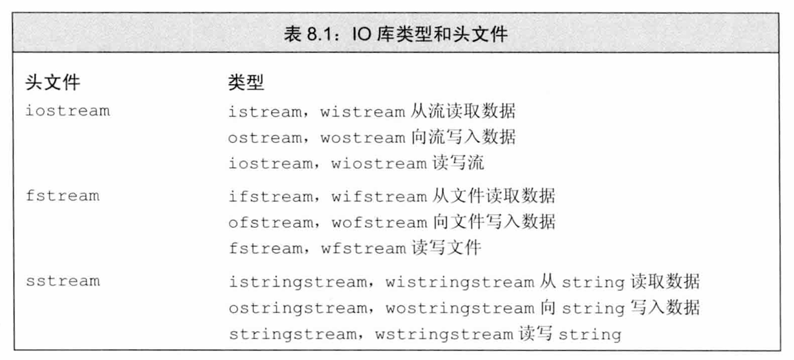

为了支持使用宽字符的语言，标准库定义了一组类型和对象来操纵 wchar_t类型的数据（参见2.1.1节，第30页）。宽字符版本的类型和函数的名字以一个w开始。例如，wcin、wcout和wcerr是分别对应cin、 cout和cerr的宽字符版对象。宽字符版本的类型和对象与其对应的普通 char版本的类型定义在同一个头文件中。例如，头文件fstream定义了 ifstream和wifstream类型。

##### IO类型间的关系

概念上，设备类型和字符大小都不会影响我们要执行的IO操作。例如，我们可以用>>读取数据，而不用管是从一个控制台窗口，一个磁盘文件，还是一个string读取。类似的，我们也不用管读取的字符能存入一个char对象内，还是需要一个wchar_t对象来存储。

标准库使我们能忽略这些不同类型的流之间的差异，这是通过继承机制（inheritance）实现的。利用模板（参见3.3节，第87页），我们可以使用具有继承关系的类，而不必了解继承机制如何工作的细节。我们将在第15章和18.3节（第710页）介绍C++是如何支持继承机制的。

简单地说，继承机制使我们可以声明一个特定的类继承自另一个类。我们通常可以将一个派生类（继承类）对象当作其基类（所继承的类）对象来使用。

类型ifstream和istringstream都继承自istream。因此，我们可以像使用istream对象一样来使用ifstream和istringstream对象。也就是说，我们是如何使用cin的，就可以同样地使用这些类型的对象。例如，可以对一个ifstream或istringstream对象调用getline，也可以使用>>从一个 ifstream或istringstream对象中读取数据。类似的，类型ofstream和 ostringstream都继承自ostream。因此，我们是如何使用cout的，就可以同样地使用这些类型的对象。

> 本节剩下部分所介绍的标准库流特性都可以无差别地应用于普通流、文件流和 string流，以及char或宽字符流版本。

#### 8.1.1　IO对象无拷贝或赋值

如我们在7.1.3节（第234页）所见，我们不能拷贝或对IO对象赋值：

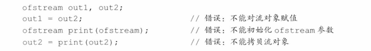

由于不能拷贝IO对象，因此我们也不能将形参或返回类型设置为流类型（参见6.2.1节，第188页）。进行IO操作的函数通常以引用方式传递和返回流。读写一个IO对象会改变其状态，因此传递和返回的引用不能是const的。

#### 8.1.2　条件状态

IO操作一个与生俱来的问题是可能发生错误。一些错误是可恢复的，而其他错误则发生在系统深处，已经超出了应用程序可以修正的范围。表8.2列出了IO类所定义的一些函数和标志，可以帮助我们访问和操纵流的条件状态（condition state）。

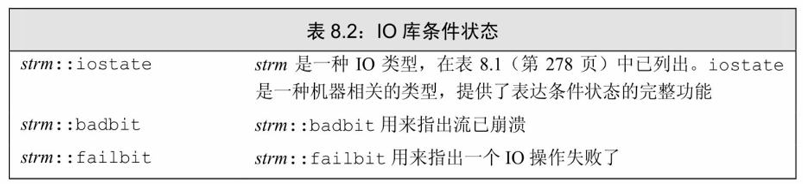

续表

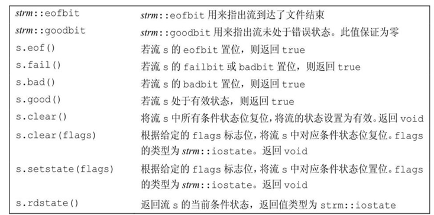

下面是一个IO错误的例子：

```
int ival;
cin >> ival;
```

如果我们在标准输入上键入Boo，读操作就会失败。代码中的输入运算符期待读取一个int，但却得到了一个字符B。这样，cin会进入错误状态。类似的，如果我们输入一个文件结束标识，cin也会进入错误状态。

一个流一旦发生错误，其上后续的IO操作都会失败。只有当一个流处于无错状态时，我们才可以从它读取数据，向它写入数据。由于流可能处于错误状态，因此代码通常应该在使用一个流之前检查它是否处于良好状态。确定一个流对象的状态的最简单的方法是将它当作一个条件来使用：

```
while (cin >> word)
	//ok : 读操作成功......
```

while循环检查>>表达式返回的流的状态。如果输入操作成功，流保持有效状态，则条件为真。

##### 查询流的状态

将流作为条件使用，只能告诉我们流是否有效，而无法告诉我们具体发生了什么。有时我们也需要知道流为什么失败。例如，在键入文件结束标识后我们的应对措施，可能与遇到一个IO设备错误的处理方式是不同的。

IO库定义了一个与机器无关的iostate类型，它提供了表达流状态的完整功能。这个类型应作为一个位集合来使用，使用方式与我们在4.8 节中（第137页）使用quiz1的方式一样。IO库定义了4个iostate类型的 constexpr值（参见2.4.4节，第58页），表示特定的位模式。这些值用来表示特定类型的IO条件，可以与位运算符（参见4.8节，第137页）一起使用来一次性检测或设置多个标志位。

badbit表示系统级错误，如不可恢复的读写错误。通常情况下，一旦badbit被置位，流就无法再使用了。在发生可恢复错误后，failbit被置位，如期望读取数值却读出一个字符等错误。这种问题通常是可以修正的，流还可以继续使用。如果到达文件结束位置，eofbit和failbit都会被置位。goodbit的值为0，表示流未发生错误。如果badbit、failbit和eofbit 任一个被置位，则检测流状态的条件会失败。

标准库还定义了一组函数来查询这些标志位的状态。操作good在所有错误位均未置位的情况下返回true，而bad、fail和eof则在对应错误位被置位时返回true。此外，在badbit被置位时，fail也会返回true。这意味着，使用good或fail是确定流的总体状态的正确方法。实际上，我们将流当作条件使用的代码就等价于！fail（）。而eof和bad操作只能表示特定的错误。

##### 管理条件状态

流对象的rdstate成员返回一个iostate值，对应流的当前状态。 setstate操作将给定条件位置位，表示发生了对应错误。clear成员是一个重载的成员（参见6.4节，第206页）：它有一个不接受参数的版本，而另一个版本接受一个iostate类型的参数。

clear不接受参数的版本清除（复位）所有错误标志位。执行 clear（）后，调用good会返回true。我们可以这样使用这些成员：

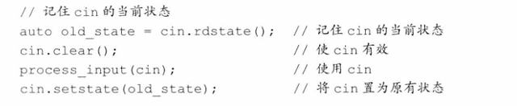

带参数的clear版本接受一个iostate值，表示流的新状态。为了复位单一的条件状态位，我们首先用rdstate读出当前条件状态，然后用位操作将所需位复位来生成新的状态。例如，下面的代码将failbit和badbit复位，但保持eofbit不变：

```
//复位 failbot 和 badbit ，保持其他标志位不变
```

##### 8.1.2节练习

练习8.1：编写函数，接受一个istream&参数，返回值类型也是 istream&。此函数须从给定流中读取数据，直至遇到文件结束标识时停止。它将读取的数据打印在标准输出上。完成这些操作后，在返回流之前，对流进行复位，使其处于有效状态。

练习8.2：测试函数，调用参数为cin。

练习8.3：什么情况下，下面的while循环会终止？

#### 8.1.3　管理输出缓冲

每个输出流都管理一个缓冲区，用来保存程序读写的数据。例如，如果执行下面的代码

```
os << "please enter a value: ";
```

文本串可能立即打印出来，但也有可能被操作系统保存在缓冲区中，随后再打印。有了缓冲机制，操作系统就可以将程序的多个输出操作组合成单一的系统级写操作。由于设备的写操作可能很耗时，允许操作系统将多个输出操作组合为单一的设备写操作可以带来很大的性能提升。

导致缓冲刷新（即，数据真正写到输出设备或文件）的原因有很多：

- 程序正常结束，作为main函数的return操作的一部分，缓冲刷新被执行。
- 缓冲区满时，需要刷新缓冲，而后新的数据才能继续写入缓冲区。
- 我们可以使用操纵符如endl（参见1.2节，第6页）来显式刷新缓冲区。
- 在每个输出操作之后，我们可以用操纵符unitbuf设置流的内部状态，来清空缓冲区。默认情况下，对cerr是设置unitbuf的，因此写到cerr 的内容都是立即刷新的。
- 一个输出流可能被关联到另一个流。在这种情况下，当读写被关联的流时，关联到的流的缓冲区会被刷新。例如，默认情况下，cin和 cerr都关联到cout。因此，读cin或写cerr都会导致cout的缓冲区被刷新。

##### 刷新输出缓冲区

我们已经使用过操纵符endl，它完成换行并刷新缓冲区的工作。IO 库中还有两个类似的操纵符：flush和ends。flush刷新缓冲区，但不输出任何额外的字符；ends向缓冲区插入一个空字符，然后刷新缓冲区：

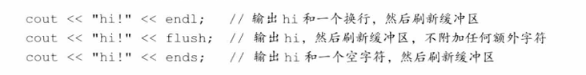

##### unitbuf操纵符

如果想在每次输出操作后都刷新缓冲区，我们可以使用unitbuf操纵符。它告诉流在接下来的每次写操作之后都进行一次flush操作。而 nounitbuf操纵符则重置流，使其恢复使用正常的系统管理的缓冲区刷新机制：

```
cout << unitbuf; //所有输出操作后都会立即刷新缓冲区
//任何输出都立即刷新，无缓冲
cout << nounitbuf; //回到正常的缓冲方式
```

> **警告：如果程序崩溃，输出缓冲区不会被刷新**
>
> 如果程序异常终止，输出缓冲区是不会被刷新的。当一个程序崩溃后，它所输出的数据很可能停留在输出缓冲区中等待打印。
>
> 当调试一个已经崩溃的程序时，需要确认那些你认为已经输出的数据确实已经刷新了。否则，可能将大量时间浪费在追踪代码为什么没有执行上，而实际上代码已经执行了，只是程序崩溃后缓冲区没有被刷新，输出数据被挂起没有打印而已。

##### 关联输入和输出流

当一个输入流被关联到一个输出流时，任何试图从输入流读取数据的操作都会先刷新关联的输出流。标准库将cout和cin关联在一起，因此下面语句

```
cin >> ival;
```

导致cout的缓冲区被刷新。

> 交互式系统通常应该关联输入流和输出流。这意味着所有输出，包括用户提示信息，都会在读操作之前被打印出来。

tie有两个重载的版本（参见6.4节，第206页）：一个版本不带参数，返回指向输出流的指针。如果本对象当前关联到一个输出流，则返回的就是指向这个流的指针，如果对象未关联到流，则返回空指针。tie 的第二个版本接受一个指向ostream的指针，将自己关联到此ostream。即，x.tie（&o）将流x关联到输出流o。

我们既可以将一个istream对象关联到另一个ostream，也可以将一个 ostream关联到另一个ostream：

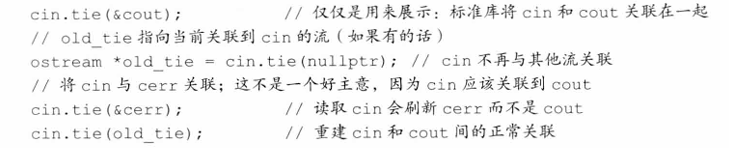

在这段代码中，为了将一个给定的流关联到一个新的输出流，我们将新流的指针传递给了tie。为了彻底解开流的关联，我们传递了一个空指针。每个流同时最多关联到一个流，但多个流可以同时关联到同一个 ostream。

### 8.2　文件输入输出

头文件fstream定义了三个类型来支持文件IO：ifstream从一个给定文件读取数据，ofstream向一个给定文件写入数据，以及fstream可以读写给定文件。在17.5.3节中（第676页）我们将介绍如何对同一个文件流既读又写。

这些类型提供的操作与我们之前已经使用过的对象cin和cout的操作一样。特别是，我们可以用IO运算符（<<和>>）来读写文件，可以用 getline（参见3.2.2节，第79页）从一个ifstream读取数据，包括8.1节中（第278页）介绍的内容也都适用于这些类型。

除了继承自iostream类型的行为之外，fstream中定义的类型还增加了一些新的成员来管理与流关联的文件。在表8.3中列出了这些操作，我们可以对fstream、ifstream和ofstream对象调用这些操作，但不能对其他IO类型调用这些操作。

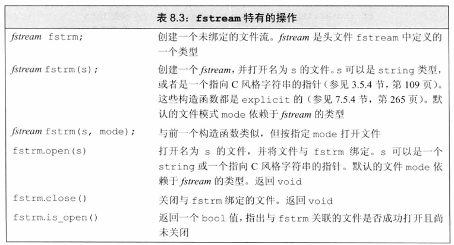

#### 8.2.1　使用文件流对象

当我们想要读写一个文件时，可以定义一个文件流对象，并将对象与文件关联起来。每个文件流类都定义了一个名为open的成员函数，它完成一些系统相关的操作，来定位给定的文件，并视情况打开为读或写模式。

创建文件流对象时，我们可以提供文件名（可选的）。如果提供了一个文件名，则open会自动被调用：

```
ifstream in(ifile); //构造一个ifstream并打开给定文件
ofstream out; //输出文件流未关联到任何文件
```

这段代码定义了一个输入流in，它被初始化为从文件读取数据，文件名由string类型的参数ifile指定。第二条语句定义了一个输出流out，未与任何文件关联。在新C++标准中，文件名既可以是库类型string对象，也可以是C风格字符数组（参见3.5.4节，第109页）。旧版本的标准库只允许C风格字符数组。

##### 用fstream代替iostream&

我们在8.1节（第279页）已经提到过，在要求使用基类型对象的地方，我们可以用继承类型的对象来替代。这意味着，接受一个iostream 类型引用（或指针）参数的函数，可以用一个对应的fstream（或 sstream）类型来调用。也就是说，如果有一个函数接受一个ostream&参数，我们在调用这个函数时，可以传递给它一个ofstream对象，对 istream&和ifstream也是类似的。

例如，我们可以用7.1.3节中的read和print函数来读写命名文件。在本例中，我们假定输入和输出文件的名字是通过传递给main函数的参数来指定的（参见6.2.5节，第196页）：

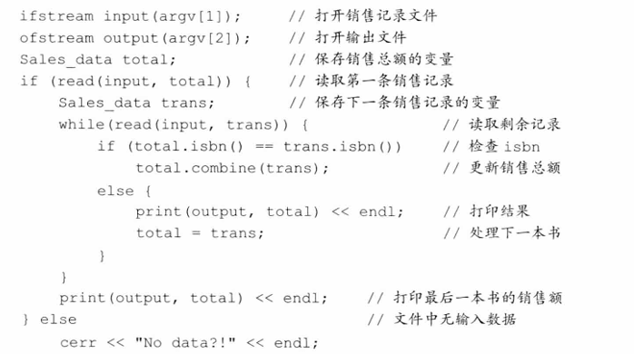

除了读写的是命名文件外，这段程序与229页的加法程序几乎是完全相同的。重要的部分是对read和print的调用。虽然两个函数定义时指定的形参分别是istream&和ostream&，但我们可以向它们传递fstream对象。

##### 成员函数open和close 

如果我们定义了一个空文件流对象，可以随后调用open来将它与文件关联起来：

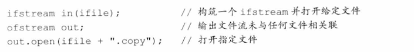

如果调用open失败，failbit会被置位（参见8.1.2节，第280页）。因为调用open可能失败，进行open是否成功的检测通常是一个好习惯：

```
if (out)//检查open是否成功
		//open成功了，我们可以使用文件了
```

这个条件判断与我们之前将cin用作条件相似。如果open失败，条件会为假，我们就不会去使用out了。

一旦一个文件流已经打开，它就保持与对应文件的关联。实际上，对一个已经打开的文件流调用open会失败，并会导致failbit被置位。随后的试图使用文件流的操作都会失败。为了将文件流关联到另外一个文件，必须首先关闭已经关联的文件。一旦文件成功关闭，我们可以打开新的文件：

```
in.close(); //关闭文件
in.open(ifile +"2"); //打开另一个文件
```

如果open成功，则open会设置流的状态，使得good（）为true。

##### 自动构造和析构

考虑这样一个程序，它的main函数接受一个要处理的文件列表（参见6.2.5节，第196页）。这种程序可能会有如下的循环：

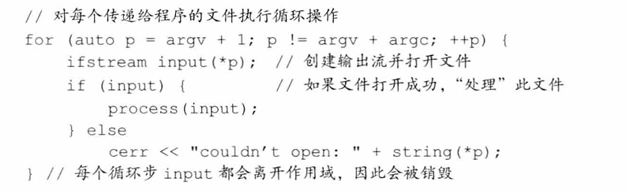

每个循环步构造一个新的名为input的ifstream对象，并打开它来读取给定的文件。像之前一样，我们检查open是否成功。如果成功，将文件传递给一个函数，该函数负责读取并处理输入数据。如果open失败，打印一条错误信息并继续处理下一个文件。

因为input是while循环的局部变量，它在每个循环步中都要创建和销毁一次（参见5.4.1节，第165页）。当一个fstream对象离开其作用域时，与之关联的文件会自动关闭。在下一步循环中，input会再次被创建。

> 当一个fstream对象被销毁时，close会自动被调用。

##### 8.2.1节练习

练习8.4：编写函数，以读模式打开一个文件，将其内容读入到一个 string的vector中，将每一行作为一个独立的元素存于vector中。

练习8.5：重写上面的程序，将每个单词作为一个独立的元素进行存储。

练习8.6：重写7.1.1节的书店程序（第229页），从一个文件中读取交易记录。将文件名作为一个参数传递给main（参见6.2.5节，第196页）。

#### 8.2.2　文件模式

每个流都有一个关联的文件模式（file mode），用来指出如何使用文件。表8.4列出了文件模式和它们的含义。

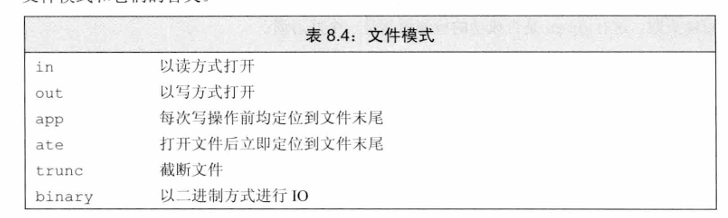

无论用哪种方式打开文件，我们都可以指定文件模式，调用open打开文件时可以，用一个文件名初始化流来隐式打开文件时也可以。指定文件模式有如下限制：

- 只可以对ofstream或fstream对象设定out模式。
- 只可以对ifstream或fstream对象设定in模式。
- 只有当out也被设定时才可设定trunc模式。
- 只要trunc没被设定，就可以设定app模式。在app模式下，即使没有显式指定out模式，文件也总是以输出方式被打开。
- 默认情况下，即使我们没有指定trunc，以out模式打开的文件也会被截断。为了保留以out模式打开的文件的内容，我们必须同时指定app 模式，这样只会将数据追加写到文件末尾；或者同时指定in模式，即打开文件同时进行读写操作（参见17.5.3节，第676页，将介绍对同一个文件既进行输入又进行输出的方法）。
- ate和binary模式可用于任何类型的文件流对象，且可以与其他任何文件模式组合使用。每个文件流类型都定义了一个默认的文件模式，当我们未指定文件模式时，就使用此默认模式。与ifstream关联的文件默认以in模式打开；与ofstream关联的文件默认以out模式打开；与fstream关联的文件默认以 in和out模式打开。

##### 以out模式打开文件会丢弃已有数据

默认情况下，当我们打开一个ofstream时，文件的内容会被丢弃。阻止一个ofstream清空给定文件内容的方法是同时指定app模式：

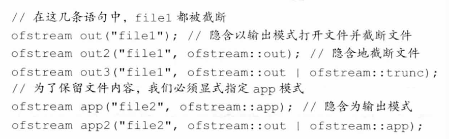

> 保留被ofstream打开的文件中已有数据的唯一方法是显式指定app或in模式。

##### 每次调用open时都会确定文件模式

对于一个给定流，每当打开文件时，都可以改变其文件模式。

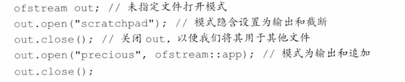

第一个open调用未显式指定输出模式，文件隐式地以out模式打开。通常情况下，out模式意味着同时使用trunc模式。因此，当前目录下名为scratchpad的文件的内容将被清空。当打开名为precious的文件时，我们指定了append模式。文件中已有的数据都得以保留，所有写操作都在文件末尾进行。

在每次打开文件时，都要设置文件模式，可能是显式地设置，也可能是隐式地设置。当程序未指定模式时，就使用默认值。

##### 8.2.2节练习

练习8.7：修改上一节的书店程序，将结果保存到一个文件中。将输出文件名作为第二个参数传递给main函数。

练习8.8：修改上一题的程序，将结果追加到给定的文件末尾。对同一个输出文件，运行程序至少两次，检验数据是否得以保留。

### 8.3　string流

sstream头文件定义了三个类型来支持内存IO，这些类型可以向 string写入数据，从string读取数据，就像string是一个IO流一样。

istringstream从string读取数据，ostringstream向string写入数据，而头文件stringstream既可从string读数据也可向string写数据。与fstream 类型类似，头文件sstream中定义的类型都继承自我们已经使用过的 iostream头文件中定义的类型。除了继承得来的操作，sstream中定义的类型还增加了一些成员来管理与流相关联的string。表8.5列出了这些操作，可以对stringstream对象调用这些操作，但不能对其他IO类型调用这些操作。

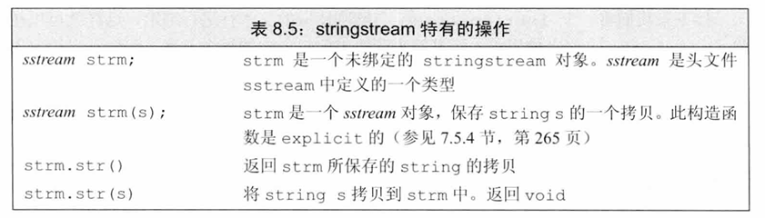

#### 8.3.1　使用istringstream 

当我们的某些工作是对整行文本进行处理，而其他一些工作是处理行内的单个单词时，通常可以使用istringstream。

考虑这样一个例子，假定有一个文件，列出了一些人和他们的电话号码。某些人只有一个号码，而另一些人则有多个——家庭电话、工作电话、移动电话等。我们的输入文件看起来可能是这样的：

morgan 2015552368 8625550123 

drew 9735550130 

lee 6095550132 2015550175 8005550000 

文件中每条记录都以一个人名开始，后面跟随一个或多个电话号码。我们首先定义一个简单的类来描述输入数据：

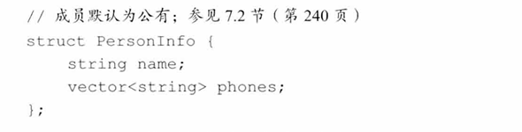

类型PersonInfo的对象会有一个成员来表示人名，还有一个vector来保存此人的所有电话号码。

我们的程序会读取数据文件，并创建一个PersonInfo的vector。 vector中每个元素对应文件中的一条记录。我们在一个循环中处理输入数据，每个循环步读取一条记录，提取出一个人名和若干电话号码：

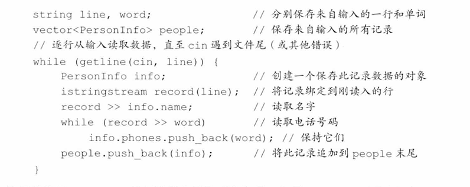

这里我们用getline从标准输入读取整条记录。如果getline调用成功，那么line中将保存着从输入文件而来的一条记录。在while中，我们定义了一个局部PersonInfo对象，来保存当前记录中的数据。

接下来我们将一个istringstream与刚刚读取的文本行进行绑定，这样就可以在此istringstream上使用输入运算符来读取当前记录中的每个元素。我们首先读取人名，随后用一个while循环读取此人的电话号码。

当读取完line中所有数据后，内层while循环就结束了。此循环的工作方式与前面章节中读取cin的循环很相似，不同之处是，此循环从一个string而不是标准输入读取数据。当string中的数据全部读出后，同样会触发“文件结束”信号，在record上的下一个输入操作会失败。

我们将刚刚处理好的PersonInfo追加到vector中，外层while循环的一个循环步就随之结束了。外层while循环会持续执行，直至遇到cin的文件结束标识。

#### 8.3.1节练习

练习8.9：使用你为8.1.2节（第281页）第一个练习所编写的函数打印一个istringstream对象的内容。

练习8.10：编写程序，将来自一个文件中的行保存在一个vector 中。然后使用一个istringstream从vector读取数据元素，每次读取一个单词。

练习8.11：本节的程序在外层while循环中定义了istringstream对象。如果record对象定义在循环之外，你需要对程序进行怎样的修改？重写程序，将record的定义移到while循环之外，验证你设想的修改方法是否正确。

练习8.12：我们为什么没有在PersonInfo中使用类内初始化？

#### 8.3.2　使用ostringstream 

当我们逐步构造输出，希望最后一起打印时，ostringstream是很有用的。例如，对上一节的例子，我们可能想逐个验证电话号码并改变其格式。如果所有号码都是有效的，我们希望输出一个新的文件，包含改变格式后的号码。对于那些无效的号码，我们不会将它们输出到新文件中，而是打印一条包含人名和无效号码的错误信息。

由于我们不希望输出有无效电话号码的人，因此对每个人，直到验证完所有电话号码后才可以进行输出操作。但是，我们可以先将输出内容“写入”到一个内存ostringstream中：

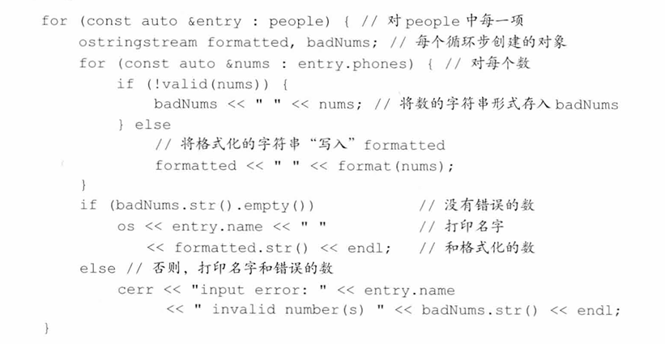

在此程序中，我们假定已有两个函数，valid和format，分别完成电话号码验证和改变格式的功能。程序最有趣的部分是对字符串流 formatted和badNums的使用。我们使用标准的输出运算符（<<）向这些对象写入数据，但这些“写入”操作实际上转换为string操作，分别向 formatted和badNums中的string对象添加字符。

##### 8.3.2节练习

练习8.13：重写本节的电话号码程序，从一个命名文件而非cin读取数据。

练习8.14：我们为什么将entry和nums定义为const auto&？


### 小结

C++使用标准库类来处理面向流的输入和输出：

- iostream处理控制台IO 
- fstream处理命名文件IO 
- stringstream完成内存string的IO 

类fstream和stringstream都是继承自类iostream的。输入类都继承自 istream，输出类都继承自ostream。因此，可以在istream对象上执行的操作，也可在ifstream或istringstream对象上执行。继承自ostream的输出类也有类似情况。

每个IO对象都维护一组条件状态，用来指出此对象上是否可以进行 IO操作。如果遇到了错误——例如在输入流上遇到了文件末尾，则对象的状态变为失效，所有后续输入操作都不能执行，直至错误被纠正。标准库提供了一组函数，用来设置和检测这些状态。

### 术语表

条件状态（condition  state）可被任何流类使用的一组标志和函数，用来指出给定流是否可用。

文件模式（file mode）类fstream定义的一组标志，在打开文件时指定，用来控制文件如何被使用。

文件流（file stream）用来读写命名文件的流对象。除了普通的 iostream操作，文件流还定义了open和close成员。成员函数open接受一个string或一个C风格字符串参数，指定要打开的文件名，它还可以接受一个可选的参数，指明文件打开模式。成员函数close关闭流所关联的文件，调用close后才可以调用open打开另一个文件。

fstream 用于同时读写一个相同文件的文件流。默认情况下， fstream以in和out模式打开文件。

ifstream 用于从输入文件读取数据的文件流。默认情况下，ifstream 以in模式打开文件。

继承（inheritance）程序设计功能，令一个类型可以从另一个类型继承接口。类ifstream和istringstream继承自istream，ofstream和 ostringstream继承自ostream。第15章将介绍继承。

istringstream 用来从给定string读取数据的字符串流。

ofstream 用来向输出文件写入数据的文件流。默认情况下， ofstream以out模式打开文件。

字符串流（string stream）用于读写string的流对象。除了普通的 iostream操作外，字符串流还定义了一个名为str的重载成员。调用str的无参版本会返回字符串流关联的string。调用时传递给它一个string参数，则会将字符串流与该string的一个拷贝相关联。

stringstream 用于读写给定string的字符串流。


## 第9章　顺序容器

本章是第3章内容的扩展，完成本章的学习后，对标准库顺序容器知识的掌握就完整了。元素在顺序容器中的顺序与其加入容器时的位置相对应。标准库还定义了几种关联容器，关联容器中元素的位置由元素相关联的关键字值决定。我们将在第11章中介绍关联容器特有的操作。

所有容器类都共享公共的接口，不同容器按不同方式对其进行扩展。这个公共接口使容器的学习更加容易——我们基于某种容器所学习的内容也都适用于其他容器。每种容器都提供了不同的性能和功能的权衡。

一个容器就是一些特定类型对象的集合。顺序容器（sequential container）为程序员提供了控制元素存储和访问顺序的能力。这种顺序不依赖于元素的值，而是与元素加入容器时的位置相对应。与之相对的，我们将在第11章介绍的有序和无序关联容器，则根据关键字的值来存储元素。

标准库还提供了三种容器适配器，分别为容器操作定义了不同的接口，来与容器类型适配。我们将在本章末尾介绍适配器。

> 本章的内容基于3.2节、3.3节和3.4节中已经介绍的有关容器的知识，我们假定读者已经熟悉了这几节的内容。

### 9.1　顺序容器概述

表9.1列出了标准库中的顺序容器，所有顺序容器都提供了快速顺序访问元素的能力。但是，这些容器在以下方面都有不同的性能折中：

- 向容器添加或从容器中删除元素的代价
- 非顺序访问容器中元素的代价

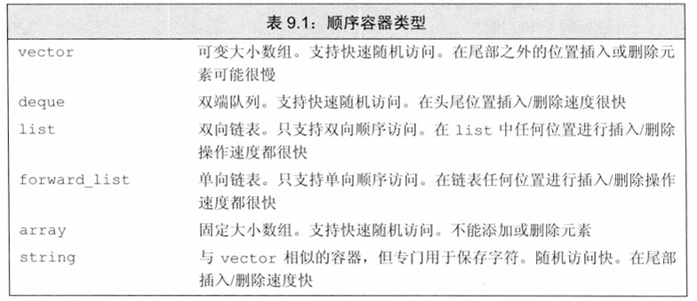

除了固定大小的array外，其他容器都提供高效、灵活的内存管理。我们可以添加和删除元素，扩张和收缩容器的大小。容器保存元素的策略对容器操作的效率有着固有的，有时是重大的影响。在某些情况下，存储策略还会影响特定容器是否支持特定操作。

例如，string和vector将元素保存在连续的内存空间中。由于元素是连续存储的，由元素的下标来计算其地址是非常快速的。但是，在这两种容器的中间位置添加或删除元素就会非常耗时：在一次插入或删除操作后，需要移动插入/删除位置之后的所有元素，来保持连续存储。而且，添加一个元素有时可能还需要分配额外的存储空间。在这种情况下，每个元素都必须移动到新的存储空间中。

list和forward_list两个容器的设计目的是令容器任何位置的添加和删除操作都很快速。作为代价，这两个容器不支持元素的随机访问：为了访问一个元素，我们只能遍历整个容器。而且，与vector、deque和array 相比，这两个容器的额外内存开销也很大。

deque是一个更为复杂的数据结构。与string和vector类似，deque支持快速的随机访问。与string和vector一样，在deque的中间位置添加或删除元素的代价（可能）很高。但是，在deque的两端添加或删除元素都是很快的，与list或forward_list添加删除元素的速度相当。

forward_list和array是新C++标准增加的类型。与内置数组相比， array是一种更安全、更容易使用的数组类型。与内置数组类似，array对象的大小是固定的。因此，array不支持添加和删除元素以及改变容器大小的操作。forward_list的设计目标是达到与最好的手写的单向链表数据结构相当的性能。因此，forward_list没有size操作，因为保存或计算其大小就会比手写链表多出额外的开销。对其他容器而言，size保证是一个快速的常量时间的操作。

> 新标准库的容器比旧版本快得多，原因我们将在13.6节（第470页）解释。新标准库容器的性能几乎肯定与最精心优化过的同类数据结构一样好（通常会更好）。现代 C++程序应该使用标准库容器，而不是更原始的数据结构，如内置数组。

确定使用哪种顺序容器

> 通常，使用vector是最好的选择，除非你有很好的理由选择其他容器。

以下是一些选择容器的基本原则：

- 除非你有很好的理由选择其他容器，否则应使用vector。
- 如果你的程序有很多小的元素，且空间的额外开销很重要，则不要使用list或forward_list。
- 如果程序要求随机访问元素，应使用vector或deque。
- 如果程序要求在容器的中间插入或删除元素，应使用list或 forward_list。
- 如果程序需要在头尾位置插入或删除元素，但不会在中间位置进行插入或删除操作，则使用deque。
- 如果程序只有在读取输入时才需要在容器中间位置插入元素，随后需要随机访问元素，则
  - —首先，确定是否真的需要在容器中间位置添加元素。当处理输入数据时，通常可以很容易地向vector追加数据，然后再调用标准库的 sort函数（我们将在10.2.3节介绍sort（第343页））来重排容器中的元素，从而避免在中间位置添加元素。
  - —如果必须在中间位置插入元素，考虑在输入阶段使用list，一旦输入完成，将list中的内容拷贝到一个vector中。

如果程序既需要随机访问元素，又需要在容器中间位置插入元素，那该怎么办？答案取决于在list或forward_list中访问元素与vector或deque 中插入/删除元素的相对性能。一般来说，应用中占主导地位的操作（执行的访问操作更多还是插入/删除更多）决定了容器类型的选择。在此情况下，对两种容器分别测试应用的性能可能就是必要的了。

> 如果你不确定应该使用哪种容器，那么可以在程序中只使用vector和list公共的操作：使用迭代器，不使用下标操作，避免随机访问。这样，在必要时选择使用vector或 list都很方便。

##### 9.1节练习

练习9.1：对于下面的程序任务，vector、deque和list哪种容器最为适合？解释你的选择的理由。如果没有哪一种容器优于其他容器，也请解释理由。

（a）读取固定数量的单词，将它们按字典序插入到容器中。我们将在下一章中看到，关联容器更适合这个问题。

（b）读取未知数量的单词，总是将新单词插入到末尾。删除操作在头部进行。

（c）从一个文件读取未知数量的整数。将这些数排序，然后将它们打印到标准输出。

### 9.2　容器库概览

容器类型上的操作形成了一种层次：

- 某些操作是所有容器类型都提供的（参见表9.2，第295页）。
- 另外一些操作仅针对顺序容器（参见表9.3，第299页）、关联容器（参见表11.7，第388页）或无序容器（参见表11.8，第395页）。
- 还有一些操作只适用于一小部分容器。

在本节中，我们将介绍对所有容器都适用的操作。本章剩余部分将聚焦于仅适用于顺序容器的操作。关联容器特有的操作将在第11章介绍。

一般来说，每个容器都定义在一个头文件中，文件名与类型名相同。即，deque定义在头文件deque中，list定义在头文件list中，以此类推。容器均定义为模板类（参见3.3节，第86页）。例如对vector，我们必须提供额外信息来生成特定的容器类型。对大多数，但不是所有容器，我们还需要额外提供元素类型信息：

```
list<Sales_data> //保存Sales_data对象的list
deque<double> //保存double的deque
```

##### 对容器可以保存的元素类型的限制

顺序容器几乎可以保存任意类型的元素。特别是，我们可以定义一个容器，其元素的类型是另一个容器。这种容器的定义与任何其他容器类型完全一样：在尖括号中指定元素类型（此种情况下，是另一种容器类型）：

```
vector<vector<string>> lines; //vector的vector
```

此处lines是一个vector，其元素类型是string的vector。

> 较旧的编译器可能需要在两个尖括号之间键入空格，例如，vector<vector<string> > 。

虽然我们可以在容器中保存几乎任何类型，但某些容器操作对元素类型有其自己的特殊要求。我们可以为不支持特定操作需求的类型定义容器，但这种情况下就只能使用那些没有特殊要求的容器操作了。

例如，顺序容器构造函数的一个版本接受容器大小参数（参见3.3.1 节，第88页），它使用了元素类型的默认构造函数。但某些类没有默认构造函数。我们可以定义一个保存这种类型对象的容器，但我们在构造这种容器时不能只传递给它一个元素数目参数：

```
//假定 noDefault 是一个没有默认构造函数的类型
vector<noDefault> v1(10，init); //正确:提供了元素初始化器
vector<noDefault> v2(10); //错误:必须提供一个元素初始化器
```

当后面介绍容器操作时，我们还会注意到每个容器操作对元素类型的其他限制。


续表

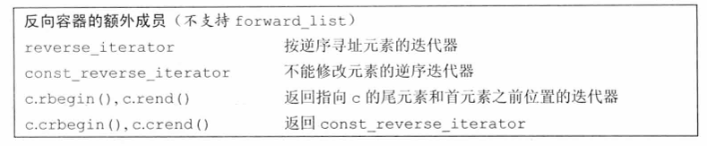

##### 9.2节练习

练习9.2：定义一个list对象，其元素类型是int的deque。


#### 9.2.1　迭代器

与容器一样，迭代器有着公共的接口：如果一个迭代器提供某个操作，那么所有提供相同操作的迭代器对这个操作的实现方式都是相同的。例如，标准容器类型上的所有迭代器都允许我们访问容器中的元素，而所有迭代器都是通过解引用运算符来实现这个操作的。类似的，标准库容器的所有迭代器都定义了递增运算符，从当前元素移动到下一个元素。

表3.6（第96页）列出了容器迭代器支持的所有操作，其中有一个例外不符合公共接口特点——forward_list迭代器不支持递减运算符（--）。表3.7（第99页）列出了迭代器支持的算术运算，这些运算只能应用于string、vector、deque和array的迭代器。我们不能将它们用于其他任何容器类型的迭代器。

##### 迭代器范围

> 迭代器范围的概念是标准库的基础。

一个迭代器范围（iterator range）由一对迭代器表示，两个迭代器分别指向同一个容器中的元素或者是尾元素之后的位置（one past the last  element）。这两个迭代器通常被称为begin和end，或者是first和 last（可能有些误导），它们标记了容器中元素的一个范围。

虽然第二个迭代器常常被称为last，但这种叫法有些误导，因为第二个迭代器从来都不会指向范围中的最后一个元素，而是指向尾元素之后的位置。迭代器范围中的元素包含first所表示的元素以及从first开始直至last（但不包含last）之间的所有元素。

这种元素范围被称为左闭合区间（left-inclusive interval），其标准数学描述为

```
[begin , end]
```

表示范围自begin开始，于end之前结束。迭代器begin和end必须指向相同的容器。end可以与begin指向相同的位置，但不能指向begin之前的位置。

> **对构成范围的迭代器的要求**
>
> 如果满足如下条件，两个迭代器begin和end构成一个迭代器范：
>
> ·它们指向同一个容器中的元素，或者是容器最后一个元素之后的位置，且
>
> ·我们可以通过反复递增begin来到达end。换句话说，end不在begin之前。
>
> 编译器不会强制这些要求。确保程序符合这些约定是程序员的责任。

##### 使用左闭合范围蕴含的编程假定

标准库使用左闭合范围是因为这种范围有三种方便的性质。假定 begin和end构成一个合法的迭代器范围，则

- 如果begin与end相等，则范围为空
- 如果begin与end不等，则范围至少包含一个元素，且begin指向该范围中的第一个元素
- 我们可以对begin递增若干次，使得begin\==end 

这些性质意味着我们可以像下面的代码一样用一个循环来处理一个元素范围，而这是安全的：

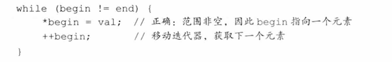

给定构成一个合法范围的迭代器begin和end，若begin\==end，则范围为空。在此情况下，我们应该退出循环。如果范围不为空，begin指向此非空范围的一个元素。因此，在while循环体中，可以安全地解引用begin，因为begin必然指向一个元素。最后，由于每次循环对begin递增一次，我们确定循环最终会结束。

##### 9.2.1节练习

练习9.3：构成迭代器范围的迭代器有何限制？

练习9.4：编写函数，接受一对指向vector的迭代器和一个int值。在两个迭代器指定的范围中查找给定的值，返回一个布尔值来指出是否找到。

练习9.5：重写上一题的函数，返回一个迭代器指向找到的元素。注意，程序必须处理未找到给定值的情况。

练习9.6：下面程序有何错误？你应该如何修改它？

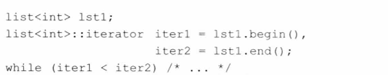

#### 9.2.2　容器类型成员

每个容器都定义了多个类型，如表9.2所示（第295页）。我们已经使用过其中三种：size_type（参见3.2.2节，第79页）、iterator和 const_iterator（参见3.4.1节，第97页）。

除了已经使用过的迭代器类型，大多数容器还提供反向迭代器。简单地说，反向迭代器就是一种反向遍历容器的迭代器，与正向迭代器相比，各种操作的含义也都发生了颠倒。例如，对一个反向迭代器执行++操作，会得到上一个元素。我们将在10.4.3节（第363页）介绍更多关于反向迭代器的内容。

剩下的就是类型别名了，通过类型别名，我们可以在不了解容器中元素类型的情况下使用它。如果需要元素类型，可以使用容器的 value_type。如果需要元素类型的一个引用，可以使用reference或 const_reference。这些元素相关的类型别名在泛型编程中非常有用，我们将在16章中介绍相关内容。

为了使用这些类型，我们必须显式使用其类名：

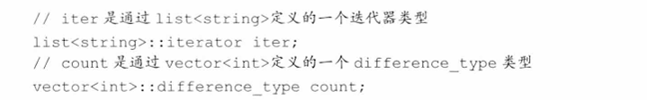

这些声明语句使用了作用域运算符（参见1.2节，第7页）来说明我们希望使用list类的iterator成员及vector类定义的 difference_type。

#####  9.2.2节练习

练习9.7：为了索引int的vector中的元素，应该使用什么类型？

练习9.8：为了读取string的list中的元素，应该使用什么类型？如果写入 list，又该使用什么类型？

#### 9.2.3　begin和end成员

begin和end操作（参见3.4.1节，第95页）生成指向容器中第一个元素和尾元素之后位置的迭代器。这两个迭代器最常见的用途是形成一个包含容器中所有元素的迭代器范围。

如表9.2（第295页）所示，begin和end有多个版本：带r的版本返回反向迭代器（我们将在10.4.3节（第363页）中介绍相关内容）；以c开头的版本则返回const迭代器：

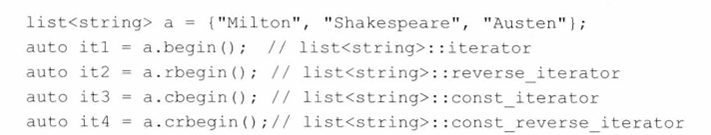

不以c开头的函数都是被重载过的。也就是说，实际上有两个名为 begin的成员。一个是const成员（参见7.1.2节，第231页），返回容器的 const_iterator类型。另一个是非常量成员，返回容器的iterator类型。 rbegin、end和rend的情况类似。当我们对一个非常量对象调用这些成员时，得到的是返回iterator的版本。只有在对一个const对象调用这些函数时，才会得到一个const版本。与const指针和引用类似，可以将一个普通的iterator转换为对应的const_iterator，但反之不行。

以c开头的版本是C++新标准引入的，用以支持auto（参见2.5.2节，第61页）与begin和end函数结合使用。过去，没有其他选择，只能显式声明希望使用哪种类型的迭代器：

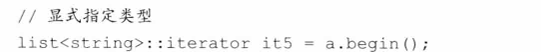

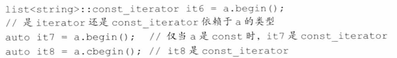

当auto与begin或end结合使用时，获得的迭代器类型依赖于容器类型，与我们想要如何使用迭代器毫不相干。但以c开头的版本还是可以获得const_iterator的，而不管容器的类型是什么。

> 当不需要写访问时，应使用cbegin和cend。

##### 9.2.3节练习

练习9.9：begin和cbegin两个函数有什么不同？

练习9.10：下面4个对象分别是什么类型？

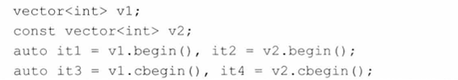

#### 9.2.4　容器定义和初始化

每个容器类型都定义了一个默认构造函数（参见7.1.4节，第236 页）。除array之外，其他容器的默认构造函数都会创建一个指定类型的空容器，且都可以接受指定容器大小和元素初始值的参数。

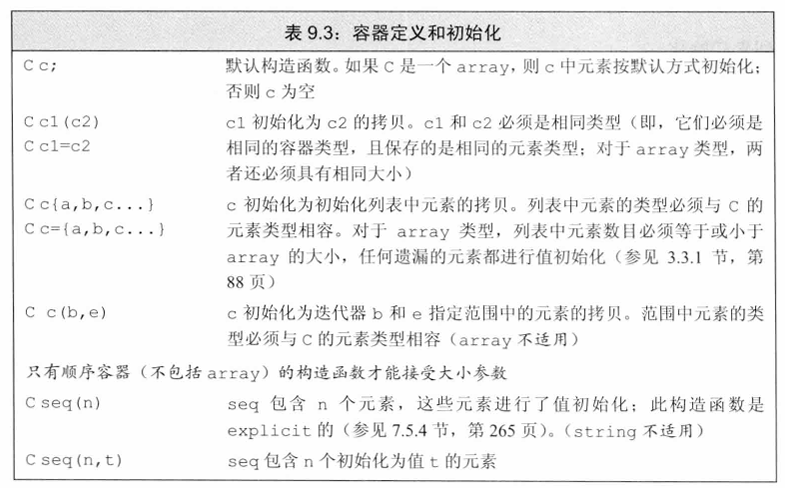

##### 将一个容器初始化为另一个容器的拷贝

将一个新容器创建为另一个容器的拷贝的方法有两种：可以直接拷贝整个容器，或者（array除外）拷贝由一个迭代器对指定的元素范围。

为了创建一个容器为另一个容器的拷贝，两个容器的类型及其元素类型必须匹配。不过，当传递迭代器参数来拷贝一个范围时，就不要求容器类型是相同的了。而且，新容器和原容器中的元素类型也可以不同，只要能将要拷贝的元素转换（参见4.11节，第141页）为要初始化的容器的元素类型即可。

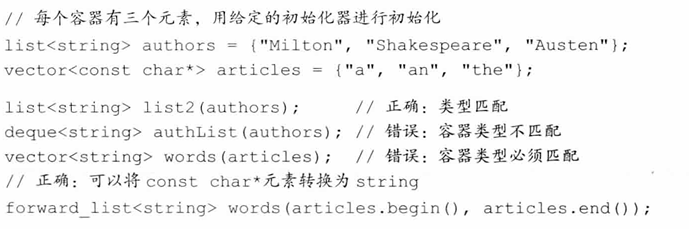

> 当将一个容器初始化为另一个容器的拷贝时，两个容器的容器类型和元素类型都必须相同。

接受两个迭代器参数的构造函数用这两个迭代器表示我们想要拷贝的一个元素范围。与以往一样，两个迭代器分别标记想要拷贝的第一个元素和尾元素之后的位置。新容器的大小与范围中元素的数目相同。新容器中的每个元素都用范围中对应元素的值进行初始化。

由于两个迭代器表示一个范围，因此可以使用这种构造函数来拷贝一个容器中的子序列。例如，假定迭代器it表示authors中的一个元素，我们可以编写如下代码

```
//拷贝元素，直到(但不包括)it指向的元素
deque<string> authList(authors.begin(),it);
```

##### 列表初始化

在新标准中，我们可以对一个容器进行列表初始化（参见3.3.1节，第88页）

```
//每个容器有三个元素，用给定的初始化器进行初始化
list<string> authors ={"Milton"，"Shakespeare","Austen"};
vector<const char*> articles ={"a"，"an"，"the"};
```

当这样做时，我们就显式地指定了容器中每个元素的值。对于除 array之外的容器类型，初始化列表还隐含地指定了容器的大小：容器将包含与初始值一样多的元素。

##### 与顺序容器大小相关的构造函数

除了与关联容器相同的构造函数外，顺序容器（array除外）还提供另一个构造函数，它接受一个容器大小和一个（可选的）元素初始值。如果我们不提供元素初始值，则标准库会创建一个值初始化器（参见3.3.1节，第88页）：

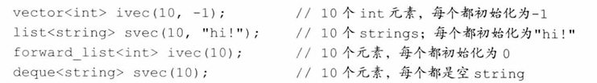

如果元素类型是内置类型或者是具有默认构造函数（参见9.2节，第294页）的类类型，可以只为构造函数提供一个容器大小参数。如果元素类型没有默认构造函数，除了大小参数外，还必须指定一个显式的元素初始值。

> 只有顺序容器的构造函数才接受大小参数，关联容器并不支持。

##### 标准库array具有固定大小

与内置数组一样，标准库array的大小也是类型的一部分。当定义一个array时，除了指定元素类型，还要指定容器大小：

```
array<int，42>
//类型为:保存42个int的数组
array<string，10>
//类型为:保存10个string的数组
```

为了使用array类型，我们必须同时指定元素类型和大小：

```
array<int,10>::size_type i; //数组类型包括元素类型和大小
array<int>::size_type j; //错误:array<int>不是一个类型
```

由于大小是array类型的一部分，array不支持普通的容器构造函数。这些构造函数都会确定容器的大小，要么隐式地，要么显式地。而允许用户向一个array构造函数传递大小参数，最好情况下也是多余的，而且容易出错。

array大小固定的特性也影响了它所定义的构造函数的行为。与其他容器不同，一个默认构造的array是非空的：它包含了与其大小一样多的元素。这些元素都被默认初始化（参见2.2.1节，第40页），就像一个内置数组（参见3.5.1节，第102页）中的元素那样。如果我们对array进行列表初始化，初始值的数目必须等于或小于array的大小。如果初始值数目小于array的大小，则它们被用来初始化array中靠前的元素，所有剩余元素都会进行值初始化（参见3.3.1节，第88页）。在这两种情况下，如果元素类型是一个类类型，那么该类必须有一个默认构造函数，以使值初始化能够进行：

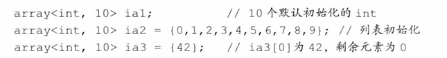

值得注意的是，虽然我们不能对内置数组类型进行拷贝或对象赋值操作（参见3.5.1节，第102页），但array并无此限制：

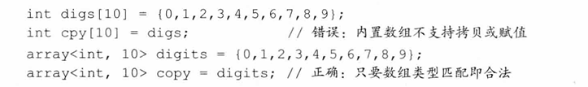

与其他容器一样，array也要求初始值的类型必须与要创建的容器类型相同。此外，array还要求元素类型和大小也都一样，因为大小是array 类型的一部分。

##### 9.2.4节练习

练习9.11：对6种创建和初始化vector对象的方法，每一种都给出一个实例。解释每个vector包含什么值。

练习9.12：对于接受一个容器创建其拷贝的构造函数，和接受两个迭代器创建拷贝的构造函数，解释它们的不同。

练习9.13：如何从一个list初始化一个vector？从一个 vector又该如何创建？编写代码验证你的答案。

#### 9.2.5　赋值和swap 

表9.4中列出的与赋值相关的运算符可用于所有容器。赋值运算符将其左边容器中的全部元素替换为右边容器中元素的拷贝：

```
//将cl的内容替换为c2中元素的拷贝
c1=c2;
//赋值后，c1大小为3
c1={a,b,c};
```

第一个赋值运算后，左边容器将与右边容器相等。如果两个容器原来大小不同，赋值运算后两者的大小都与右边容器的原大小相同。第二个赋值运算后，c1的size变为3，即花括号列表中值的数目。

与内置数组不同，标准库array类型允许赋值。赋值号左右两边的运算对象必须具有相同的类型：

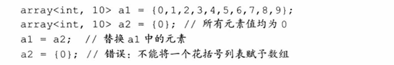

由于右边运算对象的大小可能与左边运算对象的大小不同，因此 array类型不支持assign，也不允许用花括号包围的值列表进行赋值。

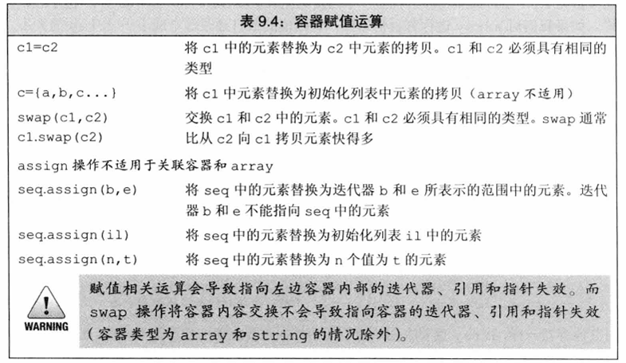

##### 使用assign（仅顺序容器）

赋值运算符要求左边和右边的运算对象具有相同的类型。它将右边运算对象中所有元素拷贝到左边运算对象中。顺序容器（array除外）还定义了一个名为assign的成员，允许我们从一个不同但相容的类型赋值，或者从容器的一个子序列赋值。assign操作用参数所指定的元素（的拷贝）替换左边容器中的所有元素。例如，我们可以用assgin实现将一个vector中的一段char *值赋予一个list中的string：

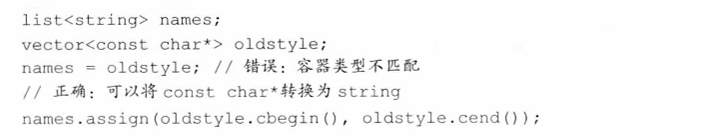

这段代码中对assign的调用将names中的元素替换为迭代器指定的范围中的元素的拷贝。assign的参数决定了容器中将有多少个元素以及它们的值都是什么。

> 由于其旧元素被替换，因此传递给assign的迭代器不能指向调用assign的容器。

assign的第二个版本接受一个整型值和一个元素值。它用指定数目且具有相同给定值的元素替换容器中原有的元素：

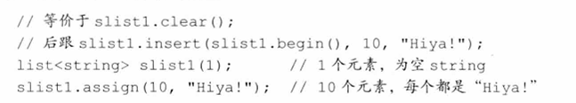

##### 使用swap 

swap操作交换两个相同类型容器的内容。调用swap之后，两个容器中的元素将会交换：

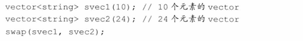

调用swap后，svec1将包含24个string元素，svec2将包含10个string。除array外，交换两个容器内容的操作保证会很快——元素本身并未交换，swap只是交换了两个容器的内部数据结构。

> 除array外，swap不对任何元素进行拷贝、删除或插入操作，因此可以保证在常数时间内完成。

元素不会被移动的事实意味着，除string外，指向容器的迭代器、引用和指针在swap操作之后都不会失效。它们仍指向swap操作之前所指向的那些元素。但是，在swap之后，这些元素已经属于不同的容器了。例如，假定iter在swap之前指向svec1[3]的string，那么在swap之后它指向 svec2[3]的元素。与其他容器不同，对一个string调用swap会导致迭代器、引用和指针失效。

与其他容器不同，swap两个array会真正交换它们的元素。因此，交换两个array所需的时间与array中元素的数目成正比。

因此，对于array，在swap操作之后，指针、引用和迭代器所绑定的元素保持不变，但元素值已经与另一个array中对应元素的值进行了交换。

在新标准库中，容器既提供成员函数版本的swap，也提供非成员版本的swap。而早期标准库版本只提供成员函数版本的swap。非成员版本的swap在泛型编程中是非常重要的。统一使用非成员版本的swap是一个好习惯。

##### 9.2.5节练习

练习9.14：编写程序，将一个list中的char \*指针（指向C风格字符串）元素赋值给一个vector中的string。


#### 9.2.6　容器大小操作

除了一个例外，每个容器类型都有三个与大小相关的操作。成员函数size（参见3.2.2节，第78页）返回容器中元素的数目；empty当size为0 时返回布尔值true，否则返回false；max_size返回一个大于或等于该类型容器所能容纳的最大元素数的值。forward_list支持max_size和empty，但不支持size，原因我们将在下一节解释。


#### 9.2.7　关系运算符

每个容器类型都支持相等运算符（\==和！=）；除了无序关联容器外的所有容器都支持关系运算符（>、>=、<、<=）。关系运算符左右两边的运算对象必须是相同类型的容器，且必须保存相同类型的元素。即，我们只能将一个vector与另一个vector进行比较，而不能将一个vector与一个list或一个vector进行比较。

比较两个容器实际上是进行元素的逐对比较。这些运算符的工作方式与string的关系运算（参见3.2.2节，第79页）类似：

- 如果两个容器具有相同大小且所有元素都两两对应相等，则这两个容器相等；否则两个容器不等。
- 如果两个容器大小不同，但较小容器中每个元素都等于较大容器中的对应元素，则较小容器小于较大容器。
- 如果两个容器都不是另一个容器的前缀子序列，则它们的比较结果取决于第一个不相等的元素的比较结果。

下面的例子展示了这些关系运算符是如何工作的：

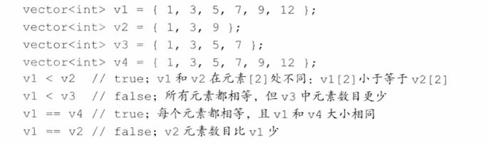

##### 容器的关系运算符使用元素的关系运算符完成比较

> 只有当其元素类型也定义了相应的比较运算符时，我们才可以使用关系运算符来比较两个容器。

容器的相等运算符实际上是使用元素的\==运算符实现比较的，而其他关系运算符是使用元素的<运算符。如果元素类型不支持所需运算符，那么保存这种元素的容器就不能使用相应的关系运算。例如，我们在第7章中定义的Sales_data类型并未定义==和<运算。因此，就不能比较两个保存Sales_data元素的容器：

```
vector<Sales_data> storeA,storeB;
if(storeA < storeB)//错误:Sales data没有<运算符
```

##### 9.2.7节练习

练习9.15：编写程序，判定两个vector是否相等。

练习9.16：重写上一题的程序，比较一个list中的元素和一个 vector中的元素。

练习9.17：假定c1和c2是两个容器，下面的比较操作有何限制（如果有的话）？

```
if (c1 < c2)
```

### 9.3　顺序容器操作

顺序容器和关联容器的不同之处在于两者组织元素的方式。这些不同之处直接关系到了元素如何存储、访问、添加以及删除。上一节介绍了所有容器都支持的操作（罗列于表9.2（第295页））。本章剩余部分将介绍顺序容器所特有的操作。

#### 9.3.1　向顺序容器添加元素

除array外，所有标准库容器都提供灵活的内存管理。在运行时可以动态添加或删除元素来改变容器大小。表9.5列出了向顺序容器（非 array）添加元素的操作。

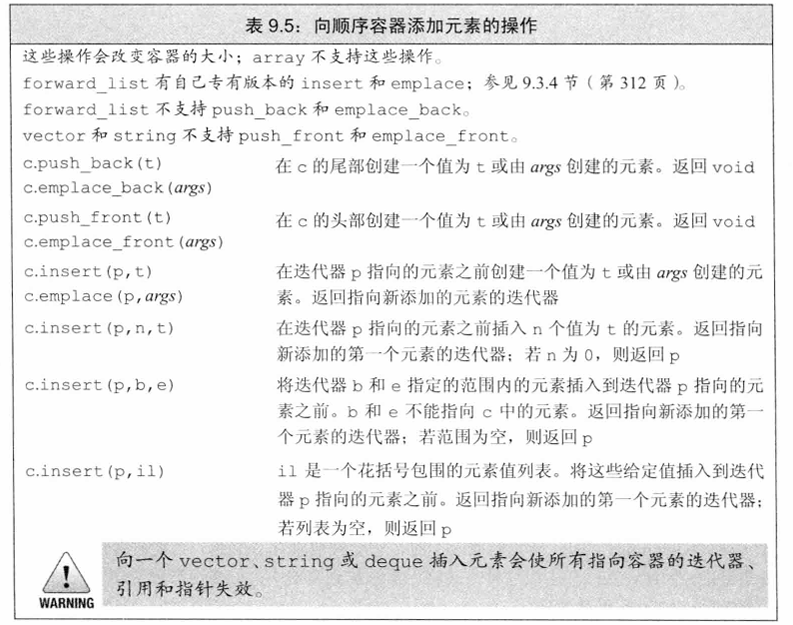

当我们使用这些操作时，必须记得不同容器使用不同的策略来分配元素空间，而这些策略直接影响性能。在一个vector或string的尾部之外的任何位置，或是一个deque的首尾之外的任何位置添加元素，都需要移动元素。而且，向一个vector或string添加元素可能引起整个对象存储空间的重新分配。重新分配一个对象的存储空间需要分配新的内存，并将元素从旧的空间移动到新的空间中。

##### 使用push_back 

在3.3.2节（第90页）中，我们看到push_back将一个元素追加到一个vector的尾部。除array和forward_list之外，每个顺序容器（包括string 类型）都支持push_back。

例如，下面的循环每次读取一个string到word中，然后追加到容器尾部：

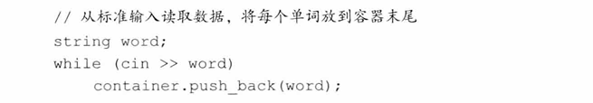

对push_back的调用在container尾部创建了一个新的元素，将 container的size增大了1。该元素的值为word的一个拷贝。container的类型可以是list、vector或deque。

由于string是一个字符容器，我们也可以用push_back在string末尾添加字符：

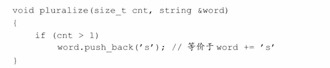

> **关键概念：容器元素是拷贝**
>
> 当我们用一个对象来初始化容器时，或将一个对象插入到容器中时，实际上放入到容器中的是对象值的一个拷贝，而不是对象本身。就像我们将一个对象传递给非引用参数（参见3.2.2节，第79页）一样，容器中的元素与提供值的对象之间没有任何关联。随后对容器中元素的任何改变都不会影响到原始对象，反之亦然。

##### 使用push_front 

除了push_back，list、forward_list和deque容器还支持名为push_front 的类似操作。此操作将元素插入到容器头部：

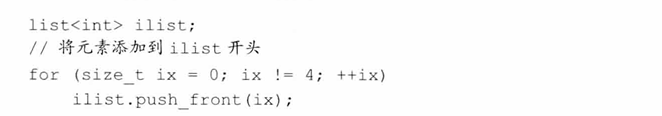

此循环将元素0、1、2、3添加到ilist头部。每个元素都插入到list的新的开始位置（new beginning）。即，当我们插入1时，它会被放置在0 之前，2被放置在1之前，依此类推。因此，在循环中以这种方式将元素添加到容器中，最终会形成逆序。在循环执行完毕后，ilist保存序列3、2、1、0。

注意，deque像vector一样提供了随机访问元素的能力，但它提供了 vector所不支持的push_front。deque保证在容器首尾进行插入和删除元素的操作都只花费常数时间。与vector一样，在deque首尾之外的位置插入元素会很耗时。

##### 在容器中的特定位置添加元素

push_back和push_front操作提供了一种方便地在顺序容器尾部或头部插入单个元素的方法。insert成员提供了更一般的添加功能，它允许我们在容器中任意位置插入0个或多个元素。vector、deque、list和string 都支持insert成员。forward_list提供了特殊版本的insert成员，我们将在9.3.4节（第312页）中介绍。

每个insert函数都接受一个迭代器作为其第一个参数。迭代器指出了在容器中什么位置放置新元素。它可以指向容器中任何位置，包括容器尾部之后的下一个位置。由于迭代器可能指向容器尾部之后不存在的元素的位置，而且在容器开始位置插入元素是很有用的功能，所以 insert函数将元素插入到迭代器所指定的位置之前。例如，下面的语句

```
slist.insert(iter,"Hello!");//将"Hello!"添加到iter之前的位置
```

将一个值为"Hello"的string插入到iter指向的元素之前的位置。

虽然某些容器不支持push_front操作，但它们对于insert操作并无类似的限制（插入开始位置）。因此我们可以将元素插入到容器的开始位置，而不必担心容器是否支持push_front：

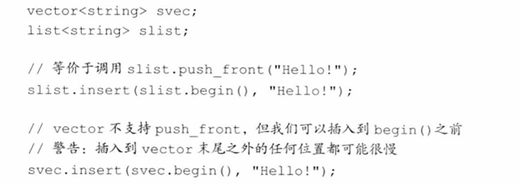

> 将元素插入到vector、deque和string中的任何位置都是合法的。然而，这样做可能很耗时。

##### 插入范围内元素

除了第一个迭代器参数之外，insert函数还可以接受更多的参数，这与容器构造函数类似。其中一个版本接受一个元素数目和一个值，它将指定数量的元素添加到指定位置之前，这些元素都按给定值初始化：

```
svec.insert(svec.end()，10，"Anna");
```

这行代码将10个元素插入到svec的末尾，并将所有元素都初始化为 string "Anna"。

接受一对迭代器或一个初始化列表的insert版本将给定范围中的元素插入到指定位置之前：

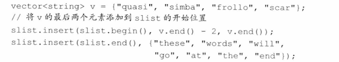

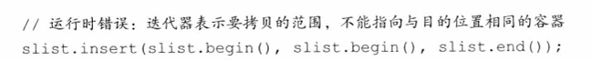

如果我们传递给insert一对迭代器，它们不能指向添加元素的目标容器。

在新标准下，接受元素个数或范围的insert版本返回指向第一个新加入元素的迭代器。（在旧版本的标准库中，这些操作返回void。）如果范围为空，不插入任何元素，insert操作会将第一个参数返回。

##### 使用insert的返回值

通过使用insert的返回值，可以在容器中一个特定位置反复插入元素：

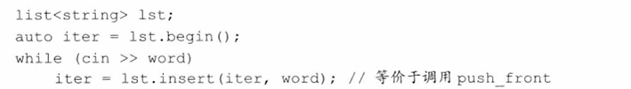

理解这个循环是如何工作的非常重要，特别是理解这个循环为什么等价于调用 push_front尤为重要。

在循环之前，我们将iter初始化为lst.begin（）。第一次调用insert会将我们刚刚读入的string插入到iter所指向的元素之前的位置。insert返回的迭代器恰好指向这个新元素。我们将此迭代器赋予iter并重复循环，读取下一个单词。只要继续有单词读入，每步while循环就会将一个新元素插入到iter之前，并将iter改变为新加入元素的位置。此元素为（新的）首元素。因此，每步循环将一个新元素插入到list首元素之前的位置。

##### 使用emplace操作

新标准引入了三个新成员——emplace_front、emplace和 emplace_back，这些操作构造而不是拷贝元素。这些操作分别对应 push_front、insert和push_back，允许我们将元素放置在容器头部、一个指定位置之前或容器尾部。

当调用push或insert成员函数时，我们将元素类型的对象传递给它们，这些对象被拷贝到容器中。而当我们调用一个emplace成员函数时，则是将参数传递给元素类型的构造函数。emplace成员使用这些参数在容器管理的内存空间中直接构造元素。例如，假定c保存 Sales_data（参见7.1.4节，第237页）元素：

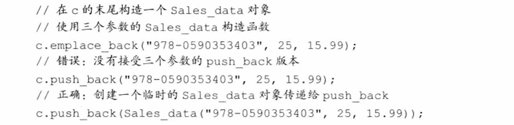

其中对emplace_back的调用和第二个push_back调用都会创建新的 Sales_data对象。在调用emplace_back时，会在容器管理的内存空间中直接创建对象。而调用push_back则会创建一个局部临时对象，并将其压入容器中。

emplace函数的参数根据元素类型而变化，参数必须与元素类型的构造函数相匹配：

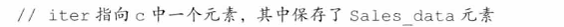

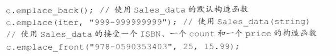

emplace函数在容器中直接构造元素。传递给emplace函数的参数必须与元素类型的构造函数相匹配。

##### 9.3.1节练习

练习9.18：编写程序，从标准输入读取string序列，存入一个deque中。编写一个循环，用迭代器打印deque中的元素。

练习9.19：重写上题的程序，用list替代deque。列出程序要做出哪些改变。

练习9.20：编写程序，从一个list拷贝元素到两个deque中。值为偶数的所有元素都拷贝到一个deque中，而奇数值元素都拷贝到另一个 deque中。

练习9.21：如果我们将第308页中使用insert返回值将元素添加到list中的循环程序改写为将元素插入到vector中，分析循环将如何工作。

练习9.22：假定iv是一个int的vector，下面的程序存在什么错误？你将如何修改？


#### 9.3.2　访问元素

表9.6列出了我们可以用来在顺序容器中访问元素的操作。如果容器中没有元素，访问操作的结果是未定义的。

包括array在内的每个顺序容器都有一个front成员函数，而除 forward_list之外的所有顺序容器都有一个back成员函数。这两个操作分别返回首元素和尾元素的引用：


此程序用两种不同方式来获取c中的首元素和尾元素的引用。直接的方法是调用front和back。而间接的方法是通过解引用begin返回的迭代器来获得首元素的引用，以及通过递减然后解引用end返回的迭代器来获得尾元素的引用。

这个程序有两点值得注意：迭代器end指向的是容器尾元素之后的（不存在的）元素。为了获取尾元素，必须首先递减此迭代器。另一个重要之处是，在调用front和back（或解引用begin和end返回的迭代器）之前，要确保c非空。如果容器为空，if中操作的行为将是未定义的。

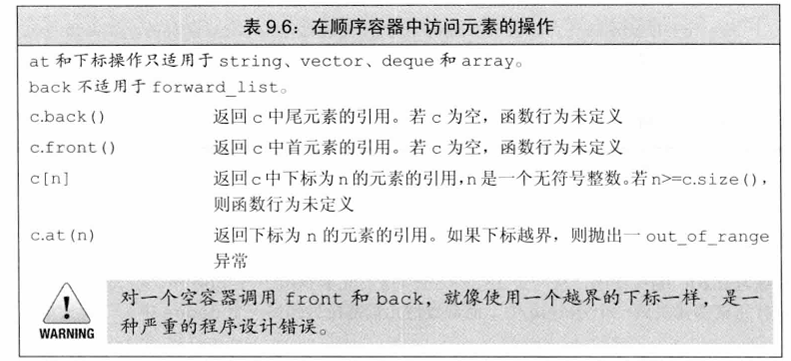

##### 访问成员函数返回的是引用

在容器中访问元素的成员函数（即，front、back、下标和at）返回的都是引用。如果容器是一个const对象，则返回值是const的引用。如果容器不是const的，则返回值是普通引用，我们可以用来改变元素的值：


与往常一样，如果我们使用auto变量来保存这些函数的返回值，并且希望使用此变量来改变元素的值，必须记得将变量定义为引用类型。

##### 下标操作和安全的随机访问

提供快速随机访问的容器（string、vector、deque和array）也都提供下标运算符（参见3.3.3节，第91页）。就像我们已经看到的那样，下标运算符接受一个下标参数，返回容器中该位置的元素的引用。给定下标必须“在范围内”（即，大于等于0，且小于容器的大小）。保证下标有效是程序员的责任，下标运算符并不检查下标是否在合法范围内。使用越界的下标是一种严重的程序设计错误，而且编译器并不检查这种错误。

如果我们希望确保下标是合法的，可以使用at成员函数。at成员函数类似下标运算符，但如果下标越界，at会抛出一个out_of_range异常（参见5.6节，第173页）：

##### 9.3.2节练习

练习9.23：在本节第一个程序（第309页）中，若c.size（）为1，则 val、val2、val3和val4的值会是什么？

练习9.24：编写程序，分别使用at、下标运算符、front和begin提取一个 vector中的第一个元素。在一个空vector上测试你的程序。

#### 9.3.3　删除元素

与添加元素的多种方式类似，（非array）容器也有多种删除元素的方式。表9.7列出了这些成员函数。


> 删除元素的成员函数并不检查其参数。在删除元素之前，程序员必须确保它（们）是存在的。

##### pop_front和pop_back成员函数

pop_front和pop_back成员函数分别删除首元素和尾元素。与vector 和string不支持push_front一样，这些类型也不支持pop_front。类似的， forward_list不支持pop_back。与元素访问成员函数类似，不能对一个空容器执行弹出操作。

这些操作返回void。如果你需要弹出的元素的值，就必须在执行弹出操作之前保存它：


##### 从容器内部删除一个元素

成员函数erase从容器中指定位置删除元素。我们可以删除由一个迭代器指定的单个元素，也可以删除由一对迭代器指定的范围内的所有元素。两种形式的erase都返回指向删除的（最后一个）元素之后位置的迭代器。即，若j是i之后的元素，那么erase（i）将返回指向j的迭代器。

例如，下面的循环删除一个list中的所有奇数元素：


每个循环步中，首先检查当前元素是否是奇数。如果是，就删除该元素，并将it设置为我们所删除的元素之后的元素。如果*it为偶数，我们将it递增，从而在下一步循环检查下一个元素。

##### 删除多个元素

接受一对迭代器的erase版本允许我们删除一个范围内的元素：


迭代器elem1指向我们要删除的第一个元素，elem2指向我们要删除的最后一个元素之后的位置。

为了删除一个容器中的所有元素，我们既可以调用clear，也可以用 begin和end获得的迭代器作为参数调用erase：

```
slist.clear();//删除容器中所有元素
slist.erase(slist.begin()，slist.end());//等价调用
```

##### 9.3.3节练习

练习9.25：对于第312页中删除一个范围内的元素的程序，如果elem1与 elem2相等会发生什么？如果elem2是尾后迭代器，或者elem1和elem2皆为尾后迭代器，又会发生什么？

练习9.26：使用下面代码定义的ia，将ia拷贝到一个vector和一个list中。使用单迭代器版本的erase从list中删除奇数元素，从vector中删除偶数元素。

```
int ia[]= {0,1,1,2,3,5,8,13,21,55,89};
```

#### 9.3.4　特殊的forward_list操作

为了理解forward_list为什么有特殊版本的添加和删除操作，考虑当我们从一个单向链表中删除一个元素时会发生什么。如图9.1所示，删除一个元素会改变序列中的链接。在此情况下，删除elem3 会改变 elem2 ，elem2 原来指向elem3 ，但删除elem3 后，elem2 指向了elem4 。


图9.1：forward_list的特殊操作

当添加或删除一个元素时，删除或添加的元素之前的那个元素的后继会发生改变。为了添加或删除一个元素，我们需要访问其前驱，以便改变前驱的链接。但是，forward_list是单向链表。在一个单向链表中，没有简单的方法来获取一个元素的前驱。出于这个原因，在一个 forward_list中添加或删除元素的操作是通过改变给定元素之后的元素来完成的。这样，我们总是可以访问到被添加或删除操作所影响的元素。

由于这些操作与其他容器上的操作的实现方式不同，forward_list并未定义insert、emplace和erase，而是定义了名为insert_after、 emplace_after和erase_after的操作（参见表9.8）。例如，在我们的例子中，为了删除elem3 ，应该用指向elem2 的迭代器调用 erase_after。为了支持这些操作，forward_list也定义了before_begin，它返回一个首前（off the-beginning）迭代器。这个迭代器允许我们在链表首元素之前并不存在的元素“之后”添加或删除元素（亦即在链表首元素之前添加删除元素）。


当在forward_list中添加或删除元素时，我们必须关注两个迭代器——一个指向我们要处理的元素，另一个指向其前驱。例如，可以改写第312页中从list中删除奇数元素的循环程序，将其改为从forward_list中删除元素：


此例中，curr表示我们要处理的元素，prev表示curr的前驱。调用 begin来初始化curr，这样第一步循环就会检查第一个元素是否是奇数。我们用before_begin来初始化prev，它返回指向curr之前不存在的元素的迭代器。

当找到奇数元素后，我们将prev传递给erase_after。此调用将prev之后的元素删除，即，删除curr指向的元素。然后我们将curr重置为 erase_after的返回值，使得curr指向序列中下一个元素，prev保持不变，仍指向（新）curr之前的元素。如果curr指向的元素不是奇数，在else中我们将两个迭代器都向前移动。

##### 9.3.4节练习

练习9.27：编写程序，查找并删除forward_list中的奇数元素。

练习9.28：编写函数，接受一个forward_list和两个string共三个参数。函数应在链表中查找第一个string，并将第二个string插入到紧接着第一个string之后的位置。若第一个string未在链表中，则将第二个 string插入到链表末尾。

#### 9.3.5　改变容器大小

如表9.9所描述，我们可以用resize来增大或缩小容器，与往常一样，array不支持resize。如果当前大小大于所要求的大小，容器后部的元素会被删除；如果当前大小小于新大小，会将新元素添加到容器后部：


resize操作接受一个可选的元素值参数，用来初始化添加到容器中的元素。如果调用者未提供此参数，新元素进行值初始化（参见3.3.1 节，第88页）。如果容器保存的是类类型元素，且resize向容器添加新元素，则我们必须提供初始值，或者元素类型必须提供一个默认构造函数。


##### 9.3.5节练习

练习9.29：假定vec包含25个元素，那么vec.resize（100）会做什么？如果接下来调用vec.resize（10）会做什么？

练习9.30：接受单个参数的resize版本对元素类型有什么限制（如果有的话）？

#### 9.3.6　容器操作可能使迭代器失效

向容器中添加元素和从容器中删除元素的操作可能会使指向容器元素的指针、引用或迭代器失效。一个失效的指针、引用或迭代器将不再表示任何元素。使用失效的指针、引用或迭代器是一种严重的程序设计错误，很可能引起与使用未初始化指针一样的问题（参见2.3.2节，第49 页）

在向容器添加元素后：

- 如果容器是vector或string，且存储空间被重新分配，则指向容器的迭代器、指针和引用都会失效。如果存储空间未重新分配，指向插入位置之前的元素的迭代器、指针和引用仍有效，但指向插入位置之后元素的迭代器、指针和引用将会失效。
- 对于deque，插入到除首尾位置之外的任何位置都会导致迭代器、指针和引用失效。如果在首尾位置添加元素，迭代器会失效，但指向存在的元素的引用和指针不会失效。
- 对于list和forward_list，指向容器的迭代器（包括尾后迭代器和首前迭代器）、指针和引用仍有效。

当我们从一个容器中删除元素后，指向被删除元素的迭代器、指针和引用会失效，这应该不会令人惊讶。毕竟，这些元素都已经被销毁了。当我们删除一个元素后：

- 对于list和forward_list，指向容器其他位置的迭代器（包括尾后迭代器和首前迭代器）、引用和指针仍有效。
- 对于deque，如果在首尾之外的任何位置删除元素，那么指向被删除元素外其他元素的迭代器、引用或指针也会失效。如果是删除deque 的尾元素，则尾后迭代器也会失效，但其他迭代器、引用和指针不受影响；如果是删除首元素，这些也不会受影响。
- 对于vector和string，指向被删元素之前元素的迭代器、引用和指针仍有效。注意：当我们删除元素时，尾后迭代器总是会失效。

> 使用失效的迭代器、指针或引用是严重的运行时错误。

> **建议：管理迭代器**
>
> 当你使用迭代器（或指向容器元素的引用或指针）时，最小化要求迭代器必须保持有效的程序片段是一个好的方法。
>
> 由于向迭代器添加元素和从迭代器删除元素的代码可能会使迭代器失效，因此必须保证每次改变容器的操作之后都正确地重新定位迭代器。这个建议对vector、string 和deque尤为重要。

##### 编写改变容器的循环程序

添加/删除vector、string或deque元素的循环程序必须考虑迭代器、引用和指针可能失效的问题。程序必须保证每个循环步中都更新迭代器、引用或指针。如果循环中调用的是insert或erase，那么更新迭代器很容易。这些操作都返回迭代器，我们可以用来更新：


此程序删除vector中的偶数值元素，并复制每个奇数值元素。我们在调用insert和erase后都更新迭代器，因为两者都会使迭代器失效。

在调用erase后，不必递增迭代器，因为erase返回的迭代器已经指向序列中下一个元素。调用insert后，需要递增迭代器两次。记住，insert 在给定位置之前插入新元素，然后返回指向新插入元素的迭代器。因此，在调用insert后，iter指向新插入元素，位于我们正在处理的元素之前。我们将迭代器递增两次，恰好越过了新添加的元素和正在处理的元素，指向下一个未处理的元素。

##### 不要保存end返回的迭代器

当我们添加/删除vector或string的元素后，或在deque中首元素之外任何位置添加/删除元素后，原来end返回的迭代器总是会失效。因此，添加或删除元素的循环程序必须反复调用end，而不能在循环之前保存 end返回的迭代器，一直当作容器末尾使用。通常C++标准库的实现中 end（）操作都很快，部分就是因为这个原因。

例如，考虑这样一个循环，它处理容器中的每个元素，在其后添加一个新元素。我们希望循环能跳过新添加的元素，只处理原有元素。在每步循环之后，我们将定位迭代器，使其指向下一个原有元素。如果我们试图“优化”这个循环，在循环之前保存end（）返回的迭代器，一直用作容器末尾，就会导致一场灾难：


此代码的行为是未定义的。在很多标准库实现上，此代码会导致无限循环。问题在于我们将end操作返回的迭代器保存在一个名为end的局部变量中。在循环体中，我们向容器中添加了一个元素，这个操作使保存在end中的迭代器失效了。这个迭代器不再指向v中任何元素，或是v 中尾元素之后的位置。

> 如果在一个循环中插入/删除deque、string或vector中的元素，不要缓存end返回的迭代器。必须在每次插入操作后重新调用end（），而不能在循环开始前保存它返回的迭代器：


##### 9.3.6节练习

练习9.31：第316页中删除偶数值元素并复制奇数值元素的程序不能用于list或forward_list。为什么？修改程序，使之也能用于这些类型。

练习9.32：在第316页的程序中，向下面语句这样调用insert是否合法？如果不合法，为什么？

```
iter = vi.insert(iter,*iter++);
```

练习9.33：在本节最后一个例子中，如果不将insert的结果赋予begin，将会发生什么？编写程序，去掉此赋值语句，验证你的答案。

练习9.34：假定vi是一个保存int的容器，其中有偶数值也有奇数值，分析下面循环的行为，然后编写程序验证你的分析是否正确。


### 9.4　vector对象是如何增长的

为了支持快速随机访问，vector将元素连续存储——每个元素紧挨着前一个元素存储。通常情况下，我们不必关心一个标准库类型是如何实现的，而只需关心它如何使用。然而，对于vector和string，其部分实现渗透到了接口中。

假定容器中元素是连续存储的，且容器的大小是可变的，考虑向 vector或string中添加元素会发生什么：如果没有空间容纳新元素，容器不可能简单地将它添加到内存中其他位置——因为元素必须连续存储。容器必须分配新的内存空间来保存已有元素和新元素，将已有元素从旧位置移动到新空间中，然后添加新元素，释放旧存储空间。如果我们每添加一个新元素，vector就执行一次这样的内存分配和释放操作，性能会慢到不可接受。

为了避免这种代价，标准库实现者采用了可以减少容器空间重新分配次数的策略。当不得不获取新的内存空间时，vector和string的实现通常会分配比新的空间需求更大的内存空间。容器预留这些空间作为备用，可用来保存更多的新元素。这样，就不需要每次添加新元素都重新分配容器的内存空间了。

这种分配策略比每次添加新元素时都重新分配容器内存空间的策略要高效得多。其实际性能也表现得足够好——虽然vector在每次重新分配内存空间时都要移动所有元素，但使用此策略后，其扩张操作通常比 list和deque还要快。

##### 管理容量的成员函数

如表9.10所示，vector和string类型提供了一些成员函数，允许我们与它的实现中内存分配部分互动。capacity操作告诉我们容器在不扩张内存空间的情况下可以容纳多少个元素。reserve操作允许我们通知容器它应该准备保存多少个元素。


> reserve并不改变容器中元素的数量，它仅影响vector预先分配多大的内存空间。

只有当需要的内存空间超过当前容量时，reserve调用才会改变 vector的容量。如果需求大小大于当前容量，reserve至少分配与需求一样大的内存空间（可能更大）。

如果需求大小小于或等于当前容量，reserve什么也不做。特别是，当需求大小小于当前容量时，容器不会退回内存空间。因此，在调用 reserve之后，capacity将会大于或等于传递给reserve的参数。

这样，调用reserve永远也不会减少容器占用的内存空间。类似的， resize成员函数（参见9.3.5节，第314页）只改变容器中元素的数目，而不是容器的容量。我们同样不能使用resize来减少容器预留的内存空间。

在新标准库中，我们可以调用shrink_to_fit来要求deque、vector或 string退回不需要的内存空间。此函数指出我们不再需要任何多余的内存空间。但是，具体的实现可以选择忽略此请求。也就是说，调用 shrink_to_fit也并不保证一定退回内存空间。

##### capacity和size 

理解capacity和size的区别非常重要。容器的size是指它已经保存的元素的数目；而capacity则是在不分配新的内存空间的前提下它最多可以保存多少元素。

下面的代码展示了size和capacity之间的相互作用：


当在我们的系统上运行时，这段程序得到如下输出：

ivec: size: 0 capacity: 0 

ivec: size: 24 capacity: 32 

我们知道一个空vector的size为0，显然在我们的标准库实现中一个空vector的capacity也为0。当向vector中添加元素时，我们知道size与添加的元素数目相等。而capacity至少与size一样大，具体会分配多少额外空间则视标准库具体实现而定。在我们的标准库实现中，每次添加1个元素，共添加24个元素，会使capacity变为32。

可以想象ivec的当前状态如下图所示：


现在可以预分配一些额外空间：


程序的输出表明reserve严格按照我们需求的大小分配了新的空间： ivec: size: 24 capacity: 50 

接下来可以用光这些预留空间：


程序输出表明此时我们确实用光了预留空间，size和capacity相等： ivec: size: 50 capacity: 50 

由于我们只使用了预留空间，因此没有必要为vector分配新的空间。实际上，只要没有操作需求超出vector的容量，vector就不能重新分配内存空间。

如果我们现在再添加一个新元素，vector就不得不重新分配空间：


这段程序的输出为 ivec: size: 51 capacity: 100 

这表明vector的实现采用的策略似乎是在每次需要分配新内存空间时将当前容量翻倍。

可以调用shrink_to_fit来要求vector将超出当前大小的多余内存退回给系统：


调用shrink_to_fit只是一个请求，标准库并不保证退还内存。

> 每个vector实现都可以选择自己的内存分配策略。但是必须遵守的一条原则是：只有当迫不得已时才可以分配新的内存空间。

只有在执行insert操作时size与capacity相等，或者调用resize或 reserve时给定的大小超过当前capacity，vector才可能重新分配内存空间。会分配多少超过给定容量的额外空间，取决于具体实现。

虽然不同的实现可以采用不同的分配策略，但所有实现都应遵循一个原则：确保用push_back向vector添加元素的操作有高效率。从技术角度说，就是通过在一个初始为空的vector上调用n次push_back来创建一个n个元素的vector，所花费的时间不能超过n的常数倍。

##### 9.4节练习

练习9.35：解释一个vector的capacity和size有何区别。

练习9.36：一个容器的capacity可能小于它的size吗？

练习9.37：为什么list或array没有capacity成员函数？

练习9.38：编写程序，探究在你的标准库实现中，vector是如何增长的。

练习9.39：解释下面程序片段做了什么：


练习9.40：如果上一题中的程序读入了256个词，在resize之后容器的 capacity可能是多少？如果读入了512个、1000个或1048个词呢？

### 9.5　额外的string操作

除了顺序容器共同的操作之外，string类型还提供了一些额外的操作。这些操作中的大部分要么是提供string类和C风格字符数组之间的相互转换，要么是增加了允许我们用下标代替迭代器的版本。

标准库string类型定义了大量函数。幸运的是，这些函数使用了重复的模式。由于函数过多，本节初次阅读可能令人心烦，因此读者可能希望快速浏览本节。当你了解string支持哪些类型的操作后，就可以在需要使用一个特定操作时回过头来仔细阅读。

#### 9.5.1　构造string的其他方法

除了我们在3.2.1节（第76页）已经介绍过的构造函数，以及与其他顺序容器相同的构造函数（参见表9.3，第299页）外，string类型还支持另外三个构造函数，如表9.11所示。


这些构造函数接受一个string或一个const char\*参数，还接受（可选的）指定拷贝多少个字符的参数。当我们传递给它们的是一个string 时，还可以给定一个下标来指出从哪里开始拷贝：


通常当我们从一个const char*创建string时，指针指向的数组必须以空字符结尾，拷贝操作遇到空字符时停止。如果我们还传递给构造函数一个计数值，数组就不必以空字符结尾。如果我们未传递计数值且数组也未以空字符结尾，或者给定计数值大于数组大小，则构造函数的行为是未定义的。

当从一个string拷贝字符时，我们可以提供一个可选的开始位置和一个计数值。开始位置必须小于或等于给定的string的大小。如果位置大于size，则构造函数抛出一个out_of_range异常（参见5.6节，第173 页）。如果我们传递了一个计数值，则从给定位置开始拷贝这么多个字符。不管我们要求拷贝多少个字符，标准库最多拷贝到string结尾，不会更多。

##### substr操作

substr操作（参见表9.12）返回一个string，它是原始string的一部分或全部的拷贝。可以传递给substr一个可选的开始位置和计数值：


如果开始位置超过了string的大小，则substr函数抛出一个 out_of_range异常（参见5.6节，第173页）。如果开始位置加上计数值大于string的大小，则substr会调整计数值，只拷贝到string的末尾。

##### 9.5.1节练习

练习9.41：编写程序，从一个vector初始化一个string。

练习9.42：假定你希望每次读取一个字符存入一个string中，而且知道最少需要读取100个字符，应该如何提高程序的性能？

#### 9.5.2　改变string的其他方法

string类型支持顺序容器的赋值运算符以及assign、insert和erase操作（参见9.2.5节，第302页；9.3.1节，第306页；9.3.3节，第311页）。除此之外，它还定义了额外的insert和erase版本。

除了接受迭代器的insert和erase版本外，string还提供了接受下标的版本。下标指出了开始删除的位置，或是insert到给定值之前的位置：

```
s.insert(s.size()，5，'!');//在s末尾插入5个感叹号
s.erase(s.size()-5，5); //从s删除最后5个字符
```

标准库string类型还提供了接受C风格字符数组的insert和assign版本。例如，我们可以将以空字符结尾的字符数组insert到或assign给一个 string：


此处我们首先通过调用assign替换s的内容。我们赋予s的是从cp指向的地址开始的7个字符。要求赋值的字符数必须小于或等于cp指向的数组中的字符数（不包括结尾的空字符）。

接下来在s上调用insert，我们的意图是将字符插入到s[size（）]处（不存在的）元素之前的位置。在此例中，我们将cp开始的7个字符（至多到结尾空字符之前）拷贝到s中。

我们也可以指定将来自其他string或子字符串的字符插入到当前 string中或赋予当前string：


##### append和replace函数

string类定义了两个额外的成员函数：append和replace，这两个函数可以改变string的内容。表9.13描述了这两个函数的功能。append操作是在string末尾进行插入操作的一种简写形式：


replace操作是调用erase和insert的一种简写形式：


此例中调用replace时，插入的文本恰好与删除的文本一样长。这不是必须的，可以插入一个更长或更短的string：

```
s.replace(11，3 ,"Fifth"); //s == "C++ Primer Fifth Ed."
```

在此调用中，删除了3个字符，但在其位置插入了5个新字符。


续表


##### 改变string的多种重载函数

表9.13列出的append、assign、insert和replace函数有多个重载版本。根据我们如何指定要添加的字符和string中被替换的部分，这些函数的参数有不同版本。幸运的是，这些函数有共同的接口。

assign和append函数无须指定要替换string中哪个部分：assign总是替换string中的所有内容，append总是将新字符追加到string末尾。

replace函数提供了两种指定删除元素范围的方式。可以通过一个位置和一个长度来指定范围，也可以通过一个迭代器范围来指定。insert 函数允许我们用两种方式指定插入点：用一个下标或一个迭代器。在两种情况下，新元素都会插入到给定下标（或迭代器）之前的位置。

可以用好几种方式来指定要添加到string中的字符。新字符可以来自于另一个string，来自于一个字符指针（指向的字符数组），来自于一个花括号包围的字符列表，或者是一个字符和一个计数值。当字符来自于一个string或一个字符指针时，我们可以传递一个额外的参数来控制是拷贝部分还是全部字符。

并不是每个函数都支持所有形式的参数。例如，insert就不支持下标和初始化列表参数。类似的，如果我们希望用迭代器指定插入点，就不能用字符指针指定新字符的来源。

##### 9.5.2节练习

练习9.43：编写一个函数，接受三个string参数s、oldVal和newVal。使用迭代器及insert和erase函数将s中所有oldVal替换为newVal。测试你的程序，用它替换通用的简写形式，如，将"tho"替换为"though"，将"thru"替换为"through"。

练习9.44：重写上一题的函数，这次使用一个下标和replace。

练习9.45：编写一个函数，接受一个表示名字的string参数和两个分别表示前缀（如"Mr."或"Ms."）和后缀（如"Jr."或"III"）的字符串。使用迭代器及insert和append函数将前缀和后缀添加到给定的名字中，将生成的新string返回。

练习9.46：重写上一题的函数，这次使用位置和长度来管理string，并只使用insert。


#### 9.5.3　string搜索操作

string类提供了6个不同的搜索函数，每个函数都有4个重载版本。表9.14描述了这些搜索成员函数及其参数。每个搜索操作都返回一个 string：：size_type值，表示匹配发生位置的下标。如果搜索失败，则返回一个名为string：：npos的static成员（参见7.6节，第268页）。标准库将npos定义为一个const string：：size_type类型，并初始化为值-1。由于 npos是一个unsigned类型，此初始值意味着npos等于任何string最大的可能大小（参见2.1.2节，第32页）。

>  string搜索函数返回string：：size_type值，该类型是一个unsigned类型。因此，用一个int或其他带符号类型来保存这些函数的返回值不是一个好主意（参见2.1.2节，第33页）。

find函数完成最简单的搜索。它查找参数指定的字符串，若找到，则返回第一个匹配位置的下标，否则返回npos：

```
string name("AnnaBelle");
auto pos1 = name.find("Anna"); //pos1==0
```

这段程序返回0，即子字符串"Anna"在"AnnaBelle"中第一次出现的下标。

搜索（以及其他string操作）是大小写敏感的。当在string中查找子字符串时，要注意大小写：

```
string lowercase("annabelle");
pos1=lowercase.find("Anna");//posl== npos
```

这段代码会将pos1置为npos，因为Anna与anna不匹配。

一个更复杂一些的问题是查找与给定字符串中任何一个字符匹配的位置。例如，下面代码定位name中的第一个数字：


如果是要搜索第一个不在参数中的字符，我们应该调用 find_first_not_of。例如，为了搜索一个string中第一个非数字字符，可以这样做：


续表


##### 指定在哪里开始搜索

我们可以传递给find操作一个可选的开始位置。这个可选的参数指出从哪个位置开始进行搜索。默认情况下，此位置被置为0。一种常见的程序设计模式是用这个可选参数在字符串中循环地搜索子字符串出现的所有位置：


while的循环条件将pos重置为从pos开始遇到的第一个数字的下标。只要find_first_of返回一个合法下标，我们就打印当前结果并递增pos。

如果我们忽略了递增pos，循环就永远也不会终止。为了搞清楚原因，考虑如果不做递增运算会发生什么。在第二步循环中，我们从pos 指向的字符开始搜索。这个字符是一个数字，因此find_first_of会（重复地）返回pos！

##### 逆向搜索

到现在为止，我们已经用过的find操作都是由左至右搜索。标准库还提供了类似的，但由右至左搜索的操作。rfind成员函数搜索最后一个匹配，即子字符串最靠右的出现位置：


find返回下标1，表示第一个"is"的位置，而rfind返回下标4，表示最后一个"is"的位置。

类似的，find_last函数的功能与find_first函数相似，只是它们返回最后一个而不是第一个匹配：

- find_last_of搜索与给定string中任何一个字符匹配的最后一个字符。
- find_last_not_of搜索最后一个不出现在给定string中的字符。

每个操作都接受一个可选的第二参数，可用来指出从什么位置开始搜索。

##### 9.5.3节练习

练习9.47：编写程序，首先查找string "ab2c3d7R4E6"中的每个数字字符，然后查找其中每个字母字符。编写两个版本的程序，第一个要使用 find_first_of，第二个要使用find_first_not_of。

练习9.48：假定name和numbers的定义如325页所示， numbers.find（name）返回什么？

练习9.49：如果一个字母延伸到中线之上，如d或f，则称其有上出头部分（ascender）。如果一个字母延伸到中线之下，如p或g，则称其有下出头部分（descender）。编写程序，读入一个单词文件，输出最长的既不包含上出头部分，也不包含下出头部分的单词。

#### 9.5.4　compare函数

除了关系运算符外（参见3.2.2节，第79页），标准库string类型还提供了一组compare函数，这些函数与C标准库的strcmp函数（参见3.5.4 节，第109页）很相似。类似strcmp，根据s是等于、大于还是小于参数指定的字符串，s.compare返回0、正数或负数。

如表9.15所示，compare有6个版本。根据我们是要比较两个string还是一个string与一个字符数组，参数各有不同。在这两种情况下，都可以比较整个或一部分字符串。


#### 9.5.5　数值转换

字符串中常常包含表示数值的字符。例如，我们用两个字符的 string表示数值15——字符'1'后跟字符'5'。一般情况，一个数的字符表示不同于其数值。数值15如果保存为16位的short类型，则其二进制位模式为0000000000001111，而字符串"15"存为两个Latin-1编码的char，二进制位模式为0011000100110101。第一个字节表示字符'1'，其八进制值为061，第二个字节表示'5'，其Latin-1编码为八进制值065。

新标准引入了多个函数，可以实现数值数据与标准库string之间的转换：


此例中我们调用to_string将42转换为其对应的string表示，然后调用 stod将此string转换为浮点值。

要转换为数值的string中第一个非空白符必须是数值中可能出现的字符：


在这个stod调用中，我们调用了find_first_of（参见9.5.3节，第325 页）来获得s中第一个可能是数值的一部分的字符的位置。我们将s中从此位置开始的子串传递给stod。stod函数读取此参数，处理其中的字符，直至遇到不可能是数值的一部分的字符。然后它就将找到的这个数值的字符串表示形式转换为对应的双精度浮点值。

string参数中第一个非空白符必须是符号（+或-）或数字。它可以以0x或0X开头来表示十六进制数。对那些将字符串转换为浮点值的函数，string参数也可以以小数点（.）开头，并可以包含e或E来表示指数部分。对于那些将字符串转换为整型值的函数，根据基数不同，string 参数可以包含字母字符，对应大于数字9的数。

> 如果string不能转换为一个数值，这些函数抛出一个invalid_argument异常（参见5.6 节，第173页）。如果转换得到的数值无法用任何类型来表示，则抛出一个 out_of_range异常。


##### 9.5.5节练习

练习9.50：编写程序处理一个vector，其元素都表示整型值。计算vector中所有元素之和。修改程序，使之计算表示浮点值的string之和。

练习9.51：设计一个类，它有三个unsigned成员，分别表示年、月和日。为其编写构造函数，接受一个表示日期的string参数。你的构造函数应该能处理不同数据格式，如January 1，1900、1/1/1990、Jan 1 1900 等。

### 9.6　容器适配器

除了顺序容器外，标准库还定义了三个顺序容器适配器：stack、 queue和priority_queue。适配器（adaptor）是标准库中的一个通用概念。容器、迭代器和函数都有适配器。本质上，一个适配器是一种机制，能使某种事物的行为看起来像另外一种事物一样。一个容器适配器接受一种已有的容器类型，使其行为看起来像一种不同的类型。例如， stack适配器接受一个顺序容器（除array或forward_list外），并使其操作起来像一个stack一样。表9.17列出了所有容器适配器都支持的操作和类型。


##### 定义一个适配器

每个适配器都定义两个构造函数：默认构造函数创建一个空对象，接受一个容器的构造函数拷贝该容器来初始化适配器。例如，假定deq 是一个deque，我们可以用deq来初始化一个新的stack，如下所示：

```
stack<int> stk(deq);//从deq拷贝元素到 stk
```

默认情况下，stack和queue是基于deque实现的，priority_queue是在 vector之上实现的。我们可以在创建一个适配器时将一个命名的顺序容器作为第二个类型参数，来重载默认容器类型。


对于一个给定的适配器，可以使用哪些容器是有限制的。所有适配器都要求容器具有添加和删除元素的能力。因此，适配器不能构造在 array之上。类似的，我们也不能用forward_list来构造适配器，因为所有适配器都要求容器具有添加、删除以及访问尾元素的能力。stack只要求 push_back、pop_back和back操作，因此可以使用除array和forward_list之外的任何容器类型来构造stack。queue适配器要求back、push_back、 front和push_front，因此它可以构造于list或deque之上，但不能基于 vector构造。priority_queue除了front、push_back和pop_back操作之外还要求随机访问能力，因此它可以构造于vector或deque之上，但不能基于 list构造。

##### 栈适配器

stack类型定义在stack头文件中。表9.18列出了stack所支持的操作。下面的程序展示了如何使用stack：


其中，声明语句

```
stack<int> intStack; //空栈
```

定义了一个保存整型元素的栈intStack，初始时为空。for循环将10 个元素添加到栈中，这些元素被初始化为从0开始连续的整数。while循环遍历整个stack，获取top值，将其从栈中弹出，直至栈空。


每个容器适配器都基于底层容器类型的操作定义了自己的特殊操作。我们只可以使用适配器操作，而不能使用底层容器类型的操作。例如，

```
intStack.push(ix); //intStack保存0到9十个数
```

此语句试图在intStack的底层deque对象上调用push_back。虽然stack 是基于deque实现的，但我们不能直接使用deque操作。不能在一个stack 上调用push_back，而必须使用stack自己的操作——push。

##### 队列适配器

queue和priority_queue适配器定义在queue头文件中。表9.19列出了它们所支持的操作。


续表


标准库queue使用一种先进先出（first-in，first-out，FIFO）的存储和访问策略。进入队列的对象被放置到队尾，而离开队列的对象则从队首删除。饭店按客人到达的顺序来为他们安排座位，就是一个先进先出队列的例子。

priority_queue允许我们为队列中的元素建立优先级。新加入的元素会排在所有优先级比它低的已有元素之前。饭店按照客人预定时间而不是到来时间的早晚来为他们安排座位，就是一个优先队列的例子。默认情况下，标准库在元素类型上使用<运算符来确定相对优先级。我们将在11.2.2节（第378页）学习如何重载这个默认设置。

##### 9.6节练习

练习9.52：使用stack处理括号化的表达式。当你看到一个左括号，将其记录下来。当你在一个左括号之后看到一个右括号，从stack中pop对象，直至遇到左括号，将左括号也一起弹出栈。然后将一个值（括号内的运算结果）push到栈中，表示一个括号化的（子）表达式已经处理完毕，被其运算结果所替代。

### 小结

标准库容器是模板类型，用来保存给定类型的对象。在一个顺序容器中，元素是按顺序存放的，通过位置来访问。顺序容器有公共的标准接口：如果两个顺序容器都提供一个特定的操作，那么这个操作在两个容器中具有相同的接口和含义。

所有容器（除array外）都提供高效的动态内存管理。我们可以向容器中添加元素，而不必担心元素存储在哪里。容器负责管理自身的存储。vector和string都提供更细致的内存管理控制，这是通过它们的 reserve和capacity成员函数来实现的。

很大程度上，容器只定义了极少的操作。每个容器都定义了构造函数、添加和删除元素的操作、确定容器大小的操作以及返回指向特定元素的迭代器的操作。其他一些有用的操作，如排序或搜索，并不是由容器类型定义的，而是由标准库算法实现的，我们将在第10章介绍这些内容。

当我们使用添加和删除元素的容器操作时，必须注意这些操作可能使指向容器中元素的迭代器、指针或引用失效。很多会使迭代器失效的操作，如insert和erase，都会返回一个新的迭代器，来帮助程序员维护容器中的位置。如果循环程序中使用了改变容器大小的操作，就要尤其小心其中迭代器、指针和引用的使用。

### 术语表

适配器（adaptor）标准库类型、函数或迭代器，它们接受一个类型、函数或迭代器，使其行为像另外一个类型、函数或迭代器一样。标准库提供了三种顺序容器适配器：stack、queue和priority_queue。每个适配器都在其底层顺序容器类型之上定义了一个新的接口。

数组（array）固定大小的顺序容器。为了定义一个array，除了元素类型之外还必须给定大小。array中的元素可以用其位置下标来访问。 array支持快速的随机访问。

begin 容器操作，返回一个指向容器首元素的迭代器，如果容器为空，则返回尾后迭代器。是否返回const迭代器依赖于容器的类型。

cbegin 容器操作，返回一个指向容器首元素的const_iterator，如果容器为空，则返回尾后迭代器。

cend 容器操作，返回一个指向容器尾元素之后（不存在的）的 const_iterator。

容器（container）保存一组给定类型对象的类型。每个标准库容器类型都是一个模板类型。为了定义一个容器，我们必须指定保存在容器中的元素的类型。除了array之外，标准库容器都是大小可变的。

deque 顺序容器。deque中的元素可以通过位置下标来访问。支持快速的随机访问。deque各方面都与vector类似，唯一的差别是，deque支持在容器头尾位置的快速插入和删除，而且在两端插入或删除元素都不会导致重新分配空间。

end 容器操作，返回一个指向容器尾元素之后（不存在的）元素的迭代器。是否返回const迭代器依赖于容器的类型。 forward_list 顺序容器，表示一个单向链表。

forward_list中的元素只能顺序访问。从一个给定元素开始，为了访问另一个元素，我们只能遍历两者之间的所有元素。forward_list上的迭代器不支持递减运算（--）。forward_list支持任意位置的快速插入（或删除）操作。与其他容器不同，插入和删除发生在一个给定的迭代器之后的位置。因此，除了通常的尾后迭代器之外，forward_list还有一个“首前”迭代器。在添加新元素后，原有的指向forward_list的迭代器仍有效。在删除元素后，只有原来指向被删元素的迭代器才会失效。

迭代器范围（iterator range）由一对迭代器指定的元素范围。第一个迭代器表示序列中第一个元素，第二个迭代器指向最后一个元素之后的位置。如果范围为空，则两个迭代器是相等的（反之亦然，如果两个迭代器不等，则它们表示一个非空范围）。如果范围非空，则必须保证，通过反复递增第一个迭代器，可以到达第二个迭代器。通过递增迭代器，序列中每个元素都能被访问到。

左闭合区间（left-inclusive interval）值范围，包含首元素，但不包含尾元素。通常表示为[i，j），表示序列从i开始（包含）直至j结束（不包含）。

list 顺序容器，表示一个双向链表。list中的元素只能顺序访问。从一个给定元素开始，为了访问另一个元素，我们只能遍历两者之间的所有元素。list上的迭代器既支持递增运算（++），也支持递减运算（--）。list支持任意位置的快速插入（或删除）操作。当加入新元素后，迭代器仍然有效。当删除元素后，只有原来指向被删除元素的迭代器才会失效。

首前迭代器（off-the-beginning iterator）表示一个forward_list开始位置之前（不存在的）元素的迭代器。是forward_list的成员函数 before_begin的返回值。与end（）迭代器类似，不能被解引用。

尾后迭代器（off-the-end iterator）表示范围中尾元素之后位置的迭代器。通常被称为“末尾迭代器”（end iterator）。

priority_queue 顺序容器适配器，生成一个队列，插入其中的元素不放在末尾，而是根据特定的优先级排列。默认情况下，优先级用元素类型上的小于运算符确定。

queue 顺序容器适配器，生成一个类型，使我们能将新元素添加到末尾，从头部删除元素。

顺序容器（sequential container）保存相同类型对象有序集合的类型。顺序容器中的元素通过位置来访问。

 stack 顺序容器适配器，生成一个类型，使我们只能在其一端添加和删除元素。

vector 顺序容器。vector中的元素可以通过位置下标访问。支持快速的随机访问。我们只能在vector末尾实现高效的元素添加/删除。向 vector添加元素可能导致内存空间的重新分配，从而使所有指向vector的迭代器失效。在vector内部添加（或删除）元素会使所有指向插入（删除）点之后元素的迭代器失效。


## 第10章　泛型算法

标准库容器定义的操作集合惊人得小。标准库并未给每个容器添加大量功能，而是提供了一组算法，这些算法中的大多数都独立于任何特定的容器。这些算法是通用的（generic，或称泛型的）：它们可用于不同类型的容器和不同类型的元素。

泛型算法和关于迭代器的更多细节，构成了本章的主要内容。

顺序容器只定义了很少的操作：在多数情况下，我们可以添加和删除元素、访问首尾元素、确定容器是否为空以及获得指向首元素或尾元素之后位置的迭代器。

我们可以想象用户可能还希望做其他很多有用的操作：查找特定元素、替换或删除一个特定值、重排元素顺序等。标准库并未给每个容器都定义成员函数来实现这些操作，而是定义了一组泛型算法（generic algorithm）：称它们为“算法”，是因为它们实现了一些经典算法的公共接口，如排序和搜索；称它们是“泛型的”，是因为它们可以用于不同类型的元素和多种容器类型（不仅包括标准库类型，如vector或list，还包括内置的数组类型），以及我们将看到的，还能用于其他类型的序列。

### 10.1　概述

大多数算法都定义在头文件algorithm中。标准库还在头文件numeric 中定义了一组数值泛型算法。

一般情况下，这些算法并不直接操作容器，而是遍历由两个迭代器指定的一个元素范围（参见9.2.1节，第296页）来进行操作。通常情况下，算法遍历范围，对其中每个元素进行一些处理。例如，假定我们有一个int的vector，希望知道vector中是否包含一个特定值。回答这个问题最方便的方法是调用标准库算法find：


传递给find的前两个参数是表示元素范围的迭代器，第三个参数是一个值。find将范围中每个元素与给定值进行比较。它返回指向第一个等于给定值的元素的迭代器。如果范围中无匹配元素，则find返回第二个参数来表示搜索失败。因此，我们可以通过比较返回值和第二个参数来判断搜索是否成功。我们在输出语句中执行这个检测，其中使用了条件运算符（参见4.7节，第134页）来报告搜索是否成功。

由于find操作的是迭代器，因此我们可以用同样的find函数在任何容器中查找值。例如，可以用find在一个string的list中查找一个给定值：


类似的，由于指针就像内置数组上的迭代器一样，我们可以用find 在数组中查找值：


此例中我们使用了标准库begin和end函数（参见3.5.3节，第106页）来获得指向ia中首元素和尾元素之后位置的指针，并传递给find。

还可以在序列的子范围中查找，只需将指向子范围首元素和尾元素之后位置的迭代器（指针）传递给find。例如，下面的语句在ia[1]、 ia[2]和ia[3]中查找给定元素：

```
//在从 ia[1]开始，直至(但不包含)ia[4]的范围内查找元素
auto resultfind(ia +1,ia +4,val);
```

##### 算法如何工作

为了弄清这些算法如何用于不同类型的容器，让我们更近地观察一下find。find的工作是在一个未排序的元素序列中查找一个特定元素。概念上，find应执行如下步骤：

1.访问序列中的首元素。

2.比较此元素与我们要查找的值。

3.如果此元素与我们要查找的值匹配，find返回标识此元素的值。

4.否则，find前进到下一个元素，重复执行步骤2和3。

5.如果到达序列尾，find应停止。

6.如果find到达序列末尾，它应该返回一个指出元素未找到的值。此值和步骤3返回的值必须具有相容的类型。

这些步骤都不依赖于容器所保存的元素类型。因此，只要有一个迭代器可用来访问元素，find就完全不依赖于容器类型（甚至无须理会保存元素的是不是容器）。

##### 迭代器令算法不依赖于容器，……

在上述find函数流程中，除了第2步外，其他步骤都可以用迭代器操作来实现：利用迭代器解引用运算符可以实现元素访问；如果发现匹配元素，find可以返回指向该元素的迭代器；用迭代器递增运算符可以移动到下一个元素；尾后迭代器可以用来判断find是否到达给定序列的末尾；find可以返回尾后迭代器（参见9.2.1节，第296页）来表示未找到给定元素。

##### ……，但算法依赖于元素类型的操作

虽然迭代器的使用令算法不依赖于容器类型，但大多数算法都使用了一个（或多个）元素类型上的操作。例如，在步骤2中，find用元素类型的\==运算符完成每个元素与给定值的比较。其他算法可能要求元素类型支持<运算符。不过，我们将会看到，大多数算法提供了一种方法，允许我们使用自定义的操作来代替默认的运算符。

##### 10.1节练习

练习10.1：头文件algorithm中定义了一个名为count的函数，它类似 find，接受一对迭代器和一个值作为参数。count返回给定值在序列中出现的次数。编写程序，读取int序列存入vector中，打印有多少个元素的值等于给定值。

练习10.2：重做上一题，但读取string序列存入list中。

> **关键概念：算法永远不会执行容器的操作**
>
> 泛型算法本身不会执行容器的操作，它们只会运行于迭代器之上，执行迭代器的操作。泛型算法运行于迭代器之上而不会执行容器操作的特性带来了一个令人惊讶但非常必要的编程假定：算法永远不会改变底层容器的大小。算法可能改变容器中保存的元素的值，也可能在容器内移动元素，但永远不会直接添加或删除元素。
>
> 如我们将在10.4.1节（第358页）所看到的，标准库定义了一类特殊的迭代器，称为插入器（inserter）。与普通迭代器只能遍历所绑定的容器相比，插入器能做更多的事情。当给这类迭代器赋值时，它们会在底层的容器上执行插入操作。因此，当一个算法操作一个这样的迭代器时，迭代器可以完成向容器添加元素的效果，但算法自身永远不会做这样的操作。

### 10.2　初识泛型算法

标准库提供了超过100个算法。幸运的是，与容器类似，这些算法有一致的结构。比起死记硬背全部100多个算法，理解此结构可以帮助我们更容易地学习和使用这些算法。在本章中，我们将展示如何使用这些算法，并介绍刻画了这些算法的统一原则。附录A按操作方式列出了所有算法。

除了少数例外，标准库算法都对一个范围内的元素进行操作。我们将此元素范围称为“输入范围”。接受输入范围的算法总是使用前两个参数来表示此范围，两个参数分别是指向要处理的第一个元素和尾元素之后位置的迭代器。

虽然大多数算法遍历输入范围的方式相似，但它们使用范围中元素的方式不同。理解算法的最基本的方法就是了解它们是否读取元素、改变元素或是重排元素顺序。

#### 10.2.1　只读算法

一些算法只会读取其输入范围内的元素，而从不改变元素。find就是这样一种算法，我们在10.1节练习（第337页）中使用的count函数也是如此。

另一个只读算法是accumulate，它定义在头文件numeric中。 accumulate函数接受三个参数，前两个指出了需要求和的元素的范围，第三个参数是和的初值。假定vec是一个整数序列，则：


这条语句将sum设置为vec中元素的和，和的初值被设置为0。

> accumulate的第三个参数的类型决定了函数中使用哪个加法运算符以及返回值的类型。

##### 算法和元素类型

accumulate将第三个参数作为求和起点，这蕴含着一个编程假定：将元素类型加到和的类型上的操作必须是可行的。即，序列中元素的类型必须与第三个参数匹配，或者能够转换为第三个参数的类型。在上例中，vec中的元素可以是int，或者是double、long long或任何其他可以加到int上的类型。

下面是另一个例子，由于string定义了+运算符，所以我们可以通过调用accumulate来将vector中所有string元素连接起来：

```
string sum = accumulate(v.cbegin(),v.cend(),string(""));
```

此调用将v中每个元素连接到一个string上，该string初始时为空串。注意，我们通过第三个参数显式地创建了一个string。将空串当做一个字符串字面值传递给第三个参数是不可以的，会导致一个编译错误。


原因在于，如果我们传递了一个字符串字面值，用于保存和的对象的类型将是const char\*。如前所述，此类型决定了使用哪个+运算符。由于const char\*并没有+运算符，此调用将产生编译错误。

> 对于只读取而不改变元素的算法，通常最好使用cbegin（）和cend（）（参见9.2.3 节，第298页）。但是，如果你计划使用算法返回的迭代器来改变元素的值，就需要使用begin（）和end（）的结果作为参数。

##### 操作两个序列的算法

另一个只读算法是equal，用于确定两个序列是否保存相同的值。它将第一个序列中的每个元素与第二个序列中的对应元素进行比较。如果所有对应元素都相等，则返回true，否则返回false。此算法接受三个迭代器：前两个（与以往一样）表示第一个序列中的元素范围，第三个表示第二个序列的首元素：


由于equal利用迭代器完成操作，因此我们可以通过调用equal来比较两个不同类型的容器中的元素。而且，元素类型也不必一样，只要我们能用\==来比较两个元素类型即可。例如，在此例中，roster1可以是 vector<string>，而roster2是list<const char\*>。

但是，equal基于一个非常重要的假设：它假定第二个序列至少与第一个序列一样长。此算法要处理第一个序列中的每个元素，它假定每个元素在第二个序列中都有一个与之对应的元素。

> 那些只接受一个单一迭代器来表示第二个序列的算法，都假定第二个序列至少与第一个序列一样长。

##### 10.2.1节练习

练习10.3：用accumulate求一个vector中的元素之和。

练习10.4：假定v是一个vector，那么调用 accumulate（v.cbegin（），v.cend（），0）有何错误（如果存在的话）？

练习10.5：在本节对名册（roster）调用equal的例子中，如果两个名册中保存的都是C风格字符串而不是string，会发生什么？

#### 10.2.2　写容器元素的算法

一些算法将新值赋予序列中的元素。当我们使用这类算法时，必须注意确保序列原大小至少不小于我们要求算法写入的元素数目。记住，算法不会执行容器操作，因此它们自身不可能改变容器的大小。

一些算法会自己向输入范围写入元素。这些算法本质上并不危险，它们最多写入与给定序列一样多的元素。

例如，算法fill接受一对迭代器表示一个范围，还接受一个值作为第三个参数。fill将给定的这个值赋予输入序列中的每个元素。


由于fill向给定输入序列中写入数据，因此，只要我们传递了一个有效的输入序列，写入操作就是安全的。

> **关键概念：迭代器参数**
>
> 一些算法从两个序列中读取元素。构成这两个序列的元素可以来自于不同类型的容器。例如，第一个序列可能保存于一个vector中，而第二个序列可能保存于一个 list、deque、内置数组或其他容器中。而且，两个序列中元素的类型也不要求严格匹配。算法要求的只是能够比较两个序列中的元素。例如，对equal算法，元素类型不要求相同，但是我们必须能使用\==来比较来自两个序列中的元素。
>
> 操作两个序列的算法之间的区别在于我们如何传递第二个序列。一些算法，例如 equal，接受三个迭代器：前两个表示第一个序列的范围，第三个表示第二个序列中的首元素。其他算法接受四个迭代器：前两个表示第一个序列的元素范围，后两个表示第二个序列的范围。
>
> 用一个单一迭代器表示第二个序列的算法都假定第二个序列至少与第一个一样长。确保算法不会试图访问第二个序列中不存在的元素是程序员的责任。例如，算法 equal会将其第一个序列中的每个元素与第二个序列中的对应元素进行比较。如果第二个序列是第一个序列的一个子集，则程序会产生一个严重错误——equal会试图访问第二个序列中末尾之后（不存在）的元素。

##### 算法不检查写操作

一些算法接受一个迭代器来指出一个单独的目的位置。这些算法将新值赋予一个序列中的元素，该序列从目的位置迭代器指向的元素开始。例如，函数fill_n接受一个单迭代器、一个计数值和一个值。它将给定值赋予迭代器指向的元素开始的指定个元素。我们可以用fill_n将一个新值赋予vector中的元素：


函数fill_n假定写入指定个元素是安全的。即，如下形式的调用

```
fill_n(dest,n,val)
```

fill_n假定dest指向一个元素，而从dest开始的序列至少包含n个元素。

一个初学者非常容易犯的错误是在一个空容器上调用fill_n（或类似的写元素的算法）：


这个调用是一场灾难。我们指定了要写入10个元素，但vec中并没有元素——它是空的。这条语句的结果是未定义的。

> 向目的位置迭代器写入数据的算法假定目的位置足够大，能容纳要写入的元素。

##### 介绍back_inserter

一种保证算法有足够元素空间来容纳输出数据的方法是使用插入迭代器（insert  iterator）。插入迭代器是一种向容器中添加元素的迭代器。通常情况，当我们通过一个迭代器向容器元素赋值时，值被赋予迭代器指向的元素。而当我们通过一个插入迭代器赋值时，一个与赋值号右侧值相等的元素被添加到容器中。

我们将在10.4.1节中（第358页）详细介绍插入迭代器的内容。但是，为了展示如何用算法向容器写入数据，我们现在将使用back_inserter，它是定义在头文件iterator中的一个函数。

back_inserter接受一个指向容器的引用，返回一个与该容器绑定的插入迭代器。当我们通过此迭代器赋值时，赋值运算符会调用 push_back将一个具有给定值的元素添加到容器中：


我们常常使用back_inserter来创建一个迭代器，作为算法的目的位置来使用。例如：


在每步迭代中，fill_n向给定序列的一个元素赋值。由于我们传递的参数是back_inserter返回的迭代器，因此每次赋值都会在vec上调用 push_back。最终，这条fill_n调用语句向vec的末尾添加了10个元素，每个元素的值都是0.

##### 拷贝算法

拷贝（copy）算法是另一个向目的位置迭代器指向的输出序列中的元素写入数据的算法。此算法接受三个迭代器，前两个表示一个输入范围，第三个表示目的序列的起始位置。此算法将输入范围中的元素拷贝到目的序列中。传递给copy的目的序列至少要包含与输入序列一样多的元素，这一点很重要。

我们可以用copy实现内置数组的拷贝，如下面代码所示：


此例中我们定义了一个名为a2的数组，并使用sizeof确保a2与数组 a1包含同样多的元素（参见4.9节，第139页）。接下来我们调用copy完成从a1到a2的拷贝。在调用copy后，两个数组中的元素具有相同的值。

copy返回的是其目的位置迭代器（递增后）的值。即，ret恰好指向拷贝到a2的尾元素之后的位置。

多个算法都提供所谓的“拷贝”版本。这些算法计算新元素的值，但不会将它们放置在输入序列的末尾，而是创建一个新序列保存这些结果。

例如，replace算法读入一个序列，并将其中所有等于给定值的元素都改为另一个值。此算法接受4个参数：前两个是迭代器，表示输入序列，后两个一个是要搜索的值，另一个是新值。它将所有等于第一个值的元素替换为第二个值：


此调用将序列中所有的0都替换为42。如果我们希望保留原序列不变，可以调用replace_copy。此算法接受额外第三个迭代器参数，指出调整后序列的保存位置：


此调用后，ilst并未改变，ivec包含ilst的一份拷贝，不过原来在ilst 中值为0的元素在ivec中都变为42。

##### 10.2.2节练习

练习10.6：编写程序，使用fill_n将一个序列中的int值都设置为0。

练习10.7：下面程序是否有错误？如果有，请改正。


练习10.8：本节提到过，标准库算法不会改变它们所操作的容器的大小。为什么使用back_inserter不会使这一断言失效？

#### 10.2.3　重排容器元素的算法

某些算法会重排容器中元素的顺序，一个明显的例子是sort。调用 sort会重排输入序列中的元素，使之有序，它是利用元素类型的<运算符来实现排序的。

例如，假定我们想分析一系列儿童故事中所用的词汇。假定已有一个vector，保存了多个故事的文本。我们希望化简这个vector，使得每个单词只出现一次，而不管单词在任意给定文档中到底出现了多少次。

为了便于说明问题，我们将使用下面简单的故事作为输入： the quick red fox jumps over the slow red turtle 

给定此输入，我们的程序应该生成如下vector：


##### 消除重复单词

为了消除重复单词，首先将vector排序，使得重复的单词都相邻出现。一旦vector排序完毕，我们就可以使用另一个称为unique的标准库算法来重排vector，使得不重复的元素出现在vector的开始部分。由于算法不能执行容器的操作，我们将使用vector的erase成员来完成真正的删除操作：


sort算法接受两个迭代器，表示要排序的元素范围。在此例中，我们排序整个vector。完成sort后，words的顺序如下所示：


注意，单词red和the各出现了两次。

##### 使用unique

 words排序完毕后，我们希望将每个单词都只保存一次。unique算法重排输入序列，将相邻的重复项“消除”，并返回一个指向不重复值范围末尾的迭代器。调用unique后，vector将变为：


words的大小并未改变，它仍有10个元素。但这些元素的顺序被改变了——相邻的重复元素被“删除”了。我们将删除打引号是因为unique 并不真的删除任何元素，它只是覆盖相邻的重复元素，使得不重复元素出现在序列开始部分。unique返回的迭代器指向最后一个不重复元素之后的位置。此位置之后的元素仍然存在，但我们不知道它们的值是什么。

> 标准库算法对迭代器而不是容器进行操作。因此，算法不能（直接）添加或删除元素。

##### 使用容器操作删除元素

为了真正地删除无用元素，我们必须使用容器操作，本例中使用 erase（参见9.3.3节，第311页）。我们删除从end_unique开始直至words 末尾的范围内的所有元素。这个调用之后，words包含来自输入的8个不重复的单词。

值得注意的是，即使words中没有重复单词，这样调用erase也是安全的。在此情况下，unique会返回words.end（）。因此，传递给erase的两个参数具有相同的值：words.end（）。迭代器相等意味着传递给erase 的元素范围为空。删除一个空范围没有什么不良后果，因此程序即使在输入中无重复元素的情况下也是正确的。

##### 10.2.3节练习

练习10.9：实现你自己的elimDups。测试你的程序，分别在读取输入后、调用unique后以及调用erase后打印vector的内容。

练习10.10：你认为算法不改变容器大小的原因是什么？

### 10.3　定制操作

很多算法都会比较输入序列中的元素。默认情况下，这类算法使用元素类型的<或==运算符完成比较。标准库还为这些算法定义了额外的版本，允许我们提供自己定义的操作来代替默认运算符。

例如，sort算法默认使用元素类型的<运算符。但可能我们希望的排序顺序与<所定义的顺序不同，或是我们的序列可能保存的是未定义<运算符的元素类型（如Sales_data）。在这两种情况下，都需要重载sort的默认行为。

#### 10.3.1　向算法传递函数

作为一个例子，假定希望在调用elimDups（参见10.2.3节，第343 页）后打印vector的内容。此外还假定希望单词按其长度排序，大小相同的再按字典序排列。为了按长度重排vector，我们将使用sort的第二个版本，此版本是重载过的，它接受第三个参数，此参数是一个谓词（predicate）。

##### 谓词

谓词是一个可调用的表达式，其返回结果是一个能用作条件的值。标准库算法所使用的谓词分为两类：一元谓词（unary predicate，意味着它们只接受单一参数）和二元谓词（binary predicate，意味着它们有两个参数）。接受谓词参数的算法对输入序列中的元素调用谓词。因此，元素类型必须能转换为谓词的参数类型。

接受一个二元谓词参数的sort版本用这个谓词代替<来比较元素。我们提供给sort的谓词必须满足将在11.2.2节（第378页）中所介绍的条件。当前，我们只需知道，此操作必须在输入序列中所有可能的元素值上定义一个一致的序。我们在6.2.2节（第189页）中定义的isShorter就是一个满足这些要求的函数，因此可以将isShorter传递给sort。这样做会将元素按大小重新排序：


如果words包含的数据与10.2.3节（第343页）中一样，此调用会将 words重排，使得所有长度为3的单词排在长度为4的单词之前，然后是长度为5的单词，依此类推。

##### 排序算法

在我们将words按大小重排的同时，还希望具有相同长度的元素按字典序排列。为了保持相同长度的单词按字典序排列，可以使用 stable_sort算法。这种稳定排序算法维持相等元素的原有顺序。

通常情况下，我们不关心有序序列中相等元素的相对顺序，它们毕竟是相等的。但是，在本例中，我们定义的“相等”关系表示“具有相同长度”。而具有相同长度的元素，如果看其内容，其实还是各不相同的。通过调用stable_sort，可以保持等长元素间的字典序：


假定在此调用前words是按字典序排列的，则调用之后，words会按元素大小排序，而长度相同的单词会保持字典序。如果我们对原来的 vector内容运行这段代码，输出为： fox red the over slow jumps quick turtle 

##### 10.3.1节练习

练习10.11：编写程序，使用stable_sort和isShorter将传递给你的elimDups 版本的vector排序。打印vector的内容，验证你的程序的正确性。

练习10.12：编写名为compareIsbn的函数，比较两个Sales_data对象的 isbn（）成员。使用这个函数排序一个保存Sales_data对象的vector。

练习10.13：标准库定义了名为partition的算法，它接受一个谓词，对容器内容进行划分，使得谓词为true的值会排在容器的前半部分，而使谓词为false的值会排在后半部分。算法返回一个迭代器，指向最后一个使谓词为true的元素之后的位置。编写函数，接受一个string，返回一个 bool值，指出string是否有5个或更多字符。使用此函数划分words。打印出长度大于等于5的元素。

#### 10.3.2　lambda表达式

根据算法接受一元谓词还是二元谓词，我们传递给算法的谓词必须严格接受一个或两个参数。但是，有时我们希望进行的操作需要更多参数，超出了算法对谓词的限制。例如，为上一节最后一个练习所编写的程序中，就必须将大小5硬编码到划分序列的谓词中。如果在编写划分序列的谓词时，可以不必为每个可能的大小都编写一个独立的谓词，显然更有实际价值。

一个相关的例子是，我们将修改10.3.1节（第345页）中的程序，求大于等于一个给定长度的单词有多少。我们还会修改输出，使程序只打印大于等于给定长度的单词。

我们将此函数命名为biggies，其框架如下所示：


我们的新问题是在vector中寻找第一个大于等于给定长度的元素。一旦找到了这个元素，根据其位置，就可以计算出有多少元素的长度大于等于给定值。

我们可以使用标准库find_if算法来查找第一个具有特定大小的元素。类似find（参见10.1节，第336页），find_if算法接受一对迭代器，表示一个范围。但与find不同的是，find_if的第三个参数是一个谓词。 find_if算法对输入序列中的每个元素调用给定的这个谓词。它返回第一个使谓词返回非0值的元素，如果不存在这样的元素，则返回尾迭代器。

编写一个函数，令其接受一个string和一个长度，并返回一个bool值表示该string的长度是否大于给定长度，是一件很容易的事情。但是， find_if接受一元谓词——我们传递给find_if的任何函数都必须严格接受一个参数，以便能用来自输入序列的一个元素调用它。没有任何办法能传递给它第二个参数来表示长度。为了解决此问题，需要使用另外一些语言特性。

##### 介绍lambda 

我们可以向一个算法传递任何类别的可调用对象（callable object）。对于一个对象或一个表达式，如果可以对其使用调用运算符（参见1.5.2节，第21页），则称它为可调用的。即，如果e是一个可调用的表达式，则我们可以编写代码e（args），其中args是一个逗号分隔的一个或多个参数的列表。

到目前为止，我们使用过的仅有的两种可调用对象是函数和函数指针（参见6.7节，第221页）。还有其他两种可调用对象：重载了函数调用运算符的类，我们将在14.8节（第506页）介绍，以及lambda表达式（lambda expression）。

一个lambda表达式表示一个可调用的代码单元。我们可以将其理解为一个未命名的内联函数。与任何函数类似，一个lambda具有一个返回类型、一个参数列表和一个函数体。但与函数不同，lambda可能定义在函数内部。一个lambda表达式具有如下形式

```
[capture list](parameter list)-> return type {function body}
```

其中，capture list（捕获列表）是一个lambda所在函数中定义的局部变量的列表（通常为空）；return type、parameter list和function body 与任何普通函数一样，分别表示返回类型、参数列表和函数体。但是，与普通函数不同，lambda必须使用尾置返回（参见6.3.3节，第206页）来指定返回类型。

我们可以忽略参数列表和返回类型，但必须永远包含捕获列表和函数体

```
auto f = []{return 42;};
```

此例中，我们定义了一个可调用对象f，它不接受参数，返回42。

lambda的调用方式与普通函数的调用方式相同，都是使用调用运算符：

```
cout << f()<< endl; //打印42
```

在lambda中忽略括号和参数列表等价于指定一个空参数列表。在此例中，当调用f时，参数列表是空的。如果忽略返回类型，lambda根据函数体中的代码推断出返回类型。如果函数体只是一个return语句，则返回类型从返回的表达式的类型推断而来。否则，返回类型为void。

> 如果lambda的函数体包含任何单一return语句之外的内容，且未指定返回类型，则返回void。

##### 向lambda传递参数

与一个普通函数调用类似，调用一个lambda时给定的实参被用来初始化lambda的形参。通常，实参和形参的类型必须匹配。但与普通函数不同，lambda不能有默认参数（参见6.5.1节，第211页）。因此，一个 lambda调用的实参数目永远与形参数目相等。一旦形参初始化完毕，就可以执行函数体了。

作为一个带参数的lambda的例子，我们可以编写一个与isShorter函数完成相同功能的lambda：


空捕获列表表明此lambda不使用它所在函数中的任何局部变量。 lambda的参数与isShorter的参数类似，是const string的引用。lambda的函数体也与isShorter类似，比较其两个参数的size（），并根据两者的相对大小返回一个布尔值。

如下所示，可以使用此lambda来调用stable_sort：


当stable_sort需要比较两个元素时，它就会调用给定的这个lambda 表达式。

##### 使用捕获列表

我们现在已经准备好解决原来的问题了——编写一个可以传递给 find_if的可调用表达式。我们希望这个表达式能将输入序列中每个string 的长度与biggies函数中的sz参数的值进行比较。

虽然一个lambda可以出现在一个函数中，使用其局部变量，但它只能使用那些明确指明的变量。一个lambda通过将局部变量包含在其捕获列表中来指出将会使用这些变量。捕获列表指引lambda在其内部包含访问局部变量所需的信息。

在本例中，我们的lambda会捕获sz，并只有单一的string参数。其函数体会将string的大小与捕获的sz的值进行比较：


 lambda以一对[]开始，我们可以在其中提供一个以逗号分隔的名字列表，这些名字都是它所在函数中定义的。

由于此lambda捕获sz，因此lambda的函数体可以使用sz。lambda不捕获words，因此不能访问此变量。如果我们给lambda提供一个空捕获列表，则代码会编译错误：


> 一个lambda只有在其捕获列表中捕获一个它所在函数中的局部变量，才能在函数体中使用该变量。

##### 调用find_if 

使用此lambda，我们就可以查找第一个长度大于等于sz的元素：


这里对find_if的调用返回一个迭代器，指向第一个长度不小于给定参数sz的元素。如果这样的元素不存在，则返回words.end（）的一个拷贝。

我们可以使用find_if返回的迭代器来计算从它开始到words的末尾一共有多少个元素（参见3.4.2节，第99页）：


我们的输出语句调用make_plural（参见6.3.2节，第201页）来输出“word”或“words”，具体输出哪个取决于大小是否等于1。

##### for_each算法

问题的最后一部分是打印words中长度大于等于sz的元素。为了达到这一目的，我们可以使用for_each算法。此算法接受一个可调用对象，并对输入序列中每个元素调用此对象：


此lambda中的捕获列表为空，但其函数体中还是使用了两个名字： s和cout，前者是它自己的参数。

捕获列表为空，是因为我们只对lambda所在函数中定义的（非 static）变量使用捕获列表。一个lambda可以直接使用定义在当前函数之外的名字。在本例中，cout不是定义在biggies中的局部名字，而是定义在头文件iostream中。因此，只要在biggies出现的作用域中包含了头文件iostream，我们的lambda就可以使用cout。

> 捕获列表只用于局部非static变量，lambda可以直接使用局部static变量和在它所在函数之外声明的名字。

##### 完整的biggies 

到目前为止，我们已经解决了程序的所有细节，下面就是完整的程序：


##### 10.3.2节练习

练习10.14：编写一个lambda，接受两个int，返回它们的和。

练习10.15：编写一个lambda，捕获它所在函数的int，并接受一个int参数。lambda应该返回捕获的int和int参数的和。

练习10.16：使用lambda编写你自己版本的biggies。

练习10.17：重写10.3.1节练习10.12（第345页）的程序，在对sort的调用中使用lambda来代替函数compareIsbn。

练习10.18：重写biggies，用partition代替find_if。我们在10.3.1节练习10.13（第345页）中介绍了partition算法。

练习10.19：用stable_partition重写前一题的程序，与stable_sort类似，在划分后的序列中维持原有元素的顺序。


#### 10.3.3　lambda捕获和返回

当定义一个lambda时，编译器生成一个与lambda对应的新的（未命名的）类类型。我们将在14.8.1节（第507页）介绍这种类是如何生成的。目前，可以这样理解，当向一个函数传递一个lambda时，同时定义了一个新类型和该类型的一个对象：传递的参数就是此编译器生成的类类型的未命名对象。类似的，当使用auto定义一个用lambda初始化的变量时，定义了一个从lambda生成的类型的对象。

默认情况下，从lambda生成的类都包含一个对应该lambda所捕获的变量的数据成员。类似任何普通类的数据成员，lambda的数据成员也在 lambda对象创建时被初始化。

##### 值捕获

类似参数传递，变量的捕获方式也可以是值或引用。表10.1（第352页）列出了几种不同的构造捕获列表的方式。到目前为止，我们的 lambda采用值捕获的方式。与传值参数类似，采用值捕获的前提是变量可以拷贝。与参数不同，被捕获的变量的值是在lambda创建时拷贝，而不是调用时拷贝：


由于被捕获变量的值是在lambda创建时拷贝，因此随后对其修改不会影响到lambda内对应的值。

##### 引用捕获

我们定义lambda时可以采用引用方式捕获变量。例如：


 v1之前的&指出v1应该以引用方式捕获。一个以引用方式捕获的变量与其他任何类型的引用的行为类似。当我们在lambda函数体内使用此变量时，实际上使用的是引用所绑定的对象。在本例中，当lambda返回 v1时，它返回的是v1指向的对象的值。

引用捕获与返回引用（参见6.3.2节，第201页）有着相同的问题和限制。如果我们采用引用方式捕获一个变量，就必须确保被引用的对象在lambda执行的时候是存在的。lambda捕获的都是局部变量，这些变量在函数结束后就不复存在了。如果lambda可能在函数结束后执行，捕获的引用指向的局部变量已经消失。

引用捕获有时是必要的。例如，我们可能希望biggies函数接受一个 ostream的引用，用来输出数据，并接受一个字符作为分隔符：


我们不能拷贝ostream对象（参见8.1.1节，第279页），因此捕获os 的唯一方法就是捕获其引用（或指向os的指针）。

当我们向一个函数传递一个lambda时，就像本例中调用for_each那样，lambda会立即执行。在此情况下，以引用方式捕获os没有问题，因为当for_each执行时，biggies中的变量是存在的。

我们也可以从一个函数返回lambda。函数可以直接返回一个可调用对象，或者返回一个类对象，该类含有可调用对象的数据成员。如果函数返回一个lambda，则与函数不能返回一个局部变量的引用类似，此 lambda也不能包含引用捕获。

> 当以引用方式捕获一个变量时，必须保证在lambda执行时变量是存在的。

> **建议：尽量保持lambda的变量捕获简单化**
>
> 一个lambda捕获从lambda被创建（即，定义lambda的代码执行时）到lambda自身执行（可能有多次执行）这段时间内保存的相关信息。确保lambda每次执行的时候这些信息都有预期的意义，是程序员的责任。
>
> 捕获一个普通变量，如int、string或其他非指针类型，通常可以采用简单的值捕获方式。在此情况下，只需关注变量在捕获时是否有我们所需的值就可以了。
>
> 如果我们捕获一个指针或迭代器，或采用引用捕获方式，就必须确保在lambda执行时，绑定到迭代器、指针或引用的对象仍然存在。而且，需要保证对象具有预期的值。在lambda从创建到它执行的这段时间内，可能有代码改变绑定的对象的值。也就是说，在指针（或引用）被捕获的时刻，绑定的对象的值是我们所期望的，但在 lambda执行时，该对象的值可能已经完全不同了。
>
> 一般来说，我们应该尽量减少捕获的数据量，来避免潜在的捕获导致的问题。而且，如果可能的话，应该避免捕获指针或引用。

##### 隐式捕获

除了显式列出我们希望使用的来自所在函数的变量之外，还可以让编译器根据lambda体中的代码来推断我们要使用哪些变量。为了指示编译器推断捕获列表，应在捕获列表中写一个&或=。&告诉编译器采用捕获引用方式，=则表示采用值捕获方式。例如，我们可以重写传递给 find_if的lambda：


如果我们希望对一部分变量采用值捕获，对其他变量采用引用捕获，可以混合使用隐式捕获和显式捕获：


当我们混合使用隐式捕获和显式捕获时，捕获列表中的第一个元素必须是一个&或=。此符号指定了默认捕获方式为引用或值。

当混合使用隐式捕获和显式捕获时，显式捕获的变量必须使用与隐式捕获不同的方式。即，如果隐式捕获是引用方式（使用了&），则显式捕获命名变量必须采用值方式，因此不能在其名字前使用&。类似的，如果隐式捕获采用的是值方式（使用了=），则显式捕获命名变量必须采用引用方式，即，在名字前使用&。


##### 可变lambda 

默认情况下，对于一个值被拷贝的变量，lambda不会改变其值。如果我们希望能改变一个被捕获的变量的值，就必须在参数列表首加上关键字mutable。因此，可变lambda能省略参数列表：


一个引用捕获的变量是否（如往常一样）可以修改依赖于此引用指向的是一个const类型还是一个非const类型：


##### 指定lambda返回类型

到目前为止，我们所编写的lambda都只包含单一的return语句。因此，我们还未遇到必须指定返回类型的情况。默认情况下，如果一个 lambda体包含return之外的任何语句，则编译器假定此lambda返回void。与其他返回void的函数类似，被推断返回void的lambda不能返回值。

下面给出了一个简单的例子，我们可以使用标准库transform算法和一个lambda来将一个序列中的每个负数替换为其绝对值：


函数transform接受三个迭代器和一个可调用对象。前两个迭代器表示输入序列，第三个迭代器表示目的位置。算法对输入序列中每个元素调用可调用对象，并将结果写到目的位置。如本例所示，目的位置迭代器与表示输入序列开始位置的迭代器可以是相同的。当输入迭代器和目的迭代器相同时，transform将输入序列中每个元素替换为可调用对象操作该元素得到的结果。

在本例中，我们传递给transform一个lambda，它返回其参数的绝对值。lambda体是单一的return语句，返回一个条件表达式的结果。我们无须指定返回类型，因为可以根据条件运算符的类型推断出来。

但是，如果我们将程序改写为看起来是等价的if语句，就会产生编译错误：


编译器推断这个版本的lambda返回类型为void，但它返回了一个int 值。

当我们需要为一个lambda定义返回类型时，必须使用尾置返回类型（参见6.3.3节，第206页）：


在此例中，传递给transform的第四个参数是一个lambda，它的捕获列表是空的，接受单一int参数，返回一个int值。它的函数体是一个返回其参数的绝对值的if语句。

##### 10.3.3节练习

练习10.20：标准库定义了一个名为count_if的算法。类似find_if，此函数接受一对迭代器，表示一个输入范围，还接受一个谓词，会对输入范围中每个元素执行。count_if返回一个计数值，表示谓词有多少次为真。使用count_if重写我们程序中统计有多少单词长度超过6的部分。

练习10.21：编写一个lambda，捕获一个局部int变量，并递减变量值，直至它变为0。一旦变量变为0，再调用lambda应该不再递减变量。 lambda应该返回一个bool值，指出捕获的变量是否为0。

#### 10.3.4　参数绑定

对于那种只在一两个地方使用的简单操作，lambda表达式是最有用的。如果我们需要在很多地方使用相同的操作，通常应该定义一个函数，而不是多次编写相同的lambda表达式。类似的，如果一个操作需要很多语句才能完成，通常使用函数更好。

如果lambda的捕获列表为空，通常可以用函数来代替它。如前面章节所示，既可以用一个lambda，也可以用函数isShorter来实现将vector中的单词按长度排序。类似的，对于打印vector内容的lambda，编写一个函数来替换它也是很容易的事情，这个函数只需接受一个string并在标准输出上打印它即可。

但是，对于捕获局部变量的lambda，用函数来替换它就不是那么容易了。例如，我们用在find_if调用中的lambda比较一个string和一个给定大小。我们可以很容易地编写一个完成同样工作的函数：


但是，我们不能用这个函数作为find_if的一个参数。如前文所示， find_if接受一个一元谓词，因此传递给find_if的可调用对象必须接受单一参数。biggies传递给find_if的lambda使用捕获列表来保存sz。为了用 check_size来代替此lambda，必须解决如何向sz形参传递一个参数的问题。

##### 标准库bind函数

我们可以解决向check_size传递一个长度参数的问题，方法是使用一个新的名为bind的标准库函数，它定义在头文件functional中。可以将 bind函数看作一个通用的函数适配器（参见9.6节，第329页），它接受一个可调用对象，生成一个新的可调用对象来“适应”原对象的参数列表。

调用bind的一般形式为：

```
auto newCallable = bind(callable , arg_list);
```

其中，newCallable本身是一个可调用对象，arg_list是一个逗号分隔的参数列表，对应给定的callable的参数。即，当我们调用newCallable 时，newCallable会调用callable，并传递给它arg_list中的参数。

arg_list中的参数可能包含形如\_n的名字，其中n是一个整数。这些参数是“占位符”，表示newCallable的参数，它们占据了传递给 newCallable的参数的“位置”。数值n表示生成的可调用对象中参数的位置：\_1为newCallable的第一个参数，\_2为第二个参数，依此类推。

##### 绑定check_size的sz参数

作为一个简单的例子，我们将使用bind生成一个调用check_size的对象，如下所示，它用一个定值作为其大小参数来调用check_size：


此bind调用只有一个占位符，表示check6只接受单一参数。占位符出现在arg_list的第一个位置，表示check6的此参数对应check_size的第一个参数。此参数是一个const string&。因此，调用check6必须传递给它一个string类型的参数，check6会将此参数传递给check_size。


使用bind，我们可以将原来基于lambda的find_if调用：


替换为如下使用check_size的版本：


此bind调用生成一个可调用对象，将check_size的第二个参数绑定到 sz的值。当find_if对words中的string调用这个对象时，这些对象会调用 check_size，将给定的string和sz传递给它。因此，find_if可以有效地对输入序列中每个string调用check_size，实现string的大小与sz的比较。

##### 使用placeholders名字

名字\_n都定义在一个名为placeholders的命名空间中，而这个命名空间本身定义在std命名空间（参见3.1节，第74页）中。为了使用这些名字，两个命名空间都要写上。与我们的其他例子类似，对bind的调用代码假定之前已经恰当地使用了using声明。例如，\_1对应的using声明为：

```
using std::placeholders::_1;
```

此声明说明我们要使用的名字\_1定义在命名空间placeholders中，而此命名空间又定义在命名空间std中。

对每个占位符名字，我们都必须提供一个单独的using声明。编写这样的声明很烦人，也很容易出错。可以使用另外一种不同形式的using语句（详细内容将在18.2.2节（第702页）中介绍），而不是分别声明每个占位符，如下所示：

```
using namespace namespace_name;
```

这种形式说明希望所有来自namespace_name的名字都可以在我们的程序中直接使用。例如：

```
using namespace std::placeholders;
```

使得由placeholders定义的所有名字都可用。与bind函数一样， placeholders命名空间也定义在functional头文件中。

##### bind的参数

如前文所述，我们可以用bind修正参数的值。更一般的，可以用 bind绑定给定可调用对象中的参数或重新安排其顺序。例如，假定f是一个可调用对象，它有5个参数，则下面对bind的调用：


生成一个新的可调用对象，它有两个参数，分别用占位符\_2和\_1表示。这个新的可调用对象将它自己的参数作为第三个和第五个参数传递给f。f的第一个、第二个和第四个参数分别被绑定到给定的值a、b和c 上。

传递给g的参数按位置绑定到占位符。即，第一个参数绑定到\_1，第二个参数绑定到_2。因此，当我们调用g时，其第一个参数将被传递给f作为最后一个参数，第二个参数将被传递给f作为第三个参数。实际上，这个bind调用会将

```
g(_1,_2)
```

映射为

```
f(a,b,_2,c,_1)
```

即，对g的调用会调用f，用g的参数代替占位符，再加上绑定的参数a、b和c。例如，调用g（X，Y）会调用

```
f(a,b,Y,c,X)
```

##### 用bind重排参数顺序

下面是用bind重排参数顺序的一个具体例子，我们可以用bind颠倒 isShroter的含义：


在第一个调用中，当sort需要比较两个元素A和B时，它会调用 isShorter（A，B）。在第二个对sort的调用中，传递给isShorter的参数被交换过来了。因此，当sort比较两个元素时，就好像调用isShorter（B， A）一样。

##### 绑定引用参数

默认情况下，bind的那些不是占位符的参数被拷贝到bind返回的可调用对象中。但是，与lambda类似，有时对有些绑定的参数我们希望以引用方式传递，或是要绑定参数的类型无法拷贝。

例如，为了替换一个引用方式捕获ostream的lambda：


可以很容易地编写一个函数，完成相同的工作：


但是，不能直接用bind来代替对os的捕获：


原因在于bind拷贝其参数，而我们不能拷贝一个ostream。如果我们希望传递给bind一个对象而又不拷贝它，就必须使用标准库ref函数：


函数ref返回一个对象，包含给定的引用，此对象是可以拷贝的。标准库中还有一个cref函数，生成一个保存const引用的类。与bind一样，函数ref和cref也定义在头文件functional中。

> **向后兼容：参数绑定**
>
> 旧版本C++提供的绑定函数参数的语言特性限制更多，也更复杂。标准库定义了两个分别名为bind1st和bind2nd的函数。类似bind，这两个函数接受一个函数作为参数，生成一个新的可调用对象，该对象调用给定函数，并将绑定的参数传递给它。但是，这些函数分别只能绑定第一个或第二个参数。由于这些函数局限太强，在新标准中已被弃用（deprecated）。所谓被弃用的特性就是在新版本中不再支持的特性。新的 C++程序应该使用bind。

##### 10.3.4节练习

练习10.22：重写统计长度小于等于6的单词数量的程序，使用函数代替 lambda。

练习10.23：bind接受几个参数？

练习10.24：给定一个string，使用bind和check_size在一个int的vector中查找第一个大于string长度的值。

练习10.25：在10.3.2节（第349页）的练习中，编写了一个使用partition 的biggies版本。使用check_size和bind重写此函数。

### 10.4　再探迭代器

除了为每个容器定义的迭代器之外，标准库在头文件iterator中还定义了额外几种迭代器。这些迭代器包括以下几种。

- 插入迭代器（insert iterator）：这些迭代器被绑定到一个容器上，可用来向容器插入元素。
- 流迭代器（stream iterator）：这些迭代器被绑定到输入或输出流上，可用来遍历所关联的IO流。
- 反向迭代器（reverse iterator）：这些迭代器向后而不是向前移动。除了forward_list之外的标准库容器都有反向迭代器。
- 移动迭代器（move iterator）：这些专用的迭代器不是拷贝其中的元素，而是移动它们。我们将在13.6.2节（第480页）介绍移动迭代器。

#### 10.4.1　插入迭代器

插入器是一种迭代器适配器（参见9.6节，第329页），它接受一个容器，生成一个迭代器，能实现向给定容器添加元素。当我们通过一个插入迭代器进行赋值时，该迭代器调用容器操作来向给定容器的指定位置插入一个元素。表10.2列出了这种迭代器支持的操作。


插入器有三种类型，差异在于元素插入的位置：

- back_inserter（参见10.2.2节，第341页）创建一个使用push_back 的迭代器。
- front_inserter创建一个使用push_front的迭代器。
- inserter创建一个使用insert的迭代器。此函数接受第二个参数，这个参数必须是一个指向给定容器的迭代器。元素将被插入到给定迭代器所表示的元素之前。

> 只有在容器支持push_front的情况下，我们才可以使用front_inserter。类似的，只有在容器支持push_back的情况下，我们才能使用back_inserter。

理解插入器的工作过程是很重要的：当调用inserter（c，iter）时，我们得到一个迭代器，接下来使用它时，会将元素插入到iter原来所指向的元素之前的位置。即，如果it是由inserter生成的迭代器，则下面这样的赋值语句

```
*it = val;
```

其效果与下面代码一样


 front_inserter生成的迭代器的行为与inserter生成的迭代器完全不一样。当我们使用front_inserter时，元素总是插入到容器第一个元素之前。即使我们传递给inserter的位置原来指向第一个元素，只要我们在此元素之前插入一个新元素，此元素就不再是容器的首元素了：


当调用front_inserter（c）时，我们得到一个插入迭代器，接下来会调用push_front。当每个元素被插入到容器c中时，它变为c的新的首元素。因此，front_inserter生成的迭代器会将插入的元素序列的顺序颠倒过来，而inserter和back_inserter则不会。

##### 10.4.1节练习

练习10.26：解释三种插入迭代器的不同之处。

练习10.27：除了unique（参见10.2.3节，第343页）之外，标准库还定义了名为unique_copy的函数，它接受第三个迭代器，表示拷贝不重复元素的目的位置。编写一个程序，使用unique_copy将一个vector中不重复的元素拷贝到一个初始为空的list中。

练习10.28：一个vector中保存1到9，将其拷贝到三个其他容器中。分别使用inserter、back_inserter和front_inserter将元素添加到三个容器中。对每种inserter，估计输出序列是怎样的，运行程序验证你的估计是否正确。

#### 10.4.2　iostream迭代器

虽然iostream类型不是容器，但标准库定义了可以用于这些IO类型对象的迭代器（参见8.1节，第278页）。istream_iterator（参见表10.3）读取输入流，ostream_iterator（参见表10.4节，第361页）向一个输出流写数据。这些迭代器将它们对应的流当作一个特定类型的元素序列来处理。通过使用流迭代器，我们可以用泛型算法从流对象读取数据以及向其写入数据。

##### istream_iterator操作

当创建一个流迭代器时，必须指定迭代器将要读写的对象类型。一个istream_iterator使用>>来读取流。因此，istream_iterator要读取的类型必须定义了输入运算符。当创建一个istream_iterator时，我们可以将它绑定到一个流。当然，我们还可以默认初始化迭代器，这样就创建了一个可以当作尾后值使用的迭代器。


下面是一个用istream_iterator从标准输入读取数据，存入一个vector 的例子：


此循环从cin读取int值，保存在vec中。在每个循环步中，循环体代码检查in_iter是否等于eof。eof被定义为空的istream_iterator，从而可以当作尾后迭代器来使用。对于一个绑定到流的迭代器，一旦其关联的流遇到文件尾或遇到IO错误，迭代器的值就与尾后迭代器相等。

此程序最困难的部分是传递给push_back的参数，其中用到了解引用运算符和后置递增运算符。该表达式的计算过程与我们之前写过的其他结合解引用和后置递增运算的表达式一样（参见4.5节，第131页）。后置递增运算会从流中读取下一个值，向前推进，但返回的是迭代器的旧值。迭代器的旧值包含了从流中读取的前一个值，对迭代器进行解引用就能获得此值。

我们可以将程序重写为如下形式，这体现了istream_iterator更有用的地方：


本例中我们用一对表示元素范围的迭代器来构造vec。这两个迭代器是istream_iterator，这意味着元素范围是通过从关联的流中读取数据获得的。这个构造函数从cin中读取数据，直至遇到文件尾或者遇到一个不是int的数据为止。从流中读取的数据被用来构造vec。


##### 使用算法操作流迭代器

由于算法使用迭代器操作来处理数据，而流迭代器又至少支持某些迭代器操作，因此我们至少可以用某些算法来操作流迭代器。我们在10.5.1节（第365页）会看到如何分辨哪些算法可以用于流迭代器。下面是一个例子，我们可以用一对istream_iterator来调用accumulate：


此调用会计算出从标准输入读取的值的和。如果输入为：23 109 45 89 6 34 12 90 34 23 56 23 8 89 23 

则输出为664。

##### istream_iterator允许使用懒惰求值

当我们将一个istream_iterator绑定到一个流时，标准库并不保证迭代器立即从流读取数据。具体实现可以推迟从流中读取数据，直到我们使用迭代器时才真正读取。标准库中的实现所保证的是，在我们第一次解引用迭代器之前，从流中读取数据的操作已经完成了。对于大多数程序来说，立即读取还是推迟读取没什么差别。但是，如果我们创建了一个istream_iterator，没有使用就销毁了，或者我们正在从两个不同的对象同步读取同一个流，那么何时读取可能就很重要了。

##### ostream_iterator操作

我们可以对任何具有输出运算符（<<运算符）的类型定义 ostream_iterator。当创建一个ostream_iterator时，我们可以提供（可选的）第二参数，它是一个字符串，在输出每个元素后都会打印此字符串。此字符串必须是一个C风格字符串（即，一个字符串字面常量或者一个指向以空字符结尾的字符数组的指针）。必须将ostream_iterator绑定到一个指定的流，不允许空的或表示尾后位置的ostream_iterator。


我们可以用ostream_iterator来输出值的序列：


此程序将vec中的每个元素写到cout，每个元素后加一个空格。每次向out_iter赋值时，写操作就会被提交。

值得注意的是，当我们向out_iter赋值时，可以忽略解引用和递增运算。即，循环可以重写成下面的样子：


运算符*和++实际上对ostream_iterator对象不做任何事情，因此忽略它们对我们的程序没有任何影响。但是，推荐第一种形式。在这种写法中，流迭代器的使用与其他迭代器的使用保持一致。如果想将此循环改为操作其他迭代器类型，修改起来非常容易。而且，对于读者来说，此循环的行为也更为清晰。

可以通过调用copy来打印vec中的元素，这比编写循环更为简单：


##### 使用流迭代器处理类类型

我们可以为任何定义了输入运算符（>>）的类型创建 istream_iterator对象。类似的，只要类型有输出运算符（<<），我们就可以为其定义ostream_iterator。由于Sales_item既有输入运算符也有输出运算符，因此可以使用IO迭代器重写1.6节（第21页）中的书店程序：


此程序使用item_iter从cin读取Sales_item交易记录，并将和写入 cout，每个结果后面都跟一个换行符。定义了自己的迭代器后，我们就可以用item_iter读取第一条交易记录，用它的值来初始化sum：


此处，我们对item_iter执行后置递增操作，对结果进行解引用操作。这个表达式读取下一条交易记录，并用之前保存在item_iter中的值来初始化sum。

while循环会反复执行，直至在cin上遇到文件尾为止。在while循环体中，我们检查sum与刚刚读入的记录是否对应同一本书。如果两者的 ISBN不同，我们将sum赋予out_iter，这将会打印sum的当前值，并接着打印一个换行符。在打印了前一本书的交易金额之和后，我们将最近读入的交易记录的副本赋予sum，并递增迭代器，这将读取下一条交易记录。循环会这样持续下去，直至遇到错误或文件尾。在退出之前，记住要打印输入中最后一本书的交易金额之和。

##### 10.4.2节练习

练习10.29：编写程序，使用流迭代器读取一个文本文件，存入一个 vector中的string里。

练习10.30：使用流迭代器、sort和copy从标准输入读取一个整数序列，将其排序，并将结果写到标准输出。

练习10.31：修改前一题的程序，使其只打印不重复的元素。你的程序应使用unique_copy（参见10.4.1节，第359页）。

练习10.32：重写1.6节（第21页）中的书店程序，使用一个vector保存交易记录，使用不同算法完成处理。使用sort和10.3.1节（第345页）中的 compareIsbn函数来排序交易记录，然后使用find和accumulate求和。

练习10.33：编写程序，接受三个参数：一个输入文件和两个输出文件的文件名。输入文件保存的应该是整数。使用istream_iterator读取输入文件。使用ostream_iterator将奇数写入第一个输出文件，每个值之后都跟一个空格。将偶数写入第二个输出文件，每个值都独占一行。

#### 10.4.3　反向迭代器

反向迭代器就是在容器中从尾元素向首元素反向移动的迭代器。对于反向迭代器，递增（以及递减）操作的含义会颠倒过来。递增一个反向迭代器（++it）会移动到前一个元素；递减一个迭代器（--it）会移动到下一个元素。

除了forward_list之外，其他容器都支持反向迭代器。我们可以通过调用rbegin、rend、crbegin和crend成员函数来获得反向迭代器。这些成员函数返回指向容器尾元素和首元素之前一个位置的迭代器。与普通迭代器一样，反向迭代器也有const和非const版本。

图10.1显示了一个名为vec的假设的vector上的4种迭代器：


图10.1：比较cbegin/cend和crbegin/crend 

下面的循环是一个使用反向迭代器的例子，它按逆序打印vec中的元素：


虽然颠倒递增和递减运算符的含义可能看起来令人混淆，但这样做使我们可以用算法透明地向前或向后处理容器。例如，可以通过向sort 传递一对反向迭代器来将vector整理为递减序：


##### 反向迭代器需要递减运算符

不必惊讶，我们只能从既支持++也支持--的迭代器来定义反向迭代器。毕竟反向迭代器的目的是在序列中反向移动。除了forward_list之外，标准容器上的其他迭代器都既支持递增运算又支持递减运算。但是，流迭代器不支持递减运算，因为不可能在一个流中反向移动。因此，不可能从一个forward_list或一个流迭代器创建反向迭代器。

##### 反向迭代器和其他迭代器间的关系

假定有一个名为line的string，保存着一个逗号分隔的单词列表，我们希望打印line中的第一个单词。使用find可以很容易地完成这一任务：


如果line中有逗号，那么comma将指向这个逗号；否则，它将等于 line.cend（）。当我们打印从line.cbegin（）到comma之间的内容时，将打印到逗号为止的字符，或者打印整个string（如果其中不含逗号的话）。

如果希望打印最后一个单词，可以改用反向迭代器：


由于我们将crbegin（）和crend（）传递给find，find将从line的最后一个字符开始向前搜索。当find完成后，如果line中有逗号，则rcomma 指向最后一个逗号——即，它指向反向搜索中找到的第一个逗号。如果 line中没有逗号，则rcomma指向line.crend（）。

当我们试图打印找到的单词时，最有意思的部分就来了。看起来下面的代码是显然的方法


但它会生成错误的输出结果。例如，如果我们的输入是 FIRST,MIDDLE,LAST 

则这条语句会打印TSAL！

图10.2说明了问题所在：我们使用的是反向迭代器，会反向处理 string。因此，上述输出语句从crbegin开始反向打印line中内容。而我们希望按正常顺序打印从rcomma开始到line末尾间的字符。但是，我们不能直接使用rcomma。因为它是一个反向迭代器，意味着它会反向朝着 string的开始位置移动。需要做的是，将rcomma转换回一个普通迭代器，能在line中正向移动。我们通过调用reverse_iterator的base成员函数来完成这一转换，此成员函数会返回其对应的普通迭代器：


给定和之前一样的输入，这条语句会如我们的预期打印出LAST。


图10.2：反向迭代器和普通迭代器间的关系

图10.2中的对象显示了普通迭代器与反向迭代器之间的关系。例如，rcomma和rcomma.base（）指向不同的元素，line.crbegin和 line.cend（）也是如此。这些不同保证了元素范围无论是正向处理还是反向处理都是相同的。

从技术上讲，普通迭代器与反向迭代器的关系反映了左闭合区间（参见9.2.1节，第296页）的特性。关键点在于[line.crbegin（）， rcomma）和[rcomma.base（），line.cend（））指向line中相同的元素范围。为了实现这一点，rcomma和rcomma.base（）必须生成相邻位置而不是相同位置，crbegin（）和cend（）也是如此。

反向迭代器的目的是表示元素范围，而这些范围是不对称的，这导致一个重要的结果：当我们从一个普通迭代器初始化一个反向迭代器，或是给一个反向迭代器赋值时，结果迭代器与原迭代器指向的并不是相同的元素。

##### 10.4.3节练习

练习10.34：使用reverse_iterator逆序打印一个vector。

练习10.35：使用普通迭代器逆序打印一个vector。

练习10.36：使用find在一个int的list中查找最后一个值为0的元素。

练习10.37：给定一个包含10个元素的vector，将位置3到7之间的元素按逆序拷贝到一个list中。

### 10.5　泛型算法结构

任何算法的最基本的特性是它要求其迭代器提供哪些操作。某些算法，如find，只要求通过迭代器访问元素、递增迭代器以及比较两个迭代器是否相等这些能力。其他一些算法，如sort，还要求读、写和随机访问元素的能力。算法所要求的迭代器操作可以分为5个迭代器类别（iterator category），如表10.5所示。每个算法都会对它的每个迭代器参数指明须提供哪类迭代器。


第二种算法分类的方式（如我们在本章开始所做的）是按照是否读、写或是重排序列中的元素来分类。附录A按这种分类方法列出了所有算法。

算法还共享一组参数传递规范和一组命名规范，我们在介绍迭代器类别之后将介绍这些内容。

#### 10.5.1　5类迭代器

类似容器，迭代器也定义了一组公共操作。一些操作所有迭代器都支持，另外一些只有特定类别的迭代器才支持。例如，ostream_iterator 只支持递增、解引用和赋值。vector、string和deque的迭代器除了这些操作外，还支持递减、关系和算术运算。

迭代器是按它们所提供的操作来分类的，而这种分类形成了一种层次。除了输出迭代器之外，一个高层类别的迭代器支持低层类别迭代器的所有操作。

C++标准指明了泛型和数值算法的每个迭代器参数的最小类别。例如，find算法在一个序列上进行一遍扫描，对元素进行只读操作，因此至少需要输入迭代器。replace函数需要一对迭代器，至少是前向迭代器。类似的，replace_copy的前两个迭代器参数也要求至少是前向迭代器。其第三个迭代器表示目的位置，必须至少是输出迭代器。其他的例子类似。对每个迭代器参数来说，其能力必须与规定的最小类别至少相当。向算法传递一个能力更差的迭代器会产生错误。

> 对于向一个算法传递错误类别的迭代器的问题，很多编译器不会给出任何警告或提示。

##### 迭代器类别

输入迭代器（input iterator）：可以读取序列中的元素。一个输入迭代器必须支持

- 用于比较两个迭代器的相等和不相等运算符（\==、！=）
- 用于推进迭代器的前置和后置递增运算（++）
- 用于读取元素的解引用运算符（\*）；解引用只会出现在赋值运算符的右侧
- 箭头运算符（->），等价于（\*it）.member，即，解引用迭代器，并提取对象的成员

输入迭代器只用于顺序访问。对于一个输入迭代器，\*it++保证是有效的，但递增它可能导致所有其他指向流的迭代器失效。其结果就是，不能保证输入迭代器的状态可以保存下来并用来访问元素。因此，输入迭代器只能用于单遍扫描算法。算法find和accumulate要求输入迭代器；而istream_iterator是一种输入迭代器。

输出迭代器（output iterator）：可以看作输入迭代器功能上的补集——只写而不读元素。输出迭代器必须支持

- 用于推进迭代器的前置和后置递增运算（++）
- 解引用运算符（*），只出现在赋值运算符的左侧（向一个已经解引用的输出迭代器赋值，就是将值写入它所指向的元素）

我们只能向一个输出迭代器赋值一次。类似输入迭代器，输出迭代器只能用于单遍扫描算法。用作目的位置的迭代器通常都是输出迭代器。例如，copy函数的第三个参数就是输出迭代器。ostream_iterator类型也是输出迭代器。

前向迭代器（forward iterator）：可以读写元素。这类迭代器只能在序列中沿一个方向移动。前向迭代器支持所有输入和输出迭代器的操作，而且可以多次读写同一个元素。因此，我们可以保存前向迭代器的状态，使用前向迭代器的算法可以对序列进行多遍扫描。算法replace要求前向迭代器，forward_list上的迭代器是前向迭代器。

双向迭代器（bidirectional iterator）：可以正向/反向读写序列中的元素。除了支持所有前向迭代器的操作之外，双向迭代器还支持前置和后置递减运算符（--）。算法reverse要求双向迭代器，除了 forward_list之外，其他标准库都提供符合双向迭代器要求的迭代器。

随机访问迭代器（random-access iterator）：提供在常量时间内访问序列中任意元素的能力。此类迭代器支持双向迭代器的所有功能，此外还支持表3.7（第99页）中的操作：

- 用于比较两个迭代器相对位置的关系运算符（<、<=、>和>=）
- 迭代器和一个整数值的加减运算（+、+=、-和-=），计算结果是迭代器在序列中前进（或后退）给定整数个元素后的位置
- 用于两个迭代器上的减法运算符（-），得到两个迭代器的距离
- 下标运算符（iter[n]），与＊（iter[n]）等价

算法sort要求随机访问迭代器。array、deque、string和vector的迭代器都是随机访问迭代器，用于访问内置数组元素的指针也是。

##### 10.5.1节练习

练习10.38：列出5个迭代器类别，以及每类迭代器所支持的操作。

练习10.39：list上的迭代器属于哪类？vector呢？

练习10.40：你认为copy要求哪类迭代器？reverse和unique呢？

#### 10.5.2　算法形参模式

在任何其他算法分类之上，还有一组参数规范。理解这些参数规范对学习新算法很有帮助——通过理解参数的含义，你可以将注意力集中在算法所做的操作上。大多数算法具有如下4种形式之一：


其中alg是算法的名字，beg和end表示算法所操作的输入范围。几乎所有算法都接受一个输入范围，是否有其他参数依赖于要执行的操作。这里列出了常见的一种——dest、beg2和end2，都是迭代器参数。顾名思义，如果用到了这些迭代器参数，它们分别承担指定目的位置和第二个范围的角色。除了这些迭代器参数，一些算法还接受额外的、非迭代器的特定参数。

##### 接受单个目标迭代器的算法

dest参数是一个表示算法可以写入的目的位置的迭代器。算法假定（assume）：按其需要写入数据，不管写入多少个元素都是安全的。

> 向输出迭代器写入数据的算法都假定目标空间足够容纳写入的数据。

如果dest是一个直接指向容器的迭代器，那么算法将输出数据写到容器中已存在的元素内。更常见的情况是，dest被绑定到一个插入迭代器（参见10.4.1节，第358页）或是一个ostream_iterator（参见10.4.2节，第359页）。插入迭代器会将新元素添加到容器中，因而保证空间是足够的。ostream_iterator会将数据写入到一个输出流，同样不管要写入多少个元素都没有问题。

##### 接受第二个输入序列的算法

接受单独的beg2或是接受beg2和end2的算法用这些迭代器表示第二个输入范围。这些算法通常使用第二个范围中的元素与第一个输入范围结合来进行一些运算。

如果一个算法接受beg2和end2，这两个迭代器表示第二个范围。这类算法接受两个完整指定的范围：[beg，end）表示的范围和[beg2 end2）表示的第二个范围。

只接受单独的beg2（不接受end2）的算法将beg2作为第二个输入范围中的首元素。此范围的结束位置未指定，这些算法假定从beg2开始的范围与beg和end所表示的范围至少一样大。

> 接受单独beg2的算法假定从beg2开始的序列与beg和end所表示的范围至少一样大。

#### 10.5.3　算法命名规范

除了参数规范，算法还遵循一套命名和重载规范。这些规范处理诸如：如何提供一个操作代替默认的<或\==运算符以及算法是将输出数据写入输入序列还是一个分离的目的位置等问题。

##### 一些算法使用重载形式传递一个谓词

接受谓词参数来代替<或\==运算符的算法，以及那些不接受额外参数的算法，通常都是重载的函数。函数的一个版本用元素类型的运算符来比较元素；另一个版本接受一个额外谓词参数，来代替<或\==：


两个调用都重新整理给定序列，将相邻的重复元素删除。第一个调用使用元素类型的==运算符来检查重复元素；第二个则调用comp来确定两个元素是否相等。由于两个版本的函数在参数个数上不相等，因此具体应该调用哪个版本不会产生歧义（参见6.4节，第208页）。

##### \_if版本的算法

接受一个元素值的算法通常有另一个不同名的（不是重载的）版本，该版本接受一个谓词（参见10.3.1节，第344页）代替元素值。接受谓词参数的算法都有附加的\_if前缀：


这两个算法都在输入范围中查找特定元素第一次出现的位置。算法 find查找一个指定值；算法find_if查找使得pred返回非零值的元素。这两个算法提供了命名上差异的版本，而非重载版本，因为两个版本的算法都接受相同数目的参数。因此可能产生重载歧义，虽然很罕见，但为了避免任何可能的歧义，标准库选择提供不同名字的版本而不是重载。

##### 区分拷贝元素的版本和不拷贝的版本

默认情况下，重排元素的算法将重排后的元素写回给定的输入序列中。这些算法还提供另一个版本，将元素写到一个指定的输出目的位置。如我们所见，写到额外目的空间的算法都在名字后面附加一个\_copy（参见10.2.2节，第341页）：


一些算法同时提供_copy和_if版本。这些版本接受一个目的位置迭代器和一个谓词：


两个算法都调用了lambda（参见10.3.2节，第346页）来确定元素是否为奇数。在第一个调用中，我们从输入序列中将奇数元素删除。在第二个调用中，我们将非奇数（亦即偶数）元素从输入范围拷贝到v2中。

##### 10.5.3节练习

练习10.41：仅根据算法和参数的名字，描述下面每个标准库算法执行什么操作：


### 10.6　特定容器算法

与其他容器不同，链表类型list和forward_list定义了几个成员函数形式的算法，如表10.6所示。特别是，它们定义了独有的sort、merge、 remove、reverse和unique。通用版本的sort要求随机访问迭代器，因此不能用于list和forward_list，因为这两个类型分别提供双向迭代器和前向迭代器。

链表类型定义的其他算法的通用版本可以用于链表，但代价太高。这些算法需要交换输入序列中的元素。一个链表可以通过改变元素间的链接而不是真的交换它们的值来快速“交换”元素。因此，这些链表版本的算法的性能比对应的通用版本好得多。

> 对于list和forward_list，应该优先使用成员函数版本的算法而不是通用算法。


续表


##### splice成员

链表类型还定义了splice算法，其描述见表10.7。此算法是链表数据结构所特有的，因此不需要通用版本。


##### 链表特有的操作会改变容器

多数链表特有的算法都与其通用版本很相似，但不完全相同。链表特有版本与通用版本间的一个至关重要的区别是链表版本会改变底层的容器。例如，remove的链表版本会删除指定的元素。unique的链表版本会删除第二个和后继的重复元素。

类似的，merge和splice会销毁其参数。例如，通用版本的merge将合并的序列写到一个给定的目的迭代器；两个输入序列是不变的。而链表版本的merge函数会销毁给定的链表——元素从参数指定的链表中删除，被合并到调用merge的链表对象中。在merge之后，来自两个链表中的元素仍然存在，但它们都已在同一个链表中。

##### 10.6节练习

练习10.42：使用list代替vector重新实现10.2.3节（第343页）中的去除重复单词的程序。

### 小结

标准库定义了大约100个类型无关的对序列进行操作的算法。序列可以是标准库容器类型中的元素、一个内置数组或者是（例如）通过读写一个流来生成的。算法通过在迭代器上进行操作来实现类型无关。多数算法接受的前两个参数是一对迭代器，表示一个元素范围。额外的迭代器参数可能包括一个表示目的位置的输出迭代器，或是表示第二个输入范围的另一个或另一对迭代器。

根据支持的操作不同，迭代器可分为五类：输入、输出、前向、双向以及随机访问迭代器。如果一个迭代器支持某个迭代器类别所要求的操作，则属于该类别。

如同迭代器根据操作分类一样，传递给算法的迭代器参数也按照所要求的操作进行分类。仅读取序列的算法只要求输入迭代器操作。写入数据到目的位置迭代器的算法只要求输出迭代器操作，依此类推。算

法从不直接改变它们所操作的序列的大小。它们会将元素从一个位置拷贝到另一个位置，但不会直接添加或删除元素。

虽然算法不能向序列添加元素，但插入迭代器可以做到。一个插入迭代器被绑定到一个容器上。当我们将一个容器元素类型的值赋予一个插入迭代器时，迭代器会将该值添加到容器中。

容器forward_list和list对一些通用算法定义了自己特有的版本。与通用算法不同，这些链表特有版本会修改给定的链表。

### 术语表

back_inserter 这是一个迭代器适配器，它接受一个指向容器的引用，生成一个插入迭代器，该插入迭代器用push_back向指定容器添加元素。

双向迭代器（bidirectional iterator）支持前向迭代器的所有操作，还具有用--在序列中反向移动的能力。

二元谓词（binary predicate）接受两个参数的谓词。

bind 标准库函数，将一个或多个参数绑定到一个可调用表达式。 bind定义在头文件functional中。

可调用对象（callable object）可以出现在调用运算符左边的对象。函数指针、lambda以及重载了函数调用运算符的类的对象都是可调用对象。

捕获列表（capture list） lambda表达式的一部分，指出lambda表达式可以访问所在上下文中哪些变量。

cref 标准库函数，返回一个可拷贝的对象，其中保存了一个指向不可拷贝类型的const对象的引用。

前向迭代器（forward iterator）可以读写元素，但不必支持--的迭代器。

front_inserter 迭代器适配器，给定一个容器，生成一个用 push_front向容器开始位置添加元素的插入迭代器。

泛型算法（generic algorithm）类型无关的算法。

输入迭代器（input iterator）可以读但不能写序列中元素的迭代器。

插入迭代器（insert iterator）迭代器适配器，生成一个迭代器，该迭代器使用容器操作向给定容器添加元素。

插入器（inserter）迭代器适配器，接受一个迭代器和一个指向容器的引用，生成一个插入迭代器，该插入迭代器用insert在给定迭代器指向的元素之前的位置添加元素。

istream_iterator 读取输入流的流迭代器。

迭代器类别（iterator category）根据所支持的操作对迭代器进行的分类组织。迭代器类别形成一个层次，其中更强大的类别支持更弱类别的所有操作。算法使用迭代器类别来指出迭代器参数必须支持哪些操作。只要迭代器达到所要求的最小类别，它就可以用于算法。例如，一些算法只要求输入迭代器。这类算法可处理除只满足输出迭代器要求的迭代器之外的任何迭代器。而要求随机访问迭代器的算法只能用于支持随机访问操作的迭代器。

lambda表达式（lambda expression）可调用的代码单元。一个 lambda类似一个未命名的内联函数。一个lambda以一个捕获列表开始，此列表允许lambda访问所在函数中的变量。类似函数，lambda有一个（可能为空的）参数列表、一个返回类型和一个函数体。lambda可以忽略返回类型。如果函数体是一个单一的return语句，返回类型就从返回对象的类型推断。否则，忽略的返回类型默认定为void。

移动迭代器（move iterator）迭代器适配器，生成一个迭代器，该迭代器移动而不是拷贝元素。移动迭代器将在第13章中进行介绍。

ostream_iterator 写输出流的迭代器。

输出迭代器（output iterator）可以写元素，但不必具有读元素能力的迭代器。

谓词（predicate）返回可以转换为bool类型的值的函数。泛型算法通常用来检测元素。标准库使用的谓词是一元（接受一个参数）或二元（接受两个参数）的。

随机访问迭代器（random-access iterator）支持双向迭代器的所有操作再加上比较迭代器值的关系运算符、下标运算符和迭代器上的算术运算，因此支持随机访问元素。

ref 标准库函数，从一个指向不能拷贝的类型的对象的引用生成一个可拷贝的对象。

反向迭代器（reverse iterator）在序列中反向移动的迭代器。这些迭代器交换了++和——的含义。

流迭代器（stream iterator）可以绑定到一个流的迭代器。

一元谓词（unary predicate）接受一个参数的谓词。


## 第11章　关联容器

关联容器和顺序容器有着根本的不同：关联容器中的元素是按关键字来保存和访问的。与之相对，顺序容器中的元素是按它们在容器中的位置来顺序保存和访问的。

虽然关联容器的很多行为与顺序容器相同，但其不同之处反映了关键字的作用。

关联容器支持高效的关键字查找和访问。两个主要的关联容器（associative-container）类型是map和set。map中的元素是一些关键字值（key-value）对：关键字起到索引的作用，值则表示与索引相关联的数据。set中每个元素只包含一个关键字；set支持高效的关键字查询操作——检查一个给定关键字是否在set中。例如，在某些文本处理过程中，可以用一个set来保存想要忽略的单词。字典则是一个很好的使用 map的例子：可以将单词作为关键字，将单词释义作为值。

标准库提供8个关联容器，如表11.1所示。这8个容器间的不同体现在三个维度上：每个容器（1）或者是一个set，或者是一个map；（2）或者要求不重复的关键字，或者允许重复关键字；（3）按顺序保存元素，或无序保存。允许重复关键字的容器的名字中都包含单词multi；不保持关键字按顺序存储的容器的名字都以单词unordered开头。因此一个 unordered_multi_set是一个允许重复关键字，元素无序保存的集合，而一个set则是一个要求不重复关键字，有序存储的集合。无序容器使用哈希函数来组织元素，我们将在11.4节（第394页）中详细介绍有关哈希函数的更多内容。

类型map和multimap定义在头文件map中；set和multiset定义在头文件set中；无序容器则定义在头文件unordered_map和unordered_set中。


### 11.1　使用关联容器

虽然大多数程序员都熟悉诸如vector和list这样的数据结构，但他们中很多人从未使用过关联数据结构。在学习标准库关联容器类型的详细内容之前，我们首先来看一个如何使用这类容器的例子，这对后续学习很有帮助。

map是关键字-值对的集合。例如，可以将一个人的名字作为关键字，将其电话号码作为值。我们称这样的数据结构为“将名字映射到电话号码”。map类型通常被称为关联数组（associative array）。关联数组与“正常”数组类似，不同之处在于其下标不必是整数。我们通过一个关键字而不是位置来查找值。给定一个名字到电话号码的map，我们可以使用一个人的名字作为下标来获取此人的电话号码。

与之相对，set就是关键字的简单集合。当只是想知道一个值是否存在时，set是最有用的。例如，一个企业可以定义一个名为bad_checks的 set来保存那些曾经开过空头支票的人的名字。在接受一张支票之前，可以查询bad_checks来检查顾客的名字是否在其中。

##### 使用map 

一个经典的使用关联数组的例子是单词计数程序：


此程序读取输入，报告每个单词出现多少次。

类似顺序容器，关联容器也是模板（参见3.3节，第86页）。为了定义一个map，我们必须指定关键字和值的类型。在此程序中，map保存的每个元素中，关键字是string类型，值是size_t类型（参见3.5.2节，第103页）。当对word_count进行下标操作时，我们使用一个string作为下标，获得与此string相关联的size_t类型的计数器。

while循环每次从标准输入读取一个单词。它使用每个单词对 word_count进行下标操作。如果word还未在map中，下标运算符会创建一个新元素，其关键字为word，值为0。不管元素是否是新创建的，我们将其值加1。

一旦读取完所有输入，范围for语句（参见3.2.3节，第81页）就会遍历map，打印每个单词和对应的计数器。当从map中提取一个元素时，会得到一个pair类型的对象，我们将在11.2.3节（第379页）介绍它。简单来说，pair是一个模板类型，保存两个名为first和second的（公有）数据成员。map所使用的pair用first成员保存关键字，用second成员保存对应的值。因此，输出语句的效果是打印每个单词及其关联的计数器。

如果我们对本节第一段中的文本（指英文版中的文本）运行这个程序，输出将会是：

Although occurs 1 time 

Before occurs 1 time 

an occurs 1 time 

and occurs 1 time 

...

##### 使用set 

上一个示例程序的一个合理扩展是：忽略常见单词，如"the"、"and"、"or"等。我们可以使用set保存想忽略的单词，只对不在集合中的单词统计出现次数：


与其他容器类似，set也是模板。为了定义一个set，必须指定其元素类型，本例中是string。与顺序容器类似，可以对一个关联容器的元素进行列表初始化（参见9.2.4节，第300页）。集合exclude中保存了12 个我们想忽略的单词。

此程序与前一个程序的重要不同是，在统计每个单词出现次数之前，我们检查单词是否在忽略集合中，这是在if语句中完成的：


find调用返回一个迭代器。如果给定关键字在set中，迭代器指向该关键字。否则，find返回尾后迭代器。在此程序中，仅当word不在 exclude中时我们才更新word的计数器。

如果用此程序处理与之前相同的输入，输出将会是：

 Although occurs 1 time 

Before occurs 1 time 

are occurs 1 time 

as occurs 1 time 

...

##### 11.1节练习

练习11.1：描述map和vector的不同。

练习11.2：分别给出最适合使用list、vector、deque、map以及set的例子。

练习11.3：编写你自己的单词计数程序。

练习11.4：扩展你的程序，忽略大小写和标点。例如，"example."、"example，"和"Example"应该递增相同的计数器。

### 11.2　关联容器概述

关联容器（有序的和无序的）都支持9.2节（第294页）中介绍的普通容器操作（列于表9.2，第295页）。关联容器不支持顺序容器的位置相关的操作，例如push_front或push_back。原因是关联容器中元素是根据关键字存储的，这些操作对关联容器没有意义。而且，关联容器也不支持构造函数或插入操作这些接受一个元素值和一个数量值的操作。

除了与顺序容器相同的操作之外，关联容器还支持一些顺序容器不支持的操作（参见表11.7，第388页）和类型别名（参见表11.3，第381 页）。此外，无序容器还提供一些用来调整哈希性能的操作，我们将在11.4节（第394页）中介绍。

关联容器的迭代器都是双向的（参见10.5.1节，第365页）。

####  11.2.1　定义关联容器

如前所示，当定义一个map时，必须既指明关键字类型又指明值类型；而定义一个set时，只需指明关键字类型，因为set中没有值。每个关联容器都定义了一个默认构造函数，它创建一个指定类型的空容器。我们也可以将关联容器初始化为另一个同类型容器的拷贝，或是从一个值范围来初始化关联容器，只要这些值可以转化为容器所需类型就可以。在新标准下，我们也可以对关联容器进行值初始化：


与以往一样，初始化器必须能转换为容器中元素的类型。对于set，元素类型就是关键字类型。

当初始化一个map时，必须提供关键字类型和值类型。我们将每个关键字-值对包围在花括号中：

```
{key,value}
```

来指出它们一起构成了map中的一个元素。在每个花括号中，关键字是第一个元素，值是第二个。因此，authors将姓映射到名，初始化后它包含三个元素。

##### 初始化multimap或multiset 

一个map或set中的关键字必须是唯一的，即，对于一个给定的关键字，只能有一个元素的关键字等于它。容器multimap和multiset没有此限制，它们都允许多个元素具有相同的关键字。例如，在我们用来统计单词数量的map中，每个单词只能有一个元素。另一方面，在一个词典中，一个特定单词则可具有多个与之关联的词义。

下面的例子展示了具有唯一关键字的容器与允许重复关键字的容器之间的区别。首先，我们将创建一个名为ivec的保存int的vector，它包含20个元素：0到9每个整数有两个拷贝。我们将使用此vector初始化一个set和一个multiset：


即使我们用整个ivec容器来初始化iset，它也只含有10个元素：对应 ivec中每个不同的元素。另一方面，miset有20个元素，与ivec中的元素数量一样多。

#####  11.2.1节练习

练习11.5：解释map和set的区别。你如何选择使用哪个？

练习11.6：解释set和list的区别。你如何选择使用哪个？

练习11.7：定义一个map，关键字是家庭的姓，值是一个vector，保存家中孩子（们）的名。编写代码，实现添加新的家庭以及向已有家庭中添加新的孩子。

练习11.8：编写一个程序，在一个vector而不是一个set中保存不重复的单词。使用set的优点是什么？

#### 11.2.2　关键字类型的要求

关联容器对其关键字类型有一些限制。对于无序容器中关键字的要求，我们将在11.4节（第396页）中介绍。对于有序容器——map、 multimap、set以及multiset，关键字类型必须定义元素比较的方法。默认情况下，标准库使用关键字类型的<运算符来比较两个关键字。在集合类型中，关键字类型就是元素类型；在映射类型中，关键字类型是元素的第一部分的类型。因此，11.2节（第377页）中word_count的关键字类型是string。类似的，exclude的关键字类型也是string。

> 传递给排序算法的可调用对象（参见10.3.1节，第344页）必须满足与关联容器中关键字一样的类型要求。

##### 有序容器的关键字类型

可以向一个算法提供我们自己定义的比较操作（参见10.3节，第344页），与之类似，也可以提供自己定义的操作来代替关键字上的<运算符。所提供的操作必须在关键字类型上定义一个严格弱序（strict weak ordering）。可以将严格弱序看作“小于等于”，虽然实际定义的操作可能是一个复杂的函数。无论我们怎样定义比较函数，它必须具备如下基本性质：

- 两个关键字不能同时“小于等于”对方；如果k1“小于等于”k2，那么k2绝不能“小于等于”k1。
- 如果k1“小于等于”k2，且k2“小于等于”k3，那么k1必须“小于等"于”k3。
- 如果存在两个关键字，任何一个都不“小于等于”另一个，那么我们称这两个关键字是“等价”的。如果k1“等价于”k2，且k2“等价于”k3，那么k1必须“等价于”k3。

如果两个关键字是等价的（即，任何一个都不“小于等于”另一个），那么容器将它们视作相等来处理。当用作map的关键字时，只能有一个元素与这两个关键字关联，我们可以用两者中任意一个来访问对应的值。

> 在实际编程中，重要的是，如果一个类型定义了“行为正常”的<运算符，则它可以用作关键字类型。

##### 使用关键字类型的比较函数

用来组织一个容器中元素的操作的类型也是该容器类型的一部分。为了指定使用自定义的操作，必须在定义关联容器类型时提供此操作的类型。如前所述，用尖括号指出要定义哪种类型的容器，自定义的操作类型必须在尖括号中紧跟着元素类型给出。

在尖括号中出现的每个类型，就仅仅是一个类型而已。当我们创建一个容器（对象）时，才会以构造函数参数的形式提供真正的比较操作（其类型必须与在尖括号中指定的类型相吻合）。

例如，我们不能直接定义一个Sales_data的multiset，因为Sales_data 没有<运算符。但是，可以用10.3.1节练习（第345页）中的compareIsbn 函数来定义一个multiset。此函数在Sales_data对象的ISBN成员上定义了一个严格弱序。函数compareIsbn应该像下面这样定义


为了使用自己定义的操作，在定义multiset时我们必须提供两个类型：关键字类型Sales_data，以及比较操作类型——应该是一种函数指针类型（参见6.7节，第221页），可以指向compareIsbn。当定义此容器类型的对象时，需要提供想要使用的操作的指针。在本例中，我们提供一个指向compareIsbn的指针：


此处，我们使用decltype来指出自定义操作的类型。记住，当用 decltype来获得一个函数指针类型时，必须加上一个*来指出我们要使用一个给定函数类型的指针（参见6.7节，第223页）。用compareIsbn来初始化bookstore对象，这表示当我们向bookstore添加元素时，通过调用 compareIsbn来为这些元素排序。即，bookstore中的元素将按它们的 ISBN成员的值排序。可以用compareIsbn代替&compareIsbn作为构造函数的参数，因为当我们使用一个函数的名字时，在需要的情况下它会自动转化为一个指针（参见6.7节，第221页）。当然，使用&compareIsbn 的效果也是一样的。

##### 11.2.2节练习

练习11.9：定义一个map，将单词与一个行号的list关联，list中保存的是单词所出现的行号。

练习11.10：可以定义一个vector：：iterator到int的map吗？ list：：iterator到int的map呢？对于两种情况，如果不能，解释为什么。

练习11.11：不使用decltype重新定义bookstore。

#### 11.2.3　pair类型

在介绍关联容器操作之前，我们需要了解名为pair的标准库类型，它定义在头文件utility中。

一个pair保存两个数据成员。类似容器，pair是一个用来生成特定类型的模板。当创建一个pair时，我们必须提供两个类型名，pair的数据成员将具有对应的类型。两个类型不要求一样：


pair的默认构造函数对数据成员进行值初始化（参见3.3.1节，第88 页）。因此，anon是一个包含两个空string的pair，line保存一个空string 和一个空vector。word_count中的size_t成员值为0，而string成员被初始化为空。

我们也可以为每个成员提供初始化器：


这条语句创建一个名为author的pair，两个成员被初始化为"James"和"Joyce"。

与其他标准库类型不同，pair的数据成员是public的（参见7.2节，第240页）。两个成员分别命名为first和second。我们用普通的成员访问符号（参见1.5.2节，第20页）来访问它们，例如，在第375页的单词计数程序的输出语句中我们就是这么做的：


此处，w是指向map中某个元素的引用。map的元素是pair。在这条语句中，我们首先打印关键字——元素的first成员，接着打印计数器——second成员。标准库只定义了有限的几个pair操作，表11.2列出了这些操作。


##### 创建pair对象的函数

想象有一个函数需要返回一个pair。在新标准下，我们可以对返回值进行列表初始化（参见6.3.2节，第203页）


若v不为空，我们返回一个由v中最后一个string及其大小组成的 pair。否则，隐式构造一个空pair，并返回它。

在较早的C++版本中，不允许用花括号包围的初始化器来返回pair 这种类型的对象，必须显式构造返回值：


我们还可以用make_pair来生成pair对象，pair的两个类型来自于 make_pair的参数：


##### 11.2.3节练习

练习11.12：编写程序，读入string和int的序列，将每个string和int存入一个pair中，pair保存在一个vector中。

练习11.13：在上一题的程序中，至少有三种创建pair的方法。编写此程序的三个版本，分别采用不同的方法创建pair。解释你认为哪种形式最易于编写和理解，为什么？

练习11.14：扩展你在11.2.1节练习（第378页）中编写的孩子姓到名的 map，添加一个pair的vector，保存孩子的名和生日。

### 11.3　关联容器操作

除了表9.2（第295页）中列出的类型，关联容器还定义了表11.3中列出的类型。这些类型表示容器关键字和值的类型。


对于set类型，key_type和value_type是一样的；set中保存的值就是关键字。在一个map中，元素是关键字-值对。即，每个元素是一个pair 对象，包含一个关键字和一个关联的值。由于我们不能改变一个元素的关键字，因此这些pair的关键字部分是const的：


与顺序容器一样（参见9.2.2节，第297页），我们使用作用域运算符来提取一个类型的成员——例如，map：：key_type。

只有map类型（unordered_map、unordered_multimap、multimap和 map）才定义了mapped_type。

#### 11.3.1　关联容器迭代器

当解引用一个关联容器迭代器时，我们会得到一个类型为容器的 value_type的值的引用。对map而言，value_type是一个pair类型，其first 成员保存const的关键字，second成员保存值：


> 必须记住，一个map的value_type是一个pair，我们可以改变pair的值，但不能改变关键字成员的值。

##### set的迭代器是const的

虽然set类型同时定义了iterator和const_iterator类型，但两种类型都只允许只读访问set中的元素。与不能改变一个map元素的关键字一样，一个set中的关键字也是const的。可以用一个set迭代器来读取元素的值，但不能修改：


##### 遍历关联容器

map和set类型都支持表9.2（第295页）中的begin和end操作。与往常一样，我们可以用这些函数获取迭代器，然后用迭代器来遍历容器。例如，我们可以编写一个循环来打印第375页中单词计数程序的结果，如下所示：


while的循环条件和循环中的迭代器递增操作看起来很像我们之前编写的打印一个vector或一个string的程序。我们首先初始化迭代器 map_it，让它指向word_count中的首元素。只要迭代器不等于end，就打印当前元素并递增迭代器。输出语句解引用map_it来获得pair的成员，否则与我们之前的程序一样。

> 本程序的输出是按字典序排列的。当使用一个迭代器遍历一个map、multimap、 set或multiset时，迭代器按关键字升序遍历元素。

##### 关联容器和算法

我们通常不对关联容器使用泛型算法（参见第10章）。关键字是 const这一特性意味着不能将关联容器传递给修改或重排容器元素的算法，因为这类算法需要向元素写入值，而set类型中的元素是const的， map中的元素是pair，其第一个成员是const的。

关联容器可用于只读取元素的算法。但是，很多这类算法都要搜索序列。由于关联容器中的元素不能通过它们的关键字进行（快速）查找，因此对其使用泛型搜索算法几乎总是个坏主意。例如，我们将在11.3.5节（第388页）中看到，关联容器定义了一个名为find的成员，它通过一个给定的关键字直接获取元素。我们可以用泛型find算法来查找一个元素，但此算法会进行顺序搜索。使用关联容器定义的专用的find 成员会比调用泛型find快得多。

在实际编程中，如果我们真要对一个关联容器使用算法，要么是将它当作一个源序列，要么当作一个目的位置。例如，可以用泛型copy算法将元素从一个关联容器拷贝到另一个序列。类似的，可以调用inserter 将一个插入器绑定（参见10.4.1节，第358页）到一个关联容器。通过使用inserter，我们可以将关联容器当作一个目的位置来调用另一个算法。

#####  11.3.1节练习

练习11.15：对一个int到vector的map，其mapped_type、key_type和 value_type分别是什么？

练习11.16：使用一个map迭代器编写一个表达式，将一个值赋予一个元素。

练习11.17：假定c是一个string的multiset，v是一个string的vector，解释下面的调用。指出每个调用是否合法：


练习11.18：写出第382页循环中map_it的类型，不要使用auto或 decltype。

练习11.19：定义一个变量，通过对11.2.2节（第378页）中的名为 bookstore的multiset调用begin（）来初始化这个变量。写出变量的类型，不要使用auto或decltype。

#### 11.3.2　添加元素

关联容器的insert成员（见表11.4，第384页）向容器中添加一个元素或一个元素范围。由于map和set（以及对应的无序类型）包含不重复的关键字，因此插入一个已存在的元素对容器没有任何影响：


insert有两个版本，分别接受一对迭代器，或是一个初始化器列表，这两个版本的行为类似对应的构造函数（参见11.2.1节，第376页）——对于一个给定的关键字，只有第一个带此关键字的元素才被插入到容器中。

##### 向map添加元素

对一个map进行insert操作时，必须记住元素类型是pair。通常，对于想要插入的数据，并没有一个现成的pair对象。可以在insert的参数列表中创建一个pair：


如我们所见，在新标准下，创建一个pair最简单的方法是在参数列表中使用花括号初始化。也可以调用make_pair或显式构造pair。最后一个insert调用中的参数：

```
map<string，size t>::value type(s，1)
```

构造一个恰当的pair类型，并构造该类型的一个新对象，插入到 map中。


##### 检测insert的返回值

insert（或emplace）返回的值依赖于容器类型和参数。对于不包含重复关键字的容器，添加单一元素的insert和emplace版本返回一个pair，告诉我们插入操作是否成功。pair的first成员是一个迭代器，指向具有给定关键字的元素；second成员是一个bool值，指出元素是插入成功还是已经存在于容器中。如果关键字已在容器中，则insert什么事情也不做，且返回值中的bool部分为false。如果关键字不存在，元素被插入容器中，且bool值为true。

作为一个例子，我们用insert重写单词计数程序：


对于每个word，我们尝试将其插入到容器中，对应的值为1。若 word已在map中，则什么都不做，特别是与word相关联的计数器的值不变。若word还未在map中，则此string对象被添加到map中，且其计数器的值被置为1。

if语句检查返回值的bool部分，若为false，则表明插入操作未发生。在此情况下，word已存在于word_count中，因此必须递增此元素所关联的计数器。

##### 展开递增语句

在这个版本的单词计数程序中，递增计数器的语句很难理解。通过添加一些括号来反映出运算符的优先级（参见4.1.2节，第121页），会使表达式更容易理解一些：


下面我们一步一步来解释此表达式：

ret 保存insert返回的值，是一个pair。

ret.first是pair的第一个成员，是一个map迭代器，指向具有给定关键字的元素。

ret.first-> 解引用此迭代器，提取map中的元素，元素也是一个 pair。

ret.first->second map中元素的值部分。

++ret.first->second 递增此值。

再回到原来完整的递增语句，它提取匹配关键字word的元素的迭代器，并递增与我们试图插入的关键字相关联的计数器。

如果读者使用的是旧版本的编译器，或者是在阅读新标准推出之前编写的代码，ret的声明和初始化可能复杂些：


应该容易看出这条语句定义了一个pair，其第二个类型为bool类型。第一个类型理解起来有点儿困难，它是一个在map 类型上定义的iterator类型。

##### 向multiset或multimap添加元素

我们的单词计数程序依赖于这样一个事实：一个给定的关键字只能出现一次。这样，任意给定的单词只有一个关联的计数器。我们有时希望能添加具有相同关键字的多个元素。例如，可能想建立作者到他所著书籍题目的映射。在此情况下，每个作者可能有多个条目，因此我们应该使用multimap而不是map。由于一个multi容器中的关键字不必唯一，在这些类型上调用insert总会插入一个元素：


对允许重复关键字的容器，接受单个元素的insert操作返回一个指向新元素的迭代器。这里无须返回一个bool值，因为insert总是向这类容器中加入一个新元素。

##### 11.3.2节练习

练习11.20：重写11.1节练习（第376页）的单词计数程序，使用insert代替下标操作。你认为哪个程序更容易编写和阅读？解释原因。

练习11.21：假定word_count是一个string到size_t的map，word是一个 string，解释下面循环的作用：


练习11.22：给定一个map>，对此容器的插入一个元素的insert版本，写出其参数类型和返回类型。

练习11.23：11.2.1节练习（第378页）中的map以孩子的姓为关键字，保存他们的名的vector，用multimap重写此map。

#### 11.3.3　删除元素

关联容器定义了三个版本的erase，如表11.5所示。与顺序容器一样，我们可以通过传递给erase一个迭代器或一个迭代器对来删除一个元素或者一个元素范围。这两个版本的erase与对应的顺序容器的操作非常相似：指定的元素被删除，函数返回void。

关联容器提供一个额外的erase操作，它接受一个key_type参数。此版本删除所有匹配给定关键字的元素（如果存在的话），返回实际删除的元素的数量。我们可以用此版本在打印结果之前从word_count中删除一个特定的单词：


对于保存不重复关键字的容器，erase的返回值总是0或1。若返回值为0，则表明想要删除的元素并不在容器中

对允许重复关键字的容器，删除元素的数量可能大于1：

```
auto cnt = authors.erase("Barth , John");
```

如果authors是我们在11.3.2节（第386页）中创建的multimap，则cnt 的值为2。


#### 11.3.4　map的下标操作

map和unordered_map容器提供了下标运算符和一个对应的at函数（参见9.3.2节，第311页），如表11.6所示。set类型不支持下标，因为 set中没有与关键字相关联的“值”。元素本身就是关键字，因此“获取与一个关键字相关联的值”的操作就没有意义了。我们不能对一个 multimap或一个unordered_multimap进行下标操作，因为这些容器中可能有多个值与一个关键字相关联。

类似我们用过的其他下标运算符，map下标运算符接受一个索引（即，一个关键字），获取与此关键字相关联的值。但是，与其他下标运算符不同的是，如果关键字并不在map中，会为它创建一个元素并插入到map中，关联值将进行值初始化（参见3.3.1节，第88页）。

例如，如果我们编写如下代码


将会执行如下操作：

- 在word_count中搜索关键字为Anna的元素，未找到。
- 将一个新的关键字-值对插入到word_count中。关键字是一个const string，保存Anna。值进行值初始化，在本例中意味着值为0。
- 提取出新插入的元素，并将值1赋予它。

由于下标运算符可能插入一个新元素，我们只可以对非const的map 使用下标操作。

> 对一个map使用下标操作，其行为与数组或vector上的下标操作很不相同：使用一个不在容器中的关键字作为下标，会添加一个具有此关键字的元素到map中。


##### 使用下标操作的返回值

map的下标运算符与我们用过的其他下标运算符的另一个不同之处是其返回类型。通常情况下，解引用一个迭代器所返回的类型与下标运算符返回的类型是一样的。但对map则不然：当对一个map进行下标操作时，会获得一个mapped_type对象；但当解引用一个map迭代器时，会得到一个value_type对象（参见11.3节，第381页）。

与其他下标运算符相同的是，map的下标运算符返回一个左值（参见4.1.1节，第121页）。由于返回的是一个左值，所以我们既可以读也可以写元素：


> 与vector与string不同，map的下标运算符返回的类型与解引用map迭代器得到的类型不同。

如果关键字还未在map中，下标运算符会添加一个新元素，这一特性允许我们编写出异常简洁的程序，例如单词计数程序中的循环（参见11.1节，第375页）。另一方面，有时只是想知道一个元素是否已在map 中，但在不存在时并不想添加元素。在这种情况下，就不能使用下标运算符。

##### 11.3.4节练习

练习11.24：下面的程序完成什么功能？


练习11.25：对比下面程序与上一题程序


练习11.26：可以用什么类型来对一个map进行下标操作？下标运算符返回的类型是什么？请给出一个具体例子——即，定义一个map，然后写出一个可以用来对map进行下标操作的类型以及下标运算符将会返回的类型。

#### 11.3.5　访问元素

关联容器提供多种查找一个指定元素的方法，如表11.7所示。应该使用哪个操作依赖于我们要解决什么问题。如果我们所关心的只不过是一个特定元素是否已在容器中，可能find是最佳选择。对于不允许重复关键字的容器，可能使用find还是count没什么区别。但对于允许重复关键字的容器，count还会做更多的工作：如果元素在容器中，它还会统计有多少个元素有相同的关键字。如果不需要计数，最好使用find：


续表


##### 对map使用find代替下标操作

对map和unordered_map类型，下标运算符提供了最简单的提取元素的方法。但是，如我们所见，使用下标操作有一个严重的副作用：如果关键字还未在map中，下标操作会插入一个具有给定关键字的元素。这种行为是否正确完全依赖于我们的预期是什么。例如，单词计数程序依赖于这样一个特性：使用一个不存在的关键字作为下标，会插入一个新元素，其关键字为给定关键字，其值为0。也就是说，下标操作的行为符合我们的预期。

但有时，我们只是想知道一个给定关键字是否在map中，而不想改变map。这样就不能使用下标运算符来检查一个元素是否存在，因为如果关键字不存在的话，下标运算符会插入一个新元素。在这种情况下，应该使用find：


##### 在multimap或multiset中查找元素

在一个不允许重复关键字的关联容器中查找一个元素是一件很简单的事情——元素要么在容器中，要么不在。但对于允许重复关键字的容器来说，过程就更为复杂：在容器中可能有很多元素具有给定的关键字。如果一个multimap或multiset中有多个元素具有给定关键字，则这些元素在容器中会相邻存储。

例如，给定一个从作者到著作题目的映射，我们可能想打印一个特定作者的所有著作。可以用三种不同方法来解决这个问题。最直观的方法是使用find和count：


首先调用count确定此作者共有多少本著作，并调用find获得一个迭代器，指向第一个关键字为此作者的元素。for循环的迭代次数依赖于 count的返回值。特别是，如果count返回0，则循环一次也不执行。

> 当我们遍历一个multimap或multiset时，保证可以得到序列中所有具有给定关键字的元素。

##### 一种不同的，面向迭代器的解决方法

我们还可以用lower_bound和upper_bound来解决此问题。这两个操作都接受一个关键字，返回一个迭代器。如果关键字在容器中， lower_bound返回的迭代器将指向第一个具有给定关键字的元素，而 upper_bound返回的迭代器则指向最后一个匹配给定关键字的元素之后的位置。如果元素不在multimap中，则lower_bound和upper_bound会返回相等的迭代器——指向一个不影响排序的关键字插入位置。因此，用相同的关键字调用lower_bound和upper_bound会得到一个迭代器范围（参见9.2.1节，第296页），表示所有具有该关键字的元素的范围。

当然，这两个操作返回的迭代器可能是容器的尾后迭代器。如果我们查找的元素具有容器中最大的关键字，则此关键字的upper_bound返回尾后迭代器。如果关键字不存在，且大于容器中任何关键字，则 lower_bound返回的也是尾后迭代器。

>  lower_bound返回的迭代器可能指向一个具有给定关键字的元素，但也可能不指向。如果关键字不在容器中，则lower_bound会返回关键字的第一个安全插入点——不影响容器中元素顺序的插入位置。

使用这两个操作，我们可以重写前面的程序：


此程序与使用count和find的版本完成相同的工作，但更直接。对 lower_bound的调用将beg定位到第一个与search_item匹配的元素（如果存在的话）。如果容器中没有这样的元素，beg将指向第一个关键字大于search_item的元素，有可能是尾后迭代器。upper_bound调用将end指向最后一个匹配指定关键字的元素之后的元素。这两个操作并不报告关键字是否存在，重要的是它们的返回值可作为一个迭代器范围（参见9.2.1节，第296页）。

如果没有元素与给定关键字匹配，则lower_bound和upper_bound会返回相等的迭代器——都指向给定关键字的插入点，能保持容器中元素顺序的插入位置。

假定有多个元素与给定关键字匹配，beg将指向其中第一个元素。我们可以通过递增beg来遍历这些元素。end中的迭代器会指出何时完成遍历——当beg等于end时，就表明已经遍历了所有匹配给定关键字的元素了。

由于这两个迭代器构成一个范围，我们可以用一个for循环来遍历这个范围。循环可能执行零次，如果存在给定作者的话，就会执行多次，打印出该作者的所有项。如果给定作者不存在，beg和end相等，循环就一次也不会执行。否则，我们知道递增beg最终会使它到达end，在此过程中我们就会打印出与此作者关联的每条记录。

> 如果lower_bound和upper_bound返回相同的迭代器，则给定关键字不在容器中。

##### equal_range函数

解决此问题的最后一种方法是三种方法中最直接的：不必再调用 upper_bound和lower_bound，直接调用equal_range即可。此函数接受一个关键字，返回一个迭代器pair。若关键字存在，则第一个迭代器指向第一个与关键字匹配的元素，第二个迭代器指向最后一个匹配元素之后的位置。若未找到匹配元素，则两个迭代器都指向关键字可以插入的位置。

可以用equal_range来再次修改我们的程序：


此程序本质上与前一个使用upper_bound和lower_bound的程序是一样的。不同之处就是，没有用局部变量beg和end来保存元素范围，而是使用了equal_range返回的pair。此pair的first成员保存的迭代器与 lower_bound返回的迭代器是一样的，second保存的迭代器与 upper_bound的返回值是一样的。因此，在此程序中，pos.first等价于 beg，pos.second等价于end。

##### 11.3.5节练习

练习11.27：对于什么问题你会使用count来解决？什么时候你又会选择 find呢？

练习11.28：对一个string到int的vector的map，定义并初始化一个变量来保存在其上调用find所返回的结果。

练习11.29：如果给定的关键字不在容器中，upper_bound、lower_bound 和equal_range分别会返回什么？

练习11.30：对于本节最后一个程序中的输出表达式，解释运算对象 pos.first->second的含义。

练习11.31：编写程序，定义一个作者及其作品的multimap。使用find在 multimap中查找一个元素并用erase删除它。确保你的程序在元素不在 map中时也能正常运行。

练习11.32：使用上一题定义的multimap编写一个程序，按字典序打印作者列表和他们的作品。

#### 11.3.6　一个单词转换的map 

我们将以一个程序结束本节的内容，它将展示map的创建、搜索以及遍历。这个程序的功能是这样的：给定一个string，将它转换为另一个string。程序的输入是两个文件。第一个文件保存的是一些规则，用来转换第二个文件中的文本。每条规则由两部分组成：一个可能出现在输入文件中的单词和一个用来替换它的短语。表达的含义是，每当第一个单词出现在输入中时，我们就将它替换为对应的短语。第二个输入文件包含要转换的文本。

如果单词转换文件的内容如下所示：

brb be right back 

k okay? 

y why 

r are 

u you 

pic picture 

thk thanks!

l8r later 

我们希望转换的文本为

where r u 

y dont u send me a pic 

k thk l8r 

则程序应该生成这样的输出：

where are you 

why dont you send me a picture 

okay? thanks! later 

##### 单词转换程序

我们的程序将使用三个函数。函数word_transform管理整个过程。它接受两个ifstream参数：第一个参数应绑定到单词转换文件，第二个参数应绑定到我们要转换的文本文件。函数buildMap会读取转换规则文件，并创建一个map，用于保存每个单词到其转换内容的映射。函数 transform接受一个string，如果存在转换规则，返回转换后的内容。

我们首先定义word_transform函数。最重要的部分是调用buildMap 和transform：


函数首先调用buildMap来生成单词转换map，我们将它保存在 trans_map中。函数的剩余部分处理输入文件。while循环用getline一行一行地读取输入文件。这样做的目的是使得输出中的换行位置能和输入文件中一样。为了从每行中获取单词，我们使用了一个嵌套的while循环，它用一个istringstream（参见8.3节，第287页）来处理当前行中的每个单词。

在输出过程中，内层while循环使用一个bool变量firstword来确定是否打印一个空格。它通过调用transform来获得要打印的单词。transform 的返回值或者是word中原来的string，或者是trans_map中指出的对应的转换内容。

##### 建立转换映射

函数buildMap读入给定文件，建立起转换映射。


map_file中的每一行对应一条规则。每条规则由一个单词和一个短语组成，短语可能包含多个单词。我们用>>读取要转换的单词，存入 key中，并调用getline读取这一行中的剩余内容存入value。由于getline不会跳过前导空格（参见3.2.2节，第78页），需要我们来跳过单词和它的转换内容之间的空格。在保存转换规则之前，检查是否获得了一个以上的字符。如果是，调用substr（参见9.5.1节，第321页）来跳过分隔单词及其转换短语之间的前导空格，并将得到的子字符串存入trans_map。

注意，我们使用下标运算符来添加关键字-值对。我们隐含地忽略了一个单词在转换文件中出现多次的情况。如果真的有单词出现多次，循环会将最后一个对应短语存入trans_map。当while循环结束后， trans_map中将保存着用来转换输入文本的规则。

##### 生成转换文本

函数transform进行实际的转换工作。其参数是需要转换的string的引用和转换规则map。如果给定string在map中，transform返回相应的短语。否则，transform直接返回原string：


函数首先调用find来确定给定string是否在map中。如果存在，则 find返回一个指向对应元素的迭代器。否则，find返回尾后迭代器。如果元素存在，我们解引用迭代器，获得一个保存关键字和值的pair（参见11.3节，第381页），然后返回成员second，即用来替代s的内容。

##### 11.3.6节练习

练习11.33：实现你自己版本的单词转换程序。

练习11.34：如果你将transform函数中的find替换为下标运算符，会发生什么情况？

练习11.35：在buildMap中，如果进行如下改写，会有什么效果？


练习11.36：我们的程序并没有检查输入文件的合法性。特别是，它假定转换规则文件中的规则都是有意义的。如果文件中的某一行包含一个关键字、一个空格，然后就结束了，会发生什么？预测程序的行为并进行验证，再与你的程序进行比较。

### 11.4　无序容器

新标准定义了4个无序关联容器（unordered  associative container）。这些容器不是使用比较运算符来组织元素，而是使用一个哈希函数（hash function）和关键字类型的\==运算符。在关键字类型的元素没有明显的序关系的情况下，无序容器是非常有用的。在某些应用中，维护元素的序代价非常高昂，此时无序容器也很有用。

虽然理论上哈希技术能获得更好的平均性能，但在实际中想要达到很好的效果还需要进行一些性能测试和调优工作。因此，使用无序容器通常更为简单（通常也会有更好的性能）。

> 如果关键字类型固有就是无序的，或者性能测试发现问题可以用哈希技术解决，就可以使用无序容器。

##### 使用无序容器

除了哈希管理操作之外，无序容器还提供了与有序容器相同的操作（find、insert等）。这意味着我们曾用于map和set的操作也能用于 unordered_map和unordered_set。类似的，无序容器也有允许重复关键字的版本。

因此，通常可以用一个无序容器替换对应的有序容器，反之亦然。但是，由于元素未按顺序存储，一个使用无序容器的程序的输出（通常）会与使用有序容器的版本不同。

例如，可以用unordered_map重写最初的单词计数程序（参见11.1 节，第375页）：


此程序与原程序的唯一区别是word_count的类型。如果在相同的输入数据上运行此版本，会得到这样的输出：

containers.occurs 1 time 

use occurs 1 time 

can occurs 1 time 

examples occurs 1 time ...

对于每个单词，我们将得到相同的计数结果。但单词不太可能按字典序输出。

##### 管理桶

无序容器在存储上组织为一组桶，每个桶保存零个或多个元素。无序容器使用一个哈希函数将元素映射到桶。为了访问一个元素，容器首先计算元素的哈希值，它指出应该搜索哪个桶。容器将具有一个特定哈希值的所有元素都保存在相同的桶中。如果容器允许重复关键字，所有具有相同关键字的元素也都会在同一个桶中。因此，无序容器的性能依赖于哈希函数的质量和桶的数量和大小。

对于相同的参数，哈希函数必须总是产生相同的结果。理想情况下，哈希函数还能将每个特定的值映射到唯一的桶。但是，将不同关键字的元素映射到相同的桶也是允许的。当一个桶保存多个元素时，需要顺序搜索这些元素来查找我们想要的那个。计算一个元素的哈希值和在桶中搜索通常都是很快的操作。但是，如果一个桶中保存了很多元素，那么查找一个特定元素就需要大量比较操作。

无序容器提供了一组管理桶的函数，如表11.8所示。这些成员函数允许我们查询容器的状态以及在必要时强制容器进行重组。


##### 无序容器对关键字类型的要求

默认情况下，无序容器使用关键字类型的\==运算符来比较元素，它们还使用一个hash类型的对象来生成每个元素的哈希值。标准库为内置类型（包括指针）提供了hash模板。还为一些标准库类型，包括string和我们将要在第12章介绍的智能指针类型定义了hash。因此，我们可以直接定义关键字是内置类型（包括指针类型）、string还是智能指针类型的无序容器。

但是，我们不能直接定义关键字类型为自定义类类型的无序容器。与容器不同，不能直接使用哈希模板，而必须提供我们自己的hash模板版本。我们将在16.5节（第626页）中介绍如何做到这一点。

我们不使用默认的hash，而是使用另一种方法，类似于为有序容器重载关键字类型的默认比较操作（参见11.2.2节，第378页）。为了能将 Sale_data用作关键字，我们需要提供函数来替代\==运算符和哈希值计算函数。我们从定义这些重载函数开始：


我们的hasher函数使用一个标准库hash类型对象来计算ISBN成员的哈希值，该hash类型建立在string类型之上。类似的，eqOp函数通过比较ISBN号来比较两个Sales_data。

我们使用这些函数来定义一个unordered_multiset 


为了简化bookstore的定义，首先为unordered_multiset定义了一个类型别名（参见2.5.1节，第60页），此集合的哈希和相等性判断操作与 hasher和eqOp函数有着相同的类型。通过使用这种类型，在定义 bookstore时可以将我们希望它使用的函数的指针传递给它。

如果我们的类定义了\==运算符，则可以只重载哈希函数：


##### 11.4节练习

练习11.37：一个无序容器与其有序版本相比有何优势？有序版本有何优势？

练习11.38：用unordered_map重写单词计数程序（参见11.1节，第375 页）和单词转换程序（参见11.3.6节，第391页）。

### 小结

关联容器支持通过关键字高效查找和提取元素。对关键字的使用将关联容器和顺序容器区分开来，顺序容器中是通过位置访问元素的。

标准库定义了8个关联容器，每个容器

·是一个map或是一个set。map保存关键字-值对；set只保存关键字。

·要求关键字唯一或不要求。

·保持关键字有序或不保证有序。

有序容器使用比较函数来比较关键字，从而将元素按顺序存储。默认情况下，比较操作是采用关键字类型的<运算符。无序容器使用关键字类型的==运算符和一个hash类型的对象来组织元素。

允许重复关键字的容器的名字中都包含multi；而使用哈希技术的容器的名字都以unordered开头。例如，set是一个有序集合，其中每个关键字只可以出现一次；unordered_multiset则是一个无序的关键字集合，其中关键字可以出现多次。

关联容器和顺序容器有很多共同的元素。但是，关联容器定义了一些新操作，并对一些和顺序容器和关联容器都支持的操作重新定义了含义或返回类型。操作的不同反映出关联容器使用关键字的特点。

有序容器的迭代器通过关键字有序访问容器中的元素。无论在有序容器中还是在无序容器中，具有相同关键字的元素都是相邻存储的。

### 术语表

关联数组（associative array）元素通过关键字而不是位置来索引的数组。我们称这样的数组将一个关键字映射到其关联的值。

关联容器（associative container）类型，保存对象的集合，支持通过关键字的高效查找。 hash 特殊的标准库模板，无序容器用它来管理元素的位置。

哈希函数（hash function）将给定类型的值映射到整形（size_t）值的函数。相等的值必须映射到相同的整数；不相等的值应尽可能映射到不同整数。

key_type 关联容器定义的类型，用来保存和提取值的关键字的类型。对于一个map，key_type是用来索引map的类型。对于set，key_type 和value_type是一样的。

map 关联容器类型，定义了一个关联数组。类似vector，map是一个类模板。但是，一个map要用两个类型来定义：关键字的类型和关联的值的类型。在一个map中，一个给定关键字只能出现一次。每个关键字关联一个特定的值。解引用一个map迭代器会生成一个pair，它保存一个const关键字及其关联的值。

mapped_type 映射类型定义的类型，就是映射中关键字关联的值的类型。

multimap 关联容器类型，类似map，不同之处在于，在一个 multimap中，一个给定的关键字可以出现多次。

multimap不支持下标操作。 multiset 保存关键字的关联容器类型。在一个multiset中，一个给定关键字可以出现多次。

pair 类型，保存名为first和second的public数据成员。pair类型是模板类型，接受两个类型参数，作为其成员的类型。

set 保存关键字的关联容器。在一个set中，一个给定的关键字只能出现一次。

严格弱序（strict weak ordering）关联容器所使用的关键字间的关系。在一个严格弱序中，可以比较任意两个值并确定哪个更小。若任何一个都不小于另一个，则认为两个值相等。

无序容器（unordered container）关联容器，用哈希技术而不是比较操作来存储和访问元素。这类容器的性能依赖于哈希函数的质量。

unordered_map 保存关键字-值对的容器，不允许重复关键字。

unordered_multimap保存关键字-值对的容器，允许重复关键字。

unordered_multiset 保存关键字的容器，允许重复关键字。

unordered_set 保存关键字的容器，不允许重复关键字。

value_type 容器中元素的类型。对于set和multiset，value_type和 key_type是一样的。对于map和multimap，此类型是一个pair，其first成员类型为const key_type，second成员类型为mapped_type。

＊运算符解引用运算符。当应用于map、set、multimap或multiset 的迭代器时，会生成一个value_type值。注意，对map和multimap， value_type是一个pair。

[ ]运算符下标运算符。只能用于map和unordered_map类型的非 const对象。对于映射类型，[]接受一个索引，必须是一个key_type值（或者是能转换为key_type的类型）。生成一个mapped_type值。


## 第12章　动态内存

到目前为止，我们编写的程序中所使用的对象都有着严格定义的生存期。全局对象在程序启动时分配，在程序结束时销毁。对于局部自动对象，当我们进入其定义所在的程序块时被创建，在离开块时销毁。局部static对象在第一次使用前分配，在程序结束时销毁。

除了自动和static对象外，C++还支持动态分配对象。动态分配的对象的生存期与它们在哪里创建是无关的，只有当显式地被释放时，这些对象才会销毁。

动态对象的正确释放被证明是编程中极其容易出错的地方。为了更安全地使用动态对象，标准库定义了两个智能指针类型来管理动态分配的对象。当一个对象应该被释放时，指向它的智能指针可以确保自动地释放它。

我们的程序到目前为止只使用过静态内存或栈内存。静态内存用来保存局部static对象（参见6.6.1节，第185页）、类static数据成员（参见7.6节，第268页）以及定义在任何函数之外的变量。栈内存用来保存定义在函数内的非static对象。分配在静态或栈内存中的对象由编译器自动创建和销毁。对于栈对象，仅在其定义的程序块运行时才存在；static对象在使用之前分配，在程序结束时销毁。

除了静态内存和栈内存，每个程序还拥有一个内存池。这部分内存被称作自由空间（free store）或堆（heap）。程序用堆来存储动态分配（dynamically  allocate）的对象——即，那些在程序运行时分配的对象。动态对象的生存期由程序来控制，也就是说，当动态对象不再使用时，我们的代码必须显式地销毁它们。

> 虽然使用动态内存有时是必要的，但众所周知，正确地管理动态内存是非常棘手的。

### 12.1　动态内存与智能指针

在C++中，动态内存的管理是通过一对运算符来完成的：new，在动态内存中为对象分配空间并返回一个指向该对象的指针，我们可以选择对对象进行初始化；delete，接受一个动态对象的指针，销毁该对象，并释放与之关联的内存。

动态内存的使用很容易出问题，因为确保在正确的时间释放内存是极其困难的。有时我们会忘记释放内存，在这种情况下就会产生内存泄漏；有时在尚有指针引用内存的情况下我们就释放了它，在这种情况下就会产生引用非法内存的指针。

为了更容易（同时也更安全）地使用动态内存，新的标准库提供了两种智能指针（smart pointer）类型来管理动态对象。智能指针的行为类似常规指针，重要的区别是它负责自动释放所指向的对象。新标准库提供的这两种智能指针的区别在于管理底层指针的方式：shared_ptr允许多个指针指向同一个对象；unique_ptr则“独占”所指向的对象。标准库还定义了一个名为weak_ptr的伴随类，它是一种弱引用，指向 shared_ptr所管理的对象。这三种类型都定义在memory头文件中。

#### 12.1.1　shared_ptr类

类似vector，智能指针也是模板（参见3.3节，第86页）。因此，当我们创建一个智能指针时，必须提供额外的信息——指针可以指向的类型。与vector一样，我们在尖括号内给出类型，之后是所定义的这种智能指针的名字：


默认初始化的智能指针中保存着一个空指针（参见2.3.2节，第48 页）。在12.1.3节中（见第412页），我们将介绍初始化智能指针的其他方法。

智能指针的使用方式与普通指针类似。解引用一个智能指针返回它指向的对象。如果在一个条件判断中使用智能指针，效果就是检测它是否为空：


表12.1列出了shared_ptr和unique_ptr都支持的操作。只适用于 shared_ptr的操作列于表12.2中。


##### make_shared函数

最安全的分配和使用动态内存的方法是调用一个名为make_shared 的标准库函数。此函数在动态内存中分配一个对象并初始化它，返回指向此对象的shared_ptr。与智能指针一样，make_shared也定义在头文件 memory中。

当要用make_shared时，必须指定想要创建的对象的类型。定义方式与模板类相同，在函数名之后跟一个尖括号，在其中给出类型：


类似顺序容器的emplace成员（参见9.3.1节，第308页）， make_shared用其参数来构造给定类型的对象。例如，调用 make_shared时传递的参数必须与string的某个构造函数相匹配，调用make_shared时传递的参数必须能用来初始化一个int，依此类推。如果我们不传递任何参数，对象就会进行值初始化（参见3.3.1节，第88页）。

当然，我们通常用auto（参见2.5.2节，第61页）定义一个对象来保存make_shared的结果，这种方式较为简单：


##### shared_ptr的拷贝和赋值

当进行拷贝或赋值操作时，每个shared_ptr都会记录有多少个其他 shared_ptr指向相同的对象：


我们可以认为每个shared_ptr都有一个关联的计数器，通常称其为引用计数（reference count）。无论何时我们拷贝一个shared_ptr，计数器都会递增。例如，当用一个shared_ptr初始化另一个shared_ptr，或将它作为参数传递给一个函数（参见6.2.1节，第188页）以及作为函数的返回值（参见6.3.2节，第201页）时，它所关联的计数器就会递增。当我们给shared_ptr赋予一个新值或是shared_ptr被销毁（例如一个局部的 shared_ptr离开其作用域（参见6.1.1节，第184页））时，计数器就会递减。

一旦一个shared_ptr的计数器变为0，它就会自动释放自己所管理的对象：


此例中我们分配了一个int，将其指针保存在r中。接下来，我们将一个新值赋予r。在此情况下，r是唯一指向此int的shared_ptr，在把q赋给r的过程中，此int被自动释放。

> 到底是用一个计数器还是其他数据结构来记录有多少指针共享对象，完全由标准库的具体实现来决定。关键是智能指针类能记录有多少个shared_ptr指向相同的对象，并能在恰当的时候自动释放对象。

##### shared_ptr自动销毁所管理的对象……

当指向一个对象的最后一个shared_ptr被销毁时，shared_ptr类会自动销毁此对象。它是通过另一个特殊的成员函数——析构函数（destructor）完成销毁工作的。类似于构造函数，每个类都有一个析构函数。就像构造函数控制初始化一样，析构函数控制此类型的对象销毁时做什么操作。

析构函数一般用来释放对象所分配的资源。例如，string的构造函数（以及其他string成员）会分配内存来保存构成string的字符。string的析构函数就负责释放这些内存。类似的，vector的若干操作都会分配内存来保存其元素。vector的析构函数就负责销毁这些元素，并释放它们所占用的内存。

shared_ptr的析构函数会递减它所指向的对象的引用计数。如果引用计数变为0，shared_ptr的析构函数就会销毁对象，并释放它占用的内存。

##### ……shared_ptr还会自动释放相关联的内存

当动态对象不再被使用时，shared_ptr类会自动释放动态对象，这一特性使得动态内存的使用变得非常容易。例如，我们可能有一个函数，它返回一个shared_ptr，指向一个Foo类型的动态分配的对象，对象是通过一个类型为T的参数进行初始化的：


由于factory返回一个shared_ptr，所以我们可以确保它分配的对象会在恰当的时刻被释放。例如，下面的函数将factory返回的shared_ptr保存在局部变量中：


由于p是use_factory的局部变量，在use_factory结束时它将被销毁（参见6.1.1节，第184页）。当p被销毁时，将递减其引用计数并检查它是否为0。在此例中，p是唯一引用factory返回的内存的对象。由于p将要销毁，p指向的这个对象也会被销毁，所占用的内存会被释放。

但如果有其他shared_ptr也指向这块内存，它就不会被释放掉：


在此版本中，use_factory中的return语句向此函数的调用者返回一个 p的拷贝。拷贝一个shared_ptr会增加所管理对象的引用计数值。现在当 p被销毁时，它所指向的内存还有其他使用者。对于一块内存， shared_ptr类保证只要有任何shared_ptr对象引用它，它就不会被释放掉。

由于在最后一个shared_ptr销毁前内存都不会释放，保证shared_ptr 在无用之后不再保留就非常重要了。如果你忘记了销毁程序不再需要的 shared_ptr，程序仍会正确执行，但会浪费内存。share_ptr在无用之后仍然保留的一种可能情况是，你将shared_ptr存放在一个容器中，随后重排了容器，从而不再需要某些元素。在这种情况下，你应该确保用erase 删除那些不再需要的shared_ptr元素。

> 如果你将shared_ptr存放于一个容器中，而后不再需要全部元素，而只使用其中一部分，要记得用erase删除不再需要的那些元素。

##### 使用了动态生存期的资源的类

程序使用动态内存出于以下三种原因之一：

1.程序不知道自己需要使用多少对象

2.程序不知道所需对象的准确类型

3.程序需要在多个对象间共享数据

容器类是出于第一种原因而使用动态内存的典型例子，我们将在第15章看到出于第二种原因而使用动态内存的例子。在本节中，我们将定义一个类，它使用动态内存是为了让多个对象能共享相同的底层数据。

到目前为止，我们使用过的类中，分配的资源都与对应对象生存期一致。例如，每个vector“拥有”其自己的元素。当我们拷贝一个vector 时，原vector和副本vector中的元素是相互分离的：


由一个vector分配的元素只有当这个vector存在时才存在。当一个 vector被销毁时，这个vector中的元素也都被销毁。

但某些类分配的资源具有与原对象相独立的生存期。例如，假定我们希望定义一个名为Blob的类，保存一组元素。与容器不同，我们希望 Blob对象的不同拷贝之间共享相同的元素。即，当我们拷贝一个Blob 时，原Blob对象及其拷贝应该引用相同的底层元素。

一般而言，如果两个对象共享底层的数据，当某个对象被销毁时，我们不能单方面地销毁底层数据：


在此例中，b1和b2共享相同的元素。当b2离开作用域时，这些元素必须保留，因为b1仍然在使用它们。

> 使用动态内存的一个常见原因是允许多个对象共享相同的状态。

##### 定义StrBlob类

最终，我们会将Blob类实现为一个模板，但我们直到16.1.2节（第583页）才会学习模板的相关知识。因此，现在我们先定义一个管理 string的类，此版本命名为StrBlob。

实现一个新的集合类型的最简单方法是使用某个标准库容器来管理元素。采用这种方法，我们可以借助标准库类型来管理元素所使用的内存空间。在本例中，我们将使用vector来保存元素。

但是，我们不能在一个Blob对象内直接保存vector，因为一个对象的成员在对象销毁时也会被销毁。例如，假定b1和b2是两个Blob对象，共享相同的vector。如果此vector保存在其中一个Blob中——例如b2中，那么当b2离开作用域时，此vector也将被销毁，也就是说其中的元素都将不复存在。为了保证vector中的元素继续存在，我们将vector保存在动态内存中。

为了实现我们所希望的数据共享，我们为每个StrBlob设置一个 shared_ptr来管理动态分配的vector。此shared_ptr的成员将记录有多少个 StrBlob共享相同的vector，并在vector的最后一个使用者被销毁时释放 vector。

我们还需要确定这个类应该提供什么操作。当前，我们将实现一个 vector操作的小的子集。我们会修改访问元素的操作（如front和 back）：在我们的类中，如果用户试图访问不存在的元素，这些操作会抛出一个异常。

我们的类有一个默认构造函数和一个构造函数，接受单一的 initializer_list类型参数（参见6.2.6节，第198页）。此构造函数可以接受一个初始化器的花括号列表。


在此类中，我们实现了size、empty和push_back成员。这些成员通过指向底层vector的data成员来完成它们的工作。例如，对一个StrBlob 对象调用size（）会调用data->size（），依此类推。

##### StrBlob构造函数

两个构造函数都使用初始化列表（参见7.1.4节，第237页）来初始化其data成员，令它指向一个动态分配的vector。默认构造函数分配一个空vector：


接受一个initializer_list的构造函数将其参数传递给对应的vector构造函数（参见2.2.1节，第39页）。此构造函数通过拷贝列表中的值来初始化vector的元素。

##### 元素访问成员函数

pop_back、front和back操作访问vector中的元素。这些操作在试图访问元素之前必须检查元素是否存在。由于这些成员函数需要做相同的检查操作，我们为StrBlob定义了一个名为check的private工具函数，它检查一个给定索引是否在合法范围内。

除了索引，check还接受一个 string参数，它会将此参数传递给异常处理程序，这个string描述了错误内容：


 pop_back和元素访问成员函数首先调用check。如果check成功，这些成员函数继续利用底层vector的操作来完成自己的工作：


front和back应该对const进行重载（参见7.3.2节，第247页），这些版本的定义留作练习。

##### StrBlob的拷贝、赋值和销毁

类似Sales_data类，StrBlob使用默认版本的拷贝、赋值和销毁成员函数来对此类型的对象进行这些操作（参见7.1.5节，第239页）。默认情况下，这些操作拷贝、赋值和销毁类的数据成员。我们的StrBlob类只有一个数据成员，它是shared_ptr类型。因此，当我们拷贝、赋值或销毁一个StrBlob对象时，它的shared_ptr成员会被拷贝、赋值或销毁。

如前所见，拷贝一个shared_ptr会递增其引用计数；将一个 shared_ptr赋予另一个shared_ptr会递增赋值号右侧shared_ptr的引用计数，而递减左侧shared_ptr的引用计数。如果一个shared_ptr的引用计数变为0，它所指向的对象会被自动销毁。因此，对于由StrBlob构造函数分配的vector，当最后一个指向它的StrBlob对象被销毁时，它会随之被自动销毁。

##### 12.1.1节练习

练习12.1：在此代码的结尾，b1和b2各包含多少个元素？


练习12.2：编写你自己的StrBlob类，包含const版本的front和back。

练习12.3：StrBlob需要const版本的push_back和pop_back吗？如果需要，添加进去。否则，解释为什么不需要。

练习12.4：在我们的check函数中，没有检查i是否大于0。为什么可以忽略这个检查？

练习12.5：我们未编写接受一个initializer_list explicit（参见7.5.4节，第264页）参数的构造函数。讨论这个设计策略的优点和缺点。

#### 12.1.2　直接管理内存

C++语言定义了两个运算符来分配和释放动态内存。运算符new分配内存，delete释放new分配的内存。

相对于智能指针，使用这两个运算符管理内存非常容易出错，随着我们逐步详细介绍这两个运算符，这一点会更为清楚。而且，自己直接管理内存的类与使用智能指针的类不同，它们不能依赖类对象拷贝、赋值和销毁操作的任何默认定义（参见7.1.4节，第237页）。因此，使用智能指针的程序更容易编写和调试。

>  在学习第13章之前，除非使用智能指针来管理内存，否则不要分配动态内存。

##### 使用new动态分配和初始化对象

在自由空间分配的内存是无名的，因此new无法为其分配的对象命名，而是返回一个指向该对象的指针：


此new表达式在自由空间构造一个int型对象，并返回指向该对象的指针。默认情况下，动态分配的对象是默认初始化的（参见2.2.1节，第40 页），这意味着内置类型或组合类型的对象的值将是未定义的，而类类型对象将用默认构造函数进行初始化：


我们可以使用直接初始化方式（参见3.2.1节，第76页）来初始化一个动态分配的对象。我们可以使用传统的构造方式（使用圆括号），在新标准下，也可以使用列表初始化（使用花括号）：


也可以对动态分配的对象进行值初始化（参见3.3.1节，第88页），只需在类型名之后跟一对空括号即可：


对于定义了自己的构造函数（参见7.1.4节，第235页）的类类型（例如string）来说，要求值初始化是没有意义的；不管采用什么形式，对象都会通过默认构造函数来初始化。但对于内置类型，两种形式的差别就很大了；值初始化的内置类型对象有着良好定义的值，而默认初始化的对象的值则是未定义的。类似的，对于类中那些依赖于编译器合成的默认构造函数的内置类型成员，如果它们未在类内被初始化，那么它们的值也是未定义的（参见7.1.4节，第236页）。

> 出于与变量初始化相同的原因，对动态分配的对象进行初始化通常是个好主意。

如果我们提供了一个括号包围的初始化器，就可以使用auto（参见2.5.2节，第61页）从此初始化器来推断我们想要分配的对象的类型。但是，由于编译器要用初始化器的类型来推断要分配的类型，只有当括号中仅有单一初始化器时才可以使用auto：


p1的类型是一个指针，指向从obj自动推断出的类型。若obj是一个 int，那么p1就是int＊；若obj是一个string，那么p1是一个string＊；依此类推。新分配的对象用obj的值进行初始化。

##### 动态分配的const对象

用new分配const对象是合法的：


类似其他任何const对象，一个动态分配的const对象必须进行初始化。对于一个定义了默认构造函数（参见7.1.4节，第236页）的类类型，其const动态对象可以隐式初始化，而其他类型的对象就必须显式初始化。由于分配的对象是const的，new返回的指针是一个指向const的指针（参见2.4.2节，第56页）。

#####  内存耗尽

虽然现代计算机通常都配备大容量内存，但是自由空间被耗尽的情况还是有可能发生。一旦一个程序用光了它所有可用的内存，new表达式就会失败。默认情况下，如果new不能分配所要求的内存空间，它会抛出一个类型为bad_alloc（参见5.6节，第173页）的异常。我们可以改变使用new的方式来阻止它抛出异常：


我们称这种形式的new为定位new（placement new），其原因我们将在19.1.2节（第729页）中解释。定位new表达式允许我们向new传递额外的参数。在此例中，我们传递给它一个由标准库定义的名为 nothrow的对象。如果将nothrow传递给new，我们的意图是告诉它不能抛出异常。如果这种形式的new不能分配所需内存，它会返回一个空指针。bad_alloc和nothrow都定义在头文件new中。

##### 释放动态内存

为了防止内存耗尽，在动态内存使用完毕后，必须将其归还给系统。我们通过delete表达式（delete expression）来将动态内存归还给系统。delete表达式接受一个指针，指向我们想要释放的对象：


与new类型类似，delete表达式也执行两个动作：销毁给定的指针指向的对象；释放对应的内存。指针值和delete 我们传递给delete的指针必须指向动态分配的内存，或者是一个空指针（参见2.3.2节，第48页）。释放一块并非new分配的内存，或者将相同的指针值释放多次，其行为是未定义的：


对于delete i的请求，编译器会生成一个错误信息，因为它知道i不是一个指针。执行delete pi1和pd2所产生的错误则更具潜在危害：通常情况下，编译器不能分辨一个指针指向的是静态还是动态分配的对象。类似的，编译器也不能分辨一个指针所指向的内存是否已经被释放了。对于这些delete表达式，大多数编译器会编译通过，尽管它们是错误的。

虽然一个const对象的值不能被改变，但它本身是可以被销毁的。如同任何其他动态对象一样，想要释放一个const动态对象，只要delete指向它的指针即可：


##### 动态对象的生存期直到被释放时为止

如12.1.1节（第402页）所述，由shared_ptr管理的内存在最后一个 shared_ptr销毁时会被自动释放。但对于通过内置指针类型来管理的内存，就不是这样了。对于一个由内置指针管理的动态对象，直到被显式释放之前它都是存在的。

返回指向动态内存的指针（而不是智能指针）的函数给其调用者增加了一个额外负担——调用者必须记得释放内存：


类似我们之前定义的factory函数（参见12.1.1节，第403页），这个版本的factory分配一个对象，但并不delete它。factory的调用者负责在不需要此对象时释放它。不幸的是，调用者经常忘记释放对象：


此处，use_factory函数调用factory，后者分配一个类型为Foo的新对象。当use_factory返回时，局部变量p被销毁。此变量是一个内置指针，而不是一个智能指针。

与类类型不同，内置类型的对象被销毁时什么也不会发生。特别是，当一个指针离开其作用域时，它所指向的对象什么也不会发生。如果这个指针指向的是动态内存，那么内存将不会被自动释放。

> 由内置指针（而不是智能指针）管理的动态内存在被显式释放前一直都会存在。

在本例中，p是指向factory分配的内存的唯一指针。一旦use_factory 返回，程序就没有办法释放这块内存了。根据整个程序的逻辑，修正这个错误的正确方法是在use_factory中记得释放内存：


还有一种可能，我们的系统中的其他代码要使用use_factory所分配的对象，我们就应该修改此函数，让它返回一个指针，指向它分配的内存：


> **小心：动态内存的管理非常容易出错**
>
> 使用new和delete管理动态内存存在三个常见问题：
>
> 1.忘记delete内存。忘记释放动态内存会导致人们常说的“内存泄漏”问题，因为这种内存永远不可能被归还给自由空间了。查找内存泄露错误是非常困难的，因为通常应用程序运行很长时间后，真正耗尽内存时，才能检测到这种错误。
>
> 2.使用已经释放掉的对象。通过在释放内存后将指针置为空，有时可以检测出这种错误。
>
> 3.同一块内存释放两次。当有两个指针指向相同的动态分配对象时，可能发生这种错误。如果对其中一个指针进行了delete操作，对象的内存就被归还给自由空间了。如果我们随后又delete第二个指针，自由空间就可能被破坏。相对于查找和修正这些错误来说，制造出这些错误要简单得多。
>
> 坚持只使用智能指针，就可以避免所有这些问题。对于一块内存，只有在没有任何智能指针指向它的情况下，智能指针才会自动释放它。

##### delete之后重置指针值……

当我们delete一个指针后，指针值就变为无效了。虽然指针已经无效，但在很多机器上指针仍然保存着（已经释放了的）动态内存的地址。在delete之后，指针就变成了人们所说的空悬指针（dangling pointer），即，指向一块曾经保存数据对象但现在已经无效的内存的指针。

未初始化指针（参见2.3.2节，第49页）的所有缺点空悬指针也都有。有一种方法可以避免空悬指针的问题：在指针即将要离开其作用域之前释放掉它所关联的内存。这样，在指针关联的内存被释放掉之后，就没有机会继续使用指针了。如果我们需要保留指针，可以在delete之后将nullptr赋予指针，这样就清楚地指出指针不指向任何对象。

#####  ……这只是提供了有限的保护

动态内存的一个基本问题是可能有多个指针指向相同的内存。在 delete内存之后重置指针的方法只对这个指针有效，对其他任何仍指向（已释放的）内存的指针是没有作用的。例如：


本例中p和q指向相同的动态分配的对象。我们delete此内存，然后将p置为nullptr，指出它不再指向任何对象。但是，重置p对q没有任何作用，在我们释放p所指向的（同时也是q所指向的！）内存时，q也变为无效了。在实际系统中，查找指向相同内存的所有指针是异常困难的。

##### 12.1.2节练习

练习12.6：编写函数，返回一个动态分配的int的vector。将此vector传递给另一个函数，这个函数读取标准输入，将读入的值保存在vector元素中。再将vector传递给另一个函数，打印读入的值。记得在恰当的时刻 delete vector。

练习12.7：重做上一题，这次使用shared_ptr而不是内置指针。

练习12.8：下面的函数是否有错误？如果有，解释错误原因。


练习12.9：解释下面代码执行的结果：


#### 12.1.3　shared_ptr和new结合使用

如前所述，如果我们不初始化一个智能指针，它就会被初始化为一个空指针。如表12.3所示，我们还可以用new返回的指针来初始化智能指针：


接受指针参数的智能指针构造函数是explicit的（参见7.5.4节，第265页）。因此，我们不能将一个内置指针隐式转换为一个智能指针，必须使用直接初始化形式（参见3.2.1节，第76页）来初始化一个智能指针：


p1的初始化隐式地要求编译器用一个new返回的int＊来创建一个 shared_ptr。由于我们不能进行内置指针到智能指针间的隐式转换，因此这条初始化语句是错误的。出于相同的原因，一个返回shared_ptr的函数不能在其返回语句中隐式转换一个普通指针：


我们必须将shared_ptr显式绑定到一个想要返回的指针上：


默认情况下，一个用来初始化智能指针的普通指针必须指向动态内存，因为智能指针默认使用delete释放它所关联的对象。我们可以将智能指针绑定到一个指向其他类型的资源的指针上，但是为了这样做，必须提供自己的操作来替代delete。我们将在12.1.4节（第415页）介绍如何定义自己的释放操作。


续表


##### 不要混合使用普通指针和智能指针……

shared_ptr可以协调对象的析构，但这仅限于其自身的拷贝（也是 shared_ptr）之间。这也是为什么我们推荐使用make_shared而不是new的原因。这样，我们就能在分配对象的同时就将shared_ptr与之绑定，从而避免了无意中将同一块内存绑定到多个独立创建的shared_ptr上。

考虑下面对shared_ptr进行操作的函数：


process的参数是传值方式传递的，因此实参会被拷贝到ptr中。拷贝一个shared_ptr会递增其引用计数，因此，在process运行过程中，引用计数值至少为2。当process结束时，ptr的引用计数会递减，但不会变为0。因此，当局部变量ptr被销毁时，ptr指向的内存不会被释放。

使用此函数的正确方法是传递给它一个shared_ptr：


虽然不能传递给process一个内置指针，但可以传递给它一个（临时的）shared_ptr，这个shared_ptr是用一个内置指针显式构造的。但是，这样做很可能会导致错误：


在上面的调用中，我们将一个临时shared_ptr传递给process。当这个调用所在的表达式结束时，这个临时对象就被销毁了。销毁这个临时变量会递减引用计数，此时引用计数就变为0了。因此，当临时对象被销毁时，它所指向的内存会被释放。

但x继续指向（已经释放的）内存，从而变成一个空悬指针。如果试图使用x的值，其行为是未定义的。

当将一个shared_ptr绑定到一个普通指针时，我们就将内存的管理责任交给了这个shared_ptr。一旦这样做了，我们就不应该再使用内置指针来访问shared_ptr所指向的内存了。

> 使用一个内置指针来访问一个智能指针所负责的对象是很危险的，因为我们无法知道对象何时会被销毁。

#####  ……也不要使用get初始化另一个智能指针或为智能指针赋值

智能指针类型定义了一个名为get的函数（参见表12.1），它返回一个内置指针，指向智能指针管理的对象。此函数是为了这样一种情况而设计的：我们需要向不能使用智能指针的代码传递一个内置指针。使用 get返回的指针的代码不能delete此指针。

虽然编译器不会给出错误信息，但将另一个智能指针也绑定到get 返回的指针上是错误的：


在本例中，p和q指向相同的内存。由于它们是相互独立创建的，因此各自的引用计数都是1。当q所在的程序块结束时，q被销毁，这会导致q指向的内存被释放。从而p变成一个空悬指针，意味着当我们试图使用p时，将发生未定义的行为。而且，当p被销毁时，这块内存会被第二次delete。

> get用来将指针的访问权限传递给代码，你只有在确定代码不会delete指针的情况下，才能使用get。特别是，永远不要用get初始化另一个智能指针或者为另一个智能指针赋值。

##### 其他shared_ptr操作

shared_ptr还定义了其他一些操作，参见表12.2和表12.3所示。我们可以用reset来将一个新的指针赋予一个shared_ptr：


与赋值类似，reset会更新引用计数，如果需要的话，会释放p指向的对象。reset成员经常与unique一起使用，来控制多个shared_ptr共享的对象。在改变底层对象之前，我们检查自己是否是当前对象仅有的用户。如果不是，在改变之前要制作一份新的拷贝：


##### 12.1.3节练习

练习12.10：下面的代码调用了第413页中定义的process函数，解释此调用是否正确。如果不正确，应如何修改？


练习12.11：如果我们像下面这样调用process，会发生什么？


练习12.12：p和q的定义如下，对于接下来的对process的每个调用，如果合法，解释它做了什么，如果不合法，解释错误原因：


练习12.13：如果执行下面的代码，会发生什么？


#### 12.1.4　智能指针和异常

5.6.2节（第175页）中介绍了使用异常处理的程序能在异常发生后令程序流程继续，我们注意到，这种程序需要确保在异常发生后资源能被正确地释放。一个简单的确保资源被释放的方法是使用智能指针。

如果使用智能指针，即使程序块过早结束，智能指针类也能确保在内存不再需要时将其释放，：


函数的退出有两种可能，正常处理结束或者发生了异常，无论哪种情况，局部对象都会被销毁。在上面的程序中，sp是一个shared_ptr，因此sp销毁时会检查引用计数。在此例中，sp是指向这块内存的唯一指针，因此内存会被释放掉。

与之相对的，当发生异常时，我们直接管理的内存是不会自动释放的。如果使用内置指针管理内存，且在new之后在对应的delete之前发生了异常，则内存不会被释放：


如果在new和delete之间发生异常，且异常未在f中被捕获，则内存就永远不会被释放了。在函数f之外没有指针指向这块内存，因此就无法释放它了。

##### 智能指针和哑类

包括所有标准库类在内的很多C++类都定义了析构函数（参见12.1.1节，第402页），负责清理对象使用的资源。但是，不是所有的类都是这样良好定义的。特别是那些为C和C++两种语言设计的类，通常都要求用户显式地释放所使用的任何资源。

那些分配了资源，而又没有定义析构函数来释放这些资源的类，可能会遇到与使用动态内存相同的错误——程序员非常容易忘记释放资源。类似的，如果在资源分配和释放之间发生了异常，程序也会发生资源泄漏。

与管理动态内存类似，我们通常可以使用类似的技术来管理不具有良好定义的析构函数的类。例如，假定我们正在使用一个C和C++都使用的网络库，使用这个库的代码可能是这样的：


如果connection有一个析构函数，就可以在f结束时由析构函数自动关闭连接。但是，connection没有析构函数。这个问题与我们上一个程序中使用shared_ptr避免内存泄漏几乎是等价的。使用shared_ptr来保证 connection被正确关闭，已被证明是一种有效的方法。

##### 使用我们自己的释放操作

默认情况下，shared_ptr假定它们指向的是动态内存。因此，当一个shared_ptr被销毁时，它默认地对它管理的指针进行delete操作。为了用shared_ptr来管理一个connection，我们必须首先定义一个函数来代替 delete。这个删除器（deleter）函数必须能够完成对shared_ptr中保存的指针进行释放的操作。在本例中，我们的删除器必须接受单个类型为 connection＊的参数：

```
void end connection(connection *p){ disconnect(*p);}
```

当我们创建一个shared_ptr时，可以传递一个（可选的）指向删除器函数的参数（参见6.7节，第221页）：


当p被销毁时，它不会对自己保存的指针执行delete，而是调用 end_connection。接下来，end_connection会调用disconnect，从而确保连接被关闭。如果f正常退出，那么p的销毁会作为结束处理的一部分。如果发生了异常，p同样会被销毁，从而连接被关闭。

> **注意：智能指针陷阱**
>
> 智能指针可以提供对动态分配的内存安全而又方便的管理，但这建立在正确使用的前提下。为了正确使用智能指针，我们必须坚持一些基本规范：
>
> ·不使用相同的内置指针值初始化（或reset）多个智能指针。
>
> ·不delete get（）返回的指针。
>
> ·不使用get（）初始化或reset另一个智能指针。
>
> ·如果你使用get（）返回的指针，记住当最后一个对应的智能指针销毁后，你的指针就变为无效了。
>
> ·如果你使用智能指针管理的资源不是new分配的内存，记住传递给它一个删除器（参见12.1.4节，第415页和12.1.5节，第419页）。

##### 12.1.4节练习

练习12.14：编写你自己版本的用shared_ptr管理connection的函数。

练习12.15：重写第一题的程序，用lambd（a参见10.3.2节，第346页）代替end_connection函数。

#### 12.1.5　unique_ptr 

一个unique_ptr“拥有”它所指向的对象。与shared_ptr不同，某个时刻只能有一个unique_ptr指向一个给定对象。当unique_ptr被销毁时，它所指向的对象也被销毁。表12.4列出了unique_ptr特有的操作。与 shared_ptr相同的操作列在表12.1（第401页）中。

与shared_ptr不同，没有类似make_shared的标准库函数返回一个 unique_ptr。当我们定义一个unique_ptr时，需要将其绑定到一个new返回的指针上。类似shared_ptr，初始化unique_ptr必须采用直接初始化形式：


由于一个unique_ptr拥有它指向的对象，因此unique_ptr不支持普通的拷贝或赋值操作：


虽然我们不能拷贝或赋值unique_ptr，但可以通过调用release或reset 将指针的所有权从一个（非const）unique_ptr转移给另一个unique：


release成员返回unique_ptr当前保存的指针并将其置为空。因此，p2 被初始化为p1原来保存的指针，而p1被置为空。

reset成员接受一个可选的指针参数，令unique_ptr重新指向给定的指针。如果unique_ptr不为空，它原来指向的对象被释放。因此，对p2 调用reset释放了用"Stegosaurus"初始化的string所使用的内存，将p3对指针的所有权转移给p2，并将p3置为空。

调用release会切断unique_ptr和它原来管理的对象间的联系。release 返回的指针通常被用来初始化另一个智能指针或给另一个智能指针赋值。在本例中，管理内存的责任简单地从一个智能指针转移给另一个。但是，如果我们不用另一个智能指针来保存release返回的指针，我们的程序就要负责资源的释放：


##### 传递unique_ptr参数和返回unique_ptr 

不能拷贝unique_ptr的规则有一个例外：我们可以拷贝或赋值一个将要被销毁的unique_ptr。最常见的例子是从函数返回一个unique_ptr：


还可以返回一个局部对象的拷贝：


对于两段代码，编译器都知道要返回的对象将要被销毁。在此情况下，编译器执行一种特殊的“拷贝”，我们将在13.6.2节（第473页）中介绍它。

> **向后兼容：auto_ptr**
>
> 标准库的较早版本包含了一个名为auto_ptr的类，它具有unique_ptr的部分特性，但不是全部。特别是，我们不能在容器中保存auto_ptr，也不能从函数中返回 auto_ptr。
>
> 虽然auto_ptr仍是标准库的一部分，但编写程序时应该使用unique_ptr。

##### 向unique_ptr传递删除器

类似shared_ptr，unique_ptr默认情况下用delete释放它指向的对象。与shared_ptr一样，我们可以重载一个unique_ptr中默认的删除器（参见12.1.4节，第415页）。但是，unique_ptr管理删除器的方式与shared_ptr 不同，其原因我们将在16.1.6节（第599页）中介绍。

重载一个unique_ptr中的删除器会影响到unique_ptr类型以及如何构造（或reset）该类型的对象。与重载关联容器的比较操作（参见11.2.2 节，第378页）类似，我们必须在尖括号中unique_ptr指向类型之后提供删除器类型。在创建或reset一个这种unique_ptr类型的对象时，必须提供一个指定类型的可调用对象（删除器）：


作为一个更具体的例子，我们将重写连接程序，用unique_ptr来代替shared_ptr，如下所示：


在本例中我们使用了decltype（参见2.5.3节，第62页）来指明函数指针类型。由于decltype（end_connection）返回一个函数类型，所以我们必须添加一个＊来指出我们正在使用该类型的一个指针（参见6.7 节，第223页）。

##### 12.1.5节练习

练习12.16：如果你试图拷贝或赋值unique_ptr，编译器并不总是能给出易于理解的错误信息。编写包含这种错误的程序，观察编译器如何诊断这种错误。

练习12.17：下面的unique_ptr声明中，哪些是合法的，哪些可能导致后续的程序错误？解释每个错误的问题在哪里。


练习12.18：shared_ptr为什么没有release成员？

#### 12.1.6　weak_ptr weak_ptr

（见表12.5）是一种不控制所指向对象生存期的智能指针，它指向由一个shared_ptr管理的对象。将一个weak_ptr绑定到一个 shared_ptr不会改变shared_ptr的引用计数。一旦最后一个指向对象的 shared_ptr被销毁，对象就会被释放。即使有weak_ptr指向对象，对象也还是会被释放，因此，weak_ptr的名字抓住了这种智能指针“弱”共享对象的特点。


当我们创建一个weak_ptr时，要用一个shared_ptr来初始化它：


本例中wp和p指向相同的对象。由于是弱共享，创建wp不会改变p 的引用计数；wp指向的对象可能被释放掉。

由于对象可能不存在，我们不能使用weak_ptr直接访问对象，而必须调用lock。此函数检查weak_ptr指向的对象是否仍存在。如果存在， lock返回一个指向共享对象的shared_ptr。与任何其他shared_ptr类似，只要此shared_ptr存在，它所指向的底层对象也就会一直存在。例如：


在这段代码中，只有当lock调用返回true时我们才会进入if语句体。在if中，使用np访问共享对象是安全的。

##### 核查指针类

作为weak_ptr用途的一个展示，我们将为StrBlob类定义一个伴随指针类。我们的指针类将命名为StrBlobPtr，会保存一个weak_ptr，指向 StrBlob的data成员，这是初始化时提供给它的。通过使用weak_ptr，不会影响一个给定的StrBlob所指向的vector的生存期。但是，可以阻止用户访问一个不再存在的vector的企图。

StrBlobPtr会有两个数据成员：wptr，或者为空，或者指向一个 StrBlob中的vector；curr，保存当前对象所表示的元素的下标。类似它的伴随类StrBlob，我们的指针类也有一个check成员来检查解引用 StrBlobPtr是否安全：


默认构造函数生成一个空的StrBlobPtr。其构造函数初始化列表（参见7.1.4节，第237页）将curr显式初始化为0，并将wptr隐式初始化为一个空weak_ptr。第二个构造函数接受一个StrBlob引用和一个可选的索引值。此构造函数初始化wptr，令其指向给定StrBlob对象的shared_ptr 中的vector，并将curr初始化为sz的值。我们使用了默认参数（参见6.5.1 节，第211页），表示默认情况下将curr初始化为第一个元素的下标。我们将会看到，StrBlob的end成员将会用到参数sz。

值得注意的是，我们不能将StrBlobPtr绑定到一个const StrBlob对象。这个限制是由于构造函数接受一个非const StrBlob对象的引用而导致的。

StrBlobPtr的check成员与StrBlob中的同名成员不同，它还要检查指针指向的vector是否还存在：


由于一个weak_ptr不参与其对应的shared_ptr的引用计数， StrBlobPtr指向的vector可能已经被释放了。如果vector已销毁，lock将返回一个空指针。在本例中，任何vector的引用都会失败，于是抛出一个异常。否则，check会检查给定索引，如果索引值合法，check返回从 lock获得的shared_ptr。

##### 指针操作

我们将在第14章学习如何定义自己的运算符。现在，我们将定义名为deref和incr的函数，分别用来解引用和递增StrBlobPtr。

deref成员调用check，检查使用vector是否安全以及curr是否在合法范围内：


如果check成功，p就是一个shared_ptr，指向StrBlobPtr所指向的 vector。表达式（＊p）[curr]解引用shared_ptr来获得vector，然后使用下标运算符提取并返回curr位置上的元素。


当然，为了访问data成员，我们的指针类必须声明为StrBlob的 friend（参见7.3.4节，第250页）。我们还要为StrBlob类定义begin和end 操作，返回一个指向它自身的StrBlobPtr：


##### 12.1.6节练习

练习12.19：定义你自己版本的StrBlobPtr，更新StrBlob类，加入恰当的 friend声明及begin和end成员。

练习12.20：编写程序，逐行读入一个输入文件，将内容存入一个 StrBlob中，用一个StrBlobPtr打印出StrBlob中的每个元素。

练习12.21：也可以这样编写StrBlobPtr的deref成员：

```
std::string& deref() const
{return (&check(curr ,"dereference past end"))[curr];}
```

你认为哪个版本更好？为什么？

练习12.22：为了能让StrBlobPtr使用const StrBlob，你觉得应该如何修改？定义一个名为ConstStrBlobPtr的类，使其能够指向const StrBlob。

### 12.2　动态数组

new和delete运算符一次分配/释放一个对象，但某些应用需要一次为很多对象分配内存的功能。例如，vector和string都是在连续内存中保存它们的元素，因此，当容器需要重新分配内存时（参见9.4节，第317 页），必须一次性为很多元素分配内存。

为了支持这种需求，C++语言和标准库提供了两种一次分配一个对象数组的方法。C++语言定义了另一种new表达式语法，可以分配并初始化一个对象数组。标准库中包含一个名为allocator的类，允许我们将分配和初始化分离。使用allocator通常会提供更好的性能和更灵活的内存管理能力，原因我们将在12.2.2节（第427页）中解释。

很多（可能是大多数）应用都没有直接访问动态数组的需求。当一个应用需要可变数量的对象时，我们在StrBlob中所采用的方法几乎总是更简单、更快速并且更安全的——即，使用vector（或其他标准库容器）。如我们将在13.6节（第470页）中看到的，使用标准库容器的优势在新标准下更为显著。在支持新标准的标准库中，容器操作比之前的版本要快速得多。

> 大多数应用应该使用标准库容器而不是动态分配的数组。使用容器更为简单、更不容易出现内存管理错误并且可能有更好的性能。

如前所述，使用容器的类可以使用默认版本的拷贝、赋值和析构操作（参见7.1.5节，第239页）。分配动态数组的类则必须定义自己版本的操作，在拷贝、复制以及销毁对象时管理所关联的内存。

> 直到学习完第13章，不要在类内的代码中分配动态内存。

#### 12.2.1　new和数组

为了让new分配一个对象数组，我们要在类型名之后跟一对方括号，在其中指明要分配的对象的数目。在下例中，new分配要求数量的对象并（假定分配成功后）返回指向第一个对象的指针：


方括号中的大小必须是整型，但不必是常量。

也可以用一个表示数组类型的类型别名（参见2.5.1节，第60页）来分配一个数组，这样，new表达式中就不需要方括号了：


在本例中，new分配一个int数组，并返回指向第一个int的指针。即使这段代码中没有方括号，编译器执行这个表达式时还是会用new[]。即，编译器执行如下形式：

```
int *p = new int[42];
```

##### 分配一个数组会得到一个元素类型的指针

虽然我们通常称new T[]分配的内存为“动态数组”，但这种叫法某种程度上有些误导。当用new分配一个数组时，我们并未得到一个数组类型的对象，而是得到一个数组元素类型的指针。即使我们使用类型别名定义了一个数组类型，new也不会分配一个数组类型的对象。在上例中，我们正在分配一个数组的事实甚至都是不可见的——连[num]都没有。new返回的是一个元素类型的指针。

由于分配的内存并不是一个数组类型，因此不能对动态数组调用 begin或end（参见3.5.3节，第106页）。这些函数使用数组维度（回忆一下，维度是数组类型的一部分）来返回指向首元素和尾后元素的指针。出于相同的原因，也不能用范围for语句来处理（所谓的）动态数组中的元素。

> 要记住我们所说的动态数组并不是数组类型，这是很重要的。

##### 初始化动态分配对象的数组

默认情况下，new分配的对象，不管是单个分配的还是数组中的，都是默认初始化的。可以对数组中的元素进行值初始化（参见3.3.1节，第88页），方法是在大小之后跟一对空括号。


在新标准中，我们还可以提供一个元素初始化器的花括号列表：


与内置数组对象的列表初始化（参见3.5.1节，第102页）一样，初始化器会用来初始化动态数组中开始部分的元素。如果初始化器数目小于元素数目，剩余元素将进行值初始化。如果初始化器数目大于元素数目，则new表达式失败，不会分配任何内存。在本例中，new会抛出一个类型为bad_array_new_length的异常。类似bad_alloc，此类型定义在头文件new中。

虽然我们用空括号对数组中元素进行值初始化，但不能在括号中给出初始化器，这意味着不能用auto分配数组（参见12.1.2节，第407 页）。

##### 动态分配一个空数组是合法的

可以用任意表达式来确定要分配的对象的数目：


这产生了一个有意思的问题：如果get_size返回0，会发生什么？答案是代码仍能正常工作。虽然我们不能创建一个大小为0的静态数组对象，但当n等于0时，调用new[n]是合法的：


当我们用new分配一个大小为0的数组时，new返回一个合法的非空指针。此指针保证与new返回的其他任何指针都不相同。对于零长度的数组来说，此指针就像尾后指针一样（参见3.5.3节，第106页），我们可以像使用尾后迭代器一样使用这个指针。可以用此指针进行比较操作，就像上面循环代码中那样。可以向此指针加上（或从此指针减去）0，也可以从此指针减去自身从而得到0。但此指针不能解引用——毕竟它不指向任何元素。

在我们假想的循环中，若get_size返回0，则n也是0，new会分配0个对象。for循环中的条件会失败（p等于q+n，因为n为0）。因此，循环体不会被执行。

##### 释放动态数组

为了释放动态数组，我们使用一种特殊形式的delete——在指针前加上一个空方括号对：


第二条语句销毁pa指向的数组中的元素，并释放对应的内存。数组中的元素按逆序销毁，即，最后一个元素首先被销毁，然后是倒数第二个，依此类推。

当我们释放一个指向数组的指针时，空方括号对是必需的：它指示编译器此指针指向一个对象数组的第一个元素。如果我们在delete一个指向数组的指针时忽略了方括号（或者在delete一个指向单一对象的指针时使用了方括号），其行为是未定义的。

回忆一下，当我们使用一个类型别名来定义一个数组类型时，在 new表达式中不使用[]。即使是这样，在释放一个数组指针时也必须使用方括号：


不管外表如何，p指向一个对象数组的首元素，而不是一个类型为 arrT的单一对象。因此，在释放p时我们必须使用[]。

> 如果我们在delete一个数组指针时忘记了方括号，或者在delete一个单一对象的指针时使用了方括号，编译器很可能不会给出警告。我们的程序可能在执行过程中在没有任何警告的情况下行为异常。

##### 智能指针和动态数组

标准库提供了一个可以管理new分配的数组的unique_ptr版本。为了用一个unique_ptr管理动态数组，我们必须在对象类型后面跟一对空方括号：


类型说明符中的方括号（）指出up指向一个int数组而不是一个int。由于up指向一个数组，当up销毁它管理的指针时，会自动使用 delete[]。

指向数组的unique_ptr提供的操作与我们在12.1.5节（第417页）中使用的那些操作有一些不同，我们在表12.6中描述了这些操作。当一个 unique_ptr指向一个数组时，我们不能使用点和箭头成员运算符。毕竟 unique_ptr指向的是一个数组而不是单个对象，因此这些运算符是无意义的。另一方面，当一个unique_ptr指向一个数组时，我们可以使用下标运算符来访问数组中的元素：


与unique_ptr不同，shared_ptr不直接支持管理动态数组。如果希望使用shared_ptr管理一个动态数组，必须提供自己定义的删除器：


本例中我们传递给shared_ptr一个lambda（参见10.3.2节，第346页）作为删除器，它使用delete[]释放数组。

如果未提供删除器，这段代码将是未定义的。默认情况下， shared_ptr使用delete销毁它指向的对象。如果此对象是一个动态数组，对其使用delete所产生的问题与释放一个动态数组指针时忘记[]产生的问题一样（参见12.2.1节，第425页）。

shared_ptr不直接支持动态数组管理这一特性会影响我们如何访问数组中的元素：


shared_ptr未定义下标运算符，而且智能指针类型不支持指针算术运算。因此，为了访问数组中的元素，必须用get获取一个内置指针，然后用它来访问数组元素。

##### 12.2.1节练习

练习12.23：编写一个程序，连接两个字符串字面常量，将结果保存在一个动态分配的char数组中。重写这个程序，连接两个标准库string对象。

练习12.24：编写一个程序，从标准输入读取一个字符串，存入一个动态分配的字符数组中。描述你的程序如何处理变长输入。测试你的程序，输入一个超出你分配的数组长度的字符串。

练习12.25：给定下面的new表达式，你应该如何释放pa？

```
int *pa = new int[10];
```

#### 12.2.2　allocator类

new有一些灵活性上的局限，其中一方面表现在它将内存分配和对象构造组合在了一起。类似的，delete将对象析构和内存释放组合在了一起。我们分配单个对象时，通常希望将内存分配和对象初始化组合在一起。因为在这种情况下，我们几乎肯定知道对象应有什么值。

当分配一大块内存时，我们通常计划在这块内存上按需构造对象。在此情况下，我们希望将内存分配和对象构造分离。这意味着我们可以分配大块内存，但只在真正需要时才真正执行对象创建操作（同时付出一定开销）。

一般情况下，将内存分配和对象构造组合在一起可能会导致不必要的浪费。例如：


new表达式分配并初始化了n个string。但是，我们可能不需要n个 string，少量string可能就足够了。这样，我们就可能创建了一些永远也用不到的对象。而且，对于那些确实要使用的对象，我们也在初始化之后立即赋予了它们新值。每个使用到的元素都被赋值了两次：第一次是在默认初始化时，随后是在赋值时。

更重要的是，那些没有默认构造函数的类就不能动态分配数组了。

##### allocator类

标准库allocator类定义在头文件memory中，它帮助我们将内存分配和对象构造分离开来。它提供一种类型感知的内存分配方法，它分配的内存是原始的、未构造的。表12.7概述了allocator支持的操作。在本节中，我们将介绍这些allocator操作。在13.5节（第464页），我们将看到如何使用这个类的典型例子。

类似vector，allocator是一个模板（参见3.3节，第86页）。为了定义一个allocator对象，我们必须指明这个allocator可以分配的对象类型。当一个allocator对象分配内存时，它会根据给定的对象类型来确定恰当的内存大小和对齐位置：


这个allocate调用为n个string分配了内存。


##### allocator分配未构造的内存

 allocator分配的内存是未构造的（unconstructed）。我们按需要在此内存中构造对象。在新标准库中，construct成员函数接受一个指针和零个或多个额外参数，在给定位置构造一个元素。额外参数用来初始化构造的对象。类似make_shared的参数（参见12.1.1节，第401页），这些额外参数必须是与构造的对象的类型相匹配的合法的初始化器：


在早期版本的标准库中，construct只接受两个参数：指向创建对象位置的指针和一个元素类型的值。因此，我们只能将一个元素拷贝到未构造空间中，而不能用元素类型的任何其他构造函数来构造一个元素。

还未构造对象的情况下就使用原始内存是错误的：


> 为了使用allocate返回的内存，我们必须用construct构造对象。使用未构造的内存，其行为是未定义的。

当我们用完对象后，必须对每个构造的元素调用destroy来销毁它们。函数destroy接受一个指针，对指向的对象执行析构函数（参见12.1.1节，第402页）：


在循环开始处，q指向最后构造的元素之后的位置。我们在调用 destroy之前对q进行了递减操作。因此，第一次调用destroy时，q指向最后一个构造的元素。最后一步循环中我们destroy了第一个构造的元素，随后q将与p相等，循环结束。

> 我们只能对真正构造了的元素进行destroy操作。

一旦元素被销毁后，就可以重新使用这部分内存来保存其他 string，也可以将其归还给系统。释放内存通过调用deallocate来完成：

```
alloc.deallocate(p,n);
```

我们传递给deallocate的指针不能为空，它必须指向由allocate分配的内存。而且，传递给deallocate的大小参数必须与调用allocated分配内存时提供的大小参数具有一样的值。

##### 拷贝和填充未初始化内存的算法

标准库还为allocator类定义了两个伴随算法，可以在未初始化内存中创建对象。表12.8描述了这些函数，它们都定义在头文件memory中。


作为一个例子，假定有一个int的vector，希望将其内容拷贝到动态内存中。我们将分配一块比vector中元素所占用空间大一倍的动态内存，然后将原vector中的元素拷贝到前一半空间，对后一半空间用一个给定值进行填充：


类似拷贝算法（参见10.2.2节，第341页），uninitialized_copy接受三个迭代器参数。前两个表示输入序列，第三个表示这些元素将要拷贝到的目的空间。传递给uninitialized_copy的目的位置迭代器必须指向未构造的内存。与copy不同，uninitialized_copy在给定目的位置构造元素。

类似copy，uninitialized_copy返回（递增后的）目的位置迭代器。因此，一次uninitialized_copy调用会返回一个指针，指向最后一个构造的元素之后的位置。在本例中，我们将此指针保存在q中，然后将q传递给uninitialized_fill_n。此函数类似fill_n（参见10.2.2节，第340页），接受一个指向目的位置的指针、一个计数和一个值。它会在目的位置指针指向的内存中创建给定数目个对象，用给定值对它们进行初始化。

##### 12.2.2节练习

练习12.26：用allocator重写第427页中的程序。


### 12.3　使用标准库：文本查询程序

我们将实现一个简单的文本查询程序，作为标准库相关内容学习的总结。我们的程序允许用户在一个给定文件中查询单词。查询结果是单词在文件中出现的次数及其所在行的列表。如果一个单词在一行中出现多次，此行只列出一次。行会按照升序输出——即，第7行会在第9行之前显示，依此类推。

例如，我们可能读入一个包含本章内容（指英文版中的文本）的文件，在其中寻找单词element。输出结果的前几行应该是这样的：

element occurs 112 times 

​	(line 36) A set element contains only a key; 

(line 158) operator creates a new element 

(line 160) Regardless of whether the element 

(line 168) When we fetch an element from a map,we 

(line 214) If the element is not found,find returns 

接下来还有大约100行，都是单词element出现的位置。

#### 12.3.1　文本查询程序设计

开始一个程序的设计的一种好方法是列出程序的操作。了解需要哪些操作会帮助我们分析出需要什么样的数据结构。从需求入手，我们的文本查询程序需要完成如下任务：

- 当程序读取输入文件时，它必须记住单词出现的每一行。因此，程序需要逐行读取输入文件，并将每一行分解为独立的单词
- 当程序生成输出时，
  - —它必须能提取每个单词所关联的行号
  - —行号必须按升序出现且无重复
  - —它必须能打印给定行号中的文本。

利用多种标准库设施，我们可以很漂亮地实现这些要求：

- 我们将使用一个vector来保存整个输入文件的一份拷贝。输入文件中的每行保存为vector中的一个元素。当需要打印一行时，可以用行号作为下标来提取行文本。
- 我们使用一个istringstream（参见8.3节，第287页）来将每行分解为单词。
- 我们使用一个set来保存每个单词在输入文本中出现的行号。这保证了每行只出现一次且行号按升序保存。
- 我们使用一个map来将每个单词与它出现的行号set关联起来。这样我们就可以方便地提取任意单词的set。

我们的解决方案还使用了shared_ptr，原因稍后进行解释。

##### 数据结构

虽然我们可以用vector、set和map来直接编写文本查询程序，但如果定义一个更为抽象的解决方案，会更为有效。我们将从定义一个保存输入文件的类开始，这会令文件查询更为容易。我们将这个类命名为 TextQuery，它包含一个vector和一个map。vector用来保存输入文件的文本，map用来关联每个单词和它出现的行号的set。这个类将会有一个用来读取给定输入文件的构造函数和一个执行查询的操作。

查询操作要完成的任务非常简单：查找map成员，检查给定单词是否出现。设计这个函数的难点是确定应该返回什么内容。一旦找到了一个单词，我们需要知道它出现了多少次、它出现的行号以及每行的文本。

返回所有这些内容的最简单的方法是定义另一个类，可以命名为 QueryResult，来保存查询结果。这个类会有一个print函数，完成结果打印工作。

##### 在类之间共享数据

我们的QueryResult类要表达查询的结果。这些结果包括与给定单词关联的行号的set和这些行对应的文本。这些数据都保存在TextQuery类型的对象中。

由于QueryResult所需要的数据都保存在一个TextQuery对象中，我们就必须确定如何访问它们。我们可以拷贝行号的set，但这样做可能很耗时。而且，我们当然不希望拷贝vector，因为这可能会引起整个文件的拷贝，而目标只不过是为了打印文件的一小部分而已（通常会是这样）。

通过返回指向TextQuery对象内部的迭代器（或指针），我们可以避免拷贝操作。但是，这种方法开启了一个陷阱：如果TextQuery对象在对应的QueryResult对象之前被销毁，会发生什么？在此情况下， QueryResult就将引用一个不再存在的对象中的数据。

对于QueryResult对象和对应的TextQuery对象的生存期应该同步这一观察结果，其实已经暗示了问题的解决方案。考虑到这两个类概念上“共享”了数据，可以使用shared_ptr（参见12.1.1节，第400页）来反映数据结构中的这种共享关系。

##### 使用TextQuery类

当我们设计一个类时，在真正实现成员之前先编写程序使用这个类，是一种非常有用的方法。通过这种方法，可以看到类是否具有我们所需要的操作。例如，下面的程序使用了TextQuery和QueryResult类。这个函数接受一个指向要处理的文件的ifstream，并与用户交互，打印给定单词的查询结果


我们首先用给定的ifstream初始化一个名为tq的TextQuery对象。 TextQuery的构造函数读取输入文件，保存在vector中，并建立单词到所在行号的map。

while（无限）循环提示用户输入一个要查询的单词，并打印出查询结果，如此往复。循环条件检测字面常量true（参见2.1.3节，第37 页），因此永远成功。循环的退出是通过if语句中的break（参见5.5.1 节，第170页）实现的。此if语句检查输入是否成功。如果成功，它再检查用户是否输入了q。输入失败或用户输入了q都会使循环终止。一旦用户输入了要查询的单词，我们要求tq查找这个单词，然后调用print打印搜索结果。

##### 12.3.1节练习

练习12.27：TextQuery和QueryResult类只使用了我们已经介绍过的语言和标准库特性。不要提前看后续章节内容，只用已经学到的知识对这两个类编写你自己的版本。

练习12.28：编写程序实现文本查询，不要定义类来管理数据。你的程序应该接受一个文件，并与用户交互来查询单词。使用vector、map和 set容器来保存来自文件的数据并生成查询结果。

练习12.29：我们曾经用do while循环来编写管理用户交互的循环（参见5.4.4节，第169页）。用do while重写本节程序，解释你倾向于哪个版本，为什么。

#### 12.3.2　文本查询程序类的定义

我们以TextQuery类的定义开始。用户创建此类的对象时会提供一个istream，用来读取输入文件。这个类还提供一个query操作，接受一个string，返回一个QueryResult表示string出现的那些行。

设计类的数据成员时，需要考虑与QueryResult对象共享数据的需求。QueryResult类需要共享保存输入文件的vector和保存单词关联的行号的set。因此，这个类应该有两个数据成员：一个指向动态分配的 vector（保存输入文件）的shared_ptr和一个string到shared_ptr的 map。map将文件中每个单词关联到一个动态分配的set上，而此set保存了该单词所出现的行号。

为了使代码更易读，我们还会定义一个类型成员（参见7.3.1节，第243页）来引用行号，即string的vector中的下标：


这个类定义最困难的部分是解开类名。与往常一样，对于可能置于头文件中的代码，在使用标准库名字时要加上std：：（参见3.1节，第74页）。在本例中，我们反复使用了std：：，使得代码开始可能有些难读。例如，


如果写成下面的形式可能就更好理解一些


##### TextQuery构造函数

TextQuery的构造函数接受一个ifstream，逐行读取输入文件：


构造函数的初始化器分配一个新的vector来保存输入文件中的文本。我们用getline逐行读取输入文件，并存入vector中。由于file是一个 shared_ptr，我们用->运算符解引用file来提取file指向的vector对象的 push_back成员。

接下来我们用一个istringstream（参见8.3节，第287页）来处理刚刚读入的一行中的每个单词。内层while循环用istringstream的输入运算符来从当前行读取每个单词，存入word中。在while循环内，我们用map下标运算符提取与word相关联的shared_ptr，并将lines绑定到此指针。注意，lines是一个引用，因此改变lines也会改变wm中的元素。

若word不在map中，下标运算符会将word添加到wm中（参见11.3.4 节，第387页），与word关联的值进行值初始化。这意味着，如果下标运算符将word添加到wm中，lines将是一个空指针。如果lines为空，我们分配一个新的set，并调用reset更新lines引用的shared_ptr，使其指向这个新分配的set。

不管是否创建了一个新的set，我们都调用insert将当前行号添加到 set中。由于lines是一个引用，对insert的调用会将新元素添加到wm中的 set中。如果一个给定单词在同一行中出现多次，对insert的调用什么都不会做。

##### QueryResult类

QueryResult类有三个数据成员：一个string，保存查询单词；一个 shared_ptr，指向保存输入文件的vector；一个shared_ptr，指向保存单词出现行号的set。它唯一的一个成员函数是一个构造函数，初始化这三个数据成员：


构造函数的唯一工作是将参数保存在对应的数据成员中，这是在其初始化器列表中完成的（参见7.1.4节，第237页）。

##### query函数

query函数接受一个string参数，即查询单词，query用它来在map中定位对应的行号set。如果找到了这个string，query函数构造一个 QueryResult，保存给定string、TextQuery的file成员以及从wm中提取的 set。

唯一的问题是：如果给定string未找到，我们应该返回什么？在这种情况下，没有可返回的set。为了解决此问题，我们定义了一个局部 static对象，它是一个指向空的行号set的shared_ptr。当未找到给定单词时，我们返回此对象的一个拷贝：


##### 打印结果

print函数在给定的流上打印出给定的QueryResult对象：


我们调用qr.lines指向的set的size成员来报告单词出现了多少次。由于set是一个shared_ptr，必须解引用lines。调用make_plural（参见6.3.2 节，第201页）来根据大小是否等于1打印time或times。

在for循环中，我们遍历lines所指向的set。for循环体打印行号，并按人们习惯的方式调整计数值。set中的数值就是vector中元素的下标，从0开始编号。但大多数用户认为第一行的行号应该是1，因此我们对每个行号都加上1，转换为人们更习惯的形式。

我们用行号从file指向的vector中提取一行文本。回忆一下，当给一个迭代器加上一个数时，会得到vector中相应偏移之后位置的元素（参见3.4.2节，第99页）。因此，file->begin（）+num即为file指向的vector 中第num个位置的元素。

注意此函数能正确处理未找到单词的情况。在此情况下，set为空。第一条输出语句会注意到单词出现了0次。由于＊res.lines为空，for循环一次也不会执行。

##### 12.3.2节练习

练习12.30：定义你自己版本的TextQuery和QueryResult类，并执行12.3.1 节（第431页）中的runQueries函数。

练习12.31：如果用vector代替set保存行号，会有什么差别？哪种方法更好？为什么？

练习12.32：重写TextQuery和QueryResult类，用StrBlob代替 vector保存输入文件。

练习12.33：在第15章中我们将扩展查询系统，在QueryResult类中将会需要一些额外的成员。添加名为begin和end的成员，返回一个迭代器，指向一个给定查询返回的行号的set中的位置。再添加一个名为get_file的成员，返回一个shared_ptr，指向QueryResult对象中的文件。

### 小结

在C++中，内存是通过new表达式分配，通过delete表达式释放的。标准库还定义了一个allocator类来分配动态内存块。

分配动态内存的程序应负责释放它所分配的内存。内存的正确释放是非常容易出错的地方：要么内存永远不会被释放，要么在仍有指针引用它时就被释放了。新的标准库定义了智能指针类型——shared_ptr、 unique_ptr和weak_ptr，可令动态内存管理更为安全。对于一块内存，当没有任何用户使用它时，智能指针会自动释放它。现代C++程序应尽可能使用智能指针。

### 术语表

allocator标准库类，用来分配未构造的内存。

空悬指针（dangling pointer）一个指针，指向曾经保存一个对象但现在已释放的内存。众所周知，空悬指针引起的程序错误非常难以调试。

delete释放new分配的内存。delete p释放对象，delete []p释放p指向的数组。p可以为空，或者指向new分配的内存。

释放器（deleter）传递给智能指针的函数，用来代替delete释放指针绑定的对象。

析构函数（destructor）特殊的成员函数，负责在对象离开作用域或被释放时完成清理工作。

动态分配的（dynamically allocated）在自由空间中分配的对象。在自由空间中分配的对象直到被显式释放或程序结束才会销毁。

自由空间（free store）程序可用的内存池，保存动态分配的对象。

堆（heap）自由空间的同义词。

new 从自由空间分配内存。new T分配并构造一个类型为T的对象，并返回一个指向该对象的指针。如果T是一个数组类型，new返回一个指向数组首元素的指针。类似的，new [n] T分配n个类型为T的对象，并返回指向数组首元素的指针。默认情况下，分配的对象进行默认初始化。我们也可以提供可选的初始化器。

定位new（placement new）一种new表达式形式，接受一些额外的参数，在new关键字后面的括号中给出。例如，new（nothrow） int告诉 new不要抛出异常。

引用计数（reference count）一个计数器，记录有多少用户共享一个对象。智能指针用它来判断什么时候释放所指向的对象是安全的。

shared_ptr提供所有权共享的智能指针：对共享对象来说，当最后一个指向它的shared_ptr被销毁时会被释放。

智能指针（smart pointer）标准库类型，行为类似指针，但可以检查什么时候使用指针是安全的。智能指针类型负责在恰当的时候释放内存。

unique_ptr 提供独享所有权的智能指针：当unique_ptr被销毁时，它指向的对象被释放。unique_ptr不能直接拷贝或赋值。

weak_ptr 一种智能指针，指向由shared_ptr管理的对象。在确定是否应释放对象时，shared_ptr并不把weak_ptr统计在内。


# 第三部分　类设计者的工具

类是C++的核心概念。我们已经从第7章开始详细介绍了如何定义 类。第7章涵盖了使用类的所有基本知识：类作用域、数据隐藏以及构 造函数，还介绍了类的一些重要特性：成员函数、隐式this指针、友元 以及const、static和mutable成员。在第Ⅲ部分中，我们将延伸类的有关 话题的讨论，将介绍拷贝控制、重载运算符、继承和模板。 

如前所述，在C++中，我们通过定义构造函数来控制在类类型的对 象初始化时做什么。类还可以控制在对象拷贝、赋值、移动和销毁时做 什么。在这方面，C++与其他语言是不同的，其他很多语言都没有给予 类设计者控制这些操作的能力。第13章将介绍这些内容。本章还会介绍 新标准引入的两个重要概念：右值引用和移动操作。 

第14章介绍运算符重载，这种机制允许内置运算符作用于类类型的 运算对象。这样，我们创建的类型直观上就可以像内置类型一样使用， 运算符重载是C++借以实现这一目的的方法之一。 

类可以重载的运算符中有一种特殊的运算符——函数调用运算符。 对于重载了这种运算符的类，我们可以“调用”其对象，就好像它们是函 数一样。新标准库中提供了一些设施，使得不同类型的可调用对象可以 以一种一致的方式来使用，我们也将介绍这部分内容。 

第14章最后将介绍另一种特殊类型的类成员函数——转换运算符。 这些运算符定义了类类型对象的隐式转换机制。编译器应用这种转换机 制的场合与原因都与内置类型转换是一样的。 

第Ⅲ部分的最后两章将介绍C++如何支持面向对象编程和泛型编 程。 

第15章介绍继承和动态绑定。继承和动态绑定与数据抽象一起构成 了面向对象编程的基础。继承令关联类型的定义更为简单，而动态绑定 可以帮助我们编写类型无关的代码，可以忽略具有继承关系的类型之间 的差异。 

第16章介绍函数模板和类模板。模板可以让我们写出类型无关的通 用类和函数。新标准引入了一些模板相关的新特性：可变参数模板、模 板类型别名以及控制实例化的新方法。 

编写我们自己的面向对象的或是泛型的类型需要对C++有深刻的理 解。幸运的是，我们无须掌握如何构建面向对象和泛型类型的细节也可 以使用它们。例如，标准库中广泛使用了我们将在第15章和第16章中学 习的技术，虽然我们已经使用过标准库类型和算法，但实际上我们并不 了解它们是如何实现的。 

因此，读者应该明白第Ⅲ部分涉及的是相当深入的内容。编写模板 或面向对象的类要求对C++的基本知识和基本类的定义有着深刻的理 解。 


## 第13章　拷贝控制

如我们在第7章所见，每个类都定义了一个新类型和在此类型对象 上可执行的操作。在本章中，我们还将学到，类可以定义构造函数，用 来控制在创建此类型对象时做什么。 

在本章中，我们还将学习类如何控制该类型对象拷贝、赋值、移动 或销毁时做什么。类通过一些特殊的成员函数控制这些操作，包括：拷 贝构造函数、移动构造函数、拷贝赋值运算符、移动赋值运算符以及析 构函数。 

当定义一个类时，我们显式地或隐式地指定在此类型的对象拷贝、 移动、赋值和销毁时做什么。一个类通过定义五种特殊的成员函数来控 制这些操作，包括：拷贝构造函数（copy constructor）、拷贝赋值运算 符（copy-assignment operator）、移动构造函数（move constructor）、 移动赋值运算符（move-assignment  operator）和析构函数 （destructor）。拷贝和移动构造函数定义了当用同类型的另一个对象初 始化本对象时做什么。拷贝和移动赋值运算符定义了将一个对象赋予同 类型的另一个对象时做什么。析构函数定义了当此类型对象销毁时做什 么。我们称这些操作为拷贝控制操作（copy control）。 

如果一个类没有定义所有这些拷贝控制成员，编译器会自动为它定 义缺失的操作。因此，很多类会忽略这些拷贝控制操作（参见7.1.5节， 第239页）。但是，对一些类来说，依赖这些操作的默认定义会导致灾 难。通常，实现拷贝控制操作最困难的地方是首先认识到什么时候需要 定义这些操作。 

> 在定义任何C++类时，拷贝控制操作都是必要部分。对初学C++的程序员来说，必 须定义对象拷贝、移动、赋值或销毁时做什么，这常常令他们感到困惑。这种困扰很 复杂，因为如果我们不显式定义这些操作，编译器也会为我们定义，但编译器定义的 版本的行为可能并非我们所想。 

### 13.1　拷贝、赋值与销毁 

我们将以最基本的操作——拷贝构造函数、拷贝赋值运算符和析构 函数作为开始。我们在13.6节（第470页）中将介绍移动操作（新标准 所引入的操作）。 

#### 13.1.1　拷贝构造函数 

如果一个构造函数的第一个参数是自身类类型的引用，且任何额外 参数都有默认值，则此构造函数是拷贝构造函数。 


拷贝构造函数的第一个参数必须是一个引用类型，原因我们稍后解 释。虽然我们可以定义一个接受非const引用的拷贝构造函数，但此参数 几乎总是一个const的引用。拷贝构造函数在几种情况下都会被隐式地使 用。因此，拷贝构造函数通常不应该是explicit的（参见7.5.4节，第265 页）。 

##### 合成拷贝构造函数

 如果我们没有为一个类定义拷贝构造函数，编译器会为我们定义一 个。与合成默认构造函数（参见7.1.4节，第235页）不同，即使我们定 义了其他构造函数，编译器也会为我们合成一个拷贝构造函数。 

如我们将在13.1.6节（第450页）中所见，对某些类来说，合成拷贝 构造函数（synthesized copy constructor）用来阻止我们拷贝该类类型的 对象。而一般情况，合成的拷贝构造函数会将其参数的成员逐个拷贝到 正在创建的对象中（参见7.1.5节，第239页）。编译器从给定对象中依 次将每个非static成员拷贝到正在创建的对象中。 

每个成员的类型决定了它如何拷贝：对类类型的成员，会使用其拷 贝构造函数来拷贝；内置类型的成员则直接拷贝。虽然我们不能直接拷 贝一个数组（参见3.5.1节，第102页），但合成拷贝构造函数会逐元素 地拷贝一个数组类型的成员。如果数组元素是类类型，则使用元素的拷 贝构造函数来进行拷贝。 

作为一个例子，我们的Sales_data类的合成拷贝构造函数等价于： 


##### 拷贝初始化 

现在，我们可以完全理解直接初始化和拷贝初始化之间的差异了 （参见3.2.1节，第76页）： 


当使用直接初始化时，我们实际上是要求编译器使用普通的函数匹 配（参见6.4节，第209页）来选择与我们提供的参数最匹配的构造函 数。当我们使用拷贝初始化（copy initialization）时，我们要求编译器 将右侧运算对象拷贝到正在创建的对象中，如果需要的话还要进行类型 转换（参见7.5.4节，第263页）。 

拷贝初始化通常使用拷贝构造函数来完成。但是，如我们将在 13.6.2节（第473页）所见，如果一个类有一个移动构造函数，则拷贝初 始化有时会使用移动构造函数而非拷贝构造函数来完成。但现在，我们 只需了解拷贝初始化何时发生，以及拷贝初始化是依靠拷贝构造函数或 移动构造函数来完成的就可以了。 

拷贝初始化不仅在我们用=定义变量时会发生，在下列情况下也会 发生

- 将一个对象作为实参传递给一个非引用类型的形参
- 从一个返回类型为非引用类型的函数返回一个对象
- 用花括号列表初始化一个数组中的元素或一个聚合类中的成员 （参见7.5.5节，第266页） 

某些类类型还会对它们所分配的对象使用拷贝初始化。例如，当我 们初始化标准库容器或是调用其insert或push成员（参见9.3.1节，第306 页）时，容器会对其元素进行拷贝初始化。与之相对，用emplace成员 创建的元素都进行直接初始化（参见9.3.1节，第308页）。 

##### 参数和返回值 

在函数调用过程中，具有非引用类型的参数要进行拷贝初始化（参 见6.2.1节，第188页）。类似的，当一个函数具有非引用的返回类型 时，返回值会被用来初始化调用方的结果（参见6.3.2节，第201页）。 

拷贝构造函数被用来初始化非引用类类型参数，这一特性解释了为 什么拷贝构造函数自己的参数必须是引用类型。如果其参数不是引用类 型，则调用永远也不会成功——为了调用拷贝构造函数，我们必须拷贝 它的实参，但为了拷贝实参，我们又需要调用拷贝构造函数，如此无限 循环。 

##### 拷贝初始化的限制 

如前所述，如果我们使用的初始化值要求通过一个explicit的构造函 数来进行类型转换（参见7.5.4节，第265页），那么使用拷贝初始化还 是直接初始化就不是无关紧要的了： 


直接初始化v1是合法的，但看起来与之等价的拷贝初始化v2则是错 误的，因为vector的接受单一大小参数的构造函数是explicit的。出于同 样的原因，当传递一个实参或从函数返回一个值时，我们不能隐式使用 一个explicit构造函数。如果我们希望使用一个explicit构造函数，就必须 显式地使用，像此代码中最后一行那样。 

##### 编译器可以绕过拷贝构造函数 

在拷贝初始化过程中，编译器可以（但不是必须）跳过拷贝/移动 构造函数，直接创建对象。即，编译器被允许将下面的代码 


但是，即使编译器略过了拷贝/移动构造函数，但在这个程序点 上，拷贝/移动构造函数必须是存在且可访问的（例如，不能是private 的）。 

##### 13.1.1节练习 

练习13.1：拷贝构造函数是什么？什么时候使用它？ 

练习13.2：解释为什么下面的声明是非法的： 


练习13.3：当我们拷贝一个StrBlob时，会发生什么？拷贝一个StrBlobPtr 呢？ 

练习13.4：假定Point是一个类类型，它有一个public的拷贝构造函数， 指出下面程序片段中哪些地方使用了拷贝构造函数： 


练习13.5：给定下面的类框架，编写一个拷贝构造函数，拷贝所有成 员。你的构造函数应该动态分配一个新的string（参见12.1.2节，第407 页），并将对象拷贝到ps指向的位置，而不是ps本身的位置。 


#### 13.1.2　拷贝赋值运算符 

与类控制其对象如何初始化一样，类也可以控制其对象如何赋值： 


与拷贝构造函数一样，如果类未定义自己的拷贝赋值运算符，编译 器会为它合成一个。 

##### 重载赋值运算符 

在介绍合成赋值运算符之前，我们需要了解一点儿有关重载运算符 （overloaded operator）的知识，详细内容将在第14章中进行介绍。 

重载运算符本质上是函数，其名字由operator关键字后接表示要定 义的运算符的符号组成。因此，赋值运算符就是一个名为operator=的函 数。类似于任何其他函数，运算符函数也有一个返回类型和一个参数列 表。 

重载运算符的参数表示运算符的运算对象。某些运算符，包括赋值 运算符，必须定义为成员函数。如果一个运算符是一个成员函数，其左 侧运算对象就绑定到隐式的this参数（参见7.1.2节，第231页）。对于一 个二元运算符，例如赋值运算符，其右侧运算对象作为显式参数传递。 

拷贝赋值运算符接受一个与其所在类相同类型的参数： 


为了与内置类型的赋值（参见4.4节，第129页）保持一致，赋值运 算符通常返回一个指向其左侧运算对象的引用。另外值得注意的是，标 准库通常要求保存在容器中的类型要具有赋值运算符，且其返回值是左 侧运算对象的引用。 

> 赋值运算符通常应该返回一个指向其左侧运算对象的引用。 

##### 合成拷贝赋值运算符 

与处理拷贝构造函数一样，如果一个类未定义自己的拷贝赋值运算 符，编译器会为它生成一个合成拷贝赋值运算符（synthesized copy assignment operator）。类似拷贝构造函数，对于某些类，合成拷贝赋值 运算符用来禁止该类型对象的赋值（参见13.1.6节，第450页）。如果拷 贝赋值运算符并非出于此目的，它会将右侧运算对象的每个非static成员 赋予左侧运算对象的对应成员，这一工作是通过成员类型的拷贝赋值运 算符来完成的。对于数组类型的成员，逐个赋值数组元素。合成拷贝赋 值运算符返回一个指向其左侧运算对象的引用。 

作为一个例子，下面的代码等价于Sales_data的合成拷贝赋值运算 符： 


##### 13.1.2节练习 

练习13.6：拷贝赋值运算符是什么？什么时候使用它？合成拷贝赋值运 算符完成什么工作？什么时候会生成合成拷贝赋值运算符？ 

练习13.7：当我们将一个StrBlob赋值给另一个StrBlob时，会发生什么？ 赋值StrBlobPtr呢？ 

练习13.8：为13.1.1节（第443页）练习13.5中的HasPtr类编写赋值运算 符。类似拷贝构造函数，你的赋值运算符应该将对象拷贝到ps指向的位 置。 

#### 13.1.3　析构函数 

析构函数执行与构造函数相反的操作：构造函数初始化对象的非 static数据成员，还可能做一些其他工作；析构函数释放对象使用的资 源，并销毁对象的非static数据成员。 

析构函数是类的一个成员函数，名字由波浪号接类名构成。它没有 返回值，也不接受参数： 


由于析构函数不接受参数，因此它不能被重载。对一个给定类，只 会有唯一一个析构函数。 

##### 析构函数完成什么工作

 如同构造函数有一个初始化部分和一个函数体（参见7.5.1节，第 257页），析构函数也有一个函数体和一个析构部分。在一个构造函数 中，成员的初始化是在函数体执行之前完成的，且按照它们在类中出现 的顺序进行初始化。在一个析构函数中，首先执行函数体，然后销毁成 员。成员按初始化顺序的逆序销毁。 

在对象最后一次使用之后，析构函数的函数体可执行类设计者希望 执行的任何收尾工作。通常，析构函数释放对象在生存期分配的所有资 源。 

在一个析构函数中，不存在类似构造函数中初始化列表的东西来控 制成员如何销毁，析构部分是隐式的。成员销毁时发生什么完全依赖于 成员的类型。销毁类类型的成员需要执行成员自己的析构函数。内置类 型没有析构函数，因此销毁内置类型成员什么也不需要做。 

> 隐式销毁一个内置指针类型的成员不会delete它所指向的对象。 

与普通指针不同，智能指针（参见12.1.1节，第402页）是类类型， 所以具有析构函数。因此，与普通指针不同，智能指针成员在析构阶段 会被自动销毁。 

##### 什么时候会调用析构函数 

无论何时一个对象被销毁，就会自动调用其析构函数：

- 变量在离开其作用域时被销毁。
- 当一个对象被销毁时，其成员被销毁。
- 容器（无论是标准库容器还是数组）被销毁时，其元素被销毁。
- 对于动态分配的对象，当对指向它的指针应用delete运算符时被销 毁（参见12.1.2节，第409页）。
- 对于临时对象，当创建它的完整表达式结束时被销毁。 

由于析构函数自动运行，我们的程序可以按需要分配资源，而（通 常）无须担心何时释放这些资源。 

例如，下面代码片段定义了四个Sales_data对象： 


每个Sales_data对象都包含一个string成员，它分配动态内存来保存 bookNo成员中的字符。但是，我们的代码唯一需要直接管理的内存就 是我们直接分配的Sales_data对象。我们的代码只需直接释放绑定到p的 动态分配对象。 

其他Sales_data对象会在离开作用域时被自动销毁。当程序块结束 时，vec、p2和item都离开了作用域，意味着在这些对象上分别会执行 vector、shared_ptr和Sales_data的析构函数。vector的析构函数会销毁我 们添加到vec的元素。shared_ptr的析构函数会递减p2指向的对象的引用 计数。在本例中，引用计数会变为0，因此shared_ptr的析构函数会delete p2分配的Sales_data对象。 

在所有情况下，Sales_data的析构函数都会隐式地销毁bookNo成 员。销毁bookNo会调用string的析构函数，它会释放用来保存ISBN的内 存。 

> 当指向一个对象的引用或指针离开作用域时，析构函数不会执行。 

##### 合成析构函数 

当一个类未定义自己的析构函数时，编译器会为它定义一个合成析 构函数（synthesized destructor）。类似拷贝构造函数和拷贝赋值运算 符，对于某些类，合成析构函数被用来阻止该类型的对象被销毁（参见 13.1.6节，第450页）。如果不是这种情况，合成析构函数的函数体就为 空。 

例如，下面的代码片段等价于Sales_data的合成析构函数： 


在（空）析构函数体执行完毕后，成员会被自动销毁。特别的， string的析构函数会被调用，它将释放bookNo成员所用的内存。 

认识到析构函数体自身并不直接销毁成员是非常重要的。成员是在 析构函数体之后隐含的析构阶段中被销毁的。在整个对象销毁过程中， 析构函数体是作为成员销毁步骤之外的另一部分而进行的。 

##### 13.1.3节练习 

练习13.9：析构函数是什么？合成析构函数完成什么工作？什么时候会 生成合成析构函数？ 

练习13.10：当一个StrBlob对象销毁时会发生什么？一个StrBlobPtr对象 销毁时呢？ 

练习13.11：为前面练习中的HasPtr类添加一个析构函数。 

练习13.12：在下面的代码片段中会发生几次析构函数调用？ 


练习13.13：理解拷贝控制成员和构造函数的一个好方法是定义一个简 单的类，为该类定义这些成员，每个成员都打印出自己的名字： 


给X添加拷贝赋值运算符和析构函数，并编写一个程序以不同方式使用 X的对象：将它们作为非引用和引用参数传递；动态分配它们；将它们 存放于容器中；诸如此类。观察程序的输出，直到你确认理解了什么时 候会使用拷贝控制成员，以及为什么会使用它们。当你观察程序输出 时，记住编译器可以略过对拷贝构造函数的调用。 

#### 13.1.4　三/五法则 

如前所述，有三个基本操作可以控制类的拷贝操作：拷贝构造函 数、拷贝赋值运算符和析构函数。而且，在新标准下，一个类还可以定 义一个移动构造函数和一个移动赋值运算符，我们将在13.6节（第470 页）中介绍这些内容。 

C++语言并不要求我们定义所有这些操作：可以只定义其中一个或 两个，而不必定义所有。但是，这些操作通常应该被看作一个整体。通 常，只需要其中一个操作，而不需要定义所有操作的情况是很少见的。 

##### 需要析构函数的类也需要拷贝和赋值操作 

当我们决定一个类是否要定义它自己版本的拷贝控制成员时，一个 基本原则是首先确定这个类是否需要一个析构函数。通常，对析构函数 的需求要比对拷贝构造函数或赋值运算符的需求更为明显。如果这个类 需要一个析构函数，我们几乎可以肯定它也需要一个拷贝构造函数和一 个拷贝赋值运算符。 

我们在练习中用过的HasPtr类是一个好例子（参见13.1.1节，第443 页）。这个类在构造函数中分配动态内存。合成析构函数不会delete一 个指针数据成员。因此，此类需要定义一个析构函数来释放构造函数分 配的内存。 

应该怎么做可能还有点儿不清晰，但基本原则告诉我们，HasPtr也 需要一个拷贝构造函数和一个拷贝赋值运算符。 

如果我们为HasPtr定义一个析构函数，但使用合成版本的拷贝构造 函数和拷贝赋值运算符，考虑会发生什么： 


在这个版本的类定义中，构造函数中分配的内存将在HasPtr对象销 毁时被释放。但不幸的是，我们引入了一个严重的错误！这个版本的类 使用了合成的拷贝构造函数和拷贝赋值运算符。这些函数简单拷贝指针 成员，这意味着多个HasPtr对象可能指向相同的内存： 


当f返回时，hp和ret都被销毁，在两个对象上都会调用HasPtr的析构 函数。此析构函数会delete ret和hp中的指针成员。但这两个对象包含相 同的指针值。此代码会导致此指针被delete两次，这显然是一个错误 （参见12.1.2节，第411页）。将要发生什么是未定义的。 

此外，f的调用者还会使用传递给f的对象： 


p（以及q）指向的内存不再有效，在hp（或ret！）销毁时它就被归 还给系统了。 

如果一个类需要自定义析构函数，几乎可以肯定它也需要自定义拷贝赋值运算符 和拷贝构造函数。 

##### 需要拷贝操作的类也需要赋值操作，反之亦然 

虽然很多类需要定义所有（或是不需要定义任何）拷贝控制成员， 但某些类所要完成的工作，只需要拷贝或赋值操作，不需要析构函数。 

作为一个例子，考虑一个类为每个对象分配一个独有的、唯一的序 号。这个类需要一个拷贝构造函数为每个新创建的对象生成一个新的、 独一无二的序号。除此之外，这个拷贝构造函数从给定对象拷贝所有其 他数据成员。这个类还需要自定义拷贝赋值运算符来避免将序号赋予目 的对象。但是，这个类不需要自定义析构函数。 

这个例子引出了第二个基本原则：如果一个类需要一个拷贝构造函 数，几乎可以肯定它也需要一个拷贝赋值运算符。反之亦然——如果一 个类需要一个拷贝赋值运算符，几乎可以肯定它也需要一个拷贝构造函 数。然而，无论是需要拷贝构造函数还是需要拷贝赋值运算符都不必然 意味着也需要析构函数。 

##### 13.1.4节练习 

练习13.14：假定numbered是一个类，它有一个默认构造函数，能为每 个对象生成一个唯一的序号，保存在名为mysn的数据成员中。假定 numbered使用合成的拷贝控制成员，并给定如下函数： 

练习13.15：假定numbered定义了一个拷贝构造函数，能生成一个新的 序号。这会改变上一题中调用的输出结果吗？如果会改变，为什么？新 的输出结果是什么？ 

练习13.16：如果f中的参数是const numbered&，将会怎样？这会改变输 出结果吗？如果会改变，为什么？新的输出结果是什么？ 

练习13.17：分别编写前三题中所描述的numbered和f，验证你是否正确 预测了输出结果。 1

#### 3.1.5　使用=default 

我们可以通过将拷贝控制成员定义为=default来显式地要求编译器 生成合成的版本（参见7.1.4节，第237页）： 


当我们在类内用=default修饰成员的声明时，合成的函数将隐式地 声明为内联的（就像任何其他类内声明的成员函数一样）。如果我们不 希望合成的成员是内联函数，应该只对成员的类外定义使用=default， 就像对拷贝赋值运算符所做的那样。 

> 我们只能对具有合成版本的成员函数使用=default（即，默认构造函数或拷贝控制 成员）。 

#### 13.1.6　阻止拷贝 

> 大多数类应该定义默认构造函数、拷贝构造函数和拷贝赋值运算符，无论是隐式 地还是显式地。 

虽然大多数类应该定义（而且通常也的确定义了）拷贝构造函数和 拷贝赋值运算符，但对某些类来说，这些操作没有合理的意义。在此情 况下，定义类时必须采用某种机制阻止拷贝或赋值。例如，iostream类 阻止了拷贝，以避免多个对象写入或读取相同的IO缓冲。为了阻止拷 贝，看起来可能应该不定义拷贝控制成员。但是，这种策略是无效的： 如果我们的类未定义这些操作，编译器为它生成合成的版本。 

> 定义删除的函数 

在新标准下，我们可以通过将拷贝构造函数和拷贝赋值运算符定义 为删除的函数（deleted function）来阻止拷贝。删除的函数是这样一种 函数：我们虽然声明了它们，但不能以任何方式使用它们。在函数的参 数列表后面加上=delete来指出我们希望将它定义为删除的： 


=delete通知编译器（以及我们代码的读者），我们不希望定义这些 成员。 

与=default不同，=delete必须出现在函数第一次声明的时候，这个 差异与这些声明的含义在逻辑上是吻合的。一个默认的成员只影响为这 个成员而生成的代码，因此=default直到编译器生成代码时才需要。而 另一方面，编译器需要知道一个函数是删除的，以便禁止试图使用它的 操作。 

与=default的另一个不同之处是，我们可以对任何函数指定 =delete（我们只能对编译器可以合成的默认构造函数或拷贝控制成员使 用=default）。虽然删除函数的主要用途是禁止拷贝控制成员，但当我 们希望引导函数匹配过程时，删除函数有时也是有用的。 

##### 析构函数不能是删除的成员 

值得注意的是，我们不能删除析构函数。如果析构函数被删除，就 无法销毁此类型的对象了。对于一个删除了析构函数的类型，编译器将 不允许定义该类型的变量或创建该类的临时对象。而且，如果一个类有 某个成员的类型删除了析构函数，我们也不能定义该类的变量或临时对 象。因为如果一个成员的析构函数是删除的，则该成员无法被销毁。而 如果一个成员无法被销毁，则对象整体也就无法被销毁了。 

对于删除了析构函数的类型，虽然我们不能定义这种类型的变量或 成员，但可以动态分配这种类型的对象。但是，不能释放这些对象： 


> 对于析构函数已删除的类型，不能定义该类型的变量或释放指向该类型动态分配 对象的指针。 

##### 合成的拷贝控制成员可能是删除的 

如前所述，如果我们未定义拷贝控制成员，编译器会为我们定义合 成的版本。类似的，如果一个类未定义构造函数，编译器会为其合成一 个默认构造函数（参见7.1.4节，第235页）。对某些类来说，编译器将 这些合成的成员定义为删除的函数： 

- 如果类的某个成员的析构函数是删除的或不可访问的（例如，是 private的），则类的合成析构函数被定义为删除的。
- 如果类的某个成员的拷贝构造函数是删除的或不可访问的，则类 的合成拷贝构造函数被定义为删除的。如果类的某个成员的析构函数是 删除的或不可访问的，则类合成的拷贝构造函数也被定义为删除的。 
- 如果类的某个成员的拷贝赋值运算符是删除的或不可访问的，或 是类有一个const的或引用成员，则类的合成拷贝赋值运算符被定义为删 除的。 
- 如果类的某个成员的析构函数是删除的或不可访问的，或是类有 一个引用成员，它没有类内初始化器（参见2.6.1节，第65页），或是类 有一个const成员，它没有类内初始化器且其类型未显式定义默认构造函 数，则该类的默认构造函数被定义为删除的。 

本质上，这些规则的含义是：如果一个类有数据成员不能默认构 造、拷贝、复制或销毁，则对应的成员函数将被定义为删除的。 

一个成员有删除的或不可访问的析构函数会导致合成的默认和拷贝 构造函数被定义为删除的，这看起来可能有些奇怪。其原因是，如果没 有这条规则，我们可能会创建出无法销毁的对象。 

对于具有引用成员或无法默认构造的const成员的类，编译器不会为 其合成默认构造函数，这应该不奇怪。同样不出人意料的规则是：如果 一个类有const成员，则它不能使用合成的拷贝赋值运算符。毕竟，此运 算符试图赋值所有成员，而将一个新值赋予一个const对象是不可能的。 

虽然我们可以将一个新值赋予一个引用成员，但这样做改变的是引 用指向的对象的值，而不是引用本身。如果为这样的类合成拷贝赋值运 算符，则赋值后，左侧运算对象仍然指向与赋值前一样的对象，而不会 与右侧运算对象指向相同的对象。由于这种行为看起来并不是我们所期 望的，因此对于有引用成员的类，合成拷贝赋值运算符被定义为删除 的。 

我们将在13.6.2节（第476页）、15.7.2节（第553页）及19.6节（第 751页）中介绍导致类的拷贝控制成员被定义为删除函数的其他原因。 

> 本质上，当不可能拷贝、赋值或销毁类的成员时，类的合成拷贝控制成员就被定 义为删除的。 

##### private拷贝控制 

在新标准发布之前，类是通过将其拷贝构造函数和拷贝赋值运算符 声明为private的来阻止拷贝： 


由于析构函数是public的，用户可以定义PrivateCopy类型的对象。 但是，由于拷贝构造函数和拷贝赋值运算符是private的，用户代码将不 能拷贝这个类型的对象。但是，友元和成员函数仍旧可以拷贝对象。为 了阻止友元和成员函数进行拷贝，我们将这些拷贝控制成员声明为 private的，但并不定义它们。 

声明但不定义一个成员函数是合法的（参见6.1.2节，第186页）， 对此只有一个例外，我们将在15.2.1节（第528页）中介绍。试图访问一 个未定义的成员将导致一个链接时错误。通过声明（但不定义）private 的拷贝构造函数，我们可以预先阻止任何拷贝该类型对象的企图：试图 拷贝对象的用户代码将在编译阶段被标记为错误；成员函数或友元函数 中的拷贝操作将会导致链接时错误。 

> 希望阻止拷贝的类应该使用=delete来定义它们自己的拷贝构造函数和拷贝赋值运 算符，而不应该将它们声明为private的。 

##### 13.1.6节练习 

练习13.18：定义一个Employee类，它包含雇员的姓名和唯一的雇员证 号。为这个类定义默认构造函数，以及接受一个表示雇员姓名的string 的构造函数。每个构造函数应该通过递增一个static数据成员来生成一个 唯一的证号。 

练习13.19：你的Employee类需要定义它自己的拷贝控制成员吗？如果 需要，为什么？如果不需要，为什么？实现你认为Employee需要的拷贝 控制成员。 

练习13.20：解释当我们拷贝、赋值或销毁TextQuery和QueryResult类 （参见12.3节，第430页）对象时会发生什么。 

练习13.21：你认为TextQuery和QueryResult类需要定义它们自己版本的 拷贝控制成员吗？如果需要，为什么？如果不需要，为什么？实现你认 为这两个类需要的拷贝控制操作。 

### 13.2　拷贝控制和资源管理 

通常，管理类外资源的类必须定义拷贝控制成员。如我们在13.1.4 节（第447页）中所见，这种类需要通过析构函数来释放对象所分配的 资源。一旦一个类需要析构函数，那么它几乎肯定也需要一个拷贝构造 函数和一个拷贝赋值运算符。 

为了定义这些成员，我们首先必须确定此类型对象的拷贝语义。一 般来说，有两种选择：可以定义拷贝操作，使类的行为看起来像一个值 或者像一个指针。 

类的行为像一个值，意味着它应该也有自己的状态。当我们拷贝一 个像值的对象时，副本和原对象是完全独立的。改变副本不会对原对象 有任何影响，反之亦然。 

行为像指针的类则共享状态。当我们拷贝一个这种类的对象时，副 本和原对象使用相同的底层数据。改变副本也会改变原对象，反之亦 然。 

在我们使用过的标准库类中，标准库容器和string类的行为像一个 值。而不出意外的，shared_ptr类提供类似指针的行为，就像我们的 StrBlob类（参见12.1.1节，第405页）一样，IO类型和unique_ptr不允许 拷贝或赋值，因此它们的行为既不像值也不像指针。 

为了说明这两种方式，我们会为练习中的HasPtr类定义拷贝控制成 员。首先，我们将令类的行为像一个值；然后重新实现类，使它的行为 像一个指针。 

我们的HasPtr类有两个成员，一个int和一个string指针。通常，类直 接拷贝内置类型（不包括指针）成员；这些成员本身就是值，因此通常 应该让它们的行为像值一样。我们如何拷贝指针成员决定了像HasPtr这 样的类是具有类值行为还是类指针行为。 

##### 13.2节练习 

练习13.22：假定我们希望HasPtr的行为像一个值。即，对于对象所指向 的string成员，每个对象都有一份自己的拷贝。我们将在下一节介绍拷 贝控制成员的定义。但是，你已经学习了定义这些成员所需的所有知 识。在继续学习下一节之前，为HasPtr编写拷贝构造函数和拷贝赋值运 算符。 

#### 13.2.1　行为像值的类 

为了提供类值的行为，对于类管理的资源，每个对象都应该拥有一 份自己的拷贝。这意味着对于ps指向的string，每个HasPtr对象都必须有 自己的拷贝。为了实现类值行为，HasPtr需要

- 定义一个拷贝构造函数，完成string的拷贝，而不是拷贝指针
- 定义一个析构函数来释放string
- 定义一个拷贝赋值运算符来释放对象当前的string，并从右侧运算 对象拷贝string 

类值版本的HasPtr如下所示 


我们的类足够简单，在类内就已定义了除赋值运算符之外的所有成 员函数。第一个构造函数接受一个（可选的）string参数。这个构造函 数动态分配它自己的string副本，并将指向string的指针保存在ps中。拷 贝构造函数也分配它自己的string副本。析构函数对指针成员ps执行 delete，释放构造函数中分配的内存。 

##### 类值拷贝赋值运算符 

赋值运算符通常组合了析构函数和构造函数的操作。类似析构函 数，赋值操作会销毁左侧运算对象的资源。类似拷贝构造函数，赋值操 作会从右侧运算对象拷贝数据。但是，非常重要的一点是，这些操作是 以正确的顺序执行的，即使将一个对象赋予它自身，也保证正确。而 且，如果可能，我们编写的赋值运算符还应该是异常安全的——当异常 发生时能将左侧运算对象置于一个有意义的状态（参见5.6.2节，第175 页）。 

在本例中，通过先拷贝右侧运算对象，我们可以处理自赋值情况， 并能保证在异常发生时代码也是安全的。在完成拷贝后，我们释放左侧 运算对象的资源，并更新指针指向新分配的string： 


在这个赋值运算符中，非常清楚，我们首先进行了构造函数的工 作：newp的初始化器等价于HasPtr的拷贝构造函数中ps的初始化器。接 下来与析构函数一样，我们delete当前ps指向的string。然后就只剩下拷 贝指向新分配的string的指针，以及从rhs拷贝int值到本对象了。 

> **关键概念：赋值运算符** 
>
> 当你编写赋值运算符时，有两点需要记住：
>
> · 如果将一个对象赋予它自身，赋值运算符必须能正确工作。
>
> · 大多数赋值运算符组合了析构函数和拷贝构造函数的工作。 
>
> 当你编写一个赋值运算符时，一个好的模式是先将右侧运算对象拷贝到一个局部 临时对象中。当拷贝完成后，销毁左侧运算对象的现有成员就是安全的了。一旦左侧 运算对象的资源被销毁，就只剩下将数据从临时对象拷贝到左侧运算对象的成员中 了。 

为了说明防范自赋值操作的重要性，考虑如果赋值运算符如下编写 将会发生什么 


如果rhs和本对象是同一个对象，delete ps会释放＊this和rhs指向的 string。接下来，当我们在new表达式中试图拷贝＊（rhs.ps）时，就会 访问一个指向无效内存的指针，其行为和结果是未定义的。 

> 对于一个赋值运算符来说，正确工作是非常重要的，即使是将一个对象赋予它自 身，也要能正确工作。一个好的方法是在销毁左侧运算对象资源之前拷贝右侧运算对 象。 

##### 13.2.1节练习 

练习13.23：比较上一节练习中你编写的拷贝控制成员和这一节中的代 码。确定你理解了你的代码和我们的代码之间的差异（如果有的话）。 

练习13.24：如果本节中的HasPtr版本未定义析构函数，将会发生什么？ 如果未定义拷贝构造函数，将会发生什么？ 

练习13.25：假定希望定义StrBlob的类值版本，而且希望继续使用 shared_ptr，这样我们的StrBlobPtr类就仍能使用指向vector的weak_ptr 了。你修改后的类将需要一个拷贝构造函数和一个拷贝赋值运算符，但 不需要析构函数。解释拷贝构造函数和拷贝赋值运算符必须要做什么。 解释为什么不需要析构函数。 

练习13.26：对上一题中描述的StrBlob类，编写你自己的版本。 

#### 13.2.2　定义行为像指针的类 

对于行为类似指针的类，我们需要为其定义拷贝构造函数和拷贝赋 值运算符，来拷贝指针成员本身而不是它指向的string。我们的类仍然 需要自己的析构函数来释放接受string参数的构造函数分配的内存（参 见13.1.4节，第447页）。但是，在本例中，析构函数不能单方面地释放 关联的string。只有当最后一个指向string的HasPtr销毁时，它才可以释 放string。 

令一个类展现类似指针的行为的最好方法是使用shared_ptr来管理 类中的资源。拷贝（或赋值）一个shared_ptr会拷贝（赋值）shared_ptr 所指向的指针。shared_ptr类自己记录有多少用户共享它所指向的对 象。当没有用户使用对象时，shared_ptr类负责释放资源。 

但是，有时我们希望直接管理资源。在这种情况下，使用引用计数 （reference count）（参见12.1.1节，第402页）就很有用了。为了说明引 用计数如何工作，我们将重新定义HasPtr，令其行为像指针一样，但我 们不使用shared_ptr，而是设计自己的引用计数。 

##### 引用计数 

引用计数的工作方式如下： 

- 除了初始化对象外，每个构造函数（拷贝构造函数除外）还要创 建一个引用计数，用来记录有多少对象与正在创建的对象共享状态。当 我们创建一个对象时，只有一个对象共享状态，因此将计数器初始化为 1。 
- 拷贝构造函数不分配新的计数器，而是拷贝给定对象的数据成 员，包括计数器。拷贝构造函数递增共享的计数器，指出给定对象的状 态又被一个新用户所共享。
- 析构函数递减计数器，指出共享状态的用户少了一个。如果计数 器变为0，则析构函数释放状态。 
- 拷贝赋值运算符递增右侧运算对象的计数器，递减左侧运算对象 的计数器。如果左侧运算对象的计数器变为0，意味着它的共享状态没 有用户了，拷贝赋值运算符就必须销毁状态。 

唯一的难题是确定在哪里存放引用计数。计数器不能直接作为 HasPtr对象的成员。下面的例子说明了原因： 


如果引用计数保存在每个对象中，当创建p3时我们应该如何正确更 新它呢？可以递增p1中的计数器并将其拷贝到p3中，但如何更新p2中的 计数器呢？ 

解决此问题的一种方法是将计数器保存在动态内存中。当创建一个 对象时，我们也分配一个新的计数器。当拷贝或赋值对象时，我们拷贝 指向计数器的指针。使用这种方法，副本和原对象都会指向相同的计数 器。 

##### 定义一个使用引用计数的类 

通过使用引用计数，我们就可以编写类指针的HasPtr版本了： 


在此，我们添加了一个名为use的数据成员，它记录有多少对象共 享相同的string。接受string参数的构造函数分配新的计数器，并将其初 始化为1，指出当前有一个用户使用本对象的string成员。 

##### 类指针的拷贝成员“篡改”引用计数 

当拷贝或赋值一个HasPtr对象时，我们希望副本和原对象都指向相 同的string。即，当拷贝一个HasPtr时，我们将拷贝ps本身，而不是ps指 向的string。当我们进行拷贝时，还会递增该string关联的计数器。 

（我们在类内定义的）拷贝构造函数拷贝给定HasPtr的所有三个数 据成员。这个构造函数还递增use成员，指出ps和p.ps指向的string又有了 一个新的用户。 

析构函数不能无条件地delete ps——可能还有其他对象指向这块内 存。析构函数应该递减引用计数，指出共享string的对象少了一个。如 果计数器变为0，则析构函数释放ps和use指向的内存： 


拷贝赋值运算符与往常一样执行类似拷贝构造函数和析构函数的工 作。即，它必须递增右侧运算对象的引用计数（即，拷贝构造函数的工 作），并递减左侧运算对象的引用计数，在必要时释放使用的内存 （即，析构函数的工作）。 

而且与往常一样，赋值运算符必须处理自赋值。我们通过先递增 rhs中的计数然后再递减左侧运算对象中的计数来实现这一点。通过这 种方法，当两个对象相同时，在我们检查ps（及use）是否应该释放之 前，计数器就已经被递增过了： 


#### 13.2.2节练习 

练习13.27：定义你自己的使用引用计数版本的HasPtr。 

练习13.28：给定下面的类，为其实现一个默认构造函数和必要的拷贝 控制成员。 


### 13.3　交换操作 

除了定义拷贝控制成员，管理资源的类通常还定义一个名为swap的 函数（参见9.2.5节，第303页）。对于那些与重排元素顺序的算法（参 见10.2.3节，第342页）一起使用的类，定义swap是非常重要的。这类算 法在需要交换两个元素时会调用swap。 

如果一个类定义了自己的swap，那么算法将使用类自定义版本。否 则，算法将使用标准库定义的swap。虽然与往常一样我们不知道swap是 如何实现的，但理论上很容易理解，为了交换两个对象我们需要进行一 次拷贝和两次赋值。例如，交换两个类值HasPtr对象（参见13.2.1节， 第453页）的代码可能像下面这样： 


这段代码将原来v1中的string拷贝了两次——第一次是HasPtr的拷贝 构造函数将v1拷贝给temp，第二次是赋值运算符将temp赋予v2。将v2赋 予v1的语句还拷贝了原来v2中的string。如我们所见，拷贝一个类值的 HasPtr会分配一个新string并将其拷贝到HasPtr指向的位置。 

理论上，这些内存分配都是不必要的。我们更希望swap交换指针， 而不是分配string的新副本。即，我们希望这样交换两个HasPtr： 


##### 编写我们自己的swap函数 

可以在我们的类上定义一个自己版本的swap来重载swap的默认行 为。swap的典型实现如下： 


我们首先将swap定义为friend，以便能访问HasPtr的（private的）数 据成员。由于swap的存在就是为了优化代码，我们将其声明为inline函 数（参见6.5.2节，第213页）。swap的函数体对给定对象的每个数据成 员调用swap。我们首先swap绑定到rhs和lhs的对象的指针成员，然后是 int成员。 

> 与拷贝控制成员不同，swap并不是必要的。但是，对于分配了资源的类，定义 swap可能是一种很重要的优化手段。

#####  swap函数应该调用swap，而不是std：：swap 

此代码中有一个很重要的微妙之处：虽然这一点在这个特殊的例子 中并不重要，但在一般情况下它非常重要——swap函数中调用的swap不 是std：：swap。在本例中，数据成员是内置类型的，而内置类型是没 有特定版本的swap的，所以在本例中，对swap的调用会调用标准库 std：：swap。 

但是，如果一个类的成员有自己类型特定的swap函数，调用 std：：swap就是错误的了。例如，假定我们有另一个命名为Foo的类， 它有一个类型为HasPtr的成员h。如果我们未定义Foo版本的swap，那么 就会使用标准库版本的swap。如我们所见，标准库swap对HasPtr管理的 string进行了不必要的拷贝。 

我们可以为Foo编写一个swap函数，来避免这些拷贝。但是，如果 这样编写Foo版本的swap： 


此编码会编译通过，且正常运行。但是，使用此版本与简单使用默 认版本的swap并没有任何性能差异。问题在于我们显式地调用了标准库 版本的swap。但是，我们不希望使用std中的版本，我们希望调用为 HasPtr对象定义的版本。 

正确的swap函数如下所示： 


每个swap调用应该都是未加限定的。即，每个调用都应该是swap， 而不是std：：swap。如果存在类型特定的swap版本，其匹配程度会优 于std中定义的版本，原因我们将在16.3节（第616页）中进行解释。因 此，如果存在类型特定的swap版本，swap调用会与之匹配。如果不存在 类型特定的版本，则会使用std中的版本（假定作用域中有using声 明）。 

非常仔细的读者可能会奇怪为什么swap函数中的using声明没有隐 藏HasPtr版本swap的声明（参见6.4.1节，第210页）。我们将在18.2.3节 （第706页）中解释为什么这段代码能正常工作。 

##### 在赋值运算符中使用swap 

定义swap的类通常用swap来定义它们的赋值运算符。这些运算符使 用了一种名为拷贝并交换（copy and swap）的技术。这种技术将左侧运 算对象与右侧运算对象的一个副本进行交换： 


在这个版本的赋值运算符中，参数并不是一个引用，我们将右侧运 算对象以传值方式传递给了赋值运算符。因此，rhs是右侧运算对象的 一个副本。参数传递时拷贝HasPtr的操作会分配该对象的string的一个新 副本。 

在赋值运算符的函数体中，我们调用swap来交换rhs和＊this中的数 据成员。这个调用将左侧运算对象中原来保存的指针存入rhs中，并将 rhs中原来的指针存入＊this中。因此，在swap调用之后，＊this中的指针 成员将指向新分配的string——右侧运算对象中string的一个副本。 

当赋值运算符结束时，rhs被销毁，HasPtr的析构函数将执行。此析 构函数delete rhs现在指向的内存，即，释放掉左侧运算对象中原来的内 存。

 这个技术的有趣之处是它自动处理了自赋值情况且天然就是异常安 全的。它通过在改变左侧运算对象之前拷贝右侧运算对象保证了自赋值 的正确，这与我们在原来的赋值运算符中使用的方法是一致的（参见 13.2.1节，第453页）。它保证异常安全的方法也与原来的赋值运算符实 现一样。代码中唯一可能抛出异常的是拷贝构造函数中的new表达式。 如果真发生了异常，它也会在我们改变左侧运算对象之前发生。 

> 使用拷贝和交换的赋值运算符自动就是异常安全的，且能正确处理自赋值。 

##### 13.3节练习 

练习13.29：解释swap（HasPtr&，HasPtr&）中对swap的调用不会导致 递归循环。 

练习13.30：为你的类值版本的HasPtr编写swap函数，并测试它。为你的 swap函数添加一个打印语句，指出函数什么时候执行。 

练习13.31：为你的HasPtr类定义一个<运算符，并定义一个HasPtr的 vector。为这个vector添加一些元素，并对它执行sort。注意何时会调用 swap。 

练习13.32：类指针的HasPtr版本会从swap函数受益吗？如果会，得到了 什么益处？如果不是，为什么？ 

### 13.4　拷贝控制示例 

虽然通常来说分配资源的类更需要拷贝控制，但资源管理并不是一 个类需要定义自己的拷贝控制成员的唯一原因。一些类也需要拷贝控制 成员的帮助来进行簿记工作或其他操作。 

作为类需要拷贝控制来进行簿记操作的例子，我们将概述两个类的 设计，这两个类可能用于邮件处理应用中。两个类命名为Message和 Folder，分别表示电子邮件（或者其他类型的）消息和消息目录。每个 Message对象可以出现在多个Folder中。但是，任意给定的Message的内 容只有一个副本。这样，如果一条Message的内容被改变，则我们从它 所在的任何Folder来浏览此Message时，都会看到改变后的内容。 

为了记录Message位于哪些Folder中，每个Message都会保存一个它 所在Folder的指针的set，同样的，每个Folder都保存一个它包含的 Message的指针的set。图13.1说明了这种设计思路。 


图13.1：Message和Folder类设计 

我们的Message类会提供save和remove操作，来向一个给定Folder添 加一条Message或是从中删除一条Message。为了创建一个新的 Message，我们会指明消息内容，但不会指出Folder。为了将一条 Message放到一个特定Folder中，我们必须调用save。 

当我们拷贝一个Message时，副本和原对象将是不同的Message对 象，但两个Message都出现在相同的Folder中。因此，拷贝Message的操 作包括消息内容和Folder指针set的拷贝。而且，我们必须在每个包含此 消息的Folder中都添加一个指向新创建的Message的指针。 

当我们销毁一个Message时，它将不复存在。因此，我们必须从包 含此消息的所有Folder中删除指向此Message的指针。 

当我们将一个Message对象赋予另一个Message对象时，左侧 Message的内容会被右侧Message的内容所替代。我们还必须更新Folder 集合，从原来包含左侧Message的Folder中将它删除，并将它添加到包含 右侧Message的Folder中。 

观察这些操作，我们可以看到，析构函数和拷贝赋值运算符都必须 从包含一条Message的所有Folder中删除它。类似的，拷贝构造函数和拷 贝赋值运算符都要将一个Message添加到给定的一组Folder中。我们将定 义两个private的工具函数来完成这些工作。 

> 拷贝赋值运算符通常执行拷贝构造函数和析构函数中也要做的工作。这种情况 下，公共的工作应该放在private的工具函数中完成。

 Folder类也需要类似的拷贝控制成员，来添加或删除它保存的 Message。 

我们将Folder类的设计和实现留作练习。但是，我们将假定Folder 类包含名为addMsg和remMsg的成员，分别完成在给定Folder对象的消息 集合中添加和删除Message的工作。 

##### Message类

 根据上述设计，我们可以编写Message类，如下所示： 


这个类定义了两个数据成员：contents，保存消息文本；folders，保 存指向本Message所在Folder的指针。接受一个string参数的构造函数将 给定string拷贝给contents，并将folders（隐式）初始化为空集。由于此 构造函数有一个默认参数，因此它也被当作Message的默认构造函数 （参见7.5.1节，第260页）。 

##### save和remove成员 

除拷贝控制成员外，Message类只有两个公共成员：save，将本 Message存放在给定Folder中；remove，删除本Message： 


为了保存（或删除）一个Message，需要更新本Message的folders成 员。当save一个Message时，我们应保存一个指向给定Folder的指针；当 remove一个Message时，我们要删除此指针。 

这些操作还必须更新给定的Folder。更新一个Folder的任务是由 Folder类的addMsg和remMsg成员来完成的，分别添加和删除给定 Message的指针。 

##### Message类的拷贝控制成员 

当我们拷贝一个Message时，得到的副本应该与原Message出现在相 同的Folder中。因此，我们必须遍历Folder指针的set，对每个指向原 Message的Folder添加一个指向新Message的指针。拷贝构造函数和拷贝 赋值运算符都需要做这个工作，因此我们定义一个函数来完成这个公共 操作： 


此例中我们对m.folders中每个Folder调用addMsg。函数addMsg会将 本Message的指针添加到每个Folder中。 


并调用add_to_Folders将新创建的Message的指针添加到每个包含原 Message的Folder中。 

##### Message的析构函数 

当一个Message被销毁时，我们必须从指向此Message的Folder中删 除它。拷贝赋值运算符也要执行此操作，因此我们会定义一个公共函数 来完成此工作： 


函数remove_from_Folders的实现类似add_to_Folders，不同之处是它 调用remMsg来删除当前Message而不是调用addMsg来添加Message。 

有了remove_from_Folders函数，编写析构函数就很简单了： 


调用remove_from_Folders确保没有任何Folder保存正在销毁的 Message的指针。编译器自动调用string的析构函数来释放contents，并自 动调用set的析构函数来清理集合成员使用的内存。

#####  Message的拷贝赋值运算符 

与大多数赋值运算符相同，我们的Message类的拷贝赋值运算符必 须执行拷贝构造函数和析构函数的工作。与往常一样，最重要的是我们 要组织好代码结构，使得即使左侧和右侧运算对象是同一个Message， 拷贝赋值运算符也能正确执行。 

在本例中，我们先从左侧运算对象的folders中删除此Message的指 针，然后再将指针添加到右侧运算对象的folders中，从而实现了自赋值 的正确处理： 


如果左侧和右侧运算对象是相同的Message，则它们具有相同的地 址。如果我们在add_to_Folders之后调用remove_from_Folders，就会将此 Message从它所在的所有Folder中删除。 

##### Message的swap函数 

标准库中定义了string和set的swap版本（参见9.2.5节，第303页）。 因此，如果为我们的Message类定义它自己的swap版本，它将从中受 益。通过定义一个Message特定版本的swap，我们可以避免对contents和 folders成员进行不必要的拷贝。 

但是，我们的swap函数必须管理指向被交换Message的Folder指针。 在调用swap（m1，m2）之后，原来指向m1的Folder现在必须指向m2， 反之亦然。 

我们通过两遍扫描folders中每个成员来正确处理Folder指针。第一 遍扫描将Message从它们所在的Folder中删除。接下来我们调用swap来交 换数据成员。最后对folders进行第二遍扫描来添加交换过的Message： 


##### 13.4节练习 

练习13.33：为什么Message的成员save和remove的参数是一个Folder&？ 为什么我们不将参数定义为Folder或是const Folder&？ 

练习13.34：编写本节所描述的Message。 

练习13.35：如果Message使用合成的拷贝控制成员，将会发生什么？ 

练习13.36：设计并实现对应的Folder类。此类应该保存一个指向Folder 中包含的Message的set。 

练习13.37：为Message类添加成员，实现向folders添加或删除一个给定 的Folder＊。这两个成员类似Folder类的addMsg和remMsg操作。 

练习13.38：我们并未使用拷贝和交换方式来设计Message的赋值运算 符。你认为其原因是什么？ 

### 13.5　动态内存管理类 

某些类需要在运行时分配可变大小的内存空间。这种类通常可以 （并且如果它们确实可以的话，一般应该）使用标准库容器来保存它们 的数据。例如，我们的StrBlob类使用一个vector来管理其元素的底层内 存。 

但是，这一策略并不是对每个类都适用；某些类需要自己进行内存 分配。这些类一般来说必须定义自己的拷贝控制成员来管理所分配的内 存。 

例如，我们将实现标准库vector类的一个简化版本。我们所做的一 个简化是不使用模板，我们的类只用于string。因此，它被命名为 StrVec。 

##### StrVec类的设计 

回忆一下，vector类将其元素保存在连续内存中。为了获得可接受 的性能，vector预先分配足够的内存来保存可能需要的更多元素（参见 9.4节，第317页）。vector的每个添加元素的成员函数会检查是否有空 间容纳更多的元素。如果有，成员函数会在下一个可用位置构造一个对 象。如果没有可用空间，vector就会重新分配空间：它获得新的空间， 将已有元素移动到新空间中，释放旧空间，并添加新元素。 

我们在StrVec类中使用类似的策略。我们将使用一个allocator来获 得原始内存（参见12.2.2节，第427页）。由于allocator分配的内存是未 构造的，我们将在需要添加新元素时用allocator的construct成员在原始内 存中创建对象。类似的，当我们需要删除一个元素时，我们将使用 destroy成员来销毁元素。 

每个StrVec有三个指针成员指向其元素所使用的内存： 

- elements，指向分配的内存中的首元素
- first_free，指向最后一个实际元素之后的位置
- cap，指向分配的内存末尾之后的位置 

图13.2说明了这些指针的含义。 


图13.2：StrVec内存分配策略 

除了这些指针之外，StrVec还有一个名为alloc的静态成员，其类型 为allocator。alloc成员会分配StrVec使用的内存。我们的类还有4 个工具函数：

- alloc_n_copy会分配内存，并拷贝一个给定范围中的元素。
- free会销毁构造的元素并释放内存。
- chk_n_alloc保证StrVec至少有容纳一个新元素的空间。如果没有 空间添加新元素，chk_n_alloc会调用reallocate来分配更多内存。
- reallocate在内存用完时为StrVec分配新内存。 

虽然我们关注的是类的实现，但我们也将定义vector接口中的一些 成员。 

##### StrVec类定义 

有了上述实现概要，我们现在可以定义StrVec类，如下所示： 


类体定义了多个成员：

- 默认构造函数（隐式地）默认初始化alloc并（显式地）将指针初 始化为nullptr，表明没有元素。
- size成员返回当前真正在使用的元素的数目，等于first_free-elements。
- capacity成员返回StrVec可以保存的元素的数量，等价于cap-elements。 
- 当没有空间容纳新元素，即cap==first_free时，chk_n_alloc会为 StrVec重新分配内存。
- begin和end成员分别返回指向首元素（即elements）和最后一个构 造的元素之后位置（即first_free）的指针。 

##### 使用construct 

函数push_back调用chk_n_alloc确保有空间容纳新元素。如果需要， chk_n_alloc会调用reallocate。当chk_n_alloc返回时，push_back知道必有 空间容纳新元素。它要求其allocator成员来construct新的尾元素： 


当我们用allocator分配内存时，必须记住内存是未构造的（参见 12.2.2节，第428页）。为了使用此原始内存，我们必须调用construct， 在此内存中构造一个对象。传递给construct的第一个参数必须是一个指 针，指向调用allocate所分配的未构造的内存空间。剩余参数确定用哪个 构造函数来构造对象。在本例中，只有一个额外参数，类型为string， 因此会使用string的拷贝构造函数。 

值得注意的是，对construct的调用也会递增first_free，表示已经构 造了一个新元素。它使用前置递增（参见4.5节，第131页），因此这个 调用会在first_free当前值指定的地址构造一个对象，并递增first_free指 向下一个未构造的元素。 

##### alloc_n_copy成员 

我们在拷贝或赋值StrVec时，可能会调用alloc_n_copy成员。类似 vector，我们的StrVec类有类值的行为（参见13.2.1节，第453页）。当 我们拷贝或赋值StrVec时，必须分配独立的内存，并从原StrVec对象拷 贝元素至新对象。 

alloc_n_copy成员会分配足够的内存来保存给定范围的元素，并将 这些元素拷贝到新分配的内存中。此函数返回一个指针的pair（参见 11.2.3节，第379页），两个指针分别指向新空间的开始位置和拷贝的尾 后的位置： 


alloc_n_copy用尾后指针减去首元素指针，来计算需要多少空间。 在分配内存之后，它必须在此空间中构造给定元素的副本。 

它是在返回语句中完成拷贝工作的，返回语句中对返回值进行了列 表初始化（参见6.3.2节，第203页）。返回的pair的first成员指向分配的 内存的开始位置；second成员则是uninitialized_copy（参见12.2.2节，第 429页）的返回值，此值是一个指针，指向最后一个构造元素之后的位 置。

##### free成员 

free成员有两个责任：首先destroy元素，然后释放StrVec自己分配 的内存空间。for循环调用allocator的destroy成员，从构造的尾元素开 始，到首元素为止，逆序销毁所有元素： 


destroy函数会运行string的析构函数。string的析构函数会释放string 自己分配的内存空间。 

一旦元素被销毁，我们就调用deallocate来释放本StrVec对象分配的 内存空间。我们传递给deallocate的指针必须是之前某次allocate调用所返 回的指针。因此，在调用deallocate之前我们首先检查elements是否为 空。 

##### 拷贝控制成员 

实现了alloc_n_copy和free成员后，为我们的类实现拷贝控制成员就 很简单了。

拷贝构造函数调用alloc_n_copy： 


并将返回结果赋予数据成员。alloc_n_copy的返回值是一个指针的 pair。其first成员指向第一个构造的元素，second成员指向最后一个构造 的元素之后的位置。由于alloc_n_copy分配的空间恰好容纳给定的元 素，cap也指向最后一个构造的元素之后的位置。 

析构函数调用free： 


拷贝赋值运算符在释放已有元素之前调用alloc_n_copy，这样就可 以正确处理自赋值了： 


类似拷贝构造函数，拷贝赋值运算符使用alloc_n_copy的返回值来 初始化它的指针。 

##### 在重新分配内存的过程中移动而不是拷贝元素 

在编写reallocate成员函数之前，我们稍微思考一下此函数应该做什 么。它应该

- 为一个新的、更大的string数组分配内存 
- 在内存空间的前一部分构造对象，保存现有元素
- 销毁原内存空间中的元素，并释放这块内存 

观察这个操作步骤，我们可以看出，为一个StrVec重新分配内存空 间会引起从旧内存空间到新内存空间逐个拷贝string。虽然我们不知道 string的实现细节，但我们知道string具有类值行为。当拷贝一个string 时，新string和原string是相互独立的。改变原string不会影响到副本，反 之亦然。 

由于string的行为类似值，我们可以得出结论，每个string对构成它 的所有字符都会保存自己的一份副本。拷贝一个string必须为这些字符 分配内存空间，而销毁一个string必须释放所占用的内存。 

拷贝一个string就必须真的拷贝数据，因为通常情况下，在我们拷 贝了一个string之后，它就会有两个用户。但是，如果是reallocate拷贝 StrVec中的string，则在拷贝之后，每个string只有唯一的用户。一旦将 元素从旧空间拷贝到了新空间，我们就会立即销毁原string。 

因此，拷贝这些string中的数据是多余的。在重新分配内存空间 时，如果我们能避免分配和释放string的额外开销，StrVec的性能会好得 多。 

##### 移动构造函数和std：：move 

通过使用新标准库引入的两种机制，我们就可以避免string的拷 贝。首先，有一些标准库类，包括string，都定义了所谓的“移动构造函 数”。关于string的移动构造函数如何工作的细节，以及有关实现的任何 其他细节，目前都尚未公开。但是，我们知道，移动构造函数通常是将 资源从给定对象“移动”而不是拷贝到正在创建的对象。而且我们知道标 准库保证“移后源”（moved-from）string仍然保持一个有效的、可析构的 状态。对于string，我们可以想象每个string都有一个指向char数组的指 针。可以假定string的移动构造函数进行了指针的拷贝，而不是为字符 分配内存空间然后拷贝字符。 

我们使用的第二个机制是一个名为move的标准库函数，它定义在 utility头文件中。目前，关于move我们需要了解两个关键点。首先，当 reallocate在新内存中构造string时，它必须调用move来表示希望使用 string的移动构造函数，原因我们将在13.6.1节（第470页）中解释。如 果它漏掉了move调用，将会使用string的拷贝构造函数。其次，我们通 常不为move提供一个using声明（参见3.1节，第74页），原因将在18.2.3 节（第706页）中解释。当我们使用move时，直接调用std：：move而不 是move。 

##### reallocate成员 

了解了这些知识，现在就可以编写reallocate成员了。首先调用 allocate分配新内存空间。我们每次重新分配内存时都会将StrVec的容量 加倍。如果StrVec为空，我们将分配容纳一个元素的空间： 


for循环遍历每个已有元素，并在新内存空间中construct一个对应元 素。我们使用dest指向构造新string的内存，使用elem指向原数组中的元 素。我们每次用后置递增运算将dest（和elem）推进到各自数组中的下 一个元素。 

construct的第二个参数（即，确定使用哪个构造函数的参数（参见 12.2.2节，第428页））是move返回的值。调用move返回的结果会令 construct使用string的移动构造函数。由于我们使用了移动构造函数，这 些string管理的内存将不会被拷贝。相反，我们构造的每个string都会从 elem指向的string那里接管内存的所有权。 

在元素移动完毕后，我们调用free销毁旧元素并释放StrVec原来使 用的内存。string成员不再管理它们曾经指向的内存；其数据的管理职 责已经转移给新StrVec内存中的元素了。我们不知道旧StrVec内存中的 string包含什么值，但我们保证对它们执行string的析构函数是安全的。 

剩下的就是更新指针，指向新分配并已初始化过的数组了。 first_free和cap指针分别被设置为指向最后一个构造的元素之后的位置及 指向新分配空间的尾后位置。

#####  13.5节练习 

练习13.39：编写你自己版本的StrVec，包括自己版本的reserve、 capacity（参见9.4节，第318页）和resize（参见9.3.5节，第314页）。 

练习13.40：为你的StrVec类添加一个构造函数，它接受一个 initializer_list参数。 

练习13.41：在push_back中，我们为什么在construct调用中使用前置递 增运算？如果使用后置递增运算的话，会发生什么？ 

练习13.42：在你的TextQuery和QueryResult类（参见12.3节，第431页） 中用你的StrVec类代替vector，以此来测试你的StrVec类。 

练习13.43：重写free成员，用for_each和lambda（参见10.3.2节，第346 页）来代替for循环destroy元素。你更倾向于哪种实现，为什么？ 

练习13.44：编写标准库string类的简化版本，命名为String。你的类应该 至少有一个默认构造函数和一个接受C风格字符串指针参数的构造函 数。使用allocator为你的String类分配所需内存。

### 13.6　对象移动 

新标准的一个最主要的特性是可以移动而非拷贝对象的能力。如我 们在13.1.1节（第440页）中所见，很多情况下都会发生对象拷贝。在其 中某些情况下，对象拷贝后就立即被销毁了。在这些情况下，移动而非 拷贝对象会大幅度提升性能。 

如我们已经看到的，我们的StrVec类是这种不必要的拷贝的一个很 好的例子。在重新分配内存的过程中，从旧内存将元素拷贝到新内存是 不必要的，更好的方式是移动元素。使用移动而不是拷贝的另一个原因 源于IO类或unique_ptr这样的类。这些类都包含不能被共享的资源（如 指针或IO缓冲）。因此，这些类型的对象不能拷贝但可以移动。

在旧C++标准中，没有直接的方法移动对象。因此，即使不必拷贝 对象的情况下，我们也不得不拷贝。如果对象较大，或者是对象本身要 求分配内存空间（如string），进行不必要的拷贝代价非常高。类似 的，在旧版本的标准库中，容器中所保存的类必须是可拷贝的。但在新 标准中，我们可以用容器保存不可拷贝的类型，只要它们能被移动即 可。 

> 标准库容器、string和shared_ptr类既支持移动也支持拷贝。IO类和unique_ptr类可 以移动但不能拷贝。 

#### 13.6.1　右值引用 

为了支持移动操作，新标准引入了一种新的引用类型——右值引用 （rvalue reference）。所谓右值引用就是必须绑定到右值的引用。我们 通过&&而不是&来获得右值引用。如我们将要看到的，右值引用有一 个重要的性质——只能绑定到一个将要销毁的对象。因此，我们可以自 由地将一个右值引用的资源“移动”到另一个对象中。 

回忆一下，左值和右值是表达式的属性（参见4.1.1节，第121 页）。一些表达式生成或要求左值，而另外一些则生成或要求右值。一 般而言，一个左值表达式表示的是一个对象的身份，而一个右值表达式 表示的是对象的值。 

类似任何引用，一个右值引用也不过是某个对象的另一个名字而 已。如我们所知，对于常规引用（为了与右值引用区分开来，我们可以 称之为左值引用（lvalue reference）），我们不能将其绑定到要求转换 的表达式、字面常量或是返回右值的表达式（参见2.3.1节，第46页）。 右值引用有着完全相反的绑定特性：我们可以将一个右值引用绑定到这 类表达式上，但不能将一个右值引用直接绑定到一个左值上： 


返回左值引用的函数，连同赋值、下标、解引用和前置递增/递减 运算符，都是返回左值的表达式的例子。我们可以将一个左值引用绑定 到这类表达式的结果上。 

返回非引用类型的函数，连同算术、关系、位以及后置递增/递减 运算符，都生成右值。我们不能将一个左值引用绑定到这类表达式上， 但我们可以将一个const的左值引用或者一个右值引用绑定到这类表达式 上。 

##### 左值持久；右值短暂 

考察左值和右值表达式的列表，两者相互区别之处就很明显了：左 值有持久的状态，而右值要么是字面常量，要么是在表达式求值过程中 创建的临时对象。 

由于右值引用只能绑定到临时对象，我们得知 

- 所引用的对象将要被销毁 
- 该对象没有其他用户 

这两个特性意味着：使用右值引用的代码可以自由地接管所引用的 对象的资源。 

> 右值引用指向将要被销毁的对象。因此，我们可以从绑定到右值引用的对象“窃 取”状态。 

##### 变量是左值

 变量可以看作只有一个运算对象而没有运算符的表达式，虽然我们 很少这样看待变量。类似其他任何表达式，变量表达式也有左值/右值 属性。变量表达式都是左值。带来的结果就是，我们不能将一个右值引 用绑定到一个右值引用类型的变量上，这有些令人惊讶： 


其实有了右值表示临时对象这一观察结果，变量是左值这一特性并 不令人惊讶。毕竟，变量是持久的，直至离开作用域时才被销毁。 

变量是左值，因此我们不能将一个右值引用直接绑定到一个变量上，即使这个变 量是右值引用类型也不行。 

##### 标准库move函数 

虽然不能将一个右值引用直接绑定到一个左值上，但我们可以显式 地将一个左值转换为对应的右值引用类型。我们还可以通过调用一个名 为move的新标准库函数来获得绑定到左值上的右值引用，此函数定义 在头文件utility中。move函数使用了我们将在16.2.6节（第610页）中描 述的机制来返回给定对象的右值引用。

```
int &&rr3 = std::move(rr1); //ok
```

 move调用告诉编译器：我们有一个左值，但我们希望像一个右值 一样处理它。我们必须认识到，调用move就意味着承诺：除了对rr1赋 值或销毁它外，我们将不再使用它。在调用move之后，我们不能对移 后源对象的值做任何假设。 

> 我们可以销毁一个移后源对象，也可以赋予它新值，但不能使用一个移后源对象 的值。 

如前所述，与大多数标准库名字的使用不同，对move（参见13.5 节，第469页）我们不提供using声明（参见3.1节，第74页）。我们直接 调用std：：move而不是move，其原因将在18.2.3节（第707页）中解 释。 

> 使用move的代码应该使用std：：move而不是move。这样做可以避免潜在的名字 冲突。 

##### 13.6.1节练习 

练习13.45：解释右值引用和左值引用的区别。 

练习13.46：什么类型的引用可以绑定到下面的初始化器上？ 


练习13.47：对你在练习13.44（13.5节，第470页）中定义的String类， 为它的拷贝构造函数和拷贝赋值运算符添加一条语句，在每次函数执行 时打印一条信息。 

练习13.48：定义一个vector并在其上多次调用push_back。运行 你的程序，并观察String被拷贝了多少次。 

#### 13.6.2　移动构造函数和移动赋值运算符 

类似string类（及其他标准库类），如果我们自己的类也同时支持 移动和拷贝，那么也能从中受益。为了让我们自己的类型支持移动操 作，需要为其定义移动构造函数和移动赋值运算符。这两个成员类似对 应的拷贝操作，但它们从给定对象“窃取”资源而不是拷贝资源。 

类似拷贝构造函数，移动构造函数的第一个参数是该类类型的一个 引用。不同于拷贝构造函数的是，这个引用参数在移动构造函数中是一 个右值引用。与拷贝构造函数一样，任何额外的参数都必须有默认实 参。 

除了完成资源移动，移动构造函数还必须确保移后源对象处于这样 一个状态——销毁它是无害的。特别是，一旦资源完成移动，源对象必 须不再指向被移动的资源——这些资源的所有权已经归属新创建的对 象。 

作为一个例子，我们为StrVec类定义移动构造函数，实现从一个 StrVec到另一个StrVec的元素移动而非拷贝： 


我们将简短解释noexcept（它通知标准库我们的构造函数不抛出任 何异常），但让我们先分析一下此构造函数完成什么工作。 

与拷贝构造函数不同，移动构造函数不分配任何新内存；它接管给 定的StrVec中的内存。在接管内存之后，它将给定对象中的指针都置为 nullptr。这样就完成了从给定对象的移动操作，此对象将继续存在。最 终，移后源对象会被销毁，意味着将在其上运行析构函数。StrVec的析 构函数在first_free上调用deallocate。如果我们忘记了改变s.first_free，则 销毁移后源对象就会释放掉我们刚刚移动的内存。 

##### 移动操作、标准库容器和异常 

由于移动操作“窃取”资源，它通常不分配任何资源。因此，移动操 作通常不会抛出任何异常。当编写一个不抛出异常的移动操作时，我们 应该将此事通知标准库。我们将看到，除非标准库知道我们的移动构造 函数不会抛出异常，否则它会认为移动我们的类对象时可能会抛出异 常，并且为了处理这种可能性而做一些额外的工作。 

一种通知标准库的方法是在我们的构造函数中指明noexcept。 noexcept是新标准引入的，我们将在18.1.4节（第690页）中讨论更多细 节。目前重要的是要知道，noexcept是我们承诺一个函数不抛出异常的 一种方法。我们在一个函数的参数列表后指定noexcept。在一个构造函 数中，noexcept出现在参数列表和初始化列表开始的冒号之间： 


我们必须在类头文件的声明中和定义中（如果定义在类外的话）都 指定noexcept。 

> 不抛出异常的移动构造函数和移动赋值运算符必须标记为noexcept。 

搞清楚为什么需要noexcept能帮助我们深入理解标准库是如何与我 们自定义的类型交互的。我们需要指出一个移动操作不抛出异常，这是 因为两个相互关联的事实：首先，虽然移动操作通常不抛出异常，但抛 出异常也是允许的；其次，标准库容器能对异常发生时其自身的行为提 供保障。例如，vector保证，如果我们调用push_back时发生异常， vector自身不会发生改变。 

现在让我们思考push_back内部发生了什么。类似对应的StrVec操作 （参见13.5节，第466页），对一个vector调用push_back可能要求为 vector重新分配内存空间。当重新分配vector的内存时，vector将元素从 旧空间移动到新内存中，就像我们在reallocate中所做的那样（参见13.5 节，第469页）。 

如我们刚刚看到的那样，移动一个对象通常会改变它的值。如果重 新分配过程使用了移动构造函数，且在移动了部分而不是全部元素后抛 出了一个异常，就会产生问题。旧空间中的移动源元素已经被改变了， 而新空间中未构造的元素可能尚不存在。在此情况下，vector将不能满 足自身保持不变的要求。 

另一方面，如果vector使用了拷贝构造函数且发生了异常，它可以 很容易地满足要求。在此情况下，当在新内存中构造元素时，旧元素保 持不变。如果此时发生了异常，vector可以释放新分配的（但还未成功 构造的）内存并返回。vector原有的元素仍然存在。 

为了避免这种潜在问题，除非vector知道元素类型的移动构造函数 不会抛出异常，否则在重新分配内存的过程中，它就必须使用拷贝构造 函数而不是移动构造函数。如果希望在vector重新分配内存这类情况下 对我们自定义类型的对象进行移动而不是拷贝，就必须显式地告诉标准 库我们的移动构造函数可以安全使用。我们通过将移动构造函数（及移 动赋值运算符）标记为noexcept来做到这一点。 

##### 移动赋值运算符 

移动赋值运算符执行与析构函数和移动构造函数相同的工作。与移 动构造函数一样，如果我们的移动赋值运算符不抛出任何异常，我们就 应该将它标记为noexcept。类似拷贝赋值运算符，移动赋值运算符必须 正确处理自赋值： 


在此例中，我们直接检查this指针与rhs的地址是否相同。如果相 同，右侧和左侧运算对象指向相同的对象，我们不需要做任何事情。否 则，我们释放左侧运算对象所使用的内存，并接管给定对象的内存。与 移动构造函数一样，我们将rhs中的指针置为nullptr。 

我们费心地去检查自赋值情况看起来有些奇怪。毕竟，移动赋值运 算符需要右侧运算对象的一个右值。我们进行检查的原因是此右值可能 是move调用的返回结果。与其他任何赋值运算符一样，关键点是我们 不能在使用右侧运算对象的资源之前就释放左侧运算对象的资源（可能 是相同的资源）。 

##### 移后源对象必须可析构 

从一个对象移动数据并不会销毁此对象，但有时在移动操作完成 后，源对象会被销毁。因此，当我们编写一个移动操作时，必须确保移 后源对象进入一个可析构的状态。我们的StrVec的移动操作满足这一要 求，这是通过将移后源对象的指针成员置为nullptr来实现的。 

除了将移后源对象置为析构安全的状态之外，移动操作还必须保证 对象仍然是有效的。一般来说，对象有效就是指可以安全地为其赋予新 值或者可以安全地使用而不依赖其当前值。另一方面，移动操作对移后 源对象中留下的值没有任何要求。因此，我们的程序不应该依赖于移后 源对象中的数据。 

例如，当我们从一个标准库string或容器对象移动数据时，我们知 道移后源对象仍然保持有效。因此，我们可以对它执行诸如empty或size 这些操作。但是，我们不知道将会得到什么结果。我们可能期望一个移 后源对象是空的，但这并没有保证。 

我们的StrVec类的移动操作将移后源对象置于与默认初始化的对象 相同的状态。因此，我们可以继续对移后源对象执行所有的StrVec操 作，与任何其他默认初始化的对象一样。而其他内部结构更为复杂的 类，可能表现出完全不同的行为。 

> 在移动操作之后，移后源对象必须保持有效的、可析构的状态，但是用户不能对 其值进行任何假设。 

##### 合成的移动操作 

与处理拷贝构造函数和拷贝赋值运算符一样，编译器也会合成移动 构造函数和移动赋值运算符。但是，合成移动操作的条件与合成拷贝操 作的条件大不相同。

 回忆一下，如果我们不声明自己的拷贝构造函数或拷贝赋值运算 符，编译器总会为我们合成这些操作（参见13.1.1节，第440页和13.1.2 节，第444页）。拷贝操作要么被定义为逐成员拷贝，要么被定义为对 象赋值，要么被定义为删除的函数。 

与拷贝操作不同，编译器根本不会为某些类合成移动操作。特别 是，如果一个类定义了自己的拷贝构造函数、拷贝赋值运算符或者析构 函数，编译器就不会为它合成移动构造函数和移动赋值运算符了。因 此，某些类就没有移动构造函数或移动赋值运算符。如我们将在第477 页所见，如果一个类没有移动操作，通过正常的函数匹配，类会使用对 应的拷贝操作来代替移动操作。 

只有当一个类没有定义任何自己版本的拷贝控制成员，且类的每个 非static数据成员都可以移动时，编译器才会为它合成移动构造函数或移 动赋值运算符。编译器可以移动内置类型的成员。如果一个成员是类类 型，且该类有对应的移动操作，编译器也能移动这个成员： 


> 只有当一个类没有定义任何自己版本的拷贝控制成员，且它的所有数据成员都能 移动构造或移动赋值时，编译器才会为它合成移动构造函数或移动赋值运算符。 

与拷贝操作不同，移动操作永远不会隐式定义为删除的函数。但 是，如果我们显式地要求编译器生成=default的（参见7.1.4节，第237 页）移动操作，且编译器不能移动所有成员，则编译器会将移动操作定 义为删除的函数。除了一个重要例外，什么时候将合成的移动操作定义 为删除的函数遵循与定义删除的合成拷贝操作类似的原则（参见13.1.6 节，第449页）： 

- 与拷贝构造函数不同，移动构造函数被定义为删除的函数的条件 是：有类成员定义了自己的拷贝构造函数且未定义移动构造函数，或者 是有类成员未定义自己的拷贝构造函数且编译器不能为其合成移动构造 函数。移动赋值运算符的情况类似。
- 如果有类成员的移动构造函数或移动赋值运算符被定义为删除的 或是不可访问的，则类的移动构造函数或移动赋值运算符被定义为删除 的。
- 类似拷贝构造函数，如果类的析构函数被定义为删除的或不可访 问的，则类的移动构造函数被定义为删除的。
- 类似拷贝赋值运算符，如果有类成员是const的或是引用，则类的 移动赋值运算符被定义为删除的。 

例如，假定Y是一个类，它定义了自己的拷贝构造函数但未定义自 己的移动构造函数： 


编译器可以拷贝类型为Y的对象，但不能移动它们。类hasY显式地 要求一个移动构造函数，但编译器无法为其生成。因此，hasY会有一个 删除的移动构造函数。如果hasY忽略了移动构造函数的声明，则编译器 根本不能为它合成一个。如果移动操作可能被定义为删除的函数，编译 器就不会合成它们。 

移动操作和合成的拷贝控制成员间还有最后一个相互作用关系：一 个类是否定义了自己的移动操作对拷贝操作如何合成有影响。如果类定 义了一个移动构造函数和/或一个移动赋值运算符，则该类的合成拷贝 构造函数和拷贝赋值运算符会被定义为删除的。 

> 定义了一个移动构造函数或移动赋值运算符的类必须也定义自己的拷贝操作。否 则，这些成员默认地被定义为删除的。 

##### 移动右值，拷贝左值…… 

如果一个类既有移动构造函数，也有拷贝构造函数，编译器使用普 通的函数匹配规则来确定使用哪个构造函数（参见6.4节，第208页）。 赋值操作的情况类似。例如，在我们的StrVec类中，拷贝构造函数接受 一个const StrVec的引用。因此，它可以用于任何可以转换为StrVec的类 型。而移动构造函数接受一个StrVec&&，因此只能用于实参是（非 static）右值的情形： 


在第一个赋值中，我们将v2传递给赋值运算符。v2的类型是 StrVec，表达式v2是一个左值。因此移动版本的赋值运算符是不可行的 （参见6.6节，第217页），因为我们不能隐式地将一个右值引用绑定到 一个左值。因此，这个赋值语句使用拷贝赋值运算符。 

在第二个赋值中，我们赋予v2的是getVec调用的结果。此表达式是 一个右值。在此情况下，两个赋值运算符都是可行的——将getVec的结 果绑定到两个运算符的参数都是允许的。调用拷贝赋值运算符需要进行 一次到const的转换，而StrVec&&则是精确匹配。因此，第二个赋值会 使用移动赋值运算符。 

##### ……但如果没有移动构造函数，右值也被拷贝

 如果一个类有一个拷贝构造函数但未定义移动构造函数，会发生什 么呢？在此情况下，编译器不会合成移动构造函数，这意味着此类将有 拷贝构造函数但不会有移动构造函数。如果一个类没有移动构造函数， 函数匹配规则保证该类型的对象会被拷贝，即使我们试图通过调用 move来移动它们时也是如此： 


在对z进行初始化时，我们调用了move（x），它返回一个绑定到x 的Foo&&。Foo的拷贝构造函数是可行的，因为我们可以将一个Foo&& 转换为一个const Foo&。因此，z的初始化将使用Foo的拷贝构造函数。 

值得注意的是，用拷贝构造函数代替移动构造函数几乎肯定是安全 的（赋值运算符的情况类似）。一般情况下，拷贝构造函数满足对应的 移动构造函数的要求：它会拷贝给定对象，并将原对象置于有效状态。 实际上，拷贝构造函数甚至都不会改变原对象的值。 

> 如果一个类有一个可用的拷贝构造函数而没有移动构造函数，则其对象是通过拷 贝构造函数来“移动”的。拷贝赋值运算符和移动赋值运算符的情况类似。 

##### 拷贝并交换赋值运算符和移动操作 

我们的HasPtr版本定义了一个拷贝并交换赋值运算符（参见13.3 节，第459页），它是函数匹配和移动操作间相互关系的一个很好的示 例。如果我们为此类添加一个移动构造函数，它实际上也会获得一个移 动赋值运算符： 


在这个版本中，我们为类添加了一个移动构造函数，它接管了给定 实参的值。构造函数体将给定的HasPtr的指针置为0，从而确保销毁移 后源对象是安全的。此函数不会抛出异常，因此我们将其标记为 noexcept（参见13.6.2节，第473页）。 

现在让我们观察赋值运算符。此运算符有一个非引用参数，这意味 着此参数要进行拷贝初始化（参见13.1.1节，第441页）。依赖于实参的 类型，拷贝初始化要么使用拷贝构造函数，要么使用移动构造函数—— 左值被拷贝，右值被移动。因此，单一的赋值运算符就实现了拷贝赋值 运算符和移动赋值运算符两种功能。 

例如，假定hp和hp2都是HasPtr对象： 


在第一个赋值中，右侧运算对象是一个左值，因此移动构造函数是 不可行的。rhs将使用拷贝构造函数来初始化。拷贝构造函数将分配一 个新string，并拷贝hp2指向的string。 

在第二个赋值中，我们调用std：：move将一个右值引用绑定到hp2 上。在此情况下，拷贝构造函数和移动构造函数都是可行的。但是，由 于实参是一个右值引用，移动构造函数是精确匹配的。移动构造函数从 hp2拷贝指针，而不会分配任何内存。 

不管使用的是拷贝构造函数还是移动构造函数，赋值运算符的函数 体都swap两个运算对象的状态。交换HasPtr会交换两个对象的指针（及 int）成员。在swap之后，rhs中的指针将指向原来左侧运算对象所拥有 的string。当rhs离开其作用域时，这个string将被销毁。 

> **建议：更新三/五法则** 
>
> 所有五个拷贝控制成员应该看作一个整体：一般来说，如果一个类定义了任何一 个拷贝操作，它就应该定义所有五个操作。如前所述，某些类必须定义拷贝构造函 数、拷贝赋值运算符和析构函数才能正确工作（参见13.1.4节，第447页）。这些类通 常拥有一个资源，而拷贝成员必须拷贝此资源。一般来说，拷贝一个资源会导致一些 额外开销。在这种拷贝并非必要的情况下，定义了移动构造函数和移动赋值运算符的 类就可以避免此问题。 

##### Message类的移动操作 

定义了自己的拷贝构造函数和拷贝赋值运算符的类通常也会从移动 操作受益。例如，我们的Message和Folder类（参见13.4节，第460页） 就应该定义移动操作。通过定义移动操作，Message类可以使用string和 set的移动操作来避免拷贝contents和folders成员的额外开销。 

但是，除了移动folders成员，我们还必须更新每个指向原Message 的Folder。我们必须删除指向旧Message的指针，并添加一个指向新 Message的指针。 

移动构造函数和移动赋值运算符都需要更新Folder指针，因此我们 首先定义一个操作来完成这一共同的工作： 


此函数首先移动folders集合。通过调用move，我们使用了set的移动 赋值运算符而不是它的拷贝赋值运算符。如果我们忽略了move调用， 代码仍能正常工作，但带来了不必要的拷贝。函数然后遍历所有 Folder，从其中删除指向原Message的指针并添加指向新Message的指 针。 

值得注意的是，向set插入一个元素可能会抛出一个异常——向容器 添加元素的操作要求分配内存，意味着可能会抛出一个bad_alloc异常 （参见12.1.2节，第409页）。因此，与我们的HasPtr和StrVec类的移动 操作不同，Message的移动构造函数和移动赋值运算符可能会抛出异 常。因此我们未将它们标记为noexcept（参见13.6.2节，第473页）。 

函数最后对m.folders调用clear。在执行了move之后，我们知道 m.folders是有效的，但不知道它包含什么内容。由于Message的析构函 数遍历folders，我们希望能确定set是空的。 

Message的移动构造函数调用move来移动contents，并默认初始化自 己的folders成员： 


在构造函数体中，我们调用了move_Folders来删除指向m的指针并 插入指向本Message的指针。 

移动赋值运算符直接检查自赋值情况： 


与任何赋值运算符一样，移动赋值运算符必须销毁左侧运算对象的 旧状态。在本例中，销毁左侧运算对象要求我们从现有folders中删除指 向本Message的指针，我们调用remove_from_Folders来完成这一工作。 完成删除工作后，我们调用move从rhs将contents移动到this对象。剩下 的就是调用move_Messages来更新Folder指针了。 

##### 移动迭代器 

StrVec的reallocate成员（参见13.5节，第469页）使用了一个for循环 来调用construct从旧内存将元素拷贝到新内存中。作为一种替换方法， 如果我们能调用uninitialized_copy来构造新分配的内存，将比循环更为 简单。但是，uninitialized_copy恰如其名：它对元素进行拷贝操作。标 准库中并没有类似的函数将对象“移动”到未构造的内存中。 

新标准库中定义了一种移动迭代器（move iterator）适配器（参见 10.4节，第358页）。一个移动迭代器通过改变给定迭代器的解引用运 算符的行为来适配此迭代器。一般来说，一个迭代器的解引用运算符返 回一个指向元素的左值。与其他迭代器不同，移动迭代器的解引用运算 符生成一个右值引用。 

我们通过调用标准库的make_move_iterator函数将一个普通迭代器 转换为一个移动迭代器。此函数接受一个迭代器参数，返回一个移动迭 代器。 

原迭代器的所有其他操作在移动迭代器中都照常工作。由于移动迭 代器支持正常的迭代器操作，我们可以将一对移动迭代器传递给算法。 特别是，可以将移动迭代器传递给uninitialized_copy： 


uninitialized_copy对输入序列中的每个元素调用construct来将元 素“拷贝”到目的位置。此算法使用迭代器的解引用运算符从输入序列中 提取元素。由于我们传递给它的是移动迭代器，因此解引用运算符生成 的是一个右值引用，这意味着construct将使用移动构造函数来构造元 素。 

值得注意的是，标准库不保证哪些算法适用移动迭代器，哪些不适 用。由于移动一个对象可能销毁掉原对象，因此你只有在确信算法在为 一个元素赋值或将其传递给一个用户定义的函数后不再访问它时，才能 将移动迭代器传递给算法。 

> **建议：不要随意使用移动操作** 
>
> 由于一个移后源对象具有不确定的状态，对其调用std：：move是危险的。当我们 调用move时，必须绝对确认移后源对象没有其他用户。 
>
> 通过在类代码中小心地使用move，可以大幅度提升性能。而如果随意在普通用户 代码（与类实现代码相对）中使用移动操作，很可能导致莫名其妙的、难以查找的错 误，而难以提升应用程序性能。 
>
> 在移动构造函数和移动赋值运算符这些类实现代码之外的地方，只有当你确信需 要进行移动操作且移动操作是安全的，才可以使用std：：move。 

##### 13.6.2节练习

 练习13.49：为你的StrVec、String和Message类添加一个移动构造函数和 一个移动赋值运算符。 

练习13.50：在你的String类的移动操作中添加打印语句，并重新运行 13.6.1节（第473页）的练习13.48中的程序，它使用了一个 vector，观察什么时候会避免拷贝。 

练习13.51：虽然unique_ptr不能拷贝，但我们在12.1.5节（第418页）中 编写了一个clone函数，它以值方式返回一个unique_ptr。解释为什么函 数是合法的，以及为什么它能正确工作。 

练习13.52：详细解释第478页中的HasPtr对象的赋值发生了什么？特别 是，一步一步描述hp、hp2以及HasPtr的赋值运算符中的参数rhs的值发 生了什么变化。 

练习13.53：从底层效率的角度看，HasPtr的赋值运算符并不理想，解释 为什么。为HasPtr实现一个拷贝赋值运算符和一个移动赋值运算符，并 比较你的新的移动赋值运算符中执行的操作和拷贝并交换版本中执行的 操作。 

练习13.54：如果我们为HasPtr定义了移动赋值运算符，但未改变拷贝并 交换运算符，会发生什么？编写代码验证你的答案。 

#### 13.6.3　右值引用和成员函数 

除了构造函数和赋值运算符之外，如果一个成员函数同时提供拷贝 和移动版本，它也能从中受益。这种允许移动的成员函数通常使用与拷 贝/移动构造函数和赋值运算符相同的参数模式——一个版本接受一个 指向const的左值引用，第二个版本接受一个指向非const的右值引用。 

例如，定义了push_back的标准库容器提供两个版本：一个版本有 一个右值引用参数，而另一个版本有一个const左值引用。假定X是元素 类型，那么这些容器就会定义以下两个push_back版本： 


我们可以将能转换为类型X的任何对象传递给第一个版本的 push_back。此版本从其参数拷贝数据。对于第二个版本，我们只可以 传递给它非const的右值。此版本对于非const的右值是精确匹配（也是 更好的匹配）的，因此当我们传递一个可修改的右值（参见13.6.2节， 第477页）时，编译器会选择运行这个版本。此版本会从其参数窃取数 据。 

一般来说，我们不需要为函数操作定义接受一个const X&&或是一 个（普通的）X&参数的版本。当我们希望从实参“窃取”数据时，通常 传递一个右值引用。为了达到这一目的，实参不能是const的。类似的， 从一个对象进行拷贝的操作不应该改变该对象。因此，通常不需要定义 一个接受一个（普通的）X&参数的版本。 

> 区分移动和拷贝的重载函数通常有一个版本接受一个const T&，而另一个版本接 受一个T&&。 

作为一个更具体的例子，我们将为StrVec类定义另一个版本的 push_back： 


这两个成员几乎是相同的。差别在于右值引用版本调用move来将 其参数传递给construct。如前所述，construct函数使用其第二个和随后 的实参的类型来确定使用哪个构造函数。由于move返回一个右值引 用，传递给construct的实参类型是string&&。因此，会使用string的移动 构造函数来构造新元素。 

当我们调用push_back时，实参类型决定了新元素是拷贝还是移动 到容器中： 


这些调用的差别在于实参是一个左值还是一个右值（从"done"创建 的临时string），具体调用哪个版本据此来决定。 

##### 右值和左值引用成员函数 

通常，我们在一个对象上调用成员函数，而不管该对象是一个左值 还是一个右值。例如： 


此例中，我们在一个string右值上调用find成员（参见9.5.3节，第 325页），该string右值是通过连接两个string而得到的。有时，右值的使 用方式可能令人惊讶： 

```
s1+s2 = "WOW!";
```

此处我们对两个string的连接结果——一个右值，进行了赋值。 

在旧标准中，我们没有办法阻止这种使用方式。为了维持向后兼容 性，新标准库类仍然允许向右值赋值。但是，我们可能希望在自己的类 中阻止这种用法。在此情况下，我们希望强制左侧运算对象（即，this 指向的对象）是一个左值。 

我们指出this的左值/右值属性的方式与定义const成员函数相同（参 见7.1.2节，第231页），即，在参数列表后放置一个引用限定符 （reference qualifier）： 


引用限定符可以是&或&&，分别指出this可以指向一个左值或右 值。类似const限定符，引用限定符只能用于（非static）成员函数，且 必须同时出现在函数的声明和定义中。

对于&限定的函数，我们只能将它用于左值；对于&&限定的函 数，只能用于右值： 


一个函数可以同时用const和引用限定。在此情况下，引用限定符必 须跟随在const限定符之后： 


##### 重载和引用函数 

就像一个成员函数可以根据是否有const来区分其重载版本一样（参 见7.3.2节，第247页），引用限定符也可以区分重载版本。而且，我们 可以综合引用限定符和const来区分一个成员函数的重载版本。例如，我 们将为Foo定义一个名为data的vector成员和一个名为sorted的成员函数， sorted返回一个Foo对象的副本，其中vector已被排序： 


当我们对一个右值执行sorted时，它可以安全地直接对data成员进行 排序。对象是一个右值，意味着没有其他用户，因此我们可以改变对 象。当对一个const右值或一个左值执行sorted时，我们不能改变对象， 因此就需要在排序前拷贝data。 

编译器会根据调用sorted的对象的左值/右值属性来确定使用哪个 sorted版本： 


当我们定义const成员函数时，可以定义两个版本，唯一的差别是一 个版本有const限定而另一个没有。引用限定的函数则不一样。如果我们 定义两个或两个以上具有相同名字和相同参数列表的成员函数，就必须 对所有函数都加上引用限定符，或者所有都不加： 


本例中声明了一个没有参数的const版本的sorted，此声明是错误 的。因为Foo类中还有一个无参的sorted版本，它有一个引用限定符，因 此const版本也必须有引用限定符。另一方面，接受一个比较操作指针的 sorted版本是没问题的，因为两个函数都没有引用限定符。 如果一个成员函数有引用限定符，则具有相同参数列表的所有版本都必须有引用 限定符。 

##### 13.6.3节练习 

练习13.55：为你的StrBlob添加一个右值引用版本的push_back。 

练习13.56：如果sorted定义如下，会发生什么： 


练习13.57：如果sorted定义如下，会发生什么：


练习13.58：编写新版本 的Foo类，其sorted函数中有打印语句，测试这个类，来验证你对前两题 的答案是否正确。 

### 小结 

每个类都会控制该类型对象拷贝、移动、赋值以及销毁时发生什 么。特殊的成员函数——拷贝构造函数、移动构造函数、拷贝赋值运算 符、移动赋值运算符和析构函数定义了这些操作。移动构造函数和移动 赋值运算符接受一个（通常是非const的）右值引用；而拷贝版本则接受 一个（通常是const的）普通左值引用。 

如果一个类未声明这些操作，编译器会自动为其生成。如果这些操 作未定义成删除的，它们会逐成员初始化、移动、赋值或销毁对象：合 成的操作依次处理每个非static数据成员，根据成员类型确定如何移动、 拷贝、赋值或销毁它。 

分配了内存或其他资源的类几乎总是需要定义拷贝控制成员来管理 分配的资源。如果一个类需要析构函数，则它几乎肯定也需要定义移动 和拷贝构造函数及移动和拷贝赋值运算符。 

### 术语表 

拷贝并交换（copy and swap） 涉及赋值运算符的技术，首先拷贝 右侧运算对象，然后调用swap来交换副本和左侧运算对象。 

拷贝赋值运算符（copy-assignment operator） 接受一个本类型对 象的赋值运算符版本。通常，拷贝赋值运算符的参数是一个const的引 用，并返回指向本对象的引用。如果类未显式定义拷贝赋值运算符，编 译器会为它合成一个。 

拷贝构造函数（copy constructor） 一种构造函数，将新对象初始 化为同类型另一个对象的副本。当向函数传递对象，或以传值方式从函 数返回对象时，会隐式使用拷贝构造函数。如果我们未提供拷贝构造函 数，编译器会为我们合成一个。

 拷贝控制（copy control） 特殊的成员函数，控制拷贝、移动、赋 值及销毁本类类型对象时发生什么。如果类未定义这些操作，编译器会 为它合成恰当的定义。 

拷贝初始化（copy initialization） 一种初始化形式，当我们使用= 为一个新创建的对象提供初始化器时，会使用拷贝初始化。如果我们向 函数传递对象或以传值方式从函数返回对象，以及初始化一个数组或一 个聚合类时，也会使用拷贝初始化。

 删除的函数（deleted function） 不能使用的函数。我们在一个函 数的声明上指定=delete来删除它。删除的函数的一个常见用途是告诉编 译器不要为类合成拷贝和/或移动操作。 

析构函数（destructor） 特殊的成员函数，当对象离开作用域或被 释放时进行清理工作。编译器会自动销毁每个数据成员。类类型的成员 通过调用其析构函数来销毁；而内置类型或复合类型的成员的销毁则不 需要做任何工作。特别是，析构函数不会释放指针成员指向的对象。

 左值引用（lvalue reference） 可以绑定到左值的引用。 

逐成员拷贝/赋值（memberwise copy/assign） 合成的拷贝与移动 构造函数及拷贝与移动赋值运算符的工作方式。合成的拷贝或移动构造 函数依次处理每个非static数据成员，通过从给定对象拷贝或移动对应成 员来初始化本对象成员；拷贝或移动赋值运算符从右侧运算对象中将每 个成员拷贝赋值或移动赋值到左侧运算对象中。内置类型或复合类型的 成员直接进行初始化或赋值。类类型的成员通过成员对应的拷贝/移动 构造函数或拷贝/移动赋值运算符进行初始化或赋值。 

move  用来将一个右值引用绑定到一个左值的标准库函数。调用 move隐含地承诺我们将不会再使用移后源对象，除了销毁它或赋予它 一个新值之外。

 移动赋值运算符（move-assignment operator） 接受一个本类型右 值引用参数的赋值运算符版本。通常，移动赋值运算符将数据从右侧运 算对象移动到左侧运算对象。赋值之后，对右侧运算对象执行析构函数 必须是安全的。 

移动构造函数（move constructor） 一种构造函数，接受一个本类 型的右值引用。通常，移动构造函数将数据从其参数移动到新创建的对 象中。移动之后，对给定的实参执行析构函数必须是安全的。 

移动迭代器（move iterator） 迭代器适配器，它生成的迭代器在解 引用时会得到一个右值引用。 

重载运算符（overloaded operator） 一种函数，重定义了运算符应 用于类类型的对象时的含义。本章介绍了如何定义赋值运算符；第14章 中将介绍重载运算符的更多细节内容。 

引用计数（reference count） 一种程序设计技术，通常用于拷贝控 制成员的设计。引用计数记录了有多少对象共享状态。构造函数（不是 拷贝/移动构造函数）将引用计数置为1。每当创建一个新副本时，计数 值递增。当一个对象被销毁时，计数值递减。赋值运算符和析构函数检 查递减的引用计数是否为0，如果是，它们会销毁对象。 

引用限定符（reference qualifier） 用来指出一个非static成员函数 可以用于左值或右值的符号。限定符&和&&应该放在参数列表之后或 const限定符之后（如果有的话）。被&限定的函数只能用于左值；被 &&限定的函数只能用于右值。 

右值引用（rvalue reference） 指向一个将要销毁的对象的引用。 

合成赋值运算符（synthesized assignment operator） 编译器为未 显式定义赋值运算符的类创建的（合成的）拷贝或移动赋值运算符版 本。除非定义为删除的，合成赋值运算符会逐成员地将右侧运算对象赋 予（移动到）左侧运算对象。 

合成拷贝/移动构造函数（synthesized copy/move constructor） 编 译器为未显式定义对应的构造函数的类生成的拷贝或移动构造函数版 本。除非定义为删除的，合成拷贝或移动构造函数分别通过从给定对象 拷贝或移动成员来逐成员地初始化新对象。

 合成析构函数（synthesized destructor）编译器为未显式定义析构 函数的类创建的（合成的）版本。合成析构函数的函数体为空。

## 第14章　重载运算与类型转换

在第4章中我们看到，C++语言定义了大量运算符以及内置类型的 自动转换规则。这些特性使得程序员能编写出形式丰富、含有多种混合 类型的表达式。 

当运算符被用于类类型的对象时，C++语言允许我们为其指定新的 含义；同时，我们也能自定义类类型之间的转换规则。和内置类型的转 换一样，类类型转换隐式地将一种类型的对象转换成另一种我们所需类 型的对象。 

当运算符作用于类类型的运算对象时，可以通过运算符重载重新定 义该运算符的含义。明智地使用运算符重载能令我们的程序更易于编写 和阅读。举个例子，因为在Sales_item类（参见1.5.1节，第17页）中定 义了输入、输出和加法运算符，所以可以通过下述形式输出两个 Sales_item的和： 

```
cout << item1 + item2;  //输出两个Sales_item的和
```

相反的，由于我们的Sales_data类（参见7.1节，第228页）还没有重 载这些运算符，因此它的加法代码显得比较冗长而不清晰： 

```
print(cout , add(data1 , data2));  //输出两个Sales_data的和
```

### 14.1　基本概念 

重载的运算符是具有特殊名字的函数：它们的名字由关键字 operator和其后要定义的运算符号共同组成。和其他函数一样，重载的 运算符也包含返回类型、参数列表以及函数体。 

重载运算符函数的参数数量与该运算符作用的运算对象数量一样 多。一元运算符有一个参数，二元运算符有两个。对于二元运算符来 说，左侧运算对象传递给第一个参数，而右侧运算对象传递给第二个参 数。除了重载的函数调用运算符operator（）之外，其他重载运算符不 能含有默认实参（参见6.5.1节，第211页）。 

如果一个运算符函数是成员函数，则它的第一个（左侧）运算对象 绑定到隐式的this指针上（参见7.1.2节，第231页），因此，成员运算符 函数的（显式）参数数量比运算符的运算对象总数少一个。 

> 当一个重载的运算符是成员函数时，this绑定到左侧运算对象。成员运算符函数的 （显式）参数数量比运算对象的数量少一个。 

对于一个运算符函数来说，它或者是类的成员，或者至少含有一个 类类型的参数： 


这一约定意味着当运算符作用于内置类型的运算对象时，我们无法 改变该运算符的含义。 

我们可以重载大多数（但不是全部）运算符。表14.1指明了哪些运 算符可以被重载，哪些不行。我们将在19.1.1节（第726页）介绍重载 new和delete的方法。 

我们只能重载已有的运算符，而无权发明新的运算符号。例如，我 们不能提供operator＊＊来执行幂操作。 

有四个符号（+、-、*、&）既是一元运算符也是二元运算符，所有 这些运算符都能被重载，从参数的数量我们可以推断到底定义的是哪种 运算符。 

对于一个重载的运算符来说，其优先级和结合律（参见4.1.2节，第 121页）与对应的内置运算符保持一致。不考虑运算对象类型的话， 

```
x == y+z;
```

永远等价于x == （y + z）。 


##### 直接调用一个重载的运算符函数 

通常情况下，我们将运算符作用于类型正确的实参，从而以这种间 接方式“调用”重载的运算符函数。然而，我们也能像调用普通函数一样 直接调用运算符函数，先指定函数名字，然后传入数量正确、类型适当 的实参： 


这两次调用是等价的，它们都调用了非成员函数operator+，传入 data1作为第一个实参、传入data2作为第二个实参。 

我们像调用其他成员函数一样显式地调用成员运算符函数。具体做 法是，首先指定运行函数的对象（或指针）的名字，然后使用点运算符 （或箭头运算符）访问希望调用的函数： 


这两条语句都调用了成员函数operator+=，将this绑定到data1的地 址、将data2作为实参传入了函数。 

##### 某些运算符不应该被重载 

回忆之前介绍过的，某些运算符指定了运算对象求值的顺序。因为 使用重载的运算符本质上是一次函数调用，所以这些关于运算对象求值 顺序的规则无法应用到重载的运算符上。特别是，逻辑与运算符、逻辑 或运算符（参见4.3节，第126页）和逗号运算符（参见4.10节，第140 页）的运算对象求值顺序规则无法保留下来。除此之外，&&和||运算符 的重载版本也无法保留内置运算符的短路求值属性，两个运算对象总是 会被求值。 

因为上述运算符的重载版本无法保留求值顺序和/或短路求值属 性，因此不建议重载它们。当代码使用了这些运算符的重载版本时，用 户可能会突然发现他们一直习惯的求值规则不再适用了。 

还有一个原因使得我们一般不重载逗号运算符和取地址运算符： C++语言已经定义了这两种运算符用于类类型对象时的特殊含义，这一 点与大多数运算符都不相同。因为这两种运算符已经有了内置的含义， 所以一般来说它们不应该被重载，否则它们的行为将异于常态，从而导 致类的用户无法适应。 

> 通常情况下，不应该重载逗号、取地址、逻辑与和逻辑或运算符。 

##### 使用与内置类型一致的含义 

当你开始设计一个类时，首先应该考虑的是这个类将提供哪些操 作。在确定类需要哪些操作之后，才能思考到底应该把每个类操作设成 普通函数还是重载的运算符。如果某些操作在逻辑上与运算符相关，则 它们适合于定义成重载的运算符： 

- 如果类执行IO操作，则定义移位运算符使其与内置类型的IO保持 一致。
- 如果类的某个操作是检查相等性，则定义operator\==；如果类有了 operator\==，意味着它通常也应该有operator！=。
- 如果类包含一个内在的单序比较操作，则定义operator<；如果类 有了operator<，则它也应该含有其他关系操作。
- 重载运算符的返回类型通常情况下应该与其内置版本的返回类型 兼容：逻辑运算符和关系运算符应该返回bool，算术运算符应该返回一 个类类型的值，赋值运算符和复合赋值运算符则应该返回左侧运算对象 的一个引用。 

> **提示：尽量明智地使用运算符重载** 
>
> 每个运算符在用于内置类型时都有比较明确的含义。以二元+运算符为例，它明显 执行的是加法操作。因此，把二元+运算符映射到类类型的一个类似操作上可以极大地 简化记忆。例如对于标准库类型string来说，我们就会使用+把一个string对象连接到另 一个后面，很多编程语言都有类似的用法。 
>
> 当在内置的运算符和我们自己的操作之间存在逻辑映射关系时，运算符重载的效 果最好。此时，使用重载的运算符显然比另起一个名字更自然也更直观。不过，过分 滥用运算符重载也会使我们的类变得难以理解。 
>
> 在实际编程过程中，一般没有特别明显的滥用运算符重载的情况。例如，一般来 说没有哪个程序员会定义operator+并让它执行减法操作。然而经常发生的一种情况 是，程序员可能会强行扭曲了运算符的“常规”含义使得其适应某种给定的类型，这显 然是我们不希望发生的。因此我们的建议是：只有当操作的含义对于用户来说清晰明 了时才使用运算符。如果用户对运算符可能有几种不同的理解，则使用这样的运算符 将产生二义性。 

##### 赋值和复合赋值运算符 

赋值运算符的行为与复合版本的类似：赋值之后，左侧运算对象和 右侧运算对象的值相等，并且运算符应该返回它左侧运算对象的一个引 用。重载的赋值运算应该继承而非违背其内置版本的含义。 

如果类含有算术运算符（参见4.2节，第124页）或者位运算符（参 见4.8节，第136页），则最好也提供对应的复合赋值运算符。无须赘 言，+=运算符的行为显然应该与其内置版本一致，即先执行+，再执行 =。 

##### 选择作为成员或者非成员 

当我们定义重载的运算符时，必须首先决定是将其声明为类的成员 函数还是声明为一个普通的非成员函数。在某些时候我们别无选择，因 为有的运算符必须作为成员；另一些情况下，运算符作为普通函数比作 为成员更好。 

下面的准则有助于我们在将运算符定义为成员函数还是普通的非成 员函数做出抉择：

-  赋值（=）、下标（[ ]）、调用（（ ））和成员访问箭头（->） 运算符必须是成员。
-  复合赋值运算符一般来说应该是成员，但并非必须，这一点与赋 值运算符略有不同。
-  改变对象状态的运算符或者与给定类型密切相关的运算符，如递 增、递减和解引用运算符，通常应该是成员。
-  具有对称性的运算符可能转换任意一端的运算对象，例如算术、 相等性、关系和位运算符等，因此它们通常应该是普通的非成员函数。 

程序员希望能在含有混合类型的表达式中使用对称性运算符。例 如，我们能求一个int和一个double的和，因为它们中的任意一个都可以 是左侧运算对象或右侧运算对象，所以加法是对称的。如果我们想提供 含有类对象的混合类型表达式，则运算符必须定义成非成员函数。 

当我们把运算符定义成成员函数时，它的左侧运算对象必须是运算 符所属类的一个对象。例如： 


如果operator+是string类的成员，则上面的第一个加法等价于 s.operator+（"！"）。同样的，"hi"+s等价于"hi".operator+（s）。显 然"hi"的类型是const char＊，这是一种内置类型，根本就没有成员函 数。 

因为string将+定义成了普通的非成员函数，所以"hi"+s等价于 operator+（"hi"，s）。和任何其他函数调用一样，每个实参都能被转换 成形参类型。唯一的要求是至少有一个运算对象是类类型，并且两个运 算对象都能准确无误地转换成string。 

##### 14.1节练习 

练习14.1：在什么情况下重载的运算符与内置运算符有所区别？在什么 情况下重载的运算符又与内置运算符一样？ 

练习14.2：为Sales_data编写重载的输入、输出、加法和复合赋值运算 符。 

练习14.3：string和vector都定义了重载的\==以比较各自的对象，假设 svec1和svec2是存放string的vector，确定在下面的表达式中分别使用了 哪个版本的\==？ 


练习14.4：如何确定下列运算符是否应该是类的成员？ 


练习14.5：在7.5.1节的练习7.40（第261页）中，编写了下列类中某一个 的框架，请问在这个类中应该定义重载的运算符吗？如果是，请写出 来。 


### 14.2　输入和输出运算符 

如我们所知，IO标准库分别使用>>和<<执行输入和输出操作。对 于这两个运算符来说，IO库定义了用其读写内置类型的版本，而类则需 要自定义适合其对象的新版本以支持IO操作。 

#### 14.2.1　重载输出运算符<<

 通常情况下，输出运算符的第一个形参是一个非常量ostream对象的 引用。之所以ostream是非常量是因为向流写入内容会改变其状态；而该 形参是引用是因为我们无法直接复制一个ostream对象。 

第二个形参一般来说是一个常量的引用，该常量是我们想要打印的 类类型。第二个形参是引用的原因是我们希望避免复制实参；而之所以 该形参可以是常量是因为（通常情况下）打印对象不会改变对象的内 容。 

为了与其他输出运算符保持一致，operator<<一般要返回它的 ostream形参。 

##### Sales_data的输出运算符 

举个例子，我们按照如下形式编写Sales_data的输出运算符： 


除了名字之外，这个函数与之前的print函数（参见7.1.3节，第234 页）完全一样。打印一个Sales_data对象意味着要分别打印它的三个数 据成员以及通过计算得到的平均销售价格，每个元素以空格隔开。完成 输出后，运算符返回刚刚使用的ostream的引用。 

##### 输出运算符尽量减少格式化操作 

用于内置类型的输出运算符不太考虑格式化操作，尤其不会打印换 行符，用户希望类的输出运算符也像如此行事。如果运算符打印了换行 符，则用户就无法在对象的同一行内接着打印一些描述性的文本了。相 反，令输出运算符尽量减少格式化操作可以使用户有权控制输出的细 节。 

> 通常，输出运算符应该主要负责打印对象的内容而非控制格式，输出运算符不应 该打印换行符。

#####  输入输出运算符必须是非成员函数 

与iostream标准库兼容的输入输出运算符必须是普通的非成员函 数，而不能是类的成员函数。否则，它们的左侧运算对象将是我们的类 的一个对象： 


假设输入输出运算符是某个类的成员，则它们也必须是istream或 ostream的成员。然而，这两个类属于标准库，并且我们无法给标准库中 的类添加任何成员。 

因此，如果我们希望为类自定义IO运算符，则必须将其定义成非成 员函数。当然，IO运算符通常需要读写类的非公有数据成员，所以IO运 算符一般被声明为友元（参见7.2.1节，第241页）。 

##### 14.2.1节练习

 练习14.6：为你的Sales_data类定义输出运算符。 

练习14.7：你在13.5节的练习（第470页）中曾经编写了一个String类， 为它定义一个输出运算符。 

练习14.8：你在7.5.1节的练习7.40（第261页）中曾经选择并编写了一个 类，为它定义一个输出运算符。 

#### 14.2.2　重载输入运算符>> 

通常情况下，输入运算符的第一个形参是运算符将要读取的流的引 用，第二个形参是将要读入到的（非常量）对象的引用。该运算符通常 会返回某个给定流的引用。第二个形参之所以必须是个非常量是因为输 入运算符本身的目的就是将数据读入到这个对象中。 

##### Sales_data的输入运算符 

举个例子，我们将按照如下形式编写Sales_data的输入运算符： 


除了if语句之外，这个定义与之前的read函数（参见7.1.3节，第234 页）完全一样。if语句检查读取操作是否成功，如果发生了IO错误，则 运算符将给定的对象重置为空Sales_data，这样可以确保对象处于正确 的状态。 

> 输入运算符必须处理输入可能失败的情况，而输出运算符不需要。 

##### 输入时的错误 

在执行输入运算符时可能发生下列错误：

- 当流含有错误类型的数据时读取操作可能失败。例如在读取完 bookNo后，输入运算符假定接下来读入的是两个数字数据，一旦输入 的不是数字数据，则读取操作及后续对流的其他使用都将失败。
- 当读取操作到达文件末尾或者遇到输入流的其他错误时也会失 败。 

在程序中我们没有逐个检查每个读取操作，而是等读取了所有数据 后赶在使用这些数据前一次性检查： 


如果读取操作失败，则price的值将是未定义的。因此，在使用price 前我们需要首先检查输入流的合法性，然后才能执行计算并将结果存入 revenue。如果发生了错误，我们无须在意到底是哪部分输入失败，只要 将一个新的默认初始化的Sales_data对象赋予item从而将其重置为空 Sales_data就可以了。执行这样的赋值后，item的bookNo成员将是一个 空string，revenue和units_sold成员将等于0。 

如果在发生错误前对象已经有一部分被改变，则适时地将对象置为 合法状态显得异常重要。例如在这个输入运算符中，我们可能在成功读 取新的bookNo后遇到错误，这意味着对象的units_sold和revenue成员并 没有改变，因此有可能会将这两个数据与一条完全不匹配的bookNo组 合在一起。 

通过将对象置为合法的状态，我们能（略微）保护使用者免于受到 输入错误的影响。此时的对象处于可用状态，即它的成员都是被正确定 义的。而且该对象也不会产生误导性的结果，因为它的数据在本质上确 实是一体的。 

> 当读取操作发生错误时，输入运算符应该负责从错误中恢复。 

标示错误 一些输入运算符需要做更多数据验证的工作。例如，我们的输入运 算符可能需要检查bookNo是否符合规范的格式。在这样的例子中，即 使从技术上来看IO是成功的，输入运算符也应该设置流的条件状态以标 示出失败信息（参见8.1.2节，第279页）。通常情况下，输入运算符只 设置failbit。除此之外，设置eofbit表示文件耗尽，而设置badbit表示流 被破坏。最好的方式是由IO标准库自己来标示这些错误。 

##### 14.2.2节练习 

练习14.9：为你的Sales_data类定义输入运算符。 

练习14.10：对于Sales_data的输入运算符来说如果给定了下面的输入将 发生什么情况？


 练习14.11：下面的Sales_data输入运算符存在错误吗？如果有，请指出 来。对于这个输入运算符如果仍然给定上个练习的输入将发生什么情 况？ 


练习14.12：你在7.5.1节的练习7.40（第261页）中曾经选择并编写了一 个类，为它定义一个输入运算符并确保该运算符可以处理输入错误。 

### 14.3　算术和关系运算符 

通常情况下，我们把算术和关系运算符定义成非成员函数以允许对 左侧或右侧的运算对象进行转换（参见14.1节，第492页）。因为这些 运算符一般不需要改变运算对象的状态，所以形参都是常量的引用。 

算术运算符通常会计算它的两个运算对象并得到一个新值，这个值 有别于任意一个运算对象，常常位于一个局部变量之内，操作完成后返 回该局部变量的副本作为其结果。如果类定义了算术运算符，则它一般 也会定义一个对应的复合赋值运算符。此时，最有效的方式是使用复合 赋值来定义算术运算符： 


这个定义与原来的add函数（参见7.1.3节，第234页）是完全等价 的。我们把lhs拷贝给局部变量sum，然后使用Sales_data的复合赋值运算 符（将在第500页定义）将rhs的值加到sum中，最后函数返回sum的副 本。 

> 如果类同时定义了算术运算符和相关的复合赋值运算符，则通常情况下应该使用 复合赋值来实现算术运算符。 

##### 14.3节练习 

练习14.13：你认为Sales_data类还应该支持哪些其他算术运算符（参见 表4.1，第124页）？如果有的话，请给出它们的定义。 

练习14.14：你觉得为什么调用operator+=来定义operator+比其他方法更 有效？ 

练习14.15：你在7.5.1节的练习7.40（第261页）中曾经选择并编写了一 个类，你认为它应该含有其他算术运算符吗？如果是，请实现它们；如 果不是，解释原因。 

#### 14.3.1　相等运算符 

通常情况下，C++中的类通过定义相等运算符来检验两个对象是否 相等。也就是说，它们会比较对象的每一个数据成员，只有当所有对应 的成员都相等时才认为两个对象相等。依据这一思想，我们的 Sales_data类的相等运算符不但应该比较bookNo，还应该比较具体的销 售数据： 


就上面这些函数的定义本身而言，它们似乎比较简单，也没什么价 值，对于我们来说重要的是从这些函数中体现出来的设计准则： 

- 如果一个类含有判断两个对象是否相等的操作，则它显然应该把 函数定义成operator\==而非一个普通的命名函数：因为用户肯定希望能 使用\==比较对象，所以提供了\==就意味着用户无须再费时费力地学习 并记忆一个全新的函数名字。此外，类定义了\==运算符之后也更容易使 用标准库容器和算法。
- 如果类定义了operator\==，则该运算符应该能判断一组给定的对象 中是否含有重复数据。
- 通常情况下，相等运算符应该具有传递性，换句话说，如果a\==b 和b\==c都为真，则a\==c也应该为真。
- 如果类定义了operator\==，则这个类也应该定义operator！=。对于 用户来说，当他们能使用\==时肯定也希望能使用！=，反之亦然。
- 相等运算符和不相等运算符中的一个应该把工作委托给另外一 个，这意味着其中一个运算符应该负责实际比较对象的工作，而另一个 运算符则只是调用那个真正工作的运算符。 

如果某个类在逻辑上有相等性的含义，则该类应该定义operator\==，这样做可以使 得用户更容易使用标准库算法来处理这个类。 

##### 14.3.1节练习 

练习14.16：为你的StrBlob类（参见12.1.1节，第405页）、StrBlobPtr类 （参见12.1.6节，第421页）、StrVec类（参见13.5节，第465页）和 String类（参见13.5节，第470页）分别定义相等运算符和不相等运算 符。 

练习14.17：你在7.5.1节的练习7.40（第261页）中曾经选择并编写了一 个类，你认为它应该含有相等运算符吗？如果是，请实现它；如果不 是，解释原因。 

#### 14.3.2　关系运算符 

定义了相等运算符的类也常常（但不总是）包含关系运算符。特别 是，因为关联容器和一些算法要用到小于运算符，所以定义operator<会 比较有用。 

通常情况下关系运算符应该 

1.定义顺序关系，令其与关联容器中对关键字的要求一致（参见 11.2.2节，第378页）；并且 

2.如果类同时也含有\==运算符的话，则定义一种关系令其与\==保持 一致。特别是，如果两个对象是！=的，那么一个对象应该<另外一个。 

尽管我们可能会认为Sales_data类应该支持关系运算符，但事实证 明并非如此，其中的缘由比较微妙，值得读者深思。

 一开始我们可能会认为应该像compareIsbn（参见11.2.2节，第379 页）那样定义<，该函数通过比较ISBN来实现对两个对象的比较。然 而，尽管compareIsbn提供的顺序关系符合要求1，但是函数得到的结果 显然与我们定义的\==不一致，因此它不满足要求2。 

对于Sales_data的\==运算符来说，如果两笔交易的revenue和 units_sold成员不同，那么即使它们的ISBN相同也无济于事，它们仍然 是不相等的。如果我们定义的<运算符仅仅比较ISBN成员，那么将发生 这样的情况：两个ISBN相同但revenue和units_sold不同的对象经比较是 不相等的，但是其中的任何一个都不比另一个小。然而实际情况是，如 果我们有两个对象并且哪个都不比另一个小，则从道理上来讲这两个对 象应该是相等的。 

基于上述分析我们也许会认为，只要让operator<依次比较每个数据 元素就能解决问题了，比方说让operator<先比较isbn，相等的话继续比 较units_sold，还相等再继续比较revenue。 

然而，这样的排序没有任何必要。根据将来使用Sales_data类的实 际需要，我们可能会希望先比较units_sold，也可能希望先比较 revenue。有的时候，我们希望units_sold少的对象“小于”units_sold多的 对象；另一些时候，则可能希望revenue少的对象“小于”revenue多的对 象。 

因此对于Sales_data类来说，不存在一种逻辑可靠的<定义，这个类 不定义<运算符也许更好。 

> 如果存在唯一一种逻辑可靠的<定义，则应该考虑为这个类定义<运算符。如果类 同时还包含\==，则当且仅当<的定义和\==产生的结果一致时才定义<运算符。 

##### 14.3.2节练习 

练习14.18：为你的StrBlob类、StrBlobPtr类、StrVec类和String类定义关 系运算符。 

练习14.19：你在7.5.1节的练习7.40（第261页）中曾经选择并编写了一 个类，你认为它应该含有关系运算符吗？如果是，请实现它；如果不 是，解释原因。 

### 14.4　赋值运算符 

之前已经介绍过拷贝赋值和移动赋值运算符（参见13.1.2节，第443 页和13.6.2节，第474页），它们可以把类的一个对象赋值给该类的另一 个对象。此外，类还可以定义其他赋值运算符以使用别的类型作为右侧 运算对象。 

举个例子，在拷贝赋值和移动赋值运算符之外，标准库vector类还 定义了第三种赋值运算符，该运算符接受花括号内的元素列表作为参数 （参见9.2.5节，第302页）。我们能以如下的形式使用该运算符： 


同样，也可以把这个运算符添加到StrVec类中（参见13.5节，第465 页）： 


为了与内置类型的赋值运算符保持一致（也与我们已经定义的拷贝 赋值和移动赋值运算一致），这个新的赋值运算符将返回其左侧运算对 象的引用： 


和拷贝赋值及移动赋值运算符一样，其他重载的赋值运算符也必须 先释放当前内存空间，再创建一片新空间。不同之处是，这个运算符无 须检查对象向自身的赋值，这是因为它的形参initializer_list（参 见6.2.6节，第198页）确保il与this所指的不是同一个对象。 

> 我们可以重载赋值运算符。不论形参的类型是什么，赋值运算符都必须定义为成 员函数。 

##### 复合赋值运算符 

复合赋值运算符不非得是类的成员，不过我们还是倾向于把包括复 合赋值在内的所有赋值运算都定义在类的内部。为了与内置类型的复合 赋值保持一致，类中的复合赋值运算符也要返回其左侧运算对象的引 用。例如，下面是Sales_data类中复合赋值运算符的定义： 


> 赋值运算符必须定义成类的成员，复合赋值运算符通常情况下也应该这样做。这 两类运算符都应该返回左侧运算对象的引用。 

##### 14.4节练习 

练习14.20：为你的Sales_data类定义加法和复合赋值运算符。 

练习14.21：编写Sales_data类的+和+=运算符，使得+执行实际的加法操 作而+=调用+。相比于14.3节（第497页）和14.4节（第500页）对这两个 运算符的定义，本题的定义有何缺点？试讨论之。 

练习14.22：定义赋值运算符的一个新版本，使得我们能把一个表示 ISBN的string赋给一个Sales_data对象。 

练习14.23：为你的StrVec类定义一个initializer_list赋值运算符。 

练习14.24：你在7.5.1节的练习7.40（第261页）中曾经选择并编写了一 个类，你认为它应该含有拷贝赋值和移动赋值运算符吗？如果是，请实 现它们。 

练习14.25：上题的这个类还需要定义其他赋值运算符吗？如果是，请 实现它们；同时说明运算对象应该是什么类型并解释原因。 

### 14.5　下标运算符 

表示容器的类通常可以通过元素在容器中的位置访问元素，这些类 一般会定义下标运算符operator[]。 

> 下标运算符必须是成员函数。

 为了与下标的原始定义兼容，下标运算符通常以所访问元素的引用 作为返回值，这样做的好处是下标可以出现在赋值运算符的任意一端。 进一步，我们最好同时定义下标运算符的常量版本和非常量版本，当作 用于一个常量对象时，下标运算符返回常量引用以确保我们不会给返回 的对象赋值。 

> 如果一个类包含下标运算符，则它通常会定义两个版本：一个返回普通引用，另 一个是类的常量成员并且返回常量引用。 

举个例子，我们按照如下形式定义StrVec（参见13.5节，第465页） 的下标运算符： 


上面这两个下标运算符的用法类似于vector或者数组中的下标。因 为下标运算符返回的是元素的引用，所以当StrVec是非常量时，我们可 以给元素赋值；而当我们对常量对象取下标时，不能为其赋值： 


##### 14.5节练习 

练习14.26：为你的StrBlob类、StrBlobPtr类、StrVec类和String类定义下 标运算符。 

### 14.6　递增和递减运算符 

在迭代器类中通常会实现递增运算符（++）和递减运算符（--）， 这两种运算符使得类可以在元素的序列中前后移动。C++语言并不要求 递增和递减运算符必须是类的成员，但是因为它们改变的正好是所操作 对象的状态，所以建议将其设定为成员函数。 

对于内置类型来说，递增和递减运算符既有前置版本也有后置版 本。同样，我们也应该为类定义两个版本的递增和递减运算符。接下来 我们首先介绍前置版本，然后实现后置版本。 

> 定义递增和递减运算符的类应该同时定义前置版本和后置版本。这些运算符通常 应该被定义成类的成员。 

##### 定义前置递增/递减运算符 

为了说明递增和递减运算符，我们不妨在StrBlobPtr类（参见12.1.6 节，第421页）中定义它们： 


为了与内置版本保持一致，前置运算符应该返回递增或递减后对象的引用。 

递增和递减运算符的工作机理非常相似：它们首先调用check函数 检验StrBlobPtr是否有效，如果是，接着检查给定的索引值是否有效。 如果check函数没有抛出异常，则运算符返回对象的引用。 

在递增运算符的例子中，我们把curr的当前值传递给check函数。如 果这个值小于vector的大小，则check正常返回；否则，如果curr已经到 达了vector的末尾，check将抛出异常： 


递减运算符先递减curr，然后调用check函数。此时，如果curr（一 个无符号数）已经是0了，那么我们传递给check的值将是一个表示无效 下标的非常大的正数值（参见2.1.2节，第33页）。 

##### 区分前置和后置运算符 

要想同时定义前置和后置运算符，必须首先解决一个问题，即普通 的重载形式无法区分这两种情况。前置和后置版本使用的是同一个符 号，意味着其重载版本所用的名字将是相同的，并且运算对象的数量和 类型也相同。 

为了解决这个问题，后置版本接受一个额外的（不被使用）int类型 的形参。当我们使用后置运算符时，编译器为这个形参提供一个值为0 的实参。尽管从语法上来说后置函数可以使用这个额外的形参，但是在 实际过程中通常不会这么做。这个形参的唯一作用就是区分前置版本和 后置版本的函数，而不是真的要在实现后置版本时参与运算。 

接下来我们为StrBlobPtr添加后置运算符： 


为了与内置版本保持一致，后置运算符应该返回对象的原值（递增或递减之前的 值），返回的形式是一个值而非引用。 

对于后置版本来说，在递增对象之前需要首先记录对象的状态： 


由上可知，我们的后置运算符调用各自的前置版本来完成实际的工 作。例如后置递增运算符执行 

```
++*this
```

该表达式调用前置递增运算符，前置递增运算符首先检查递增操作 是否安全，根据检查的结果抛出一个异常或者执行递增curr的操作。假 定通过了检查，则后置函数返回事先存好的ret的副本。因此最终的效果 是，对象本身向前移动了一个元素，而返回的结果仍然反映对象在未递 增之前原始的值。 

> 因为我们不会用到int形参，所以无须为其命名。 

##### 显式地调用后置运算符 

如在第491页介绍的，可以显式地调用一个重载的运算符，其效果 与在表达式中以运算符号的形式使用它完全一样。如果我们想通过函数 调用的方式调用后置版本，则必须为它的整型参数传递一个值： 


尽管传入的值通常会被运算符函数忽略，但却必不可少，因为编译 器只有通过它才能知道应该使用后置版本。 

##### 14.6节练习 

练习14.27：为你的StrBlobPtr类添加递增和递减运算符。 

练习14.28：为你的StrBlobPtr类添加加法和减法运算符，使其可以实现 指针的算术运算（参见3.5.3节，第106页）。 

练习14.29：为什么不定义const版本的递增和递减运算符？ 

### 14.7　成员访问运算符 

在迭代器类及智能指针类（参见12.1节，第400页）中常常用到解 引用运算符（＊）和箭头运算符（->）。我们以如下形式向StrBlobPtr类 添加这两种运算符： 


解引用运算符首先检查curr是否仍在作用范围内，如果是，则返回 curr所指元素的一个引用。箭头运算符不执行任何自己的操作，而是调 用解引用运算符并返回解引用结果元素的地址。 

> 箭头运算符必须是类的成员。解引用运算符通常也是类的成员，尽管并非必须如 此。 

值得注意的是，我们将这两个运算符定义成了const成员，这是因为 与递增和递减运算符不一样，获取一个元素并不会改变StrBlobPtr对象 的状态。同时，它们的返回值分别是非常量string的引用或指针，因为 一个StrBlobPtr只能绑定到非常量的StrBlob对象（参见12.1.6节，第421 页）。 

这两个运算符的用法与指针或者vector迭代器的对应操作完全一 致： 


##### 对箭头运算符返回值的限定 

和大多数其他运算符一样（尽管这么做不太好），我们能令 operator＊完成任何我们指定的操作。换句话说，我们可以让operator＊ 返回一个固定值42，或者打印对象的内容，或者其他。箭头运算符则不 是这样，它永远不能丢掉成员访问这个最基本的含义。当我们重载箭头 时，可以改变的是箭头从哪个对象当中获取成员，而箭头获取成员这一 事实则永远不变。 

对于形如point->mem的表达式来说，point必须是指向类对象的指针 或者是一个重载了operator->的类的对象。根据point类型的不同，point >mem分别等价于 


除此之外，代码都将发生错误。point->mem的执行过程如下所示： 

1.如果point是指针，则我们应用内置的箭头运算符，表达式等价于 （＊point）.mem。首先解引用该指针，然后从所得的对象中获取指定 的成员。如果point所指的类型没有名为mem的成员，程序会发生错误。 

2.如果point是定义了operator->的类的一个对象，则我们使用 point.operator->（）的结果来获取mem。其中，如果该结果是一个指 针，则执行第1步；如果该结果本身含有重载的operator->（），则重复 调用当前步骤。最终，当这一过程结束时程序或者返回了所需的内容， 或者返回一些表示程序错误的信息。 

> 重载的箭头运算符必须返回类的指针或者自定义了箭头运算符的某个类的对象。

#####  14.7节练习 

练习14.30：为你的StrBlobPtr类和在12.1.6节练习12.22（第423页）中定 义的ConstStrBlobPtr类分别添加解引用运算符和箭头运算符。注意：因 为ConstStrBlobPtr的数据成员指向const vector，所以ConstStrBlobPtr中的 运算符必须返回常量引用。 

练习14.31：我们的StrBlobPtr类没有定义拷贝构造函数、赋值运算符及 析构函数，为什么？ 

练习14.32：定义一个类令其含有指向StrBlobPtr对象的指针，为这个类 定义重载的箭头运算符。 

### 14.8　函数调用运算符 

如果类重载了函数调用运算符，则我们可以像使用函数一样使用该 类的对象。因为这样的类同时也能存储状态，所以与普通函数相比它们 更加灵活。 

举个简单的例子，下面这个名为absInt的struct含有一个调用运算 符，该运算符负责返回其参数的绝对值： 


这个类只定义了一种操作：函数调用运算符，它负责接受一个int类 型的实参，然后返回该实参的绝对值。 

我们使用调用运算符的方式是令一个absInt对象作用于一个实参列 表，这一过程看起来非常像调用函数的过程： 


即使absObj只是一个对象而非函数，我们也能“调用”该对象。调用 对象实际上是在运行重载的调用运算符。在此例中，该运算符接受一个 int值并返回其绝对值。 

> 函数调用运算符必须是成员函数。一个类可以定义多个不同版本的调用运算符， 相互之间应该在参数数量或类型上有所区别。 

如果类定义了调用运算符，则该类的对象称作函数对象（function object）。因为可以调用这种对象，所以我们说这些对象的“行为像函数 一样”。 

##### 含有状态的函数对象类 

和其他类一样，函数对象类除了operator（）之外也可以包含其他 成员。函数对象类通常含有一些数据成员，这些成员被用于定制调用运 算符中的操作。 

举个例子，我们将定义一个打印string实参内容的类。默认情况 下，我们的类会将内容写入到cout中，每个string之间以空格隔开。同时 也允许类的用户提供其他可写入的流及其他分隔符。我们将该类定义如 下：


 我们的类有一个构造函数，它接受一个输出流的引用以及一个用于 分隔的字符，这两个形参的默认实参（参见6.5.1节，第211页）分别是 cout和空格。之后的函数调用运算符使用这些成员协助其打印给定的 string。 

当定义PrintString的对象时，对于分隔符及输出流既可以使用默认 值也可以提供我们自己的值： 


函数对象常常作为泛型算法的实参。例如，可以使用标准库 for_each算法（参见10.3.2节，第348页）和我们自己的PrintString类来打 印容器的内容： 


for_each的第三个实参是类型PrintString的一个临时对象，其中我们 用cerr和换行符初始化了该对象。当程序调用for_each时，将会把vs中的 每个元素依次打印到cerr中，元素之间以换行符分隔。 

##### 14.8节练习 

练习14.33：一个重载的函数调用运算符应该接受几个运算对象？ 

练习14.34：定义一个函数对象类，令其执行if-then-else的操作：该类的 调用运算符接受三个形参，它首先检查第一个形参，如果成功返回第二 个形参的值；如果不成功返回第三个形参的值。 

练习14.35：编写一个类似于PrintString的类，令其从istream中读取一行 输入，然后返回一个表示我们所读内容的string。如果读取失败，返回 空string。 

练习14.36：使用前一个练习定义的类读取标准输入，将每一行保存为 vector的一个元素。 

练习14.37：编写一个类令其检查两个值是否相等。使用该对象及标准 库算法编写程序，令其替换某个序列中具有给定值的所有实例。 

#### 14.8.1　lambda是函数对象 

在前一节中，我们使用一个PrintString对象作为调用for_each的实 参，这一用法类似于我们在10.3.2节（第346页）中编写的使用lambda表 达式的程序。当我们编写了一个lambda后，编译器将该表达式翻译成一 个未命名类的未命名对象（参见10.3.3节，第349页）。在lambda表达式 产生的类中含有一个重载的函数调用运算符，例如，对于我们传递给 stable_sort作为其最后一个实参的lambda表达式来说： 


其行为类似于下面这个类的一个未命名对象 


产生的类只有一个函数调用运算符成员，它负责接受两个string并 比较它们的长度，它的形参列表和函数体与lambda表达式完全一样。如 我们在10.3.3节（第352页）所见，默认情况下lambda不能改变它捕获的 变量。因此在默认情况下，由lambda产生的类当中的函数调用运算符是 一个const成员函数。如果lambda被声明为可变的，则调用运算符就不是 const的了。 

用这个类替代lambda表达式后，我们可以重写并重新调用 stable_sort： 


第三个实参是新构建的ShorterString对象，当stable_sort内部的代码 每次比较两个string时就会“调用”这一对象，此时该对象将调用运算符的 函数体，判断第一个string的大小小于第二个时返回true。 

##### 表示lambda及相应捕获行为的类

 如我们所知，当一个lambda表达式通过引用捕获变量时，将由程序 负责确保lambda执行时引用所引的对象确实存在（参见10.3.3节，第350 页）。因此，编译器可以直接使用该引用而无须在lambda产生的类中将 其存储为数据成员。 

相反，通过值捕获的变量被拷贝到lambda中（参见10.3.3节，第350 页）。因此，这种lambda产生的类必须为每个值捕获的变量建立对应的 数据成员，同时创建构造函数，令其使用捕获的变量的值来初始化数据 成员。举个例子，在10.3.2节（第347页）中有一个lambda，它的作用是 找到第一个长度不小于给定值的string对象： 


该lambda表达式产生的类将形如： 


和我们的ShorterString类不同，上面这个类含有一个数据成员以及 一个用于初始化该成员的构造函数。这个合成的类不含有默认构造函 数，因此要想使用这个类必须提供一个实参：


 lambda表达式产生的类不含默认构造函数、赋值运算符及默认析构 函数；它是否含有默认的拷贝/移动构造函数则通常要视捕获的数据成 员类型而定（参见13.1.6节，第450页和13.6.2节，第475页）。 

##### 14.8.1节练习 

练习14.38：编写一个类令其检查某个给定的string对象的长度是否与一 个阈值相等。使用该对象编写程序，统计并报告在输入的文件中长度为 1的单词有多少个、长度为2的单词有多少个、……、长度为10的单词又 有多少个。 

练习14.39：修改上一题的程序令其报告长度在1至9之间的单词有多少 个、长度在10以上的单词又有多少个。 

练习14.40：重新编写10.3.2节（第349页）的biggies函数，使用函数对象 类替换其中的lambda表达式。 

练习14.41：你认为C++11新标准为什么要增加lambda？对于你自己来 说，什么情况下会使用lambda，什么情况下会使用类？ 

#### 14.8.2　标准库定义的函数对象 

标准库定义了一组表示算术运算符、关系运算符和逻辑运算符的 类，每个类分别定义了一个执行命名操作的调用运算符。例如，plus类 定义了一个函数调用运算符用于对一对运算对象执行+的操作；modulus 类定义了一个调用运算符执行二元的%操作；equal_to类执行==，等 等。 

这些类都被定义成模板的形式，我们可以为其指定具体的应用类 型，这里的类型即调用运算符的形参类型。例如，plus令string 加法运算符作用于string对象；plus的运算对象是int； plus对Sales_data对象执行加法运算，以此类推： 


表14.2所列的类型定义在functional头文件中。 


##### 在算法中使用标准库函数对象 

表示运算符的函数对象类常用来替换算法中的默认运算符。如我们 所知，在默认情况下排序算法使用operator<将序列按照升序排列。如果 要执行降序排列的话，我们可以传入一个greater类型的对象。该类将产 生一个调用运算符并负责执行待排序类型的大于运算。例如，如果svec 是一个vector<string>， 


则上面的语句将按照降序对svec进行排序。第三个实参是 greater类型的一个未命名的对象，因此当sort比较元素时，不再 是使用默认的<运算符，而是调用给定的greater函数对象。该对象负责 在string元素之间执行>比较运算。 

需要特别注意的是，标准库规定其函数对象对于指针同样适用。我 们之前曾经介绍过比较两个无关指针将产生未定义的行为（参见3.5.3 节，第107页），然而我们可能会希望通过比较指针的内存地址来sort指 针的vector。直接这么做将产生未定义的行为，因此我们可以使用一个 标准库函数对象来实现该目的： 


关联容器使用less对元素排序，因此我们可以定义一个 指针的set或者在map中使用指针作为关键值而无须直接声明less。 

##### 14.8.2节练习 

练习14.42：使用标准库函数对象及适配器定义一条表达式，令其 

（a） 统计大于1024的值有多少个。 

（b） 找到第一个不等于pooh的字符串。 

（c） 将所有的值乘以2。 

练习14.43：使用标准库函数对象判断一个给定的int值是否能被int容器 中的所有元素整除。

####  14.8.3　可调用对象与function 

C++语言中有几种可调用的对象：函数、函数指针、lambda表达式 （参见10.3.2节，第346页）、bind创建的对象（参见10.3.4节，第354 页）以及重载了函数调用运算符的类。 

和其他对象一样，可调用的对象也有类型。例如，每个lambda有它 自己唯一的（未命名）类类型；函数及函数指针的类型则由其返回值类 型和实参类型决定，等等。 

然而，两个不同类型的可调用对象却可能共享同一种调用形式 （call signature）。调用形式指明了调用返回的类型以及传递给调用的 实参类型。一种调用形式对应一个函数类型，例如： 

```
int(int,int)
```

是一个函数类型，它接受两个int、返回一个int。 

##### 不同类型可能具有相同的调用形式 

对于几个可调用对象共享同一种调用形式的情况，有时我们会希望 把它们看成具有相同的类型。例如，考虑下列不同类型的可调用对象： 


上面这些可调用对象分别对其参数执行了不同的算术运算，尽管它 们的类型各不相同，但是共享同一种调用形式： 

```
int(int,int)
```

我们可能希望使用这些可调用对象构建一个简单的桌面计算器。为 了实现这一目的，需要定义一个函数表（function table）用于存储指向 这些可调用对象的“指针”。当程序需要执行某个特定的操作时，从表中 查找该调用的函数。 

在C++语言中，函数表很容易通过map来实现。对于此例来说，我 们使用一个表示运算符符号的string对象作为关键字；使用实现运算符 的函数作为值。当我们需要求给定运算符的值时，先通过运算符索引 map，然后调用找到的那个元素。 

假定我们的所有函数都相互独立，并且只处理关于int的二元运算， 则map可以定义成如下的形式： 


我们可以按照下面的形式将add的指针添加到binops中： 


但是我们不能将mod或者divide存入binops：


 问题在于mod是个lambda表达式，而每个lambda有它自己的类类 型，该类型与存储在binops中的值的类型不匹配。

#####  标准库function类型

 我们可以使用一个名为function的新的标准库类型解决上述问题， function定义在functional头文件中，表14.3列举出了function定义的操 作。 


function是一个模板，和我们使用过的其他模板一样，当创建一个 具体的function类型时我们必须提供额外的信息。在此例中，所谓额外 的信息是指该function类型能够表示的对象的调用形式。参考其他模 板，我们在一对尖括号内指定类型： 


在这里我们声明了一个function类型，它可以表示接受两个int、返 回一个int的可调用对象。因此，我们可以用这个新声明的类型表示任意 一种桌面计算器用到的类型； 


使用这个function类型我们可以重新定义map：


 我们能把所有可调用对象，包括函数指针、lambda或者函数对象在 内，都添加到这个map中： 


我们的map中包含5个元素，尽管其中的可调用对象的类型各不相 同，我们仍然能够把所有这些类型都存储在同一个function<int(int,int)>类型中。 

一如往常，当我们索引map时将得到关联值的一个引用。如果我们 索引binops，将得到function对象的引用。function类型重载了调用运算 符，该运算符接受它自己的实参然后将其传递给存好的可调用对象： 


我们依次调用了binops中存储的每个操作。在第一个调用中，我们 获得的元素存放着一个指向add函数的指针，因此调用binops["+"]（10， 5）实际上是使用该指针调用add，并传入10和5。在接下来的调用中， binops["-"]返回一个存放着std：：minus类型对象的function，我们 将执行该对象的调用运算符。 

##### 重载的函数与function 

我们不能（直接）将重载函数的名字存入function类型的对象中： 


解决上述二义性问题的一条途径是存储函数指针（参见6.7节，第 221页）而非函数的名字： 


同样，我们也能使用lambda来消除二义性： 


lambda内部的函数调用传入了两个int，因此该调用只能匹配接受两 个int的add版本，而这也正是执行lambda时真正调用的函数。 

> 新版本标准库中的function类与旧版本中的unary_function和binary_function没有关 联，后两个类已经被更通用的bind函数替代了（参见10.3.4节，第357页）。

##### 14.8.3节练习 

练习14.44：编写一个简单的桌面计算器使其能处理二元运算。

###  14.9　重载、类型转换与运算符 

在7.5.4节（第263页）中我们看到由一个实参调用的非显式构造函 数定义了一种隐式的类型转换，这种构造函数将实参类型的对象转换成 类类型。我们同样能定义对于类类型的类型转换，通过定义类型转换运 算符可以做到这一点。转换构造函数和类型转换运算符共同定义了类类 型转换（class-type conversions），这样的转换有时也被称作用户定义的 类型转换（user-defined conversions）。 

#### 14.9.1　类型转换运算符 

类型转换运算符（conversion operator）是类的一种特殊成员函数， 它负责将一个类类型的值转换成其他类型。类型转换函数的一般形式如 下所示： 


其中type表示某种类型。类型转换运算符可以面向任意类型（除了 void之外）进行定义，只要该类型能作为函数的返回类型（参见6.1节， 第184页）。因此，我们不允许转换成数组或者函数类型，但允许转换 成指针（包括数组指针及函数指针）或者引用类型。 

类型转换运算符既没有显式的返回类型，也没有形参，而且必须定 义成类的成员函数。类型转换运算符通常不应该改变待转换对象的内 容，因此，类型转换运算符一般被定义成const成员。 

> 一个类型转换函数必须是类的成员函数；它不能声明返回类型，形参列表也必须 为空。类型转换函数通常应该是const。 

##### 定义含有类型转换运算符的类 

举个例子，我们定义一个比较简单的类，令其表示0到255之间的一 个整数：


我们的SmallInt类既定义了向类类型的转换，也定义了从类类型向 其他类型的转换。其中，构造函数将算术类型的值转换成SmallInt对 象，而类型转换运算符将SmallInt对象转换成int： 


尽管编译器一次只能执行一个用户定义的类型转换（参见4.11.2 节，第144页），但是隐式的用户定义类型转换可以置于一个标准（内 置）类型转换之前或之后（参见4.11.1节，第141页），并与其一起使 用。因此，我们可以将任何算术类型传递给SmallInt的构造函数。类似 的，我们也能使用类型转换运算符将一个SmallInt对象转换成int，然后 再将所得的int转换成任何其他算术类型： 


因为类型转换运算符是隐式执行的，所以无法给这些函数传递实 参，当然也就不能在类型转换运算符的定义中使用任何形参。同时，尽 管类型转换函数不负责指定返回类型，但实际上每个类型转换函数都会 返回一个对应类型的值：


>  **提示：避免过度使用类型转换函数** 
>
>  和使用重载运算符的经验一样，明智地使用类型转换运算符也能极大地简化类设 计者的工作，同时使得使用类更加容易。然而，如果在类类型和转换类型之间不存在 明显的映射关系，则这样的类型转换可能具有误导性。 
>
>  例如，假设某个类表示Date，我们也许会为它添加一个从Date到int的转换。然 而，类型转换函数的返回值应该是什么？一种可能的解释是，函数返回一个十进制 数，依次表示年、月、日，例如，July 30，1989可能转换为int值19890730。同时还存 在另外一种合理的解释，即类型转换运算符返回的int表示的是从某个时间节点（比如 January 1，1970）开始经过的天数。显然这两种理解都合情合理，毕竟从形式上看它 们产生的效果都是越靠后的日期对应的整数值越大，而且两种转换都有实际的用处。 
>
>  问题在于Date类型的对象和int类型的值之间不存在明确的一对一映射关系。因此 在此例中，不定义该类型转换运算符也许会更好。作为替代的手段，类可以定义一个 或多个普通的成员函数以从各种不同形式中提取所需的信息。 

##### 类型转换运算符可能产生意外结果

在实践中，类很少提供类型转换运算符。在大多数情况下，如果类 型转换自动发生，用户可能会感觉比较意外，而不是感觉受到了帮助。 然而这条经验法则存在一种例外情况：对于类来说，定义向bool的类型 转换还是比较普遍的现象。 

在C++标准的早期版本中，如果类想定义一个向bool的类型转换， 则它常常遇到一个问题：因为bool是一种算术类型，所以类类型的对象 转换成bool后就能被用在任何需要算术类型的上下文中。这样的类型转 换可能引发意想不到的结果，特别是当istream含有向bool的类型转换 时，下面的代码仍将编译通过： 


这段程序试图将输出运算符作用于输入流。因为istream本身并没有 定义<<，所以本来代码应该产生错误。然而，该代码能使用istream的 bool类型转换运算符将cin转换成bool，而这个bool值接着会被提升成int 并用作内置的左移运算符的左侧运算对象。这样一来，提升后的bool值 （1或0）最终会被左移42个位置。这一结果显然与我们的预期大相径 庭。 

##### 显式的类型转换运算符

 为了防止这样的异常情况发生，C++11新标准引入了显式的类型转 换运算符（explicit conversion operator）： 


和显式的构造函数（参见7.5.4节，第265页）一样，编译器（通 常）也不会将一个显式的类型转换运算符用于隐式类型转换： 


当类型转换运算符是显式的时，我们也能执行类型转换，不过必须 通过显式的强制类型转换才可以。 

该规定存在一个例外，即如果表达式被用作条件，则编译器会将显 式的类型转换自动应用于它。换句话说，当表达式出现在下列位置时， 显式的类型转换将被隐式地执行： 

- if、while及do语句的条件部分 
- for语句头的条件表达式 
- 逻辑非运算符（！）、逻辑或运算符（||）、逻辑与运算符 （&&）的运算对象 
- 条件运算符（？ ：）的条件表达式。 

##### 转换为bool 

在标准库的早期版本中，IO类型定义了向void＊的转换规则，以求 避免上面提到的问题。在C++11新标准下，IO标准库通过定义一个向 bool的显式类型转换实现同样的目的。 

无论我们什么时候在条件中使用流对象，都会使用为IO类型定义的 operator bool。例如： 

```
while(std::cin >> value)
```

while语句的条件执行输入运算符，它负责将数据读入到value并返 回cin。为了对条件求值，cin被istream operator bool类型转换函数隐式地 执行了转换。如果cin的条件状态是good（参见8.1.2节，第280页），则 该函数返回为真；否则该函数返回为假。 

> 向bool的类型转换通常用在条件部分，因此operator bool一般定义成explicit的。 

##### 14.9.1节练习 

练习14.45：编写类型转换运算符将一个Sales_data对象分别转换成string 和double，你认为这些运算符的返回值应该是什么？ 

练习14.46：你认为应该为Sales_data类定义上面两种类型转换运算符 吗？应该把它们声明成explicit的吗？为什么？ 

练习14.47：说明下面这两个类型转换运算符的区别。 


练习14.48：你在7.5.1节的练习7.40（第261页）中曾经选择并编写了一 个类，你认为它应该含有向bool的类型转换运算符吗？如果是，解释原 因并说明该运算符是否应该是explicit的；如果不是，也请解释原因。

练习14.49：为上一题提到的类定义一个转换目标是bool的类型转换运算 符，先不用在意这么做是否应该。 

#### 14.9.2　避免有二义性的类型转换 

如果类中包含一个或多个类型转换，则必须确保在类类型和目标类 型之间只存在唯一一种转换方式。否则的话，我们编写的代码将很可能 会具有二义性。 

在两种情况下可能产生多重转换路径。第一种情况是两个类提供相 同的类型转换：例如，当A类定义了一个接受B类对象的转换构造函 数，同时B类定义了一个转换目标是A类的类型转换运算符时，我们就 说它们提供了相同的类型转换。 

第二种情况是类定义了多个转换规则，而这些转换涉及的类型本身 可以通过其他类型转换联系在一起。最典型的例子是算术运算符，对某 个给定的类来说，最好只定义最多一个与算术类型有关的转换规则。 

> 通常情况下，不要为类定义相同的类型转换，也不要在类中定义两个及两个以上 转换源或转换目标是算术类型的转换。 

##### 实参匹配和相同的类型转换 

在下面的例子中，我们定义了两种将B转换成A的方法：一种使用B 的类型转换运算符、另一种使用A的以B为参数的构造函数： 


因为同时存在两种由B获得A的方法，所以造成编译器无法判断应 该运行哪个类型转换，也就是说，对f的调用存在二义性。该调用可以 使用以B为参数的A的构造函数，也可以使用B当中把B转换成A的类型 转换运算符。因为这两个函数效果相当、难分伯仲，所以该调用将产生 错误。 

如果我们确实想执行上述的调用，就不得不显式地调用类型转换运 算符或者转换构造函数： 


值得注意的是，我们无法使用强制类型转换来解决二义性问题，因 为强制类型转换本身也面临二义性。 

##### 二义性与转换目标为内置类型的多重类型转换 

另外如果类定义了一组类型转换，它们的转换源（或者转换目标） 类型本身可以通过其他类型转换联系在一起，则同样会产生二义性的问 题。最简单也是最困扰我们的例子就是类当中定义了多个参数都是算术 类型的构造函数，或者转换目标都是算术类型的类型转换运算符。 

例如，在下面的类中包含两个转换构造函数，它们的参数是两种不 同的算术类型；同时还包含两个类型转换运算符，它们的转换目标也恰 好是两种不同的算术类型：


 在对f2的调用中，哪个类型转换都无法精确匹配long double。然而 这两个类型转换都可以使用，只要后面再执行一次生成long double的标 准类型转换即可。因此，在上面的两个类型转换中哪个都不比另一个更 好，调用将产生二义性。 

当我们试图用long初始化a2时也遇到了同样问题，哪个构造函数都 无法精确匹配long类型。它们在使用构造函数前都要求先将实参进行类 型转换：

- 先执行long到double的标准类型转换，再执行A（double）
- 先执行long到int的标准类型转换，再执行A（int） 

编译器没办法区分这两种转换序列的好坏，因此该调用将产生二义 性。 

调用f2及初始化a2的过程之所以会产生二义性，根本原因是它们所 需的标准类型转换级别一致（参见6.6.1节，第219页）。当我们使用用 户定义的类型转换时，如果转换过程包含标准类型转换，则标准类型转 换的级别将决定编译器选择最佳匹配的过程： 


在此例中，把short提升成int的操作要优于把short转换成double的操 作，因此编译器将使用A：：A（int）构造函数构造a3，其中实参是 s（提升后）的值。 

> 当我们使用两个用户定义的类型转换时，如果转换函数之前或之后存在标准类型 转换，则标准类型转换将决定最佳匹配到底是哪个。

>  **提示：类型转换与运算符** 
>
>  要想正确地设计类的重载运算符、转换构造函数及类型转换函数，必须加倍小 心。尤其是当类同时定义了类型转换运算符及重载运算符时特别容易产生二义性。以 下的经验规则可能对你有所帮助： 
>
>  ·  不要令两个类执行相同的类型转换：如果Foo类有一个接受Bar类对象的构造函 数，则不要在Bar类中再定义转换目标是Foo类的类型转换运算符。 
>
>  · 避免转换目标是内置算术类型的类型转换。特别是当你已经定义了一个转换成算 术类型的类型转换时，接下来 
>
>  — 不要再定义接受算术类型的重载运算符。如果用户需要使用这样的运算符，则 类型转换操作将转换你的类型的对象，然后使用内置的运算符。 
>
>  — 不要定义转换到多种算术类型的类型转换。让标准类型转换完成向其他算术类 型转换的工作。 
>
>  一言以蔽之：除了显式地向bool类型的转换之外，我们应该尽量避免定义类型转 换函数并尽可能地限制那些“显然正确”的非显式构造函数。 

##### 重载函数与转换构造函数 

当我们调用重载的函数时，从多个类型转换中进行选择将变得更加 复杂。如果两个或多个类型转换都提供了同一种可行匹配，则这些类型 转换一样好。 

举个例子，当几个重载函数的参数分属不同的类类型时，如果这些 类恰好定义了同样的转换构造函数，则二义性问题将进一步提升： 


其中C和D都包含接受int的构造函数，两个构造函数各自匹配manip 的一个版本。因此调用将具有二义性：它的含义可能是把int转换成C， 然后调用manip的第一个版本；也可能是把int转换成D，然后调用manip 的第二个版本。 

调用者可以显式地构造正确的类型从而消除二义性： 


> 如果在调用重载函数时我们需要使用构造函数或者强制类型转换来改变实参的类 型，则这通常意味着程序的设计存在不足。

#####  重载函数与用户定义的类型转换 

当调用重载函数时，如果两个（或多个）用户定义的类型转换都提 供了可行匹配，则我们认为这些类型转换一样好。在这个过程中，我们 不会考虑任何可能出现的标准类型转换的级别。只有当重载函数能通过 同一个类型转换函数得到匹配时，我们才会考虑其中出现的标准类型转 换。 

例如当我们调用manip时，即使其中一个类定义了需要对实参进行 标准类型转换的构造函数，这次调用仍然会具有二义性： 


在此例中，C有一个转换源为int的类型转换，E有一个转换源为 double的类型转换。对于manip2（10）来说，两个manip2函数都是可行 的：

- manip2（const C&）是可行的，因为C有一个接受int的转换构造函 数，该构造函数与实参精确匹配。
- manip2（const E&）是可行的，因为E有一个接受double的转换构 造函数，而且为了使用该函数我们可以利用标准类型转换把int转换成所 需的类型。 

因为调用重载函数所请求的用户定义的类型转换不止一个且彼此不 同，所以该调用具有二义性。即使其中一个调用需要额外的标准类型转 换而另一个调用能精确匹配，编译器也会将该调用标示为错误。 

> 在调用重载函数时，如果需要额外的标准 类型转换，则该转换的级别只有当所有可行函数都请求同一个用户定义的类型转换时 才有用。如果所需的用户定义的类型转换不止一个，则该调用具有二义性。

##### 14.9.2节练习

 练习14.50：在初始化ex1和ex2的过程中，可能用到哪些类类型的转换序 列呢？说明初始化是否正确并解释原因。 


练习14.51：在调用calc的过程中，可能用到哪些类型转换序列呢？说明 最佳可行函数是如何被选出来的。 


#### 14.9.3　函数匹配与重载运算符 

重载的运算符也是重载的函数。因此，通用的函数匹配规则（参见 6.4节，第208页）同样适用于判断在给定的表达式中到底应该使用内置 运算符还是重载的运算符。不过当运算符函数出现在表达式中时，候选 函数集的规模要比我们使用调用运算符调用函数时更大。如果a是一种 类类型，则表达式a sym b可能是 


和普通函数调用不同，我们不能通过调用的形式来区分当前调用的 是成员函数还是非成员函数。 

当我们使用重载运算符作用于类类型的运算对象时，候选函数中包 含该运算符的普通非成员版本和内置版本。除此之外，如果左侧运算对 象是类类型，则定义在该类中的运算符的重载版本也包含在候选函数 内。 

当我们调用一个命名的函数时，具有该名字的成员函数和非成员函 数不会彼此重载，这是因为我们用来调用命名函数的语法形式对于成员 函数和非成员函数来说是不相同的。当我们通过类类型的对象（或者该 对象的指针及引用）进行函数调用时，只考虑该类的成员函数。而当我 们在表达式中使用重载的运算符时，无法判断正在使用的是成员函数还 是非成员函数，因此二者都应该在考虑的范围内。 

> 表达式中运算符的候选函数集既应该包括成员函数，也应该包括非成员函数。 

举个例子，我们为SmallInt类定义一个加法运算符： 


可以使用这个类将两个SmallInt对象相加，但如果我们试图执行混 合模式的算术运算，就将遇到二义性的问题： 


第一条加法语句接受两个SmallInt值并执行+运算符的重载版本。第 二条加法语句具有二义性：因为我们可以把0转换成SmallInt，然后使用 SmallInt的+；或者把s3转换成int，然后对于两个int执行内置的加法运 算。 

> 如果我们对同一个类既提供了转换目标是算术类型的类型转换，也提供了重载的 运算符，则将会遇到重载运算符与内置运算符的二义性问题。 

##### 14.9.3节练习 

练习14.52：在下面的加法表达式中分别选用了哪个operator+？列出候 选函数、可行函数及为每个可行函数的实参执行的类型转换： 


练习14.53：假设我们已经定义了如第522页所示的SmallInt，判断下面 的加法表达式是否合法。如果合法，使用了哪个加法运算符？如果不合 法，应该怎样修改代码才能使其合法？ 


### 小结 

一个重载的运算符必须是某个类的成员或者至少拥有一个类类型的 运算对象。重载运算符的运算对象数量、结合律、优先级与对应的用于 内置类型的运算符完全一致。当运算符被定义为类的成员时，类对象的 隐式this指针绑定到第一个运算对象。赋值、下标、函数调用和箭头运 算符必须作为类的成员。 

如果类重载了函数调用运算符operator（），则该类的对象被称 作“函数对象”。这样的对象常用在标准函数中。lambda表达式是一种简 便的定义函数对象类的方式。 

在类中可以定义转换源或转换目的是该类型本身的类型转换，这样 的类型转换将自动执行。只接受单独一个实参的非显式构造函数定义了 从实参类型到类类型的类型转换；而非显式的类型转换运算符则定义了 从类类型到其他类型的转换。 

### 术语表 

调用形式（call signature） 表示一个可调用对象的接口。在调用形 式中包括返回类型以及一个实参类型列表，该列表在一对圆括号内，实 参类型之间以逗号分隔。 

类类型转换（class-type conversion） 包括由构造函数定义的从其 他类型到类类型的转换以及由类型转换运算符定义的从类类型到其他类 型的转换。只接受单独一个实参的非显式构造函数定义了从实参类型到 类类型的转换；而类型转换运算符则定义了从类类型到某个指定类型的 转换。 

类型转换运算符（conversion operator） 是类的成员函数，定义了 从类类型到其他类型的转换。类型转换运算符必须是它要转换的类的成 员，并且通常被定义为常量成员。这类运算符既没有返回类型，也不接 受参数。它们返回一个可变为转换运算符类型的值，也就是说， operator int返回一个int，operator string返回一个string，依此类推。 

显式的类型转换运算符（explicit conversion operator） 由关键字 explicit限定的类型转换运算符。这样的运算符用于条件中的隐式类型转 换。 

函数对象（function object） 定义了重载调用运算符的对象。在需 要使用函数的地方都能使用函数对象。 

函数表（function table） 形如map或vector的容器，容器中所存的 值可以被调用。 

函数模板（function template） 能够表示任意可调用类型的标准库 模板。 

重载的运算符（overloaded operator） 重定义了某种内置运算符的 含义的函数。重载的运算符函数含有关键字operator，之后是要定义的 符号。重载的运算符必须含有至少一个类类型的运算对象。重载运算符 的优先级、结合律、运算对象数量都与其内置版本一致。 

用户定义的类型转换（user-defined conversion） 类类型转换的同 义词。


## 第15章　面向对象程序设计

面向对象程序设计基于三个基本概念：数据抽象、继承和动态绑 定。第7章已经介绍了数据抽象的知识，本章将介绍继承和动态绑定。 

继承和动态绑定对程序的编写有两方面的影响：一是我们可以更容 易地定义与其他类相似但不完全相同的新类；二是在使用这些彼此相似 的类编写程序时，我们可以在一定程度上忽略掉它们的区别。 

在很多程序中都存在着一些相互关联但是有细微差别的概念。例 如，书店中不同书籍的定价策略可能不同：有的书籍按原价销售，有的 则打折销售。有时，我们给那些购买书籍超过一定数量的顾客打折；另 一些时候，则只对前多少本销售的书籍打折，之后就调回原价，等等。 面向对象的程序设计（OOP）适用于这类应用。 

### 15.1　OOP：概述 

面向对象程序设计（object-oriented programming）的核心思想是数 据抽象、继承和动态绑定。通过使用数据抽象，我们可以将类的接口与 实现分离（见第7章）；使用继承，可以定义相似的类型并对其相似关 系建模；使用动态绑定，可以在一定程度上忽略相似类型的区别，而以 统一的方式使用它们的对象。 

##### 继承 

通过继承（inheritance）联系在一起的类构成一种层次关系。通常 在层次关系的根部有一个基类（base class），其他类则直接或间接地从 基类继承而来，这些继承得到的类称为派生类（derived class）。基类 负责定义在层次关系中所有类共同拥有的成员，而每个派生类定义各自 特有的成员。 

为了对之前提到的不同定价策略建模，我们首先定义一个名为 Quote的类，并将它作为层次关系中的基类。Quote的对象表示按原价销 售的书籍。Quote派生出另一个名为Bulk_quote的类，它表示可以打折销 售的书籍。 

这些类将包含下面的两个成员函数：

- isbn（ ），返回书籍的ISBN编号。该操作不涉及派生类的特殊 性，因此只定义在Quote类中。 
- net_price（size_t），返回书籍的实际销售价格，前提是用户购买 该书的数量达到一定标准。这个操作显然是类型相关的，Quote和 Bulk_quote都应该包含该函数。 

在C++语言中，基类将类型相关的函数与派生类不做改变直接继承 的函数区分对待。对于某些函数，基类希望它的派生类各自定义适合自 身的版本，此时基类就将这些函数声明成虚函数（virtual function）。 因此，我们可以将Quote类编写成： 


派生类必须通过使用类派生列表（class derivation list）明确指出它 是从哪个（哪些）基类继承而来的。类派生列表的形式是：首先是一个 冒号，后面紧跟以逗号分隔的基类列表，其中每个基类前面可以有访问 说明符： 


因为Bulk_quote在它的派生列表中使用了public关键字，因此我们完 全可以把Bulk_quote的对象当成Quote的对象来使用。 

派生类必须在其内部对所有重新定义的虚函数进行声明。派生类可 以在这样的函数之前加上virtual关键字，但是并不是非得这么做。出于 15.3节（第538页）将要解释的原因，C++11新标准允许派生类显式地注 明它将使用哪个成员函数改写基类的虚函数，具体措施是在该函数的形 参列表之后增加一个override关键字。 

##### 动态绑定 

通过使用动态绑定（dynamic binding），我们能用同一段代码分别 处理Quote和Bulk_quote的对象。例如，当要购买的书籍和购买的数量都 已知时，下面的函数负责打印总的费用： 


该函数非常简单：它返回调用net_price（）的结果，并将该结果连 同调用isbn（）的结果一起打印出来。 

关于上面的函数有两个有意思的结论：因为函数print_total的item形 参是基类Quote的一个引用，所以出于15.2.3节（第534页）将要解释的 原因，我们既能使用基类Quote的对象调用该函数，也能使用派生类 Bulk_quote的对象调用它；又因为print_total是使用引用类型调用 net_price函数的，所以出于15.2.1节（第528页）将要解释的原因，实际 传入print_total的对象类型将决定到底执行net_price的哪个版本： 


第一条调用句将Quote对象传入print_total，因此当print_total调用 net_price时，执行的是Quote的版本；在第二条调用语句中，实参的类型 是Bulk_quote，因此执行的是Bulk_quote的版本（计算打折信息）。因 为在上述过程中函数的运行版本由实参决定，即在运行时选择函数的版 本，所以动态绑定有时又被称为运行时绑定（run-time binding）。 

> 在C++语言中，当我们使用基类的引用（或指针）调用一个虚函数时将发生动态 绑定。 

### 15.2　定义基类和派生类 

定义基类和派生类的方式在很多方面都与我们已知的定义其他类的 方式类似，但是也有一些不同之处。本节将介绍在定义有继承关系的类 时可能用到的基本特性。 

#### 15.2.1　定义基类 

我们首先完成Quote类的定义： 


对于上面这个类来说，新增的部分是在net_price函数和析构函数之 前增加的virtual关键字以及最后的protected访问说明符。我们将在15.7.1 节（第552页）详细介绍虚析构函数的知识，现在只需记住作为继承关 系中根节点的类通常都会定义一个虚析构函数。 

> 基类通常都应该定义一个虚析构函数，即使该函数不执行任何实际操作也是如 此。 

##### 成员函数与继承 

派生类可以继承其基类的成员，然而当遇到如net_price这样与类型 相关的操作时，派生类必须对其重新定义。换句话说，派生类需要对这 些操作提供自己的新定义以覆盖（override）从基类继承而来的旧定 义。 

在C++语言中，基类必须将它的两种成员函数区分开来：一种是基 类希望其派生类进行覆盖的函数；另一种是基类希望派生类直接继承而 不要改变的函数。对于前者，基类通常将其定义为虚函数（virtual）。 当我们使用指针或引用调用虚函数时，该调用将被动态绑定。根据引用 或指针所绑定的对象类型不同，该调用可能执行基类的版本，也可能执 行某个派生类的版本。 

基类通过在其成员函数的声明语句之前加上关键字virtual使得该函 数执行动态绑定。任何构造函数之外的非静态函数（参见7.6节，第268 页）都可以是虚函数。关键字virtual只能出现在类内部的声明语句之前 而不能用于类外部的函数定义。如果基类把一个函数声明成虚函数，则 该函数在派生类中隐式地也是虚函数。我们将在15.3节（第536页）介 绍更多关于虚函数的知识。 

成员函数如果没被声明为虚函数，则其解析过程发生在编译时而非 运行时。对于isbn成员来说这正是我们希望看到的结果。isbn函数的执 行与派生类的细节无关，不管作用于Quote对象还是Bulk_quote对象， isbn函数的行为都一样。在我们的继承层次关系中只有一个isbn函数， 因此也就不存在调用isbn（）时到底执行哪个版本的疑问。 

##### 访问控制与继承 

派生类可以继承定义在基类中的成员，但是派生类的成员函数不一 定有权访问从基类继承而来的成员。和其他使用基类的代码一样，派生 类能访问公有成员，而不能访问私有成员。不过在某些时候基类中还有 这样一种成员，基类希望它的派生类有权访问该成员，同时禁止其他用 户访问。我们用受保护的（protected）访问运算符说明这样的成员。 

我们的Quote类希望它的派生类定义各自的net_price函数，因此派生 类需要访问Quote的price成员。此时我们将price定义成受保护的。与之 相反，派生类访问bookNo成员的方式与其他用户是一样的，都是通过 调用isbn函数，因此bookNo被定义成私有的，即使是Quote派生出来的 类也不能直接访问它。我们将在15.5节（第542页）介绍更多关于受保 护成员的知识。 

##### 15.2.1节练习 

练习15.1：什么是虚成员？ 

练习15.2：protected访问说明符与private有何区别？ 

练习15.3：定义你自己的Quote类和print_total函数。 

#### 15.2.2　定义派生类 

派生类必须通过使用类派生列表（class derivation list）明确指出它 是从哪个（哪些）基类继承而来的。类派生列表的形式是：首先是一个 冒号，后面紧跟以逗号分隔的基类列表，其中每个基类前面可以有以下 三种访问说明符中的一个：public、protected或者private。 

派生类必须将其继承而来的成员函数中需要覆盖的那些重新声明， 因此，我们的Bulk_quote类必须包含一个net_price成员： 


我们的Bulk_quote类从它的基类Quote那里继承了isbn函数和 bookNo、price等数据成员。此外，它还定义了net_price的新版本，同时 拥有两个新增加的数据成员min_qty和discount。这两个成员分别用于说 明享受折扣所需购买的最低数量以及一旦该数量达到之后具体的折扣信 息。 

我们将在15.5节（第543页）详细介绍派生列表中用到的访问说明 符。现在，我们只需知道访问说明符的作用是控制派生类从基类继承而 来的成员是否对派生类的用户可见。 

如果一个派生是公有的，则基类的公有成员也是派生类接口的组成 部分。此外，我们能将公有派生类型的对象绑定到基类的引用或指针 上。因为我们在派生列表中使用了public，所以Bulk_quote的接口隐式地 包含isbn函数，同时在任何需要Quote的引用或指针的地方我们都能使用 Bulk_quote的对象。 

大多数类都只继承自一个类，这种形式的继承被称作“单继承”，它 构成了本章的主题。关于派生列表中含有多于一个基类的情况将在18.3 节（第710页）中介绍。 

##### 派生类中的虚函数 

派生类经常（但不总是）覆盖它继承的虚函数。如果派生类没有覆 盖其基类中的某个虚函数，则该虚函数的行为类似于其他的普通成员， 派生类会直接继承其在基类中的版本。 

派生类可以在它覆盖的函数前使用virtual关键字，但不是非得这么 做。我们将在15.3节（第538页）介绍其原因，C++11新标准允许派生类 显式地注明它使用某个成员函数覆盖了它继承的虚函数。具体做法是在 形参列表后面、或者在const成员函数（参见7.1.2节，第231页）的const 关键字后面、或者在引用成员函数（参见13.6.3节，第483页）的引用限 定符后面添加一个关键字override。 

##### 派生类对象及派生类向基类的类型转换 

一个派生类对象包含多个组成部分：一个含有派生类自己定义的 （非静态）成员的子对象，以及一个与该派生类继承的基类对应的子对 象，如果有多个基类，那么这样的子对象也有多个。因此，一个 Bulk_quote对象将包含四个数据元素：它从Quote继承而来的bookNo和 price数据成员，以及Bulk_quote自己定义的min_qty和discount成员。 

C++标准并没有明确规定派生类的对象在内存中如何分布，但是我 们可以认为Bulk_quote的对象包含如图15.1所示的两部分。 


图15.1：Bulk_quote对象的概念结构 

因为在派生类对象中含有与其基类对应的组成部分，所以我们能把 派生类的对象当成基类对象来使用，而且我们也能将基类的指针或引用 绑定到派生类对象中的基类部分上。 


这种转换通常称为派生类到基类的（derived-to-base）类型转换。 和其他类型转换一样，编译器会隐式地执行派生类到基类的转换（参见 4.11节，第141页）。 

这种隐式特性意味着我们可以把派生类对象或者派生类对象的引用 用在需要基类引用的地方；同样的，我们也可以把派生类对象的指针用 在需要基类指针的地方。 

> 在派生类对象中含有与其基类对应的组成部分，这一事实是继承的关键所在。 

##### 派生类构造函数 

尽管在派生类对象中含有从基类继承而来的成员，但是派生类并不 能直接初始化这些成员。和其他创建了基类对象的代码一样，派生类也 必须使用基类的构造函数来初始化它的基类部分。 

> 每个类控制它自己的成员初始化过程。 

派生类对象的基类部分与派生类对象自己的数据成员都是在构造函 数的初始化阶段（参见7.5.1节，第258页）执行初始化操作的。类似于 我们初始化成员的过程，派生类构造函数同样是通过构造函数初始化列 表来将实参传递给基类构造函数的。例如，接受四个参数的Bulk_quote 构造函数如下所示： 


该函数将它的前两个参数（分别表示ISBN和价格）传递给Quote的 构造函数，由Quote的构造函数负责初始化Bulk_quote的基类部分（即 bookNo成员和price成员）。当（空的）Quote构造函数体结束后，我们 构建的对象的基类部分也就完成初始化了。接下来初始化由派生类直接 定义的min_qty成员和discount成员。最后运行Bulk_quote构造函数的 （空的）函数体。

 除非我们特别指出，否则派生类对象的基类部分会像数据成员一样 执行默认初始化。如果想使用其他的基类构造函数，我们需要以类名加 圆括号内的实参列表的形式为构造函数提供初始值。这些实参将帮助编 译器决定到底应该选用哪个构造函数来初始化派生类对象的基类部分。 

> 首先初始化基类的部分，然后按照声明的顺序依次初始化派生类的成员。

#####  派生类使用基类的成员 

派生类可以访问基类的公有成员和受保护成员： 


该函数产生一个打折后的价格：如果给定的数量超过了min_qty， 则将discount（一个小于1大于0的数）作用于price。 

我们将在15.6节（第547页）进一步讨论作用域，目前只需要了解 派生类的作用域嵌套在基类的作用域之内。因此，对于派生类的一个成 员来说，它使用派生类成员（例如min_qty和discount）的方式与使用基 类成员（例如price）的方式没什么不同。 

> **关键概念：遵循基类的接口** 
>
> 必须明确一点：每个类负责定义各自的接口。要想与类的对象交互必须使用该类 的接口，即使这个对象是派生类的基类部分也是如此。 
>
> 因此，派生类对象不能直接初始化基类的成员。尽管从语法上来说我们可以在派 生类构造函数体内给它的公有或受保护的基类成员赋值，但是最好不要这么做。和使 用基类的其他场合一样，派生类应该遵循基类的接口，并且通过调用基类的构造函数 来初始化那些从基类中继承而来的成员。 

##### 继承与静态成员 

如果基类定义了一个静态成员（参见7.6节，第268页），则在整个 继承体系中只存在该成员的唯一定义。不论从基类中派生出来多少个派 生类，对于每个静态成员来说都只存在唯一的实例。 


静态成员遵循通用的访问控制规则，如果基类中的成员是private 的，则派生类无权访问它。假设某静态成员是可访问的，则我们既能通 过基类使用它也能通过派生类使用它： 


##### 派生类的声明 

派生类的声明与其他类差别不大（参见7.3.3节，第250页），声明 中包含类名但是不包含它的派生列表： 


一条声明语句的目的是令程序知晓某个名字的存在以及该名字表示 一个什么样的实体，如一个类、一个函数或一个变量等。派生列表以及 与定义有关的其他细节必须与类的主体一起出现。 

##### 被用作基类的类 

如果我们想将某个类用作基类，则该类必须已经定义而非仅仅声 明： 


这一规定的原因显而易见：派生类中包含并且可以使用它从基类继 承而来的成员，为了使用这些成员，派生类当然要知道它们是什么。因 此该规定还有一层隐含的意思，即一个类不能派生它本身。 

一个类是基类，同时它也可以是一个派生类： 


在这个继承关系中，Base是D1的直接基类（direct base），同时是 D2的间接基类（indirect base）。直接基类出现在派生列表中，而间接 基类由派生类通过其直接基类继承而来。 

每个类都会继承直接基类的所有成员。对于一个最终的派生类来 说，它会继承其直接基类的成员；该直接基类的成员又含有其基类的成 员；依此类推直至继承链的顶端。因此，最终的派生类将包含它的直接 基类的子对象以及每个间接基类的子对象。 

##### 防止继承的发生 

有时我们会定义这样一种类，我们不希望其他类继承它，或者不想 考虑它是否适合作为一个基类。为了实现这一目的，C++11新标准提供 了一种防止继承发生的方法，即在类名后跟一个关键字final： 


##### 15.2.2节练习 

练习15.4：下面哪条声明语句是不正确的？请解释原因。 


练习15.5：定义你自己的Bulk_quote类。 

练习15.6：将Quote和Bulk_quote的对象传给15.2.1节（第529页）练习中 的print_total函数，检查该函数是否正确。 

练习15.7：定义一个类使其实现一种数量受限的折扣策略，具体策略 是：当购买书籍的数量不超过一个给定的限量时享受折扣，如果购买量 一旦超过了限量，则超出的部分将以原价销售。

####  15.2.3　类型转换与继承 

> 理解基类和派生类之间的类型转换是理解C++语言面向对象编程的关键所在。 

通常情况下，如果我们想把引用或指针绑定到一个对象上，则引用 或指针的类型应与对象的类型一致（参见2.3.1节，第46页和2.3.2节，第 47页），或者对象的类型含有一个可接受的const类型转换规则（参见 4.11.2节，第144页）。存在继承关系的类是一个重要的例外：我们可以 将基类的指针或引用绑定到派生类对象上。例如，我们可以用Quote& 指向一个Bulk_quote对象，也可以把一个Bulk_quote对象的地址赋给一 个Quote＊。 

可以将基类的指针或引用绑定到派生类对象上有一层极为重要的含 义：当使用基类的引用（或指针）时，实际上我们并不清楚该引用（或 指针）所绑定对象的真实类型。该对象可能是基类的对象，也可能是派 生类的对象。 

> 和内置指针一样，智能指针类（参见12.1节，第400页）也支持派生类向基类的类 型转换，这意味着我们可以将一个派生类对象的指针存储在一个基类的智能指针内。 

##### 静态类型与动态类型 

当我们使用存在继承关系的类型时，必须将一个变量或其他表达式 的静态类型（static type）与该表达式表示对象的动态类型（dynamic type）区分开来。表达式的静态类型在编译时总是已知的，它是变量声 明时的类型或表达式生成的类型；动态类型则是变量或表达式表示的内 存中的对象的类型。动态类型直到运行时才可知。 

例如，当print_total调用net_price时（参见15.1节，第527页）： 

```
double ret = item.net_price(n);
```

我们知道item的静态类型是Quote&，它的动态类型则依赖于item绑 定的实参，动态类型直到在运行时调用该函数时才会知道。如果我们传 递一个Bulk_quote对象给print_total，则item的静态类型将与它的动态类 型不一致。如前所述，item的静态类型是Quote&，而在此例中它的动态 类型则是Bulk_quote。 

如果表达式既不是引用也不是指针，则它的动态类型永远与静态类 型一致。例如，Quote类型的变量永远是一个Quote对象，我们无论如何 都不能改变该变量对应的对象的类型。 

> 基类的指针或引用的静态类型可能与其动态类型不一致，读者一定要理解其中的 原因。 

##### 不存在从基类向派生类的隐式类型转换…… 

之所以存在派生类向基类的类型转换是因为每个派生类对象都包含 一个基类部分，而基类的引用或指针可以绑定到该基类部分上。一个基 类的对象既可以以独立的形式存在，也可以作为派生类对象的一部分存 在。如果基类对象不是派生类对象的一部分，则它只含有基类定义的成 员，而不含有派生类定义的成员。 

因为一个基类的对象可能是派生类对象的一部分，也可能不是，所 以不存在从基类向派生类的自动类型转换： 


如果上述赋值是合法的，则我们有可能会使用bulkP或bulkRef访问 base中本不存在的成员。

 除此之外还有一种情况显得有点特别，即使一个基类指针或引用绑 定在一个派生类对象上，我们也不能执行从基类向派生类的转换： 


编译器在编译时无法确定某个特定的转换在运行时是否安全，这是 因为编译器只能通过检查指针或引用的静态类型来推断该转换是否合 法。如果在基类中含有一个或多个虚函数，我们可以使用 dynamic_cast（参见19.2.1节，第730页）请求一个类型转换，该转换的 安全检查将在运行时执行。同样，如果我们已知某个基类向派生类的转 换是安全的，则我们可以使用static_cast（参见4.11.3节，第144页）来强 制覆盖掉编译器的检查工作。 

##### ……在对象之间不存在类型转换 

派生类向基类的自动类型转换只对指针或引用类型有效，在派生类 类型和基类类型之间不存在这样的转换。很多时候，我们确实希望将派 生类对象转换成它的基类类型，但是这种转换的实际发生过程往往与我 们期望的有所差别。 

请注意，当我们初始化或赋值一个类类型的对象时，实际上是在调 用某个函数。当执行初始化时，我们调用构造函数（参见13.1.1节，第 440页和13.6.2节，第473页）；而当执行赋值操作时，我们调用赋值运 算符（参见13.1.2节，第443页和13.6.2节，第474页）。这些成员通常都 包含一个参数，该参数的类型是类类型的const版本的引用。 

因为这些成员接受引用作为参数，所以派生类向基类的转换允许我 们给基类的拷贝/移动操作传递一个派生类的对象。这些操作不是虚函 数。当我们给基类的构造函数传递一个派生类对象时，实际运行的构造 函数是基类中定义的那个，显然该构造函数只能处理基类自己的成员。 类似的，如果我们将一个派生类对象赋值给一个基类对象，则实际运行 的赋值运算符也是基类中定义的那个，该运算符同样只能处理基类自己 的成员。 

例如，我们的书店类使用了合成版本的拷贝和赋值操作（参见 13.1.1节，第440页和13.1.2节，第444页）。关于拷贝控制与继承的知识 将在15.7.2节（第552页）做更详细的介绍，现在我们只需要知道合成版 本会像其他类一样逐成员地执行拷贝或赋值操作： 


当构造item时，运行Quote的拷贝构造函数。该函数只能处理 bookNo和price两个成员，它负责拷贝bulk中Quote部分的成员，同时忽 略掉bulk中Bulk_quote部分的成员。类似的，对于将bulk赋值给item的操 作来说，只有bulk中Quote部分的成员被赋值给item。 

因为在上述过程中会忽略Bulk_quote部分，所以我们可以说bulk的 Bulk_quote部分被切掉（sliced down）了。 

> 当我们用一个派生类对象为一个基类对象初始化或赋值时，只有该派生类对象中 的基类部分会被拷贝、移动或赋值，它的派生类部分将被忽略掉。 

##### 15.2.3节练习 

练习15.8：给出静态类型和动态类型的定义。 

练习15.9：在什么情况下表达式的静态类型可能与动态类型不同？请给 出三个静态类型与动态类型不同的例子。 

练习15.10：回忆我们在8.1节（第279页）进行的讨论，解释第284页中 将ifstream传递给Sales_data的read函数的程序是如何工作的。 

> **关键概念：存在继承关系的类型之间的转换规则** 
>
> 要想理解在具有继承关系的类之间发生的类型转换，有三点非常重要：
>
> · 从派生类向基类的类型转换只对指针或引用类型有效。 
>
> · 基类向派生类不存在隐式类型转换。 
>
> · 和任何其他成员一样，派生类向基类的类型转换也可能会由于访问受限而变得不 可行。我们将在15.5节（第544页）详细介绍可访问性的问题。 
>
> 尽管自动类型转换只对指针或引用类型有效，但是继承体系中的大多数类仍然 （显式或隐式地）定义了拷贝控制成员（参见第13章）。因此，我们通常能够将一个 派生类对象拷贝、移动或赋值给一个基类对象。不过需要注意的是，这种操作只处理 派生类对象的基类部分。 

### 15.3　虚函数 

如前所述，在C++语言中，当我们使用基类的引用或指针调用一个 虚成员函数时会执行动态绑定（参见15.1节，第527页）。因为我们直 到运行时才能知道到底调用了哪个版本的虚函数，所以所有虚函数都必 须有定义。通常情况下，如果我们不使用某个函数，则无须为该函数提 供定义（参见6.1.2节，第186页）。但是我们必须为每一个虚函数都提 供定义，而不管它是否被用到了，这是因为连编译器也无法确定到底会 使用哪个虚函数。 

##### 对虚函数的调用可能在运行时才被解析 


当某个虚函数通过指针或引用调用时，编译器产生的代码直到运行 时才能确定应该调用哪个版本的函数。被调用的函数是与绑定到指针或 引用上的对象的动态类型相匹配的那一个。 

举个例子，考虑15.1节（第527页）的print_total函数，该函数通过 其名为item的参数来进一步调用net_price，其中item的类型是Quote&。 因为item是引用而且net_price是虚函数，所以我们到底调用net_price的 哪个版本完全依赖于运行时绑定到item的实参的实际（动态）类型： 


在第一条调用语句中，item绑定到Quote类型的对象上，因此当 print_total调用net_price时，运行在Quote中定义的版本。在第二条调用 语句中，item绑定到Bulk_quote类型的对象上，因此print_total调用 Bulk_quote定义的net_price。 

必须要搞清楚的一点是，动态绑定只有当我们通过指针或引用调用 虚函数时才会发生。 


当我们通过一个具有普通类型（非引用非指针）的表达式调用虚函 数时，在编译时就会将调用的版本确定下来。例如，如果我们使用base 调用net_price，则应该运行net_price的哪个版本是显而易见的。我们可 以改变base表示的对象的值（即内容），但是不会改变该对象的类型。 因此，在编译时该调用就会被解析成Quote的net_price。 

> **关键概念：C++的多态性** 
>
> OOP的核心思想是多态性（polymorphism）。多态性这个词源自希腊语，其含义 是“多种形式”。我们把具有继承关系的多个类型称为多态类型，因为我们能使用这些 类型的“多种形式”而无须在意它们的差异。引用或指针的静态类型与动态类型不同这 一事实正是C++语言支持多态性的根本所在。 
>
> 当我们使用基类的引用或指针调用基类中定义的一个函数时，我们并不知道该函 数真正作用的对象是什么类型，因为它可能是一个基类的对象也可能是一个派生类的 对象。如果该函数是虚函数，则直到运行时才会决定到底执行哪个版本，判断的依据 是引用或指针所绑定的对象的真实类型。 
>
> 另一方面，对非虚函数的调用在编译时进行绑定。类似的，通过对象进行的函数 （虚函数或非虚函数）调用也在编译时绑定。对象的类型是确定不变的，我们无论如 何都不可能令对象的动态类型与静态类型不一致。因此，通过对象进行的函数调用将 在编译时绑定到该对象所属类中的函数版本上。 
>
> 当且仅当对通过指针或引用调用虚函数时，才会在运行时解析该调用，也只有在 这种情况下对象的动态类型才有可能与静态类型不同。 

##### 派生类中的虚函数

 当我们在派生类中覆盖了某个虚函数时，可以再一次使用virtual关 键字指出该函数的性质。然而这么做并非必须，因为一旦某个函数被声 明成虚函数，则在所有派生类中它都是虚函数。

 一个派生类的函数如果覆盖了某个继承而来的虚函数，则它的形参 类型必须与被它覆盖的基类函数完全一致。 

同样，派生类中虚函数的返回类型也必须与基类函数匹配。该规则 存在一个例外，当类的虚函数返回类型是类本身的指针或引用时，上述 规则无效。也就是说，如果D由B派生得到，则基类的虚函数可以返回B ＊而派生类的对应函数可以返回D＊，只不过这样的返回类型要求从D 到B的类型转换是可访问的。15.5节（第544页）将介绍如何确定一个基 类的可访问性，在15.8.1节（第561页）中我们将看到这种虚函数的一个 实际例子。 

> 基类中的虚函数在派生类中隐含地也是一个虚函数。当派生类覆盖了某个虚函数 时，该函数在基类中的形参必须与派生类中的形参严格匹配。 

##### final和override说明符 

如我们将要在15.6节（第550页）介绍的，派生类如果定义了一个 函数与基类中虚函数的名字相同但是形参列表不同，这仍然是合法的行 为。编译器将认为新定义的这个函数与基类中原有的函数是相互独立 的。这时，派生类的函数并没有覆盖掉基类中的版本。就实际的编程习 惯而言，这种声明往往意味着发生了错误，因为我们可能原本希望派生 类能覆盖掉基类中的虚函数，但是一不小心把形参列表弄错了。 

要想调试并发现这样的错误显然非常困难。在C++11新标准中我们 可以使用override关键字来说明派生类中的虚函数。这么做的好处是在 使得程序员的意图更加清晰的同时让编译器可以为我们发现一些错误， 后者在编程实践中显得更加重要。如果我们使用override标记了某个函 数，但该函数并没有覆盖已存在的虚函数，此时编译器将报错： 


在D1中，f1的override说明符是正确的，因为基类和派生类中的f1 都是const成员，并且它们都接受一个int返回void，所以D1中的f1正确地 覆盖了它从B中继承而来的虚函数。 

D1中f2的声明与B中f2的声明不匹配，显然B中定义的f2不接受任何 参数而D1的f2接受一个int。因为这两个声明不匹配，所以D1的f2不能覆 盖B的f2，它是一个新函数，仅仅是名字恰好与原来的函数一样而已。 因为我们使用override所表达的意思是我们希望能覆盖基类中的虚函数 而实际上并未做到，所以编译器会报错。 

因为只有虚函数才能被覆盖，所以编译器会拒绝D1的f3。该函数不 是B中的虚函数，因此它不能被覆盖。类似的，f4的声明也会发生错 误，因为B中根本就没有名为f4的函数。 

我们还能把某个函数指定为final，如果我们已经把函数定义成final 了，则之后任何尝试覆盖该函数的操作都将引发错误： 


final和override说明符出现在形参列表（包括任何const或引用修饰 符）以及尾置返回类型（参见6.3.3节，第206页）之后。 

##### 虚函数与默认实参 

和其他函数一样，虚函数也可以拥有默认实参（参见6.5.1节，第 211页）。如果某次函数调用使用了默认实参，则该实参值由本次调用 的静态类型决定。 

换句话说，如果我们通过基类的引用或指针调用函数，则使用基类 中定义的默认实参，即使实际运行的是派生类中的函数版本也是如此。 此时，传入派生类函数的将是基类函数定义的默认实参。如果派生类函 数依赖不同的实参，则程序结果将与我们的预期不符。 

> 如果虚函数使用默认实参，则基类和派生类中定义的默认实参最好一致。 

##### 回避虚函数的机制 

在某些情况下，我们希望对虚函数的调用不要进行动态绑定，而是 强迫其执行虚函数的某个特定版本。使用作用域运算符可以实现这一目 的，例如下面的代码： 


该代码强行调用Quote的net_price函数，而不管baseP实际指向的对 象类型到底是什么。该调用将在编译时完成解析。 

> 通常情况下，只有成员函数（或友元）中的代码才需要使用作用域运算符来回避 虚函数的机制。 

什么时候我们需要回避虚函数的默认机制呢？通常是当一个派生类 的虚函数调用它覆盖的基类的虚函数版本时。在此情况下，基类的版本 通常完成继承层次中所有类型都要做的共同任务，而派生类中定义的版 本需要执行一些与派生类本身密切相关的操作。 

> 如果一个派生类虚函数需要调用它的基类版本，但是没有使用作用域运算符，则 在运行时该调用将被解析为对派生类版本自身的调用，从而导致无限递归。 

##### 15.3节练习 

练习15.11：为你的Quote类体系添加一个名为debug的虚函数，令其分别 显示每个类的数据成员。 

练习15.12：有必要将一个成员函数同时声明成override和final吗？为什 么？ 

练习15.13：给定下面的类，解释每个print函数的机理： 


在上述代码中存在问题吗？如果有，你该如何修改它？ 

练习15.14：给定上一题中的类以及下面这些对象，说明在运行时调用 哪个函数： 


### 15.4　抽象基类 

假设我们希望扩展书店程序并令其支持几种不同的折扣策略。除了 购买量超过一定数量享受折扣外，我们也可能提供另外一种策略，即购 买量不超过某个限额时可以享受折扣，但是一旦超过限额就要按原价支 付。或者折扣策略还可能是购买量超过一定数量后购买的全部书籍都享 受折扣，否则全都不打折。 

上面的每个策略都要求一个购买量的值和一个折扣值。我们可以定 义一个新的名为Disc_quote的类来支持不同的折扣策略，其中Disc_quote 负责保存购买量的值和折扣值。其他的表示某种特定策略的类（如 Bulk_quote）将分别继承自Disc_quote，每个派生类通过定义自己的 net_price函数来实现各自的折扣策略。 

在定义Disc_quote类之前，首先要确定它的net_price函数完成什么 工作。显然我们的Disc_quote类与任何特定的折扣策略都无关，因此 Disc_quote类中的net_price函数是没有实际含义的。 

我们可以在Disc_quote类中不定义新的net_price，此时，Disc_quote 将继承Quote中的net_price函数。 

然而，这样的设计可能导致用户编写出一些无意义的代码。用户可 能会创建一个Disc_quote对象并为其提供购买量和折扣值，如果将该对 象传给一个像print_total这样的函数，则程序将调用Quote版本的 net_price。显然，最终计算出的销售价格并没有考虑我们在创建对象时 提供的折扣值，因此上述操作毫无意义。 

##### 纯虚函数 

认真思考上面描述的情形我们可以发现，关键问题并不仅仅是不知 道应该如何定义net_price，而是我们根本就不希望用户创建一个 Disc_quote对象。Disc_quote类表示的是一本打折书籍的通用概念，而非 某种具体的折扣策略。 

我们可以将net_price定义成纯虚（pure virtual）函数从而令程序实 现我们的设计意图，这样做可以清晰明了地告诉用户当前这个net_price 函数是没有实际意义的。和普通的虚函数不一样，一个纯虚函数无须定 义。我们通过在函数体的位置（即在声明语句的分号之前）书写=0就可 以将一个虚函数说明为纯虚函数。其中，=0只能出现在类内部的虚函数 声明语句处： 


和我们之前定义的Bulk_quote类一样，Disc_quote也分别定义了一 个默认构造函数和一个接受四个参数的构造函数。尽管我们不能直接定 义这个类的对象，但是Disc_quote的派生类构造函数将会使用Disc_quote 的构造函数来构建各个派生类对象的Disc_quote部分。其中，接受四个 参数的构造函数将前两个参数传递给Quote的构造函数，然后直接初始 化自己的成员discount和quantity。默认构造函数则对这些成员进行默认 初始化。 

值得注意的是，我们也可以为纯虚函数提供定义，不过函数体必须 定义在类的外部。也就是说，我们不能在类的内部为一个=0的函数提供 函数体。 

##### 含有纯虚函数的类是抽象基类 

含有（或者未经覆盖直接继承）纯虚函数的类是抽象基类（abstract base  class）。抽象基类负责定义接口，而后续的其他类可以覆盖该接 口。我们不能（直接）创建一个抽象基类的对象。因为Disc_quote将 net_price定义成了纯虚函数，所以我们不能定义Disc_quote的对象。我 们可以定义Disc_quote的派生类的对象，前提是这些类覆盖了net_price 函数： 


Disc_quote的派生类必须给出自己的net_price定义，否则它们仍将 是抽象基类。 

> 我们不能创建抽象基类的对象。 

##### 派生类构造函数只初始化它的直接基类 

接下来可以重新实现Bulk_quote了，这一次我们让它继承 Disc_quote而非直接继承Quote： 


这个版本的Bulk_quote的直接基类是Disc_quote，间接基类是 Quote。每个Bulk_quote对象包含三个子对象：一个（空的）Bulk_quote 部分、一个Disc_quote子对象和一个Quote子对象。 

如前所述，每个类各自控制其对象的初始化过程。因此，即使 Bulk_quote没有自己的数据成员，它也仍然需要像原来一样提供一个接 受四个参数的构造函数。该构造函数将它的实参传递给Disc_quote的构 造函数，随后Disc_quote的构造函数继续调用Quote的构造函数。Quote 的构造函数首先初始化bulk的bookNo和price成员，当Quote的构造函数 结束后，开始运行Disc_quote的构造函数并初始化quantity和discount成 员，最后运行Bulk_quote的构造函数，该函数无须执行实际的初始化或 其他工作。 

> **关键概念：重构** 
>
> 在Quote的继承体系中增加Disc_quote类是重构（refactoring）的一个典型示例。重 构负责重新设计类的体系以便将操作和/或数据从一个类移动到另一个类中。对于面向 对象的应用程序来说，重构是一种很普遍的现象。 
>
> 值得注意的是，即使我们改变了整个继承体系，那些使用了Bulk_quote或Quote的 代码也无须进行任何改动。不过一旦类被重构（或以其他方式被改变），就意味着我 们必须重新编译含有这些类的代码了。 

##### 15.4节练习 

练习15.15：定义你自己的Disc_quote和Bulk_quote。 

练习15.16：改写你在15.2.2节（第533页）练习中编写的数量受限的折 扣策略，令其继承Disc_quote。 

练习15.17：尝试定义一个Disc_quote的对象，看看编译器给出的错误信 息是什么？ 

### 15.5　访问控制与继承 

每个类分别控制自己的成员初始化过程（参见15.2.2节，第531 页），与之类似，每个类还分别控制着其成员对于派生类来说是否可访 问（accessible）。 

##### 受保护的成员 

如前所述，一个类使用protected关键字来声明那些它希望与派生类 分享但是不想被其他公共访问使用的成员。protected说明符可以看做是 public和private中和后的产物： 

- 和私有成员类似，受保护的成员对于类的用户来说是不可访问 的。
- 和公有成员类似，受保护的成员对于派生类的成员和友元来说是 可访问的。此外，protected还有另外一条重要的性质。
- 派生类的成员或友元只能通过派生类对象来访问基类的受保护成 员。派生类对于一个基类对象中的受保护成员没有任何访问特权。 

为了理解最后一条规则，请考虑如下的例子： 


如果派生类（及其友元）能访问基类对象的受保护成员，则上面的 第二个clobber（接受一个Base&）将是合法的。该函数不是Base的友 元，但是它仍然能够改变一个Base对象的内容。如果按照这样的思路， 则我们只要定义一个形如Sneaky 的新类就能非常简单地规避掉protected 提供的访问保护了。 

要想阻止以上的用法，我们就要做出如下规定，即派生类的成员和 友元只能访问派生类对象中的基类部分的受保护成员；对于普通的基类 对象中的成员不具有特殊的访问权限。 

##### 公有、私有和受保护继承 

某个类对其继承而来的成员的访问权限受到两个因素影响：一是在 基类中该成员的访问说明符，二是在派生类的派生列表中的访问说明 符。举个例子，考虑如下的继承关系： 


派生访问说明符对于派生类的成员（及友元）能否访问其直接基类 的成员没什么影响。对基类成员的访问权限只与基类中的访问说明符有 关。Pub_Derv和Priv_Derv都能访问受保护的成员prot_mem，同时它们 都不能访问私有成员priv_mem。 

派生访问说明符的目的是控制派生类用户（包括派生类的派生类在 内）对于基类成员的访问权限： 


Pub_Derv和Priv_Derv都继承了pub_mem函数。如果继承是公有 的，则成员将遵循其原有的访问说明符，此时d1可以调用pub_mem。在 Priv_Derv中，Base的成员是私有的，因此类的用户不能调用pub_mem。 

派生访问说明符还可以控制继承自派生类的新类的访问权限： 


Pub_Derv的派生类之所以能访问Base的prot_mem成员是因为该成员 在Pub_Derv中仍然是受保护的。相反，Priv_Derv的派生类无法执行类 的访问，对于它们来说，Priv_Derv继承自Base的所有成员都是私有的。 

假设我们之前还定义了一个名为Prot_Derv的类，它采用受保护继 承，则Base的所有公有成员在新定义的类中都是受保护的。Prot_Derv的 用户不能访问pub_mem，但是Prot_Derv的成员和友元可以访问那些继承 而来的成员。 

##### 派生类向基类转换的可访问性 

派生类向基类的转换（参见15.2.2节，第530页）是否可访问由使用 该转换的代码决定，同时派生类的派生访问说明符也会有影响。假定D 继承自B： 

- 只有当D公有地继承B时，用户代码才能使用派生类向基类的转 换；如果D继承B的方式是受保护的或者私有的，则用户代码不能使用 该转换。
- 不论D以什么方式继承B，D的成员函数和友元都能使用派生类向 基类的转换；派生类向其直接基类的类型转换对于派生类的成员和友元 来说永远是可访问的。
- 如果D继承B的方式是公有的或者受保护的，则D的派生类的成员 和友元可以使用D向B的类型转换；反之，如果D继承B的方式是私有 的，则不能使用。 

> 对于代码中的某个给定节点来说，如果基类的公有成员是可访问的，则派生类向 基类的类型转换也是可访问的；反之则不行。 

> **关键概念：类的设计与受保护的成员** 
>
> 不考虑继承的话，我们可以认为一个类有两种不同的用户：普通用户和类的实现 者。其中，普通用户编写的代码使用类的对象，这部分代码只能访问类的公有（接 口）成员；实现者则负责编写类的成员和友元的代码，成员和友元既能访问类的公有 部分，也能访问类的私有（实现）部分。 
>
> 如果进一步考虑继承的话就会出现第三种用户，即派生类。基类把它希望派生类 能够使用的部分声明成受保护的。普通用户不能访问受保护的成员，而派生类及其友 元仍旧不能访问私有成员。 
>
> 和其他类一样，基类应该将其接口成员声明为公有的；同时将属于其实现的部分 分成两组：一组可供派生类访问，另一组只能由基类及基类的友元访问。对于前者应 该声明为受保护的，这样派生类就能在实现自己的功能时使用基类的这些操作和数 据；对于后者应该声明为私有的。 

##### 友元与继承 

就像友元关系不能传递一样（参见7.3.4节，第250页），友元关系 同样也不能继承。基类的友元在访问派生类成员时不具有特殊性，类似 的，派生类的友元也不能随意访问基类的成员： 


如前所述，每个类负责控制自己的成员的访问权限，因此尽管看起 来有点儿奇怪，但f3确实是正确的。Pal是Base的友元，所以Pal能够访 问Base对象的成员，这种可访问性包括了Base对象内嵌在其派生类对象 中的情况。 

当一个类将另一个类声明为友元时，这种友元关系只对做出声明的 类有效。对于原来那个类来说，其友元的基类或者派生类不具有特殊的 访问能力： 


> 不能继承友元关系；每个类负责控制各自成员的访问权限。 

##### 改变个别成员的可访问性 

有时我们需要改变派生类继承的某个名字的访问级别，通过使用 using声明（参见3.1节，第74页）可以达到这一目的： 


因为Derived使用了私有继承，所以继承而来的成员size和n（在默 认情况下）是Derived的私有成员。然而，我们使用using声明语句改变 了这些成员的可访问性。改变之后，Derived的用户将可以使用size成 员，而Derived的派生类将能使用n。 

通过在类的内部使用using声明语句，我们可以将该类的直接或间接 基类中的任何可访问成员（例如，非私有成员）标记出来。using声明语 句中名字的访问权限由该using声明语句之前的访问说明符来决定。也就 是说，如果一条using声明语句出现在类的private部分，则该名字只能被 类的成员和友元访问；如果using声明语句位于public部分，则类的所有 用户都能访问它；如果using声明语句位于protected部分，则该名字对于 成员、友元和派生类是可访问的。 

> 派生类只能为那些它可以访问的名字提供using声明。 

##### 默认的继承保护级别 

在7.2节（第240页）中我们曾经介绍过使用struct和class关键字定义 的类具有不同的默认访问说明符。类似的，默认派生运算符也由定义派 生类所用的关键字来决定。默认情况下，使用class关键字定义的派生类 是私有继承的；而使用struct关键字定义的派生类是公有继承的： 


人们常常有一种错觉，认为在使用struct关键字和class关键字定义的 类之间还有更深层次的差别。事实上，唯一的差别就是默认成员访问说 明符及默认派生访问说明符；除此之外，再无其他不同之处。 

> 一个私有派生的类最好显式地将private声明出来，而不要仅仅依赖于默认的设 置。显式声明的好处是可以令私有继承关系清晰明了，不至于产生误会。 

##### 15.5节练习 

练习15.18：假设给定了第543页和第544页的类，同时已知每个对象的 类型如注释所示，判断下面的哪些赋值语句是合法的。解释那些不合法 的语句为什么不被允许： 


练习15.19：假设543页和544页的每个类都有如下形式的成员函数： 

```
void memfcn(Base &b) {b = *this;}
```

对于每个类，分别判断上面的函数是否合法。 

练习15.20：编写代码检验你对前面两题的回答是否正确。 

练习15.21：从下面这些一般性抽象概念中任选一个（或者选一个你自 己的），将其对应的一组类型组织成一个继承体系： 

（a） 图形文件格式（如gif、tiff、jpeg、bmp） 

（b） 图形基元（如方格、圆、球、圆锥） 

（c） C++语言中的类型（如类、函数、成员函数） 

练习15.22：对于你在上一题中选择的类，为其添加合适的虚函数及公 有成员和受保护的成员。 

### 15.6　继承中的类作用域 

每个类定义自己的作用域（参见7.4节，第253页），在这个作用域 内我们定义类的成员。当存在继承关系时，派生类的作用域嵌套（参见 2.2.4节，第43页）在其基类的作用域之内。如果一个名字在派生类的作 用域内无法正确解析，则编译器将继续在外层的基类作用域中寻找该名 字的定义。 

派生类的作用域位于基类作用域之内这一事实可能有点儿出人意 料，毕竟在我们的程序文本中派生类和基类的定义是相互分离开来的。 不过也恰恰因为类作用域有这种继承嵌套的关系，所以派生类才能像使 用自己的成员一样使用基类的成员。例如，当我们编写下面的代码时： 


名字isbn的解析将按照下述过程所示： 

- 因为我们是通过Bulk_quote的对象调用isbn的，所以首先在 Bulk_quote中查找，这一步没有找到名字isbn。 
- 因为Bulk_quote是Disc_quote的派生类，所以接下来在Disc_quote 中查找，仍然找不到。
- 因为Disc_quote是Quote的派生类，所以接着查找Quote；此时找到 了名字isbn，所以我们使用的isbn最终被解析为Quote中的isbn。 

##### 在编译时进行名字查找 

一个对象、引用或指针的静态类型（参见15.2.3节，第532页）决定 了该对象的哪些成员是可见的。即使静态类型与动态类型可能不一致 （当使用基类的引用或指针时会发生这种情况），但是我们能使用哪些 成员仍然是由静态类型决定的。举个例子，我们可以给Disc_quote添加 一个新成员，该成员返回一个存有最小（或最大）数量及折扣价格的 pair（参见11.2.3节，第379页）： 


我们只能通过Disc_quote及其派生类的对象、引用或指针使用 discount_policy：


 尽管在bulk中确实含有一个名为discount_policy的成员，但是该成员 对于itemP却是不可见的。itemP的类型是Quote的指针，意味着对 discount_policy的搜索将从Quote开始。显然Quote不包含名为 discount_policy的成员，所以我们无法通过Quote的对象、引用或指针调 用discount_policy。 

##### 名字冲突与继承 

和其他作用域一样，派生类也能重用定义在其直接基类或间接基类 中的名字，此时定义在内层作用域（即派生类）的名字将隐藏定义在外 层作用域（即基类）的名字（参见2.2.4节，第43页）： 


get_mem中mem引用的解析结果是定义在Derived中的名字，下面的 代码 


的输出结果将是42。 

> 派生类的成员将隐藏同名的基类成员。 

##### 通过作用域运算符来使用隐藏的成员 

我们可以通过作用域运算符来使用一个被隐藏的基类成员： 


作用域运算符将覆盖掉原有的查找规则，并指示编译器从Base类的 作用域开始查找mem。如果使用最新的Derived版本运行上面的代码， 则d.get_mem（）的输出结果将是0。 

> 除了覆盖继承而来的虚函数之外，派生类最好不要重用其他定义在基类中的名 字。 

> **关键概念：名字查找与继承** 
>
> 理解函数调用的解析过程对于理解C++的继承至关重要，假定我们调用p >mem（）（或者obj.mem（）），则依次执行以下4个步骤： 
>
> · 首先确定p（或obj）的静态类型。因为我们调用的是一个成员，所以该类型必然 是类类型。 
>
> · 在p（或obj）的静态类型对应的类中查找mem。如果找不到，则依次在直接基类 中不断查找直至到达继承链的顶端。如果找遍了该类及其基类仍然找不到，则编译器 将报错。 
>
> · 一旦找到了mem，就进行常规的类型检查（参见6.1节，第183页）以确认对于当 前找到的mem，本次调用是否合法。 
>
> · 假设调用合法，则编译器将根据调用的是否是虚函数而产生不同的代码： 
>
> ​	— 如果mem是虚函数且我们是通过引用或指针进行的调用，则编译器产生的代码 将在运行时确定到底运行该虚函数的哪个版本，依据是对象的动态类型。 
>
> ​	— 反之，如果mem不是虚函数或者我们是通过对象（而非引用或指针）进行的调 用，则编译器将产生一个常规函数调用。 

##### 一如往常，名字查找先于类型检查

如前所述，声明在内层作用域的函数并不会重载声明在外层作用域 的函数（参见6.4.1节，第210页）。因此，定义派生类中的函数也不会 重载其基类中的成员。和其他作用域一样，如果派生类（即内层作用 域）的成员与基类（即外层作用域）的某个成员同名，则派生类将在其 作用域内隐藏该基类成员。即使派生类成员和基类成员的形参列表不一 致，基类成员也仍然会被隐藏掉： 


Derived中的memfcn声明隐藏了Base中的memfcn声明。在上面的代 码中前两条调用语句容易理解，第一个通过Base对象b进行的调用执行 基类的版本；类似的，第二个通过d进行的调用执行Derived的版本；第 三条调用语句有点特殊，d.memfcn（）是非法的。 

为了解析这条调用语句，编译器首先在Derived中查找名字 memfcn；因为Derived确实定义了一个名为memfcn的成员，所以查找过 程终止。一旦名字找到，编译器就不再继续查找了。Derived中的 memfcn版本需要一个int实参，而当前的调用语句无法提供任何实参， 所以该调用语句是错误的。 

##### 虚函数与作用域 

我们现在可以理解为什么基类与派生类中的虚函数必须有相同的形 参列表了（参见15.3节，第537页）。假如基类与派生类的虚函数接受 的实参不同，则我们就无法通过基类的引用或指针调用派生类的虚函数 了。例如： 


D1的fcn函数并没有覆盖Base的虚函数fcn，原因是它们的形参列表 不同。实际上，D1的fcn将隐藏Base的fcn。此时拥有了两个名为fcn的函 数：一个是D1从Base继承而来的虚函数fcn；另一个是D1自己定义的接 受一个int参数的非虚函数fcn。 

##### 通过基类调用隐藏的虚函数 

给定上面定义的这些类后，我们来看几种使用其函数的方法： 


前三条调用语句是通过基类的指针进行的，因为fcn是虚函数，所 以编译器产生的代码将在运行时确定使用虚函数的哪个版本。判断的依 据是该指针所绑定对象的真实类型。在bp2的例子中，实际绑定的对象 是D1类型，而D1并没有覆盖那个不接受实参的fcn，所以通过bp2进行 的调用将在运行时解析为Base定义的版本。 

接下来的三条调用语句是通过不同类型的指针进行的，每个指针分 别指向继承体系中的一个类型。因为Base类中没有f2（），所以第一条 语句是非法的，即使当前的指针碰巧指向了一个派生类对象也无济于 事。 

为了完整地阐明上述问题，我们不妨再观察一些对于非虚函数 fcn（int）的调用语句： 


在上面的每条调用语句中，指针都指向了D2类型的对象，但是由 于我们调用的是非虚函数，所以不会发生动态绑定。实际调用的函数版 本由指针的静态类型决定。 

##### 覆盖重载的函数 

和其他函数一样，成员函数无论是否是虚函数都能被重载。派生类 可以覆盖重载函数的0个或多个实例。如果派生类希望所有的重载版本 对于它来说都是可见的，那么它就需要覆盖所有的版本，或者一个也不 覆盖。 

有时一个类仅需覆盖重载集合中的一些而非全部函数，此时，如果 我们不得不覆盖基类中的每一个版本的话，显然操作将极其烦琐。 

一种好的解决方案是为重载的成员提供一条using声明语句（参见 15.5节，第546页），这样我们就无须覆盖基类中的每一个重载版本 了。using声明语句指定一个名字而不指定形参列表，所以一条基类成员 函数的using声明语句就可以把该函数的所有重载实例添加到派生类作用 域中。此时，派生类只需要定义其特有的函数就可以了，而无须为继承 而来的其他函数重新定义。 

类内using声明的一般规则同样适用于重载函数的名字（参见15.5 节，第546页）；基类函数的每个实例在派生类中都必须是可访问的。 对派生类没有重新定义的重载版本的访问实际上是对using声明点的访 问。 

##### 15.6节练习 

练习15.23：假设第550页的D1类需要覆盖它继承而来的fcn函数，你应 该如何对其进行修改？如果你修改之后fcn匹配了Base中的定义，则该 节的那些调用语句将如何解析？ 

### 15.7　构造函数与拷贝控制 

和其他类一样，位于继承体系中的类也需要控制当其对象执行一系 列操作时发生什么样的行为，这些操作包括创建、拷贝、移动、赋值和 销毁。如果一个类（基类或派生类）没有定义拷贝控制操作，则编译器 将为它合成一个版本。当然，这个合成的版本也可以定义成被删除的函 数。 

#### 15.7.1　虚析构函数 

继承关系对基类拷贝控制最直接的影响是基类通常应该定义一个虚 析构函数（参见15.2.1节，第528页），这样我们就能动态分配继承体系 中的对象了。 

如前所述，当我们delete一个动态分配的对象的指针时将执行析构 函数（参见13.1.3节，第445页）。如果该指针指向继承体系中的某个类 型，则有可能出现指针的静态类型与被删除对象的动态类型不符的情况 （参见15.2.2节，第530页）。例如，如果我们delete一个Quote＊类型的 指针，则该指针有可能实际指向了一个Bulk_quote类型的对象。如果这 样的话，编译器就必须清楚它应该执行的是Bulk_quote的析构函数。和 其他函数一样，我们通过在基类中将析构函数定义成虚函数以确保执行 正确的析构函数版本： 


和其他虚函数一样，析构函数的虚属性也会被继承。因此，无论 Quote的派生类使用合成的析构函数还是定义自己的析构函数，都将是 虚析构函数。只要基类的析构函数是虚函数，就能确保当我们delete基 类指针时将运行正确的析构函数版本： 


> 如果基类的析构函数不是虚函数，则delete一个指向派生类对象的基类指针将产生 未定义的行为。 

之前我们曾介绍过一条经验准则，即如果一个类需要析构函数，那 么它也同样需要拷贝和赋值操作（参见13.1.4节，第447页）。基类的析 构函数并不遵循上述准则，它是一个重要的例外。一个基类总是需要析 构函数，而且它能将析构函数设定为虚函数。此时，该析构函数为了成 为虚函数而令内容为空，我们显然无法由此推断该基类还需要赋值运算 符或拷贝构造函数。 

##### 虚析构函数将阻止合成移动操作 

基类需要一个虚析构函数这一事实还会对基类和派生类的定义产生 另外一个间接的影响：如果一个类定义了析构函数，即使它通过 =default的形式使用了合成的版本，编译器也不会为这个类合成移动操 作（参见13.6.2节，第475页）。 

##### 15.7.1节练习 

练习15.24：哪种类需要虚析构函数？虚析构函数必须执行什么样的操 作？ 

#### 15.7.2　合成拷贝控制与继承 

基类或派生类的合成拷贝控制成员的行为与其他合成的构造函数、 赋值运算符或析构函数类似：它们对类本身的成员依次进行初始化、赋 值或销毁的操作。此外，这些合成的成员还负责使用直接基类中对应的 操作对一个对象的直接基类部分进行初始化、赋值或销毁的操作。例 如，

-  合成的Bulk_quote默认构造函数运行Disc_quote的默认构造函数， 后者又运行Quote的默认构造函数。 
-  Quote的默认构造函数将bookNo成员默认初始化为空字符串，同 时使用类内初始值将price初始化为0。
-  Quote的构造函数完成后，继续执行Disc_quote的构造函数，它使 用类内初始值初始化qty和discount。
-  Disc_quote的构造函数完成后，继续执行Bulk_quote的构造函数， 但是它什么具体工作也不做。 

类似的，合成的Bulk_quote拷贝构造函数使用（合成的） Disc_quote拷贝构造函数，后者又使用（合成的）Quote拷贝构造函数。 其中，Quote拷贝构造函数拷贝bookNo和price成员；Disc_quote拷贝构 造函数拷贝qty和discount成员。 

值得注意的是，无论基类成员是合成的版本（如Quote继承体系的 例子）还是自定义的版本都没有太大影响。唯一的要求是相应的成员应 该可访问（参见15.5节，第542页）并且不是一个被删除的函数。 

在我们的Quote继承体系中，所有类都使用合成的析构函数。其 中，派生类隐式地使用而基类通过将其虚析构函数定义成=default而显 式地使用。一如既往，合成的析构函数体是空的，其隐式的析构部分负 责销毁类的成员（参见13.1.3节，第444页）。对于派生类的析构函数来 说，它除了销毁派生类自己的成员外，还负责销毁派生类的直接基类； 该直接基类又销毁它自己的直接基类，以此类推直至继承链的顶端。 

如前所述，Quote因为定义了析构函数而不能拥有合成的移动操 作，因此当我们移动Quote对象时实际使用的是合成的拷贝操作（参见 13.6.2节，第477页）。如我们即将看到的那样，Quote没有移动操作意 味着它的派生类也没有。 

##### 派生类中删除的拷贝控制与基类的关系 

就像其他任何类的情况一样，基类或派生类也能出于同样的原因将 其合成的默认构造函数或者任何一个拷贝控制成员定义成被删除的函数 （参见13.1.6节，第450页和13.6.2节，第475页）。此外，某些定义基类 的方式也可能导致有的派生类成员成为被删除的函数：

- 如果基类中的默认构造函数、拷贝构造函数、拷贝赋值运算符或 析构函数是被删除的函数或者不可访问（参见15.5节，第543页），则 派生类中对应的成员将是被删除的，原因是编译器不能使用基类成员来 执行派生类对象基类部分的构造、赋值或销毁操作。
- 如果在基类中有一个不可访问或删除掉的析构函数，则派生类中 合成的默认和拷贝构造函数将是被删除的，因为编译器无法销毁派生类 对象的基类部分。
- 和过去一样，编译器将不会合成一个删除掉的移动操作。当我们 使用=default请求一个移动操作时，如果基类中的对应操作是删除的或 不可访问的，那么派生类中该函数将是被删除的，原因是派生类对象的 基类部分不可移动。同样，如果基类的析构函数是删除的或不可访问 的，则派生类的移动构造函数也将是被删除的。 

举个例子，对于下面的基类B来说： 


基类B含有一个可访问的默认构造函数和一个显式删除的拷贝构造 函数。因为我们定义了拷贝构造函数，所以编译器将不会为B合成一个 移动构造函数（参见13.6.2节，第475页）。因此，我们既不能移动也不 能拷贝B的对象。如果B的派生类希望它自己的对象能被移动和拷贝， 则派生类需要自定义相应版本的构造函数。当然，在这一过程中派生类 还必须考虑如何移动或拷贝其基类部分的成员。在实际编程过程中，如 果在基类中没有默认、拷贝或移动构造函数，则一般情况下派生类也不 会定义相应的操作。 

##### 移动操作与继承 

如前所述，大多数基类都会定义一个虚析构函数。因此在默认情况 下，基类通常不含有合成的移动操作，而且在它的派生类中也没有合成 的移动操作。

 因为基类缺少移动操作会阻止派生类拥有自己的合成移动操作，所 以当我们确实需要执行移动操作时应该首先在基类中进行定义。我们的 Quote可以使用合成的版本，不过前提是Quote必须显式地定义这些成 员。一旦Quote定义了自己的移动操作，那么它必须同时显式地定义拷 贝操作（参见13.6.2节，第476页）： 


通过上面的定义，我们就能对Quote的对象逐成员地分别进行拷 贝、移动、赋值和销毁操作了。而且除非Quote的派生类中含有排斥移 动的成员，否则它将自动获得合成的移动操作。 

##### 15.7.2节练习 

练习15.25：我们为什么为Disc_quote定义一个默认构造函数？如果去除 掉该构造函数的话会对Bulk_quote的行为产生什么影响？ 

#### 15.7.3　派生类的拷贝控制成员 

如我们在15.2.2节（第531页）介绍过的，派生类构造函数在其初始 化阶段中不但要初始化派生类自己的成员，还负责初始化派生类对象的 基类部分。因此，派生类的拷贝和移动构造函数在拷贝和移动自有成员 的同时，也要拷贝和移动基类部分的成员。类似的，派生类赋值运算符 也必须为其基类部分的成员赋值。 

和构造函数及赋值运算符不同的是，析构函数只负责销毁派生类自 己分配的资源。如前所述，对象的成员是被隐式销毁的（参见13.1.3 节，第445页）；类似的，派生类对象的基类部分也是自动销毁的。 

> 当派生类定义了拷贝或移动操作时，该操作负责拷贝或移动包括基类部分成员在 内的整个对象。 

##### 定义派生类的拷贝或移动构造函数 

当为派生类定义拷贝或移动构造函数时（参见13.1.1节，第440页和 13.6.2节，第473页），我们通常使用对应的基类构造函数初始化对象的 基类部分： 


初始值Base（d）将一个D对象传递给基类构造函数。尽管从道理上 来说，Base可以包含一个参数类型为D的构造函数，但是在实际编程过 程中通常不会这么做。相反，Base（d）一般会匹配Base的拷贝构造函 数。D类型的对象d将被绑定到该构造函数的Base&形参上。Base的拷贝 构造函数负责将d的基类部分拷贝给要创建的对象。假如我们没有提供 基类的初始值的话： 


在上面的例子中，Base的默认构造函数将被用来初始化D对象的基 类部分。假定D的构造函数从d中拷贝了派生类成员，则这个新构建的 对象的配置将非常奇怪：它的Base成员被赋予了默认值，而D成员的值 则是从其他对象拷贝得来的。 

> 在默认情况下，基类默认构造函数初始化派生类对象的基类部分。如果我们想拷 贝（或移动）基类部分，则必须在派生类的构造函数初始值列表中显式地使用基类的 拷贝（或移动）构造函数。 

##### 派生类赋值运算符 

与拷贝和移动构造函数一样，派生类的赋值运算符（参见13.1.2 节，第443页和13.6.2节，第474页）也必须显式地为其基类部分赋值： 


上面的运算符首先显式地调用基类赋值运算符，令其为派生类对象 的基类部分赋值。基类的运算符（应该可以）正确地处理自赋值的情 况，如果赋值命令是正确的，则基类运算符将释放掉其左侧运算对象的 基类部分的旧值，然后利用rhs为其赋一个新值。随后，我们继续进行 其他为派生类成员赋值的工作。 

值得注意的是，无论基类的构造函数或赋值运算符是自定义的版本 还是合成的版本，派生类的对应操作都能使用它们。例如，对于 Base：：operator=的调用语句将执行Base的拷贝赋值运算符，至于该运 算符是由Base显式定义的还是由编译器合成的无关紧要。 

##### 派生类析构函数 

如前所述，在析构函数体执行完成后，对象的成员会被隐式销毁 （参见13.1.3节，第445页）。类似的，对象的基类部分也是隐式销毁 的。因此，和构造函数及赋值运算符不同的是，派生类析构函数只负责 销毁由派生类自己分配的资源： 


对象销毁的顺序正好与其创建的顺序相反：派生类析构函数首先执 行，然后是基类的析构函数，以此类推，沿着继承体系的反方向直至最 后。 

##### 在构造函数和析构函数中调用虚函数 

如我们所知，派生类对象的基类部分将首先被构建。当执行基类的 构造函数时，该对象的派生类部分是未被初始化的状态。类似的，销毁 派生类对象的次序正好相反，因此当执行基类的析构函数时，派生类部 分已经被销毁掉了。由此可知，当我们执行上述基类成员的时候，该对 象处于未完成的状态。 

为了能够正确地处理这种未完成状态，编译器认为对象的类型在构 造或析构的过程中仿佛发生了改变一样。也就是说，当我们构建一个对 象时，需要把对象的类和构造函数的类看作是同一个；对虚函数的调用 绑定正好符合这种把对象的类和构造函数的类看成同一个的要求；对于 析构函数也是同样的道理。上述的绑定不但对直接调用虚函数有效，对 间接调用也是有效的，这里的间接调用是指通过构造函数（或析构函 数）调用另一个函数。 

为了理解上述行为，不妨考虑当基类构造函数调用虚函数的派生类 版本时会发生什么情况。这个虚函数可能会访问派生类的成员，毕竟， 如果它不需要访问派生类成员的话，则派生类直接使用基类的虚函数版 本就可以了。然而，当执行基类构造函数时，它要用到的派生类成员尚 未初始化，如果我们允许这样的访问，则程序很可能会崩溃。 

> 如果构造函数或析构函数调用了某个虚函数，则我们应该执行与构造函数或析构 函数所属类型相对应的虚函数版本。 

##### 15.7.3节练习 

练习15.26：定义Quote和Bulk_quote的拷贝控制成员，令其与合成的版 本行为一致。为这些成员以及其他构造函数添加打印状态的语句，使得 我们能够知道正在运行哪个程序。使用这些类编写程序，预测程序将创 建和销毁哪些对象。重复实验，不断比较你的预测和实际输出结果是否 相同，直到预测完全准确再结束。 

#### 15.7.4　继承的构造函数

 在C++11新标准中，派生类能够重用其直接基类定义的构造函数。 尽管如我们所知，这些构造函数并非以常规的方式继承而来，但是为了 方便，我们不妨姑且称其为“继承”的。一个类只初始化它的直接基类， 出于同样的原因，一个类也只继承其直接基类的构造函数。类不能继承 默认、拷贝和移动构造函数。如果派生类没有直接定义这些构造函数， 则编译器将为派生类合成它们。 

派生类继承基类构造函数的方式是提供一条注明了（直接）基类名 的using声明语句。举个例子，我们可以重新定义Bulk_quote类（参见 15.4节，第541页），令其继承Disc_quote类的构造函数： 


通常情况下，using声明语句只是令某个名字在当前作用域内可见。 而当作用于构造函数时，using声明语句将令编译器产生代码。对于基类 的每个构造函数，编译器都生成一个与之对应的派生类构造函数。换句 话说，对于基类的每个构造函数，编译器都在派生类中生成一个形参列 表完全相同的构造函数。 

这些编译器生成的构造函数形如： 

```
deived(params):base(args) {}
```

其中，derived是派生类的名字，base是基类的名字，parms是构造 函数的形参列表，args将派生类构造函数的形参传递给基类的构造函 数。在我们的Bulk_quote类中，继承的构造函数等价于： 


如果派生类含有自己的数据成员，则这些成员将被默认初始化（参 见7.1.4节，第238页）。 

##### 继承的构造函数的特点 

和普通成员的using声明不一样，一个构造函数的using声明不会改 变该构造函数的访问级别。例如，不管using声明出现在哪儿，基类的私 有构造函数在派生类中还是一个私有构造函数；受保护的构造函数和公 有构造函数也是同样的规则。 

而且，一个using声明语句不能指定explicit或constexpr。如果基类的 构造函数是explicit（参见7.5.4节，第265页）或者constexpr（参见7.5.6 节，第267页），则继承的构造函数也拥有相同的属性。 

当一个基类构造函数含有默认实参（参见6.5.1节，第211页）时， 这些实参并不会被继承。相反，派生类将获得多个继承的构造函数，其 中每个构造函数分别省略掉一个含有默认实参的形参。例如，如果基类 有一个接受两个形参的构造函数，其中第二个形参含有默认实参，则派 生类将获得两个构造函数：一个构造函数接受两个形参（没有默认实 参），另一个构造函数只接受一个形参，它对应于基类中最左侧的没有 默认值的那个形参。 

如果基类含有几个构造函数，则除了两个例外情况，大多数时候派 生类会继承所有这些构造函数。第一个例外是派生类可以继承一部分构 造函数，而为其他构造函数定义自己的版本。如果派生类定义的构造函 数与基类的构造函数具有相同的参数列表，则该构造函数将不会被继 承。定义在派生类中的构造函数将替换继承而来的构造函数。 

第二个例外是默认、拷贝和移动构造函数不会被继承。这些构造函 数按照正常规则被合成。继承的构造函数不会被作为用户定义的构造函 数来使用，因此，如果一个类只含有继承的构造函数，则它也将拥有一 个合成的默认构造函数。 

##### 15.7.4节练习 

练习15.27：重新定义你的Bulk_quote类，令其继承构造函数。 

### 15.8　容器与继承 

当我们使用容器存放继承体系中的对象时，通常必须采取间接存储 的方式。因为不允许在容器中保存不同类型的元素，所以我们不能把具 有继承关系的多种类型的对象直接存放在容器当中。 

举个例子，假定我们想定义一个vector，令其保存用户准备购买的 几种书籍。显然我们不应该用vector保存Bulk_quote对象。因为我们不能 将Quote对象转换成Bulk_quote（参见15.2.3节，第534页），所以我们将 无法把Quote对象放置在该vector中。 

其实，我们也不应该使用vector保存Quote对象。此时，虽然我们可 以把Bulk_quote对象放置在容器中，但是这些对象再也不是Bulk_quote 对象了： 


basket的元素是Quote对象，因此当我们向该vector中添加一个 Bulk_quote对象时，它的派生类部分将被忽略掉（参见15.2.3节，第535 页）。 

> 当派生类对象被赋值给基类对象时，其中的派生类部分将被“切掉”，因此容器和 存在继承关系的类型无法兼容。 

##### 在容器中放置（智能）指针而非对象 

当我们希望在容器中存放具有继承关系的对象时，我们实际上存放 的通常是基类的指针（更好的选择是智能指针（参见12.1节，第400 页））。和往常一样，这些指针所指对象的动态类型可能是基类类型， 也可能是派生类类型： 


因为basket存放着shared_ptr，所以我们必须解引用basket.back（） 的返回值以获得运行net_price的对象。我们通过在net_price的调用中使 用->以达到这个目的。如我们所知，实际调用的net_price版本依赖于指 针所指对象的动态类型。 

值得注意的是，我们将basket定义成shared_prt，但是在第 二个push_back中传入的是一个Bulk_quote对象的shared_ptr。正如我们可 以将一个派生类的普通指针转换成基类指针一样（参见15.2.2节，第530 页），我们也能把一个派生类的智能指针转换成基类的智能指针。在此 例中，make_shared返回一个shared_ptr对象， 当我们调用push_back时该对象被转换成shared_ptr。因此尽管在 形式上有所差别，但实际上basket的所有元素的类型都是相同的。 

##### 15.8节练习 

练习15.28：定义一个存放Quote对象的vector，将Bulk_quote对象传入其 中。计算vector中所有元素总的net_price。 

练习15.29：再运行一次你的程序，这次传入Quote对象的shared_ptr。如 果这次计算出的总额与之前的程序不一致，解释为什么；如果一致，也 请说明原因。 

#### 15.8.1　编写Basket类 

对于C++面向对象的编程来说，一个悖论是我们无法直接使用对象 进行面向对象编程。相反，我们必须使用指针和引用。因为指针会增加 程序的复杂性，所以我们经常定义一些辅助的类来处理这种复杂情况。 首先，我们定义一个表示购物篮的类： 


我们的类使用一个multiset（参见11.2.1节，第377页）来存放交易 信息，这样我们就能保存同一本书的多条交易记录，而且对于一本给定 的书籍，它的所有交易信息都保存在一起（参见11.2.2节，第378页）。 

multiset的元素是shared_ptr。因为shared_ptr没有定义小于运算符， 所以为了对元素排序我们必须提供自己的比较运算符（参见11.2.2节， 第378页）。在此例中，我们定义了一个名为compare的私有静态成员， 该成员负责比较shared_ptr所指的对象的isbn。我们初始化multiset，通过 类内初始值调用比较函数（参见7.3.1节，第246页）： 


这个声明看起来不太容易理解，但是从左向右读的话，我们就能明 白它其实是定义了一个指向Quote对象的shared_ptr的multiset。这个 multiset将使用一个与compare成员类型相同的函数来对其中的元素进行 排序。multiset成员的名字是items，我们初始化items并令其使用我们的 compare函数。 

##### 定义Basket的成员 

Basket类只定义两个操作。第一个成员是我们在类的内部定义的 add_item成员，该成员接受一个指向动态分配的Quote的shared_ptr，然 后将这个shared_ptr放置在multiset中。第二个成员的名字是 total_receipt，它负责将购物篮的内容逐项打印成清单，然后返回购物篮 中所有物品的总价格： 


我们的for循环首先定义并初始化iter，令其指向multiset的第一个元 素。条件部分检查iter是否等于items.cend（）：如果相等，表明我们已 经处理完了所有购买记录，接下来应该跳出for循环；否则，如果不相 等，则继续处理下一本书籍。 

比较有趣的是，for循环中的“递增”表达式。与通常的循环语句依次 读取每个元素不同，我们直接令iter指向下一个关键字，调用 upper_bound函数可以令我们跳过与当前关键字相同的所有元素（参见 11.3.5节，第390页）。对于upper_bound函数来说，它返回的是一个迭 代器，该迭代器指向所有与iter关键字相等的元素中最后一个元素的下 一位置。因此，我们得到的迭代器或者指向集合的末尾，或者指向下一 本书籍。 

在for循环内部，我们通过调用print_total（参见15.1节，第527页） 来打印购物篮中每本书籍的细节： 


print_total的实参包括一个用于写入数据的ostream、一个待处理的 Quote对象和一个计数值。当我们解引用iter后将得到一个指向准备打印 的对象的shared_ptr。为了得到这个对象，必须解引用该shared_ptr。因 此，＊＊iter是一个Quote对象（或者Quote的派生类的对象）。我们使 用multiset的count成员（参见11.3.5节，第388页）来统计在multiset中有 多少元素的键值相同（即ISBN相同）。 

如我们所知，print_total调用了虚函数net_price，因此最终的计算结 果依赖于＊＊iter的动态类型。print_total函数打印并返回给定书籍的总 价格，我们把这个结果添加到sum当中，最后当循环结束后打印sum。 

##### 隐藏指针

 Basket的用户仍然必须处理动态内存，原因是add_item需要接受一 个shared_ptr参数。因此，用户不得不按照如下形式编写代码： 


我们的下一步是重新定义add_item，使得它接受一个Quote对象而非 shared_ptr。新版本的add_item将负责处理内存分配，这样它的用户就不 必再受困于此了。我们将定义两个版本，一个拷贝它给定的对象，另一 个则采取移动操作（参见13.6.3节，第481页）：


 唯一的问题是add_item不知道要分配的类型。当add_item进行内存 分配时，它将拷贝（或移动）它的sale参数。在某处可能会有一条如下 形式的new表达式： 

```
new Quote(sale)
```

不幸的是，这条表达式所做的工作可能是不正确的：new为我们请 求的类型分配内存，因此这条表达式将分配一个Quote类型的对象并且 拷贝sale的Quote部分。然而，sale实际指向的可能是Bulk_quote对象， 此时，该对象将被迫切掉一部分。 

##### 模拟虚拷贝 

为了解决上述问题，我们给Quote类添加一个虚函数，该函数将申 请一份当前对象的拷贝。


 因为我们拥有add_item的拷贝和移动版本，所以我们分别定义clone 的左值和右值版本（参见13.6.3节，第483页）。每个clone函数分配当前 类型的一个新对象，其中，const左值引用成员将它自己拷贝给新分配的 对象；右值引用成员则将自己移动到新数据中。 

我们可以使用clone很容易地写出新版本的add_item： 


和add_item本身一样，clone函数也根据作用于左值还是右值而分为 不同的重载版本。在此例中，第一个add_item函数调用clone的const左值 版本，第二个函数调用clone的右值引用版本。在右值版本中，尽管sale 的类型是右值引用类型，但实际上sale本身（和任何其他变量一样）是 个左值（参见13.6.1节，第471页）。因此，我们调用move把一个右值 引用绑定到sale上。 

我们的clone函数也是一个虚函数。sale的动态类型（通常）决定了 到底运行Quote的函数还是Bulk_quote的函数。无论我们是拷贝还是移动 数据，clone都返回一个新分配对象的指针，该对象与clone所属的类型 一致。我们把一个shared_ptr绑定到这个对象上，然后调用insert将这个 新分配的对象添加到items中。注意，因为shared_ptr支持派生类向基类 的类型转换（参见15.2.2节，第530页），所以我们能把 shared_ptr绑定到Bulk_quote＊上。 

##### 15.8.1节练习

 练习15.30：编写你自己的Basket类，用它计算上一个练习中交易记录的 总价格。 

### 15.9　文本查询程序再探

 接下来，我们扩展12.3节（第430页）的文本查询程序，用它作为 说明继承的最后一个例子。在上一版的程序中，我们可以查询在文件中 某个指定单词的出现情况。我们将在本节扩展该程序使其支持更多更复 杂的查询操作。在后面的例子中，我们将针对下面这个小故事展开查 询： 

Alice Emma has long flowing red hair. 

Her Daddy says when the wind blows 

through her hair,it looks almost alive, 

like a fiery bird in flight. 

A beautiful fiery bird,he tells her, 

magical but untamed. 

"Daddy,shush,there is no such thing," 

she tells him,at the same time wanting 

him to tell her more. 

Shyly,she asks,"I mean,Daddy,is there?" 

我们的系统将支持如下查询形式。 

· 单词查询，用于得到匹配某个给定string的所有行： 

Executing Query for: Daddy Daddy occurs 3 times (line 2) Her Daddy says when the wind blows (line 7) "Daddy,shush,there is no such thing," (line 10) Shyly,she asks,"I mean,Daddy,is there?" 

· 逻辑非查询，使用~运算符得到不匹配查询条件的所有行： 

Executing Query for: ～(Alice) ～(Alice) occurs 9 times (line 2) Her Daddy says when the wind blows (line 3) through her hair,it looks almost alive, (line 4) like a fiery bird in flight. ... 

· 逻辑或查询，使用 | 运算符返回匹配两个条件中任意一个的行：

Executing Query for: (hair | Alice) (hair | Alice) occurs 2 times (line 1) Alice Emma has long flowing red hair. (line 3) through her hair,it looks almost alive, 

· 逻辑与查询，使用&运算符返回匹配全部两个条件的行： 

Executing query for: (hair &Alice) (hair &Alice) occurs 1 time (line 1) Alice Emma has long flowing red hair. 

此外，我们还希望能够混合使用这些运算符，比如： 

fiery &bird | wind 

在类似这样的例子中，我们将使用C++通用的优先级规则（参见 4.1.2节，第121页）对复杂表达式求值。因此，这条查询语句所得行应 该是如下二者之一：在该行中或者fiery和bird同时出现，或者出现了 wind： 

Executing Query for: ((fiery &bird) | wind) 

((fiery &bird) | wind) occurs 3 times 

(line 2) Her Daddy says when the wind blows 

(line 4) like a fiery bird in flight. 

(line 5) A beautiful fiery bird,he tells her, 

在输出内容中首先是那条查询语句，我们使用圆括号来表示查询被 解释和执行的次序。与之前实现的版本一样，接下来系统将按照查询结 果中行号的升序显示结果并且每一行只显示一次。 

#### 15.9.1　面向对象的解决方案 

我们可能会认为使用12.3.2节（第432页）的TextQuery类来表示单 词查询，然后从该类中派生出其他查询是一种可行的方案。 

然而，这样的设计实际上存在缺陷。为了理解其中的原因，我们不 妨考虑逻辑非查询。单词查询查找一个指定的单词，为了让逻辑非查询 按照单词查询的方式执行，我们将不得不定义逻辑非查询所要查找的单 词。但是在一般情况下，我们无法得到这样的单词。相反，一个逻辑非 查询中含有一个结果值需要取反的查询语句（单词查询或任何其他查 询）；类似的，一个逻辑与查询和一个逻辑或查询各包含两个结果值需 要合并的查询语句。 

由上述观察结果可知，我们应该将几种不同的查询建模成相互独立 的类，这些类共享一个公共基类： 


这些类将只包含两个操作：

 ·  eval，接受一个TextQuery对象并返回一个QueryResult，eval函数 使用给定的TextQuery对象查找与之匹配的行。 

· rep，返回基础查询的string表示形式，eval函数使用rep创建一个表 示匹配结果的QueryResult，输出运算符使用rep打印查询表达式。 

> **关键概念：继承与组合** 
>
> 继承体系的设计本身是一个非常复杂的问题，已经超出了本书的范围。然而，有 一条设计准则非常重要也非常基础，每个程序员都应该熟悉它。 
>
> 当我们令一个类公有地继承另一个类时，派生类应当反映与基类的“是一种（Is A）”关系。在设计良好的类体系当中，公有派生类的对象应该可以用在任何需要基类 对象的地方。 
>
> 类型之间的另一种常见关系是“有一个（Has A）”关系，具有这种关系的类暗含成 员的意思。 
>
> 在我们的书店示例中，基类表示的是按规定价格销售的书籍的报价。 Bulk_quote“是一种”报价结果，只不过它使用的价格策略不同。我们的书店类都“有一 个”价格成员和ISBN成员。 

##### 抽象基类 

如我们所知，在这四种查询之间并不存在彼此的继承关系，从概念 上来说它们互为兄弟。因为所有这些类都共享同一个接口，所以我们需 要定义一个抽象基类（参见15.4节，第541页）来表示该接口。我们将 所需的抽象基类命名为Query_base，以此来表示它的角色是整个查询继 承体系的根节点。 

我们的Query_base类将把eval和rep定义成纯虚函数（参见15.4节， 第541页），其他代表某种特定查询类型的类必须覆盖这两个函数。我 们将从Query_base直接派生出WordQuery和NotQuery。AndQuery和 OrQuery都具有系统中其他类所不具备的一个特殊属性：它们各自包含 两个运算对象。为了对这种属性建模，我们定义另外一个名为 BinaryQuery的抽象基类，该抽象基类用于表示含有两个运算对象的查 询。AndQuery和OrQuery继承自BinaryQuery，而BinaryQuery继承自 Query_base。由这些分析我们将得到如图15.2所示的类设计结果： 


图15.2：Query_base继承体系 

##### 将层次关系隐藏于接口类中 

我们的程序将致力于计算查询结果，而非仅仅构建查询的体系。为 了使程序能正常运行，我们必须首先创建查询命令，最简单的办法是编 写C++表达式。例如，可以编写下面的代码来生成之前描述的复合查 询： 

```
Query q = Query("fiery") & Query("bird") | Query("wind");
```

如上所述，其隐含的意思是用户层代码将不会直接使用这些继承的 类；相反，我们将定义一个名为Query的接口类，由它负责隐藏整个继 承体系。Query类将保存一个Query_base指针，该指针绑定到Query_base 的派生类对象上。Query类与Query_base类提供的操作是相同的：eval用 于求查询的结果，rep用于生成查询的string版本，同时Query也会定义一 个重载的输出运算符用于显示查询。 

用户将通过Query对象的操作间接地创建并处理Query_base对象。 我们定义Query对象的三个重载运算符以及一个接受string参数的Query 构造函数，这些函数动态分配一个新的Query_base派生类的对象：

- &运算符生成一个绑定到新的AndQuery对象上的Query对象；
- |运算符生成一个绑定到新的OrQuery对象上的Query对象；
- ~运算符生成一个绑定到新的NotQuery对象上的Query对象；
- 接受string参数的Query构造函数生成一个新的WordQuery对象。 


图15.3：使用Query表达式创建的对象 

##### 理解这些类的工作机理 

在这个应用程序中，很大一部分工作是构建代表用户查询的对象， 对于读者来说认识到这一点非常重要。例如，像上面这样的表达式将生 成如图15.3所示的一系列相关对象的集合。 

一旦对象树构建完成后，对某一条查询语句的求值（或生成表示形 式的）过程基本上就转换为沿着箭头方向依次对每个对象求值（或显 示）的过程（由编译器为我们组织管理）。例如，如果我们对q（即树 的根节点）调用eval函数，则该调用语句将令q所指的OrQuery对象eval 它自己。对该OrQuery求值实际上是对它的两个运算对象执行eval操 作：一个运算对象是AndQuery，另一个是查找单词wind的WordQuery。 接下来，对AndQuery求值转化为对它的两个WordQuery求值，分别生成 单词fiery和bird的查询结果。 

对于面向对象编程的新手来说，要想理解一个程序，最困难的部分 往往是理解程序的设计思路。一旦你掌握了程序的设计思路，接下来的 实现也就水到渠成了。为了帮助读者理解程序设计的过程，我们在表 15.1中整理了之前那个例子用到的类，并对其进行了简要的描述。


#####  15.9.1节练习 

练习15.31：已知s1、s2、s3和s4都是string，判断下面的表达式分别创建 了什么样的对象： 


#### 15.9.2　Query_base类和Query类 

下面我们开始程序的实现过程，首先定义Query_base类： 


eval和rep都是纯虚函数，因此Query_base是一个抽象基类（参见 15.4节，第541页）。因为我们不希望用户或者派生类直接使用 Query_base，所以它没有public成员。所有对Query_base的使用都需要通 过Query对象，因为Query需要调用Query_base的虚函数，所以我们将 Query声明成Query_base的友元。 

受保护的成员line_no将在eval函数内部使用。类似的，析构函数也 是受保护的，因为它将（隐式地）在派生类析构函数中使用。 

##### Query类 

Query类对外提供接口，同时隐藏了Query_base的继承体系。每个 Query对象都含有一个指向Query_base对象的shared_ptr。因为Query是 Query_base的唯一接口，所以Query必须定义自己的eval和rep版本。 

接受一个string参数的Query构造函数将创建一个新的WordQuery对 象，然后将它的shared_prt成员绑定到这个新创建的对象上。&、|和~运 算符分别创建AndQuery、OrQuery和NotQuery对象，这些运算符将返回 一个绑定到新创建的对象上的Query对象。为了支持这些运算符，Query 还需要另外一个构造函数，它接受指向Query_base的shared_ptr并且存储 给定的指针。我们将这个构造函数声明为私有的，原因是我们不希望一 般的用户代码能随便定义Query_base对象。因为这个构造函数是私有 的，所以我们需要将三个运算符声明为友元。 

在形成了上述设计思路后，Query类本身就比较简单了： 


我们首先将创建Query对象的运算符声明为友元，之所以这么做是 因为这些运算符需要访问那个私有构造函数。 

在Query的公有接口部分，我们声明了接受string的构造函数，不过 没有对其进行定义。因为这个构造函数将要创建一个WordQuery对象， 所以我们应该首先定义WordQuery类，随后才能定义接受string的Query 构造函数。 

另外两个公有成员是Query_base的接口。其中，Query操作使用它 的Query_base指针来调用各自的Query_base虚函数。实际调用哪个函数 版本将由q所指的对象类型决定，并且直到运行时才能最终确定下来。 

##### Query的输出运算符 

输出运算符可以很好地解释我们的整个查询系统是如何工作的： 


当我们打印一个Query时，输出运算符调用Query类的公有rep成 员。运算符函数通过指针成员虚调用当前Query所指对象的rep成员。也 就是说，当我们编写如下代码时： 


输出运算符将调用andq的Query：：rep，而Query：：rep通过它的 Query_base指针虚调用Query_base版本的rep函数。因为andq指向的是一 个AndQuery对象，所以本次的函数调用将运行AndQuery：：rep。 

##### 15.9.2节练习 

练习15.32：当一个Query类型的对象被拷贝、移动、赋值或销毁时，将 分别发生什么？ 

练习15.33：当一个Query_base类型的对象被拷贝、移动、赋值或销毁 时，将分别发生什么？ 

#### 15.9.3　派生类 

对于Query_base的派生类来说，最有趣的部分是这些派生类如何表 示一个真实的查询。其中WordQuery类最直接，它的任务就是保存要查 找的单词。 

其他类分别操作一个或两个运算对象。NotQuery有一个运算对象， AndQuery和OrQuery有两个。在这些类当中，运算对象可以是 Query_base的任意一个派生类的对象：一个NotQuery对象可以被用在 WordQuery、AndQuery、OrQuery或另一个NotQuery中。为了支持这种 灵活性，运算对象必须以Query_base指针的形式存储，这样我们就能把 该指针绑定到任何我们需要的具体类上。 

然而，实际上我们的类并不存储Query_base指针，而是直接使用一 个Query对象。就像用户代码可以通过接口类得到简化一样，我们也可 以使用接口类来简化我们自己的类。 

至此我们已经清楚了所有类的设计思路，接下来依次实现它们。 

##### WordQuery类 

一个WordQuery查找一个给定的string，它是在给定的TextQuery对 象上实际执行查询的唯一一个操作： 


和Query_base一样，WordQuery没有公有成员。同时，Query必须作 为WordQuery的友元，这样Query才能访问WordQuery的构造函数。 

每个表示具体查询的类都必须定义继承而来的纯虚函数eval和rep。 我们在WordQuery类的内部定义这两个操作：eval调用其TextQuery参数 的query成员，由query成员在文件中实际进行查找；rep返回这个 WordQuery表示的string（即query_word）。 

定义了WordQuery类之后，我们就能定义接受string的Query构造函 数了： 


这个构造函数分配一个WordQuery，然后令其指针成员指向新分配 的对象。 

##### NotQuery类及~运算符 

~运算符生成一个NotQuery，其中保存着一个需要对其取反的 Query： 


因为NotQuery的所有成员都是私有的，所以我们一开始就要把~运 算符设定为友元。为了rep一个NotQuery，我们需要将~符号与基础的 Query连接在一起。我们在输出的结果中加上适当的括号，这样读者就 可以清楚地知道查询的优先级了。 

值得注意的是，在NotQuery自己的rep成员中对rep的调用最终执行 的是一个虚调用：query.rep（）是对Query类rep成员的非虚调用，接着 Query：：rep将调用q->rep（），这是一个通过Query_base指针进行的 虚调用。 

~运算符动态分配一个新的NotQuery对象，其return语句隐式地使用 接受一个shared_ptr的Query构造函数。也就是说，return语 句等价于： 


eval成员比较复杂，因此我们将在类的外部实现它，15.9.4节（第 573页）将专门介绍如何定义eval函数。 

##### BinaryQuery类 

BinaryQuery类也是一个抽象基类，它保存操作两个运算对象的查 询类型所需的数据： 


BinaryQuery中的数据是两个运算对象及相应的运算符符号，构造 函数负责接受两个运算对象和一个运算符符号，然后将它们存储在对应 的数据成员中。 

要想rep一个BinaryQuery，我们需要生成一个带括号的表达式。表 达式的内容依次包括左侧运算对象、运算符以及右侧运算对象。就像我 们显示NotQuery的方法一样，对rep的调用最终是对lhs和rhs所指 Query_base对象的rep函数进行虚调用。 

> BinaryQuery不定义eval，而是继承了该纯虚函数。因此，BinaryQuery也是一个抽 象基类，我们不能创建BinaryQuery类型的对象。 

##### AndQuery类、OrQuery类及相应的运算符 

AndQuery类和OrQuery类以及它们的运算符都非常相似： 


这两个类将各自的运算符定义成友元，并且各自定义了一个构造函 数通过运算符创建BinaryQuery基类部分。它们继承BinaryQuery的rep函 数，但是覆盖了eval函数。 

和~运算符一样，&和|运算符也返回一个绑定到新分配对象上的 shared_ptr。在这些运算符中，return语句负责将shared_ptr转换成 Query。 

##### 15.9.3节练习 

练习15.34：针对图15.3（第565页）构建的表达式： 

(a)列举出在处理表达式的过程中执行的所有构造函数.

(b)列举出 cout<<q 所调用的 rep。

(c)列举出q.eval()所调用的 eval。

练习 15.35:实现 Query 类和 Query base 类,其中需要定义 rep 而无须定义 eval.

练习15.36:在构造函数和rep成员中添加打印语句，运行你的代码以检验你对本节第
一个练习中(a)、(b)两小题的回答是否正确。

练习15.37:如果在派生类中含有shared ptr<Query base>类型的成员而非 Query类型的成员，则你的类需要做出怎样的改变?


#### 15.9.4　eval函数 

eval函数是我们这个查询系统的核心。每个eval函数作用于各自的 运算对象，同时遵循的内在逻辑也有所区别：OrQuery的eval操作返回 两个运算对象查询结果的并集，而AndQuery返回交集。与它们相比， NotQuery的eval函数更加复杂一些：它需要返回运算对象没有出现的文 本行。 

为了支持上述eval函数的处理，我们需要使用QueryResult，在它当 中定义了12.3.2节练习（第435页）添加的成员。假设QueryResult包含 begin和end成员，它们允许我们在QueryResult保存的行号set中进行迭 代；另外假设QueryResult还包含一个名为get_file的成员，它返回一个指 向待查询文件的shared_ptr。 

> 我们的Query类使用了12.3.2节练习（第435页）为QueryResult定义的成员。 

##### OrQuery::eval 

一个OrQuery表示的是它的两个运算对象结果的并集，对于每个运 算对象来说，我们通过调用eval得到它的查询结果。因为这些运算对象 的类型是Query，所以调用eval也就是调用Query：：eval，而后者实际 上是对潜在的Query_base对象的eval进行虚调用。每次调用完成后，得 到的结果是一个QueryResult，它表示运算对象出现的行号。我们把这些 行号组织在一个新set中： 


我们使用接受一对迭代器的set构造函数初始化ret_lines。一个 QueryResult的begin和end成员返回行号set的迭代器，因此，创建 ret_lines的过程实际上是拷贝了left集合的元素。接下来对ret_lines调用 insert，并将right的元素插入进来。调用结束后，ret_lines将包含在left或 right中出现过的所有行号。 

eval函数在最后构建并返回一个表示混合查询匹配的QueryResult。 QueryResult的构造函数（参见12.3.2节，第434页）接受三个实参：一个 表示查询的string、一个指向匹配行号set的shared_ptr和一个指向输入文 件vector的shared_ptr。我们调用rep生成所需的string，调用get_file获取 指向文件的shared_ptr。因为left和right指向的是同一个文件，所以使用 哪个执行get_file函数并不重要。 

##### AndQuery::eval 

AndQuery的eval和OrQuery很类似，唯一的区别是它调用了一个标 准库算法来求得两个查询结果中共有的行： 


其中我们使用标准库算法set_intersection来合并两个set，关于 set_intersection在附录A.2.8（第779页）中有详细的描述。 

set_intersection算法接受五个迭代器。它使用前四个迭代器表示两 个输入序列（参见10.5.2节，第368页），最后一个实参表示目的位置。 该算法将两个输入序列中共同出现的元素写入到目的位置中。 

在上述调用中我们传入一个插入迭代器（参见10.4.1节，第357页） 作为目的位置。当set_intersection向这个迭代器写入内容时，实际上是 向ret_lines插入一个新元素。 

和OrQuery的eval函数一样，AndQuery的eval函数也在最后构建并返 回一个表示混合查询匹配的QueryResult。 

##### NotQuery::eval 

NotQuery查找运算对象没有出现的文本行： 


和其他eval函数一样，我们首先对当前的运算对象调用eval，所得 的结果QueryResult中包含的是运算对象出现的行号，但我们想要的是运 算对象未出现的行号。也就是说，我们需要的是存在于文件中，但是不 在result中的行。 

要想得到最终的结果，我们需要遍历不超过输出文件大小的所有整 数，并将所有不在result中的行号放入到ret_lines中。我们使用beg和end 分别表示result的第一个元素和最后一个元素的下一位置。因为遍历的 对象是一个set，所以当遍历结束后获得的行号将按照升序排列。 

循环体负责检查当前的编号是否在result当中。如果不在，将这个 数字添加到ret_lines中；如果该数字属于result，则我们递增result的迭代 器beg。 

一旦处理完所有行号，就返回包含ret_lines的一个QueryResult对 象；和之前版本的eval类似，该QueryResult对象还包含rep和get_file的运 行结果。 

##### 15.9.4节练习 

练习15.39：实现Query类和Query_base类，求图15.3（第565页）中表达 式的值并打印相关信息，验证你的程序是否正确。 

练习15.40：在OrQuery的eval函数中，如果rhs成员返回的是空集将发生 什么？如果lhs是空集呢？如果lhs和rhs都是空集又将发生什么？ 

练习15.41：重新实现你的类，这次使用指向Query_base的内置指针而非 shared_ptr。请注意，做出上述改动后你的类将不能再使用合成的拷贝 控制成员。 

练习15.42：从下面的几种改进中选择一种，设计并实现它： 

（a） 按句子查询并打印单词，而不再是按行打印。 

（b） 引入一个历史系统，用户可以按编号查阅之前的某个查询， 并可以在其中增加内容或者将其与其他查询组合。 

（c） 允许用户对结果做出限制，比如从给定范围的行中挑出匹配 的进行显示。 

### 小结 

继承使得我们可以编写一些新的类，这些新类既能共享其基类的行 为，又能根据需要覆盖或添加行为。动态绑定使得我们可以忽略类型之 间的差异，其机理是在运行时根据对象的动态类型来选择运行函数的哪 个版本。继承和动态绑定的结合使得我们能够编写具有特定类型行为但 又独立于类型的程序。 

在C++语言中，动态绑定只作用于虚函数，并且需要通过指针或引 用调用。 

在派生类对象中包含有与它的每个基类对应的子对象。因为所有派 生类对象都含有基类部分，所以我们能将派生类的引用或指针转换为一 个可访问的基类引用或指针。 

当执行派生类的构造、拷贝、移动和赋值操作时，首先构造、拷 贝、移动和赋值其中的基类部分，然后才轮到派生类部分。析构函数的 执行顺序则正好相反，首先销毁派生类，接下来执行基类子对象的析构 函数。基类通常都应该定义一个虚析构函数，即使基类根本不需要析构 函数也最好这么做。将基类的析构函数定义成虚函数的原因是为了确保 当我们删除一个基类指针，而该指针实际指向一个派生类对象时，程序 也能正确运行。 

派生类为它的每个基类提供一个保护级别。public基类的成员也是 派生类接口的一部分；private基类的成员是不可访问的；protected基类 的成员对于派生类的派生类是可访问的，但是对于派生类的用户不可访 问。 

### 术语表

 抽象基类（abstract base class） 含有一个或多个纯虚函数的类， 我们无法创建抽象基类的对象。 

可访问的（accessible） 能被派生类对象访问的基类成员。可访问 性由派生类的派生列表中所用的访问说明符和基类中成员的访问级别共 同决定。例如，通过公有继承而来的一个公有成员对于派生类的用户来 说是可访问的；而私有继承而来的公有成员是不可访问的。 

基类（base class） 可供其他类继承的类。基类的成员也将成为派 生类的成员。 

类派生列表（class derivation list） 罗列了所有基类，每个基类包 含一个可选的访问级别，它定义了派生类继承该基类的方式。如果没有 提供访问说明符，则当派生类通过关键字struct定义时继承是公有的； 而当派生类通过关键字class定义时继承是私有的。 

派生类（derived class） 从其他类派生而来的类。派生类可以覆盖 其基类的虚函数，也可以定义自己的新成员。派生类的作用域嵌套在基 类作用域当中；派生类的成员能直接访问基类的成员。 

派生类向基类的类型转换（derived-to-base conversion） 派生类对 象向基类引用或者派生类指针向基类指针的隐式类型转换。 

直接基类（direct base class） 派生类直接继承的基类，直接基类 在派生类的派生列表中说明。直接基类本身也可以是一个派生类。 

动态绑定（dynamic binding） 直到运行时才确定到底执行函数的 哪个版本。在C++语言中，动态绑定的意思是在运行时根据引用或指针 所绑定对象的实际类型来选择执行虚函数的某一个版本。 

动态类型（dynamic type） 对象在运行时的类型。引用所引对象或 者指针所指对象的动态类型可能与该引用或指针的静态类型不同。基类 的指针或引用可以指向一个派生类对象。在这样的情况中，静态类型是 基类的引用（或指针），而动态类型是派生类的引用（或指针）。 

间接基类（indirect base class） 不出现在派生类的派生列表中的基 类。直接基类以直接或间接方式继承的类是派生类的间接基类。 

继承（inheritance）由一个已有的类（基类）定义一个新类（派生 类）的编程技术。派生类将继承基类的成员。 

面向对象编程（object-oriented programming） 利用数据抽象、继 承以及动态绑定等技术编写程序的方法。 

覆盖（override） 派生类中定义的虚函数如果与基类中定义的同名 虚函数有相同的形参列表，则派生类版本将覆盖基类的版本。 

多态性（polymorphism） 当用于面向对象编程的范畴时，多态性 的含义是指程序能通过引用或指针的动态类型获取类型特定行为的能 力。 

私有继承（private inheritance） 在私有继承中，基类的公有成员 和受保护成员是派生类的私有成员。 

protected访问说明符（protected access specifier） protected关键字 之后定义的成员能被派生类的成员和友元访问。但是这些成员只对派生 类对象是可访问的，对类的普通用户则是不可访问的。 

受保护的继承（protected inheritance） 在受保护的继承中，基类 的公有成员和受保护成员是派生类的受保护成员。 

公有继承（public inheritance）基类的公有接口是派生类公有接口 的组成部分。 

纯虚函数（pure virtual） 在类的内部声明虚函数时，在分号之前 使用了=0。一个纯虚函数不需要（但是可以）被定义。含有纯虚函数的 类是抽象基类。如果派生类没有对继承而来的纯虚函数定义自己的版 本，则该派生类也是抽象的。 

重构（refactoring） 重新设计程序以便将一些相关的部分搜集到一 个单独的抽象中，然后使用新的抽象替换原来的代码。通常情况下，重 构类的方式是将数据成员和函数成员移动到继承体系的高级别节点当 中，从而避免代码冗余。 

运行时绑定（run-time binding） 参见“动态绑定”。 

切掉（sliced down）当我们用一个派生类对象初始化基类对象或者 为基类对象赋值时发生的情况。对象的派生类部分将被“切掉”，只剩下 基类部分赋值给基类对象。 

静态类型（static type） 对象被定义的类型或表达式产生的类型。 静态类型在编译时是已知的。 

虚函数（virtual function） 用于定义类型特定行为的成员函数。通 过引用或指针对虚函数的调用直到运行时才被解析，依据是引用或指针 所绑定对象的类型。


## 第16章　模板与泛型编程

面向对象编程（OOP）和泛型编程都能处理在编写程序时不知道类 型的情况。不同之处在于：OOP能处理类型在程序运行之前都未知的情 况；而在泛型编程中，在编译时就能获知类型了。 

本书第Ⅱ部分中介绍的容器、迭代器和算法都是泛型编程的例子。 当我们编写一个泛型程序时，是独立于任何特定类型来编写代码的。当 使用一个泛型程序时，我们提供类型或值，程序实例可在其上运行。 

例如，标准库为每个容器提供了单一的、泛型的定义，如vector。 我们可以使用这个泛型定义来定义很多类型的vector，它们的差异就在 于包含的元素类型不同。 

模板是泛型编程的基础。我们不必了解模板是如何定义的就能使用 它们，实际上我们已经这样用了。在本章中，我们将学习如何定义自己 的模板。 

模板是C++中泛型编程的基础。一个模板就是一个创建类或函数的 蓝图或者说公式。当使用一个vector这样的泛型类型，或者find这样的泛 型函数时，我们提供足够的信息，将蓝图转换为特定的类或函数。这种 转换发生在编译时。在本书第3章和第Ⅱ部分中我们已经学习了如何使用 模板。在本章中，我们将学习如何定义模板。 

### 16.1　定义模板 

假定我们希望编写一个函数来比较两个值，并指出第一个值是小 于、等于还是大于第二个值。在实际中，我们可能想要定义多个函数， 每个函数比较一种给定类型的值。我们的初次尝试可能定义多个重载函 数： 


这两个函数几乎是相同的，唯一的差异是参数的类型，函数体则完 全一样。 

如果对每种希望比较的类型都不得不重复定义完全一样的函数体， 是非常烦琐且容易出错的。更麻烦的是，在编写程序的时候，我们就要 确定可能要compare的所有类型。如果希望能在用户提供的类型上使用 此函数，这种策略就失效了。 

#### 16.1.1　函数模板 

我们可以定义一个通用的函数模板（function template），而不是为 每个类型都定义一个新函数。一个函数模板就是一个公式，可用来生成 针对特定类型的函数版本。compare的模板版本可能像下面这样：


模板定义以关键字template开始，后跟一个模板参数列表（template parameter  list），这是一个逗号分隔的一个或多个模板参数（template parameter）的列表，用小于号（<）和大于号（>）包围起来。 

> 在模板定义中，模板参数列表不能为空。 

模板参数列表的作用很像函数参数列表。函数参数列表定义了若干 特定类型的局部变量，但并未指出如何初始化它们。在运行时，调用者 提供实参来初始化形参。 

类似的，模板参数表示在类或函数定义中用到的类型或值。当使用 模板时，我们（隐式地或显式地）指定模板实参（template argument），将其绑定到模板参数上。 

我们的compare函数声明了一个名为T的类型参数。在compare中， 我们用名字T表示一个类型。而T表示的实际类型则在编译时根据 compare的使用情况来确定。 

##### 实例化函数模板 

当我们调用一个函数模板时，编译器（通常）用函数实参来为我们 推断模板实参。即，当我们调用compare时，编译器使用实参的类型来 确定绑定到模板参数T的类型。例如，在下面的调用中：


 实参类型是int。编译器会推断出模板实参为int，并将它绑定到模板 参数T。 

编译器用推断出的模板参数来为我们实例化（instantiate）一个特定 版本的函数。当编译器实例化一个模板时，它使用实际的模板实参代替 对应的模板参数来创建出模板的一个新“实例”。例如，给定下面的调 用： 


编译器会实例化出两个不同版本的compare。对于第一个调用，编 译器会编写并编译一个compare版本，其中T被替换为int： 


对于第二个调用，编译器会生成另一个compare版本，其中T被替换 为vector。这些编译器生成的版本通常被称为模板的实例 （instantiation）。 

##### 模板类型参数 

我们的compare函数有一个模板类型参数（type parameter）。一般 来说，我们可以将类型参数看作类型说明符，就像内置类型或类类型说 明符一样使用。特别是，类型参数可以用来指定返回类型或函数的参数 类型，以及在函数体内用于变量声明或类型转换： 


类型参数前必须使用关键字class或typename： 


在模板参数列表中，这两个关键字的含义相同，可以互换使用。一 个模板参数列表中可以同时使用这两个关键字： 


看起来用关键字typename来指定模板类型参数比用class更为直观。 毕竟，我们可以用内置（非类）类型作为模板类型实参。而且， typename更清楚地指出随后的名字是一个类型名。但是，typename是在 模板已经广泛使用之后才引入C++语言的，某些程序员仍然只用class。 

##### 非类型模板参数 

除了定义类型参数，还可以在模板中定义非类型参数（nontype parameter）。一个非类型参数表示一个值而非一个类型。我们通过一个 特定的类型名而非关键字class或typename来指定非类型参数。 

当一个模板被实例化时，非类型参数被一个用户提供的或编译器推 断出的值所代替。这些值必须是常量表达式（参见2.4.4节，第58页）， 从而允许编译器在编译时实例化模板。 

例如，我们可以编写一个compare版本处理字符串字面常量。这种 字面常量是const char的数组。由于不能拷贝一个数组，所以我们将自己 的参数定义为数组的引用（参见6.2.4节，第195页）。由于我们希望能 比较不同长度的字符串字面常量，因此为模板定义了两个非类型的参 数。第一个模板参数表示第一个数组的长度，第二个参数表示第二个数 组的长度： 


当我们调用这个版本的compare时： 

```
compare("hi","mom")
```

编译器会使用字面常量的大小来代替N和M，从而实例化模板。记 住，编译器会在一个字符串字面常量的末尾插入一个空字符作为终结符 （参见2.1.3节，第36页），因此编译器会实例化出如下版本： 


一个非类型参数可以是一个整型，或者是一个指向对象或函数类型 的指针或（左值）引用。绑定到非类型整型参数的实参必须是一个常量 表达式。绑定到指针或引用非类型参数的实参必须具有静态的生存期 （参见第12章，第400页）。我们不能用一个普通（非static）局部变量 或动态对象作为指针或引用非类型模板参数的实参。指针参数也可以用 nullptr或一个值为0的常量表达式来实例化。 

在模板定义内，模板非类型参数是一个常量值。在需要常量表达式 的地方，可以使用非类型参数，例如，指定数组大小。 

> 非类型模板参数的模板实参必须是常量表达式。 

##### inline和constexpr的函数模板 

函数模板可以声明为inline或constexpr的，如同非模板函数一样。 inline或constexpr说明符放在模板参数列表之后，返回类型之前： 


##### 编写类型无关的代码 

我们最初的compare函数虽然简单，但它说明了编写泛型代码的两 个重要原则： 

- 模板中的函数参数是const的引用。
- 函数体中的条件判断仅使用<比较运算。 

通过将函数参数设定为const的引用，我们保证了函数可以用于不能 拷贝的类型。大多数类型，包括内置类型和我们已经用过的标准库类型 （除unique_ptr和IO类型之外），都是允许拷贝的。但是，不允许拷贝 的类类型也是存在的。通过将参数设定为const的引用，保证了这些类型 可以用我们的compare函数来处理。而且，如果compare用于处理大对 象，这种设计策略还能使函数运行得更快。 

你可能认为既使用<运算符又使用>运算符来进行比较操作会更为自 然： 


但是，如果编写代码时只使用<运算符，我们就降低了compare函数 对要处理的类型的要求。这些类型必须支持<，但不必同时支持>。 

实际上，如果我们真的关心类型无关和可移植性，可能需要用 less（参见14.8.2节，第510页）来定义我们的函数： 


原始版本存在的问题是，如果用户调用它比较两个指针，且两个指 针未指向相同的数组，则代码的行为是未定义的（据查阅资料， less的默认实现用的就是<，所以这其实并未起到让这种比较有一个 良好定义的作用——译者注）。 

> 模板程序应该尽量减少对实参类型的要求。 

##### 模板编译 

当编译器遇到一个模板定义时，它并不生成代码。只有当我们实例 化出模板的一个特定版本时，编译器才会生成代码。当我们使用（而不 是定义）模板时，编译器才生成代码，这一特性影响了我们如何组织代 码以及错误何时被检测到。 

通常，当我们调用一个函数时，编译器只需要掌握函数的声明。类 似的，当我们使用一个类类型的对象时，类定义必须是可用的，但成员 函数的定义不必已经出现。因此，我们将类定义和函数声明放在头文件 中，而普通函数和类的成员函数的定义放在源文件中。 

模板则不同：为了生成一个实例化版本，编译器需要掌握函数模板 或类模板成员函数的定义。因此，与非模板代码不同，模板的头文件通 常既包括声明也包括定义。 

> 函数模板和类模板成员函数的定义通常放在头文件中。 

> **关键概念：模板和头文件** 
>
> 模板包含两种名字： 
>
> · 那些不依赖于模板参数的名字 
>
> · 那些依赖于模板参数的名字 
>
> 当使用模板时，所有不依赖于模板参数的名字都必须是可见的，这是由模板的提 供者来保证的。而且，模板的提供者必须保证，当模板被实例化时，模板的定义，包 括类模板的成员的定义，也必须是可见的。 
>
> 用来实例化模板的所有函数、类型以及与类型关联的运算符的声明都必须是可见 的，这是由模板的用户来保证的。 
>
> 通过组织良好的程序结构，恰当使用头文件，这些要求都很容易满足。模板的设 计者应该提供一个头文件，包含模板定义以及在类模板或成员定义中用到的所有名字 的声明。模板的用户必须包含模板的头文件，以及用来实例化模板的任何类型的头文 件。 

##### 大多数编译错误在实例化期间报告 

模板直到实例化时才会生成代码，这一特性影响了我们何时才会获 知模板内代码的编译错误。通常，编译器会在三个阶段报告错误。 

第一个阶段是编译模板本身时。在这个阶段，编译器通常不会发现 很多错误。编译器可以检查语法错误，例如忘记分号或者变量名拼错 等，但也就这么多了。 

第二个阶段是编译器遇到模板使用时。在此阶段，编译器仍然没有 很多可检查的。对于函数模板调用，编译器通常会检查实参数目是否正 确。它还能检查参数类型是否匹配。对于类模板，编译器可以检查用户 是否提供了正确数目的模板实参，但也仅限于此了。 

第三个阶段是模板实例化时，只有这个阶段才能发现类型相关的错 误。依赖于编译器如何管理实例化，这类错误可能在链接时才报告。 

当我们编写模板时，代码不能是针对特定类型的，但模板代码通常 对其所使用的类型有一些假设。例如，我们最初的compare函数中的代 码就假定实参类型定义了<运算符。 


当编译器处理此模板时，它不能验证if语句中的条件是否合法。如 果传递给compare的实参定义了<运算符，则代码就是正确的，否则就是 错误的。例如， 


此调用实例化了compare的一个版本，将T替换为Sales_data。if条件 试图对Sales_data对象使用<运算符，但Sales_data并未定义此运算符。此 实例化生成了一个无法编译通过的函数版本。但是，这样的错误直至编 译器在类型Sales_data上实例化compare时才会被发现。 

> 保证传递给模板的实参支持模板所要求的操作，以及这些操作在模板中能正确工 作，是调用者的责任。 

##### 16.1.1节练习 

练习16.1：给出实例化的定义。 

练习16.2：编写并测试你自己版本的compare函数。 

练习16.3：对两个Sales_data对象调用你的compare函数，观察编译器在 实例化过程中如何处理错误。 

练习16.4：编写行为类似标准库find算法的模板。函数需要两个模板类 型参数，一个表示函数的迭代器参数，另一个表示值的类型。使用你的 函数在一个vector和一个list中查找给定值。 

练习16.5：为6.2.4节（第195页）中的print函数编写模板版本，它接受一 个数组的引用，能处理任意大小、任意元素类型的数组。 

练习16.6：你认为接受一个数组实参的标准库函数begin和end是如何工 作的？定义你自己版本的begin和end。 

练习16.7：编写一个constexpr模板，返回给定数组的大小。 

练习16.8：在第97页的“关键概念”中，我们注意到，C++程序员喜欢使 用！=而不喜欢<。解释这个习惯的原因。 

#### 16.1.2　类模板 

类模板（class template）是用来生成类的蓝图的。与函数模板的不 同之处是，编译器不能为类模板推断模板参数类型。如我们已经多次看 到的，为了使用类模板，我们必须在模板名后的尖括号中提供额外信息 （参见3.3节，第87页）——用来代替模板参数的模板实参列表。 

##### 定义类模板 

作为一个例子，我们将实现StrBlob（参见12.1.1节，第405页）的模 板版本。我们将此模板命名为Blob，意指它不再针对string。类似 StrBlob，我们的模板会提供对元素的共享（且核查过的）访问能力。与 类不同，我们的模板可以用于更多类型的元素。与标准库容器相同，当 使用Blob时，用户需要指出元素类型。 

类似函数模板，类模板以关键字template开始，后跟模板参数列 表。在类模板（及其成员）的定义中，我们将模板参数当作替身，代替 使用模板时用户需要提供的类型或值： 


我们的Blob模板有一个名为T的模板类型参数，用来表示Blob保存 的元素的类型。例如，我们将元素访问操作的返回类型定义为T&。当 用户实例化Blob时，T就会被替换为特定的模板实参类型。 

除了模板参数列表和使用T代替string之外，此类模板的定义与 12.1.1节（第405页）中定义的类版本及12.1.6节（第422页）和第13章、 第14章中更新的版本是一样的。 

##### 实例化类模板 

我们已经多次见到，当使用一个类模板时，我们必须提供额外信 息。我们现在知道这些额外信息是显式模板实参（explicit  template argument）列表，它们被绑定到模板参数。编译器使用这些模板实参来 实例化出特定的类。 

例如，为了用我们的Blob模板定义一个类型，必须提供元素类型： 


ia和ia2使用相同的特定类型版本的Blob（即Blob）。从这两个 定义，编译器会实例化出一个与下面定义等价的类： 


当编译器从我们的Blob模板实例化出一个类时，它会重写Blob模 板，将模板参数T的每个实例替换为给定的模板实参，在本例中是int。 

对我们指定的每一种元素类型，编译器都生成一个不同的类： 


这两个定义会实例化出两个不同的类。names的定义创建了一个 Blob类，每个T都被替换为string。prices的定义生成了另一个Blob类，T 被替换为double。 

> 一个类模板的每个实例都形成一个独立的类。类型Blob与任何其他Blob类 型都没有关联，也不会对任何其他Blob类型的成员有特殊访问权限。 

##### 在模板作用域中引用模板类型 

为了阅读模板类代码，应该记住类模板的名字不是一个类型名（参 见3.3节，第87页）。类模板用来实例化类型，而一个实例化的类型总 是包含模板参数的。 

可能令人迷惑的是，一个类模板中的代码如果使用了另外一个模 板，通常不将一个实际类型（或值）的名字用作其模板实参。相反的， 我们通常将模板自己的参数当作被使用模板的实参。例如，我们的data 成员使用了两个模板，vector和shared_ptr。我们知道，无论何时使用模 板都必须提供模板实参。在本例中，我们提供的模板实参就是Blob的模 板参数。因此，data的定义如下： 

```
std::shared_ptr<std::vector<T>> data;
```

它使用了Blob的类型参数来声明data是一个shared_ptr的实例，此 shared_ptr指向一个保存类型为T的对象的vector实例。当我们实例化一 个特定类型的Blob，例如Blob时，data会成为： 

```
shared_ptr<vector<string>>
```

如果我们实例化Blob，则data会成为shared_ptr>， 依此类推。 

##### 类模板的成员函数 

与其他任何类相同，我们既可以在类模板内部，也可以在类模板外 部为其定义成员函数，且定义在类模板内的成员函数被隐式声明为内联 函数。 

类模板的成员函数本身是一个普通函数。但是，类模板的每个实例 都有其自己版本的成员函数。因此，类模板的成员函数具有和模板相同 的模板参数。因而，定义在类模板之外的成员函数就必须以关键字 template开始，后接类模板参数列表。 

与往常一样，当我们在类外定义一个成员时，必须说明成员属于哪 个类。而且，从一个模板生成的类的名字中必须包含其模板实参。当我 们定义一个成员函数时，模板实参与模板形参相同。即，对于StrBlob的 一个给定的成员函数 


对应的Blob的成员应该是这样的： 


##### check和元素访问成员 

我们首先定义check成员，它检查一个给定的索引： 


除了类名中的不同之处以及使用了模板参数列表外，此函数与原 StrBlob类的check成员完全一样。 

下标运算符和back函数用模板参数指出返回类型，其他未变：


在原StrBlob类中，这些运算符返回string&。而模板版本则返回一个 引用，指向用来实例化Blob的类型。 

pop_back函数与原StrBlob的成员几乎相同： 


在原StrBlob类中，下标运算符和back成员都对const对象进行了重 载。我们将这些成员及front成员的定义留作练习。 

##### Blob构造函数 

与其他任何定义在类模板外的成员一样，构造函数的定义要以模板 参数开始： 


这段代码在作用域Blob中定义了名为Blob的成员函数。类似 StrBlob的默认构造函数（参见12.1.1节，第405页），此构造函数分配一 个空vector，并将指向vector的指针保存在data中。如前所述，我们将类 模板自己的类型参数作为vector的模板实参来分配vector。 

类似的，接受一个initializer_list参数的构造函数将其类型参数T作为 initializer_list参数的元素类型： 


类似默认构造函数，此构造函数分配一个新的vector。在本例中， 我们用参数il来初始化此vector。 

为了使用这个构造函数，我们必须传递给它一个initializer_list，其 中的元素必须与Blob的元素类型兼容： 


这条语句中，构造函数的参数类型为initializer_list。列表中 的每个字符串字面常量隐式地转换为一个string。 

##### 类模板成员函数的实例化 

默认情况下，一个类模板的成员函数只有当程序用到它时才进行实 例化。例如，下面代码 


实例化了Blob类和它的三个成员函数：operator[]、size和接受 initializer_list的构造函数。 

如果一个成员函数没有被使用，则它不会被实例化。成员函数只有 在被用到时才进行实例化，这一特性使得即使某种类型不能完全符合模 板操作的要求（参见9.2节，第294页），我们仍然能用该类型实例化 类。 

> 默认情况下，对于一个实例化了的类模板，其成员只有在使用时才被实例化。 

##### 在类代码内简化模板类名的使用 

当我们使用一个类模板类型时必须提供模板实参，但这一规则有一 个例外。在类模板自己的作用域中，我们可以直接使用模板名而不提供 实参： 


细心的读者可能已经注意到，BlobPtr的前置递增和递减成员返回 BlobPtr&，而不是BlobPtr&。当我们处于一个类模板的作用域中 时，编译器处理模板自身引用时就好像我们已经提供了与模板参数匹配 的实参一样。即，就好像我们这样编写代码一样： 


##### 在类模板外使用类模板名 

当我们在类模板外定义其成员时，必须记住，我们并不在类的作用 域中，直到遇到类名才表示进入类的作用域（参见7.4节，第253页）： 


由于返回类型位于类的作用域之外，我们必须指出返回类型是一个 实例化的BlobPtr，它所用类型与类实例化所用类型一致。在函数体内， 我们已经进入类的作用域，因此在定义ret时无须重复模板实参。如果不 提供模板实参，则编译器将假定我们使用的类型与成员实例化所用类型 一致。因此，ret的定义与如下代码等价： 

```
BlobPtr<T> ret = *this;
```

> 在一个类模板的作用域内，我们可以直接使用模板名而不必指定模板实参。 

##### 类模板和友元 

当一个类包含一个友元声明（参见7.2.1节，第241页）时，类与友 元各自是否是模板是相互无关的。如果一个类模板包含一个非模板友 元，则友元被授权可以访问所有模板实例。如果友元自身是模板，类可 以授权给所有友元模板实例，也可以只授权给特定实例。

#####  一对一友好关系 

类模板与另一个（类或函数）模板间友好关系的最常见的形式是建 立对应实例及其友元间的友好关系。例如，我们的Blob类应该将BlobPtr 类和一个模板版本的Blob相等运算符（最初是在14.3.1节（第498页）练 习中为StrBlob定义的）定义为友元。 

为了引用（类或函数）模板的一个特定实例，我们必须首先声明模 板自身。一个模板声明包括模板参数列表：


 我们首先将Blob、BlobPtr和operator\==声明为模板。这些声明是 operator\==函数的参数声明以及Blob中的友元声明所需要的。 

友元的声明用Blob的模板形参作为它们自己的模板实参。因此，友 好关系被限定在用相同类型实例化的Blob与BlobPtr相等运算符之间：


 BlobPtr的成员可以访问ca（或任何其他Blob对象）的 非public部分，但ca对ia（或任何其他Blob对象）或Blob的任何其他 实例都没有特殊访问权限。 

##### 通用和特定的模板友好关系 

一个类也可以将另一个模板的每个实例都声明为自己的友元，或者 限定特定的实例为友元： 


为了让所有实例成为友元，友元声明中必须使用与类模板本身不同 的模板参数。 

##### 令模板自己的类型参数成为友元 

在新标准中，我们可以将模板类型参数声明为友元： 


此处我们将用来实例化Bar的类型声明为友元。因此，对于某个类 型名Foo，Foo将成为Bar的友元，Sales_data将成为 Bar的友元，依此类推。 

值得注意的是，虽然友元通常来说应该是一个类或是一个函数，但 我们完全可以用一个内置类型来实例化Bar。这种与内置类型的友好关 系是允许的，以便我们能用内置类型来实例化Bar这样的类。 

##### 模板类型别名 

类模板的一个实例定义了一个类类型，与任何其他类类型一样，我 们可以定义一个typedef（参见2.5.1节，第60页）来引用实例化的类： 


这条typedef语句允许我们运行在12.1.1节（第405页）中编写的代 码，而使用的却是用string实例化的模板版本的Blob。由于模板不是一 个类型，我们不能定义一个typedef引用一个模板。即，无法定义一个 typedef引用<Blob>。 

但是，新标准允许我们为类模板定义一个类型别名： 


在这段代码中，我们将twin定义为成员类型相同的pair的别名。这 样，twin的用户只需指定一次类型。 

一个模板类型别名是一族类的别名： 


就像使用类模板一样，当我们使用twin时，需要指出希望使用哪种 特定类型的twin。 

当我们定义一个模板类型别名时，可以固定一个或多个模板参数： 


这段代码中我们将partNo定义为一族类型的别名，这族类型是 second成员为unsigned的pair。partNo的用户需要指出pair的first成员的类 型，但不能指定second成员的类型。 

##### 类模板的static成员 

与任何其他类相同，类模板可以声明static成员（参见7.6节，第269 页）： 


在这段代码中，Foo是一个类模板，它有一个名为count的public static成员函数和一个名为ctr的private static数据成员。每个Foo的实例都 有其自己的static成员实例。即，对任意给定类型X，都有一个 Foo：：ctr和一个Foo：：count成员。所有Foo类型的对象 共享相同的ctr对象和count函数。例如， 


与任何其他static数据成员相同，模板类的每个static数据成员必须 有且仅有一个定义。但是，类模板的每个实例都有一个独有的static对 象。因此，与定义模板的成员函数类似，我们将static数据成员也定义为 模板： 


与类模板的其他任何成员类似，定义的开始部分是模板参数列表， 随后是我们定义的成员的类型和名字。与往常一样，成员名包括成员的 类名，对于从模板生成的类来说，类名包括模板实参。因此，当使用一 个特定的模板实参类型实例化Foo时，将会为该类类型实例化一个独立 的ctr，并将其初始化为0。 

与非模板类的静态成员相同，我们可以通过类类型对象来访问一个 类模板的static成员，也可以使用作用域运算符直接访问成员。当然，为 了通过类来直接访问static成员，我们必须引用一个特定的实例： 


类似任何其他成员函数，一个static成员函数只有在使用时才会实例 化。 

##### 16.1.2节练习 

练习16.9：什么是函数模板？什么是类模板？ 

练习16.10：当一个类模板被实例化时，会发生什么？ 

练习16.11：下面List的定义是错误的。应如何修正它？ 


练习16.12：编写你自己版本的Blob和BlobPtr模板，包含书中未定义的 多个const成员。 

练习16.13：解释你为BlobPtr的相等和关系运算符选择哪种类型的友好 关系？ 

练习16.14：编写Screen类模板，用非类型参数定义Screen的高和宽。 

练习16.15：为你的Screen模板实现输入和输出运算符。Screen类需要哪 些友元（如果需要的话）来令输入和输出运算符正确工作？解释每个友 元声明（如果有的话）为什么是必要的。 

练习16.16：将StrVec类（参见13.5节，第465页）重写为模板，命名为 Vec。 

#### 16.1.3　模板参数 

类似函数参数的名字，一个模板参数的名字也没有什么内在含义。 我们通常将类型参数命名为T，但实际上我们可以使用任何名字： 


##### 模板参数与作用域 

模板参数遵循普通的作用域规则。一个模板参数名的可用范围是在 其声明之后，至模板声明或定义结束之前。与任何其他名字一样，模板 参数会隐藏外层作用域中声明的相同名字。但是，与大多数其他上下文 不同，在模板内不能重用模板参数名： 


正常的名字隐藏规则决定了A的typedef被类型参数A隐藏。因此， tmp不是一个double，其类型是使用f时绑定到类型参数A的类型。由于 我们不能重用模板参数名，声明名字为B的变量是错误的。 

由于参数名不能重用，所以一个模板参数名在一个特定模板参数列 表中只能出现一次： 


##### 模板声明 

模板声明必须包含模板参数： 


与函数参数相同，声明中的模板参数的名字不必与定义中相同： 


当然，一个给定模板的每个声明和定义必须有相同数量和种类 （即，类型或非类型）的参数。

>  一个特定文件所需要的所有模板的声明通常一起放置在文件开始位置，出现于任 何使用这些模板的代码之前，原因我们将在16.3节（第617页）中解释。 

##### 使用类的类型成员 

回忆一下，我们用作用域运算符（：：）来访问static成员和类型成 员（参见7.4节，第253页和7.6节，第269页）。在普通（非模板）代码 中，编译器掌握类的定义。因此，它知道通过作用域运算符访问的名字 是类型还是static成员。例如，如果我们写下string：：size_type，编译器 有string的定义，从而知道size_type是一个类型。 

但对于模板代码就存在困难。例如，假定T是一个模板类型参数， 当编译器遇到类似T：：mem这样的代码时，它不会知道mem是一个类 型成员还是一个static数据成员，直至实例化时才会知道。但是，为了处 理模板，编译器必须知道名字是否表示一个类型。例如，假定T是一个 类型参数的名字，当编译器遇到如下形式的语句时： 

```
T::size_type * p;
```

它需要知道我们是正在定义一个名为p的变量还是将一个名为 size_type的static数据成员与名为p的变量相乘。 

默认情况下，C++语言假定通过作用域运算符访问的名字不是类 型。因此，如果我们希望使用一个模板类型参数的类型成员，就必须显 式告诉编译器该名字是一个类型。我们通过使用关键字typename来实现 这一点： 


我们的top函数期待一个容器类型的实参，它使用typename指明其返 回类型并在c中没有元素时生成一个值初始化的元素（参见7.5.3节，第 262页）返回给调用者。 

> 当我们希望通知编译器一个名字表示类型时，必须使用关键字typename，而不能 使用class。 

##### 默认模板实参 

就像我们能为函数参数提供默认实参一样（参见6.5.1节，第211 页），我们也可以提供默认模板实参（default template argument）。在 新标准中，我们可以为函数和类模板提供默认实参。而更早的C++标准 只允许为类模板提供默认实参。 

例如，我们重写compare，默认使用标准库的less函数对象模板（参 见14.8.2节，第509页）： 


在这段代码中，我们为模板添加了第二个类型参数，名为F，表示 可调用对象（参见10.3.2节，第346页）的类型；并定义了一个新的函数 参数f，绑定到一个可调用对象上。 

我们为此模板参数提供了默认实参，并为其对应的函数参数也提供 了默认实参。默认模板实参指出compare将使用标准库的less函数对象 类，它是使用与compare一样的类型参数实例化的。默认函数实参指出f 将是类型F的一个默认初始化的对象。 

当用户调用这个版本的compare时，可以提供自己的比较操作，但 这并不是必需的： 


第一个调用使用默认函数实参，即，类型less的一个默认初始 化对象。在此调用中，T为int，因此可调用对象的类型为less。 compare的这个实例化版本将使用less进行比较操作。 

在第二个调用中，我们传递给compare三个实参：compareIsbn（参 见11.2.2节，第379页）和两个Sales_data类型的对象。当传递给compare 三个实参时，第三个实参的类型必须是一个可调用对象，该可调用对象 的返回类型必须能转换为bool值，且接受的实参类型必须与compare的 前两个实参的类型兼容。与往常一样，模板参数的类型从它们对应的函 数实参推断而来。在此调用中，T的类型被推断为Sales_data，F被推断 为compareIsbn的类型。 

与函数默认实参一样，对于一个模板参数，只有当它右侧的所有参 数都有默认实参时，它才可以有默认实参。 

##### 模板默认实参与类模板 

无论何时使用一个类模板，我们都必须在模板名之后接上尖括号。 尖括号指出类必须从一个模板实例化而来。特别是，如果一个类模板为 其所有模板参数都提供了默认实参，且我们希望使用这些默认实参，就 必须在模板名之后跟一个空尖括号对： 


此例中我们实例化了两个Numbers版本：average_precision是用int代 替T实例化得到的；lots_of_precision是用long double代替T实例化而得到 的。 

##### 16.1.3节练习 

练习16.17：声明为typename的类型参数和声明为class的类型参数有什么 不同（如果有的话）？什么时候必须使用typename？ 

练习16.18：解释下面每个函数模板声明并指出它们是否非法。更正你 发现的每个错误。 


练习16.19：编写函数，接受一个容器的引用，打印容器中的元素。使 用容器的size_type和size成员来控制打印元素的循环。 

练习16.20：重写上一题的函数，使用begin和end返回的迭代器来控制循 环。 

#### 16.1.4　成员模板 

一个类（无论是普通类还是类模板）可以包含本身是模板的成员函 数。这种成员被称为成员模板（member template）。成员模板不能是虚 函数。 

##### 普通（非模板）类的成员模板 

作为普通类包含成员模板的例子，我们定义一个类，类似 unique_ptr所使用的默认删除器类型（参见12.1.5节，第418页）。类似 默认删除器，我们的类将包含一个重载的函数调用运算符（参见14.8 节，第506页），它接受一个指针并对此指针执行delete。与默认删除器 不同，我们的类还将在删除器被执行时打印一条信息。由于希望删除器 适用于任何类型，所以我们将调用运算符定义为一个模板： 


与任何其他模板相同，成员模板也是以模板参数列表开始的。每个 DebugDelete对象都有一个ostream成员，用于写入数据；还包含一个自 身是模板的成员函数。我们可以用这个类代替delete： 


由于调用一个DebugDelete对象会delete其给定的指针，我们也可以 将DebugDelete用作unique_ptr的删除器。为了重载unique_ptr的删除器， 我们在尖括号内给出删除器类型，并提供一个这种类型的对象给 unique_ptr的构造函数（参见12.1.5节，第418页）： 


在本例中，我们声明p的删除器的类型为DebugDelete，并在p的构 造函数中提供了该类型的一个未命名对象。 

unique_ptr的析构函数会调用DebugDelete的调用运算符。因此，无 论何时unique_ptr的析构函数实例化时，DebugDelete的调用运算符都会 实例化：因此，上述定义会这样实例化. 


##### 类模板的成员模板 

对于类模板，我们也可以为其定义成员模板。在此情况下，类和成 员各自有自己的、独立的模板参数。 

例如，我们将为Blob类定义一个构造函数，它接受两个迭代器，表 示要拷贝的元素范围。由于我们希望支持不同类型序列的迭代器，因此 将构造函数定义为模板： 


此构造函数有自己的模板类型参数It，作为它的两个函数参数的类 型。 

与类模板的普通函数成员不同，成员模板是函数模板。当我们在类 模板外定义一个成员模板时，必须同时为类模板和成员模板提供模板参 数列表。类模板的参数列表在前，后跟成员自己的模板参数列表： 


在此例中，我们定义了一个类模板的成员，类模板有一个模板类型 参数，命名为T。而成员自身是一个函数模板，它有一个名为It的类型 参数。 

##### 实例化与成员模板 

为了实例化一个类模板的成员模板，我们必须同时提供类和函数模 板的实参。与往常一样，我们在哪个对象上调用成员模板，编译器就根 据该对象的类型来推断类模板参数的实参。与普通函数模板相同，编译 器通常根据传递给成员模板的函数实参来推断它的模板实参（参见 16.1.1节，第579页）： 


当我们定义a1时，显式地指出编译器应该实例化一个int版本的 Blob。构造函数自己的类型参数则通过begin（ia）和end（ia）的类型来 推断，结果为int＊。因此，a1的定义实例化了如下版本： 

```
Blob<int>::Blob(int*,int*);
```

a2的定义使用了已经实例化了的Blob类，并用 vector：：iterator替换It来实例化构造函数。a3的定义（显式地） 实例化了一个string版本的Blob，并（隐式地）实例化了该类的成员模 板构造函数，其模板参数被绑定到list<const char*>。 

##### 16.1.4节练习 

练习16.21：编写你自己的DebugDelete版本。 

练习16.22：修改12.3节（第430页）中你的TextQuery程序，令shared_ptr 成员使用DebugDelete作为它们的删除器（参见12.1.4节，第415页）。 

练习16.23：预测在你的查询主程序中何时会执行调用运算符。如果你 的预测和实际不符，确认你理解了原因。 

练习16.24：为你的Blob模板添加一个构造函数，它接受两个迭代器。 

#### 16.1.5　控制实例化 

当模板被使用时才会进行实例化（参见16.1.1节，第582页）这一特 性意味着，相同的实例可能出现在多个对象文件中。当两个或多个独立 编译的源文件使用了相同的模板，并提供了相同的模板参数时，每个文 件中就都会有该模板的一个实例。 

在大系统中，在多个文件中实例化相同模板的额外开销可能非常严 重。在新标准中，我们可以通过显式实例化（explicit instantiation）来 避免这种开销。一个显式实例化有如下形式： 


declaration是一个类或函数声明，其中所有模板参数已被替换为模 板实参。例如， 


当编译器遇到extern模板声明时，它不会在本文件中生成实例化代 码。将一个实例化声明为extern就表示承诺在程序其他位置有该实例化 的一个非extern声明（定义）。对于一个给定的实例化版本，可能有多 个extern声明，但必须只有一个定义。 

由于编译器在使用一个模板时自动对其实例化，因此extern声明必 须出现在任何使用此实例化版本的代码之前： 


文件Application.o将包含Blob的实例及其接受initializer_list参数 的构造函数和拷贝构造函数的实例。而compare函数和Blob 类将不在本文件中进行实例化。这些模板的定义必须出现在程序的其他 文件中： 


当编译器遇到一个实例化定义（与声明相对）时，它为其生成代 码。因此，文件templateBuild.o将会包含compare的int实例化版本的定义 和Blob类的定义。当我们编译此应用程序时，必须将 templateBuild.o和Application.o链接到一起。 

> 对每个实例化声明，在程序中某个位置必须有其显式的实例化定义。 

##### 实例化定义会实例化所有成员 

一个类模板的实例化定义会实例化该模板的所有成员，包括内联的 成员函数。当编译器遇到一个实例化定义时，它不了解程序使用哪些成 员函数。因此，与处理类模板的普通实例化不同，编译器会实例化该类 的所有成员。即使我们不使用某个成员，它也会被实例化。因此，我们 用来显式实例化一个类模板的类型，必须能用于模板的所有成员。 

> 在一个类模板的实例化定义中，所用类型必须能用于模板的所有成员函数。 

##### 16.1.5节练习 

练习16.25：解释下面这些声明的含义： 


练习16.26：假设NoDefault是一个没有默认构造函数的类，我们可以显 式实例化vector<NoDefault>吗？如果不可以，解释为什么。 

练习16.27：对下面每条带标签的语句，解释发生了什么样的实例化 （如果有的话）。如果一个模板被实例化，解释为什么；如果未实例 化，解释为什么没有。 


#### 16.1.6　效率与灵活性 

对模板设计者所面对的设计选择，标准库智能指针类型（参见12.1 节，第400页）给出了一个很好的展示。 

shared_ptr和unique_ptr之间的明显不同是它们管理所保存的指针的 策略——前者给予我们共享指针所有权的能力；后者则独占指针。这一 差异对两个类的功能来说是至关重要的。 

这两个类的另一个差异是它们允许用户重载默认删除器的方式。我 们可以很容易地重载一个shared_ptr的删除器，只要在创建或reset指针时 传递给它一个可调用对象即可。与之相反，删除器的类型是一个 unique_ptr对象的类型的一部分。用户必须在定义unique_ptr时以显式模 板实参的形式提供删除器的类型。因此，对于unique_ptr的用户来说， 提供自己的删除器就更为复杂。 

如何处理删除器的差异实际上就是这两个类功能的差异。但是，如 我们将要看到的，这一实现策略上的差异可能对性能有重要影响。 

##### 在运行时绑定删除器 

虽然我们不知道标准库类型是如何实现的，但可以推断出， shared_ptr必须能直接访问其删除器。即，删除器必须保存为一个指针 或一个封装了指针的类（如function，参见14.8.3节，第512页）。 

我们可以确定shared_ptr不是将删除器直接保存为一个成员，因为 删除器的类型直到运行时才会知道。实际上，在一个shared_ptr的生存 期中，我们可以随时改变其删除器的类型。我们可以使用一种类型的删 除器构造一个shared_ptr，随后使用reset赋予此shared_ptr另一种类型的 删除器。通常，类成员的类型在运行时是不能改变的。因此，不能直接 保存删除器。 

为了考察删除器是如何正确工作的，让我们假定shared_ptr将它管 理的指针保存在一个成员p中，且删除器是通过一个名为del的成员来访 问的。则shared_ptr的析构函数必须包含类似下面这样的语句： 


由于删除器是间接保存的，调用del（p）需要一次运行时的跳转操 作，转到del中保存的地址来执行对应的代码。 

##### 在编译时绑定删除器 

现在，让我们来考察unique_ptr可能的工作方式。在这个类中，删 除器的类型是类类型的一部分。即，unique_ptr有两个模板参数，一个 表示它所管理的指针，另一个表示删除器的类型。由于删除器的类型是 unique_ptr类型的一部分，因此删除器成员的类型在编译时是知道的， 从而删除器可以直接保存在unique_ptr对象中。 

unique_ptr的析构函数与shared_ptr的析构函数类似，也是对其保存 的指针调用用户提供的删除器或执行delete： 


del的类型或者是默认删除器类型，或者是用户提供的类型。到底 是哪种情况没有关系，应该执行的代码在编译时肯定会知道。实际上， 如果删除器是类似DebugDelete（参见16.1.4节，第595页）之类的东 西，这个调用甚至可能被编译为内联形式。 

通过在编译时绑定删除器，unique_ptr避免了间接调用删除器的运 行时开销。通过在运行时绑定删除器，shared_ptr使用户重载删除器更 为方便。 

##### 16.1.6节练习 

练习16.28：编写你自己版本的shared_ptr和unique_ptr。 

练习16.29：修改你的Blob类，用你自己的shared_ptr代替标准库中的版 本。 

练习16.30：重新运行你的一些程序，验证你的shared_ptr类和修改后的 Blob类。（注意：实现weak_ptr类型超出了本书范围，因此你不能将 BlobPtr类与你修改后的Blob一起使用。） 

练习16.31：如果我们将DebugDelete与unique_ptr一起使用，解释编译器 将删除器处理为内联形式的可能方式。

###  16.2　模板实参推断 

我们已经看到，对于函数模板，编译器利用调用中的函数实参来确 定其模板参数。从函数实参来确定模板实参的过程被称为模板实参推断 （template argument deduction）。在模板实参推断过程中，编译器使用 函数调用中的实参类型来寻找模板实参，用这些模板实参生成的函数版 本与给定的函数调用最为匹配。 

#### 16.2.1　类型转换与模板类型参数 

与非模板函数一样，我们在一次调用中传递给函数模板的实参被用 来初始化函数的形参。如果一个函数形参的类型使用了模板类型参数， 那么它采用特殊的初始化规则。只有很有限的几种类型转换会自动地应 用于这些实参。编译器通常不是对实参进行类型转换，而是生成一个新 的模板实例。 

与往常一样，顶层const（参见2.4.3节，第57页）无论是在形参中还 是在实参中，都会被忽略。在其他类型转换中，能在调用中应用于函数 模板的包括如下两项。 

- const转换：可以将一个非const对象的引用（或指针）传递给一个 const的引用（或指针）形参（参见4.11.2节，第144页）。 
- 数组或函数指针转换：如果函数形参不是引用类型，则可以对数 组或函数类型的实参应用正常的指针转换。一个数组实参可以转换为一 个指向其首元素的指针。类似的，一个函数实参可以转换为一个该函数 类型的指针（参见4.11.2节，第143页）。 

其他类型转换，如算术转换（参见4.11.1节，第142页）、派生类向 基类的转换（参见15.2.2节，第530页）以及用户定义的转换（参见7.5.4 节，第263页和14.9节，第514页），都不能应用于函数模板。 

作为一个例子，考虑对函数fobj和fref的调用。fobj函数拷贝它的参 数，而fref的参数是引用类型： 


在第一对调用中，我们传递了一个string和一个const string。虽然这 些类型不严格匹配，但两个调用都是合法的。在fobj调用中，实参被拷 贝，因此原对象是否是const没有关系。在fref调用中，参数类型是const 的引用。对于一个引用参数来说，转换为const是允许的，因此这个调用 也是合法的。 

在下一对调用中，我们传递了数组实参，两个数组大小不同，因此 是不同类型。在fobj调用中，数组大小不同无关紧要。两个数组都被转 换为指针。fobj中的模板类型为int＊。但是，fref调用是不合法的。如果 形参是一个引用，则数组不会转换为指针（参见6.2.4节，第195页）。a 和b的类型是不匹配的，因此调用是错误的。 

> 将实参传递给带模板类型的函数形参时，能够自动应用的类型转换只有const转换 及数组或函数到指针的转换。 

##### 使用相同模板参数类型的函数形参 

一个模板类型参数可以用作多个函数形参的类型。由于只允许有限 的几种类型转换，因此传递给这些形参的实参必须具有相同的类型。如 果推断出的类型不匹配，则调用就是错误的。例如，我们的compare函 数（参见16.1.1节，第578页）接受两个const T&参数，其实参必须是相 同类型： 


此调用是错误的，因为传递给compare的实参类型不同。从第一个 函数实参推断出的模板实参为long，从第二个函数实参推断出的模板实 参为int。这些类型不匹配，因此模板实参推断失败。 

如果希望允许对函数实参进行正常的类型转换，我们可以将函数模 板定义为两个类型参数： 


现在用户可以提供不同类型的实参了： 


当然，必须定义了能比较这些类型的值的<运算符。 

##### 正常类型转换应用于普通函数实参 

函数模板可以有用普通类型定义的参数，即，不涉及模板类型参数 的类型。这种函数实参不进行特殊处理；它们正常转换为对应形参的类 型（参见6.1节，第183页）。例如，考虑下面的模板： 


第一个函数参数是一个已知类型ostream&。第二个参数obj则是模 板参数类型。由于os的类型是固定的，因此当调用print时，传递给它的 实参会进行正常的类型转换： 


在第一个调用中，第一个实参的类型严格匹配第一个参数的类型。 此调用会实例化接受一个ostream&和一个int的print版本。在第二个调用 中，第一个实参是一个ofstream，它可以转换为ostream&（参见8.2.1 节，第284页）。由于此参数的类型不依赖于模板参数，因此编译器会 将f隐式转换为ostream&。 

> 如果函数参数类型不是模板参数，则对实参进行正常的类型转换。 

##### 16.2.1节练习 

练习16.32：在模板实参推断过程中发生了什么？ 

练习16.33：指出在模板实参推断过程中允许对函数实参进行的两种类 型转换。 

练习16.34：对下面的代码解释每个调用是否合法。如果合法，T的类型 是什么？如果不合法，为什么？ 


练习16.35：下面调用中哪些是错误的（如果有的话）？如果调用合 法，T的类型是什么？如果调用不合法，问题何在？ 


练习16.36：进行下面的调用会发生什么： 


#### 16.2.2　函数模板显式实参 

在某些情况下，编译器无法推断出模板实参的类型。其他一些情况 下，我们希望允许用户控制模板实例化。当函数返回类型与参数列表中 任何类型都不相同时，这两种情况最常出现。 

##### 指定显式模板实参 

作为一个允许用户指定使用类型的例子，我们将定义一个名为sum 的函数模板，它接受两个不同类型的参数。我们希望允许用户指定结果 的类型。这样，用户就可以选择合适的精度。 

我们可以定义表示返回类型的第三个模板参数，从而允许用户控制 返回类型： 


在本例中，没有任何函数实参的类型可用来推断T1的类型。每次调 用sum时调用者都必须为T1提供一个显式模板实参（explicit template argument）。 

我们提供显式模板实参的方式与定义类模板实例的方式相同。显式 模板实参在尖括号中给出，位于函数名之后，实参列表之前： 


此调用显式指定T1的类型。而T2和T3的类型则由编译器从i和lng的 类型推断出来。 

显式模板实参按由左至右的顺序与对应的模板参数匹配；第一个模 板实参与第一个模板参数匹配，第二个实参与第二个参数匹配，依此类 推。只有尾部（最右）参数的显式模板实参才可以忽略，而且前提是它 们可以从函数参数推断出来。如果我们的sum函数按照如下形式编写： 


则我们总是必须为所有三个形参指定实参： 


##### 正常类型转换应用于显式指定的实参 

对于用普通类型定义的函数参数，允许进行正常的类型转换（参见 16.2.1节，第602页），出于同样的原因，对于模板类型参数已经显式指 定了的函数实参，也进行正常的类型转换： 


如我们所见，第一个调用是错误的，因为传递给compare的实参必 须具有相同的类型。如果我们显式指定模板类型参数，就可以进行正常 类型转换了。因此，调用compare等价于调用一个接受两个const long&参数的函数。int类型的参数被自动转化为long。在第三个调用 中，T被显式指定为int，因此lng被转换为int。

#####  16.2.2节练习 

练习16.37：标准库max函数有两个参数，它返回实参中的较大者。此函 数有一个模板类型参数。你能在调用max时传递给它一个int和一个 double吗？如果可以，如何做？如果不可以，为什么？ 

练习16.38：当我们调用make_share（参见12.1.1节，第401页）时，必须 提供一个显式模板实参。解释为什么需要显式模板实参以及它是如何使 用的。 

练习16.39：对16.1.1节（第578页）中的原始版本的compare函数，使用 一个显式模板实参，使得可以向函数传递两个字符串字面常量。 

#### 16.2.3　尾置返回类型与类型转换 

当我们希望用户确定返回类型时，用显式模板实参表示模板函数的 返回类型是很有效的。但在其他情况下，要求显式指定模板实参会给用 户增添额外负担，而且不会带来什么好处。例如，我们可能希望编写一 个函数，接受表示序列的一对迭代器和返回序列中一个元素的引用： 


我们并不知道返回结果的准确类型，但知道所需类型是所处理的序 列的元素类型： 


此例中，我们知道函数应该返回＊beg，而且知道我们可以用 decltype（＊beg）来获取此表达式的类型。但是，在编译器遇到函数的 参数列表之前，beg都是不存在的。为了定义此函数，我们必须使用尾 置返回类型（参见6.3.3节，第206页）。由于尾置返回出现在参数列表 之后，它可以使用函数的参数： 


此例中我们通知编译器fcn的返回类型与解引用beg参数的结果类型 相同。解引用运算符返回一个左值（参见4.1.1节，第121页），因此通 过decltype推断的类型为beg表示的元素的类型的引用。因此，如果对一 个string序列调用fcn，返回类型将是string&。如果是int序列，则返回类 型是int&。 

##### 进行类型转换的标准库模板类 

有时我们无法直接获得所需要的类型。例如，我们可能希望编写一 个类似fcn的函数，但返回一个元素的值（参见6.3.2节，第201页）而非 引用。 

在编写这个函数的过程中，我们面临一个问题：对于传递的参数的 类型，我们几乎一无所知。在此函数中，我们知道唯一可以使用的操作 是迭代器操作，而所有迭代器操作都不会生成元素，只能生成元素的引 用。 

为了获得元素类型，我们可以使用标准库的类型转换（type transformation）模板。这些模板定义在头文件type_traits中。这个头文件 中的类通常用于所谓的模板元程序设计，这一主题已超出本书的范围。 但是，类型转换模板在普通编程中也很有用。表16.1列出了这些模板， 我们将在16.5节（第624页）中看到它们是如何实现的。 

在本例中，我们可以使用remove_reference来获得元素类型。 remove_reference模板有一个模板类型参数和一个名为type的（public） 类型成员。如果我们用一个引用类型实例化remove_reference，则type将 表示被引用的类型。例如，如果我们实例化remove_reference，则 type成员将是int。类似的，如果我们实例化remove_reference， 则type成员将是string，依此类推。更一般的，给定一个迭代器beg： 


将获得beg引用的元素的类型：decltype（＊beg）返回元素类型的 引用类型。remove_reference：：type脱去引用，剩下元素类型本身。 

组合使用remove_reference、尾置返回及decltype，我们就可以在函 数中返回元素值的拷贝： 


注意，type是一个类的成员，而该类依赖于一个模板参数。因此， 我们必须在返回类型的声明中使用typename来告知编译器，type表示一 个类型（参见16.1.3节，第593页） 


表16.1中描述的每个类型转换模板的工作方式都与remove_reference 类似。每个模板都有一个名为type的public成员，表示一个类型。此类 型与模板自身的模板类型参数相关，其关系如模板名所示。如果不可能 （或者不必要）转换模板参数，则type成员就是模板参数类型本身。例 如，如果T是一个指针类型，则remove_pointer：：type是T指向的类 型。如果T不是一个指针，则无须进行任何转换，从而type具有与T相同 的类型。 

##### 16.2.3节练习 

练习16.40：下面的函数是否合法？如果不合法，为什么？如果合法， 对可以传递的实参类型有什么限制（如果有的话）？返回类型是什么？ 


练习16.41：编写一个新的sum版本，它的返回类型保证足够大，足以容 纳加法结果。 

#### 16.2.4　函数指针和实参推断 

当我们用一个函数模板初始化一个函数指针或为一个函数指针赋值 （参见6.7节，第221页）时，编译器使用指针的类型来推断模板实参。 

例如，假定我们有一个函数指针，它指向的函数返回int，接受两个 参数，每个参数都是指向const int的引用。我们可以使用该指针指向 compare的一个实例： 


pf1中参数的类型决定了T的模板实参的类型。在本例中，T的模板 实参类型为int。指针pf1指向compare的int版本实例。如果不能从函数指 针类型确定模板实参，则产生错误： 


这段代码的问题在于，通过func的参数类型无法确定模板实参的唯 一类型。对func的调用既可以实例化接受int的compare版本，也可以实 例化接受string的版本。由于不能确定func的实参的唯一实例化版本，此 调用将编译失败。 

我们可以通过使用显式模板实参来消除func调用的歧义： 


此表达式调用的func版本接受一个函数指针，该指针指向的函数接 受两个const int&参数。 

> 当参数是一个函数模板实例的地址时，程序上下文必须满足：对每个模板参数， 能唯一确定其类型或值。 

#### 16.2.5　模板实参推断和引用 

为了理解如何从函数调用进行类型推断，考虑下面的例子： 

```
template <typename T> void f(T &p);
```

其中函数参数p是一个模板类型参数T的引用，非常重要的是记住两 点：编译器会应用正常的引用绑定规则；const是底层的，不是顶层的。 

##### 从左值引用函数参数推断类型 

当一个函数参数是模板类型参数的一个普通（左值）引用时（即， 形如T&），绑定规则告诉我们，只能传递给它一个左值（如，一个变 量或一个返回引用类型的表达式）。实参可以是const类型，也可以不 是。如果实参是const的，则T将被推断为const类型： 


如果一个函数参数的类型是const T&，正常的绑定规则告诉我们可 以传递给它任何类型的实参——一个对象（const或非const）、一个临 时对象或是一个字面常量值。当函数参数本身是const时，T的类型推断 的结果不会是一个const类型。const已经是函数参数类型的一部分；因 此，它不会也是模板参数类型的一部分： 


##### 从右值引用函数参数推断类型

 当一个函数参数是一个右值引用（参见13.6.1节，第471页）（即， 形如T&&）时，正常绑定规则告诉我们可以传递给它一个右值。当我们 这样做时，类型推断过程类似普通左值引用函数参数的推断过程。推断 出的T的类型是该右值实参的类型： 


##### 引用折叠和右值引用参数 

假定i是一个int对象，我们可能认为像f3（i）这样的调用是不合法 的。毕竟，i是一个左值，而通常我们不能将一个右值引用绑定到一个 左值上。但是，C++语言在正常绑定规则之外定义了两个例外规则，允 许这种绑定。这两个例外规则是move这种标准库设施正确工作的基 础。 

第一个例外规则影响右值引用参数的推断如何进行。当我们将一个 左值（如i）传递给函数的右值引用参数，且此右值引用指向模板类型 参数（如T&&）时，编译器推断模板类型参数为实参的左值引用类型。 因此，当我们调用f3（i）时，编译器推断T的类型为int&，而非int。 

T被推断为int&看起来好像意味着f3的函数参数应该是一个类型int& 的右值引用。

通常，我们不能（直接）定义一个引用的引用（参见2.3.1 节，第46页）。但是，通过类型别名（参见2.5.1节，第60页）或通过模 板类型参数间接定义是可以的。 

在这种情况下，我们可以使用第二个例外绑定规则：如果我们间接 创建一个引用的引用，则这些引用形成了“折叠”。在所有情况下（除了 一个例外），引用会折叠成一个普通的左值引用类型。在新标准中，折 叠规则扩展到右值引用。只在一种特殊情况下引用会折叠成右值引用： 右值引用的右值引用。即，对于一个给定类型X：

- X&&、X&&&和X&&&都折叠成类型X&
- 类型X&&&&折叠成X&& 

> 引用折叠只能应用于间接创建的引用的引用，如类型别名或模板参数。 

如果将引用折叠规则和右值引用的特殊类型推断规则组合在一起， 则意味着我们可以对一个左值调用f3。当我们将一个左值传递给f3的 （右值引用）函数参数时，编译器推断T为一个左值引用类型：


 当一个模板参数T被推断为引用类型时，折叠规则告诉我们函数参 数T&&折叠为一个左值引用类型。例如，f3（i）的实例化结果可能像 下面这样：


 f3的函数参数是T&&且T是int&，因此T&&是int&&&，会折叠成 int&。因此，即使f3的函数参数形式是一个右值引用（即，T&&），此 调用也会用一个左值引用类型（即，int&）实例化f3： 


这两个规则导致了两个重要结果：

- 如果一个函数参数是一个指向模板类型参数的右值引用（如， T&&），则它可以被绑定到一个左值；且
- 如果实参是一个左值，则推断出的模板实参类型将是一个左值引 用，且函数参数将被实例化为一个（普通）左值引用参数（T&） 

另外值得注意的是，这两个规则暗示，我们可以将任意类型的实参 传递给T&&类型的函数参数。对于这种类型的参数，（显然）可以传递 给它右值，而如我们刚刚看到的，也可以传递给它左值。 

> 如果一个函数参数是指向模板参数类型的右值引用（如，T&&），则可以传递给 它任意类型的实参。如果将一个左值传递给这样的参数，则函数参数被实例化为一个 普通的左值引用（T&）。 

##### 编写接受右值引用参数的模板函数 

模板参数可以推断为一个引用类型，这一特性对模板内的代码可能 有令人惊讶的影响：


 当我们对一个右值调用f3时，例如字面常量42，T为int。在此情况 下，局部变量t的类型为int，且通过拷贝参数val的值被初始化。当我们 对t赋值时，参数val保持不变。 

另一方面，当我们对一个左值i调用f3时，则T为int&。当我们定义 并初始化局部变量t时，赋予它类型int&。因此，对t的初始化将其绑定 到val。当我们对t赋值时，也同时改变了val的值。在f3的这个实例化版 本中，if判断永远得到true。 

当代码中涉及的类型可能是普通（非引用）类型，也可能是引用类 型时，编写正确的代码就变得异常困难（虽然remove_reference这样的 类型转换类可能会有帮助（参见16.2.3节，第605页））。 

在实际中，右值引用通常用于两种情况：模板转发其实参或模板被 重载。我们将在16.2.7节（第612页）中介绍实参转发，在16.3节（第 614页）中介绍模板重载。 

目前应该注意的是，使用右值引用的函数模板通常使用我们在 13.6.3节（第481页）中看到的方式来进行重载： 


与非模板函数一样，第一个版本将绑定到可修改的右值，而第二个 版本将绑定到左值或const右值。 

##### 16.2.5节练习 

练习16.42：对下面每个调用，确定T和val的类型： 


练习16.43：使用上一题定义的函数，如果我们调用g（i = ci），g的模 板参数将是什么？ 

练习16.44：使用与第一题中相同的三个调用，如果g的函数参数声明为 T（而不是T&&），确定T的类型。如果g的函数参数是const T&呢？ 

练习16.45：给定下面的模板，如果我们对一个像42这样的字面常量调 用g，解释会发生什么？如果我们对一个int类型的变量调用g呢？ 


#### 16.2.6　理解std：：move 

标准库move函数（参见13.6.1节，第472页）是使用右值引用的模 板的一个很好的例子。幸运的是，我们不必理解move所使用的模板机 制也可以直接使用它。但是，研究move是如何工作的可以帮助我们巩 固对模板的理解和使用。 

在13.6.2节（第473页）中我们注意到，虽然不能直接将一个右值引 用绑定到一个左值上，但可以用move获得一个绑定到左值上的右值引 用。由于move本质上可以接受任何类型的实参，因此我们不会惊讶于 它是一个函数模板。 

##### std：：move是如何定义的 

标准库是这样定义move的： 


这段代码很短，但其中有些微妙之处。首先，move的函数参数 T&&是一个指向模板类型参数的右值引用。通过引用折叠，此参数可以 与任何类型的实参匹配。特别是，我们既可以传递给move一个左值， 也可以传递给它一个右值： 


##### std：：move是如何工作的 

在第一个赋值中，传递给move的实参是string的构造函数的右值结 果——string（"bye！"）。如我们已经见到过的，当向一个右值引用函 数参数传递一个右值时，由实参推断出的类型为被引用的类型（参见 16.2.5节，第608页）。因此，在std：：move（string（"bye！"））中： 

- 推断出的T的类型为string。
- 因此，remove_reference用string进行实例化。
- remove_reference的type成员是string。
- move的返回类型是string&&。
- move的函数参数t的类型为string&&。 

因此，这个调用实例化move，即函数 

```
string&& move(string &&t)
```

函数体返回static_cast（t）。t的类型已经是string&&， 于是类型转换什么都不做。因此，此调用的结果就是它所接受的右值引 用。

 现在考虑第二个赋值，它调用了std：：move（）。在此调用中， 传递给move的实参是一个左值。这样：

- 推断出的T的类型为string&（string的引用，而非普通string）。
- 因此，remove_reference用string&进行实例化。
- remove_reference的type成员是string。
- move的返回类型仍是string&&。
- move的函数参数t实例化为string&&&，会折叠为string&。 

因此，这个调用实例化move，即 

```
string&& move(string &t)
```

这正是我们所寻求的——我们希望将一个右值引用绑定到一个左 值。这个实例的函数体返回static_cast（t）。在此情况下，t 的类型为string&，cast将其转换为string&&。 

##### 从一个左值static_cast到一个右值引用是允许的 

通常情况下，static_cast只能用于其他合法的类型转换（参见4.11.3 节，第145页）。但是，这里又有一条针对右值引用的特许规则：虽然 不能隐式地将一个左值转换为右值引用，但我们可以用static_cast显式地 将一个左值转换为一个右值引用。 

对于操作右值引用的代码来说，将一个右值引用绑定到一个左值的 特性允许它们截断左值。有时候，例如在我们的StrVec类的reallocate函 数（参见13.6.1节，第469页）中，我们知道截断一个左值是安全的。一 方面，通过允许进行这样的转换，C++语言认可了这种用法。但另一方 面，通过强制使用static_cast，C++语言试图阻止我们意外地进行这种转 换。 

最后，虽然我们可以直接编写这种类型转换代码，但使用标准库 move函数是容易得多的方式。而且，统一使用std：：move使得我们在 程序中查找潜在的截断左值的代码变得很容易。 

##### 16.2.6节练习 

练习16.46：解释下面的循环，它来自13.5节（第469页）中的 StrVec：：reallocate： 


#### 16.2.7　转发 

某些函数需要将其一个或多个实参连同类型不变地转发给其他函 数。在此情况下，我们需要保持被转发实参的所有性质，包括实参类型 是否是const的以及实参是左值还是右值。 

作为一个例子，我们将编写一个函数，它接受一个可调用表达式和 两个额外实参。我们的函数将调用给定的可调用对象，将两个额外参数 逆序传递给它。下面是我们的翻转函数的初步模样： 


这个函数一般情况下工作得很好，但当我们希望用它调用一个接受 引用参数的函数时就会出现问题： 


在这段代码中，f改变了绑定到v2的实参的值。但是，如果我们通 过flip1调用f，f所做的改变就不会影响实参： 


问题在于j被传递给flip1的参数t1。此参数是一个普通的、非引用的 类型int，而非int&。因此，这个flip1调用会实例化为 


j的值被拷贝到t1中。f中的引用参数被绑定到t1，而非j，从而其改 变不会影响j。 

##### 定义能保持类型信息的函数参数 

为了通过翻转函数传递一个引用，我们需要重写函数，使其参数能 保持给定实参的“左值性”。更进一步，可以想到我们也希望保持参数的 const属性。 

通过将一个函数参数定义为一个指向模板类型参数的右值引用，我 们可以保持其对应实参的所有类型信息。而使用引用参数（无论是左值 还是右值）使得我们可以保持const属性，因为在引用类型中的const是 底层的。如果我们将函数参数定义为T1&&和T2&&，通过引用折叠 （参见16.2.5节，第608页）就可以保持翻转实参的左值/右值属性（参 见16.2.5节，第608页）： 


与较早的版本一样，如果我们调用flip2（f，j，42），将传递给参 数t1一个左值j。但是，在flip2中，推断出的T1的类型为int&，这意味着 t1的类型会折叠为int&。由于是引用类型，t1被绑定到j上。当flip2调用f 时，f中的引用参数v2被绑定到t1，也就是被绑定到j。当f递增v2时，它 也同时改变了j的值。

>  如果一个函数参数是指向模板类型参数的右值引用（如T&&），它对应的实参的 const属性和左值/右值属性将得到保持。 

这个版本的flip2解决了一半问题。它对于接受一个左值引用的函数 工作得很好，但不能用于接受右值引用参数的函数。例如： 


如果我们试图通过flip2调用g，则参数t2将被传递给g的右值引用参 数。即使我们传递一个右值给flip2： 


传递给g的将是flip2中名为t2的参数。函数参数与其他任何变量一 样，都是左值表达式（参见13.6.1节，第471页）。因此，flip2中对g的 调用将传递给g的右值引用参数一个左值。 

##### 在调用中使用std：：forward保持类型信息 

我们可以使用一个名为forward的新标准库设施来传递flip2的参数， 它能保持原始实参的类型。类似move，forward定义在头文件utility中。 与move不同，forward必须通过显式模板实参来调用（参见16.2.2节，第 603页）。forward返回该显式实参类型的右值引用。即，forward的 返回类型是T&&。

 通常情况下，我们使用forward传递那些定义为模板类型参数的右值 引用的函数参数。通过其返回类型上的引用折叠，forward可以保持给定 实参的左值/右值属性： 


本例中我们使用Type作为forward的显式模板实参类型，它是从arg 推断出来的。由于arg是一个模板类型参数的右值引用，Type将表示传 递给arg的实参的所有类型信息。如果实参是一个右值，则Type是一个 普通（非引用）类型，forward将返回Type&&。如果实参是一个 左值，则通过引用折叠，Type本身是一个左值引用类型。在此情况下， 返回类型是一个指向左值引用类型的右值引用。再次对forward 的返回类型进行引用折叠，将返回一个左值引用类型。 

> 当用于一个指向模板参数类型的右值引用函数参数（T&&）时， forward会保持实参类型的所有细节。 

使用forward，我们可以再次重写翻转函数： 


如果我们调用flip（g，i，42），i将以int&类型传递给g，42将以 int&&类型传递给g。 

> 与std：：move相同，对std：：forward不使用using声明是一个好主意。我们将在 18.2.3节（第706页）中解释原因。 

##### 16.2.7节练习

 练习16.47：编写你自己版本的翻转函数，通过调用接受左值和右值引 用参数的函数来测试它。 

### 16.3　重载与模板 

函数模板可以被另一个模板或一个普通非模板函数重载。与往常一 样，名字相同的函数必须具有不同数量或类型的参数。 

如果涉及函数模板，则函数匹配规则（参见6.4节，第209页）会在 以下几方面受到影响：

- 对于一个调用，其候选函数包括所有模板实参推断（参见16.2 节，第600页）成功的函数模板实例。
- 候选的函数模板总是可行的，因为模板实参推断会排除任何不可 行的模板。
- 与往常一样，可行函数（模板与非模板）按类型转换（如果对此 调用需要的话）来排序。当然，可以用于函数模板调用的类型转换是非 常有限的（参见16.2.1节，第601页）。
- 与往常一样，如果恰有一个函数提供比任何其他函数都更好的匹 配，则选择此函数。但是，如果有多个函数提供同样好的匹配，则： 
  - — 如果同样好的函数中只有一个是非模板函数，则选择此函数。 
  - — 如果同样好的函数中没有非模板函数，而有多个函数模板，且 其中一个模板比其他模板更特例化，则选择此模板。 
  - — 否则，此调用有歧义。 

> 正确定义一组重载的函数模板需要对类型间的关系及模板函数允许的有限的实参 类型转换有深刻的理解。 

##### 编写重载模板 

作为一个例子，我们将构造一组函数，它们在调试中可能很有用。 我们将这些调试函数命名为debug_rep，每个函数都返回一个给定对象 的string表示。我们首先编写此函数的最通用版本，将它定义为一个模 板，接受一个const对象的引用： 


此函数可以用来生成一个对象对应的string表示，该对象可以是任 意具备输出运算符的类型。 

接下来，我们将定义打印指针的debug_rep版本： 


此版本生成一个string，包含指针本身的值和调用debug_rep获得的 指针指向的值。注意此函数不能用于打印字符指针，因为IO库为char＊ 值定义了一个<<版本。此<<版本假定指针表示一个空字符结尾的字符 数组，并打印数组的内容而非地址值。我们将在16.3节（第617页）介 绍如何处理字符指针。 

我们可以这样使用这些函数： 


对于这个调用，只有第一个版本的debug_rep是可行的。第二个 debug_rep版本要求一个指针参数，但在此调用中我们传递的是一个非 指针对象。因此编译器无法从一个非指针实参实例化一个期望指针类型 参数的函数模板，因此实参推断失败。由于只有一个可行函数，所以此 函数被调用。 

如果我们用一个指针调用debug_rep： 

```
cout <, debug_rep(&s) << endl;
```

两个函数都生成可行的实例： 

- debug_rep（const string＊&），由第一个版本的debug_rep实例化 而来，T被绑定到string＊。
- debug_rep（string＊），由第二个版本的debug_rep实例化而来，T 被绑定到string。

 第二个版本的debug_rep的实例是此调用的精确匹配。第一个版本 的实例需要进行普通指针到const指针的转换。正常函数匹配规则告诉我 们应该选择第二个模板，实际上编译器确实选择了这个版本。 

##### 多个可行模板 

作为另外一个例子，考虑下面的调用： 


此例中的两个模板都是可行的，而且两个都是精确匹配：

- debug_rep（const string＊&），由第一个版本的debug_rep实例化 而来，T被绑定到string＊。
- debug_rep（const string＊），由第二个版本的debug_rep实例化而 来，T被绑定到const string。 

在此情况下，正常函数匹配规则无法区分这两个函数。我们可能觉 得这个调用将是有歧义的。但是，根据重载函数模板的特殊规则，此调 用被解析为debug_rep（T＊），即，更特例化的版本。 

设计这条规则的原因是，没有它，将无法对一个const的指针调用指 针版本的debug_rep。问题在于模板debug_rep（const T&）本质上可以用 于任何类型，包括指针类型。此模板比debug_rep（T＊）更通用，后者 只能用于指针类型。没有这条规则，传递const的指针的调用永远是有歧 义的。 

> 当有多个重载模板对一个调用提供同样好的匹配时，应选择最特例化的版本。

#####  非模板和模板重载 

作为下一个例子，我们将定义一个普通非模板版本的debug_rep来 打印双引号包围的string： 


现在，当我们对一个string调用debug_rep时： 


有两个同样好的可行函数：

- debug_rep（const string&），第一个模板，T被绑定到 string＊。
- debug_rep（const string&），普通非模板函数。 

在本例中，两个函数具有相同的参数列表，因此显然两者提供同样 好的匹配。但是，编译器会选择非模板版本。当存在多个同样好的函数 模板时，编译器选择最特例化的版本，出于相同的原因，一个非模板函 数比一个函数模板更好。 

> 对于一个调用，如果一个非函数模板与一个函数模板提供同样好的匹配，则选择 非模板版本。

#####  重载模板和类型转换 

还有一种情况我们到目前为止尚未讨论：C风格字符串指针和字符 串字面常量。现在有了一个接受string的debug_rep版本，我们可能期望 一个传递字符串的调用会匹配这个版本。但是，考虑这个调用： 


本例中所有三个debug_rep版本都是可行的：

- debug_rep（const T&），T被绑定到char[10]。
- debug_rep（T＊），T被绑定到const char。 
- debug_rep（const string&），要求从const char＊到string的类型转 换。 

对给定实参来说，两个模板都提供精确匹配——第二个模板需要进 行一次（许可的）数组到指针的转换，而对于函数匹配来说，这种转换 被认为是精确匹配（参见6.6.1节，第219页）。非模板版本是可行的， 但需要进行一次用户定义的类型转换，因此它没有精确匹配那么好，所 以两个模板成为可能调用的函数。与之前一样，T＊版本更加特例化， 编译器会选择它。

 如果我们希望将字符指针按string处理，可以定义另外两个非模板 重载版本： 


##### 缺少声明可能导致程序行为异常 

值得注意的是，为了使char＊版本的debug_rep正确工作，在定义此 版本时，debug_rep（const string&）的声明必须在作用域中。否则，就 可能调用错误的debug_rep版本： 


通常，如果使用了一个忘记声明的函数，代码将编译失败。但对于 重载函数模板的函数而言，则不是这样。如果编译器可以从模板实例化 出与调用匹配的版本，则缺少的声明就不重要了。在本例中，如果忘记 了声明接受string参数的debug_rep版本，编译器会默默地实例化接受 const T&的模板版本。 

> 在定义任何函数之前，记得声明所有重载的函数版本。这样就不必担心编译器由 于未遇到你希望调用的函数而实例化一个并非你所需的版本。 

##### 16.3节练习 

练习16.48：编写你自己版本的debug_rep函数。

练习16.49：解释下面每 个调用会发生什么： 


练习16.50：定义上一个练习中的函数，令它们打印一条身份信息。运 行该练习中的代码。如果函数调用的行为与你预期不符，确定你理解了 原因。 

### 16.4　可变参数模板 

一个可变参数模板（variadic template）就是一个接受可变数目参数 的模板函数或模板类。可变数目的参数被称为参数包（parameter packet）。存在两种参数包：模板参数包（template  parameter packet），表示零个或多个模板参数；函数参数包（function parameter packet），表示零个或多个函数参数。 

我们用一个省略号来指出一个模板参数或函数参数表示一个包。在 一个模板参数列表中，class…或typename…指出接下来的参数表示零个 或多个类型的列表；一个类型名后面跟一个省略号表示零个或多个给定 类型的非类型参数的列表。在函数参数列表中，如果一个参数的类型是 一个模板参数包，则此参数也是一个函数参数包。例如： 


声明了foo是一个可变参数函数模板，它有一个名为T的类型参数， 和一个名为Args的模板参数包。这个包表示零个或多个额外的类型参 数。foo的函数参数列表包含一个const &类型的参数，指向T的类型，还 包含一个名为rest的函数参数包，此包表示零个或多个函数参数。 

与往常一样，编译器从函数的实参推断模板参数类型。对于一个可 变参数模板，编译器还会推断包中参数的数目。例如，给定下面的调 用： 


编译器会为foo实例化出四个不同的版本：


 在每个实例中，T的类型都是从第一个实参的类型推断出来的。剩 下的实参（如果有的话）提供函数额外实参的数目和类型。 

##### sizeof…运算符 

当我们需要知道包中有多少元素时，可以使用sizeof…运算符。类 似sizeof（参见4.9节，第139页），sizeof…也返回一个常量表达式（参 见2.4.4节，第58页），而且不会对其实参求值： 


##### 16.4节练习 

练习16.51：调用本节中的每个foo，确定sizeof…（Args）和sizeof… （rest）分别返回什么。 

练习16.52：编写一个程序验证上一题的答案。 

#### 16.4.1　编写可变参数函数模板 

如6.2.6节（第198页）所述，我们可以使用一个initializer_list来定义 一个可接受可变数目实参的函数。但是，所有实参必须具有相同的类型 （或它们的类型可以转换为同一个公共类型）。当我们既不知道想要处 理的实参的数目也不知道它们的类型时，可变参数函数是很有用的。作 为一个例子，我们将定义一个函数，它类似较早的error_msg函数，差别 仅在于新函数实参的类型也是可变的。我们首先定义一个名为print的函 数，它在一个给定流上打印给定实参列表的内容。 

可变参数函数通常是递归的（参见6.3.2节，第204页）。第一步调 用处理包中的第一个实参，然后用剩余实参调用自身。我们的print函数 也是这样的模式，每次递归调用将第二个实参打印到第一个实参表示的 流中。为了终止递归，我们还需要定义一个非可变参数的print函数，它 接受一个流和一个对象： 


第一个版本的print负责终止递归并打印初始调用中的最后一个实 参。第二个版本的print是可变参数版本，它打印绑定到t的实参，并调用 自身来打印函数参数包中的剩余值。 

这段程序的关键部分是可变参数函数中对print的调用： 


我们的可变参数版本的print函数接受三个参数：一个ostream&，一 个const T&和一个参数包。而此调用只传递了两个实参。其结果是rest中 的第一个实参被绑定到t，剩余实参形成下一个print调用的参数包。因 此，在每个调用中，包中的第一个实参被移除，成为绑定到t的实参。 即，给定：

```
print(cout,i,s,42);  //包中有两个参数
```

递归会执行如下：


 前两个调用只能与可变参数版本的print匹配，非可变参数版本是不 可行的，因为这两个调用分别传递四个和三个实参，而非可变参数print 只接受两个实参。 

对于最后一次递归调用print（cout，42），两个print版本都是可行 的。这个调用传递两个实参，第一个实参的类型为ostream&。因此，可 变参数版本的print可以实例化为只接受两个参数：一个是ostream&参 数，另一个是const T&参数。 

对于最后一个调用，两个函数提供同样好的匹配。但是，非可变参 数模板比可变参数模板更特例化，因此编译器选择非可变参数版本（参 见16.3节，第615页）。 

> 当定义可变参数版本的print时，非可变参数版本的声明必须在作用域中。否则， 可变参数版本会无限递归。

#####  16.4.1节练习 

练习16.53：编写你自己版本的print函数，并打印一个、两个及五个实参 来测试它，要打印的每个实参都应有不同的类型。 

练习16.54：如果我们对一个没有<<运算符的类型调用print，会发生什 么？ 

练习16.55：如果我们的可变参数版本print的定义之后声明非可变参数版 本，解释可变参数的版本会如何执行。 

#### 16.4.2　包扩展 

对于一个参数包，除了获取其大小外，我们能对它做的唯一的事情 就是扩展（expand）它。当扩展一个包时，我们还要提供用于每个扩展 元素的模式（pattern）。扩展一个包就是将它分解为构成的元素，对每 个元素应用模式，获得扩展后的列表。我们通过在模式右边放一个省略 号（…）来触发扩展操作。 

例如，我们的print函数包含两个扩展： 


第一个扩展操作扩展模板参数包，为print生成函数参数列表。第二 个扩展操作出现在对print的调用中。此模式为print调用生成实参列表。 

对Args的扩展中，编译器将模式const Arg&应用到模板参数包Args 中的每个元素。因此，此模式的扩展结果是一个逗号分隔的零个或多个 类型的列表，每个类型都形如const type&。例如： 

```
print(cout,i,s,42);  //包中有两个参数
```

最后两个实参的类型和模式一起确定了尾置参数的类型。此调用被 实例化为： 


第二个扩展发生在对print的（递归）调用中。在此情况下，模式是 函数参数包的名字（即rest）。此模式扩展出一个由包中元素组成的、 逗号分隔的列表。因此，这个调用等价于： 

```
print(os , s , 42);
```

##### 理解包扩展 

print中的函数参数包扩展仅仅将包扩展为其构成元素，C++语言还 允许更复杂的扩展模式。例如，我们可以编写第二个可变参数函数，对 其每个实参调用debug_rep（参见16.3节，第615页），然后调用print打 印结果string： 


这个print调用使用了模式debug_reg（rest）。此模式表示我们希望 对函数参数包rest中的每个元素调用debug_rep。扩展结果将是一个逗号 分隔的debug_rep调用列表。即，下面调用： 


就好像我们这样编写代码一样 


与之相对，下面的模式会编译失败


 这段代码的问题是我们在debug_rep调用中扩展了rest，它等价于 


在这个扩展中，我们试图用一个五个实参的列表来调用 debug_rep，但并不存在与此调用匹配的debug_rep版本。debug_rep函数 不是可变参数的，而且没有哪个debug_rep版本接受五个参数。 

> 扩展中的模式会独立地应用于包中的每个元素。 

##### 16.4.2节练习 

练习16.56：编写并测试可变参数版本的errorMsg。

 练习16.57：比较你的可变参数版本的errorMsg和6.2.6节（第198页）中 的error_msg函数。两种方法的优点和缺点各是什么？ 

#### 16.4.3　转发参数包 

在新标准下，我们可以组合使用可变参数模板与forward机制来编写 函数，实现将其实参不变地传递给其他函数。作为例子，我们将为 StrVec类（参见13.5节，第465页）添加一个emplace_back成员。标准库 容器的emplace_back成员是一个可变参数成员模板（参见16.1.4节，第 596页），它用其实参在容器管理的内存空间中直接构造一个元素。

我们为StrVec设计的emplace_back版本也应该是可变参数的，因为 string有多个构造函数，参数各不相同。由于我们希望能使用string的移 动构造函数，因此还需要保持传递给emplace_back的实参的所有类型信 息。 

如我们所见，保持类型信息是一个两阶段的过程。首先，为了保持 实参中的类型信息，必须将emplace_back的函数参数定义为模板类型参 数的右值引用（参见16.2.7节，第613页）： 


模板参数包扩展中的模式是&&，意味着每个函数参数将是一个指 向其对应实参的右值引用。 

其次，当emplace_back将这些实参传递给construct时，我们必须使 用forward来保持实参的原始类型（参见16.2.7节，第614页）： 


emplace_back的函数体调用了chk_n_alloc（参见13.5节，第465页） 来确保有足够的空间容纳一个新元素，然后调用了construct在first_free 指向的位置中创建了一个元素。construct调用中的扩展为 


它既扩展了模板参数包Args，也扩展了函数参数包args。此模式生 成如下形式的元素 


其中Ti 表示模板参数包中第i个元素的类型，ti 表示函数参数包中第i 个元素。例如，假定svec是一个StrVec，如果我们调用 


construct调用中的模式会扩展出 


通过在此调用中使用forward，我们保证如果用一个右值调用 emplace_back，则construct也会得到一个右值。例如，在下面的调用 中： 


传递给emplace_back的实参是一个右值，它将以如下形式传递给 construct 


forward<string>的结果类型是string&&，因此construct将得到一个右 值引用实参。construct会继续将此实参传递给string的移动构造函数来创 建新元素。 

> **建议：转发和可变参数模板** 
>
> 可变参数函数通常将它们的参数转发给其他函数。这种函数通常具有与我们的 emplace_back函数一样的形式： 
>
> ```
> //fun 有零个或多个参数，每个参数都是一个模板参数类型的右值引用
> template<typename... Args>
> void fun(Args&&... args) //将Args扩展为一个右值引用的列表
> {
> 	//work的实参即扩展Args又扩展args
> 	work(std::forward<Args>(args)...);
> }
> ```
>
> 这里我们希望将fun的所有实参转发给另一个名为work的函数，假定由它完成函数 的实际工作。类似emplace_back中对construct的调用，work调用中的扩展既扩展了模板 参数包也扩展了函数参数包。
>
> 由于fun的参数是右值引用，因此我们可以传递给它任意类型的实参；由于我们使 用std：：forward传递这些实参，因此它们的所有类型信息在调用work时都会得到保 持。

#####   16.4.3节练习 

练习16.58：为你的StrVec类及你为16.1.2节（第591页）练习中编写的 Vec类添加emplace_back函数。 

练习16.59：假定s是一个string，解释调用svec.emplace_back（s）会发生 什么。 

练习16.60：解释make_shared（参见12.1.1节，第401页）是如何工作 的。 

练习16.61：定义你自己版本的make_shared。 

### 16.5　模板特例化 

编写单一模板，使之对任何可能的模板实参都是最适合的，都能实 例化，这并不总是能办到。在某些情况下，通用模板的定义对特定类型 是不适合的：通用定义可能编译失败或做得不正确。其他时候，我们也 可以利用某些特定知识来编写更高效的代码，而不是从通用模板实例 化。当我们不能（或不希望）使用模板版本时，可以定义类或函数模板 的一个特例化版本。 

我们的compare函数是一个很好的例子，它展示了函数模板的通用 定义不适合一个特定类型（即字符指针）的情况。我们希望compare通 过调用strcmp比较两个字符指针而非比较指针值。实际上，我们已经重 载了compare函数来处理字符串字面常量（参见16.1.1节，第579页）： 


但是，只有当我们传递给compare一个字符串字面常量或者一个数 组时，编译器才会调用接受两个非类型模板参数的版本。如果我们传递 给它字符指针，就会调用第一个版本： 


我们无法将一个指针转换为一个数组的引用，因此当参数是p1和p2 时，第二个版本的compare是不可行的。 

为了处理字符指针（而不是数组），可以为第一个版本的compare 定义一个模板特例化（template specialization）版本。一个特例化版本 就是模板的一个独立的定义，在其中一个或多个模板参数被指定为特定 的类型。 

##### 定义函数模板特例化 

当我们特例化一个函数模板时，必须为原模板中的每个模板参数都 提供实参。为了指出我们正在实例化一个模板，应使用关键字template 后跟一个空尖括号对（<>）。空尖括号指出我们将为原模板的所有模板 参数提供实参： 


理解此特例化版本的困难之处是函数参数类型。当我们定义一个特 例化版本时，函数参数类型必须与一个先前声明的模板中对应的类型匹 配。本例中我们特例化： 


其中函数参数为一个const类型的引用。类似类型别名，模板参数类 型、指针及const之间的相互作用会令人惊讶（参见2.5.1节，第60页）。 

我们希望定义此函数的一个特例化版本，其中T为const char＊。我 们的函数要求一个指向此类型const版本的引用。一个指针类型的const 版本是一个常量指针而不是指向const类型的指针（参见2.4.2节，第56 页）。我们需要在特例化版本中使用的类型是const char ＊ const &，即 一个指向const char的const指针的引用。 

##### 函数重载与模板特例化 

当定义函数模板的特例化版本时，我们本质上接管了编译器的工 作。即，我们为原模板的一个特殊实例提供了定义。重要的是要弄清： 一个特例化版本本质上是一个实例，而非函数名的一个重载版本。 

> 特例化的本质是实例化一个模板，而非重载它。因此，特例化不影响函数匹配。 

我们将一个特殊的函数定义为一个特例化版本还是一个独立的非模 板函数，会影响到函数匹配。例如，我们已经定义了两个版本的 compare函数模板，一个接受数组引用参数，另一个接受const T&。我们 还定义了一个特例化版本来处理字符指针，这对函数匹配没有影响。当 我们对字符串字面常量调用compare时 

```
compare("hi","name")
```

对此调用，两个函数模板都是可行的，且提供同样好的（即精确 的）匹配。但是，接受字符数组参数的版本更特例化（参见16.3节，第 615页），因此编译器会选择它。 

如果我们将接受字符指针的compare版本定义为一个普通的非模板 函数（而不是模板的一个特例化版本），此调用的解析就会不同。在此 情况下，将会有三个可行的函数：两个模板和非模板的字符指针版本。 所有三个函数都提供同样好的匹配。如前所述，当一个非模板函数提供 与函数模板同样好的匹配时，编译器会选择非模板版本（参见16.3节， 第615页）。 

> **关键概念：普通作用域规则应用于特例化** 
>
> 为了特例化一个模板，原模板的声明必须在作用域中。而且，在任何使用模板实 例的代码之前，特例化版本的声明也必须在作用域中。 
>
> 对于普通类和函数，丢失声明的情况（通常）很容易发现——编译器将不能继续 处理我们的代码。但是，如果丢失了一个特例化版本的声明，编译器通常可以用原模 板生成代码。由于在丢失特例化版本时编译器通常会实例化原模板，很容易产生模板 及其特例化版本声明顺序导致的错误，而这种错误又很难查找。 
>
> 如果一个程序使用一个特例化版本，而同时原模板的一个实例具有相同的模板实 参集合，就会产生错误。但是，这种错误编译器又无法发现。 
>
> 模板及其特例化版本应该声明在同一个头文件中。所有同名模板的声明应该放在 前面，然后是这些模板的特例化版本。 

##### 类模板特例化 

除了特例化函数模板，我们还可以特例化类模板。作为一个例子， 我们将为标准库hash模板定义一个特例化版本，可以用它来将Sales_data 对象保存在无序容器中。默认情况下，无序容器使用 hash（参见11.4节，第394页）来组织其元素。为了让我们自 己的数据类型也能使用这种默认组织方式，必须定义hash模板的一个特 例化版本。一个特例化hash类必须定义： 

- 一个重载的调用运算符（参见14.8节，第506页），它接受一个容 器关键字类型的对象，返回一个size_t。
- 两个类型成员，result_type和argument_type，分别调用运算符的返 回类型和参数类型。
- 默认构造函数和拷贝赋值运算符（可以隐式定义，参见13.1.2节， 第443页）。 

在定义此特例化版本的hash时，唯一复杂的地方是：必须在原模板 定义所在的命名空间中特例化它。我们将在18.2节（第695页）中介绍 更多命名空间的相关内容。现在，我们只需知道——我们可以向命名空 间添加成员。为了达到这一目的，首先必须打开命名空间： 


花括号对之间的任何定义都将成为命名空间std的一部分。 

下面的代码定义了一个能处理Sales_data的特例化hash版本： 


我们的hash定义以template<>开始，指出我们正在定义 一个全特例化的模板。我们正在特例化的模板名为hash，而特例化版本 为hash。接下来的类成员是按照特例化hash的要求而定义 的。 

类似其他任何类，我们可以在类内或类外定义特例化版本的成员， 本例中就是在类外定义的。重载的调用运算符必须为给定类型的值定义 一个哈希函数。对于一个给定值，任何时候调用此函数都应该返回相同 的结果。一个好的哈希函数对不相等的对象（几乎总是）应该产生不同 的结果。 

在本例中，我们将定义一个好的哈希函数的复杂任务交给了标准 库。标准库为内置类型和很多标准库类型定义了hash类的特例化版本。 我们使用一个（未命名的）hash对象来生成bookNo的哈希值， 用一个hash对象来生成units_sold的哈希值，用一个 hash对象来生成revenue的哈希值。我们将这些结果进行异或运 算（参见4.8节，第137页），形成给定Sales_data对象的完整的哈希值。 

值得注意的是，我们的hash函数计算所有三个数据成员的哈希值， 从而与我们为Sales_data定义的operator==（参见14.3.1节，第497页）是 兼容的。默认情况下，为了处理特定关键字类型，无序容器会组合使用 key_type对应的特例化hash版本和key_type上的相等运算符。 

假定我们的特例化版本在作用域中，当将Sales_data作为容器的关 键字类型时，编译器就会自动使用此特例化版本： 


由于hash使用Sales_data的私有成员，我们必须将它声 明为Sales_data的友元： 


这段代码指出特殊实例hash是Sales_data的友元。由于 此实例定义在std命名空间中，我们必须记得在friend声明中应使用 std：：hash。 

> 为了让Sales_data的用户能使用hash的特例化版本，我们应该在Sales_data的头文件 中定义该特例化版本。 

##### 类模板部分特例化 

与函数模板不同，类模板的特例化不必为所有模板参数提供实参。 我们可以只指定一部分而非所有模板参数，或是参数的一部分而非全部 特性。一个类模板的部分特例化（partial specialization）本身是一个模 板，使用它时用户还必须为那些在特例化版本中未指定的模板参数提供 实参。 

> 我们只能部分特例化类模板，而不能部分特例化函数模板。 

在16.2.3节（第605页）中我们介绍了标准库remove_reference类 型。该模板是通过一系列的特例化版本来完成其功能的：


 第一个模板定义了最通用的模板。它可以用任意类型实例化；它将 模板实参作为type成员的类型。接下来的两个类是原始模板的部分特例 化版本。 

由于一个部分特例化版本本质是一个模板，与往常一样，我们首先 定义模板参数。类似任何其他特例化版本，部分特例化版本的名字与原 模板的名字相同。对每个未完全确定类型的模板参数，在特例化版本的 模板参数列表中都有一项与之对应。在类名之后，我们为要特例化的模 板参数指定实参，这些实参列于模板名之后的尖括号中。这些实参与原 始模板中的参数按位置对应。 

部分特例化版本的模板参数列表是原始模板的参数列表的一个子集 或者是一个特例化版本。在本例中，特例化版本的模板参数的数目与原 始模板相同，但是类型不同。两个特例化版本分别用于左值引用和右值 引用类型： 


三个变量a、b和c均为int类型。 

##### 特例化成员而不是类 

我们可以只特例化特定成员函数而不是特例化整个模板。例如，如 果Foo是一个模板类，包含一个成员Bar，我们可以只特例化该成员： 


本例中我们只特例化Foo类的一个成员，其他成员将由Foo模 板提供：


 当我们用int之外的任何类型使用Foo时，其成员像往常一样进行实 例化。当我们用int使用Foo时，Bar之外的成员像往常一样进行实例化。 如果我们使用Foo的成员Bar，则会使用我们定义的特例化版本。

#####  16.5节练习 

练习16.62：定义你自己版本的hash，并定义一个Sales_data 对象的unordered_multiset。将多条交易记录保存到容器中，并打印其内 容。 

练习16.63：定义一个函数模板，统计一个给定值在一个vector中出现的 次数。测试你的函数，分别传递给它一个double的vector，一个int的 vector以及一个string的vector。 

练习16.64：为上一题中的模板编写特例化版本来处理vector。编写程序使用这个特例化版本。 

练习16.65：在16.3节（第617页）中我们定义了两个重载的debug_rep版 本，一个接受const char＊参数，另一个接受char＊参数。将这两个函数 重写为特例化版本。 

练习16.66：重载debug_rep函数与特例化它相比，有何优点和缺点？ 

练习16.67：定义特例化版本会影响debug_rep的函数匹配吗？如果不影 响，为什么？ 

### 小结 

模板是C++语言与众不同的特性，也是标准库的基础。一个模板就 是一个编译器用来生成特定类类型或函数的蓝图。生成特定类或函数的 过程称为实例化。我们只编写一次模板，就可以将其用于多种类型和 值，编译器会为每种类型和值进行模板实例化。 

我们既可以定义函数模板，也可以定义类模板。标准库算法都是函 数模板，标准库容器都是类模板。 

显式模板实参允许我们固定一个或多个模板参数的类型或值。对于 指定了显式模板实参的模板参数，可以应用正常的类型转换。 

一个模板特例化就是一个用户提供的模板实例，它将一个或多个模 板参数绑定到特定类型或值上。当我们不能（或不希望）将模板定义用 于某些特定类型时，特例化非常有用。 

最新C++标准的一个主要部分是可变参数模板。一个可变参数模板 可以接受数目和类型可变的参数。可变参数模板允许我们编写像容器的 emplace成员和标准库make_shared函数这样的函数，实现将实参传递给 对象的构造函数。 

### 术语表 

类模板（class template） 模板定义，可从它实例化出特定的类。 类模板的定义以关键字template开始，后跟尖括号对<和>，其内为一个 用逗号分隔的一个或多个模板参数的列表，随后是类的定义。 

默认模板实参（default template argument）一个类型或一个值， 当用户未提供对应模板实参时，模板会使用它。 

显式实例化（explicit instantiation） 一个声明，为所有模板参数提 供了显式实参。用来指导实例化过程。如果声明是extern的，模板将不 会被实例化；否则，模板将利用指定的实参进行实例化。对每个extern 模板声明，在程序中某处必须有一个非extern的显式实例化。 

显式模板实参（explicit template argument）在一个函数调用中或 定义模板类类型时，由用户提供的模板实参。显式模板实参在紧跟在模 板名的尖括号对中给出。 

函数参数包（function parameter pack） 表示零个或多个函数参数 的参数包。 

函数模板（function template） 模板定义，可从它实例化出特定函 数。函数模板的定义以关键字template开始，后跟尖括号对<和>，其内 为一个用逗号分隔的一个或多个模板参数的列表，随后是函数的定义。 

实例化（instantiate） 编译器处理过程，用实际的模板实参来生成 模板的一个特殊实例，其中参数被替换为对应的实参。当函数模板被调 用时，会自动根据传递给它的实参来实例化。而使用类模板时，则需要 我们提供显式模板实参。 

实例（instantiation） 编译器从模板生成的类或函数。 

成员模板（member template） 本身是模板的成员函数。成员模板 不能是虚函数。 

非类型参数（nontype parameter） 表示值的模板参数。非类型模 板参数的实参必须是常量表达式。 

包扩展（pack expansion） 处理过程，将一个参数包替换为其中元 素的列表。 

参数包（parameter pack） 表示零个或多个参数的模板或函数参 数。 

部分特例化（partial specialization） 类模板的一个版本，其中指 定了某些但不是所有模板参数，或是一个或多个参数的属性未被完全指 定。 

模式（pattern） 定义了扩展后参数包中每个元素的形式。 

模板实参（template argument） 用来实例化模板参数的类型或 值。 

模板实参推断（template argument deduction） 编译器确定实例化 哪个函数模板的过程。编译器检查那些使用模板参数的实参的类型，将 这些类型或值绑定到模板参数，来自动实例化一个函数版本。 

模板参数（template parameter） 在模板参数列表中指定的名字， 可在模板定义内部使用。模板参数可以是类型参数，也可以是非类型参 数。为了使用一个类模板，我们必须为每个模板参数提供显式实参。编 译器使用这些类型或值实例化出一个类版本，其中所有用到模板参数的 地方都被替换为实际的实参。当使用一个函数模板时，编译器使用调用 中的函数实参推断模板实参，并使用推断出的模板实参实例化出一个特 定的函数。 

模板参数列表（template parameter list）用逗号分隔的参数列表， 用于模板的定义或声明中。每个参数可以是一个类型参数，也可以是一 个非类型参数。 

模板参数包（template parameter pack）表示零个或多个模板参数 的参数包。 

模板特例化（template specialization） 类模板、类模板的成员或函 数模板的重定义，其中指定了某些（或全部）模板参数。模板特例化版 本必须出现在原模板的声明之后，必须出现在任何利用特殊实参来使用 模板的代码之前。一个函数模板中的每个模板参数都必须完全特例化。 

类型参数（type parameter） 模板参数列表中的名字，用来表示类 型。类型参数在关键字typename或class之后指定。 

类型转换（type transformation） 由标准库定义的类模板，可将给 定的模板类型参数转换为一个相关类型。 

可变参数模板（variadic template） 接受可变数目模板实参的模 板。模板参数包用省略号指定（如class…、typename…或type-name…）


# 第四部分　高级主题

第Ⅳ部分将介绍C++和标准库的一些附加特性，虽然这些特性在特定的情况下很有用，但并非每个C++程序员都需要它们。这些特性分为两类：一类对于求解大规模的问题很有用；另一类适用于特殊问题而非通用问题。针对特殊问题的特性既有属于C++语言的（将在第19章介绍），也有属于标准库的（将在第17章进行介绍）。

在第17章中我们介绍四个具有特殊目的的标准库设施：bitset类和三个新标准库设施（tuple、正则表达式和随机数）。我们还将介绍IO库中某些不常用的部分。

第18章介绍异常处理、命名空间和多重继承。这些特性在设计大型程序时是最有用的。

即使是一个程序员就能编写的足够简单的程序，也能从异常处理机制受益，这也是为什么我们在第5章介绍了异常处理的基本知识的原因。但是，对于需要大型团队才能完成的程序设计问题，运行时错误处理才显得更为重要也更难于管理。在第18章中，我们会额外介绍一些有用的异常处理设施。我们还将详细讨论异常是如何处理的，并展示如何定义和使用自己的异常类。这一章还会介绍新标准中异常处理方面的改进——如何指出一个特定函数不会抛出异常。

大型应用程序通常会使用来自多个提供商的代码。如果提供商不得不将他们定义的名字放置在单一的命名空间中，那么将多个独立开发的库组合起来是很困难的（如果能组合的话）。独立开发的库几乎必然会使用与其他库相同的名字；对于某个库中定义的名字，如果另一个库中使用了相同的名字，就会引起冲突。为了避免名字冲突，我们可以在一个namespace中定义名字。

无论何时我们使用一个来自标准库的名字，实际上都是在使用名为std的命名空间中的名字。第18章将会展示如何定义我们自己的命名空间。

第18章最后介绍一个很重要但不太常用的语言特性：多重继承。多重继承对非常复杂的继承层次很有用。

第19章介绍几种用于特定类别问题的特殊工具和技术，包括如何重定义内存分配机制；C++对运行时类型识别（run-timetypeidentification，RTTI）的支持——允许我们在运行时才确定一个表达式的实际类型；以及如何定义和使用指向类成员的指针。类成员指针不同于普通数据或函数指针。普通指针仅根据对象或函数的类型而变化，而类成员指针还必须反映成员所属的类。我们还将介绍三种附加的聚合类型：联合、嵌套类和局部类。这一章最后将简要介绍一组本质上不可移植的语言特性：volatile修饰符、位域以及链接指令。

## 第17章　标准库特殊设施

最新的C++标准极大地扩充了标准库的规模和范围。实际上，从1998年的第一版标准到2011年的最新标准，标准库部分的篇幅增加了两倍以上。因此，介绍所有C++标准库类的知识大大超出了本书范围。但是，有4个标准库设施，虽然它们比我们已经介绍的其他标准库设施更特殊，但也足够通用，应该放在一本入门书籍中进行介绍。这4个标准库设施是：tuple、bitset、随机数生成及正则表达式。此外，我们还将介绍IO库中一些具有特殊目的的部分。

标准库占据了新标准文本将近三分之二的篇幅。虽然我们不能详细介绍所有标准库设施，但仍有一些标准库设施在很多应用中都是有用的：tuple、bitset、正则表达式以及随机数。我们还将介绍一些附加的IO库功能：格式控制、未格式化IO和随机访问。

### 17.1　tuple类型

tuple是类似pair（参见11.2.3节，第379页）的模板。每个pair的成员类型都不相同，但每个pair都恰好有两个成员。不同tuple类型的成员类型也不相同，但一个tuple可以有任意数量的成员。每个确定的tuple类型的成员数目是固定的，但一个tuple类型的成员数目可以与另一个tuple类型不同。

当我们希望将一些数据组合成单一对象，但又不想麻烦地定义一个新数据结构来表示这些数据时，tuple是非常有用的。表17.1列出了tuple支持的操作。tuple类型及其伴随类型和函数都定义在tuple头文件中。


> 我们可以将tuple看作一个“快速而随意”的数据结构。

#### 17.1.1　定义和初始化tuple

当我们定义一个tuple时，需要指出每个成员的类型：


当我们创建一个tuple对象时，可以使用tuple的默认构造函数，它会对每个成员进行值初始化（参见3.3.1节，第88页）；也可以像本例中初始化someVal一样，为每个成员提供一个初始值。tuple的这个构造函数是explicit的（参见7.5.4节，第265页），因此我们必须使用直接初始化语法：


类似make_pair函数（参见11.2.3节，第381页），标准库定义了make_tuple函数，我们还可以用它来生成tuple对象：


类似make_pair，make_tuple函数使用初始值的类型来推断tuple的类型。在本例中，item是一个tuple，类型为tuple<constchar*,int,double>。

##### 访问tuple的成员

一个pair总是有两个成员，这样，标准库就可以为它们命名（如，first和second）。但这种命名方式对tuple是不可能的，因为一个tuple类型的成员数目是没有限制的。因此，tuple的成员都是未命名的。要访问一个tuple的成员，就要使用一个名为get的标准库函数模板。为了使用get，我们必须指定一个显式模板实参（参见16.2.2节，第603页），它指出我们想要访问第几个成员。我们传递给get一个tuple对象，它返回指定成员的引用：


尖括号中的值必须是一个整型常量表达式（参见2.4.4节，第58页）。与往常一样，我们从0开始计数，意味着get<0>是第一个成员。

如果不知道一个tuple准确的类型细节信息，可以用两个辅助类模板来查询tuple成员的数量和类型：


为了使用tuple_size或tuple_element，我们需要知道一个tuple对象的类型。与往常一样，确定一个对象的类型的最简单方法就是使用decltype（参见2.5.3节，第62页）。在本例中，我们使用decltype来为item类型定义一个类型别名，用它来实例化两个模板。

tuple_size有一个名为value的publicstatic数据成员，它表示给定tuple中成员的数量。tuple_element模板除了一个tuple类型外，还接受一个索引值。它有一个名为type的public类型成员，表示给定tuple类型中指定成员的类型。类似get，tuple_element所使用的索引也是从0开始计数的。

##### 关系和相等运算符

tuple的关系和相等运算符的行为类似容器的对应操作（参见9.2.7节，第304页）。这些运算符逐对比较左侧tuple和右侧tuple的成员。只有两个tuple具有相同数量的成员时，我们才可以比较它们。而且，为了使用tuple的相等或不等运算符，对每对成员使用\==运算符必须都是合法的；为了使用关系运算符，对每对成员使用<必须都是合法的。例如：


> 由于tuple定义了<和==运算符，我们可以将tuple序列传递给算法，并且可以在无序容器中将tuple作为关键字类型。

##### 17.1.1节练习

练习17.1：定义一个保存三个int值的tuple，并将其成员分别初始化为10、20和30。

练习17.2：定义一个tuple，保存一个string、一个vector和一个pair。

练习17.3：重写12.3节（第430页）中的TextQuery程序，使用tuple代替QueryResult类。你认为哪种设计更好？为什么？

#### 17.1.2　使用tuple返回多个值

tuple的一个常见用途是从一个函数返回多个值。例如，我们的书店可能是多家连锁书店中的一家。每家书店都有一个销售记录文件，保存每本书近期的销售数据。我们可能希望在所有书店中查询某本书的销售情况。

假定每家书店都有一个销售记录文件。每个文件都将每本书的所有销售记录存放在一起。进一步假定已有一个函数可以读取这些销售记录文件，为每个书店创建一个vector<Sales_data>，并将这些vector保存在vector的vector中：


我们将编写一个函数，对于一本给定的书，在files中搜索出售过这本书的书店。对每家有匹配销售记录的书店，我们将创建一个tuple来保存这家书店的索引和两个迭代器。

索引指出了书店在files中的位置，而两个迭代器则标记了给定书籍在此书店的vector中第一条销售记录和最后一条销售记录之后的位置。

##### 返回tuple的函数

我们首先编写查找给定书籍的函数。此函数的参数是刚刚提到的vector的vector以及一个表示书籍ISBN的string。我们的函数将返回一个tuple的vector，凡是销售了给定书籍的书店，都在vector中有对应的一项：


for循环遍历files中的元素，每个元素都是一个vector。在for循环内，我们调用了一个名为equal_range的标准库算法，它的功能与关联容器的同名成员类似（参见11.3.5节，第390页）。equal_range的前两个实参是表示输入序列的迭代器（参见10.1节，第336页），第三个参数是一个值。默认情况下，equal_range使用<运算符来比较元素。由于Sales_data没有<运算符，因此我们传递给它一个指向compareIsbn函数的指针（参见11.2.2节，第379页）。

equal_range算法返回一个迭代器pair，表示元素的范围。如果未找到book，则两个迭代器相等，表示空范围。否则，返回的pair的first成员将表示第一条匹配的记录，second则表示匹配的尾后位置。

##### 使用函数返回的tuple

一旦我们创建了vector保存包含匹配的销售记录的书店，就需要处理这些记录了。在此程序中，对每家包含匹配销售记录的书店，我们将打印其汇总销售信息：


while循环反复读取名为in的istream来获得下一本要处理的书。我们调用findBook来检查s是否存在，并将结果赋予trans。我们使用auto来简化trans类型的代码编写，它是一个tuple的vector。

如果trans为空，表示没有关于s的销售记录。在此情况下，我们打印一条信息并返回，执行下一步while循环来获取下一本要查找的书。

for循环将store绑定到trans中的每个元素。由于不希望改变trans中的元素，我们将store声明为const的引用。我们使用get来打印相关数据：get<0>表示对应书店的索引、get<1>表示第一条交易记录的迭代器、get<2>表示尾后位置的迭代器。

由于Sales_data定义了加法运算符（参见14.3节，第497页），因此我们可以用标准库的accumulate算法（参见10.2.1节，第338页）来累加销售记录。我们用Sales_data的接受一个string参数的构造函数（参见7.1.4节，第236页）来初始化一个Sales_data对象，将此对象传递给accumulate作为求和的起点。此构造函数用给定的string初始化bookNo，并将units_sold和revenue成员置为0。

##### 17.1.2节练习

练习17.4：编写并测试你自己版本的findBook函数。

练习17.5：重写findBook，令其返回一个pair，包含一个索引和一个迭代器pair。

练习17.6：重写findBook，不使用tuple或pair。

练习17.7：解释你更倾向于哪个版本的findBook，为什么。

练习17.8：在本节最后一段代码中，如果我们将Sales_data（）作为第三个参数传递给accumulate，会发生什么？

### 17.2　bitset类型

在4.8节（第135页）中我们介绍了将整型运算对象当作二进制位集合处理的一些内置运算符。标准库还定义了bitset类，使得位运算的使用更为容易，并且能够处理超过最长整型类型大小的位集合。bitset类定义在头文件bitset中。

#### 17.2.1　定义和初始化bitset

表17.2列出了bitset的构造函数。bitset类是一个类模板，它类似array类，具有固定的大小（参见9.2.4节，第301页）。当我们定义一个bitset时，需要声明它包含多少个二进制位：


大小必须是一个常量表达式（参见2.4.4节，第58页）。这条语句定义bitvec为一个包含32位的bitset。就像vector包含未命名的元素一样，bitset中的二进制位也是未命名的，我们通过位置来访问它们。二进制位的位置是从0开始编号的。因此，bitvec包含编号从0到31的32个二进制位。编号从0开始的二进制位被称为低位（low-order），编号到31结束的二进制位被称为高位（high-order）。


#####  用unsigned值初始化bitset

当我们使用一个整型值来初始化bitset时，此值将被转换为unsignedlonglong类型并被当作位模式来处理。bitset中的二进制位将是此模式的一个副本。如果bitset的大小大于一个unsignedlonglong中的二进制位数，则剩余的高位被置为0。如果bitset的大小小于一个unsignedlonglong中的二进制位数，则只使用给定值中的低位，超出bitset大小的高位被丢弃：


#####  从一个string初始化bitset

我们可以从一个string或一个字符数组指针来初始化bitset。两种情况下，字符都直接表示位模式。与往常一样，当我们使用字符串表示数时，字符串中下标最小的字符对应高位，反之亦然：


如果string包含的字符数比bitset少，则bitset的高位被置为0。

> string的下标编号习惯与bitset恰好相反：string中下标最大的字符（最右字符）用来初始化bitset中的低位（下标为0的二进制位）。当你用一个string初始化一个bitset时，要记住这个差别。

我们不必使用整个string来作为bitset的初始值，可以只用一个子串作为初始值：


此处，bitvec5用str中从str[5]开始的长度为4的子串进行初始化。与往常一样，子串的最右字符表示最低位。因此，bitvec5中第3位到第0位被设置为1100，剩余位被设置为0。传递给bitvec6的初始值是一个string和一个开始位置，因此bitvec6用str中倒数第四个字符开始的子串进行初始化。bitvec6中剩余二进制位被初始化为0。下图说明了这两个初始化过程


##### 17.2.1节练习

练习17.9：解释下列每个bitset对象所包含的位模式：


#### 17.2.2　bitset操作

bitset操作（参见表17.3）定义了多种检测或设置一个或多个二进制位的方法。bitset类还支持我们在4.8节（第136页）中介绍过的位运算符。这些运算符用于bitset对象的含义与内置运算符用于unsigned运算对象相同。


count、size、all、any和none等几个操作都不接受参数，返回整个bitset的状态。其他操作——set、reset和flip则改变bitset的状态。改变bitset状态的成员函数都是重载的。对每个函数，不接受参数的版本对整个集合执行给定的操作；接受一个位置参数的版本则对指定位执行操作：


当bitset对象的一个或多个位置位（即，等于1）时，操作any返回true。相反，当所有位复位时，none返回true。新标准引入了all操作，当所有位置位时返回true。操作count和size返回size_t类型的值（参见3.5.2节，第103页），分别表示对象中置位的位数或总位数。函数size是一个constexpr函数，因此可以用在要求常量表达式的地方（参见2.4.4节，第58页）。

成员flip、set、reset及test允许我们读写指定位置的位：


下标运算符对const属性进行了重载。const版本的下标运算符在指定位置位时返回true，否则返回false。非const版本返回bitset定义的一个特殊类型，它允许我们操纵指定位的值：


##### 提取bitset的值

to_ulong和to_ullong操作都返回一个值，保存了与bitset对象相同的位模式。只有当bitset的大小小于等于对应的大小（to_ulong为unsignedlong，to_ullong为unsignedlonglong）时，我们才能使用这两个操作：


> 如果bitset中的值不能放入给定类型中，则这两个操作会抛出一个overflow_error异常（参见5.6节，第173页）。

#####  bitset的IO运算符

输入运算符从一个输入流读取字符，保存到一个临时的string对象中。直到读取的字符数达到对应bitset的大小时，或是遇到不是1或0的字符时，或是遇到文件尾或输入错误时，读取过程才停止。随即用临时string对象来初始化bitset（参见17.2.1节，第642页）。如果读取的字符数小于bitset的大小，则与往常一样，高位将被置为0。

输出运算符打印一个bitset对象中的位模式：


##### 使用bitset

为了说明如何使用bitset，我们重新实现4.8节（第137页）中的评分程序，用bitset代替unsignedlong表示30个学生的测验结果——“通过/失败”：


##### 17.2.2节练习

练习17.10：使用序列1、2、3、5、8、13、21初始化一个bitset，将这些位置置位。对另一个bitset进行默认初始化，并编写一小段程序将其恰当的位置位。

练习17.11：定义一个数据结构，包含一个整型对象，记录一个包含10个问题的真/假测验的解答。如果测验包含100道题，你需要对数据结构做出什么改变（如果需要的话）？

练习17.12：使用前一题中的数据结构，编写一个函数，它接受一个问题编号和一个表示真/假解答的值，函数根据这两个参数更新测验的解答。

练习17.13：编写一个整型对象，包含真/假测验的正确答案。使用它来为前两题中的数据结构生成测验成绩。

### 17.3　正则表达式

正则表达式（regularexpression）是一种描述字符序列的方法，是一种极其强大的计算工具。但是，用于定义正则表达式的描述语言已经大大超出了本书的范围。因此，我们重点介绍如何使用C++正则表达式库（RE库），它是新标准库的一部分。RE库定义在头文件regex中，它包含多个组件，列于表17.4中。


> 如果你还不熟悉正则表达式的使用，你应该浏览这一节，以获得正则表达式可以做什么的一些概念。

regex类表示一个正则表达式。除了初始化和赋值之外，regex还支持其他一些操作。表17.6（第647页）列出了regex支持的操作。

函数regex_match和regex_search确定一个给定字符序列与一个给定regex是否匹配。如果整个输入序列与表达式匹配，则regex_match函数返回true；如果输入序列中一个子串与表达式匹配，则regex_search函数返回true。还有一个regex_replace函数，我们将在17.3.4节（第657页）中介绍。

表17.5列出了regex的函数的参数。这些函数都返回bool值，且都被重载了：其中一个版本接受一个类型为smatch的附加参数。如果匹配成功，这些函数将成功匹配的相关信息保存在给定的smatch对象中。


#### 17.3.1　使用正则表达式库

我们从一个非常简单的例子开始——查找违反众所周知的拼写规则“i除非在c之后，否则必须在e之前”的单词：


我们首先定义了一个string来保存希望查找的正则表达式。正则表达式[^c]表明我们希望匹配任意不是'c'的字符，而[^c]ei指出我们想要匹配这种字符后接ei的字符串。此模式描述的字符串恰好包含三个字符。我们想要包含此模式的单词的完整内容。为了与整个单词匹配，我们还需要一个正则表达式与这个三字母模式之前和之后的字母匹配。

这个正则表达式包含零个或多个字母后接我们的三字母的模式，然后再接零个或多个额外的字母。默认情况下，regex使用的正则表达式语言是ECMAScript。在ECMAScript中，模式[[：：alpha：]]匹配任意字母，符号+和＊分别表示我们希望“一个或多个”或“零个或多个”匹配。因此[[：：alpha：]]＊将匹配零个或多个字母。

将正则表达式存入pattern后，我们用它来初始化一个名为r的regex对象。接下来我们定义了一个string，用来测试正则表达式。我们将test_str初始化为与模式匹配的单词（如"freind"和"thief"）和不匹配的单词（如"recepit"和"receive"）。我们还定义了一个名为results的smatch对象，它将被传递给regex_search。如果找到匹配子串，results将会保存匹配位置的细节信息。

接下来我们调用了regex_search。如果它找到匹配子串，就返回true。我们用results的str成员来打印test_str中与模式匹配的部分。函数regex_search在输入序列中只要找到一个匹配子串就会停止查找。因此，程序的输出将是

freind

17.3.2节（第650页）将会介绍如何查找输入序列中所有的匹配子串。

##### 指定regex对象的选项

当我们定义一个regex或是对一个regex调用assign为其赋予新值时，可以指定一些标志来影响regex如何操作。这些标志控制regex对象的处理过程。表17.6列出的最后6个标志指出编写正则表达式所用的语言。对这6个标志，我们必须设置其中之一，且只能设置一个。默认情况下，ECMAScript标志被设置，从而regex会使用ECMA-262规范，这也是很多Web浏览器所使用的正则表达式语言。


其他3个标志允许我们指定正则表达式处理过程中与语言无关的方面。例如，我们可以指出希望正则表达式以大小写无关的方式进行匹配。

作为一个例子，我们可以用icase标志查找具有特定扩展名的文件名。大多数操作系统都是按大小写无关的方式来识别扩展名的——可以将一个C++程序保存在.cc结尾的文件中，也可以保存在.Cc、.cC或是.CC结尾的文件中，效果是一样的。如下所示，我们可以编写一个正则表达式来识别上述任何一种扩展名以及其他普通文件扩展名：


此表达式将匹配这样的字符串：一个或多个字母或数字后接一个句点再接三个文件扩展名之一。这样，此正则表达式将会匹配指定的文件扩展名而不理会大小写。

就像C++语言中有特殊字符一样（参见2.1.3节，第36页），正则表达式语言通常也有特殊字符。例如，字符点（.）通常匹配任意字符。与C++一样，我们可以在字符之前放置一个反斜线来去掉其特殊含义。由于反斜线也是C++中的一个特殊字符，我们在字符串字面常量中必须连续使用两个反斜线来告诉C++我们想要一个普通反斜线字符。因此，为了表示与句点字符匹配的正则表达式，必须写成\\.（第一个反斜线去掉C++语言中反斜线的特殊含义，即，正则表达式字符串为\.，第二个反斜线则表示在正则表达式中去掉.的特殊含义）。

##### 指定或使用正则表达式时的错误

我们可以将正则表达式本身看作用一种简单程序设计语言编写的“程序”。这种语言不是由C++编译器解释的。正则表达式是在运行时，当一个regex对象被初始化或被赋予一个新模式时，才被“编译”的。与任何其他程序设计语言一样，我们用这种语言编写的正则表达式也可能有错误。

> 需要意识到的非常重要的一点是，一个正则表达式的语法是否正确是在运行时解析的。

如果我们编写的正则表达式存在错误，则在运行时标准库会抛出一个类型为regex_error的异常（参见5.6节，第173页）。类似标准异常类型，regex_error有一个what操作来描述发生了什么错误（参见5.6.2节，第175页）。regex_error还有一个名为code的成员，用来返回某个错误类型对应的数值编码。code返回的值是由具体实现定义的。RE库能抛出的标准错误如表17.7所示。

例如，我们可能在模式中意外遇到一个方括号：


当这段程序在我们的系统上运行时，程序会生成：

regex_error(error_brack):

Theexpressioncontainedmismatched[and].code:4


我们的编译器定义了code成员，返回表17.7列出的错误类型的编号，与往常一样，编号从0开始。

> **建议：避免创建不必要的正则表达式**
>
> 如我们所见，一个正则表达式所表示的“程序”是在运行时而非编译时编译的。正则表达式的编译是一个非常慢的操作，特别是在你使用了扩展的正则表达式语法或是复杂的正则表达式时。因此，构造一个regex对象以及向一个已存在的regex赋予一个新的正则表达式可能是非常耗时的。为了最小化这种开销，你应该努力避免创建很多不必要的regex。特别是，如果你在一个循环中使用正则表达式，应该在循环外创建它，而不是在每步迭代时都编译它。

##### 正则表达式类和输入序列类型

我们可以搜索多种类型的输入序列。输入可以是普通char数据或wchar_t数据，字符可以保存在标准库string中或是char数组中（或是宽字符版本，wstring或wchar_t数组中）。RE为这些不同的输入序列类型都定义了对应的类型。

例如，regex类保存类型char的正则表达式。标准库还定义了一个wregex类保存类型wachar_t，其操作与regex完全相同。两者唯一的差别是wregex的初始值必须使用wchar_t而不是char。

匹配和迭代器类型（我们将在下面小节中介绍）更为特殊。这些类型的差异不仅在于字符类型，还在于序列是在标准库string中还是在数组中：smatch表示string类型的输入序列；cmatch表示字符数组序列；wsmatch表示宽字符串（wstring）输入；而wcmatch表示宽字符数组。

重点在于我们使用的RE库类型必须与输入序列类型匹配。表17.8指出了RE库类型与输入序列类型的对应关系。例如：


这段代码会编译失败，因为match参数的类型与输入序列的类型不匹配。如果我们希望搜索一个字符数组，就必须使用cmatch对象：


本书程序一般会使用string输入序列和对应的string版本的RE库组件。


#####  17.3.1节练习

练习17.14：编写几个正则表达式，分别触发不同错误。运行你的程序，观察编译器对每个错误的输出。

练习17.15：编写程序，使用模式查找违反“i在e之前，除非在c之后”规则的单词。你的程序应该提示用户输入一个单词，然后指出此单词是否符合要求。用一些违反和未违反规则的单词测试你的程序。

练习17.16：如果前一题程序中的regex对象用"[^c]ei"进行初始化，将会发生什么？用此模式测试你的程序，检查你的答案是否正确。

#### 17.3.2　匹配与Regex迭代器类型

第646页中的程序查找违反“i在e之前，除非在c之后”规则的单词，它只打印输入序列中第一个匹配的单词。我们可以使用sregex_iterator来获得所有匹配。regex迭代器是一种迭代器适配器（参见9.6节，第329页），被绑定到一个输入序列和一个regex对象上。如表17.8所述，每种不同输入序列类型都有对应的特殊regex迭代器类型。迭代器操作如表17.9所述。


续表


当我们将一个sregex_iterator绑定到一个string和一个regex对象时，迭代器自动定位到给定string中第一个匹配位置。即，sregex_iterator构造函数对给定string和regex调用regex_search。当我们解引用迭代器时，会得到一个对应最近一次搜索结果的smatch对象。当我们递增迭代器时，它调用regex_search在输入string中查找下一个匹配。

##### 使用sregex_iterator

作为一个例子，我们将扩展之前的程序，在一个文本文件中查找所有违反“i在e之前，除非在c之后”规则的单词。我们假定名为file的string保存了我们要搜索的输入文件的全部内容。这个版本的程序将使用与前一个版本一样的pattern，但会使用一个sregex_iterator来进行搜索：


for循环遍历file中每个与r匹配的子串。for语句中的初始值定义了it和end_it。当我们定义it时，sregex_iterator的构造函数调用regex_search将it定位到file中第一个与r匹配的位置。而end_it是一个空sregex_iterator，起到尾后迭代器的作用。for语句中的递增运算通过regex_search来“推进”迭代器。当我们解引用迭代器时，会得到一个表示当前匹配结果的smatch对象。我们调用它的str成员来打印匹配的单词。

我们可以将此循环想象为不断从一个匹配位置跳到下一个匹配位置，如图17.1所示。


图17.1：使用sregex_iterator

##### 使用匹配数据

如果我们对最初版本程序中的test_str运行此循环，则输出将是

freind

theif

但是，仅获得与我们的正则表达式匹配的单词还不是那么有用。如果我们在一个更大的输入序列——例如，在本章英文版的文本上运行此程序——可能希望看到匹配单词出现的上下文，如


除了允许打印输入字符串中匹配的部分之外，匹配结果类还提供了有关匹配结果的更多细节信息。表17.10和表17.11列出了这些类型支持的操作。

我们将在下一节中介绍更多有关smatch和ssub_match类型的内容。目前，我们只需知道它们允许我们获得匹配的上下文即可。匹配类型有两个名为prefix和suffix的成员，分别返回表示输入序列中当前匹配之前和之后部分的ssub_match对象。一个ssub_match对象有两个名为str和length的成员，分别返回匹配的string和该string的大小。我们可以用这些操作重写语法程序的循环。


循环本身的工作方式与前一个程序相同。改变的是循环内部，如图17.2所示。


图17.2：smatch对象表示一个特定匹配

我们调用prefix，返回一个ssub_match对象，表示file中当前匹配之前的部分。我们对此ssub_match对象调用length，获得前缀部分的字符数目。接下来调整pos，使之指向前缀部分末尾向前40个字符的位置。如果前缀部分的长度小于40个字符，我们将pos置为0，表示要打印整个前缀部分。我们用substr（参见9.5.1节，第321页）来打印指定位置到前缀部分末尾的内容。

打印了当前匹配之前的字符之后，我们接下来用特殊格式打印匹配的单词本身，使得它在输出中能突出显示出来。打印匹配单词之后，我们打印file中匹配部分之后的前（最多）40个字符。


##### 17.3.2节练习

练习17.17：更新你的程序，令它查找输入序列中所有违反“ei”语法规则的单词。

练习17.18：修改你的程序，忽略包含“ei”但并非拼写错误的单词，如“albeit”和“neighbor”。

#### 17.3.3　使用子表达式

正则表达式中的模式通常包含一个或多个子表达式（subexpression）。一个子表达式是模式的一部分，本身也具有意义。正则表达式语法通常用括号表示子表达式。

例如，我们用来匹配C++文件的模式（参见17.3.1节，第646页）就是用括号来分组可能的文件扩展名。每当我们用括号分组多个可行选项时，同时也就声明了这些选项形成子表达式。我们可以重写扩展名表达式，以使得模式中点之前表示文件名的部分也形成子表达式，如下所示：


现在我们的模式包含两个括号括起来的子表达式：

- （[[：alnum：]]+），匹配一个或多个字符的序列
- （cpp|cxx|cc），匹配文件扩展名

我们还可以重写17.3.1节（第646页）中的程序，通过修改输出语句使之只打印文件名。


与最初的程序一样，我们还是调用regex_search在名为filename的string中查找模式r，并且传递smatch对象results来保存匹配结果。如果调用成功，我们打印结果。但是，在此版本中，我们打印的是str（1），即，与第一个子表达式匹配的部分。

匹配对象除了提供匹配整体的相关信息外，还提供访问模式中每个子表达式的能力。子匹配是按位置来访问的。第一个子匹配位置为0，表示整个模式对应的匹配，随后是每个子表达式对应的匹配。因此，本例模式中第一个子表达式，即表示文件名的子表达式，其位置为1，而文件扩展名对应的子表达式位置为2。

例如，如果文件名为foo.cpp，则results.str（0）将保存foo.cpp；results.str（1）将保存foo；而results.str（2）将保存cpp。在此程序中，我们想要点之前的那部分名字，即第一个子表达式，因此我们打印results.str（1）。

##### 子表达式用于数据验证

子表达式的一个常见用途是验证必须匹配特定格式的数据。例如，美国的电话号码有十位数字，包含一个区号和一个七位的本地号码。区号通常放在括号里，但这并不是必需的。剩余七位数字可以用一个短横线、一个点或是一个空格分隔，但也可以完全不用分隔符。我们可能希望接受任何这种格式的数据而拒绝任何其他格式的数。我们将分两步来实现这一目标：首先，我们将用一个正则表达式找到可能是电话号码的序列，然后再调用一个函数来完成数据验证。

在编写电话号码模式之前，我们需要介绍一下ECMAScript正则表达式语言的一些特性：

- \{d}表示单个数字而\{d}{n}则表示一个n个数字的序列。（如，\{d}{3}匹配三个数字的序列。）
- 在方括号中的字符集合表示匹配这些字符中任意一个。（如，[-.]匹配一个短横线或一个点或一个空格。注意，点在括号中没有特殊含义。）
- 后接'？'的组件是可选的。（如，\{d}{3}[-.]？\{d}{4}匹配这样的序列：开始是三个数字，后接一个可选的短横线或点或空格，然后是四个数字。此模式可以匹配555-0132或555.0132或5550132或5550132。）
- 类似C++，ECMAScript使用反斜线表示一个字符本身而不是其特殊含义。由于我们的模式包含括号，而括号是ECMAScript中的特殊字符，因此我们必须用\（和\）来表示括号是我们的模式的一部分而不是特殊字符。

由于反斜线是C++中的特殊字符，在模式中每次出现\的地方，我们都必须用一个额外的反斜线来告知C++我们需要一个反斜线字符而不是一个特殊符号。因此，我们用\\{d}{3}来表示正则表达式\{d}{3}。

为了验证电话号码，我们需要访问模式的组成部分。例如，我们希望验证区号部分的数字如果用了左括号，那么它是否也在区号后面用了右括号。即，我们不希望出现（908.555.1800这样的号码。

为了获得匹配的组成部分，我们需要在定义正则表达式时使用子表达式。每个子表达式用一对括号包围：


由于我们的模式使用了括号，而且必须去除反斜线的特殊含义，因此这个模式很难读（也很难写！）。理解此模式的最简单的方法是逐个剥离（括号包围的）子表达式：

1. （\\（）？表示区号部分可选的左括号
2. （\\d{3}）表示区号
3. （\\））？表示区号部分可选的右括号
4. （[-.]）？表示区号部分可选的分隔符
5. （\\d{3}）表示号码的下三位数字
6. （[-.]）？表示可选的分隔符
7. （\\d{4}）表示号码的最后四位数字

下面的代码读取一个文件，并用此模式查找与完整的电话号码模式匹配的数据。它会调用一个名为valid的函数来检查号码格式是否合法：


##### 使用子匹配操作

我们将使用表17.11中描述的子匹配操作来编写valid函数。需要记住的重要一点是，我们的pattern有七个子表达式。与往常一样，每个smatch对象会包含八个ssub_match元素。位置[0]的元素表示整个匹配；元素[1]…[7]表示每个对应的子表达式。

当调用valid时，我们知道已经有一个完整的匹配，但不知道每个可选的子表达式是否是匹配的一部分。如果一个子表达式是完整匹配的一部分，则其对应的ssub_match对象的matched成员为true。


在一个合法的电话号码中，区号要么是完整括号包围的，要么完全没有括号。因此，valid要做什么工作依赖于号码是否以一个括号开始：


我们首先检查第一个子表达式（即，左括号）是否匹配了。这个子表达式在m[1]中。如果匹配了，则号码是以左括号开始的。在此情况下，如果区号后的子表达式也匹配了（意味着区号后有右括号）则整个号码是合法的。而且，如果号码正确使用了括号，则下一个字符必须是一个空格或下一部分的第一个数字。

如果m[1]未匹配，（即，没有左括号），则区号后的子表达式也不应该匹配。如果它为空，则整个号码是合法的。

##### 17.3.3节练习

练习17.19：为什么可以不先检查m[4]是否匹配了就直接调用m[4].str（）？

练习17.20：编写你自己版本的验证电话号码的程序。

练习17.21：使用本节中定义的valid函数重写8.3.2节（第289页）中的电话号码程序。

练习17.22：重写你的电话号码程序，使之允许在号码的三个部分之间放置任意多个空白符。

练习17.23：编写查找邮政编码的正则表达式。一个美国邮政编码可以由五位或九位数字组成。前五位数字和后四位数字之间可以用一个短横线分隔。

#### 17.3.4　使用regex_replace

正则表达式不仅用在我们希望查找一个给定序列的时候，还用在当我们想将找到的序列替换为另一个序列的时候。例如，我们可能希望将美国的电话号码转换为“ddd.ddd.dddd”的形式，即，区号和后面三位数字用一个点分隔。

当我们希望在输入序列中查找并替换一个正则表达式时，可以调用regex_replace。表17.12描述了regex_replace，类似搜索函数，它接受一个输入字符序列和一个regex对象，不同的是，它还接受一个描述我们想要的输出形式的字符串。


替换字符串由我们想要的字符组合与匹配的子串对应的子表达式而组成。在本例中，我们希望在替换字符串中使用第二个、第五个和第七个子表达式。而忽略第一个、第三个、第四个和第六个子表达式，因为这些子表达式用来形成号码的原格式而非新格式中的一部分。我们用一个符号$后跟子表达式的索引号来表示一个特定的子表达式：


可以像下面这样使用我们的正则表达式模式和替换字符串：


此程序的输出为：908.555.1800

##### 只替换输入序列的一部分

正则表达式更有意思的一个用处是替换一个大文件中的电话号码。例如，我们有一个保存人名及其电话号码的文件：

morgan(201)555-2368862-555-0123

drew(973)555.0130

lee(609)555-01322015550175800.555-0000

我们希望将数据转换为下面这样：

morgan201.555.2368862.555.0123

drew973.555.0130

lee609.555.0132201.555.0175800.555.0000

可以用下面的程序完成这种转换：


我们读取每条记录，保存到s中，并将其传递给regex_replace。此函数在输入序列中查找并转换所有匹配子串。

##### 用来控制匹配和格式的标志

就像标准库定义标志来指导如何处理正则表达式一样，标准库还定义了用来在替换过程中控制匹配或格式的标志。表17.13列出了这些值。这些标志可以传递给函数regex_search或regex_match或是类smatch的format成员。

匹配和格式化标志的类型为match_flag_type。这些值都定义在名为regex_constants的命名空间中。类似用于bind的placeholders（参见10.3.4节，第355页），regex_constants也是定义在命名空间std中的命名空间。为了使用regex_constants中的名字，我们必须在名字前同时加上两个命名空间的限定符：


此声明指出，如果代码中使用了format_no_copy，则表示我们想要使用命名空间std：：constants中的这个名字。如下所示，我们也可以用另一种形式的using来代替上面的代码，我们将在18.2.2节（第702页）中介绍这种形式：


##### 使用格式标志

默认情况下，regex_replace输出整个输入序列。未与正则表达式匹配的部分会原样输出；匹配的部分按格式字符串指定的格式输出。我们可以通过在regex_replace调用中指定format_no_copy来改变这种默认行为：


给定相同的输入，此版本的程序生成

201.555.2368862.555.0123

973.555.0130

609.555.0132201.555.0175800.555.0000

##### 17.3.4节练习

练习17.24：编写你自己版本的重排电话号码格式的程序。

练习17.25：重写你的电话号码程序，使之只输出每个人的第一个电话号码。

练习17.26：重写你的电话号码程序，使之对多于一个电话号码的人只输出第二个和后续电话号码。

练习17.27：编写程序，将九位数字邮政编码的格式转换为ddddd-dddd。

### 17.4　随机数

程序通常需要一个随机数源。在新标准出现之前，C和C++都依赖于一个简单的C库函数rand来生成随机数。此函数生成均匀分布的伪随机整数，每个随机数的范围在0和一个系统相关的最大值（至少为32767）之间。

rand函数有一些问题：即使不是大多数，也有很多程序需要不同范围的随机数。一些应用需要随机浮点数。一些程序需要非均匀分布的数。而程序员为了解决这些问题而试图转换rand生成的随机数的范围、类型或分布时，常常会引入非随机性。

定义在头文件random中的随机数库通过一组协作的类来解决这些问题：随机数引擎类（random-numberengines）和随机数分布类（random-numberdistribution）。表17.14描述了这些类。一个引擎类可以生成unsigned随机数序列，一个分布类使用一个引擎类生成指定类型的、在给定范围内的、服从特定概率分布的随机数。


C++程序不应该使用库函数rand，而应使用default_random_engine类和恰当的分布类对象。

#### 17.4.1　随机数引擎和分布

随机数引擎是函数对象类（参见14.8节，第506页），它们定义了一个调用运算符，该运算符不接受参数并返回一个随机unsigned整数。我们可以通过调用一个随机数引擎对象来生成原始随机数：


在我们的系统中，此程序生成：1680728247524916226500739849436581144108930470211272...

在本例中，我们定义了一个名为e的default_random_engine对象。在for循环内，我们调用对象e来获得下一个随机数。

标准库定义了多个随机数引擎类，区别在于性能和随机性质量不同。每个编译器都会指定其中一个作为default_random_engine类型。此类型一般具有最常用的特性。表17.15列出了随机数引擎操作，标准库定义的引擎类型列在附录A.3.2（第783页）中。


对于大多数场合，随机数引擎的输出是不能直接使用的，这也是为什么早先我们称之为原始随机数。问题出在生成的随机数的值范围通常与我们需要的不符，而正确转换随机数的范围是极其困难的。

##### 分布类型和引擎

为了得到在一个指定范围内的数，我们使用一个分布类型的对象：


此代码生成下面这样的输出0174520669

此处我们将u定义为uniform_int_distribution。此类型生成均匀分布的unsigned值。当我们定义一个这种类型的对象时，可以提供想要的最小值和最大值。在此程序中，u（0，9）表示我们希望得到0到9之间（包含）的数。随机数分布类会使用包含的范围，从而我们可以得到给定整型类型的每个可能值。

类似引擎类型，分布类型也是函数对象类。分布类型定义了一个调用运算符，它接受一个随机数引擎作为参数。分布对象使用它的引擎参数生成随机数，并将其映射到指定的分布。

注意，我们传递给分布对象的是引擎对象本身，即u（e）。如果我们将调用写成u（e（）），含义就变为将e生成的下一个值传递给u，会导致一个编译错误。我们传递的是引擎本身，而不是它生成的下一个值，原因是某些分布可能需要调用引擎多次才能得到一个值。

> 当我们说随机数发生器时，是指分布对象和引擎对象的组合。

##### 比较随机数引擎和rand函数

对熟悉C库函数rand的读者，值得注意的是：调用一个default_random_engine对象的输出类似rand的输出。随机数引擎生成的unsigned整数在一个系统定义的范围内，而rand生成的数的范围在0到RAND_MAX之间。一个引擎类型的范围可以通过调用该类型对象的min和max成员来获得：


在我们的系统中，此程序生成下面的输出：min:1max:2147483646

##### 引擎生成一个数值序列

随机数发生器有一个特性经常会使新手迷惑：即使生成的数看起来是随机的，但对一个给定的发生器，每次运行程序它都会返回相同的数值序列。序列不变这一事实在调试时非常有用。但另一方面，使用随机数发生器的程序也必须考虑这一特性。

作为一个例子，假定我们需要一个函数生成一个vector，包含100个均匀分布在0到9之间的随机数。我们可能认为应该这样编写此函数：


但是，每次调用这个函数都会返回相同的vector：


此代码会打印equal，因为vectorv1和v2具有相同的值。

编写此函数的正确方法是将引擎和关联的分布对象定义为static的（参见6.1.1节，第185页）：


由于e和u是static的，因此它们在函数调用之间会保持住状态。第一次调用会使用u（e）生成的序列中的前100个随机数，第二次调用会获得接下来100个，依此类推。

> 一个给定的随机数发生器一直会生成相同的随机数序列。一个函数如果定义了局部的随机数发生器，应该将其（包括引擎和分布对象）定义为static的。否则，每次调用函数都会生成相同的序列。

##### 设置随机数发生器种子

随机数发生器会生成相同的随机数序列这一特性在调试中很有用。但是，一旦我们的程序调试完毕，我们通常希望每次运行程序都会生成不同的随机结果，可以通过提供一个种子（seed）来达到这一目的。种子就是一个数值，引擎可以利用它从序列中一个新位置重新开始生成随机数。

为引擎设置种子有两种方式：在创建引擎对象时提供种子，或者调用引擎的seed成员：


本例中我们定义了四个引擎。前两个引擎e1和e2的种子不同，因此应该生成不同的序列。后两个引擎e3和e4有相同的种子，它们将生成相同的序列。

选择一个好的种子，与生成好的随机数所涉及的其他大多数事情相同，是极其困难的。可能最常用的方法是调用系统函数time。这个函数定义在头文件ctime中，它返回从一个特定时刻到当前经过了多少秒。函数time接受单个指针参数，它指向用于写入时间的数据结构。如果此指针为空，则函数简单地返回时间：


由于time返回以秒计的时间，因此这种方式只适用于生成种子的间隔为秒级或更长的应用。

> 如果程序作为一个自动过程的一部分反复运行，将time的返回值作为种子的方式就无效了；它可能多次使用的都是相同的种子。

##### 17.4.1节练习

练习17.28：编写函数，每次调用生成并返回一个均匀分布的随机unsignedint。

练习17.29：修改上一题中编写的函数，允许用户提供一个种子作为可选参数。

练习17.30：再次修改你的程序，此次再增加两个参数，表示函数允许返回的最小值和最大值。

#### 17.4.2　其他随机数分布

随机数引擎生成unsigned数，范围内的每个数被生成的概率都是相同的。而应用程序常常需要不同类型或不同分布的随机数。标准库通过定义不同随机数分布对象来满足这两方面的要求，分布对象和引擎对象协同工作，生成要求的结果。表17.16列出了分布类型所支持的操作。

##### 生成随机实数

程序常需要一个随机浮点数的源。特别是，程序经常需要0到1之间的随机数。

最常用但不正确的从rand获得一个随机浮点数的方法是用rand（）的结果除以RAND_MAX，即，系统定义的rand可以生成的最大随机数的上界。这种方法不正确的原因是随机整数的精度通常低于随机浮点数，这样，有一些浮点值就永远不会被生成了。

使用新标准库设施，可以很容易地获得随机浮点数。我们可以定义一个uniform_real_distribution类型的对象，并让标准库来处理从随机整数到随机浮点数的映射。与处理uniform_int_distribution一样，在定义对象时，我们指定最小值和最大值：


这段代码与之前生成unsigned值的程序几乎相同。但是，由于我们使用了一个不同的分布类型，此版本会生成不同的结果：0.1315380.458650.2189590.6788650.9346930.519416...


##### 使用分布的默认结果类型

分布类型都是模板，具有单一的模板类型参数，表示分布生成的随机数的类型，对此有一个例外，我们将在17.4.2节（第665页）中进行介绍。这些分布类型要么生成浮点类型，要么生成整数类型。

每个分布模板都有一个默认模板实参（参见16.1.3节，第594页）。生成浮点值的分布类型默认生成double值，而生成整型值的分布默认生成int值。由于分布类型只有一个模板参数，因此当我们希望使用默认随机数类型时要记得在模板名之后使用空尖括号（参见16.1.3节，第594页）：


##### 生成非均匀分布的随机数

除了正确生成在指定范围内的数之外，新标准库的另一个优势是可以生成非均匀分布的随机数。实际上，新标准库定义了20种分布类型，这些类型列在附录A.3（第781）中。

作为一个例子，我们将生成一个正态分布的值的序列，并画出值的分布。由于normal_distribution生成浮点值，我们的程序使用头文件cmath中的lround函数将每个随机数舍入到最接近的整数。我们将生成200个数，它们以均值4为中心，标准差为1.5。由于使用的是正态分布，我们期望生成的数中大约99%都在0到8之间（包含）。我们的程序会对这个范围内的每个整数统计有多少个生成的数映射到它：


我们首先定义了随机数发生器对象和一个名为vals的vector。我们用vals来统计范围0…8中的每个数出现了多少次。与我们使用vector的大多数程序不同，此程序按需求大小为vals分配空间，每个元素都被初始化为0。

在for循环中，我们调用lround（n（e））来将n（e）返回的值舍入到最接近的整数。获得浮点随机数对应的整数后，我们将它作为计数器vector的下标。由于n（e）可能生成范围0到8之外的数，所以我们首先检查生成的数是否在范围内，然后再将其作为vals的下标。如果结果确实在范围内，我们递增对应的计数器。

当循环结束时，我们打印vals的内容，可能会打印出像下面这样的结果：

0:＊＊＊

1:＊＊＊＊＊＊＊＊

2:＊＊＊＊＊＊＊＊＊＊＊＊＊＊＊＊＊＊＊＊

3:＊＊＊＊＊＊＊＊＊＊＊＊＊＊＊＊＊＊＊＊＊＊＊＊＊＊＊＊＊＊＊＊＊＊＊＊＊＊

4:＊＊＊＊＊＊＊＊＊＊＊＊＊＊＊＊＊＊＊＊＊＊＊＊＊＊＊＊＊＊＊＊＊＊＊＊＊＊＊＊＊＊＊＊＊＊＊＊＊＊＊＊＊＊＊＊＊＊

5:＊＊＊＊＊＊＊＊＊＊＊＊＊＊＊＊＊＊＊＊＊＊＊＊＊＊＊＊＊＊＊＊＊＊＊＊＊＊＊＊＊＊

6:＊＊＊＊＊＊＊＊＊＊＊＊＊＊＊＊＊＊＊＊＊＊＊

7:＊＊＊＊＊＊＊

8:＊

本例中我们打印一个由星号组成的string，有多少随机数等于此下标我们就打印多少个星号。注意，此图并不是完美对称的。如果打印出的图是完美对称的，我们反倒有理由怀疑随机数发生器的质量了。

##### bernoulli_distribution类

我们注意到有一个分布不接受模板参数，即bernoulli_distribution，因为它是一个普通类，而非模板。此分布总是返回一个bool值。它返回true的概率是一个常数，此概率的默认值是0.5。

作为一个这种分布的例子，我们可以编写一个程序，这个程序与用户玩一个游戏。为了进行这个游戏，其中一个游戏者——用户或是程序——必须先行。我们可以用一个值范围是0到1的uniform_int_distribution来选择先行的游戏者，但也可以用伯努利分布来完成这个选择。假定已有一个名为play的函数来进行游戏，我们可以编写像下面这样的循环来与用户交互：


我们用一个dowhile循环（参见5.4.4节，第169页）来反复提示用户进行游戏。

> 由于引擎返回相同的随机数序列（参见17.4.1节，第661页），所以我们必须在循环外声明引擎对象。否则，每步循环都会创建一个新引擎，从而每步循环都会生成相同的值。类似的，分布对象也要保持状态，因此也应该在循环外定义。

在此程序中使用bernoulli_distribution的一个原因是它允许我们调整选择先行一方的概率：


如果b定义如上，则程序有55/45的机会先行。

##### 17.4.2节练习

练习17.31：对于本节中的游戏程序，如果在do循环内定义b和e，会发生什么？

练习17.32：如果我们在循环内定义resp，会发生什么？

练习17.33：修改11.3.6节（第392页）中的单词转换程序，允许对一个给定单词有多种转换方式，每次随机选择一种进行实际转换。

### 17.5　IO库再探

在第8章中我们介绍了IO库的基本结构及其最常用的部分。在本节中，我们将介绍三个更特殊的IO库特性：格式控制、未格式化IO和随机访问。

#### 17.5.1　格式化输入与输出

除了条件状态外（参见8.1.2节，第279页），每个iostream对象还维护一个格式状态来控制IO如何格式化的细节。格式状态控制格式化的某些方面，如整型值是几进制、浮点值的精度、一个输出元素的宽度等。

标准库定义了一组操纵符（manipulator）（参见1.2节，第6页）来修改流的格式状态，如表17.7和表17.8所示。一个操纵符是一个函数或是一个对象，会影响流的状态，并能用作输入或输出运算符的运算对象。类似输入和输出运算符，操纵符也返回它所处理的流对象，因此我们可以在一条语句中组合操纵符和数据。

我们已经在程序中使用过一个操纵符——endl，我们将它“写”到输出流，就像它是一个值一样。但endl不是一个普通值，而是一个操作：它输出一个换行符并刷新缓冲区。

##### 很多操纵符改变格式状态

操纵符用于两大类输出控制：控制数值的输出形式以及控制补白的数量和位置。大多数改变格式状态的操纵符都是设置/复原成对的；一个操纵符用来将格式状态设置为一个新值，而另一个用来将其复原，恢复为正常的默认格式。

> 当操纵符改变流的格式状态时，通常改变后的状态对所有后续IO都生效。

当我们有一组IO操作希望使用相同的格式时，操纵符对格式状态的改变是持久的这一特性很有用。实际上，一些程序会利用操纵符的这一特性对其所有输入或输出重置一个或多个格式规则的行为。在这种情况下，操纵符会改变流这一特性就是满足要求的了。

但是，很多程序（而且更重要的是，很多程序员）期望流的状态符合标准库正常的默认设置。在这些情况下，将流的状态置于一个非标准状态可能会导致错误。因此，通常最好在不再需要特殊格式时尽快将流恢复到默认状态。

##### 控制布尔值的格式

操纵符改变对象的格式状态的一个例子是boolalpha操纵符。默认情况下，bool值打印为1或0。一个true值输出为整数1，而false输出为0。我们可以通过对流使用boolalpha操纵符来覆盖这种格式：


执行这段程序会得到下面的结果：

defaultboolvalues:10

alphaboolvalues:truefalse

一旦向cout“写入”了boolalpha，我们就改变了cout打印bool值的方式。后续打印bool值的操作都会打印true或false而非1或0。

为了取消cout格式状态的改变，我们使用noboolalpha：


本例中我们改变了bool值的格式，但只对bool_val的输出有效。一旦完成此值的打印，我们立即将流恢复到初始状态。

##### 指定整型值的进制

默认情况下，整型值的输入输出使用十进制。我们可以使用操纵符hex、oct和dec将其改为十六进制、八进制或是改回十进制：


当编译并执行这段程序时，会得到如下输出：

default:201024

octal:242000

hex:14400

decimal:201024

注意，类似boolalpha，这些操纵符也会改变格式状态。它们会影响下一个和随后所有的整型输出，直至另一个操纵符又改变了格式为止。

> 操纵符hex、oct和dec只影响整型运算对象，浮点值的表示形式不受影响。

##### 在输出中指出进制

默认情况下，当我们打印出数值时，没有可见的线索指出使用的是几进制。例如，20是十进制的20还是16的八进制表示？当我们按十进制打印数值时，打印结果会符合我们的期望。如果需要打印八进制值或十六进制值，应该使用showbase操纵符。当对流应用showbase操纵符时，会在输出结果中显示进制，它遵循与整型常量中指定进制相同的规范：

- 前导0x表示十六进制。
- 前导0表示八进制。
- 无前导字符串表示十进制。

我们可以使用showbase修改前一个程序：


修改后的程序的输出会更清楚地表明底层值到底是什么：

default:201024

inoctal:02402000

inhex:0x140x400

indecimal:201024

操纵符noshowbase恢复cout的状态，从而不再显示整型值的进制。

默认情况下，十六进制值会以小写打印，前导字符也是小写的x。我们可以通过使用uppercase操纵符来输出大写的X并将十六进制数字a-f以大写输出：


这条语句生成如下输出：

printedinhexadecimal:0X140X400

我们使用了操纵符nouppercase、noshowbase和dec来重置流的状态。

##### 控制浮点数格式

我们可以控制浮点数输出三个种格式：

- 以多高精度（多少个数字）打印浮点值
- 数值是打印为十六进制、定点十进制还是科学记数法形式
- 对于没有小数部分的浮点值是否打印小数点

默认情况下，浮点值按六位数字精度打印；如果浮点值没有小数部分，则不打印小数点；根据浮点数的值选择打印成定点十进制或科学记数法形式。标准库会选择一种可读性更好的格式：非常大和非常小的值打印为科学记数法形式，其他值打印为定点十进制形式。

##### 指定打印精度

默认情况下，精度会控制打印的数字的总数。当打印时，浮点值按当前精度舍入而非截断。因此，如果当前精度为四位数字，则3.14159将打印为3.142；如果精度为三位数字，则打印为3.14。

我们可以通过调用IO对象的precision成员或使用setprecision操纵符来改变精度。precision成员是重载的（参见6.4节，第206页）。一个版本接受一个int值，将精度设置为此值，并返回旧精度值。另一个版本不接受参数，返回当前精度值。setprecision操纵符接受一个参数，用来设置精度。

> 操纵符setprecision和其他接受参数的操纵符都定义在头文件iomanip中。

下面的程序展示了控制浮点值打印精度的不同方法：


编译并执行这段程序，会得到如下输出：

Precision:6,Value:1.41421

Precision:12,Value:1.41421356237

Precision:3,Value:1.41

此程序调用标准库sqrt函数，它定义在头文件cmath中。sqrt函数是重载的，不同版本分别接受一个float、double或longdouble参数，返回实参的平方根。


续表


##### 指定浮点数记数法

> 除非你需要控制浮点数的表示形式（如，按列打印数据或打印表示金额或百分比的数据），否则由标准库选择记数法是最好的方式。

通过使用恰当的操纵符，我们可以强制一个流使用科学记数法、定点十进制或是十六进制记数法。操纵符scientific改变流的状态来使用科学记数法。操纵符fixed改变流的状态来使用定点十进制。

在新标准库中，通过使用hexfloat也可以强制浮点数使用十六进制格式。新标准库还提供另一个名为defaultfloat的操纵符，它将流恢复到默认状态——根据要打印的值选择记数法。

这些操纵符也会改变流的精度的默认含义。在执行scientific、fixed或hexfloat后，精度值控制的是小数点后面的数字位数，而默认情况下精度值指定的是数字的总位数——既包括小数点之后的数字也包括小数点之前的数字。使用fixed或scientific令我们可以按列打印数值，因为小数点距小数部分的距离是固定的：


此程序会生成下面的输出：

defaultformat:141.421

scientific:1.414214e+002

fixeddecimal:141.421356

hexadecimal:0x1.1ad7bcp+7

usedefaults:141.421

默认情况下，十六进制数字和科学记数法中的e都打印成小写形式。我们可以用uppercase操纵符打印这些字母的大写形式。

##### 打印小数点

默认情况下，当一个浮点值的小数部分为0时，不显示小数点。showpoint操纵符强制打印小数点：


操纵符noshowpoint恢复默认行为。下一个输出表达式将有默认行为，即，当浮点值的小数部分为0时不输出小数点。

##### 输出补白

当按列打印数据时，我们常常需要非常精细地控制数据格式。标准库提供了一些操纵符帮助我们完成所需的控制：

- setw指定下一个数字或字符串值的最小空间。
- left表示左对齐输出。
- right表示右对齐输出，右对齐是默认格式。
- internal控制负数的符号的位置，它左对齐符号，右对齐值，用空格填满所有中间空间。
- setfill允许指定一个字符代替默认的空格来补白输出。

> setw类似endl，不改变输出流的内部状态。它只决定下一个输出的大小。

下面程序展示了如何使用这些操纵符：


执行这段程序，会得到下面的输出：


##### 控制输入格式

默认情况下，输入运算符会忽略空白符（空格符、制表符、换行符、换纸符和回车符）。下面的循环


当给定下面输入序列时


循环会执行4次，读取字符a到d，跳过中间的空格以及可能的制表符和换行符。此程序的输出是


操纵符noskipws会令输入运算符读取空白符，而不是跳过它们。为了恢复默认行为，我们可以使用skipws操纵符：


给定与前一个程序相同的输入，此循环会执行7次，从输入中既读取普通字符又读取空白符。此循环的输出为


#####  17.5.1节练习

练习17.34：编写一个程序，展示如何使用表17.17和表17.18中的每个操纵符。

练习17.35：修改第670页中的程序，打印2的平方根，但这次打印十六进制数字的大写形式。

练习17.36：修改上一题中的程序，打印不同的浮点数，使它们排成一列。

#### 17.5.2　未格式化的输入/输出操作

到目前为止，我们的程序只使用过格式化IO（formattedIO）操作。输入和输出运算符（<<和>>）根据读取或写入的数据类型来格式化它们。输入运算符忽略空白符，输出运算符应用补白、精度等规则。

标准库还提供了一组低层操作，支持未格式化IO（unformattedIO）。这些操作允许我们将一个流当作一个无解释的字节序列来处理。

##### 单字节操作

有几个未格式化操作每次一个字节地处理流。这些操作列在表17.19中，它们会读取而不是忽略空白符。例如，我们可以使用未格式化IO操作get和put来读取和写入一个字符：


此程序保留输入中的空白符，其输出与输入完全相同。它的执行过程与前一个使用noskipws的程序完全相同。


##### 将字符放回输入流

有时我们需要读取一个字符才能知道还未准备好处理它。在这种情况下，我们希望将字符放回流中。标准库提供了三种方法退回字符，它们有着细微的差别：

- peek返回输入流中下一个字符的副本，但不会将它从流中删除，peek返回的值仍然留在流中。
- unget使得输入流向后移动，从而最后读取的值又回到流中。即使我们不知道最后从流中读取什么值，仍然可以调用unget。
- putback是更特殊版本的unget：它退回从流中读取的最后一个值，但它接受一个参数，此参数必须与最后读取的值相同。

一般情况下，在读取下一个值之前，标准库保证我们可以退回最多一个值。即，标准库不保证在中间不进行读取操作的情况下能连续调用putback或unget。

##### 从输入操作返回的int值

函数peek和无参的get版本都以int类型从输入流返回一个字符。这有些令人吃惊，可能这些函数返回一个char看起来会更自然。

这些函数返回一个int的原因是：可以返回文件尾标记。我们使用char范围中的每个值来表示一个真实字符，因此，取值范围中没有额外的值可以用来表示文件尾。

返回int的函数将它们要返回的字符先转换为unsignedchar，然后再将结果提升到int。因此，即使字符集中有字符映射到负值，这些操作返回的int也是正值（参见2.1.2节，第32页）。而标准库使用负值表示文件尾，这样就可以保证与任何合法字符的值都不同。头文件cstdio定义了一个名为EOF的const，我们可以用它来检测从get返回的值是否是文件尾，而不必记忆表示文件尾的实际数值。对我们来说重要的是，用一个int来保存从这些函数返回的值：


此程序与第673页中的程序完成相同的工作，唯一的不同是用来读取输入的get版本不同。

##### 多字节操作

一些未格式化IO操作一次处理大块数据。如果速度是要考虑的重点问题的话，这些操作是很重要的，但类似其他低层操作，这些操作也容易出错。特别是，这些操作要求我们自己分配并管理用来保存和提取数据的字符数组（参见12.2节，第423页）。表17.20列出了多字节操作。


get和getline函数接受相同的参数，它们的行为类似但不相同。在两个函数中，sink都是一个char数组，用来保存数据。两个函数都一直读取数据，直至下面条件之一发生：

- 已读取了size-1个字符
- 遇到了文件尾
- 遇到了分隔符

两个函数的差别是处理分隔符的方式：get将分隔符留作istream中的下一个字符，而getline则读取并丢弃分隔符。无论哪个函数都不会将分隔符保存在sink中。

> 一个常见的错误是本想从流中删除分隔符，但却忘了做。

##### 确定读取了多少个字符

某些操作从输入读取未知个数的字节。我们可以调用gcount来确定最后一个未格式化输入操作读取了多少个字符。应该在任何后续未格式化输入操作之前调用gcount。特别是，将字符退回流的单字符操作也属于未格式化输入操作。如果在调用gcount之前调用了peek、unget或putback，则gcount的返回值为0。

> **小心：低层函数容易出错**
>
> 一般情况下，我们主张使用标准库提供的高层抽象。返回int的IO操作很好地解释了原因。
>
> 一个常见的编程错误是将get或peek的返回值赋予一个char而不是一个int。这样做是错误的，但编译器却不能发现这个错误。最终会发生什么依赖于程序运行于哪台机器以及输入数据是什么。例如，在一台char被实现为unsignedchar的机器上，下面的循环永远不会停止：
>
> ```
> charch;//此处使用char就是引入灾难！
> //从cin.get返回的值被转换为char，然后与一个int比较
> while((ch=cin.get())!=EOF)
> 	cout.put(ch);
> ```
>
> 问题出在当get返回EOF时，此值会被转换为一个unsignedchar。转换得到的值与EOF的int值不再相等，因此循环永远也不会停止。这种错误很可能在调试时发现。
>
> 在一台char被实现为signedchar的机器上，我们不能确定循环的行为。当一个越界的值被赋予一个signed变量时会发生什么完全取决于编译器。在很多机器上，这个循环可以正常工作，除非输入序列中有一个字符与EOF值匹配。虽然在普通数据中这种字符不太可能出现，但低层IO通常用于读取二进制值的场合，而这些二进制值不能直接映射到普通字符和数值。例如，在我们的机器上，如果输入中包含有一个值为'\377'的字符，则循环会提前终止。因为在我们的机器上，将-1转换为一个signedchar，就会得到'\377'。如果输入中有这个值，则它会被（过早）当作文件尾指示符。
>
> 当我们读写有类型的值时，这种错误就不会发生。如果你可以使用标准库提供的类型更加安全、更高层的操作，就应该使用它们。


#####   17.5.2节练习

练习17.37：用未格式化版本的getline逐行读取一个文件。测试你的程序，给它一个文件，既包含空行又包含长度超过你传递给getline的字符数组大小的行。

练习17.38：扩展上一题中你的程序，将读入的每个单词打印到它所在的行。

#### 17.5.3　流随机访问

各种流类型通常都支持对流中数据的随机访问。我们可以重定位流，使之跳过一些数据，首先读取最后一行，然后读取第一行，依此类推。标准库提供了一对函数，来定位（seek）到流中给定的位置，以及告诉（tell）我们当前位置。

> 随机IO本质上是依赖于系统的。为了理解如何使用这些特性，你必须查询系统文档。

虽然标准库为所有流类型都定义了seek和tell函数，但它们是否会做有意义的事情依赖于流绑定到哪个设备。在大多数系统中，绑定到cin、cout、cerr和clog的流不支持随机访问——毕竟，当我们向cout直接输出数据时，类似向回跳十个位置这种操作是没有意义的。对这些流我们可以调用seek和tell函数，但在运行时会出错，将流置于一个无效状态。

> 由于istream和ostream类型通常不支持随机访问，所以本节剩余内容只适用于fstream和sstream类型。

##### seek和tell函数

为了支持随机访问，IO类型维护一个标记来确定下一个读写操作要在哪里进行。它们还提供了两个函数：一个函数通过将标记seek到一个给定位置来重定位它；另一个函数tell我们标记的当前位置。标准库实际上定义了两对seek和tell函数，如表17.21所示。一对用于输入流，另一对用于输出流。输入和输出版本的差别在于名字的后缀是g还是p。g版本表示我们正在“获得”（读取）数据，而p版本表示我们正在“放置”（写入）数据。


从逻辑上讲，我们只能对istream和派生自istream的类型ifstream和istringstream（参见8.1节，第278页）使用g版本，同样只能对ostream和派生自ostream的类型ofstream和ostringstream使用p版本。一个iostream、fstream或stringstream既能读又能写关联的流，因此对这些类型的对象既能使用g版本又能使用p版本。

##### 只有一个标记

标准库区分seek和tell函数的“放置”和“获得”版本这一特性可能会导致误解。即使标准库进行了区分，但它在一个流中只维护单一的标记——并不存在独立的读标记和写标记。

当我们处理一个只读或只写的流时，两种版本的区别甚至是不明显的。我们可以对这些流只使用g或只使用p版本。如果我们试图对一个ifstream流调用tellp，编译器会报告错误。类似的，编译器也不允许我们对一个ostringstream调用seekg。

fstream和stringstream类型可以读写同一个流。在这些类型中，有单一的缓冲区用于保存读写的数据，同样，标记也只有一个，表示缓冲区中的当前位置。标准库将g和p版本的读写位置都映射到这个单一的标记。

> 由于只有单一的标记，因此只要我们在读写操作间切换，就必须进行seek操作来重定位标记。

##### 重定位标记

seek函数有两个版本：一个移动到文件中的“绝对”地址；另一个移动到一个给定位置的指定偏移量：


from的可能值如表17.21所示。

参数new_position和offset的类型分别是pos_type和off_type，这两个类型都是机器相关的，它们定义在头文件istream和ostream中。pos_type表示一个文件位置，而off_type表示距当前位置的一个偏移量。一个off_type类型的值可以是正的也可以是负的，即，我们可以在文件中向前移动或向后移动。

##### 访问标记

函数tellg和tellp返回一个pos_type值，表示流的当前位置。tell函数通常用来记住一个位置，以便稍后再定位回来：


##### 读写同一个文件

我们来考察一个编程实例。假定已经给定了一个要读取的文件，我们要在此文件的末尾写入新的一行，这一行包含文件中每行的相对起始位置。例如，给定下面文件：

abcd

efg

hi

j

程序应该生成如下修改过的文件：

abcd

efg

hi

j

591214

注意，我们的程序不必输出第一行的偏移——它总是从位置0开始。还要注意，统计偏移量时必须包含每行末尾不可见的换行符。最后，注意输出的最后一个数是我们的输出开始那行的偏移量。在输出中包含了这些偏移量后，我们的输出就与文件的原始内容区分开来了。我们可以读取结果文件中最后一个数，定位到对应偏移量，即可得到我们的输出的起始地址。

我们的程序将逐行读取文件。对每一行，我们将递增计数器，将刚刚读取的一行的长度加到计数器上，则此计数器即为下一行的起始地址：


我们的程序用in、out和ate模式（参见8.2.2节，第286页）打开fstream。前两个模式指出我们想读写同一个文件。指定ate会将读写标记定位到文件尾。与往常一样，我们检查文件是否成功打开，如果失败就退出（参见6.3.2节，第203页）。

由于我们的程序向输入文件写入数据，因此不能通过文件尾来判断是否停止读取，而是应该在达到原数据的末尾时停止。因此，我们必须首先记住原文件尾的位置。由于我们是以ate模式打开文件的，因此inOut已经定位到文件尾了。我们将当前位置（即，原文件尾）保存在end_mark中。记住文件尾位置之后，我们seek到距文件起始位置偏移量为0的地方，即，将读标记重定位到文件起始位置。

while循环的条件由三部分组成：首先检查流是否合法；如果合法，通过比较当前读位置（由tellg返回）和记录在end_mark中的位置来检查是否读完了原数据；最后，假定前两个检查都已成功，我们调用getline读取输入的下一行，如果getline成功，则执行while循环体。

循环体首先将当前位置记录在mark中。我们保存当前位置是为了在输出下一个偏移量后再退回来。接下来调用seekp将写标记重定位到文件尾。我们输出计数器的值，然后调用seekg回到记录在mark中的位置。回退到原位置后，我们就准备好继续检查循环条件了。

每步循环都会输出下一行的偏移量。因此，最后一步循环负责输出最后一行的偏移量。但是，我们还需要在文件尾输出一个换行符。与其他写操作一样，在输出换行符之前我们调用seekp来定位到文件尾。

##### 17.5.3节练习

练习17.39：对本节给出的seek程序，编写你自己的版本。

### 小结

本章介绍了一些特殊IO操作和四个标准库类型：tuple、bitset、正则表达式和随机数。

tuple是一个模板，允许我们将多个不同类型的成员捆绑成单一对象。每个tuple包含指定数量的成员，但对一个给定的tuple类型，标准库并未限制我们可以定义的成员数量上限。

bitset允许我们定义指定大小的二进制位集合。标准库不限制一个bitset的大小必须与整型类型的大小匹配，bitset的大小可以更大。除了支持普通的位运算符（参见4.8节，第136页）外，bitset还定义了一些命名的操作，允许我们操纵bitset中特定位的状态。

正则表达式库提供了一组类和函数：regex类管理用某种正则表达式语言编写的正则表达式。匹配类保存了某个特定匹配的相关信息。这些类被函数regex_search和regex_match所用。这两个函数接受一个regex对象和一个字符序列，检查regex中的正则表达式是否匹配给定的字符序列。regex迭代器类型是迭代器适配器，它们使用regex_search遍历输入序列，返回每个匹配的子序列。标准库还定义了一个regex_replace函数，允许我们用指定内容替换输入序列中与正则表达式匹配的部分。

随机数库由一组随机数引擎类和分布类组成。随机数引擎返回一个均匀分布的整型值序列。标准库定义了多个引擎，它们具有不同的性能特点。default_random_engine是适合于大多数普通情况的引擎。标准库还定义了20个分布类型。这些分布类型使用一个引擎来生成指定类型的随机数，这些随机数的值都在给定范围内，且分布满足指定的概率分布。

### 术语表

bitset标准库类，保存二进制位集合，大小在编译时已知，并提供检测和设置集合中二进制位的操作。

cmatchcsub_match对象的容器，保存一个regex与一个constchar＊输入序列匹配的相关信息。容器首元素描述了整个匹配结果。后续元素描述了子表达式的匹配结果。

cregex_iterator类似sregex_iterator，唯一的差别是此迭代器遍历一个char数组。

csub_match保存一个正则表达式与一个constchar＊匹配结果的类型。可以表示整个匹配或子表达式的匹配。

默认随机数引擎（defaultrandomengine）用于普通用途的随机数引擎的类型别名。

格式化IO（formattedIO）读写操作，利用要读写的对象的类型来定义操作的行为。格式化输入操作执行适合要读取的类型的转换操作，如将ASCII码字符串转换为算术类型以及（默认地）忽略空白符。格式化输出操作将类型转换为可打印的字符表示形式、补白输出，还可能执行其他与输出类型相关的转换。

get模板函数，返回给定tuple的指定成员。例如，get<0>（t）返回tuplet的第一个成员。

高位（high-order）bitset中下标最大的那些位。

低位（low-order）bitset中下标最小的那些位。

操纵符（manipulator）“操纵”流的类函数对象。操纵符可用作重载的IO运算符<<和>>的右侧运算对象。大多数操纵符会改变流对象的内部状态。这种操纵符通常是成对的——一个改变状态，另一个恢复到流的默认状态。

随机数分布（random-numberdistribution）标准库类型，根据其名字所指出的概率分布转换随机数引擎的输出值。例如，uniform_int_distribution生成类型为T的均匀分布的整数，而normal_distribution生成正态分布的值，依此类推。

随机数引擎（random-numberengine）标准库类型，生成随机的无符号数。引擎的设计意图是只用作随机数分布的输入。

随机数发生器（random-numbergenerator）一个随机数引擎类型和一个分布类型的组合。

regex管理正则表达式的类。

regex_error异常类型，当正则表达式中存在语法错误时抛出此异常。

regex_match确定整个输入序列是否与给定regex对象匹配的函数。

regex_replace使用一个regex对象来匹配输入序列并用给定格式替换匹配的子表达式的函数。

regex_search使用一个regex对象在给定输入序列中查找匹配的子序列的函数。

正则表达式（regularexpression）一种描述字符序列的方式。

种子（seed）提供给随机数引擎的值，使引擎移动到生成的随机数序列中一个新的点。

smatchssub_match对象的容器，提供一个regex与一个string输入序列匹配的相关信息。容器首元素描述了整个匹配结果。后续元素描述了子表达式的匹配结果。

sregex_iterator迭代器，使用给定的regex对象遍历一个string来查找匹配子串。其构造函数通过调用regex_search将迭代器定位到第一个匹配。递增迭代器的操作会调用regex_search，从给定string中当前匹配之后的位置开始查找匹配。解引用迭代器返回一个描述当前匹配的smatch对象。

ssub_match保存正则表达式与string匹配结果的类型。可以描述整个匹配或子表达式的匹配。

子表达式（subexpression）正则表达式模式中用括号包围的组成部分。

tuple模板，生成的类型保存指定类型的未命名成员。标准库没有限制一个tuple最多可以包含多少个成员。

未格式化IO（unformattedIO）将流当作无差别的字节流来处理的操作。未格式化操作给用户增加了很多管理IO的负担。


## 第18章　用于大型程序的工具

C++语言能解决的问题规模千变万化，有的小到一个程序员几小时就能完成，有的则是含有几千几万行代码的庞大系统，需要几百个程序员协同工作好几年。本书之前介绍的内容对各种规模的编程问题都适用。

除此之外，C++语言还包含其他一些特征，当我们编写比较复杂的、小组和个人难以管理的系统时，这些特征最为有用。本章的主题即是向读者介绍这些特征，它们包括异常处理、命名空间和多重继承。

与仅需几个程序员就能开发完成的系统相比，大规模编程对程序设计语言的要求更高。大规模应用程序的特殊要求包括：

- 在独立开发的子系统之间协同处理错误的能力。
- 使用各种库（可能包含独立开发的库）进行协同开发的能力。
- 对比较复杂的应用概念建模的能力。

本章介绍的三种C++语言特性正好能满足上述要求，它们是：异常处理、命名空间和多重继承。

### 18.1　异常处理

异常处理（exceptionhandling）机制允许程序中独立开发的部分能够在运行时就出现的问题进行通信并做出相应的处理。异常使得我们能够将问题的检测与解决过程分离开来。程序的一部分负责检测问题的出现，然后解决该问题的任务传递给程序的另一部分。检测环节无须知道问题处理模块的所有细节，反之亦然。

在5.6节（第173页）我们曾介绍过一些有关异常处理的基本概念和机理，本节将继续扩展这些知识。对于程序员来说，要想有效地使用异常处理，必须首先了解当抛出异常时发生了什么，捕获异常时发生了什么，以及用来传递错误的对象的意义。

#### 18.1.1　抛出异常

在C++语言中，我们通过抛出（throwing）一条表达式来引发（raised）一个异常。被抛出的表达式的类型以及当前的调用链共同决定了哪段处理代码（handler）将被用来处理该异常。被选中的处理代码是在调用链中与抛出对象类型匹配的最近的处理代码。其中，根据抛出对象的类型和内容，程序的异常抛出部分将会告知异常处理部分到底发生了什么错误。

当执行一个throw时，跟在throw后面的语句将不再被执行。相反，程序的控制权从throw转移到与之匹配的catch模块。该catch可能是同一个函数中的局部catch，也可能位于直接或间接调用了发生异常的函数的另一个函数中。控制权从一处转移到另一处，这有两个重要的含义：

- 沿着调用链的函数可能会提早退出。
- 一旦程序开始执行异常处理代码，则沿着调用链创建的对象将被销毁。

因为跟在throw后面的语句将不再被执行，所以throw语句的用法有点类似于return语句：它通常作为条件语句的一部分或者作为某个函数的最后（或者唯一）一条语句。

##### 栈展开

当抛出一个异常后，程序暂停当前函数的执行过程并立即开始寻找与异常匹配的catch子句。当throw出现在一个try语句块（tryblock）内时，检查与该try块关联的catch子句。如果找到了匹配的catch，就使用该catch处理异常。如果这一步没找到匹配的catch且该try语句嵌套在其他try块中，则继续检查与外层try匹配的catch子句。如果还是找不到匹配的catch，则退出当前的函数，在调用当前函数的外层函数中继续寻找。

如果对抛出异常的函数的调用语句位于一个try语句块内，则检查与该try块关联的catch子句。如果找到了匹配的catch，就使用该catch处理异常。否则，如果该try语句嵌套在其他try块中，则继续检查与外层try匹配的catch子句。如果仍然没有找到匹配的catch，则退出当前这个主调函数，继续在调用了刚刚退出的这个函数的其他函数中寻找，以此类推。

上述过程被称为栈展开（stackunwinding）过程。栈展开过程沿着嵌套函数的调用链不断查找，直到找到了与异常匹配的catch子句为止；或者也可能一直没找到匹配的catch，则退出主函数后查找过程终止。

假设找到了一个匹配的catch子句，则程序进入该子句并执行其中的代码。当执行完这个catch子句后，找到与try块关联的最后一个catch子句之后的点，并从这里继续执行。

如果没找到匹配的catch子句，程序将退出。因为异常通常被认为是妨碍程序正常执行的事件，所以一旦引发了某个异常，就不能对它置之不理。当找不到匹配的catch时，程序将调用标准库函数terminate，顾名思义，terminate负责终止程序的执行过程。

> 一个异常如果没有被捕获，则它将终止当前的程序。

##### 栈展开过程中对象被自动销毁

在栈展开过程中，位于调用链上的语句块可能会提前退出。通常情况下，程序在这些块中创建了一些局部对象。我们已经知道，块退出后它的局部对象也将随之销毁，这条规则对于栈展开过程同样适用。如果在栈展开过程中退出了某个块，编译器将负责确保在这个块中创建的对象能被正确地销毁。如果某个局部对象的类型是类类型，则该对象的析构函数将被自动调用。与往常一样，编译器在销毁内置类型的对象时不需要做任何事情。

如果异常发生在构造函数中，则当前的对象可能只构造了一部分。有的成员已经初始化了，而另外一些成员在异常发生前也许还没有初始化。即使某个对象只构造了一部分，我们也要确保已构造的成员能被正确地销毁。

类似的，异常也可能发生在数组或标准库容器的元素初始化过程中。与之前类似，如果在异常发生前已经构造了一部分元素，则我们应该确保这部分元素被正确地销毁。

##### 析构函数与异常

析构函数总是会被执行的，但是函数中负责释放资源的代码却可能被跳过，这一特点对于我们如何组织程序结构有重要影响。如我们在12.1.4节（第415页）介绍过的，如果一个块分配了资源，并且在负责释放这些资源的代码前面发生了异常，则释放资源的代码将不会被执行。另一方面，类对象分配的资源将由类的析构函数负责释放。因此，如果我们使用类来控制资源的分配，就能确保无论函数正常结束还是遭遇异常，资源都能被正确地释放。

析构函数在栈展开的过程中执行，这一事实影响着我们编写析构函数的方式。在栈展开的过程中，已经引发了异常但是我们还没有处理它。如果异常抛出后没有被正确捕获，则系统将调用terminate函数。因此，出于栈展开可能使用析构函数的考虑，析构函数不应该抛出不能被它自身处理的异常。换句话说，如果析构函数需要执行某个可能抛出异常的操作，则该操作应该被放置在一个try语句块当中，并且在析构函数内部得到处理。

在实际的编程过程中，因为析构函数仅仅是释放资源，所以它不太可能抛出异常。所有标准库类型都能确保它们的析构函数不会引发异常。

> 在栈展开的过程中，运行类类型的局部对象的析构函数。因为这些析构函数是自动执行的，所以它们不应该抛出异常。一旦在栈展开的过程中析构函数抛出了异常，并且析构函数自身没能捕获到该异常，则程序将被终止。

##### 异常对象

异常对象（exceptionobject）是一种特殊的对象，编译器使用异常抛出表达式来对异常对象进行拷贝初始化（参见13.1.1节，第441页）。因此，throw语句中的表达式必须拥有完全类型（参见7.3.3节，第250页）。而且如果该表达式是类类型的话，则相应的类必须含有一个可访问的析构函数和一个可访问的拷贝或移动构造函数。如果该表达式是数组类型或函数类型，则表达式将被转换成与之对应的指针类型。

异常对象位于由编译器管理的空间中，编译器确保无论最终调用的是哪个catch子句都能访问该空间。当异常处理完毕后，异常对象被销毁。

如我们所知，当一个异常被抛出时，沿着调用链的块将依次退出直至找到与异常匹配的处理代码。如果退出了某个块，则同时释放块中局部对象使用的内存。因此，抛出一个指向局部对象的指针几乎肯定是一种错误的行为。出于同样的原因，从函数中返回指向局部对象的指针也是错误的（参见6.3.2节，第202页）。如果指针所指的对象位于某个块中，而该块在catch语句之前就已经退出了，则意味着在执行catch语句之前局部对象已经被销毁了。

当我们抛出一条表达式时，该表达式的静态编译时类型（参见15.2.3节，第534页）决定了异常对象的类型。读者必须牢记这一点，因为很多情况下程序抛出的表达式类型来自于某个继承体系。如果一条throw表达式解引用一个基类指针，而该指针实际指向的是派生类对象，则抛出的对象将被切掉一部分（参见15.2.3节，第535页），只有基类部分被抛出。

> 抛出指针要求在任何对应的处理代码存在的地方，指针所指的对象都必须存在。

##### 18.1.1节练习

练习18.1：在下列throw语句中异常对象的类型是什么？


如果将（b）中的throw语句写成了throwp将发生什么情况？

练习18.2：当在指定的位置发生了异常时将出现什么情况？


练习18.3：要想让上面的代码在发生异常时能正常工作，有两种解决方案。请描述这两种方法并实现它们。

#### 18.1.2　捕获异常

catch子句（catchclause）中的异常声明（exceptiondeclaration）看起来像是只包含一个形参的函数形参列表。像在形参列表中一样，如果catch无须访问抛出的表达式的话，则我们可以忽略捕获形参的名字。

声明的类型决定了处理代码所能捕获的异常类型。这个类型必须是完全类型（参见7.3.3节，第250页），它可以是左值引用，但不能是右值引用（参见13.6.1节，第471页）。

当进入一个catch语句后，通过异常对象初始化异常声明中的参数。和函数的参数类似，如果catch的参数类型是非引用类型，则该参数是异常对象的一个副本，在catch语句内改变该参数实际上改变的是局部副本而非异常对象本身；相反，如果参数是引用类型，则和其他引用参数一样，该参数是异常对象的一个别名，此时改变参数也就是改变异常对象。

catch的参数还有一个特性也与函数的参数非常类似：如果catch的参数是基类类型，则我们可以使用其派生类类型的异常对象对其进行初始化。此时，如果catch的参数是非引用类型，则异常对象将被切掉一部分（参见15.2.3节，第535页），这与将派生类对象以值传递的方式传给一个普通函数差不多。另一方面，如果catch的参数是基类的引用，则该参数将以常规方式绑定到异常对象上。

最后一点需要注意的是，异常声明的静态类型将决定catch语句所能执行的操作。如果catch的参数是基类类型，则catch无法使用派生类特有的任何成员。

> 通常情况下，如果catch接受的异常与某个继承体系有关，则最好将该catch的参数定义成引用类型。

##### 查找匹配的处理代码

在搜寻catch语句的过程中，我们最终找到的catch未必是异常的最佳匹配。相反，挑选出来的应该是第一个与异常匹配的catch语句。因此，越是专门的catch越应该置于整个catch列表的前端。

因为catch语句是按照其出现的顺序逐一进行匹配的，所以当程序使用具有继承关系的多个异常时必须对catch语句的顺序进行组织和管理，使得派生类异常的处理代码出现在基类异常的处理代码之前。

与实参和形参的匹配规则相比，异常和catch异常声明的匹配规则受到更多限制。此时，绝大多数类型转换都不被允许，除了一些极细小的差别之外，要求异常的类型和catch声明的类型是精确匹配的：

- 允许从非常量向常量的类型转换，也就是说，一条非常量对象的throw语句可以匹配一个接受常量引用的catch语句。
- 允许从派生类向基类的类型转换。
- 数组被转换成指向数组（元素）类型的指针，函数被转换成指向该函数类型的指针。

除此之外，包括标准算术类型转换和类类型转换在内，其他所有转换规则都不能在匹配catch的过程中使用。

> 如果在多个catch语句的类型之间存在着继承关系，则我们应该把继承链最底端的类（mostderivedtype）放在前面，而将继承链最顶端的类（leastderivedtype）放在后面。

#####  重新抛出

有时，一个单独的catch语句不能完整地处理某个异常。在执行了某些校正操作之后，当前的catch可能会决定由调用链更上一层的函数接着处理异常。一条catch语句通过重新抛出（rethrowing）的操作将异常传递给另外一个catch语句。这里的重新抛出仍然是一条throw语句，只不过不包含任何表达式：

```
throw;
```

空的throw语句只能出现在catch语句或catch语句直接或间接调用的函数之内。如果在处理代码之外的区域遇到了空throw语句，编译器将调用terminate。

一个重新抛出语句并不指定新的表达式，而是将当前的异常对象沿着调用链向上传递。

很多时候，catch语句会改变其参数的内容。如果在改变了参数的内容后catch语句重新抛出异常，则只有当catch异常声明是引用类型时我们对参数所做的改变才会被保留并继续传播：


##### 捕获所有异常的处理代码

有时我们希望不论抛出的异常是什么类型，程序都能统一捕获它们。要想捕获所有可能的异常是比较有难度的，毕竟有些情况下我们也不知道异常的类型到底是什么。即使我们知道所有的异常类型，也很难为所有类型提供唯一一个catch语句。为了一次性捕获所有异常，我们使用省略号作为异常声明，这样的处理代码称为捕获所有异常（catchall）的处理代码，形如catch（...）。一条捕获所有异常的语句可以与任意类型的异常匹配。

catch（...）通常与重新抛出语句一起使用，其中catch执行当前局部能完成的工作，随后重新抛出异常：


catch（...）既能单独出现，也能与其他几个catch语句一起出现。

> 如果catch（...）与其他几个catch语句一起出现，则catch（...）必须在最后的位置。出现在捕获所有异常语句后面的catch语句将永远不会被匹配。

##### 18.1.2节练习

练习18.4：查看图18.1（第693页）所示的继承体系，说明下面的try块有何错误并修改它。


练习18.5：修改下面的main函数，使其能捕获图18.1（第693页）所示的任何异常类型：


处理代码应该首先打印异常相关的错误信息，然后调用abort（定义在cstdlib头文件中）终止main函数。

练习18.6：已知下面的异常类型和catch语句，书写一个throw表达式使其创建的异常对象能被这些catch语句捕获：


#### 18.1.3　函数try语句块与构造函数

通常情况下，程序执行的任何时刻都可能发生异常，特别是异常可能发生在处理构造函数初始值的过程中。构造函数在进入其函数体之前首先执行初始值列表。因为在初始值列表抛出异常时构造函数体内的try语句块还未生效，所以构造函数体内的catch语句无法处理构造函数初始值列表抛出的异常。

要想处理构造函数初始值抛出的异常，我们必须将构造函数写成函数try语句块（也称为函数测试块，functiontryblock）的形式。函数try语句块使得一组catch语句既能处理构造函数体（或析构函数体），也能处理构造函数的初始化过程（或析构函数的析构过程）。举个例子，我们可以把Blob的构造函数（参见16.1.2节，第586页）置于一个函数try语句块中：


注意：关键字try出现在表示构造函数初始值列表的冒号以及表示构造函数体（此例为空）的花括号之前。与这个try关联的catch既能处理构造函数体抛出的异常，也能处理成员初始化列表抛出的异常。

还有一种情况值得读者注意，在初始化构造函数的参数时也可能发生异常，这样的异常不属于函数try语句块的一部分。函数try语句块只能处理构造函数开始执行后发生的异常。和其他函数调用一样，如果在参数初始化的过程中发生了异常，则该异常属于调用表达式的一部分，并将在调用者所在的上下文中处理。

> 处理构造函数初始值异常的唯一方法是将构造函数写成函数try语句块。

##### 18.1.3节练习

练习18.7：根据第16章的介绍定义你自己的Blob和BlobPtr，注意将构造函数写成函数try语句块。

####  18.1.4　noexcept异常说明

对于用户及编译器来说，预先知道某个函数不会抛出异常显然大有裨益。首先，知道函数不会抛出异常有助于简化调用该函数的代码；其次，如果编译器确认函数不会抛出异常，它就能执行某些特殊的优化操作，而这些优化操作并不适用于可能出错的代码。

在C++11新标准中，我们可以通过提供noexcept说明（noexceptspecification）指定某个函数不会抛出异常。其形式是关键字noexcept紧跟在函数的参数列表后面，用以标识该函数不会抛出异常：


这两条声明语句指出recoup将不会抛出任何异常，而alloc可能抛出异常。我们说recoup做了不抛出说明（nonthrowingspecification）。

对于一个函数来说，noexcept说明要么出现在该函数的所有声明语句和定义语句中，要么一次也不出现。该说明应该在函数的尾置返回类型（参见6.3.3节，第206页）之前。我们也可以在函数指针的声明和定义中指定noexcept。在typedef或类型别名中则不能出现noexcept。在成员函数中，noexcept说明符需要跟在const及引用限定符之后，而在final、override或虚函数的=0之前。

##### 违反异常说明

读者需要清楚的一个事实是编译器并不会在编译时检查noexcept说明。实际上，如果一个函数在说明了noexcept的同时又含有throw语句或者调用了可能抛出异常的其他函数，编译器将顺利编译通过，并不会因为这种违反异常说明的情况而报错（不排除个别编译器会对这种用法提出警告）：


因此可能出现这样一种情况：尽管函数声明了它不会抛出异常，但实际上还是抛出了。一旦一个noexcept函数抛出了异常，程序就会调用terminate以确保遵守不在运行时抛出异常的承诺。上述过程对是否执行栈展开未作约定，因此noexcept可以用在两种情况下：一是我们确认函数不会抛出异常，二是我们根本不知道该如何处理异常。

指明某个函数不会抛出异常可以令该函数的调用者不必再考虑如何处理异常。无论是函数确实不抛出异常，还是程序被终止，调用者都无须为此负责。

> 通常情况下，编译器不能也不必在编译时验证异常说明。

> **向后兼容：异常说明**
>
> 早期的C++版本设计了一套更加详细的异常说明方案，该方案使得我们可以指定某个函数可能抛出的异常类型。函数可以指定一个关键字throw，在后面跟上括号括起来的异常类型列表。throw说明符所在的位置与新版本C++中noexcept所在的位置相同。
>
> 上述使用throw的异常说明方案在C++11新版本中已经被取消了。然而尽管如此，它还有一个重要的用处。如果函数被设计为是throw（）的，则意味着该函数将不会抛出异常：
>
> ```
> voidrecoup(int)noexcept;//recoup不会抛出异常
> voidrecoup(int)throw();//等价的声明
> ```
>
> 上面的两条声明语句是等价的，它们都承诺recoup不会抛出异常。

#####  异常说明的实参

noexcept说明符接受一个可选的实参，该实参必须能转换为bool类型：如果实参是true，则函数不会抛出异常；如果实参是false，则函数可能抛出异常：


##### noexcept运算符

noexcept说明符的实参常常与noexcept运算符（noexceptoperator）混合使用。noexcept运算符是一个一元运算符，它的返回值是一个bool类型的右值常量表达式，用于表示给定的表达式是否会抛出异常。和sizeof（参见4.9节，第139页）类似，noexcept也不会求其运算对象的值。

例如，因为我们声明recoup时使用了noexcept说明符，所以下面的表达式的返回值为true：


更普通的形式是：

```
noexcept(e)
```

当e调用的所有函数都做了不抛出说明且e本身不含有throw语句时，上述表达式为true；否则noexcept（e）返回false。

我们可以使用noexcept运算符得到如下的异常说明：


如果函数g承诺了不会抛出异常，则f也不会抛出异常；如果g没有异常说明符，或者g虽然有异常说明符但是允许抛出异常，则f也可能抛出异常。

> noexcept有两层含义：当跟在函数参数列表后面时它是异常说明符；而当作为noexcept异常说明的bool实参出现时，它是一个运算符。

##### 异常说明与指针、虚函数和拷贝控制

尽管noexcept说明符不属于函数类型的一部分，但是函数的异常说明仍然会影响函数的使用。

函数指针及该指针所指的函数必须具有一致的异常说明。也就是说，如果我们为某个指针做了不抛出异常的声明，则该指针将只能指向不抛出异常的函数。相反，如果我们显式或隐式地说明了指针可能抛出异常，则该指针可以指向任何函数，即使是承诺了不抛出异常的函数也可以：


如果一个虚函数承诺了它不会抛出异常，则后续派生出来的虚函数也必须做出同样的承诺；与之相反，如果基类的虚函数允许抛出异常，则派生类的对应函数既可以允许抛出异常，也可以不允许抛出异常：


当编译器合成拷贝控制成员时，同时也生成一个异常说明。如果对所有成员和基类的所有操作都承诺了不会抛出异常，则合成的成员是noexcept的。如果合成成员调用的任意一个函数可能抛出异常，则合成的成员是noexcept（false）。而且，如果我们定义了一个析构函数但是没有为它提供异常说明，则编译器将合成一个。合成的异常说明将与假设由编译器为类合成析构函数时所得的异常说明一致。

##### 18.1.4节练习

练习18.8：回顾你之前编写的各个类，为它们的构造函数和析构函数添加正确的异常说明。如果你认为某个析构函数可能抛出异常，尝试修改代码使得该析构函数不会抛出异常。

#### 18.1.5　异常类层次

标准库异常类（参见5.6.3节，第176页）构成了图18.1所示的继承体系（参见第15章）。


图18.1：标准exception类层次

类型exception仅仅定义了拷贝构造函数、拷贝赋值运算符、一个虚析构函数和一个名为what的虚成员。其中what函数返回一个constchar＊，该指针指向一个以unll结尾的字符数组，并且确保不会抛出任何异常。

类exception、bad_cast和bad_alloc定义了默认构造函数。类runtime_error和logic_error没有默认构造函数，但是有一个可以接受C风格字符串或者标准库string类型实参的构造函数，这些实参负责提供关于错误的更多信息。在这些类中，what负责返回用于初始化异常对象的信息。因为what是虚函数，所以当我们捕获基类的引用时，对what函数的调用将执行与异常对象动态类型对应的版本。

##### 书店应用程序的异常类

实际的应用程序通常会自定义exception（或者exception的标准库派生类）的派生类以扩展其继承体系。这些面向应用的异常类表示了与应用相关的异常条件。

如果我们构建的是一个真实的书店应用程序，则其中的类将比本书之前所示的复杂得多。复杂性的一个方面就是如何处理异常。实际上，我们很可能需要建立一个自己的异常类体系，用它来表示与应用相关的各种问题。我们设计的异常类可能如下所示：


由上可知，我们的面向应用的异常类继承自标准异常类。和其他继承体系一样，异常类也可以看作按照层次关系组织的。层次越低，表示的异常情况就越特殊。例如，在异常类继承体系中位于最顶层的通常是exception，exception表示的含义是某处出错了，至于错误的细节则未作描述。

继承体系的第二层将exception划分为两个大的类别：运行时错误和逻辑错误。运行时错误表示的是只有在程序运行时才能检测到的错误；而逻辑错误一般指的是我们可以在程序代码中发现的错误。

我们的书店应用程序进一步细分上述异常类别。名为out_of_stock的类表示在运行时可能发生的错误，比如某些顺序无法满足；名为isbn_mismatch的类表示logic_error的一个特例，程序可以通过比较对象的isbn（）结果来阻止或处理这一错误。

##### 使用我们自己的异常类型

我们使用自定义异常类的方式与使用标准异常类的方式完全一样。程序在某处抛出异常类型的对象，在另外的地方捕获并处理这些出现的问题。举个例子，我们可以为Sales_data类定义一个复合加法运算符，当检测到参与加法的两个ISBN编号不一致时抛出名为isbn_mismatch的异常：


使用了复合加法运算符的代码将能检测到这一错误，进而输出一条相应的错误信息并继续完成其他任务：


##### 18.1.5节练习

练习18.9：定义本节描述的书店程序异常类，然后为Sales_data类重新编写一个复合赋值运算符并令其抛出一个异常。

练习18.10：编写程序令其对两个ISBN编号不相同的对象执行Sales_data的加法运算。为该程序编写两个不同的版本：一个处理异常，另一个不处理异常。观察并比较这两个程序的行为，用心体会当出现了一个未被捕获的异常时程序会发生什么情况。

练习18.11：为什么what函数不应该抛出异常？

### 18.2　命名空间

大型程序往往会使用多个独立开发的库，这些库又会定义大量的全局名字，如类、函数和模板等。当应用程序用到多个供应商提供的库时，不可避免地会发生某些名字相互冲突的情况。多个库将名字放置在全局命名空间中将引发命名空间污染（namespacepollution）。

传统上，程序员通过将其定义的全局实体名字设得很长来避免命名空间污染问题，这样的名字中通常包含表示名字所属库的前缀部分：


这种解决方案显然不太理想：对于程序员来说，书写和阅读这么长的名字费时费力且过于烦琐。

命名空间（namespace）为防止名字冲突提供了更加可控的机制。命名空间分割了全局命名空间，其中每个命名空间是一个作用域。通过在某个命名空间中定义库的名字，库的作者（以及用户）可以避免全局名字固有的限制。

#### 18.2.1　命名空间定义

一个命名空间的定义包含两部分：首先是关键字namespace，随后是命名空间的名字。在命名空间名字后面是一系列由花括号括起来的声明和定义。只要能出现在全局作用域中的声明就能置于命名空间内，主要包括：类、变量（及其初始化操作）、函数（及其定义）、模板和其他命名空间：


上面的代码定义了一个名为cplusplus_primer的命名空间，该命名空间包含四个成员：三个类和一个重载的+运算符。

和其他名字一样，命名空间的名字也必须在定义它的作用域内保持唯一。命名空间既可以定义在全局作用域内，也可以定义在其他命名空间中，但是不能定义在函数或类的内部。

> 命名空间作用域后面无须分号。

##### 每个命名空间都是一个作用域

和其他作用域类似，命名空间中的每个名字都必须表示该空间内的唯一实体。因为不同命名空间的作用域不同，所以在不同命名空间内可以有相同名字的成员。

定义在某个命名空间中的名字可以被该命名空间内的其他成员直接访问，也可以被这些成员内嵌作用域中的任何单位访问。位于该命名空间之外的代码则必须明确指出所用的名字属于哪个命名空间：


如果其他命名空间（比如说AddisonWesley）也提供了一个名为Query的类，并且我们希望使用这个类替代cplusplus_primer中定义的同名类，则可以按照如下方式修改代码：


##### 命名空间可以是不连续的

如我们在16.5节（第626页）介绍过的，命名空间可以定义在几个不同的部分，这一点与其他作用域不太一样。编写如下的命名空间定义：


可能是定义了一个名为nsp的新命名空间，也可能是为已经存在的命名空间添加一些新成员。如果之前没有名为nsp的命名空间定义，则上述代码创建一个新的命名空间；否则，上述代码打开已经存在的命名空间定义并为其添加一些新成员的声明。

命名空间的定义可以不连续的特性使得我们可以将几个独立的接口和实现文件组成一个命名空间。此时，命名空间的组织方式类似于我们管理自定义类及函数的方式：

- 命名空间的一部分成员的作用是定义类，以及声明作为类接口的函数及对象，则这些成员应该置于头文件中，这些头文件将被包含在使用了这些成员的文件中。
- 命名空间成员的定义部分则置于另外的源文件中。

在程序中某些实体只能定义一次：如非内联函数、静态数据成员、变量等，命名空间中定义的名字也需要满足这一要求，我们可以通过上面的方式组织命名空间并达到目的。这种接口和实现分离的机制确保我们所需的函数和其他名字只定义一次，而只要是用到这些实体的地方都能看到对于实体名字的声明。

> 定义多个类型不相关的命名空间应该使用单独的文件分别表示每个类型（或关联类型构成的集合）。

##### 定义本书的命名空间

通过使用上述接口与实现分离的机制，我们可以将cplusplus_primer库定义在几个不同的文件中。Sales_data类的声明及其函数将置于Sales_data.h头文件中，第15章介绍的Query类将置于Query.h头文件中，以此类推。对应的实现文件将分别是Sales_data.cc和Query.cc：


程序如果想使用我们定义的库，必须包含必要的头文件，这些头文件中的名字定义在命名空间cplusplus_primer内：


这种程序的组织方式提供了开发者和库用户所需的模块性。每个类仍组织在自己的接口和实现文件中，一个类的用户不必编译与其他类相关的名字。我们对用户隐藏了实现细节，同时允许文件Sales_data.cc和user.cc被编译并链接成一个程序而不会产生任何编译时错误或链接时错误。库的开发者可以分别实现每一个类，相互之间没有干扰。

有一点需要注意，在通常情况下，我们不把#include放在命名空间内部。如果我们这么做了，隐含的意思是把头文件中所有的名字定义成该命名空间的成员。例如，如果Sales_data.h在包含string头文件前就已经打开了命名空间cplusplus_primer，则程序将出错，因为这么做意味着我们试图将命名空间std嵌套在命名空间cplusplus_primer中。

##### 定义命名空间成员

假定作用域中存在合适的声明语句，则命名空间中的代码可以使用同一命名空间定义的名字的简写形式：


也可以在命名空间定义的外部定义该命名空间的成员。命名空间对于名字的声明必须在作用域内，同时该名字的定义需要明确指出其所属的命名空间：


和定义在类外部的类成员一样，一旦看到含有完整前缀的名字，我们就可以确定该名字位于命名空间的作用域内。在命名空间cplusplus_primer内部，我们可以直接使用该命名空间的其他成员，比如在上面的代码中，可以直接使用Sales_data定义函数的形参。

尽管命名空间的成员可以定义在命名空间外部，但是这样的定义必须出现在所属命名空间的外层空间中。换句话说，我们可以在cplusplus_primer或全局作用域中定义Sales_dataoperator+，但是不能在一个不相关的作用域中定义这个运算符。

##### 模板特例化

模板特例化必须定义在原始模板所属的命名空间中（参见16.5节，第626页）。和其他命名空间名字类似，只要我们在命名空间中声明了特例化，就能在命名空间外部定义它了：


##### 全局命名空间

全局作用域中定义的名字（即在所有类、函数及命名空间之外定义的名字）也就是定义在全局命名空间（globalnamespace）中。全局命名空间以隐式的方式声明，并且在所有程序中都存在。全局作用域中定义的名字被隐式地添加到全局命名空间中。

作用域运算符同样可以用于全局作用域的成员，因为全局作用域是隐式的，所以它并没有名字。下面的形式

```
::member_name
```

表示全局命名空间中的一个成员。

##### 嵌套的命名空间

嵌套的命名空间是指定义在其他命名空间中的命名空间：


上面的代码将命名空间cplusplus_primer分割为两个嵌套的命名空间，分别是QueryLib和Bookstore。

嵌套的命名空间同时是一个嵌套的作用域，它嵌套在外层命名空间的作用域中。嵌套的命名空间中的名字遵循的规则与往常类似：内层命名空间声明的名字将隐藏外层命名空间声明的同名成员。在嵌套的命名空间中定义的名字只在内层命名空间中有效，外层命名空间中的代码要想访问它必须在名字前添加限定符。例如，在嵌套的命名空间QueryLib中声明的类名是

```
cplusplus_primer::QueryLib::Query
```


##### 内联命名空间

C++11新标准引入了一种新的嵌套命名空间，称为内联命名空间（inlinenamespace）。和普通的嵌套命名空间不同，内联命名空间中的名字可以被外层命名空间直接使用。也就是说，我们无须在内联命名空间的名字前添加表示该命名空间的前缀，通过外层命名空间的名字就可以直接访问它。

定义内联命名空间的方式是在关键字namespace前添加关键字inline：


关键字inline必须出现在命名空间第一次定义的地方，后续再打开命名空间的时候可以写inline，也可以不写。

当应用程序的代码在一次发布和另一次发布之间发生了改变时，常常会用到内联命名空间。例如，我们可以把本书当前版本的所有代码都放在一个内联命名空间中，而之前版本的代码都放在一个非内联命名空间中：


命名空间cplusplus_primer将同时使用这两个命名空间。例如，假定每个命名空间都定义在同名的头文件中，则我们可以把命名空间cplusplus_primer定义成如下形式：


因为FifthEd是内联的，所以形如cplusplus_primer：：的代码可以直接获得FifthEd的成员。如果我们想使用早期版本的代码，则必须像其他嵌套的命名空间一样加上完整的外层命名空间名字，比如cplusplus_primer：：FourthEd：：Query_base。

##### 未命名的命名空间

未命名的命名空间（unnamednamespace）是指关键字namespace后紧跟花括号括起来的一系列声明语句。未命名的命名空间中定义的变量拥有静态生命周期：它们在第一次使用前创建，并且直到程序结束才销毁。

一个未命名的命名空间可以在某个给定的文件内不连续，但是不能跨越多个文件。每个文件定义自己的未命名的命名空间，如果两个文件都含有未命名的命名空间，则这两个空间互相无关。在这两个未命名的命名空间中可以定义相同的名字，并且这些定义表示的是不同实体。如果一个头文件定义了未命名的命名空间，则该命名空间中定义的名字将在每个包含了该头文件的文件中对应不同实体。

> 和其他命名空间不同，未命名的命名空间仅在特定的文件内部有效，其作用范围不会横跨多个不同的文件。

定义在未命名的命名空间中的名字可以直接使用，毕竟我们找不到什么命名空间的名字来限定它们；同样的，我们也不能对未命名的命名空间的成员使用作用域运算符。

未命名的命名空间中定义的名字的作用域与该命名空间所在的作用域相同。如果未命名的命名空间定义在文件的最外层作用域中，则该命名空间中的名字一定要与全局作用域中的名字有所区别：


其他情况下，未命名的命名空间中的成员都属于正确的程序实体。和所有命名空间类似，一个未命名的命名空间也能嵌套在其他命名空间当中。此时，未命名的命名空间中的成员可以通过外层命名空间的名字来访问：


> **未命名的命名空间取代文件中的静态声明**
>
> 在标准C++引入命名空间的概念之前，程序需要将名字声明成static的以使得其对于整个文件有效。在文件中进行静态声明的做法是从C语言继承而来的。在C语言中，声明为static的全局实体在其所在的文件外不可见。
>
> 在文件中进行静态声明的做法已经被C++标准取消了，现在的做法是使用未命名的命名空间。

##### 18.2.1节练习

练习18.12：将你为之前各章练习编写的程序放置在各自的命名空间中。也就是说，命名空间chapter15包含Query程序的代码，命名空间chapter10包含TextQuery的代码；使用这种结构重新编译Query代码示例。

练习18.13：什么时候应该使用未命名的命名空间？

练习18.14：假设下面的operator＊声明的是嵌套的命名空间mathLib：：MatrixLib的一个成员：


请问你应该如何在全局作用域中声明该运算符？

#### 18.2.2　使用命名空间成员

像namespace_name：：member_name这样使用命名空间的成员显然非常烦琐，特别是当命名空间的名字很长时尤其如此。幸运的是，我们可以通过一些其他更简便的方法使用命名空间的成员。之前的程序已经使用过其中一种方法，即using声明（参见3.1节，第74页）。本节还将介绍另外几种方法，如命名空间的别名以及using指示等。

##### 命名空间的别名

命名空间的别名（namespacealias）使得我们可以为命名空间的名字设定一个短得多的同义词。例如，一个很长的命名空间的名字形如


我们可以为其设定一个短得多的同义词：


命名空间的别名声明以关键字namespace开始，后面是别名所用的名字、=符号、命名空间原来的名字以及一个分号。不能在命名空间还没有定义前就声明别名，否则将产生错误。

命名空间的别名也可以指向一个嵌套的命名空间：


一个命名空间可以有好几个同义词或别名，所有别名都与命名空间原来的名字等价。

##### using声明：扼要概述

一条using声明（usingdeclaration）语句一次只引入命名空间的一个成员。它使得我们可以清楚地知道程序中所用的到底是哪个名字。

using声明引入的名字遵守与过去一样的作用域规则：它的有效范围从using声明的地方开始，一直到using声明所在的作用域结束为止。在此过程中，外层作用域的同名实体将被隐藏。未加限定的名字只能在using声明所在的作用域以及其内层作用域中使用。在有效作用域结束后，我们就必须使用完整的经过限定的名字了。

一条using声明语句可以出现在全局作用域、局部作用域、命名空间作用域以及类的作用域中。在类的作用域中，这样的声明语句只能指向基类成员（参见15.5节，第546页）。

##### using指示

using指示（usingdirective）和using声明类似的地方是，我们可以使用命名空间名字的简写形式；和using声明不同的地方是，我们无法控制哪些名字是可见的，因为所有名字都是可见的。

using指示以关键字using开始，后面是关键字namespace以及命名空间的名字。如果这里所用的名字不是一个已经定义好的命名空间的名字，则程序将发生错误。using指示可以出现在全局作用域、局部作用域和命名空间作用域中，但是不能出现在类的作用域中。

using指示使得某个特定的命名空间中所有的名字都可见，这样我们就无须再为它们添加任何前缀限定符了。简写的名字从using指示开始，一直到using指示所在的作用域结束都能使用。

> 如果我们提供了一个对std等命名空间的using指示而未做任何特殊控制的话，将重新引入由于使用了多个库而造成的名字冲突问题。

##### using指示与作用域

using指示引入的名字的作用域远比using声明引入的名字的作用域复杂。如我们所知，using声明的名字的作用域与using声明语句本身的作用域一致，从效果上看就好像using声明语句为命名空间的成员在当前作用域内创建了一个别名一样。

using指示所做的绝非声明别名这么简单。相反，它具有将命名空间成员提升到包含命名空间本身和using指示的最近作用域的能力。

using声明和using指示在作用域上的区别直接决定了它们工作方式的不同。对于using声明来说，我们只是简单地令名字在局部作用域内有效。相反，using指示是令整个命名空间的所有内容变得有效。通常情况下，命名空间中会含有一些不能出现在局部作用域中的定义，因此，using指示一般被看作是出现在最近的外层作用域中。

在最简单的情况下，假定我们有一个命名空间A和一个函数f，它们都定义在全局作用域中。如果f含有一个对A的using指示，则在f看来，A中的名字仿佛是出现在全局作用域中f之前的位置一样：


##### using指示示例

让我们看一个简单的示例：


manip的using指示使得程序可以直接访问blip的所有名字，也就是说，manip的代码可以使用blip中名字的简写形式。

blip的成员看起来好像是定义在blip和manip所在的作用域一样。假定manip定义在全局作用域中，则blip的成员也好像是定义在全局作用域中一样。

当命名空间被注入到它的外层作用域之后，很有可能该命名空间中定义的名字会与其外层作用域中的成员冲突。例如在manip中，blip的成员j就与全局作用域中的j产生了冲突。这种冲突是允许存在的，但是要想使用冲突的名字，我们就必须明确指出名字的版本。manip中所有未加限定的j都会产生二义性错误。

为了使用像j这样的名字，我们必须使用作用域运算符来明确指出所需的版本。我们使用：：j来表示定义在全局作用域中的j，而使用blip：：j来表示定义在blip中的j。

因为manip的作用域和命名空间的作用域不同，所以manip内部的声明可以隐藏命名空间中的某些成员名字。例如，局部变量k隐藏了命名空间的成员blip：：k。在manip内使用k不存在二义性，它指的就是局部变量k。

##### 头文件与using声明或指示

头文件如果在其顶层作用域中含有using指示或using声明，则会将名字注入到所有包含了该头文件的文件中。通常情况下，头文件应该只负责定义接口部分的名字，而不定义实现部分的名字。因此，头文件最多只能在它的函数或命名空间内使用using指示或using声明（参见3.1节，第75页）。

>  **提示：避免using指示**
>
>  using指示一次性注入某个命名空间的所有名字，这种用法看似简单实则充满了风险：只使用一条语句就突然将命名空间中所有成员的名字变得可见了。如果应用程序使用了多个不同的库，而这些库中的名字通过using指示变得可见，则全局命名空间污染的问题将重新出现。
>
>  而且，当引入库的新版本后，正在工作的程序很可能会编译失败。如果新版本引入了一个与应用程序正在使用的名字冲突的名字，就会出现这个问题。
>
>  另一个风险是由using指示引发的二义性错误只有在使用了冲突名字的地方才能被发现。这种延后的检测意味着可能在特定库引入很久之后才爆发冲突。直到程序开始使用该库的新部分后，之前一直未被检测到的错误才会出现。
>
>  相比于使用using指示，在程序中对命名空间的每个成员分别使用using声明效果更好，这么做可以减少注入到命名空间中的名字数量。using声明引起的二义性问题在声明处就能发现，无须等到使用名字的地方，这显然对检测并修改错误大有益处。
>
>  using指示也并非一无是处，例如在命名空间本身的实现文件中就可以使用using指示。

##### 18.2.2节练习

练习18.15：说明using指示与using声明的区别。

练习18.16：假定在下面的代码中标记为“位置1”的地方是对于命名空间Exercise中所有成员的using声明，请解释代码的含义。如果这些using声明出现在“位置2”又会怎样呢？将using声明变为using指示，重新回答之前的问题。


练习18.17：实际编写代码检验你对上一题的回答是否正确。

#### 18.2.3　类、命名空间与作用域

对命名空间内部名字的查找遵循常规的查找规则：即由内向外依次查找每个外层作用域。外层作用域也可能是一个或多个嵌套的命名空间，直到最外层的全局命名空间查找过程终止。只有位于开放的块中且在使用点之前声明的名字才被考虑：


对于位于命名空间中的类来说，常规的查找规则仍然适用：当成员函数使用某个名字时，首先在该成员中进行查找，然后在类中查找（包括基类），接着在外层作用域中查找，这时一个或几个外层作用域可能就是命名空间：


除了类内部出现的成员函数定义之外（参见7.4.1节，第254页），总是向上查找作用域。名字必须先声明后使用，因此f2的return语句无法通过编译。该语句试图使用命名空间A的名字h，但此时h尚未定义。如果h在A中定义的位置位于C1的定义之前，则上述语句将合法。类似的，因为f3的定义位于A：：h之后，所以f3对于h的使用是合法的。

> 可以从函数的限定名推断出查找名字时检查作用域的次序，限定名以相反次序指出被查找的作用域。

限定符A：：C1：：f3指出了查找类作用域和命名空间作用域的相反次序。首先查找函数f3的作用域，然后查找外层类C1的作用域，最后检查命名空间A的作用域以及包含着f3定义的作用域。

##### 实参相关的查找与类类型形参

考虑下面这个简单的程序：


如我们所知，该调用等价于（参见14.1节，第491页）：

```
operator>>(std::cin,s);
```

operator>>函数定义在标准库string中，string又定义在命名空间std中。但是我们不用std：：限定符和using声明就可以调用operator>>。

对于命名空间中名字的隐藏规则来说有一个重要的例外，它使得我们可以直接访问输出运算符。这个例外是，当我们给函数传递一个类类型的对象时，除了在常规的作用域查找外还会查找实参类所属的命名空间。这一例外对于传递类的引用或指针的调用同样有效。

在此例中，当编译器发现对operator>>的调用时，首先在当前作用域中寻找合适的函数，接着查找输出语句的外层作用域。随后，因为>>表达式的形参是类类型的，所以编译器还会查找cin和s的类所属的命名空间。也就是说，对于这个调用来说，编译器会查找定义了istream和string的命名空间std。当在std中查找时，编译器找到了string的输出运算符函数。

查找规则的这个例外允许概念上作为类接口一部分的非成员函数无须单独的using声明就能被程序使用。假如该例外不存在，则我们将不得不为输出运算符专门提供一个using声明：


或者使用函数调用的形式以把命名空间的信息包含进来：


在没有使用运算符语法的情况下，上述两种声明都显得比较笨拙且无形中增加了使用IO标准库的难度。

##### 查找与std：：move和std：：forward

很多甚至是绝大多数C++程序员从来都没有考虑过与实参相关的查找问题。通常情况下，如果在应用程序中定义了一个标准库中已有的名字，则将出现以下两种情况中的一种：要么根据一般的重载规则确定某次调用应该执行函数的哪个版本；要么应用程序根本就不会执行函数的标准库版本。

接下来考虑标准库move和forward函数。这两个都是模板函数，在标准库的定义中它们都接受一个右值引用的函数形参。如我们所知，在函数模板中，右值引用形参可以匹配任何类型（参见16.2.6节，第611页）。如果我们的应用程序也定义了一个接受单一形参的move函数，则不管该形参是什么类型，应用程序的move函数都将与标准库的版本冲突。forward函数也是如此。

因此，move（以及forward）的名字冲突要比其他标准库函数的冲突频繁得多。而且，因为move和forward执行的是非常特殊的类型操作，所以应用程序专门修改函数原有行为的概率非常小。

对于move和forward来说，冲突很多但是大多数是无意的，这一特点解释了为什么我们建议最好使用它们的带限定语的完整版本的原因（参见12.1.5节，第417页）。通过书写std：：move而非move，我们就能明确地知道想要使用的是函数的标准库版本。

##### 友元声明与实参相关的查找

回顾我们曾经讨论过的，当类声明了一个友元时，该友元声明并没有使得友元本身可见（参见7.2.1节，第242页）。然而，一个另外的未声明的类或函数如果第一次出现在友元声明中，则我们认为它是最近的外层命名空间的成员。这条规则与实参相关的查找规则结合在一起将产生意想不到的效果：


此时，f和f2都是命名空间A的成员。即使f不存在其他声明，我们也能通过实参相关的查找规则调用f：


因为f接受一个类类型的实参，而且f在C所属的命名空间进行了隐式的声明，所以f能被找到。相反，因为f2没有形参，所以它无法被找到。

##### 18.2.3节练习X

练习18.18：已知有下面的swap的典型定义（参见13.3节，第457页），当mem1是一个string时程序使用swap的哪个版本？如果mem1是int呢？说明在这两种情况下名字查找的过程。


练习18.19：如果对swap的调用形如std：：swap（v1.mem1，v2.mem1）将发生什么情况？

#### 18.2.4　重载与命名空间

命名空间对函数的匹配过程有两方面的影响（参见6.4节，第209页）。其中一个影响非常明显：using声明或using指示能将某些函数添加到候选函数集。另外一个影响则比较微妙。

##### 与实参相关的查找与重载

在上一节中我们了解到，对于接受类类型实参的函数来说，其名字查找将在实参类所属的命名空间中进行。这条规则对于我们如何确定候选函数集同样也有影响。我们将在每个实参类（以及实参类的基类）所属的命名空间中搜寻候选函数。在这些命名空间中所有与被调用函数同名的函数都将被添加到候选集当中，即使其中某些函数在调用语句处不可见也是如此：


我们传递给display的实参属于类类型Bulk_item，因此该调用语句的候选函数不仅应该在调用语句所在的作用域中查找，而且也应该在Bulk_item及其基类Quote所属的命名空间中查找。命名空间NS中声明的函数display（constQuote&）也将被添加到候选函数集当中。

##### 重载与using声明

要想理解using声明与重载之间的交互关系，必须首先明确一条：using声明语句声明的是一个名字，而非一个特定的函数（参见15.6节，第551页）：


当我们为函数书写using声明时，该函数的所有版本都被引入到当前作用域中。

一个using声明囊括了重载函数的所有版本以确保不违反命名空间的接口。库的作者为某项任务提供了好几个不同的函数，允许用户选择性地忽略重载函数中的一部分但不是全部有可能导致意想不到的程序行为。

一个using声明引入的函数将重载该声明语句所属作用域中已有的其他同名函数。如果using声明出现在局部作用域中，则引入的名字将隐藏外层作用域的相关声明。如果using声明所在的作用域中已经有一个函数与新引入的函数同名且形参列表相同，则该using声明将引发错误。除此之外，using声明将为引入的名字添加额外的重载实例，并最终扩充候选函数集的规模。

##### 重载与using指示

using指示将命名空间的成员提升到外层作用域中，如果命名空间的某个函数与该命名空间所属作用域的函数同名，则命名空间的函数将被添加到重载集合中：


与using声明不同的是，对于using指示来说，引入一个与已有函数形参列表完全相同的函数并不会产生错误。此时，只要我们指明调用的是命名空间中的函数版本还是当前作用域的版本即可。

##### 跨越多个using指示的重载

如果存在多个using指示，则来自每个命名空间的名字都会成为候选函数集的一部分：


在全局作用域中，函数print的重载集合包括print（int）、print（double）和print（longdouble），尽管它们的声明位于不同作用域中，但它们都属于main函数中print调用的候选函数集。

##### 18.2.4节练习

练习18.20：在下面的代码中，确定哪个函数与compute调用匹配。列出所有候选函数和可行函数，对于每个可行函数的实参与形参的匹配过程来说，发生了哪种类型转换？


如果将using声明置于main函数中compute的调用点之前将发生什么情况？重新回答之前的那些问题。


### 18.3　多重继承与虚继承

多重继承（multipleinheritance）是指从多个直接基类（参见15.2.2节，第533页）中产生派生类的能力。多重继承的派生类继承了所有父类的属性。尽管概念上非常简单，但是多个基类相互交织产生的细节可能会带来错综复杂的设计问题与实现问题。

为了探讨有关多重继承的问题，我们将以动物园中动物的层次关系作为教学实例。动物园中的动物存在于不同的抽象级别上。有个体的动物，如Ling-Ling、Mowgli和Balou等，它们以名字进行区分；每个动物属于一个物种，例如Ling-Ling是一只大熊猫；物种又是科的成员，大熊猫是熊科的成员；每个科是动物界的成员，在这个例子中动物界是指一个动物园中所有动物的总和。

我们将定义一个抽象类ZooAnimal，用它来保存动物园中动物共有的信息并提供公共接口。类Bear将存放Bear科特有的信息，以此类推。

除了类ZooAnimal之外，我们的应用程序还包含其他一些辅助类，这些类负责封装不同的抽象，如濒临灭绝的动物。以类Panda的实现为例，Panda是由Bear和Endangered共同派生而来的。

#### 18.3.1　多重继承

在派生类的派生列表中可以包含多个基类：


每个基类包含一个可选的访问说明符（参见15.5节，第543页）。一如往常，如果访问说明符被忽略掉了，则关键字class对应的默认访问说明符是private，关键字struct对应的是public（参见15.5节，第546页）。

和只有一个基类的继承一样，多重继承的派生列表也只能包含已经被定义过的类，而且这些类不能是final的（参见15.2.2节，第533页）。对于派生类能够继承的基类个数，C++没有进行特殊规定；但是在某个给定的派生列表中，同一个基类只能出现一次。

##### 多重继承的派生类从每个基类中继承状态

在多重继承关系中，派生类的对象包含有每个基类的子对象（参见15.2.2节，第530页）。如图18.2所示，在Panda对象中含有一个Bear部分（其中又含有一个ZooAnimal部分）、一个Endangered部分以及在Panda中声明的非静态数据成员。


图18.2：Panda对象的概念结构

##### 派生类构造函数初始化所有基类

构造一个派生类的对象将同时构造并初始化它的所有基类子对象。与从一个基类进行的派生一样（参见15.2.2节，第531页），多重继承的派生类的构造函数初始值也只能初始化它的直接基类：


派生类的构造函数初始值列表将实参分别传递给每个直接基类。其中基类的构造顺序与派生列表中基类的出现顺序保持一致，而与派生类构造函数初始值列表中基类的顺序无关。一个Panda对象按照如下次序进行初始化：

- ZooAnimal是整个继承体系的最终基类，Bear是Panda的直接基类，ZooAnimal是Bear的基类，所以首先初始化ZooAnimal。
- 接下来初始化Panda的第一个直接基类Bear。
- 然后初始化Panda的第二个直接基类Endangered。
- 最后初始化Panda。

##### 继承的构造函数与多重继承

在C++11新标准中，允许派生类从它的一个或几个基类中继承构造函数（参见15.7.4节，第557页）。但是如果从多个基类中继承了相同的构造函数（即形参列表完全相同），则程序将产生错误：


如果一个类从它的多个基类中继承了相同的构造函数，则这个类必须为该构造函数定义它自己的版本：


#####  析构函数与多重继承

和往常一样，派生类的析构函数只负责清除派生类本身分配的资源，派生类的成员及基类都是自动销毁的。合成的析构函数体为空。

析构函数的调用顺序正好与构造函数相反，在我们的例子中，析构函数的调用顺序是~Panda、~Endangered、~Bear和~ZooAnimal。

##### 多重继承的派生类的拷贝与移动操作

与只有一个基类的继承一样，多重继承的派生类如果定义了自己的拷贝/赋值构造函数和赋值运算符，则必须在完整的对象上执行拷贝、移动或赋值操作（参见15.7.2节，第553页）。只有当派生类使用的是合成版本的拷贝、移动或赋值成员时，才会自动对其基类部分执行这些操作。在合成的拷贝控制成员中，每个基类分别使用自己的对应成员隐式地完成构造、赋值或销毁等工作。

例如，假设Panda使用了合成版本的成员ling_ling的初始化过程：


将调用Bear的拷贝构造函数，后者又在执行自己的拷贝任务之前先调用ZooAnimal的拷贝构造函数。一旦ling_ling的Bear部分构造完成，接着就会调用Endangered的拷贝构造函数来创建对象相应的部分。最后，执行Panda的拷贝构造函数。合成的移动构造函数的工作机理与之类似。

合成的拷贝赋值运算符的行为与拷贝构造函数很相似。它首先赋值Bear部分（并且通过Bear赋值ZooAnimal部分），然后赋值Endangered部分，最后是Panda部分。移动赋值运算符的工作机理与之类似。

##### 18.3.1节练习

练习18.21：解释下列声明的含义，在它们当中存在错误吗？如果有，请指出来并说明错误的原因。


练习18.22：已知存在如下所示的类的继承体系，其中每个类都定义了一个默认构造函数：


对于下面的定义来说，构造函数的执行顺序是怎样的？

#### 18.3.2　类型转换与多个基类

在只有一个基类的情况下，派生类的指针或引用能自动转换成一个可访问基类的指针或引用（参见15.2.2节，第530页；参见15.5节，第544页）。多个基类的情况与之类似。我们可以令某个可访问基类的指针或引用直接指向一个派生类对象。例如，一个ZooAnimal、Bear或Endangered类型的指针或引用可以绑定到Panda对象上：


编译器不会在派生类向基类的几种转换中进行比较和选择，因为在它看来转换到任意一种基类都一样好。例如，如果存在如下所示的print重载形式：


则通过Panda对象对不带前缀限定符的print函数进行调用将产生编译错误：


##### 基于指针类型或引用类型的查找

与只有一个基类的继承一样，对象、指针和引用的静态类型决定了我们能够使用哪些成员（参见15.6节，第547页）。如果我们使用一个ZooAnimal指针，则只有定义在ZooAnimal中的操作是可以使用的，Panda接口中的Bear、Panda和Endangered特有的部分都不可见。类似的，一个Bear类型的指针或引用只能访问Bear及ZooAnimal的成员，一个Endangered的指针或引用只能访问Endangered的成员。

举个例子，已知我们的类已经定义了表18.1列出的虚函数，考虑下面的这些函数调用：


当我们通过Endangered的指针或引用访问一个Panda对象时，Panda接口中Panda特有的部分以及属于Bear的部分都是不可见的：


##### 18.3.2节练习

练习18.23：使用练习18.22的继承体系以及下面定义的类D，同时假定每个类都定义了默认构造函数，请问下面的哪些类型转换是不被允许的？


练习18.24：在第714页，我们使用一个指向Panda对象的Bear指针进行了一系列调用，假设我们使用的是一个指向Panda对象的ZooAnimal指针将发生什么情况，请对这些调用语句逐一进行说明。

练习18.25：假设我们有两个基类Base1和Base2，它们各自定义了一个名为print的虚成员和一个虚析构函数。从这两个基类中我们派生出下面的类，它们都重新定义了print函数：


通过下面的指针，指出在每个调用中分别使用了哪个函数：


#### 18.3.3　多重继承下的类作用域

在只有一个基类的情况下，派生类的作用域嵌套在直接基类和间接基类的作用域中（参见15.6节，第547页）。查找过程沿着继承体系自底向上进行，直到找到所需的名字。派生类的名字将隐藏基类的同名成员。

在多重继承的情况下，相同的查找过程在所有直接基类中同时进行。如果名字在多个基类中都被找到，则对该名字的使用将具有二义性。

在我们的例子中，如果我们通过Panda的对象、指针或引用使用了某个名字，则程序会并行地在Endangered和Bear/ZooAnimal这两棵子树中查找该名字。如果名字在超过一棵子树中被找到，则该名字的使用具有二义性。对于一个派生类来说，从它的几个基类中分别继承名字相同的成员是完全合法的，只不过在使用这个名字时必须明确指出它的版本。

> 当一个类拥有多个基类时，有可能出现派生类从两个或更多基类中继承了同名成员的情况。此时，不加前缀限定符直接使用该名字将引发二义性。

例如，如果ZooAnimal和Endangered都定义了名为max_weight的成员，并且Panda没有定义该成员，则下面的调用是错误的：


Panda在派生的过程中拥有了两个名为max_weight的成员，这是完全合法的。派生仅仅是产生了潜在的二义性，只要Panda对象不调用max_weight函数就能避免二义性错误。另外，如果每次调用max_weight时都指出所调用的版本（ZooAnimal：：max_weight或者Endangered：：max_weight），也不会发生二义性。只有当要调用哪个函数含糊不清时程序才会出错。

在上面的例子中，派生类继承的两个max_weight会产生二义性，这一点显而易见。一种更复杂的情况是，有时即使派生类继承的两个函数形参列表不同也可能发生错误。此外，即使max_weight在一个类中是私有的，而在另一个类中是公有的或受保护的同样也可能发生错误。最后一种情况，假如max_weight定义在Bear中而非ZooAnimal中，上面的程序仍然是错误的。

和往常一样，先查找名字后进行类型检查（参见6.4.1节，第210页）。当编译器在两个作用域中同时发现了max_weight时，将直接报告一个调用二义性的错误。

要想避免潜在的二义性，最好的办法是在派生类中为该函数定义一个新版本。例如，我们可以为Panda定义一个max_weight函数从而解决二义性问题：


##### 18.3.3节练习


练习18.26：已知如上所示的继承体系，下面对print的调用为什么是错误的？适当修改MI，令其对print的调用可以编译通过并正确执行。


练习18.27：已知如上所示的继承体系，同时假定为MI添加了一个名为foo的函数：


（a)列出在M1::foo中可见的所有名字。

(b)是否存在某个可见的名字是继承自多个基类的?

(c)将Base1的dval成员与Derived的dval成员求和后赋给dval的局部实例。

(d)将MI::dvec的最后一个元素的值赋给Base2::fval。

(e)将从Base1继承的cval赋给从Derived继承的sval的第一个字符。


#### 18.3.4　虚继承

尽管在派生列表中同一个基类只能出现一次，但实际上派生类可以多次继承同一个类。派生类可以通过它的两个直接基类分别继承同一个间接基类，也可以直接继承某个基类，然后通过另一个基类再一次间接继承该类。

举个例子，IO标准库的istream和ostream分别继承了一个共同的名为base_ios的抽象基类。该抽象基类负责保存流的缓冲内容并管理流的条件状态。iostream是另外一个类，它从istream和ostream直接继承而来，可以同时读写流的内容。因为istream和ostream都继承自base_ios，所以iostream继承了base_ios两次，一次是通过istream，另一次是通过ostream。

在默认情况下，派生类中含有继承链上每个类对应的子部分。如果某个类在派生过程中出现了多次，则派生类中将包含该类的多个子对象。

这种默认的情况对某些形如iostream的类显然是行不通的。一个iostream对象肯定希望在同一个缓冲区中进行读写操作，也会要求条件状态能同时反映输入和输出操作的情况。假如在iostream对象中真的包含了base_ios的两份拷贝，则上述的共享行为就无法实现了。

在C++语言中我们通过虚继承（virtualinheritance）的机制解决上述问题。虚继承的目的是令某个类做出声明，承诺愿意共享它的基类。其中，共享的基类子对象称为虚基类（virtualbaseclass）。在这种机制下，不论虚基类在继承体系中出现了多少次，在派生类中都只包含唯一一个共享的虚基类子对象。

##### 另一个Panda类

在过去，科学界对于大熊猫属于Raccoon科还是Bear科争论不休。为了如实地反映这种争论，我们可以对Panda类进行修改，令其同时继承Bear和Raccoon。此时，为了避免赋予Panda两份ZooAnimal的子对象，我们将Bear和Raccoon继承ZooAnimal的方式定义为虚继承。图18.3描述了新的继承体系。


图18.3：Panda的虚继承层次

观察这个新的继承体系，我们将发现虚继承的一个不太直观的特征：必须在虚派生的真实需求出现前就已经完成虚派生的操作。例如在我们的类中，当我们定义Panda时才出现了对虚派生的需求，但是如果Bear和Raccoon不是从ZooAnimal虚派生得到的，那么Panda的设计者就显得不太幸运了。

在实际的编程过程中，位于中间层次的基类将其继承声明为虚继承一般不会带来什么问题。通常情况下，使用虚继承的类层次是由一个人或一个项目组一次性设计完成的。对于一个独立开发的类来说，很少需要基类中的某一个是虚基类，况且新基类的开发者也无法改变已存在的类体系。

> 虚派生只影响从指定了虚基类的派生类中进一步派生出的类，它不会影响派生类本身。

##### 使用虚基类

我们指定虚基类的方式是在派生列表中添加关键字virtual：


通过上面的代码我们将ZooAnimal定义为Raccoon和Bear的虚基类。

virtual说明符表明了一种愿望，即在后续的派生类当中共享虚基类的同一份实例。至于什么样的类能够作为虚基类并没有特殊规定。

如果某个类指定了虚基类，则该类的派生仍按常规方式进行：


Panda通过Raccoon和Bear继承了ZooAnimal，因为Raccoon和Bear继承ZooAnimal的方式都是虚继承，所以在Panda中只有一个ZooAnimal基类部分。

##### 支持向基类的常规类型转换

不论基类是不是虚基类，派生类对象都能被可访问基类的指针或引用操作。例如，下面这些从Panda向基类的类型转换都是合法的：


##### 虚基类成员的可见性

因为在每个共享的虚基类中只有唯一一个共享的子对象，所以该基类的成员可以被直接访问，并且不会产生二义性。此外，如果虚基类的成员只被一条派生路径覆盖，则我们仍然可以直接访问这个被覆盖的成员。但是如果成员被多余一个基类覆盖，则一般情况下派生类必须为该成员自定义一个新的版本。

例如，假定类B定义了一个名为x的成员，D1和D2都是从B虚继承得到的，D继承了D1和D2，则在D的作用域中，x通过D的两个基类都是可见的。如果我们通过D的对象使用x，有三种可能性：

- 如果在D1和D2中都没有x的定义，则x将被解析为B的成员，此时不存在二义性，一个D的对象只含有x的一个实例。
- 如果x是B的成员，同时是D1和D2中某一个的成员，则同样没有二义性，派生类的x比共享虚基类B的x优先级更高。
- 如果在D1和D2中都有x的定义，则直接访问x将产生二义性问题。

与非虚的多重继承体系一样，解决这种二义性问题最好的方法是在派生类中为成员自定义新的实例。

##### 18.3.4节练习

练习18.28：已知存在如下的继承体系，在VMI类的内部哪些继承而来的成员无须前缀限定符就能直接访问？哪些必须有限定符才能访问？说明你的原因。


#### 18.3.5　构造函数与虚继承

在虚派生中，虚基类是由最低层的派生类初始化的。以我们的程序为例，当创建Panda对象时，由Panda的构造函数独自控制ZooAnimal的初始化过程。

为了理解这一规则，我们不妨假设当以普通规则处理初始化任务时会发生什么情况。在此例中，虚基类将会在多条继承路径上被重复初始化。以ZooAnimal为例，如果应用普通规则，则Raccoon和Bear都会试图初始化Panda对象的ZooAnimal部分。

当然，继承体系中的每个类都可能在某个时刻成为“最低层的派生类”。只要我们能创建虚基类的派生类对象，该派生类的构造函数就必须初始化它的虚基类。例如在我们的继承体系中，当创建一个Bear（或Raccoon）的对象时，它已经位于派生的最低层，因此Bear（或Raccoon）的构造函数将直接初始化其ZooAnimal基类部分：


而当创建一个Panda对象时，Panda位于派生的最低层并由它负责初始化共享的ZooAnimal基类部分。即使ZooAnimal不是Panda的直接基类，Panda的构造函数也可以初始化ZooAnimal：


##### 虚继承的对象的构造方式

含有虚基类的对象的构造顺序与一般的顺序稍有区别：首先使用提供给最低层派生类构造函数的初始值初始化该对象的虚基类子部分，接下来按照直接基类在派生列表中出现的次序依次对其进行初始化。

例如，当我们创建一个Panda对象时：

- 首先使用Panda的构造函数初始值列表中提供的初始值构造虚基类ZooAnimal部分。
- 接下来构造Bear部分。
- 然后构造Raccoon部分。
- 然后构造第三个直接基类Endangered。
- 最后构造Panda部分。

如果Panda没有显式地初始化ZooAnimal基类，则ZooAnimal的默认构造函数将被调用。如果ZooAnimal没有默认构造函数，则代码将发生错误。

> 虚基类总是先于非虚基类构造，与它们在继承体系中的次序和位置无关。

##### 构造函数与析构函数的次序

一个类可以有多个虚基类。此时，这些虚的子对象按照它们在派生列表中出现的顺序从左向右依次构造。例如，在下面这个稍显杂乱的TeddyBear派生关系中有两个虚基类：ToyAnimal是直接虚基类，ZooAnimal是Bear的虚基类：


编译器按照直接基类的声明顺序对其依次进行检查，以确定其中是否含有虚基类。如果有，则先构造虚基类，然后按照声明的顺序逐一构造其他非虚基类。因此，要想创建一个TeddyBear对象，需要按照如下次序调用这些构造函数：


合成的拷贝和移动构造函数按照完全相同的顺序执行，合成的赋值运算符中的成员也按照该顺序赋值。和往常一样，对象的销毁顺序与构造顺序正好相反，首先销毁TeddyBear部分，最后销毁ZooAnimal部分。

##### 18.3.5节练习

练习18.29：已知有如下所示的类继承关系：


练习18.30：在Base中定义一个默认构造函数、一个拷贝构造函数和一个接受int形参的构造函数。在每个派生类中分别定义这三种构造函数，每个构造函数应该使用它的实参初始化其Base部分。

### 小结

C++语言可以用于解决各种类型的问题，既有几个小时就可以解决的小问题，也有一个大团队工作数年才能解决的超大规模问题。C++的某些特性特别适合于处理超大规模问题，这些特性包括：异常处理、命名空间以及多重继承或虚继承。

异常处理使得我们可以将程序的错误检测部分与错误处理部分分隔开来。当程序抛出一个异常时，当前正在执行的函数暂时中止，开始查找最邻近的与异常匹配的catch语句。作为异常处理的一部分，如果查找catch语句的过程中退出了某些函数，则函数中定义的局部变量也随之销毁。

命名空间是一种管理大规模复杂应用程序的机制，这些应用可能是由多个独立的供应商分别编写的代码组合而成的。一个命名空间是一个作用域，我们可以在其中定义对象、类型、函数、模板以及其他命名空间。标准库定义在名为std的命名空间中。

从概念上来说，多重继承非常简单：一个派生类可以从多个直接基类继承而来。在派生类对象中既包含派生类部分，也包含与每个基类对应的基类部分。虽然看起来很简单，但实际上多重继承的细节非常复杂。特别是对多个基类的继承可能会引入新的名字冲突，并造成来自于基类部分的名字的二义性问题。

如果一个类是从多个基类直接继承而来的，那么有可能这些基类本身又共享了另一个基类。在这种情况下，中间类可以选择使用虚继承，从而声明愿意与层次中虚继承同一基类的其他类共享虚基类。用这种方法，后代派生类中将只有一个共享虚基类的副本。

### 术语表

捕获所有异常（catch-all）异常声明形如（…）的catch子句。一条捕获所有异常的子句可以捕获任意类型的异常。常用于捕获局部检测的异常，该异常将重新抛出到程序的其他部分并最终解决问题。

catch子句（catchclause）程序中负责处理异常的部分。catch子句包含关键字catch，后面是异常声明以及一个语句块。catch子句的代码负责处理异常声明中定义的异常。

构造函数顺序（constructororder）在非虚继承中，基类的构造顺序与其在派生列表中出现的顺序一致。在虚继承中，首先构造虚基类。虚基类的构造顺序与其在派生类的派生列表中出现的顺序一致。只有最低层的派生类才能初始化虚基类。虚基类的初始值如果出现在中间基类中，则这些初始值将被忽略。

异常声明（exceptiondeclaration）catch子句中指定其能够处理的异常类型的部分。异常声明的行为与形参列表类似，其中的唯一一个形参通过异常对象进行初始化。如果异常说明符是非引用类型，则异常对象将被拷贝给catch。

异常处理（exceptionhandling）管理运行时异常的语言级支持。代码中一个独立开发的部分可以检测并引发异常，由程序的另一个独立开发的部分处理该异常。也就是说，程序的错误检测部分负责抛出异常，而错误处理部分在try语句块的catch子句中处理异常。

异常对象（exceptionobject）用于在异常的throw和catch之间进行通信的对象。在抛出点创建该对象，该对象是被抛出的表达式的副本。在该异常的最后一段处理代码完成之前异常对象都一直存在。异常对象的类型是被抛出的表达式的静态类型。

文件中的静态声明（filestatic）使用关键字static声明的仅对当前文件有效的名字。在C语言和之前的C++版本中，文件中的静态声明用于声明只能在当前文件中使用的名字。该特性在当前的C++版本中已经被未命名的命名空间替换了。

函数try语句块（functiontryblock）用于捕获构造函数初始化过程发生的异常。关键字try出现在表示构造函数初始值列表开始的冒号之前（或者当初始值列表为空时出现在函数体的左侧花括号之前），并以函数体右侧花括号之后的一个或几个catch子句作为结束。

全局命名空间（globalnamespace）是每个程序的隐式命名空间，用于存放全局定义。

处理代码（handler）是“catch子句”的同义词。

内联的命名空间（inlinenamespace）内联命名空间中的名字可以看成是外层命名空间的成员。

多重继承（multipleinheritance）有多个直接基类的类。派生类继承所有基类的成员。可以为每个基类分别设定访问说明符。

命名空间（namespace）将库或者其他程序集定义的名字放在同一个作用域中的机制。和C++的其他作用域不同，命名空间作用域可以定义成几个部分。我们可以打开并关闭命名空间，然后在程序的另一个地方重新打开并关闭该命名空间。

命名空间的别名（namespacealias）为某个给定的命名空间定义同义词的机制：将N1定义成命名空间N的另一个名字。命名空间可以含有多个别名，命名空间的原名和别名是等价的。

命名空间污染（namespacepollution）当所有类和函数的名字都放置于全局命名空间时将造成命名空间污染。如果来自于多个独立供应商的代码都含有全局名字，则使用这些代码的大型程序很可能会面临命名空间污染的问题。

noexcept运算符（noexceptoperator）该运算符返回一个bool值，用于表示给定的表达式是否会抛出异常。该表达式不会被求值，运算的结果是一个常量表达式。当提供的表达式不含throw并且只调用了做出不抛出说明的函数时，结果为true；否则结果为false。

noexcept说明（noexceptspecification）表示函数是否会抛出异常的关键字。当noexcept跟在函数的形参列表之后时，它可以连接一个括号括起来的常量表达式，前提是该表达式可以转换成bool值。如果忽略了该表达式，或者表达式的值为true，则函数不会抛出异常。如果表达式的值是false或者函数没有异常声明，则其可能抛出异常。

不抛出说明（nonthrowingspecification）该异常说明用于承诺某个函数不会抛出异常。如果一个做了不抛出说明的函数实际抛出了异常，将调用terminate。不抛出说明符是不含实参或者含有一个值为true的实参的noexcept。

引发（raise）常常作为抛出的同义词。C++程序员认为抛出异常和引发异常基本上是等价的。

重新抛出（rethrow）不指定表达式的throw。重新抛出只有在catch子句内部或者被catch直接或间接调用了的函数内时才有效。它的效果是将其接受的异常重新抛出。

栈展开（stackunwinding）在搜寻catch时依次退出函数的过程。异常发生前构造的局部对象将在进入相应的catch前被销毁。

terminate是一个标准库函数，当异常未被捕获或者在处理异常的过程中发生了另一个异常时，terminate负责结束程序的执行。

throwe该表达式将中断当前的执行路径，throw语句将控制权传递给最近的能够处理该异常的catch子句。表达式e将被拷贝给异常对象。

try语句块（tryblock）含有关键字try以及一个或多个catch子句的语句块。如果try语句块中的代码引发了一个异常，并且某个catch可以匹配该异常，则异常将被这个catch处理。否则，异常被传递到try语句块之外并继续沿着调用链寻找与之匹配的catch。

未命名的命名空间（unnamednamespace）定义时未指定名字的命名空间。对于定义在未命名的命名空间中的名字，我们可以不用作用域运算符就直接访问它们。每个文件有一个独有的未命名的命名空间，其中的名字在文件外不可见。

using声明（usingdeclaration）是一种将命名空间中的某个名字注入当前作用域的机制：上述语句使得命名空间std中的名字cout在当前作用域可见。之后，我们就可以直接使用cout而无须前缀std：：了。

using指示（usingdirective）是具有如下形式的声明：上述语句使得命名空间NS的所有名字在using指示所在的作用域以及NS所在的作用域都变得可见。

虚基类（virtualbaseclass）在派生列表中使用了关键字virtual的基类。在派生类对象中，虚基类部分只有一份，即使该虚基类在继承体系中出现了多次也是如此。对于非虚继承而言，构造函数只能初始化它的直接基类。但是对于虚继承来说，虚基类将被最低层的派生类初始化，因此最低层的派生类应该含有它的所有虚基类的初始值。

虚继承（virtualinheritance）是多重继承的一种形式，基类被继承了多次，但是派生类共享该基类的唯一一份副本。

作用域运算符（：：operator）用于访问命名空间或类中的名字。


## 第19章　特殊工具与技术

本书的前三部分讨论了C++语言的基本要素，这些要素绝大多数程序员都会用到。此外，C++还定义了一些非常特殊的性质，对于很多程序员来说，他们一般很少会用到本章介绍的内容。

C++语言的设计者希望它能处理各种各样的问题。因此，C++的某些特征可能对于一些特殊的应用非常重要，而在另外一些情况下没什么作用。本章将介绍C++语言的几种未被广泛使用的特征。

### 19.1　控制内存分配

某些应用程序对内存分配有特殊的需求，因此我们无法将标准内存管理机制直接应用于这些程序。它们常常需要自定义内存分配的细节，比如使用关键字new将对象放置在特定的内存空间中。为了实现这一目的，应用程序需要重载new运算符和delete运算符以控制内存分配的过程。

#### 19.1.1　重载new和delete

尽管我们说能够“重载new和delete”，但是实际上重载这两个运算符与重载其他运算符的过程大不相同。要想真正掌握重载new和delete的方法，首先要对new表达式和delete表达式的工作机理有更多了解。

当我们使用一条new表达式时：


实际执行了三步操作。第一步，new表达式调用一个名为operatornew（或者operatornew[]）的标准库函数。该函数分配一块足够大的、原始的、未命名的内存空间以便存储特定类型的对象（或者对象的数组）。第二步，编译器运行相应的构造函数以构造这些对象，并为其传入初始值。第三步，对象被分配了空间并构造完成，返回一个指向该对象的指针。

当我们使用一条delete表达式删除一个动态分配的对象时：


实际执行了两步操作。第一步，对sp所指的对象或者arr所指的数组中的元素执行对应的析构函数。第二步，编译器调用名为operatordelete（或者operatordelete[]）的标准库函数释放内存空间。

如果应用程序希望控制内存分配的过程，则它们需要定义自己的operatornew函数和operatordelete函数。即使在标准库中已经存在这两个函数的定义，我们仍旧可以定义自己的版本。编译器不会对这种重复的定义提出异议，相反，编译器将使用我们自定义的版本替换标准库定义的版本。

> 当自定义了全局的operatornew函数和operatordelete函数后，我们就担负起了控制动态内存分配的职责。这两个函数必须是正确的：因为它们是程序整个处理过程中至关重要的一部分。

应用程序可以在全局作用域中定义operatornew函数和operatordelete函数，也可以将它们定义为成员函数。当编译器发现一条new表达式或delete表达式后，将在程序中查找可供调用的operator函数。如果被分配（释放）的对象是类类型，则编译器首先在类及其基类的作用域中查找。此时如果该类含有operatornew成员或operatordelete成员，则相应的表达式将调用这些成员。否则，编译器在全局作用域查找匹配的函数。此时如果编译器找到了用户自定义的版本，则使用该版本执行new表达式或delete表达式；如果没找到，则使用标准库定义的版本。

我们可以使用作用域运算符令new表达式或delete表达式忽略定义在类中的函数，直接执行全局作用域中的版本。例如，：：new只在全局作用域中查找匹配的operatornew函数，：：delete与之类似。

##### operatornew接口和operatordelete接口

标准库定义了operatornew函数和operatordelete函数的8个重载版本。其中前4个版本可能抛出bad_alloc异常，后4个版本则不会抛出异常：


类型nothrow_t是定义在new头文件中的一个struct，在这个类型中不包含任何成员。new头文件还定义了一个名为nothrow的const对象，用户可以通过这个对象请求new的非抛出版本（参见12.1.2节，第408页）。与析构函数类似，operatordelete也不允许抛出异常（参见18.1.1节，第685页）。当我们重载这些运算符时，必须使用noexcept异常说明符（参见18.1.4节，第690页）指定其不抛出异常。

应用程序可以自定义上面函数版本中的任意一个，前提是自定义的版本必须位于全局作用域或者类作用域中。当我们将上述运算符函数定义成类的成员时，它们是隐式静态的（参见7.6节，第270页）。我们无须显式地声明static，当然这么做也不会引发错误。因为operatornew用在对象构造之前而operatordelete用在对象销毁之后，所以这两个成员（new和delete）必须是静态的，而且它们不能操纵类的任何数据成员。

对于operatornew函数或者operatornew[]函数来说，它的返回类型必须是void＊，第一个形参的类型必须是size_t且该形参不能含有默认实参。当我们为一个对象分配空间时使用operatornew；为一个数组分配空间时使用operatornew[]。当编译器调用operatornew时，把存储指定类型对象所需的字节数传给size_t形参；当调用operatornew[]时，传入函数的则是存储数组中所有元素所需的空间。

如果我们想要自定义operatornew函数，则可以为它提供额外的形参。此时，用到这些自定义函数的new表达式必须使用new的定位形式（参见12.1.2节，第409页）将实参传给新增的形参。尽管在一般情况下我们可以自定义具有任何形参的operatornew，但是下面这个函数却无论如何不能被用户重载：


这种形式只供标准库使用，不能被用户重新定义。

对于operatordelete函数或者operatordelete[]函数来说，它们的返回类型必须是void，第一个形参的类型必须是void＊。执行一条delete表达式将调用相应的operator函数，并用指向待释放内存的指针来初始化void＊形参。

当我们将operatordelete或operatordelete[]定义成类的成员时，该函数可以包含另外一个类型为size_t的形参。此时，该形参的初始值是第一个形参所指对象的字节数。size_t形参可用于删除继承体系中的对象。如果基类有一个虚析构函数（参见15.7.1节，第552页），则传递给operatordelete的字节数将因待删除指针所指对象的动态类型不同而有所区别。而且，实际运行的operatordelete函数版本也由对象的动态类型决定。

> **术语：new表达式与operatornew函数**
>
> 标准库函数operatornew和operatordelete的名字容易让人误解。和其他operator函数不同（比如operator=），这两个函数并没有重载new表达式或delete表达式。实际上，我们根本无法自定义new表达式或delete表达式的行为。
>
> 一条new表达式的执行过程总是先调用operatornew函数以获取内存空间，然后在得到的内存空间中构造对象。与之相反，一条delete表达式的执行过程总是先销毁对象，然后调用operatordelete函数释放对象所占的空间。
>
> 我们提供新的operatornew函数和operatordelete函数的目的在于改变内存分配的方式，但是不管怎样，我们都不能改变new运算符和delete运算符的基本含义。

##### malloc函数与free函数

当你定义了自己的全局operatornew和operatordelete后，这两个函数必须以某种方式执行分配内存与释放内存的操作。也许你的初衷仅仅是使用一个特殊定制的内存分配器，但是这两个函数还应该同时满足某些测试的目的，即检验其分配内存的方式是否与常规方式类似。

为此，我们可以使用名为malloc和free的函数，C++从C语言中继承了这些函数，并将其定义在cstdlib头文件中。

malloc函数接受一个表示待分配字节数的size_t，返回指向分配空间的指针或者返回0以表示分配失败。free函数接受一个void＊，它是malloc返回的指针的副本，free将相关内存返回给系统。调用free（0）没有任何意义。

如下所示是编写operatornew和operatordelete的一种简单方式，其他版本与之类似：


##### 19.1.1节练习

练习19.1：使用malloc编写你自己的operatornew（size_t）函数，使用free编写operatordelete（void＊）函数。

练习19.2：默认情况下，allocator类使用operatornew获取存储空间，然后使用operatordelete释放它。利用上一题中的两个函数重新编译并运行你的StrVec程序（参见13.5节，第465页）。

#### 19.1.2　定位new表达式

尽管operatornew函数和operatordelete函数一般用于new表达式，然而它们毕竟是标准库的两个普通函数，因此普通的代码也可以直接调用它们。

在C++的早期版本中，allocator类（参见12.2.2节，第427页）还不是标准库的一部分。应用程序如果想把内存分配与初始化分离开来的话，需要调用operatornew和operatordelete。这两个函数的行为与allocator的allocate成员和deallocate成员非常类似，它们负责分配或释放内存空间，但是不会构造或销毁对象。

与allocator不同的是，对于operatornew分配的内存空间来说我们无法使用construct函数构造对象。相反，我们应该使用new的定位new（placementnew）形式（参见12.1.2节，第409页）构造对象。如我们所知，new的这种形式为分配函数提供了额外的信息。我们可以使用定位new传递一个地址，此时定位new的形式如下所示：


其中place_address必须是一个指针，同时在initializers中提供一个（可能为空的）以逗号分隔的初始值列表，该初始值列表将用于构造新分配的对象。

当仅通过一个地址值调用时，定位new使用operatornew（size_t，void＊）“分配”它的内存。这是一个我们无法自定义的operatornew版本（参见19.1.1节，第727页）。该函数不分配任何内存，它只是简单地返回指针实参；然后由new表达式负责在指定的地址初始化对象以完成整个工作。事实上，定位new允许我们在一个特定的、预先分配的内存地址上构造对象。

> 当只传入一个指针类型的实参时，定位new表达式构造对象但是不分配内存。

尽管在很多时候使用定位new与allocator的construct成员非常相似，但在它们之间也有一个重要的区别。我们传给construct的指针必须指向同一个allocator对象分配的空间，但是传给定位new的指针无须指向operatornew分配的内存。实际上如我们将在19.6节（第753页）介绍的，传给定位new表达式的指针甚至不需要指向动态内存。

##### 显式的析构函数调用

就像定位new与使用allocate类似一样，对析构函数的显式调用也与使用destroy很类似。我们既可以通过对象调用析构函数，也可以通过对象的指针或引用调用析构函数，这与调用其他成员函数没什么区别：


在这里我们直接调用了一个析构函数。箭头运算符解引用指针sp以获得sp所指的对象，然后我们调用析构函数，析构函数的形式是波浪线（～）加上类型的名字。

和调用destroy类似，调用析构函数可以清除给定的对象但是不会释放该对象所在的空间。如果需要的话，我们可以重新使用该空间。

> 调用析构函数会销毁对象，但是不会释放内存。

### 19.2　运行时类型识别

运行时类型识别（run-timetypeidentification，RTTI）的功能由两个运算符实现：

- typeid运算符，用于返回表达式的类型。
- dynamic_cast运算符，用于将基类的指针或引用安全地转换成派生类的指针或引用。

当我们将这两个运算符用于某种类型的指针或引用，并且该类型含有虚函数时，运算符将使用指针或引用所绑定对象的动态类型（参见15.2.3节，第534页）。

这两个运算符特别适用于以下情况：我们想使用基类对象的指针或引用执行某个派生类操作并且该操作不是虚函数。一般来说，只要有可能我们应该尽量使用虚函数。当操作被定义成虚函数时，编译器将根据对象的动态类型自动地选择正确的函数版本。

然而，并非任何时候都能定义一个虚函数。假设我们无法使用虚函数，则可以使用一个RTTI运算符。另一方面，与虚成员函数相比，使用RTTI运算符蕴含着更多潜在的风险：程序员必须清楚地知道转换的目标类型并且必须检查类型转换是否被成功执行。

> 使用RTTI必须要加倍小心。在可能的情况下，最好定义虚函数而非直接接管类型管理的重任。

#### 19.2.1　dynamic_cast运算符

dynamic_cast运算符（dynamic_castoperator）的使用形式如下所示：


其中，type必须是一个类类型，并且通常情况下该类型应该含有虚函数。在第一种形式中，e必须是一个有效的指针（参见2.3.2节，第47页）；在第二种形式中，e必须是一个左值；在第三种形式中，e不能是左值。

在上面的所有形式中，e的类型必须符合以下三个条件中的任意一个：e的类型是目标type的公有派生类、e的类型是目标type的公有基类或者e的类型就是目标type的类型。如果符合，则类型转换可以成功。否则，转换失败。如果一条dynamic_cast语句的转换目标是指针类型并且失败了，则结果为0。如果转换目标是引用类型并且失败了，则dynamic_cast运算符将抛出一个bad_cast异常。

##### 指针类型的dynamic_cast

举个简单的例子，假定Base类至少含有一个虚函数，Derived是Base的公有派生类。如果有一个指向Base的指针bp，则我们可以在运行时将它转换成指向Derived的指针，具体代码如下：


如果bp指向Derived对象，则上述的类型转换初始化dp并令其指向bp所指的Derived对象。此时，if语句内部使用Derived操作的代码是安全的。否则，类型转换的结果为0，dp为0意味着if语句的条件失败，此时else子句执行相应的Base操作。

> 我们可以对一个空指针执行dynamic_cast，结果是所需类型的空指针。

值得注意的一点是，我们在条件部分定义了dp，这样做的好处是可以在一个操作中同时完成类型转换和条件检查两项任务。而且，指针dp在if语句外部是不可访问的。一旦转换失败，即使后续的代码忘了做相应判断，也不会接触到这个未绑定的指针，从而确保程序是安全的。

> 在条件部分执行dynamic_cast操作可以确保类型转换和结果检查在同一条表达式中完成。

##### 引用类型的dynamic_cast

引用类型的dynamic_cast与指针类型的dynamic_cast在表示错误发生的方式上略有不同。因为不存在所谓的空引用，所以对于引用类型来说无法使用与指针类型完全相同的错误报告策略。当对引用的类型转换失败时，程序抛出一个名为std：：bad_cast的异常，该异常定义在typeinfo标准库头文件中。

我们可以按照如下的形式改写之前的程序，令其使用引用类型：


##### 19.2.1节练习

练习19.3：已知存在如下的类继承体系，其中每个类分别定义了一个公有的默认构造函数和一个虚析构函数：


下面的哪个dynamic_cast将失败？


练习19.4：使用上一个练习定义的类改写下面的代码，将表达式＊pa转换成类型C&：


练习19.5：在什么情况下你应该使用dynamic_cast替代虚函数？

####  19.2.2　typeid运算符

为RTTI提供的第二个运算符是typeid运算符（typeidoperator），它允许程序向表达式提问：你的对象是什么类型？

typeid表达式的形式是typeid（e），其中e可以是任意表达式或类型的名字。typeid操作的结果是一个常量对象的引用，该对象的类型是标准库类型type_info或者type_info的公有派生类型。type_info类定义在typeinfo头文件中，19.2.4节（第735页）将介绍更多关于type_info的细节。

typeid运算符可以作用于任意类型的表达式。和往常一样，顶层const（参见2.4.3节，第57页）被忽略，如果表达式是一个引用，则typeid返回该引用所引对象的类型。不过当typeid作用于数组或函数时，并不会执行向指针的标准类型转换（参见4.11.2节，第143页）。也就是说，如果我们对数组a执行typeid（a），则所得的结果是数组类型而非指针类型。

当运算对象不属于类类型或者是一个不包含任何虚函数的类时，typeid运算符指示的是运算对象的静态类型。而当运算对象是定义了至少一个虚函数的类的左值时，typeid的结果直到运行时才会求得。

##### 使用typeid运算符

通常情况下，我们使用typeid比较两条表达式的类型是否相同，或者比较一条表达式的类型是否与指定类型相同：


在第一个if语句中，我们比较bp和dp所指的对象的动态类型是否相同。如果相同，则条件成功。类似的，当bp当前所指的是一个Derived对象时，第二个if语句的条件满足。

注意，typeid应该作用于对象，因此我们使用＊bp而非bp：


这个条件比较的是类型Base＊和Derived。尽管指针所指的对象类型是一个含有虚函数的类，但是指针本身并不是一个类类型的对象。类型Base＊将在编译时求值，显然它与Derived不同，因此不论bp所指的对象到底是什么类型，上面的条件都不会满足。

> 当typeid作用于指针时（而非指针所指的对象），返回的结果是该指针的静态编译时类型。

typeid是否需要运行时检查决定了表达式是否会被求值。只有当类型含有虚函数时，编译器才会对表达式求值。反之，如果类型不含有虚函数，则typeid返回表达式的静态类型；编译器无须对表达式求值也能知道表达式的静态类型。

如果表达式的动态类型可能与静态类型不同，则必须在运行时对表达式求值以确定返回的类型。这条规则适用于typeid（＊p）的情况。如果指针p所指的类型不含有虚函数，则p不必非得是一个有效的指针。否则，＊p将在运行时求值，此时p必须是一个有效的指针。如果p是一个空指针，则typeid（＊p）将抛出一个名为bad_typeid的异常。

##### 19.2.2节练习

练习19.6：编写一条表达式将Query_base指针动态转换为AndQuery指针（参见15.9.1节，第564页）。分别使用AndQuery的对象以及其他类型的对象测试转换是否有效。打印一条表示类型转换是否成功的信息，确保实际输出的结果与期望的一致。

练习19.7：编写与上一个练习类似的转换，这一次将Query_base对象转换为AndQuery的引用。重复上面的测试过程，确保转换能正常工作。

练习19.8：编写一条typeid表达式检查两个Query_base对象是否指向同一种类型。再检查该类型是否是AndQuery。

#### 19.2.3　使用RTTI

在某些情况下RTTI非常有用，比如当我们想为具有继承关系的类实现相等运算符时（参见14.3.1节，第497页）。对于两个对象来说，如果它们的类型相同并且对应的数据成员取值相同，则我们说这两个对象是相等的。在类的继承体系中，每个派生类负责添加自己的数据成员，因此派生类的相等运算符必须把派生类的新成员考虑进来。

一种容易想到的解决方案是定义一套虚函数，令其在继承体系的各个层次上分别执行相等性判断。此时，我们可以为基类的引用定义一个相等运算符，该运算符将它的工作委托给虚函数equal，由equal负责实际的操作。

遗憾的是，上述方案很难奏效。虚函数的基类版本和派生类版本必须具有相同的形参类型（参见15.3节，第537页）。如果我们想定义一个虚函数equal，则该函数的形参必须是基类的引用。此时，equal函数将只能使用基类的成员，而不能比较派生类独有的成员。

要想实现真正有效的相等比较操作，我们需要首先清楚一个事实：即如果参与比较的两个对象类型不同，则比较结果为false。例如，如果我们试图比较一个基类对象和一个派生类对象，则\==运算符应该返回false。

基于上述推论，我们就可以使用RTTI解决问题了。我们定义的相等运算符的形参是基类的引用，然后使用typeid检查两个运算对象的类型是否一致。如果运算对象的类型不一致，则==返回false；类型一致才调用equal函数。每个类定义的equal函数负责比较类型自己的成员。这些运算符接受Base&形参，但是在进行比较操作前先把运算对象转换成运算符所属的类类型。

##### 类的层次关系

为了更好地解释上述概念，我们定义两个示例类：


##### 类型敏感的相等运算符

接下来介绍我们是如何定义整体的相等运算符的：


在这个运算符中，如果运算对象的类型不同则返回false。否则，如果运算对象的类型相同，则运算符将其工作委托给虚函数equal。当运算对象是Base的对象时，调用Base：：equal；当运算对象是Derived的对象时，调用Derived：：equal。

##### 虚equal函数

继承体系中的每个类必须定义自己的equal函数。派生类的所有函数要做的第一件事都是相同的，那就是将实参的类型转换为派生类类型：


上面的类型转换永远不会失败，因为毕竟我们只有在验证了运算对象的类型相同之后才会调用该函数。然而这样的类型转换是必不可少的，执行了类型转换后，当前函数才能访问右侧运算对象的派生类成员。

##### 基类equal函数

下面这个操作比其他的稍微简单一点：


无须事先转换形参的类型。＊this和形参都是Base对象，因此当前对象可用的操作对于形参类型同样有效。

#### 19.2.4　type_info类

type_info类的精确定义随着编译器的不同而略有差异。不过，C++标准规定type_info类必须定义在typeinfo头文件中，并且至少提供表19.1所列的操作。


除此之外，因为type_info类一般是作为一个基类出现，所以它还应该提供一个公有的虚析构函数。当编译器希望提供额外的类型信息时，通常在type_info的派生类中完成。type_info类没有默认构造函数，而且它的拷贝和移动构造函数以及赋值运算符都被定义成删除的（参见13.1.6节，第450页）。因此，我们无法定义或拷贝type_info类型的对象，也不能为type_info类型的对象赋值。创建type_info对象的唯一途径是使用typeid运算符。

type_info类的name成员函数返回一个C风格字符串，表示对象的类型名字。对于某种给定的类型来说，name的返回值因编译器而异并且不一定与在程序中使用的名字一致。对于name返回值的唯一要求是，类型不同则返回的字符串必须有所区别。例如：


在作者的计算机上运行该程序，输出结果如下：i,A10_i,10Sales_data,Ss,P4Base,7Derived

> type_info类在不同的编译器上有所区别。有的编译器提供了额外的成员函数以提供程序中所用类型的额外信息。读者应该仔细阅读你所用编译器的使用手册，从而获取关于type_info的更多细节。

##### 19.2.4节练习

练习19.9：编写与本节最后一个程序类似的代码，令其打印你的编译器为一些常见类型所起的名字。如果你得到的输出结果与本书类似，尝试编写一个函数将这些字符串翻译成人们更容易读懂的形式。

练习19.10：已知存在如下的类继承体系，其中每个类定义了一个默认公有的构造函数和一个虚析构函数。下面的语句将打印哪些类型名字？


### 19.3　枚举类型

枚举类型（enumeration）使我们可以将一组整型常量组织在一起。和类一样，每个枚举类型定义了一种新的类型。枚举属于字面值常量类型（参见7.5.6节，第267页）。

C++包含两种枚举：限定作用域的和不限定作用域的。C++11新标准引入了限定作用域的枚举类型（scopedenumeration）。定义限定作用域的枚举类型的一般形式是：首先是关键字enumclass（或者等价地使用enumstruct），随后是枚举类型名字以及用花括号括起来的以逗号分隔的枚举成员（enumerator）列表，最后是一个分号：


我们定义了一个名为open_modes的枚举类型，它包含三个枚举成员：input、output和append。

定义不限定作用域的枚举类型（unscopedenumeration）时省略掉关键字class（或struct），枚举类型的名字是可选的：


如果enum是未命名的，则我们只能在定义该enum时定义它的对象。和类的定义类似，我们需要在enum定义的右侧花括号和最后的分号之间提供逗号分隔的声明列表（参见2.6.1节，第64页）。

##### 枚举成员

在限定作用域的枚举类型中，枚举成员的名字遵循常规的作用域准则，并且在枚举类型的作用域外是不可访问的。与之相反，在不限定作用域的枚举类型中，枚举成员的作用域与枚举类型本身的作用域相同：


默认情况下，枚举值从0开始，依次加1。不过我们也能为一个或几个枚举成员指定专门的值：


由枚举成员intTyp和shortTyp可知，枚举值不一定唯一。如果我们没有显式地提供初始值，则当前枚举成员的值等于之前枚举成员的值加1。

枚举成员是const，因此在初始化枚举成员时提供的初始值必须是常量表达式（参见2.4.4节，第58页）。也就是说，每个枚举成员本身就是一条常量表达式，我们可以在任何需要常量表达式的地方使用枚举成员。例如，我们可以定义枚举类型的constexpr变量：


类似的，我们也可以将一个enum作为switch语句的表达式，而将枚举值作为case标签（参见5.3.2节，第160页）。出于同样的原因，我们还能将枚举类型作为一个非类型模板形参使用（参见16.1.1节，第580页）；或者在类的定义中初始化枚举类型的静态数据成员（参见7.6节，第270页）。

##### 和类一样，枚举也定义新的类型

只要enum有名字，我们就能定义并初始化该类型的成员。要想初始化enum对象或者为enum对象赋值，必须使用该类型的一个枚举成员或者该类型的另一个对象：


一个不限定作用域的枚举类型的对象或枚举成员自动地转换成整型。因此，我们可以在任何需要整型值的地方使用它们：


##### 指定enum的大小

尽管每个enum都定义了唯一的类型，但实际上enum是由某种整数类型表示的。在C++11新标准中，我们可以在enum的名字后加上冒号以及我们想在该enum中使用的类型：


如果我们没有指定enum的潜在类型，则默认情况下限定作用域的enum成员类型是int。对于不限定作用域的枚举类型来说，其枚举成员不存在默认类型，我们只知道成员的潜在类型足够大，肯定能够容纳枚举值。如果我们指定了枚举成员的潜在类型（包括对限定作用域的enum的隐式指定），则一旦某个枚举成员的值超出了该类型所能容纳的范围，将引发程序错误。

指定enum潜在类型的能力使得我们可以控制不同实现环境中使用的类型，我们将可以确保在一种实现环境中编译通过的程序所生成的代码与其他实现环境中生成的代码一致。

##### 枚举类型的前置声明

在C++11新标准中，我们可以提前声明enum。enum的前置声明（无论隐式地还是显示地）必须指定其成员的大小：


因为不限定作用域的enum未指定成员的默认大小，因此每个声明必须指定成员的大小。对于限定作用域的enum来说，我们可以不指定其成员的大小，这个值被隐式地定义成int。

和其他声明语句一样，enum的声明和定义必须匹配，这意味着在该enum的所有声明和定义中成员的大小必须一致。而且，我们不能在同一个上下文中先声明一个不限定作用域的enum名字，然后再声明一个同名的限定作用域的enum：


##### 形参匹配与枚举类型

要想初始化一个enum对象，必须使用该enum类型的另一个对象或者它的一个枚举成员（参见19.3节，第737页）。因此，即使某个整型值恰好与枚举成员的值相等，它也不能作为函数的enum实参使用：


尽管我们不能直接将整型值传给enum形参，但是可以将一个不限定作用域的枚举类型的对象或枚举成员传给整型形参。此时，enum的值提升成int或更大的整型，实际提升的结果由枚举类型的潜在类型决定：


枚举类型Tokens只有两个枚举成员，其中较大的那个值是129。该枚举类型可以用unsignedchar来表示，因此很多编译器使用unsignedchar作为Tokens的潜在类型。不管Tokens的潜在类型到底是什么，它的对象和枚举成员都提升成int。尤其是，枚举成员永远不会提升成unsignedchar，即使枚举值可以用unsignedchar存储也是如此。

### 19.4　类成员指针

成员指针（pointertomember）是指可以指向类的非静态成员的指针。一般情况下，指针指向一个对象，但是成员指针指示的是类的成员，而非类的对象。类的静态成员不属于任何对象，因此无须特殊的指向静态成员的指针，指向静态成员的指针与普通指针没有什么区别。

成员指针的类型囊括了类的类型以及成员的类型。当初始化一个这样的指针时，我们令其指向类的某个成员，但是不指定该成员所属的对象；直到使用成员指针时，才提供成员所属的对象。

为了解释成员指针的原理，不妨使用7.3.1节（第243页）的Screen类：


#### 19.4.1　数据成员指针

和其他指针一样，在声明成员指针时我们也使用＊来表示当前声明的名字是一个指针。与普通指针不同的是，成员指针还必须包含成员所属的类。因此，我们必须在＊之前添加classname：：以表示当前定义的指针可以指向classname的成员。例如：


上述语句将pdata声明成“一个指向Screen类的conststring成员的指针”。常量对象的数据成员本身也是常量，因此将我们的指针声明成指向conststring成员的指针意味着pdata可以指向任何Screen对象的一个成员，而不管该Screen对象是否是常量。作为交换条件，我们只能使用pdata读取它所指的成员，而不能向它写入内容。

当我们初始化一个成员指针（或者向它赋值）时，需指定它所指的成员。例如，我们可以令pdata指向某个非特定Screen对象的contents成员：


其中，我们将取地址运算符作用于Screen类的成员而非内存中的一个该类对象。

当然，在C++11新标准中声明成员指针最简单的方法是使用auto或decltype：


##### 使用数据成员指针

读者必须清楚的一点是，当我们初始化一个成员指针或为成员指针赋值时，该指针并没有指向任何数据。成员指针指定了成员而非该成员所属的对象，只有当解引用成员指针时我们才提供对象的信息。

与成员访问运算符.和->类似，也有两种成员指针访问运算符：.＊和->＊，这两个运算符使得我们可以解引用指针并获得该对象的成员：


从概念上来说，这些运算符执行两步操作：它们首先解引用成员指针以得到所需的成员；然后像成员访问运算符一样，通过对象（.＊）或指针（->＊）获取成员。

##### 返回数据成员指针的函数

常规的访问控制规则对成员指针同样有效。例如，Screen的contents成员是私有的，因此之前对于pdata的使用必须位于Screen类的成员或友元内部，否则程序将发生错误。

因为数据成员一般情况下是私有的，所以我们通常不能直接获得数据成员的指针。如果一个像Screen这样的类希望我们可以访问它的contents成员，最好定义一个函数，令其返回值是指向该成员的指针：


我们为Screen类添加了一个静态成员，令其返回指向contents成员的指针。显然该函数的返回类型与最初的pdata指针类型一致。从右向左阅读函数的返回类型，可知data返回的是一个指向Screen类的conststring成员的指针。函数体对contents成员使用了取地址运算符，因此函数将返回指向Screen类contents成员的指针。

当我们调用data函数时，将得到一个成员指针：


一如往常，pdata指向Screen类的成员而非实际数据。要想使用pdata，必须把它绑定到Screen类型的对象上：


##### 19.4.1节练习

练习19.11：普通的数据指针与指向数据成员的指针有何区别？

练习19.12：定义一个成员指针，令其可以指向Screen类的cursor成员。通过该指针获得Screen：：cursor的值。

练习19.13：定义一个类型，使其可以表示指向Sales_data类的bookNo成员的指针。

#### 19.4.2　成员函数指针

我们也可以定义指向类的成员函数的指针。与指向数据成员的指针类似，对于我们来说要想创建一个指向成员函数的指针，最简单的方法是使用auto来推断类型：


和指向数据成员的指针一样，我们使用classname：：＊的形式声明一个指向成员函数的指针。类似于任何其他函数指针（参见6.7节，第221页），指向成员函数的指针也需要指定目标函数的返回类型和形参列表。如果成员函数是const成员（参见7.1.2节，第231页）或者引用成员（参见13.6.3节，第483页），则我们必须将const限定符或引用限定符包含进来。

和普通的函数指针类似，如果成员存在重载的问题，则我们必须显式地声明函数类型以明确指出我们想要使用的是哪个函数（参见6.7节，第211页）。例如，我们可以声明一个指针，令其指向含有两个形参的get：


出于优先级的考虑，上述声明中Screen：：＊两端的括号必不可少。如果没有这对括号的话，编译器将认为该声明是一个（无效的）函数声明：


这个声明试图定义一个名为p的普通函数，并且返回Screen类的一个char成员。因为它声明的是一个普通函数，所以不能使用const限定符。

和普通函数指针不同的是，在成员函数和指向该成员的指针之间不存在自动转换规则：


##### 使用成员函数指针

和使用指向数据成员的指针一样，我们使用.＊或者->＊运算符作用于指向成员函数的指针，以调用类的成员函数：


之所以（myScreen->＊pmf）（）和（pScreen.＊pmf2）（0，0）的括号必不可少，原因是调用运算符的优先级要高于指针指向成员运算符的优先级。

假设去掉括号的话，


其含义将等同于下面的式子：


这行代码的意思是调用一个名为pmf的函数，然后使用该函数的返回值作为指针指向成员运算符（.＊）的运算对象。然而pmf并不是一个函数，因此代码将发生错误。

> 因为函数调用运算符的优先级较高，所以在声明指向成员函数的指针并使用这样的指针进行函数调用时，括号必不可少：（C：：＊p）（parms）和（obj.＊p）（args）。

##### 使用成员指针的类型别名

使用类型别名或typedef（参见2.5.1节，第60页）可以让成员指针更容易理解。例如，下面的类型别名将Action定义为两参数get函数的同义词：


Action是某类型的另外一个名字，该类型是“指向Screen类的常量成员函数的指针，其中这个成员函数接受两个pos形参，返回一个char”。通过使用Action，我们可以简化指向get的指针定义：


和其他函数指针类似，我们可以将指向成员函数的指针作为某个函数的返回类型或形参类型。其中，指向成员的指针形参也可以拥有默认实参：


action是包含两个形参的函数，其中一个形参是Screen对象的引用，另一个形参是指向Screen成员函数的指针，成员函数必须接受两个pos形参并返回一个char。当我们调用action时，只需将Screen的一个符合要求的函数的指针或地址传入即可：


> 通过使用类型别名，可以令含有成员指针的代码更易读写。

##### 成员指针函数表

对于普通函数指针和指向成员函数的指针来说，一种常见的用法是将其存入一个函数表当中（参见14.8.3节，第511页）。如果一个类含有几个相同类型的成员，则这样一张表可以帮助我们从这些成员中选择一个。假定Screen类含有几个成员函数，每个函数负责将光标向指定的方向移动：


这几个新函数有一个共同点：它们都不接受任何参数，并且返回值是发生光标移动的Screen的引用。

我们希望定义一个move函数，使其可以调用上面的任意一个函数并执行对应的操作。为了支持这个新函数，我们将在Screen中添加一个静态成员，该成员是指向光标移动函数的指针的数组：


数组Menu依次保存每个光标移动函数的指针，这些函数将按照Directions中枚举成员对应的偏移量存储。move函数接受一个枚举成员并调用相应的函数：


move中的函数调用的原理是：首先获取索引值为cm的Menu元素，该元素是指向Screen成员函数的指针。我们根据this所指的对象调用该元素所指的成员函数。

当我们调用move函数时，给它传入一个表示光标移动方向的枚举成员：


剩下的工作就是定义并初始化函数表本身了：


##### 19.4.2节练习

练习19.14：下面的代码合法吗？如果合法，代码的含义是什么？如果不合法，解释原因。


练习19.15：普通函数指针和指向成员函数的指针有何区别？

练习19.16：声明一个类型别名，令其作为指向Sales_data的avg_price成员的指针的同义词。

练习19.17：为Screen的所有成员函数类型各定义一个类型别名。

####  19.4.3　将成员函数用作可调用对象

如我们所知，要想通过一个指向成员函数的指针进行函数调用，必须首先利用.＊运算符或->＊运算符将该指针绑定到特定的对象上。因此与普通的函数指针不同，成员指针不是一个可调用对象，这样的指针不支持函数调用运算符（参见10.3.2节，第346页）。

因为成员指针不是可调用对象，所以我们不能直接将一个指向成员函数的指针传递给算法。举个例子，如果我们想在一个string的vector中找到第一个空string，显然不能使用下面的语句：


find_if算法需要一个可调用对象，但我们提供给它的是一个指向成员函数的指针fp。因此在find_if的内部将执行如下形式的代码，从而导致无法通过编译：


显然该语句试图调用的是传入的对象，而非函数。

##### 使用function生成一个可调用对象

从指向成员函数的指针获取可调用对象的一种方法是使用标准库模板function（参见14.8.3节，第511页）：


我们告诉function一个事实：即empty是一个接受string参数并返回bool值的函数。通常情况下，执行成员函数的对象将被传给隐式的this形参。当我们想要使用function为成员函数生成一个可调用对象时，必须首先“翻译”该代码，使得隐式的形参变成显式的。

当一个function对象包含有一个指向成员函数的指针时，function类知道它必须使用正确的指向成员的指针运算符来执行函数调用。也就是说，我们可以认为在find_if当中含有类似于如下形式的代码：


其中，function将使用正确的指向成员的指针运算符。从本质上来看，function类将函数调用转换成了如下形式：


当我们定义一个function对象时，必须指定该对象所能表示的函数类型，即可调用对象的形式。如果可调用对象是一个成员函数，则第一个形参必须表示该成员是在哪个（一般是隐式的）对象上执行的。同时，我们提供给function的形式中还必须指明对象是否是以指针或引用的形式传入的。

以定义fcn为例，我们想在string对象的序列上调用find_if，因此我们要求function生成一个接受string对象的可调用对象。又因为我们的vector保存的是string的指针，所以必须指定function接受指针：


##### 使用mem_fn生成一个可调用对象

通过上面的介绍可知，要想使用function，我们必须提供成员的调用形式。我们也可以采取另外一种方法，通过使用标准库功能mem_fn来让编译器负责推断成员的类型。和function一样，mem_fn也定义在functional头文件中，并且可以从成员指针生成一个可调用对象；和function不同的是，mem_fn可以根据成员指针的类型推断可调用对象的类型，而无须用户显式地指定：


我们使用mem_fn（&string：：empty）生成一个可调用对象，该对象接受一个string实参，返回一个bool值。

mem_fn生成的可调用对象可以通过对象调用，也可以通过指针调用：


实际上，我们可以认为mem_fn生成的可调用对象含有一对重载的函数调用运算符：一个接受string＊，另一个接受string&。

##### 使用bind生成一个可调用对象

出于完整性的考虑，我们还可以使用bind（参见10.3.4节，第354页）从成员函数生成一个可调用对象：


和function类似的地方是，当我们使用bind时，必须将函数中用于表示执行对象的隐式形参转换成显式的。和mem_fn类似的地方是，bind生成的可调用对象的第一个实参既可以是string的指针，也可以是string的引用：


#####  19.4.3节练习

练习19.18：编写一个函数，使用count_if统计在给定的vector中有多少个空string。

练习19.19：编写一个函数，令其接受vector并查找平均价格高于某个值的第一个元素。

### 19.5　嵌套类

一个类可以定义在另一个类的内部，前者称为嵌套类（nestedclass）或嵌套类型（nestedtype）。嵌套类常用于定义作为实现部分的类，比如我们在文本查询示例中使用的QueryResult类（参见12.3节，第430页）。

嵌套类是一个独立的类，与外层类基本没什么关系。特别是，外层类的对象和嵌套类的对象是相互独立的。在嵌套类的对象中不包含任何外层类定义的成员；类似的，在外层类的对象中也不包含任何嵌套类定义的成员。

嵌套类的名字在外层类作用域中是可见的，在外层类作用域之外不可见。和其他嵌套的名字一样，嵌套类的名字不会和别的作用域中的同一个名字冲突。

嵌套类中成员的种类与非嵌套类是一样的。和其他类类似，嵌套类也使用访问限定符来控制外界对其成员的访问权限。外层类对嵌套类的成员没有特殊的访问权限，同样，嵌套类对外层类的成员也没有特殊的访问权限。

嵌套类在其外层类中定义了一个类型成员。和其他成员类似，该类型的访问权限由外层类决定。位于外层类public部分的嵌套类实际上定义了一种可以随处访问的类型；位于外层类protected部分的嵌套类定义的类型只能被外层类及其友元和派生类访问；位于外层类private部分的嵌套类定义的类型只能被外层类的成员和友元访问。

##### 声明一个嵌套类

我们为12.3.2节（第432页）的TextQuery类定义了一个名为QueryResult的配套类，这两个类密切相关。QueryResult类的主要作用是表示TextQuery对象上query操作的结果，显然将QueryResult用作其他目的没有任何意义。为了充分体现这种紧密的相关性，我们可以把QueryResult定义成TextQuery的成员。


我们只需对原来的TextQuery类做一处改动，即将QueryResult声明成嵌套类。因为QueryResult是一个类型成员（参见7.4.1节，第254页），所以我们必须对它先声明后使用，尤其是必须先声明QueryResult，再将它作为query成员的返回类型。类的其他成员没有任何变化。

##### 在外层类之外定义一个嵌套类

我们在TextQuery内声明了QueryResult，但是没有给出它的定义。和成员函数一样，嵌套类必须声明在类的内部，但是可以定义在类的内部或者外部。

当我们在外层类之外定义一个嵌套类时，必须以外层类的名字限定嵌套类的名字：


和原来的类相比唯一的改动是，我们无须在QueryResult内定义line_no成员了。因为该成员属于TextQuery，所以QueryResult可以直接访问它而不必再定义一次。

>  在嵌套类在其外层类之外完成真正的定义之前，它都是一个不完全类型（参见7.3.3节，第250页）。

#####  定义嵌套类的成员

在这个版本的QueryResult类中，我们并没有在类的内部定义其构造函数。要想为其定义构造函数，必须指明QueryResult是嵌套在TextQuery的作用域之内的。具体做法是使用外层类的名字限定嵌套类的名字：


从右向左阅读函数的名字可知我们定义的是QueryResult类的构造函数，而QueryResult类是嵌套在TextQuery类中的。该构造函数除了把实参值赋给对应的数据成员之外，没有做其他工作。

##### 嵌套类的静态成员定义

如果QueryResult声明了一个静态成员，则该成员的定义将位于TextQuery的作用域之外。例如，假设QueryResult有一个静态成员，则该成员的定义将形如：


##### 嵌套类作用域中的名字查找

名字查找的一般规则（参见7.4.1节，第254页）在嵌套类中同样适用。当然，因为嵌套类本身是一个嵌套作用域，所以还必须查找嵌套类的外层作用域。这种作用域嵌套的性质正好可以说明为什么我们不在QueryResult的嵌套版本中定义line_no。原来的QueryResult类定义了该成员，从而使其成员可以避免使用TextQuery：：line_no的形式。然而QueryResult的嵌套类版本本身就是定义在TextQuery中的，所以我们不需要再使用typedef。嵌套的QueryResult无须说明line_no属于TextQuery就可以直接使用它。

如我们所知，嵌套类是其外层类的一个类型成员，因此外层类的成员可以像使用任何其他类型成员一样使用嵌套类的名字。因为QueryResult嵌套在TextQuery中，所以TextQuery的query成员可以直接使用名字QueryResult：


和过去一样，返回类型不在类的作用域中（参见7.4节，第253页），因此我们必须指明函数的返回值是TextQuery：：QueryResult类型。不过在函数体内部我们可以直接访问QueryResult，比如上面的return语句就是这样。

##### 嵌套类和外层类是相互独立的

尽管嵌套类定义在其外层类的作用域中，但是读者必须谨记外层类的对象和嵌套类的对象没有任何关系。嵌套类的对象只包含嵌套类定义的成员；同样，外层类的对象只包含外层类定义的成员，在外层类对象中不会有任何嵌套类的成员。

说得再具体一些，TextQuery：：query的第二条return语句


使用了TextQuery对象的数据成员，而query正是用它们来初始化QueryResult对象的。因为在一个QueryResult对象中不包含其外层类的成员，所以我们必须使用上述成员构造我们返回的QueryResult对象。

##### 19.5节练习

练习19.20：将你的QueryResult类嵌套在TextQuery中，然后重新运行12.3.2节（第435页）中使用了TextQuery的程序。

### 19.6　union：一种节省空间的类

联合（union）是一种特殊的类。一个union可以有多个数据成员，但是在任意时刻只有一个数据成员可以有值。当我们给union的某个成员赋值之后，该union的其他成员就变成未定义的状态了。分配给一个union对象的存储空间至少要能容纳它的最大的数据成员。和其他类一样，一个union定义了一种新类型。

类的某些特性对union同样适用，但并非所有特性都如此。union不能含有引用类型的成员，除此之外，它的成员可以是绝大多数类型。在C++11新标准中，含有构造函数或析构函数的类类型也可以作为union的成员类型。union可以为其成员指定public、protected和private等保护标记。默认情况下，union的成员都是公有的，这一点与struct相同。

union可以定义包括构造函数和析构函数在内的成员函数。但是由于union既不能继承自其他类，也不能作为基类使用，所以在union中不能含有虚函数。

##### 定义union

union提供了一种有效的途径使得我们可以方便地表示一组类型不同的互斥值。举个例子，假设我们需要处理一些不同种类的数字数据和字符数据，则在此过程中可以定义一个union来保存这些值：


在定义一个union时，首先是关键字union，随后是该union的（可选的）名字以及花括号内的一组成员声明。上面的代码定义了一个名为Token的union，它可以保存一个值，这个值的类型可能是char、int或double中的一种。

##### 使用union类型

union的名字是一个类型名。和其他内置类型一样，默认情况下union是未初始化的。我们可以像显式地初始化聚合类（参见7.5.5节，第266页）一样使用一对花括号内的初始值显式地初始化一个union：


如果提供了初始值，则该初始值被用于初始化第一个成员。因此，first_token的初始化过程实际上是给cval成员赋了一个初值。

我们使用通用的成员访问运算符访问一个union对象的成员：


为union的一个数据成员赋值会令其他数据成员变成未定义的状态。因此，当我们使用union时，必须清楚地知道当前存储在union中的值到底是什么类型。如果我们使用错误的数据成员或者为错误的数据成员赋值，则程序可能崩溃或出现异常行为，具体的情况根据成员的类型而有所不同。

##### 匿名union

匿名union（anonymousunion）是一个未命名的union，并且在右花括号和分号之间没有任何声明（参见2.6.1节，第65页）。一旦我们定义了一个匿名union，编译器就自动地为该union创建一个未命名的对象：


在匿名union的定义所在的作用域内该union的成员都是可以直接访问的。

> 匿名union不能包含受保护的成员或私有成员，也不能定义成员函数。

##### 含有类类型成员的union

C++的早期版本规定，在union中不能含有定义了构造函数或拷贝控制成员的类类型成员。C++11新标准取消了这一限制。不过，如果union的成员类型定义了自己的构造函数和/或拷贝控制成员，则该union的用法要比只含有内置类型成员的union复杂得多。

当union包含的是内置类型的成员时，我们可以使用普通的赋值语句改变union保存的值。但是对于含有特殊类类型成员的union就没这么简单了。如果我们想将union的值改为类类型成员对应的值，或者将类类型成员的值改为一个其他值，则必须分别构造或析构该类类型的成员：当我们将union的值改为类类型成员对应的值时，必须运行该类型的构造函数；反之，当我们将类类型成员的值改为一个其他值时，必须运行该类型的析构函数。

当union包含的是内置类型的成员时，编译器将按照成员的次序依次合成默认构造函数或拷贝控制成员。但是如果union含有类类型的成员，并且该类型自定义了默认构造函数或拷贝控制成员，则编译器将为union合成对应的版本并将其声明为删除的（参见13.1.6节，第450页）。

例如，string类定义了五个拷贝控制成员以及一个默认构造函数。如果union含有string类型的成员，并且没有自定义默认构造函数或某个拷贝控制成员，则编译器将合成缺少的成员并将其声明成删除的。如果在某个类中含有一个union成员，而且该union含有删除的拷贝控制成员，则该类与之对应的拷贝控制操作也将是删除的。

##### 使用类管理union成员

对于union来说，要想构造或销毁类类型的成员必须执行非常复杂的操作，因此我们通常把含有类类型成员的union内嵌在另一个类当中。这个类可以管理并控制与union的类类型成员有关的状态转换。举个例子，我们为union添加一个string成员，并将我们的union定义成匿名union，最后将它作为Token类的一个成员。此时，Token类将可以管理union的成员。

为了追踪union中到底存储了什么类型的值，我们通常会定义一个独立的对象，该对象称为union的判别式（discriminant）。我们可以使用判别式辨认union存储的值。为了保持union与其判别式同步，我们将判别式也作为Token的成员。我们的类将定义一个枚举类型（参见19.3节，第736页）的成员来追踪其union成员的状态。

在我们的类中定义的函数包括默认构造函数、拷贝控制成员以及一组赋值运算符，这些赋值运算符可以将union的某种类型的值赋给union成员：


我们的类定义了一个嵌套的、未命名的、不限定作用域的枚举类型（参见19.3节，第736页），并将其作为tok成员的类型。其中，tok的声明位于枚举类型定义的右侧花括号之后，以及表示该枚举类型定义结束的分号之前，因此，tok的类型就是当前这个未命名的enum类型（参见2.6.1节，第65页）。

我们使用tok作为判别式。当union存储的是一个int值时，tok的值是INT；当union存储的是一个string值时，tok的值是STR；以此类推。

类的默认构造函数初始化判别式以及union成员，令其保存int值0。

因为我们的union含有一个定义了析构函数的成员，所以必须为union也定义一个析构函数以销毁string成员。和普通的类类型成员不一样，作为union组成部分的类成员无法自动销毁。因为析构函数不清楚union存储的值是什么类型，所以它无法确定应该销毁哪个成员。

我们的析构函数检查被销毁的对象中是否存储着string值。如果有，则类的析构函数显式地调用string的析构函数（参见19.1.2节，第729页）释放该string使用的内存；反之，如果union存储的值是内置类型，则类的析构函数什么也不做。

##### 管理判别式并销毁string

类的赋值运算符将负责设置tok并为union的相应成员赋值。和析构函数一样，这些运算符在为union赋新值前必须首先销毁string：


如果union的当前值是string，则我们必须先调用string的析构函数销毁这个string，然后再为union赋新值。清除了string成员之后，我们将给定的值赋给与运算符形参类型相匹配的成员。在此例中，形参类型是int，所以我们赋值给ival。随后更新判别式并返回结果。

double和char版本的赋值运算符与int赋值运算符非常相似，读者可以在本节的练习中尝试使用这两个运算符。string版本与其他几个有所区别，原因是string版本必须管理与string类型有关的转换：


在此例中，如果union当前存储的是string，则我们可以使用普通的string赋值运算符直接为其赋值。如果union当前存储的不是string，则我们找不到一个已存在的string对象供我们调用赋值运算符。此时，我们必须先利用定位new表达式（参见19.1.2节，第729页）在内存中为sval构造一个string，然后将该string初始化为string形参的副本，最后更新判别式并返回结果。

##### 管理需要拷贝控制的联合成员

和依赖于类型的赋值运算符一样，拷贝构造函数和赋值运算符也需要先检验判别式以明确拷贝所采用的方式。为了完成这一任务，我们定义一个名为copyUnion的成员。

当我们在拷贝构造函数中调用copyUnion时，union成员将被默认初始化，这意味着编译器会初始化union的第一个成员。因为string不是第一个成员，所以显然union成员保存的不是string。在赋值运算符中情况有些不一样，有可能union已经存储了一个string。我们将在赋值运算符中直接处理这种情况。copyUnion假设如果它的形参存储了string，则它一定会构造自己的string：


该函数使用一个switch语句（参见5.3.2节，第159页）检验判别式。对于内置类型来说，我们把值直接赋给对应的成员；如果拷贝的是一个string，则需要构造它。

赋值运算符必须处理string成员的三种可能情况：左侧运算对象和右侧运算对象都是string、两个运算对象都不是string、只有一个运算对象是string：


如果作为左侧运算对象的union的值是string但右侧运算对象的值不是，则我们必须先释放原来的string再给union成员赋一新值。如果两侧运算对象的值都是string，则我们可以使用普通的string赋值运算符完成拷贝。否则，我们调用copyUnion进行赋值。在copyUnion内部，如果右侧运算对象是string，则我们在左侧运算对象的union成员内构造一个新string；如果两端都不是string，则直接执行普通的赋值操作就可以了。

##### 19.6节练习

练习19.21：编写你自己的Token类。

练习19.22：为你的Token类添加一个Sales_data类型的成员。

练习19.23：为你的Token类添加移动构造函数和移动赋值运算符。

练习19.24：如果我们将一个Token对象赋给它自己将发生什么情况？

练习19.25：编写一系列赋值运算符，令其分别接受union中各种类型的值。

### 19.7　局部类

类可以定义在某个函数的内部，我们称这样的类为局部类（localclass）。局部类定义的类型只在定义它的作用域内可见。和嵌套类不同，局部类的成员受到严格限制。

> 局部类的所有成员（包括函数在内）都必须完整定义在类的内部。因此，局部类的作用与嵌套类相比相差很远。

在实际编程的过程中，因为局部类的成员必须完整定义在类的内部，所以成员函数的复杂性不可能太高。局部类的成员函数一般只有几行代码，否则我们就很难读懂它了。

类似的，在局部类中也不允许声明静态数据成员，因为我们没法定义这样的成员。

#####  局部类不能使用函数作用域中的变量

局部类对其外层作用域中名字的访问权限受到很多限制，局部类只能访问外层作用域定义的类型名、静态变量（参见6.1.1节，第185页）以及枚举成员。如果局部类定义在某个函数内部，则该函数的普通局部变量不能被该局部类使用：


##### 常规的访问保护规则对局部类同样适用

外层函数对局部类的私有成员没有任何访问特权。当然，局部类可以将外层函数声明为友元；或者更常见的情况是局部类将其成员声明成公有的。在程序中有权访问局部类的代码非常有限。局部类已经封装在函数作用域中，通过信息隐藏进一步封装就显得没什么必要了。

##### 局部类中的名字查找

局部类内部的名字查找次序与其他类相似。在声明类的成员时，必须先确保用到的名字位于作用域中，然后再使用该名字。定义成员时用到的名字可以出现在类的任意位置。如果某个名字不是局部类的成员，则继续在外层函数作用域中查找；如果还没有找到，则在外层函数所在的作用域中查找。

##### 嵌套的局部类

可以在局部类的内部再嵌套一个类。此时，嵌套类的定义可以出现在局部类之外。不过，嵌套类必须定义在与局部类相同的作用域中。


和往常一样，当我们在类的外部定义成员时，必须指明该成员所属的作用域。因此在上面的例子中，Bar：：Nested的意思是Nested是定义在Bar的作用域内的一个类。

局部类内的嵌套类也是一个局部类，必须遵循局部类的各种规定。嵌套类的所有成员都必须定义在嵌套类内部。

### 19.8　固有的不可移植的特性

为了支持低层编程，C++定义了一些固有的不可移植（nonportable）的特性。所谓不可移植的特性是指因机器而异的特性，当我们将含有不可移植特性的程序从一台机器转移到另一台机器上时，通常需要重新编写该程序。算术类型的大小在不同机器上不一样（参见2.1.1节，第30页），这是我们使用过的不可移植特性的一个典型示例。

本节将介绍C++从C语言继承而来的另外两种不可移植的特性：位域和volatile限定符。此外，我们还将介绍链接指示，它是C++新增的一种不可移植的特性。

#### 19.8.1　位域

类可以将其（非静态）数据成员定义成位域（bit-field），在一个位域中含有一定数量的二进制位。当一个程序需要向其他程序或硬件设备传递二进制数据时，通常会用到位域。

> 位域在内存中的布局是与机器相关的。

位域的类型必须是整型或枚举类型（参见19.3节，第736页）。因为带符号位域的行为是由具体实现确定的，所以在通常情况下我们使用无符号类型保存一个位域。位域的声明形式是在成员名字之后紧跟一个冒号以及一个常量表达式，该表达式用于指定成员所占的二进制位数：


mode位域占2个二进制位，modified只占1个，其他成员则各占3个。如果可能的话，在类的内部连续定义的位域压缩在同一整数的相邻位，从而提供存储压缩。例如在之前的声明中，五个位域可能会存储在同一个unsignedint中。这些二进制位是否能压缩到一个整数中以及如何压缩是与机器相关的。

取地址运算符（&）不能作用于位域，因此任何指针都无法指向类的位域。

> 通常情况下最好将位域设为无符号类型，存储在带符号类型中的位域的行为将因具体实现而定。

##### 使用位域

访问位域的方式与访问类的其他数据成员的方式非常相似：


通常使用内置的位运算符（参见4.8节，第136页）操作超过1位的位域：


如果一个类定义了位域成员，则它通常也会定义一组内联的成员函数以检验或设置位域的值：


#### 19.8.2　volatile限定符

> volatile的确切含义与机器有关，只能通过阅读编译器文档来理解。要想让使用了volatile的程序在移植到新机器或新编译器后仍然有效，通常需要对该程序进行某些改变。

直接处理硬件的程序常常包含这样的数据元素，它们的值由程序直接控制之外的过程控制。例如，程序可能包含一个由系统时钟定时更新的变量。当对象的值可能在程序的控制或检测之外被改变时，应该将该对象声明为volatile。关键字volatile告诉编译器不应对这样的对象进行优化。

volatile限定符的用法和const很相似，它起到对类型额外修饰的作用：


const和volatile限定符互相没什么影响，某种类型可能既是const的也是volatile的，此时它同时具有二者的属性。

就像一个类可以定义const成员函数一样，它也可以将成员函数定义成volatile的。只有volatile的成员函数才能被volatile的对象调用。

2.4.2节（第56页）描述了const限定符和指针的相互作用，在volatile限定符和指针之间也存在类似的关系。我们可以声明volatile指针、指向volatile对象的指针以及指向volatile对象的volatile指针：


和const一样，我们只能将一个volatile对象的地址（或者拷贝一个指向volatile类型的指针）赋给一个指向volatile的指针。同时，只有当某个引用是volatile的时，我们才能使用一个volatile对象初始化该引用。

##### 合成的拷贝对volatile对象无效

const和volatile的一个重要区别是我们不能使用合成的拷贝/移动构造函数及赋值运算符初始化volatile对象或从volatile对象赋值。合成的成员接受的形参类型是（非volatile）常量引用，显然我们不能把一个非volatile引用绑定到一个volatile对象上。

如果一个类希望拷贝、移动或赋值它的volatile对象，则该类必须自定义拷贝或移动操作。例如，我们可以将形参类型指定为constvolatile引用，这样我们就能利用任意类型的Foo进行拷贝或赋值操作了：


尽管我们可以为volatile对象定义拷贝和赋值操作，但是一个更深层次的问题是拷贝volatile对象是否有意义呢？不同程序使用volatile的目的各不相同，对上述问题的回答与具体的使用目的密切相关。

#### 19.8.3　链接指示：extern"C"

C++程序有时需要调用其他语言编写的函数，最常见的是调用C语言编写的函数。像所有其他名字一样，其他语言中的函数名字也必须在C++中进行声明，并且该声明必须指定返回类型和形参列表。对于其他语言编写的函数来说，编译器检查其调用的方式与处理普通C++函数的方式相同，但是生成的代码有所区别。C++使用链接指示（linkagedirective）指出任意非C++函数所用的语言。

> 要想把C++代码和其他语言（包括C语言）编写的代码放在一起使用，要求我们必须有权访问该语言的编译器，并且这个编译器与当前的C++编译器是兼容的。

##### 声明一个非C++的函数

链接指示可以有两种形式：单个的或复合的。链接指示不能出现在类定义或函数定义的内部。同样的链接指示必须在函数的每个声明中都出现。

举个例子，接下来的声明显示了cstring头文件的某些C函数是如何声明的：


链接指示的第一种形式包含一个关键字extern，后面是一个字符串字面值常量以及一个“普通的”函数声明。

其中的字符串字面值常量指出了编写函数所用的语言。编译器应该支持对C语言的链接指示。此外，编译器也可能会支持其他语言的链接指示，如extern"Ada"、extern"FORTRAN"等。

#####  链接指示与头文件

我们可以令链接指示后面跟上花括号括起来的若干函数的声明，从而一次性建立多个链接。花括号的作用是将适用于该链接指示的多个声明聚合在一起，否则花括号就会被忽略，花括号中声明的函数名字就是可见的，就好像在花括号之外声明的一样。

多重声明的形式可以应用于整个头文件。例如，C++的cstring头文件可能形如：


当一个#include指示被放置在复合链接指示的花括号中时，头文件中的所有普通函数声明都被认为是由链接指示的语言编写的。链接指示可以嵌套，因此如果头文件包含带自带链接指示的函数，则该函数的链接不受影响。

>  C++从C语言继承的标准库函数可以定义成C函数，但并非必须：决定使用C还是C++实现C标准库，是每个C++实现的事情。

##### 指向extern"C"函数的指针

编写函数所用的语言是函数类型的一部分。因此，对于使用链接指示定义的函数来说，它的每个声明都必须使用相同的链接指示。而且，指向其他语言编写的函数的指针必须与函数本身使用相同的链接指示：


当我们使用pf调用函数时，编译器认定当前调用的是一个C函数。

指向C函数的指针与指向C++函数的指针是不一样的类型。一个指向C函数的指针不能用在执行初始化或赋值操作后指向C++函数，反之亦然。就像其他类型不匹配的问题一样，如果我们试图在两个链接指示不同的指针之间进行赋值操作，则程序将发生错误：


有的C++编译器会接受之前的这种赋值操作并将其作为对语言的扩展，尽管从严格意义上来看它是非法的。

##### 链接指示对整个声明都有效

当我们使用链接指示时，它不仅对函数有效，而且对作为返回类型或形参类型的函数指针也有效：


这条声明语句指出f1是一个不返回任何值的C函数。它有一个类型是函数指针的形参，其中的函数接受一个int形参返回为空。这个链接指示不仅对f1有效，对函数指针同样有效。当我们调用f1时，必须传给它一个C函数的名字或者指向C函数的指针。

因为链接指示同时作用于声明语句中的所有函数，所以如果我们希望给C++函数传入一个指向C函数的指针，则必须使用类型别名（参见2.5.1节，第60页）：


#####  导出C++函数到其他语言

通过使用链接指示对函数进行定义，我们可以令一个C++函数在其他语言编写的程序中可用：


编译器将为该函数生成适合于指定语言的代码。

值得注意的是，可被多种语言共享的函数的返回类型或形参类型受到很多限制。例如，我们不太可能把一个C++类的对象传给C程序，因为C程序根本无法理解构造函数、析构函数以及其他类特有的操作。

> 对链接到C的预处理器的支持
>
> 有时需要在C和C++中编译同一个源文件，为了实现这一目的，在编译C++版本的程序时预处理器定义__cplusplus（两个下画线）。利用这个变量，我们可以在编译C++程序的时候有条件地包含进来一些代码：


##### 重载函数与链接指示

链接指示与重载函数的相互作用依赖于目标语言。如果目标语言支持重载函数，则为该语言实现链接指示的编译器很可能也支持重载这些C++的函数。

C语言不支持函数重载，因此也就不难理解为什么一个C链接指示只能用于说明一组重载函数中的某一个了：


如果在一组重载函数中有一个是C函数，则其余的必定都是C++函数：


C版本的calc函数可以在C或C++程序中调用，而使用了类类型形参的C++函数只能在C++程序中调用。上述性质与声明的顺序无关。

#####  19.8.3节练习

练习19.26：说明下列声明语句的含义并判断它们是否合法：


### 小结

C++为解决某些特殊问题设置了一系列特殊的处理机制。

有的程序需要精确控制内存分配过程，它们可以通过在类的内部或在全局作用域中自定义operatornew和operatordelete来实现这一目的。如果应用程序为这两个操作定义了自己的版本，则new和delete表达式将优先使用应用程序定义的版本。

有的程序需要在运行时直接获取对象的动态类型，运行时类型识别（RTTI）为这种程序提供了语言级别的支持。RTTI只对定义了虚函数的类有效；对没有定义虚函数的类，虽然也可以得到其类型信息，但只是静态类型。

当我们定义指向类成员的指针时，在指针类型中包含了该指针所指成员所属类的类型信息。成员指针可以绑定到该类当中任意一个具有指定类型的成员上。当我们解引用成员指针时，必须提供获取成员所需的对象。

C++定义了另外几种聚集类型：

·嵌套类，定义在其他类的作用域中，嵌套类通常作为外层类的实现类。

·union，是一种特殊的类，它可以定义几个数据成员但是在任意时刻只有一个成员有值，union通常嵌套在其他类的内部。

·局部类，定义在函数的内部，局部类的所有成员都必须定义在类内，局部类不能含有静态数据成员。

C++支持几种固有的不可移植的特性，其中位域和volatile使得程序更容易访问硬件；链接指示使得程序更容易访问用其他语言编写的代码。

### 术语表

匿名union（anonymousunion）未命名的union，不能用于定义对象。匿名union的成员也是外层作用域的成员。匿名union不能包含成员函数，也不能包含私有成员或受保护的成员。

位域（bit-field）特殊的类成员，该成员含有一个整型值以指定为其分配的二进制位数。如果可能的话，在类中连续定义的位域将被压缩在一个普通的整数值当中。

判别式（discriminant）是一种使用一个对象判断union的当前值类型的编程技术。

dynamic_cast是一个运算符，执行从基类向派生类的带检查的强制类型转换。当基类中至少含有一个虚函数时，该运算符负责检查指针或引用所绑定的对象的动态类型。如果对象类型与目标类型（或其派生类）一致，则类型转换完成。否则，指针转换将返回一个值为0的指针；引用转换将抛出一个异常。

枚举类型（enumeration）将一组整型常量命名后聚合在一起形成的类型。

枚举成员（enumerator）是枚举类型的成员。枚举成员是常量，可以用在任何需要整型常量的地方。free是定义在cstdlib中的低层函数，负责释放内存。free只能释放由malloc分配的内存。

链接指示（linkagedirective）支持C++程序调用其他语言编写的函数的一种机制。所有编译器都应支持调用C++和C函数，至于是否支持其他语言则由编译器决定。

局部类（localclass）定义在函数中的类。局部类只有在其外层函数内可见。局部类的所有成员都必须定义在类的内部。局部类不能含有静态成员。局部类成员不能访问外层函数的非静态变量，只能访问类型名字、静态变量或枚举成员。

malloc是定义在cstdlib中的低层函数，负责分配内存。malloc分配的内存必须由free释放。

mem_fn是一个标准库类模板，根据指向成员函数的指针生成一个可调用对象。

嵌套类（nestedclass）定义在其他类内部的类，嵌套类定义在它的外层作用域中：在外层类的作用域中嵌套类的名字必须唯一，在外层类之外可以被重用。在外层类之外访问嵌套类需要用作用域运算符指明嵌套类所属的范围。

嵌套类型（nestedtype）“嵌套类”的同义词。

不可移植（nonportable）固有的与机器有关的特性，当程序转移到其他机器或编译器上时需要修改代码。

operatordelete是一个标准库函数，用于释放由operatornew分配的未指明类型的、未构造的内存空间。相应的，operatordelete[]释放由operatornew[]为数组分配的内存。

operatornew是一个标准库函数，用于分配一个给定大小的、未指明类型的、未构造的内存空间。标准库函数operatornew[]为数组分配原始内存。与allocator类相比，这两个标准库函数提供的内存分配机制更低级。现代的C++程序应该使用allocator而不是这两个函数。

定位new表达式（placementnewexpression）是new的一种特殊形式，在给定的内存中构造对象。它不分配内存，而是根据实参指定在哪儿构造对象。它是对allocator类的construct成员的行为的一种低级模拟。

成员指针（pointertomember）其中既包含类类型，也包含指针所指的成员类型。成员指针的定义必须同时指定类的名字以及指针所指的成员类型：该语句将pmem定义为一个指针，它可以指向类C的成员，并且该成员的类型是T，然后初始化pmem令其指向类C的名为member的成员。要使用该指针，我们必须提供C的一个对象或指针：从classptr所指的对象classobj中获取member。

运行时类型识别（run-timetypeidentification）是C++的一种特性，允许在运行时获取指针或引用的动态类型。RTTI运算符包括typeid和dynamic_cast，为含有虚函数的类的指针或引用提供动态类型。当作用于其他类型时，返回的结果是指针或引用的静态类型。

限定作用域的枚举类型（scopedenumeration）是一种新的枚举类型，它的枚举成员不能被外层作用域直接访问。

typeid运算符（typeidoperator）是一个一元运算符，返回标准库类型type_info的引用，表示给定表达式的类型。当表达式是某个含有虚函数的类型的对象时，返回表达式的动态类型；此类表达式在运行时求值。如果表达式的类型是指针、引用或其他未定义虚函数的类型，则返回指针、引用或对象的静态类型；此类表达式不会被求值。

type_infotypeid运算符返回的标准库类型。type_info的细节因机器而异，但是必须提供一组操作，其中名为name的函数负责返回一个表示类型名字的字符串。type_info对象不能被拷贝、移动或赋值。

联合（union）是一种和类有些相似的类型。可以包含多个数据成员，但是同一时刻只能有一个成员有值。联合可以有包括构造函数和析构函数在内的成员函数。联合不能被用作基类。在C++11新标准中，联合可以含有类类型的成员，前提是这些类自定义了拷贝控制成员。对于这样的联合来说，如果它们没有定义自己的拷贝控制成员，则编译器将为它们生成删除的版本。

不限定作用域的枚举类型（unscopedenumeration）该枚举类型的枚举成员在枚举类型的外层作用域中可以访问。volatile是一种类型限定符，告诉编译器变量可能在程序的直接控制之外发生改变。它起到一种标示的作用，令编译器不对代码进行优化操作。
