# ※第二部分 基本功能

本部分主要介绍C++的内置类型以及编写程序所要用到的基本功能。其中既包括C++的C子集，也包括C++对传统程序设计风格的进一步支持。我们还将讨论从问题的逻辑和物理构成出发，使用哪些基本功能能组合生成对应的C++程序。

“.......长久以来，我对哲学先贤们的大多数见解都持怀疑的态度。在我身上有一种倾向，即对于别人的结论总是愿意争论而非苟同。哲学家们常犯的一个错误是，他们总是对提出的准则进行过多限定，而忽视了事物的多样性，殊不知丰富多彩、不拘一格才是自然界的本质。哲学家们一旦提出一条“心爱的”理论并且找到一些证据，就想当然地认为这条理论是放之四海而皆准的，全然不顾他们的推理过程是多么简单粗暴和荒诞无理.....”——大卫·休谟《道德、政治与文学论文集（第1卷）》，1752年


# 第六章 类型与说明

只有接近崩溃的那一刻，才能达到完美。——C.N.帕金森

- ISOC++标准
  - 实现；基本源程序字符集
- 类型
  - 基本类型；布尔值；字符类型；整数类型；浮点数类型；前缀和后缀；void；类型尺寸；对齐
- 声明
  - 声明的结构；声明多个名字；名字；作用域；初始化；推断类型：auto和decltype()
- 对象和值
  - 左值和右值；对象的生命周期
- 类型别名
- 建议

## ISO C++标准

C++语言和标准库对应的ISO标准是ISO/IEC14882:2011，本书记为is0.23.3.6.1。如果读者担心书中某处的内容不准确、不完整，或者存在错误，请随时参阅ISO标准文档。不过对于大多数非专业人员来说，要想读懂标准文档可不像看看参考书那么简单。

即使在编程时你严格遵循C++语言和库的规范，也不能确保写出的代码一定是简洁、高效和可移植的。所谓“标准”不能用来判断一段代码是好是坏，它仅仅规定了程序员能做什么和不能做什么。有时候，我们需要访问某些C++无法直接操纵或者依赖于特殊实现细节的系统接口或硬件功能，这种任务很难，因此程序员也许会编写出虽然符合标准但非常糟糕的代码。此外，大多数实际应用所依赖的语言特性也不一定是可移植的。

在C++标准之下，很多重要的功能都是依赖于实现的（implementation-defined）。这意味着对于语言的某个概念来说，每个实现版本都必须为之设定恰当的、定义良好的语法行为，同时详细记录行为规范。例如：

```
unsigned char c1=64; //定义良好：在任何情况下char都至少包含8个二进制位，肯定能存下64
unsigned char c2=1256；//依赖于实现的：如果当前情况下char只占8位，则值将被截断
```

因为在任何情况下char都至少包含8个二进制位，所以c1的初始化操作是定义良好的。与之相反，c2的初始化操作则依赖于实现，毕竟char到底占多少位在不同的实现版本中可能不一样。如果char只占8位，则1256被截断成232（见10.5.2.1节）。大多数依赖于实现的功能都与运行程序的硬件系统密切相关。

还有一种行为是不确定的（unspecified）。意思是几种行为都有可能发生，但是实现者没有说明实际发生的是其中哪种。当由于某些原因造成确切的行为无法预知时，我们可以认为它是不确定的。例如，new运算符的返回结果是不确定的。另一个例子是，假如两个线程同时为某个变量赋值而我们又没有提供同步机制以防止数据竞争（见41.2节），则该变量的值也将是不确定的。

在编写实际的应用程序时，常常会用到那些依赖于实现的行为。这一点都不奇怪，毕竟这样做可以让我们在各种系统上都取得较好的执行效率。例如，C++如果强制限定所有字符都占8位而所有指针都占32位，那么仅从语法上来说当然会简单很多。但是这种想法一点都不可行，毕竟16位和32位的字符集有很多，而使用16位或64位指针的机器也并不少见。

为了尽量满足可移植性的要求，聪明的做法是首先明确哪些特性是依赖于实现的，然后把这些敏感的部分整理在一起，放在程序的某个带有明显标记的位置中。一种被普遍认可的做法是，程序员常常把所有依赖于硬件的类型尺寸及定义放在头文件中。为了支持这一技术，标准库提供了numeric_limits（见40.2节）。我们通过设置静态断言的方式（见2.4.3.3节）检查某些特性是否确实是依赖于实现的。例如：

```
static_assert(4<=sizeof(int),"sizeof(int)too small");
```

与依赖于实现的行为相比，不确定的行为是一种更糟糕的情况。如果具体实现无法为某一概念指定明确合理的行为，则C++标准会认为它是未定义的。比如，某些我们习以为常的实现技术实际上会让程序包含未定义的行为，从而产生意想不到的结果。例如：

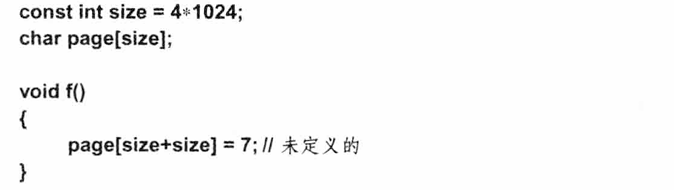

上述代码可能产生两种效果：把数值写人到一个毫不相关的内存区域或者导致一个硬件错误或异常。对于某个具体的实现来说，它不必非得在可能的结果中做出执择。但是一旦我们使用了强有力的优化工具，未定义行为的实际效果就变得不可预知了。如果存在一组合理的且易于实现的结果，则我们认为这样的特性是不确定的或依赖于实现的，而不认为它是未定义的。

程序员应该投人更多精力以确保程序中没有不确定的或未定义的部分。很多时候一些现有的工具可以帮助我们完成这一任务。

### 实现

C++的一个具体实现可以有两种形式：宿主式（hosted）和独立式（freestanding）（iso.17.6.1.3）。在宿主式实现中包含了C++标准（见30.2节）和本书描述的所有标准库功能；独立式实现包含的标准库功能可能会少一些，但是肯定包含下面列举的这些。

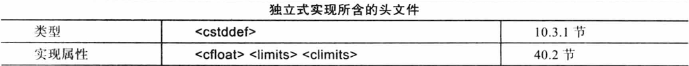

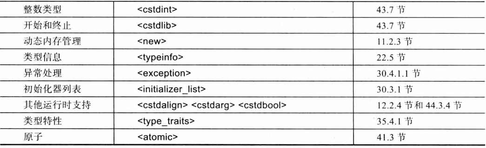

在那些只提供最基本的操作系统功能的环境中，常采用独立式实现。其他很多实现也会设置一个非标准的可选项，它允许程序员在规模较小且主要用于硬件操作的程序中把异常处理模块排除在外。

### 基本源程序字符集

C++标准以及本书用到的示例程序都是基于基本源程序字符集（basicsourcecharacterset）写成的，该字符集包括字母、数字、图形化字符和空白字符等。这些字符源于国际7位字符集ISO646-1983的美国版本，也就是我们熟悉的ASCII（ANSI3.4-1968）字符集。如果程序运行的环境使用的是其他字符集，可能会产生一些问题：

- ASCII字符集含有标点符号和操作符号（比如【、}和！），但是其他字符集可能没有。
- 有的字符本身没有一种可见的表示形式，我们需要为它们设计符号（比如换行符和“值为17的符号”）。
- ASCII字符集中不包含那些英语之外的其他语言的字符（比如、P和E））。

要想在源代码中使用扩展字符集，编程环境需要把扩展字符集映射为基本源程序字符集。映射的方式有几种，其中之一是使用通用字符集名字（见6.2.3.2节）。

## 类型

观察下面的式子：

```
x=y+f(2);
```

要想让这个式子在C++程序中有效，必须提前声明好名字×、y和f。换句话说，程序员必须确保名字×、y和f对应的实体确实存在，且对于它们的类型来说=（赋值）、+（加法）和（）（函数调用）是有意义的。

C++程序中的每个名字（标识符）都对应一种数据类型。该类型决定了这个名字（即该名字代表的实体）能执行哪些运算以及如何执行这些运算。例如：

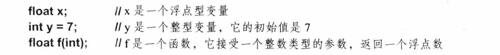

有了这几条声明语句，一开始的那个式子就有意义了。因为我们把y声明成int类型，所以能给它赋值，也能把它作为+的运算对象；因为我们把f声明成接受int参数的函数，所以能用整数值2调用它。

本章介绍基本类型（见6.2.1节）和声明（见6.3节），其中的示例程序仅用于描述语法特性，并不能解决什么实际问题。后面的章节会陆续引人一些应用面广且有实际意义的例子。本章介绍的内容是构成C++程序所需的最基本元素，读者必须了解这些元素以及与之有关的技术和语法，这样才有能力用C++编写出一段真正的代码，同时也才有可能读懂别人编写的代码。不过，也不是说必须掌握本章提到的每一个细节之后才能继续学习后续章节。建议读者先泛读本章，记下有哪些主要的概念，在以后用到的时候再返回来深人研究。

### 基本类型

C++包含一套基本类型（fundamentaltype），这些类型对应计算机最基本的存储单元并且展现了如何利用这些单元存储数据。

6.2.2节布尔值类型（bool）

6.2.3节字符类型（比如char和wchar_t）

6.2.4节整数类型（比如int和longlong）

6.2.5节浮点数类型（比如double和longdouble）

6.2.7节void类型，用以表示类型信息缺失

基于上述类型，我们可以用声明符构造出更多类型：

7.2节指针类型（比如int*）

7.3节数组类型（比如char)

7.7节引l用类型（比如double&和vector<int>&&）

除此之外，用户还能自定义类型：

8.2节数据结构和类（第16章）

8.4节枚举类型，用以表示特定值的集合（enum和enumclass）

其中，布尔值、字符和整数统称为整型（integraltype），整型和浮点型进一步统称为算术类型（arithmetictype）。我们把枚举类型和类（第16章）称为用户自定义类型（user-definedtype)，因为用户必须先定义它们，然后才能使用；这一点显然与基本类型无须声明可以直接使用的方式不同。与之相反，我们把基本类型、指针和引用统称为内置类型（built-intype）。标准库提供了很多种精妙的用户自定义类型（第4章和第5章）。

整型和浮点型包含的具体类型很多，它们的尺寸各不相同，程序员可以根据计算任务所需的存储空间大小、精度和表示范围选择适当的类型（见6.2.8节）。在设计这些类型时，我们假设计算机系统的字节可以存放字符、字可以存放和计算整数值、某些实体可以执行浮点计算，而内存地址可以用来引用或指向上述实体。C++的基本类型以及指针和数组以一种与实现无关的方式把这些机器级别的思想和概念呈现在程序员面前，供他们使用。

对于大多数应用来说，我们用bool表示布尔值、用char表示字符、用int表示整数值、用double表示浮点数。其他基本类型可以看做上述类型的变形，只有当程序在性能优化、兼容性或其他方面有所要求时才会用到它们；一般情况下，前面四种类型已经足够了。

### 布尔值

一个布尔变量（bool）的取值或者是true或者是false，布尔变量常用于表示逻辑运算的结果。例如：

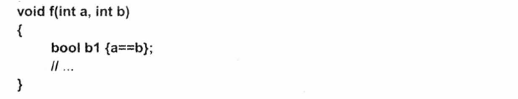

如果a和b的值相等，则b1变成true；否则b1的值是false。

有的函数被用来检验某个条件（谓词）是否成立，我们常常将这类函数的返回值类型设为bool。例如：

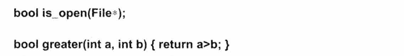

根据定义，当我们把布尔值转换成整数时，true转为1而false转为0。反之，整数值也能在需要的时候隐式地转换成布尔值，其中非0整数值对应true而0对应false。例如：

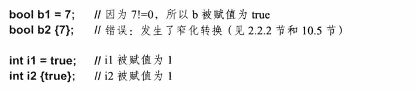

如果你既想使用0-初始化器列表防止窄化转换的发生，同时又确实想把int转换成bool，则可以显式声明如下：

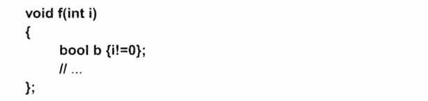

在算术逻辑表达式和位逻辑表达式中，bool被自动转换成int，编译器在转换后的值上执行整数算术运算以及逻辑运算。如果最终的计算结果需要转换回bool，则与之前介绍的一样，0转换成false而非O值转换成true。例如：

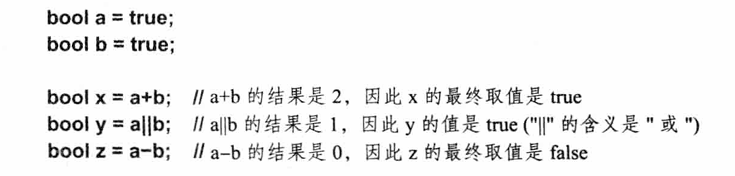

如有必要，指针也能被隐式地转换成bool（见10.5.2.5节）。其中，非空指针对应true，值为nullptr的指针对应false。例如：

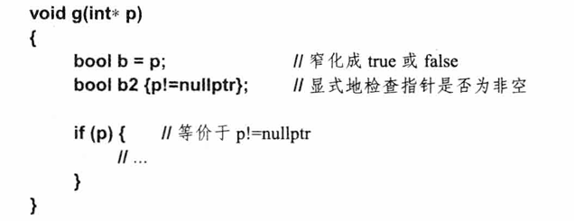

与if（p!=nullptr)相比，我觉得if(p)更好，它不但简洁而且可以直接表达“p是否有效”的含义，使用if(p)也不太容易出错。

### 字符类型

常用的字符集和字符集编码方式有很多。为了反映和描述这种多样性，C++提供了一系列字符类型：

- char：默认的字符类型，用于程序文本。char是C++实现所用的字符集，通常占8位。
- signedchar：与char类似，但是带有符号；换句话说，它既可以存放正值也可以存放负值。
- unsignedchar：与char类似，但是不带符号。
- wchar_t：用于存放Unicode（见7.3.2.2节）等更大的字符集。wchar_t的尺寸依赖于实现，确保能够支持实现环境中用到的最大字符集（第39章）。
- char16_t：该类型存放UTF-16等16位字符集。
- char32_t：该类型存放UTF-32等32位字符集。

这是6种不同的字符类型（除了后缀_t常用于指代别名之外，见6.5节）。在具体的实现版本中，char类型可能会和signedchar或者unsignedchar完全等效。但不管怎么样，我们还是把这3个名字看成完全独立的3种类型。

一个char类型的变量存放一个字符，字符的种类由实现版本所用的字符集决定。例如：

```
char ch='a';
```

绝大多数情况下char占8个二进制位，因此可以保存256个不同的值。一般来说，该字符集是ISO-646的某个变种，比如ASCII，你所用的键盘上的字符应该都会包含在内。由于该字符集只实现了部分标准化，所以有时候会带来一些问题。

字符集一些可能的变化必须引起我们的重视，比如支持不同自然语言的字符集，以及虽然支持的自然语言是同一种，但实现方式不同的字符集。我们最关心的是这些区别是否会影响C++的语法规则。如何在多语言、多字符集的环境中编程是一个更大也更有趣的命题，我们对它稍有涉及（见6.2.3节，36.2.1节和第39章）；但基本上这个问题已经远远超出了本书讨论的范围。

我们不妨认为所有字符集都包含十进制数字、英语的26个字母以及一些最基本的标点符号。但是下面这些对字符集的假设不一定成立，有可能带来一些问题：

- 8位字符集中的字符总数不超过127个（某些字符集提供了255个字符）。
- 字符集中只包含英文字母，没有其他字母（大多数欧洲大陆的语言都含有更多字母，如、p和β等）。
- 字母都是紧密相连的（EBCDIC在字母T和j之间留有空位）。
- 编写C++代码所需的字符都是可用的（某些国家的字符集中不含{}、【、］丨和\)。
- char占用一个字节。某些嵌人式处理器没有按字节访问内存的硬件，因此char占4个字节。另外，程序员也可以用16位的Unicode字符集编码基本char类型。

读者最好不要对对象的表示形式做出任何主观假设，对于字符尤其如此。

在编程环境所用的字符集中，每个字符都对应一个整数值。例如，在ASCII字符集中字符b'的值是98。下面这个小程序的功能是，你可以查看任意字符对应的整数值：

```
void intval()
{
	for (char c; cin >> c;)
 		cout<<"the value of"<< c <<" is "<< int{c} <<'\n';
}
```

我们用符号intc}得到字符c对应的整数值（“用c构建的int”）。既然char能转换成int，那么随之而来的问题是：char是有符号的还是无符号的？一个8位的字节所能容纳的256个值既可以被看成0~255，也能被看成是-127~127。注意：不是像你想象的-128~127。因为C++标准支持使用补码的硬件设备，而补码会排除掉一个值，所以如果我们使用-128的话代码就不容易移植了。不幸的是，char到底是带符号的还是无符号的是个依赖于实现的问题。为了解决这一问题，C++提供了两种含义更明确的字符类型：signedchar存放-127~127之间的值；unsignedchar存放0~255之间的值。幸运的是，问题只出现在0~127之外的值，而绝大多数常用的字符事实上不会受到干扰。

把超过上述范围的值存人一个普通的char会带来一定移植性方面的问题。如果你需要使用几种不同的char或者你需要把整数值存在char变量中，请参阅6.2.3.1节。

请注意，字符类型属于整型（见6.2.1节）。因此，我们可以在字符类型上执行算术运算和位逻辑运算（见10.3节）。例如：

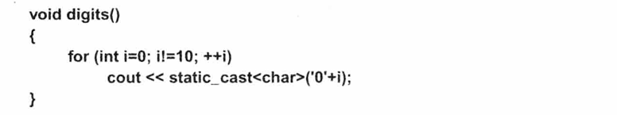

上面的代码把10个阿拉伯数字输出到cout。字符字面值常量'0'先转换成它对应的整数值，再与i相加；所得的int再转回char并被输出到cout。‘O'+i得到的结果本来是一个int，因此如果不加上static_cast<char>的话，输出的结果将会是48，49...，而不是0，1.….

#### 带符号字符和无符号字符

char类型到底带不带符号是依赖于实现的，这可能会带来一些意料之外的糟糕结果。例如：

```
char c=255；//255的二进制表示是“全1形式"，对应的十六进制是0xFF
int i=c;
```

i的值是几？不幸的是，答案是未定义的。如果在运行环境中一个字节占8位，则答案依赖于char的“全1形式”在转换为int时是何含义。若机器的char是无符号的，则答案是255；反之，若机器的char是带符号的，则答案是－1。在此例中，因为字面值255有可能会转换成char值-1，所以编译器可能会发出警告。但是C++并没有某种通用的机制来检测这种问题。一个可能的解决方案是放弃使用普通char而只使用特定的char类型。不过像strcmp(）这样的标准库函数通常只接受普通的char（见43.4节）。

虽然从本质上来说，char的行为无非与signedchar一致或者与unsignedchar一致，但这3个名字代表的类型的确各不相同。我们不能混用指向这3种字符类型的指针，例如：

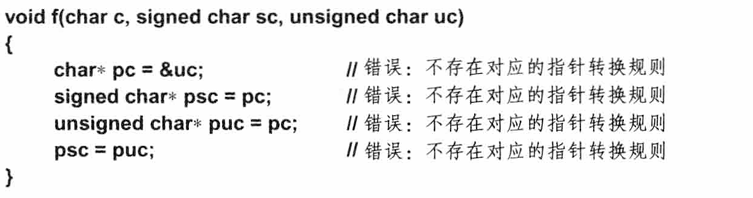

3种char类型的变量可以相互赋值，但是把一个特别大的值赋给带符号的char（见10.5.2.1节）是未定义的行为。例如：

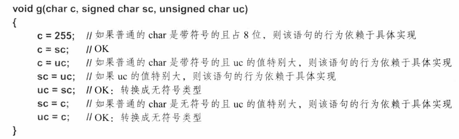

再举个例子，假设char占8位：

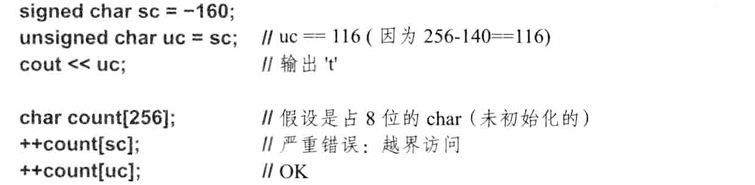

如果你从始至终都使用普通的char并且尽量避免负值，则上面这些潜在的错误不太可能发生。

#### 字符字面值常量

字符字面值常量（characterliteral）是指单引号内的一个字符，如'a'和'0'等。字符字面值常量的数据类型是char，它可以隐式地转换成当前机器所用字符集中对应的整数值。例如，如果你的机器使用的是ASCII字符集，则'0'的值是48。建议程序员尽量使用字符字面值常量，而不要直接使用对应的十进制数值，显然前者的可移植性更强。

一些字符有一个以反斜线\开头的标准名字，我们称之为转义字符：

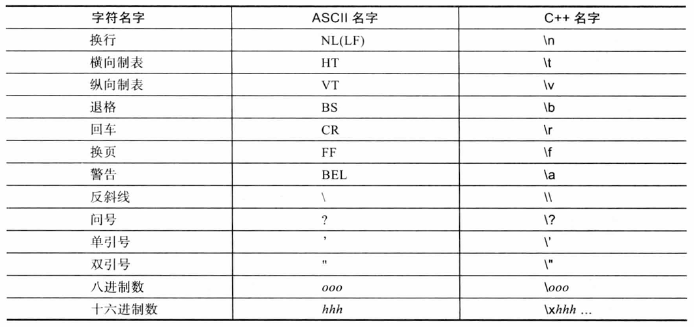

不要被它们的外表迷惑，它们都是货真价实的单字符。

我们可以把字符集中的字符表示成一个1~3位的八进制数（\后紧跟八进制数字）或者表示成十六进制数（×后紧跟十六进制数字）。其中，序列里十六进制数字的数量没有限制。如果遇到了第一个不是八进制数字或十六进制数字的字符，则表明当前的八进制序列或十六进制序列已经结束。例如：

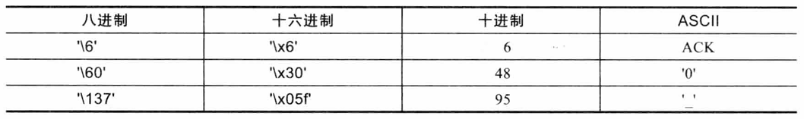

上述规则使得我们不但可以设法表示出字符集中的每一个字符，而且能把这些字符嵌入到一个长字符串中（见7.3.2节）。但是，一旦我们在程序中使用了字符对应的数字形式，这样的程序就无法在使用不同字符集的机器间移植了。

有时候程序员会把多个字符放在一对单引号内，比如'ab'。这种用法已经过时，它的效果完全依赖于实现，我们最好避免这种用法。多字符字面值常量的数据类型是int。

当我们在字符串中嵌入八进制数字常量时，常规的做法是使用3个数字。这样的用法稳定且易于解读，我们不必担心常量之后的字符到底是不是数字。对于十六进制数字常量来说，我们使用两个数字。考虑如下的示例：

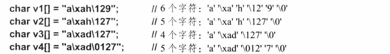

宽字符字面值常量形如L'ab'，它的数据类型是wchar_t。单引号内字符的数量及其含义依赖于具体实现。

C++程序可以操作Unicode等其他字符集，这些字符集的规模远不止ASCII的127个字符这么多。大字符集中的字面值常量通常表示成4个或8个十六进制数字，其前缀是u或者U。例如：

```
U\UFADEBEEF'
u"luDEAD'
u"\xDEAD'
```

对于任意的十六进制数字X而言，较短的表示形式u\uXXXX'与较长的表示形式U"U0000XXXX'是等价的。但是长度值不能是4和8之外的其他数字，否则会造成词法错误。ISO/IEC 10646标准定义了上述十六进制数值的含义，这样的值称为通用字符名字（universal character name）。在C++标准中，iso.2.2、iso.2.3、iso.2.14.3、iso.2.14.5和iso.E等处解释了通用字符名字。

### 整数类型

与char类似，整数类型也包含“普通的”int、signed int和unsigned int。整数还可以划分成另外4种形式：short int、“普通的”int、long int和long long int。其中，long int即long，而long long int即long long。类似地，short是short int的同义词，unsigned是unsigned int的同义词，而signed是signed int的同义词。读者要注意，千万不能想当然地揣测long short int等价于int，压根儿没有long short int这种类型。

当我们把存储空间看成是二进制位的数组时，可以考虑使用unsigned整数类型。但是有的程序员试图用unsigned取代int来表示正整数，并且宣称这样做可以多利用1位，这样的想法有点不切实际。尽管他们试图通过声明unsigned类型的变量来确保某些值为正，但是这种担保并不可靠，因为程序中随处都是隐式类型转换（见10.5.1节和10.5.2.1节），一旦发生了隐式类型转换，谁也不知道后果会怎样。

一个不加修饰的int通常是带符号的，这一点与char不太一样。带符号的int和普通int不是两种类型，前者更像是后者的等价词，只不过语义上更明确一些。

如果你需要更精细地控制整数的尺寸，可以使用<cstdint>中定义的别名（见43.7节）。这些别名包括int64_t（明确规定占用64位的带符号整数）、uint_fast16_t（至少占用16位的无符号整数，一般被认为是最快的整数）和int_least32_t（至少占用32位的带符号整数，类似于int）等。事实上，常规的几种整数类型都对最小尺寸做了很好的定义（见6.2.8节），因此<cstdint>显得有点儿多余，建议程序员谨慎使用。

在标准整数类型之外，一个具体的实现还可能提供某些扩展整数类型（extendedintegertype，带符号的以及无符号的）。这些新类型的行为必须与标准整数类似并且可以参与类型转换，也对应整数字面值常量。唯一的区别是它们的表示范围更大（占用更多空间）。

#### 整数字面值常量

整数字面值常量分为3种：十进制、八进制和十六进制。其中十进制字面值常量最常见，也最符合用户的使用习惯：

```
7 1234 976 12345678901234567890
```

当字面值常量表示的数值太大以至于在C++中无法表达时，编译器会发出警告；但是只有使用0初始化器的形式才会报错（见6.3.5节）。

以×或X（0x或0X）开头的字面值常量表示一个十六进制数值（基是16）；以0开头但是后面没有×或×的字面值常量表示一个八进制数值（基是8）。例如：

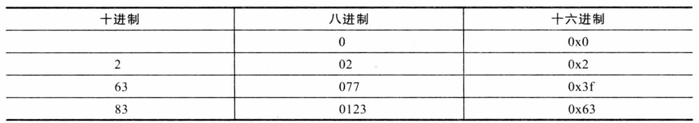

在十六进制中，a、b、C、d、e、f及其大写形式分别表示10、11、12、13、14和15。用八进制和十六进制表示二进制比较有效，但如果用它们表示纯数字，可能会产生意想不到的后果。举个例子，如果某台机器用16位补码表示int，则0xfff对应十进制数-1；但如果表示int的二进制位不只16位，则0xfff对应的值就可能变成65535了。

后缀U用于显式指定unsigned字面值常量，与之类似，后缀L用于显式指定long字面值常量。例如，3是一个int，3U的类型是unsigned int而3L的类型是long int。

多个后缀可以组合在一起使用，例如：

```
cout << OxFOUL << '' << OLU <<'\n';
```

如果没有显式地指定后缀，编译器会根据整数字面值常量的值以及当前实现的整数尺寸为它分配一种合适的类型（见6.2.4.2节）。

不要滥用含义不明显的常量，最好只在给const（见7.5节）、constexpr（见10.4节）和枚举（见8.4节）赋初值时使用。

#### 整数字面值常量的类型

通常情况下，整数字面值常量的类型由它的形式、取值和后缀共同决定：

- 如果它是十进制数且没有后缀，则它的类型是下面几种类型中能够表达它的值且尺寸最小的那个：int，long int，long long int。
- 如果它是八进制数或十六进制数且没有后缀，则它的类型是下面几种类型中能够表达它的值且尺寸最小的那个：int，unsigned int，long int，unsigned long int，long long int, unsigned long long int。
- 如果它的后缀是u或U，则它的类型是下面几种类型中能够表达它的值且尺寸最小的那个：unsigned int, unsigned long int, unsigned long long int。
- 如果它是十进制数且后缀是||或LL，则它的类型是下面几种类型中能够表达它的值且尺寸最小的那个：long int，longlong int。
- 如果它是八进制数或十六进制数且后缀是I或L，则它的类型是下面几种类型中能够表达它的值且尺寸最小的那个：long int，unsignedlong int，longlong int， unsigned long long int. 
- 如果它的后缀是ul，lu，uL，Lu，UI，IU，UL或LU，则它的类型是下面几种类型中能够表达它的值且尺寸最小的那个：unsignedlong int，unsigned long long int。
- 如果它是十进制数且后缀是Ⅱl或LL，则它的类型是long long int。 
- 如果它是八进制数或十六进制数且后缀是Ⅱ或LL，则它的类型是下面几种类型中能够表达它的值且尺寸最小的那个：longlong int，unsignedlong long int。 
- 如果它的后缀是llu，IIU，ull，UII，LLu，LLU，uLL或ULL，则它的类型是 unsigned long long int。

例如，对于字面值常量100000来说，在32位int的机器上它的类型是int，而在16位int和32位long的机器上它的类型是longint。类似地，0XA0o0在32位int的机器上类型是int而在16位int的机器上的类型是unsigned int。我们可以使用后缀来规避上述对于实现的依赖性：在任何机器上1000ooL的类型都是longint，0XA000U的类型都是unsigned int。

### 浮点数类型

浮点数类型用于表示浮点数。浮点数是实数在有限内存空间上的一种近似表示。有3种浮点数类型：float（单精度）、double（双精度）和longdouble（扩展精度）。

所谓单精度、双精度和扩展精度的确切含义是依赖于具体实现的。程序员只有对浮点运算有非常深刻的理解才能在解决实际问题时做出最好的选择。如果你做不到这一点，最好向有经验的程序员寻求建议或者自学。实在不行就优先选择double类型，这是一种折中的选择，比较稳妥。

#### 浮点数字面值常量

默认情况下，浮点数字面值常量的类型是double。再说一次，编译器应该会在发现数据类型不足以表示给定值的时候发出警告。下面是一些浮点数字面值常量的示例：

```
1.23 .23 0.23 1. 1.0 1.2e10 1.23e-15
```

谨记在浮点数字面值常量内部不允许出现空格。例如，65.43e-21不是一个浮点数字面值常量，它更像是4个独立的词汇单元（并且会导致语法错误）：

65.43 e - 21

如果你希望定义一个float类型的浮点数字面值常量，则必须加上后缀f或F：

3.14159265f 2.0f 2.997925F 2.9e-3f

类似地，如果你希望定义一个long double类型的浮点数字面值常量，加上后缀I或L：

3.14159265L 2.0L 2.997925L 2.9e-3L

### 前缀和后缀

有一些前缀和后缀常被用来限定字面值常量的类型：

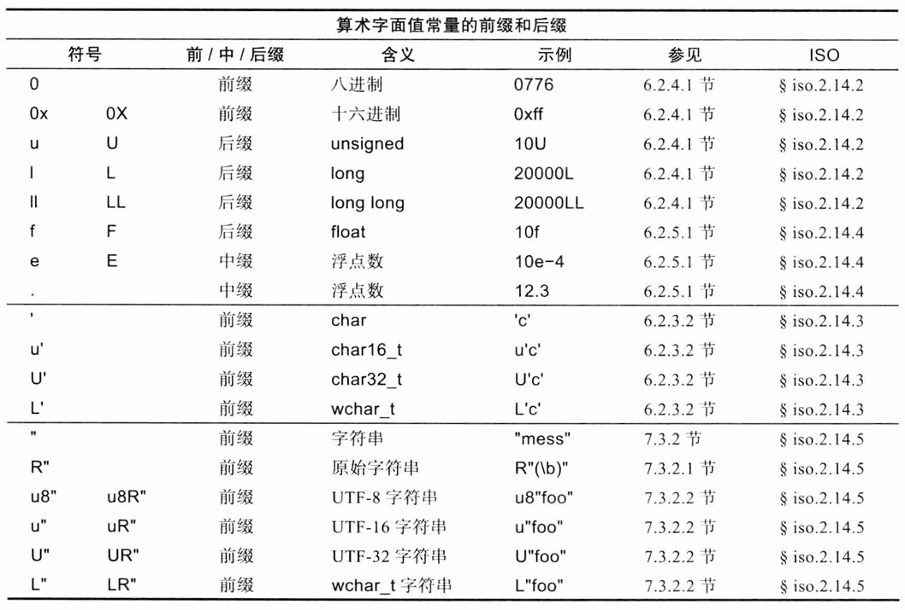

请注意，上表中的“字符串”是指“字符串字面值常量”（见7.3.2节），而非数据类型"std::string"。

我们当然可以把.和e看成是中缀，同时把R"和u8"看成分隔符的一部分，不过怎么命名并不重要。通过上表，我们的最终目标是把字面值常量的各种情况总结在一起，供读者了解和学习。

后缀I和L可以与u和U结合在一起使用，表达的数据类型是unsigned long。例如：

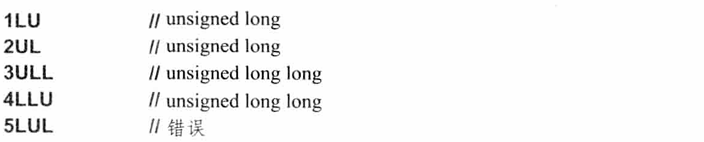

同样，后缀1和L也能用于表示浮点数字面值常量，表达的类型是long double。例如：

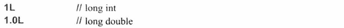

几种前缀R、L和u能结合在一起，如uR"\**(foo\(bar)**"。读者一定要对符号U的两种用法加以区分：一种是字符的前缀U，表示unsigned，另一种是字符串的前缀U，表示UTF32编码（见7.3.2.2节）。

此外，用户可以为自定义类型定义新的后缀。例如，我们可以定义一个新的字面值常量运算符（见19.2.6节）：

```
"foo bar"s	//是一个 std::string类型的字面值常量
123_km	//是一个Distance类型的字面值常量
```

不以_开始的后缀仅存在于标准库中。

### void

从语法结构上来说，void属于基本类型。但是它只能被用作其他复杂类型的一部分，不存在任何void类型的对象。void有两个作用：一是作为函数的返回类型用以说明函数不返回任何实际的值；二是作为指针的基本类型部分以表明指针所指对象的类型未知。例如：

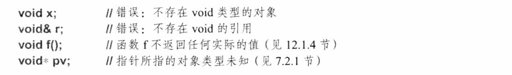

当我们声明一个函数时，必须指明返回结果的数据类型。从逻辑上来说，如果某个函数不返回任何值，也许我们会希望直接忽略掉返回值部分。但其实这种想法并不可行，它会违反C++的语法规则（&iso.A）。因此，我们使用void表示函数的返回值为空，此时void可以看成是一种“伪返回类型”。

### 类型尺寸

C++基本类型的某些方面是依赖于实现的（见6.1节），其中一个例子是int类型的尺寸。我曾经不止一次指出过这种依赖性的存在，并且建议程序员应该尽量避免依赖性带来的问题或者设法减少它对程序结果的影响。为什么呢？通常，如果程序员在几种不同的系统中编程或者使用不同的编译器编程，则他们必须特别关注依赖性的问题，否则的话，他们有可能得花费大量时间来定位并修改许多隐藏较深、不易察觉的程序错误。有的人宣称他们不太介意可移植性的问题，原因是这些人基本上只在一种系统上编程，而且武断地认为“当前编译器实现的就是真正的C++语言，没有其他了”。这显然是非常狭隘和短视的观点。如果你的程序真的有用，它不可避免地会被移植到其他系统中，此时别的程序员就不得不费时费力地去寻找和改正程序中受实现依赖影响的部分。此外，在一个大系统中，某部分程序常常需要用其他编译器编译；而且即使是你一直使用的编译器，它的不同版本之间也可能会有差异。显然，在编写程序的时候就对实现依赖性的问题给予足够重视并设法减少其负面影响要比事后弥补容易得多。

相对来说，限制依赖于实现的语言特性的影响比较容易；而要想限制依赖于系统的标准库功能就难多了。一种可行的措施是尽量使用那些比较通用的标准库功能。

我们之所以为整数类型、无符号类型和浮点数类型都分别设计了几种不同形式，目的是允许程序员从中选择最恰当的一种以充分利用硬件的特性。在许多机器上，不同的基本类型之间差异很大，这些差异体现在内存需求、内存访问时间和计算时间等方面。如果你深入了解某一机器，则做出执择的过程会比较容易，比如很容易为某一变量选择一种适用于当前机器的整数类型。显然，要想编写真正具有可移植性的程序非常困难。

下图展示了一组基本类型的集合以及一个字符串字面值常量（见7.3.2节）：

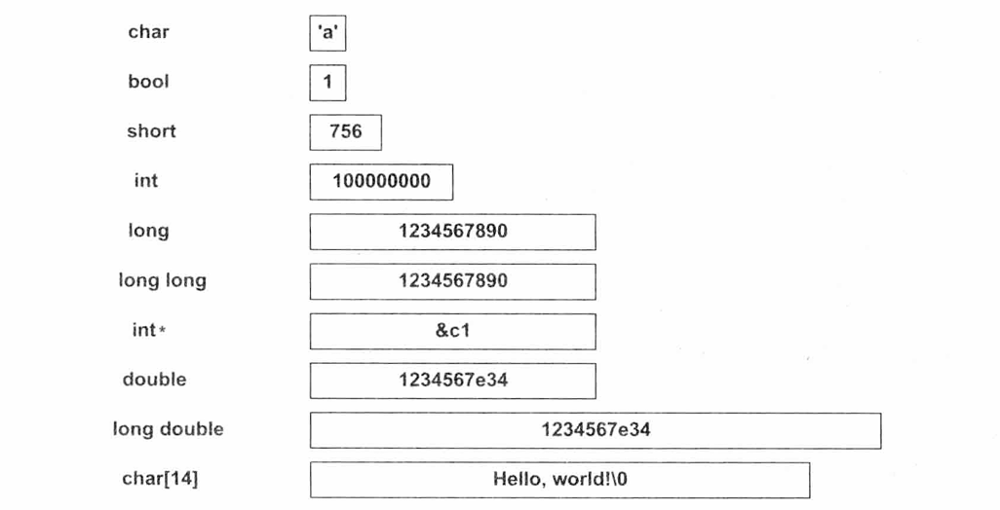

如果以上图的比例来计算（0.2英寸对应1个字节），则1M内存大概要向右延伸3英里（5千米）。

所有C++对象的尺寸都可以表示成char尺寸的整数倍，因此如果我们令char的尺寸为1，则使用sizeof运算符（见10.3节）就能得到任意类型或对象的尺寸。下面是C++对于基本类型尺寸的一些规定：

```
1=sizeof(char)≤sizeof(short)≤sizeof(int)≤sizeof(long)≤sizeof(long long)
1≤sizeof(bool)≤sizeof(long)
sizeof(char)≤sizeof(wchar_t)≤sizeof(long)
sizeof(float)≤sizeof(double)≤sizeof(long double)
sizeof(N)=sizeof(signed N)=sizeof(unsigned N)
```

其中，最后一行的N可以是char、short、int、long或者long long。C++规定char至少占8位，short至少占16位，long至少占32位。char应该能存放机器字符集中的任意字符，它的实际类型依赖于实现并确保是当前机器上最适合保存和操作字符的类型。通常情况下，char占据一个8位的字节。与之类似，int的实际类型也是依赖于实现的，并确保是当前机器上最适合保存和操作整数的类型。int通常占据一个4字节（32位）的字。上面这些假设是比较恰当的，但是我们很难做更多设定。比如，我们只能说char“通常”占据8位，因为确实也存在char占32位的机器。又比如我们决不能假定int和指针的尺寸一样大，因为在很多机器上（“64位体系结构”）指针的尺寸比整数大。最后请注意，下面两条假设并不成立：sizeof(long)<sizeof(long long)和sizeof(double)<sizeof(long double)。

通过使用sizeof函数，我们能发现基本类型的某些依赖于实现的特性，更多这样的特性包含在<limits>中。例如：

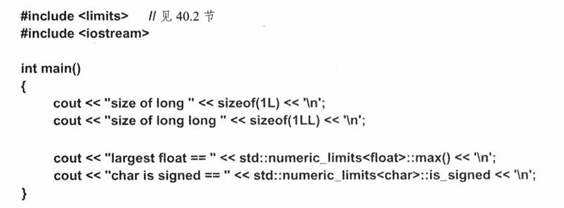

因为<limits>中定义的函数（见40.2节）是constexpr（见10.4节），所以可以用在需要常量表达式的上下文中，并且不会带来额外的运行时开销。

在赋值语句及表达式中可以自由地使用基本类型，编译器随时随地计算并转换变量的值以尽量做到不损失信息（见10.5节）。

如果某个值v能用T类型的变量确切地表达，则把v的类型转换成T是值保护的（valuepreseving）。我们最好避免使用那些做不到值保护的类型转换（见2.2.2节和10.5.2.6节）。

如果你需要使用某种特定尺寸的整数类型（比如16位的整数），应该事先#include标准库头文件<cstdint>。在<cstdint>中定义了很多类型（或类型别名，见6.5节），例如：

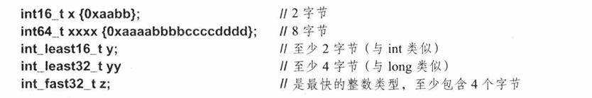

在标准库头文件<cstddef>中定义了一个别名，它被广泛用于标准库声明及用户代码：size_t是一个依赖于实现的无符号整数类型，用于表示任意对象所占的字节数。我们可以在需要保存对象尺寸的时候使用size_t，例如：

```
void* allocate(size_t n）;  //获得n个字节
```

类似地，<cstddef>还定义了一个带符号的整数类型ptrdiff_t，两个指针相减所得的元素数量可以保存在ptrdiff_t中。

### 对齐

对象首先应该有足够的空间存放对应的变量，但这还不够。在一些机器的体系结构中，存放变量的字节必须保持一种良好的对齐（alignment）方式，以便硬件在访问数据资源时足够高效（在极端情况下一次性访问所有数据）。例如，4字节的int应该按字（4字节）的边界排列，而8字节的double有时也应该按字（8字节）的边界排列。当然这些约定都是依赖于实现且用户不可见的，你也许写了几十年漂亮的C++代码却从来没有为对齐问题担心过。对齐只有在涉及对象布局的问题中比较明显：有时候我们会让struct包含一些“空洞”以提升整齐程度（见8.2.1节）。

alignof()运算符返回实参表达式的对齐情况，例如：

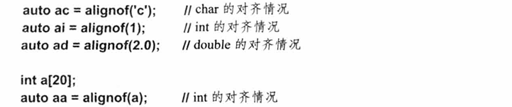

有时我们需要在声明语句中使用对齐，但是不允许形如alignof(x+y)的表达式；此时，我们可以使用类型说明符alignas: alignas(T)，它的含义是“像T那样对齐”。例如，我们用下面的语句为一些类型×的变量留出未初始化的存储空间：

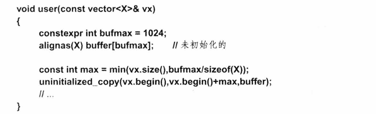

## 声明

在C++程序中要想使用某个名字（标识符），必须先对其进行声明。换句话说，我们必须指定它的类型以便编译器知道这个名字对应的是何种实体。例如：

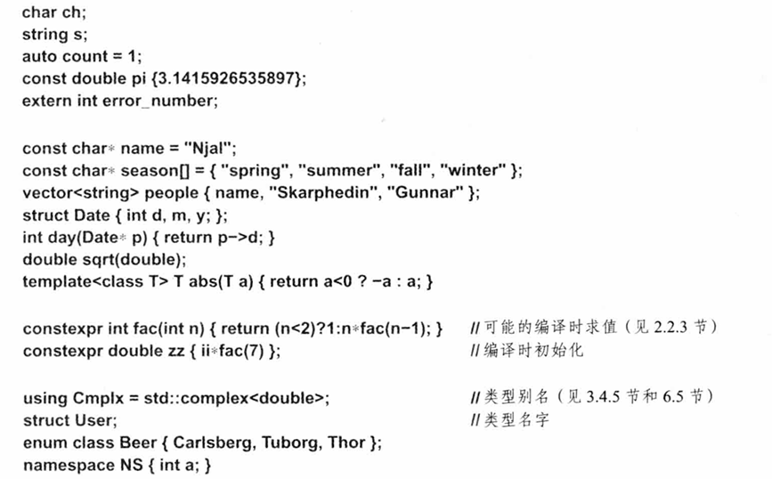

从上面这些例子可以看出，声明语句的作用不止把类型和名字关联起来这么简单。大多数声明（declaration）同时也是定义（definition）。我们可以把定义看成是一种特殊的声明，它提供了在程序中使用该实体所需的一切信息。尤其是当实体需要内存空间来存储某些信息时，定义语句把所需的内存预留了出来。还有一种观点认为声明是接口的一部分，而定义属于实现的范畴。在这种视角下，我们尽量用声明语句组成程序的接口。其中，同一个声明可以在不同文件中重复出现（见15.2.2节）。负责申请内存空间的定义语句不属于接口。

假定这些声明语句位于全局作用域中（见6.3.4节），则：


在上面这些声明语句中，只有3个不是定义：

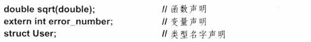

也就是说，要想使用它们对应的实体，必须先在其他某处进行定义。例如：

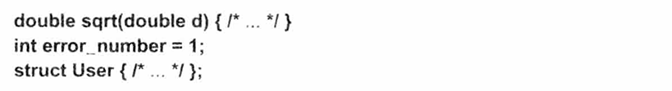

在C++程序中每个名字可以对应多个声明语句，但是只能有一个定义（关于#include的影响见15.2.3节）。

在同一实体的所有声明中，实体的类型必须保持一致。因此，下面的小片段包含两处错误：

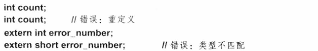

下面的语句则是正确的（关于extern的用法见15.2节）：

```
extern int error_number;
extern interror_number; //OK：多次声明
```

有的定义语句为它们定义的实体显式地赋“值”，例如：

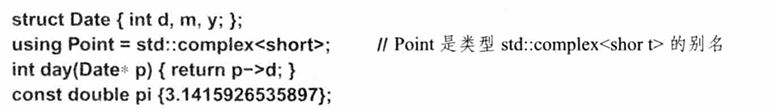

对于类型、别名、模板、函数和常量来说，这个“值”是不变的；而对于非const数据类型来说，初始值可能会在稍后被改变。例如：

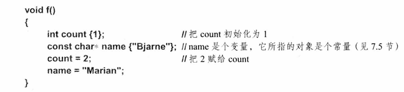

在这些定义语句中，只有两个没有指定值：

```
char ch;
string s;
```

关于变量何时以及以何种方式被赋予默认值请见6.3.5节和17.3.3节。对于任意的声明语句来说，只要它为变量指定了值，就是一条定义语句。

### 声明的结构

C++语法规定了声明语句的结构（iso.A）。这套语法最早从C的语法演化而来，历经四十多年的发展，变得相当复杂。在不做什么根本性简化的前提下，我们可以认为一条声明语句（依次）包含5个部分：

- 可选的前置修饰符（比如static和virtual）
- 基本类型（比如vector<double>和const int）
- 可选的声明符，可包含一个名字（比如p[7]、n和\*(*)[])
- 可选的后缀函数修饰符（比如const和noexcept）
- 可选的初始化器或函数体（比如={7,5,3}和{return x;}）

除了函数和名字空间的定义外，其他声明语句都以分号结束。请考虑下面这个C风格字符串数组的定义语句：

```
const char* kings[]={"Antigonus","Seleucus","Ptolemy"};；
```

此例中，基本类型是constchar，声明符是*kings[]，初始化器是=及其后的{}列表。

修饰符是指声明语句中最开始的关键字，如virtual（见3.2.3节和20.3.2节）、extern（见15.2节）和constexpr（见2.2.3节）等。修饰符的作用是指定所声明对象的某些非类型属性。

声明符由一个名字和一些可选的声明运算符组成。最常用的声明运算符包括：

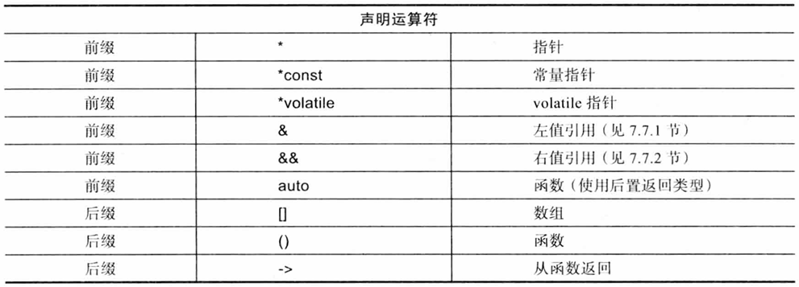

如果上面这些声明符都是前缀或者都是后缀的话，它们的用法就简单了。但实际上，\*、[]和（）的用法与在表达式中一致（见10.3节）。因此，\*是前缀，而[]和（)是后缀。后缀声明符的绑定效果比前缀声明符更紧密，所以char\*kings[]是char指针的数组，而char(*kings)是指向char数组的指针。如果我们想声明“数组的指针”或者“函数的指针”，则必须使用括号加以限定，具体的例子请见7.2节。

请注意，在声明语句中不允许省略数据类型。例如：

```
const c=7； //错误：缺少数据类型
gt(int a,int b） //错误：缺少数据类型

{
	return (a>b) ?a : b;
}

unsigned ui; //OK:“unsigned”即“unsigned int”
long li;  //OK：“long”即“long int”
```

早期版本的C和C++允许前两个例子所示的用法，它们认为当程序员没有指定数据类型时，int是默认的类型（见44.3节）；但是标准C++不允许这样做。所谓的“隐式int”规则会让源程序充满不可捉摸的错误，并且显得杂乱无章。

有的类型名字包含多个关键字，比如longlong和volatileint；还有一些类型名字看起来不像个名字，比如decltype(f(x)）（表示函数f(x）的返回值类型，见6.3.6.3节）。

41.4节介绍volatile修饰符。

6.2.9节介绍alignas（）修饰符。

### 声明多个名字

C++允许在同一条声明语句中声明多个名字，其中包含逗号隔开的多个声明符即可。例如，我们能以如下方式声明两个整数：

```
intx,y; //int x;int y;
```

读者千万要注意，在声明语句中，运算符只作用于紧邻的一个名字，对于后续的其他名字是无效的。例如：

```
int* p,y;  //确的含义是 int* p; int y; 而非 int* y;
int x, *q; //int x; int* q;
int v[10], *pv; //int v[10]; int* pv;
```

上面这些示例在同一条声明语句中包含了多个名字且加人了某些特殊的声明符，这会让程序看起来有点难懂，实际编程过程中最好避免这种用法。

### 名字

一个名字（标识符）包含若干字母和数字。第一个字符必须是字母，其中，我们把下划线_也看成是字母。C++对于名字中所含的字符数量未作限定。但是在具体实现中，某些部分并不受编译器的控制（尤其是链接器），而这些部分有可能会限制名字中字符的多少。某些运行时环境要求扩展或缩减能出现在标识符中的字符集规模。此时，对可接受字符的扩充（比如允许名字中出现字符$）会造成程序无法移植。C++关键字（比如new和int，见6.3.3.1节）不能用作用户自定义实体的名字。一些有效的标识符如下所示：

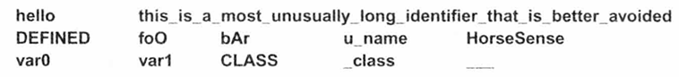

下面这些字符序列不能作为标识符：

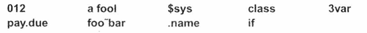

以下划线开头的非局部名字表示具体实现及运行时环境中的某些特殊功能，应用程序中不应该使用这样的名字。类似地，包含双下划线（\_\_）的名字和以下划线开头紧跟大写字母的名字（比如_F00）都有特殊用途（见17.6.4.3节）。

编译器在编译代码时总是优先寻找能构成名字的最长的字符串。因此，var10整体是个名字，而不是名字var后跟着数字10。同样，elseif也是个名字，而非关键字else后跟着关键值if。

标识符的命名区分大小写，因此Count和count是两个不同的名字。显然，仅靠字母的大小写来区分名字不太合适。一般情况下，我们应该尽量避免使用过于相似的名字。举个例子，在很多字体中，字母“。”的大写形式（O）与数字0很难区分，字母“L”的小写形式（1)）、字母“i”的大写形式（1）与数字1也很难区分。因此，10、IO、11、Ⅱ和I1I显然是一组非常糟糕的名字。不是所有字体都有这个问题，但大多数确实如此。

在一个范围较大的作用域中，我们应该使用相对较长且有明确含义的名字，比如vector、Window_with_border和Department_number。然而，在范围较小的作用域中使用一些长度较短但是约定俗成的名字也不失为一种好的选择，这些名字包括x、i、p等。函数（第12章）、类（第16章）和名字空间（见14.3.1节）可以帮助我们限定一个较小的作用域。通常，我们令那些频繁使用的名字相对较短，而让较长的名字对应一些很少用到的实体。

在为实体命名时，我们应该尽量让名字反映实体的含义而非其实现细节。例如，当我们用vector存储电话号码时（见4.4节），变量的名字用phone_book比用number_book更好。在使用某些具有动态类型系统或弱类型系统的语言编程时，程序员习惯在实体的名字中掺杂进类型信息（比如用pcname作为某个char*的名字，或者用icount作为某个int计数变量的名字），但是在C++中我们不建议这样做：

- 把类型信息加到名字里降低了程序的抽象水平，尤其是不利于泛型编程（基本机理是其中的某个名字可以指向不同类型的实体）。
- 编译器比程序员更擅长记录和追踪类型信息。
- 一旦你想改变某个名字的类型（用std::string存放名字），就必须更改程序中所有用到该名字的地方（否则，已经嵌入名字的类型信息就名不副实了）。
- 随着你用到的类型越来越多，你设计的缩写集会越来越大，有时含糊不清，有时过于啰嗦。

简而言之，为标识符命名称得上是一门艺术。

程序员最好遵循某些约定俗成的命名风格，并且坚持下去，不要轻易改变。例如，用户自定义类型名的首字母大写，非类型实体名的首字母小写（比如Shape和current_token）。又如在宏定义中全都使用大写字母（前提是当你不得不使用宏时，见12.6节，比如HACK)，在其他场合绝对不要这样做（即使非宏常量也不行）。用下划线把标识符中的单词隔开，number_of_elements比numberOfElements的可读性更好。然而，保持命名风格的统一也不是一件容易的事，毕竟程序通常是由很多来源不同的片段组合而成的，它们遵循的风格可能各不相同，各有各的道理。谨记对缩写的使用应该保持一致。请注意，C++语言和标准库中的类型名字都是小写，有时候这条线索可以帮助我们判断某个类型名字是否来源于C++标准。

#### 关键字

C++的关键字如下表所示：

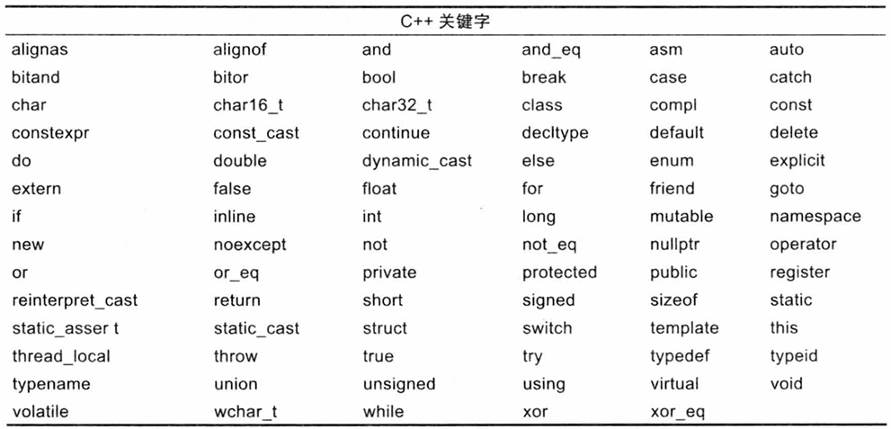

此外，export被留在以后使用。

### 作用域

声明语句为作用域引人了一个新名字，换句话说，某个名字只能在程序文本的某个特定区域使用。

- 局部作用域（localscope）：函数（第12章）或lambda表达式（见11.4节）中声明的名字称为局部名字（localname）。局部名字的作用域从声明处开始，到声明语句所在的块结束为止。其中块（block）是指用一对包围的代码片段。对于函数和lambda表达式最外层的块来说，参数名字是其中的局部名字。
- 类作用域（classscope）：如果某个类位于任意函数、类（第16章）和枚举类（见8.4.1节）或其他名字空间的外部，则定义在该类中的名字称为成员名字（membername）或类成员名字（classmembername）。类成员名字的作用域从类声明的{开始，到类声明的结束为止。
- 名字空间作用域（namespacescope）：如果某个名字空间位于任意函数（第12章）、lambda表达式（见11.4节）、类（第16章）和枚举类（见8.4.1节）或其他名字空间的外部，则定义在该名字空间中的名字为名字空间成员名字（namespacemembername）。名字空间成员名字的作用域从声明语句开始，到名字空间结束为止。名字空间名字能被其他翻译单元访问（见15.2节）。
- 全局作用域（globalscope）：定义在任意函数、类（第16章）、枚举类（见8.4.1节）和名字空间（见14.3.1节）之外的名字称为全局名字（globalname）。全局名字的作用域从声明处开始，到声明语句所在的文件末尾为止。全局名字能被其他翻译单元访问（见15.2节）。从技术上来说，全局名字空间也是一种名字空间。因此，我们可以把全局名字看成是一种特殊的名字空间成员名字。
- 语句作用域（statementscope）：如果某个名字定义在for、while、if和switch语句的()部分，则该名字位于语句作用域中。它的作用域范围从声明处开始，到语句结束为止。语句作用域中的所有名字都是局部名字。
- 函数作用域（functionscope）：标签（见9.6节）的作用域是从声明它开始到函数体结束。

在块内声明的名字能隐藏外层块及全局作用域中的同名声明。换句话说，一个已有的名字能在块内被重新定义以指向另外一个实体。退出块后，该名字恢复原来的含义。例如：

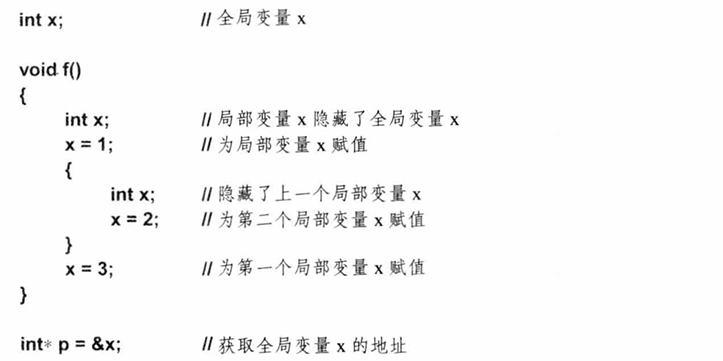

隐藏名字的现象在规模较大的程序中比较普遍，很难避免。然而，程序的读者经常会遗忘某个名字被隐藏（或者说遮住，shadowed）的事实。由名字隐藏造成的程序错误不太多，因此一旦出错极难发现。程序员应该尽量避免隐藏名字。如果你给全局变量或者大函数中的局部变量起类似于i或×的名字，无异于自找麻烦。

我们可以使用作用域解析运算符::访问被隐藏了的全局名字，例如：


我们无法使用被隐藏的局部名字。

非类成员名字的作用域始于它的声明点，即完整的声明符之后且初始化器之前的位置。这一规定意味着我们甚至能用某个名字作为它自己的初始值。例如：

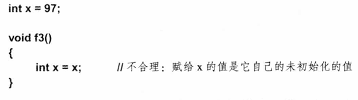

一个严谨的编译器应该能在遇到变量未初始化即使用的现象时发出警告。有一种现象看起来有点奇怪，但却是合理的，即在同一个块内有可能同一个名字所指的是两个完全不同的实体，并且我们没有使用::运算符。例如：

```
int x= 11;

void f4(){  //不合理：在同一个作用域内使用了两个名字都是x的对象

	int y = x;  //使用全局变量x，结果是y=11
	int x= 22;
	y = x;		//使用局部变量x，结果是y=22
}
```

再次提醒，在你的程序中最好避免出现这种小问题。我们通常认为函数的实参是声明在函数的最外层块中的，例如：

```
void f5(int x){
	int x;  //错误
}
```

因为×在同一个作用域中定义了两次，所以上述程序存在错误。

在for语句中引l入的名字是该语句的局部名字（位于语句作用域内）。因此，在同一个函数内，我们可以在好几个循环中使用同一个便于理解的名字。例如：

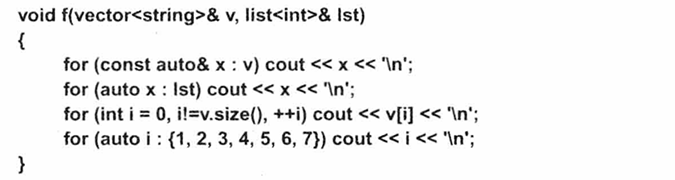

在这个函数中，不存在名字冲突。如果在if语句的分支中有一条声明语句，并且它是该分支唯一的语句，则这种用法是不允许的（见9.4.1节）。

### 初始化

顾名思义，初始化器就是对象在初始状态下被赋予的值。初始化器有四种可能的形式：

```
X a1{v);
X a2={v};
X a3=v;
X a4(v);
```

在这些形式中，只有第一种不受任何限制，在所有场景中都能使用。我强烈建议程序员使用这种形式为变量赋初值，它含义清晰，与其他形式相比不太容易出错。不过，第一种初值形式(a1)在C++11新标准中刚刚被提出，因此在老代码中使用的都是后面三种形式。其中，使用=的两种形式是从C语言继承而来的。俗话说习惯成自然，即使是我，也会（不总是）在遇到用简单值初始化简单变量的时候，不自觉地使用=。例如：

```
int x1=0;
char c1='z';
```

然而，在面对稍微复杂一点的情况时，我还是建议读者使用0。使用0的初始化称为列表初始化（listinitialization），它能防止窄化转换（iso.8.5.4）。这句话的意思是：

- 如果一种整型存不下另一种整型的值，则后者不会被转换成前者。例如，允许char到int的类型转换，但是不允许int到char的类型转换。
- 如果一种浮点型存不下另一种浮点型的值，则后者不会被转换成前者。例如，允许float到double的类型转换，但是不允许double到float的类型转换。
- 浮点型的值不能转换成整型值。
- 整型值不能转换成浮点型的值。

例如：

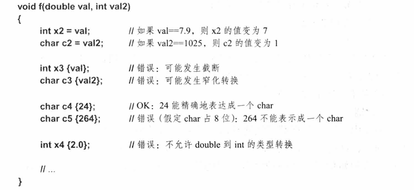

关于内置类型的转换规则请见10.5节。

当我们使用auto关键字从初始化器推断变量的类型时，没必要采用列表初始化的方式。而且如果初始化器是{}列表，则推断得到的数据类型肯定不是我们想要的结果（见6.3.6.2节)。例如：

```
auto z1 {99};  //z1的类型是initializer_list<int>
auto z2=99; //z2的类型是int
```

因此当使用auto的时候应该选择=的初始化形式。

当我们构建某些类的对象时，可能有两种形式：一种是提供一组初始值；另一种是提供几个实参，这些实参不一定是实际存储的值，可能有别的含义。一个典型的例子是存放整数的vector:

```
 vector<int> v1{99};  //v1包含1个元素，该元素的值是99
 vector<int> v2(99);  //v2包含99个元素，每个元素都取默认值0
```

在上述代码中，我采用(99)的形式显式调用构造函数以实现第二种效果。大多数数据类型不提供这种语义含糊的初始化形式，即使是很多vector也不会；例如：

```cpp
vector<string> v1{"hello!"};  //v1含有1个元素，该元素的值是“hello!
vector<string> v2("hello!");  //错误：vector的任何构造函数都不接受字符串字面值常量作为参数
```

因此，除非你有充分的理由，否则最好使用{}初始化。空初始化器列表{}指定使用默认值进行初始化，例如：

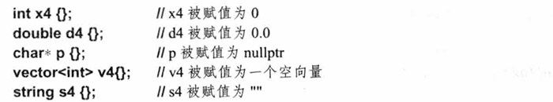

大多数数据类型都有默认值。对于整数类型来说，默认值是数字0的某种适当形式。指针的默认值是nullptr（见7.2.2节）。用户自定义类型的默认值（如果存在的话）由该类型的构造函数决定（见17.3.3节）。

对于用户自定义类型来说，直接初始化（允许隐式类型转换）和拷贝初始化（不允许隐式类型转换）可能会有所不同。相关细节请见16.2.6节。

特定类型对象的初始化问题将在后续章节中逐一介绍：

- 指针，见7.2.2节、7.3.2节和7.4节。
- 引用，见7.7.1节（左值）和7.7.2节（右值）。
- 数组，见7.3.1节和7.3.2节。
- 常量，见10.4节。
- 类，见17.3.1节（不使用构造函数），17.3.2节（使用构造函数），17.3.3节（默认构造函数），17.4节（成员和基类），17.5节（拷贝和移动）。
- 用户定义的容器，见17.3.4节。

#### 缺少初始化器

包括内置类型在内的很多类型都可能遇到缺少初始化器的情况。如果这真的发生了（事实上经常发生），那么事情会变得有点复杂。如果你不想面对这种复杂的情况，一定要时时记得初始化变量。未初始化变量的一种最有用的场景是当我们使用一个大的输人缓冲区时，例如：

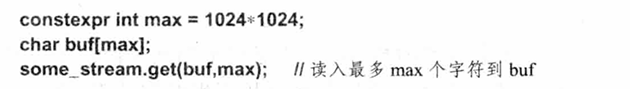

要想初始化buf其实很容易：

```cpp
char buf[max] {};   //把每个字符都初始化成0
```

但是这样做显然是多余的，而且可能会对程序性能造成非常严重的影响。无论如何，程序员应该尽量避免直接操作冲区，并且除非能百分之百确定（比如通过度量时间）未初始化缓冲区远优于初始化缓冲区，否则不要轻易地让缓冲区处于未初始化的状态。

如果没有指定初始化器，则全局变量（见6.3.4节）、名字空间变量（见14.3.1节）、局部static变量（见12.1.8节）和static成员（见16.2.12节）（统称为静态对象（static object））将会执行相应数据类型的列表{}初始化。例如：

```
int a;		//等同于''int a{}；''，因此a的值变为0
double d;	//等同于‘'double d{}；''，因此d的值变为0.0
```

对于局部变量和自由存储上的对象（有时也称为动态对象（dynamic object）或堆对象（heapobject），见11.2节）来说，除非它们位于用户自定义类型的默认构造函数中（见17.3.3节），否则不会执行默认初始化。例如：

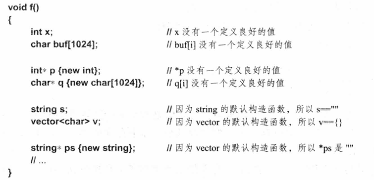

如果你想对内置类型的局部变量或者用new创建的内置类型的对象执行初始化，使用{}的形式。例如：

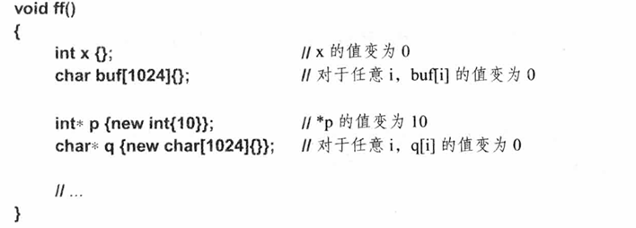

对于上面所示的数组和类来说，其成员将执行默认初始化。

#### 初始化器列表

到目前为止，我们已经讨论了没有初始化器和只有一个初始化器的情况。复杂一点的对象可能需要多于一个初始化器，此时就要用到以一对花括号{}界定的初始化器列表了。例如：

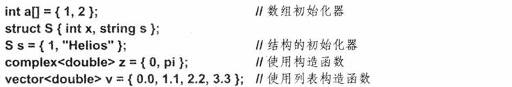

C风格的数组初始化方式见7.3.1节，C风格的结构初始化方式见8.2节，使用构造函数初始化用户自定义类型的方式见2.3.2节和16.2.5节，初始化器列表构造函数见17.3.4节。

在上面的例子中，符号=实际上是多余的。不过有的人愿意保留=，以说明我们是在用一组值初始化一组成员变量。

在有的例子中，我们也可以使用函数风格的实参列表（见2.3节和16.2.5节），例如：

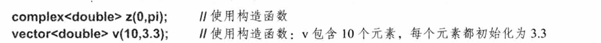

在声明语句中，一对空括号（)通常表示“函数”（见12.1节）。因此，如果想显式地表达“执行默认初始化”的意愿，你需要使用{}。例如：

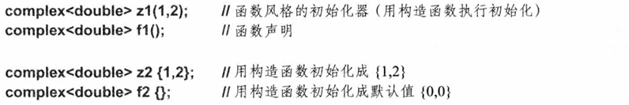

请注意，当我们使用{}符号进行初始化时，不会进行窄化转换（见6.3.5节）。在使用了auto的语句中，列表的类型被推断为std::initializer_list<T>。例如：


### 推断类型：auto和decltype()

C++语言提供了两种从表达式中推断数据类型的机制：

- auto根据对象的初始化器推断对象的数据类型，可能是变量、const或者constexpr的类型。
- ecltype(expr)推断的对象不是一个简单的初始化器，有可能是函数的返回类型或者类成员的类型。

这里所谓的推断其实非常简单：auto和decltype()只是简单地报告一个编译器已知的表达式的类型。

#### auto类型修饰符

当声明语句中的变量含有初始化器时，我们无须显式地指定变量的类型，只要让变量取其初始化器的类型即可。例如：

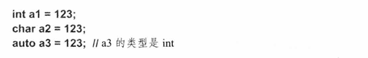

整数字面值常量123的类型是int，因此a3的类型就是int。换句话说，我们可以把auto看成是初始化器类型的占位符。

在像123这样简单的表达式中，用auto代替int看起来没什么大不了的。但是，表达式的类型越难读懂、越难书写，auto就越有用。例如：

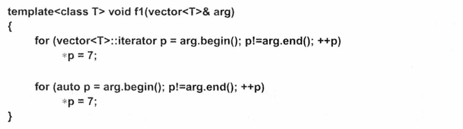

对于上面的程序来说，使用auto显然是更好的选择。它易读易写，且能在一定程度上适应代码的变化。例如，如果我们把arg的类型更改成list，则使用auto的循环仍然可以正常工作，而第一个循环需要重写。因此，在较小的作用域中，建议程序员优先选择使用auto。

如果作用域的范围较大，则显式地指定类型有助于定位错误。换句话说，与使用明确的类型名相比，使用auto可能会使得定位类型错误的难度增大。例如：


为了解决auto可能造成的影响，最常规的做法是保持函数的规模较小，这也被证明是一种行之有效的方法（见12.1节）。

我们可以为推断出的类型添加修饰符或说明符（见6.3.1节），比如const和&（引用，见7.7节)。例如：


在此例中，auto 推断为v的元素的类型，即int。

请注意，表达式的类型永远不会是引用类型，因为表达式会隐式地执行解引用操作（见7.7节)。例如：


#### auto与{}列表

如果我们正在初始化某个对象，那么当提到它的类型时必须同时考虑两部分：对象本身的类型以及初始化器的类型。例如：


使用{}初始化器列表可以尽可能减少意料之外的类型转换：


当我们使用auto关键字时，只涉及一种类型（初始值的类型），此时使用=是安全的，不会有什么问题：


事实上，当声明语句中有auto关键字时，=是比更好的选择，因为前者的结果可能并非我们所愿：


这是符合逻辑的。请考虑如下情况：


由同一种类型T的元素组成的列表类型是initializer_list<T>（见3.2.1.3节和11.3.3节）。应该庆幸x1的类型没有被推断成int，否则的话我们真不知道x2和x3该怎么办了。

总之，只要我们不是期望得到某种“列表”类型，就应该选择=而非{}。

#### decltype()修饰符

当有一个合适的初始化器的时候可以使用auto。但是很多时候我们既想推断得到类型，又不想在此过程中定义一个初始化的变量，此时，我们应该使用声明类型修饰符decltype(expr)。其中，推断所得的结果是expr的声明类型。这种用法在泛型编程中很有效。请考虑这样一个问题：如果我们想编写一个函数令其执行两个矩阵的加法运算，但是两个矩阵的元素类型可能不同，那么相加之后所得结果的类型应该是什么呢？当然是矩阵，但是这个结果矩阵的元素是什么类型？最自然的回答是：结果矩阵的元素类型应该是对应元素求和后的类型。因此，我们的声明如下所示：


在这个声明中我使用了后置返回类型语法（见12.1节），以便通过Matrix<decltype(T{}+U{})>推断出函数的返回类型。换句话说，函数的结果是一个Matrix，Matrix的元素类型由T{}+U{}推断得到。在该函数的定义部分，我再一次使用decltype()来表示Matrix的元素类型：


## 对象和值

我们可以分配并使用没有名字的对象（比如用new创建的对象），也能为某些看起来不太寻常的表达式赋值（如，*p[a+10]=7）。因此，我们需要用一个名字来表示“内存中的某个东西”。这就是对象一词最简单和最基本的含义。换句话说，对象（object）是指一块连续存储区域，左值（lvalue）是指向对象的一条表达式。“左值”的字面意思是“能用在赋值运算符左侧的东西”，但其实不是所有左值都能用在赋值运算符的左侧，左值也有可能指示某个常量（见7.7节）。未被声明成const的左值称为可修改的左值（modifiable lvalue）。此处我们提到的对象的最简单和最基本的含义不应该与类的对象或多态类型的对象混淆（见3.2.2节和20.3.2节）。

### 左值和右值

为了补充和完善左值的含义，我们相应地定义了右值（rvalue）。简单来说，右值是指“不能作为左值的值”，比如像函数返回值一样的临时值。如果你希望技术性更强一些（比如你想读一下ISO C++标准），那就需要更新看待左值和右值的视角了。当考虑对象的寻址、拷贝、移动等操作时，有两种属性非常关键。

- 有身份（Hasidentity）：在程序中有对象的名字，或指向该对象的指针，或该对象的引用，这样我们就能判断两个对象是否相等或者对象的值是否发生了改变。
- 可移动（Ismovable）：能把对象的内容移动出来（比如，我们能把它的值移动到其他某处，剩下的对象处于合法但未指定的状态，与拷贝是有差别的，见17.5节）。

在上述两个属性的四种组合形式中，有三种需要用C++语言规则精确地描述（既没有身份又不能移动的对象不重要）。我们“用m表示可移动”，且“用i表示有身份”，从而把表达式的分类表示成下图所示的形式：


从图中可知，一个经典的左值有身份但不能移动（因为我们可能会在移动后仍然使用它）,而一个经典的右值是允许执行移出操作的对象。其他一些有关的术语还包括纯右值（prvalue）泛左值（glvalue）和特别值（xvalue，又称为专家值，人们对于这个“x”的解释极具想象力）。例如：

```cpp
void f(vector<string>& vs)
{
	vector<string>& v2 = std::move(vs);  //移动vs到v2
	//...
}
```

此处，std::move(vs）是一个特别值。它明显有身份（我们能像vs一样引I用它），并且我们显式地给予了将其值移出的许可，方式是调用std::move（）（见3.3.2节和35.5.1节）。

在实际编程过程中，考虑左值和右值就足够了。一条表达式要么是左值，要么是右值，不可能两者都是。

### 对象的生命周期

对象的生命周期（lifetime）从对象的构造函数完成的那一刻开始，直到析构函数执行为止。对于那些没有声明构造函数的类型（比如int），我们可以认为它们拥有默认的构造函数和析构函数，并且这两个函数不执行任何实际操作。

我们从生命周期的角度把对象划分成以下类别。

- 自动（automatic）对象：除非程序员特别说明（见12.1.8节和16.2.12节），否则在函数中声明的对象在其定义处被创建，当超出作用域范围时被销毁。这样的对象被称为自动（automatic）对象。在大多数实现中，自动对象被分配在栈空间上。每调用一次函数，获取新的栈帧（stackframe）以存放它的自动对象。
- 静态（static）对象：在全局作用域或名字空间作用域（见6.3.4节）中声明的对象以及在函数（见12.1.8节）或类（见16.2.12节）中声明的static成员只被创建并初始化一次，并且直到程序结束之前都“活着”（见15.4.3节）。这样的对象被称为静态（static）对象。静态对象在程序的整个执行周期内地址唯一。在多线程环境中，静态对象可能会造成某些意料之外的问题。因为所有线程都共享静态对象，所以必须为其加锁以避免数据竞争（见5.3.1节和42.3节）。
- 自由存储（freestore）对象：用new和delete直接控制其生命周期的对象。
- 临时（temporary）对象：比如计算的中间结果或用于存放const实参引用的值的对象。临时对象的生命周期由其用法决定。如果临时对象被绑定到一个引用上，则它的生命周期就是引用的生命周期；否则，临时对象的生命周期与它所处的完整表达式一致。其中，完整表达式（full expression）不属于任何其他表达式。通常情况下，临时对象也是自动对象。
- 线程局部（thread-local）对象，或者说声明为thread_local（见42.2.8节）的对象：这样的对象随着线程的创建而创建，随着线程的销毁而销毁。

其中，静态和自动被称为存储类（storage class）。

数组元素和非静态类成员的生命周期由它们所属的对象决定。

## 类型别名

有时，我们需要为某种类型起个新名字。可能的动机包括：

- 原来的名字太长、太复杂或者太难看（在某些程序员眼中）。
- 某项程序设计技术要求在同一段上下文中，不同类型有相同的名字。
- 在某处提及某种类型仅仅是为了便于后期维护。

例如：

```cpp
using Pchar = char*;  //字符串指针
using PF = int(*)(double);  //函数指针，该函数接受一个double且返回一个int
```

相似类型可以定义同一个名字作为成员别名：


无论如何，类型别名绝不代表一种新类型，它只是某种已有类型的同义词。换句话说，别名就是类型的另外一个名字而已。例如：

```
Pchar p1=nullptr;  //p1的类型是char*
char* p3=p1; //正确
```

如果你想实现一种新类型，并且它的语义和表达形式与某种已有类型一致，应该使用枚举（见8.4节）或者类（第16章）。

早期还有一种语法也可以用在类似的语境中，我们使用typedef关键字，然后把要声明的类型别名放在一般声明语句中变量所在的位置上。例如：


使用别名有助于我们把代码与机器细节分离开来。名字int32_t明确指出我们想用它表示占32个二进制位的整数。与“普通的int”相比，使用int32_t可以让我们把代码平滑地移植到一台sizeof(int)==2的机器上。我们要做的只是修改一处int32_t的定义令其表示一个尺寸更大的整数类型即可：

```
using int32_t=long;
```

后缀_t通常用来表示类型别名（源自typedef关键字）。int16_t、int32_t以及其他一些类型别名都定义在<cstdint>中（见43.7节）。类型的别名应该尽量反映出该类型的目的和作用，而不是类型的实现细节（见6.3.3节）。

using关键字可用于引人一个template别名（见23.6节），例如：

```cpp
template<typename T>
	using Vector=std::vector<T,My_allocator<T>>;
```

不允许在类型别名前加修饰符（如unsigned），例如：


## 建议

[1］如果想了解语言的更多细节和权威解释，请翻阅ISOC++标准；6.1节。

[2]尽量避免不确定的和未定义的行为；6.1节。

[3］如果某些代码必须依赖于具体实现，记得把它们与程序的其他部分分离开来；6.1节。

[4]对于字符对应的数字值不要乱作假定；6.2.3.2节，10.5.2.1节。

[5]以0开头的整数是八进制的；6.2.4.1节。

[6］不要使用“魔法常量”；6.2.4.1节。

[7］不要对整数的尺寸妄加猜测；6.2.8节。

[8］不要对浮点数的精度和表示范围妄加猜测；6.2.8节。

[9]尽量使用普通的char，而非signedchar或者unsignedchar；6.2.3.1节。

[10]注意带符号类型和无符号类型之间的转换；6.2.3.1节。

\[11]  在一条声明语句中只声明一个名字；6.3.2节。

\[12]  常用的、局部的名字尽量短；不常用的、非局部的名字可以长一些；6.3.3节。

\[13]  起的名字不要太相似；6.3.3节。

\[14]  对象的名字应该尽量反映对象的含义而非类型；6.3.3节。

\[15]  坚持一种统一的命名风格；6.3.3节。

\[16]  避免使用全大写的名字；6.3.3节。

\[17]  作用域宜小不宜大；6.3.4节。

\[18]  最好不要在一个作用域以及它的外层作用域中使用相同的名字；6.3.4节。

\[19]  使用指定类型声明时最好用{}初始化器语法；6.3.5节。

\[20]  使用auto声明时最好用=语法；6.3.5节。

[21]  避免使用未初始化的变量；6.3.5.1节。

[22]当内置类型被用来表示一个可变值时，不妨给它起个能反映其含义的别名；6.5节。

[23]用别名作为类型的同义词；用枚举和类定义新类型；6.5节。


# 第七章 指针、数组与引用

崇高与荒谬，往往就在一线之间。——托马斯·潘恩

- 引言
- 指针
  - void\*;nullptr
- 数组
  - 数组的初始化器；字符串字面值常量
- 数组中的指针
  - 数组漫游；多维数组；传递数组
- 指针与const
- 指针与所有权
- 引用
  - 左值引用；右值引用；引用的引用；指针与引用
- 建议

## 引言

本章介绍C++语言中指示某块内存区域的基本机制。显然，我们能通过名字使用对象。然而在C++中，大多数对象都“有身份”；也就是说对象位于内存的某个地址中，如果我们知道对象的地址和类型，就能访问它。在C++语言中存放及使用内存地址是通过指针和引用完成的。

## 指针

对于类型T来说，T\*是表示“指向T的指针”的类型。换句话说，T\*类型的变量能存放T类型对象的地址。例如：

```
char c='a';
char* p= &c;  //p存放着c的地址，&是取地址运算符
```

这两条语句的图形化表示是：


对指针的一个基本操作是解引用（dereferencing），即引用指针所指的对象。这个操作也称为间接取值（indirection）。解引用运算符是个前置一元运算符，对应的符号是*。例如：


指针p所指的对象是c，c中存储的值是'a，因此我们把\*p赋给c2等价于给c2赋值'a'。

当指针指向数组中的元素时，C++允许对这类指针执行某些算术运算（见7.4节）。

指针的具体实现应该与运行程序的机器的寻址机制同步。大多数机器支持逐字节访问内存，其他机器则需要从字中抽取字节。很少有机器能直接寻址到一个二进制位。因此，能独立分配且用内置指针指向的最小对象是char类型的对象。有一点请读者注意：bool占用的内存空间至少和char一样多（见6.2.8节）。如果想把更小的值存得更紧密，可以使用位逻辑操作（见11.1.1节）、结构中的位域（见8.2.7节）或者bitset（见34.2.2节）。

符号*在用作类型名的后缀时表示“指向”的含义。如果我们想表示指向数组的指针或者指向函数的指针，需要使用稍微复杂一些的形式：


6.3.1节解释了如何声明一个指针，iso.A则包含完整的语法信息。

指向函数的指针很有用，相关内容将在12.5节讨论；20.6节将介绍指向类成员的指针。

### void\*

在某些偏向底层的代码中，我们偶尔需要在不知道对象确切类型的情况下，仅通过对象在内存中的地址存储或传递对象。此时，我们会用到void\*。void\*的含义是“指向未知类型对象的指针”。

除了函数指针（见12.5节）和指向类成员的指针（见20.6节），指向其他任意类型对象的指针都能被赋给一个void\*类型的变量。此外，一个void\*能被赋给另一个void\*，两个void\*能比较是否相等，我们还能把void\*显式地转换成其他类型。因为编译器事实上并不清楚void\*所指的对象到底是什么类型，所以对它执行其他操作可能不太安全并且会引发编译器错误。要想使用void*，我们必须把它显式地转换成某一特定类型的指针。例如：


一般情况下，如果某个指针已经被转换成（强制类型转换）指向一种与实际所指对象类型完全不同的新类型，则使用转换后的指针是不安全的行为。例如，某个机器可能假定double沿着8字节边界分配内存，如果指向int的pi分配内存的方式与之不同，将造成意想不到的后果。这种显式类型转换既不安全也不自然，我们在设计static_cast（见11.5.2节）的时候考虑到了这一点：static_cast的字面形式比较特殊，一旦出现了与之有关的错误，程序员很容易定位。

void\*最主要的用途是当我们无法假定对象的类型时，向函数传递指向该对象的指针；它还用于从函数返回未知类型的对象。要想使用这样的对象，必须先进行显式类型转换。

用到void\*指针的函数通常位于系统的最底层，这些函数的作用大多是操作硬件资源。例如：

```
void* my_alloc(size_t n)； //从特定的堆上分配n个字节的内存空间
```

在系统的较上层代码中很少用到void\*，一旦出现了你就要认真核实是不是存在设计上的错误。当用于优化的目的时，void\*能隐藏在类型安全的接口（见27.3.1节）中。

函数指针（见12.5节）和指向类成员的指针（见20.6节）不能被赋给void\*。

### nullptr

字面值常量nullptr表示空指针，即不指向任何对象的指针。我们可以把nullptr赋给其他任意指针类型，但是不能赋给其他内置类型：

```
int *pi=nullptr;
double* pd=nullptr;
int i=nullptr;  //错误：i不是指针
```

nullptr只有一个，它可以用于任意指针类型，C++并没有为每种指针类型各设计一个空指针。

在nullptr被引l人之前，人们使用数字O表示空指针。例如：

```
int* x=0;  //x的值是nullptr
```

任何对象都不会分配到地址0上，0（所有位全0的模式）是nullptr最常见的表示形式。0本身是一个int，但是标准类型转换规则（见10.5.2.3节）允许我们把0当成是一个指针常量或指向成员的类型的常量。

在原来的代码中，很多人习惯于定义一个宏NULL来表示空指针。例如：

```c++
int* p=NULL; //使用宏NULL
```

然而，在不同的具体实现中NULL的定义有所差别；例如，NULL可能是O，也可能是OL。在C语言中，NULL通常是（void\*)0，这种用法在C++中是非法的（见7.2.1节）：

```cpp
int* p=NULL;  //错误：不能把void*赋给int*
```

使用nullptr的好处很多，首先它的可读性更强，其次当一组重载函数既可以接受指针也可以接受整数时（见12.3.1节），用nullptr能够避免语义混淆。

## 数组

假设有类型T，T[size]的含义是“包含size个T类型元素的数组”。元素的索引值范围是0到size-1。例如：

```
float v[3]；//包含3个float的数组，分别是v[0],v[1],v[2]
char* a[32]；//包含32个char指针的数组，依次是a[0].a[31]
```

你可以使用下标运算符[]或指针（运算符*或运算符[]，见7.4节）访问数组中的元素，例如：


越界访问数组是一种未定义的行为，而且很有可能会引发严重的程序错误。在C++语言中，运行时边界检查既不常见、也无法保证。

数组中元素的数量（即数组的边界）必须是常量表达式（见10.4节）。如果你希望边界可变，最好使用vector（见4.4.1节和31.4节）。例如：


多维数组表现为数组的数组（见7.4.2节）。

数组是C++表示内存中对象序列最基本的方式。如果你用到的只是内存中一个固定大小、固定元素类型的序列，那么数组完全可以满足你的要求。对于其他要求，数组就不一定可靠了。

C++允许静态地分配数组空间，也允许在栈上或者在自由存储上（见6.4.2节）分配数组空间。例如：


C++的内置数组本质上是语言的一种底层功能，我们常常用数组来实现标准库vector和array等更高层级上的、行为定义更好的数据结构。数组不能执行赋值操作，一旦需要，数组名就会隐式地转换成指向数组首元素的指针（见7.4节）。特别要注意避免在接口中使用数组（比如作为函数的参数，见7.4.3节和12.2.2节），因为数组名隐式转换成指针是C代码和C风格的C++代码中很多错误的根源。如果是在自由存储上分配数组的，切记一定要在最后一次使用数组之后把对应的指针delete[]掉（见11.2.2节）。要让程序员时刻遵守这一要求并不容易，最简便且最可靠的办法是用资源句柄（比如string（见19.3节和36.3节）、vector（见13.6节和34.2节）和unique_ptr（见34.3.1节））控制自由存储上的数组的生命周期。如果你是静态地分配数组或者是在栈上分配数组，一定不要delete[]它。显然，因为C语言本身缺乏封装数组的能力，所以C程序员很难完全遵循上述建议；但是这些建议在C++程序中非常有用，不存在任何适用性的问题。

以0作为终止符的char数组是应用最广泛的一种数组。这是C语言存储字符串的基本方式，因此我们常把以0作为终止符的char数组称为C风格字符串（C-style string）。C++的字符串字面值常量沿用了这一传统（见7.3.2节），并且某些标准库函数（比如strcpy(）和strcmp()，见43.4节）也是建立在这一用法之上的。通常情况下，char\*和constchar\*指向以0结尾的字符序列。

### 数组的初始化器

我们能用值的列表初始化一个数组，例如：

```
int v1[]={1,2,3,4};
char v2[]={'a’,b’,'c',0};
```

如果声明数组的时候没有指定它的大小但是给出了初始化器列表，则编译器会根据列表包含的元素数量自动计算数组的大小。因此，v1和v2的类型分别是int[4]和char[4]。如果我们指定了数组的大小，但是提供的初始化器列表元素数量过多，则程序会发生错误。例如：

```
char v3[2]={'a’,b',0};  //错误：提供的初始化器过多
char v4[3]={'a,'b′,0}; //OK
```

如果初始化器提供的元素数量不足，则系统自动把剩余的元素赋值为0。例如：

```
int v5[8]={1,2,3,4};
```

等价于

```
int v5[]={1,2,3,4,0,0,0,0};
```

C++没有为数组提供内置的拷贝操作。不允许用一个数组初始化另一个数组（即使两个数组的类型完全一样也不行），因为数组不支持赋值操作：

```
int v6[8]=v5；//错误：不允许拷贝数组（不允许把int*赋给数组）
v6=v5;   //错误：不存在数组的赋值操作
```

同样，不允许以传值方式传递数组（见7.4节）。

如果你想给一组对象赋值，可以使用vector（见4.4.1节，13.6节和34.2节）、array（见8.2.4节）或者valarry（见40.5节）。

我们可以用字符串字面值常量（见7.3.2节）初始化字符的数组。

### 字符串字面值常量

字符串字面值常量（stringliteral）是指双引号内的字符序列：

"this is a string"

字符串字面值常量实际包含的字符数量比它表现出来的样子多一个。它以一个取值为0的空字符'\0'结尾，例如：

sizeof("Bohr")==5

字符串字面值常量的类型是“若干个const字符组成的数组”，因此“Bohr”的类型是const char[5]。

在C和旧式的C++代码中，允许把字符串字面值常量赋给一个非常量char*：


显然上面的赋值语句是不安全的。这种用法有出错的风险，因此如果某些老代码因为这个原因无法编译通过再正常不过了。令字符串字面值常量的内容保持不变是一种显而易见的选择，这样做有助于在具体实现环节对字符串字面值常量的存储和访问方式加以改进。

如果我们希望字符串能被修改，最好把字符放在一个非常量的数组中：


字符串字面值常量是静态分配的，因此函数返回字符串字面值常量是很安全的行为，不会有什么问题。例如：


调用error_message（）后，存放"rang e error”的内存区域不会消失。

两个完全一样的字符串字面值常量是在同一个数组中还是在两个不同的数组中依赖于实现（见6.1节），例如：


当符号==作用于指针时，比较的是地址（指针本身的值）而非指针所指的值。

空字符串记作一对紧挨着的双引号""，其类型是const char[1]。空字符串中唯一的一个字符是结束符'\0'。

只要表示的是非图形化字符，反斜线（见6.2.3.2节）就能用在字符串中。这使得我们可以在字符串中表示双引号（"）和转义字符反斜线（\）。我们最常用的是换行符'\n'，例如：

cout<<"beep at end of message\a\n";

转义字符'\a'是ASCII字符集中的BEL（警告，alert），它的作用是发出报警的声音。

在一个非原始字符串字面值常量中，不存在“真正的”换行：

```
"this isnot a string
but a syntax error"
```

我们可以用空格把一条长字符串分割开以使程序文本显得整洁美观，例如：

```
char alpha[]="abcdefghijklmnopqrstuvwxyz"
			"ABCDEFGHIJKLMNOPQRSTUVWXYZ";
```

编译器会自动把相邻的字符串连接起来，因此用下面这条长字符串字面值常量初始化alpha，从效果上来说是等价的：

```
"abcdefghijkImnopqrstuvWxyzABCDEFGHIJKLMNOPQRSTUVWXYZ";
```

允许在字符串中间存在空字符，但是大多数程序都会忽略空字符之后的内容。例如，标准库函数strcpy(）和strlen（）都把字符串“Jens\000Munk”当成“Jens"处理（见43.4节）。

#### 原始字符串

要想在字符串字面值常量中表示反斜线（\）或者双引号（"），我们需要在这些符号的前面再加一个反斜线。这种做法合情合理，并且在大多数时候都有效。然而，如果我们要表达的字符串字面值常量中含有太多的反斜线和双引号，问题就变得比较复杂了。特别是在正则表达式中反斜线会频繁地出现，它既用来表示转义字符，又能表示某些字符类别（见37.1.1节）。我们无权更改或优化正则表达式的规则，毕竟包括C++在内的很多编程语言都在使用它，几乎已经形成传统了。因此，当你在使用标准regex库（第37章）书写正则表达式时，反斜线可以表示转义字符这一事实很可能会造成某些潜在的错误。请思考一个问题，如果我们想表示两个用反斜线隔开的单词，可能需要这么写：

```
string s="\\w\\\\w"  //这么多反斜线？祈祷自己千万别写错！
```

显然这种约定俗成的正则表达式太容易出错了，为了解决这个问题，C++提供了原始字符串字面值常量（rawstringliteral）。在原始字符串字面值常量中，反斜线就是反斜线，双引号就是双引号，上面的例子变成了：

```
string s=R"(\w\\w)";  //嗯，没问题，肯定不会写错的！
```

原始字符串字面值常量使用R"(ccc)"的形式表示字符序列ccc，其中，开头的R用于把原始字符串字面值常量和普通的字符串字面值常量区别开来。一对括号的作用是允许我们使用非转义的双引号。例如：

```
R"("quoted string")"    //字符串的内容是"quoted string"
```

进一步，如果我们想在原始字符串字面值常量中加人字符序列）该怎么办呢？这个要求并不常见，不过即使真的遇到了也有解决的办法。因为"（和）”并不是唯一的分隔符，在“（...)”的框架中我们还可以在（之前和）之后加人其他分隔符。例如：

```
R"***("quoted string containing the usual terminator("))")***"
	//"quoted string containing the usual terminator("))"
```

规则要求：符号）后面的字符序列必须与符号（前面的序列完全一致。采用这种措施，我们就能处理几乎所有复杂的字符串模式了。

除非你正在处理正则表达式，否则原始的字符串字面值常量不会有太大的用处（顶多算是“茴香豆的茴的一种写法”）。但是正则表达式本身是非常非常有用的，读者不妨思考现实世界中的一个例子：


面对这个例子，即使是有经验的程序员也很难做出判断，此时原始字符串字面值常量就派上用场了。

与普通的字符串字面值常量不同，在原始字符串字面值常量中允许出现换行（真正的换行，而非换行符）。例如：

```
string counts {
R"(1
22
333)"
};
```

等价于

```
string x{"1\n22\n333"};
```

#### 大字符集

前缀是L的字符串（比如L"angst"）由宽字符（见6.2.3节）组成，它的类型是const wchar_t切。类似地，前缀是LR的字符串（比如LR"(angst)"）也是由宽字符组成的（见7.3.2.1节），它的类型同样是const wchar_t[]，它属于原始字符串字面值常量。这样的字符串以字符L'\0'结束。

有6种字符字面值常量支持Unicode（称为Unicode字面值常量，Unicode literal）。这听起来有点多，但是要知道Unicode本身有至少3种编码方式：UTF-8、UTF-16和UTF32。对于每种编码方式，分别支持原始字符串以及“普通”字符串。因为每种UTF编码方式都支持全部Unicode字符，所以到底选用哪种编码方式主要看程序所要依赖的系统是什么要求。基本上，所有Internet应用（比如浏览器和电子邮件）都支持至少一种Unicode编码方式。

UTF-8是一种可变宽度的编码方式：常用字符占据1个字节，不常用的字符（根据使用的情况度量）占据2个字节，特别罕见的字符占据3或4个字节。众所周知，ASCII字符占1个字节，这些字符在UTF-8中的编码（对应的整数值）与在ASCII中完全一致。拉丁字母、希腊文、斯拉夫语、希伯来文、阿拉伯文以及其他字符占2个字节。

UTF-8字符串的结尾是"0"，UTF-16是u'\0'，UTF-32是U'\0'。英文字符串的表示方式有很多种，考虑以反斜线作为分隔符的文件名：


上面这些字符串的输出效果都是一样的，但是除了“普通”字符串和UTF-8字符串外，其他字符串的内在表现形式略有区别。显然，Unicode字符串的最终目的是处理Unicode字符，例如：


输出该字符串所得的结果是：


\u之后的十六进制数是一个Unicode编码点（iso.2.14.3）[Unicode，1996］。编码点独立于编码方式，事实上，在不同编码方式下编码点的表现形式会有所不同。例如，u'0430'（斯拉夫语的小写字母“a”）在UTF-8中是2字节的十六进制值D0B0，在UTF-16中是2字节的十六进制值0430，在UTF-32中是4字节的十六进制值00000430。这些十六进制值称为通用字符名字（universal character name）。前缀u和R对于顺序和大小写敏感：RU和Ur都不是合法的字符串前缀。

## 数组中的指针

在C++语言中，指针与数组密切相关。数组名可以看成是指向数组首元素的指针，例如：


或者表示成图形的形式：


令指针指向数组的最后一个元素的下一个位置（尾后位置）是有效的，这对于很多算法（见4.5节和33.1节）非常重要。不过，因为该指针事实上指向的并不是数组中的任何一个元素，所以不能对它进行读写操作。试图获取和使用数组首元素之前或者尾元素之后的地址都是未定义的行为，应该尽量避免。例如：

```
int* p4=v-1；//首元素之前的位置是未定义的，应该避免使用
int* p5=v+7；//尾元素之后的位置是未定义的，应该避免使用
```

数组名向数组首元素指针的隐式类型转换在C风格代码的函数调用中广泛使用，例如：


两次调用传人标准库函数strlen()的值是相同的。唯一的问题是这种隐式类型转换无法避免，注定会发生。换句话说，我们不可能让函数接受整个数组V。不过幸运的是，不存在从指针向数组的显式或隐式类型转换。

数组实参向指针的隐式类型转换意味着数组的大小在调用函数时丢掉了，然而函数经常需要以某种方式得到数组的大小以便执行某些必要的操作。和其他接受字符指针的C标准库函数一样，strlen(）也用0作为字符串的结束符，strlen(p)返回的是字符串中除了结束符0之外其他字符的总数。以上提及的都是一些非常底层的细节。标准库vector（见4.4.1节，13.6节和31.4节）、array（见8.2.4节和34.2.1节）和string（见4.2节）不受这些问题困扰。这些标准库类型的元素数量可以通过size()得到，不需要每次都重新计算。

### 数组漫游

如何便捷高效地访问数组（以及类似的数据结构）是很多算法的关键（见4.5节和第32章）。我们既可以通过指向数组的指针加上一个索引值来访问数组元素，也可以通过直接指向数组元素的指针进行访问。例如：

```cpp
void fi(char v[]){
	for(int i = 0;v[i]!=0;++i)
		use(v[i]);
}

void fp(char v[])
{
	for(char* p = v; *p != 0 ; ++p)
		use(*p);
}
```

前置\*运算符执行解引l用运算，因此\*p是指针p所指的字符，++运算令p指向数组的下一个元素。

这两个版本的代码不存在谁比谁更快的问题。在现代编译器中，两个例子编译生成的代码应该是一样的（大多数情况下也确实一样）。程序员可以从逻辑性和优美程度出发自由选择。

内置数组的取下标操作是通过组合指针的+和\*两种运算得到的。对于内置数组a和数组范围之内的整数j，有下式成立：

```
a[i] == *(&a[0]+j）== *(a+j）== *(j+a)== j[a]
```

人们常常会纠结于为什么a[i]\==j[a]，比如3["Texas"]\=="Texas"[3]=='a'，其实这种小聪明在实际的代码中并没有多少展示的空间。上面这些等价关系属于非常底层的规则，并不适用于array和vector等标准库容器。

把+、－、++、－－等算术运算符用在指针上得到的结果依赖于指针所指对象的数据类型。当我们对T*类型的指针p执行算术运算时，p指向T类型的数组元素，p+1指向数组的下一个元素，p-1指向上一个元素。上述规则意味着p+1对应的整数值比p对应的整数值大sizeof(T)。例如：


这段代码的输出结果是

0x7fffaef0 0x7ffaef4 1 4

0x7fffaedc 0x7fffaede 1 2

指针值以默认的十六进制形式输出，从上面的结果我们可以知道，在我所用的C++实现版本中sizeof(short）是2，sizeof(int)是4。

指针的减法运算只有当参与运算的两个指针指向的是同一个数组中的元素时才有效（尽管C++语言本身并没有一种机制可以快速地检测该条件是否满足）。当计算两个指针p和q的差值（q-p)时，所得结果是序列[p:q)中的元素数量（一个整数）。我们可以给指针加上一个整数或者从指针中减去一个整数，得到的结果都是指针。如果该指针指向的位置既不是原数组中的元素，也不是尾后元素，那我们不能使用它，否则会产生未定义的行为。例如：


复杂的指针算术运算通常没什么必要，最好避免使用。此外，直接把两个指针相加没有实际意义，C++也不允许这样做。

因为数组的元素数量不一定能与数组本身存储在一起，所以数组不具有自解释性。当我们需要遍历一个数组并且它不像C风格的字符串那样具有明确的终结符时，我们必须以某种方式提供元素的数量。例如：


数组是一个底层的语言概念，标准库容器array（见8.2.4节和34.2.1节）具有内置数组的绝大多数优点，同时规避掉了它的很多缺点。某些C++实现为数组提供了可选的范围检查操作，然而这种范围检查的时空开销可能会非常大，因此大多数时候我们只把它作为开发的辅助工具，而不会真的包含在最终代码中。如果你不打算使用范围检查功能，则一定要设法以一种切实有效的措施确保访问元素不会越界。我的建议是使用vector等更高层次的容器类型管理数组，元素的有效范围非常明确，我们一般不会用错。

### 多维数组

多维数组是指数组的数组。我们可以用下面的语句声明一个3*5的数组：

```
int ma[3][5];  //3行，每行5个int
```

初始化ma的语句是：


或者表示成图形的形式：


如果数组ma包含3行且每行有5个int，则我们可以把它看成是连续15个int。在内存中不存在一个表示矩阵ma的单独的对象，我们只存储了数组的元素。维度3和5只在编译器源代码中有效。当我们编写代码时，必须时刻谨记数组的维度并且在需要使用的时候提供出来。例如，我们用下面的代码输出ma的内容：


在别的某些编程语言中，有时候用逗号分隔数组的边界。C++不允许这样做，因为逗号（，)是表示序列的运算符（见10.3.2节）。好在编译器能捕获大多数此类错误，例如：


### 传递数组

不能以值传递的方式直接把数组传给函数，我们通常传递的是指向数组首元素的指针。 例如：


上面的代码看似正确，实则不然。它虽然能通过编译，但是调用comp(a2)试图向a2的合法边界之外的区域写入内容。此外，如果你期望数组以值传递的方式传给函数，恐怕也要大失所望了：对arg[ij执行写操作实际上是直接向comp()的实参的元素写内容，而不是工作在该实参的一份副本上。comp()函数的等价形式是：


现在问题更加明显了。当数组作为函数的实参时，我们完全把数组的第一维当成指针使用，而忽略了数组的边界。因此，如果你想在给函数传人一组元素的同时不丢掉数组的大小，就不能使用内置数组类型。你可以把数组放在类中作为类的成员（类似于std::array），或者直接定义一个句柄类（类似于std::string和std::vector）。

如果苛刻点儿评价的话，使用内置数组有百而无一利。当我们需要定义一个接受二维矩阵的函数时，如果编译时知道数组的具体维度当然没有问题：


实参从形式上看虽然是用多维数组表示的矩阵，但实际传人函数的是个指针（而非矩阵的副本，见7.4节）。数组的第一个维度与定位元素无关，它只负责指明当前类型（此处是int[5])包含几个元素（此处是3）。例如在前面提到的ma中，只要知道第二个维度是5，我们就能定位任意的ma\[i][5]。此时，可以把数组的第一个维度当成实参传入函数：


但是当需要传人两个维度时，“显而易见的解决方案”并不有效：


好在编译器会因实参声明m\[][]非法而报错，因为多维数组的第二个维度必须是已知的，这样我们才能准确定位其中的元素。然而，表达式m\[i][j]会被编译器理解成\*(*(m+i)+j)，尽管这绝非程序员的原意。一种正确的解决方案是：


其中用来访问数组成员的表达式就是编译器在已知最后一个维度的时候所用的方式。要想调用该函数，我们只需传入一个代表矩阵的指针即可：


请注意，在最后一个调用中我们使用了v\[0][0]。此处使用v[0]也是可以的，因为它与v\[0][0]等价；但是直接用传人V会引发类型错误。这样的代码含义微妙、用法凌乱，还是越少出现越好。如果你必须直接处理多维数组，那么记得把有关的代码封装起来，这样其他程序员在用到你的代码时会容易上手一些。最好的办法是给多维数组提供适当的下标运算符，这样用户就不必被数组中元素的分布情况困扰了（见29.2.2节和40.5.2节）。标准库vector（见31.4节）完美地解决了上述问题。

## 指针与const

C++提供了两种与“常量”有关的概念：

- constexpr：编译时求值（见2.2.3节和10.4节）。
- const：在当前作用域内，值不发生改变（见2.2.3节）。

基本上，constexpr的作用是指示或确保在编译时求值，而const的主要任务是规定接口的不可修改性。本节主要关注第二点：接口说明。

很多对象的值一旦初始化就不会再改动：

- 使用符号化常量的代码比直接使用字面值常量的代码更易维护。
- 我们经常通过指针读取数据，但是很少通过指针写人数据。
- 绝大多数函数的参数只负责读取数据，很少写人数据。

为了表达一经初始化就不可修改的特性，我们可以在对象的定义中加上const关键字。例如：


因为我们无法给const对象赋值，所以它必须初始化。一旦我们把某物声明成const，就确保它的值在其作用域内不会发生改变：


使用const会改变一种类型。所谓改变不是说改变了常量的分配方式，而是限制了它的使用方式。例如：

```cpp
void g(const X* p){
 //此处无权修改*p
}

void h(){
	X val;  //此处可以修改val的值
	g(&val);
	//...
}
```

一个指针牵扯到两个对象：指针本身以及指针所指的对象。在指针的声明语句中“前置”const关键字将令所指的对象而非指针本身成为常量。要想令指针本身成为常量，应该用\*const代替普通的*。例如：


声明运算符\*const的作用是令指针本身成为常量。不存在形如const\*的声明运算符，相反，出现在*前面的const是基本类型的一部分。例如：


要想理解上述声明的含义，一个小技巧是按照从右向左的顺序读。例如，“cp是指向char的const指针”，而“pc2是指向char const的指针”。

对于同一个对象来说，通过一个指针访问它时是常量并不妨碍在其他情况下它是个变量。这一点在涉及函数的实参时特别有用。我们可以把指针类型的实参声明成const，这样就能阻止函数修改该指针所指的对象了。例如：


第一个函数的参数是常量字符串，函数无权修改其中的元素；它的返回值是指向const的指针，也不允许修改其所指的对象。第二个函数没有这些限制。

C++允许把非const变量的地址赋给指向常量的指针，这不会造成什么不可接受的后果。相反，常量的地址不能被赋给某个不受限的指针，因为如果这样的话，用户有可能通过该指针修改对象的值，这显然是不被允许的。例如：

```cpp
void f4(){
 int a=1;
 const int c= 2;
 const int* p1=&c; //OK
 const int* p2=&a; //OK
 int* p3= &c;  //错误：用const int*初始化int*
 *p3=7;  //试图改变c的值
} 
```

C++允许通过显式类型转换的方式（见16.2.9节和11.5节）显式地移除掉对于指针指向常量的限制，但是一般情况下不要这么做。

## 指针与所有权

资源必须先分配后释放（见5.2节）。我们用new分配内存，用delete释放内存（见11.2节）；用fopen()打开文件，用fclose()关闭文件（见43.2节），因此内存和文件都是资源。指针是最常用的资源句柄。这一点不太容易理解，毕竞在程序中指针随处可见，而且作为资源句柄的指针和不作为资源句柄的指针似乎没什么差别。例如：


如果在confused()中delete掉p，则当执行后面两个调用时程序将发生非常严重的错误，原因是对于不是由new分配的对象，我们无权delete它（见11.2节）。然而，如果confused(）没有delete掉p，又会造成程序的资源泄露（见11.2.1节）。在此例中，很明显应该由f()负责管理它创建在自由存储上的对象的生命周期。但是通常情况下，在一个规模较大的程序中我们需要使用某种简单有效的策略追踪和维护那些需要delete的资源。

一种比较好的策略是把表示某种所有权的指针全都置于vector、string和unique_ptr等资源句柄类中。此时，我们就能假定所有不在资源句柄中的指针都不负责管理资源，因此也不必对它们执行delete操作。第13章将详细讨论资源管理的细节。

## 引用

通过使用指针，我们就能以很低的代价在一个范围内传递大量数据，与直接拷贝所有数据不同，我们只需要传递指向这些数据的指针的值就行了。指针的类型决定了我们能对指针所指的对象进行哪些操作。使用指针与使用对象名存在以下差别：

- 语法形式不同，*p和p->m分别取代了obj和obj.m。
- 同一个指针在不同时刻可以指向不同对象。
- 使用指针要比直接使用对象更小心：指针的值可能是nullptr，也可能指向一个我们并不想要的对象。

这些差别有时候很烦人。例如，程序员常常受困于到底该用f(&x)还是f(x)。更糟糕的是，程序员必须花费大量精力去管理变化多端的指针变量，而且还得时时防范指针取值为nullptr的情况。此外，当我们重载运算符时（比如+），肯定希望写成x+y的形式而不是&x+&y。解决这些问题的语言机制是使用引用（reference）。和指针类似，引用作为对象的别名存放的也是对象的机器地址。与指针相比，引用不会带来额外的开销。引用与指针的区别主要包括：

- 访问引用与访问对象本身从语法形式上看是一样的。
- 引用所引的永远是一开始初始化的那个对象。
- 不存在“空引用”，我们可以认为引用一定对应着某个对象（见7.7.4节）。

引用实际上是对象的别名。引用最重要的用途是作为函数的实参或返回值，此外，它也被用于重载运算符（第18章）。例如：


以引用的形式给函数传递实参的思想非常经典，它的历史和高级程序设计语言一样悠久（Fortran语言最早的版本就用到了这种思想）。

为了体现左值/右值以及const/非const的区别，存在三种形式的引l用：

- 左值引用（lvalue reference）：引用那些我们希望改变值的对象。
- const引用（const reference）：引用那些我们不希望改变值的对象（比如常量）。
- 右值引用（rvalue reference）：所引对象的值在我们使用之后就无须保留了（比如临时变量)。

这三种形式统称为引用，其中前两种形式都是左值引用。

### 左值引用

在类型名字中，符号×&的意思是“X的引用”；它常用于表示左值的引用，因此称为左值引用。例如：

```cpp
void f(){
	int var = 1;
	int& r{var};  //r和var对应同一个int
	int x=r；     //x的值变为1
	r=2;          //var的值变为2
}
```

为了确保引用对应某个对象（即把它绑定到某个对象），我们必须初始化引用。例如：


初始化引用和给引用赋值是完全不同的操作。除了形式上的区别外，事实上没有专门针对引用的运算符。例如：


在这段代码中，++rr的含义并不是递增引用rr，相反它的作用是给rr所引的int（即var）加1。因此，引用本身的值一旦经过初始化就不能再改变了；它永远都指向一开始指定的对象。我们可以使用&rr得到一个指向rr所引对象的指针。但是我们既不能令某个指针指向引用，也不能定义引用的数组。从这个意义上来说，引用不是对象。

显然，引用的实现方式应该类似于常量指针，每次使用引用实际上是对该指针执行解引用操作。绝大多数情况下像这样理解引用是没问题的，不过程序员必须谨记：引用不是对象，而指针是一种对象。例如：


有时候编译器能对引用进行优化，使得在运行时无须任何对象表示该引用。

当初始值是左值时（你能获取地址的对象，见6.4节），引用的初始化过程没什么特殊之处。提供给“普通”T&的初始值必须是T类型的左值。

constT&的初始值不一定非得是左值，甚至可以不是T类型的。此时：

[1]首先，如果必要的话先执行目标为T的隐式类型转换（见10.5节）。

[2】然后，所得的值置于一个T类型的临时变量中。

[3］最后，把这个临时变量作为初始值。考虑如下的情况：


后一条语句的初始化过程可以理解为：


用于存放引用初始值的临时变量的生命周期从它创建之处开始，到它的引用作用域结束为止。普通变量的引用和常量的引用必须区分开来。为变量引人一个临时量充满了风险，当我们为该变量赋值时，实际上是在为一个转瞬即逝的临时量赋值。常量的引用则不存在这一问题，函数的实参经常定义成常量的引用（见18.2.4节）。

我们常用引用作为函数的实参类型，这样函数就能修改传人其中的对象的值了。例如：


实参传递在本质上与初始化过程非常相似。因此当调用函数increment时，实参aa变成了另一个名字×。从代码的可读性角度出发，尽量避免让函数更改它的实参值，我们可以让函数显式地返回一个值来达到同样的目的：


函数increment(x)从形式上看不出×的值已经被改变，相反x=next(x)可以。因此，除非函数名字能明显地表达修改实参的意思，否则不要轻易使用“普通”引用。

引用还能作为函数的返回值类型，此时，该函数既能作为赋值运算符的左侧运算对象，也能作为赋值运算符的右侧运算对象。一个典型的示例是如下所示的Map：


实现标准库map（见4.4.3节和31.4.3节）所用的数据结构通常是一棵红黑树。但是为了避开琐碎的细节，我在这里使用最简单的线性搜索实现Map：


我在传递键值实参k的时候使用了引用，因为键值的类型可能太大以至于不便拷贝。类似地，返回结果也设为引用类型，因为拷贝函数返回的值也可能代价过于昂贵。之所以把k的类型设为const引用是因为我不希望函数修改它的值，而且这样做还允许我给函数传人一个字面值常量或者临时对象。因为Map的用户几乎肯定会使用和更改找到的值，所以函数的返回值应该是一个非const引用。例如：


每次执行程序，输人循环负责从标准输人流cin读人单词到字符串s中（见4.3.2节），同时更新该单词对应的计数值。最后，输人的每个单词以及它们各自出现的次数以表格形式输出出来。假设输人是：

aa bb bb aa aa bb aa aa

则程序的运行结果将是：

aa:5

bb:3

因为我们的Map像标准库map一样定义了begin(）和end()，所以可以使用范围for循环遍历其元素。

### 右值引用

C++之所以设计了几种不同形式的引用，是为了支持对象的不同用法：

- 非const左值引用所引的对象可以由用户写人内容。
- const左值引l用所引l的对象从用户的角度来看是不可修改的。
- 右值引用对应一个临时对象，用户可以修改这个对象（通常确实会修改它），并且认定这个对象以后不会被用到了。

我们最好事先判断引用所引的是否是临时对象，如果是的话，我们就能用比较廉价的移动操作代替昂贵的拷贝操作了（见3.3.2节，17.1节和17.5.2节）。对于像string和list这样的对象来说，它们本身所含的信息量可能非常庞大，但是用于指向这些信息的描述符（比如引用）可能非常小。此时，如果我们确认以后不会再用到该信息，则执行廉价的移动操作是最好的选择。一个典型的例子是，编译器清楚地知道函数返回的局部变量的值不会再被用到了（见3.3.2节）。

右值引用可以绑定到右值，但是不能绑定到左值。从这一点上来说，右值引用与左值引用正好相反。例如：

```
string var {"Cambridge"};
string f();
string& r1 {var};  //左值引用，r1绑定到var（左值）上
string& r2 {f()); //左值引用，错误：f()是右值
string& r3{"Princeton"); //左值引用，错误：不允许绑定到临时变量
string&& rr1{f()};  //右值引用，正确：rrl绑定到一个右值（临时变量）
string&& rr2{var};  //右值引用，错误：var是左值
string&& rr3{"Oxford"); //rr3引用的是一个临时变量，它的内容是"Oxford"
const string cr1&{"Harvard"};  // OK：创建一个临时变量，然后把它绑定到crl
```

声明符&&表示“右值引用”。我们不使用const右值引用，因为右值引用的大多数用法都是建立在能够修改所引对象的基础上的。const左值引用和右值引用都能绑定右值，但是它们的目标完全不同：

- 右值引用实现了一种“破坏性读取”，某些数据本来需要被拷贝，使用右值引用可以优化其性能。
- const左值引用的作用是保护参数内容不被修改。

右值引用所引对象的使用方式与左值引用所引的对象以及普通变量没什么区别，例如：


有时，程序员明确知道某一对象不再有用了，但是编译器并不知道这一点。例如：


如果T是string和vector等拷贝操作非常昂贵的类型，则上面这个swap()函数会非常昂贵。注意一个事实：其实我们根本没打算拷贝什么东西，我们想要的只是在a、b和tmp间移动数据而已。我们可以告诉编译器我们的初衷：


static_cast<T&&>(x)的结果值是T&&类型的右值引用，引用的对象是×。现在我们可以把右值引用的优化操作用在×上了。当类型T含有移动构造函数（见3.3.2节和17.5.2节）或者移动赋值运算符时，上述优化操作将发挥作用。以vector为例：


在swap(）函数中使用static_cast显得有点繁琐，程序员有时还可能拼错，因此标准库提供了一个名为move(）的函数：move(x)等价于static_cast<X&&>(x)，其中×的类型是×。通过使用move()，我们就能让swap(）的形式变得清晰简洁：


与最初的swap()相比，最新版本无须执行任何拷贝操作，它使用移动操作完成所需的功能。

因为move(x)实际上并不真的移动x（它只是为×创建了一个右值引用），所以其实给它起名rval()的话更贴切，不过move()的名字已经使用了太长时间，程序员已经习惯了。我之所以认为这个swap()是“几乎完美的”，是因为它只能交换左值。例如：


有的时候人们确实需要用一组有序默认值替换容器的当前内容，但是上面的swap()函数做不到。一种解决方案是再增加两个重载函数：

```c++
template<class T> void swap(T&& a,T& b);
template<class T> void swap(T& a, T&& b)
```

最后一个版本可以满足我们的要求。标准库为string和vector等类型（见31.3.3节）提供了shrink_to_fit(）和clear()，以使得swap(）可以处理右值参数：


右值引1用还可用于实参转发（见23.5.2.1节和35.5.1节）。

所有标准库容器都提供了移动构造函数和移动赋值运算符（见31.3.2节）。它们用于插人新元素的操作，比如insert(）和push_back()，都提供了接受右值引用的版本。

### 7.7.3 引用的引用

如果你让引用指向某类型的引用，那么你得到的还是该类型的引用，而非特殊的引用的引用类型。但你得到的到底是哪种引用呢，左值引用还是右值引用？考虑如下情况：


总之，永远是左值引用优先。这种规定合情合理：不管我们怎么做都无法改变左值引用绑定左值的事实。有时候，我们把这种现象称为引用合并（reference collapse）。

C++不允许下面的语法形式：

```c++
int&& &r=i;
```

引用的引用只能作为别名（见3.4.5节和6.5节）的结果或者模板类型的参数（见23.5.2.1节）。

### 7.7.4 指针与引用

指针和引用是两种无须拷贝就能在别处使用对象的机制。它们的图形化表示如下所示：


指针和引用各有优势，也都存在不足之处。

如果你需要更换所指的对象，应该使用指针。你可以用=、+=、-=、++和-－改变指针变量的值（见11.1.4节）。例如：


反之，如果你想让某个名字永远对应同一个对象，应该使用引用。例如：


如果你想自定义（重载）一个运算符（见18.1节），使之用于指向对象的某物，应该使用引用。例如：


C++不允许重新定义指针等内置类型的运算符含义（见18.2.3节）。如果你想让一个集合中的元素指向对象，应该使用指针：


除非C++对于某些情况做出了明确的规定，我们不得不照做；其他大多数时候，程序员有权在指针和引用中进行选择，这个过程有点像艺术创作：需要点儿智慧，也需要点儿美感。理论上，我们应该尽量减少错误的风险，并且增加代码的可读性。

如果你需要表示“值空缺”，则应该使用指针。指针提供了nullptr作为“空指针”，但是并没有“空引用”与之对应。例如：


当确实需要的时候，也可以为特定的类型构造一个“空引用”。例如：


显然，你需要让nullX有良好的定义。但不管怎么说，这种用法并不符合语言习惯，我不建议程序员使用。默认情况下，程序员可以认定他所使用的引用是有效的。除非有人故意创建一个无效的引用，否则这种情况很难遇到。例如：


这是无效的C++代码。即使你的编程环境暂时没有发现，也最好不要这样写。

## 7.8 建议

[1]使用指针时越简单直接越好；7.4.1节。

[2]不要对指针执行稀奇古怪的算术运算；7.4节。

[3］注意不要越界访问数组，尤其不要在数组之外的区域写入内容；7.4.1节。

[4]不要使用多维数组，用合适的容器替代它；7.4.2节。

[5]用nullptr代替0和NULL；7.2.2节。

[6］与内置的C风格数组相比，优先选用容器（比如vector、array和valarray）；7.4.1节。

[7]优先选用string，而不是以0结尾的char数组；7.4节。

[8］如果字符串字面值常量中包含太多反斜线，则使用原始字符串；7.3.2.1节。

[9］const引用比普通引用更适合作为函数的实参；7.7.3节。

[10］只有当需要转发和移动时才使用右值引用；7.7.2节。

[11］让表示所有权的指针位于句柄类的内部；7.6节。

[12]在底层代码之外尽量不要使用void*；7.2.1节。

[13］用const指针和const引用表示接口中不允许修改的部分；7.5节。

[14］引用比指针更适合作为函数的实参，不过当需要处理“对象缺失”的情况时例外；7.7.4节。


# 第八章 结构、联合与枚举

塑造一个更完美的Union——一人们的呼声

- 引言
- 结构
  - struct的布局；struct的名字；结构与类；结构与数组；类型等价；普通旧数据；域
- 联合
  - 联合与类；匿名union
- 枚举
  - enumclass；普通的enum；未命名的enum
- 建议

## 8.1 引言

用户自定义类型是能否有效使用C++的关键，本章介绍三种用户自定义类型的初级形式：

- struct（结构）是由任意类型元素（即成员，member）构成的序列。
- union是一种struct，同一时刻只保存一个元素的值。
- enum（枚举）是包含一组命名常量（称为枚举值）的类型。
- enum class（限定作用域的枚举类型）是一种enum，枚举值位于枚举类型的作用域内，不存在向其他类型的隐式类型转换。

这些类型在C++的早期版本中就已经存在了。它们主要关注数据如何表示的问题，构成了大多数C程序的基本框架。这里描述的struct其实是一种简单的class（见3.2节和第16章）。

## 8.2 结构

数组是相同类型元素的集合。相反，struct是任意类型元素的集合。例如：


