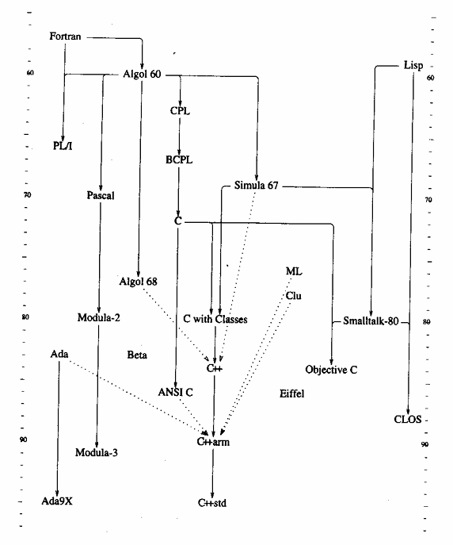

# C++语言的设计和演化

# 前序

这是一本独特的书，是由C++语言的设计师本人写的，描述C++语言的发展历史、设计理念及技术细节的著作。在计算机发展的历史上，这种从多方面多角度描述一种主流语言各个方面的综合性著作，至今我还只看到这一本。阅读本书，不仅可以了解有关C++语言的许多重要技术问题和细节，还可以进一步理解各种C++特征的设计出发点、设计过程中所考虑的方方面面问题，以及语言成形过程中的各种权衡与选择。每个学习和使用C++语言的人，定能由此加深对自己所用工具的认识，进一步理解应该如何用好这个语言，此外还能看到作者对于复杂的系统程序设计的许多观点和想法。如果一个人想深人了解C++语言，想使C++成为自己得心应手的工具，想在复杂的系统程序设计领域中做出一些有价值的工作，想了解面向对象程序设计语言的一般性问题，想了解程序设计语言的发展现状、问题和前景，本书都是最值得阅谈的书籍之一。

C++语言的设计目标是提供一种新的系统开发工具，希望能在一些方面比当时的各种工具语言有实质性的进步。今天来看，C++最重要的作用就是使那时的阳春白雪(数据抽象、面向对象的理论和技术等)变成了普通的系统开发人员可以触及、可以接受使用、可以从中获益的东西。这件事在计算科学技术发展的历史记录上必定会留下明显的痕迹。本书从一个最直接参予者的角度，记述了C++语言的起源和发展，记录了它怎样成长为今天的这个语言，怎样使语言研究的成果变成了程序员手中的现实武器。

从来都没有一种完美的程序设计语育。C++语言由于其出身(出自C语育)，由于其发展过程中各种历史和现实因素的影响，也带着许多瑕疵和不和谐，尤其是在作为C++基础的C语言的低级成分与面向数据抽象的高级机制之间。对于一个目标是支持范围广泛的复杂系统实现的语言来说，这类问题也很难避免。为了系统的效率和资源的有效利用，人们希望有更直接的控制手段(低级机制);而为了将复杂的功能组织成人能够理解和把握的系统，又需要有高级的机制和结构。在使用一个同时提供了这两方面机制的语言时，应该如何合理而有效地利用它们，使之能互为补充而不是互相冲突，本书中许多地方讨论到这些问题，也提出了许多建议。这些，对于正确合理地使用C++语言都是极其重要的。

C++并不是每个人都喜欢的语言(没有任何语言可能做到这一点)，但不抱偏见的人都会承认，C++语言取得了极大的成功。C++语言的工作开始于一个人(本书作者)的某种很合理、很直观的简单想法(为复杂的系统程序设计提供一种更好的工具)，由于一个人始终不渝的努力一小批人的积极参子，在一大批人(遍及世界的系统开发人员)的热心关注、评论和监督下，最终造就出了一项重要的工作。这个工作过程本身就非常附人寻味，它也是在现代信息环境(主要是因特网)下，开展全球范围的科学技术研究的一个最早的演练。在这个成功中，商业的考虑、宣传和炒作从来没有起过任何实质性的作用，起作用的仍然是理性的思维、严肃的科学态度、无休止的踏踏实实的实际工作。这些，与今天在信息科学技术领域中常见的浮情绪和过分的利益追求形成了鲜明对比。许多事实给了我们一种警示:时尚转眼就可能变成无人理睬的烂泥，仅仅被眼球注意的东西很快就会被忽视，炒作最凶的东西往往也消失得最快，而真正有价值的成果则往往起源于人们最基本的需求和向往。

作为C++语言的创造者，作者对于自己的作品自然是珍爱有加。对某些针对C++语言的批评，本书中也有一些针锋相对的比较尖锐的观点。但通观全书，作者的论点和意见还是比较客观的，并没有什么过于情绪化的东西。在前性讨论中，作者提出了许多预见。经过这五六年时间，其中一些已经变成了现实，也有些，例如特别有效的开发环境，还在发展之中。这些可能也说明了语言本身的一些性质:C++是个比较复杂的语言，做好支持它的工具绝不是一件容易的事情，在这些方面还有许多发展余地。

作者在讨论C++的设计和发展的过程中，还提出了许多人文科学领域的问题，提出了他在从事科学技术工作中的人文思考，其认识和观点也是C++成长为今天这样一个语言的基础。作者的这些想法也可以供我们参考。

今天，作为一种通用的系统程序设计语言，C++已经得到了广泛的认可。许多个人和企业将C++作为软件系统的开发工具，许多计算机专业课程用它作为工具语言。近十年来，国外的一些计算机教育工作者也一直在探索将C++作为CSI(计算机科学的第一门课程)的工作语言的可行性，国内学习和使用C++的人也越来越多。在这种情况下，由C++语言设计师BjarneStroustup本人撰写的有关C++的两部重要著作，本书和《C++程序设计语言》，即将在中国出版这当然是非常有意义的事情。为此我非常感谢机械工业出版社的管理和编辑人员(相信许多计算机工作者也会如此)，感谢他们在国内出版界更多关注时髦计算机图书的浪潮中，愿意付诸努力出版一些深刻的、影响长远的重要著作。我祝愿这种工作能获得丰厚的回报，对于整个社会也包括出版社自身。

作为译者，我希望作为自己工作结果的这个中译本能给学习C++语言、用这个语言从事教学、从事程序设计工作和复杂系统程序设计的人们提供一点帮助，使这本有关C++语言的最重要著作中阐述的事实和思想能够被更多人所了解。虽然我始终将这些铭记在心，但译文中仍难免出现差错和疏漏，在此也恳请有见识的读者不吝赐教。

# 前言

ACM关于程序设计语言历史的HOLP-2会议要我写一篇关于C++历史的文章。这看起来是一个很合理的想法，还带着点荣誉性质，于是我就开始写了。为了对C++的成长有一个更全面更公平的观点，我向一些朋友咨询了他们对C++那些早期日子的记忆。这就使关于这项工作的小道消息不胫而走。有关的故事逐渐变了味，有一天，我忽然接到一个朋友的来函，问我在哪里可以买到我关于C++设计的新书。这个电子邮件就是本书的真正起源。

在传统上，关于程序设计和程序设计语言的书都是在解释某种语言究竟是什么，还有就是如何去使用它。但无论如何，有许多人也很想知道某个语言为什么会有它现在这个样子以及它是怎样成为这个样子的。本书就是针对C++语言，想给出对后面这两个问题的解释。在这里要解释C++怎样从它的初始设计演化到今天的这个语言，要描述造就了C++的各种关键性的问题、设计目标、语言思想和各种约束条件，以及这些东西又是如何随着时间的推移而变化的。

自然，C++语言和造就它的设计思想、编程思想本身并不会演化，真正演化的是C++用户们对于实际问题的理解，以及他们对于为了帮助解决这些问题而需要的工具的理解。因此在本书中也将追溯人们用C++去处理的各种关键性问题，以及实际处理那些问题的人们的认识，这些都对C++产生了重要影响。

C++仍然是一个年轻的语言，许多用户对这里将要讨论的一些问题还不知晓。这里所描述的各种决策的进一步推论，可能还需要一些年才能变得更清晰起来。本书要展示的是我个人关于C++如何出现、它是什么以及它应该是什么的观点。我希望这些东西能够帮助人们理解怎样才能最好地使用C++，理解C++的正在继续进行的演化进程。

书中特别要强调的是整体的设计目标、实际的约束以及造就出C++的那些人们。有关各种语言特征的关键性设计决策的讨论被放到了相应的历史环境里。在这里追溯了C++的演化过程，从带类的C开始，经过Release1.0和2.0，直到当前ANSI/ISO的标准化工作，讨论了使用关注、商业行为、编译系统、工具、环境和库的爆炸性增长，还讨论了C++与C和Simula关系的许多细节。对于C++与其他语言的关系只做了简短讨论。对主要语言功能的设计，例如类继承、抽象类、重载、存储管理、模板、异常处理、运行时类型信息和名字空间等，都在-定细节程度上进行了讨论。

本书的根本目的，就是想帮助C++程序员更好地认识他们的语言、该语言的背景和基本概念;希望能激励他们去试验那些对他们来说还是新的C++使用方式。本书也可供有经验的程序员和程序设计语言的学生阅读，可能帮助他们确定使用C++是不是一件值得做的事情。

# 致读者

本书的主题--怎样读这本书--C++的一个时间表--C++与其他程序设计语言

## 引言

C++语言的设计就是想为系统程序设计提供Simula的程序组织功能，同时又提供C语言的效率和灵活性。当时是希望在有了这些想法的半年之内就能将它提供给实际项目使用。它成功了。

在那个时候，1979年中期，这个目标的朴实性或者是荒谬性都还没有被认识清楚。说这个目标是朴实的，因为它并不涉及任何创新。说它是荒谬的，无论是从时间的长短还是从对效率和灵活性的苛求。在这些年里也确实出现了一些创新，效率和灵活性得到了维持，没做什么妥协。其间，随着时间推移，C++的目标也进行了精化，经过精练和推敲，被弄得更加清晰了。今天在使用中的C++正是直接地反映了它的初始目标。

本书的宗旨就是想把这些目标见诸于文字，追溯其演化过程，描述C++是如何从许多人为建立一个语言而做的努力中浮现出来，并按照这些目标为它的用户服务的。为能做到这一点我将试着在历史事实(例如名字、地点和事件)与语言设计、实现和使用的技术事项之间寻找一种平衡。列出每个小事件并不是我的目的，但也需要关注一些对C++的定义实际产生了影响，或者可能影响其未来发展和使用的重要事件、思想和趋势。

在描述这些事件的时候，我将试着按照当时发生的情况去描述它们，而不是按我或者其他人可能更喜欢它们发生的样子。只要合理，我都使用选自文献的引文来说明有关的目标原理和特征，就像在它们出现的时候那样。我也试着不对事件表现出某种事后的聪明；反之我总把回顾性的注解和有关一个决策所蕴涵的东西的注解单独写出来，并明确注明这些是回顾。简单说，我非常厌恶修正主义的历史学，想尽量地避免它。例如，当我提到“我那时就发现Pascal的类型系统比没有还要坏--它是一种枷衣，产生的问题比它解决得更多。它迫使我去扭曲自己的设计，以适应一个面向实现的人造物品。”这也就是说，我认为在那个时候这是事实，而且是一个对C++的演化有着重要影响的事实。这种对Pascal的苛刻评价是否公平或者今天(在十几年之后)我是否还会做出同样的评价与此并无干系。我如果删掉这个事实(比如说，为了不伤害Pascal迷们的感情，或为免除自己的羞愧，或为避免争论)或者修改它(提供一个更完全和调整后的观点)，那就是包装了C++的历史。

我试着提及对C++的设计和演化做出了贡献的人们，也试着特别提出他们的贡献以及事情发生的时间。这样做在某种意义上说是很冒险的。因为我并没有完美的记忆，很可能会忽略了某些贡献。我在此表示歉意。我是要提出导致了有关C++的某个决策的人的名字。不可避免，在这里提出的有可能并不都是第一个遇到某个特定问题的人，或第一个想出某种解决方案的人。这当然很不幸，但含含糊糊或者干脆避免提起人名将更糟糕。请毫不犹豫地给我提供信息，这样做可能有助于澄清某些疑点。

在描述历史事件时总存在着一个问题：我的描述是否客观。我已经试着去矫正自己不可避免的倾向性，去设法获得我没有参与的各种事件的信息，与涉足有关事件的人交谈，并请一些参与了C++演化过程的人们读这本书。他们的名字可以在前言的最后找到。此外，在《程序设计语言的历史》(HOPL-2,HistoryofProgrammingLanguages)会议论文[Stroustrup,1993]中包含了取自这本书的核心历史事件，它经过广泛审阅，被认为并不包含不适当的倾向性。

## 怎样读这本书

本书第一部分大致是按照时间顺序审视C++的设计、演化、使用和标准化过程。我选择这种组织方式是因为在前面的一些年里，主要的设计决策可以作为一个整齐的有逻辑性的序列映射到一个时间表里。第1、2、3章描述了C++的起源以及它从带类的C到Release1.0的演化第4章描述了在这期间以及后来指导C++成长的一些原则。第5章提供了一个1.0之后的历史年表。第6章描述了ANSI/ISO标准化的努力。第7、8章讨论了应用、工具和库。最后，第9章给出的是一个回顾和一些面向未来的思考。

第二部分描述的是Release1.0之后C++的发展。这个语言成长起来了，但还是在Release1.0前后建造起来的框架之内。这个框架包括了一组所需要的特征，如模板和异常处理，还有指导着它们的设计的一组规则。在Release1.0之后，年代排列对于C++的发展就不那么重要了即使在1.0之后的扩充按照年代排列的情况与实际有所不同，C++的定义在实质上也还会是目前这个样子。因此，解决各种问题、提供各种特征的实际顺序就只有历史研究的价值了。严格按时间顺序进行描述会干扰思想的逻辑流程，所以第二部分是围绕着重要语言特征组织起来的。第二部分的各章都是独立的，因此可以按任意顺序阅读;第10章，存储管理:第11章重载;第12章，多重继承;第13章，类概念的精练;第14章，强制转换;第15章，模板;第16章，异常处理;第17章，名字空间;第18章，C预处理器。

不同的人对于一本有关程序设计语言的设计和演化的书所抱的期望是大相径庭的。特别地，对于到底应该以怎样的细节程度讨论这个题目，很可能任意两个人都不会有相同的意见。我所收到的有关我的HOPL-2论文不同版本的每份评审意见(大大超过10份)的形式都是“这篇文章太长……请在论题X、Y和Z方面增加一些信息”。更糟的是，大约有三分之一的意见里有这样的见解:“请删掉那些哲学/信仰的废话，给我们提供真正的技术细节”。另外三分之-的见解则是:“让那些无趣的细节饶了我吧，请增加有关你的设计哲学方面的信息”。

为了摆脱这种两难局面，我实际上在一本书里写了另一本书。如果你对各种细节不感兴趣，那么就请首先跳过所有的小节(以x.y.z形式编号的节，其中x是章的编号而y是节的编号)而后再去读那些看起来有兴趣的节。你也可以按顺序读这本书，从第一页开始一直读到结尾。在这样做的时候，你就有可能陷进去，被某些细节缠住。这样说并不意味着细节就不重要。正相反，如果只是考虑原则和一般性，那就根本不可能理解一个程序设计语言。具体实例是最基本的东西。但无论如何，在查看细节时，如果没有能够将它们匹配其中的整体画面，人也很容易深深地陷人迷途。

作为进一步的辅助，在第二部分里，我将主要讨论集中在新特征和公认的高级特征方面这也就使第一部分能够集中在基础方面。几乎所有关于C++演化的非技术性信息都可以在第一部分里找到。对于“哲学讨论”缺乏耐心的人可以跳过第4章到第9章，转过去看第二部分里有关语言特征的技术细节。

我设想某些人会将本书作为参考文献使用，许多人可能只读一些独立的章而不管前面那些章。为使这种使用也能行得通，我已经把许多章做成对有经验的C++程序员而言是自足的并通过交叉引用和索引项目使人能更加自由。

请注意，我并没有试图在这里定义C++的各种特征，而只是陈述了足够多的细节，提供了关于这些特征缘何而来的自足的描述。我也不想在这里教C++编程或者设计，如果要找一本教科书，请看[2nd]。

## 关注使用和用户们

本书是为C++用户而写的，也就是说，为那些程序员和设计师。我已经试图(无论你相信与否)在给出一种有关C++语言、它的功能和它的演化过程的用户观点时，尽量避免那些真正晦涩的深奥论题。有关语言的纯粹技术性讨论，只有在它们确实阐明了某些对用户有重要影响的问题时，才在这里展开。有关模板中的名字检索(15.10节)和临时量生存期的讨论就是这方面的例子。

程序设计语言专门家们、语言律师们以及实现者们将在本书中发现许多珍闻，但本书的目标更多的是想展现出一幅大范围的图景，而不是精确详尽的点点细节。如果你希望的是精确的技术细节的话，C++的定义可以从TheAnnotatedC++ReferenceManual[ARM]、TheC++ProgrammingLanguage(第2版){2nd]以及ANSI/ISO标准化委员会的工作文件中找到。当然，如果没有对于语言用途的一种认识，一个语言定义的细节是根本无从详尽理解的。这个语言(无论其细节还是全部)的存在就是想有助于程序的构造。我写这本书的意图也就是提供-种洞察力，能够对这方面的努力有所帮助。

## 程序设计语言

几个审稿人都要求我做一些C++语言与其他语言的比较。关于这个我已经决定不做了。在此我要重申自己长期的且强烈持有的一个观点:语言的比较很少是有意义的、更少是公平的，对于重要语言做…个很好的比较需要付出许多精力，实际上大大超出了大部分人所愿意的付出超出了他们所具有的在广泛应用领域中的经验。为此还需要严格地维持一种超然的不偏不倚的观点和一种平和的理性。我没有时间，而且作为C++的设计者，我的不偏不将永远不能得到足够的信任。

我还为自己反复看到的，在企图做语言之间公允的比较时所发生的一种现象感到忧虑作者们常常很努力地希望能够不偏不倚，但却毫无希望地偏向于关注某个特定的应用领域、某种风格的程序设计或者程序员中的某种文化。更坏的是，当某种语言明显地比另外的语言更广为人知时，在看法上一种微妙转移就会发生了:这个知名语言的瑕疵被认为不那么重要了，简单的迂回处理方法被给了出来;而其他语言中类似的瑕疵却被认定是根本性的。常见的情况是，做比较或者提出指责的人根本就不知道那些不那么有名的语言里常用的迁回解决方法，因为在他们更熟悉的语言里这些方法不行。

与此类似，有关知名语言的信息总倾向于是最新的，而对那些不那么有名的语言，作者依靠的常是几年以前的信息。对于那些值得去做比较的语育，拿语言X三年前定义的样子与语言Y最近试验性实现的情况去比较，这样做既不公平也无法提供有价值的信息。因此我把对C++之外其他语言的见解限制在泛义上和极特定的看法上。这是一本有关C++的书，讨论它的设计以及促成它的演化的各种因素。这里并不试图将C++的特征与可以在其他语言里找到的东西做对照和比较。

为了把C++融进历史的大环境中，这里有一个关于许多语言第一次出现的图表，在讨论C++时常常会与这些语言不期而遇。

这个图表并不想做得尽善尽美，除了在那些对C++产生重要影响的方面。特别地，这个图对于Simula类观念的影响强调得很不够;Ada[Ichbiah，1979]和Clu[Liskov，1979]也受到了Simula[Birtwistle,1979]的一些影响;而Ada9X[Taft,1992]、Beta[Madsen,1993]、Eiffel[Meyer，1988]和Modula-3[Nelson，1991]受到了很大影响。C++对其他语言的影响也搁在一旁没有提。图中的实线指出的是在语言结构方面的影响;虚线表示在一些特征上的影响。再多加一些线，说明每个语言间的各种关系将会使这个图变得太难看，而不可能会更有用。语言的时间指明了第一个能用的实现出现的时间。例如，Algol68[Woodward，1974]画的是1977，而不是1968。

我从对于我的HOLP-2文章的极其发散的评论里--还有其他许多来源--得到的一个结论是:对于一个程序设计语言实际上是什么，它被认定的主要用途是什么都不存在某种一致的意见。程序设计语言是一种指挥机器的工具?一种程序员之间交流的方式?一种表述高层设计的媒介?一种算法的记号?一种表述观念间关系的方式?一种试验工具?一种控制计算机化的设备的途径?我的观点是，一个通用程序设计语言必须同时是所有的这些东西，这样才能服务于它缤纷繁杂的用户集合。但也有惟一的一种东西，语言绝不能是---这也将使它无法生存--它不能仅仅是一些“精巧”特征的汇集。

在这里，观点的不同实际上反映了有关计算机科学是什么，以及语言应该如何设计等方面的许多不同看法。计算机科学应该是数学的一个分支?或者工程的?或者建筑学的?或者艺术的?或者生物学的?或者社会学的?或者哲学的?换个说法，它是否从所有这些领域中借用了某些技术或者方法?我正是这样认为的。

这也就意味着语言的设计已经脱离了“更纯粹的”和更抽象的学科，例如数学和哲学。为了更好地为它的用户服务，一种通用程序设计语言必须是折衷主义的，需要考虑到许多实践性的和社会性的因素。特别地，每种语言的设计都是为了解决一个特定问题集合里的问题在某个特定的时期，依据某个特定人群对问题的理解。由此产生了初始的设计。而后它逐渐成长去满足新的要求，反映对问题以及对解决它们的工具和技术的新理解。这个观点是实际的，然而也不是无原则的。我始终不渝的信念是，所有成功的语言都是逐渐成长起来的，而不是仅根据某个第一原则设计出来的。原则是第一个设计的基础，也指导着语言的进一步演化。但无论如何，即使原则本身也同样是会发展的。

# 第1章 C++的史前时代

在过去的日子里，邪恶当道!——KristenNygaarde

Simmula和分布式系统——C和系统程序设计--数学、历史、哲学和文学的影响。

## 1.1 Simula和分布式系统

C++的史前时代非常重要--在那些年里，将类似Simula的特征加进C语言的想法还没有出现在我的头脑中。但也正是在那个时期，后来造就出C+*的一些准则和思想开始逐渐浮现出来。我当时是在英国剑桥大学计算实验室做博士论文，工作的目标是研究分布式系统的系统软件组织方式的其他可能途径。有关的概念框架得到高性能的(capability-based)剑桥CAF计算机及其试验性的、一直在发展中的操作系统[Wilkes，1979]的支持。这个工作的细节及其结果[Strousturp，1979)与C++并没有太大关系。有关的是，当时我把注意力主要集中在如何用隔离良好的模块组合为软件，所用的主要实验工具是我写的一个相当大的细节繁杂的模拟器，用它模拟在分布式系统上软件的运行。

这个模拟器的初始版本是用Simula写的[Birtwistle，1979]，运行在剑桥大学计算机中心的IBM/360165主机上。写这个模拟器是件很令人愉快的事情，Simula的特征对于这种用途非常理想，语言提供的概念对我思考自己所面对的应用问题很有帮助，这一点给我留下了深刻的印象。类的概念使我能把应用中的概念直接映射到语言结构，使我的代码比我见过的其他任何语言的代码更具可读性。Simula的类能以协程(co-routine)的方式活动，这就使我很容易清楚地表述应用中内在的并发性。例如，很容易要求computer类的一个对象和该类的其他对象以伪并行(pseudo-parallel)的方式工作。类的层次结构可用于表述应用中的各种分层念。例如，不同类型的计算机可以表述为类computer的各种派生类，模块间的各种通信机制可以表述为类IPC的不同派生类。在这个工作中类分层结构的使用并不很多，使用类述并发性在我的模拟器的组织中更重要一些。

在写程序和初始排错的工作中，我对Simula类型系统的表达能力和它的编译系统捕捉类型错误的能力非常饮佩。我发现，类型错误几乎总是反映出两种情况:或者是愚囊的编程错误或者是设计中的概念缺陷。后者当然是一种更重要的帮助，在使用其他更原始的“强”类型系统时我从来都没有感受过这种帮助。相反，我甚至发现Pascal的类型系统比没有还要坏它是一种枷衣，所产生的问题比解决得更多。它迫使我去扭曲自己的设计，以适应一个面向实现的人造物品。我感受到了Pa8cal的僵硬利Simula的灵活性，这种对比是后来开发C++的基础。我把Simula的类概念看作是最关键的差异，从那时起我就把类看作程序设计中最需要关注的问题了。

我原来就用过Simula(在丹麦Aarhus大学学习时)，但这时仍然很惊喜地看到，随着程序规模扩大，Simula语言的机制也变得更有帮助了。类和协程机制，广泛而深入的类型检查保证了问题和错误不会随程序的规模而非线性地增长(如我所猜测的那样，我想大部分人也这样想)。相反，整个程序的活动更像是许多很小的程序的组合，而不像一个整体的大程序，因而就更容易写，更容易理解，也更容易排除其中的错误。

然而Simula的实现就完全不是同一回事了。结果使整个项目几乎变成了一场大灾难。我在那时的结论是，Simula的实现(与Simula语言相对立)实际上只是为小程序而打造的，它从根本上就不适合大程序[Stroustrup，1979]。将分别编译的类连接起来所需要的时间完全是莫名其妙的，先编译程序的三十分之一，而后将它与程序已经编译过的其他部分连接起来，所花的时间比一下子完成整个编译和连接还要长。对于这种情况，我相信问题更多是在于主机的连接系统而不是Simula本身，但它仍然是一个障碍。在此之上的运行性能是如此之低，以至于根本无法从模拟器得到什么有用的数据。这种糟糕的运行性能应该是语言及其实现的责任，而不是应用的责任。所有这些问题对于Simula都是根本性的和无法修缮的。高代价来自一些最基本的语言特征和它们的相互作用:运行中的类型检查，变量的初始化保证，对并发的支持，对于用户创建对象和过程活动记录所做的废料收集。例如，测试数据说明，超过80%的时间被花在废料收集上，虽然这个模拟系统实际上有自己的资源管理器，因此根本就不会产生废料。今天(已是15年之后)的Simula实现已经好得多了，但是其运行性能仍然没有实现数量级的提高(根据我的了解)。

为了不终止这个项目--以至拿不到博士学位而离开剑桥--我用BCPL重写了这个模拟器，并在那个实验性的CAP计算机上运行。在BCPL[Rechards，1980]里写代码、排除程序误的亲身经历真是令人毛骨悚然。与BCPL相比，C就是一种非常高级的语育了，BCPL没有提供任何类型检查机制，没有任何运行时的支持。当然，作为结果的模拟器运行得确实快多了给出了大量有用的结果，澄清了我的许多问题，也使我写出了几篇有关操作系统的论文[Stroustrup，1978，1979b，1980]。

在离开剑桥时我发誓，在没有合适工具的情况下绝不去冲击一个问题，就像我在设计和实现模拟器时所遭遇的那样。这对于C++也非常重要，因为我有了一个念:对于像写一个模拟器、一个操作系统，或者类似的系统程序设计工作这样的项目，什么样的东西才能算是一个“合适的工具”:

(1)好的工具应该具有Simula那样的对程序组织的支持——也就是说，类，某种形式的类分层结构，对并发的某种形式的支持，以及对基于类的类型系统的强(也就是说，静态)检查。这就是我当年认识到的(今天仍然继续这样认识的)在发明程序的过程中所需要的支持，是对设计程序(而不仅是实现程序)的支持。

(2)好的工具产生出的程序应该能运行得像BCPL一样快，在把通过分别编译得到的程序单元组合成整个程序方面也应该像BCPL那样简单而有效。如果需要把用几种语言，例如CAlgol68、Fortran、BCPL、汇编等，写成的单元组合成一个完整的程序，某种简单的连接规则是极端重要的，这就可以使程序员避免被某一种语言的内在弱点所束缚。

(3)好的工具应该允许高度可移植的实现。我的经验是，我所需要的“好”实现总是要等到“下一年”才能使用，而且是在一种我无法负担的计算机上。这意味着一种好工具必须有多个实现来源(没有垄断，也就是充分尊重了那些使用“不常见的”机器的用户，或者没钱的研究生们)，移植时不需要复杂的运行支持系统，在工具和它的宿主操作系统之间应该只有非常有限的集成。

在我离开剑桥时这些评价准则还没有完全形成。某些东西后来成熟起来，正是反映了我

