# Rust Windows安装教程

## 1.1 准备工作

### 1.1.1 安装MinGW、VS

安装Rust，首先确保你的电脑已安装MinGW，安装步骤可参考：[C++操作系列(一)：MinGW环境安装与配置（无报错版）_mingw windows 安装-CSDN博客](https://blog.csdn.net/zuodingquan666/article/details/140081030)

VS的安装步骤可参考：[C++操作系列(二)：VSCode安装和配置C++开发环境_vscode 安装c++库-CSDN博客](https://blog.csdn.net/zuodingquan666/article/details/140084060)

### 1.1.2 下载Rust

进入Rust官网下载界面：[安装 Rust - Rust 程序设计语言 (rust-lang.org)](https://www.rust-lang.org/zh-CN/tools/install)


> 注：使用网页下载速度会比较慢，可以复制下载链接，使用迅雷秒下。

下载后的安装包如图所示：


## 1.2 配置Rust环境变量

类似于Java的安装，我们需要指定Rust的安装目录，就需要进行1.2节的安装步骤，如果不需配置，可以跳过。

### 1.2.1 Rust环境变量配置

首先在D盘下创建文件夹：

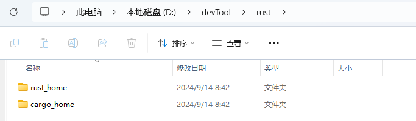

两个文件夹的作用如下：

1. rust_home：存放Rust的元数据和工作包，这个最好放在D盘下面。
2. cargo_home： Rust 的构建系统和包管理器。

---

打开我们的环境变量：


点击新建按钮，配置RUST_HOME如下内容：

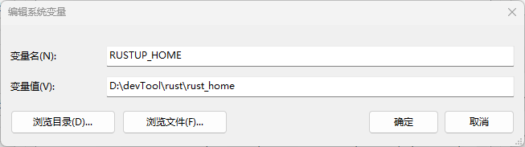

```
RUSTUP_HOME
D:\devTool\rust\rust_home
```

点击新建按钮，配置CARGO_HOME如下内容：


```
CARGO_HOME
D:\devTool\rust\cargo_home
```

将配置好的变量注册到Path中：

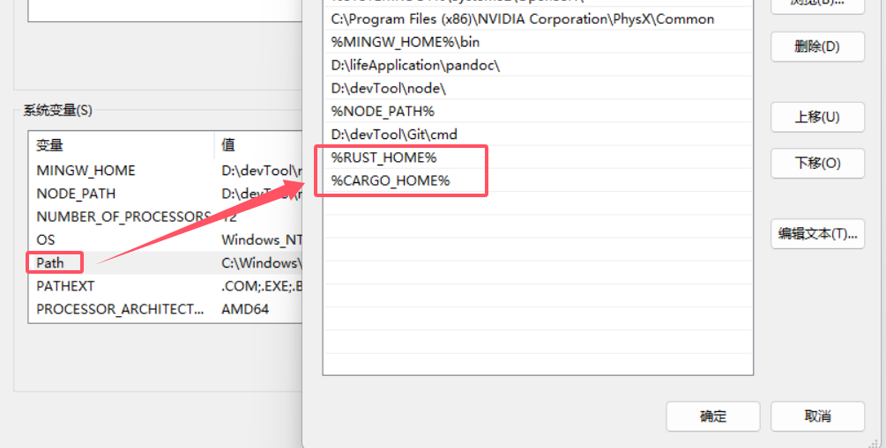

### 1.2.2 Rust配置源

在C盘的用户文件下的settings.toml

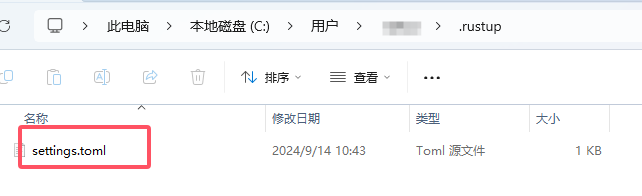

我们打开追加下面内容：

```
[source.crates-io]
registry = "https://github.com/rust-lang/crates.io-index"
replace-with = 'tuna'
[source.tuna]
registry = "https://mirrors.tuna.tsinghua.edu.cn/git/crates.io-index.git"
```


## 1.3 安装Rust

双击我们下载好的exe文件，会出现cmd安装界面：

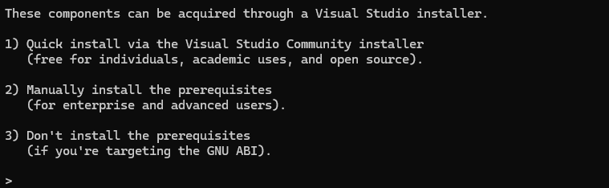

我们是自主安装的，所以我们选择第二个选项，然后选择yes：

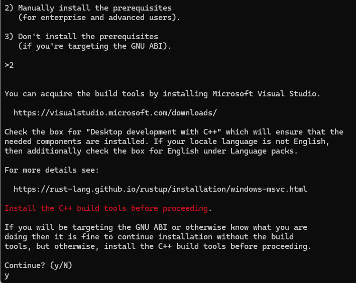

选择第二个选项，并更改默认的x86_64-pc-windows-msvc为x86_64-pc-windows-gnu：

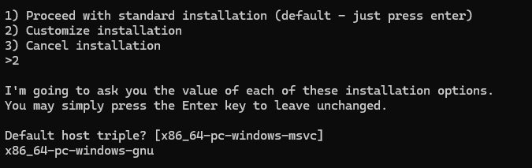


一路回车：

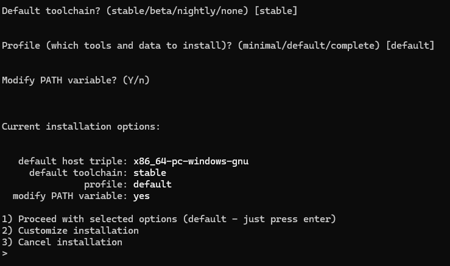

Rust开始下载安装：

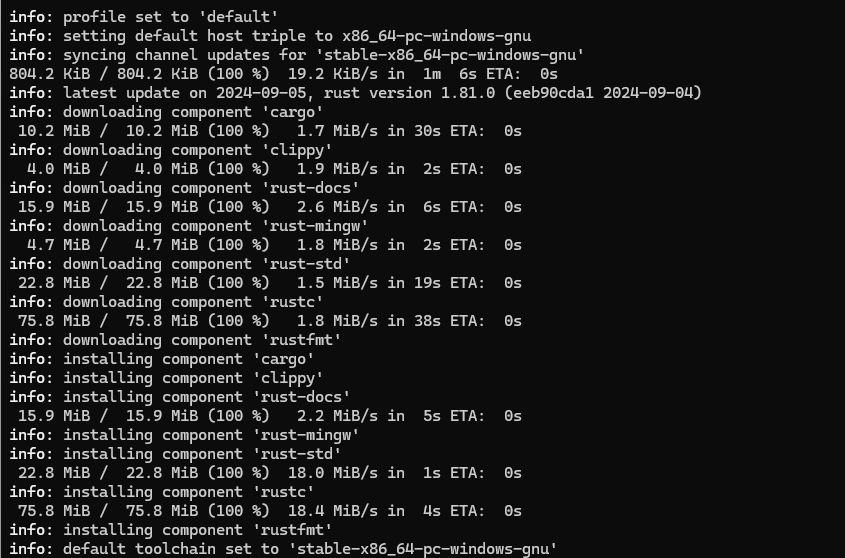

显示安装完成：


## 1.4 Rust的更新和卸载

### 1.4.1 Rust卸载

```bash
C:\Users\user>rustup self uninstall


Thanks for hacking in Rust!

This will uninstall all Rust toolchains and data, and remove
D:\devTool\rust\cargo_home/bin from your PATH environment variable.

Continue? (y/N) y

info: removing rustup home
info: removing cargo home
info: removing rustup binaries
info: rustup is uninstalled
```


### 1.4.2 Rust更新

```
rustup update
```


### 1.4.3 Rust文档

打开cmd，输入：

```
rustup doc
```

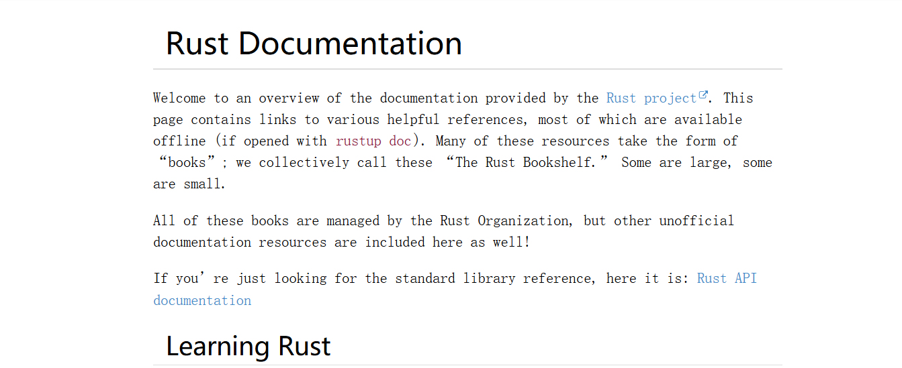


### 1.4.4 VS配置Rust开发环境

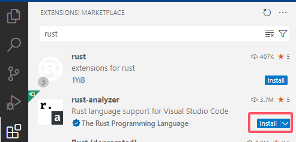

安装rust-analyzer，这个是Rust官方维护的。

