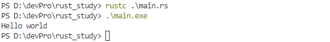

# Rust 程序设计语言

## 前言

Rust 程序设计语言的本质实际在于 **赋能**（*empowerment*）：无论你现在编写的是何种代码，Rust 能让你在更为广泛的编程领域走得更远，写出自信。（这一点并不显而易见）

举例来说，那些“系统层面”的工作涉及内存管理、数据表示和并发等底层细节。从传统角度来看，这是一个神秘的编程领域，只为浸润多年的极少数人所触及，也只有他们能避开那些臭名昭著的陷阱。即使谨慎的实践者，亦唯恐代码出现漏洞、崩溃或损坏。

Rust 破除了这些障碍：它消除了旧的陷阱，并提供了伴你一路同行的友好、精良的工具。想要 “深入” 底层控制的程序员可以使用 Rust，无需时刻担心出现崩溃或安全漏洞，也无需因为工具链不靠谱而被迫去了解其中的细节。更妙的是，语言设计本身会自然而然地引导你编写出可靠的代码，并且运行速度和内存使用上都十分高效。

已经在从事编写底层代码的程序员可以使用 Rust 来提升信心。例如，在 Rust 中引入并行是相对低风险的操作，因为编译器会替你找到经典的错误。同时你可以自信地采取更加激进的优化，而不会意外引入崩溃或漏洞。

但 Rust 并不局限于底层系统编程。它表达力强、写起来舒适，让人能够轻松地编写出命令行应用、网络服务器等各种类型的代码——在本书中就有这两者的简单示例。使用 Rust 能让你把在一个领域中学习的技能延伸到另一个领域：你可以通过编写网页应用来学习 Rust，接着将同样的技能应用到你的 Raspberry Pi（树莓派）上。

本书全面介绍了 Rust 为用户赋予的能力。其内容平易近人，致力于帮助你提升 Rust 的知识，并且提升你作为程序员整体的理解与自信。欢迎你加入 Rust 社区，让我们准备深入学习 Rust 吧！

—— Nicholas Matsakis 和 Aaron Turon

## 简介

欢迎阅读《Rust 程序设计语言》，这是一本关于 Rust 的入门书籍。Rust 程序设计语言能帮助你编写更快、更可靠的软件。在编程语言设计中，高层的工程学与底层的控制往往是难以兼得的；而 Rust 则试图挑战这一矛盾。通过平衡强大的技术能力与优秀的开发者体验，Rust 为你提供了控制底层细节（如内存使用）的选项，而无需承受通常与此类控制相关的所有繁琐细节。

### Rust 适合哪些人

Rust 因多种原因适合许多人。让我们看看几个最重要的群体。

### 开发者团队

Rust 已证明是一个对于具有不同系统编程知识水平的大型开发团队协作而言，非常高效的工具。底层代码容易出现各种微妙的错误，在大多数其他语言中，这些错误只能通过广泛的测试和经验丰富的开发者的仔细审核代码来捕捉。在 Rust 中，编译器充当了守门员的角色，拒绝编译包含这些难以察觉的错误的代码，包括并发错误。通过与编译器合作，团队可以将时间集中在程序逻辑上，而不是追踪 bug。

Rust 也为系统编程世界带来了现代化的开发工具：

- Cargo 是内置的依赖管理器和构建工具，它能轻松增加、编译和管理依赖，并使依赖在 Rust 生态系统中保持一致。
- Rustfmt 格式化工具确保开发者遵循一致的代码风格。
- Rust Language Server 为集成开发环境（IDE）提供了强大的代码补全和内联错误信息功能。

通过使用 Rust 生态系统中丰富的工具，开发者在编写系统级代码时可以更加高效。

### 学生

Rust 适合学生群体，也适合有兴趣学习系统概念的人。许多人通过 Rust 学习了操作系统开发等主题。社区对学生问题非常欢迎并乐于回答。通过类似这本书以及其他内容的努力，Rust 团队希望使系统概念能为更多人所易于理解，特别是编程新手。

### 公司

数百家大小规模的公司在生产环境中使用 Rust 完成各种任务，包括命令行工具、Web 服务、DevOps 工具、嵌入式设备、音视频分析与转码、加密货币、生物信息学、搜索引擎、物联网（IOT）程序、机器学习，甚至是 Firefox 浏览器的重要部分。

### 开源开发者

Rust 适合那些希望构建 Rust 编程语言、社区、开发工具和库的开发者。我们非常欢迎你为 Rust 语言作出贡献。

### 重视速度和稳定性的开发者

Rust 适合那些渴望在编程语言中寻求速度与稳定性的开发者。对于速度来说，既是指 Rust 可以运行的多快，也是指编写 Rust 程序的速度。Rust 编译器的检查确保了增加功能和重构代码时的稳定性，这与那些缺乏这些检查的语言中脆弱的祖传代码形成了鲜明对比，开发者往往不敢去修改这些代码。通过追求零成本抽象（zero-cost abstractions）—— 将高级语言特性编译成底层代码，并且与手写的代码运行速度同样快。Rust 努力确保代码又安全又快速。

这里提到的只是几个较大的受益群体，Rust 语言也希望能支持更多其他用户。总的来说，Rust 最重要的目标是消除数十年来程序员习以为常的取舍，让安全和高效、速度和易读易用**可以兼得**。试试看 Rust，说不定它的选择就适合你。

## 如何阅读本书

本书大体上假设您按从头到尾的顺序阅读。后面的章节建立在前面章节概念的基础上。前面的章节可能不会深入介绍部分主题，而是留待后续章节重新讨论。

本书分为两类章节：概念章节和项目章节。在概念章节中，我们学习 Rust 的某个方面。在项目章节中，我们应用目前所学的知识一同构建小型程序。第 2、12 和 20 章是项目章节；其余都是概念章节。

第 1 章介绍如何安装 Rust，如何编写一个 “Hello, world!” 程序，以及如何使用 Rust 的包管理器和构建工具 Cargo。第 2 章是一个编写 Rust 语言的实战介绍，我们会构建一个猜数字游戏。我们会站在较高的层次介绍一些概念，而后续章节将提供更多细节。如果你希望立刻就动手实践一下，第 2 章是开始的好地方。第 3 章介绍 Rust 中类似其他编程语言的特性，第 4 章会学习 Rust 的所有权系统。如果你是一个特别细致的学习者，喜欢在进入下一环节之前学习每一个细节，你可能会想要跳过第 2 章，直接阅读第 3 章，等到你想要通过项目应用所学到的细节时再回到第 2 章。

第 5 章讨论结构体（struct）和方法，第 6 章介绍枚举（enum）、`match` 表达式和 `if let` 控制流结构。在 Rust 中，创建自定义类型需要用到结构体和枚举。

第 7 章介绍 Rust 的模块（module）系统，其中的私有性规则用来组织代码和公开的 API（应用程序接口）。第 8 章讨论标准库提供的常见集合数据结构，例如 Vector（向量）、字符串和 Hash Map（散列表）。第 9 章探索 Rust 的错误处理的理念与技术。

第 10 章深入介绍泛型（generic）、Trait 和生命周期（lifetime），这些功能让你能够定义适用于多种类型的代码。第 11 章全面讲述了测试，因为就算 Rust 有安全保证，也需要测试确保程序逻辑正确。第 12 章中将会构建我们自己的 `grep` 命令行工具的功能子集实现，用于在文件中搜索文本。为此会用到之前章节讨论的很多概念。

第 13 章探索闭包（closure）和迭代器（iterator），这两个 Rust 特性来自函数式编程语言。第 14 章会深入探讨 Cargo 并介绍分享代码库的最佳实践。第 15 章讨论标准库提供的智能指针以及相关的 Trait。

第 16 章将引导我们了解不同的并发编程模型，并探讨 Rust 如何帮助你无畏地进行多线程编程。第 17 章着眼于比较 Rust 风格与 OOP（面向对象编程）原则。

第 18 章介绍模式和模式匹配，它是在 Rust 程序中表达思想的有效方式。第 19 章是一个高级主题大杂烩，包括不安全 Rust（unsafe Rust）、宏（macro）和更多关于生命周期、Trait、类型、函数和闭包的内容。

第 20 章我们将会完成一个项目，实现一个底层的、多线程的 Web 服务器！

最后的附录包含了一些关于该语言的实用信息，其格式更像是参考资料。附录 A 涵盖了 Rust 的关键字，附录 B 涵盖了 Rust 的运算符和符号，附录 C 涵盖了标准库提供的可派生 Trait，附录 D 涵盖了一些有用的开发工具，而附录 E 解释了 Rust 版本。在附录 F 中，你可以找到本书的翻译版本，而在附录 G 中，我们将讨论 Rust 是如何制作的以及什么是 nightly Rust。

阅读本书没有错误的方式：如果你想跳过前面的内容，尽管跳过！如果你遇到任何困惑，可能需要回到前面的章节。请采取对你最有效的方式。


学习 Rust 的一个重要部分是学会如何阅读编译器显示的错误信息：它们会指引你编写出能运行的代码。为此，我们将提供许多不能编译的示例，以及在每种情况下编译器将显示的错误信息。请知悉，如果你输入并运行一个随机示例，它可能无法编译！确保你阅读了示例周围的文本，以判断你尝试运行的示例是否出错。Ferris 也将帮助你区分那些不是意在工作的代码：

| Ferris                                                       | 含义                           |
| ------------------------------------------------------------ | ------------------------------ |
|  | 这段代码无法通过编译！         |
|  | 这段代码会 Panic！             |
|  | 这段代码的运行结果不符合预期。 |

在大部分情况，我们会指导你将无法通过编译的代码修改为正确版本。


# 1. 入门指南

让我们开始 Rust 之旅！有很多内容需要学习，但每次旅程总有起点。在本章中，我们会讨论：

- 在 Linux、macOS 和 Windows 上安装 Rust
- 编写一个打印 `Hello, world!` 的程序
- 使用 Rust 的包管理器和构建系统 `cargo`

## 1.1 安装

第一步是安装 Rust。我们会通过 `rustup` 下载 Rust，这是一个管理 Rust 版本和相关工具的命令行工具。下载时需要联网。

> 注意：如果你出于某些理由倾向于不使用 `rustup`，请到 [Rust 的其他安装方法页面](https://forge.rust-lang.org/infra/other-installation-methods.html) 查看其它安装选项。

接下来的步骤会安装最新的稳定版 Rust 编译器。Rust 的稳定性确保本书所有示例在最新版本的 Rust 中能够继续编译。不同版本的输出可能略有不同，因为 Rust 经常改进错误信息和警告。也就是说，任何通过这些步骤安装的最新稳定版 Rust，都应该能正常运行本书中的内容。

> **命令行标记**
>
> 本章和全书中，我们会展示一些在终端中使用的命令。所有需要输入到终端的行都以 `$` 开头。你不需要输入`$`字符；这里显示的`$`字符表示命令行提示符，仅用于提示每行命令的起点。不以 `$` 起始的行通常展示前一个命令的输出。另外，PowerShell 专用的示例会采用 `>` 而不是 `$`。

### 1.1.1 在 Linux 或 macOS 上安装 rustup

如果你使用 Linux 或 macOS，打开终端并输入如下命令：

```console
$ curl --proto '=https' --tlsv1.2 https://sh.rustup.rs -sSf | sh
```

此命令下载一个脚本并开始安装 `rustup` 工具，这会安装最新稳定版 Rust。过程中可能会提示你输入密码。如果安装成功，将会出现如下内容：

```text
Rust is installed now. Great!
```

另外，你还需要一个 *链接器（linker）*，这是 Rust 用来将其编译的输出连接到一个文件中的程序。很可能你已经有一个了。如果你遇到了链接器错误，请尝试安装一个 C 编译器，它通常包括一个链接器。C 编译器也很有用，因为一些常见的 Rust 包依赖于 C 代码，因此需要安装一个 C 编译器。

在 macOS 上，你可以通过运行以下命令获得 C 语言编译器：

```console
$ xcode-select --install
```

Linux 用户通常需要根据发行版（distribution）文档安装 GCC 或 Clang。比如，如果你使用 Ubuntu，可以安装 `build-essential` 包。

### 1.1.2 在 Windows 上安装 rustup

在 Windows 上，前往 [https://www.rust-lang.org/install.html](https://www.rust-lang.org/tools/install) 并按照说明安装 Rust。在安装过程的某个步骤，你会收到一个信息说明为什么需要安装 Visual Studio 2013 或其更新版本的 MSVC 构建工具。

要获取构建工具，你需要安装 [Visual Studio 2022](https://visualstudio.microsoft.com/downloads/)。当被问及需要安装什么工作负载（Workload）的时候，请确保勾选了以下内容：

- “使用 C++ 的桌面开发”（“Desktop Development with C++”）
- Windows 10（或 11）SDK
- 英语语言包，以及其他你所需要的语言包

本书的余下部分会使用能同时运行于 *cmd.exe* 和 PowerShell 的命令。如果存在特定差异，我们会解释使用哪一个。

> 2024-09-14 08:06:30：个人安装步骤
>
> 

### 1.1.3 故障排除（Troubleshooting）

要检查是否正确安装了 Rust，打开命令行并输入：

```console
$ rustc --version
```

你应该可以看到按照以下格式显示的最新稳定版本的版本号、对应的 Commit Hash 和 Commit 日期：

```text
rustc x.y.z (abcabcabc yyyy-mm-dd)
```

如果看到了这样的信息，就说明 Rust 已经安装成功了！

> 译者：恭喜入坑！（此处应该有掌声！）

如果没看到，请按照下面说明的方法检查 Rust 是否在您的 `%PATH%` 系统变量中。

在 Windows CMD 中，请使用命令：

```console
> echo %PATH%
```

在 PowerShell 中，请使用命令：

```powershell
> echo $env:Path
```

在 Linux 和 macOS 中，请使用命令：

```console
$ echo $PATH
```

如果一切正确但 Rust 仍不能使用，有许多地方可以求助。您可以在[社区页面](https://www.rust-lang.org/community)查看如何与其他 Rustaceans（Rust 用户的称号，有自嘲意味）联系。

### 1.1.4 更新与卸载

通过 `rustup` 安装了 Rust 之后，更新到最新版本就很简单了，只需要在您对应的命令行中运行如下更新脚本：

```console
$ rustup update
```

若要卸载 Rust 和 `rustup`，请在命令行中运行如下卸载脚本：

```console
$ rustup self uninstall
```

### 1.1.5 本地文档

安装程序也自带一份文档的本地拷贝，可以离线阅读。运行 `rustup doc` 在浏览器中查看本地文档。

任何时候，如果你拿不准标准库中的类型或函数的用途和用法，请查阅应用程序接口（application programming interface，API）文档！


## 1.2 Hello, World!

既然安装好了 Rust，是时候来编写第一个 Rust 程序了。当学习一门新语言的时候，使用该语言在屏幕上打印 `Hello, world!` 是一项传统，我们将沿用这一传统！

> 注意：本书假设你熟悉基本的命令行操作。Rust 对于你的编辑器、工具，以及代码位于何处并没有特定的要求，如果你更倾向于使用集成开发环境（IDE），而不是命令行，请尽管使用你喜欢的 IDE。目前很多 IDE 都在一定程度上支持 Rust；查看 IDE 文档以了解更多细节。Rust 团队一直致力于借助 `rust-analyzer` 提供强大的 IDE 支持。详见[附录 D](https://kaisery.github.io/trpl-zh-cn/appendix-04-useful-development-tools.html)。

### 1.2.1 创建项目目录

首先创建一个存放 Rust 代码的目录。Rust 并不关心代码的存放位置，不过对于本书的练习和项目来说，我们建议你在 home 目录中创建 *projects* 目录，并将你的所有项目存放在这里。

打开终端并输入如下命令创建 *projects* 目录，并在 *projects* 目录中为 “Hello, world!” 项目创建一个目录。

对于 Linux、macOS 和 Windows PowerShell，输入：

```bash
$ mkdir ~/projects
$ cd ~/projects
$ mkdir hello_world
$ cd hello_world
```

对于 Windows CMD，输入：

```doscon
> mkdir "%USERPROFILE%\projects"
> cd /d "%USERPROFILE%\projects"
> mkdir hello_world
> cd hello_world
```

### 1.2.2 编写并运行 Rust 程序

接下来，新建一个源文件，命名为 *main.rs*。Rust 源文件总是以 *.rs* 扩展名结尾。如果文件名包含多个单词，那么按照命名习惯，应当使用下划线来分隔单词。例如命名为 *hello_world.rs*，而不是 *helloworld.rs*。

现在打开刚创建的 *main.rs* 文件，输入示例 1-1 中的代码。

文件名：main.rs

```rust
fn main() {
    println!("Hello, world!");
}
```

示例 1-1: 一个打印 `Hello, world!` 的程序

保存文件，并回到当前目录为“~/projects/hello_world”的终端窗口。在 Linux 或 macOS 上，输入如下命令，编译并运行文件：

```console
$ rustc main.rs
$ ./main
Hello, world!
```



在 Windows 上，输入命令 `.\main.exe`，而不是 `./main`：

```powershell
> rustc main.rs
> .\main.exe
Hello, world!
```

不管使用何种操作系统，终端应该打印字符串 `Hello, world!`。如果没有看到这些输出，回到安装部分的 [“故障排除”](https://kaisery.github.io/trpl-zh-cn/ch01-01-installation.html#故障排除troubleshooting) 小节查找有帮助的方法。

如果 `Hello, world!` 出现了，恭喜你！你已经正式编写了一个 Rust 程序。现在你成为一名 Rust 程序员，欢迎！

### 1.2.3 分析这个 Rust 程序

现在，让我们回过头来仔细看看这个 “Hello, world!” 程序。这是第一块拼图：

```rust
fn main() {

}
```

这几行定义了一个名叫 `main` 的函数。`main` 函数是一个特殊的函数：在可执行的 Rust 程序中，它总是最先运行的代码。第一行代码声明了一个叫做 `main` 的函数，它没有参数也没有返回值。如果有参数的话，它们的名称应该出现在小括号 `()` 中。

函数体被包裹在 `{}` 中。Rust 要求所有函数体都要用花括号包裹起来。一般来说，将左花括号与函数声明置于同一行并以空格分隔，是良好的代码风格。

> 注：如果你希望在 Rust 项目中保持一种标准风格，可以使用名为 `rustfmt` 的自动格式化工具将代码格式化为特定的风格（更多内容详见[附录 D](https://kaisery.github.io/trpl-zh-cn/appendix-04-useful-development-tools.html) 中的 `rustfmt`）。Rust 团队已经在标准的 Rust 发行版中包含了这个工具，就像 `rustc` 一样。所以它应该已经安装在你的电脑中了！

在 `main` 函数中有如下代码：

```rust
    println!("Hello, world!");
```

这行代码完成这个简单程序的所有工作：在屏幕上打印文本。这里有四个重要的细节需要注意。首先 Rust 的缩进风格使用 4 个空格，而不是 1 个制表符（tab）。

第二，`println!` 调用了一个 Rust 宏（macro）。如果是调用函数，则应输入 `println`（没有`!`）。我们将在第十九章详细讨论宏。现在你只需记住，当看到符号 `!` 的时候，就意味着调用的是宏而不是普通函数，并且宏并不总是遵循与函数相同的规则。

第三，`"Hello, world!"` 是一个字符串。我们把这个字符串作为一个参数传递给 `println!`，字符串将被打印到屏幕上。

第四，该行以分号结尾（`;`），这代表一个表达式的结束和下一个表达式的开始。大部分 Rust 代码行以分号结尾。

### 1.2.4 编译和运行是彼此独立的步骤

你刚刚运行了一个新创建的程序，那么让我们检查此过程中的每一个步骤。

在运行 Rust 程序之前，必须先使用 Rust 编译器编译它，即输入 `rustc` 命令并传入源文件名称，如下：

```console
$ rustc main.rs
```

如果你有 C 或 C++ 背景，就会发现这与 `gcc` 和 `clang` 类似。编译成功后，Rust 会输出一个二进制的可执行文件。

在 Linux、macOS 或 Windows 的 PowerShell 上，在 shell 中输入 `ls` 命令可以看见这个可执行文件。

```console
$ ls
main  main.rs
```

在 Linux 和 macOS，你会看到两个文件。在 Windows PowerShell 中，你会看到同使用 CMD 相同的三个文件。在 Windows 的 CMD 上，则输入如下内容：

```doscon
> dir /B %= the /B option says to only show the file names =%
main.exe
main.pdb
main.rs
```

这展示了扩展名为 *.rs* 的源文件、可执行文件（在 Windows 下是 *main.exe*，其它平台是 *main*），以及当使用 CMD 时会有一个包含调试信息、扩展名为 *.pdb* 的文件。从这里开始运行 *main* 或 *main.exe* 文件，如下：

```console
$ ./main # Windows 是 .\main.exe
```

如果这里的 *main.rs* 是上文所述的 “Hello, world!” 程序，那么在终端上就会打印出 `Hello, world!`。

如果你更熟悉动态语言，如 Ruby、Python 或 JavaScript，则可能不习惯将编译和运行分为两个单独的步骤。Rust 是一种 **预编译静态类型**（*ahead-of-time compiled*）语言，这意味着你可以编译程序，并将可执行文件送给其他人，他们甚至不需要安装 Rust 就可以运行。如果你给他人一个 *.rb*、*.py* 或 *.js* 文件，他们需要先分别安装 Ruby，Python，JavaScript 实现（运行时环境，VM）。不过在这些语言中，只需要一句命令就可以编译和运行程序。这一切都是语言设计上的权衡取舍。

仅仅使用 `rustc` 编译简单程序是没问题的，不过随着项目的增长，你可能需要管理你项目的方方面面，并让代码易于分享。接下来，我们要介绍一个叫做 Cargo 的工具，它会帮助你编写真实世界中的 Rust 程序。


## 1.3 Hello, Cargo!

Cargo 是 Rust 的构建系统和包管理器。大多数 Rustacean 们使用 Cargo 来管理他们的 Rust 项目，因为它可以为你处理很多任务，比如构建代码、下载依赖库并编译这些库。（我们把代码所需要的库叫做 **依赖**（*dependencies*））。

最简单的 Rust 程序，比如我们刚刚编写的，没有任何依赖。如果使用 Cargo 来构建 “Hello, world!” 项目，将只会用到 Cargo 构建代码的那部分功能。在编写更复杂的 Rust 程序时，你将添加依赖项，如果使用 Cargo 启动项目，则添加依赖项将更容易。

由于绝大多数 Rust 项目使用 Cargo，本书接下来的部分假设你也使用 Cargo。如果使用 [“安装”](https://kaisery.github.io/trpl-zh-cn/ch01-01-installation.html#安装) 部分介绍的官方安装包的话，则自带了 Cargo。如果通过其他方式安装的话，可以在终端输入如下命令检查是否安装了 Cargo：

```console
$ cargo --version
```

如果你看到了版本号，说明已安装！如果看到类似 `command not found` 的错误，你应该查看相应安装文档以确定如何单独安装 Cargo。

### 1.3.1 使用 Cargo 创建项目

我们使用 Cargo 创建一个新项目，然后看看与上面的 “Hello, world!” 项目有什么不同。回到 *projects* 目录（或者你存放代码的目录）。接着，可在任何操作系统下运行以下命令：

```console
$ cargo new hello_cargo
$ cd hello_cargo
```

第一行命令新建了名为 *hello_cargo* 的目录和项目。我们将项目命名为 *hello_cargo*，同时 Cargo 在一个同名目录中创建项目文件。

进入 *hello_cargo* 目录并列出文件。将会看到 Cargo 生成了两个文件和一个目录：一个 *Cargo.toml* 文件，一个 *src* 目录，以及位于 *src* 目录中的 *main.rs* 文件。

这也会在 *hello_cargo* 目录初始化了一个 git 仓库，以及一个 *.gitignore* 文件。如果在一个已经存在的 git 仓库中运行 `cargo new`，则这些 git 相关文件则不会生成；可以通过运行 `cargo new --vcs=git` 来覆盖这些行为。

> 注意：Git 是一个常用的版本控制系统（version control system，VCS）。可以通过 `--vcs` 参数使 `cargo new` 切换到其它版本控制系统（VCS），或者不使用 VCS。运行 `cargo new --help` 参看可用的选项。

请自行选用文本编辑器打开 *Cargo.toml* 文件。它应该看起来如示例 1-2 所示：

文件名：Cargo.toml

```toml
[package]
name = "hello_cargo"
version = "0.1.0"
edition = "2021"

# See more keys and their definitions at https://doc.rust-lang.org/cargo/reference/manifest.html

[dependencies]
```

示例 1-2: *cargo new* 命令生成的 *Cargo.toml* 的内容

这个文件使用 [*TOML*](https://toml.io/) (*Tom's Obvious, Minimal Language*) 格式，这是 Cargo 配置文件的格式。

第一行，`[package]`，是一个片段（section）标题，表明下面的语句用来配置一个包。随着我们在这个文件增加更多的信息，还将增加其他片段（section）。

接下来的三行设置了 Cargo 编译程序所需的配置：项目的名称、项目的版本以及要使用的 Rust 版本。[附录 E](https://kaisery.github.io/trpl-zh-cn/appendix-05-editions.html) 会介绍 `edition` 的值。

最后一行，`[dependencies]`，是罗列项目依赖的片段的开始。在 Rust 中，代码包被称为 *crates*。这个项目并不需要其他的 crate，不过在第二章的第一个项目会用到依赖，那时会用得上这个片段。

现在打开 *src/main.rs* 看看：

文件名：src/main.rs

```rust
fn main() {
    println!("Hello, world!");
}
```

Cargo 为你生成了一个 “Hello, world!” 程序，正如我们之前编写的示例 1-1！目前为止，**我们的项目与 Cargo 生成项目的区别是 Cargo 将代码放在 *src* 目录，同时项目根目录包含一个 *Cargo.toml* 配置文件**。

Cargo 期望源文件存放在 *src* 目录中。项目根目录只存放 README、license 信息、配置文件和其他跟代码无关的文件。使用 Cargo 帮助你保持项目干净整洁，一切井井有条。

如果没有使用 Cargo 开始项目，比如我们创建的 Hello,world! 项目，可以将其转化为一个 Cargo 项目。将代码放入 *src* 目录，并创建一个合适的 *Cargo.toml* 文件。

### 1.3.2 构建并运行 Cargo 项目

现在让我们看看通过 Cargo 构建和运行 “Hello, world!” 程序有什么不同！在 *hello_cargo* 目录下，输入下面的命令来构建项目：

```console
$ cargo build
   Compiling hello_cargo v0.1.0 (file:///projects/hello_cargo)
    Finished dev [unoptimized + debuginfo] target(s) in 2.85 secs
```

这个命令会创建一个可执行文件 *target/debug/hello_cargo* （在 Windows 上是 *target\debug\hello_cargo.exe*），而不是放在目前目录下。由于默认的构建方法是调试构建（debug build），Cargo 会将可执行文件放在名为 *debug* 的目录中。可以通过这个命令运行可执行文件：

```console
$ ./target/debug/hello_cargo # 或者在 Windows 下为 .\target\debug\hello_cargo.exe
Hello, world!
```

如果一切顺利，终端上应该会打印出 `Hello, world!`。首次运行 `cargo build` 时，也会使 Cargo 在项目根目录创建一个新文件：*Cargo.lock*。这个文件记录项目依赖的实际版本。这个项目并没有依赖，所以其内容比较少。你自己永远也不需要碰这个文件，让 Cargo 处理它就行了。

我们刚刚使用 `cargo build` 构建了项目，并使用 `./target/debug/hello_cargo` 运行了程序，也可以使用 `cargo run` 在一个命令中同时编译并运行生成的可执行文件：

```console
$ cargo run
    Finished dev [unoptimized + debuginfo] target(s) in 0.0 secs
     Running `target/debug/hello_cargo`
Hello, world!
```

比起要记得运行 `cargo build` 之后再用可执行文件的完整路径来运行程序，使用 `cargo run` 可以实现完全相同的效果，而且要方便得多，所以大多数开发者会使用 `cargo run`。

注意这一次并没有出现表明 Cargo 正在编译 `hello_cargo` 的输出。Cargo 发现文件并没有被改变，所以它并没有重新编译，而是直接运行了可执行文件。如果修改了源文件的话，Cargo 会在运行之前重新构建项目，并会出现像这样的输出：

```console
$ cargo run
   Compiling hello_cargo v0.1.0 (file:///projects/hello_cargo)
    Finished dev [unoptimized + debuginfo] target(s) in 0.33 secs
     Running `target/debug/hello_cargo`
Hello, world!
```

Cargo 还提供了一个叫 `cargo check` 的命令。该命令快速检查代码确保其可以编译，但并不产生可执行文件：

```console
$ cargo check
   Checking hello_cargo v0.1.0 (file:///projects/hello_cargo)
    Finished dev [unoptimized + debuginfo] target(s) in 0.32 secs
```

为什么你会不需要可执行文件呢？通常 `cargo check` 要比 `cargo build` 快得多，因为它省略了生成可执行文件的步骤。如果你在编写代码时持续的进行检查，`cargo check` 可以让你快速了解现在的代码能不能正常通过编译！为此很多 Rustaceans 编写代码时定期运行 `cargo check` 确保它们可以编译。当准备好使用可执行文件时才运行 `cargo build`。

我们回顾下已学习的 Cargo 内容：

- 可以使用 `cargo new` 创建项目。
- 可以使用 `cargo build` 构建项目。
- 可以使用 `cargo run` 一步构建并运行项目。
- 可以使用 `cargo check` 在不生成二进制文件的情况下构建项目来检查错误。
- 有别于将构建结果放在与源码相同的目录，Cargo 会将其放到 *target/debug* 目录。

使用 Cargo 的一个额外的优点是，不管你使用什么操作系统，其命令都是一样的。所以从现在开始本书将不再为 Linux 和 macOS 以及 Windows 提供相应的命令。

### 1.3.3 发布（release）构建

当项目最终准备好发布时，可以使用 `cargo build --release` 来优化编译项目。这会在 *target/release* 而不是 *target/debug* 下生成可执行文件。这些优化可以让 Rust 代码运行的更快，不过启用这些优化也需要消耗更长的编译时间。这也就是为什么会有两种不同的配置：一种是为了开发，你需要经常快速重新构建；另一种是为用户构建最终程序，它们不会经常重新构建，并且希望程序运行得越快越好。如果你在测试代码的运行时间，请确保运行 `cargo build --release` 并使用 *target/release* 下的可执行文件进行测试。

### 1.3.4 把 Cargo 当作习惯

对于简单项目，Cargo 并不比 `rustc` 提供了更多的优势，不过随着开发的深入，终将证明其价值。一旦程序壮大到由多个文件组成，亦或者是需要其他的依赖，让 Cargo 协调构建过程就会简单得多。

即便 `hello_cargo` 项目十分简单，它现在也使用了很多在你之后的 Rust 生涯将会用到的实用工具。其实，要在任何已存在的项目上工作时，可以使用如下命令通过 Git 检出代码，移动到该项目目录并构建：

```console
$ git clone example.org/someproject
$ cd someproject
$ cargo build
```

关于更多 Cargo 的信息，请查阅 [其文档](https://doc.rust-lang.org/cargo/)。

## 1.4 总结

你已经准备好开启 Rust 之旅了！在本章中，你学习了如何：

- 使用 `rustup` 安装最新稳定版的 Rust
- 更新到新版的 Rust
- 打开本地安装的文档
- 直接通过 `rustc` 编写并运行 Hello, world! 程序
- 使用 Cargo 创建并运行新项目

是时候通过构建更实质性的程序来熟悉读写 Rust 代码了。所以在第二章我们会构建一个猜猜看游戏程序。如果你更愿意从学习 Rust 常用的编程概念开始，请阅读第三章，接着再回到第二章。


# 2. 写个猜数字游戏

让我们一起动手完成一个项目来快速上手 Rust！本章将介绍一些 Rust 中常见的概念，并通过真实的程序来展示如何运用它们。你将会学到 `let`、`match`、方法（methods）、关联函数（associated functions）、外部 crate 等知识！后续章节会深入探讨这些概念的细节。在这一章，我们将主要练习基础内容。

我们会实现一个经典的新手编程问题：猜数字游戏。游戏的规则如下：程序将会生成一个 1 到 100 之间的随机整数。然后提示玩家输入一个猜测值。输入后，程序会指示该猜测是太低还是太高。如果猜对了，游戏会打印祝贺信息并退出。

## 2.1 准备一个新项目

要创建一个新项目，进入第一章中创建的 *projects* 目录，使用 Cargo 新建一个项目，如下：

```console
$ cargo new guessing_game
$ cd guessing_game
```

第一个命令，`cargo new`，它获取项目的名称（`guessing_game`）作为第一个参数。第二个命令进入到新创建的项目目录。

看看生成的 *Cargo.toml* 文件：

文件名：Cargo.toml

```toml
[package]
name = "guessing_game"
version = "0.1.0"
edition = "2021"

# See more keys and their definitions at https://doc.rust-lang.org/cargo/reference/manifest.html

[dependencies]
```

正如第一章那样，`cargo new` 生成了一个 “Hello, world!” 程序。查看 *src/main.rs* 文件：

文件名：src/main.rs

```rust
fn main() {
    println!("Hello, world!");
}
```

现在使用 `cargo run` 命令，一步完成 “Hello, world!” 程序的编译和运行：

```console
$ cargo run
   Compiling guessing_game v0.1.0 (file:///projects/guessing_game)
    Finished `dev` profile [unoptimized + debuginfo] target(s) in 1.50s
     Running `target/debug/guessing_game`
Hello, world!
```

当你需要在项目中快速迭代时，`run` 命令就能派上用场，正如我们在这个游戏项目中做的，在下一次迭代之前快速测试每一次迭代。

重新打开 *src/main.rs* 文件。我们将会在这个文件中编写全部的代码。

## 2.2 处理一次猜测

猜数字程序的第一部分请求和处理用户输入，并检查输入是否符合预期的格式。首先，我们会允许玩家输入一个猜测。在 *src/main.rs* 中输入示例 2-1 中的代码。

```rust
use std::io;

fn main() {
    println!("Guess the number!");

    println!("Please input your guess.");

    let mut guess = String::new();

    io::stdin()
        .read_line(&mut guess)
        .expect("Failed to read line");

    println!("You guessed: {}", guess);
}
```

这些代码包含很多信息，我们一行一行地过一遍。为了获取用户输入并打印结果作为输出，我们需要将 `io` 输入/输出库引入当前作用域。`io` 库来自于标准库，也被称为 `std`：

```rust
use std::io;
```

默认情况下，Rust 设定了若干个会自动导入到每个程序作用域中的标准库内容，这组内容被称为 *预导入（prelude）* 内容。你可以在[标准库文档](https://doc.rust-lang.org/std/prelude/index.html)中查看预导入的所有内容。

如果你需要的类型不在预导入内容中，就必须使用 `use` 语句显式地将其引入作用域。`std::io` 库提供很多有用的功能，包括接收用户输入的功能。

如第一章所提及，`main` 函数是程序的入口点：

```rust
fn main() {
```

`fn` 语法声明了一个新函数，小括号 `()` 表明没有参数，大括号 `{` 作为函数体的开始。

第一章也提及了 `println!` 是一个在屏幕上打印字符串的宏：

```rust
    println!("Guess the number!");

    println!("Please input your guess.");
```

这些代码仅仅打印提示，介绍游戏的内容然后请求用户输入。

### 2.2.1 使用变量储存值

接下来，创建一个 **变量**（*variable*）来储存用户输入，像这样：

```rust
    let mut guess = String::new();
```

现在程序开始变得有意思了！这一小行代码发生了很多事。我们使用 `let` 语句来创建变量。这里是另外一个例子：

```rust
let apples = 5;
```

这行代码新建了一个叫做 `apples` 的变量并把它绑定到值 `5` 上。在 Rust 中，变量默认是不可变的，这意味着一旦我们给变量赋值，这个值就不再可以修改了。我们将会在第三章的 [“变量与可变性”](https://kaisery.github.io/trpl-zh-cn/ch03-01-variables-and-mutability.html#变量和可变性) 部分详细讨论这个概念。下面的例子展示了如何在变量名前使用 `mut` 来使一个变量可变：

```rust
let apples = 5; // 不可变
let mut bananas = 5; // 可变
```

> 注意：`//` 语法开始一个注释，持续到行尾。Rust 忽略注释中的所有内容，[第三章](https://kaisery.github.io/trpl-zh-cn/ch03-04-comments.html)将会详细介绍注释。

回到猜数字程序中。现在我们知道了 `let mut guess` 会引入一个叫做 `guess` 的可变变量。等号（`=`）告诉 Rust 我们现在想将某个值绑定在变量上。等号的右边是 `guess` 所绑定的值，它是 `String::new` 的结果，这个函数会返回一个 `String` 的新实例。[`String`](https://doc.rust-lang.org/std/string/struct.String.html) 是一个标准库提供的字符串类型，它是 UTF-8 编码的可增长文本块。

`::new` 那一行的 `::` 语法表明 `new` 是 `String` 类型的一个 **关联函数**（*associated function*）。关联函数是针对某个类型实现的函数，在这个例子中是 `String`。这个 `new` 函数创建了一个新的空字符串。你会发现许多类型上都有一个 `new` 函数，因为这是为某种类型创建新值的常用函数名。

总的来说，`let mut guess = String::new();` 这一行创建了一个可变变量，当前它绑定到一个新的 `String` 空实例上。

### 2.2.2 接收用户输入

回忆一下，我们在程序的第一行使用 `use std::io;` 从标准库中引入了输入/输出功能。现在调用 `io` 库中的函数 `stdin`，这允许我们处理用户输入：

```rust
    io::stdin()
        .read_line(&mut guess)
```

如果程序的开头没有使用 `use std::io;` 引入 `io` 库，我们仍可以通过把函数调用写成 `std::io::stdin` 来使用该函数。`stdin` 函数返回一个 [`std::io::Stdin`](https://doc.rust-lang.org/std/io/struct.Stdin.html) 的实例，这是一种代表终端标准输入句柄的类型。

接下来，代码中的 `.read_line(&mut guess)` 调用了标准输入句柄上的 [`read_line`](https://doc.rust-lang.org/std/io/struct.Stdin.html#method.read_line) 方法，以获取用户输入。我们还将 `&mut guess` 作为参数传递给 `read_line` 函数，让其将用户输入储存到这个字符串中。`read_line` 的工作是，无论用户在标准输入中键入什么内容，都将其追加（不会覆盖其原有内容）到一个字符串中，因此它需要字符串作为参数。这个字符串参数应该是可变的，以便 `read_line` 将用户输入附加上去。

`&` 表示这个参数是一个 **引用**（*reference*），它允许多处代码访问同一处数据，而无需在内存中多次拷贝。引用是一个复杂的特性，Rust 的一个主要优势就是安全而简单的操纵引用。完成当前程序并不需要了解如此多细节。现在，我们只需知道它像变量一样，默认是不可变的。因此，需要写成 `&mut guess` 来使其可变，而不是 `&guess`。（第四章会更全面的解释引用。）

### 2.2.3 使用 `Result` 类型来处理潜在的错误

我们还没有完全分析完这行代码。虽然我们已经讲到了第三行代码，但要注意：它仍是逻辑行（虽然换行了但仍是语句）的一部分。后一部分是这个方法（method）：

```rust
        .expect("Failed to read line");
```

我们也可以将代码这样写：

```rust
io::stdin().read_line(&mut guess).expect("Failed to read line");
```

不过，过长的代码行难以阅读，所以最好拆开来写。通常来说，当使用 `.method_name()` 语法调用方法时引入换行符和空格将长的代码行拆开是明智的。现在来看看这行代码干了什么。

之前提到了 `read_line` 会将用户输入附加到传递给它的字符串中，不过它也会返回一个类型为 `Result` 的值。 [`Result`](https://doc.rust-lang.org/std/result/enum.Result.html) 是一种[*枚举类型*](https://kaisery.github.io/trpl-zh-cn/ch06-00-enums.html)，通常也写作 *enum*。枚举类型变量的值可以是多种可能状态中的一个。我们把每种可能的状态称为一种 *枚举成员（variant）*。

[第六章](https://kaisery.github.io/trpl-zh-cn/ch06-00-enums.html)将介绍枚举的更多细节。这里的 `Result` 类型将用来编码错误处理的信息。

`Result` 的成员是 `Ok` 和 `Err`，`Ok` 成员表示操作成功，内部包含成功时产生的值。`Err` 成员则意味着操作失败，并且 `Err` 中包含有关操作失败的原因或方式的信息。

这些 `Result` 类型的作用是编码错误处理信息。`Result` 类型的值，像其他类型一样，拥有定义于其上的方法。`Result` 的实例拥有 [`expect` 方法](https://doc.rust-lang.org/std/result/enum.Result.html#method.expect)。如果 `io::Result` 实例的值是 `Err`，`expect` 会导致程序崩溃，并显示当做参数传递给 `expect` 的信息。如果 `read_line` 方法返回 `Err`，则可能是来源于底层操作系统错误的结果。如果 `Result` 实例的值是 `Ok`，`expect` 会获取 `Ok` 中的值并原样返回。在本例中，这个值是用户输入到标准输入中的字节数。

如果不调用 `expect`，程序也能编译，不过会出现一个警告：

```rust
$ cargo build
   Compiling guessing_game v0.1.0 (file:///projects/guessing_game)
warning: unused `Result` that must be used
  --> src/main.rs:10:5
   |
10 |     io::stdin().read_line(&mut guess);
   |     ^^^^^^^^^^^^^^^^^^^^^^^^^^^^^^^^^
   |
   = note: this `Result` may be an `Err` variant, which should be handled
   = note: `#[warn(unused_must_use)]` on by default
help: use `let _ = ...` to ignore the resulting value
   |
10 |     let _ = io::stdin().read_line(&mut guess);
   |     +++++++

warning: `guessing_game` (bin "guessing_game") generated 1 warning
    Finished `dev` profile [unoptimized + debuginfo] target(s) in 0.59s
```

Rust 警告我们没有使用 `read_line` 的返回值 `Result`，说明有一个可能的错误没有处理。

消除警告的正确做法是实际去编写错误处理代码，不过由于我们就是希望程序在出现问题时立即崩溃，所以直接使用 `expect`。[第九章](https://kaisery.github.io/trpl-zh-cn/ch09-02-recoverable-errors-with-result.html) 会学习如何从错误中恢复。

### 2.2.4 使用 `println!` 占位符打印值

除了位于结尾的右花括号，目前为止就只有这一行代码值得讨论一下了，就是这一行：

```rust
    println!("You guessed: {}", guess);
```

这行代码现在打印了存储用户输入的字符串。`{}` 这对大括号是一个占位符：把 `{}` 想象成小蟹钳，可以夹住合适的值。当打印变量的值时，变量名可以写进大括号中。当打印表达式的执行结果时，格式化字符串（format string）中大括号中留空，格式化字符串后跟逗号分隔的需要打印的表达式列表，其顺序与每一个空大括号占位符的顺序一致。在一个 `println!` 调用中打印变量和表达式的值看起来像这样：

```rust
let x = 5;
let y = 10;

println!("x = {x} and y + 2 = {}", y + 2);
```

这行代码会打印出 `x = 5 and y + 2 = 12`。

### 2.2.5 测试第一部分代码

让我们来测试下猜数字游戏的第一部分。使用 `cargo run` 运行：

```console
$ cargo run
   Compiling guessing_game v0.1.0 (file:///projects/guessing_game)
    Finished dev [unoptimized + debuginfo] target(s) in 6.44s
     Running `target/debug/guessing_game`
Guess the number!
Please input your guess.
6
You guessed: 6
```

至此为止，游戏的第一部分已经完成：我们从键盘获取输入并打印了出来。

## 2.3 生成一个秘密数字

接下来，需要生成一个秘密数字，好让用户来猜。秘密数字应该每次都不同，这样重复玩才不会乏味；范围应该在 1 到 100 之间，这样才不会太困难。Rust 标准库中尚未包含随机数功能。然而，Rust 团队还是提供了一个包含上述功能的 [`rand` crate](https://crates.io/crates/rand)。

### 2.3.1 使用 crate 来增加更多功能

记住，crate 是一组 Rust 源代码文件。我们正在构建的项目是一个 *二进制 crate*，它生成一个可执行文件。 `rand` crate 是一个 *库 crate*，库 crate 可以包含任意能被其他程序使用的代码，但是无法独立执行。

Cargo 对外部 crate 的运用是其真正的亮点所在。在我们使用 `rand` 编写代码之前，需要修改 *Cargo.toml* 文件，引入一个 `rand` 依赖。现在打开这个文件并将下面这一行添加到 `[dependencies]` 片段标题之下。在当前版本下，请确保按照我们这里的方式指定 `rand`，否则本教程中的示例代码可能无法工作。

文件名：Cargo.toml

```toml
[dependencies]
rand = "0.8.5"
```

在 *Cargo.toml* 文件中，标题以及之后的内容属同一个片段，直到遇到下一个标题才开始新的片段。`[dependencies]` 片段告诉 Cargo 本项目依赖了哪些外部 crate 及其版本。本例中，我们使用语义化版本 `0.8.5` 来指定 `rand` crate。Cargo 理解 [语义化版本（Semantic Versioning）](http://semver.org/)（有时也称为 *SemVer*），这是一种定义版本号的标准。`0.8.5` 事实上是 `^0.8.5` 的简写，它表示任何至少是 `0.8.5` 但小于 `0.9.0` 的版本。

Cargo 认为这些版本与 `0.8.5` 版本的公有 API 相兼容，这样的版本指定确保了我们可以获取能使本章代码编译的最新的补丁（patch）版本。任何大于等于 `0.9.0` 的版本不能保证和接下来的示例采用了相同的 API。

现在，不修改任何代码，构建项目，如示例 2-2 所示。

```console
$ cargo build
    Updating crates.io index
  Downloaded rand v0.8.5
  Downloaded libc v0.2.127
  Downloaded getrandom v0.2.7
  Downloaded cfg-if v1.0.0
  Downloaded ppv-lite86 v0.2.16
  Downloaded rand_chacha v0.3.1
  Downloaded rand_core v0.6.3
   Compiling libc v0.2.127
   Compiling getrandom v0.2.7
   Compiling cfg-if v1.0.0
   Compiling ppv-lite86 v0.2.16
   Compiling rand_core v0.6.3
   Compiling rand_chacha v0.3.1
   Compiling rand v0.8.5
   Compiling guessing_game v0.1.0 (file:///projects/guessing_game)
    Finished dev [unoptimized + debuginfo] target(s) in 2.53s
```

可能会出现不同的版本号（多亏了语义化版本，它们与代码是兼容的！），并且显示的行数可能会有所不同（取决于操作系统），行的顺序也可能会不同。

现在我们有了一个外部依赖，Cargo 从 *registry* 上获取所有包的最新版本信息，这是一份来自 [Crates.io](https://crates.io/) 的数据副本。Crates.io 是 Rust 生态系统中，人们发布其开源 Rust 项目的平台，供他人使用。

在更新完 *registry* 后，Cargo 检查 `[dependencies]` 片段并下载列表中包含但还未下载的 crates。本例中，虽然只声明了 `rand` 一个依赖，然而 Cargo 还是额外获取了 `rand` 所需要的其他 crates，因为 `rand` 依赖它们来正常工作。下载完成后，Rust 编译依赖，然后使用这些依赖编译项目。

如果不做任何修改，立刻再次运行 `cargo build`，则不会看到任何除了 `Finished` 行之外的输出。Cargo 知道它已经下载并编译了依赖，同时 *Cargo.toml* 文件也没有变动。Cargo 还知道代码也没有任何修改，所以它不会重新编译代码。因为无事可做，它会简单地退出。

如果打开 *src/main.rs* 文件，做一些无关紧要的修改，保存并再次构建，则会出现两行输出：

```console
$ cargo build
   Compiling guessing_game v0.1.0 (file:///projects/guessing_game)
    Finished dev [unoptimized + debuginfo] target(s) in 2.53 secs
```

这一行表示 Cargo 只针对 *src/main.rs* 文件的微小修改而更新构建。依赖没有变化，所以 Cargo 知道它可以复用已经为此下载并编译的代码。它只是重新构建了部分（项目）代码。

#### 1. Cargo.lock 文件确保构建是可重现的

Cargo 有一个机制，确保无论是你还是其他人在任何时候重新构建代码，都会生成相同的构建产物：Cargo 只会使用你指定的依赖版本，除非你明确指定其他版本。例如，如果下周 `rand` crate 的 `0.8.6` 版本出来了，该版本包含了一个重要的 bug 修复，但同时也引入了一个会破坏你代码的回归问题。为了解决这个问题，Rust 在你第一次运行 `cargo build` 时创建了 *Cargo.lock* 文件，我们现在可以在 *guessing_game* 目录找到它。

当第一次构建项目时，Cargo 计算出所有符合要求的依赖版本并写入 *Cargo.lock* 文件。当将来构建项目时，Cargo 会发现 *Cargo.lock* 已存在并使用其中指定的版本，而不是再次计算所有的版本。这使得你拥有了一个自动化的可重现的构建。换句话说，项目会持续使用 `0.8.5` 直到你显式升级，多亏有了 *Cargo.lock* 文件。由于 *Cargo.lock* 文件对于“可重复构建”非常重要，因此它通常会和项目中的其余代码一样纳入到版本控制系统中。

#### 2. 更新 crate 到一个新版本

当你 **确实** 需要升级 crate 时，Cargo 提供了这样一个命令，`update`，它会忽略 *Cargo.lock* 文件，并计算出所有符合 *Cargo.toml* 声明的最新版本。Cargo 接下来会把这些版本写入 *Cargo.lock* 文件。不过，Cargo 默认只会寻找大于 `0.8.5` 而小于 `0.9.0` 的版本。如果 `rand` crate 发布了两个新版本，`0.8.6` 和 `0.9.0`，在运行 `cargo update` 时会出现如下内容：

```console
$ cargo update
    Updating crates.io index
    Updating rand v0.8.5 -> v0.8.6
```

Cargo 忽略了 `0.9.0` 版本。这时，你也会注意到的 *Cargo.lock* 文件中的变化无外乎现在使用的 `rand` crate 版本是`0.8.6` 。如果想要使用 `0.9.0` 版本的 `rand` 或是任何 `0.9.x` 系列的版本，必须像这样更新 *Cargo.toml* 文件：

```toml
[dependencies]
rand = "0.9.0"
```

下一次运行 `cargo build` 时，Cargo 会更新可用 crate 的 registry，并根据你指定的新版本重新评估 `rand` 的要求。

第十四章会讲到 [Cargo](http://doc.crates.io/) 及其[生态系统](http://doc.crates.io/crates-io.html) 的更多内容，不过目前你只需要了解这么多。通过 Cargo 复用库文件非常容易，因此 Rustacean 能够编写出由很多包组装而成的更轻巧的项目。

### 2.3.2 生成一个随机数

让我们开始使用 `rand` 来生成一个猜数字随机数。下一步是更新 *src/main.rs*，如示例 2-3 所示。

```rust
use std::io;
use rand::Rng;

fn main() {
    println!("Guess the number!");

    let secret_number = rand::thread_rng().gen_range(1..=100);

    println!("The secret number is: {secret_number}");

    println!("Please input your guess.");

    let mut guess = String::new();

    io::stdin()
        .read_line(&mut guess)
        .expect("Failed to read line");

    println!("You guessed: {guess}");
}
```

首先，我们新增了一行 `use rand::Rng;`。`Rng` 是一个 trait，它定义了随机数生成器应实现的方法，想使用这些方法的话，此 trait 必须在作用域中。第十章会详细介绍 trait。

接下来，我们在中间还新增加了两行。第一行调用了 `rand::thread_rng` 函数提供实际使用的随机数生成器：它位于当前执行线程的本地环境中，并从操作系统获取 seed。接着调用随机数生成器的 `gen_range` 方法。这个方法由 `use rand::Rng` 语句引入到作用域的 `Rng` trait 定义。`gen_range` 方法获取一个范围表达式（range expression）作为参数，并生成一个在此范围之间的随机数。这里使用的这类范围表达式使用了 `start..=end` 这样的形式，也就是说包含了上下端点，所以需要指定 `1..=100` 来请求一个 1 和 100 之间的数。

> 注意：你不可能凭空就知道应该 use 哪个 trait 以及该从 crate 中调用哪个方法，因此每个 crate 有使用说明文档。Cargo 有一个很棒的功能是：运行 `cargo doc --open` 命令来构建所有本地依赖提供的文档，并在浏览器中打开。例如，假设你对 `rand` crate 中的其他功能感兴趣，你可以运行 `cargo doc --open` 并点击左侧导航栏中的 `rand`。

新增加的第二行代码打印出了秘密数字。这在开发程序时很有用，因为可以测试它，不过在最终版本中会删掉它。如果游戏一开始就打印出结果就没什么可玩的了！

尝试运行程序几次：

```console
$ cargo run
   Compiling guessing_game v0.1.0 (file:///projects/guessing_game)
    Finished dev [unoptimized + debuginfo] target(s) in 2.53s
     Running `target/debug/guessing_game`
Guess the number!
The secret number is: 7
Please input your guess.
4
You guessed: 4

$ cargo run
    Finished dev [unoptimized + debuginfo] target(s) in 0.02s
     Running `target/debug/guessing_game`
Guess the number!
The secret number is: 83
Please input your guess.
5
You guessed: 5
```

你应该能得到不同的随机数，同时它们应该都是在 1 和 100 之间的。干得漂亮！

## 2.4 比较猜测的数字和秘密数字

现在有了用户输入和一个随机数，我们可以比较它们。这个步骤如示例 2-4 所示。注意这段代码还不能通过编译，我们稍后会解释。

```rust
use rand::Rng;
use std::cmp::Ordering;
use std::io;

fn main() {
    // --snip--

    println!("You guessed: {guess}");

    match guess.cmp(&secret_number) {
        Ordering::Less => println!("Too small!"),
        Ordering::Greater => println!("Too big!"),
        Ordering::Equal => println!("You win!"),
    }
}
```

首先我们增加了另一个 `use` 声明，从标准库引入了一个叫做 `std::cmp::Ordering` 的类型到作用域中。 `Ordering` 也是一个枚举，不过它的成员是 `Less`、`Greater` 和 `Equal`。这是比较两个值时可能出现的三种结果。

接着，底部的五行新代码使用了 `Ordering` 类型，`cmp` 方法用来比较两个值并可以在任何可比较的值上调用。它获取一个被比较值的引用：这里是把 `guess` 与 `secret_number` 做比较。然后它会返回一个刚才通过 `use` 引入作用域的 `Ordering` 枚举的成员。使用一个 [`match`](https://kaisery.github.io/trpl-zh-cn/ch06-02-match.html) 表达式，根据对 `guess` 和 `secret_number` 调用 `cmp` 返回的 `Ordering` 成员来决定接下来做什么。

一个 `match` 表达式由 **分支（arms）** 构成。一个分支包含一个 **模式**（*pattern*）和表达式开头的值与分支模式相匹配时应该执行的代码。Rust 获取提供给 `match` 的值并挨个检查每个分支的模式。`match` 结构和模式是 Rust 中强大的功能，它体现了代码可能遇到的多种情形，并帮助你确保没有遗漏处理。这些功能将分别在第六章和第十八章详细介绍。

让我们看看使用 `match` 表达式的例子。假设用户猜了 50，这时随机生成的秘密数字是 38。

比较 50 与 38 时，因为 50 比 38 要大，`cmp` 方法会返回 `Ordering::Greater`。`Ordering::Greater` 是 `match` 表达式得到的值。它检查第一个分支的模式，`Ordering::Less` 与 `Ordering::Greater`并不匹配，所以它忽略了这个分支的代码并来到下一个分支。下一个分支的模式是 `Ordering::Greater`，**正确** 匹配！这个分支关联的代码被执行，在屏幕打印出 `Too big!`。`match` 表达式会在第一次成功匹配后终止，因为该场景下没有检查最后一个分支的必要。

然而，示例 2-4 的代码目前并不能编译，可以尝试一下：

```console
$ cargo build
   Compiling libc v0.2.86
   Compiling getrandom v0.2.2
   Compiling cfg-if v1.0.0
   Compiling ppv-lite86 v0.2.10
   Compiling rand_core v0.6.2
   Compiling rand_chacha v0.3.0
   Compiling rand v0.8.5
   Compiling guessing_game v0.1.0 (file:///projects/guessing_game)
error[E0308]: mismatched types
  --> src/main.rs:22:21
   |
22 |     match guess.cmp(&secret_number) {
   |                 --- ^^^^^^^^^^^^^^ expected `&String`, found `&{integer}`
   |                 |
   |                 arguments to this method are incorrect
   |
   = note: expected reference `&String`
              found reference `&{integer}`
note: method defined here
  --> /rustc/9b00956e56009bab2aa15d7bff10916599e3d6d6/library/core/src/cmp.rs:836:8

For more information about this error, try `rustc --explain E0308`.
error: could not compile `guessing_game` (bin "guessing_game") due to 1 previous error
```

错误的核心表明这里有 **不匹配的类型**（*mismatched types*）。Rust 有一个静态强类型系统，同时也有类型推断。当我们写出 `let guess = String::new()` 时，Rust 推断出 `guess` 应该是 `String` 类型，并不需要我们写出类型。另一方面，`secret_number`，是数字类型。几个数字类型拥有 1 到 100 之间的值：32 位数字 `i32`；32 位无符号数字 `u32`；64 位数字 `i64` 等等。Rust 默认使用 `i32`，所以它是 `secret_number` 的类型，除非增加类型信息，或任何能让 Rust 推断出不同数值类型的信息。这里错误的原因在于 Rust 不会比较字符串类型和数字类型。

所以我们必须把从输入中读取到的 `String` 转换为一个真正的数字类型，才好与秘密数字进行比较。这可以通过在 `main` 函数体中增加如下代码来实现：

文件名：src/main.rs

```rust
    // --snip--

    let mut guess = String::new();

    io::stdin()
        .read_line(&mut guess)
        .expect("Failed to read line");

    let guess: u32 = guess.trim().parse().expect("Please type a number!");

    println!("You guessed: {guess}");

    match guess.cmp(&secret_number) {
        Ordering::Less => println!("Too small!"),
        Ordering::Greater => println!("Too big!"),
        Ordering::Equal => println!("You win!"),
    }
```

这行新代码是：

```rust
let guess: u32 = guess.trim().parse().expect("Please type a number!");
```

这里创建了一个叫做 `guess` 的变量。不过等等，不是已经有了一个叫做 `guess` 的变量了吗？确实如此，不过 Rust 允许用一个新值来 **隐藏** （*Shadowing*） `guess` 之前的值。这个功能常用在需要转换值类型之类的场景。它允许我们复用 `guess` 变量的名字，而不是被迫创建两个不同变量，诸如 `guess_str` 和 `guess` 之类。[第三章](https://kaisery.github.io/trpl-zh-cn/ch03-01-variables-and-mutability.html#隐藏)会介绍 shadowing 的更多细节，现在只需知道这个功能经常用于将一个类型的值转换为另一个类型的值。

我们将这个新变量绑定到 `guess.trim().parse()` 表达式上。表达式中的 `guess` 指的是包含输入的字符串类型 `guess` 变量。`String` 实例的 `trim` 方法会去除字符串开头和结尾的空白字符，我们必须执行此方法才能将字符串与 `u32` 比较，因为 `u32` 只能包含数值型数据。用户必须输入 enter 键才能让 `read_line` 返回并输入他们的猜想，这将会在字符串中增加一个换行（newline）符。例如，用户输入 5 并按下 enter（在 Windows 上，按下 enter 键会得到一个回车符和一个换行符，`\r\n`），`guess` 看起来像这样：`5\n` 或者 `5\r\n`。`\n` 代表 “换行”，回车键；`\r` 代表 “回车”，回车键。`trim` 方法会消除 `\n` 或者 `\r\n`，只留下 `5`。

[字符串的 `parse` 方法](https://doc.rust-lang.org/std/primitive.str.html#method.parse) 将字符串转换成其他类型。这里用它来把字符串转换为数值。我们需要告诉 Rust 具体的数字类型，这里通过 `let guess: u32` 指定。`guess` 后面的冒号（`:`）告诉 Rust 我们指定了变量的类型。Rust 有一些内建的数字类型；`u32` 是一个无符号的 32 位整型。对于不大的正整数来说，它是不错的默认类型，[第三章](https://kaisery.github.io/trpl-zh-cn/ch03-02-data-types.html#整型)还会讲到其他数字类型。

另外，程序中的 `u32` 注解以及与 `secret_number` 的比较，意味着 Rust 会推断出 `secret_number` 也是 `u32` 类型。现在可以使用相同类型比较两个值了！

`parse` 方法只有在字符逻辑上可以转换为数字的时候才能工作所以非常容易出错。例如，字符串中包含 `A👍%`，就无法将其转换为一个数字。因此，`parse` 方法返回一个 `Result` 类型。像之前 [“使用 `Result` 类型来处理潜在的错误”](https://kaisery.github.io/trpl-zh-cn/ch02-00-guessing-game-tutorial.html#使用-result-类型来处理潜在的错误) 讨论的 `read_line` 方法那样，再次按部就班的用 `expect` 方法处理即可。如果 `parse` 不能从字符串生成一个数字，返回一个 `Result` 的 `Err` 成员时，`expect` 会使游戏崩溃并打印附带的信息。如果 `parse` 成功地将字符串转换为一个数字，它会返回 `Result` 的 `Ok` 成员，然后 `expect` 会返回 `Ok` 值中的数字。

现在让我们运行程序！

```console
$ cargo run
   Compiling guessing_game v0.1.0 (file:///projects/guessing_game)
    Finished dev [unoptimized + debuginfo] target(s) in 0.43s
     Running `target/debug/guessing_game`
Guess the number!
The secret number is: 58
Please input your guess.
  76
You guessed: 76
Too big!
```

漂亮！即便是在猜测之前添加了空格，程序依然能判断出用户猜测了 76。多运行程序几次，输入不同的数字来检验不同的行为：猜一个正确的数字，猜一个过大的数字和猜一个过小的数字。

现在游戏已经大体上能玩了，不过用户只能猜一次。增加一个循环来改变它吧！

## 2.5 使用循环来允许多次猜测

`loop` 关键字创建了一个无限循环。我们会增加循环来给用户更多机会猜数字：

文件名：src/main.rs

```rust
    // --snip--

    println!("The secret number is: {secret_number}");

    loop {
        println!("Please input your guess.");

        // --snip--

        match guess.cmp(&secret_number) {
            Ordering::Less => println!("Too small!"),
            Ordering::Greater => println!("Too big!"),
            Ordering::Equal => println!("You win!"),
        }
    }
}
```

如上所示，我们将提示用户猜测之后的所有内容移动到了循环中。确保 loop 循环中的代码多缩进四个空格，再次运行程序。注意这里有一个新问题，因为程序忠实地执行了我们的要求：永远地请求另一个猜测，用户好像无法退出啊！

用户总能使用 ctrl-c 终止程序。不过还有另一个方法跳出无限循环，就是 [“比较猜测与秘密数字”](https://kaisery.github.io/trpl-zh-cn/ch02-00-guessing-game-tutorial.html#比较猜测的数字和秘密数字) 部分提到的 `parse`：如果用户输入的答案不是一个数字，程序会崩溃。我们可以利用这一点来退出，如下所示：

```console
$ cargo run
   Compiling guessing_game v0.1.0 (file:///projects/guessing_game)
    Finished dev [unoptimized + debuginfo] target(s) in 1.50s
     Running `target/debug/guessing_game`
Guess the number!
The secret number is: 59
Please input your guess.
45
You guessed: 45
Too small!
Please input your guess.
60
You guessed: 60
Too big!
Please input your guess.
59
You guessed: 59
You win!
Please input your guess.
quit
thread 'main' panicked at 'Please type a number!: ParseIntError { kind: InvalidDigit }', src/main.rs:28:47
note: run with `RUST_BACKTRACE=1` environment variable to display a backtrace
```

输入 `quit` 将会退出程序，同时你会注意到其他任何非数字输入也一样。然而，这并不理想，我们想要当猜测正确的数字时游戏停止。

### 2.5.1 猜测正确后退出

让我们增加一个 `break` 语句，在用户猜对时退出游戏：

文件名：src/main.rs

```rust
        // --snip--

        match guess.cmp(&secret_number) {
            Ordering::Less => println!("Too small!"),
            Ordering::Greater => println!("Too big!"),
            Ordering::Equal => {
                println!("You win!");
                break;
            }
        }
    }
}
```

通过在 `You win!` 之后增加一行 `break`，用户猜对了神秘数字后会退出循环。退出循环也意味着退出程序，因为循环是 `main` 的最后一部分。

### 2.5.2 处理无效输入

为了进一步改善游戏性，不要在用户输入非数字时崩溃，需要忽略非数字，让用户可以继续猜测。可以通过修改 `guess` 将 `String` 转化为 `u32` 那部分代码来实现，如示例 2-5 所示：

```rust
        // --snip--

        io::stdin()
            .read_line(&mut guess)
            .expect("Failed to read line");

        let guess: u32 = match guess.trim().parse() {
            Ok(num) => num,
            Err(_) => continue,
        };

        println!("You guessed: {guess}");

        // --snip--
```

我们将 `expect` 调用换成 `match` 语句，以从遇到错误就崩溃转换为处理错误。须知 `parse` 返回一个 `Result` 类型，而 `Result` 是一个拥有 `Ok` 或 `Err` 成员的枚举。这里使用的 `match` 表达式，和之前处理 `cmp` 方法返回 `Ordering` 时用的一样。

如果 `parse` 能够成功的将字符串转换为一个数字，它会返回一个包含结果数字的 `Ok`。这个 `Ok` 值与 `match` 第一个分支的模式相匹配，该分支对应的动作返回 `Ok` 值中的数字 `num`，最后如愿变成新创建的 `guess` 变量。

如果 `parse` **不**能将字符串转换为一个数字，它会返回一个包含更多错误信息的 `Err`。`Err` 值不能匹配第一个 `match` 分支的 `Ok(num)` 模式，但是会匹配第二个分支的 `Err(_)` 模式：`_` 是一个通配符值，本例中用来匹配所有 `Err` 值，不管其中有何种信息。所以程序会执行第二个分支的动作，`continue` 意味着进入 `loop` 的下一次循环，请求另一个猜测。这样程序就有效的忽略了 `parse` 可能遇到的所有错误！

现在程序中的一切都应该如预期般工作了。让我们试试吧：

```console
$ cargo run
   Compiling guessing_game v0.1.0 (file:///projects/guessing_game)
    Finished dev [unoptimized + debuginfo] target(s) in 4.45s
     Running `target/debug/guessing_game`
Guess the number!
The secret number is: 61
Please input your guess.
10
You guessed: 10
Too small!
Please input your guess.
99
You guessed: 99
Too big!
Please input your guess.
foo
Please input your guess.
61
You guessed: 61
You win!
```

太棒了！再有最后一个小的修改，就能完成猜数字游戏了：还记得程序依然会打印出秘密数字。在测试时还好，但正式发布时会毁了游戏。删掉打印秘密数字的 `println!`。示例 2-6 为最终代码：

```rust
use rand::Rng;
use std::cmp::Ordering;
use std::io;

fn main() {
    println!("Guess the number!");

    let secret_number = rand::thread_rng().gen_range(1..=100);

    loop {
        println!("Please input your guess.");

        let mut guess = String::new();

        io::stdin()
            .read_line(&mut guess)
            .expect("Failed to read line");

        let guess: u32 = match guess.trim().parse() {
            Ok(num) => num,
            Err(_) => continue,
        };

        println!("You guessed: {guess}");

        match guess.cmp(&secret_number) {
            Ordering::Less => println!("Too small!"),
            Ordering::Greater => println!("Too big!"),
            Ordering::Equal => {
                println!("You win!");
                break;
            }
        }
    }
}
```

此时此刻，你顺利完成了猜数字游戏。恭喜！

## 2.6 总结

本项目通过动手实践，向你介绍了 Rust 新概念：`let`、`match`、函数、使用外部 crate 等等，接下来的几章，你会继续深入学习这些概念。第三章介绍大部分编程语言都有的概念，比如变量、数据类型和函数，以及如何在 Rust 中使用它们。第四章探索所有权（ownership），这是一个 Rust 同其他语言大不相同的功能。第五章讨论结构体和方法的语法，而第六章侧重解释枚举。


# 3. 常见编程概念

本章介绍一些几乎所有编程语言都有的概念，以及它们在 Rust 中是如何工作的。很多编程语言的核心概念都是共通的，本章中展示的概念都不是 Rust 所特有的，不过我们会在 Rust 上下文中讨论它们，并解释使用这些概念的惯例。

具体来说，我们将会学习变量、基本类型、函数、注释和控制流。每一个 Rust 程序中都会用到这些基础知识，提早学习这些概念会让你在起步时就打下坚实的基础。

## 3.1 关键字

Rust 语言有一组保留的 **关键字**（*keywords*），就像大部分语言一样，它们只能由语言本身使用。记住，你不能使用这些关键字作为变量或函数的名称。大部分关键字有特殊的意义，你将在 Rust 程序中使用它们完成各种任务；一些关键字目前没有相应的功能，是为将来可能添加的功能保留的。可以在[附录 A](https://kaisery.github.io/trpl-zh-cn/appendix-01-keywords.html) 中找到关键字的列表。


## 3.2 变量和可变性

正如第二章中[“使用变量储存值”](https://kaisery.github.io/trpl-zh-cn/ch02-00-guessing-game-tutorial.html#使用变量储存值) 部分提到的那样，变量默认是不可改变的（immutable）。这是 Rust 提供给你的众多优势之一，让你得以充分利用 Rust 提供的安全性和简单并发性来编写代码。不过，你仍然可以使用可变变量。让我们探讨一下 Rust 为何及如何鼓励你利用不可变性，以及何时你会选择不使用不可变性。

当变量不可变时，一旦值被绑定一个名称上，你就不能改变这个值。为了对此进行说明，使用 `cargo new variables` 命令在 *projects* 目录生成一个叫做 *variables* 的新项目。

接着，在新建的 *variables* 目录，打开 *src/main.rs* 并将代码替换为如下代码，这些代码还不能编译，我们会首次检查到不可变错误（immutability error）。

文件名：src/main.rs

```rust
fn main() {
    let x = 5;
    println!("The value of x is: {x}");
    x = 6;
    println!("The value of x is: {x}");
}
```

保存并使用 `cargo run` 运行程序。应该会看到一条与不可变性有关的错误信息，如下输出所示：

```console
$ cargo run
   Compiling variables v0.1.0 (file:///projects/variables)
error[E0384]: cannot assign twice to immutable variable `x`
 --> src/main.rs:4:5
  |
2 |     let x = 5;
  |         -
  |         |
  |         first assignment to `x`
  |         help: consider making this binding mutable: `mut x`
3 |     println!("The value of x is: {x}");
4 |     x = 6;
  |     ^^^^^ cannot assign twice to immutable variable

For more information about this error, try `rustc --explain E0384`.
error: could not compile `variables` (bin "variables") due to 1 previous error
```

这个例子展示了编译器如何帮助你找出程序中的错误。虽然编译错误令人沮丧，但那只是表示程序不能安全的完成你想让它完成的工作；并 **不能** 说明你不是一个好程序员！经验丰富的 Rustacean 们一样会遇到编译错误。

错误信息指出错误的原因是 `不能对不可变变量 x 二次赋值`（`cannot assign twice to immutable variable `x` `），因为你尝试对不可变变量 `x` 赋第二个值。

在尝试改变预设为不可变的值时，产生编译时错误是很重要的，因为这种情况可能导致 bug。如果一部分代码假设一个值永远也不会改变，而另一部分代码改变了这个值，第一部分代码就有可能以不可预料的方式运行。不得不承认这种 bug 的起因难以跟踪，尤其是第二部分代码只是 **有时** 会改变值。

Rust 编译器保证，如果声明一个值不会变，它就真的不会变，所以你不必自己跟踪它。这意味着你的代码更易于推导。

不过可变性也是非常有用的，可以用来更方便地编写代码。尽管变量默认是不可变的，你仍然可以在变量名前添加 `mut` 来使其可变，正如在[第二章](https://kaisery.github.io/trpl-zh-cn/ch02-00-guessing-game-tutorial.html#使用变量储存值)所做的那样。`mut` 也向读者表明了其他代码将会改变这个变量值的意图。

例如，让我们将 *src/main.rs* 修改为如下代码：

文件名：src/main.rs

```rust
fn main() {
    let mut x = 5;
    println!("The value of x is: {x}");
    x = 6;
    println!("The value of x is: {x}");
}
```

现在运行这个程序，出现如下内容：

```console
$ cargo run
   Compiling variables v0.1.0 (file:///projects/variables)
    Finished `dev` profile [unoptimized + debuginfo] target(s) in 0.30s
     Running `target/debug/variables`
The value of x is: 5
The value of x is: 6
```

通过 `mut`，允许把绑定到 `x` 的值从 `5` 改成 `6`。是否让变量可变的最终决定权仍然在你，取决于在某个特定情况下，你是否认为变量可变会让代码更加清晰明了。

### 3.2.1 常量

类似于不可变变量，*常量 (constants)* 是绑定到一个名称的不允许改变的值，不过常量与变量还是有一些区别。

首先，不允许对常量使用 `mut`。常量不光默认不可变，它总是不可变。声明常量使用 `const` 关键字而不是 `let`，并且 *必须* 注明值的类型。在下一部分，[“数据类型”](https://kaisery.github.io/trpl-zh-cn/ch03-02-data-types.html#数据类型) 中会介绍类型和类型注解，现在无需关心这些细节，记住总是标注类型即可。

常量可以在任何作用域中声明，包括全局作用域，这在一个值需要被很多部分的代码用到时很有用。

最后一个区别是，常量只能被设置为常量表达式，而不可以是其他任何只能在运行时计算出的值。

下面是一个声明常量的例子：

```rust
const THREE_HOURS_IN_SECONDS: u32 = 60 * 60 * 3;
```

常量的名称是 `THREE_HOURS_IN_SECONDS`，它的值被设置为 60（一分钟内的秒数）乘以 60（一小时内的分钟数）再乘以 3（我们在这个程序中要计算的小时数）的结果。Rust 对常量的命名约定是在单词之间使用全大写加下划线。编译器能够在编译时计算一组有限的操作，这使我们可以选择以更容易理解和验证的方式写出此值，而不是将此常量设置为值 10,800。有关声明常量时可以使用哪些操作的详细信息，请参阅 [Rust Reference 的常量求值部分](https://doc.rust-lang.org/reference/const_eval.html)。

在声明它的作用域之中，常量在整个程序生命周期中都有效，此属性使得常量可以作为多处代码使用的全局范围的值，例如一个游戏中所有玩家可以获取的最高分或者光速。

将遍布于应用程序中的硬编码值声明为常量，能帮助后来的代码维护人员了解值的意图。如果将来需要修改硬编码值，也只需修改汇聚于一处的硬编码值。

### 3.2.2 隐藏

正如在[第二章](https://kaisery.github.io/trpl-zh-cn/ch02-00-guessing-game-tutorial.html#比较猜测的数字和秘密数字)猜数字游戏中所讲，我们可以定义一个与之前变量同名的新变量。Rustacean 们称之为第一个变量被第二个 **隐藏（Shadowing）** 了，这意味着当您使用变量的名称时，编译器将看到第二个变量。实际上，第二个变量“遮蔽”了第一个变量，此时任何使用该变量名的行为中都会视为是在使用第二个变量，直到第二个变量自己也被隐藏或第二个变量的作用域结束。可以用相同变量名称来隐藏一个变量，以及重复使用 `let` 关键字来多次隐藏，如下所示：

文件名：src/main.rs

```rust
fn main() {
    let x = 5;

    let x = x + 1;

    {
        let x = x * 2;
        println!("The value of x in the inner scope is: {x}");
    }

    println!("The value of x is: {x}");
}
```

这个程序首先将 `x` 绑定到值 `5` 上。接着通过 `let x =` 创建了一个新变量 `x`，获取初始值并加 `1`，这样 `x` 的值就变成 `6` 了。然后，在使用花括号创建的内部作用域内，第三个 `let` 语句也隐藏了 `x` 并创建了一个新的变量，将之前的值乘以 `2`，`x` 得到的值是 `12`。当该作用域结束时，内部 shadowing 的作用域也结束了，`x` 又返回到 `6`。运行这个程序，它会有如下输出：

```console
$ cargo run
   Compiling variables v0.1.0 (file:///projects/variables)
    Finished `dev` profile [unoptimized + debuginfo] target(s) in 0.31s
     Running `target/debug/variables`
The value of x in the inner scope is: 12
The value of x is: 6
```

隐藏与将变量标记为 `mut` 是有区别的。当不小心尝试对变量重新赋值时，如果没有使用 `let` 关键字，就会导致编译时错误。通过使用 `let`，我们可以用这个值进行一些计算，不过计算完之后变量仍然是不可变的。

`mut` 与隐藏的另一个区别是，当再次使用 `let` 时，实际上创建了一个新变量，我们可以改变值的类型，并且复用这个名字。例如，假设程序请求用户输入空格字符来说明希望在文本之间显示多少个空格，接下来我们想将输入存储成数字（多少个空格）：

```rust
    let spaces = "   ";
    let spaces = spaces.len();
```

第一个 `spaces` 变量是字符串类型，第二个 `spaces` 变量是数字类型。隐藏使我们不必使用不同的名字，如 `spaces_str` 和 `spaces_num`；相反，我们可以复用 `spaces` 这个更简单的名字。然而，如果尝试使用 `mut`，将会得到一个编译时错误，如下所示：

```rust
    let mut spaces = "   ";
    spaces = spaces.len();
```

这个错误说明，我们不能改变变量的类型：

```console
$ cargo run
   Compiling variables v0.1.0 (file:///projects/variables)
error[E0308]: mismatched types
 --> src/main.rs:3:14
  |
2 |     let mut spaces = "   ";
  |                      ----- expected due to this value
3 |     spaces = spaces.len();
  |              ^^^^^^^^^^^^ expected `&str`, found `usize`

For more information about this error, try `rustc --explain E0308`.
error: could not compile `variables` (bin "variables") due to 1 previous error
```

现在我们已经了解了变量如何工作，让我们看看变量可以拥有的更多数据类型。

## 3.3 数据类型

在 Rust 中，每一个值都属于某一个 **数据类型**（*data type*），这告诉 Rust 它被指定为何种数据，以便明确数据处理方式。我们将看到两类数据类型子集：标量（scalar）和复合（compound）。

记住，Rust 是 **静态类型**（*statically typed*）语言，也就是说在编译时就必须知道所有变量的类型。根据值及其使用方式，编译器通常可以推断出我们想要用的类型。当多种类型均有可能时，比如第二章的 [“比较猜测的数字和秘密数字”](https://kaisery.github.io/trpl-zh-cn/ch02-00-guessing-game-tutorial.html#比较猜测的数字和秘密数字) 使用 `parse` 将 `String` 转换为数字时，必须增加类型注解，像这样：

```rust
let guess: u32 = "42".parse().expect("Not a number!");
```

如果不像上面的代码这样添加类型注解 `: u32`，Rust 会显示如下错误，这说明编译器需要我们提供更多信息，来了解我们想要的类型：

```console
$ cargo build
   Compiling no_type_annotations v0.1.0 (file:///projects/no_type_annotations)
error[E0284]: type annotations needed
 --> src/main.rs:2:9
  |
2 |     let guess = "42".parse().expect("Not a number!");
  |         ^^^^^        ----- type must be known at this point
  |
  = note: cannot satisfy `<_ as FromStr>::Err == _`
help: consider giving `guess` an explicit type
  |
2 |     let guess: /* Type */ = "42".parse().expect("Not a number!");
  |              ++++++++++++

For more information about this error, try `rustc --explain E0284`.
error: could not compile `no_type_annotations` (bin "no_type_annotations") due to 1 previous error
```

你会看到其它数据类型的各种类型注解。

### 3.3.1 标量类型

**标量**（*scalar*）类型代表一个单独的值。Rust 有四种基本的标量类型：整型、浮点型、布尔类型和字符类型。你可能在其他语言中见过它们。让我们深入了解它们在 Rust 中是如何工作的。

#### 1. 整型

**整数** 是一个没有小数部分的数字。我们在第二章使用过 `u32` 整数类型。该类型声明表明，它关联的值应该是一个占据 32 比特位的无符号整数（有符号整数类型以 `i` 开头而不是 `u`）。表格 3-1 展示了 Rust 内建的整数类型。我们可以使用其中的任一个来声明一个整数值的类型。

表格 3-1: Rust 中的整型

| 长度    | 有符号  | 无符号  |
| ------- | ------- | ------- |
| 8-bit   | `i8`    | `u8`    |
| 16-bit  | `i16`   | `u16`   |
| 32-bit  | `i32`   | `u32`   |
| 64-bit  | `i64`   | `u64`   |
| 128-bit | `i128`  | `u128`  |
| arch    | `isize` | `usize` |

每一个变体都可以是有符号或无符号的，并有一个明确的大小。**有符号** 和 **无符号** 代表数字能否为负值，换句话说，这个数字是否有可能是负数（有符号数），或者永远为正而不需要符号（无符号数）。这有点像在纸上书写数字：当需要考虑符号的时候，数字以加号或减号作为前缀；然而，可以安全地假设为正数时，加号前缀通常省略。有符号数以[补码形式（two’s complement representation）](https://en.wikipedia.org/wiki/Two's_complement) 存储。

每一个有符号的变体可以储存包含从 -(2n - 1) 到 2n - 1 - 1 在内的数字，这里 *n* 是变体使用的位数。所以 `i8` 可以储存从 -(27) 到 27 - 1 在内的数字，也就是从 -128 到 127。无符号的变体可以储存从 0 到 2n - 1 的数字，所以 `u8` 可以储存从 0 到 28 - 1 的数字，也就是从 0 到 255。

另外，`isize` 和 `usize` 类型依赖运行程序的计算机架构：64 位架构上它们是 64 位的，32 位架构上它们是 32 位的。

可以使用表格 3-2 中的任何一种形式编写数字字面值。请注意可以是多种数字类型的数字字面值允许使用类型后缀，例如 `57u8` 来指定类型，同时也允许使用 `_` 做为分隔符以方便读数，例如`1_000`，它的值与你指定的 `1000` 相同。

表格 3-2: Rust 中的整型字面值

| 数字字面值                    | 例子          |
| ----------------------------- | ------------- |
| Decimal (十进制)              | `98_222`      |
| Hex (十六进制)                | `0xff`        |
| Octal (八进制)                | `0o77`        |
| Binary (二进制)               | `0b1111_0000` |
| Byte (单字节字符)(仅限于`u8`) | `b'A'`        |

那么该使用哪种类型的数字呢？如果拿不定主意，Rust 的默认类型通常是个不错的起点，数字类型默认是 `i32`。`isize` 或 `usize` 主要作为某些集合的索引。

> ##### 整型溢出
>
> 比方说有一个 `u8` ，它可以存放从零到 `255` 的值。那么当你将其修改为 `256` 时会发生什么呢？这被称为 “整型溢出”（“integer overflow” ），这会导致以下两种行为之一的发生。当在 debug 模式编译时，Rust 检查这类问题并使程序 *panic*，这个术语被 Rust 用来表明程序因错误而退出。第九章 [“`panic!` 与不可恢复的错误”](https://kaisery.github.io/trpl-zh-cn/ch09-01-unrecoverable-errors-with-panic.html) 部分会详细介绍 panic。
>
> 使用 `--release` flag 在 release 模式中构建时，Rust **不会**检测会导致 panic 的整型溢出。相反发生整型溢出时，Rust 会进行一种被称为二进制补码 wrapping（*two’s complement wrapping*）的操作。简而言之，比此类型能容纳最大值还大的值会回绕到最小值，值 `256` 变成 `0`，值 `257` 变成 `1`，依此类推。程序不会 panic，不过变量可能也不会是你所期望的值。依赖整型溢出 wrapping 的行为被认为是一种错误。
>
> 为了显式地处理溢出的可能性，可以使用这几类标准库提供的原始数字类型方法：
>
> - 所有模式下都可以使用 `wrapping_*` 方法进行 wrapping，如 `wrapping_add`
> - 如果 `checked_*` 方法出现溢出，则返回 `None`值
> - 用 `overflowing_*` 方法返回值和一个布尔值，表示是否出现溢出
> - 用 `saturating_*` 方法在值的最小值或最大值处进行饱和处理

#### 2. 浮点型

Rust 也有两个原生的 **浮点数**（*floating-point numbers*）类型，它们是带小数点的数字。Rust 的浮点数类型是 `f32` 和 `f64`，分别占 32 位和 64 位。默认类型是 `f64`，因为在现代 CPU 中，它与 `f32` 速度几乎一样，不过精度更高。所有的浮点型都是有符号的。

这是一个展示浮点数的实例：

文件名：src/main.rs

```rust
fn main() {
    let x = 2.0; // f64

    let y: f32 = 3.0; // f32
}
```

浮点数采用 IEEE-754 标准表示。`f32` 是单精度浮点数，`f64` 是双精度浮点数。

#### 3. 数值运算

Rust 中的所有数字类型都支持基本数学运算：加法、减法、乘法、除法和取余。整数除法会向零舍入到最接近的整数。下面的代码展示了如何在 `let` 语句中使用它们：

文件名：src/main.rs

```rust
fn main() {
    // addition
    let sum = 5 + 10;

    // subtraction
    let difference = 95.5 - 4.3;

    // multiplication
    let product = 4 * 30;

    // division
    let quotient = 56.7 / 32.2;
    let truncated = -5 / 3; // 结果为 -1

    // remainder
    let remainder = 43 % 5;
}
```

这些语句中的每个表达式使用了一个数学运算符并计算出了一个值，然后绑定给一个变量。[附录 B](https://kaisery.github.io/trpl-zh-cn/appendix-02-operators.html) 包含 Rust 提供的所有运算符的列表。

#### 4. 布尔型

正如其他大部分编程语言一样，Rust 中的布尔类型有两个可能的值：`true` 和 `false`。Rust 中的布尔类型使用 `bool` 表示。例如：

文件名：src/main.rs

```rust
fn main() {
    let t = true;

    let f: bool = false; // with explicit type annotation
}
```

使用布尔值的主要场景是条件表达式，例如 `if` 表达式。在 [“控制流”（“Control Flow”）](https://kaisery.github.io/trpl-zh-cn/ch03-05-control-flow.html#控制流) 部分将介绍 `if` 表达式在 Rust 中如何工作。

#### 5. 字符类型

Rust 的 `char` 类型是语言中最原生的字母类型。下面是一些声明 `char` 值的例子：

文件名：src/main.rs

```rust
fn main() {
    let c = 'z';
    let z: char = 'ℤ'; // with explicit type annotation
    let heart_eyed_cat = '😻';
}
```

注意，我们用单引号声明 `char` 字面量，而与之相反的是，使用双引号声明字符串字面量。Rust 的 `char` 类型的大小为四个字节 (four bytes)，并代表了一个 Unicode 标量值（Unicode Scalar Value），这意味着它可以比 ASCII 表示更多内容。在 Rust 中，带变音符号的字母（Accented letters），中文、日文、韩文等字符，emoji（绘文字）以及零长度的空白字符都是有效的 `char` 值。Unicode 标量值包含从 `U+0000` 到 `U+D7FF` 和 `U+E000` 到 `U+10FFFF` 在内的值。不过，“字符” 并不是一个 Unicode 中的概念，所以人直觉上的 “字符” 可能与 Rust 中的 `char` 并不符合。第八章的 [“使用字符串储存 UTF-8 编码的文本”](https://kaisery.github.io/trpl-zh-cn/ch08-02-strings.html#使用字符串储存-utf-8-编码的文本) 中将详细讨论这个主题。

### 3.3.2 复合类型

**复合类型**（*Compound types*）可以将多个值组合成一个类型。Rust 有两个原生的复合类型：元组（tuple）和数组（array）。

#### 1. 元组类型

元组是一个将多个其他类型的值组合进一个复合类型的主要方式。元组长度固定：一旦声明，其长度不会增大或缩小。

我们使用包含在圆括号中的逗号分隔的值列表来创建一个元组。元组中的每一个位置都有一个类型，而且这些不同值的类型也不必是相同的。这个例子中使用了可选的类型注解：

文件名：src/main.rs

```rust
fn main() {
    let tup: (i32, f64, u8) = (500, 6.4, 1);
}
```

`tup` 变量绑定到整个元组上，因为元组是一个单独的复合元素。为了从元组中获取单个值，可以使用模式匹配（pattern matching）来解构（destructure）元组值，像这样：

文件名：src/main.rs

```rust
fn main() {
    let tup = (500, 6.4, 1);

    let (x, y, z) = tup;

    println!("The value of y is: {y}");
}
```

程序首先创建了一个元组并绑定到 `tup` 变量上。接着使用了 `let` 和一个模式将 `tup` 分成了三个不同的变量，`x`、`y` 和 `z`。这叫做 **解构**（*destructuring*），因为它将一个元组拆成了三个部分。最后，程序打印出了 `y` 的值，也就是 `6.4`。

我们也可以使用点号（`.`）后跟值的索引来直接访问它们。例如：

文件名：src/main.rs

```rust
fn main() {
    let x: (i32, f64, u8) = (500, 6.4, 1);

    let five_hundred = x.0;

    let six_point_four = x.1;

    let one = x.2;
}
```

这个程序创建了一个元组，`x`，然后使用其各自的索引访问元组中的每个元素。跟大多数编程语言一样，元组的第一个索引值是 0。

不带任何值的元组有个特殊的名称，叫做 **单元（unit）** 元组。这种值以及对应的类型都写作 `()`，表示空值或空的返回类型。如果表达式不返回任何其他值，则会隐式返回单元值。

#### 2. 数组类型

另一个包含多个值的方式是 **数组**（*array*）。与元组不同，数组中的每个元素的类型必须相同。Rust 中的数组与一些其他语言中的数组不同，Rust 中的数组长度是固定的。

我们将数组的值写成在方括号内，用逗号分隔：

文件名：src/main.rs

```rust
fn main() {
    let a = [1, 2, 3, 4, 5];
}
```

当你想要在栈（stack）而不是在堆（heap）上为数据分配空间（[第四章](https://kaisery.github.io/trpl-zh-cn/ch04-01-what-is-ownership.html#栈stack与堆heap)将讨论栈与堆的更多内容），或者是想要确保总是有固定数量的元素时，数组非常有用。但是数组并不如 vector 类型灵活。vector 类型是标准库提供的一个 **允许** 增长和缩小长度的类似数组的集合类型。当不确定是应该使用数组还是 vector 的时候，那么很可能应该使用 vector。[第八章](https://kaisery.github.io/trpl-zh-cn/ch08-01-vectors.html)会详细讨论 vector。

然而，当你确定元素个数不会改变时，数组会更有用。例如，当你在一个程序中使用月份名字时，你更应趋向于使用数组而不是 vector，因为你确定只会有 12 个元素。

```rust
let months = ["January", "February", "March", "April", "May", "June", "July",
              "August", "September", "October", "November", "December"];
```

可以像这样编写数组的类型：在方括号中包含每个元素的类型，后跟分号，再后跟数组元素的数量。

```rust
let a: [i32; 5] = [1, 2, 3, 4, 5];
```

这里，`i32` 是每个元素的类型。分号之后，数字 `5` 表明该数组包含五个元素。

你还可以通过在方括号中指定初始值加分号再加元素个数的方式来创建一个每个元素都为相同值的数组：

```rust
let a = [3; 5];
```

变量名为 `a` 的数组将包含 `5` 个元素，这些元素的值最初都将被设置为 `3`。这种写法与 `let a = [3, 3, 3, 3, 3];` 效果相同，但更简洁。

##### 访问数组元素

数组是可以在栈 (stack) 上分配的已知固定大小的单个内存块。可以使用索引来访问数组的元素，像这样：

文件名：src/main.rs

```rust
fn main() {
    let a = [1, 2, 3, 4, 5];

    let first = a[0];
    let second = a[1];
}
```

在这个例子中，叫做 `first` 的变量的值是 `1`，因为它是数组索引 `[0]` 的值。变量 `second` 将会是数组索引 `[1]` 的值 `2`。

##### 无效的数组元素访问

让我们看看如果我们访问数组结尾之后的元素会发生什么呢？比如你执行以下代码，它使用类似于第 2 章中的猜数字游戏的代码从用户那里获取数组索引：

文件名：src/main.rs

```rust
use std::io;

fn main() {
    let a = [1, 2, 3, 4, 5];

    println!("Please enter an array index.");

    let mut index = String::new();

    io::stdin()
        .read_line(&mut index)
        .expect("Failed to read line");

    let index: usize = index
        .trim()
        .parse()
        .expect("Index entered was not a number");

    let element = a[index];

    println!("The value of the element at index {index} is: {element}");
}
```

此代码编译成功。如果您使用 `cargo run` 运行此代码并输入 `0`、`1`、`2`、`3` 或 `4`，程序将在数组中的索引处打印出相应的值。如果你输入一个超过数组末端的数字，如 10，你会看到这样的输出：

```console
thread 'main' panicked at 'index out of bounds: the len is 5 but the index is 10', src/main.rs:19:19
note: run with `RUST_BACKTRACE=1` environment variable to display a backtrace
```

程序在索引操作中使用一个无效的值时导致 **运行时** 错误。程序带着错误信息退出，并且没有执行最后的 `println!` 语句。当尝试用索引访问一个元素时，Rust 会检查指定的索引是否小于数组的长度。如果索引超出了数组长度，Rust 会 *panic*，这是 Rust 术语，它用于程序因为错误而退出的情况。这种检查必须在运行时进行，特别是在这种情况下，因为编译器不可能知道用户在以后运行代码时将输入什么值。

这是第一个在实战中遇到的 Rust 安全原则的例子。在很多底层语言中，并没有进行这类检查，这样当提供了一个不正确的索引时，就会访问无效的内存。通过立即退出而不是允许内存访问并继续执行，Rust 让你避开此类错误。第九章会更详细地讨论 Rust 的错误处理机制，以及如何编写可读性强而又安全的代码，使程序既不会 panic 也不会导致非法内存访问。


## 3.4 函数

函数在 Rust 代码中非常普遍。你已经见过语言中最重要的函数之一：`main` 函数，它是很多程序的入口点。你也见过 `fn` 关键字，它用来声明新函数。

Rust 代码中的函数和变量名使用 *snake case* 规范风格。在 snake case 中，所有字母都是小写并使用下划线分隔单词。这是一个包含函数定义示例的程序：

文件名：src/main.rs

```rust
fn main() {
    println!("Hello, world!");

    another_function();
}

fn another_function() {
    println!("Another function.");
}
```

我们在 Rust 中通过输入 `fn` 后面跟着函数名和一对圆括号来定义函数。大括号告诉编译器哪里是函数体的开始和结尾。

可以使用函数名后跟圆括号来调用我们定义过的任意函数。因为程序中已定义 `another_function` 函数，所以可以在 `main` 函数中调用它。注意，源码中 `another_function` 定义在 `main` 函数 **之后**；也可以定义在之前。Rust 不关心函数定义所在的位置，只要函数被调用时出现在调用之处可见的作用域内就行。

让我们新建一个叫做 *functions* 的二进制项目来进一步探索函数。将上面的 `another_function` 例子写入 *src/main.rs* 中并运行。你应该会看到如下输出：

```console
$ cargo run
   Compiling functions v0.1.0 (file:///projects/functions)
    Finished `dev` profile [unoptimized + debuginfo] target(s) in 0.28s
     Running `target/debug/functions`
Hello, world!
Another function.
```

`main` 函数中的代码会按顺序执行。首先，打印 “Hello, world!” 信息，然后调用 `another_function` 函数并打印它的信息。

### 3.4.1 参数

我们可以定义为拥有 **参数**（*parameters*）的函数，参数是特殊变量，是函数签名的一部分。当函数拥有参数（形参）时，可以为这些参数提供具体的值（实参）。技术上讲，这些具体值被称为参数（*arguments*），但是在日常交流中，人们倾向于不区分使用 *parameter* 和 *argument* 来表示函数定义中的变量或调用函数时传入的具体值。

在这版 `another_function` 中，我们增加了一个参数：

文件名：src/main.rs

```rust
fn main() {
    another_function(5);
}

fn another_function(x: i32) {
    println!("The value of x is: {x}");
}
```

尝试运行程序，将会输出如下内容：

```console
$ cargo run
   Compiling functions v0.1.0 (file:///projects/functions)
    Finished `dev` profile [unoptimized + debuginfo] target(s) in 1.21s
     Running `target/debug/functions`
The value of x is: 5
```

`another_function` 的声明中有一个命名为 `x` 的参数。`x` 的类型被指定为 `i32`。当我们将 `5` 传给 `another_function` 时，`println!` 宏会把 `5` 放在格式字符串中包含 `x` 的那对花括号的位置。

在函数签名中，**必须** 声明每个参数的类型。这是 Rust 设计中一个经过慎重考虑的决定：要求在函数定义中提供类型注解，意味着编译器再也不需要你在代码的其他地方注明类型来指出你的意图。而且，在知道函数需要什么类型后，编译器就能够给出更有用的错误消息。

当定义多个参数时，使用逗号分隔，像这样：

文件名：src/main.rs

```rust
fn main() {
    print_labeled_measurement(5, 'h');
}

fn print_labeled_measurement(value: i32, unit_label: char) {
    println!("The measurement is: {value}{unit_label}");
}
```

这个例子创建了一个名为 `print_labeled_measurement` 的函数，它有两个参数。第一个参数名为 `value`，类型是 `i32`。第二个参数是 `unit_label` ，类型是 `char`。然后，该函数打印包含 `value` 和 `unit_label` 的文本。

尝试运行代码。使用上面的例子替换当前 *functions* 项目的 *src/main.rs* 文件，并用 `cargo run` 运行它：

```console
$ cargo run
   Compiling functions v0.1.0 (file:///projects/functions)
    Finished `dev` profile [unoptimized + debuginfo] target(s) in 0.31s
     Running `target/debug/functions`
The measurement is: 5h
```

因为我们使用 `5` 作为 `value` 的值，`h` 作为 `unit_label` 的值来调用函数，所以程序输出包含这些值。

### 3.4.2 语句和表达式

函数体由一系列的语句和一个可选的结尾表达式构成。目前为止，我们提到的函数还不包含结尾表达式，不过你已经见过作为语句一部分的表达式。因为 Rust 是一门基于表达式（expression-based）的语言，这是一个需要理解的（不同于其他语言）重要区别。其他语言并没有这样的区别，所以让我们看看语句与表达式有什么区别以及这些区别是如何影响函数体的。

**语句**（*Statements*）是执行一些操作但不返回值的指令。 **表达式**（*Expressions*）计算并产生一个值。让我们看一些例子。

实际上，我们已经使用过语句和表达式。使用 `let` 关键字创建变量并绑定一个值是一个语句。在列表 3-1 中，`let y = 6;` 是一个语句。

文件名：src/main.rs

```rust
fn main() {
    let y = 6;
}
```

列表 3-1：包含一个语句的 `main` 函数定义

函数定义也是语句，上面整个例子本身就是一个语句。

语句不返回值。因此，不能把 `let` 语句赋值给另一个变量，比如下面的例子尝试做的，会产生一个错误：

文件名：src/main.rs

```rust
fn main() {
    let x = (let y = 6);
}
```

当运行这个程序时，会得到如下错误：

```console
$ cargo run
   Compiling functions v0.1.0 (file:///projects/functions)
error: expected expression, found `let` statement
 --> src/main.rs:2:14
  |
2 |     let x = (let y = 6);
  |              ^^^
  |
  = note: only supported directly in conditions of `if` and `while` expressions

warning: unnecessary parentheses around assigned value
 --> src/main.rs:2:13
  |
2 |     let x = (let y = 6);
  |             ^         ^
  |
  = note: `#[warn(unused_parens)]` on by default
help: remove these parentheses
  |
2 -     let x = (let y = 6);
2 +     let x = let y = 6;
  |

warning: `functions` (bin "functions") generated 1 warning
error: could not compile `functions` (bin "functions") due to 1 previous error; 1 warning emitted
```

`let y = 6` 语句并不返回值，所以没有可以绑定到 `x` 上的值。这与其他语言不同，例如 C 和 Ruby，它们的赋值语句会返回所赋的值。在这些语言中，可以这么写 `x = y = 6`，这样 `x` 和 `y` 的值都是 `6`；Rust 中不能这样写。

表达式会计算出一个值，并且你将编写的大部分 Rust 代码是由表达式组成的。考虑一个数学运算，比如 `5 + 6`，这是一个表达式并计算出值 `11`。表达式可以是语句的一部分：在示例 3-1 中，语句 `let y = 6;` 中的 `6` 是一个表达式，它计算出的值是 `6`。函数调用是一个表达式。宏调用是一个表达式。用大括号创建的一个新的块作用域也是一个表达式，例如：

文件名：src/main.rs

```rust
fn main() {
    let y = {
        let x = 3;
        x + 1
    };

    println!("The value of y is: {y}");
}
```

这个表达式：

```rust
{
    let x = 3;
    x + 1
}
```

是一个代码块，它的值是 `4`。这个值作为 `let` 语句的一部分被绑定到 `y` 上。注意 `x+1` 这一行在结尾没有分号，与你见过的大部分代码行不同。表达式的结尾没有分号。如果在表达式的结尾加上分号，它就变成了语句，而语句不会返回值。在接下来探索具有返回值的函数和表达式时要谨记这一点。

### 3.4.3 具有返回值的函数

函数可以向调用它的代码返回值。我们并不对返回值命名，但要在箭头（`->`）后声明它的类型。在 Rust 中，函数的返回值等同于函数体最后一个表达式的值。使用 `return` 关键字和指定值，可从函数中提前返回；但大部分函数隐式的返回最后的表达式。这是一个有返回值的函数的例子：

文件名：src/main.rs

```rust
fn five() -> i32 {
    5
}

fn main() {
    let x = five();

    println!("The value of x is: {x}");
}
```

在 `five` 函数中没有函数调用、宏、甚至没有 `let` 语句 —— 只有数字 `5`。这在 Rust 中是一个完全有效的函数。注意，也指定了函数返回值的类型，就是 `-> i32`。尝试运行代码；输出应该看起来像这样：

```console
$ cargo run
   Compiling functions v0.1.0 (file:///projects/functions)
    Finished `dev` profile [unoptimized + debuginfo] target(s) in 0.30s
     Running `target/debug/functions`
The value of x is: 5
```

`five` 函数的返回值是 `5`，所以返回值类型是 `i32`。让我们仔细检查一下这段代码。有两个重要的部分：首先，`let x = five();` 这一行表明我们使用函数的返回值初始化一个变量。因为 `five` 函数返回 `5`，这一行与如下代码相同：

```rust
let x = 5;
```

其次，`five` 函数没有参数并定义了返回值类型，不过函数体只有单单一个 `5` 也没有分号，因为这是一个表达式，我们想要返回它的值。

让我们看看另一个例子：

文件名：src/main.rs

```rust
fn main() {
    let x = plus_one(5);

    println!("The value of x is: {x}");
}

fn plus_one(x: i32) -> i32 {
    x + 1
}
```

运行代码会打印出 `The value of x is: 6`。但如果在包含 `x + 1` 的行尾加上一个分号，把它从表达式变成语句，我们将看到一个错误。

文件名：src/main.rs

```rust
fn main() {
    let x = plus_one(5);

    println!("The value of x is: {x}");
}

fn plus_one(x: i32) -> i32 {
    x + 1;
}
```

运行代码会产生一个错误，如下：

```console
$ cargo run
   Compiling functions v0.1.0 (file:///projects/functions)
error[E0308]: mismatched types
 --> src/main.rs:7:24
  |
7 | fn plus_one(x: i32) -> i32 {
  |    --------            ^^^ expected `i32`, found `()`
  |    |
  |    implicitly returns `()` as its body has no tail or `return` expression
8 |     x + 1;
  |          - help: remove this semicolon to return this value

For more information about this error, try `rustc --explain E0308`.
error: could not compile `functions` (bin "functions") due to 1 previous error
```

主要的错误信息，“mismatched types”（类型不匹配），揭示了代码的核心问题。函数 `plus_one` 的定义说明它要返回一个 `i32` 类型的值，不过语句并不会返回值，使用单位类型 `()` 表示不返回值。因为不返回值与函数定义相矛盾，从而出现一个错误。在输出中，Rust 提供了一条信息，可能有助于纠正这个错误：它建议删除分号，这会修复这个错误。

## 3.5 注释

所有程序员都力求使其代码易于理解，不过有时还需要提供额外的解释。在这种情况下，程序员在源码中留下 **注释**（*comments*），编译器会忽略它们，不过阅读代码的人可能觉得有用。

这是一个简单的注释：

```rust
// hello, world
```

在 Rust 中，惯用的注释样式是以两个斜杠开始注释，并持续到本行的结尾。对于超过一行的注释，需要在每一行前都加上 `//`，像这样：

```rust
// So we’re doing something complicated here, long enough that we need
// multiple lines of comments to do it! Whew! Hopefully, this comment will
// explain what’s going on.
```

注释也可以放在包含代码的行的末尾：

文件名：src/main.rs

```rust
fn main() {
    let lucky_number = 7; // I’m feeling lucky today
}
```

不过你更经常看到的是以这种格式使用它们，也就是位于它所解释的代码行的上面一行：

文件名：src/main.rs

```rust
fn main() {
    // I’m feeling lucky today
    let lucky_number = 7;
}
```

Rust 还有另一种注释，称为文档注释，我们将在 14 章的 [“将 crate 发布到 Crates.io” ](https://kaisery.github.io/trpl-zh-cn/ch14-02-publishing-to-crates-io.html)部分讨论它。

## 3.6 控制流

根据条件是否为真来决定是否执行某些代码，以及根据条件是否为真来重复运行一段代码的能力是大部分编程语言的基本组成部分。Rust 代码中最常见的用来控制执行流的结构是 `if` 表达式和循环。

### 3.6.1 if 表达式

`if` 表达式允许根据条件执行不同的代码分支。你提供一个条件并表示 “如果条件满足，运行这段代码；如果条件不满足，不运行这段代码。

在 *projects* 目录新建一个叫做 *branches* 的项目，来学习 `if` 表达式。在 *src/main.rs* 文件中，输入如下内容：

文件名：src/main.rs

```rust
fn main() {
    let number = 3;

    if number < 5 {
        println!("condition was true");
    } else {
        println!("condition was false");
    }
}
```

所有的 `if` 表达式都以 `if` 关键字开头，其后跟一个条件。在这个例子中，条件检查变量 `number` 的值是否小于 5。在条件为 `true` 时希望执行的代码块位于紧跟条件之后的大括号中。`if` 表达式中与条件关联的代码块有时被叫做 *arms*，就像第二章 [“比较猜测的数字和秘密数字”](https://kaisery.github.io/trpl-zh-cn/ch02-00-guessing-game-tutorial.html#比较猜测的数字和秘密数字) 部分中讨论到的 `match` 表达式中的分支一样。

也可以包含一个可选的 `else` 表达式来提供一个在条件为 `false` 时应当执行的代码块，这里我们就这么做了。如果不提供 `else` 表达式并且条件为 `false` 时，程序会直接忽略 `if` 代码块并继续执行下面的代码。

尝试运行代码，应该能看到如下输出：

```console
$ cargo run
   Compiling branches v0.1.0 (file:///projects/branches)
    Finished `dev` profile [unoptimized + debuginfo] target(s) in 0.31s
     Running `target/debug/branches`
condition was true
```

尝试改变 `number` 的值使条件为 `false` 时看看会发生什么：

```rust
    let number = 7;
```

再次运行程序并查看输出：

```console
$ cargo run
   Compiling branches v0.1.0 (file:///projects/branches)
    Finished `dev` profile [unoptimized + debuginfo] target(s) in 0.31s
     Running `target/debug/branches`
condition was false
```

另外值得注意的是代码中的条件 **必须** 是 `bool` 值。如果条件不是 `bool` 值，我们将得到一个错误。例如，尝试运行以下代码：

文件名：src/main.rs

```rust
fn main() {
    let number = 3;

    if number {
        println!("number was three");
    }
}
```

这里 `if` 条件的值是 `3`，Rust 抛出了一个错误：

```console
$ cargo run
   Compiling branches v0.1.0 (file:///projects/branches)
error[E0308]: mismatched types
 --> src/main.rs:4:8
  |
4 |     if number {
  |        ^^^^^^ expected `bool`, found integer

For more information about this error, try `rustc --explain E0308`.
error: could not compile `branches` (bin "branches") due to 1 previous error
```

这个错误表明 Rust 期望一个 `bool` 却得到了一个整数。不像 Ruby 或 JavaScript 这样的语言，Rust 并不会尝试自动地将非布尔值转换为布尔值。必须总是显式地使用布尔值作为 `if` 的条件。例如，如果想要 `if` 代码块只在一个数字不等于 `0` 时执行，可以把 `if` 表达式修改成下面这样：

文件名：src/main.rs

```rust
fn main() {
    let number = 3;

    if number != 0 {
        println!("number was something other than zero");
    }
}
```

运行代码会打印出 `number was something other than zero`。

#### 1. 使用 else if 处理多重条件

可以将 `else if` 表达式与 `if` 和 `else` 组合来实现多重条件。例如：

文件名：src/main.rs

```rust
fn main() {
    let number = 6;

    if number % 4 == 0 {
        println!("number is divisible by 4");
    } else if number % 3 == 0 {
        println!("number is divisible by 3");
    } else if number % 2 == 0 {
        println!("number is divisible by 2");
    } else {
        println!("number is not divisible by 4, 3, or 2");
    }
}
```

这个程序有四个可能的执行路径。运行后应该能看到如下输出：

```console
$ cargo run
   Compiling branches v0.1.0 (file:///projects/branches)
    Finished `dev` profile [unoptimized + debuginfo] target(s) in 0.31s
     Running `target/debug/branches`
number is divisible by 3
```

当执行这个程序时，它按顺序检查每个 `if` 表达式并执行第一个条件为 `true` 的代码块。注意即使 6 可以被 2 整除，也不会输出 `number is divisible by 2`，更不会输出 `else` 块中的 `number is not divisible by 4, 3, or 2`。原因是 Rust 只会执行第一个条件为 `true` 的代码块，并且一旦它找到一个以后，甚至都不会检查剩下的条件了。

使用过多的 `else if` 表达式会使代码显得杂乱无章，所以如果有多于一个 `else if` 表达式，最好重构代码。为此，第六章会介绍一个强大的 Rust 分支结构（branching construct），叫做 `match`。

#### 2. 在 let 语句中使用 if

因为 `if` 是一个表达式，我们可以在 `let` 语句的右侧使用它，例如在示例 3-2 中：

文件名：src/main.rs

```rust
fn main() {
    let condition = true;
    let number = if condition { 5 } else { 6 };

    println!("The value of number is: {number}");
}
```

示例 3-2：将 `if` 表达式的返回值赋给一个变量

`number` 变量将会绑定到表示 `if` 表达式结果的值上。运行这段代码看看会出现什么：

```console
$ cargo run
   Compiling branches v0.1.0 (file:///projects/branches)
    Finished `dev` profile [unoptimized + debuginfo] target(s) in 0.30s
     Running `target/debug/branches`
The value of number is: 5
```

记住，代码块的值是其最后一个表达式的值，而数字本身就是一个表达式。在这个例子中，整个 `if` 表达式的值取决于哪个代码块被执行。这意味着 `if` 的每个分支的可能的返回值都必须是相同类型；在示例 3-2 中，`if` 分支和 `else` 分支的结果都是 `i32` 整型。如果它们的类型不匹配，如下面这个例子，则会出现一个错误：

文件名：src/main.rs

```rust
fn main() {
    let condition = true;

    let number = if condition { 5 } else { "six" };

    println!("The value of number is: {number}");
}
```

当编译这段代码时，会得到一个错误。`if` 和 `else` 分支的值类型是不相容的，同时 Rust 也准确地指出在程序中的何处发现的这个问题：

```console
$ cargo run
   Compiling branches v0.1.0 (file:///projects/branches)
error[E0308]: `if` and `else` have incompatible types
 --> src/main.rs:4:44
  |
4 |     let number = if condition { 5 } else { "six" };
  |                                 -          ^^^^^ expected integer, found `&str`
  |                                 |
  |                                 expected because of this

For more information about this error, try `rustc --explain E0308`.
error: could not compile `branches` (bin "branches") due to 1 previous error
```

`if` 代码块中的表达式返回一个整数，而 `else` 代码块中的表达式返回一个字符串。这不可行，因为变量必须只有一个类型。Rust 需要在编译时就确切的知道 `number` 变量的类型，这样它就可以在编译时验证在每处使用的 `number` 变量的类型是有效的。如果`number`的类型仅在运行时确定，则 Rust 无法做到这一点；且编译器必须跟踪每一个变量的多种假设类型，那么它就会变得更加复杂，对代码的保证也会减少。

### 3.6.2 使用循环重复执行

多次执行同一段代码是很常用的，Rust 为此提供了多种 **循环**（*loops*）。一个循环执行循环体中的代码直到结尾并紧接着回到开头继续执行。为了实验一下循环，让我们新建一个叫做 *loops* 的项目。

Rust 有三种循环：`loop`、`while` 和 `for`。我们每一个都试试。

#### 1. 使用 loop 重复执行代码

`loop` 关键字告诉 Rust 一遍又一遍地执行一段代码直到你明确要求停止。

作为一个例子，将 *loops* 目录中的 *src/main.rs* 文件修改为如下：

文件名：src/main.rs

```rust
fn main() {
    loop {
        println!("again!");
    }
}
```

当运行这个程序时，我们会看到连续的反复打印 `again!`，直到我们手动停止程序。大部分终端都支持一个快捷键，ctrl-c，来终止一个陷入无限循环的程序。尝试一下：

```console
$ cargo run
   Compiling loops v0.1.0 (file:///projects/loops)
    Finished dev [unoptimized + debuginfo] target(s) in 0.29s
     Running `target/debug/loops`
again!
again!
again!
again!
^Cagain!
```

符号 `^C` 代表你在这按下了ctrl-c。在 `^C` 之后你可能看到也可能看不到 `again!` ，这取决于在接收到终止信号时代码执行到了循环的何处。

幸运的是，Rust 提供了一种从代码中跳出循环的方法。可以使用 `break` 关键字来告诉程序何时停止循环。回忆一下在第二章猜猜看游戏的 [“猜测正确后退出”](https://kaisery.github.io/trpl-zh-cn/ch02-00-guessing-game-tutorial.html#猜测正确后退出) 部分使用过它来在用户猜对数字赢得游戏后退出程序。

我们在猜谜游戏中也使用了 `continue`。循环中的 `continue` 关键字告诉程序跳过这个循环迭代中的任何剩余代码，并转到下一个迭代。

#### 2. 从循环返回值

`loop` 的一个用例是重试可能会失败的操作，比如检查线程是否完成了任务。然而你可能会需要将操作的结果传递给其它的代码。如果将返回值加入你用来停止循环的 `break` 表达式，它会被停止的循环返回：

```rust
fn main() {
    let mut counter = 0;

    let result = loop {
        counter += 1;

        if counter == 10 {
            break counter * 2;
        }
    };

    println!("The result is {result}");
}
```

在循环之前，我们声明了一个名为 `counter` 的变量并初始化为 `0`。接着声明了一个名为 `result` 来存放循环的返回值。在循环的每一次迭代中，我们将 `counter` 变量加 `1`，接着检查计数是否等于 `10`。当相等时，使用 `break` 关键字返回值 `counter * 2`。循环之后，我们通过分号结束赋值给 `result` 的语句。最后打印出 `result` 的值，也就是 `20`。

#### 3. 循环标签：在多个循环之间消除歧义

如果存在嵌套循环，`break` 和 `continue` 应用于此时最内层的循环。你可以选择在一个循环上指定一个 **循环标签**（*loop label*），然后将标签与 `break` 或 `continue` 一起使用，使这些关键字应用于已标记的循环而不是最内层的循环。下面是一个包含两个嵌套循环的示例

```rust
fn main() {
    let mut count = 0;
    'counting_up: loop {
        println!("count = {count}");
        let mut remaining = 10;

        loop {
            println!("remaining = {remaining}");
            if remaining == 9 {
                break;
            }
            if count == 2 {
                break 'counting_up;
            }
            remaining -= 1;
        }

        count += 1;
    }
    println!("End count = {count}");
}
```

外层循环有一个标签 `counting_up`，它将从 0 数到 2。没有标签的内部循环从 10 向下数到 9。第一个没有指定标签的 `break` 将只退出内层循环。`break 'counting_up;` 语句将退出外层循环。这个代码打印：

```console
$ cargo run
   Compiling loops v0.1.0 (file:///projects/loops)
    Finished `dev` profile [unoptimized + debuginfo] target(s) in 0.58s
     Running `target/debug/loops`
count = 0
remaining = 10
remaining = 9
count = 1
remaining = 10
remaining = 9
count = 2
remaining = 10
End count = 2
```

#### 4. while 条件循环

在程序中计算循环的条件也很常见。当条件为 `true`，执行循环。当条件不再为 `true`，调用 `break` 停止循环。这个循环类型可以通过组合 `loop`、`if`、`else` 和 `break` 来实现；如果你喜欢的话，现在就可以在程序中试试。

然而，这个模式太常用了，Rust 为此内置了一个语言结构，它被称为 `while` 循环。示例 3-3 使用了 `while`：程序循环三次，每次数字都减一。接着，在循环结束后，打印出另一个信息并退出。

文件名：src/main.rs

```rust
fn main() {
    let mut number = 3;

    while number != 0 {
        println!("{number}!");

        number -= 1;
    }

    println!("LIFTOFF!!!");
}
```

示例 3-3: 当条件为真时，使用 `while` 循环运行代码

这种结构消除了很多使用 `loop`、`if`、`else` 和 `break` 时所必须的嵌套，这样更加清晰。当条件为 `true` 就执行，否则退出循环。

#### 5. 使用 for 遍历集合

可以使用 `while` 结构来遍历集合中的元素，比如数组。例如，看看示例 3-4。

文件名：src/main.rs

```rust
fn main() {
    let a = [10, 20, 30, 40, 50];
    let mut index = 0;

    while index < 5 {
        println!("the value is: {}", a[index]);

        index += 1;
    }
}
```

示例 3-4：使用 `while` 循环遍历集合中的元素

这里，代码对数组中的元素进行计数。它从索引 `0` 开始，并接着循环直到遇到数组的最后一个索引（这时，`index < 5` 不再为真）。运行这段代码会打印出数组中的每一个元素：

```console
$ cargo run
   Compiling loops v0.1.0 (file:///projects/loops)
    Finished `dev` profile [unoptimized + debuginfo] target(s) in 0.32s
     Running `target/debug/loops`
the value is: 10
the value is: 20
the value is: 30
the value is: 40
the value is: 50
```

数组中的所有五个元素都如期被打印出来。尽管 `index` 在某一时刻会到达值 `5`，不过循环在其尝试从数组获取第六个值（会越界）之前就停止了。

但这个过程很容易出错；如果索引长度或测试条件不正确会导致程序 panic。例如，如果将 `a` 数组的定义改为包含 4 个元素而忘记了更新条件 `while index < 4`，则代码会 panic。这也使程序更慢，因为编译器增加了运行时代码来对每次循环进行条件检查，以确定在循环的每次迭代中索引是否在数组的边界内。

作为更简洁的替代方案，可以使用 `for` 循环来对一个集合的每个元素执行一些代码。`for` 循环看起来如示例 3-5 所示：

文件名：src/main.rs

```rust
fn main() {
    let a = [10, 20, 30, 40, 50];

    for element in a {
        println!("the value is: {element}");
    }
}
```

示例 3-5：使用 `for` 循环遍历集合中的元素

当运行这段代码时，将看到与示例 3-4 一样的输出。更为重要的是，我们增强了代码安全性，并消除了可能由于超出数组的结尾或遍历长度不够而缺少一些元素而导致的 bug。

例如，在示例 3-4 的代码中，如果你将 `a` 数组的定义改为有四个元素，但忘记将条件更新为 `while index < 4`，代码将会 panic。使用 `for` 循环的话，就不需要惦记着在改变数组元素个数时修改其他的代码了。

`for` 循环的安全性和简洁性使得它成为 Rust 中使用最多的循环结构。即使是在想要循环执行代码特定次数时，例如示例 3-3 中使用 `while` 循环的倒计时例子，大部分 Rustacean 也会使用 `for` 循环。这么做的方式是使用 `Range`，它是标准库提供的类型，用来生成从一个数字开始到另一个数字之前结束的所有数字的序列。

下面是一个使用 `for` 循环来倒计时的例子，它还使用了一个我们还未讲到的方法，`rev`，用来反转 range。

注意：以下代码不会踏足到数字 4，仅从一个数字开始到另一个数字之前。

文件名：src/main.rs

```rust
fn main() {
    for number in (1..4).rev() {
        println!("{number}!");
    }
    println!("LIFTOFF!!!");
}
```

这段代码看起来更帅气不是吗？

## 3.7 总结

你做到了！这是一个大章节：你学习了变量、标量和复合数据类型、函数、注释、 `if` 表达式和循环！如果你想要实践本章讨论的概念，尝试构建如下程序：

- 相互转换摄氏与华氏温度。
- 生成第 n 个斐波那契数。
- 打印圣诞颂歌 “The Twelve Days of Christmas” 的歌词，并利用歌曲中的重复部分（编写循环）。

当你准备好继续的时候，让我们讨论一个其他语言中 **并不** 常见的概念：所有权（ownership）。


# 4. 认识所有权

所有权（系统）是 Rust 最为与众不同的特性，对语言的其他部分有着深刻含义。它让 Rust 无需垃圾回收（garbage collector）即可保障内存安全，因此理解 Rust 中所有权如何工作是十分重要的。本章，我们将讲到所有权以及相关功能：借用（borrowing）、slice 以及 Rust 如何在内存中布局数据。

## 4.1 什么是所有权？

**所有权**（*ownership*）是 Rust 用于如何管理内存的一组规则。所有程序都必须管理其运行时使用计算机内存的方式。一些语言中具有垃圾回收机制，在程序运行时有规律地寻找不再使用的内存；在另一些语言中，程序员必须亲自分配和释放内存。Rust 则选择了第三种方式：通过所有权系统管理内存，编译器在编译时会根据一系列的规则进行检查。如果违反了任何这些规则，程序都不能编译。在运行时，所有权系统的任何功能都不会减慢程序。

因为所有权对很多程序员来说都是一个新概念，需要一些时间来适应。好消息是随着你对 Rust 和所有权系统的规则越来越有经验，你就越能自然地编写出安全和高效的代码。持之以恒！

当你理解了所有权，你将有一个坚实的基础来理解那些使 Rust 独特的功能。在本章中，你将通过完成一些示例来学习所有权，这些示例基于一个常用的数据结构：字符串。

### 4.1.1 栈（Stack）与堆（Heap）

在很多语言中，你并不需要经常考虑到栈与堆。不过在像 Rust 这样的系统编程语言中，值是位于栈上还是堆上在更大程度上影响了语言的行为以及为何必须做出这样的抉择。我们会在本章的稍后部分描述所有权与栈和堆相关的内容，所以这里只是一个用来预热的简要解释。

栈和堆都是代码在运行时可供使用的内存，但是它们的结构不同。栈以放入值的顺序存储值并以相反顺序取出值。这也被称作 **后进先出**（*last in, first out*）。想象一下一叠盘子：当增加更多盘子时，把它们放在盘子堆的顶部，当需要盘子时，也从顶部拿走。不能从中间也不能从底部增加或拿走盘子！增加数据叫做 **进栈**（*pushing onto the stack*），而移出数据叫做 **出栈**（*popping off the stack*）。栈中的所有数据都必须占用已知且固定的大小。在编译时大小未知或大小可能变化的数据，要改为存储在堆上。 堆是缺乏组织的：当向堆放入数据时，你要请求一定大小的空间。内存分配器（memory allocator）在堆的某处找到一块足够大的空位，把它标记为已使用，并返回一个表示该位置地址的 **指针**（*pointer*）。这个过程称作 **在堆上分配内存**（*allocating on the heap*），有时简称为 “分配”（allocating）。（将数据推入栈中并不被认为是分配）。因为指向放入堆中数据的指针是已知的并且大小是固定的，你可以将该指针存储在栈上，不过当需要实际数据时，必须访问指针。想象一下去餐馆就座吃饭。当进入时，你说明有几个人，餐馆员工会找到一个够大的空桌子并领你们过去。如果有人来迟了，他们也可以通过询问来找到你们坐在哪。

入栈比在堆上分配内存要快，因为（入栈时）分配器无需为存储新数据去搜索内存空间；其位置总是在栈顶。相比之下，在堆上分配内存则需要更多的工作，这是因为分配器必须首先找到一块足够存放数据的内存空间，并接着做一些记录为下一次分配做准备。

访问堆上的数据比访问栈上的数据慢，因为必须通过指针来访问。现代处理器在内存中跳转越少就越快（缓存）。继续类比，假设有一个服务员在餐厅里处理多个桌子的点菜。在一个桌子报完所有菜后再移动到下一个桌子是最有效率的。从桌子 A 听一个菜，接着桌子 B 听一个菜，然后再桌子 A，然后再桌子 B 这样的流程会更加缓慢。出于同样原因，处理器在处理的数据彼此较近的时候（比如在栈上）比较远的时候（比如可能在堆上）能更好的工作。

当你的代码调用一个函数时，传递给函数的值（包括可能指向堆上数据的指针）和函数的局部变量被压入栈中。当函数结束时，这些值被移出栈。

跟踪哪部分代码正在使用堆上的哪些数据，最大限度的减少堆上的重复数据的数量，以及清理堆上不再使用的数据确保不会耗尽空间，这些问题正是所有权系统要处理的。一旦理解了所有权，你就不需要经常考虑栈和堆了，不过明白了所有权的主要目的就是管理堆数据，能够帮助解释为什么所有权要以这种方式工作。

### 4.1.2 所有权规则

首先，让我们看一下所有权的规则。当我们通过举例说明时，请谨记这些规则：

> 1. Rust 中的每一个值都有一个 **所有者**（*owner*）。
> 2. 值在任一时刻有且只有一个所有者。
> 3. 当所有者（变量）离开作用域，这个值将被丢弃。

### 4.1.3 变量作用域

既然我们已经掌握了基本语法，将不会在之后的例子中包含 `fn main() {` 代码，所以如果你是一路跟过来的，必须手动将之后例子的代码放入一个 `main` 函数中。这样，例子将显得更加简明，使我们可以关注实际细节而不是样板代码。

在所有权的第一个例子中，我们看看一些变量的 **作用域**（*scope*）。作用域是一个项（item）在程序中有效的范围。假设有这样一个变量：

```rust
let s = "hello";
```

变量 `s` 绑定到了一个字符串字面值，这个字符串值是硬编码进程序代码中的。这个变量从声明的点开始直到当前 **作用域** 结束时都是有效的。示例 4-1 中的注释标明了变量 `s` 在何处是有效的。

```rust
    {                      // s 在这里无效，它尚未声明
        let s = "hello";   // 从此处起，s 是有效的

        // 使用 s
    }                      // 此作用域已结束，s 不再有效
```

示例 4-1：一个变量和其有效的作用域

换句话说，这里有两个重要的时间点：

- 当 `s` **进入作用域** 时，它就是有效的。
- 这一直持续到它 **离开作用域** 为止。

目前为止，变量是否有效与作用域的关系跟其他编程语言是类似的。现在我们在此基础上介绍 `String` 类型。

### 4.1.4 String 类型

为了演示所有权的规则，我们需要一个比第三章 [“数据类型”](https://kaisery.github.io/trpl-zh-cn/ch03-02-data-types.html#数据类型) 中讲到的都要复杂的数据类型。前面介绍的类型都是已知大小的，可以存储在栈中，并且当离开作用域时被移出栈，如果代码的另一部分需要在不同的作用域中使用相同的值，可以快速简单地复制它们来创建一个新的独立实例。不过我们需要寻找一个存储在堆上的数据来探索 Rust 是如何知道该在何时清理数据的。

我们会专注于 `String` 与所有权相关的部分。这些方面也同样适用于标准库提供的或你自己创建的其他复杂数据类型。在[第八章](https://kaisery.github.io/trpl-zh-cn/ch08-02-strings.html)会更深入地讲解 `String`。

我们已经见过字符串字面值，即被硬编码进程序里的字符串值。字符串字面值是很方便的，不过它们并不适合使用文本的每一种场景。原因之一就是它们是不可变的。另一个原因是并非所有字符串的值都能在编写代码时就知道：例如，要是想获取用户输入并存储该怎么办呢？为此，Rust 有另一种字符串类型，`String`。这个类型管理被分配到堆上的数据，所以能够存储在编译时未知大小的文本。可以使用 `from` 函数基于字符串字面值来创建 `String`，如下：

```rust
let s = String::from("hello");
```

这两个冒号 `::` 是运算符，允许将特定的 `from` 函数置于 `String` 类型的命名空间（namespace）下，而不需要使用类似 `string_from` 这样的名字。在第五章的 [“方法语法”（“Method Syntax”）](https://kaisery.github.io/trpl-zh-cn/ch05-03-method-syntax.html#方法语法) 部分会着重讲解这个语法，而且在第七章的 [“路径用于引用模块树中的项”](https://kaisery.github.io/trpl-zh-cn/ch07-03-paths-for-referring-to-an-item-in-the-module-tree.html) 中会讲到模块的命名空间。

**可以** 修改此类字符串：

```rust
    let mut s = String::from("hello");

    s.push_str(", world!"); // push_str() 在字符串后追加字面值

    println!("{}", s); // 将打印 `hello, world!`
```

那么这里有什么区别呢？为什么 `String` 可变而字面值却不行呢？区别在于两个类型对内存的处理上。

### 4.1.5 内存与分配

就字符串字面值来说，我们在编译时就知道其内容，所以文本被直接硬编码进最终的可执行文件中。这使得字符串字面值快速且高效。不过这些特性都只得益于字符串字面值的不可变性。不幸的是，我们不能为了每一个在编译时大小未知的文本而将一块内存放入二进制文件中，并且它的大小还可能随着程序运行而改变。

对于 `String` 类型，为了支持一个可变，可增长的文本片段，需要在堆上分配一块在编译时未知大小的内存来存放内容。这意味着：

- 必须在运行时向内存分配器（memory allocator）请求内存。
- 需要一个当我们处理完 `String` 时将内存返回给分配器的方法。

第一部分由我们完成：当调用 `String::from` 时，它的实现 (*implementation*) 请求其所需的内存。这在编程语言中是非常通用的。

然而，第二部分实现起来就各有区别了。在有 **垃圾回收**（*garbage collector*，*GC*）的语言中，GC 记录并清除不再使用的内存，而我们并不需要关心它。在大部分没有 GC 的语言中，识别出不再使用的内存并调用代码显式释放就是我们的责任了，跟请求内存的时候一样。从历史的角度上说正确处理内存回收曾经是一个困难的编程问题。如果忘记回收了会浪费内存。如果过早回收了，将会出现无效变量。如果重复回收，这也是个 bug。我们需要精确的为一个 `allocate` 配对一个 `free`。

Rust 采取了一个不同的策略：内存在拥有它的变量离开作用域后就被自动释放。下面是示例 4-1 中作用域例子的一个使用 `String` 而不是字符串字面值的版本：

```rust
    {
        let s = String::from("hello"); // 从此处起，s 是有效的

        // 使用 s
    }                                  // 此作用域已结束，
                                       // s 不再有效
```

这是一个将 `String` 需要的内存返回给分配器的很自然的位置：当 `s` 离开作用域的时候。当变量离开作用域，Rust 为我们调用一个特殊的函数。这个函数叫做 [`drop`](https://doc.rust-lang.org/std/ops/trait.Drop.html#tymethod.drop)，在这里 `String` 的作者可以放置释放内存的代码。Rust 在结尾的 `}` 处自动调用 `drop`。

> 注意：在 C++ 中，这种 item 在生命周期结束时释放资源的模式有时被称作 **资源获取即初始化**（*Resource Acquisition Is Initialization (RAII)*）。如果你使用过 RAII 模式的话应该对 Rust 的 `drop` 函数并不陌生。

这个模式对编写 Rust 代码的方式有着深远的影响。现在它看起来很简单，不过在更复杂的场景下代码的行为可能是不可预测的，比如当有多个变量使用在堆上分配的内存时。现在让我们探索一些这样的场景。

#### 1. 变量与数据交互的方式（一）：移动

在 Rust 中，多个变量可以采取不同的方式与同一数据进行交互。让我们看看示例 4-2 中一个使用整型的例子。

```rust
    let x = 5;
    let y = x;
```

示例 4-2：将变量 `x` 的整数值赋给 `y`

我们大致可以猜到这在干什么：“将 `5` 绑定到 `x`；接着生成一个值 `x` 的拷贝并绑定到 `y`”。现在有了两个变量，`x` 和 `y`，都等于 `5`。这也正是事实上发生了的，因为整数是有已知固定大小的简单值，所以这两个 `5` 被放入了栈中。

现在看看这个 `String` 版本：

```rust
    let s1 = String::from("hello");
    let s2 = s1;
```

这看起来与上面的代码非常类似，所以我们可能会假设它们的运行方式也是类似的：也就是说，第二行可能会生成一个 `s1` 的拷贝并绑定到 `s2` 上。不过，事实上并不完全是这样。

看看图 4-1 以了解 `String` 的底层会发生什么。`String` 由三部分组成，如图左侧所示：一个指向存放字符串内容内存的指针，一个长度，和一个容量。这一组数据存储在栈上。右侧则是堆上存放内容的内存部分。


图 4-1：将值 `"hello"` 绑定给 `s1` 的 `String` 在内存中的表现形式

长度表示 `String` 的内容当前使用了多少字节的内存。容量是 `String` 从分配器总共获取了多少字节的内存。长度与容量的区别是很重要的，不过在当前上下文中并不重要，所以现在可以忽略容量。

当我们将 `s1` 赋值给 `s2`，`String` 的数据被复制了，这意味着我们从栈上拷贝了它的指针、长度和容量。我们并没有复制指针指向的堆上数据。换句话说，内存中数据的表现如图 4-2 所示。


图 4-2：变量 `s2` 的内存表现，它有一份 `s1` 指针、长度和容量的拷贝

这个表现形式看起来 **并不像** 图 4-3 中的那样，如果 Rust 也拷贝了堆上的数据，那么内存看起来就是这样的。如果 Rust 这么做了，那么操作 `s2 = s1` 在堆上数据比较大的时候会对运行时性能造成非常大的影响。


图 4-3：另一个 `s2 = s1` 时可能的内存表现，如果 Rust 同时也拷贝了堆上的数据的话

之前我们提到过当变量离开作用域后，Rust 自动调用 `drop` 函数并清理变量的堆内存。不过图 4-2 展示了两个数据指针指向了同一位置。这就有了一个问题：当 `s2` 和 `s1` 离开作用域，它们都会尝试释放相同的内存。这是一个叫做 **二次释放**（*double free*）的错误，也是之前提到过的内存安全性 bug 之一。两次释放（相同）内存会导致内存污染，它可能会导致潜在的安全漏洞。

为了确保内存安全，在 `let s2 = s1;` 之后，Rust 认为 `s1` 不再有效，因此 Rust 不需要在 `s1` 离开作用域后清理任何东西。看看在 `s2` 被创建之后尝试使用 `s1` 会发生什么；这段代码不能运行：

```rust
    let s1 = String::from("hello");
    let s2 = s1;

    println!("{s1}, world!");
```

你会得到一个类似如下的错误，因为 Rust 禁止你使用无效的引用。

```console
$ cargo run
   Compiling ownership v0.1.0 (file:///projects/ownership)
error[E0382]: borrow of moved value: `s1`
 --> src/main.rs:5:15
  |
2 |     let s1 = String::from("hello");
  |         -- move occurs because `s1` has type `String`, which does not implement the `Copy` trait
3 |     let s2 = s1;
  |              -- value moved here
4 |
5 |     println!("{s1}, world!");
  |               ^^^^ value borrowed here after move
  |
  = note: this error originates in the macro `$crate::format_args_nl` which comes from the expansion of the macro `println` (in Nightly builds, run with -Z macro-backtrace for more info)
help: consider cloning the value if the performance cost is acceptable
  |
3 |     let s2 = s1.clone();
  |                ++++++++

For more information about this error, try `rustc --explain E0382`.
error: could not compile `ownership` (bin "ownership") due to 1 previous error
```

如果你在其他语言中听说过术语 **浅拷贝**（*shallow copy*）和 **深拷贝**（*deep copy*），那么拷贝指针、长度和容量而不拷贝数据可能听起来像浅拷贝。不过因为 Rust 同时使第一个变量无效了，这个操作被称为 **移动**（*move*），而不是叫做浅拷贝。上面的例子可以解读为 `s1` 被 **移动** 到了 `s2` 中。那么具体发生了什么，如图 4-4 所示。


图 4-4：`s1` 无效之后的内存表现

这样就解决了我们的问题！因为只有 `s2` 是有效的，当其离开作用域，它就释放自己的内存，完毕。

另外，这里还隐含了一个设计选择：Rust 永远也不会自动创建数据的 “深拷贝”。因此，任何 **自动** 的复制都可以被认为是对运行时性能影响较小的。


#### 2. 变量与数据交互的方式（二）：克隆

如果我们 **确实** 需要深度复制 `String` 中堆上的数据，而不仅仅是栈上的数据，可以使用一个叫做 `clone` 的通用函数。第五章会讨论方法语法，不过因为方法在很多语言中是一个常见功能，所以之前你可能已经见过了。

这是一个实际使用 `clone` 方法的例子：

```rust
    let s1 = String::from("hello");
    let s2 = s1.clone();

    println!("s1 = {s1}, s2 = {s2}");
```

这段代码能正常运行，并且明确产生图 4-3 中行为，这里堆上的数据 **确实** 被复制了。

当出现 `clone` 调用时，你知道一些特定的代码被执行而且这些代码可能相当消耗资源。你很容易察觉到一些不寻常的事情正在发生。

#### 3. 只在栈上的数据：拷贝

这里还有一个没有提到的小窍门。这些代码使用了整型并且是有效的，它们是示例 4-2 中的一部分：

```rust
    let x = 5;
    let y = x;

    println!("x = {x}, y = {y}");
```

但这段代码似乎与我们刚刚学到的内容相矛盾：没有调用 `clone`，不过 `x` 依然有效且没有被移动到 `y` 中。

原因是像整型这样的在编译时已知大小的类型被整个存储在栈上，所以拷贝其实际的值是快速的。这意味着没有理由在创建变量 `y` 后使 `x` 无效。换句话说，这里没有深浅拷贝的区别，所以这里调用 `clone` 并不会与通常的浅拷贝有什么不同，我们可以不用管它。

Rust 有一个叫做 `Copy` trait 的特殊注解，可以用在类似整型这样的存储在栈上的类型上（[第十章](https://kaisery.github.io/trpl-zh-cn/ch10-00-generics.html)将会详细讲解 trait）。如果一个类型实现了 `Copy` trait，那么一个旧的变量在将其赋值给其他变量后仍然可用。

Rust 不允许自身或其任何部分实现了 `Drop` trait 的类型使用 `Copy` trait。如果我们对其值离开作用域时需要特殊处理的类型使用 `Copy` 注解，将会出现一个编译时错误。要学习如何为你的类型添加 `Copy` 注解以实现该 trait，请阅读附录 C 中的 [“可派生的 trait”](https://kaisery.github.io/trpl-zh-cn/appendix-03-derivable-traits.html)。

那么哪些类型实现了 `Copy` trait 呢？你可以查看给定类型的文档来确认，不过作为一个通用的规则，任何一组简单标量值的组合都可以实现 `Copy`，任何不需要分配内存或某种形式资源的类型都可以实现 `Copy` 。如下是一些 `Copy` 的类型：

- 所有整数类型，比如 `u32`。
- 布尔类型，`bool`，它的值是 `true` 和 `false`。
- 所有浮点数类型，比如 `f64`。
- 字符类型，`char`。
- 元组，当且仅当其包含的类型也都实现 `Copy` 的时候。比如，`(i32, i32)` 实现了 `Copy`，但 `(i32, String)` 就没有。

### 4.1.6 所有权与函数

将值传递给函数与给变量赋值的原理相似。向函数传递值可能会移动或者复制，就像赋值语句一样。示例 4-3 使用注释展示变量何时进入和离开作用域：

文件名：src/main.rs

```rust
fn main() {
    let s = String::from("hello");  // s 进入作用域

    takes_ownership(s);             // s 的值移动到函数里 ...
                                    // ... 所以到这里不再有效

    let x = 5;                      // x 进入作用域

    makes_copy(x);                  // x 应该移动函数里，
                                    // 但 i32 是 Copy 的，
                                    // 所以在后面可继续使用 x

} // 这里，x 先移出了作用域，然后是 s。但因为 s 的值已被移走，
  // 没有特殊之处

fn takes_ownership(some_string: String) { // some_string 进入作用域
    println!("{}", some_string);
} // 这里，some_string 移出作用域并调用 `drop` 方法。
  // 占用的内存被释放

fn makes_copy(some_integer: i32) { // some_integer 进入作用域
    println!("{}", some_integer);
} // 这里，some_integer 移出作用域。没有特殊之处
```

示例 4-3：带有所有权和作用域注释的函数

当尝试在调用 `takes_ownership` 后使用 `s` 时，Rust 会抛出一个编译时错误。这些静态检查使我们免于犯错。试试在 `main` 函数中添加使用 `s` 和 `x` 的代码来看看哪里能使用它们，以及所有权规则会在哪里阻止我们这么做。

### 4.1.7 返回值与作用域

返回值也可以转移所有权。示例 4-4 展示了一个返回了某些值的示例，与示例 4-3 一样带有类似的注释。

文件名：src/main.rs

```rust
fn main() {
    let s1 = gives_ownership();         // gives_ownership 将返回值
                                        // 转移给 s1

    let s2 = String::from("hello");     // s2 进入作用域

    let s3 = takes_and_gives_back(s2);  // s2 被移动到
                                        // takes_and_gives_back 中，
                                        // 它也将返回值移给 s3
} // 这里，s3 移出作用域并被丢弃。s2 也移出作用域，但已被移走，
  // 所以什么也不会发生。s1 离开作用域并被丢弃

fn gives_ownership() -> String {             // gives_ownership 会将
                                             // 返回值移动给
                                             // 调用它的函数

    let some_string = String::from("yours"); // some_string 进入作用域。

    some_string                              // 返回 some_string 
                                             // 并移出给调用的函数
                                             // 
}

// takes_and_gives_back 将传入字符串并返回该值
fn takes_and_gives_back(a_string: String) -> String { // a_string 进入作用域
                                                      // 

    a_string  // 返回 a_string 并移出给调用的函数
}
```

示例 4-4: 转移返回值的所有权

变量的所有权总是遵循相同的模式：将值赋给另一个变量时移动它。当持有堆中数据值的变量离开作用域时，其值将通过 `drop` 被清理掉，除非数据被移动为另一个变量所有。

虽然这样是可以的，但是在每一个函数中都获取所有权并接着返回所有权有些啰嗦。如果我们想要函数使用一个值但不获取所有权该怎么办呢？如果我们还要接着使用它的话，每次都传进去再返回来就有点烦人了，除此之外，我们也可能想返回函数体中产生的一些数据。

我们可以使用元组来返回多个值，如示例 4-5 所示。

文件名：src/main.rs

```rust
fn main() {
    let s1 = String::from("hello");

    let (s2, len) = calculate_length(s1);

    println!("The length of '{}' is {}.", s2, len);
}

fn calculate_length(s: String) -> (String, usize) {
    let length = s.len(); // len() 返回字符串的长度

    (s, length)
}
```

示例 4-5: 返回参数的所有权

但是这未免有些形式主义，而且这种场景应该很常见。幸运的是，Rust 对此提供了一个不用获取所有权就可以使用值的功能，叫做 **引用**（*references*）。